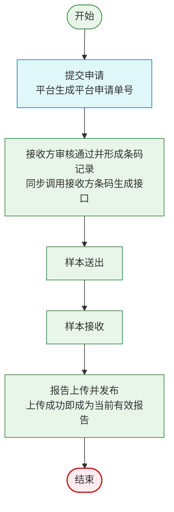
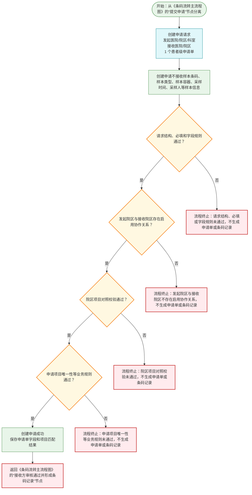
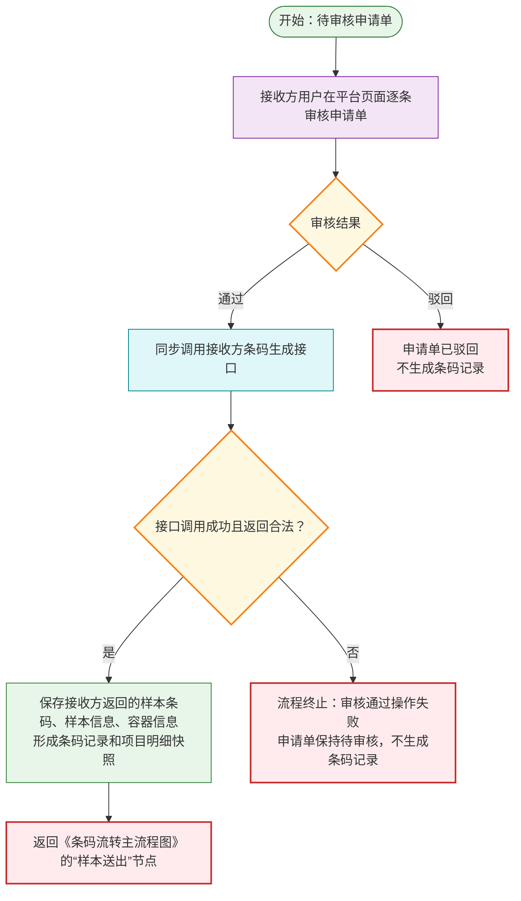
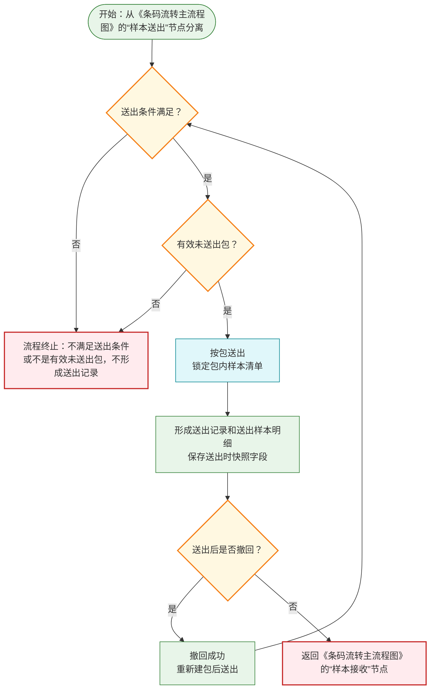
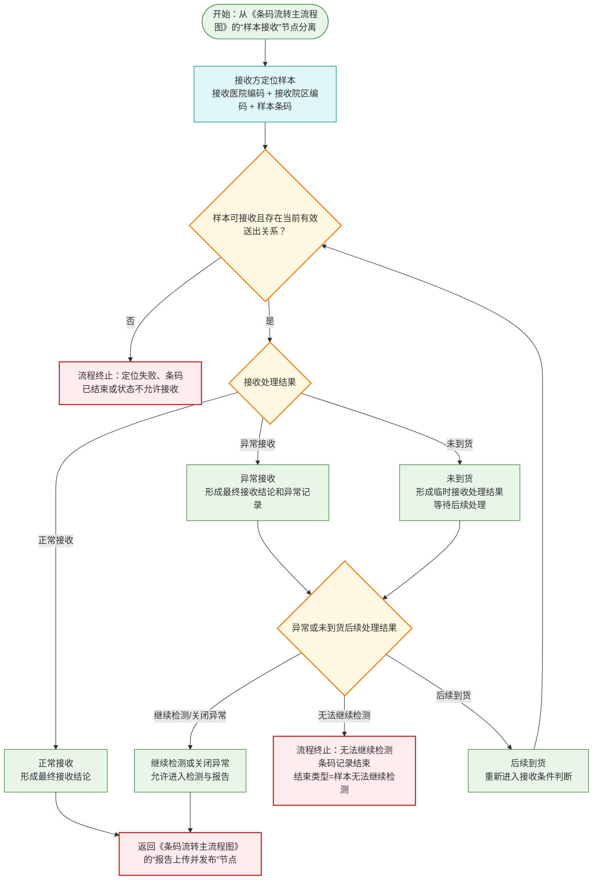
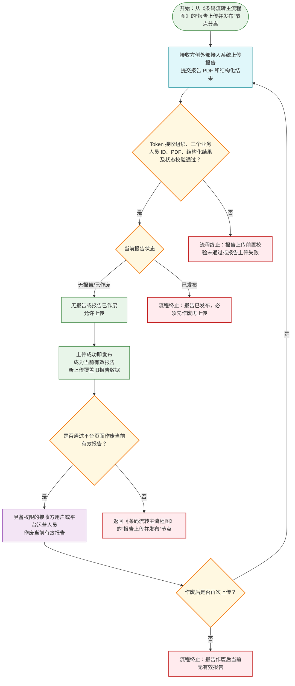
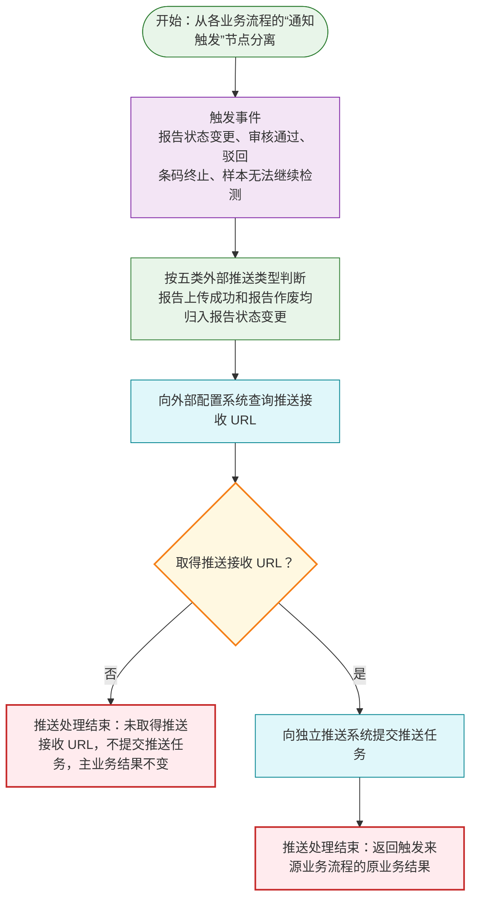
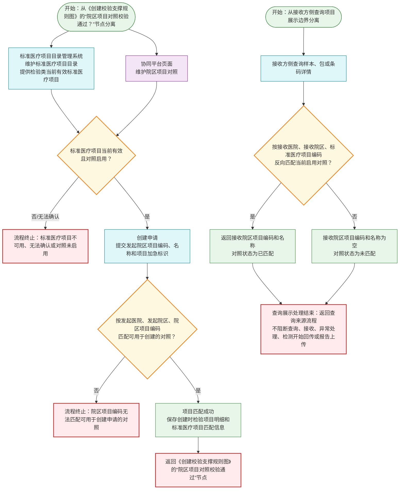

# 检验中心协同平台核心业务流程图（整合版）

> 对齐来源：需求规约 - 检验中心协同平台.md
>
> 历史参考：PRD_第七版修订稿
>
> 日期：2026-06-26
>
> 说明：本文档为《需求规约 - 检验中心协同平台》的流程图整合视图，用于配合需求规约正文阅读，不替代需求规约正文。流程图只表达业务口径、状态变化和关键边界，不展开接口路径、认证、签名、报文结构等技术细节。

---

## 条码流转主流程图

> 本图只表达所有成功的主干流程。创建失败、驳回、审核通过操作失败、送出失败、接收异常、报告上传失败、报告作废后无当前有效报告等分支全部在对应子流程中表达。

**《条码流转主流程图》说明：**

1. 主流程图只展示成功主干，不展示判断、失败、异常、等待处理或业务终止分支。
2. 提交申请节点包含发起方提交申请，以及平台校验通过后生成平台申请单号；创建申请成功不生成条码记录。
3. 创建申请不做业务幂等；同一发起方重复调用创建申请接口并成功时，平台生成新的平台申请单号。
4. 样本条码由接收方条码生成接口返回，平台不按规则生成样本条码。
5. 接收方审核通过并形成条码记录节点包含页面审核通过、同步调用接收方条码生成接口，以及保存样本条码、样本信息和容器信息；驳回不生成条码记录。
6. 样本条码在同一接收医院和同一接收院区内唯一。
7. 报告上传成功即发布；同一条码记录最多一份报告，新上传覆盖旧报告，不保留历史版本。

---

## 创建校验支撑规则图

> 本图从《条码流转主流程图》的“提交申请”节点分离，展开创建申请阶段的校验和创建边界。校验通过后返回《条码流转主流程图》的“接收方审核通过并形成条码记录”节点。

**《创建校验支撑规则图》说明：**

1. 创建申请按单个患者级申请单进行校验，成功或失败。
2. 校验失败时不生成申请单，也不创建任何条码记录。
3. 平台申请单号是对外业务号，可返回给发起方用于查询申请审核结果和已形成的条码清单。
4. 发起方申请单号用于业务对账、发起方侧查询和推送回传，不作为平台幂等键或唯一定位依据。
5. 院区项目对照校验的展开规则见《院区项目对照与项目识别规则边界图》。
6. 创建申请阶段不执行条码生成；样本信息、容器信息和样本条码在接收方审核通过操作同步调用接收方条码生成接口成功后保存。
7. 绿色通道信息仅包含是否绿色通道和绿色通道说明；绿色通道仅用于记录、展示和人工识别，不改变主流程，且与项目加急互不推导、互不覆盖。

---

## 接收方审核与条码记录形成子流程图

> 本图从《条码流转主流程图》的“接收方审核通过并形成条码记录”节点分离，展开审核、同步获取样本条码和条码记录形成边界。成功后返回《条码流转主流程图》的“样本送出”节点；接收方审核只通过平台页面完成，不提供接收方审核对外提交接口。

**《接收方审核与条码记录形成子流程图》说明：**

1. 审核对象是申请单，不是条码记录。
2. 驳回出口表示申请进入已驳回终态，不生成条码记录且不进入后续流转，不得再改为审核通过。
3. 审核通过操作中，平台同步调用接收方条码生成接口获取样本条码、样本信息和样本容器信息。
4. 只有同步调用接收方条码生成接口成功且返回合法后，才形成条码记录并使条码记录有效。
5. 接口调用失败、超时或返回内容不合法时，本次审核通过操作失败，申请单保持待审核，不生成条码记录。
6. 审核通过和驳回均可按外部推送规则触发对应通知；平台消息中心当前版本暂缓。

---

## 样本送出处理子流程图

> 本图从《条码流转主流程图》的“样本送出”节点分离。送出成功后返回《条码流转主流程图》的“样本接收”节点。

**《样本送出处理子流程图》说明：**

1. 只有已形成且有效的条码记录才能进入送出处理。
2. 待审核申请、驳回申请、已结束条码或不满足送出条件的样本不得送出；审核通过操作未成功形成条码记录时不得送出。
3. 样本送出必须基于有效未送出包，不提供按条码直接送出。
4. 一个包可包含 1 到 N 个样本条码；单个样本送出时，也应先创建仅包含该样本条码的包。
5. 样本条码列表只用于创建包、包内调整、撤回或接收定位，不作为送出接口入参；样本送出接口只接收包编码等送出信息。
6. 按包送出时，送出样本明细保存送出时快照字段；包送出后不再修改原包清单和原送出记录下的样本明细快照字段。
7. 送出撤回只适用于已送出未接收且满足撤回规则的样本；撤回后重新送出应重新创建有效包并按包送出。
8. 送出撤回仅按样本条码列表批量处理，不提供按包撤回接口；平台页面可从包详情或送出记录详情批量选择已送出未接收样本撤回，底层仍按样本条码列表执行。
9. 已接收、检测中、检测完成、已有报告或条码已结束后不可撤回，不提供取消接收接口。
10. 不提供补送能力，不提供补送接口，不维护补送标记或关联原包编码。
11. 漏送处理按当前 SRS 口径执行：原包未送出时可加入原包；原包已送出但样本未纳入原包或原送出记录时，不修改原包和原送出记录，应重新创建新包后按包送出；已纳入原送出记录但实物漏装且尚未接收时，先送出撤回，再重新创建新包后按包送出。

---

## 接收与异常处理子流程图

> 本图从《条码流转主流程图》的“样本接收”节点分离。正常接收或允许继续检测的异常接收后，返回《条码流转主流程图》的“报告上传并发布”节点。

**《接收与异常处理子流程图》说明：**

1. 接收方侧样本精确定位不要求提交发起医院编码和发起院区编码作为定位键；发起医院编码、发起院区编码如出现，仅作为筛选、返回或追溯字段。
2. 不能仅凭样本条码模糊匹配。
3. 正常接收和允许继续检测的异常接收，可进入检测与报告阶段。
4. 未到货不是最终接收结论；后续到货后可重新进入接收判断。
5. 条码已终止后到货归入接收条件失败拦截，不作为异常或未到货后续处理结果。
6. 异常处理结果仅为继续检测、无法继续检测、关闭异常；不把退回样本、样本损毁、运输丢失、无法检测作为独立处理结果。
7. 样本无法继续检测导致条码记录结束，结束类型为样本无法继续检测，后续检测开始、报告上传等动作应被阻断。
8. 接收后异常登记仅通过平台页面完成，不提供已接收后异常登记对外接口；接收方侧外部系统只通过异常处理结果提交接口提交处理结果。

---

## 报告生命周期子流程图

> 本图从《条码流转主流程图》的“报告上传并发布”节点分离。报告上传成功即发布并成为当前有效报告；报告作废只通过平台页面完成，不提供报告作废对外接口。

**《报告生命周期子流程图》说明：**

1. 报告上传仅支持接收方侧外部接入系统提交，平台页面不提供人工上传报告。
2. 报告上传成功即发布，并成为当前有效报告。
3. 上传请求不提交接收医院、接收院区；平台从可信 Token 获取接收组织、当前科室和操作人。检验人、实验室内部审核人、出报告人必须提交平台统一用户 ID，平台只保存 ID 并在查询时返回当前姓名。
4. Token 操作人只承担 `OperId` 审计语义，不自动充当出报告人。
5. 发起方下载当前有效 PDF 时以 Token 发起组织范围和 `ApplicationNo + SpecimenBarcode` 定位；不得通过请求组织参数切换调用方身份。
6. 同一条码记录最多一份报告；新上传报告直接覆盖旧报告，不保留历史版本。
7. 报告已发布时必须先通过平台页面作废当前有效报告，再上传报告覆盖；报告已作废时可直接上传覆盖。
8. 报告作废后发起方不能查询或下载已作废报告 PDF，只能按权限查看受限作废摘要或报告状态。
9. 危急值标记仅作为报告结构化结果展示标记，不触发平台危急值闭环。

---

## 外部推送边界图

> 本图从各业务流程的通知触发节点分离，表达业务动作发生后的外部推送旁路边界。外部推送不改变主业务状态；平台消息中心当前版本暂缓，不进入活动流程图。

**《外部推送边界图》说明：**

1. 外部推送类型为五类：报告状态变更、审核通过、驳回、条码终止、样本无法继续检测。
2. 报告上传成功并发布、当前有效报告作废，均触发报告状态变更，不拆成独立的发布类推送或作废类推送类型。
3. 当前版本外部推送对象仅为发起方侧外部接入系统，接收方不是外部推送对象。
4. 审核通过和驳回均为申请单级通知；一张申请单即使形成多条条码，审核通过也只通知一次，且不携带样本条码或条码清单。
5. 推送接收 URL 由申请方医院、院区组织范围内编码为 `hospital_push_address` 的系统参数维护；协同平台不提供推送接收 URL 配置页面、配置查询页面或配置维护接口。
6. 未取得推送接收 URL 时，不向推送系统提交该次推送任务，不影响主业务成功。
7. 平台消息中心、消息记录、已读未读和站内跳转当前版本暂缓，不属于本图或当前版本验收范围。

---

## 院区项目对照与项目识别规则边界图

> 本图包含两个并列入口：创建申请项目正向匹配入口从《创建校验支撑规则图》的“院区项目对照校验通过？”节点分离；接收方侧查询项目反向匹配入口从接收方侧查询项目展示边界分离。两个入口互不串联，标准医疗项目目录由标准医疗项目目录管理系统维护，协同平台只维护院区项目对照。

**《院区项目对照与项目识别规则边界图》说明：**

1. 协同平台维护院区项目对照；标准医疗项目目录由标准医疗项目目录管理系统维护。
2. 创建申请接口不接收标准医疗项目编码；平台按发起医院、发起院区和院区项目编码匹配可用于创建申请的院区项目对照。
3. 匹配失败时创建申请整体失败；匹配成功后保存创建时检验项目明细。
4. 接收方侧查询时，平台按接收医院、接收院区和标准医疗项目编码反向匹配接收院区项目编码和名称。
5. 接收方项目对照未匹配不阻断样本查询、样本接收、异常登记、异常处理、检测开始回传或报告上传。
6. 院区协作关系只通过平台页面维护，不提供对外维护接口。

---

## 整合说明

| 图名称 | 覆盖功能 | 定位 |
| --- | --- | --- |
| 条码流转主流程图 | 申请管理、样本送出、样本接收、检测与报告 | 主流程，只表达提交申请、接收方审核通过并形成条码记录、送出、接收、报告上传并发布的成功主干 |
| 创建校验支撑规则图 | 申请管理、院区协作关系、院区项目对照 | 规则边界图，从主流程提交申请节点分离，表达创建申请按单个申请单校验、成功或失败 |
| 接收方审核与条码记录形成子流程图 | 申请管理、接收方审核、外部条码生成接口边界 | 子流程，从主流程接收方审核通过并形成条码记录节点分离，表达页面审核、同步调用接收方条码生成接口和条码记录形成时机 |
| 样本送出处理子流程图 | 样本打包管理、样本送出管理 | 子流程，从主流程样本送出节点分离，表达按包送出、有效未送出包校验、送出记录形成和按样本条码列表撤回 |
| 接收与异常处理子流程图 | 样本接收管理、样本异常处理、样本状态管理 | 子流程，从主流程样本接收节点分离，表达接收方侧定位、正常接收、异常接收、未到货和无法继续检测 |
| 报告生命周期子流程图 | 报告管理、危急值管理边界 | 子流程，从主流程报告上传并发布节点分离，表达报告上传即发布、作废、覆盖模型和危急值展示边界 |
| 外部推送边界图 | 外部推送 | 通知边界图，从各业务通知触发节点分离，表达五类推送和推送 URL 外部配置边界；平台消息中心当前版本暂缓 |
| 院区项目对照与项目识别规则边界图 | 院区项目对照管理、标准医疗项目目录引用、院区协作关系管理 | 规则边界图，从创建校验支撑规则图的院区项目对照校验节点分离，表达项目正向匹配、接收方反向匹配和维护边界 |
