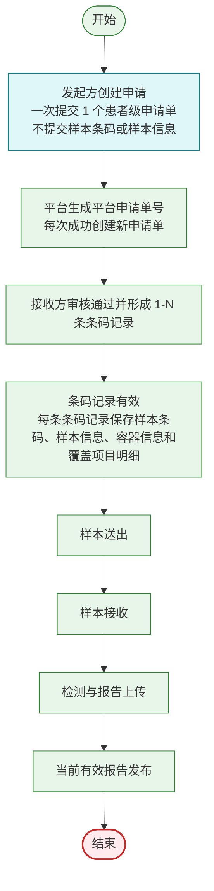
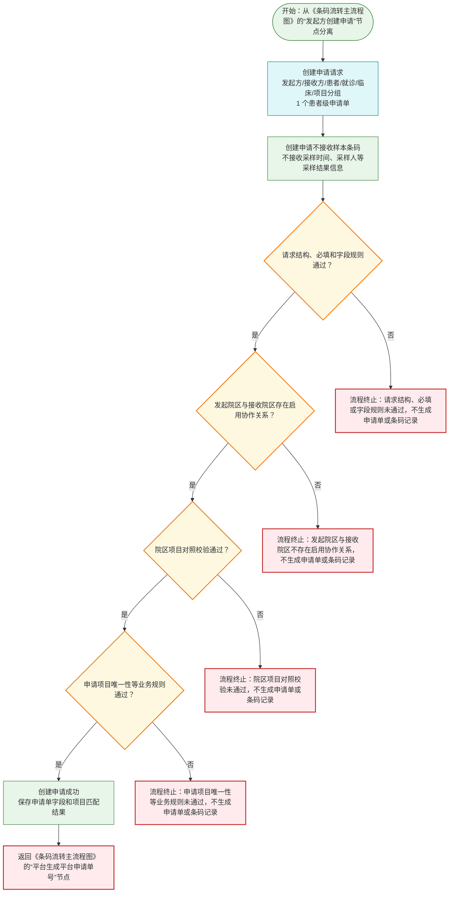
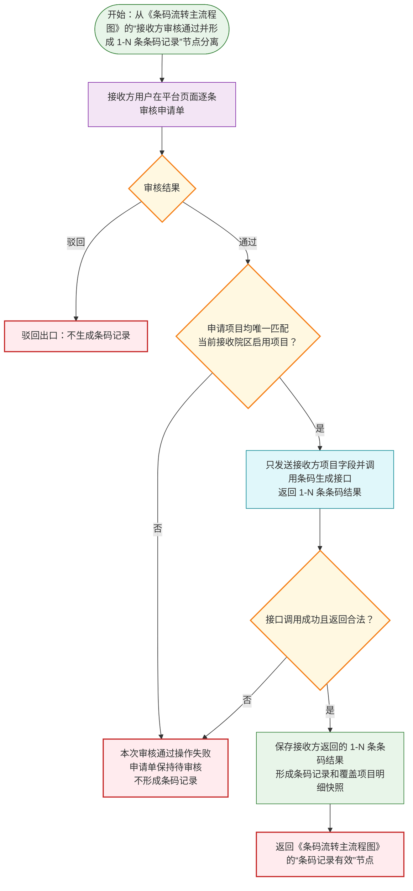
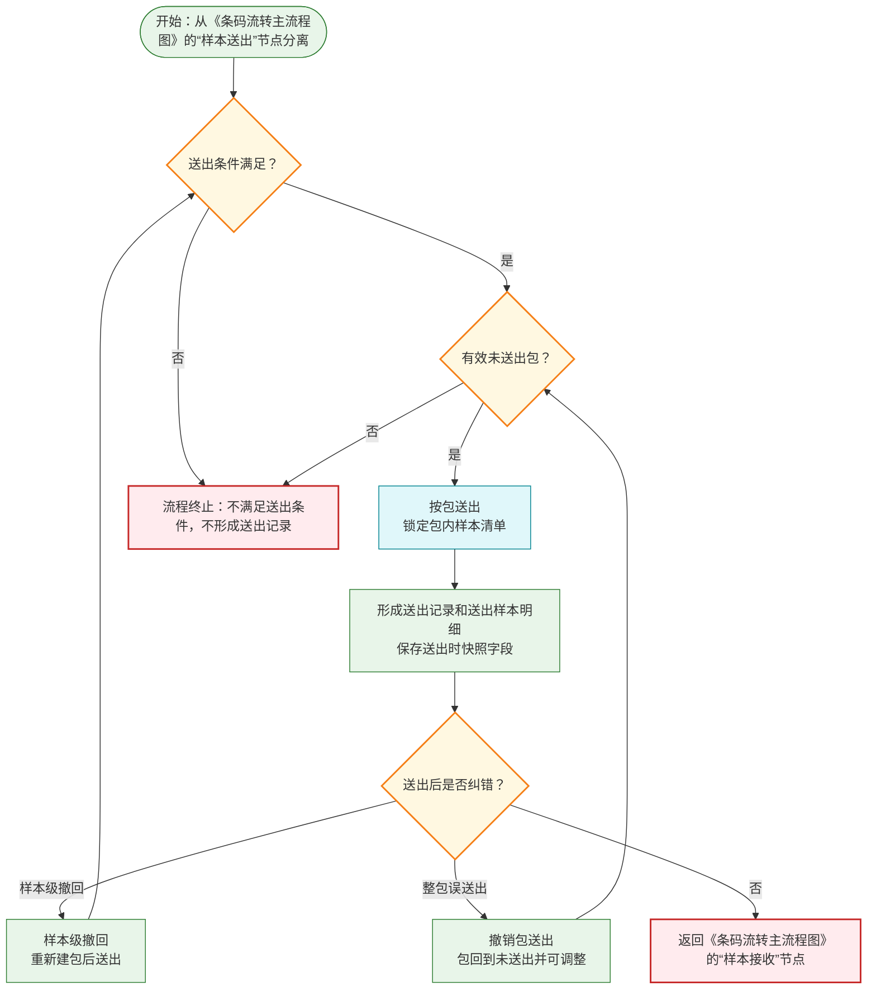
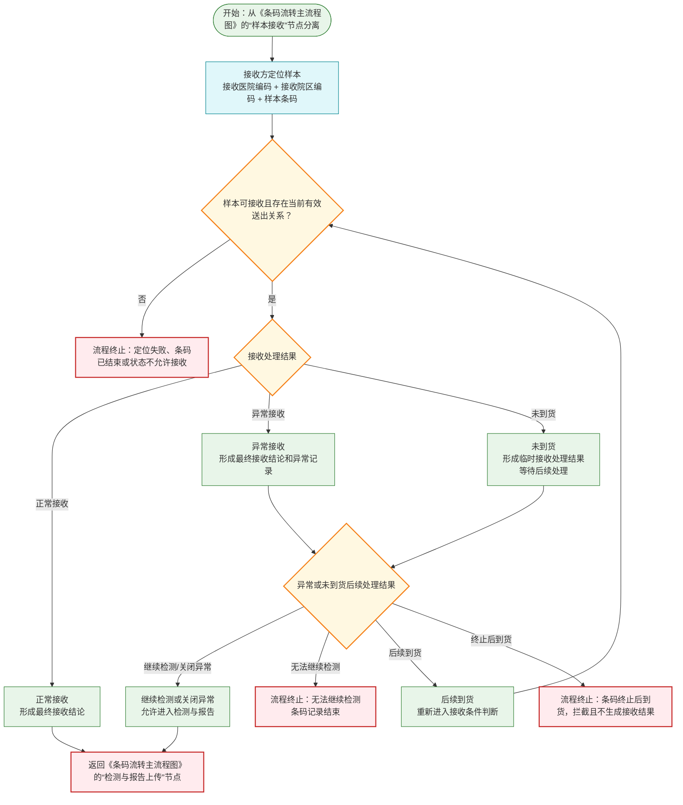
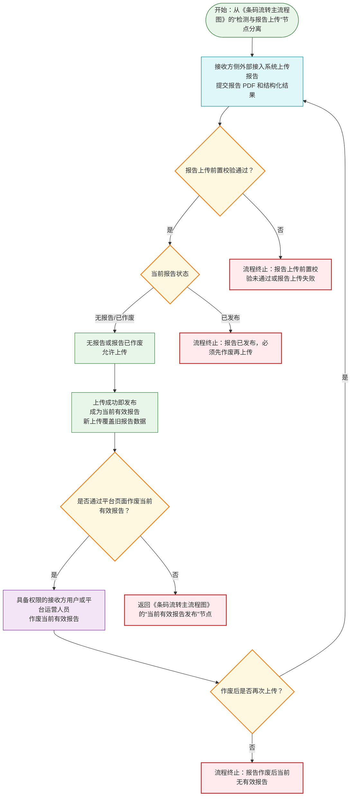
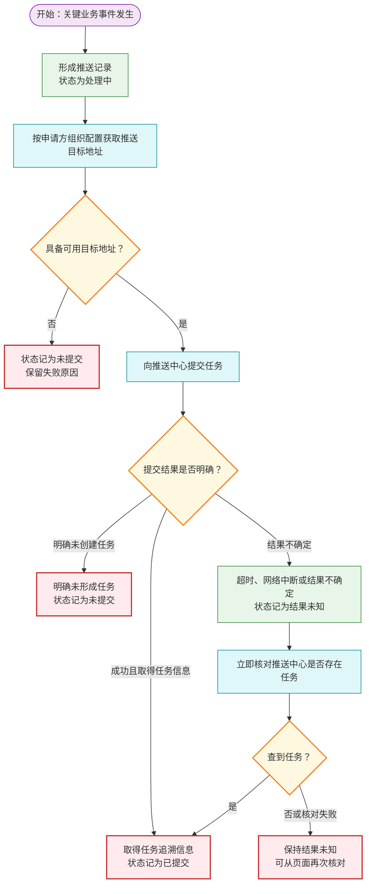
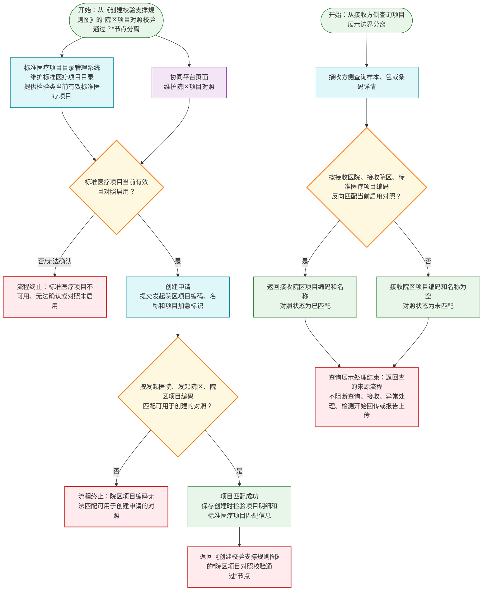

# 需求规约 - 检验中心协同平台

> 状态：评审通过
>
> 编写原则：本文档正文应完整表达当前版本已定义的业务规则、流程边界、状态变化、页面能力、接口能力和业务留痕；未在本文档中定义的内容，不纳入本版本需求。

## 1. 简介

### 1.1 目的

本文档用于定义检验中心协同平台当前版本的软件需求规约，作为设计、开发、测试和验收的业务依据。

本文档不替代接口设计文档、权限系统设计、隐私脱敏规范、非功能需求文档或技术方案。

### 1.2 项目背景

检验中心协同平台连接发起方与接收方，覆盖检验申请、样本流转、样本异常处理、报告发布、外部推送和业务追溯。

当前版本的核心架构为：

1. 平台申请单是患者级业务对象，一次创建申请接口调用只创建一张平台申请单。
2. 条码记录是样本容器或样本标本级业务流转核心实体。
3. 一个平台申请单可包含 1 到 N 条检验项目，接收方审核通过后可形成 1 到 N 条条码记录。
4. 发起方和接收方是申请单级字段；创建申请时，发起医院、发起院区、发起科室和发起医生由登录 token 的唯一组织与用户上下文确定，不由请求体提交；接收方精确到请求指定的接收医院和接收院区。实际接收科室在样本接收时记录其科室 ID。
5. 患者信息、就诊信息在创建申请时随申请单提交并保存，条码生成后随条码记录冗余保存用于流转追溯。申请项目明细属于申请单级完整项目清单；每条条码记录保存本条码覆盖的项目明细快照。样本条码、样本类型名称和容器名称由接收方条码生成接口返回，属于条码级字段。
6. 报告按条码记录管理，一条码记录最多对应一份报告，新上传覆盖旧报告。

### 1.3 范围

当前版本包含以下能力或明确边界：

| 编号 | 模块 | 范围 |
| --- | --- | --- |
| F01 | 申请管理 | 创建申请、申请取消、接收方审核、条码终止、申请查询、条码详情和流转追溯 |
| F02 | 样本打包管理 | 包创建、包调整、包作废、包查询和包追溯 |
| F03 | 样本送出管理 | 按包送出、撤销包送出、送出撤回和送出记录 |
| F04 | 样本接收管理 | 待接收查询、正常接收、异常接收、未到货和接收记录 |
| F05 | 样本状态管理 | 样本主状态定义、状态驱动规则和状态变化推导 |
| F06 | 样本异常处理 | 异常登记、异常处理结果、未到货后续处理和异常记录 |
| F07 | 报告管理 | 报告接口上传、上传成功即发布、报告作废和查询下载 |
| F08 | 危急值管理边界 | 明确危急值不属于平台闭环管理范围 |
| F09 | 外部推送与提交追溯 | 平台向发起方侧外部接入系统提交关键业务动作通知，并按权限查询提交记录 |
| F11 | 权限、隐私与追溯边界 | 统一权限接入、统一隐私规范边界和业务留痕边界 |
| F12 | 院区项目对照管理与标准医疗项目目录引用 | 协同平台维护院区项目对照，引用标准医疗项目目录管理系统提供的标准医疗项目目录 |
| F13 | 院区协作关系管理 | 发起院区与接收院区业务协作关系白名单管理 |
| F14 | 样本条码规则管理 | 样本条码由接收方系统生成，平台不维护生成规则 |
| I01-I06 | 外部接入系统调用接口汇总 | 当前版本对外主动调用接口清单和字段边界 |

F10 平台消息中心为后续规划能力，当前版本暂缓，不属于上述交付、测试或验收范围。本文保留 F10 章节仅用于明确暂缓边界，不构成当前版本功能需求。

### 1.4 总体边界

1. 平台不生成样本条码，不打印样本条码。平台在接收方审核通过操作成功时同步调用接收方条码生成接口获取 1 到 N 条条码结果。
2. 平台不提供页面人工补录申请；此处“补录申请”指人工创建或补录检验申请单，不包含已送出包补录样本纠错。
3. 平台不提供页面人工上传报告，不出具报告。
4. 平台不提供报告审核能力、报告审核开关、报告发布审核、平台报告审核记录、审核结果通知或审核结果查询。
5. 平台不建设危急值闭环管理能力。
6. 平台不建设独立待办中心。
7. 平台消息中心、已读未读和站内消息跳转暂缓，当前版本不建设消息中心或任务处理流。
8. 平台不定义权限系统技术角色模型、授权流程、组织范围或数据范围配置。
9. 平台不定义具体患者隐私脱敏规则。
10. 平台不定义接口结构、安全控制、机构身份识别实现和非功能技术方案。

## 2. 术语

| 术语 | 定义 |
| --- | --- |
| 平台申请单 | 患者级业务对象，一个患者一次送检申请对应一张申请单。申请单承载发起方、接收方、患者信息、就诊信息、申请项目明细、备注、取消信息和审核结果。申请单状态覆盖审核阶段及审核前取消结果：待审核、已驳回、审核通过、已取消。平台申请单号是对外业务号，可返回给发起方，用于查询申请审核结果和已形成的条码清单；一张平台申请单审核通过后可形成 1 到 N 条条码记录。 |
| 条码记录 | 接收方审核通过操作同步调用接收方条码生成接口成功后形成的样本容器或样本标本级流转实体。每条条码记录绑定接收方返回的样本条码、样本类型名称、容器名称和本条码覆盖的申请项目明细快照；同一申请单下的多条条码记录共同承载该申请单的检验项目流转。送出、接收、检测、报告、异常和追溯以条码记录为核心。 |
| 平台内部标识 | 平台内部生成、仅用于平台内部对象关联的受控定位标识，不作为对外接口入参或出参。 |
| 推送业务号 | 平台按推送类型选择可供运维定位来源业务的数据编码：审核通过、驳回使用平台申请单号，条码终止、样本无法继续检测使用样本条码，报告状态变更使用 `平台申请单号:样本条码:报告状态:变更时间` 组合标识。组合标识是追溯编码，不应被误认为可直接作为单一业务字段查询。 |
| 样本条码 | 接收方审核通过操作成功时，由接收方条码生成接口生成并返回的条码号。样本条码用于发起方采样贴管、样本送出、接收方接收、检测、报告上传、查询、推送和业务追溯；同一样本条码在同一接收医院和接收院区内唯一。 |
| 发起方申请单号 | 发起方提交患者级申请单时可选传入的本方业务单号，属于申请单级字段，用于业务对账、发起方侧查询和推送回传；不作为平台幂等键或唯一定位依据。 |
| 条码状态 | 表示条码记录是否可继续流转，包括有效、已结束。条码状态不存在待审核状态（待审核是申请单状态，不是条码状态）。 |
| 结束类型 | 条码记录进入已结束后的结束原因，包括发起方终止、样本无法继续检测。 |
| 流转记录摘要 | 条码详情中按权限展示的必要业务记录摘要，用于辅助追溯创建、审核、终止、送出、接收、异常和报告等关键动作，不作为独立业务模型。 |
| 绿色通道 | 发起方随申请单提交的特殊业务识别信息，条码生成后随条码记录用于展示和核对，只作为人工识别和业务核对参考，不改变平台主流程。 |
| 终止类型 | 系统根据终止发生时样本所处阶段自动判定的终止分类，值域包括未送出终止、送出后终止。 |
| 样本主状态 | 表示样本在主流程中的位置，包括待送出、已送出、已接收、检测中、检测完成。 |
| 包编码 | 平台创建包时生成的全平台唯一、人可读包业务编码，用于页面展示、对外接口定位、按包送出、包调整、包作废、包查询和包接收。包编码可以打印为二维码或条形码贴在线下转运袋、转运盒、冷链箱等实体包装上，供接收方扫码查询包详情和提交包级接收清点结果。包编码不能使用 GUID，不是平台内部数据库主键。 |
| 报告 | 同一条码记录下的报告。一条条码记录最多有一份报告；新上传报告直接覆盖旧报告，不保留历史版本。报告不存在时允许首次上传；报告已发布时须先作废再上传；报告已作废时可直接上传覆盖。 |
| 标准医疗项目编码 | 标准医疗项目目录管理系统维护的标准医疗项目唯一编码。协同平台通过本平台维护的院区项目对照关系，将发起方提交的院区项目编码匹配为标准医疗项目编码。 |
| 当前有效报告 | 当前对发起方可查询、下载，并可触发报告状态变更推送消息的报告，必须为已发布且未被作废。 |
| 院区项目对照 | 协同平台维护的院区本地项目与标准医疗项目之间的对应关系。创建申请时用于发起院区项目正向匹配；接收方查询时用于按标准医疗项目反向匹配接收院区项目编码和名称。 |
| 外部推送 | 平台主动向发起方侧外部接入系统发送的业务通知，不等同于外部接入系统主动调用平台接口。 |
| 平台消息 | 规划中面向平台用户的站内提醒能力；当前版本暂不交付消息列表、已读未读或站内跳转。 |
| 申请单 | 患者级业务对象，一个患者一次送检申请对应一张申请单。申请单承载发起方、接收方、患者信息、就诊信息、申请项目明细、备注、取消信息和审核结果。 |
| 申请审核 | 接收方在条码记录形成前确认是否承接申请单对应检验项目的业务动作，用于控制检测容量、材料、试剂、耗材和设备资源。审核通过操作同步调用接收方条码生成接口，成功后可形成 1 到 N 条条码记录。审核按申请单整体执行。 |
| 申请取消 | 发起方在申请单仍处于待审核且尚未形成条码记录时，撤销本次送检申请的业务动作。申请取消按申请单整体执行，成功后申请单状态为已取消，不生成条码记录，不进入审核、送出、接收、检测或报告流程。 |

## 3. 整体业务规则

1. 平台受理一次创建申请接口调用后生成一张患者级申请单。条码记录是样本容器或样本标本级业务流转核心实体。
2. 申请单状态覆盖审核阶段及审核前取消结果；审核通过操作成功并形成 1 到 N 条条码记录后的流转以条码记录状态为准。
3. 申请单按整体审核，申请取消也按申请单整体执行；条码记录形成后按条码记录独立终止、独立流转、独立报告。
4. 条码记录结束后，后续打包、送出、接收、检测开始、报告上传、异常处理等动作均应被阻断。
5. 样本主状态只表达样本主流程位置，不表达条码结束、异常、报告作废、撤回或其他标签。
6. 平台内部标识不得作为对外接口入参、出参或外部推送字段。
7. 发起方和接收方均为申请单级字段；平台申请单号和发起方申请单号在申请单创建后不可修改。
8. 样本归属的申请单和样本条码在条码记录形成后不可修改；样本条码用于接收方侧识别和业务定位，也可按具体接口作为发起方侧后续业务定位字段。
9. 包清单形成、样本送出、样本接收和异常发现时保存的业务编号及摘要属于当时事实快照，后续主数据变化不得覆盖历史事实。
10. 一个样本包可以包含多个申请单的样本，包级送出记录和接收记录不得展示或保存由其中某一个样本代表的单一申请归属；申请归属应在逐样本明细中表达。
11. 平台不提供申请单或样本条码的通用物理删除能力；申请停止使用正式的申请取消、样本终止及既有业务纠错动作，并保留可追溯记录。
12. 业务留痕、申请单审核信息、送出记录、接收记录、异常记录、报告记录和推送记录应按权限可追溯。
13. 协同平台维护院区项目对照；标准医疗项目目录管理系统仅维护标准医疗项目目录，不维护院区项目对照。
14. 创建申请时，平台按发起医院编码、发起院区编码和院区项目编码正向匹配标准医疗项目编码；接收方侧查询时，平台按接收医院编码、接收院区编码和标准医疗项目编码反向匹配接收院区项目编码和名称。
15. 发起方侧外部接入系统可在创建申请前查询 Token 当前组织在启用协作关系下的项目目录和双方项目对照状态。只有发起方项目唯一启用且标准项目当前有效、接收方同一标准项目唯一启用且项目编码和名称完整的结果可作为第三方创建申请的可执行项目数据。

## 条码流转主流程图

> 本图只表达所有成功的主干流程。创建失败、驳回、审核通过操作失败、送出失败、接收异常、报告上传失败、报告作废后无当前有效报告等分支全部在对应子流程中表达。

**《条码流转主流程图》说明：**

1. 主流程图只展示成功主干，不展示判断、失败、异常、等待处理或业务终止分支。
2. 创建申请成功只生成平台申请单号，不生成条码记录。
3. 创建申请不做业务幂等；同一发起方重复调用创建申请接口并成功时，平台生成新的平台申请单号。
4. 样本条码由接收方条码生成接口返回，平台不按规则生成样本条码。
5. 条码记录在接收方审核通过操作同步调用接收方条码生成接口成功后形成；一次审核通过可形成 1 到 N 条条码记录，驳回不生成条码记录。
6. 样本条码在同一接收医院和同一接收院区内唯一。
7. 报告上传成功即发布；同一条码记录最多一份报告，新上传覆盖旧报告，不保留历史版本。

---

## 4. 具体需求

### F01 申请管理

#### 功能定位

申请管理用于接收发起机构通过平台对外接口提交的检验申请，生成申请单，并建立申请、条码、患者、就诊、项目、接收方、费用、绿色通道、接收方审核结果和业务追溯之间的关系。条码记录在接收方审核通过操作同步调用接收方条码生成接口成功后形成。

#### 参与者与入口

| 参与者 | 入口 | 能力 |
| --- | --- | --- |
| 发起机构侧外部接入系统 | 创建申请接口、取消申请接口 | 提交 1 个患者级申请单；取消本发起方仍处于待审核且未形成条码记录的申请单 |
| 发起机构用户 | 平台页面 | 查询申请、查看条码详情、取消允许阶段的申请、发起允许阶段的条码终止 |
| 接收方用户 | 平台页面 | 查看申请、执行接收方审核、查看条码详情 |
| 平台运营人员 | 平台页面 | 按权限查询和追溯 |

平台页面不提供正常业务下的人工补录申请入口；此处指人工创建或补录检验申请单，不影响已送出包补录样本纠错能力。

#### 业务规则

1. 一次创建申请只能提交 1 个患者级申请单；申请单内可包含 1 到 N 条检验项目。
2. 创建申请按单个申请单进行校验，成功或失败。
3. 申请单不满足必填、唯一性、项目对照、院区协作关系等规则时，不生成申请单，也不创建任何条码记录。
4. 创建成功后，平台生成平台申请单号，并为申请单生成平台内部标识；平台申请单号是对外业务号，可返回给发起方；平台内部标识仅平台内部使用，不作为对外接口入参或出参。
5. 平台不生成样本条码，不打印样本条码。
6. 条码记录不在创建申请时生成。创建申请成功后，申请单进入待审核状态；接收方执行审核通过操作时，平台同步调用接收方条码生成接口获取 1 到 N 条条码结果，并据此生成 1 到 N 条条码记录。每条条码结果对应一个样本容器或样本标本，包含样本条码、样本类型名称、容器名称和本条码覆盖的申请项目明细。只有接收方条码生成接口成功返回且平台形成条码记录后，审核通过操作才成立；接口调用失败、超时、返回空结果或返回内容不合法时，本次审核通过操作失败，申请单保持待审核，不生成条码记录。
7. 平台不自行按项目、样本类型或容器规则推导条码拆分；同一申请单下项目拆分为几条条码记录，以接收方条码生成接口返回的条码结果为准。
8. 条码生成接口返回的条码结果不得为空；每条条码结果必须能回溯到当前申请单的申请项目明细，且同一申请单内每个申请项目至少被一条条码结果覆盖。
9. 条码生成接口返回空结果、样本条码缺失、样本条码重复、样本类型名称缺失、容器名称缺失、覆盖项目无法回溯到当前申请单项目明细或覆盖项目关系不合法时，本次审核通过操作失败，申请单保持待审核，不生成条码记录。
10. 同一接收医院、同一接收院区内，同一样本条码不得重复绑定不同条码记录。
11. 条码记录结束后，原样本条码和已生成的样本条码均不得释放或复用。
12. 不同接收医院或不同接收院区允许存在相同样本条码。
13. 发起方申请单号用于业务对账、发起方侧查询和推送回传；不作为平台幂等键或唯一定位依据。
14. 创建申请时，平台应校验发起院区与接收院区存在启用协作关系。
15. 创建申请时，平台按本平台维护的院区项目对照关系，将发起方提交的院区项目编码匹配为标准医疗项目编码并保存创建时完整检验项目明细。
16. 项目费用字段仅用于记录、展示、查询和统计，不阻断主流程；绿色通道仅用于记录、展示和人工识别，不改变主流程；项目加急影响项目清单排序、展示和人工识别。
17. 发起方可在申请单仍处于待审核且尚未形成条码记录时取消申请；取消申请按申请单整体执行，不支持只取消申请单内部分检验项目。
18. 取消申请成功后，申请单状态变为已取消，不生成条码记录，不允许接收方再执行审核通过或驳回，不进入送出、接收、检测、报告上传或报告推送流程。
19. 取消申请应记录取消原因、取消说明、取消时间和取消发起方；取消原因当前值域与条码终止原因一致，包括申请信息错误、患者信息变更、不再需要检测、重复申请、费用或结算原因、其他；取消原因=其他时取消说明必填。
20. 审核通过并形成 1 到 N 条条码记录后，不再允许申请单级取消；后续需要停止流转时，应按条码记录执行条码终止、样本异常处理或样本无法继续检测等后续流程。
21. 驳回后的申请单为终态，不再执行取消申请、审核通过或其他审核纠正；如需继续送检，发起方应重新创建申请。

#### 创建申请患者级申请单结构

本节用于说明创建申请请求中患者级申请单的结构关系和字段来源，字段详细口径复用 I03 接口字段级规则，不替代接口设计文档。

| 层级 | 结构 | 来源/归属 | 说明 |
| --- | --- | --- | --- |
| 创建申请请求 | 对象 | 外部提交 | 按接收方、患者信息、就诊信息、临床信息和申请项目明细提交单个患者级申请单信息；发起身份来自 token |
| 申请单 | 对象 | 外部提交，平台处理后保存 | 对应一个患者一次送检申请，申请单按整体审核 |
| 发起方 | 认证上下文 | token 解析，平台保存 | 发起医院、发起院区、发起科室和发起医生由 token 唯一确定；请求仅可提交发起方申请单号，不提交发起组织、科室、医生或组织名称 |
| 发起方申请单号 | 字段 | 外部提交，可选 | 位于发起方对象内，属于发起方业务单号，用于业务对账、发起方侧查询和推送回传；不作为平台幂等键或唯一定位依据 |
| 接收方 | 对象 | 外部提交 | 仅提交接收医院编码和接收院区编码；不要求提交接收医院或接收院区名称 |
| 患者信息 | 对象 | 外部提交 | 字段口径复用 I03 的患者信息 |
| 就诊信息 | 对象 | 外部提交 | 字段口径复用 I03 的就诊信息 |
| 临床信息 | 对象 | 外部提交，可选 | 字段口径复用 I03 的临床信息 |
| 申请项目明细 | 数组 | 外部提交，平台匹配后保存 | 每个检验项目项由发起方提交发起院区项目编码和项目加急标识；平台按院区项目对照补齐发起项目名称并保存标准医疗项目匹配信息 |
| 绿色通道信息 | 字段组 | 外部提交，可选 | 归入就诊信息，仅包含是否绿色通道和绿色通道说明 |
| 备注 | 字段 | 外部提交 | 申请单级备注，如有则随申请单保存 |
| 条码结果列表 | 数组 | 接收方系统生成，平台处理后保存 | 不属于创建申请入参；仅在审核通过操作由后端同步调用接收方条码生成接口成功后返回。每个条码结果对应一条条码记录，包含样本条码、样本类型名称、容器名称和本条码覆盖的申请项目明细 |
| 标准医疗项目编码、标准医疗项目名称、标准医疗项目分类名称、标准医疗项目分组名称 | 字段 | 平台匹配后保存 | 不属于创建申请入参；由平台按院区项目对照和标准医疗项目目录匹配后保存到创建时检验项目明细 |
| 接收院区项目编码、接收院区项目名称、接收方项目对照状态 | 字段 | 查询时返回 | 不属于创建申请入参，也不是创建时保存字段；接收方侧查询时按当前启用院区项目对照反向匹配返回 |

创建申请患者级申请单结构规则：

1. 创建申请请求包含单个患者级申请单信息，不接收患者级申请项列表或多人批量申请列表。
2. 申请单请求体包含接收方、发起方申请单号、患者信息、就诊信息、临床信息、申请项目明细和备注等结构；发起医院、发起院区、发起科室和发起医生来自 token，各字段必填口径以 I03 接口字段级规则和本节关键属性为准。
3. 申请项目明细是申请单下的完整项目清单数组，每个检验项目项至少包含发起院区项目编码和项目加急标识；发起项目名称由平台项目对照补齐。
4. 费用字段属于检验项目项内部字段，不得在申请单下建模为独立费用对象或独立费用列表。
5. 阶段 3 费用字段为非必填字段；如外部提交则随检验项目项保存。费用字段仅用于记录、展示、查询和统计，不参与审核、送出、接收、检测、报告上传等业务流转判断。
6. 创建申请接口不接收样本信息（样本信息由审核通过操作同步调用接收方条码生成接口成功后返回）；不接收标准医疗项目编码、标准医疗项目名称、标准医疗项目分类名称或标准医疗项目分组名称。
7. 创建申请接口不接收样本条码。
8. 接收院区项目编码、接收院区项目名称和接收方项目对照状态属于接收方侧查询返回口径，不属于创建申请入参。

## 创建校验支撑规则图

> 本图从《条码流转主流程图》的“发起方创建申请”节点分离，展开创建申请阶段的校验和创建边界。校验通过后返回《条码流转主流程图》的“平台生成平台申请单号”节点。

**《创建校验支撑规则图》说明：**

1. 创建申请按单个申请单进行校验，成功或失败。
2. 校验失败时不生成申请单，也不创建任何条码记录。
3. 平台申请单号是对外业务号，可返回给发起方用于查询申请审核状态和已形成的条码清单。
4. 发起方申请单号用于业务对账、发起方侧查询和推送回传，不作为平台幂等键或唯一定位依据。
5. 院区项目对照校验的展开规则见《院区项目对照与项目识别规则边界图》。
6. 创建申请阶段不执行条码生成；样本条码、样本类型名称、容器名称和条码覆盖项目明细在审核通过操作由后端同步调用接收方条码生成接口成功后按每条条码记录保存。

---

#### 重复提交与创建信息锁定

1. 创建申请不做业务幂等。每次创建申请成功，平台都生成新的平台申请单号。
2. 发起方重复调用创建申请接口时，平台会创建新的申请单；是否属于重复申请由发起方或人工业务流程处理。
3. 发起方申请单号为患者级申请单可选字段，用于业务对账、发起方侧查询和推送回传；不作为平台创建申请幂等键或唯一定位依据。
4. 发起方未提交发起方申请单号时，不阻断创建申请。
5. 创建申请接口不支持一次提交多个患者级申请单；发起方如需提交多人申请，应按患者逐次调用创建申请接口。
6. 创建申请接口不接收样本条码、采样量、采样要求、采样时间或采样人等采样结果信息；样本条码、样本类型名称和容器名称由审核通过操作后端同步调用接收方条码生成接口成功后返回。
7. 创建申请成功后，平台保存创建时提交的申请单字段和项目匹配结果；平台申请单创建后不提供核心业务字段修改入口。
8. 条码记录不在创建申请时形成；审核通过操作同步调用接收方条码生成接口成功后，平台依据接收方条码生成接口返回的 1 到 N 条条码结果形成 1 到 N 条条码记录。

#### 申请取消

1. 申请取消用于发起方在接收方审核前撤销本次患者级申请单。
2. 申请取消支持平台页面发起，也支持发起方侧外部接入系统通过对外接口发起。
3. 取消申请接口只提交平台申请单号和取消业务信息，不提交发起医院、发起院区等调用方身份字段。平台按有效 token 中绑定的 `HosId`、`BranchId` 解析当前发起医院和发起院区，并校验平台申请单号对应申请属于当前发起方；不使用平台内部标识，发起方申请单号也不作为取消申请定位字段。
4. 仅待审核且尚未形成条码记录的申请单允许取消；已取消、驳回、审核通过或已形成任一条码记录的申请单不得再次取消。
5. 取消申请按整张申请单生效，不支持项目级取消、部分项目撤回或部分项目终止。
6. 取消成功后，申请单状态为已取消；接收方审核列表可按权限查看该申请单，但审核通过和驳回操作均应被阻断。
7. 取消申请不触发审核通过、驳回、条码终止、样本无法继续检测或报告状态变更外部推送；接收方页面通过申请状态识别已取消申请。
8. 取消申请不可恢复为待审核；发起方如需重新送检，应重新调用创建申请接口形成新的平台申请单号。

#### 接收方审核

1. 接收方审核用于接收方在样本送出前确认是否承接本申请单对应的检验项目。
2. 接收方审核按申请单整体逐条执行审核通过或驳回；审核属于严谨业务操作，不支持批量审核。
3. 所有创建成功且未被发起方取消的申请单均进入待审核状态，由接收方通过平台页面执行审核通过或驳回。
4. 申请单创建成功后申请单状态为待审核；待审核申请不得打包或送出。
5. 接收方执行审核通过操作时，平台使用申请创建时保存的标准医疗项目快照，一次查询当前接收医院、接收院区的启用院区项目对照；每个申请项目必须唯一匹配编码和名称均完整的接收院区项目。任一项目无匹配、多匹配或接收方项目编码、名称为空时，审核通过操作在调用接收方条码生成接口前失败，申请单保持待审核。
6. 接收方项目全部唯一匹配后，平台后端同步调用接收方条码生成接口获取 1 到 N 条条码结果，审核页面和审核接口不提交条码结果；出站项目只包含接收院区项目编码、名称和加急标识，不发送发起院区项目或标准医疗项目编码、名称。平台据此生成 1 到 N 条条码记录，每条条码记录形成后条码状态为有效。
7. 接收方条码生成接口调用失败、超时、返回空结果或返回内容不合法时，本次审核通过操作失败，申请单保持待审核，不记录为审核通过，不生成条码记录，不触发审核通过外部推送；接收方可稍后重新执行审核通过或改为驳回。条码结果以接收院区项目编码表达覆盖关系，未知项目、重复覆盖或覆盖不完整均属于返回内容不合法。
8. 驳回后，申请单状态变为已驳回，不生成条码记录，不允许再改为审核通过，也不进入送出、接收、检测、报告上传或报告推送流程。
9. 审核通过和驳回均应记录当前审核结果、审核人和审核时间。审核通过的审核备注可选；驳回时审核备注必填，页面展示名称为“驳回备注”。申请审核信息直接归属申请单字段，不建设独立审核记录表或追加说明记录。
10. 驳回只使用审核备注记录驳回说明，不设置独立驳回原因字段。
11. 审核通过操作成功或驳回时，均按 F09 触发外部推送处理。
12. 接收方具备接收方审核权限的用户可通过接收方审核列表查看提交给本接收方的申请单；列表支持按平台申请单号归组展示，支持按待审核、审核通过、已驳回、已取消筛选。
13. 申请单创建后进入待审核时不触发外部推送；待审核申请通过审核列表处理。
14. 已驳回申请不得再次执行审核通过或驳回；发起方如需继续送检，应重新创建申请。
15. 审核通过操作一旦成功并形成 1 到 N 条条码记录，不允许再将审核结果改为驳回；后续承接变化应走条码终止、样本异常处理或样本无法继续检测等后续流程。
16. 已取消申请不得执行审核通过或驳回。
17. 当前版本不提供接收方审核对外提交接口，接收方只能通过平台页面完成接收方审核。

## 接收方审核与条码记录形成子流程图

> 本图从《条码流转主流程图》的“接收方审核通过并形成 1-N 条条码记录”节点分离。成功后返回《条码流转主流程图》的“条码记录有效”节点；接收方审核只通过平台页面完成，不提供接收方审核对外提交接口。

**《接收方审核与条码记录形成子流程图》说明：**

1. 审核对象是申请单，不是条码记录。
2. 驳回出口表示申请进入已驳回终态，不生成条码记录且不进入后续流转；不得再执行审核通过。
3. 审核通过操作中，平台先以创建时保存的标准项目快照一次匹配当前接收院区启用项目；匹配不唯一或编码、名称不完整时不调用第三方接口。
4. 第三方请求项目只包含接收院区项目编码、名称和加急标识；患者证件号码允许为空，且患者敏感字段和完整请求不得进入普通日志或测试证据。
5. 每条条码结果对应一个样本容器或样本标本，必须包含样本条码、样本类型名称、容器名称和本条码覆盖的接收院区项目编码；条码生成结果不包含采样时间和采样人。
6. 只有审核通过操作同步调用接收方条码生成接口成功，且返回的 1 到 N 条条码结果全部合法并完整覆盖本次接收方项目后，才形成 1 到 N 条条码记录并使条码记录有效。
7. 审核通过形成多条条码记录时，后续送出、接收、检测、报告和异常处理均按各条码记录独立流转。
8. 审核通过和驳回均按外部推送规则触发对应通知。

---

#### 条码终止

1. 条码终止由发起机构在样本未接收前发起。
2. 样本已送出但未接收时仍属于允许终止阶段；未到货异常待处理期间仍按已送出未接收处理，发起机构可发起条码终止。
3. 条码终止按条码记录逐条生效，可批量操作但应逐条校验、逐条记录结果。
4. 不支持条码记录内项目级部分终止。
5. 样本已接收、检测中、检测完成或已有报告后，不允许发起机构单方终止。
6. 终止成功后，条码状态变为已结束，结束类型为发起方终止。
7. 已送出未接收样本终止后，不回到待送出，不允许后续接收；接收方后续扫码接收时应按已结束拦截。
8. 未到货异常待处理期间发生条码终止时，平台应在条码终止生效的同一事务内关闭原未到货异常记录，处理结果为关闭异常，处理原因为条码已终止；该处理原因仅由平台内部联动产生，不作为外部异常处理接口可提交原因。
9. 条码终止联动关闭未到货异常仅表示条码结束后的业务归档，不表示实物问题已解决，不要求额外处理说明。
10. 终止后，后续打包、送出、接收、检测、报告上传和异常处理均应被阻断。
11. 终止类型由系统根据终止发生时样本所处阶段自动判定，值域包括未送出终止、送出后终止，不由发起机构选择，直接存储在条码记录上。
12. 终止原因由发起机构从预置枚举选择，当前值域包括申请信息错误、患者信息变更、不再需要检测、重复申请、费用或结算原因、其他；选择其他时必须填写终止说明，直接存储在条码记录上。
13. 条码终止时必须在条码记录上记录终止说明、终止时间、终止发起方、终止时样本主状态和终止时报告状态摘要，不建立独立的终止记录表。
14. 平台页面触发条码终止时，应提示终止影响，包括条码记录结束、原样本条码不可复用、后续业务动作被阻断、后续到货或接收将被拦截。
15. 条码记录结束后不可恢复为有效；接收方不能代替发起机构发起条码终止，当前版本不提供平台运营人员代发起机构发起条码终止的默认业务入口。
16. 条码终止生效后按 F09 触发外部推送处理。

#### 查询与详情展示

1. 申请列表和申请详情仅通过平台页面提供，当前版本不提供申请列表、条码列表或申请详情对外接口。
2. 申请列表应支持按平台申请单号、发起方申请单号、发起方、接收方、申请状态、审核结果、条码状态等条件查询或展示；具体控件形态由页面设计确定，但不得减少本条定义的查询或展示能力。
3. 条码记录查询应支持按样本条码、发起方申请单号、发起方、接收方、条码状态、样本主状态、报告状态等业务条件查询或展示。
4. 条码详情应展示创建时记录的信息、患者信息、就诊信息、样本信息、本条码覆盖的检验项目明细、绿色通道信息、条码状态、结束类型、样本主状态、审核信息、终止信息、当前送出摘要、最终接收结论、异常处理摘要、报告摘要和关键时间；项目费用字段随本条码覆盖的检验项目明细展示。
5. 条码详情中的检验项目明细应展示当前样本条码覆盖的发起院区项目编码、发起院区项目名称、标准医疗项目编码、标准医疗项目名称和项目加急标识；接收方侧可同时展示接收院区项目编码、接收院区项目名称和接收方项目对照状态；项目排序应先展示加急项目，再展示普通项目，同为加急或同为普通时保持发起方提交顺序。
6. 申请详情可展示关联条码记录的当前状态，不要求生成固定阶段摘要模型。
7. 条码详情可按权限展示包、送出、接收、异常、报告等必要业务记录摘要；摘要用于页面追溯，不形成独立业务对象。
8. 推送系统的投递状态、失败原因、重试信息和接口排障信息由独立推送系统管理，不在协同平台条码详情中展示。
9. 申请详情和条码详情首屏优先展示基础信息、当前状态、关键时间和必要业务记录摘要。
10. 条码详情可展示新旧条码记录备注关系，但备注不表示恢复原条码记录，也不表示新旧条码记录合并流转。

#### 关键属性

平台申请单关键属性：

| 属性 | 说明 |
| --- | --- |
| 平台申请单号 | 平台自动生成的对外业务号，可返回给发起方用于查询申请审核结果和已形成的条码清单 |
| 发起方 | 申请单级字段，创建申请时由 token 解析发起医院、发起院区、发起科室和发起医生；请求体不提交这些身份字段 |
| 接收方 | 申请单级字段，创建申请时提交接收医院编码和接收院区编码 |
| 审核结果 | 审核通过、驳回；接收方审核后记录，直接保存在申请单上 |
| 审核人 | 执行审核的用户，保存审核人标识和审核人姓名，直接保存在申请单上 |
| 审核时间 | 审核发生时间，直接保存在申请单上 |
| 审核备注 | 审核补充说明，直接保存在申请单上；审核通过时可选，驳回时必填并在页面显示为“驳回备注” |
| 取消原因 | 当前申请单状态为已取消时记录，直接保存在申请单上 |
| 取消说明 | 取消原因=其他时必填，其他原因可选；直接保存在申请单上 |
| 取消时间 | 取消发生时间，直接保存在申请单上 |
| 取消发起方 | 发起取消的机构或用户来源，直接保存在申请单上 |

条码记录关键属性：

| 属性 | 说明 |
| --- | --- |
| 平台内部标识 | 平台自动生成，仅平台内部使用 |
| 平台申请单号 | 关联归属申请单的对外业务号 |
| 样本条码 | 由审核通过操作同步调用接收方条码生成接口成功后返回，用于发起方采样贴管和接收方接收/检测定位 |
| 发起方申请单号 | 发起方可选提交的本方业务单号，用于业务对账、发起方侧查询和推送回传 |
| 患者信息 | 创建申请时提交并随申请单保存，字段见 I03 接口字段级规则中的复用信息项 |
| 就诊信息 | 创建申请时提交并随申请单保存，字段见 I03 接口字段级规则中的复用信息项 |
| 临床信息 | 创建申请时提交并随申请单保存，字段见 I03 接口字段级规则中的复用信息项 |
| 申请项目明细 | 创建申请时提交并随申请单保存的完整项目清单，字段见 I03 接口字段级规则中的复用信息项 |
| 绿色通道信息 | 创建申请时作为就诊信息的一部分提交并随申请单保存 |
| 样本信息 | 审核通过操作后端同步调用接收方条码生成接口成功后返回并保存到条码记录，字段见 I03 接口字段级规则中的复用信息项 |
| 容器信息 | 审核通过操作后端同步调用接收方条码生成接口成功后返回容器名称并保存到条码记录 |
| 条码覆盖项目明细快照 | 审核通过操作同步调用接收方条码生成接口成功后，按接收方返回的条码覆盖项目关系保存；只包含当前样本条码实际承载的项目，用于条码后续流转、查询和追溯 |
| 备注 | 可记录重开、纠错、补单等说明 |
| 条码状态 | 有效、已结束 |
| 结束类型 | 发起方终止、样本无法继续检测 |
| 终止类型 | 未送出终止、送出后终止 |
| 样本主状态 | 待送出、已送出、已接收、检测中、检测完成 |
| 终止原因 | 申请信息错误/患者信息变更/不再需要检测/重复申请/费用或结算原因/其他，直接存储在条码记录上 |
| 终止说明 | 终止原因=其他时必填，其他原因可选；直接存储在条码记录上 |
| 终止时间 | 终止发生时间，直接存储在条码记录上 |
| 终止发起方 | 发起终止的机构，直接存储在条码记录上 |
| 终止时样本主状态 | 记录终止发生时样本流程位置，直接存储在条码记录上 |
| 终止时报告状态摘要 | 记录终止时报告状态，直接存储在条码记录上 |

#### 状态与记录

| 对象 | 状态或记录 |
| --- | --- |
| 条码状态 | 有效、已结束 |
| 结束类型 | 发起方终止、样本无法继续检测 |
| 样本主状态初始值 | 待送出 |
| 申请单状态 | 待审核、已驳回、审核通过、已取消 |
| 申请单 | 申请单状态覆盖审核阶段及审核前取消结果。审核通过操作成功并形成 1 到 N 条条码记录后的流转以条码记录状态为准。 |
| 留痕 | 申请单取消信息、申请单审核信息、条码记录终止字段、条码状态变化历史和必要业务记录摘要；申请单取消信息和审核信息是申请单当前字段的展示摘要，不是独立取消记录或审核记录模型 |

#### 验收标准

1. 支持通过对外接口一次提交 1 个患者级申请单，申请单内可包含 1 到 N 条检验项目。
2. 创建请求校验失败时，不创建申请单和任何条码记录。
3. 创建申请不做业务幂等；发起方重复调用创建申请接口时，平台会创建新的申请单，是否属于重复申请由发起方或人工业务流程处理。
4. 每次创建申请成功，平台都生成新的平台申请单号，并通过对外接口返回；平台内部标识不通过对外接口返回。
5. 待审核申请不得打包或送出。
6. 发起方可通过平台页面或取消申请接口取消待审核且未形成条码记录的申请单；取消成功后申请单状态为已取消，不生成条码记录。
7. 已取消、已驳回、审核通过或已形成任一条码记录的申请单不得再次取消；已取消和已驳回申请不得执行审核通过或驳回。
8. 审核通过操作成功后，形成 1 到 N 条有效条码记录；驳回后不生成条码记录。
9. 终止成功后条码已结束，并阻断后续业务动作。
10. 申请列表和申请详情能展示申请状态、审核信息、取消信息和关联条码状态。
11. 条码详情能展示创建、审核、终止、送出、接收、异常、报告等必要业务记录摘要。
12. 接收方审核列表支持状态筛选，并只允许对单个申请单发起审核操作。
13. 已驳回申请不得再次审核或改为审核通过；驳回时审核备注必填且不存在独立驳回原因字段。
14. 审核通过操作成功并形成 1 到 N 条条码记录后，不允许改为驳回；接收方条码生成接口失败、超时、返回空结果或返回内容不合法时，本次审核通过操作失败，申请保持待审核。
15. 终止记录能展示终止类型、终止原因、终止时样本主状态和终止时报告状态摘要。

#### 不支持范围

1. 不支持平台生成样本条码。
2. 不支持平台打印样本条码。
3. 不支持页面人工补录申请，指不支持页面人工创建或补录检验申请单。
4. 不支持创建后修改核心业务字段。
5. 不支持项目级取消、项目级撤回或项目级部分终止。
6. 不支持审核通过并形成条码记录后的申请单级取消；后续停止流转应按条码记录终止或异常处理规则执行。
7. 不支持接收后发起机构单方终止。
8. 不支持已结束条码记录的样本条码再次用于创建新的条码记录。

### F02 样本打包管理

#### 功能定位

样本打包管理用于将同一发起医院、同一发起院区、同一接收医院、同一接收院区的一个或多个样本条码归集为平台业务包，作为样本送出前的必需交接单元，支持按包送出、待接收展示、快捷批量设置和业务追溯。

包是平台送出交接单元，可对应线下转运袋、转运盒、冷链箱或其他安全包装，也可作为同一包装内的业务交接清单。包编码可打印为二维码或条形码并贴在线下实体包装上，作为运输和交接过程中的识别标签。平台管理包从未送出、已送出到已接收的交接生命周期；包内样本的正常接收、异常接收和未到货仍按样本逐条记录。平台不管理运单号、物流轨迹、运输时效、温控轨迹或多层包装关系。

#### 参与者与入口

| 参与者 | 入口 | 能力 |
| --- | --- | --- |
| 发起机构用户 | 平台页面 | 创建包、调整包、作废包、已送出包补录样本、撤销包送出、查询包 |
| 发起机构侧外部接入系统 | 包相关接口 | 创建包、调整包、作废包、已送出包补录样本、撤销包送出、查询包 |
| 接收方用户 | 平台页面 | 查询提交给本接收方的包 |
| 接收方侧外部接入系统 | 包查询接口 | 查询提交给本接收方的包 |
| 平台运营人员 | 平台页面 | 按权限查询全平台包 |

#### 业务规则

1. 一个包只能包含同一发起医院、同一发起院区、同一接收医院、同一接收院区的样本。
2. 入包样本必须满足：条码状态为有效、样本主状态为待送出、发起机构和接收方与包一致。
3. 已结束、已送出、已接收、检测中、检测完成或已有报告的条码不得加入包。
4. 同一样本同一时间不得属于多个有效未送出包或有效已送出未接收包。
5. 包未送出前可调整包内样本清单，平台只保存调整后的当前有效清单，不维护包内样本调整记录。
6. 包送出后，包内送出时样本关系和已生成的送出样本明细锁定，不允许按普通调整加入或移出。
7. 包未送出前可作废，送出后不可作废。
8. 包作废不可恢复，但不改变包内条码状态和样本主状态。
9. 样本送出前必须归入有效未送出包，未入包样本不得送出；单个样本送出时，应先创建仅包含该样本条码的包。
10. 页面未加入任何样本前，不生成平台包记录。
11. 有效未送出包内条码记录结束后，平台应自动将其从当前包内样本清单中移出；该动作不生成独立消息或调整记录。
12. 已送出或已作废包不因包内条码后续结束而修改包内样本清单。
13. 包作废时必须记录作废原因和作废时间；作废原因值域为样本信息错误、包内容变更、不再需要送出、其他，选择其他时必须填写说明。
14. 包不要求包内样本属于同一平台申请单；同一申请单下不同条码记录可按各自样本状态分别加入不同包。
15. 包送出后、接收方提交包接收确认前，如发现线下实体包装中存在应随该包交接但系统漏登记的样本，发起方可通过已送出包补录样本纠错能力将该样本补入原包当前应接收清单。
16. 已送出包补录样本不回退包交接状态，包仍保持已送出；平台应追加新的送出样本明细，并推动补录样本主状态进入已送出。
17. 已送出包补录样本必须满足：包有效、包交接状态为已送出且未接收；样本条码有效、样本主状态为待送出；样本发起方和接收方与包一致；样本未属于其他有效未送出包或有效已送出未接收包；样本未结束、未接收、未检测、未形成报告。
18. 已送出包补录样本必须记录补录原因、补录时间、操作人或外部调用来源、补录备注；补录原因应能区分线下包内实物多于系统清单、系统漏登记、其他。
19. 已送出包已经形成包接收确认后，不允许再补录样本。
20. 已送出未接收包如因误操作在系统中送出、但线下实体包未实际发出，可执行撤销包送出；接收方仅扫码或查询包详情不阻断撤销。
21. 撤销包送出仅允许包有效、未作废、包交接状态为已送出，且当前有效送出记录状态为已送出时执行；只要包内任一样本已形成正常接收、异常接收、未到货、检测中、检测完成、报告、条码终止或其他接收处理结果，撤销包送出必须失败。
22. 撤销包送出成功后，包交接状态回到未送出，包编码不变，包内样本清单保留，允许继续调整、作废或使用同一包编码重新送出。

#### 关键属性

包关键属性：

| 属性 | 说明 |
| --- | --- |
| 包编码 | 平台生成的人可读包业务编码，不是平台内部数据库主键 |
| 发起方 | 包所属发起医院和发起院区 |
| 接收方 | 包所属接收方 |
| 包名称 | 发起方填写，可重复，仅用于人工识别 |
| 包状态 | 有效、已作废 |
| 包交接状态 | 未送出、已送出、已接收 |
| 作废原因 | 样本信息错误、包内容变更、不再需要送出、其他 |
| 作废说明 | 作废原因为其他时记录 |
| 作废时间 | 作废发生时间 |
| 包接收时间 | 接收方完成包级接收清点提交的时间 |
| 包接收备注 | 接收方对包级交接的补充说明 |

包内样本清单属性：

| 属性 | 说明 |
| --- | --- |
| 样本条码 | 包内样本标识 |
| 发起方申请单号 | 发起方业务单号 |
| 患者信息摘要 | 用于包内样本识别 |
| 样本信息摘要 | 用于包内样本核对 |
| 项目清单摘要 | 用于包内项目核对 |
| 样本主状态 | 展示样本当前位置 |
| 最终接收结论 | 正常接收或异常接收已形成时展示；未到货不属于最终接收结论 |
| 加入时间 | 样本加入包的时间 |
| 补录标识 | 样本是否为包送出后补录进入当前包 |
| 补录原因 | 已送出包补录样本时记录 |
| 补录时间 | 已送出包补录样本确认时间 |
| 样本级送出时间 | 样本纳入当前有效送出关系的时间，来源于当前有效送出样本明细 `DispatchSpecimen.DispatchTime`；普通按包送出时等于送出记录时间，已送出包补录时等于补录确认时间或业务填写的补录送出时间 |

#### 状态与记录

| 对象 | 状态或记录 |
| --- | --- |
| 包状态 | 有效、已作废 |
| 包交接状态 | 未送出、已送出、已接收 |
| 包内样本清单 | 未送出包展示当前样本；已送出包展示送出时锁定样本和送出后补录样本；已接收包展示接收确认时应接收样本；已作废包展示作废前最后有效样本 |

未送出包内样本全部移出后，包仍存在且状态保持有效，可继续加入符合条件的样本，不自动作废。

包交接状态规则：

1. 包创建后交接状态为未送出。
2. 按包送出成功后交接状态为已送出，包内样本关系和送出样本明细锁定。
3. 已送出未接收包补录样本后，包交接状态仍为已送出，但包当前应接收样本清单应包含补录样本。
4. 已送出未接收且没有任何接收处理结果的包撤销包送出成功后，包交接状态回到未送出；撤销前的送出记录保留为历史且状态为已撤销。
5. 接收方按包提交全量样本接收清点结果后，包交接状态为已接收。
6. 包交接状态为已接收表示接收方已经对该包完成扫码、清点和提交动作，不表示包内每个样本均正常接收。
7. 包内样本最终处理结果以样本级接收记录为准；正常接收和异常接收形成最终接收结论，未到货不形成最终接收结论。

#### 验收标准

1. 支持通过页面或接口创建包。
2. 包内不得混装多个发起机构或多个接收方的样本。
3. 只有有效且待送出的样本可加入包。
4. 同一样本同一时间不得属于多个有效未送出包。
5. 包未送出前可调整和作废。
6. 包送出后锁定送出时样本关系，且不可作废。
7. 包作废不改变条码状态和样本主状态。
8. 包列表、包详情和包内样本清单可按权限查询。
9. 未送出包内条码结束后自动从包内样本清单中移出。
10. 包作废原因=其他时必须填写说明。
11. 包编码可打印为二维码或条形码贴在线下实体包装上，接收方可扫码查询包详情。
12. 已送出未接收包允许补录符合条件的漏登记样本，补录后包仍保持已送出。
13. 接收方按包接收时必须全量提交包内已送出且未撤回样本的接收清点结果；补录样本也必须纳入全量覆盖范围，未见实物的样本提交为未到货。
14. 误操作送出但线下实体包未实际发出的包可撤销包送出；撤销后包回到未送出，可继续调整、作废或使用同一包编码重新送出。
15. 接收方仅扫码或查询包详情不阻断撤销包送出；已有正常接收、异常接收或未到货等任一接收处理结果后，撤销包送出必须失败。

#### 不支持范围

1. 不要求记录线下包装物编号、物流箱号或多层包装关系。
2. 不支持物流追踪、运单号、物流状态、运输时效或温控轨迹管理。
3. 不支持已送出包恢复普通编辑；已送出未接收包仅允许按补录样本纠错规则追加符合条件的漏登记样本，或按撤销包送出规则处理整包误送出且线下未实际发出的纠错场景。
4. 不支持已送出包作废。
5. 不支持因样本级送出撤回恢复原包编辑；撤销包送出是独立包级误操作纠错能力，不等同于按样本撤回。
6. 不提供包内样本调整记录查询、包调整历史或调整前后差异查看。

### F03 样本送出管理

#### 功能定位

样本送出管理用于由发起机构确认样本从本机构送出至接收方，形成送出记录和送出样本明细，并在送出样本明细上保存送出时快照字段，推动样本主状态进入已送出。

#### 参与者与入口

| 参与者 | 入口 | 能力 |
| --- | --- | --- |
| 发起机构用户 | 平台页面 | 按包送出、撤销包送出、撤回 |
| 发起机构侧外部接入系统 | 送出相关接口 | 按包送出、已送出包补录样本、撤销包送出、撤回 |
| 接收方用户 | 平台页面 | 查询待接收样本和送出摘要 |
| 接收方侧外部接入系统 | 接收方样本清单和详情查询接口 | 查询接收方样本和送出摘要 |
| 平台运营人员 | 平台页面 | 按权限追溯 |

#### 业务规则

1. 样本送出仅支持按包送出，不提供按条码直接送出。
2. 按包送出基于未送出的有效包。
3. 一个包可包含 1 到 N 个样本条码；单个样本送出时，平台按仅包含该样本条码的包执行送出。
4. 仅条码状态为有效、样本主状态为待送出、接收方明确的样本可送出。
5. 未归入有效未送出包的样本不得送出。
6. 已结束、已送出、已接收、检测中、检测完成或已有报告的样本不得送出。
7. 按包送出必须整包校验；任一样本不满足条件时，整包送出失败。
8. 平台不支持同一包内部分样本送出、部分保留。
9. 送出成功后，样本主状态变为已送出。
10. 按包送出后，包记录标记为已用于送出，包内样本关系锁定。
11. 送出不要求本次送出的样本属于同一平台申请单；同一申请单下不同条码记录可按各自样本状态分别进入不同包和不同送出记录。
12. 送出样本明细应记录样本级送出时间；普通按包送出时，样本级送出时间等于送出记录送出时间。
13. 已送出未接收包补录样本时，平台应追加送出样本明细；补录样本的样本级送出时间取补录确认时间或业务填写的补录送出时间。
14. 样本本体不单独记录送出时间；查询样本送出时间时，从当前有效送出样本明细 `DispatchSpecimen.DispatchTime` 推导。
15. 撤销包送出用于整包误操作送出但线下实体包未实际发出的纠错；撤销成功后包交接状态回到未送出，送出记录状态为已撤销，包编码和包内样本清单保留。
16. 样本级送出撤回用于撤回一个或多个已送出未接收样本；即使同一送出记录下全部样本均按样本级撤回，也不等同于撤销包送出，原包不回到未送出。

## 样本送出处理子流程图

> 本图从《条码流转主流程图》的“样本送出”节点分离。送出成功后返回《条码流转主流程图》的“样本接收”节点。

**《样本送出处理子流程图》说明：**

1. 只有已形成且有效的条码记录才能进入送出处理。
2. 待审核申请、驳回申请、已结束条码或不满足送出条件的样本不得送出；审核通过操作未成功形成条码记录时不得送出。
3. 送出必须基于有效未送出包，送出样本明细保存送出时快照字段和样本级送出时间；包送出后不再修改原送出记录下已形成的样本明细快照字段。
4. 送出撤回只适用于已送出未接收且满足撤回规则的样本；撤回后重新送出应重新创建有效包并按包送出。
5. 撤销包送出只适用于整包误操作且线下实体包未实际发出的场景；接收方仅扫码或查询包详情不阻断撤销，已有任一接收处理结果后不得撤销。

---

#### 撤销包送出

1. 撤销包送出仅用于整包误操作送出但线下实体包未实际发出的纠错场景。
2. 撤销包送出必须按包执行，不接收样本条码列表；页面 API 可按包 ID 或包编码定位，对外接口按发起医院编码、发起院区编码和包编码定位。
3. 仅允许有效、未作废、包交接状态为已送出、当前有效送出记录状态为已送出的包撤销送出。
4. 接收方仅扫码或查询包详情不阻断撤销包送出。
5. 包内任一样本已形成正常接收、异常接收、未到货、检测中、检测完成、已有报告、条码终止或其他接收处理结果时，撤销包送出必须失败。
6. 撤销成功后，包交接状态回到未送出，包编码不变，包内样本清单保留，允许继续调整、作废或使用同一包编码重新送出。
7. 撤销成功后，包内样本主状态回到待送出，样本当前送出记录清空。
8. 撤销成功后，当前送出记录状态变为已撤销；原送出记录和送出样本明细保留，送出样本明细标记撤回或撤销，送出时快照字段不修改。
9. 撤销包送出必须记录撤销原因、撤销说明、撤销时间、操作人或外部调用来源；撤销原因值域为误操作送出、线下未实际发出、包内容需调整、其他，选择其他时撤销说明必填。
10. 当前有效送出关系只认最新未撤销、未全部撤回、未接收完成的送出记录；已撤销记录仅用于历史展示和审计，不进入待接收包列表、包接收确认或样本级送出时间推导。

#### 送出撤回

1. 送出撤回仅适用于已送出且尚未接收的样本。
2. 已接收、检测中、检测完成、已有报告或条码已结束的样本不得撤回。
3. 撤回不删除原送出记录，不修改送出样本明细上的快照字段。
4. 撤回成功后，样本主状态回到待送出。
5. 重新送出必须生成新的送出记录。
6. 按包送出后的样本级撤回不恢复原包编辑，且不可再次基于原包送出。
7. 通过对外接口提交送出撤回时，平台按发起医院编码、发起院区编码和样本条码定位当前唯一未接收送出关系，不要求外部提交平台内部标识；单次撤回样本列表必须唯一定位到同一当前未接收送出记录，定位到不同送出记录或存在多候选送出记录时拒绝撤回。
8. 部分样本撤回后，原送出记录保持已送出状态并展示有撤回标签；全部样本撤回后，送出记录状态为全部撤回。
9. 未到货不属于最终接收结论，应作为样本当前处理展示状态和送出记录业务标签展示。
10. 条码结束导致后续接收被拦截时，应参与送出记录样本明细展示和业务标签推导，但不生成接收结果。
11. 当前版本不提供按包样本撤回接口；平台页面可在包详情或送出记录详情中批量选择已送出未接收样本，底层仍按样本条码列表执行送出撤回。撤销包送出是独立包级误操作纠错能力，不等同于按包样本撤回。

#### 漏送处理边界

1. 原包未送出时，漏加入的样本可按包调整规则加入原包。
2. 原包已送出但尚未接收时，发现应随原包交接且实物已经在线下原包中的样本未纳入系统清单，可按已送出包补录样本规则补入原包。
3. 已送出包补录样本不修改原送出记录下已存在样本明细快照字段；平台为补录样本追加新的送出样本明细，并记录补录原因、补录时间和样本级送出时间。该补录仅用于线下实体包实际存在但系统漏登记的纠错，不适用于实物未随原包送出的补送。
4. 已送出包已完成包接收确认后，发现线下或系统差异时不再允许补录，应按接收后异常处理、报告作废或线下纠错处理。
5. 已纳入原送出记录但实物漏装且尚未接收的样本，应执行送出撤回；撤回后如需送出，应重新创建新包后按包送出。
6. 整包误点送出但线下实体包未实际发出，且尚未形成任何接收处理结果时，应执行撤销包送出；撤销后可在原包内继续调整并使用同一包编码重新送出。
7. 已接收、检测中、检测完成、已有报告或条码已结束的样本，不提供取消接收或撤回送出能力，应按接收后异常处理、报告作废或线下纠错处理。

#### 关键属性

送出记录关键属性：

| 属性 | 说明 |
| --- | --- |
| 送出记录号 | 平台自动生成，仅用于页面展示和内部追溯 |
| 发起方 | 送出发起医院和发起院区 |
| 接收方 | 样本接收方 |
| 样本级送出时间 | 样本纳入当前有效送出关系的时间，来源于当前有效送出样本明细 `DispatchSpecimen.DispatchTime` |
| 包编码 | 本次送出关联的包编码 |
| 本次送出的样本清单 | 本次送出动作锁定记录的样本集合，由送出样本明细组成 |
| 送出备注 | 送出补充说明 |
| 送出记录状态 | 已送出、接收完成、全部撤回、已撤销 |
| 业务标签 | 有撤回、有异常、未到货 |
| 撤销原因 | 撤销包送出时记录，值域为误操作送出、线下未实际发出、包内容需调整、其他 |
| 撤销说明 | 撤销原因=其他时必填，其余原因可选 |
| 撤销时间 | 撤销包送出发生时间 |
| 撤销人或撤销来源 | 页面操作人或外部调用来源 |

送出样本明细上的快照字段：

| 属性 | 说明 |
| --- | --- |
| 发起方申请单号 | 送出时锁定的发起方业务单号 |
| 样本条码 | 送出时锁定的样本条码 |
| 患者信息摘要 | 送出时锁定的患者摘要 |
| 标准医疗项目编码清单 | 送出时锁定的项目编码清单 |
| 样本级送出时间 | 当前样本纳入送出关系的时间，来源于 `DispatchSpecimen.DispatchTime`；普通按包送出时等于送出记录送出时间，已送出包补录时等于补录确认时间或业务填写的补录送出时间 |
| 是否补录 | 是否为包送出后补录进入该包 |
| 补录原因 | 已送出包补录样本时记录 |
| 补录时间 | 已送出包补录样本确认时间 |

#### 送出样本清单与送出样本明细结构

本节用于说明送出记录、本次送出的样本清单、送出样本明细和明细快照字段的结构关系，避免将本次送出的样本清单或明细快照字段理解为单个文本字段或独立业务流程。

| 层级 | 结构 | 来源/归属 | 说明 |
| --- | --- | --- | --- |
| 送出请求 | 对象 | 外部提交或平台页面操作 | 包含发起医院编码、发起院区编码、包编码、送出时间和送出备注 |
| 包编码 | 字段 | 外部提交或平台页面选择 | 用于定位未送出的有效包，由平台展开包内当前有效样本清单进行整包送出 |
| 送出记录 | 对象 | 平台生成 | 送出成功后生成，记录本次送出动作、发起方、接收方、包编码和送出状态 |
| 本次送出的样本清单 | 数组 | 平台处理后保存 | 送出记录下的样本明细集合，来自送出时锁定的包内样本清单 |
| 送出样本明细 | 对象 | 平台处理后保存 | 每个明细对应一条条码记录在本次送出关系中的记录，并保存送出时快照字段、样本级送出时间和补录标识 |
| 送出时快照字段 | 字段集合 | 平台处理后保存 | 保存在送出样本明细上，不作为独立业务对象；形成后不随后续患者、项目、包或状态变化而改变 |

送出样本清单与送出样本明细结构规则：

1. 本次送出的样本清单和包内样本清单均为数组，不是文本字段；样本条码列表仅用于创建包、包内样本调整、撤回或接收处理，不作为样本送出接口入参。
2. 按包送出时，平台以送出时包内有效样本清单形成本次送出的样本清单；普通样本明细的样本级送出时间等于送出记录送出时间。
3. 每个送出样本明细至少关联样本条码，并保存发起方申请单号、患者信息摘要、标准医疗项目编码清单、样本级送出时间等字段。
4. 原包已送出但尚未接收时发现漏加入且实物已经随原包交接的样本，可通过已送出包补录样本追加送出样本明细；补录不修改原送出记录下已存在样本明细的快照字段。
5. 送出撤回不删除原送出记录，不修改送出样本明细上的快照字段；撤回结果通过送出记录状态、业务标签和样本明细展示区分。
6. 撤销包送出不删除原送出记录，不修改送出样本明细上的快照字段；撤销结果通过送出记录状态=已撤销、包交接状态回到未送出、撤销原因和撤销时间展示区分。

#### 状态与记录

| 对象 | 状态或记录 |
| --- | --- |
| 送出记录状态 | 已送出、接收完成、全部撤回、已撤销 |
| 业务标签 | 有撤回、有异常、未到货 |
| 送出样本明细快照字段 | 发起方申请单号、样本条码、患者信息摘要、标准医疗项目编码清单、样本级送出时间、补录标识和补录信息；形成后不随后续对象变化而改变 |

#### 验收标准

1. 支持按包送出，不提供按条码直接送出。
2. 送出成功后生成送出记录和送出样本明细，并在明细上保存不可变的送出时快照字段。
3. 送出成功后样本主状态进入已送出。
4. 按包送出整包校验，不支持部分成功。
5. 已送出未接收样本可按明细撤回。
6. 已接收及后续状态不可撤回。
7. 按包送出后、包接收确认前发现漏登记且实物已随原包交接的样本，可按已送出包补录样本规则补入原包。
8. 样本送出时间从当前有效送出样本明细 `DispatchSpecimen.DispatchTime` 推导；普通按包送出等于送出记录时间，补录样本等于补录确认时间或业务填写的补录送出时间。
9. 部分撤回、全部撤回、补录样本、未到货、条码结束拦截等场景能在送出记录状态、业务标签和样本明细展示中区分。
10. 整包误送出且线下未实际发出的包可撤销包送出，撤销后包回到未送出，可调整、作废或使用同一包编码重新送出。
11. 接收方仅扫码或查询包详情不阻断撤销包送出；已有正常接收、异常接收或未到货等任一接收处理结果后，撤销包送出失败。
12. 样本级全部撤回不触发包回到未送出，必须与撤销包送出在状态和展示上区分。

#### 不支持范围

1. 平台不因接收方相同、时间接近或样本同批自动合并送出记录。
2. 按包送出不支持部分成功。
3. 撤回不删除历史送出事实。
4. 不提供独立补送能力，不提供独立补送接口，不维护补送标记或关联原包编码；已送出包补录样本属于原线下包实物漏登记纠错，不属于补送。
5. 不提供按包样本撤回接口；送出撤回接口仅按样本条码列表批量处理。撤销包送出是独立包级误操作纠错能力。
6. 不提供按条码直接送出接口或能力。
7. 不支持物流追踪、运单号、物流状态或运输时效管理。

### F04 样本接收管理

#### 功能定位

样本接收管理用于接收方对已送出样本逐样本提交接收结果，形成接收记录，并推动样本主状态进入已接收或生成未到货、异常接收相关记录。

#### 参与者与入口

| 参与者 | 入口 | 能力 |
| --- | --- | --- |
| 接收方用户 | 平台页面 | 查询待接收样本，提交正常接收、异常接收、未到货 |
| 接收方侧外部接入系统 | 接收相关接口 | 查询接收方样本清单、查询接收方单个样本、提交接收结果 |
| 平台运营人员 | 平台页面 | 按权限追溯 |

接收方侧包交接定位方式为：接收医院编码+接收院区编码+包编码。接收方可通过 PDA 或其他扫码设备扫描线下实体包装上的包二维码或条形码，调用查询包详情接口查看包内样本清单，并调用包接收确认接口提交包级交接信息和包内样本逐条接收清点结果。接收方侧样本精确定位方式仍为：接收医院编码+接收院区编码+样本条码，用于未到货后续到货、单样本精确查询和样本级追溯。

#### 业务规则

1. 包接收确认以包为提交入口，以样本为最小处理单位。
2. 仅已送出、未撤回、接收方匹配、可关联当前有效送出关系且未形成最终接收结论的样本允许接收。最终接收结论仅指正常接收或异常接收；未到货不属于最终接收结论，存在未关闭未到货异常且样本主状态仍为已送出时，允许后续通过样本级补接收接口提交正常接收或异常接收。
3. 未送出样本不能接收，平台不自动补记送出记录。
4. 已接收、检测中、检测完成、已有报告或条码已结束的样本不能重复接收。
5. 接收方侧通过样本条码定位时，按接收医院编码、接收院区编码和样本条码定位。
6. 接收方侧通过样本条码定位时，不要求提交发起医院编码和发起院区编码作为定位键；发起医院编码、发起院区编码如出现，仅作为筛选、返回或追溯字段，具体以接口定义为准。
7. 不能仅凭样本条码模糊匹配。
8. 样本送出后、接收前条码已结束时，接收方接收应被拦截，记录拦截原因，不生成接收结果，不进入异常处理范围。
9. 已送出未接收样本因条码终止进入已结束后，如后续样本延迟到达，接收方接收应被拦截；样本主状态保持终止发生时状态，不生成接收记录，不生成接收结果，不进入异常处理范围。
10. 对外包接收确认接口接收包信息和样本接收结果列表；包信息包含接收医院编码、接收院区编码、包编码、包接收时间和包接收备注。
11. 接收科室表示实际完成本次接收的接收方检验科室。平台应在接收动作发生时从可信接收方组织上下文解析接收科室编码和名称，并保存业务发生时快照；调用方提交的当前组织名称不作为可信来源。
12. 对外包接收确认接口的样本接收结果列表必须全量覆盖该包送出时锁定及送出后补录形成的全部未撤回样本；包内存在但实物未见的样本应提交为未到货。
13. 包接收确认接口中，每条样本定位方式为接收医院编码+接收院区编码+包编码+样本条码；平台必须校验样本属于该包当前有效送出关系。
14. 包接收确认成功后，包交接状态变为已接收；该状态仅表示包级扫码、清点和提交完成，不表示包内样本全部正常接收。
15. 样本级补接收接口不接收送出记录号、包编码、对外分组字段或平台内部标识；其定位仍以接收医院编码、接收院区编码和样本条码为准，用于未到货后续到货等样本级处理。
16. 平台按接收医院编码+接收院区编码+样本条码和当前有效送出关系完成样本定位与关联；发起医院编码和发起院区编码由平台定位后作为追溯字段保存，不作为定位键。
17. 包接收确认接口一次提交的所有样本必须属于同一包、同一接收医院和同一接收院区。
18. 平台应逐条校验样本能唯一定位到具体条码记录、当前有效送出关系和当前包；任一样本定位失败、状态不允许接收、归属不匹配或列表未全量覆盖包内当前应接收样本时，本次提交整体失败，不做部分接收。
19. 平台内部应按接收记录拆分键生成一条或多条接收记录。
20. 包入口应展示原送出记录和包内样本当前处理展示状态，便于接收方按包核对。
21. 查询接收方样本清单接口支持接收状态筛选，接收状态包括待接收、已接收；不传时默认查询待接收。
22. 接收状态=待接收时，返回当前仍可接收的已送出样本，并包含未到货样本；未到货样本通过样本当前处理展示状态区分。
23. 接收状态=已接收时，返回已正常接收或异常接收的样本，不返回未到货样本。
24. 接收前按待接收查询返回的样本，可能包含后续实际未到货样本；该返回结果不表示平台确认实物已到。
25. 接收方可在样本实物到达后的接收登记过程中，基于查询接收方样本清单接口、查询接收方单个样本接口、查询包详情接口或查询条码记录详情接口返回的样本条码完成本地打印、贴管和后续上机识别；平台不要求接收方先完成平台接收确认后才能获取样本条码。
26. 样本接收结果中，接收处理结果=正常接收时，不应提交异常类型、异常描述或未到货说明。
27. 样本接收结果中，接收处理结果=异常接收时，异常类型必填；异常类型由平台字典编码 `DY.CV.00066` 获取并提交字典项编码和名称；异常类型编码=`OTHER` 时异常描述必填，其他异常类型可按实际情况记录异常描述；不应提交未到货说明。
28. 样本接收结果中，接收处理结果=未到货时，未到货说明必填，不应提交异常类型或异常描述。
29. 包接收确认不要求包内样本属于同一平台申请单；同一申请单下不同条码记录可按实物到达和状态分别进入不同接收记录。

#### 关键属性

接收记录关键属性：

| 属性 | 说明 |
| --- | --- |
| 接收记录号 | 平台自动生成 |
| 样本定位方式 | 包接收确认时为接收医院编码+接收院区编码+包编码+样本条码；样本级补接收时为接收医院编码+接收院区编码+样本条码 |
| 发起方 | 样本所属发起医院和发起院区 |
| 接收方 | 样本接收方 |
| 接收时间 | 接收确认时间 |
| 接收医院编码、接收院区编码 | 记录本次接收确认的接收方归属 |
| 接收科室 ID、接收科室编码、接收科室名称 | 接收动作保存 token 中的接收科室 ID 和组织服务返回的辅助编码；名称不落库，查询时由组织服务按 ID 解析，创建申请时不产生接收科室 |
| 送出记录号 | 关联送出记录，仅用于页面展示和内部追溯 |
| 包编码 | 当前有效送出记录关联的包编码 |
| 本次处理的样本清单 | 本次接收提交处理的样本集合 |
| 样本接收处理结果 | 正常接收、异常接收、未到货；未到货为临时接收处理结果 |
| 最终接收结论 | 正常接收、异常接收；未到货不属于最终接收结论 |
| 异常类型 | 异常接收时记录 |
| 异常描述 | 异常接收时记录；异常类型=其他时必填，其他异常类型可按实际情况记录 |
| 未到货说明 | 未到货时记录 |
| 接收备注 | 接收补充说明 |

接收记录拆分键：

| 字段 | 说明 |
| --- | --- |
| 接收医院编码 | 本次接收确认的接收医院 |
| 接收院区编码 | 本次接收确认的接收院区 |
| 接收科室编码 | 本次接收确认的接收方检验科室；由平台接收上下文解析 |
| 发起医院编码 | 样本所属发起医院 |
| 发起院区编码 | 样本所属发起院区 |
| 样本定位方式 | 接收医院编码+接收院区编码+样本条码 |
| 当前有效送出记录号 | 平台定位样本时关联的当前有效送出记录；不作为接收确认接口入参 |
| 包编码 | 当前有效送出记录关联的包编码 |
| 接收处理结果 | 正常接收、异常接收、未到货 |
| 异常类型 | 接收处理结果=异常接收时参与拆分 |
| 异常描述 | 接收处理结果=异常接收时参与拆分 |
| 未到货说明 | 接收处理结果=未到货时参与拆分 |
| 接收时间 | 接收确认时间；同一接收记录内保持一致 |
| 接收备注 | 接收补充说明；同一接收记录内保持一致 |

接收记录拆分规则：

1. 一次包接收确认或样本级补接收请求整体校验通过后，平台按接收记录拆分键对接收样本项分组，并为每个分组生成一条接收记录。
2. 同一接收记录内的样本必须具有相同的接收医院编码、接收院区编码、接收科室编码、发起医院编码、发起院区编码、样本定位方式、当前有效送出记录号、包编码、接收处理结果、接收时间和接收备注。
3. 异常接收样本还必须具有相同的异常类型和异常描述，才能归入同一接收记录。
4. 未到货样本还必须具有相同的未到货说明，才能归入同一接收记录。
5. 接收记录拆分使用平台定位后得到的当前有效送出记录号和包编码，不要求外部提交送出记录号、包编码或其他平台内部标识。

接收方样本清单展示属性：

| 属性 | 说明 |
| --- | --- |
| 送出记录号 | 待接收记录入口展示 |
| 发起机构 | 样本发起机构 |
| 样本条码 | 接收方侧识别码，已生成时展示 |
| 包编码 | 待接收记录入口和包入口展示 |
| 样本数量 | 当前查询条件下的样本数量 |
| 接收状态 | 待接收、已接收 |
| 样本当前处理展示状态 | 当前展示状态取值仅包括待接收、已接收、未到货、已撤回、已拦截 |
| 接收处理结果 | 已接收时展示正常接收或异常接收；未到货通过样本当前处理展示状态展示 |
| 样本级送出时间 | 样本纳入当前有效送出关系的时间，来源于当前有效送出样本明细 `DispatchSpecimen.DispatchTime` |
| 接收时间 | 已接收时展示 |

#### 包接收确认列表结构

本节用于说明包接收确认接口和接收记录中样本列表的结构关系，避免将接收样本列表或本次处理的样本清单理解为单个文本字段。

| 层级 | 结构 | 来源/归属 | 说明 |
| --- | --- | --- | --- |
| 包接收确认请求 | 对象 | 外部提交或平台页面操作 | 包含包信息和接收样本结果列表 |
| 包信息 | 对象 | 外部提交或平台页面操作 | 包含接收医院编码、接收院区编码、包编码、包接收时间和包接收备注 |
| 接收样本结果列表 | 数组 | 外部提交或平台页面选择 | 一次提交必须全量覆盖该包当前应接收清单，即送出时锁定且未撤回样本，以及送出后补录且未撤回样本；所有样本必须属于同一包、同一接收医院和同一接收院区 |
| 接收样本项 | 对象 | 外部提交或平台页面选择 | 每个样本项对应一个待接收样本的本次处理内容 |
| 样本定位方式 | 枚举 | 外部提交或平台页面选择 | 包接收确认中每个样本项使用接收医院编码+接收院区编码+包编码+样本条码 |
| 定位字段 | 对象 | 外部提交或平台页面选择 | 包信息提供接收医院编码、接收院区编码和包编码；样本项提供样本条码 |
| 接收处理结果 | 枚举 | 外部提交或平台页面选择 | 正常接收、异常接收、未到货 |
| 异常信息 | 对象 | 条件提交 | 接收处理结果=异常接收时提交异常类型和异常描述；异常类型=其他时异常描述必填 |
| 未到货信息 | 对象 | 条件提交 | 接收处理结果=未到货时提交未到货说明 |
| 接收记录 | 对象 | 平台生成 | 平台校验通过后生成；一次提交命中多个接收记录拆分键时，平台拆分生成多条接收记录 |
| 本次处理的样本清单 | 数组 | 平台处理后保存 | 接收记录下的样本明细集合；接收方通过样本条码提交时，应记录对应样本条码 |
| 接收记录样本明细 | 对象 | 平台处理后保存 | 本次处理的样本清单中的明细项，每个明细对应一个接收样本项定位到的条码记录和当前有效送出关系 |

接收记录样本明细字段：

| 字段 | 来源/归属 | 说明 |
| --- | --- | --- |
| 发起医院编码 | 平台定位后保存 | 样本所属发起医院 |
| 发起院区编码 | 平台定位后保存 | 样本所属发起院区 |
| 样本条码 | 平台定位后保存 | 接收方条码生成接口返回的样本条码，用于接收方侧识别和定位 |
| 样本定位方式 | 外部提交或平台页面选择 | 包接收确认时为接收医院编码+接收院区编码+包编码+样本条码；样本级补接收时为接收医院编码+接收院区编码+样本条码 |
| 当前有效送出记录号 | 平台定位后保存 | 明细关联的当前有效送出记录；不作为接收确认接口入参 |
| 包编码 | 平台定位后保存 | 当前有效送出记录关联的包编码 |
| 接收处理结果 | 外部提交或平台页面选择 | 正常接收、异常接收、未到货 |
| 异常类型 | 条件提交 | 接收处理结果=异常接收时记录 |
| 异常描述 | 条件提交 | 接收处理结果=异常接收时记录 |
| 未到货说明 | 条件提交 | 接收处理结果=未到货时记录 |
| 接收备注 | 外部提交或平台页面填写 | 接收补充说明 |

包接收确认列表结构规则：

1. 接收样本结果列表和本次处理的样本清单均为数组，不是文本字段。
2. 每个接收样本项必须能唯一定位到具体条码记录、当前有效送出关系和当前包。
3. 每个接收样本项定位方式为接收医院编码+接收院区编码+包编码+样本条码；缺少接收医院编码、接收院区编码、包编码或样本条码时拒绝接收。
4. 接收样本结果列表必须全量覆盖该包当前应接收清单，即送出时锁定且未撤回样本，以及送出后补录且未撤回样本；未见实物的样本提交为未到货。
5. 正常接收不提交异常类型、异常描述或未到货说明。
6. 异常接收提交异常类型，异常类型=其他时异常描述必填，不提交未到货说明。
7. 未到货提交未到货说明，不提交异常类型或异常描述。
8. 接收记录是平台处理后的历史留痕，不等同于接收样本结果列表原始入参；平台按接收记录拆分键拆分生成接收记录。
9. 接收记录样本明细是本次处理的样本清单中的对象，不是文本字段；其送出记录号和包编码来自平台定位结果。

#### 接收结果

| 接收结果 | 状态变化 | 后续处理 |
| --- | --- | --- |
| 正常接收 | 样本主状态由已送出变为已接收 | 可进入检测或报告前置流程 |
| 异常接收 | 样本主状态由已送出变为已接收 | 生成异常记录 |
| 未到货 | 样本主状态保持已送出 | 生成未到货异常记录 |

未到货是临时接收处理结果，不是最终接收结论，不表示必然丢失。

#### 状态与记录

接收记录应至少包括接收记录号、样本定位方式、发起方、接收方、接收时间、接收医院编码、接收院区编码、接收科室 ID、送出记录号、包编码、本次处理的样本清单、样本接收处理结果、最终接收结论、异常类型、异常描述、未到货说明、接收备注。接收科室编码和名称属于查询展示字段，不在接收记录中持久化。接收方通过包接收确认或样本级补接收提交时，应在本次处理的样本清单中记录对应样本条码。一次提交命中多个接收记录拆分键时，平台应拆分生成多条接收记录。

接收记录是历史留痕，不因后续处理被覆盖。未到货样本后续到货并接收时，应追加后续接收记录，关联原未到货接收记录和原送出记录。

#### 验收标准

1. 支持按包全量提交接收清点结果。
2. 包接收确认后包交接状态变为已接收。
3. 正常接收后样本进入已接收。
4. 异常接收后样本进入已接收并生成异常记录。
5. 未到货样本不进入已接收，保持已送出。
6. 包已接收不表示包内样本均正常接收，样本最终处理以样本级接收记录为准。
7. 接收记录可关联申请、样本条码、送出记录、包编码和接收方。
8. 历史接收记录不被覆盖。
9. 条码已结束样本不可接收并展示拦截记录。
10. 接收方可通过接口查询接收方样本清单、接收方单个样本和包详情。
11. 查询接收方样本清单接口不支持按送出记录号查询。
12. 接收方样本清单可按接收状态筛选待接收或已接收样本，并返回样本条码；查询接收方单个样本接口可按接收医院编码+接收院区编码+样本条码精确查询样本。
13. 包接收确认接口可按接收医院编码+接收院区编码+包编码定位包，并要求样本接收结果列表全量覆盖包内应接收样本。
14. 包接收确认接口一次提交只能处理同一包、同一接收医院和同一接收院区的样本，并按整次请求整体成功或整体失败。
15. 样本级补接收接口可按接收医院编码+接收院区编码+样本条码定位未到货后续到达样本。

#### 不支持范围

1. 包不是整包单一结果接收方式；包入口可以辅助接收方清点，但接收结果仍按样本逐条记录。
2. 未送出样本不能通过接收自动补记送出记录。
3. 仅凭样本条码不得模糊定位。
4. 异常接收和未到货本身不自动导致条码结束。
5. 已有未关闭未到货记录时，不得再次提交未到货。
6. 接收动作不直接推进到检测中。

### F05 样本状态管理

#### 功能定位

样本状态管理用于表达样本在平台主流程中的当前位置，为申请查询、送出、接收、检测、报告和追溯提供统一状态依据。

样本状态管理只管理样本主状态，不替代条码状态、结束类型、接收处理结果、异常状态、报告状态、推送状态等业务对象状态。

#### 状态范围

样本主状态只能包括：

1. 待送出。
2. 已送出。
3. 已接收。
4. 检测中。
5. 检测完成。

#### 业务规则

1. 样本主状态不可新增。
2. 样本主状态不表达异常、撤回、退回、发起方终止、条码结束、报告上传、报告状态变更等状态。
3. 样本主状态只能由业务动作驱动，包括申请创建、送出、送出撤回、接收、检测开始回传、报告上传成功。
4. 检测中为可选状态，仅由接收方通过接口回传检测开始触发。
5. 无检测开始回传时，样本可由已接收直接进入检测完成。
6. 报告上传成功后，样本主状态进入检测完成。
7. 未接收样本不允许上传报告，平台不因报告上传自动补记接收记录。
8. 样本主状态原则上不逆流程；明确例外为已送出未接收样本通过送出撤回回到待送出。
9. 无法继续检测、发起方终止等导致条码结束的动作，不新增样本主状态，样本主状态保持结束发生时的状态。
10. 报告作废不影响样本检测完成状态。
11. 样本进入检测中前，应满足条码状态为有效、样本已接收、无待处理阻断异常；不满足时拒绝检测开始回传并说明业务原因。
12. 样本进入检测完成前，应满足条码状态为有效、样本已接收、无待处理阻断异常；条码记录已结束时不允许推进到检测完成。
13. 样本存在待处理的接收后异常时，默认不允许进入检测中或检测完成，除非异常处理结果允许继续检测或异常已关闭。

#### 状态变化推导

样本主状态由业务动作驱动变更，每次状态变化均可通过流转时间线中对应业务动作记录推导，不需要独立的"样本状态变更历史"表。条码记录保存当前主状态。

#### 关键属性

样本主状态属性：

| 属性 | 说明 |
| --- | --- |
| 样本主状态 | 待送出、已送出、已接收、检测中、检测完成 |

#### 验收标准

1. 系统仅允许上述 5 个样本主状态。
2. 申请创建、送出、接收、检测开始回传、报告上传成功等动作能正确驱动状态变化。
3. 未到货样本保持已送出，不进入已接收。
4. 报告上传成功后样本进入检测完成。
5. 报告作废后样本仍保持检测完成。
6. 平台无独立样本状态维护页面，无人工直接改主状态入口。
7. 每次样本主状态变化均可通过流转时间线推导；流转时间线记录不可编辑、不可删除。
8. 不满足条码有效、样本已接收、无阻断异常等前置条件时，检测开始回传和报告上传驱动检测完成均应被拒绝。

### F06 样本异常处理

#### 功能定位

样本异常处理用于管理样本在接收过程中或接收后发现的问题，包括异常接收、未到货、接收后页面登记异常及异常处理结果确认。

异常处理不替代条码终止、报告作废、推送失败处理或危急值管理。

## 接收与异常处理子流程图

> 本图从《条码流转主流程图》的“样本接收”节点分离。正常接收或允许继续检测的异常接收后，返回《条码流转主流程图》的“检测与报告上传”节点。

**《接收与异常处理子流程图》说明：**

1. 接收方侧样本精确定位不要求提交发起医院编码和发起院区编码作为定位键；发起医院编码、发起院区编码如出现，仅作为筛选、返回或追溯字段。
2. 不能仅凭样本条码模糊匹配。
3. 正常接收和允许继续检测的异常接收，可进入检测与报告阶段。
4. 未到货不是最终接收结论；后续到货后可重新进入接收判断。
5. 样本无法继续检测导致条码记录结束，后续检测开始、报告上传等动作应被阻断。

---

#### 参与者与入口

| 参与者 | 入口 | 能力 |
| --- | --- | --- |
| 接收方用户 | 平台页面 | 登记异常、处理异常 |
| 接收方侧外部接入系统 | 异常处理结果提交接口 | 提交异常处理结果 |
| 平台运营人员 | 平台页面 | 按权限追溯 |

接口提交时，接收医院编码和接收院区编码表示接收方归属，平台校验其与样本所属接收方一致。

#### 业务规则

1. 异常来源包括异常接收、未到货、接收后页面登记。
2. 未到货仅指送出记录中有该样本但实物未到；不在原送出记录或原包中的漏送样本不归入未到货。
3. 异常记录状态包括待处理、已关闭，不等同于样本主状态。
4. 异常接收时，样本主状态进入已接收并生成异常记录。
5. 未到货时，样本主状态保持已送出并生成异常记录。
6. 接收后页面登记异常时，样本主状态保持当前状态，不自动回退。
7. 待处理异常默认阻断检测开始、检测完成和报告上传。
8. 同一样本同一时间只允许一条待处理异常记录。
9. 已检测完成或已有报告的样本，不再新增样本异常记录；后续问题按报告作废、重新上传或线下协商处理。
10. 条码已结束后不得再人工处理异常记录；未到货异常待处理期间因条码终止发生的关闭处理，是条码终止联动动作，不属于条码结束后的人工异常处理。
11. 接收后异常登记仅通过平台页面完成，当前版本不提供已接收后异常登记对外接口。
12. 异常处理结果提交接口定位方式为接收医院编码+接收院区编码+样本条码。异常处理结果提交接口不接收异常记录ID；平台按接收医院编码、接收院区编码、定位字段和样本归属定位当前唯一待处理异常记录。

#### 异常处理结果

| 处理结果 | 结果规则 |
| --- | --- |
| 继续检测 | 异常关闭，条码保持有效，允许后续检测和报告上传 |
| 无法继续检测 | 异常关闭，条码进入已结束，结束类型为样本无法继续检测，样本主状态保持异常处理发生时状态 |
| 关闭异常 | 异常关闭，不改变样本主状态；是否允许后续检测和报告上传按样本当前主状态、异常来源、接收依据和报告上传前置校验判断 |

因异常处理导致条码结束后，不允许继续检测、报告上传或新增异常记录。

异常处理结果、处理原因和说明要求如下：

| 处理结果 | 处理原因口径 | 处理原因必填 | 处理说明 | 状态影响 |
| --- | --- | --- | --- | --- |
| 继续检测 | 从平台字典项中选择 | 是 | 条件 | 异常关闭，条码保持有效，允许继续检测和报告上传 |
| 无法继续检测 | 从平台字典项中选择；建议初始化项包括样本不符、容器不符、样本量不足、样本破损、保存条件不符、条码无法识别、样本质量不满足检测、设备或方法限制、接收后遗失、运输过程丢失、交接过程丢失、其他 | 是 | 条件 | 异常关闭，条码进入已结束，结束类型为样本无法继续检测 |
| 关闭异常 | 从平台字典项中选择 | 是 | 条件 | 异常关闭，不改变样本主状态 |

异常处理原因按处理结果分别由平台字典编码 `DY.CV.00067`（继续检测）、`DY.CV.00068`（无法继续检测）、`DY.CV.00069`（关闭异常）获取，并提交字典项编码和名称。处理原因编码=`OTHER` 时，处理说明必填；处理原因编码不为 `OTHER` 时，处理说明可选，用于记录处理原因之外的补充信息。该规则适用于异常处理结果提交接口和平台页面异常处理操作。

未到货异常处理细则：

| 场景 | 处理方式 | 约束 |
| --- | --- | --- |
| 后续到货 | 通过样本级补接收接口提交正常接收或异常接收；平台关闭原未到货异常 | 不要求外部通过异常处理结果提交接口提交“后续到货已接收”原因 |
| 确认无法继续检测 | 异常处理结果提交为无法继续检测 | 条码进入已结束，结束类型为样本无法继续检测 |
| 条码已终止 | 条码终止生效同一事务内关闭原未到货异常 | 仅用于条码终止联动归档，不作为外部异常处理接口可提交原因 |

#### 关键属性

异常记录关键属性：

| 属性 | 说明 |
| --- | --- |
| 异常记录号 | 平台自动生成的异常记录业务编号 |
| 平台内部标识 | 仅平台内部关联使用，不作为对外接口字段 |
| 发起方 | 异常对应样本的发起医院和发起院区 |
| 接收方 | 异常对应样本的接收方 |
| 样本条码 | 异常对应样本 |
| 异常来源 | 异常接收、未到货、接收后页面登记 |
| 异常类型 | 样本破损、条码无法识别、样本不符、容器不符、样本量不足、样本遗失、未到货、其他 |
| 异常描述 | 异常问题描述 |
| 发现操作人 | 登记异常的操作人；未到货来源可记录接收处理提交人 |
| 处理操作人 | 处理异常的操作人 |
| 接收医院编码、接收院区编码 | 记录异常登记或处理对应的接收方归属 |
| 异常状态 | 待处理、已关闭 |
| 处理结果 | 继续检测、无法继续检测、关闭异常 |
| 处理原因 | 按处理结果对应原因值域记录 |
| 处理说明 | 处理原因为其他时必填；处理原因不为其他时可选，用于记录处理原因之外的补充信息 |
| 关联接收记录 | 异常接收或未到货来源时关联 |
| 关联送出记录 | 未到货来源时关联 |

#### 状态与记录

异常记录应包含异常记录号、平台内部标识、发起机构、接收方、样本条码、异常来源、异常类型、异常描述、异常状态、处理结果、处理原因、处理说明、关联接收记录和关联送出记录。

异常来源是异常产生的业务来源，不表示页面或接口请求来源。

异常处理结果为无法继续检测时，将条码状态置为已结束、结束类型置为样本无法继续检测，并在必要业务记录摘要中记录条码结束事件。不提供独立的条码结束记录管理功能。

#### 验收标准

1. 异常接收、未到货、接收后页面登记均可生成异常记录。
2. 同一样本同一时间只允许一条待处理异常记录。
3. 待处理异常能阻断检测开始、检测完成和报告上传。
4. 未到货后续到货后，可通过样本级补接收接口追加正常接收或异常接收，并关闭原未到货异常。
5. 无法继续检测使条码结束，但不新增样本主状态。
6. 已检测完成或已有报告的样本，不再新增样本异常记录。

### F07 报告上传、发布与作废

#### 功能定位

报告管理用于管理接收方通过平台对外接口提交报告后的直接发布、报告有效性、报告上传、报告作废和查询下载。

平台不出具报告，不提供页面人工上传报告能力，不提供平台报告审核能力。

#### 参与者与入口

| 参与者 | 入口 | 能力 |
| --- | --- | --- |
| 接收方侧外部接入系统 | 报告上传接口 | 上传报告 |
| 具备报告作废权限的接收方用户 | 平台页面 | 作废本接收方当前有效报告 |
| 发起机构用户 | 平台页面 | 查询报告状态、获取当前有效报告 |
| 发起机构侧外部接入系统 | 对外接口 | 获取当前有效报告、下载当前有效报告 PDF |
| 平台运营人员 | 平台页面 | 按权限查询、追溯和兜底作废报告 |

## 报告生命周期子流程图

> 本图从《条码流转主流程图》的“检测与报告上传”节点分离。报告上传成功并成为当前有效报告后，返回《条码流转主流程图》的“当前有效报告发布”节点；报告作废只通过平台页面完成，不提供报告作废对外接口。

**《报告生命周期子流程图》说明：**

1. 报告上传仅支持接收方侧外部接入系统提交，平台页面不提供人工上传报告。
2. 报告上传成功即发布，并成为当前有效报告。
3. 同一条码记录最多一份报告；新上传报告直接覆盖旧报告，不保留历史版本。
4. 报告已发布时必须先通过平台页面作废当前有效报告，再上传报告覆盖；报告已作废时可直接上传覆盖。
5. 报告作废后发起方不能查询或下载已作废报告 PDF，只能按权限查看受限作废摘要或报告状态。
6. 危急值标记仅作为报告结构化结果展示标记，不触发平台危急值闭环。

---

#### 业务规则

1. 报告上传成功即发布。
2. 前置校验通过且报告文件提交成功后，报告状态置为已发布，并成为当前有效报告。
3. 接收方提交报告前，应已完成其内部检验、复核、签发或审核流程。
4. 平台仅保存接收方提交的内部审核信息用于展示和追溯，该信息不构成平台报告审核。
5. 报告上传成功时，平台只保存可信组织上下文中的出报告科室 ID，不保存科室名称；查询时通过平台组织服务解析最新名称。
6. 报告上传方不得将当前登录科室 ID 或名称作为可信归属来源；当前版本不要求保存独立的出报告科室编码快照。
7. 可信组织上下文缺少或无法解析出报告科室 ID 时拒绝报告上传；报告查询阶段名称解析失败不影响报告业务事实返回，名称为空并记录风险。出报告科室不是权限边界、接口定位键或状态流转条件。
8. 报告上传必须包含报告 PDF 和结构化结果；结构化结果是当前版本报告发布的必要条件，未提交结构化结果时不允许报告上传成功。
9. 报告结构化结果明细至少包含接收方报告明细项目编码、接收方报告明细项目名称、结果类型和项目结果；定性结果、定量结果、单位、参考区间、异常标记、危急值标记、结果代码、结果说明为可选结构化字段，按接收方报告内容实际提交。
10. 危急值标记仅用于报告详情展示和查询，不触发平台危急值流程。
11. 报告上传前必须校验条码记录有效、样本已正常接收或异常接收后允许继续检测、无待处理阻断异常；平台按可信 Token 中的接收医院、接收院区和请求中的样本条码定位条码记录，定位失败时拒绝上传，请求不得提交接收医院或接收院区。
12. 未到货、待送出、已送出未接收、条码已结束、存在阻断异常的样本不允许上传报告。
13. 报告上传成功后，样本主状态进入检测完成。
14. 再次上传报告或报告作废均不回退样本主状态。
15. 同一条码记录下最多有一份报告；新上传报告直接覆盖旧报告，不保留历史版本。
16. 报告已发布时，不允许直接上传新报告，必须先作废当前有效报告，再上传新报告覆盖。
17. 报告已作废时，允许再次上传新报告覆盖。
18. 报告作废只允许作用于当前有效报告。
19. 报告作废立即生效，新上传的报告直接覆盖旧报告数据，不保留历史版本。
20. 报告作废仅支持接收方具备报告作废权限的用户或平台运营人员通过平台页面发起；发起机构不能作废报告，不支持通过平台对外接口作废报告。
21. 平台运营人员发起报告作废用于平台发现明显风险或收到线下确认问题后的兜底处置，应记录触发来源、作废原因、线下确认依据或风险说明。
22. 报告作废原因由平台字典编码 `DY.CV.00070` 获取并提交字典项编码和名称；初始化值至少包含报告错误、重复报告、本报告不应发布、其他，其他项编码统一为 `OTHER`；作废原因编码=`OTHER` 时，必须填写作废说明。
23. 报告作废后，发起机构不可查询或下载已作废报告 PDF；发起机构平台用户仅可在消息或条码详情中查看受限作废摘要。
24. 受限作废摘要仅包含样本条码、发起方申请单号（如有）、接收医院编码、接收院区编码、报告状态=已作废、作废原因、作废时间，以及作废原因=其他时面向发起方可理解的作废说明。
25. 受限作废摘要不得展示已作废报告 PDF、报告内部标识、作废人内部用户标识或接收方内部审核信息。
26. 报告上传成功后仅向接收方返回报告状态和是否当前有效报告。
27. 获取当前有效报告信息接口由可信 Token 取得发起医院、发起院区，并按平台申请单号和样本条码定位。存在当前有效报告时返回报告业务信息、出报告科室名称和结构化结果；不存在时不返回报告数据，不区分尚未上传和已作废。接口不返回报告 PDF 摘要、文件流、下载地址、文件名称、文件大小、平台内部标识或内部存储信息。
28. 下载当前有效报告 PDF 接口由可信 Token 取得发起医院、发起院区，并按平台申请单号和样本条码定位当前有效报告。校验通过后直接返回 PDF 文件流、保存的原始 PDF 文件名，并设置 `Cache-Control: no-store`；不返回报告内部标识、文件内部存储标识、内部存储路径、下载地址或出报告科室字段。
30. 报告管理、院区报告管理和报告查询页面应按申请组织报告列表；同一申请的报告连续展示，并合并当前页内重复的申请单、患者、发起方和接收方信息。分页允许拆分同一申请，每页独立形成展示分组。
31. 报告列表中的申请按该申请最新报告时间倒序排列，同一申请内部按报告时间倒序排列，不要求所有报告继续按单份报告时间全局交错排序。
32. 每份报告展示当前样本条码实际覆盖的申请项目，不展示整张申请单中由其他条码承载的项目，也不将报告结构化结果明细项目作为申请项目展示。
33. 申请项目沿用条码覆盖项目既有排序，默认展示前三项，超过三项时显示剩余数量；用户可查看当前视角的完整项目清单和发起方、接收方、标准三方项目对照。
34. 发起方报告查询默认使用发起院区项目名称，接收方院区报告管理默认使用当前接收院区项目名称，管理员报告管理默认使用标准医疗项目名称；页面允许在发起方、接收方和标准项目视角之间切换，切换不改变业务数据或重新定位报告。
35. 发起方项目名称和标准项目名称取当前样本条码覆盖项目快照；接收方项目名称按报告所属接收医院、接收院区和标准医疗项目编码，通过当前启用院区项目对照实时反向匹配。
36. 接收方项目未匹配时，页面回退展示标准医疗项目并明确标记未匹配；未匹配不阻断报告查询、详情、下载或允许的作废操作。
37. 参与申请的发起方和接收方可在该申请报告范围内只读查看对方院区项目名称、编码及标准项目信息，用于协作核对；该能力不开放对方院区完整项目目录，也不提供项目对照维护操作。
38. 本次报告列表增强不增加申请级报告下载、批量报告下载或申请级报告操作；现有逐份详情、当前有效 PDF 下载和逐份作废边界保持不变。

#### 报告结构化结果明细结构

本节用于说明报告上传中结构化结果的结构关系，避免将结构化结果或结构化结果明细理解为单个文本字段。

| 层级 | 结构 | 来源/归属 | 说明 |
| --- | --- | --- | --- |
| 报告上传请求 | 对象 | 外部提交 | 包含样本条码、报告 PDF 文件、结构化结果、三个平台业务人员 ID 和报告侧业务字段；接收组织来自可信 Token |
| 结构化结果 | 数组 | 外部提交，平台保存 | 报告结构化结果明细项列表，是报告上传成功的必要内容，至少包含 1 条明细 |
| 结构化结果明细项 | 对象 | 外部提交，平台保存 | 每条明细对应接收方报告中的一个结果项目 |
| 报告 | 对象 | 平台生成并维护 | 报告上传成功后维护报告状态和是否当前有效报告 |
| 受限作废摘要 | 对象 | 平台生成并按权限返回 | 报告作废后面向发起方可见的受限信息 |

结构化结果明细项字段：

| 字段 | 来源/归属 | 说明 |
| --- | --- | --- |
| 接收方报告明细项目编码 | 外部提交 | 接收方报告中的明细项目编码，属于报告结构化字段 |
| 接收方报告明细项目名称 | 外部提交 | 接收方报告中的明细项目名称 |
| 结果类型 | 外部提交 | 平台受控枚举，值域为数值、定性、文本；用于区分项目结果展示和解析方式，不作为医学含义字典 |
| 项目结果 | 外部提交 | 明细项目原始展示结果，字符串保存，例如 5.6、<0.01、阴性、阳性、弱阳性、未检出、1+、见备注等；平台展示优先使用该字段 |
| 定性结果 | 外部提交 | 可选，保存阴性、阳性、弱阳性、未检出、可疑、1+ 等定性或等级结果 |
| 定量结果 | 外部提交 | 可选，保存可解析的数值结果；不得替代项目结果原始展示值 |
| 单位 | 外部提交 | 按接收方报告内容实际提交 |
| 参考区间 | 外部提交 | 按接收方报告内容实际提交 |
| 异常标记 | 外部提交 | 可选字符串，按接收方报告原始异常或结果提示内容提交；平台不维护异常标记字典，不基于异常标记驱动业务流程 |
| 危急值标记 | 外部提交 | 仅作为报告结构化结果的一部分，不触发平台危急值流程 |
| 结果代码 | 外部提交 | 可选，保存接收方或标准体系中的结果代码；平台只保存和展示，不维护结果代码字典 |
| 结果说明 | 外部提交 | 按接收方报告内容实际提交 |

报告结构化结果明细结构规则：

1. 结构化结果是结果明细项数组，结构化结果明细项是对象，不是文本字段。
2. 报告上传必须同时提交报告 PDF 和结构化结果；缺少任一内容时不得上传成功。
3. 每条结构化结果明细至少包含接收方报告明细项目编码、接收方报告明细项目名称、结果类型和项目结果。
4. 结构化结果明细项字段分为必填字段和可选字段；接收方报告明细项目编码、接收方报告明细项目名称、结果类型和项目结果为必填字段；定性结果、定量结果、单位、参考区间、异常标记、危急值标记、结果代码和结果说明为可选字段。
5. 结果类型用于表达结构化结果的数据形态，平台仅允许数值、定性、文本三个值；阴性、阳性、弱阳性、检出、未检出、1+、2+ 等均属于项目结果或定性结果，不作为结果类型枚举值。
6. 数值型结果也必须保留项目结果原始展示值；定量结果仅用于保存可解析数值，不要求所有数值型结果都能解析为定量结果。
7. 结构化结果明细项字段均为本规约明确字段，不允许使用未定义扩展字段替代；字段类型、长度、编码值域和格式约束由接口设计文档定义；接口字段命名应采用清晰业务含义，不照搬外部文档中的拼音缩写字段名。
8. 结构化结果明细中的接收方报告明细项目编码不属于创建申请项目清单字段，不作为院区项目对照维护对象。
9. 报告状态和是否当前有效报告由平台在报告上传成功后生成或维护，不属于报告上传入参。
10. 报告作废相关字段由平台作废动作产生，不属于报告上传入参。

报告 PDF 文件流规则：

1. 报告上传接口直接接收报告 PDF 文件；具体上传协议、文件流字段、文件大小限制和安全控制由接口设计文档定义。
2. 获取当前有效报告信息接口不返回报告 PDF 摘要、PDF 文件流、下载地址、文件名称、文件大小、平台内部标识或内部存储信息。
3. 下载当前有效报告 PDF 接口直接返回 PDF 文件流；具体下载协议、响应头和安全控制由接口设计文档定义。
4. 下载当前有效报告 PDF 接口不得暴露报告内部标识、文件内部存储标识、内部存储路径或下载地址。

#### 关键属性

报告关键属性：

| 属性 | 说明 |
| --- | --- |
| 平台内部标识 | 仅平台内部关联使用，不作为对外接口字段 |
| 平台申请单号 | 对外业务号，用于查询申请审核结果和已形成的条码清单 |
| 样本条码 | 报告对应样本 |
| 报告 PDF | 当前报告文件；上传时由接收方直接提交给协同平台，下载时由下载当前有效报告 PDF 接口以文件流返回 |
| 结构化结果 | 报告结构化内容；每条明细至少包含接收方报告明细项目编码、接收方报告明细项目名称、结果类型和项目结果；定性结果、定量结果、单位、参考区间、异常标记、危急值标记、结果代码和结果说明为可选字段 |
| 接收方检验流水号 | 接收方 LIS 或检验系统中的检验业务流水号，仅用于展示、追溯和外部取数 |
| 报告单类别编码 | 接收方提交的报告单类别编码 |
| 报告单类别名称 | 接收方提交的报告单类别名称 |
| 检验人 | 上传时提交平台统一用户标识；平台查询时通过平台用户服务返回当前姓名，不保存姓名或编码快照 |
| 检验时间 | 接收方提交的报告侧检验时间 |
| 检测完成时间 | 接收方提交的检测完成时间 |
| 检验小组 | 接收方提交的报告侧检验小组 |
| 检测仪器 | 接收方提交的报告侧检测仪器 |
| 出报告人 ID | 上传请求提交的平台统一用户 `ReporterId`，仅用于报告责任关联，不对外返回 |
| 出报告人 | 平台通过平台用户服务按用户标识解析当前姓名；不保存姓名、编码或工号快照 |
| 出报告科室 ID | 报告形成时从可信组织上下文取得的科室标识，可为空；不作为对外业务定位字段 |
| 出报告科室名称 | 查询时由组织服务按报告保存的 `ReportDeptId` 解析最新名称，可为空；用于报告详情和当前有效报告信息展示 |
| 报告时间 | 报告形成或签发时间 |
| 实验室内部审核人 | 上传时提交平台统一用户标识；平台查询时通过平台用户服务返回当前姓名，不保存姓名或编码快照 |
| 实验室内部审核时间 | 接收方内部审核时间 |
| 报告备注 | 接收方提交的报告备注 |
| 上传时间 | 报告上传成功时间 |
| 接收方 | 报告提交责任归属接收医院和接收院区 |
| 报告状态 | 已发布、已作废 |
| 是否当前有效报告 | 标识该报告是否为当前有效报告 |
| 作废原因 | 报告作废原因 |
| 作废时间 | 报告作废生效时间 |
| 作废人 | 执行报告作废的用户 |
| 作废说明 | 作废原因为其他时填写 |
| 平台运营兜底作废触发来源 | 平台运营兜底作废时记录 |
| 线下确认依据或风险说明 | 平台运营兜底作废时记录 |

受限作废摘要属性：

| 属性 | 说明 |
| --- | --- |
| 样本条码 | 被作废报告对应样本 |
| 发起方申请单号 | 发起方业务单号，如有 |
| 接收医院编码 | 报告归属接收医院 |
| 接收院区编码 | 报告归属接收院区 |
| 报告状态 | 已作废 |
| 作废原因 | 发起机构可见的作废原因 |
| 作废时间 | 作废生效时间 |
| 作废说明 | 作废原因为其他时，展示面向发起机构可理解的说明 |

#### 状态与记录

报告状态仅包括：

1. 已发布。
2. 已作废。

报告上传成功和报告作废均作为报告状态变更记录，纳入流转时间线业务动作记录。

报告中的平台内部标识仅用于平台内部对象关联和页面追溯，不作为对外接口字段。

#### 验收标准

1. 报告上传仅支持接口提交，页面无人工上传报告入口。
2. 报告上传成功后报告状态为已发布，并成为当前有效报告。
3. 报告上传成功后样本主状态进入检测完成。
4. 报告状态仅允许已发布、已作废。
5. 已发布报告不得直接覆盖上传，必须先作废再上传新报告。
6. 报告作废后当前有效报告为空，新上传报告直接覆盖旧报告，不保留历史版本。
7. 报告作废不影响样本检测完成状态。
8. 平台不出现报告待审核、审核通过、驳回等平台报告审核状态。
9. 危急值标记不影响报告上传、发布、查询、下载或作废规则。
10. 每次报告上传成功、报告作废均有状态变更记录（流转时间线）。
11. 报告上传缺少 PDF 或结构化结果时，报告不得上传成功。
12. 报告作废页面入口仅对具备报告作废权限的接收方用户和平台运营人员开放。
13. 报告上传成功后，平台应向接收方返回报告状态和是否当前有效报告。
14. 报告上传成功后，平台应保存出报告科室 ID；查询阶段组织服务获取名称失败时不改变已保存报告事实。
15. 报告详情或当前有效报告信息应展示出报告科室名称；名称为空时页面显示统一空态。
16. 报告上传必须提交 `InspectorId`、`InternalReviewerId`、`ReporterId` 三个平台统一用户 Guid；三名用户必须存在并属于 Token 绑定的接收医院、接收院区。
17. Token `UserId` 只保存为本次接口操作人 `OperId`，不得自动作为 `ReporterId`；三类业务人员 ID 与操作人保持独立语义。
18. 报告数据只保存三类业务人员的统一用户标识，不保存姓名、编码、工号或快照字段；查询统一通过平台用户服务返回当前姓名，用户改名后历史报告展示最新姓名。

#### 不支持范围

1. 不支持平台页面人工上传报告。
2. 不支持平台出具报告。
3. 不支持平台报告审核功能。
4. 不支持报告审核开关、发布审核、平台报告审核记录、审核结果通知和审核结果查询。
5. 当前版本不记录在线查看报告的审计日志。

### F08 危急值管理边界

#### 功能定位

危急值管理由独立的危急值管理系统承担，不在检验中心协同平台范围内。

平台不提供危急值上传、推送、处理、作废、查询、待办、回执、超时提醒或升级提醒能力。

#### 业务规则

1. 平台不建设危急值闭环。
2. 平台不设计危急值上传接口。
3. 平台不设计危急值推送逻辑。
4. 平台不设计危急值作废功能。
5. 平台不设计发起机构侧危急值处理回执接口。
6. 平台不提供危急值查询页面、待办列表或处理列表。
7. 平台不维护危急值有效状态。
8. 平台不向危急值管理系统提供平台内部标识。
9. 危急值管理系统如需关联样本，应使用接口设计文档定义的对外业务字段。
10. 报告结构化结果中的危急值标记仅作为报告展示信息，不触发平台危急值通知、处理、回执、作废、超时提醒或升级提醒。

#### 关键属性

报告结构化结果中的危急值标记属性：

| 属性 | 说明 |
| --- | --- |
| 危急值标记 | 仅作为报告结构化结果的一部分，用于报告详情展示和查询，不触发平台危急值流程 |

#### 状态与记录

平台不维护危急值状态，不生成危急值处理记录、推送记录、作废记录、回执记录、待办记录或闭环记录。

报告结构化结果中可保存危急值标记，但该标记属于报告内容，不是危急值业务记录。

#### 验收标准

1. 平台无危急值上传、推送、处理、作废、查询相关页面或接口。
2. 平台不维护危急值有效性和生命周期。
3. 平台不向外部接入系统提供平台内部标识用于危急值关联。
4. 报告中存在危急值标记时，仅在报告详情中展示，不触发任何平台危急值闭环动作。
5. 危急值上传、推送、处理、作废、处理回执和生命周期不由本平台管理；本平台仅展示报告结构化结果中的危急值标记，不参与危急值闭环处理。

### F09 外部推送与提交追溯

#### 功能定位

外部推送用于平台在指定业务动作发生后，向发起机构侧外部接入系统提交业务通知。推送中心负责通知的实际投递、重试和执行状态管理；协同平台只记录关键业务事件是否已向推送中心提交、提交了什么业务内容，以及该次提交关联的申请、样本和双方医院院区。

外部推送是主业务完成后的旁路动作。推送目标地址缺失、组织解析失败、推送中心调用失败或提交结果不确定，均不改变主业务状态，也不回滚已完成的原业务动作。

#### 参与者与入口

| 参与者 | 入口 | 能力 |
| --- | --- | --- |
| 平台管理员、平台运营人员 | 推送记录 | 全局查询推送记录、查看详情和核对结果未知记录 |
| 院区用户 | 院区推送记录 | 查询当前登录医院、院区作为申请方或接收方关联的推送记录，并查看详情和核对结果未知记录 |
| 推送中心 | 系统间协作 | 接收推送任务，负责后续实际投递、重试和执行状态管理 |
| 发起方侧外部接入系统 | 外部接收端 | 接收推送中心投递的业务通知 |

#### 推送提交与结果核对流程

流程规则：

1. 结果未知后的核对只确认推送中心是否已经存在对应任务，不重新提交、不重发，也不创建新任务。
2. 立即核对或页面再次核对找到任务后，提交状态由结果未知变为已提交，并补充内部任务追溯信息和提交时间。
3. 核对未找到任务或核对失败时，记录仍保持结果未知，不转为未提交。
4. 处理中记录在正常情况下为短暂中间状态；超过提交超时阈值后，记录的真实提交状态仍为处理中，但页面主状态展示为结果未知并辅显“原状态处理中超时”。启动核对时先将真实提交状态转为结果未知，再查询推送中心是否存在任务。
5. `CreatePushTaskAsync` 返回任务 ID 即表示 PushCenter 任务已存在，记录为已提交；已提交只表达任务创建事实，不表达最终投递成功，PushCenter 后续投递失败不反向修改该状态。
6. 已提交和未提交为提交事实的终态，不通过核对改变为其他状态。

#### 推送对象与类型

当前版本外部推送对象仅为发起方侧外部接入系统。接收方不是外部推送对象，但接收方院区用户可按权限查看与本院区接收业务相关的提交记录。

推送类型包括：

1. 报告状态变更。
2. 审核通过。
3. 驳回。
4. 条码终止。
5. 样本无法继续检测。

报告上传成功并成为当前有效报告后触发报告状态变更（发布）推送；当前有效报告作废后触发报告状态变更（作废）推送，作废推送中的报告时间取被作废报告已保存的原报告时间，不使用作废时间替代。审核通过和驳回均按申请单触发，每张申请单每次审核结论只形成一次通知；审核通过通知不携带样本条码或条码清单。条码终止生效后触发条码终止推送。样本异常处理结果确认并导致条码记录结束后，触发样本无法继续检测推送。

推送业务号按推送类型生成：审核通过、驳回使用平台申请单号；条码终止、样本无法继续检测使用样本条码；报告状态变更使用 `平台申请单号:样本条码:报告状态:变更时间` 组合标识。同一来源业务事件重复处理时业务号保持不变，报告重新上传、作废及后续再次上传属于不同业务事件，应形成不同组合标识。推送业务号长度不得超过推送中心支持的 100 字符；超过限制时记录为未提交并归类为业务标识无效，不得截断、哈希替换或临时改号。

申请取消、样本打包、样本送出、送出撤回、正常接收、异常接收登记、未到货登记、检测开始、异常继续检测、异常关闭、报告查询和 PDF 下载不触发外部推送。

#### 推送内容边界

推送内容应包含业务定位字段和摘要字段，包括推送类型、推送业务号、发起医院编码、发起院区编码、由发起科室 ID 通过组织服务解析的发起科室编码（如有）、接收医院编码、接收院区编码、发起方申请单号（如有）、样本条码（如有）、触发时间和通知原因说明等。

推送内容不得包含平台内部标识、内部存储信息、推送中心内部任务信息或报告下载实现信息。推送业务号只能使用平台申请单号、样本条码、报告状态和变更时间等对外业务字段，不得拼接或暴露申请、样本、报告等内部对象主键。协同平台内部应保留推送记录与关联申请、可选关联样本的内部关联关系，但这些内部关联标识不得进入对外推送内容。

报告状态变更推送不携带报告下载实现信息。发起机构侧外部接入系统如需获取当前报告业务信息，应调用获取当前有效报告信息接口；如需下载当前有效报告 PDF，应调用下载当前有效报告 PDF 接口。

各推送类型补充内容如下：

| 推送类型 | 补充内容 | 查询边界 |
| --- | --- | --- |
| 报告状态变更 | 报告状态（发布/作废）、报告时间；作废时含作废原因、作废时间；作废原因=其他时包含作废说明 | 后续查询接口按调用时当前最新状态返回，不按该推送版本锁定；不携带报告下载实现信息 |
| 审核通过 | 审核结果、审核时间 | 每张申请单每次审核通过只触发一次；不包含样本条码、条码清单或平台内部标识 |
| 驳回 | 审核结果、审核备注、审核时间 | 审核备注为必填的驳回说明；按申请单触发，不包含样本条码或平台内部标识 |
| 条码终止 | 终止类型、终止原因、终止时间 | 不包含平台内部标识 |
| 样本无法继续检测 | 结束类型、异常处理结果、无法继续检测原因、处理时间 | 不包含内部异常处理记录标识 |

报告状态变更（作废）推送未触发或后续由推送中心投递失败后，发起方侧外部接入系统可调用获取当前有效报告信息接口确认当前无有效报告，不能补取作废原因、作废时间或历史作废详情。

#### 推送目标地址与提交边界

1. 推送目标地址来自申请方组织配置，归属于该申请单的申请医院和申请院区。
2. 协同平台使用申请方 `HosId`、`BranchId` 和平台组织编码 `01` 解析组织范围，读取编码为 `hospital_push_address` 的系统参数；不要求在推送记录中重复维护组织归属信息。
3. 申请方组织无法解析、目标地址未配置、配置不可用或读取失败时，本次记录为未提交并保留失败原因，不向推送中心提交任务，也不影响主业务成功。
4. 取得目标地址后，协同平台向推送中心提交推送任务，提交内容包括业务通知内容和目标地址。
5. 推送中心负责实际投递、重试、执行状态、投递响应和运行监控；协同平台不复制这些运维能力。
6. 协同平台不提供推送目标地址配置、查询或维护页面。

#### 查询能力

1. `推送记录`面向平台管理员和平台运营人员，可跨医院、跨院区全局查询全部推送记录。入口可用性由宿主菜单和平台统一权限分配控制，当前版本不为该页面新增阶段专用管理员身份二次校验。
2. `院区推送记录`面向院区用户，数据范围由可信的当前登录医院和院区共同确定。列表、详情和核对均只允许访问“申请医院与申请院区同时匹配当前范围”或“接收医院与接收院区同时匹配当前范围”的记录，并复用同一数据范围规则。
3. `院区推送记录`当前版本只提供一个相关记录列表，不设置全部相关、申请业务、接收业务角色 Tab；每条记录返回并展示当前院区在该业务中的角色，角色为申请方或接收方。
4. 两类页面均展示推送类型、推送业务号、业务号类型、平台申请单号、样本条码、申请医院和申请院区、接收医院和接收院区、提交状态、失败分类、触发时间和提交时间。报告状态变更的推送业务号必须明确提示为组合标识，避免运维人员将其误认为可直接使用的单一完整业务编码。
5. 推送记录详情可查看本次提交的业务内容、失败原因和内部任务追溯信息；内部任务追溯信息仅用于平台内部排查，不作为外部推送字段或外部查询结果。
6. 结果未知记录提供单条核对能力；核对操作只查询任务是否存在，不提供重发、重试、重启或重新创建任务能力。
7. 页面不提供批量核对、批量操作或推送记录导出。

#### 关键属性

| 属性 | 说明 |
| --- | --- |
| 推送类型 | 报告状态变更、审核通过、驳回、条码终止、样本无法继续检测 |
| 推送业务号 | 审核通过、驳回使用平台申请单号；条码终止、样本无法继续检测使用样本条码；报告状态变更使用 `平台申请单号:样本条码:报告状态:变更时间` 组合标识；最大 100 字符，不包含内部业务对象主键 |
| 业务号类型 | 平台申请单号、样本条码或报告状态组合标识；页面同时返回枚举值和说明文本 |
| 平台申请单号 | 推送关联的平台申请单业务号 |
| 样本条码 | 推送关联的样本；驳回等申请单级推送可为空 |
| 申请医院、申请院区 | 推送关联申请单的申请方组织范围 |
| 接收医院、接收院区 | 推送关联申请单的接收方组织范围 |
| 触发时间 | 关键业务事件触发推送处理的时间 |
| 提交状态 | 处理中、已提交、未提交、结果未知 |
| 提交时间 | 明确取得推送中心任务信息的时间；未提交或结果未知时可为空 |
| 提交业务内容 | 协同平台向推送中心提交或准备提交的业务通知内容 |
| 失败分类 | 组织解析、地址读取、地址缺失、地址无效、业务标识无效、报文无效、提交结果不确定、任务未找到或核对失败；页面同时返回枚举值和说明文本 |
| 失败原因 | 未提交或处理失败时用于追溯的原因；没有时为空 |
| 内部任务追溯信息 | 已确认存在任务时记录的内部关联信息，仅用于平台内部追溯 |

#### 验收标准

1. 五类推送类型均可按触发条件进入推送处理，白名单外业务动作不产生推送记录。
2. 推送对象仅为发起方侧外部接入系统，推送内容不包含平台内部标识、内部任务信息或报告下载实现信息。
3. 申请方组织解析失败、目标地址缺失或外部依赖失败时，不回滚已完成的主业务，并形成可追溯的未提交或结果未知记录。
4. 提交成功后记录为已提交，并可查看提交业务内容、关联申请和样本、双方医院院区及内部任务追溯信息。
5. 结果未知记录立即核对一次；未找到任务或核对失败时仍保持结果未知，找到任务后变为已提交。
6. `推送记录`由宿主菜单和统一权限分配控制全局入口；`院区推送记录`的列表、详情和核对仅可访问申请方医院院区或接收方医院院区与当前登录医院院区同时匹配的记录。
7. 页面核对不重新提交、不重发、不创建新任务。
8. 推送记录查询不替代推送中心的投递、重试和执行状态管理。
9. 同一来源业务事件重复处理时推送业务号保持稳定；审核通过和驳回每张申请单每次审核结论只形成一条申请单级记录；不同报告状态变更事件的组合标识不同。
10. 推送业务号不超过 100 字符，不直接包含申请、样本、报告内部对象主键；超过 100 字符时记录为未提交，不通过截断、哈希替换或临时改号改变业务身份。
11. 报告作废推送中的报告时间与被作废报告原报告时间一致，作废时间单独表达，不得互相替代。

#### 不支持范围

1. 不支持报告审核结果通知。
2. 不支持接收方作为外部推送对象。
3. 不提供推送目标地址配置、查询、启停、变更历史、回滚或差异查看页面。
4. 不提供推送重发、删除、重启、执行历史、投递响应、复杂任务编排、多通道策略、推送 SLA、超时升级或外部接入系统处理回执闭环。
5. 不提供面向外部接入系统的推送记录查询接口。
6. 不提供批量操作、列表导出或提交业务内容导出。
7. 不扩展冷链物流、运单、温控轨迹或包装层级管理能力。

### F10 平台消息中心（暂缓）

#### 功能定位

平台消息中心用于规划面向平台用户的站内业务提醒能力，与面向外部接入系统的外部推送不同。由于平台消息基础能力尚未完成设计，当前版本暂缓平台消息中心，不将其作为当前交付或验收范围。

#### 当前版本边界

1. 当前版本不生成平台消息记录。
2. 当前版本不提供平台消息菜单、消息列表、已读未读、消息筛选或站内消息跳转。
3. 当前版本不定义消息接收对象、消息状态、消息跳转目标或消息数据结构。
4. 当前版本的外部推送与提交追溯能力不依赖平台消息中心，平台消息暂缓不影响 F09 的交付。
5. 后续如重新启动平台消息中心，应重新确认触发场景、通知对象、权限范围、跳转方式以及与平台统一消息能力的关系。

#### 验收标准

1. 当前版本不出现平台消息中心菜单或页面。
2. 当前版本不提供已读、未读、批量已读、全部已读或站内跳转能力。
3. 关键业务事件只按 F09 进入外部推送处理，不因平台消息中心暂缓而影响主业务结果。

#### 不支持范围

1. 不建设独立待办中心或任务处理流。
2. 不支持短信、邮件、移动推送、自定义订阅、超时升级或消息撤回。
3. 不将推送记录页面作为平台消息中心替代品。

### F11 权限、隐私与追溯边界

#### 权限边界

1. 各业务页面、查询、处理、登记、查看、跳转等能力应接入平台统一权限系统。
2. 用户是否可见、可查、可操作，由统一权限系统判断。
3. 本规约只描述业务角色、职责边界和需要权限控制的业务能力，不定义技术角色模型。
4. 本规约不定义授权流程、权限点配置、组织范围和数据范围配置。
5. 对外接口按各接口明确的可信 token 组织上下文和业务定位字段共同校验归属；创建申请、取消申请的发起医院和发起院区来自 token，其他接口使用医院编码、院区编码、样本条码等字段时按对应接口定义执行，业务字段不得替代调用方身份识别。
6. 全局`推送记录`入口当前信任宿主菜单和平台统一权限分配，不在推送记录领域新增阶段专用管理员身份二次校验。
7. `院区推送记录`的列表、详情和核对必须依据可信登录上下文，同时校验医院和院区归属，不得仅按院区单字段判断范围。

#### 业务权限矩阵

| 功能 | 操作入口 | 允许主体 | 数据范围 | 备注 |
| --- | --- | --- | --- | --- |
| 申请/条码查询 | 页面 | 发起机构用户、具备申请/条码查询权限的接收方用户、平台运营人员 | 发起机构仅本机构；接收方仅提交给本接收方；平台运营按权限范围 | 当前版本不提供申请/条码列表类对外接口 |
| 查询条码记录详情 | 对外查询接口 | 发起方侧外部接入系统、接收方侧外部接入系统 | 发起方仅本发起医院和发起院区；接收方仅提交给本接收医院和接收院区 | 发起方侧按发起医院编码、发起院区编码和样本条码定位；接收方侧按接收医院编码+接收院区编码+样本条码定位 |
| 查询可申请项目目录 | 对外查询接口 | 发起方侧外部接入系统 | Token 绑定的本发起医院和发起院区，且仅限当前启用协作关系中的接收方 | 返回发起方、标准、接收方项目对照和可用状态；不提供项目对照维护能力 |
| 创建申请 | 对外接口 | 发起方侧外部接入系统 | 本发起医院和发起院区 | 不提供页面人工补录申请 |
| 取消申请 | 页面、对外接口 | 发起机构用户、发起方侧外部接入系统 | token 绑定的本发起医院和发起院区 | 仅限待审核且未形成条码记录的申请单；请求体不提交发起组织身份，按平台申请单号查询后校验 token 组织归属，不使用发起方申请单号唯一定位 |
| 创建包、包内样本调整、包作废 | 页面、对外接口 | 发起机构用户、发起方侧外部接入系统 | 本发起医院和发起院区 | 包作废仅限未送出包 |
| 查询包列表/详情 | 页面、对外查询接口 | 发起机构用户、具备包查询权限的接收方用户、发起方侧外部接入系统、接收方侧外部接入系统、平台运营人员 | 发起方仅本发起医院和发起院区；接收方仅提交给本接收医院和接收院区；平台运营按权限范围 | 对外接口按医院编码和院区编码校验归属 |
| 样本送出、撤销包送出、送出撤回 | 页面、对外接口 | 发起机构用户、发起方侧外部接入系统 | 本发起医院和发起院区 | 仅按业务规则允许的包、送出记录和样本执行；撤销包送出按包编码定位误送出包，送出撤回按样本条码列表批量处理，不提供按包样本撤回接口 |
| 接收方审核 | 页面 | 具备接收方审核权限的接收方用户 | 本接收方 | 仅允许按单个申请单逐条审核，不提供批量审核 |
| 条码终止 | 页面、对外接口 | 发起机构用户、发起方侧外部接入系统 | 本发起医院和发起院区 | 接收方不能代发起方终止 |
| 查询接收方样本清单、查询接收方单个样本、样本接收确认 | 页面、对外接口 | 具备接收处理权限的接收方用户、接收方侧外部接入系统 | 本接收医院和接收院区 | 接口提交时接收医院编码、接收院区编码表示接收方 |
| 异常登记、异常处理 | 页面、对外接口 | 具备异常登记或异常处理权限的接收方用户、接收方侧外部接入系统 | 本接收方 | 接收后异常登记仅通过平台页面；对外接口仅提交异常处理结果 |
| 检测开始回传 | 对外接口 | 接收方侧外部接入系统 | 本接收方 | 当前版本仅做状态跟踪 |
| 报告上传 | 对外接口 | 接收方侧外部接入系统 | Token 绑定的接收医院和接收院区 | 请求不提交接收组织；平台使用可信 Token 限定接收方范围 |
| 报告状态查询 | 对外接口 | 发起方侧外部接入系统、接收方侧外部接入系统 | 发起方仅本发起医院和发起院区当前有效报告情况；接收方按本接收医院和接收院区归属 | 发起方与接收方返回口径不同，见第 5 章 |
| 获取当前有效报告 | 页面、对外接口 | 发起机构用户、发起方侧外部接入系统 | 本发起医院和发起院区 | 仅获取当前有效报告 |
| 报告页面查询 | 页面 | 发起机构用户、具备报告查看或作废权限的接收方用户、平台运营人员 | 发起方限本发起医院和院区，接收方限本接收医院和院区，平台运营按权限范围 | 参与双方可只读查看当前报告对应的发起方、接收方和标准项目对照，不开放对方完整项目目录或维护能力 |
| 报告作废 | 页面 | 具备报告作废权限的接收方用户、平台运营人员 | 接收方限本接收方；平台运营按权限范围 | 不提供对外接口作废，发起机构不能作废 |
| 样本条码规则管理 | 不适用 | — | — | 当前版本样本条码由接收方系统生成，平台不维护生成规则 |
| 推送记录 | 页面 | 平台管理员、平台运营人员 | 跨医院、跨院区全局查询 | 入口由宿主菜单和统一权限分配控制，不新增阶段专用管理员身份二次校验；可查看全部提交状态、详情和结果未知记录核对 |
| 院区推送记录 | 页面 | 具备推送记录查看权限的院区用户 | 申请医院与申请院区同时匹配当前范围，或接收医院与接收院区同时匹配当前范围 | 列表、详情和核对复用同一范围规则；不设置角色 Tab，每条记录展示当前院区的申请方或接收方业务角色 |

#### 隐私边界

1. 涉及患者姓名、手机号、证件号、病历号、报告内容、危急值等敏感信息时，必须遵循平台统一隐私、脱敏和数据权限规范。
2. 患者敏感信息的展示、查询、搜索、导出，由统一隐私、脱敏和数据权限规范确定。
3. 各业务模块不得单独定义与平台统一规范冲突的脱敏规则。
4. 本规约不定义具体患者脱敏规则。
5. 本规约不定义敏感信息搜索规则。
6. 本规约不定义敏感信息导出规则。

#### 追溯边界

1. 当前版本不建设统一审计日志系统。
2. 操作留痕、处理记录作为本版本业务追溯手段。
3. 业务留痕不可编辑、不可删除。
4. 页面按权限展示必要业务记录摘要；对外接口不返回完整流转明细。
5. 推送记录用于追溯协同平台向推送中心提交任务的事实，不作为推送投递、重试或执行状态记录。
6. 后续如建设统一审计日志，业务留痕可作为审计数据来源之一，届时由统一审计规范确定接入方式。

#### 外部依赖系统说明

| 外部依赖 | 说明 |
| --- | --- |
| 统一权限系统 | 本规约中的角色定义仅用于业务规则描述，具体权限点、授权流程、组织范围和数据范围由统一权限系统管理 |
| 统一隐私、脱敏和数据权限规范 | 患者敏感信息的展示、查询、搜索、导出和脱敏规则由统一规范确定 |
| 平台组织与参数配置能力 | 提供申请方组织信息解析和推送目标地址配置；组织解析或目标地址读取失败不回滚已完成的主业务 |
| 推送中心 | 接收协同平台提交的推送任务，负责实际投递、重试、执行状态、投递响应和运行监控 |
| 接口设计文档 | 对接方式、安全控制、文件上传下载方式、机构身份识别规则和接口技术结构由接口设计文档细化 |
| 平台字典配置 | 费用状态、是否医保支付、医保类型、就诊类型等枚举扩展通过平台字典配置完成 |
| 危急值管理系统 | 独立负责危急值上传、推送、处理和作废，平台不向其提供平台内部标识，不参与危急值生命周期管理 |
| 标准医疗项目目录管理系统 | 独立负责标准医疗项目目录维护，并向协同平台提供按标准医疗项目类型 `0-检验` 查询得到的当前有效标准医疗项目目录；不维护院区项目对照关系 |

#### 验收标准

1. 涉及权限控制的业务能力应接入统一权限系统。
2. 本规约不单独定义具体权限模型。
3. 涉及患者敏感信息时，应遵循统一隐私、脱敏和数据权限规范。
4. 关键业务操作应形成业务留痕。
5. 业务留痕不可编辑、不可删除。
6. `推送记录`入口符合宿主菜单和统一权限分配要求；`院区推送记录`的列表、详情和核对均同时校验当前医院和院区范围。

### F12 院区项目对照管理与标准医疗项目目录引用

#### 功能定位

检验协同平台负责维护本系统所需的院区项目对照关系，用于在创建申请时将发起方提交的院区项目编码匹配为标准医疗项目编码，并保存创建时检验项目明细供后续展示、查询、接收核对、报告追溯和外部取数使用。

标准医疗项目目录管理系统仅负责维护标准医疗项目目录，并向协同平台提供按标准医疗项目类型 `0-检验` 查询得到的当前有效标准医疗项目目录。标准医疗项目目录管理系统不维护院区项目对照关系，不提供院区项目编码解析能力，不判断院区项目是否可进入检验协同流转。

#### 业务规则

1. 标准医疗项目目录管理系统负责维护标准医疗项目目录，提供标准医疗项目类型为 `0-检验` 的当前有效标准医疗项目编码、名称、标准医疗项目分类名称和标准医疗项目分组名称等目录信息。
2. 协同平台负责维护院区维度的院区项目对照关系；创建申请时根据发起医院编码、发起院区编码和院区项目编码正向匹配标准医疗项目编码；保存创建时的完整检验项目明细。
3. 接收方侧查询样本、查询包详情、查询接收方样本清单或查询条码记录详情时，平台可按接收医院编码、接收院区编码和标准医疗项目编码反向匹配接收院区项目编码和名称。
4. 协同平台不维护标准医疗项目目录本身，不新增、修改、启用或停用标准医疗项目编码。
5. 院区项目对照按医院和院区维护。院区项目编码不要求全平台唯一，唯一性范围限定为同一医院同一院区内。
6. 同一医院同一院区内，同一个院区项目编码最多只能存在一条启用对照；同一医院同一院区内，同一个标准医疗项目编码最多只能对应一条启用院区项目对照。
7. 新增院区项目对照、修改院区项目对照所关联的标准医疗项目编码或启用院区项目对照时，标准医疗项目编码必须属于标准医疗项目目录管理系统中标准医疗项目类型为 `0-检验` 的当前有效标准医疗项目。
8. 可用于创建申请的院区项目对照必须同时满足对照启用且标准医疗项目当前有效。
9. 创建申请时，发起方必须提交院区项目编码、院区项目名称和项目加急标识；平台按发起医院编码、发起院区编码和院区项目编码匹配可用于创建申请的院区项目对照。
10. 如果任一院区项目编码无法匹配可用于创建申请的院区项目对照，平台拒绝创建申请并提示具体未通过项目和原因；原因应区分为未配置院区项目对照、院区项目对照已停用、对照的标准医疗项目不可用。
11. 匹配成功后，平台保存创建时的完整检验项目明细，至少包含发起院区项目编码、发起院区项目名称、项目加急标识、标准医疗项目编码、标准医疗项目名称、标准医疗项目分类名称和标准医疗项目分组名称。
12. 创建申请成功后，后续院区项目对照变更或标准医疗项目目录变更不自动改写已创建申请的检验项目明细。
13. 接收方项目反向匹配结果不是条码记录生成时记录的字段，按接收方查询时当前启用院区项目对照实时匹配返回。
14. 接收方存在启用的对应院区项目对照时，项目清单摘要返回接收院区项目编码、接收院区项目名称，并返回接收方项目对照状态=已匹配。
15. 接收方不存在启用的对应院区项目对照时，项目清单摘要返回接收院区项目编码为空、接收院区项目名称为空，并返回接收方项目对照状态=未匹配；已停用对照不参与反向匹配。
16. 接收方项目对照状态=未匹配不阻断样本查询、样本接收、异常登记、异常处理、检测开始回传或报告上传。
17. 当前版本不支持同一医院同一院区内一个标准医疗项目编码同时对应多个启用院区项目编码。接收方如存在多个内部执行项目，应在本院区 LIS 或中间件内完成内部路由，对平台维护一个用于协同流转的院区项目编码。
18. 医院编码、院区编码和院区项目编码创建后不允许修改；如归属、院区项目编码填错或本地编码变更，应停用原院区项目对照，再新增新的院区项目对照。
19. 院区项目编码保存和匹配前去除首尾空格；院区项目编码大小写敏感；院区项目编码中间空格不自动处理。院区项目名称仅用于记录、展示和核对，不参与唯一识别。
20. 停用院区项目对照时，停用原因必填。院区项目对照重新启用后，停用原因保留在详情留痕区，列表启用状态下不作为当前停用原因展示。
21. 当前版本采用轻量维护留痕：院区项目对照记录保存最近操作类型和最近一次停用原因，并在对照详情中展示；当前版本不提供院区项目对照维护历史列表、变更前后差异查看、版本回滚、历史版本恢复或单独的对照维护日志管理页面。审计级完整操作日志由平台统一审计能力或技术日志承载，不在院区项目对照管理功能中单独建设。
22. 具备院区项目对照查看或维护权限的用户，可通过平台页面查看或维护其权限范围内医院和院区的院区项目对照关系；平台运营人员可按权限范围跨医院、跨院区新增、修改、启用、停用和查询院区项目对照。
23. 院区项目对照页面应展示标准医疗项目当前状态，并支持按医院、院区、启用状态、标准医疗项目当前状态、院区项目编码和院区项目名称筛选或检索。
24. 已有关联的标准医疗项目后来变为不可用时，对照记录不自动删除、不自动停用、不主动提醒；页面支持识别和筛选，创建申请时如对照的标准医疗项目已不可用，则拒绝创建。
25. 需要校验标准医疗项目当前有效性时，如无法确认该标准医疗项目属于标准医疗项目类型为 `0-检验` 的当前有效标准医疗项目，不允许按有效处理；当前版本不做本地标准医疗项目目录缓存兜底，不提供人工绕过放行；具体失败提示、重试和技术异常处理由接口设计或技术方案定义。
26. 创建申请接口不要求外部接入系统提交标准医疗项目编码；查询类接口和平台页面返回检验项目明细时，应按场景返回项目清单摘要。
27. 平台不基于项目判断报告完整性、项目完成状态、重复覆盖或漏报；报告上传不强制声明覆盖项目范围。
28. 平台不自行判断院区项目编码是否为组合套餐；能否进入协同流转，以协同平台中是否存在可用于创建申请的院区项目对照为准。

## 院区项目对照与项目识别规则边界图

> 本图包含两个并列入口：创建申请项目正向匹配入口从《创建校验支撑规则图》的“院区项目对照校验通过？”节点分离；接收方侧查询项目反向匹配入口从接收方侧查询项目展示边界分离。两个入口互不串联，标准医疗项目目录由标准医疗项目目录管理系统维护，协同平台只维护院区项目对照。

**《院区项目对照与项目识别规则边界图》说明：**

1. 协同平台维护院区项目对照；标准医疗项目目录由标准医疗项目目录管理系统维护。
2. 创建申请接口不接收标准医疗项目编码；平台按发起医院、发起院区和院区项目编码匹配可用于创建申请的院区项目对照。
3. 匹配失败时创建申请整体失败；匹配成功后保存创建时检验项目明细。
4. 接收方侧查询时，平台按接收医院、接收院区和标准医疗项目编码反向匹配接收院区项目编码和名称。
5. 接收方项目对照未匹配不阻断样本查询、样本接收、异常登记、异常处理、检测开始回传或报告上传。
6. 院区协作关系只通过平台页面维护，不提供对外维护接口。

---

#### 关键属性

院区项目对照属性：

| 属性 | 说明 |
| --- | --- |
| 医院编码 | 院区项目所属医院 |
| 院区编码 | 院区项目所属院区 |
| 院区项目编码 | 院区本地可执行检验项目编码 |
| 院区项目名称 | 院区本地可执行检验项目名称，用于维护、展示和核对，不参与唯一识别 |
| 标准医疗项目编码 | 对照到的标准医疗项目编码，必须来自按标准医疗项目类型 `0-检验` 查询得到的当前有效标准医疗项目目录 |
| 标准医疗项目名称 | 标准医疗项目名称，来源于标准医疗项目目录，用于展示和创建时记录 |
| 标准医疗项目分类名称 | 来源于标准医疗项目目录，用于页面展示、人工核对和创建时记录 |
| 标准医疗项目分组名称 | 来源于标准医疗项目目录，用于页面展示、人工核对和创建时记录 |
| 标准医疗项目当前状态 | 当前有效或已不可用；由平台根据标准医疗项目目录管理系统当前目录查询结果判断 |
| 是否启用 | 院区项目对照启用状态 |
| 停用原因 | 停用院区项目对照时必填 |
| 最近操作类型 | 取值包括新增、修改、启用、停用 |
| 备注 | 补充说明 |

创建时保存的完整检验项目明细属性：

| 属性 | 说明 |
| --- | --- |
| 发起院区项目编码 | 创建申请时发起方提交的院区项目编码 |
| 发起院区项目名称 | 创建申请时由启用院区项目对照的发起项目名称补齐并保存 |
| 项目加急标识 | 本次申请提交的项目级加急标识 |
| 标准医疗项目编码 | 按院区项目对照匹配后保存的标准医疗项目编码 |
| 标准医疗项目名称 | 按院区项目对照匹配后保存的标准医疗项目名称 |
| 标准医疗项目分类名称 | 创建申请时保存的标准医疗项目分类名称 |
| 标准医疗项目分组名称 | 创建申请时保存的标准医疗项目分组名称 |

接收方侧项目清单摘要在默认项目清单摘要基础上，还应返回接收院区项目编码、接收院区项目名称和接收方项目对照状态；未匹配时接收院区项目编码和接收院区项目名称为空。

#### 验收标准

1. 平台应能维护院区维度的院区项目对照关系。
2. 同一医院同一院区内，同一个院区项目编码最多只能存在一条启用对照；同一医院同一院区内，同一个标准医疗项目编码最多只能对应一条启用院区项目对照。
3. 新增院区项目对照、修改院区项目对照所关联的标准医疗项目编码或启用院区项目对照时，标准医疗项目编码必须属于标准医疗项目类型为 `0-检验` 的当前有效标准医疗项目。
4. 创建申请时，平台按发起医院编码、发起院区编码和院区项目编码匹配可用于创建申请的院区项目对照，完成院区项目编码到标准医疗项目编码的匹配。
5. 未配置院区项目对照、院区项目对照已停用，或对照的标准医疗项目不可用时，拒绝创建申请并提示具体未通过项目。
6. 已创建申请保存创建时的完整检验项目明细，不因后续院区项目对照或标准医疗项目目录变更而改变。
7. 平台不维护标准医疗项目目录本身，标准医疗项目目录由标准医疗项目目录管理系统维护。
8. 当前版本不提供院区项目对照对外查询或维护接口。
9. 具备院区项目对照查看或维护权限的用户，可通过平台页面查看或维护其权限范围内医院和院区的院区项目对照关系；平台运营人员可按权限范围跨医院、跨院区新增、修改、启用、停用和查询院区项目对照。
10. 页面应能展示并筛选标准医疗项目当前状态；已有关联的标准医疗项目后来变为不可用时，对照记录不自动删除、不自动停用，创建申请应拒绝并区分原因。
11. 医院编码、院区编码和院区项目编码创建后不允许修改；如归属、院区项目编码填错或本地编码变更，应停用原院区项目对照，再新增新的院区项目对照。
12. 院区项目编码保存和匹配前去除首尾空格；院区项目编码大小写敏感；院区项目编码中间空格不自动处理。
13. 停用院区项目对照时，停用原因必填。
14. 院区项目对照详情应展示最近操作类型和最近一次停用原因；当前版本不提供院区项目对照维护历史列表、变更前后差异查看、版本回滚、历史版本恢复或单独的对照维护日志管理页面。
15. 接收方侧查询样本时，平台应按接收医院编码、接收院区编码和标准医疗项目编码反向匹配接收院区项目编码和名称；未匹配时返回接收方项目对照状态=未匹配，且不阻断样本查询、样本接收、异常处理、检测开始回传或报告上传。
16. 平台不基于单个项目判断报告完整性、项目完成状态、项目重复覆盖或项目漏报。
17. 平台不提供套餐拆分、套餐组成解析、套餐到可执行检验项目映射、报告子项标准化或相关维护能力；报告结构化结果中的明细结果项目按报告结构化字段单独记录，不作为院区项目对照的维护对象。

#### 不支持范围

1. 不支持标准医疗项目目录维护样本类型、价格、医保、参考范围、危急值阈值、检测方法学、设备、试剂和实验室内部规则。
2. 不支持协同平台维护标准医疗项目目录。
3. 不支持院区项目对照对外查询或维护接口。
4. 不支持院区项目对照维护历史列表、变更前后差异查看、版本回滚、历史版本恢复或单独的对照维护日志管理页面。
5. 不支持套餐拆分、套餐组成解析、套餐到可执行检验项目映射、报告子项标准化或相关维护能力；报告结构化结果中的明细结果项目不作为院区项目对照维护对象。
6. 不支持项目加急等级、加急 SLA、加急超时提醒或加急升级提醒。

### F13 院区协作关系管理

#### 功能定位

院区协作关系管理用于维护发起院区与接收院区之间的业务协作关系白名单，由接收方或平台运营人员管理授权。平台在创建申请时，根据发起医院、发起院区、接收医院和接收院区之间的启用协作关系判断本次申请是否允许提交。

院区协作关系仅表达某发起院区是否可向某接收院区提交检验申请，不下沉到开单科室或发起科室兼容字段，不承担协作协议、结算规则、合同条款、价格协议等商务内容管理。

#### 业务规则

1. 协作关系以发起医院、发起院区、接收医院和接收院区为唯一组合。
2. 一个发起院区可以配置多个接收院区。
3. 一个接收院区可以服务多个发起院区。
4. 同一组发起院区与接收院区不可重复配置。
5. 新增协作关系时，发起医院、发起院区、接收医院和接收院区必须存在于组织树或机构主数据中，且均为启用状态。
6. 新增协作关系后默认启用。
7. 停用协作关系时必须填写停用原因。
8. 停用后，该发起院区不能再创建新的、指向该接收院区的申请。
9. 协作关系停用不影响已创建申请的后续流转。
10. 停用后的协作关系可重新启用；启用时仍需校验发起医院、发起院区、接收医院和接收院区存在且启用。
11. 当前版本不提供物理移除协作授权记录能力。
12. 协作关系不单独保存创建人姓名、最近操作人姓名或最近操作时间快照，也不在协作关系页面展示这些冗余字段；创建时间维持现状，不属于本次调整范围。

#### 操作权限与范围

1. 接收方具备协作关系维护权限的用户，可以为本接收院区新增、停用、启用协作关系。
2. 平台运营人员可以新增、停用、启用任意发起院区与接收院区之间的协作关系。
3. 申请方用户只能查看已授权本院区发起申请的启用协作关系，不具备协作授权维护权限。
4. 协作关系维护仅支持平台页面操作，不支持通过平台对外接口执行新增、停用、启用等维护操作。

#### 申请创建校验

1. 创建申请时，平台应校验接收院区是否在发起院区的启用协作关系列表中。
2. 未配置启用协作关系时，平台应拒绝创建申请。
3. 发起医院、发起院区、接收医院或接收院区不存在或已停用时，平台应拒绝创建申请。
4. 创建失败原因应明确说明失败类型。
5. 协作关系校验仅在申请创建时执行。
6. 申请创建成功后，协作关系变更不影响既有申请继续流转。

#### 查询能力

1. 接收方具备协作关系维护权限或查询权限的用户，可查看本接收院区已有协作关系。
2. 平台运营人员可按医院、院区筛选查看全平台协作关系。
3. 发起方用户可查看已授权本院区发起申请的启用协作关系列表。
4. 发起方可查询当前可提交申请的接收院区列表；列表仅返回与本发起院区存在启用协作关系，且接收医院、接收院区状态为启用的接收方。

#### 关键属性

| 属性 | 说明 |
| --- | --- |
| 发起医院 | 协作关系中的申请提交医院 |
| 发起院区 | 协作关系中的申请提交院区 |
| 接收医院 | 样本接收和检测医院 |
| 接收院区 | 样本接收和检测院区 |
| 状态 | 启用或停用，新增默认启用 |
| 停用原因 | 最近一次停用原因 |

#### 验收标准

1. 接收方具备协作关系维护权限的用户能够为自己的接收院区新增、停用、启用协作关系。
2. 平台运营人员能够为任意发起院区和接收院区新增、停用、启用协作关系。
3. 新增或启用协作关系时，平台校验发起医院、发起院区、接收医院和接收院区均存在且状态为启用。
4. 重复新增同一组发起院区和接收院区时，平台拒绝新增；已停用关系不得重复新增，应通过启用恢复。
5. 停用协作关系必须填写停用原因。
6. 停用协作关系后，该发起院区无法创建新的指向该接收院区的申请。
7. 发起方只能查看已授权本院区发起申请的启用协作关系。

#### 不支持范围

1. 不支持通过平台对外接口维护协作关系。
2. 不支持物理移除协作授权记录。
3. 不支持申请方自助维护协作授权。
4. 不管理结算规则、合同条款、价格协议等商务层面协作内容。
5. 不支持项目级别协作关系。
6. 不提供线上协作关系审批流。

### F14 样本条码规则管理

> **模型变更说明**：在申请与条码流程重构后的新模型中，样本条码不再由平台按规则生成，而是在接收方审核通过操作成功时，由平台同步调用接收方条码生成接口获取。原平台侧样本条码生成规则管理功能已不再适用。

#### 功能定位

当前版本中，样本条码由接收方外部系统生成。平台在接收方审核通过操作中，先以申请创建时保存的标准医疗项目快照一次匹配当前接收院区启用项目，再向接收方条码生成接口发送接收院区项目编码、名称和加急标识，获取 1 到 N 条条码结果并据此生成条码记录。每条结果包含样本条码、样本类型名称、容器名称和覆盖的接收院区项目编码；平台将覆盖关系关联回申请项目明细。平台不建设条码生成任务、条码生成中状态、条码生成失败状态、自动重试或人工重试能力；项目匹配不唯一、接口调用失败、超时、返回空结果或返回内容不合法时，本次审核通过操作失败，申请单保持待审核。

#### 不支持范围

1. 平台不维护样本条码生成规则、流水号规则或生成策略。
2. 不提供样本条码规则管理页面、规则查询或规则历史查询功能。
3. 不提供样本条码规则对外查询或维护接口。
4. 条码生成接口配置由外部配置系统管理，不在平台范围内。
5. 不提供打印样本条码能力，不适配接收方打印机。

#### 验收标准

1. 样本条码仅在接收方审核通过操作成功时通过调用接收方条码生成接口获取，平台不自行生成。
2. 条码生成接口配置的查询和使用不依赖平台侧规则管理。
3. 同一申请单审核通过后可形成 1 到 N 条条码记录；条码拆分结果以接收方条码生成接口返回为准，平台不自行按项目、样本类型或容器规则推导。
4. 业务查询接口可返回已生成的样本条码，但不返回规则配置、规则版本或规则历史。

## 5. 外部接入系统调用接口汇总

### I01 接口通用边界

1. 本章汇总平台提供给外部接入系统主动调用的接口能力。
2. 平台主动外部推送不计入主动调用接口清单。
3. 平台内部标识不作为对外接口入参或出参。
4. 平台消息中心当前暂缓，不形成站内跳转字段或相关外部接口字段；平台内部标识不作为对外接口入参或出参，也不作为外部机构可理解的业务字段展示。
5. 包编码可以作为对外业务编码使用，但不是平台内部数据库主键。
6. 样本条码由接收方审核通过操作成功时调用接收方条码生成接口生成并返回，平台不生成样本条码；一次审核通过可返回 1 到 N 条样本条码结果；外部接口使用发起医院编码、发起院区编码和样本条码作为发起方侧业务定位字段，不使用平台内部标识定位。
7. 样本条码在同一接收医院和同一接收院区内唯一。
8. 发起方侧接口按发起医院编码、发起院区编码和样本条码定位本发起方业务对象。
9. 接收方侧通过样本条码定位的接口按接收医院编码、接收院区编码和样本条码定位本接收方业务对象。
10. 创建申请接口必须使用绑定唯一医院、院区、科室和用户的有效 token。平台从 `HosId`、`BranchId`、`DeptId`、`UserId` 解析发起医院、发起院区、发起科室和发起医生；请求体只提交接收医院、接收院区及本次申请业务内容，不接收或信任发起组织、科室和医生字段。
11. 取消申请接口必须使用绑定唯一医院和院区的有效 token，请求体只提交平台申请单号、取消原因和取消说明；取消原因=其他时取消说明必填。平台从 token 的 `HosId`、`BranchId` 解析当前发起医院和发起院区，并校验该申请属于当前发起方且仍处于待审核、未形成条码记录的状态。
12. 创建申请和取消申请均不得接收或信任调用方在请求体中提交的发起医院、发起院区身份字段；业务归属由 token 和平台权限、组织上下文共同确定。
13. 同一接口内不得要求提交未说明用途的同义字段；确需同时出现时，必须说明分别代表调用方归属、业务对象归属或筛选条件。
14. 各接口的具体结构、安全控制、文件上传下载方式和机构身份识别规则由接口设计文档定义。

接口通用业务定位字段：

| 属性 | 说明 |
| --- | --- |
| 发起医院编码 | 创建申请和取消申请时由 token `HosId` 解析；创建申请保存解析后的业务归属，取消申请仅用于归属校验；其他发起方侧接口是否提交按各接口现有业务定位规则执行 |
| 发起院区编码 | 创建申请和取消申请时由 token `BranchId` 解析；创建申请保存解析后的业务归属，取消申请仅用于归属校验；其他发起方侧接口是否提交按各接口现有业务定位规则执行 |
| 发起科室 ID | 创建申请时由 token `DeptId` 确定并保存；不再保留开单科室、送检科室、发起科室编码或发起科室名称输入和持久化字段 |
| 发起医生 ID | 创建申请时由 token `UserId` 解析并保存；请求体不提交医生信息，申请表不保存医生编码或医生姓名 |
| 接收医院编码 | 创建申请时位于接收方分组中，或接收方侧接口提交，表示样本接收并检测的医院 |
| 接收院区编码 | 创建申请时位于接收方分组中，或接收方侧接口提交，表示样本接收并检测的院区 |
| 接收科室 ID / 编码 | 样本接收动作发生时由后端从接收方 token `DeptId` 确定权威科室，并通过组织服务补齐辅助编码；创建申请时不提交 |
| 平台申请单号 | 平台生成的对外业务号，用于取消申请等申请单级业务定位；不等同平台内部标识 |
| 样本条码 | 接收方审核通过操作成功时由接收方条码生成接口返回，平台不生成。发起方侧用于采样贴管和送出定位，接收方侧用于接收和检测定位 |
| 包编码 | 平台生成的全平台唯一、人可读包业务编码，对外用于包定位 |

### I02 接口定位与返回边界

1. 凡通过样本条码定位的发起方侧接口，按发起医院编码、发起院区编码和样本条码定位。
2. 凡通过样本条码定位的接收方侧接口，按接收医院编码、接收院区编码和样本条码定位，不要求提交发起医院编码和发起院区编码作为定位键。
3. 接收方侧接口中的发起医院编码、发起院区编码如出现，仅作为筛选、返回或追溯字段，具体以接口定义为准。
4. 平台按医院编码、院区编码与业务记录归属进行一致性校验，不一致时拒绝处理。
5. 查询类接口必须明确接收内容和返回内容。
6. 样本清单、包列表、接收方样本清单和条码详情返回均不得返回平台内部标识。
7. 包列表返回包摘要，不返回内部标识。
8. 包详情返回包内样本清单时，不返回平台内部标识或内部用户标识。
9. 送出撤回接口按发起医院编码、发起院区编码和样本条码定位当前唯一未接收送出关系，不接收平台内部标识。
10. 撤销包送出接口按发起医院编码、发起院区编码和包编码定位当前有效已送出且未接收包，不接收平台内部标识。
11. 对外包接收确认接口接收包编码作为业务定位字段，不接收送出记录号、平台内部包 ID、对外分组字段或平台内部标识。
12. 异常处理结果提交接口不接收平台内部标识，平台按接收医院编码、接收院区编码和样本条码定位当前唯一待处理异常记录。
13. 异常处理结果提交接口不得提交条码已终止等平台内部联动归档原因。
14. 报告上传成功仅返回报告状态和是否当前有效报告。
15. 获取当前有效报告信息接口返回报告业务信息、出报告科室名称和结构化结果，不返回报告 PDF 摘要、文件流、下载地址、文件名称、文件大小、平台内部标识或内部存储信息。
16. 下载当前有效报告 PDF 接口从可信 Token 获取发起医院、发起院区，并按平台申请单号和样本条码定位当前有效报告；请求体不提交发起医院、发起院区，校验通过后直接返回 PDF 文件流。
17. 下载当前有效报告 PDF 接口校验通过后直接返回 PDF 文件流，不返回报告内部标识、文件内部存储标识、内部存储路径、下载地址或出报告科室字段。
18. 报告状态查询中，发起方侧按发起医院编码、发起院区编码和样本条码定位，只返回是否存在当前有效报告、报告状态、接收医院编码、接收院区编码、上传时间和无当前有效报告原因，不返回作废原因、作废时间、历史作废详情或出报告科室字段；接收方侧按接收医院编码+接收院区编码+样本条码定位，返回对应接收方数据范围内的报告状态、是否当前有效报告、上传时间和作废摘要；报告状态查询不返回样本条码。
18. 查询条码记录详情接口中，发起机构侧异常处理摘要不返回处理说明、发现操作人、处理操作人或平台内部标识。
19. 查询条码记录详情接口中，接收方侧可在发起机构侧可见字段基础上返回处理说明和样本条码，但仍不返回平台内部标识或内部用户标识。
20. 查询条码记录详情接口中的审核信息、终止信息、当前送出摘要、异常处理摘要、报告摘要等摘要字段，均不得返回平台内部标识、内部用户标识、内部存储标识或完整流转明细；其中审核信息仅返回申请单当前审核字段摘要，不表示独立审核记录模型。
21. 查询条码记录详情接口不返回完整流转明细；页面按权限展示必要业务记录摘要。
22. 对外查询接口按业务场景拆分返回必要摘要，不提供一次性全量条码档案查询接口。

接口返回禁止字段：

| 属性 | 说明 |
| --- | --- |
| 平台内部标识 | 不作为对外接口入参或出参 |
| 平台内部标识 | 仅用于平台内部跳转、去重和追溯，不作为外部可理解字段 |
| 平台内部用户标识 | 查询返回中不得暴露 |

### I03 接口字段级规则

#### 复用信息项

患者信息：

| 属性 | 说明 |
| --- | --- |
| 患者姓名 | 患者基础信息 |
| 患者性别 | 男、女、未知 |
| 患者出生日期 | 外部提交；平台需要展示年龄时，按患者出生日期和业务发生时间计算，年龄展示格式由页面或接口设计文档定义 |
| 发起方患者标识 | 发起方侧患者标识，不表示平台全局唯一 |
| 证件号 | 当前版本仅记录 |
| 联系电话 | 当前版本仅记录 |

就诊信息：

| 属性 | 说明 |
| --- | --- |
| 就诊类型 | 门诊、住院、体检、急诊、其他、未知 |
| 发起方就诊标识 | 发起方侧就诊标识，可统一承载门诊、住院、体检等就诊记录标识 |
| 门诊号 | 发起方门诊号；可选 |
| 住院号 | 发起方住院号；可选 |
| 体检号 | 发起方体检号；可选 |
| 病区编码 | 住院或相关场景下的病区编码；可选 |
| 病区名称 | 住院或相关场景下的病区名称；可选 |
| 床号 | 住院或相关场景下的床号；可选 |
| 就诊时间 | 本次就诊发生时间；可选 |
| 开单时间 | 本次申请开单时间；可选 |
| 发起科室 ID | 由 token `DeptId` 确定，不属于请求体字段；申请只保存该 ID，查询时通过组织服务返回最新科室名称 |
| 发起医生 ID | 由 token `UserId` 确定，不属于请求体字段；申请只保存该 ID，查询时通过用户服务返回最新姓名 |
| 是否绿色通道 | 与项目加急相互独立，仅用于记录、展示和人工识别 |
| 绿色通道说明 | 绿色通道补充说明；是否绿色通道为是时可填写，用于人工识别和业务核对 |

临床信息：

| 属性 | 说明 |
| --- | --- |
| 主诉 | 患者主诉；可选 |
| 既往史 | 患者既往病史；可选 |
| 诊断编码 | 临床诊断编码；可选 |
| 诊断名称 | 临床诊断名称；创建申请请求和持久化字段中沿用 `diagnosis` 语义 |
| 诊断描述 | 诊断补充描述；可选 |
| 临床备注 | 其他临床说明；可选 |

样本信息：

| 属性 | 说明 |
| --- | --- |
| 样本条码 | 接收方审核通过操作成功时由接收方条码生成接口返回，按具体接口作为业务定位字段使用；不属于创建申请入参 |
| 取消原因 | 发起方取消待审核申请时提交，值域为申请信息错误、患者信息变更、不再需要检测、重复申请、费用或结算原因、其他 |
| 取消说明 | 发起方取消待审核申请时提交；取消原因=其他时必填，其他原因可选 |
| 样本类型名称 | 接收方条码生成接口返回，如血清、全血、尿液等；发起方据此线下采样 |
| 容器名称 | 接收方条码生成接口返回，如血清管、EDTA 抗凝管等；发起方据此线下采样和贴管 |

检验项目明细：

| 属性 | 说明 |
| --- | --- |
| 检验项目清单 | 当前样本条码覆盖并需要检测的项目列表，至少包含 1 个项目；不是整张申请单的全部项目清单 |
| 发起院区项目编码 | 发起方提交的院区项目编码，创建申请时必填 |
| 发起院区项目名称 | 平台按发起院区项目编码从启用项目对照补齐并保存，用于展示、核对和追溯；创建请求不提交 |
| 标准医疗项目编码 | 平台按本平台维护的院区项目对照匹配后的标准医疗项目编码，创建申请接口不要求外部提交 |
| 标准医疗项目名称 | 平台按院区项目对照和标准医疗项目目录保存的标准医疗项目名称，创建申请接口不要求外部提交 |
| 标准医疗项目分类名称 | 来源于标准医疗项目目录，用于平台内部记录和追溯 |
| 标准医疗项目分组名称 | 来源于标准医疗项目目录，用于平台内部记录和追溯 |
| 接收院区项目编码 | 接收方侧查询时，平台按接收医院编码、接收院区编码和标准医疗项目编码反向匹配得到；未匹配时为空 |
| 接收院区项目名称 | 接收方侧查询时，平台按接收医院编码、接收院区编码和标准医疗项目编码反向匹配得到；未匹配时为空 |
| 接收方项目对照状态 | 接收方侧项目展示字段，取值为已匹配、未匹配 |
| 项目加急标识 | 表示该项目是否加急 |
| 费用状态 | 已收费、未收费、无需收费、未知；阶段 3 创建申请时非必填 |
| 费用总金额 | 本项目费用总额；阶段 3 创建申请时非必填 |
| 是否医保支付 | 是、否、未知；阶段 3 创建申请时非必填 |
| 费用发生时间 | 发起方产生或确认费用信息的时间；阶段 3 创建申请时非必填 |
| 医保类型 | 职工医保、居民医保、商保、自费、其他、未知；阶段 3 创建申请时非必填 |
| 医保支付金额 | 本项目医保支付金额；可选 |
| 个人支付金额 | 本项目个人支付金额；可选 |
| 费用备注 | 费用补充说明；可选 |

查询类接口和平台页面在条码记录、样本清单、包内样本、送出样本明细、接收样本明细和报告相关场景返回项目清单摘要时，均返回当前样本条码覆盖的项目清单摘要，不返回整张申请单的全部项目清单。项目清单摘要默认包含发起院区项目编码、发起院区项目名称、项目加急标识、费用状态、费用总金额、是否医保支付、费用发生时间、医保类型、标准医疗项目编码和标准医疗项目名称；接收方侧还包含接收院区项目编码、接收院区项目名称和接收方项目对照状态。报告管理、院区报告管理和报告查询页面为支持参与双方核对，应在当前报告范围内返回发起方、接收方和标准三方项目信息，并按页面角色选择默认视角；该页面展示扩展不改变 I04 对外业务接口字段。标准医疗项目分类名称和标准医疗项目分组名称属于创建时保存的完整检验项目明细，当前版本不作为对外业务查询接口必要返回字段。

项目费用字段规则：

1. 费用字段属于检验项目明细中每个检验项目项的内部字段，不得在条码记录下建模为独立费用对象、独立费用列表或汇总字段。
2. 阶段 3 中费用状态、费用总金额、是否医保支付、费用发生时间和医保类型为检验项目项费用非必填字段；如外部提交则应随项目项保存并校验值域、金额精度和时间格式。
3. 医保支付金额、个人支付金额和费用备注为检验项目项费用可选字段。
4. 费用字段仅用于记录、展示、查询和统计，不参与创建申请校验之外的主流程判断，不阻断接收方审核、样本送出、样本接收、检测开始、报告上传或报告查询。
5. 费用状态、是否医保支付和医保类型的值域可通过平台字典配置扩展；字段类型、金额精度和时间格式由接口设计文档定义。

通用摘要字段口径：

通用摘要字段用于接口返回、列表展示、接收核对和送出样本明细快照字段等场景。字段集合以本节定义为准，不使用未定义字段扩展；某字段是否返回可由具体接口按权限、视角或业务场景说明。

| 摘要类型 | 固定字段 | 说明 |
| --- | --- | --- |
| 患者信息摘要 | 患者姓名、患者性别、患者出生日期、发起方患者标识 | 不包含证件号、联系电话和平台内部标识；证件号和联系电话仅在详情或有明确权限的页面中按本期口径原样展示 |
| 就诊信息摘要 | 就诊类型、发起方就诊标识、门诊号、住院号、体检号、病区名称、床号、发起科室名称、发起医生姓名、诊断名称 | 用于列表、接收核对或页面展示就诊上下文；发起科室名称、发起医生姓名分别由组织服务、用户服务按 ID 实时解析，页面不展示科室编码、医生编码或内部 ID |
| 临床信息摘要 | 主诉、既往史、诊断编码、诊断名称、诊断描述、临床备注 | 按详情页面、条码详情和接收核对需要返回；列表可按页面空间裁剪展示 |
| 样本信息摘要 | 样本类型名称、容器名称 | 样本条码通常作为列表项主字段返回，不放入样本信息摘要内部；样本条码按具体接口作为接收方侧识别字段返回，不放入样本信息摘要内部；采样时间和采样人不由接收方条码生成接口返回 |
| 项目清单摘要 | 发起院区项目编码、发起院区项目名称、项目加急标识、标准医疗项目编码、标准医疗项目名称 | 接收方侧额外返回接收院区项目编码、接收院区项目名称和接收方项目对照状态；费用状态、费用总金额、是否医保支付、费用发生时间、医保类型、医保支付金额、个人支付金额和费用备注按具体接口或页面需要返回；标准医疗项目分类名称和标准医疗项目分组名称不作为摘要必要字段 |

组织名称信息由平台从可信组织服务解析。LisCenter 业务数据不保存医院名称、院区名称或科室名称；创建申请、样本流转、接收记录、报告等业务只保存组织标识或必要业务编码，查询时获取最新名称。调用方提交的组织名称不作为可信来源。解析失败时是否阻断业务由具体业务规则决定；不阻断时保留标识或编码、返回空名称并记录名称缺失风险。

页面业务记录摘要边界：

页面业务记录摘要用于条码详情和申请详情的轻量追溯展示，不作为外部接入系统主动查询接口的通用返回结构，不作为独立业务实体，也不替代包、送出、接收、异常、报告等业务模块明细。

1. 条码详情可按权限展示创建、审核、终止、送出、接收、异常、报告等必要业务记录摘要。
2. 申请详情可展示关联条码记录的当前状态，不要求按固定阶段生成阶段化摘要模型。
3. 摘要字段以对应业务记录已有字段为来源，可包含业务动作时间、业务动作类型、业务结果和必要业务编号，不得包含平台内部标识、推送中心内部任务信息或接口排障信息；推送记录详情按 F09 权限边界展示内部任务追溯信息的场景除外。
4. 业务详情中的推送摘要只用于辅助展示关联推送事实，不作为关键流转阶段；完整提交状态、失败原因和提交业务内容通过`推送记录`或`院区推送记录`按权限查看，推送投递状态和重试信息仍由推送中心管理。
5. 如页面需要展示操作人、外部系统来源、审核人、处理人等信息，应由对应业务记录明细在权限范围内提供，不在摘要中扩展为审计记录。

绿色通道信息：

| 属性 | 说明 |
| --- | --- |
| 是否绿色通道 | 与项目加急相互独立 |
| 绿色通道说明 | 绿色通道补充说明；是否绿色通道为是时可填写，用于人工识别和业务核对 |

绿色通道信息归入就诊信息，不维护原因字典，不保存绿色通道原因编码或名称快照；是否绿色通道和项目加急标识互不推导、互不覆盖。

样本清单：

样本清单是通用集合名称，用于查询返回或页面展示；包场景、送出场景、接收场景分别以包内样本清单、本次送出样本明细、接收方样本清单等具体字段为准。样本清单不是所有对外接口共用的统一结构，各场景按具体接口和本节通用摘要口径定义。具体接口返回字段以各接口返回内容为准，不因页面展示字段自动扩展；样本清单不返回平台内部标识。

| 属性 | 说明 |
| --- | --- |
| 样本条码 | 样本业务定位字段 |
| 样本条码 | 接收方侧识别字段，接收方侧返回时展示；发起机构侧样本清单不返回 |
| 发起方申请单号 | 发起方业务单号 |
| 样本类型 | 样本信息摘要 |
| 项目清单摘要 | 项目摘要信息 |
| 条码状态 | 有效、已结束 |
| 结束类型 | 条码状态为已结束时展示 |
| 样本主状态 | 待送出、已送出、已接收、检测中、检测完成 |
| 样本当前处理展示状态 | 当前展示状态取值仅包括待接收、已接收、未到货、已撤回、已拦截 |
| 样本当前处理展示状态来源 | 状态来源取值仅包括送出记录、接收记录、异常记录、送出撤回记录、条码结束拦截记录、条码记录终止字段；不返回平台内部标识，不作为外部跳转定位字段 |
| 样本当前处理展示状态最近处理时间 | 产生或更新该展示状态的最近业务处理时间 |
| 最终接收结论 | 正常接收或异常接收已形成时展示；未到货不属于最终接收结论 |
| 异常状态 | 有异常时展示 |
| 报告摘要 | 有报告时展示 |

#### 主动调用接口接收与返回边界

主动调用接口成功时返回业务处理结果或本表明确列出的对外业务信息；除本表明确列出的对外业务编码、业务版本号和查询字段外，不返回平台内部标识、内部用户标识、内部存储标识或完整内部流转明细。

| 接口 | 接收内容 | 成功返回内容 | 关键归属与字段边界 |
| --- | --- | --- | --- |
| 查询可申请项目目录接口 | 接收医院编码、接收院区编码、关键字、发起院区项目编码集合，均为可选筛选；当前发起医院和发起院区由 token 解析 | 启用协作关系下的项目目录和配置诊断结果，包含发起院区项目编码和名称、标准医疗项目编码和名称、接收院区项目编码和名称、双方对照启用状态、接收方有效对照数量、是否可申请和配置状态 | 不分页；未传项目编码集合时用于发现当前已配置项目，传入编码集合时用于识别未配置项目；停用或不存在的协作关系不返回；创建申请必须使用可申请结果中的发起院区项目编码，不提交标准或接收院区项目编码；不返回项目对照内部标识、标本类型、容器或样本条码 |
| 创建申请接口 | 单个患者级申请单信息，请求体包含接收方、发起方申请单号（可选）、患者信息、就诊信息、临床信息和申请项目明细；接收方包含接收医院编码和接收院区编码；每个申请项目只提交发起院区项目编码及本项目业务字段 | 创建申请受理结果 | 发起医院、发起院区、发起科室和发起医生由 token 解析；请求体同名字段不接收或不信任；医院、院区和科室名称不落库，查询时由平台组织服务返回最新名称；发起项目名称由项目对照补齐；返回平台申请单号，不返回平台内部标识 |
| 取消申请接口 | 平台申请单号、取消原因、取消说明；取消原因=其他时取消说明必填 | 取消申请受理结果 | 发起医院和发起院区由 token 解析，按平台申请单号查询后校验申请属于当前发起方；仅允许待审核且未形成条码记录的申请单取消；成功后申请单状态为已取消；不返回平台内部标识 |
| 条码终止接口 | 发起医院编码、发起院区编码、样本条码、终止原因、终止说明；终止原因=其他时终止说明必填 | `int` 处理结果 | 按发起医院编码、发起院区编码和样本条码定位本发起方条码；终止时间由平台记录，终止类型由系统判定；不返回平台内部标识 |
| 创建包接口 | 发起医院编码、发起院区编码、包名称、样本条码列表、备注 | 包编码 | 包所属接收方由样本归属确定；包编码为对外业务编码，不是数据库主键 |
| 包内样本调整接口 | 发起医院编码、发起院区编码、包编码、调整类型、样本条码列表、备注 | 包内样本调整受理结果 | 仅允许未送出有效包调整；调整类型为加入样本或移出样本；样本必须属于本发起医院和发起院区且接收方与包一致；平台只保存调整后的当前包内样本清单，不维护包内样本调整记录；不返回平台内部标识 |
| 包作废接口 | 发起医院编码、发起院区编码、包编码、作废原因、作废说明；作废原因=其他时作废说明必填 | 包作废受理结果 | 仅允许未送出包作废；不返回平台内部标识 |
| 已送出包补录样本接口 | 发起医院编码、发起院区编码、包编码、样本条码列表、补录送出时间、补录原因、补录说明；补录原因为其他时补录说明必填 | 已送出包补录受理结果 | 仅允许有效、已送出、未接收包补录样本；样本必须属于本发起医院和发起院区，接收方与包一致，条码有效，样本主状态为待送出，且未属于其他有效未送出包或有效已送出未接收包；补录成功后样本进入该包当前应接收清单，生成送出样本明细，样本级送出时间取补录送出时间或平台补录确认时间；不回退包交接状态，不修改原送出记录下已存在样本明细快照字段；不返回平台内部标识 |
| 查询包列表接口 | 查询方类型、发起医院编码、发起院区编码或接收医院编码、接收院区编码、查询条件 | 包摘要列表 | 发起方查询本发起医院和发起院区包；接收方查询提交给本接收医院和接收院区的包；不返回内部标识 |
| 查询包详情接口 | 查询方类型、发起医院编码、发起院区编码或接收医院编码、接收院区编码、包编码 | 包基础信息、包交接状态、包内样本清单；接收方侧返回时，包内样本清单包含样本条码 | 已送出包返回送出时锁定清单和送出后补录样本，已接收包返回接收确认时应接收清单，已作废包返回作废前最后有效清单；接收方可通过扫描线下实体包装上的包二维码或条形码，以接收医院编码+接收院区编码+包编码查询包详情和包内应接收样本；不返回平台内部标识或内部用户标识 |
| 样本送出接口 | 发起医院编码、发起院区编码、包编码、送出时间、送出备注 | 送出受理结果 | 仅按包送出，按包送出整包校验；不返回平台内部标识 |
| 撤销包送出接口 | 发起医院编码、发起院区编码、包编码、撤销原因、撤销说明、撤销时间、操作人或外部调用来源；撤销原因=其他时撤销说明必填 | 撤销包送出受理结果，可返回包编码、包交接状态和送出记录状态 | 用于整包误操作送出但线下实体包未实际发出的纠错；仅允许有效、已送出、未接收且当前有效送出记录状态为已送出的包撤销；接收方仅扫码或查询包详情不阻断撤销；已有正常接收、异常接收、未到货、检测中、检测完成、报告或条码终止等任一处理结果时拒绝撤销；撤销成功后包交接状态回到未送出，送出记录状态为已撤销，包内样本回到待送出，包编码和包内样本清单保留；不接收或返回平台内部标识 |
| 送出撤回接口 | 发起医院编码、发起院区编码、样本条码列表、撤回原因 | 撤回受理结果 | 按发起医院编码、发起院区编码和样本条码定位当前唯一未接收送出关系；单次撤回样本列表必须唯一定位到同一当前未接收送出记录，定位到不同送出记录或存在多候选送出记录时拒绝撤回；不接收或返回平台内部标识 |
| 查询接收方样本清单接口 | 接收医院编码、接收院区编码、接收状态、发起医院编码、发起院区编码、送出时间范围、接收时间范围 | 接收方样本清单，包含样本条码、发起医院编码、发起院区编码、发起方申请单号、患者信息摘要、样本信息摘要、项目清单摘要、绿色通道标识、包编码、样本级送出时间、接收状态、样本当前处理展示状态、接收处理结果、接收时间、备注 | 用于列表查询；样本级送出时间取当前有效送出样本明细 `DispatchSpecimen.DispatchTime`；项目费用字段通过项目清单摘要返回；样本当前处理展示状态按 I03 口径返回当前展示状态、状态来源和最近处理时间；接收状态值域为待接收、已接收，不传默认待接收；发起医院编码、发起院区编码可作为筛选条件；接收状态=待接收时包含未到货样本，并通过样本当前处理展示状态区分；接收状态=已接收时不返回未到货样本；不按样本条码、包编码或送出记录号查询；不返回平台内部标识 |
| 查询接收方单个样本接口 | 接收医院编码、接收院区编码，并采用定位方式：接收医院编码+接收院区编码+样本条码 | 单个接收方样本详情，包含样本条码、发起医院编码、发起院区编码、发起方申请单号、患者信息摘要、样本信息摘要、项目清单摘要、绿色通道标识、包编码、样本级送出时间、接收状态、样本当前处理展示状态、接收处理结果、接收时间、备注 | 用于扫码或精确定位；样本级送出时间取当前有效送出样本明细 `DispatchSpecimen.DispatchTime`；项目费用字段通过项目清单摘要返回；样本当前处理展示状态按 I03 口径返回当前展示状态、状态来源和最近处理时间；平台按接收医院编码+接收院区编码+样本条码定位；发起医院编码和发起院区编码不作为定位键，平台定位后作为追溯字段；不按包编码查询，按包查看样本使用查询包详情接口；不返回平台内部标识 |
| 包接收确认接口 | 包信息和接收样本结果列表；包信息包含接收医院编码、接收院区编码、包编码、包接收时间、包接收备注；接收样本结果列表内每条样本按接收医院编码+接收院区编码+包编码+样本条码定位，并包含接收处理结果、异常类型、异常描述、未到货说明、备注 | 包接收确认受理结果 | 接收处理结果值域为正常接收、异常接收、未到货；正常接收和异常接收形成最终接收结论，未到货为临时接收处理结果；正常接收不应提交异常类型、异常描述或未到货说明；异常接收时异常类型必填，异常类型=其他时异常描述必填，其他异常类型可按实际情况记录异常描述，不提交未到货说明；未到货时未到货说明必填，不提交异常类型或异常描述；平台按接收医院编码+接收院区编码+包编码定位包，并校验每条样本属于该包当前有效送出关系；接收样本结果列表必须全量覆盖该包送出时锁定及送出后补录形成的全部未撤回样本，包内存在但实物未见的样本提交为未到货；任一样本定位失败、状态不允许接收、归属不匹配或列表未全量覆盖时整体失败，不做部分接收；提交成功后包交接状态变为已接收；平台按接收记录拆分键生成一条或多条接收记录；不接收送出记录号、包 ID、对外分组字段或平台内部标识，不返回平台内部标识 |
| 样本级补接收接口 | 接收医院编码、接收院区编码、样本条码、接收处理结果、异常类型、异常描述、备注 | 样本级补接收受理结果 | 用于未到货样本后续到达后提交正常接收或异常接收；平台按接收医院编码+接收院区编码+样本条码定位当前仍为已送出的未到货样本；不接收送出记录号、包编码、包 ID、对外分组字段或平台内部标识；不支持再次提交未到货；正常接收和异常接收校验规则与包接收确认接口一致；不返回平台内部标识 |
| 异常处理结果提交接口 | 接收医院编码、接收院区编码，并采用定位方式：接收医院编码+接收院区编码+样本条码；处理结果、处理原因、处理说明 | 异常处理结果受理结果 | 处理结果值域为继续检测、无法继续检测、关闭异常；处理原因为其他时处理说明必填，处理原因不为其他时处理说明可选；平台按接收医院编码+接收院区编码+样本条码定位当前唯一待处理异常；发起医院编码和发起院区编码不作为定位键，平台定位后作为追溯字段；不接收或返回平台内部标识 |
| 检测开始回传接口 | 接收医院编码、接收院区编码、样本条码、检测开始时间、备注 | 检测开始回传受理结果 | 平台按接收医院编码+接收院区编码+样本条码定位；发起医院编码和发起院区编码不作为定位键，平台定位后作为追溯字段；检测中不是报告上传或检测完成的强制前置状态；不返回平台内部标识 |
| 报告上传接口 | 样本条码、报告 PDF 文件、结构化结果、检验人、实验室内部审核人、报告人、接收方检验流水号、报告单类别编码、报告单类别名称、检验时间、检测完成时间、检验小组、检测仪器、报告时间、实验室内部审核时间、报告备注 | 报告状态、是否当前有效报告 | 接收医院、接收院区来自可信认证上下文，按该范围和样本条码定位；当前科室和操作人来自认证上下文；三个业务人员均使用平台统一用户标识，并通过平台用户服务校验真实存在且属于当前接收医院、院区；请求不得提交三类人员姓名、编码、工号或组织身份字段；报告数据只保存人员标识，查询返回当前姓名且不返回内部用户标识 |
| 获取当前有效报告信息接口 | 平台申请单号、样本条码 | 样本条码、结构化结果、接收方检验流水号、报告单类别编码、报告单类别名称、检验人当前姓名、检验时间、检测完成时间、检验小组、检测仪器、出报告人当前姓名、出报告科室名称、报告时间、实验室内部审核人当前姓名、实验室内部审核时间、报告备注、接收医院编码、接收院区编码、上传时间 | 仅发起方侧调用；发起医院和院区来自认证上下文；无当前有效报告时不返回报告数据；三类人员姓名通过平台用户服务按内部标识实时解析，不返回人员标识、编码或工号；不返回报告 PDF 摘要、PDF 文件流、下载地址、文件名称、文件大小、平台内部标识或内部存储信息 |
| 下载当前有效报告 PDF 接口 | 平台申请单号、样本条码 | 当前有效报告 PDF 文件流 | 仅发起方侧调用；发起医院和发起院区来自可信 Token，按平台申请单号和样本条码校验归属；不返回报告内部标识、文件内部存储标识、内部存储路径或下载地址 |
| 查询条码记录详情接口 | 平台申请单号、样本条码 | 发起医院编码、发起院区编码、接收医院编码、接收院区编码、发起方申请单号、患者信息、就诊信息、临床信息、样本条码、样本类型名称、容器名称、本条码覆盖的检验项目明细、绿色通道信息、条码状态、结束类型、样本主状态、审核信息、终止信息、当前送出摘要、样本当前处理展示状态、最终接收结论、异常处理摘要、报告摘要、关键时间 | 分发为发起方、接收方两个入口，当前方医院和院区来自 Token；费用字段包含在本条码覆盖的检验项目明细的每个检验项目项中；审核信息仅为申请单当前审核字段摘要，不表示独立审核记录模型；不返回采样时间、采样人、异常记录号、完整流转明细或内部标识；发起方侧异常摘要不返回处理说明和操作人，接收方侧可按权限返回处理说明 |

#### 平台主动外部推送字段

平台主动外部推送字段包括推送类型、推送业务号、发起医院编码、发起院区编码、由发起科室 ID 通过组织服务解析的发起科室编码、接收医院编码、接收院区编码、发起方申请单号、按类型可选的样本条码、触发时间和通知原因说明；报告状态变更补充报告状态和报告时间；报告状态变更（作废）补充作废原因、作废时间，作废原因=其他时包含作废说明；审核通过补充审核结果和审核时间，每张申请单只通知一次且不携带样本条码或条码清单；驳回补充审核结果、必填审核备注和审核时间；条码终止补充终止类型、终止原因和终止时间；样本无法继续检测补充结束类型、异常处理结果、无法继续检测原因和处理时间。平台主动外部推送不包含平台内部标识、推送中心内部任务信息、内部存储信息或报告下载实现信息。

### I04 主动调用接口清单

| 编号 | 接口 | 调用方 | 说明 |
| --- | --- | --- | --- |
| I04-01 | 创建申请接口 | 发起方侧外部接入系统 | 提交 1 个患者级申请单，请求体采用发起方、接收方、患者信息、就诊信息、临床信息和申请项目明细分组 |
| I04-02 | 取消申请接口 | 发起方侧外部接入系统 | 取消本发起方待审核且未形成条码记录的申请单 |
| I04-03 | 条码终止接口 | 发起方侧外部接入系统 | 样本未接收前发起条码级终止 |
| I04-04 | 创建包接口 | 发起方侧外部接入系统 | 创建包并返回包编码 |
| I04-05 | 包内样本调整接口 | 发起方侧外部接入系统 | 修改未送出包当前包内样本清单 |
| I04-06 | 包作废接口 | 发起方侧外部接入系统 | 未送出包作废 |
| I04-07 | 已送出包补录样本接口 | 发起方侧外部接入系统 | 已送出未接收包补录线下实体包中实际存在但系统漏登记的样本 |
| I04-08 | 查询包列表接口 | 发起方侧或接收方侧外部接入系统 | 按医院、院区归属查询包 |
| I04-09 | 查询包详情接口 | 发起方侧或接收方侧外部接入系统 | 查询包详情和包内样本清单 |
| I04-10 | 样本送出接口 | 发起方侧外部接入系统 | 按包送出 |
| I04-11 | 撤销包送出接口 | 发起方侧外部接入系统 | 撤销整包误操作送出，包回到未送出 |
| I04-12 | 送出撤回接口 | 发起方侧外部接入系统 | 撤回已送出未接收样本 |
| I04-13 | 查询接收方样本清单接口 | 接收方侧外部接入系统 | 按接收状态、发起医院、发起院区和时间范围查询接收方样本列表 |
| I04-14 | 查询接收方单个样本接口 | 接收方侧外部接入系统 | 按接收医院编码+接收院区编码+样本条码精确查询接收方样本 |
| I04-15 | 包接收确认接口 | 接收方侧外部接入系统 | 按包提交正常接收、异常接收或未到货；接收样本结果列表必须全量覆盖包内应接收样本 |
| I04-16 | 样本级补接收接口 | 接收方侧外部接入系统 | 对未到货后续到达样本提交正常接收或异常接收 |
| I04-17 | 异常处理结果提交接口 | 接收方侧外部接入系统 | 提交继续检测、无法继续检测或关闭异常 |
| I04-18 | 检测开始回传接口 | 接收方侧外部接入系统 | 可选回传检测开始，使样本进入检测中 |
| I04-19 | 报告上传接口 | 接收方侧外部接入系统 | 上传报告，成功后即发布 |
| I04-21 | 获取当前有效报告信息接口 | 发起方侧外部接入系统 | 获取当前有效报告业务信息和结构化结果 |
| I04-22 | 下载当前有效报告 PDF 接口 | 发起方侧外部接入系统 | 下载当前有效报告 PDF 文件流 |
| I04-23 | 查询条码记录详情接口 | 发起方侧或接收方侧外部接入系统 | 查询条码记录当前业务详情，返回创建申请分组字段、条码生成最小样本字段和覆盖项目清单 |
| I04-24 | 查询可申请项目目录接口 | 发起方侧外部接入系统 | 查询 Token 当前组织在启用协作关系下的发起方、标准和接收方项目对照，并识别无对照、停用、重复或配置异常 |

### I05 明确不提供的接口

1. 不提供接收方审核对外提交接口。
2. 不提供申请列表对外接口。
3. 不提供条码列表对外接口。
4. 不提供申请详情对外接口。
5. 不提供报告审核接口。
6. 不提供报告作废对外接口。
7. 不提供面向外部接入系统的推送记录查询接口；平台内部页面查询按 F09 提供。
8. 不提供危急值上传、推送、处理、作废、处理回执或查询接口。
9. 不提供标准医疗项目目录维护接口。
10. 不提供院区项目对照对外查询或维护接口。
11. 不提供院区协作关系维护对外接口。
12. 不提供推送目标地址配置维护或查询对外接口；推送目标地址由申请方组织配置维护。
13. 不提供样本条码规则管理、规则查询或规则历史查询对外接口；业务查询接口可返回已生成的样本条码，但不返回条码生成接口配置、规则版本字段或规则历史。
14. 不提供独立送出信息查询接口；单样本当前送出摘要通过查询条码记录详情获取，包维度送出信息通过查询包详情获取。
15. 不提供按条码直接送出接口。
16. 不提供独立出库或物流信息查询接口。
17. 不提供独立补送接口；已送出包补录样本纠错接口除外，且仅限原线下包实物存在但系统漏登记的纠错场景。
18. 不提供按包样本撤回接口；送出撤回接口仅按样本条码列表批量处理。撤销包送出接口仅用于整包误操作且线下未实际发出的纠错。
19. 不提供取消接收接口。
20. 不提供已接收后异常登记对外接口；接收后异常登记仅通过平台页面完成。

### I06 平台主动外部推送内容

平台主动外部推送不是外部接入系统主动调用平台的接口，不计入主动调用接口清单。

通用推送内容属性：

| 属性 | 说明 |
| --- | --- |
| 推送类型 | 报告状态变更、审核通过、驳回、条码终止、样本无法继续检测 |
| 推送业务号 | 审核通过、驳回使用平台申请单号；条码终止、样本无法继续检测使用样本条码；报告状态变更使用 `平台申请单号:样本条码:报告状态:变更时间` 组合标识；最大 100 字符，不包含内部业务对象主键 |
| 发起医院编码 | 作为推送对象的发起医院 |
| 发起院区编码 | 作为推送对象的发起院区 |
| 发起科室编码 | 对外兼容字段，发送时由申请保存的发起科室 ID 通过组织服务解析，如有 |
| 接收医院编码 | 样本接收医院 |
| 接收院区编码 | 样本接收院区 |
| 发起方申请单号 | 发起方业务单号，如有 |
| 样本条码 | 条码终止、样本无法继续检测和报告状态变更通知关联的样本条码；审核通过、驳回通知为空或不携带 |
| 触发时间 | 平台触发推送时间 |
| 通知原因说明 | 面向外部机构可理解的业务摘要，不使用平台内部标识 |

各推送类型补充内容和查询边界如下：

1. 报告状态变更：补充报告状态、报告时间；状态变更为作废时补充作废原因、作废时间，作废原因=其他时包含作废说明；该作废补充内容即为发起方可获得的作废信息。后续查询接口按调用时当前最新状态返回，不按该推送版本锁定；报告状态变更推送不携带报告下载实现信息；报告状态变更（作废）推送最终失败后，发起方侧外部接入系统只能通过报告状态查询获知当前无有效报告，不能补取作废原因、作废时间或历史作废详情。
2. 审核通过：补充审核结果、审核时间；每张申请单每次审核通过只触发一次，不包含样本条码、条码清单或平台内部标识。
3. 驳回：补充审核结果、必填审核备注、审核时间；按申请单触发，不包含样本条码或平台内部标识。
4. 条码终止：补充终止类型、终止原因、终止时间；不包含平台内部标识。
5. 样本无法继续检测：补充结束类型=样本无法继续检测、异常处理结果、无法继续检测原因、处理时间；不包含内部异常处理记录ID。

## 6. 当前版本范围与边界

### 6.1 当前版本不包含清单

当前版本明确不包含以下能力，规约正文不得将其描述为已实现功能或默认业务流程：

1. 独立待办中心。
2. 危急值超时提醒、升级提醒。
3. 危急值上传、推送、处理、作废、处理回执等闭环管理。
4. 协同平台不提供推送投递、失败推送记录页面手动再次发送、复杂推送任务编排、多通道推送策略、推送 SLA、超时升级或外部接入系统处理回执闭环；上述能力由独立推送系统定义。
5. 协同平台不提供推送目标地址配置页面、配置查询页面、配置缺失处理页面、配置启停管理、配置变更历史、配置回滚或配置差异查看功能；推送目标地址由申请方组织配置维护。
6. 各业务详情页展示系统接口排障信息。
7. 推送记录批量导出、提交业务内容导出和独立业务运维导出。
8. 权限系统角色模型、权限点配置、授权流程、组织范围、数据范围配置。
9. 患者隐私脱敏规则。
10. 除 F09 已明确的申请方组织解析、目标地址读取和推送中心提交失败降级外，不扩展其他外部依赖系统不可用处理。
11. 推送中心的实际投递失败、重试、执行状态、投递响应和运行监控处理规则不由协同平台定义。
12. 申请列表、报告列表、异常记录等业务数据导出。
13. 条码记录内项目级部分终止。
14. 已结束条码记录的样本条码再次用于创建新条码记录。
15. 将已结束条码记录下的样本自动关联到新的条码记录。
16. 条码终止章节中的系统对接细节。
17. 不支持平台生成样本条码。
18. 不支持平台打印样本条码，不适配接收方打印机，不维护打印模板，不提供打印相关接口，不记录打印状态、打印次数或打印任务。
19. 页面人工补录申请，指页面人工创建或补录检验申请单。
20. 异常记录超时自动处理。
21. 已导致条码记录结束的异常处理结果在原条码记录下再次流转。
22. 协同平台不维护样本类型、价格、医保、参考范围、危急值阈值、检测方法学、设备、试剂、实验室内部规则。
23. 协同平台不维护标准医疗项目目录；标准医疗项目目录由标准医疗项目目录管理系统维护。
24. 院区项目对照维护历史列表、变更前后差异查看、版本回滚、历史版本恢复或单独的对照维护日志管理页面。
25. 套餐拆分、套餐组成解析、套餐到可执行检验项目映射、报告子项标准化或相关维护能力。
26. 项目加急等级、加急 SLA、加急超时提醒、加急升级提醒。
27. 不建设统计报表系统，不提供统计维度配置、统计口径维护、报表计算、报表展示或报表导出能力。
28. 条码记录兜底自动结束或运营强制结束。
29. 除 F09 `推送记录`和`院区推送记录`外的独立业务运维控制台或统一追溯查询页面。
30. 平台页面人工上传报告、平台出具报告。
31. 平台报告审核功能，包括报告审核开关、发布审核、平台报告审核记录、审核结果通知、审核结果查询。
32. 在线查看报告审计日志。
33. 物流追踪，包括运单号、物流状态、运输时效等。
34. 平台申请单创建后变更发起方或接收方。
35. 样本条码打印失败、贴管失败或扫码设备识别失败的业务处理闭环。
36. 平台消息中心、消息列表、已读未读、消息筛选和站内消息跳转。

### 6.2 边界说明

1. 当前版本不包含清单用于明确范围边界，避免评审、设计和开发时将排除项误认为本期需求。
2. 清单仅表达当前版本范围，不构成未来版本承诺。
3. 各业务章节中的局部不支持范围，应与本清单保持一致。
4. 除 F09 已明确的申请方组织解析、目标地址读取和推送中心提交失败降级外，其他外部依赖系统不可用、接口异常和系统故障不纳入当前业务规约范围；如后续需要，应由对应系统设计、技术方案或非功能需求文档定义。
5. 本规约聚焦业务规则、流程边界、状态变化、页面能力和业务留痕；除医院编码、院区编码、科室编码业务含义和归属校验外，不定义接口结构、安全控制、调用方身份识别实现和非功能技术方案。
