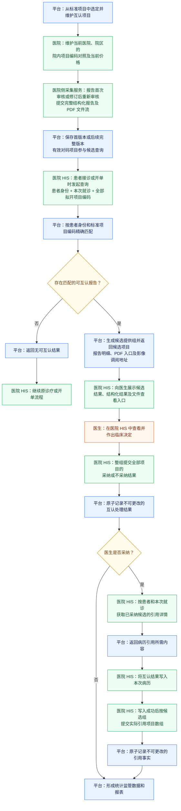
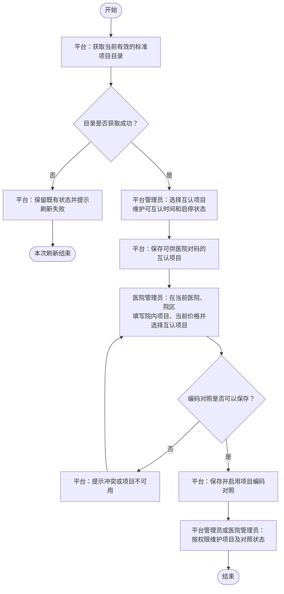
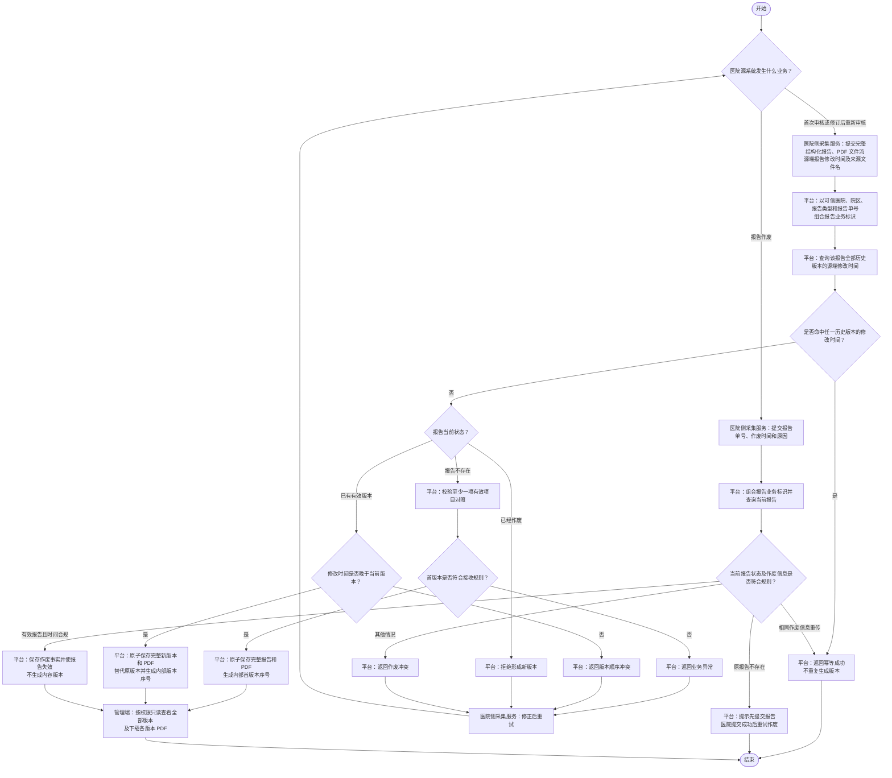
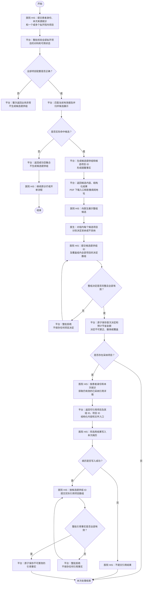

# 检验检查结果互认平台业务流程图

本文档使用自上而下的标准流程图描述平台核心业务过程。每张流程图均可单独展示；流程之间需要衔接时直接使用完整流程名称，不使用数字编号代称。

本文只表达业务参与方、核心步骤、主要判断和最终结果。理解流程所必需的规则直接写在对应流程图后，不展开字段清单、页面布局、技术接口和全部异常校验。

本文包含以下流程：

- 端到端业务主流程
- 互认项目与项目编码对照流程
- 报告采集与生命周期流程
- 在线互认与病历引用闭环流程

## 端到端业务主流程

本流程展示从互认项目准备、报告采集、在线互认到统计监管的核心路径。节点颜色区分责任方：蓝色表示平台，绿色表示医院及厂商，橙色表示医生，黄色表示判断。

流程规则：

1. 平台先建立互认项目，医院再维护院内项目编码对照；首次审核或修订后重新审核的报告通过同一完整报告提交能力形成首版本或后续版本，作废通过独立能力处理。
2. 在线互认由医院 HIS 在患者接诊或开单过程中发起，平台对整批拟开项目校验并为非空结果生成候选提供组，医生负责对组内全部项目作出采纳或不采纳决定。
3. 候选查看、PDF 或影像调阅不自动表示采纳；病历写入成功后，医院 HIS 才提交引用结果。
4. 项目准备、报告处理和在线使用分别在“互认项目与项目编码对照流程”“报告采集与生命周期流程”“在线互认与病历引用闭环流程”中展开。

## 互认项目与项目编码对照流程

本流程展示平台建立互认项目，以及医院将本院项目映射到互认项目的核心过程。

流程规则：

1. 互认项目从当前有效的最细层标准项目中选择，并维护可互认时间、启停状态和来源状态；互认项目不维护全县统一价格。
2. 标准目录获取失败时保留既有状态，不使用空目录或不完整结果覆盖现状。
3. 医院管理员只能维护当前医院、院区范围内的编码对照及当前价格；启用对照在同一医院、院区内实行一对一，一个院内项目只能对照一个互认项目，一个互认项目也只能对照一个院内项目。
4. 互认项目停用或来源不可用时，停止相关新增对照、只能关联该项目的报告首次创建和候选查询，但不删除历史数据；已经存在的报告仍允许提交后续完整版本。
5. 编码对照修改或停用只影响后续上传报告，不重写已经接收的报告。

## 报告采集与生命周期流程

本流程展示审核完成的检查、检验报告如何通过完整报告提交形成首版本或后续版本，以及如何通过独立能力作废报告。

流程规则：

1. 检验报告和检查报告分别提供完整报告提交与独立作废能力；医院不提交新增、更正、作废状态，也不提交平台报告 ID、组合业务标识、医院版本号或版本变更原因。
2. 首次审核和修订后重新审核均提交完整结构化报告与 PDF 文件流，二者共同成功或共同失败；平台根据报告是否存在及源端报告修改时间决定形成首版本或后续版本。
3. 平台以可信调用身份中的医院、院区，以及所调用的报告类型能力和医院提交的报告单号组合报告业务标识，不按患者、就诊、项目、内容或 PDF 推断报告身份。
4. 平台先查询同一报告全部历史版本；源端报告修改时间命中任一历史版本时按幂等成功处理，不比较本次内容，也不重复生成版本。
5. 报告不存在时，首次完整提交必须至少包含一个能够关联当前有效互认项目的明细；报告已经存在时，修改时间严格晚于当前版本便保存完整新版本，即使新版本没有有效对码也必须替代旧版，但不形成候选。
6. 未命中历史版本且修改时间早于或等于当前版本时返回版本顺序冲突；报告已经作废时拒绝再形成版本。平台不比较完整内容，不计算 PDF 摘要，也不要求医院提供版本号。
7. 作废只提交报告单号、作废时间和原因。作废时间不得早于当前版本修改时间；报告不存在时不建立占位，医院应先提交报告并在成功后重试作废。
8. 已作废报告以完全相同的作废时间和原因重传时按幂等成功处理；作废信息不同则返回冲突。作废不生成内容版本、不物理删除历史，也不能通过后续完整提交或历史版本恢复。
9. 平台保存上传时取得的 PDF 原始文件名并随版本用于下载；文件名缺失或无效时使用“报告单号.pdf”。文件名不参与报告身份、版本或幂等判断，也不从 PDF 元数据推断。
10. 后续版本形成后，原版本停止参与候选、引用详情和新的引用；来源报告备注随每个版本保存，用于展示和追溯，不作为版本变更原因。
11. 医院管理员可以查看本医院及有权院区上传报告的全部只读历史版本和 PDF，平台管理员按现有数据权限查看；其他医院不得查看，医院 HIS 仍只使用当前有效版本。
12. 历史版本不提供自动差异比较、修改、删除、恢复、重新设为当前版本或重新启用能力。
13. 调用失败、超时或未取得明确结果时，医院侧采集服务原样重试；平台根据历史修改时间、当前状态或作废事实返回幂等成功或明确失败。

## 在线互认与病历引用闭环流程

本流程展示医院 HIS 查询候选、医生作出决定，以及采纳后将结果写入病历并反馈引用的连续过程。

流程规则：

1. 平台按可信调用身份中的医院、院区解析全部拟开院内项目。任一项目未对码、对照停用或对应互认项目不可用时，整次查询失败并指出相关院内项目编码，不生成候选提供组，也不返回其他项目候选。
2. 全部项目配置正确但没有符合条件的报告时返回成功空集合，不生成候选提供组。重复院内项目自动去重；多个项目对应同一报告时只在响应中归并展示，不形成新的业务层级。
3. 候选必须满足报告版本有效、互认项目可用和可互认时间要求。本院报告是否参与由平台全局配置控制；自然超过可互认时间只影响新的候选查询，不使已经保存的采纳决定失效。
4. 非空查询每次生成新的候选提供组 ID，并为实际命中项目生成新的候选项目 ID。平台成功生成候选组即形成提醒事实，即使医院未收到响应也不撤销；医院重试时生成新组和新 ID。
5. 候选响应中的 PDF 地址是平台受认证下载接口，不携带 Bearer Token 或存储地址；医院调用时在 `Authorization` 请求头中携带凭证，平台以 `application/pdf` 文件流返回。影像地址仅按来源医院提供的外部地址原样返回。
6. 医院按候选提供组提交一次完整决定，项目数组必须恰好覆盖组内全部候选项目；组内各项目可分别采纳或不采纳，不采纳时提供平台统一原因。任一缺项、重复、夹带其他组项目或业务校验失败时整批拒绝。
7. 整组决定首次成功保存后不可更正、撤销、删除或覆盖；完整相同的重试按幂等成功处理，内容不同则冲突。新的诊疗决定必须重新查询并形成新的候选提供组。
8. 获取引用详情只提交患者证件信息和本次来源就诊，不要求医院提交组 ID、项目 ID或互认时间。平台返回同次就诊各候选组中仍在引用详情有效期内、报告版本仍有效的采纳项目，并带回后续引用所需的组 ID 和项目 ID。
9. 各候选组的引用详情有效期分别从该组处理结果首次成功保存时间起算，使用当前全平台统一的正整数分钟参数，默认值为 720 分钟；报告自然超过可互认时间不影响已采纳详情，报告形成后续版本或作废则停止返回原版详情。
10. 医院成功写入病历后，以候选提供组 ID 和实际引用项目数组提交引用结果；数组可以只包含本次实际引用的采纳项目，但本次所提交项目必须整批校验和原子保存，不提供逐项部分成功。
11. 引用结果首次成功保存后不可更正、撤销、删除或覆盖；同组同项目最多形成一个引用事实。引用结果不设置提交期限，不受候选可互认时间或引用详情有效期限制，报告已失效时仍接收医院明确反馈的既有引用事实。
12. 候选查看、结构化结果展示、引用详情获取、PDF 下载或影像访问均不自动形成采纳、不采纳或引用事实；病历写入失败时不得提交引用成功。
