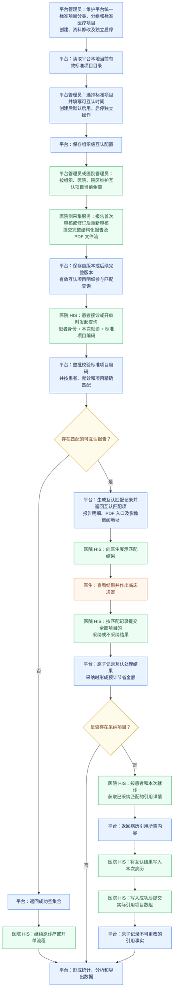
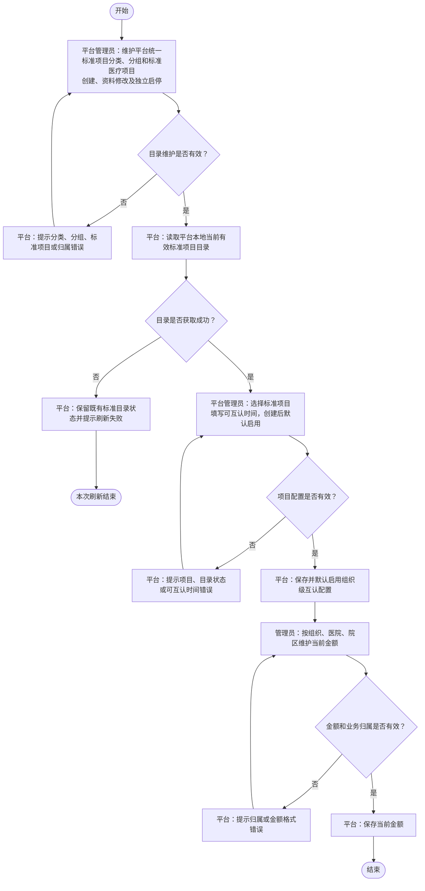
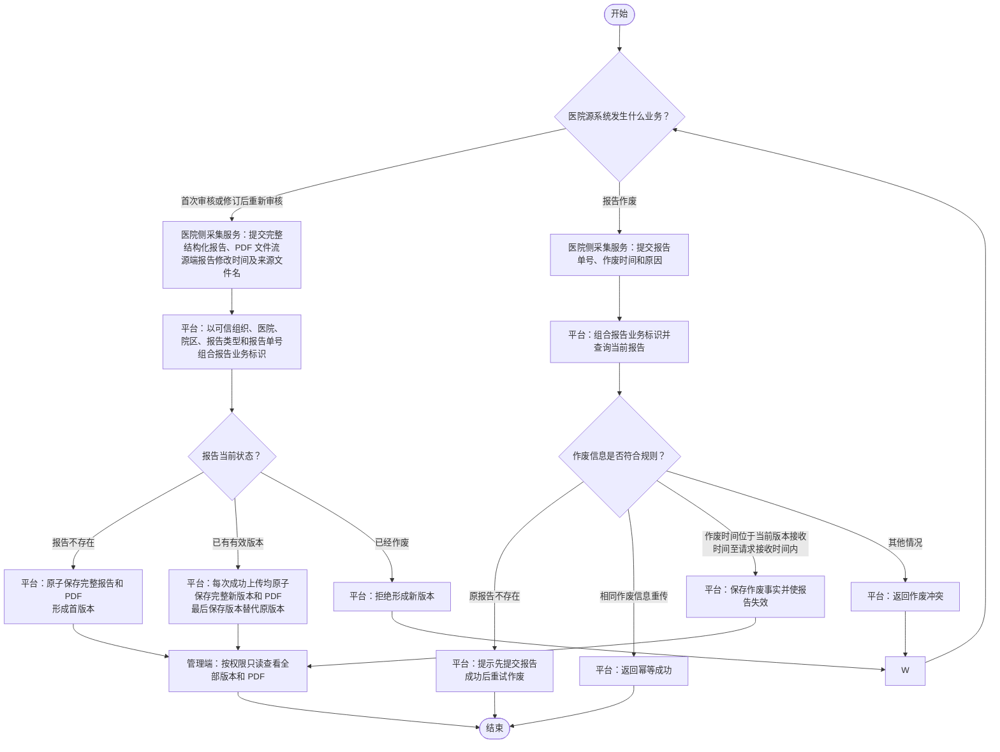
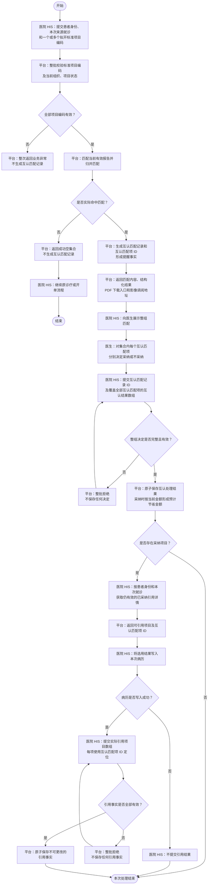

# 检验检查结果互认平台业务流程图

本文档使用自上而下的标准流程图描述平台核心业务过程。每张流程图均可单独展示；流程之间需要衔接时直接使用完整流程名称，不使用数字编号代称。

本文只表达业务参与方、核心步骤、主要判断和最终结果。字段清单、接口字段和完整校验规则以 `CONTEXT.md` 与《需求规约 SRS》为准。

本文包含以下流程：

- 端到端业务主流程
- 互认项目配置、分类分组与金额维护流程
- 报告采集与生命周期流程
- 在线互认与病历引用闭环流程

## 端到端业务主流程

本流程展示从互认项目准备、报告采集、在线互认到统计监管的核心路径。节点颜色区分责任方：蓝色表示平台，绿色表示医院及厂商，橙色表示医生，黄色表示判断。

流程规则：

1. 平台先维护统一标准项目分类、分组和标准医疗项目，再从本地当前有效标准目录中建立组织级互认配置并直接复用标准项目编码；平台不维护医院本地项目主数据和项目映射。
2. 项目类型固定为“检验”或“检查”，标准目录按类型、分类、分组和标准项目组织；互认配置直接引用标准项目的既有类型、分类和分组。
3. 金额按组织、医院、院区和标准项目编码独立维护。金额允许为零，最多两位小数，不继承、不回退。
4. 首次审核或修订后重新审核的报告均通过完整报告提交能力处理；报告作废通过独立能力处理。
5. 报告明细中直接提供有效互认标准项目编码的部分参与互认；未提供编码的明细仍随完整报告保存，但不参与匹配、采纳、引用、统计或导出。
6. 匹配查询任一标准项目编码无效、停用、标准目录不可用或不属于当前组织范围时，整次查询失败；全部有效但没有命中报告时返回成功空集合。
7. 匹配查看、PDF 或影像调阅不自动表示采纳；医院 HIS 只有在病历写入成功后才提交引用结果。
8. 项目配置、报告处理、在线互认和统计导出分别在对应流程中展开。

## 互认项目配置、分类分组与金额维护流程

本流程展示平台先维护统一标准目录，再选择标准项目建立组织级互认配置，并维护组织、医院、院区金额的核心过程。

流程规则：

1. 互认项目直接使用标准项目编码；标准项目名称和目录属性从平台本地标准目录获取，不重复维护为互认配置字段。
2. 项目类型固定为检验、检查。分类名称在全平台标准目录内唯一，分组名称在同一分类下唯一，分组只能属于一个分类。
3. 未被下级使用的分类可修改项目类型和名称，未被标准项目使用的分组可修改所属分类和名称，但必须满足唯一性及有效父级约束；已被下级使用后，分类不得修改项目类型和名称，分组不得修改所属分类和名称，且均不得物理删除。标准项目创建后只允许修改备注。停用后仍可查询历史数据，但不能用于新的互认配置或匹配业务。
4. 新增或重新启用互认配置时，标准项目及所属分类、分组必须启用；标准目录不可用时不得重新启用互认配置。上级目录恢复后，自身仍启用的标准项目和互认配置自动恢复实际有效，自身已停用的对象仍需独立启用。既有配置即使自身或标准目录停用，仍可修改可互认时间，但不改变启停状态，也不因此形成新的匹配。
5. 对已启用对象再次启用或对已停用对象再次停用时，平台按幂等成功处理，不改变状态，也不重复形成启停事件。
6. 金额业务键为组织编码、医院编码、院区编码和标准项目编码。平台管理员可维护全部范围，医院管理员只能维护本医院内具有数据权限的院区。
7. 金额为当前值，必须非负且最多保留两位小数；金额调整只影响之后形成的采纳处理结果，不重算历史金额。
8. 只要组织级互认配置存在，目录或配置当前停用也允许查看和维护金额；停用不删除既有金额。

## 报告采集与生命周期流程

本流程展示审核完成的检查、检验报告如何通过完整报告提交形成首版本或后续版本，以及如何通过独立能力作废报告。

流程规则：

1. 完整报告提交不要求医院传入新增、更正或作废状态，也不要求提交平台报告 ID、组合业务标识或版本号。
2. 报告不存在时，只要完整报告及 PDF 的既有校验通过即保存首版本；是否存在有效互认项目编码不影响报告接收，未提供或不可用编码的明细随报告保存但不形成匹配。
3. 报告已经存在且未作废时，每次完整上传成功都新增一个完整版本；不比较内容、不判断是否为重试、不按源端报告修改时间排序。未提供或不可用互认项目编码不阻止保存，但对应明细不形成匹配。
4. 最后成功保存的版本成为当前有效版本；完整报告提交不提供幂等成功语义，网络重试再次成功时也形成新版本。源端报告修改时间只随版本保存用于来源追溯。
5. 后续版本形成后，原版本停止参与匹配、引用详情和新的引用；历史版本只读保留。
6. 作废只提交报告单号、作废时间和原因，不生成内容版本，不物理删除历史，也不能通过后续完整提交恢复。

## 在线互认与病历引用闭环流程

本流程展示医院 HIS 查询匹配、医生作出决定，以及采纳后将结果写入病历并反馈引用的连续过程。

流程规则：

1. 查询直接接收标准项目编码，不接收或解析医院本地项目编码。任一编码不存在、未纳入当前组织互认范围、停用或标准目录不可用时，整次查询失败。
2. 重复标准项目编码只处理一次；多个项目命中同一报告时归并展示，不形成新的业务层级。
3. 匹配仅在来源组织与接收组织一致时进行，并必须满足报告版本有效、互认项目可用和当前可互认时间要求；本院报告是否参与由平台全局参数控制。
4. 非空查询成功生成互认匹配记录和互认匹配项，并形成提醒事实、发布匹配返回事件；提醒不代表 HIS 弹窗、医生查看或采纳。空结果只返回成功空集合，不创建匹配记录、匹配项或提醒，不发布匹配返回事件。
5. 互认结果数组必须覆盖集合内全部互认匹配项；不采纳时提交平台统一原因代码，整集合校验成功后原子保存。
6. 互认匹配记录首次成功保存处理结果后，决定不可更正、撤销、删除或覆盖；完整相同重试优先按已保存事实幂等成功，报告版本后续失效不改变该结果，业务内容不同则返回冲突。未命中既有已保存事实时，互认项目或标准目录在匹配返回后停用、不可用，不否定已经形成的匹配；只要绑定报告版本仍为当前有效版本，仍允许保存真实发生的采纳或不采纳处理结果。
7. 采纳处理结果保存时使用接收组织、医院、院区和标准项目编码对应的当前金额形成预计节省金额；金额未配置按零元；非法金额在金额配置保存阶段拒绝。金额只用于统计，不代表实际收费或退费。
8. 获取引用详情只提交患者证件信息和本次来源就诊。平台按各互认匹配记录处理结果首次成功保存时间和当前全平台统一有效时长，返回仍有效的已采纳项目及后续引用所需标识。
9. 医院 HIS 只有在病历写入成功后才提交实际引用项目数组，不提交互认匹配记录 ID；每项使用全局唯一的互认匹配项 ID 定位。一次请求可以包含来自不同互认匹配记录的项目，平台逐项反查归属和采纳结果后整批校验、原子保存。
10. 匹配查看、结构化结果展示、PDF 下载、影像访问和引用详情获取均不自动形成采纳或引用事实。
