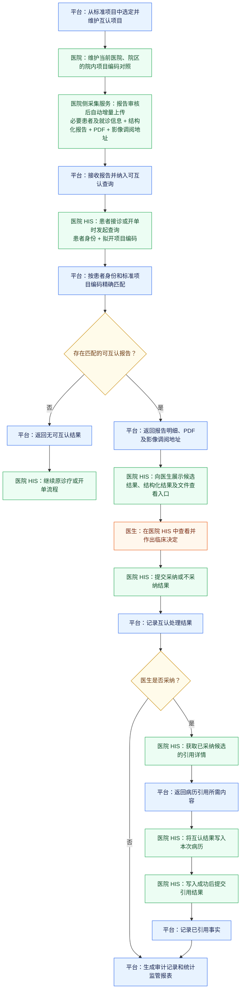
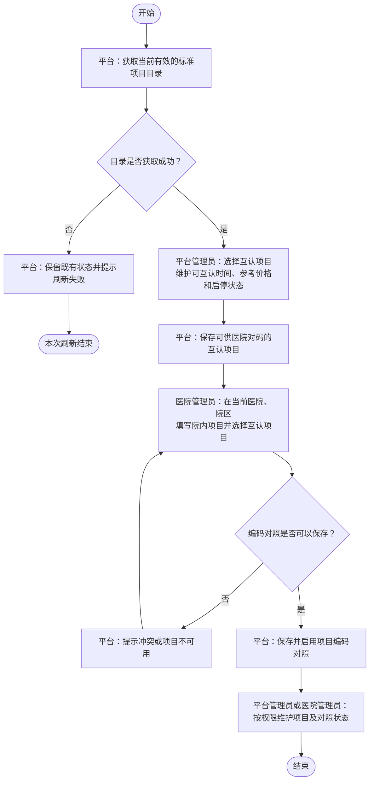
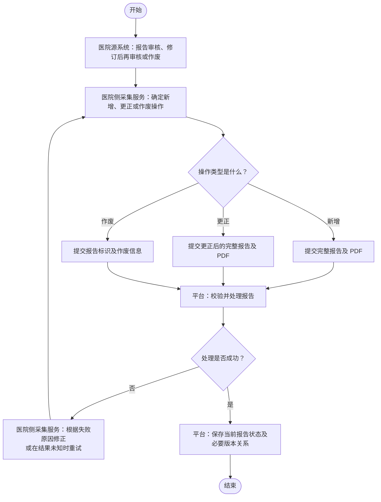
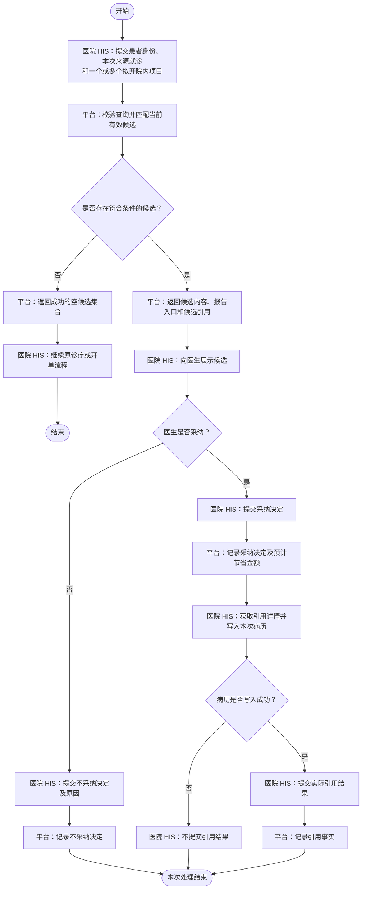

# 检验检查结果互认平台业务流程图

本文档使用自上而下的标准流程图描述平台核心业务过程。每张流程图均可单独展示；流程之间需要衔接时直接使用完整流程名称，不使用数字编号代称。

本文只表达业务参与方、核心步骤、主要判断和最终结果。理解流程所必需的规则直接写在对应流程图后，不展开字段清单、页面布局、技术接口和全部异常校验。

本文包含以下流程：

- 端到端业务主流程
- 互认项目与项目编码对照流程
- 报告采集与生命周期流程
- 在线互认与病历引用闭环流程

## 端到端业务主流程

本流程展示从互认项目准备、报告采集、在线互认到统计监管的核心路径。节点颜色区分责任方：蓝色表示平台，绿色表示医院及厂商，橙色表示医生，黄色表示判断。

流程规则：

1. 平台先建立互认项目，医院再维护院内项目编码对照；审核完成的新报告通过医院侧采集服务自动增量提交。
2. 在线互认由医院 HIS 在患者接诊或开单过程中发起，平台提供候选，医生负责作出采纳或不采纳决定。
3. 候选查看、PDF 或影像调阅不自动表示采纳；病历写入成功后，医院 HIS 才提交引用结果。
4. 项目准备、报告处理和在线使用分别在“互认项目与项目编码对照流程”“报告采集与生命周期流程”“在线互认与病历引用闭环流程”中展开。

## 互认项目与项目编码对照流程

本流程展示平台建立互认项目，以及医院将本院项目映射到互认项目的核心过程。

流程规则：

1. 互认项目从当前有效的最细层标准项目中选择，并维护可互认时间、当前参考价格、启停状态和来源状态。
2. 标准目录获取失败时保留既有状态，不使用空目录或不完整结果覆盖现状。
3. 医院管理员只能维护当前医院、院区范围内的编码对照；同一医院、院区和院内项目编码同时最多存在一条启用对照。
4. 互认项目停用或来源不可用时，停止相关新增对照、新报告上传和候选查询，但不删除历史数据。
5. 编码对照修改或停用只影响后续上传报告，不重写已经接收的报告。

## 报告采集与生命周期流程

本流程展示审核完成的检查、检验报告如何新增、更正或作废，以及失败后如何修正重试。

流程规则：

1. 检验报告和检查报告分别提交，但共用新增、更正、作废和版本生命周期；每次请求只处理一份报告变更。
2. 新增和更正提交完整结构化报告及 PDF，并共同成功或共同失败；作废只提交报告业务标识及作废信息。
3. 报告至少包含一个能够关联当前有效互认项目的明细时才进入平台，未对码明细随完整报告保存但不形成候选。
4. 相同操作和内容重复提交按幂等成功处理；相同报告标识但内容不一致时不得静默覆盖。
5. 更正形成新版本，原版本停止参与后续候选和新的引用；作废不物理删除报告，但报告不再参与后续候选和新的引用。
6. 调用失败、超时或未取得明确结果时，医院侧采集服务通过同一报告流程修正或重试。

## 在线互认与病历引用闭环流程

本流程展示医院 HIS 查询候选、医生作出决定，以及采纳后将结果写入病历并反馈引用的连续过程。

流程规则：

1. 平台按当前医院、院区解析拟开院内项目，只返回符合条件的候选；没有候选时返回成功的空集合，不逐项返回无候选或未对码状态。
2. 多个拟开院内项目映射到同一互认项目时合并处理，每个互认项目最多返回最近一份当前有效报告；联合报告按完整报告展示。
3. 候选必须满足报告版本有效、互认项目可用和可互认时间要求。本院报告是否参与由平台全局配置控制。
4. 候选返回、结构化内容展示、PDF 或影像访问均不自动形成采纳、不采纳或引用事实。
5. 医生针对候选中的具体互认项目作出决定。不采纳必须提供平台统一原因；采纳时形成对应预计节省金额。
6. 医院 HIS 获取引用详情并成功写入本次病历后才提交引用结果；写入失败时不得提交引用成功。
7. 引用结果形成前可以更正同一次互认决定；引用结果形成后，该次决定固定为采纳，不得再改为不采纳。
