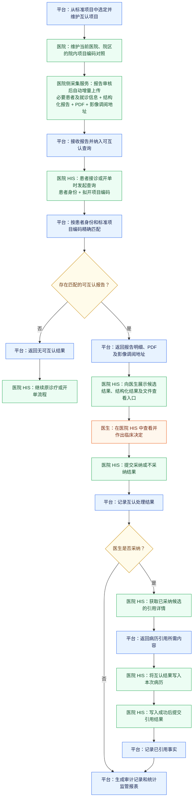
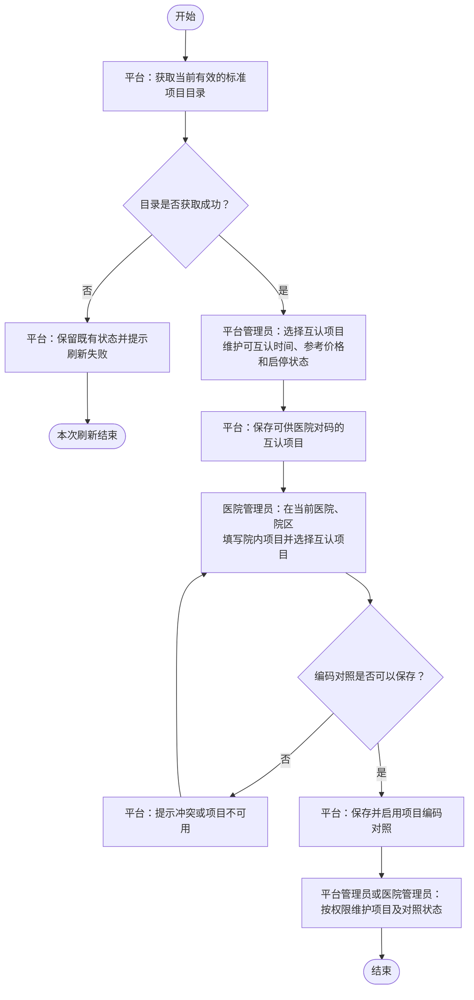
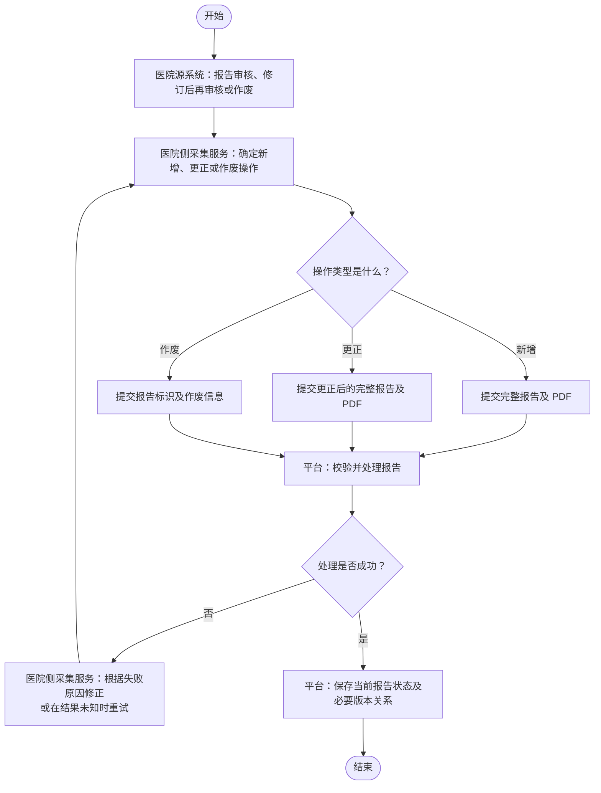
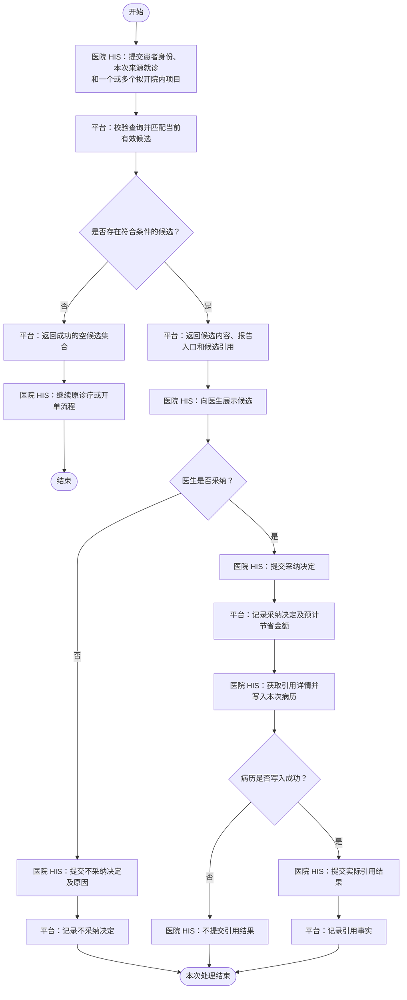

# 检验检查结果互认平台产品需求文档（PRD）

版本号：v0.0.1

评审状态：未评审

| 版本 | 日期 | 作者 | 评审状态 | 修订说明 |
| --- | --- | --- | --- | --- |
| v0.0.1 | 2026/07/30 | 杨康健 | 未评审 | 检验检查结果互认平台 MVP 产品需求文档初稿 |

# 一、概述（为什么做）

## 1.1 产品概述

### 1.1.1 背景介绍

不同医疗机构及不同院区使用的检查、检验项目编码和名称存在差异，医院之间难以直接以院内项目编码识别相同医学项目。患者在新的医疗机构接诊或开单时，医生也缺少一条能够按患者身份和拟开项目准确发现既往有效报告、完成临床判断并将互认结果写入本次病历的业务闭环。

检验检查结果互认平台以标准医疗项目作为共同语义基础，由平台维护互认项目，由医院维护本院、本院区的项目编码对照；平台接收医院审核完成的检查、检验报告，在医院 HIS 发起查询时返回符合当前规则的互认候选，并记录医生明确反馈的采纳、不采纳及实际引用事实，为业务管理和监管提供统计依据。

### 1.1.2 产品概述

本产品面向检验检查结果跨医疗机构共享和临床使用场景，覆盖互认项目准备、医院项目编码对照、报告采集与生命周期管理、互认候选查询、医生互认处理、病历引用反馈、统计分析和 Excel 导出。

平台通过患者精确关联、报告版本管理、当前有效项目对照、可互认时间和最近有效报告选择规则保证候选业务身份明确。平台只提供候选和业务数据，不代替医生作出临床决定，不直接操作医院 HIS 中的医嘱或病历，也不将候选展示、PDF 查看、影像访问或引用详情获取推断为采纳或引用。

本 PRD 描述 MVP 版本。当前版本只接收平台上线后新产生并审核完成的报告，不导入上线前历史报告；不建设 DICOM 文件存储、报告变更主动推送、真实收费结算、重量级审计、历史趋势、医生排名或 CSV/PDF 统计导出等能力。

### 1.1.3 目标用户

| 用户或外部参与方 | 使用目标或业务责任 |
| --- | --- |
| 平台管理员 | 维护互认项目及其业务配置，按权限跨机构查看编码对照，查看、下钻和导出县域范围内的互认统计。 |
| 医院管理员 | 在当前医院、院区范围内维护院内项目编码对照，核对本院业务数据，查看、下钻和导出权限范围内的互认统计。 |
| 医生 | 在医院 HIS 中查看互认候选，根据患者当前情况作出采纳或不采纳决定，并在采纳后使用相应内容。 |
| 医院 HIS | 在接诊或开单过程中查询候选，展示候选并提交医生决定；采纳后获取引用详情，将内容写入病历并反馈实际引用结果。 |
| 医院侧采集服务 | 在来源报告审核完成、修订后再次审核或作废时，将相应报告变更提交到平台，并处理明确失败、超时重传和结果未知重试。 |

## 1.2 名词说明

| 名词或缩写 | 说明 |
| --- | --- |
| HIS | 医院信息系统。负责调用在线互认能力、向医生展示候选并反馈处理及引用结果。 |
| LIS | 实验室信息系统。医院侧采集服务可以从中获取审核完成的检验报告，平台不规定其内部采集方式。 |
| PACS | 医学影像存档与通信系统。平台不接收或保存 DICOM 文件，只处理检查报告随附的影像调阅地址及来源影像状态。 |
| 标准医疗项目 | 标准项目管理系统统一维护的医疗项目，是各医院项目语义对齐的共同基准。 |
| 互认项目 | 平台从当前有效标准医疗项目中选定、允许进入结果互认业务范围的最细层项目。 |
| 可互认时间 | 从报告时间开始计算、报告可以作为互认候选返回的时间长度；查询使用互认项目的当前配置。 |
| 院内项目 | 医院某一院区在本地业务系统中实际使用的检查或检验项目及其编码。 |
| 项目编码对照 | 当前医院、院区的院内项目与互认项目之间的语义对应关系。 |
| 来源不可用 | 互认项目引用的标准医疗项目已不在当前有效目录中的状态。此状态保留历史数据，但限制新增对照、新报告上传和候选查询。 |
| 报告业务标识 | 医院、院区、报告类型和报告单号的组合，用于唯一识别一份检查或检验报告。 |
| 报告操作类型 | 医院提交报告时明确提供的新增、更正或作废业务指令。 |
| 报告版本 | 一份报告在新增或更正过程中形成的内容版本；更正形成新版本并保留版本关系。 |
| 当前有效报告 | 当前未作废，且存在更正时属于最新有效版本的报告。 |
| 混合项目报告 | 同时包含已对码和未对码项目明细的完整报告。未对码明细随报告保存，但不形成候选。 |
| 互认候选 | 平台针对一个去重后的互认项目，按照候选规则选择并返回的一份当前有效报告。 |
| 互认候选引用 | 绑定“候选报告版本 + 互认项目”的稳定引用，用于后续处理、引用详情获取和引用结果提交。 |
| 互认时间 | 医生实际作出采纳或不采纳决定的业务时间，精确到秒。 |
| 互认处理结果 | 医生明确作出的采纳或不采纳决定。 |
| 引用详情 | 医生采纳后，医院 HIS 获取的可用于写入本次病历的项目内容及必要报告公共上下文。 |
| 引用结果 | 医院 HIS 成功写入本次病历后向平台提交的实际引用事实。 |
| 提醒次数 | 平台成功返回一个去重互认项目候选时形成的统计次数，不表示医生已经查看、采纳或引用。 |
| 预计节省金额 | 采纳时按互认项目当时当前参考价格形成的业务统计金额，不代表实际收费、结算或退费。 |

## 1.3 角色及权限

| 角色 | 主要权限 | 数据范围与边界 |
| --- | --- | --- |
| 平台管理员 | 维护互认项目；跨机构查看编码对照并按权限异常停用；查看、下钻和导出互认统计。 | 按平台授权访问县域、医院或院区数据；不代替医院执行日常对码。 |
| 医院管理员 | 新增、修改、启用和停用项目编码对照；查看、下钻和导出接收侧及来源侧统计。 | 只能维护当前登录医院、院区的编码对照；只能查看本院及有权院区的数据。 |
| 医生 | 查看候选并作出采纳或不采纳决定；采纳后使用引用内容。 | 相关操作在医院 HIS 中完成；平台不规定其页面布局和操作入口。 |
| 医院侧采集服务 | 提交检查、检验报告的新增、更正和作废。 | 当前调用医院、院区来自可信身份上下文；不具备平台管理端维护权限。 |
| 医院 HIS | 查询候选，提交处理结果，获取引用详情并提交引用结果。 | 当前调用医院、院区来自可信身份上下文；不得以接口调用账号代替实际业务科室和医生。 |

平台页面以及医院接入能力均受统一权限和可信医院、院区上下文控制。平台科室 ID、平台医生 ID 不存在或跨越当前调用医院、院区时，按照对应功能的整体校验规则拒绝保存；主体存在、归属正确但已停用时，允许补交真实历史业务事实。

## 1.4 文档阅读对象

本文档供产品、业务、研发、UI、测试、实施、项目管理和相关评审人员阅读，作为检验检查结果互认平台 MVP 产品设计、实现、测试和验收的业务依据。接口技术契约、数据库设计、技术架构、安全设计、部署方案及医院院内系统改造方案不由本文档定义。

# 二、产品描述（做什么）

## 2.1 产品需求描述

平台以标准医疗项目和医院项目编码对照建立统一项目语义，持续接收医院审核完成的检查、检验报告，并保持报告完整内容、PDF、必要来源信息和新增、更正、作废生命周期。医院 HIS 在患者接诊或开单过程中，提交患者身份、本次来源就诊和一个或多个拟开院内项目，平台返回每个去重互认项目最近一份符合条件的当前有效报告。

医生在医院 HIS 中查看候选并明确反馈采纳或不采纳。采纳时平台按当时参考价格形成预计节省金额；医院 HIS 成功将引用详情写入本次病历后，再向平台提交实际引用事实。平台基于候选返回、当前有效决定和实际引用事实提供权限范围内的汇总、下钻和 Excel 导出。

## 2.2 产品整体流程

### 2.2.1 主流程

#### 端到端业务主流程

### 2.2.2 子流程

为便于在阅读功能需求时直接对照，子流程图放在对应功能模块中，本节只提供导航，不重复展示。

| 子流程 | 覆盖功能 | 所在章节 |
| --- | --- | --- |
| 互认项目与项目编码对照流程 | F01、F02 | 3.1.2 基础配置模块业务流程 |
| 报告采集与生命周期流程 | F03 | 3.2.4.5 F03 业务流程 |
| 在线互认与病历引用闭环流程 | F04-F07 | 3.3.2 在线互认模块业务流程 |

流程图只表达参与方、核心步骤、主要判断和最终结果。详细校验、异常、幂等、排序和状态规则以第三章对应功能需求为准。

## 2.3 全局说明

本节只约束互认平台自建管理端，不约束医院 HIS 页面。医院 HIS 的候选提醒、医生查看、采纳或不采纳、医嘱处理及病历写入界面由医院负责。

1. 页面可见、查询、操作、下钻和导出能力受平台统一权限及可信医院、院区上下文控制。
2. 页面使用业务名称、当前业务状态、关键时间和必要说明表达业务事实，不显示平台内部存储标识或技术排障信息。
3. 敏感信息按照业务用途和权限展示；统计页面、统计明细和导出中的患者姓名、证件号码必须脱敏。
4. 页面布局、控件类型、菜单位置和视觉样式由 UI 设计确定，但不得减少本 PRD 定义的业务能力、查询条件、状态提示和权限边界。
5. 已确认的特定提示在对应功能中规定；其他一般交互遵循平台现有 UI 规范。

## 2.4 产品框架

| 产品模块 | 包含功能 | 模块说明 |
| --- | --- | --- |
| 基础配置 | F01、F02 | 建立互认项目范围和医院、院区项目编码对照，为报告采集与候选查询提供统一项目语义。 |
| 报告采集 | F03 | 接收检查、检验报告新增、更正和作废，保存完整结构化内容、PDF、版本关系及必要来源信息。 |
| 在线互认 | F04、F05、F06、F07 | 完成候选查询、医生决定反馈、引用详情获取和实际引用反馈闭环。 |
| 统计监管 | F08、F09 | 提供接收侧互认使用、来源侧被互认分析、业务下钻和 Excel 导出。 |

## 2.5 功能清单

当前 MVP 范围内功能均为 P0。以下功能保留 SRS 编号，用于 PRD、SRS、设计、开发、测试和验收之间的追溯；各功能章节不再重复标注优先级。

| 编号 | 功能 | 说明 | 主要入口或调用方 |
| --- | --- | --- | --- |
| F01 | 互认项目管理 | 从当前有效标准项目中选择互认项目，维护可互认时间、当前参考价格、启停状态和来源状态。 | 互认平台管理端 |
| F02 | 项目编码对照管理 | 医院在当前医院、院区范围内维护院内项目与互认项目的对应关系。 | 互认平台管理端 |
| F03 | 报告采集与生命周期 | 接收检查、检验报告新增、更正和作废，保存完整内容、PDF 和版本关系。 | 医院侧采集服务 |
| F04 | 互认候选查询 | 按患者身份和拟开项目返回符合条件的最近有效候选。 | 医院 HIS |
| F05 | 互认处理结果 | 接收医生明确作出的采纳或不采纳决定，并支持引用前决定更正。 | 医院 HIS |
| F06 | 获取引用详情 | 对已采纳且报告版本仍有效的候选返回病历引用所需内容。 | 医院 HIS |
| F07 | 提交引用结果 | 接收医院 HIS 已成功写入病历的实际引用事实。 | 医院 HIS |
| F08 | 互认统计与分析 | 提供提醒、决定、引用、同期互认率、预计节省金额及来源医院被互认分析。 | 互认平台管理端 |
| F09 | 互认统计导出 | 按查询条件、权限和脱敏规则导出 Excel 汇总及明细。 | 互认平台管理端 |

# 三、功能需求（怎么做）

## 3.1 基础配置

### 3.1.1 模块描述

基础配置模块用于建立平台统一的互认项目范围，以及各医院、院区院内项目与互认项目之间的语义对应关系。该模块只负责业务项目配置，不自动推断项目语义，不代替医院开展日常对码，也不通过修改配置重写既有报告或历史互认事实。

### 3.1.2 模块业务流程

#### 互认项目与项目编码对照流程

### 3.1.3 用户故事

- 作为平台管理员，我希望从当前有效标准目录中选择并维护互认项目，以便明确平台可开展互认的项目范围和业务参数。
- 作为医院管理员，我希望在当前医院、院区范围内维护院内项目编码对照，以便报告上传和候选查询能够解析到统一互认项目。
- 作为平台管理员，我希望能够发现来源不可用项目并限制后续业务，以便避免继续使用失效的标准项目来源。

### 3.1.4 功能清单

| 编号 | 功能 | 说明 | 入口 |
| --- | --- | --- | --- |
| F01 | 互认项目管理 | 维护互认项目及其可互认时间、当前参考价格、启停状态和来源状态。 | 互认平台管理端 |
| F02 | 项目编码对照管理 | 维护医院、院区范围内的院内项目编码对照。 | 互认平台管理端 |

### 3.1.5 F01 互认项目管理

#### 3.1.5.1 描述

平台从标准项目管理系统当前有效目录中的最细层标准医疗项目选择互认项目，并维护候选查询和预计节省金额所需的业务配置。互认项目新增后默认启用，不提供物理删除。

#### 3.1.5.2 前置条件

1. 操作人员具有互认项目管理权限。
2. 标准项目管理系统已经配置为可用目录来源。
3. 新增项目引用当前有效目录中的最细层标准项目。

#### 3.1.5.3 后置条件

1. 新增成功后保存标准项目编码和名称、可互认时间、当前参考价格、启停状态和来源状态，项目默认启用。
2. 配置修改按对应业务规则影响后续候选或新形成的采纳决定。
3. 项目停用或来源不可用时保留已有项目、编码对照、报告和历史业务事实。

#### 3.1.5.4 界面及交互

1. 进入页面时自动获取一次当前有效标准项目目录，并提供手动刷新能力。
2. 页面展示标准项目编码和名称、可互认时间、当前参考价格、启停状态、来源状态、修改时间和修改人。
3. 支持从当前有效最细层项目中选择一个、多个或全部项目，填写可互认时间和参考价格后新增。
4. 支持修改可互认时间、当前参考价格和启停状态，不提供物理删除、价格历史或版本恢复入口。
5. 目录刷新失败时明确提示并保留既有目录核对结果和来源状态；来源不可用项目应明确展示状态和受限操作。

#### 3.1.5.5 业务流程

1. 平台获取当前有效标准项目目录，并在完整获取成功后按标准项目编码核对既有互认项目的来源状态。
2. 平台管理员选择一个、多个或全部当前有效最细层项目，填写可互认时间和参考价格。
3. 平台校验项目来源、必填配置和重复选择情况。
4. 校验通过后保存互认项目并默认启用。
5. 平台管理员后续可以调整可互认时间、当前参考价格和启停状态。

#### 3.1.5.6 异常及分支流程

1. 标准目录获取失败或返回不完整时，本次刷新失败，保留原有目录核对结果和来源状态。
2. 已选项目不再属于当前有效目录时，标记为来源不可用，不按名称或相似度自动替换。
3. 可互认时间或参考价格为空、格式不合法时，拒绝保存本次新增或修改。
4. 已存在相同标准项目编码的互认项目时，拒绝重复新增。
5. 停用项目重新启用时，只有其标准项目来源当前有效才允许启用。

#### 3.1.5.7 业务规则

1. 互认项目必须引用当前有效标准目录中的最细层项目。
2. 互认项目保存标准项目编码和名称；类型、类别和分组按需从当前标准目录获取。
3. 可互认时间从报告时间开始计算，只用于候选查询，不用于报告接收校验或报告保存期限判断。
4. 可互认时间调整对已有报告的后续候选查询即时生效，不倒改已有互认处理或引用事实。
5. 每个互认项目必须维护当前参考价格。上线初始化价格由县医院提供，平台管理员录入和后续维护，不要求从价格系统自动同步。
6. 平台只保留当前参考价格，不建立独立价格版本或价格变更历史；价格调整只影响新形成的采纳决定，不重算历史预计节省金额。
7. 项目停用后阻止相关新报告上传，已有报告立即停止参与候选查询；重新启用后按当前规则重新判断。
8. 来源不可用时，阻止新增或重新启用相关编码对照、上传新报告和查询已有报告。
9. 替代标准项目必须作为新的互认项目重新选择，医院应重新调整项目编码对照。

#### 3.1.5.8 数据字典及字段说明

| 属性 | 说明 |
| --- | --- |
| 标准项目编码 | 被选标准医疗项目的稳定编码，创建后不可替换为其他项目编码。 |
| 标准项目名称 | 选择互认项目时保存的标准医疗项目名称。 |
| 可互认时间 | 从报告时间开始计算的候选有效时长，必填。 |
| 当前参考价格 | 形成新采纳决定预计节省金额的统一价格，必填。 |
| 启停状态 | 启用或停用；新增后默认启用。 |
| 来源状态 | 来源有效或来源不可用，由完整目录刷新结果确定。 |
| 修改信息 | 使用平台框架已有修改时间和修改人，不形成独立配置版本。 |

### 3.1.6 F02 项目编码对照管理

#### 3.1.6.1 描述

医院在当前医院、院区范围内维护院内项目与互认项目之间的对应关系，使报告上传和医院 HIS 候选查询能够解析到统一互认项目。医院负责本院日常对码和正确性，平台管理员只在权限范围内跨机构查看和异常停用。

#### 3.1.6.2 前置条件

1. 操作人员已登录并具有项目编码对照管理权限。
2. 医院管理员的当前医院和院区能够从可信登录上下文确定。
3. 新建或重新启用对照所选择的互认项目当前启用且来源有效。

#### 3.1.6.3 后置条件

1. 新建成功后形成当前医院、院区下默认启用的项目编码对照。
2. 对照修改或启停只影响后续上传报告及后续院内项目解析，不重写已接收报告保存的互认项目关系。
3. 停用后保留既有对照和历史业务数据。

#### 3.1.6.4 界面及交互

1. 医院管理员页面只展示和维护当前登录医院、院区的数据；平台管理员按权限跨机构查看。
2. 页面平铺展示当前启用且来源有效的互认项目，并支持按项目编码或名称搜索选择。
3. 支持新增、修改、启用和停用对照；医院、院区和院内项目编码创建后不提供修改入口。
4. 页面展示院内项目编码、院内项目名称、互认项目、启停状态和备注，不提供价格维护或平台逐条审批。
5. 唯一性冲突、互认项目停用或来源不可用时，明确提示不能保存或启用的业务原因。

#### 3.1.6.5 业务流程

1. 医院管理员进入页面，平台按可信登录上下文限定当前医院和院区。
2. 医院管理员填写院内项目编码、院内项目名称，选择一个互认项目，并可填写备注。
3. 平台校验医院、院区、院内项目编码唯一性及所选互认项目状态。
4. 校验通过后保存并默认启用。
5. 医院管理员后续可以修改院内项目名称、所选互认项目和备注，或者启用、停用对照。

#### 3.1.6.6 异常及分支流程

1. 当前医院、院区和院内项目编码已存在另一条启用对照时，拒绝新增或启用。
2. 所选互认项目停用或来源不可用时，拒绝新增、修改为该项目或重新启用相关对照。
3. 平台管理员发现异常对照时，可以按权限停用，但不代替医院修改日常对码内容。
4. 历史对码错误已经影响报告时，不通过修改对照重写报告；医院应对来源报告执行更正或作废。

#### 3.1.6.7 业务规则

1. 项目编码对照归属于确定的医院和院区，医院管理员不得跨越当前登录范围维护。
2. 唯一性按医院、院区和院内项目编码判断；一个院内项目同时最多存在一条启用对照。
3. 多个院内项目可以对照同一个互认项目。
4. 对照直接保存院内项目编码和名称，不依赖平台内独立的院内项目目录。
5. 医院、院区和院内项目编码创建后不可修改；改变上述身份时应新建对照并停用原对照。
6. 院内项目名称、互认项目和备注允许修改，修改只影响后续上传和解析。
7. 对照不维护价格，预计节省金额使用互认项目当前参考价格。
8. 新建对照校验成功后默认启用，不经过平台逐条审批，也不提供物理删除。

#### 3.1.6.8 数据字典及字段说明

| 属性 | 说明 |
| --- | --- |
| 医院、院区 | 对照的数据归属，来自创建时可信组织范围，创建后不可修改。 |
| 院内项目编码 | 医院院区本地业务系统使用的项目编码，创建后不可修改。 |
| 院内项目名称 | 医院项目名称，允许修改且只影响后续上传。 |
| 互认项目 | 对应的互认项目，允许修改且只影响后续上传和解析。 |
| 启停状态 | 启用或停用；新增后默认启用。 |
| 备注 | 对照维护的补充说明，可选。 |

## 3.2 报告采集

### 3.2.1 模块描述

报告采集模块持续接收平台上线后新产生并审核完成的检查、检验报告，以明确的新增、更正和作废操作管理报告生命周期。新增和更正同时提交完整结构化内容和 PDF；平台保存完整报告、当前状态、必要版本关系和来源信息。医院侧采集服务属于外部参与方，平台不规定其内部采集、轮询、队列或失败任务页面实现。

### 3.2.2 用户故事

- 作为医院侧采集服务，我希望在报告首次审核、修订后再次审核或作废时提交明确操作，以便平台保持报告当前有效内容。
- 作为医生，我希望候选展示的是完整且当前有效的来源报告，以便基于原始临床内容作出判断。
- 作为平台管理方，我希望相同内容重试能够幂等处理、冲突内容不被静默覆盖，以便避免重复报告和错误版本。

### 3.2.3 功能清单

| 编号 | 功能 | 说明 | 调用方 |
| --- | --- | --- | --- |
| F03.1 | 公共报告要求与生命周期 | 定义报告身份、患者就诊、人员、文件、新增、更正、作废、版本和幂等规则。 | 医院侧采集服务 |
| F03.2 | 检验报告专项要求 | 接收普通检验结果、标本、细菌鉴定和药敏结果。 | 医院侧采集服务 |
| F03.3 | 检查报告专项要求 | 接收检查项目、部位、所见、结论、PDF 和影像入口信息。 | 医院侧采集服务 |

### 3.2.4 F03 报告采集与生命周期

#### 3.2.4.1 描述

检查报告和检验报告分别使用相应报告提交能力，但共用新增、更正、作废、完整性、版本、幂等和冲突处理规则。每次请求只处理一份报告变更；一份报告至少包含一个当前有效对码项目时才进入平台，未对码明细随完整报告保存但不形成候选。

#### 3.2.4.2 前置条件

1. 来源报告已完成医院内部审核，操作类型明确为新增、更正或作废。
2. 新增或更正至少有一个项目明细能够通过当前有效对照关联到启用且来源有效的互认项目。
3. 报告携带有效跨院患者标识、必填人口学信息、来源就诊标识和对应报告类型要求的公共信息。
4. 报告涉及的平台科室 ID、平台医生 ID 在当前调用医院、院区范围内存在。
5. 新增和更正同时提供完整结构化报告、PDF 及用于一致性判断的 PDF 文件摘要。
6. 更正存在当前有效原报告；作废存在尚未物理删除的原报告。

#### 3.2.4.3 后置条件

1. 新增成功后保存一份当前有效报告及完整内容，并记录平台实际接收时间。
2. 更正成功后保存新版本和版本关系，原版本停止参与候选查询、引用详情和新的引用。
3. 作废成功后保存作废时间和原因，报告停止参与候选查询、引用详情和新的引用，但报告及历史版本不被物理删除。
4. 任一校验或保存步骤失败时，本次报告变更不产生部分业务数据。
5. 平台同步返回成功、幂等成功或明确失败结果。

#### 3.2.4.4 界面及交互

F03 不建设平台管理端人工逐份上传、逐份审批、修改临床内容、采集任务或失败任务页面。医院侧采集服务负责发现报告业务事件、提交报告和修正失败数据；平台只定义接收结果和业务边界，不规定医院侧页面、控件、轮询或重试界面。

#### 3.2.4.5 业务流程

##### 报告采集与生命周期流程

##### F03.1 公共报告要求与生命周期

1. 医院源系统形成新增、更正或作废事件，医院侧采集服务按原操作类型提交一份报告变更。
2. 平台按医院、院区、报告类型和报告单号识别报告业务标识。
3. 平台校验调用归属、患者身份、来源就诊、科室医生归属、公共字段和项目编码对照。
4. 新增或更正时，将结构化内容和 PDF 作为一个完整单元校验，并确认至少一个明细有效对码。
5. 平台按照操作类型新增报告、形成更正版本或记录作废。
6. 完整保存后同步返回最终成功结果。

##### F03.2 检验报告专项流程

1. 平台校验公共信息、单一标本信息和检验时间线。
2. 逐条校验普通检验结果，并按来源医院、院区和院内项目编码解析当前有效对照。
3. 保存普通结果来源原文、受控结果类型、展示顺序及源系统实际提供的辅助信息。
4. 报告包含细菌鉴定或药敏结果时，保存最终结论、量值和二者明确关联。
5. 全部结构化内容与 PDF 校验通过后，按照公共生命周期规则保存报告变更。

##### F03.3 检查报告专项流程

1. 平台校验公共信息、实际检查时间、检查医生和报告级临床内容。
2. 逐个检查项目明细解析当前有效对照，并保持项目与部位集合的明确归属。
3. 保存整份报告的检查所见、检查结论、来源诊断、病情描述、检查目的、方法和设备信息。
4. 按来源影像状态校验影像调阅地址的一致性。
5. 全部结构化内容、PDF 和按规则提供的影像信息校验通过后，按照公共生命周期规则保存报告变更。

#### 3.2.4.6 异常及分支流程

1. 相同报告业务标识的新增已存在且内容一致时返回幂等成功；内容不一致时返回冲突，不静默覆盖。
2. 更正内容与当前版本一致时返回幂等成功；内容不一致且源端修改时间较晚时形成新版本，否则返回过期更正或顺序冲突。
3. 更正找不到当前有效原报告时不自动按新增处理；作废找不到原报告时返回原报告不存在。
4. 已作废报告再次提交相同作废时返回幂等成功。
5. 患者证件已存在但姓名、性别或出生日期不一致时返回患者身份冲突，不覆盖患者资料或创建第二个患者。
6. 没有任何项目明细有效对码时，拒绝整份报告；同时包含已对码和未对码明细时完整接收，但仅已对码明细形成候选。
7. 任一科室或医生 ID 不存在或跨医院、院区时，整次请求失败且不保存。
8. 结构化内容、PDF、文件摘要或任一必填内容校验失败时，整份报告失败。
9. 调用超时或未取得明确结果时，医院侧使用相同操作类型和内容重试，平台按当前状态进行幂等或冲突判断。
10. 检验结果的来源明细标识在源系统确实不存在时允许为空；提供时不得在相应报告版本范围内重复。展示序号缺失或重复时拒绝报告。
11. 培养未发现细菌时，以明确检测结论和来源文字表达，不要求伪造菌种编码或名称。
12. 检查项目没有明确部位时部位集合允许为空；特殊检查没有检查所见时，来源系统提供明确来源表达，平台不自动补写。
13. 来源影像状态为有影像但无跨院可用地址时仍可接收；状态为无影像时地址必须为空，状态未知时地址可以有或无。

#### 3.2.4.7 业务规则

##### 公共规则

1. 检验报告和检查报告分别提交；每次请求只处理一份报告，医院侧可以并发提交多份相互独立的报告。
2. 报告业务标识由医院、院区、报告类型和报告单号共同组成。操作类型是本次业务指令，不是报告状态字段。
3. 新增和更正提交完整报告，不支持局部修改；作废只提交报告业务标识和作废信息。
4. 更正保留版本关系，旧版本责任人员及历史内容不得被新版本覆盖。
5. 新增和更正必须提供源端报告修改时间；申请时间和报告时间必填，审核时间在源系统存在时提供。报告时间是可互认时间计算起点。
6. 报告随附患者和来源就诊信息，不要求预先上传独立挂号或就诊记录。来源就诊由医院、院区、就诊类型和院内就诊流水号共同识别。
7. 患者姓名、性别代码、出生日期、证件类型和证件号码必填，以证件类型和证件号码精确关联，并校验其余人口学信息一致性。
8. 报告上传只接收平台科室 ID 和平台医生 ID。平台校验归属并保存 ID 和当次名称；主体正确归属但停用时允许补交真实报告。
9. 至少一个明细有效对码时保存完整报告；项目对照在报告接收时解析并随明细保存，后续对照修改或停用不重写既有报告关系。
10. 报告更正或作废立即限制旧版本继续参与候选查询、引用详情和新的引用，但不否定医院稍后提交的既有处理或已经发生的引用事实。
11. 平台不因报告更正或作废建设下游主动推送、推送记录或恢复处理。

##### 检验报告规则

1. 一份检验报告只对应一个标本；多个标本分别形成不同报告。
2. 标本采集、送检、检验科接收时间在源系统存在时提供，检测完成时间必填；不采集上机、离心和培养过程节点。
3. 普通结果保存来源最终结果文本，使用受控结果类型区分数值型、定性型和文本型；平台不推断统一检验结果代码，不换算或重判来源结果。
4. 单位、参考范围、检测方法、LOINC、仪器和收费代码按源系统实际情况提供；平台不据此替代项目对照或进行结果换算。
5. 普通结果展示序号必填且在同一版本内唯一；异常和危急值标志按来源保存，不由平台重新计算，也不因此排除候选。
6. 细菌鉴定和药敏是检验报告补充结果，不独立进行项目对码。药敏结果必须明确关联细菌鉴定结果。
7. 检测结论、药敏结论和来源量值按原文保存，平台不标准化、换算或重新判读。
8. 报告级检验人必填；明细检测人和审核人在源系统存在且可关联平台医生时提供，缺失不阻止报告接收。

##### 检查报告规则

1. 一份检查报告可以包含一个或多个项目明细，各明细分别解析互认项目；联合报告不按对码结果拆成多份报告。
2. 检查部位归属于具体项目明细；没有明确部位时允许为空，存在部位时名称必填，来源编码按源系统情况提供。
3. 检查所见和检查结论属于报告级必填完整原文，不拆分、推断或改写。
4. 来源检查类型、方法、设备和临床背景按源系统情况保存，不决定互认资格。
5. 实际检查时间和检查医生平台 ID 必填；不采集预约时间，也不拆分检查开始和完成时间。
6. 一份检查报告最多保存一个 HTTPS 影像调阅地址。平台不接收、代理、缓存或长期保存 DICOM 文件，也不自行拼接影像地址。
7. 来源影像状态使用有影像、无影像或未知；影像地址缺失不影响结构化报告和 PDF 的互认资格，报告作废后不再返回原地址。
8. 检查报告整体异常标识按来源保存，仅用于展示和人工核对，不由平台推断，也不因此排除候选。

#### 3.2.4.8 数据字典及字段说明

| 属性组 | 关键属性 |
| --- | --- |
| 业务身份 | 医院、院区、报告类型、报告单号。 |
| 操作及版本 | 新增、更正或作废；源端修改时间、当前有效状态、版本关系、作废时间和原因。 |
| 患者信息 | 姓名、性别代码、出生日期、证件类型、证件号码；联系电话和报告时年龄按来源情况提供。 |
| 就诊信息 | 就诊类型、院内就诊流水号；住院号、病区、病房和床位按来源情况提供。 |
| 组织人员 | 申请、执行、报告和审核相关科室及医生的平台 ID 和保存时名称。 |
| 公共时间 | 申请时间、报告时间、审核时间、源端报告修改时间、平台接收时间。 |
| 报告文件 | 报告 PDF 及文件摘要，与结构化内容共同成功或共同失败。 |
| 检验报告 | 来源报告信息、单一标本、检验时间线、普通结果、细菌鉴定、药敏结果及对应责任人员。 |
| 检查报告 | 项目明细、部位、检查所见、检查结论、临床背景、检查信息、来源影像状态和单个 HTTPS 影像地址。 |

## 3.3 在线互认

### 3.3.1 模块描述

在线互认模块由互认候选查询、互认处理结果提交、引用详情获取和引用结果提交四项连续但相互独立的业务能力组成。医院 HIS 决定调用时机和院内页面交互，平台负责校验业务归属、提供候选和引用内容、记录医生明确决定及实际引用事实。

### 3.3.2 模块业务流程

#### 在线互认与病历引用闭环流程

### 3.3.3 用户故事

- 作为医生，我希望在接诊或开单过程中看到同一患者与拟开项目匹配的最近有效报告，以便判断是否可以采纳既有结果。
- 作为医生，我希望明确提交采纳或不采纳决定，并在引用形成前纠正决定，以便平台记录真实临床选择。
- 作为医院 HIS，我希望在采纳后获取受控引用内容，并在成功写入病历后反馈引用事实，以便形成完整且可核对的业务闭环。
- 作为平台管理方，我希望查询、展示、决定和引用保持清晰边界，以便统计只依据已经发生并明确反馈的业务事实。

### 3.3.4 功能清单

| 编号 | 功能 | 说明 | 调用方 |
| --- | --- | --- | --- |
| F04 | 互认候选查询 | 根据患者身份和拟开院内项目返回最近有效候选。 | 医院 HIS |
| F05 | 互认处理结果 | 提交采纳、不采纳及引用前决定更正。 | 医院 HIS |
| F06 | 获取引用详情 | 对已采纳且版本仍有效的候选返回病历引用内容。 | 医院 HIS |
| F07 | 提交引用结果 | 提交已经成功写入本次病历的引用事实。 | 医院 HIS |

### 3.3.5 F04 互认候选查询

#### 3.3.5.1 描述

医院 HIS 在患者接诊或开单过程中，以患者身份、本次来源就诊和一个或多个拟开院内项目查询互认候选。平台按当前医院、院区解析项目对照并去重，为每个互认项目选择最近一份符合条件的当前有效报告；没有候选属于正常成功结果。

#### 3.3.5.2 前置条件

1. 当前接收医院和接收院区能够从可信身份上下文确定。
2. 查询提供有效患者证件类型和证件号码、本次来源就诊类型及院内就诊流水号。
3. 查询至少包含一个拟开院内项目，每个项目明确检查或检验类型及当前医院、院区使用的院内项目编码。
4. 当前医院、院区的项目编码对照和候选报告数据可供查询。

#### 3.3.5.3 后置条件

1. 查询成功时只返回符合条件的候选；没有候选时返回空候选集合。
2. 每个去重后的互认项目最多返回一份报告的当前有效内容和稳定候选引用。
3. 同一联合报告命中多个项目时只返回一份报告公共信息，各项目分别形成候选引用。
4. 每个成功返回候选的去重互认项目形成一次提醒统计；无候选或整次查询失败不形成提醒。
5. 查询本身不形成处理结果、引用结果或调阅状态。

#### 3.3.5.4 界面及交互

候选提醒、医生查看、PDF 或影像访问、采纳或不采纳操作，以及继续或撤销院内医嘱均由医院 HIS 负责。互认平台不规定医院 HIS 的页面布局、弹窗形式、控件、菜单或调用时机。医院 HIS 的界面行为不能替代明确的处理结果和引用结果提交。

#### 3.3.5.5 业务流程

1. 医院 HIS 提交患者身份、本次来源就诊和一个或多个拟开院内项目。
2. 平台校验调用归属、患者身份、来源就诊和项目输入。
3. 按当前医院、院区、项目类型和院内项目编码解析当前有效对照，并将解析到同一互认项目的输入合并。
4. 针对每个去重互认项目筛选当前有效、项目可用、时间符合要求的报告，并应用本院报告候选规则。
5. 选择检查或检验时间最晚的一份；时间相同时选择报告时间较晚的一份；两者均相同时稳定选择同一份。
6. 按报告组织公共信息，按互认项目组织候选引用和项目内容。
7. 返回候选；没有任何候选时返回成功的空集合，并仅对成功返回的候选形成提醒次数。

#### 3.3.5.6 异常及分支流程

1. 某拟开项目不存在有效对照、对应互认项目停用或来源不可用时，该项目不形成候选，不影响同一请求中其他项目。
2. 患者不存在、没有满足时间和有效性规则的报告，或报告均被本院候选规则排除时，不返回相应候选；全部无候选时返回空集合。
3. 查询输入、患者身份或调用归属校验失败时，整次查询失败且不形成提醒。
4. 报告存在更正时只使用新版本；报告已经作废时不参与候选选择。
5. 联合报告命中多个互认项目时公共内容只组织一次，各项目的候选和处理边界仍相互独立。
6. 查询超时或医院 HIS 未取得明确成功响应时不形成提醒；重新查询成功返回候选时按新的查询形成提醒。

#### 3.3.5.7 业务规则

1. 查询截止点使用平台收到本次查询的时间，医院 HIS 不额外提供统一就诊时间。
2. 候选时间使用检查报告实际检查时间或检验报告检测完成时间，该时间不得晚于查询时点。
3. 可互认时间从报告时间开始计算，并使用互认项目查询时的当前配置。
4. 每个互认项目只返回最近一份有效报告，不返回更早独立报告、历史趋势或多个版本。
5. 检查或检验时间相同时，报告时间是唯一业务选择条件；二者均相同时不增加临床质量、机构级别等排序条件，但在数据和配置不变时应稳定返回同一份。
6. 联合报告完整返回，但只有本次命中的互认项目形成候选；多个院内项目解析到同一互认项目时只形成一个候选和一次提醒。
7. 本院报告候选开关为平台全局参数，默认关闭。关闭时同一医院报告不参与候选，不区分院区。
8. 开关开启后使用全局非负小时参数作为本院报告排除时长，默认四十八小时；零表示不增加额外等待时间，负数无效。
9. 本院报告经过时间大于或等于排除时长，且小于或等于互认项目可互认时间时满足时间条件；排除时长大于某项目可互认时间时，该项目不返回本院报告。
10. 本院报告参数调整只影响后续查询，不删除报告或撤销既有处理、引用和统计事实。
11. 检验候选返回来源机构、报告名称、检查或检验时间、报告时间、报告业务标识、标本类型名称、命中项目的全部普通结果及 PDF 入口；结果按保存的展示序号返回。
12. 检验候选不返回用于来源追溯的标本类型编码和院内标本号。
13. 检查候选返回来源机构、报告名称、实际检查时间、报告时间、报告业务标识、命中项目部位、整体异常标识、PDF 入口、来源影像状态及可用影像入口。
14. 检查候选不直接返回篇幅较大的检查所见和检查结论，医生通过 PDF 或影像查看后决定是否采纳。
15. 异常和危急值只表达来源医院判断，平台不重新计算，也不自动排除异常报告。
16. 提醒次数只表示平台成功提供候选，不表示医院 HIS 已显示提醒或医生已经查看、决定或引用。

#### 3.3.5.8 数据字典及字段说明

| 属性组 | 关键属性 |
| --- | --- |
| 调用归属 | 当前接收医院、接收院区，来自可信身份上下文。 |
| 患者与就诊 | 证件类型、证件号码、本次来源就诊类型、本次院内就诊流水号。 |
| 拟开项目 | 检查或检验类型、院内项目编码；解析并去重为互认项目。 |
| 候选公共信息 | 来源医院及院区、来源报告名称、检查或检验时间、报告时间、报告业务标识、PDF 入口。 |
| 候选引用 | 绑定候选报告版本和具体互认项目的稳定引用。 |
| 检验候选内容 | 标本类型名称及命中项目对应的普通检验结果。 |
| 检查候选内容 | 命中项目部位、整体异常标识、来源影像状态及影像入口。 |
| 候选集合 | 只包含符合条件的候选；没有符合条件的候选时为空集合。 |

### 3.3.6 F05 互认处理结果

#### 3.3.6.1 描述

医院 HIS 提交医生针对具体候选互认项目明确作出的采纳或不采纳决定。平台记录实际互认时间、决定科室和医生、不采纳原因或预计节省金额；在尚未形成引用事实时，允许按真实情况更正决定。

#### 3.3.6.2 前置条件

1. 医院 HIS 已取得候选查询返回的稳定候选引用。
2. 医生已经明确作出采纳或不采纳决定。
3. 每条结果提供本次来源就诊、候选引用、精确到秒的互认时间、处理结果、平台科室 ID 和平台医生 ID。
4. 不采纳时提供平台统一原因代码；原因为其他时提供补充说明。

#### 3.3.6.3 后置条件

1. 一次请求中全部处理结果校验成功后共同保存；任一记录失败时整批不保存。
2. 每个“接收医院、接收院区、本次来源就诊、候选引用、互认时间”只保留一个当前有效决定。
3. 采纳形成采纳次数、来源医院被互认次数、报告使用关系和预计节省金额；不采纳形成不采纳次数和原因。
4. 相同决定幂等重试不重复计数；引用前决定更正后，相关统计按最新有效决定重新计算。

#### 3.3.6.4 界面及交互

医生决策页面由医院 HIS 负责，平台不规定其布局、弹窗、控件或菜单。医院 HIS 必须在医生明确决定后提交结果；关闭提醒、查看文件或离开页面均不能被平台解释为采纳或不采纳。

#### 3.3.6.5 业务流程

1. 医院 HIS 提交一个或多个候选项目的处理结果。
2. 平台校验调用归属、来源就诊、候选引用、互认时间、决定内容，以及全部科室医生 ID 的存在性和归属。
3. 平台确认候选引用能够定位报告版本和具体互认项目。
4. 不采纳时校验统一原因代码和适用的补充说明；采纳时读取互认项目当前参考价格形成预计节省金额。
5. 全部记录校验通过后，在一个整体操作中保存当前有效决定及对应统计事实。
6. 平台返回整次请求成功。

#### 3.3.6.6 异常及分支流程

1. 任一记录校验失败时整批不保存，不返回逐条成功结果。
2. 相同业务键重复提交完全相同决定时返回幂等成功，不新增记录或重复统计。
3. 相同业务键提交不同决定且尚未形成引用结果时，更新为最新有效决定，并将当前记录及统计归属于最新决定主体。
4. 已形成引用结果后尝试改为不采纳时拒绝更正。
5. 不采纳未提供原因、原因无效，或选择其他但缺少说明时整批失败。
6. 任一科室或医生 ID 不存在或跨医院、院区时整批失败；主体停用但存在且归属正确时允许提交。
7. 超时、失败或未取得明确结果时，医院 HIS 使用相同互认时间和原记录重试。

#### 3.3.6.7 业务规则

1. 处理结果值域只包括采纳和不采纳，不提交未处理、未查看、暂未决定或关闭提醒状态。
2. 候选返回、结构化展示、PDF 或影像访问不自动形成处理结果。
3. 决定归属于候选报告中的具体互认项目；同一请求可提交一个或多个项目，但整体校验、整体保存。
4. 互认时间是医生实际作出决定的时间并保存到秒；接口接收时间不得替代。
5. 相同候选在同一就诊中可以因不同时间的真实诊疗需要形成多次处理，不同互认时间分别记录和统计。
6. 决定科室和医生表示实际作出决定的主体。平台分别校验二者归属，不要求医生当前所属科室等于决定科室，并保存当次名称。
7. 平台接收稍后提交的既有处理事实时，不比较互认时间与报告更正或作废时间。
8. 不采纳原因使用平台固定字典，医院不得新增、修改或停用；代码 `6` 使用时补充说明必填。
9. 平台不审查不采纳的临床理由，也不据此干涉医院继续开单或其他诊疗措施。
10. 采纳时按互认项目当时的当前参考价格形成预计节省金额，不等待引用结果；相同采纳重试不因价格变化重新计算。
11. 采纳改为不采纳时取消该次金额；不采纳改为采纳时使用重新采纳时的当前参考价格。
12. 报告后续更正或作废不撤销或重算已经形成且当前仍为采纳的预计节省金额。
13. 预计节省金额归属于接收医院、院区和决定科室；决定更正继续使用原互认时间归入统计期间。

#### 3.3.6.8 不采纳原因字典

| 代码 | 不采纳原因 |
| --- | --- |
| `1` | 因病情变化，检查检验结果与患者临床表现、疾病诊断不符，难以满足当前临床诊疗需求。 |
| `2` | 检查检验结果在疾病发展演变过程中变化较快。 |
| `3` | 检查检验项目对于疾病诊疗意义重大，如手术、输血等重大医疗措施前。 |
| `4` | 患者处于急诊、急救等紧急状态。 |
| `5` | 涉及司法、伤残及病退等鉴定。 |
| `6` | 其他情形确需复查；选择该代码时补充说明必填。 |

#### 3.3.6.9 数据字典及字段说明

| 属性 | 说明 |
| --- | --- |
| 接收医院、接收院区 | 来自可信调用上下文的业务归属。 |
| 本次来源就诊 | 就诊类型和院内就诊流水号。 |
| 候选引用 | 定位候选报告版本和具体互认项目。 |
| 互认时间 | 医生实际作出决定的时间，精确到秒。 |
| 处理结果 | 采纳或不采纳。 |
| 决定科室、决定医生 | 平台 ID 及当次查询后保存的名称。 |
| 不采纳原因 | 平台统一原因代码及适用的补充说明。 |
| 预计节省金额 | 当前有效决定为采纳时形成的统计金额。 |
| 当前有效决定 | 相同业务键下最新有效决定；形成引用后固定为采纳。 |

### 3.3.7 F06 获取引用详情

#### 3.3.7.1 描述

候选查询只用于医生判断。医生采纳后，医院 HIS 通过独立能力获取写入本次病历所需的项目内容和必要报告公共上下文。平台保证返回内容属于当前医院、本次就诊、已采纳项目和仍有效的报告版本。

#### 3.3.7.2 前置条件

1. 当前调用医院、院区能够从可信身份上下文确定。
2. 请求提供本次来源就诊、候选引用和对应互认时间。
3. 相应处理记录存在，当前有效决定为采纳。
4. 候选引用绑定的报告版本仍为当前有效版本。

#### 3.3.7.3 后置条件

1. 校验成功时只返回当前候选引用对应互认项目的内容和必要报告公共上下文。
2. 获取详情不形成引用结果、引用次数或新的处理结果。
3. 校验失败时不返回受保护的报告引用内容。

#### 3.3.7.4 界面及交互

病历写入界面由医院 HIS 负责。平台不规定院内页面布局、字段落位或控件；医院 HIS 获取引用详情后，必须在真实写入成功时另行提交引用结果。

#### 3.3.7.5 业务流程

1. 医院 HIS 提交本次来源就诊、候选引用和互认时间。
2. 平台校验当前医院、院区与候选、来源就诊和处理记录的归属一致。
3. 平台校验当前有效决定为采纳，且候选引用绑定的报告版本仍为当前有效版本。
4. 按候选引用定位具体互认项目及报告公共上下文。
5. 返回项目级引用内容，供医院 HIS 写入本次病历。

#### 3.3.7.6 异常及分支流程

1. 处理记录不存在、当前决定为不采纳、来源就诊或医院院区不匹配时拒绝返回。
2. 报告已更正、作废，或候选引用绑定版本不再是当前有效版本时拒绝返回。
3. 联合报告只采纳部分项目时，仅返回当前候选引用对应项目，不返回其他未采纳或未命中项目。

#### 3.3.7.7 业务规则

1. 获取引用详情与候选查询、处理结果提交、引用结果提交相互独立。
2. 必须校验“当前医院院区 + 本次来源就诊 + 候选引用 + 互认时间”与当前有效采纳决定一致。
3. 检验引用详情按当前互认项目返回相应检验结果，不细分为每条普通结果的独立引用事实。
4. 检查所见和检查结论属于整份报告公共内容，可以随当前检查项目返回。
5. 必要公共上下文至少包括来源医疗机构、来源报告名称、检查或检验时间、报告时间、来源申请医生和来源审核医生。
6. 获取详情只表示平台提供引用所需数据，不表示医院 HIS 已写入病历；PDF 或影像访问也不能替代获取详情或形成引用结果。

#### 3.3.7.8 数据字典及字段说明

| 属性组 | 关键属性 |
| --- | --- |
| 请求定位 | 当前医院院区、本次来源就诊、候选引用、互认时间。 |
| 公共上下文 | 来源医疗机构、报告名称、检查或检验时间、报告时间、来源申请医生、来源审核医生。 |
| 检验引用内容 | 当前互认项目对应的检验结果及必要解释信息。 |
| 检查引用内容 | 当前互认项目、检查部位，以及整份报告的检查所见和检查结论。 |

### 3.3.8 F07 提交引用结果

#### 3.3.8.1 描述

医院 HIS 将已经成功写入本次病历的一条或多条引用事实提交到平台。平台先执行整批主体校验，再逐条校验和保存引用结果；平台只接收已经引用的正向事实，不从获取详情、文件访问或未反馈状态推断引用。

#### 3.3.8.2 前置条件

1. 医院 HIS 已将相应互认内容成功写入本次病历。
2. 每条记录提供本次来源就诊、候选引用、对应互认时间、实际引用时间、引用科室 ID 和引用医生 ID。
3. 对应处理记录存在且当前有效决定为采纳。
4. 全部引用科室和医生 ID 存在并属于当前调用医院、院区。

#### 3.3.8.3 后置条件

1. 全部主体 ID 前置校验通过后，各引用记录独立保存并分别返回新增成功、幂等成功或明确失败。
2. 每个业务唯一键只形成一个引用事实，幂等重试不增加引用次数或重复形成报告使用关系。
3. 成功引用按实际引用时间计入引用统计，不再次增加采纳次数、来源医院被互认次数或预计节省金额。

#### 3.3.8.4 界面及交互

实际病历写入及院内反馈时机由医院 HIS 负责。平台不设计医院 HIS 页面；只有病历写入成功后才允许提交引用结果，写入失败时不得提交引用成功。

#### 3.3.8.5 业务流程

1. 医院 HIS 提交一条或多条已经发生的引用结果。
2. 平台先校验请求内全部引用科室、引用医生的存在性和当前医院、院区归属。
3. 主体校验全部通过后，逐条校验来源就诊、候选引用、互认时间和当前有效采纳决定。
4. 按业务唯一键检查已有引用结果，并核对实际引用时间、引用科室和引用医生。
5. 新事实保存；相同事实返回幂等成功；其他业务校验失败返回该条明确失败。
6. 平台返回逐条处理结果。

#### 3.3.8.6 异常及分支流程

1. 任一记录的科室或医生 ID 不存在或跨医院、院区时，整次请求失败，整批不保存。
2. 主体前置校验通过后，某条记录的决定不存在、当前为不采纳或业务归属不匹配时，只拒绝该条，不回滚其他成功记录。
3. 相同业务键且实际引用时间、科室和医生一致时返回幂等成功。
4. 相同业务键但任一事实字段不同，返回内容冲突，不覆盖已有结果。
5. 医院修正失败记录后可重新提交整个原批次，先前成功记录按幂等规则处理。
6. 报告在实际引用之后发生更正或作废、医院稍后提交结果时，不因提交时报告已失效而拒绝已经发生的引用事实。

#### 3.3.8.7 业务规则

1. 平台只接收已经引用的正向事实，不要求医院提交未引用或引用失败状态。
2. 获取引用详情、查看结构化结果、访问 PDF 或影像均不自动形成引用结果。
3. 引用粒度为候选报告版本中的具体互认项目，不继续细分到普通检验结果明细。
4. 业务唯一键由接收医院、接收院区、本次来源就诊、候选引用和互认时间共同组成，不要求额外幂等流水号。
5. 实际引用时间是医院成功写入病历的业务时间；接口接收时间不得替代。
6. 引用科室和医生是实际执行引用的主体。平台分别校验归属，不要求医生当前所属科室等于引用科室，并保存当次名称。
7. 科室或医生停用但存在且归属正确时，允许补交真实引用事实。
8. 报告更正或作废阻止继续获取原版本引用详情和发生新的引用，但不拒绝原版本有效期间已经发生、稍后提交的引用结果。
9. 引用形成后，对应互认决定固定为采纳，不允许更正为不采纳，也不提供引用撤销。
10. 引用只增加引用次数，不再次增加采纳、来源医院被互认次数或预计节省金额。

#### 3.3.8.8 数据字典及字段说明

| 属性 | 说明 |
| --- | --- |
| 本次来源就诊 | 就诊类型和院内就诊流水号。 |
| 候选引用 | 定位已采纳报告版本和具体互认项目。 |
| 互认时间 | 定位对应的当前有效采纳决定。 |
| 实际引用时间 | 医院 HIS 成功写入本次病历的时间。 |
| 引用科室、引用医生 | 平台 ID 及提交时保存的名称。 |
| 逐条处理结果 | 新增成功、幂等成功或明确失败。 |

## 3.4 统计监管

### 3.4.1 模块描述

统计监管模块基于候选成功返回、医生当前有效决定、实际引用结果和采纳时形成的预计节省金额，提供接收医院互认使用分析、来源医院被互认分析、业务明细下钻和 Excel 导出。统计用于业务管理和监管，不用于医生绩效评价，也不替代真实财务结算。

### 3.4.2 用户故事

- 作为医院管理员，我希望查看本院及有权院区的提醒、采纳、不采纳、引用和预计节省情况，以便核对互认业务开展情况。
- 作为来源医院管理员，我希望查看本院报告被其他机构采纳的次数和脱敏明细，以便了解本院报告贡献。
- 作为平台管理员，我希望按权限查看县域汇总、机构明细和标准项目分类，以便开展业务监管。
- 作为有导出权限的用户，我希望按当前查询条件导出全部匹配数据，以便开展线下核对和汇总。

### 3.4.3 功能清单

| 编号 | 功能 | 说明 | 入口 |
| --- | --- | --- | --- |
| F08 | 互认统计与分析 | 提供接收侧、来源侧统计、分类分析和脱敏明细下钻。 | 互认平台管理端 |
| F09 | 互认统计导出 | 按当前条件、权限和脱敏规则导出 Excel 汇总或明细。 | 互认平台管理端 |

### 3.4.4 F08 互认统计与分析

#### 3.4.4.1 描述

平台按照不同指标对应的业务时间，对提醒、采纳、不采纳、引用、同期互认率、预计节省金额和来源医院被互认次数进行汇总，并允许在权限范围内按机构、科室和标准项目分类查询及下钻。

#### 3.4.4.2 前置条件

1. 当前用户已登录并具有对应统计页面及数据范围权限。
2. 查询提供日期范围，并可按允许的医院、院区、决定科室、决定医生或互认项目等条件筛选。
3. 平台已保存候选返回、当前有效互认决定、引用结果及参考价格形成的业务事实。

#### 3.4.4.3 后置条件

1. 返回当前权限和查询条件范围内的汇总、分类统计及可下钻明细。
2. 各指标按已确认业务时间归入期间，包含稍后提交或决定更正后重新计算的事实。
3. 患者姓名和证件号码在统计页面及明细中保持脱敏。
4. 总体统计和跨机构统计分别展示，跨机构作为总体子集，不重复累计。

#### 3.4.4.4 界面及交互

##### 接收医院互认使用分析

1. 支持按日期范围、医院、院区、决定科室和互认项目查询；决定医生可以作为明细查询条件。
2. 展示提醒、采纳、不采纳、引用、同期互认率和预计节省金额，并区分总体口径与跨机构子集口径。
3. 提醒、采纳、不采纳和引用汇总数字支持下钻到对应脱敏明细，预计节省金额随采纳明细展示。
4. 展示不采纳原因次数及占比，并允许在明细中查看其他原因的脱敏补充说明。
5. 不提供趋势图、医生排名、绩效评价或患者身份解除脱敏能力。

##### 来源医院被互认分析

1. 医院管理员只能查看本院报告形成的被互认汇总和脱敏明细；平台管理员按权限查看县域数据。
2. 展示被互认总体次数和跨机构被互认子集，两者不相加。
3. 明细可以展示互认项目、接收医院及院区、决定科室、决定医生和互认时间，患者姓名必须脱敏。
4. 不展示或汇总来源医院贡献金额。

#### 3.4.4.5 业务流程

1. 用户进入接收医院互认使用分析或来源医院被互认分析页面。
2. 平台根据登录身份确定可访问的医院、院区或县域数据范围。
3. 用户选择日期范围及其他允许的查询条件。
4. 平台按指标对应业务时间汇总提醒、采纳、不采纳、引用、预计节省金额或来源医院被互认次数。
5. 平台计算同期互认率、不采纳原因次数和占比，并按标准项目分类组织统计。
6. 平台分别提供总体口径和适用的跨机构子集口径。
7. 用户从汇总数字下钻查看对应脱敏业务明细。

#### 3.4.4.6 异常及分支流程

1. 提醒次数为零时，同期互认率不计算，不以零或百分之百代替。
2. 不采纳总次数为零时，各原因占比不计算。
3. 医院 HIS 稍后提交处理或引用结果时，重新查询原业务时间所属期间应包含新增事实。
4. 引用前决定更正时，重新查询原互认时间所属期间应按最新有效决定调整采纳、不采纳、来源医院被互认次数和预计节省金额。
5. 查询时间与互认时间跨越统计边界导致短周期同期互认率超过百分之百时，按原始结果展示，不截断或封顶。
6. 医院管理员请求超出本院或有权院区的数据时，平台拒绝访问或将范围限制在授权数据内。

#### 3.4.4.7 业务规则

1. 提醒次数在平台成功返回候选时形成，按候选查询成功返回时间归入统计期间；无候选、整次失败、超时或未取得明确成功响应时不计提醒。
2. 同一次查询中多个院内项目合并为同一互认项目时只计一次提醒；联合报告命中多个不同互认项目时分别计数。
3. 采纳、不采纳、来源医院被互认次数和预计节省金额按互认时间归入期间；引用次数按实际引用时间归入期间。
4. 接口接收时间只用于传输、安全和审计，不改变统计归属日期。
5. 相同互认时间的幂等重试不重复计数；不同互认时间对应的真实采纳分别计数。
6. 引用结果只增加引用次数，不再次增加采纳、来源医院被互认次数或预计节省金额；没有引用结果不撤销已成立采纳。
7. 同期互认率为当前统计范围内采纳次数除以提醒次数并乘以百分之百。未收到处理结果的提醒保留在分母中，但不记为不采纳。
8. 平台不建立提醒与采纳的一一对应流水，也不设置“采纳次数除以采纳与不采纳之和”的替代指标。
9. 不采纳原因按平台统一代码汇总次数和占比，占比分母为当前条件下不采纳总次数；其他原因补充说明只在脱敏明细及导出中展示。
10. 接收侧统计包含提醒、采纳、不采纳、引用、同期互认率和预计节省金额。
11. 来源侧被互认次数在接收侧明确采纳时形成，不等待引用；来源医院只统计次数和明细，不统计贡献金额。
12. 本院报告候选功能开启后形成的提醒、处理、引用和预计节省金额进入总体统计，本院报告被采纳也进入来源医院被互认总体次数。
13. 跨机构口径只包含来源医院与接收医院不同的记录，是总体统计子集；同一医院不同院区属于非跨机构。
14. 统计统一按标准项目目录中的检查或检验类型、类别、分组及具体互认项目筛选和汇总，不使用医院来源报告分类横向比较。
15. 接收医院汇总支持医院、院区、决定科室和互认项目维度；决定医生只作为明细条件和内容，不形成互认率、金额或绩效排名。
16. 提醒、采纳、不采纳、引用和来源医院被互认汇总均支持下钻到相应业务明细。
17. 预计节省金额随采纳明细展示，不另建重复的金额事实或金额明细。
18. 统计管理页面中的患者姓名和证件号码始终脱敏，不提供解除脱敏能力。
19. 统计按用户选择日期范围提供汇总、分类和明细，不生成按日、小时或分钟的趋势图。

#### 3.4.4.8 数据字典及指标说明

| 指标或维度 | 说明 |
| --- | --- |
| 提醒次数 | 成功返回去重互认项目候选的次数。 |
| 采纳次数 | 当前有效决定为采纳的互认处理次数。 |
| 不采纳次数 | 当前有效决定为不采纳的互认处理次数。 |
| 引用次数 | 医院 HIS 明确反馈成功写入病历的次数。 |
| 同期互认率 | 采纳次数除以提醒次数；提醒次数为零时不计算。 |
| 预计节省金额 | 当前有效采纳决定形成的金额合计，归属于接收医院、院区和决定科室。 |
| 来源医院被互认次数 | 来源报告被接收侧明确采纳的次数，不包含贡献金额。 |
| 不采纳原因 | 平台统一原因代码对应的次数、占比及脱敏明细。 |
| 业务时间 | 提醒按返回时间；决定及金额按互认时间；引用按实际引用时间。 |
| 统计范围 | 总体口径和来源医院不同于接收医院的跨机构子集口径。 |
| 分类维度 | 标准项目类型、类别、分组、互认项目，以及权限允许的医院、院区和决定科室。 |

### 3.4.5 F09 互认统计导出

#### 3.4.5.1 描述

统计页面分页用于浏览，不能满足业务核对和线下汇总需求。平台在不扩大数据权限、不解除患者脱敏的前提下，按照用户当前查询条件导出全部匹配记录。

#### 3.4.5.2 前置条件

1. 用户具有对应统计页面和导出能力权限。
2. 用户已经在统计页面形成有效查询条件。
3. 查询条件处于当前用户可访问的数据范围内。

#### 3.4.5.3 后置条件

1. 平台生成一个 `.xlsx` 文件，包含当前查询条件和权限范围内的全部匹配记录。
2. 导出中的患者姓名和证件号码与页面保持相同脱敏规则。
3. 导出不改变任何互认、引用或统计业务事实。

#### 3.4.5.4 界面及交互

1. 互认使用和来源医院被互认的汇总及明细页面按权限提供 Excel 导出入口。
2. 导出沿用页面当前查询条件和数据权限，覆盖全部匹配记录，不受当前页码和每页条数限制。
3. 页面明确导出仍使用脱敏数据，不提供 CSV、PDF 或解除脱敏选项。
4. 当前查询没有匹配记录时，提示“当前条件下无可导出数据”，不生成空 Excel 文件。

#### 3.4.5.5 业务流程

1. 用户在相应统计汇总或明细页面设置查询条件并发起导出。
2. 平台重新校验用户权限和医院、院区数据范围。
3. 平台按当前查询条件获取全部匹配记录，不使用页面分页限制导出范围。
4. 平台按页面相同规则处理患者脱敏和指标口径。
5. 平台生成 Excel 文件供用户获取。

#### 3.4.5.6 异常及分支流程

1. 用户没有对应导出权限或请求超出数据范围时拒绝导出。
2. 当前查询没有匹配记录时，提示“当前条件下无可导出数据”，不生成文件，也不扩大范围补充其他记录。
3. 导出过程中权限或查询条件校验失败时，不生成可获取文件。

#### 3.4.5.7 业务规则

1. 当前版本只提供 Excel `.xlsx` 格式，不提供 CSV、PDF 或其他格式。
2. 可导出互认使用汇总、提醒明细、采纳明细、不采纳明细、引用明细、来源医院被互认汇总和来源医院被互认明细。
3. 明细导出覆盖当前查询条件和权限范围内的全部匹配记录，不只导出当前页。
4. 导出必须继承当前用户数据权限和当前查询条件，不得扩大医院、院区或县域范围。
5. 患者姓名和证件号码始终脱敏，导出不提供完整身份或解除脱敏能力。
6. 预计节省金额随采纳明细导出，不另生成独立金额明细。
7. 其他不采纳原因的补充说明可以随有权脱敏明细导出，不据此生成新的原因分类。

#### 3.4.5.8 数据字典及字段说明

| 属性 | 说明 |
| --- | --- |
| 导出类型 | 互认使用汇总及四类明细、来源医院被互认汇总及明细。 |
| 文件格式 | Excel `.xlsx`。 |
| 查询条件 | 发起导出时页面当前有效查询条件。 |
| 数据范围 | 当前用户权限允许的医院、院区或县域范围。 |
| 记录范围 | 查询条件下全部匹配记录，不受页面分页限制。 |
| 脱敏规则 | 与对应统计页面一致，不允许解除。 |

# 四、附录（补充文档）

## 4.1 验收标准与测试要点

以下验收要点从各功能的前置条件、后置条件、主流程、异常分支和业务规则提炼。详细用例应继续保持与 F01-F09 编号的对应关系。

### F01 互认项目管理

1. 能从当前有效最细层标准项目中新增互认项目，并保存可互认时间和当前参考价格，新增后默认启用。
2. 相同标准项目编码不能重复新增；来源不可用项目不能新增或重新启用。
3. 完整目录刷新失败或返回不完整时，既有目录核对结果和来源状态不被覆盖。
4. 可互认时间调整只影响后续候选；参考价格调整只影响新采纳，不重算历史金额。
5. 停用或来源不可用保留历史数据，并按规则阻止后续对照、报告或候选业务。

### F02 项目编码对照管理

1. 医院管理员只能维护当前登录医院、院区的数据，平台管理员只能按权限跨机构查看和异常停用。
2. 同一医院、院区和院内项目编码同时最多存在一条启用对照；多个院内项目可以对照同一互认项目。
3. 新增对照默认启用，不经过平台逐条审批；互认项目停用或来源不可用时不能新增、修改为该项目或重新启用。
4. 医院、院区和院内项目编码创建后不能修改；对照修改或停用不重写已接收报告关系。

### F03 报告采集与生命周期

1. 新增和更正必须以完整结构化内容、PDF 和文件摘要作为一个单元共同成功或共同失败；作废只处理报告标识和作废信息。
2. 同一报告标识和相同内容重试幂等成功；同标识不同内容不能静默覆盖。
3. 更正形成新版本并使原版本停止参与后续候选和新引用；作废保留报告但停止后续候选和新引用。
4. 无任何有效对码明细时整份报告拒绝；混合项目报告完整保存但仅已对码明细形成候选。
5. 患者身份冲突、科室医生跨医院院区、结构化内容或 PDF 校验失败时不产生部分业务数据。
6. 检验报告保持单一标本、结果展示顺序和细菌药敏关联；检查报告保持项目与部位关系、报告级所见结论及影像状态一致性。

### F04 互认候选查询

1. 同一患者一次查询可以包含多个拟开项目，解析到同一互认项目时只返回一个候选并形成一次提醒。
2. 每个互认项目最多返回最近一份当前有效报告；检查或检验时间相同时使用较晚报告时间，条件不变时结果稳定。
3. 联合报告公共内容只返回一次，命中的不同互认项目分别形成候选引用。
4. 无候选时返回成功空集合且不形成提醒；查询整体校验失败、超时或无明确成功结果时不形成提醒。
5. 本院报告开关、默认关闭状态和排除时长边界按规则影响后续候选，不倒改历史事实。

### F05 互认处理结果

1. 只有采纳和不采纳两种处理结果；候选展示、PDF 或影像访问不能自动形成决定。
2. 多条处理结果整体校验、整体保存；任一记录失败时整批不保存。
3. 不采纳必须使用固定原因代码，代码 `6` 必须填写补充说明；采纳不能填写不采纳原因。
4. 相同决定重试幂等成功；引用前可以按真实情况更正，引用形成后不能改为不采纳。
5. 采纳按当时当前参考价格形成预计节省金额；价格后续变化或报告后续失效不重算既有金额。

### F06 获取引用详情

1. 只有当前有效决定为采纳且候选报告版本仍有效时，才能返回引用详情。
2. 返回内容只属于当前候选引用对应的互认项目和必要报告公共上下文。
3. 医院院区、来源就诊、候选引用或互认时间不匹配时拒绝返回。
4. 获取引用详情、PDF 或影像访问均不能自动形成引用结果。

### F07 提交引用结果

1. 只有医院 HIS 已成功写入病历的正向事实可以提交引用结果。
2. 任一引用科室或医生 ID 主体前置校验失败时整批不保存；主体通过后各记录逐条处理。
3. 相同业务唯一键和相同事实重试幂等成功；同键事实不同返回冲突且不覆盖。
4. 成功引用只增加引用次数，不再次增加采纳、来源医院被互认次数或预计节省金额。
5. 报告失效前已经发生但稍后提交的引用事实可以记录；引用形成后不提供撤销。

### F08 互认统计与分析

1. 提醒、决定、引用分别按候选返回时间、互认时间和实际引用时间归入统计期间。
2. 同期互认率按采纳次数除以提醒次数计算；提醒为零时不计算，短周期结果超过百分之百时不截断。
3. 总体口径与跨机构子集分别展示且不相加；同一医院不同院区属于非跨机构。
4. 决定更正或稍后提交业务事实后，重新查询原业务期间能够反映最新有效结果。
5. 医院管理员、平台管理员只能查看权限范围内数据；患者姓名和证件号码始终脱敏。
6. 汇总支持下钻，不提供趋势图、医生排名、绩效评价或来源医院贡献金额。

### F09 互认统计导出

1. 导出继承当前查询条件、数据权限、指标口径和患者脱敏规则，覆盖全部匹配记录而非当前页。
2. 当前版本只生成 `.xlsx` 文件，不提供 CSV 或 PDF。
3. 无导出权限、请求越权或校验失败时不生成文件。
4. 当前查询无匹配记录时提示“当前条件下无可导出数据”，不生成空文件。
5. 导出操作不改变互认、引用或统计事实。

## 4.2 需求追溯

| PRD 功能 | SRS 来源 | 主要流程 |
| --- | --- | --- |
| F01 互认项目管理 | SRS F01 | 互认项目与项目编码对照流程 |
| F02 项目编码对照管理 | SRS F02 | 互认项目与项目编码对照流程 |
| F03 报告采集与生命周期 | SRS F03.1、F03.2、F03.3 | 报告采集与生命周期流程 |
| F04 互认候选查询 | SRS F04 | 在线互认与病历引用闭环流程 |
| F05 互认处理结果 | SRS F05 | 在线互认与病历引用闭环流程 |
| F06 获取引用详情 | SRS F06 | 在线互认与病历引用闭环流程 |
| F07 提交引用结果 | SRS F07 | 在线互认与病历引用闭环流程 |
| F08 互认统计与分析 | SRS F08 | 端到端业务主流程 |
| F09 互认统计导出 | SRS F09 | 端到端业务主流程 |
