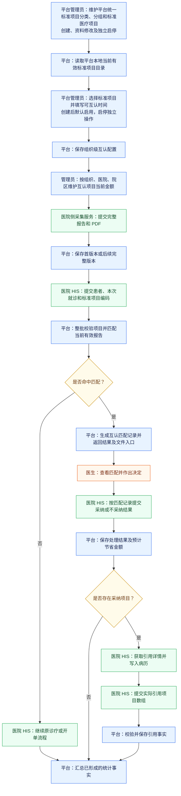
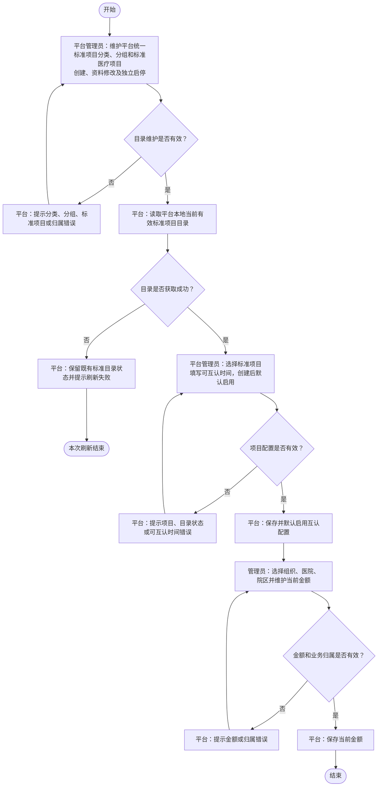
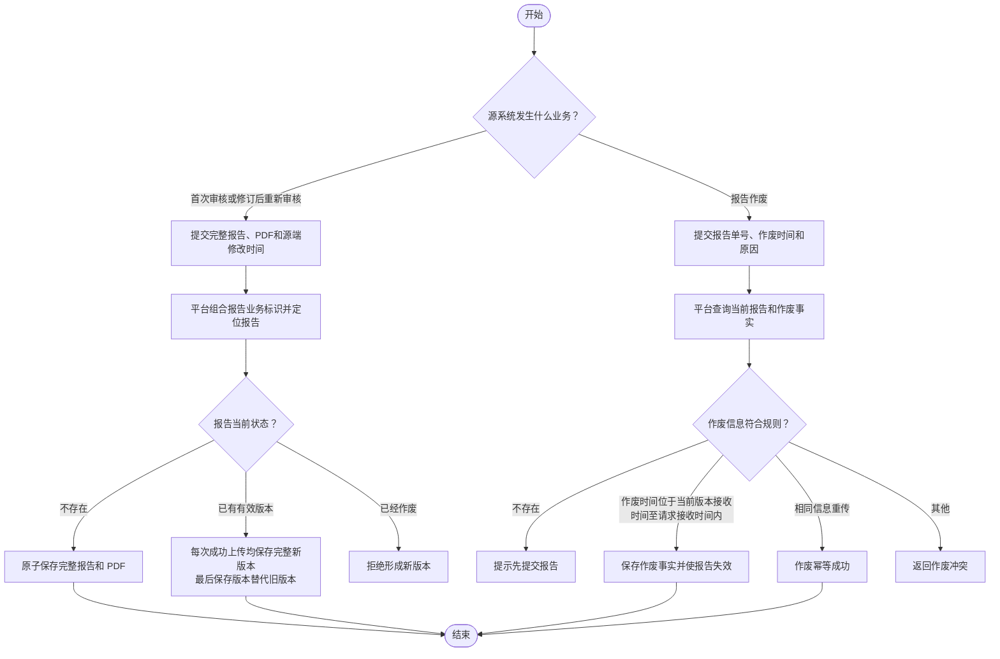
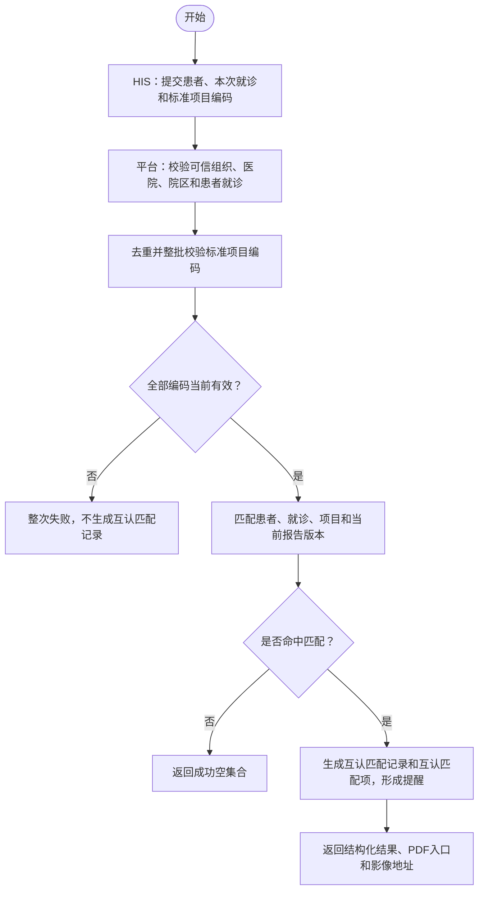
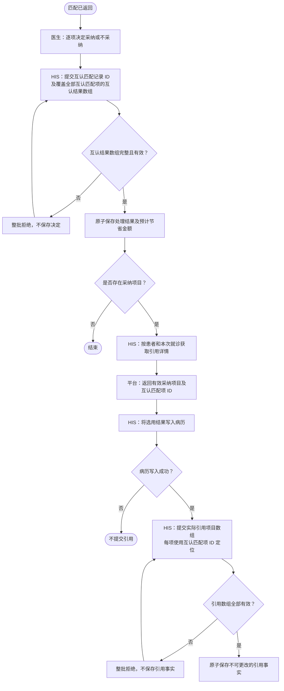
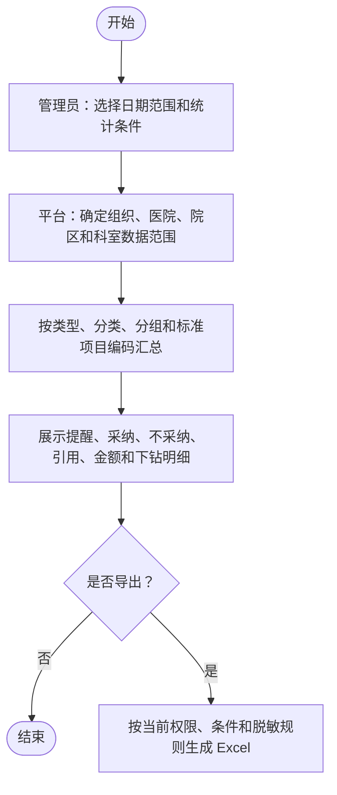

# 检验检查结果互认平台流程图

> 当前业务基线：`CONTEXT.md` 与《需求规约 SRS》。本文只表达当前 MVP 业务流程，不保留已废弃的医院本地项目、项目映射、旧操作类型或历史兼容规则。

## 一、端到端业务全景流程

本流程展示互认项目配置、报告采集和在线互认服务的端到端路径。蓝色表示平台，绿色表示医院及厂商，橙色表示医生，黄色表示判断。

- 平台管理员先维护平台统一标准项目分类、分组和标准医疗项目，再从本地当前有效标准目录中选择标准项目建立组织级互认配置；互认项目直接复用标准项目编码，平台不维护医院本地项目主数据和项目映射。
- 项目类型固定为“检验”或“检查”，标准目录按类型、分类、分组和标准项目组织；互认配置直接引用标准项目，配置保存后再按组织、医院、院区和标准项目编码维护当前金额。
- 报告明细直接提供有效互认项目编码后，才参与匹配、采纳、引用、统计和导出。
- 医院 HIS 直接提交标准项目编码查询匹配，平台不替医生作出临床决定。

## 二、平台责任边界

| 责任方 | 主要职责 |
|---|---|
| 互认平台 | 选择和维护互认项目、分类分组、组织医院院区金额；接收完整报告；校验标准项目编码；保存报告版本；提供匹配、引用详情和文件入口；记录互认、引用、审计和统计事实 |
| 医院侧采集服务 | 从医院源系统取得审核完成的完整报告，直接填报需要参与互认的标准项目编码，提交报告和 PDF，处理失败重试、后续完整版本及独立作废 |
| 医院 HIS | 查询匹配、展示匹配、提交医生决定、获取引用详情、写入病历并提交实际引用结果 |
| 医生 | 查看匹配结构化结果、报告 PDF 或影像入口，根据患者当前情况作出临床决定 |

医院侧采集服务是医院或实施厂商负责的外部系统，不属于互认平台 MVP 建设模块。平台不规定其数据库读取、轮询、本地队列、前置机或网络实现。

## 三、业务边界约束

1. 互认项目直接复用标准项目编码。平台不维护医院项目目录和映射关系，不根据医院本地项目编码或名称推断互认关系；报告来源提供的项目名称和项目编码可以按原文保存用于来源追溯。
2. 项目类型固定为“检验”或“检查”；分类和分组由平台统一维护，一个分组只能属于一个分类，一个项目在 MVP 中只有一个类型、分类和分组。
3. 金额业务键为组织编码、医院编码、院区编码和标准项目编码。金额当前有效、非负、最多两位小数，允许为零，不继承、不回退。
4. 标准目录不可用时，平台阻止重新启用互认配置和新的互认业务；上级目录恢复后，自身仍启用的标准项目和互认配置自动恢复可用，自身已停用的对象仍需独立启用。既有报告和历史事实仍可读取；已存在互认配置的项目金额仍可查看和维护。
5. 报告首次或后续提交均完整保存全部明细；无互认编码的明细，以及明确提供但不存在、超出组织范围、对应互认配置停用或标准目录不可用的编码，均不参与互认匹配。
6. 只有当前组织内互认配置启用且标准目录层级有效的互认项目编码形成匹配资格；编码缺失或不可用不导致整次报告提交失败。
7. 报告已存在且未作废时，每次完整上传成功均保存完整新版本，最后成功保存的版本成为当前版本；不按源端报告修改时间判断重传或版本顺序。
8. 作废通过独立能力提交报告单号、作废时间和原因；作废不生成内容版本、不物理删除历史。
9. 匹配查询直接提交标准项目编码。任一编码无效、停用、标准目录不可用或超出组织范围时整次失败；全部有效但未命中时返回成功空集合。
10. 非空匹配查询成功生成互认匹配记录和互认匹配项，并形成提醒事实、发布匹配返回事件；空匹配只返回成功空集合，不创建匹配记录、匹配项或提醒，不发布匹配返回事件；查看、下载和调阅均不等于采纳。
11. 医院 HIS 一次提交覆盖互认匹配记录全部项目的互认结果数组；不采纳必须提供平台统一原因代码，整组原子保存。首次成功保存后决定不可更改。
12. 采纳时按接收组织、医院、院区和标准项目编码的当前金额形成预计节省金额；金额未配置按零元；非法金额在金额配置保存阶段拒绝，金额不表示实际收费、医保结算或患者退费。
13. 获取引用详情只提交患者证件信息和本次来源就诊，并受全平台统一有效时长约束；病历写入成功后再提交实际引用项目数组。
14. MVP 不建设报告更正或作废后的主动推送、PushCenter、推送记录菜单、查询流水号或提醒事件标识。
15. 统计和导出遵循权限、组织医院院区范围、当前查询条件和脱敏规则，使用平台类型、分类、分组和标准项目编码。

## 四、后续拆分图

1. 互认项目配置、分类分组与金额管理流程（见第五节）。
2. 报告数据采集与生命周期流程（见第六节）。
3. 互认匹配查询与标准项目编码校验流程（见第七节）。
4. 互认处理、引用详情与引用结果流程（见第八节）。
5. 互认统计与导出流程（见第九节）。

## 五、互认项目配置、分类分组与金额管理流程

流程规则：

1. 标准项目名称和目录属性从平台本地标准目录获取，不重复保存为互认配置字段。
2. 分类名称在全平台标准目录内唯一，分组名称在同一分类下唯一。未被下级使用的分类可修改项目类型和名称，未被标准项目使用的分组可修改所属分类和名称，但必须满足唯一性及有效父级约束；已被下级使用后，分类不得修改项目类型和名称，分组不得修改所属分类和名称，且均不得物理删除。停用不自动修改下级配置状态。
3. 标准目录不可用的互认配置不得新增或重新启用；替代项目必须重新选择，不能自动替换。既有配置即使自身或标准目录停用，仍可修改可互认时间，但不改变启停状态，也不因此形成新的匹配。
4. 对已启用对象再次启用或对已停用对象再次停用时，平台按幂等成功处理，不改变状态，也不重复形成启停事件。
5. 平台管理员可维护全部范围金额；医院管理员只能维护可信上下文所属医院及其院区的金额。
6. 金额调整只影响之后保存的采纳处理结果，不重算历史预计节省金额。
7. 只要组织级互认配置存在，目录或配置当前停用也允许查看和维护金额；停用不删除既有金额。

## 六、报告数据采集与生命周期流程

流程规则：

1. 完整报告提交不传新增、更正或作废状态，也不传平台报告 ID、组合业务标识或版本号。
2. 结构化报告和 PDF 共同成功或失败；平台不比较完整内容，不计算 PDF 摘要。
3. 报告首次或已存在且未作废时，每次完整上传成功均保存完整版本；不判断重试、不按源端报告修改时间排序，最后成功保存的版本成为当前版本。编码缺失或不可用不阻止保存，但不形成匹配。
4. 无互认编码或不可用互认编码的明细保留为报告内容，不参与匹配、采纳、引用、统计或导出。
5. 后续版本或作废形成后，旧版本停止参与匹配和引用详情；历史版本只读保留。
6. 完整报告提交不提供幂等成功语义；网络重试再次成功时也形成新版本。源端报告修改时间只用于来源追溯。

## 七、互认匹配查询与标准项目编码校验流程

流程规则：

1. 项目编码必须属于当前组织内已启用且标准目录层级有效的互认项目；平台不解析医院本地项目编码。
2. 平台不使用来源项目名称或来源项目编码推断互认关系。
3. 匹配仅在来源组织与接收组织一致时进行，并受互认项目状态、报告版本和可互认时间约束；本院报告是否参与由全局参数控制。
4. 重复编码只处理一次；多个项目命中同一报告时归并展示。
5. 只有成功返回非空匹配才形成提醒。

## 八、互认处理、引用详情与引用结果流程

流程规则：

1. 互认处理请求在集合级提交互认匹配记录 ID、互认时间、互认科室和互认医生；互认结果数组必须恰好覆盖互认匹配记录全部项目，不采纳使用平台统一原因代码。
2. 互认匹配记录首次成功保存处理结果后，决定不可更正、撤销、删除或覆盖；完整相同重试优先按已保存事实幂等成功处理，报告版本后续失效不改变该结果；业务内容不同则返回冲突。未命中既有已保存事实时，互认项目或标准目录在匹配返回后停用、不可用，不否定已经形成的匹配；只要绑定报告版本仍为当前有效版本，仍允许保存真实发生的采纳或不采纳处理结果。
3. 采纳时使用接收组织、医院、院区和标准项目编码的当前金额；金额未配置按零元；非法金额在金额配置保存阶段拒绝，不采纳不形成金额。
4. 引用详情不要求提交互认匹配记录 ID、互认匹配项 ID 或互认时间。平台按各互认匹配记录处理结果首次成功保存时间和当前全平台统一正整数分钟参数校验有效期。
5. 实际引用数组只提交已采纳且实际写入病历的互认匹配项，不提交互认匹配记录 ID。一次请求允许包含不同互认匹配记录的项目，平台按全局唯一的互认匹配项 ID 反查所属集合、采纳结果和报告版本，本次数组仍整批校验和原子保存。
6. 引用事实首次成功保存后不可更正、撤销、删除或覆盖。

## 九、互认统计与导出流程

流程规则：

1. 医院管理员只能查看本院及有权院区；平台管理员按授权查看组织汇总和医院明细。
2. 提醒按非空互认匹配记录生成时间统计；采纳、不采纳及金额按互认时间统计；引用按实际引用时间统计。
3. 同期互认率按“采纳次数 ÷ 提醒次数 × 100%”计算；提醒为零时不计算。
4. 分类和项目维度使用平台当前配置，不使用医院来源分类或项目映射。
5. 明细和导出遵循当前查询条件、权限和患者脱敏规则；无数据时不生成空文件。
