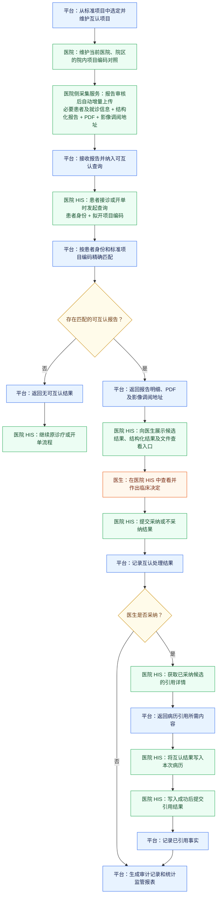
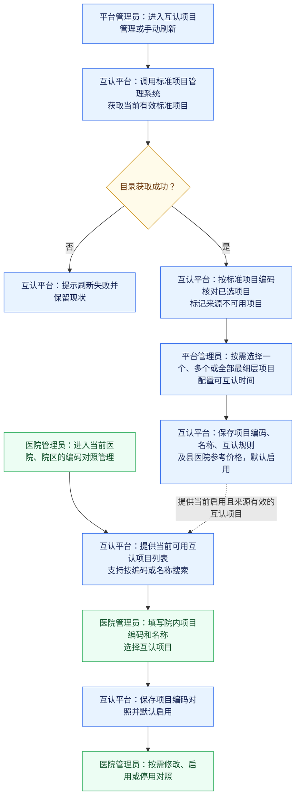
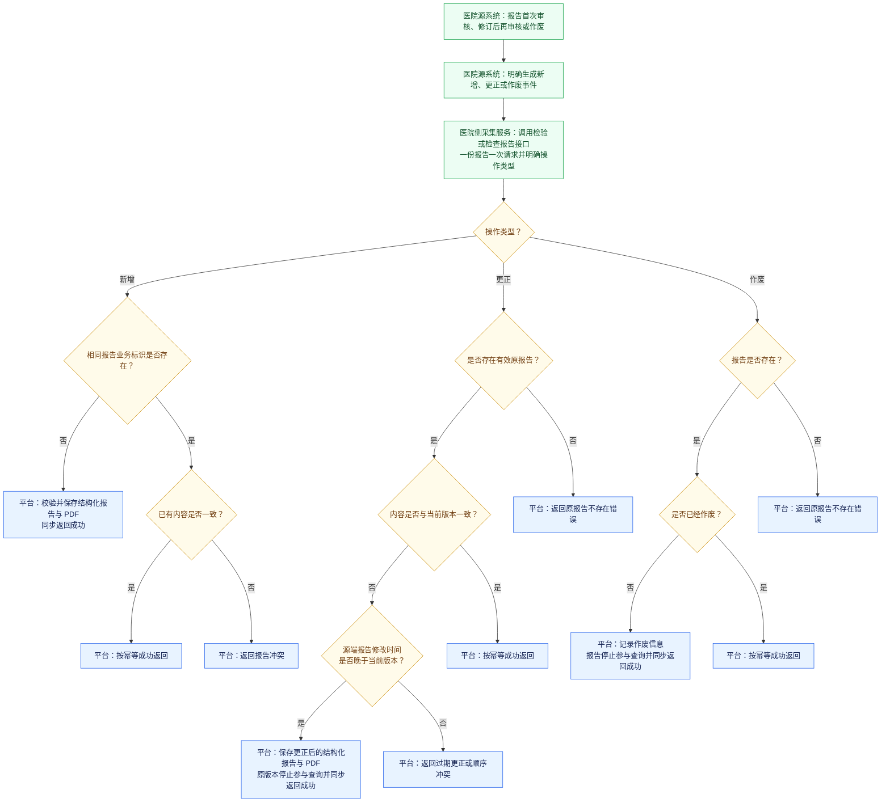

# 检验检查结果互认平台流程图

> 阶段状态：MVP 业务需求澄清已于 2026-07-29 确认结束。本文已确认的流程及第 1-144 条规则作为后续 PRD、SRS 编写的业务基线；未来专题不进入 MVP。

## 一、端到端业务全景流程

本流程面向 MVP 版本，将编码对照、数据采集和在线互认服务画成一条端到端主流程，节点颜色区分责任方（蓝：平台，绿：医院及厂商，橙：医生，黄：判断）：

- 平台仅接收至少包含一个已完成有效项目编码对照明细、并且已经审核的新产生报告，不回填上线前历史数据。
- 数据接收成功后纳入平台存储；查询时按互认项目的当前状态和可互认时间判断是否返回，不再按质控资格或互认范围进行额外业务筛选。
- 格式、必填项、患者标识、重复数据及报告作废状态等检查属于数据有效性控制，不属于互认资格筛选。
- 在线互认服务由医院 HIS 发起，平台提供候选查询、处理结果反馈、引用详情、引用结果反馈以及 PDF 和影像查看入口，不代替医生作出临床决定。

## 二、平台责任边界

| 责任方 | 主要职责 |
|---|---|
| 互认平台 | 从标准项目中选定并维护互认项目、保存医院编码对照、报告采集接收、数据校验、患者关联、报告存储与索引、可互认候选检索、报告 PDF 及影像查看入口、互认结果留痕、审计与统计 |
| 医院及系统厂商 | 按当前医院和院区自行维护项目编码对照、改造 HIS/LIS/PACS、配置医院侧采集服务自动上传报告、处理失败重传及更正或作废、调用平台查询接口、展示候选结果、反馈处理和引用结果 |
| 医生 | 在医院 HIS 中查看候选结构化结果、报告 PDF 或影像，根据患者当前情况作出采纳或不采纳的临床决定 |

医院侧采集服务是医院或实施厂商负责的外部系统，不属于互认平台 MVP 的建设模块。平台只设计接收接口和交互责任，不规定其数据库读取、采集表、轮询、本地队列、硬件或网络实现。

## 三、边界约束

1. MVP 版本中，至少包含一个已有效对码项目、已经审核且通过基础校验的报告在接收成功后纳入可互认数据管理，但是否作为候选结果返回仍取决于对应互认项目当前状态和可互认时间；这不代表平台替医生作出了临床采纳决定。
2. 弹窗提醒、撤销或避免重复开单、病历引用和不互认原因录入属于医院 HIS 的业务能力，除非项目后续明确建设由平台提供的院端嵌入程序。
3. 平台只能确认查询接口已被调用、候选结果已返回以及文件入口是否发生技术访问，不能据此推断医生已经查看、理解或采纳。MVP 不建立提醒或调阅业务状态，只记录医院 HIS 明确反馈的采纳、不采纳和后续引用结果。
4. 普通检验结果由平台按来源医院、院区和院内项目编码查找当前有效的项目编码对照，医院侧不上传标准项目编码。一份报告至少有一个结果明细能够对应有效对照时，平台接收并完整保存报告及全部结果明细。已对码明细参与互认查询；未对码明细仅用于保持原报告内容完整、展示和来源追溯，不形成互认候选。没有任何已对码明细的报告不上传或拒绝接收。
5. MVP 版本不导入上线前历史报告，只处理平台上线后新产生并审核的报告。
6. 平台接收报告时不按可互认时间、质控资格或互认范围进行二次业务筛选；查询时按互认项目当前状态和可互认时间判断是否返回。基础字段缺失或患者无法关联时拒绝接收，重复上传按第 9 条处理，报告作废后停止提供该数据。
7. MVP 版本不设置独立的挂号人员信息上传。每份报告随附必要的患者身份、人口学及就诊信息，平台接收报告后据此建立内部患者和就诊关联；预约日期、预约来源和挂号记录创建时间不进入报告公共结构。就诊类型和院内就诊流水号为必填字段，平台按医院、院区、就诊类型和院内就诊流水号识别一次来源就诊；就诊类型至少覆盖门诊、急诊、住院和体检，院内就诊流水号使用源系统中稳定且不循环复用的内部标识。报告公共结构不增加统一的就诊时间、入院时间或出院时间，报告自身的申请、采集、检验或检查及报告时间用于表达互认所需的时间线。住院号、病区名称、病房号和床位号在住院报告中条件应填，源系统存在时必须提供、确实没有时允许为空，仅用于授权展示、人工核对和源端追溯，不参与自动匹配，缺失或变化不影响报告接收。平台配置时，医院必须将本医院、院区下的科室和医生维护到平台权限体系。涉及科室和医生的报告字段只接收各角色对应的平台科室 ID、平台医生 ID，不接收院内科室编码、医生工号或名称；平台根据 ID 查询并保存科室名称和医生姓名。任一 ID 不存在或者不属于当前调用医院、院区时，整次报告提交失败且不保存报告。允许同一科室或医生承担报告中的多个角色。
8. 跨院患者关联以证件类型和证件号码精确匹配。患者姓名、性别代码和出生日期为必填字段，仅用于一致性校验；性别无法明确时填写标准值域中的未知代码。MVP 不进行姓名相似度或概率匹配，无法提供有效证件信息，或者缺少姓名、性别代码、出生日期的报告不予接收。相同证件类型和证件号码已存在，但姓名、性别或出生日期任一项不一致时，平台返回患者身份信息冲突，不覆盖患者资料或创建第二个患者，由医院修正源端信息后重新提交；不单独采集院内就诊卡类型和卡号，未来稳定的跨院电子健康卡凭证统一通过证件类型和证件号码表达。患者本人或联系人电话为应填字段，源系统存在时必须提供、确实没有时允许为空，仅供授权医务人员辅助核对并默认脱敏展示，不参与自动匹配，缺失或不一致不影响报告接收。报告时年龄同样为应填字段，与出生日期同时保留，用于展示婴幼儿等按年、月、日表达的原报告年龄，不参与自动匹配。
9. 报告按医院、院区、报告类型和报告单号唯一识别。相同标识且内容一致的重复上传按幂等成功处理；内容不一致时返回报告冲突，不静默覆盖，后续通过报告更正流程处理。
10. 至少包含一个已有效对码项目的新报告在审核完成后，由医院侧采集服务自动增量上传。医院和平台不逐份挑选或审批正常报告，也不得修改报告临床内容；人工只处理状态查看、失败重传、更正或作废以及异常暂停。医院侧服务可以部署在前置机，也可以采用其他满足隔离和自动采集要求的部署方式。
11. 每次接口请求只提交一份报告变更。医院源系统必须明确提供新增、更正或作废操作类型，医院侧采集服务负责转发；平台不根据内容变化或记录缺失自行猜测操作类型。重传沿用原操作类型，不视为新增操作。
12. 检验报告和检查报告各自使用一个提交接口，并通过报告操作类型表达新增、更正或作废。新增和更正携带完整报告；更正仅适用于已经存在的有效原报告，平台保存新版本并使原版本停止参与查询，找不到原报告时返回错误，不自动按新增处理。
13. 作废通过对应报告提交接口传入作废操作类型、报告业务标识、作废时间和原因，不重复提交结构化报告、明细或 PDF。报告作废后停止参与查询但不物理删除；重复作废按幂等成功处理，找不到原报告时返回错误。
14. 报告接口同步完成必要校验和保存，并返回成功、幂等成功或明确的失败结果。调用超时或未获得明确结果时，医院侧重新提交相同操作和内容，平台依据报告业务标识及当前报告状态进行幂等处理，不要求调用方提供事件标识。
15. 新增或更正报告时，结构化报告数据与报告 PDF 在同一次请求中提交，并作为一个完整单元校验和保存。任一部分失败时整份报告返回失败；PDF 文件摘要参与重复提交的内容一致性判断。
16. MVP 不接收或存储 DICOM 等影像文件。每份检查报告最多保存一个可供授权跨院用户访问的 HTTPS 影像调阅地址；平台不代理或缓存影像内容，报告作废后不再返回该地址。地址及影像服务的可用性、内容和保存期限由医院或区域影像中心负责。
17. 检验报告和检查报告使用各自唯一的提交接口，并复用患者、就诊和报告业务标识等公共结构。两个接口均通过报告操作类型支持新增、更正和作废，不再拆分独立的生命周期接口。
18. 检验报告包含报告主信息以及普通检验结果，并可按需包含细菌鉴定结果和药敏结果。药敏结果关联对应的细菌鉴定结果；MVP 只接收最终结果，不采集培养过程、仪器原始数据或实验室工作流。
19. 甘肃四张检验业务表只作为字段范围和主从关系参考，不直接复制为互认平台内部表。平台借鉴修改标志所表达的新增、更正和作废含义，但使用语义明确的报告操作类型；批次号和上传状态不进入平台接口或报告业务数据。MVP 不要求调用方提供事件标识，也不生成用于业务设计的技术请求流水号，待医院侧采集方案确定后再讨论传输追踪。
20. 新增和更正报告必须携带医院源系统中的源端报告修改时间，该时间不等同于平台框架维护的记录修改时间。更正内容与当前版本不同时，源端报告修改时间必须晚于当前版本；时间更早或相同则按过期更正或顺序冲突拒绝。

## 四、后续拆分图

本全景流程确认后，后续分别细化：

1. 编码对照管理流程（见第五节）。
2. 报告数据采集与异常处理流程。
3. 可互认查询与患者、项目编码匹配流程。
4. 互认查询与后续反馈的关联、医生处理结果、拟开项目及互认金额统计口径流程。
5. 报告更正或作废后的变更推送与提交追踪流程。

## 五、编码对照管理流程

本流程覆盖平台选定互认项目，以及医院按当前登录医院、院区维护院内项目编码对照的过程：

流程规则：

1. 互认平台保存已选最细层项目的标准项目编码、名称、可互认时间、启停状态、来源状态和参考价格，不保存项目类型、类别或分组。上线初始化时由县医院提供当时有效的价格清单，平台管理员据此录入各互认项目参考价格；后续价格调整仍由平台管理员执行，不要求平台从价格系统自动同步。参考价格为空时不得完成新增或保存。
2. 每次进入互认项目管理菜单时自动获取一次当前有效标准项目，平台管理员也可以手动刷新。只有完整获取成功后才更新来源状态；获取失败时保留现状。
3. 标准项目的编码、名称和所属目录创建后不可修改；旧项目停用后标记为来源不可用，替代项目必须重新选择，医院随后重新调整编码对照，不自动替换。
4. 医院对码时使用按项目编码、名称搜索的平铺列表，只能选择当前启用且来源有效的互认项目。医院项目编码对照不维护或选择价格，金额统计统一使用互认项目上由平台维护的县医院参考价格。
5. 医院和院区取当前登录上下文。同一医院、院区和院内项目编码不得存在多条启用对照；多个院内项目可以对照同一个互认项目。
6. 新建互认项目和编码对照均默认启用且不物理删除。互认项目允许调整可互认时间、参考价格和启停状态；参考价格只保留当前值，MVP 不建设独立的价格版本或变更历史，使用框架已有修改时间和修改人记录维护操作。编码对照允许修改院内项目名称、所选互认项目和备注，但医院、院区和院内项目编码创建后不可修改。
7. 平台管理员可以跨机构查看编码对照并执行异常停用，但不负责医院日常对码，也不逐条审批。
8. 互认项目停用或来源不可用时，停止新增对照、新报告上传和已有报告查询；编码对照停用只阻止后续报告上传，不改变已接收报告。
9. 可互认时间从报告出具时间开始计算，只用于查询窗口；调整后按当前配置对已有报告即时生效，不用于报告接收校验。

## 六、报告数据采集与异常处理流程

本流程从互认平台接口边界描述报告新增、更正和作废，不展开医院侧采集服务的内部实现：

流程规则：

1. 一份报告及其患者、就诊、报告主信息、项目明细和文件信息作为一个完整提交单元，不将多份报告组成共同成功或共同失败的业务批次。
2. 新增报告已存在且内容一致时按幂等成功处理；内容不一致时返回冲突，不自动覆盖。
3. 更正必须提交修订后的完整报告，不提供局部字段修改；平台保留原版本与新版本之间的关系。
4. 作废不删除报告及历史版本，只改变其有效状态并停止参与查询。
5. 医院侧采集服务可以并发提交多份报告；如果以后增加批量传输能力，平台仍应对批次中的每份报告独立处理并返回结果。
6. 调用超时或未收到明确结果时，医院侧重新提交相同操作和内容；平台依据报告业务标识、当前状态和内容一致性进行幂等处理，完成校验和保存后才返回最终成功结果。
7. 新增和更正请求同时携带结构化报告数据与 PDF，并提供 PDF 文件摘要；两者作为一个完整报告单元共同成功或共同失败。
8. 检查报告可以携带一个影像调阅地址，检验报告不要求提供。平台只校验、保存并按权限返回该地址，不接收 DICOM；没有外部影像系统反馈时，平台不能仅凭地址返回或点击行为认定医生已经查看影像。
9. 检验报告与检查报告使用不同的提交结构：检验报告表达标本和项目结果明细，检查报告表达检查部位、检查所见、诊断结论和影像调阅地址；两者复用公共患者、就诊和报告信息。
10. 检验报告的项目明细分为普通检验结果、可选细菌鉴定结果和可选药敏结果。药敏结果应关联对应的细菌鉴定结果；三类明细只表达审核后的最终结果。
11. 平台内部数据模型不与甘肃交换表一一对应；报告及其版本、普通结果、细菌结果和药敏结果按平台业务关系组织，外部地区报文在接入边界完成转换。
12. 平台不要求来源批次号、上传状态或调用方事件标识，也不预设医院侧采用批次上传。检验和检查报告各自通过一个接口接收新增、更正和作废操作，操作类型只用于决定本次请求的处理方式，不作为报告当前状态或最近操作字段。
13. 新增和更正报告携带源端报告修改时间。相同报告业务标识的更正与当前版本内容一致时按幂等成功处理；内容不一致时，只有源端报告修改时间更晚才能保存为新版本，否则返回过期更正或顺序冲突。
14. 检验人、检查医生、报告医生和审核医生等报告级责任人员的平台医生 ID 均为必填，平台根据 ID 查询姓名，并将 ID 与姓名随报告版本分别保存，更正不得覆盖旧版本责任记录。普通结果、细菌结果和药敏结果的检测人及明细审核人平台医生 ID 为应填，源 LIS 存在且能够关联平台医生时提供、确实无法提供时允许为空，缺失不影响报告接收或互认判断；接口不接收人员工号或姓名，平台不采集仪器原始过程日志，也不替代来源 LIS 的完整操作和质控审计。
15. 检验和检查报告均在报告级提供执行科室 ID 和报告科室 ID，全部必填且允许两个角色由同一科室承担。接口不接收院内科室编码或科室名称，平台根据 ID 查询并保存对应名称。
16. 检验和检查报告的申请时间、报告时间为必填，审核时间为应填；报告时间用于计算可互认时间范围。新增和更正另行必填源端报告修改时间。打印时间、数据填报时间和上传时间不作为来源报告业务字段，平台自行记录实际接收时间。
17. 检验报告的标本采集时间、标本送检时间和检验科接收时间为应填，源系统存在时提供、不存在时允许为空；检测完成时间为必填。上述时间随报告版本保存，用于展示和问题追溯，MVP 不采集上机、离心、培养过程节点等实验室内部过程时间。
18. 检查报告的实际检查时间为必填，不采集预约检查时间；MVP 不拆分检查开始和完成时间，报告时间、审核时间仍按公共时间规则单独保存。
19. 检验报告在报告级必填院内标本号、标本类型编码和标本类型名称。一份检验报告只对应一个标本，可以包含多个普通结果、细菌结果和药敏结果；多个标本分别形成不同报告，MVP 不维护一份报告内结果与多个标本的关联。
20. 检验报告在报告级必填来源报告名称，用于展示和院内原报告核对；报告类别编码和名称为应填，源 LIS 存在时提供、不存在时允许为空。报告类别只用于展示、筛选和来源追溯，不参与互认资格判断；互认范围仍按结果明细中的院内项目编码及其有效项目编码对照确定。
21. 检验报告备注为报告级应填信息，源 LIS 存在时提供、不存在时允许为空，并随报告版本保存。备注用于展示、补充临床说明和问题追溯，不参与互认资格、结果异常判断或报告接收校验，也不替代报告更正原因或作废原因。
22. 检验报告整体异常标识为报告级应填信息，源 LIS 存在时提供、不存在时允许为空，并随报告版本保存。它用于报告列表提示和人工核对，不替代结果明细的异常标志，也不参与互认资格判断；MVP 不因整体标识与明细异常标志不一致而拒收报告。
23. 检验报告的来源医嘱流水号为报告级应填信息，源系统存在时提供、不存在时允许为空，用于回溯本次检验申请或医嘱，不参与报告业务标识、患者关联或互认判断。MVP 不保存报告级单一医嘱项目代码，具体项目由结果明细中的院内项目编码表达。
24. 普通检验结果、细菌结果和药敏结果的来源结果明细标识为应填，源系统存在时提供、不存在时允许为空；提供时在同一报告版本内不得重复。该标识只用于定位和追溯明细，不形成独立更正或作废生命周期，也不参与报告业务标识或幂等判断。
25. 一份检验报告只要至少包含一个能够对应当前有效项目编码对照的结果明细，即可接收并完整保存全部结果明细。已对码明细参与互认查询；未对码明细仅作为完整报告内容用于展示和来源追溯，不形成互认候选。没有任何已对码明细的报告不进入平台。
26. 普通检验结果必须提供院内项目编码和名称，由平台按来源医院、院区及院内项目编码解析当前有效对照，不要求医院侧上传标准项目编码。解析成功时，平台在报告结果中记录对应的互认项目编码和名称，后续对照修改或停用只影响新上传报告；细菌结果和药敏结果不独立进行互认项目对码。
27. 普通检验结果必须提供来源 LIS 最终报告上的完整结果文本，并以受控结果类型区分数值型、定性型和文本型。MVP 不重复设置独立的定量结果和定性结果字段，也不解析、换算或重新判定结果内容。
28. 普通检验结果的单位为应填字段，源 LIS 存在时提供，不存在或结果不适用单位时允许为空，并按原报告文本保存。MVP 不统一单位编码、不自动换算单位，也不因单位缺失而拒收报告。
29. 普通检验结果的来源参考范围文本为应填字段，源 LIS 存在时提供、不存在时允许为空，并按最终报告内容保存。MVP 不单独拆分参考上限和参考下限，也不根据患者信息或检测方法重新计算参考范围。
30. 普通检验结果的异常标志为应填字段，源 LIS 存在判断时提供、没有判断时允许为空，并以受控值表达正常、偏高、偏低和其他异常。平台只展示来源判断，不重新计算异常状态，也不因结果异常而排除互认。
31. 普通检验结果的危急值标志为应填字段，源 LIS 能够判断时明确提供是或否，不具备判断能力时允许为空。平台可以突出展示来源危急值标记，但不自行计算，也不承担医院内部危急值通知、确认和闭环处置职责。
32. MVP 不采集或推断统一检验结果代码。平台以来源结果值为最终展示依据，并通过结果类型、异常标志和危急值标志表达必要语义；待明确跨机构统计或结果计算用途以及采用的统一值域后再专题设计。
33. 普通检验结果的 LOINC 编码为应填字段，源 LIS 已维护时提供、未维护时允许为空，用于补充标准医疗项目的检验观测语义粒度。MVP 仍按院内项目编码的有效项目编码对照判断互认范围，LOINC 不替代该对照，也不由平台根据项目名称自动推断。
34. 普通检验结果的检测方法为明细级应填字段，源 LIS 存在时提供、不存在时允许为空，并按最终报告文本保存。检测方法用于辅助解释和追溯，不参与互认资格判断；MVP 不统一方法编码，也不根据项目名称或 LOINC 自动推断。
35. 普通检验结果的来源仪器编号和名称均为明细级应填字段，源 LIS 存在时提供、不存在时允许为空。MVP 不维护仪器目录，也不采集设备类别编码；仪器信息只用于辅助解释和问题追溯，不参与互认判断。
36. 普通检验结果必须提供来源报告中的展示序号，平台按该序号保存和展示，不依赖接口数组顺序、数据库返回顺序或自行排序。展示序号在同一报告版本的普通结果内不得重复，更正时随完整结果重新提交。
37. 普通检验结果的来源检验收费项目编码和医保收费项目编码均为明细级应填字段，源 LIS 已维护时提供，没有独立收费项目编码时允许为空。平台按来源值保存且不填充占位编码；互认金额的计算和统计口径留到互认查询反馈流程中讨论。
38. 细菌培养未发现细菌时仍须随完整检验报告提交一条细菌鉴定结果，明确表达未检出状态并保存来源结果文字。未检出时不要求医院伪造特殊菌种编码或名称，也不得因没有具体菌种而省略该最终结果。
39. 细菌鉴定结果检出具体菌种时，来源菌种名称为必填字段；来源菌种编码为应填字段，源 LIS 已维护时提供、未维护时允许为空。平台不根据菌种名称自动推断编码，也不因编码缺失而拒收报告。
40. 细菌鉴定结果的菌落计数为应填字段，源 LIS 存在时提供，不适用或未产生时允许为空。平台按包含数值、比较符号及单位的来源文本保存，MVP 不拆分数值与单位、不进行单位换算，也不重新判定临床意义。
41. 细菌鉴定结果的来源培养基、培养时间、培养条件和发现方式均为应填字段，源 LIS 存在时提供、不存在时允许为空。培养时间按包含单位的来源文本保存，其他字段也保留来源描述；MVP 不建立相关字典、不进行标准化，也不据此重建培养过程。
42. 细菌鉴定结果的来源检测结论为必填字段，以简要文字表达检出、未检出、有生长或其他最终判断；来源详细文字描述为应填字段，源 LIS 存在时提供、不存在时允许为空。MVP 按来源文字保存，不建立统一结论代码，也不自动推断或改写结论。
43. 细菌鉴定结果的来源仪器编号和名称均为应填字段，源 LIS 存在时提供、不存在时允许为空，用于辅助问题追溯。MVP 不采集设备类别编码、不维护仪器目录，仪器信息也不参与互认资格判断。
44. 细菌鉴定结果的来源试验板序号和名称均为应填字段，源 LIS 存在时提供、不存在时允许为空，用于辅助实验室问题追溯。MVP 不维护试验板目录，也不根据试验板信息重建培养或检测过程。
45. 药敏结果的来源受试药物名称为必填字段；来源药敏代码为应填字段，源 LIS 已维护时提供、未维护时允许为空。平台不根据药物名称自动推断代码，也不在 MVP 中维护独立的药敏药物目录。
46. 药敏结果的来源结论文字为必填字段，用于表达敏感、中介、中度敏感、耐药或其他最终判断；来源抗药结果代码为应填字段，源 LIS 已维护时提供、未维护时允许为空。平台不根据文字自动推断代码，也不根据检测值重新判读药敏结论。
47. 药敏结果的来源纸片含药量、最小抑菌浓度（MIC）、抑菌环直径和参考值均为应填字段，源 LIS 存在时提供，不适用或未产生时允许为空。平台按包含单位、比较符号的来源文本保存，不拆分或换算数值和单位，也不重新判读药敏结论。
48. 每条药敏结果必须提供来源报告中的展示序号，平台按该序号保存和展示，不依赖接口数组顺序、数据库返回顺序或自行排序。展示序号在同一报告版本、同一细菌鉴定结果关联的药敏结果内不得重复，更正时随完整结果重新提交。
49. 药敏结果的来源检测方法为应填字段，源 LIS 存在时提供、不存在时允许为空，用于辅助医生解释结果和问题追溯。平台按来源文字保存，不统一方法编码，也不根据检测方法或检测量值重新判读药敏结论。
50. 药敏结果的来源试验板序号为应填字段，源 LIS 存在时提供、不存在时允许为空，用于辅助来源追溯。药敏结果不重复保存试验板名称，仍通过明确的细菌鉴定结果关联建立归属，不使用试验板序号代替关联关系。
51. 一份检查报告可以包含一个或多个检查项目明细。每个明细分别提供来源院内检查项目编码和名称、携带属于该项目的结构化检查部位集合，并分别解析其互认项目；检查所见、诊断结论、报告 PDF 和影像调阅地址仍属于整份报告，医院不需要为项目对码强制拆分联合检查报告。
52. 包含多个检查项目的报告只要至少一个项目明细能够对应当前有效的互认项目，即可作为完整报告接收并保存全部项目明细。已对码明细参与互认查询，未对码明细仅用于保持原报告完整、展示和来源追溯；没有任何已对码明细的检查报告不进入平台。
53. 检查报告的来源检查类型代码和名称均为报告级应填字段，源系统存在时提供、不存在时允许为空，用于展示、筛选和追溯。来源检查类型与标准项目目录的检查类型、分类或分组不建立编码或标识强关联，也不用于自动确定互认项目；互认判断仍以院内检查项目编码的有效项目编码对照为准。
54. 检查部位归属于具体的检查项目明细，而不是整份报告。一个项目明细可以携带多个结构化部位项，使部位编码和名称明确对应，并区分联合报告中不同项目各自涉及的部位；当前需求阶段不固定其物理存储方式。
55. 检查项目明细的检查部位集合为应填信息，源系统存在明确部位时提供、没有明确部位时允许为空。每个部位名称为必填、来源部位编码为应填；检查部位不采集业务展示序号，平台只保证完整保存编码与名称的对应关系，具体展示排序留到界面设计阶段确定，来源版式和临床阅读顺序以报告 PDF 为准。
56. 检查报告的检查所见和检查结论均为报告级必填信息，保存来源报告的完整原文，不拆分或重复归属到各检查项目明细，平台不整理、推断或改写。特殊检查确实没有检查所见时，由来源医院明确提供“无”等来源表达；MVP 使用完整长文本，不拆分正文和超长补充字段。
57. 检查报告整体异常标识为报告级应填信息，源系统存在时提供、不存在时允许为空，并随报告版本保存。它仅用于列表提示和人工核对，不参与互认资格判断；平台不根据检查所见、检查结论或项目内容自行推断异常状态。
58. 检查报告的来源检查设备编号和名称均为报告级应填信息，源系统存在时提供、不存在时允许为空，用于报告核对和问题追溯。MVP 不维护检查设备目录、不额外采集设备类别编码，设备信息也不参与项目编码对照或互认资格判断。
59. 检查报告的来源检查方法或技术描述为报告级应填信息，源系统存在时提供、不存在时允许为空。平台保存来源文字，不建立检查方法字典，也不根据检查方法推断检查项目、检查部位或互认资格；联合检查报告不在各项目明细中重复保存报告级方法。
60. 检查报告必须在报告级提供申请检查时的来源临床诊断名称，来源临床诊断编码为应填、源系统存在时提供。平台不根据检查所见或结论反推或覆盖临床诊断；MVP 不强制统一诊断编码、不进行跨医院诊断对码，临床诊断也不参与项目互认资格判断。
61. 检查报告的来源病情描述为报告级应填信息，源系统存在时提供、不存在时允许为空，用于医生理解检查背景和人工核对。MVP 不拆分主诉、症状描述及症状起止时间，不根据临床诊断自动生成病情描述，也不据此判断互认资格。
62. 检查报告的来源检查目的为报告级应填信息，源系统存在时提供、不存在时允许为空。平台保存申请检查时的来源文字，不与临床诊断或病情描述合并，也不自动生成检查目的；该信息仅用于报告解释和人工核对，不参与互认资格判断。
63. 检查项目明细不采集业务展示序号，也不要求结构化列表复现来源报告中的项目排列顺序。平台以整份检查报告为展示和变更处理单位，不按项目拆成多份报告；项目列表只需稳定展示，具体排序规则留到界面设计阶段确定，来源版式和临床阅读顺序以报告 PDF 为准。
64. MVP 不额外采集通用的检查结果代码、定性结果或定量结果字段。尺寸、数值、分级等内容保存在来源检查所见或检查结论原文中，平台不解析或换算；将来确需结构化特定指标时，再按具体检查类型单独设计。
65. 检查报告和检验报告的来源保密标识为报告级应填信息，源系统存在时按来源值原样提供、不存在时允许为空或未知，并随报告版本保存。MVP 不统一值域，也不据此过滤查询、限制调阅或触发患者授权、上传医院审批等特殊流程；该字段只用于来源信息留存，不代表平台已实现敏感报告分级保护。接入医院当前只上传依其制度允许常规跨院共享的报告，需要专项授权才能共享的报告暂不上传。
66. MVP 不采集来源医嘱的普通、急或加急等优先级代码和名称。最终报告的互认资格不受原医嘱优先级影响；就诊类型、临床诊断、病情描述和检查目的已用于表达必要上下文，急诊时效或医疗质量统计需要的优先级规则留到后续专题确认。
67. MVP 不采集医院内部登记、到检、检查或检验完成、报告书写、审核完成及归档等过程状态、标志和时间。平台只接收审核完成的最终报告，保留必要业务时间并使用报告操作类型表达新增、更正和作废；甘肃填报日期、上传状态、校验标志、数据标志和批次号等交换控制信息也不进入报告业务数据。
68. 检查报告的来源影像状态为报告级应填信息，统一表达为有影像、无影像或未知。状态为有影像但未提供跨院可用地址时仍接收报告并提示暂不可调阅；状态为无影像时地址必须为空；状态为未知时地址可有可无。平台不根据地址是否为空反推状态，也不因地址缺失影响结构化报告及 PDF 的互认资格。
69. MVP 不采集 PACS 影像号、检查实例 UID、序列 UID 等影像系统或 DICOM 技术标识，也不使用这些标识拼接调阅地址。调阅所需定位参数由医院或区域影像中心封装在单个调阅地址中，待平台真正对接影像网关或接收影像文件时再重新确认相关标识。
70. 互认平台只向医院 HIS 提供候选查询、结构化结果展示、报告 PDF 及影像查看入口、互认处理结果反馈等服务能力，不直接操作医院开单流程。医院自行决定调用时机、提醒界面及医嘱处理方式，医生负责临床决定；查询被调用、候选被返回或文件入口发生技术访问均不等于医生已经采纳，平台只记录医院 HIS 明确反馈的处理结果。MVP 不建立独立调阅业务状态、调阅反馈接口或调阅统计。
71. 医院 HIS 只在医生作出明确决定后反馈采纳或不采纳，并必须提供医生实际作出本次决定、精确到秒的互认时间；尚未决定、关闭提醒或没有反馈均不要求提交“未处理”状态。互认结果可以在医生作出决定后立即提交，也可以由医院 HIS 稍后提交；接口超时、失败或未获得明确结果时使用同一接口重新提交原记录。平台不建设独立的延后提交接口或管理功能，也不得使用接口接收时间代替互认时间。后续报表可以按日期、小时或分钟汇总展示，但不改变已经保存的原始互认时间。平台不得根据查询、候选返回、结构化结果展示、PDF 或影像访问、关闭页面或后续医嘱自行推断互认处理结果。
72. 医生反馈不采纳时，医院 HIS 必须同时提供平台统一的不采纳原因代码，并可提供补充说明；选择其他原因时补充说明必填。反馈采纳时不填写不采纳原因。平台只保存原因用于追溯和统计，不审查医生临床判断，也不据此干涉医院继续开单。
73. MVP 使用平台内置固定的不采纳原因字典，医院 HIS 按平台统一代码接入，不提供医院自行新增、修改或停用原因的管理功能。统一代码为：`1` 因病情变化且结果与临床表现或疾病诊断不符、难以满足当前诊疗需求；`2` 结果在疾病发展演变过程中变化较快；`3` 项目对疾病诊疗意义重大，需要在手术、输血等重大医疗措施前复查；`4` 患者处于急诊、急救等紧急状态；`5` 涉及司法、伤残及病退等鉴定；`6` 其他情形确需复查。选择代码 `6` 时补充说明必填；政策调整时通过平台版本更新字典。
74. 采纳或不采纳决定记录到候选报告中的具体互认项目，同一份联合报告中的不同项目可以分别处理，不采纳原因随对应项目记录。报告仍作为一份完整报告展示、查看、更正和作废，不因项目级反馈拆分报告。
75. 候选查询结果为每个“候选报告 + 互认项目”返回稳定候选引用，医院 HIS 反馈时原样带回该引用并提供本次来源就诊标识和医生实际作出本次决定的互认时间。MVP 不要求医院生成查询流水号或重新拼接报告定位字段；同一候选被重复查询不产生新的业务候选，但可以在不同互认时间形成多次真实互认处理，查询调用次数独立统计。
76. 同一接收医院、院区、本次来源就诊、候选引用和互认时间只保留一个当前有效的互认决定。使用相同互认时间重复提交相同结果按幂等成功处理；提交不同结果时更新该次互认处理的最新决定，统计只计算当前有效结果。相同候选使用不同互认时间提交时形成不同处理记录。MVP 不为同一次互认处理的决定变更建立独立业务版本，使用框架已有修改信息即可。
77. 一次互认候选查询可以包含一个或多个拟开院内项目，每个项目区分检查或检验并提供院内项目编码。平台按当前医院、院区的有效编码对照分别解析互认项目；同一次查询中，多个院内项目解析到同一个互认项目时合并处理，只形成一个候选，不重复返回或重复统计。医院既可逐项查询，也可在保存整组医嘱前批量查询。
78. MVP 对每个解析出的互认项目，以平台收到本次候选查询的时间为截止点，只在当前可互认时间范围内返回检查或检验时间不晚于查询时间且时间最晚的一份有效报告；若多份有效报告的检查或检验时间相同，则优先返回报告时间较晚的一份。检查或检验时间和报告时间均相同时，不再增加临床质量、机构级别或其他业务排序条件，但在候选数据及相关配置未变化时必须稳定返回同一份报告，具体稳定排序方式在设计阶段确定。医院 HIS 不需要额外提供挂号时间、入院时间或统一的就诊时间；同一项目的其他较早独立报告不返回，报告更正后只返回当前有效内容，作废报告不参与选择；联合报告仍完整返回，但只有查询命中的互认项目形成候选。
79. 一份联合报告同时命中本次查询中的多个不同互认项目时，平台按一份完整报告分组返回，不按项目重复报告内容；每个命中的互认项目仍分别形成候选并具有独立候选引用，医生可以分别反馈采纳或不采纳。
80. 批量查询只返回符合条件的候选，不针对每个拟开院内项目返回有候选、无候选或未对码状态。没有任何符合条件的候选时返回成功的空候选集合；拟开项目不存在当前有效对照、对应互认项目停用或来源不可用时，该项目不形成候选，也不影响同一请求中其他项目的处理。
81. 检查和检验候选共同返回来源医疗机构、来源报告名称、检查或检验时间以及报告时间。检验候选还返回报告识别信息、标本类型名称、本次命中互认项目对应的主要结果明细和 PDF 报告调阅地址，不返回标本代码和院内标本号；每条命中结果明细包含检验项目名称、来源结果原文、单位、来源参考范围、来源异常标志和来源危急值标志，平台只展示来源判断而不重新计算。检查候选还返回报告识别信息、本次命中检查项目对应的检查部位、来源报告整体异常标志、PDF 报告调阅地址、来源影像状态以及有影像时的影像调阅地址；整体异常标志只用于快速提示，不替代 PDF、影像或医生判断，候选响应不直接携带检查所见和检查结论。医生能够在作出互认决定前查看主要结果、PDF 或影像；联合报告按报告分组，候选响应不重复传输同一报告信息。
82. 医院 HIS 在线使用互认结果的核心业务流程由四类独立接口组成：查询互认候选、提交互认处理结果、获取引用详情和提交引用结果。该数量不包含报告采集、鉴权、字典、项目对码、报告更正或作废以及变更推送等其他平台接口。
83. 医生采纳候选后，医院 HIS 才通过获取引用详情接口取得可写入本次病历的内容，并同时带回候选引用、本次来源就诊和对应互认时间以定位具体互认处理记录。检验引用详情按病历写入需要返回对应项目结果，检查引用详情可以返回候选阶段未直接携带的检查所见和检查结论；调用该接口只表示平台提供了引用所需数据，不表示医院已经写入病历，也不形成引用次数。
84. 医院 HIS 只有在互认结果成功写入本次病历后才提交引用结果。MVP 只接收已经引用的正向事实，不要求反馈未引用；没有收到引用结果表示平台尚未收到引用事实，不能推断为明确未引用。候选查询、引用详情获取、结构化结果展示以及 PDF 或影像访问均不得自动生成引用结果。
85. 引用结果按“接收医院和院区 + 本次来源就诊 + 候选报告中的互认项目 + 互认时间”记录，医院 HIS 原样带回稳定候选引用和对应互认时间，不重新拼接来源机构、报告单号和项目编码。一份联合报告中的不同互认项目分别形成引用结果，只引用部分项目时不得将其他项目一并记为已引用；引用粒度不继续细化到普通检验结果的每条展示明细。
86. 同一接收医院、院区、本次来源就诊、候选引用和互认时间只形成一个引用事实。医院 HIS 重复提交相同引用结果时按幂等成功处理，不新增引用记录、不重复计算引用次数，也不形成多个报告使用关系；相同候选在不同互认时间形成的多次互认可以分别形成引用事实。
87. 医院 HIS 提交引用结果时必须提供互认结果实际成功写入本次病历的引用时间。平台自动记录接口接收时间用于传输和审计，但不得用它代替引用时间；医院稍后或批量提交时，引用事实仍归属于实际病历写入时间。
88. 引用结果必须提供实际执行引用的平台科室 ID 和平台医生 ID，接口不接收院内编码或名称；平台根据 ID 查询并保存科室名称和医生姓名。任一 ID 不存在或者不属于当前调用医院、院区时，整次请求失败且不保存本次请求中的任何引用结果。平台记录的接口调用身份仅用于安全和审计；系统账号异步或批量调用时，不得将调用账号代替实际引用科室或医生。
89. 尚未形成引用结果时，医院 HIS 可以更正同一候选在本次就诊中的采纳或不采纳决定；已经形成引用结果后，该候选的互认决定固定为采纳，不允许再改为不采纳。MVP 不建设撤销引用机制，避免出现当前决定为不采纳但已存在病历引用事实的矛盾状态。
90. 获取引用详情和提交引用结果时，平台均必须校验当前调用医院、院区、本次来源就诊、候选引用和互认时间与现有互认决定一致，且当前有效决定为采纳。获取引用详情还要求候选绑定的报告版本当前仍然有效；提交引用结果不再比较实际引用时间与报告更正或作废时间。互认决定不存在、当前为不采纳或任一归属不匹配时拒绝处理。
91. 引用详情只返回当前候选引用对应的互认项目内容和必要报告公共上下文，不返回联合报告中未采纳、未命中或属于其他候选引用的项目。检验按当前互认项目返回相应结果；检查所见和检查结论属于整份检查报告的公共内容，可以随当前检查项目返回。
92. 候选引用绑定具体报告版本。医生采纳后、尚未实际引用前，若来源报告发生更正，原版本候选停止用于获取引用详情和发生新的病历引用，医院必须重新查询新版本并重新作出互认决定；新版本形成新的候选引用。报告作废后原候选同样停止发生新引用，并且不再形成新候选。若病历引用已在原版本有效期间完成、只是引用结果尚未提交，医院仍可稍后提交该真实引用事实。
93. 引用详情除当前互认项目内容外，还必须返回病历注明来源所需的报告公共上下文，至少包括来源医疗机构、来源报告名称、检查或检验时间、报告时间、来源申请医生和来源审核医生。具体接口字段形式留到后续接口设计阶段确定。
94. 医院 HIS 提交引用结果时不重新上传实际写入病历的结果文字、数值或其他引用内容，只提交候选引用、本次来源就诊、对应互认时间、实际引用时间以及引用科室和医生。平台依据候选引用定位自身保存的具体报告版本和互认项目，避免因医院病历格式化而与来源原文产生无意义差异。
95. 引用结果允许晚于实际病历写入时间提交。平台接收医院明确反馈的既有引用事实时，不比较实际引用时间与来源报告的更正或作废时间，也不因提交时报告已经失效而拒绝。报告更正或作废仍阻止继续获取原版本引用详情和发生新的引用，但平台不通过拒绝引用结果来掩盖医院病历中已经发生的引用。
96. 提交引用结果使用同一个接口同时支持单条和多条提交，单条按只包含一个引用事实的批次处理，不另设批量接口。医院可以在实际引用后立即提交，也可以稍后或批量提交，所有记录均使用各自的实际引用时间；平台不建设独立的延后提交接口或管理功能。
97. 引用结果以“接收医院 + 接收院区 + 本次就诊类型 + 本次就诊流水号 + 候选引用 + 互认时间”作为业务唯一键，不要求医院生成额外幂等流水号。相同业务键重复提交且实际引用时间、引用科室 ID 和引用医生 ID 一致时返回幂等成功；任一事实字段不一致时返回内容冲突，不覆盖已有记录。平台查询并保存的科室名称和医生姓名仅用于展示，不参与幂等键或一致性判断。
98. 批量引用结果先统一校验全部平台科室 ID、平台医生 ID 是否存在并属于当前调用医院、院区，任一记录未通过时整次请求失败且整批不保存。通过该前置校验后，各记录再按其他业务规则逐条独立校验和保存，并为每条记录返回新增成功、幂等成功或明确失败结果；一条记录的其他业务失败不回滚其他成功记录。医院修正失败数据后可以直接重新提交整个原批次，不需要拆分，先前成功记录按幂等规则处理，已保存但事实字段被修改的记录返回内容冲突。
99. 互认采纳次数和病历引用次数分别统计。每个“接收医院 + 接收院区 + 本次来源就诊 + 候选引用 + 互认时间”表示一次具体互认处理；医生明确反馈采纳时形成互认采纳，医院成功写入病历并反馈引用结果时形成引用。同一候选在不同互认时间发生的真实采纳分别计算，使用相同互认时间的重复接口提交不得增加统计次数；引用不会再次增加互认次数，未反馈引用也不影响已经成立的互认采纳事实。
100. 节省金额统计属于 MVP 核心需求，不能只统计候选、采纳、不采纳和引用次数。MVP 面向由县医院牵头的县域互认平台，每个互认项目必须参考县医院当前适用定价，由平台管理员统一维护一个参考价格；参考价格为空时不得完成互认项目新增或保存。互认项目只保留当前参考价格，不建设独立的价格版本或变更历史，使用框架已有修改时间和修改人记录维护操作。医院项目编码对照不维护或选择价格，也不要求医院在采纳反馈中自行填报价格。
101. 医生明确反馈采纳互认项目时形成预计节省金额，不等待后续病历引用；未反馈引用不撤销已经形成的金额。预计节省金额只用于互认业务统计，不表示医保结算、患者实际退费或医院财务收入。
102. 互认处理结果仍按候选报告中的具体互认项目反馈；每个不同互认时间形成的采纳记录，使用该互认项目由平台统一维护的县医院参考价格计算一次预计节省金额，不采纳时不形成金额。同一候选在同一次住院中因新的诊疗需要于不同互认时间再次采纳时，分别计算互认次数和预计节省金额。MVP 不采集数量，不处理每次收费、按部位收费、组合收费或其他医院收费规则；同一次查询中多个拟开院内项目合并为同一个互认项目候选时，在同一互认时间仍只计算一次参考价格。平台保存采纳决定时只保存预计节省金额，该金额取采纳时互认项目的参考价格，不再重复保存参考价格；互认项目参考价格后续调整只影响新形成的采纳决定，不重新计算历史采纳记录。预计节省金额只表达县域互认平台统一统计口径，不表示接收医院实际收费。
103. 引用结果形成前，医生将同一互认时间对应的当前决定从采纳改为不采纳时，该记录不再计入预计节省金额；从不采纳改为采纳时，使用重新采纳时互认项目的当前参考价格生成预计节省金额。使用相同互认时间重复提交相同采纳结果按幂等成功处理，不因互认项目参考价格已经变化而重新计算金额。引用结果形成后该次互认决定固定为采纳，预计节省金额也不再因决定变更而调整。
104. 来源报告在采纳决定形成后发生更正或作废，不撤销或重新计算已经形成的预计节省金额。报告变化仍按报告有效性规则限制后续引用和使用，但不倒改医生当时已经作出的互认决定及其金额统计。
105. MVP 不增加拟开项目业务标识或查询流水号，参照甘肃及其他地区方案使用医院提供的互认时间区分不同互认处理。互认时间接收并保存到秒；同一接收医院、院区、本次来源就诊、候选引用和互认时间表示同一次处理，接口重试必须沿用原互认时间。相同候选使用不同互认时间提交时形成不同处理记录，可以分别统计互认次数、引用次数和预计节省金额。后续按日期、小时或分钟统计属于报表汇总口径调整，不降低原始互认时间的保存精度。
106. 互认处理结果提交接口允许在医生作出决定后立即调用，也允许医院 HIS 稍后提交；同一次可以提交一个或多个候选项目的处理结果，不另设批量接口。一次请求中的全部记录作为一个整体校验和保存，全部校验成功才共同保存；任意一条失败时整批不保存并返回整个请求失败，不返回逐条处理结果。医院修正后重新提交原请求；接口超时、失败或未获得明确结果时也使用同一接口重新提交原记录。平台不建设独立的延后提交接口或管理功能，接口接收时间只用于传输和安全记录，不参与区分互认处理或计算互认统计。
107. 平台接收互认处理结果时不比较互认时间与来源报告的更正或作废时间，也不因提交时报告已经失效而拒绝医院明确反馈的既有处理事实。报告更正或作废仍按已有规则限制后续候选查询、引用详情和新的引用行为，但不作为互认处理结果提交接口的时间校验条件。
108. 预计节省金额归属于作出采纳决定的接收医院及院区。来源报告医院只作为报告来源及互认贡献分析维度，不另形成第二笔预计节省金额；县域汇总只累计接收医院及院区形成的金额，避免同一次采纳在来源侧和接收侧重复计算。
109. 医院 HIS 提交采纳或不采纳结果时，必须为每条互认处理提供实际作出决定的平台科室 ID 和平台医生 ID，接口不接收院内编码或名称；平台根据 ID 查询并保存科室名称和医生姓名。任一 ID 不存在或者不属于当前调用医院、院区时，整次请求失败且整批不保存。接口调用账号不得代替实际决定科室或医生。采纳和不采纳均执行相同填报要求，用于接收医院内部的互认处理、原因及金额归属统计。
110. 来源报告医院的互认贡献按被互认次数和被互认明细分析，不统计来源医院贡献金额。预计节省金额只归属于作出采纳决定的接收医院、院区及决定科室；来源医院侧可以查看哪些报告和项目被哪些接收医院、科室及医生互认，但不得另生成或汇总一笔来源侧金额。
111. 接收医院明确反馈采纳时，即在来源报告医院侧形成一次被互认次数，不等待病历实际引用。后续提交引用结果只增加引用次数，不再次增加互认次数或来源医院被互认次数；未形成引用结果也不撤销已经成立的采纳及被互认贡献。相同互认时间的幂等重试不重复计数，不同互认时间形成的真实采纳分别统计。
112. 来源医院的被互认明细属于平台管理端统计页面，不属于医院 HIS 的查询互认候选或获取引用详情接口，也不增加新的对外 HIS 核心业务接口。医院管理员查看本院报告的被互认明细时，患者姓名必须脱敏展示；明细可展示互认项目、接收医院及院区、决定科室、决定医生和互认时间，但不得展示完整患者姓名或统计来源医院贡献金额。
113. 引用结果形成前更正同一次互认决定时，医院 HIS 必须提供实际作出最新决定的科室和医生，当前记录及统计均改为归属于最新有效决定人。采纳改为不采纳时，取消该次采纳、来源医院被互认次数和预计节省金额，不采纳原因归属于最新决定科室及医生；不采纳改为采纳时，重新形成采纳、来源医院被互认次数和预计节省金额，并归属于最新决定科室及医生。形成引用结果后仍不得将决定改为不采纳。
114. 医院管理员在来源侧被互认分析中只能查看本院提供报告形成的统计和脱敏明细；平台管理员可以按权限查看全县各医院汇总及明细；其他医院不得查看与本院无关的来源医院被互认数据。该范围属于平台管理端统计权限，不改变医院 HIS 四类核心业务接口的授权边界。
115. 医院管理员在接收侧互认使用分析中只能查看本院及其有权院区的提醒、采纳、不采纳、引用和预计节省金额等统计，不得查看其他接收医院的使用数据；平台管理员可以按权限查看全县汇总及各医院明细。该能力属于平台管理端统计，不增加医院 HIS 核心业务接口数量。
116. 院内使用统计中的提醒、采纳、不采纳和引用汇总数字均必须支持下钻到对应业务明细，以便核对统计来源。预计节省金额直接随采纳明细展示，不另建设重复的金额明细记录；采纳决定变更时，明细及金额继续按照当前有效决定规则同步调整。
117. 医院管理员和平台管理员查看提醒、采纳、不采纳、引用及金额相关的管理端明细时，患者姓名和证件号码均必须脱敏展示。MVP 的统计管理页面不提供查看完整患者身份信息或解除脱敏的功能；临床业务接口仍按其既有授权和使用目的处理，不受统计页面展示规则替代。
118. 候选查询成功针对一个去重后的互认项目返回候选时形成一次提醒统计；无候选、整次查询失败、超时或未取得明确成功响应时不计提醒。同一次查询中多个院内项目合并为同一个互认项目候选时只计一次，联合报告命中多个不同互认项目时分别计数；医院之后再次查询并再次成功返回同一候选时重新计一次。提醒只表示平台成功提供候选，不表示 HIS 已实际弹窗或医生已经查看、采纳、引用。
119. 同期互认率按统计范围内“采纳次数 ÷ 提醒次数 × 100%”计算。未收到处理结果的提醒保留在分母中，但不得记为不采纳；提醒次数为零时同期互认率不计算。MVP 不另设以“采纳次数 ÷（采纳次数 + 不采纳次数）”计算的已处理候选采纳率，避免同时存在两个含义接近的比例指标。
120. 提醒次数按平台成功返回候选查询结果的时间统计；采纳、不采纳、来源医院被互认次数及预计节省金额按医院提供的互认时间统计；引用次数按医院提供的实际引用时间统计。医院稍后提交或失败重试不改变指标归属时间，接口接收时间只用于传输、安全和审计，不作为上述业务指标的统计时间。
121. MVP 不通过查询流水号或提醒事件标识建立提醒与采纳的一一对应关系。查询返回时间和互认时间跨越统计边界时，按日等短周期计算的同期互认率可能超过百分之百；平台按原始汇总结果展示，不强制封顶、截断或回算，也不为避免该现象重新增加已否定的查询业务标识。
122. 引用前更正互认决定时，统计仍按原互认时间归入对应期间，并按照最新有效决定重新计算。即使更正在之后的日期发生，重新查询原期间时也必须同步调整采纳、不采纳、来源医院被互认次数和预计节省金额，不保留与当前有效决定不一致的旧统计结果。形成引用结果后决定不可更改，因此不再发生此类调整。
123. 医院 HIS 在互认时间之后才正常提交处理结果时，平台仍按医院提供的原互认时间将采纳、不采纳、来源医院被互认次数及预计节省金额计入对应期间。此前已经查询过的期间报表在之后重新查询时必须包含该真实业务事实；这属于同一互认处理结果接口的正常稍后提交，不另设历史数据提交接口，也不得改按接口接收时间统计。
124. 医院 HIS 在实际引用时间之后才正常提交引用结果时，平台仍按医院提供的实际引用时间将引用次数计入对应期间。此前已经查询过的期间报表在之后重新查询时必须包含该引用事实；这属于同一引用结果接口的正常稍后提交，不另设历史数据提交接口，也不得改按接口接收时间统计。
125. MVP 的互认使用汇总支持医院、院区、决定科室和互认项目维度。决定医生可以作为明细查询条件并在明细中展示，用于核对具体业务记录，但不建设医生互认率、预计节省金额排名或绩效排名；平台不得将采集医生信息自动扩张为医生考核功能。
126. 候选查询是否允许返回接收医院自身出具的报告，由一个平台全局系统参数控制，参数管理方式沿用检验协同已有系统参数模式，不另建配置模块。关闭时，来源医院与接收医院相同的报告均不参与候选选择，不区分院区；开启时，本院报告按照与其他医院报告相同的规则参与候选选择。参数调整只影响后续查询，不删除报告，也不撤销既有互认、引用或统计事实。
127. 本院报告候选开关默认关闭，即平台默认只返回其他医院出具的互认候选。县域项目确需支持本院跨科室或跨院区使用时，由实施或平台管理员明确开启，不因医院完成接入或上传本院报告而自动开启。
128. 本院报告候选开关开启后，本院报告产生的提醒、采纳、不采纳、引用和预计节省金额正常进入总体统计。平台依据来源医院与接收医院是否相同区分跨机构与非跨机构口径；跨机构统计只包含来源医院不同于接收医院的记录，是总体统计的子集，不得将两种口径相加形成县域总量。
129. 同一医院不同院区之间的报告使用仍归入非跨机构统计，不因来源院区与接收院区不同而视为跨机构。平台可以按来源院区和接收院区进行筛选、分组及明细核对，但 MVP 不增加独立的跨院区互认核心指标。
130. 本院报告候选开关开启时，平台通过另一个全局系统参数配置本院报告排除时长。从报告时间起尚未达到该时长的本院报告不作为候选；达到排除时长后，只有仍处于对应互认项目可互认时间内的本院报告才参与最近一次候选选择。该时长只约束来源医院与接收医院相同的报告，不影响其他医院报告；参数调整只影响后续查询，不倒改既有业务事实。
131. 本院报告排除时长默认设置为四十八小时，并允许实施或平台管理员通过既有系统参数管理方式调整，不把四十八小时写死在候选查询逻辑中。参数未调整时，开关开启后的本院报告使用默认四十八小时规则。
132. 本院报告的时间边界采用包含边界规则：报告经过时间大于或等于本院报告排除时长，并且小于或等于对应互认项目可互认时间时，满足本院报告时间条件。恰好达到排除时长或恰好达到可互认时间均可返回；超过可互认时间后立即停止参与候选选择。
133. 本院报告排除时长使用非负小时数，允许配置为零，零表示开启本院报告后不增加额外等待时间；负数为无效配置。平台不强制该全局时长小于所有互认项目的可互认时间：两者相等时仅在共同边界上满足时间条件，排除时长大于项目可互认时间时该项目不返回本院报告，上述情况均不作为业务配置错误。
134. 本院报告候选开关开启后，本院其他科室或院区采纳本院报告时，来源医院侧也计入被互认总体次数。跨机构被互认次数只包含来源医院不同于接收医院的记录，是被互认总体次数的子集；两者分别展示，不得相加。来源医院被互认分析仍不统计贡献金额。
135. 平台管理端支持导出互认使用汇总及提醒、采纳、不采纳、引用明细，也支持导出来源医院被互认汇总及明细。导出必须沿用当前用户的数据权限、当前查询条件和页面脱敏规则，不得通过导出查看无权医院或院区的数据，也不得获得完整患者姓名和证件号码；预计节省金额随采纳明细导出，不另形成金额明细。
136. 明细导出包含当前查询条件和当前用户权限范围内的全部匹配记录，不只导出页面当前页；页码和每页条数仅影响页面浏览，不参与确定导出数据范围。当前查询没有匹配记录时提示“当前条件下无可导出数据”，不生成空 Excel 文件。
137. MVP 的互认统计汇总及明细导出只提供 Excel（`.xlsx`）格式，不同时建设 CSV、PDF 或其他导出格式。
138. 不采纳统计除总次数和下钻明细外，还必须按照平台统一原因代码展示各原因的次数及占比，占比分母为当前权限和查询条件下的不采纳总次数；总次数为零时不计算占比。其他原因统一作为一个分类，补充说明只在脱敏明细和导出中展示，不按任意文字继续拆分统计类别，也不形成医生原因排名。
139. MVP 的管理端统计通过日期范围查询并展示该期间的汇总、分类统计和下钻明细，不建设按日、小时或分钟生成的趋势图。提醒、互认、引用等原始业务时间仍保存到秒，后续增加趋势分析时不改变既有业务时间精度。
140. 互认使用统计和来源医院被互认统计按照平台标准项目目录中的检查或检验类型、类别、分组及具体互认项目进行筛选和汇总，不使用来源医院自行填写的检验报告类别、检查类型或其他院内分类，也不要求医院为统计另建分类对照。
141. MVP 不建设报告更正或作废后的下游主动推送，不创建互认平台推送记录，不接入 PushCenter，也不建设推送记录菜单、状态核对或人工恢复能力。来源医院提交更正或作废后，平台按照既有报告生命周期规则保存新版本或标记作废，并立即限制旧版本继续参与候选查询、获取引用详情和发生新的引用；后续查询只返回当前有效内容。医院 HIS 对已经接收并自行保存的数据承担院内使用、更新和失效处理责任，平台不通过主动重推报告补偿医院未回传引用结果或未重新查询的行为。
142. 平台科室 ID 或平台医生 ID 存在且属于当前调用医院、院区，但对应科室或医生已经停用时，报告上传、互认处理结果和引用结果仍允许提交，平台不得仅因停用状态拒绝。停用只限制平台中的当前登录、授权或新业务选择，不删除既有科室和医生，也不影响医院补交真实业务事实以及平台关联、保存名称和追溯既有记录。
143. 平台不校验医生当前所属科室是否与同一业务记录传入的科室一致，只分别校验平台医生 ID 和平台科室 ID 均存在并属于当前调用医院、院区。医生跨科室执业、会诊、调科或者医院稍后提交业务事实时，不得因医生当前科室归属不同而拒绝报告上传、互认处理结果或引用结果。
144. 平台根据科室 ID、医生 ID 查询到名称后，将 ID 和当次查询到的名称随报告、互认处理或引用记录保存。科室或医生以后改名时，已有业务记录继续展示其保存时的名称，不根据权限体系中的最新名称动态改写；改名只影响改名后新保存的业务记录。
