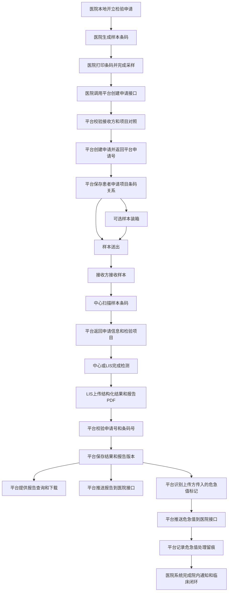

# 检验协同需求文档编写

### User
_2026-05-14 10:07:18_

<environment_context>
  <cwd>e:\协同平台\政策文档</cwd>
  <shell>powershell</shell>
  <current_date>2026-05-14</current_date>
  <timezone>Asia/Shanghai</timezone>
</environment_context>

### User
_2026-05-14 10:07:18_

# Context from my IDE setup:

## Active file: 讨论todo

## Open tabs:
- 讨论todo: 讨论todo
- 纠正版功能清单_检验中心协同平台: 纠正版功能清单_检验中心协同平台

## My request for Codex:
[$superpowers:brainstorming](C:\\Users\\test\\.codex\\plugins\\cache\\openai-curated\\superpowers\\7955f1db\\skills\\brainstorming\\SKILL.md)  现在根据todo继续讨论下一个功能

### Assistant
_2026-05-14 10:08:21_

我会按你指定的 `superpowers:brainstorming` 来推进，先读取这个技能说明和当前 `todo` 内容，再基于现有讨论继续收敛下一个功能。

### Assistant
_2026-05-14 10:08:30_

使用 `superpowers:brainstorming` 继续，按 `讨论todo` 的顺序，下一个应是 `F-002 样本标签打印与采集管理`。

我先做一个关键边界确认，这会直接决定后面主流程怎么写：

`F-002` 里，平台对“标签打印”的职责，你更倾向哪一种？

1. 平台只生成条码与打印数据，实际打印动作由 HIS/采样端发起和控制  
2. 平台提供独立打印页面或打印接口，采样端直接在平台侧完成打印  
3. 平台两种都支持，但要定义主模式和备用模式

你先选一个，我再基于这个继续往下收敛采样计划、补打、重打、采集确认这些细节。

### User
_2026-05-14 10:11:24_

# Context from my IDE setup:

## Active file: 讨论todo

## Open tabs:
- 讨论todo: 讨论todo
- 纠正版功能清单_检验中心协同平台: 纠正版功能清单_检验中心协同平台

## My request for Codex:
先按照两种都支持的方式继续讨论,然后具体的实现方案放到内部讨论确定中

### Assistant
_2026-05-14 10:11:29_

我先按“双模式支持”收口功能边界：平台既支持输出打印数据给 HIS/采样端，也支持平台侧直接打印；哪种作为主模式、如何落地，后面放进“内部待讨论确定”。下面继续收敛采集环节。

### Assistant
_2026-05-14 10:11:33_

在这个前提下，下一步先定“采集确认”的最小闭环。

`F-002` 里，采样人员完成一次采血/采样后，平台的采集确认你更倾向哪种粒度？

1. 按“样本条码”确认  
一支管/一个容器确认一次，最符合后续物流、核收、检测链路

2. 按“申请单”确认  
一张申请下所有样本一次性确认，操作简单，但不利于部分已采、部分未采

3. 两种都支持，但以“样本条码确认”为标准模式  
申请单确认本质上是批量确认多个样本条码

我当前更推荐 `3`，因为和前面“一个物理容器一个条码”的规则一致，也方便处理漏采、补采、重采。你先定这个。

### User
_2026-05-14 10:12:46_

# Context from my IDE setup:

## Active file: 讨论todo

## Open tabs:
- 讨论todo: 讨论todo
- 纠正版功能清单_检验中心协同平台: 纠正版功能清单_检验中心协同平台

## My request for Codex:
方案3

### Assistant
_2026-05-14 10:13:04_

采集确认按“样本条码”为标准模式收敛了，申请单确认可以定义成批量确认多个条码的便捷能力，不作为底层业务主键。接下来要定异常采集怎么纳入同一闭环。

### Assistant
_2026-05-14 10:13:07_

下一个问题定“未完成采集”的处理边界。

一张申请里的多个样本，不一定能一次采完。`F-002` 里你更倾向哪种规则？

1. 允许部分采集  
已采样本先确认，未采样本继续保持待采样，后续可补采

2. 必须整单采齐后才能确认  
流程简单，但不符合真实采样场景

3. 允许部分采集，但要强制登记未采原因  
例如患者拒采、采集失败、暂缓、样本条件不足等

我更推荐 `3`，这样后续物流、核收、超时、撤销都更好衔接。

### User
_2026-05-14 10:14:23_

# Context from my IDE setup:

## Active file: PRD_检验中心协同平台.md

## Open tabs:
- PRD_检验中心协同平台.md: PRD_检验中心协同平台.md
- P0功能清单_检验中心协同平台.md: P0功能清单_检验中心协同平台.md
- 纠正版功能清单_检验中心协同平台: 纠正版功能清单_检验中心协同平台
- 纠正版功能清单_修订原则说明.md: 纠正版功能清单_修订原则说明.md
- 讨论todo: 讨论todo

## My request for Codex:
方案3

### Assistant
_2026-05-14 10:14:31_

部分采集成立，未采样本必须记录未采原因，这样 `F-002` 就能覆盖“已采、未采、待补采”三种状态，而不用把异常挤到后续模块。下一步要定补打/重打，否则现场操作会断。

### Assistant
_2026-05-14 10:14:35_

下一个问题定“标签补打/重打”的控制规则。

`F-002` 里，样本条码已经生成后，现场很可能出现标签污染、打印不清、贴错位置等情况。你更倾向哪种边界？

1. 允许无限次补打/重打，只记日志  
操作最灵活，但风险较高

2. 允许补打/重打，但必须登记原因，并记录操作人、时间、次数  
平衡可用性和审计性

3. 原则上不允许重打，只能作废原条码并重新走补采/重采流程  
控制最严，但现场成本高

我更推荐 `2`，并且补打/重打应只针对“同一条码的标签重新输出”，不能改变样本身份。

### User
_2026-05-14 10:15:25_

# Context from my IDE setup:

## Active file: PRD_检验中心协同平台.md

## Open tabs:
- PRD_检验中心协同平台.md: PRD_检验中心协同平台.md
- P0功能清单_检验中心协同平台.md: P0功能清单_检验中心协同平台.md
- 纠正版功能清单_检验中心协同平台: 纠正版功能清单_检验中心协同平台
- 纠正版功能清单_修订原则说明.md: 纠正版功能清单_修订原则说明.md
- 讨论todo: 讨论todo

## My request for Codex:
方案2

### User
_2026-05-14 10:15:32_

<turn_aborted>
The user interrupted the previous turn on purpose. Any running unified exec processes may still be running in the background. If any tools/commands were aborted, they may have partially executed.
</turn_aborted>

### User
_2026-05-14 10:15:53_

# Context from my IDE setup:

## Active file: PRD_检验中心协同平台.md

## Open tabs:
- PRD_检验中心协同平台.md: PRD_检验中心协同平台.md
- P0功能清单_检验中心协同平台.md: P0功能清单_检验中心协同平台.md
- 纠正版功能清单_检验中心协同平台: 纠正版功能清单_检验中心协同平台
- 纠正版功能清单_修订原则说明.md: 纠正版功能清单_修订原则说明.md
- 讨论todo: 讨论todo

## My request for Codex:
方案2, 而且重打需要重新生成条码,之前的条码应该作废

### Assistant
_2026-05-14 10:16:04_

使用 `superpowers:brainstorming` 继续推进 `F-002`。我会把“重打重新生成新条码、旧条码作废”作为已确认边界，并把具体打印实现模式放入内部待讨论项。

### Assistant
_2026-05-14 10:16:11_

已确认：标签补打/重打采用受控模式，必须登记原因、操作人、时间；并且“重打”不是同一条码重复输出，而是生成新样本条码，原条码立即作废。旧条码后续不能用于采集确认、物流出库、核收或检测。

下一个问题定“重打后业务状态”的处理：

当样本标签重打并生成新条码时，如果旧条码对应样本还没有采集，平台是否允许直接替换为新条码并继续待采样？

我建议规则是：仅允许在“未采集”状态重打换码；如果已经采集确认，则不能直接重打换码，必须走重采/补采流程。这样可以避免已采样本身份被悄悄替换。你看这个规则是否确认？

### User
_2026-05-14 10:16:32_

# Context from my IDE setup:

## Active file: PRD_检验中心协同平台.md

## Open tabs:
- PRD_检验中心协同平台.md: PRD_检验中心协同平台.md
- P0功能清单_检验中心协同平台.md: P0功能清单_检验中心协同平台.md
- 纠正版功能清单_检验中心协同平台: 纠正版功能清单_检验中心协同平台
- 纠正版功能清单_修订原则说明.md: 纠正版功能清单_修订原则说明.md
- 讨论todo: 讨论todo

## My request for Codex:
确定

### Assistant
_2026-05-14 10:16:36_

重打换码边界已确定：仅限未采集样本，已采集样本不能直接换码。现在剩下一个关键点是采集任务如何展示和筛选，这会影响平台侧待采样列表的职责。

### Assistant
_2026-05-14 10:16:38_

下一个问题定“待采样任务列表”的范围。

`F-002` 是否需要平台提供给采样端一个待采样列表，支持按机构、科室、申请时间、采样状态、加急标识等条件筛选？

我建议确认：平台需要提供待采样任务查询能力，但只展示平台已接收并生成采样计划的申请/样本；医生开单、收费状态、HIS 未提交申请不在平台列表范围内。这个边界是否确认？

### User
_2026-05-14 10:17:08_

# Context from my IDE setup:

## Active file: PRD_检验中心协同平台.md

## Open tabs:
- PRD_检验中心协同平台.md: PRD_检验中心协同平台.md
- P0功能清单_检验中心协同平台.md: P0功能清单_检验中心协同平台.md
- 纠正版功能清单_检验中心协同平台: 纠正版功能清单_检验中心协同平台
- 纠正版功能清单_修订原则说明.md: 纠正版功能清单_修订原则说明.md
- 讨论todo: 讨论todo

## My request for Codex:
确认

### Assistant
_2026-05-14 10:17:13_

待采样列表边界已确认：平台只管理已接收申请后的采样任务，不回看 HIS 未提交或收费相关状态。接下来定采集确认时需要采样人员录入哪些现场信息。

### Assistant
_2026-05-14 10:17:16_

下一个问题定“采集确认字段”。

采样人员按样本条码确认采集时，平台最少应记录哪些信息？我建议 P0 固定记录：

- 样本条码
- 采集时间
- 采集人
- 采集机构/科室或采集点
- 采集状态：已采、未采、暂缓、采集失败
- 未采/暂缓/失败原因
- 备注
- 操作终端或来源系统
- 操作时间

是否还需要在 P0 强制记录“采样部位/采样方式/采样量/容器状态”这类更细字段，还是先作为可选字段？

### User
_2026-05-14 10:18:19_

# Context from my IDE setup:

## Active file: PRD_检验中心协同平台.md

## Open tabs:
- PRD_检验中心协同平台.md: PRD_检验中心协同平台.md
- P0功能清单_检验中心协同平台.md: P0功能清单_检验中心协同平台.md
- 纠正版功能清单_检验中心协同平台: 纠正版功能清单_检验中心协同平台
- 纠正版功能清单_修订原则说明.md: 纠正版功能清单_修订原则说明.md
- 讨论todo: 讨论todo

## My request for Codex:
为可选字段

### Assistant
_2026-05-14 10:18:27_

采集确认字段已收敛：P0 只强制记录闭环必需字段，采样部位、方式、采样量、容器状态作为可选扩展。现在需要定采集完成后的状态流转和通知边界。

### Assistant
_2026-05-14 10:18:30_

下一个问题定“采集确认后的后置动作”。

样本条码确认采集后，平台是否需要立即把样本纳入后续物流待出库范围，并更新申请/样本状态？

我建议确认以下规则：

- 单个样本确认已采后，样本状态变为 `已采集/待出库`
- 申请下所有样本都完成已采或登记未采原因后，申请采样环节状态变为 `采样已处理`
- 已采样本进入 `F-003 样本物流追踪` 的待出库范围
- 未采、暂缓、失败样本不进入物流待出库范围
- 是否主动通知物流人员，放到 `F-020 消息通知中心` 讨论

这个规则是否确认？

### User
_2026-05-14 10:19:20_

# Context from my IDE setup:

## Active file: PRD_检验中心协同平台.md

## Open tabs:
- PRD_检验中心协同平台.md: PRD_检验中心协同平台.md
- P0功能清单_检验中心协同平台.md: P0功能清单_检验中心协同平台.md
- 纠正版功能清单_检验中心协同平台: 纠正版功能清单_检验中心协同平台
- 纠正版功能清单_修订原则说明.md: 纠正版功能清单_修订原则说明.md
- 讨论todo: 讨论todo

## My request for Codex:
确认

### Assistant
_2026-05-14 10:19:53_

采集后的状态流转已确认：已采样本进入物流待出库，未采或异常样本留在采样侧闭环，通知机制后置到消息中心。还需要把“采集确认错误后的更正”定清楚，否则现场误扫、误确认会没有处理口径。

### Assistant
_2026-05-14 10:19:55_

下一个问题定“采集确认后的更正”。

如果采样人员误确认了样本，例如扫错条码、误点已采、采集时间录错，`F-002` 是否允许在样本出库前撤销或更正采集确认？

我建议规则是：允许在“未物流出库”前更正采集记录；更正必须登记原因并保留原记录审计。样本一旦进入物流出库或被检验中心核收，采集侧不能直接改状态，只能走后续异常处理或质量处理流程。这个规则是否确认？

### User
_2026-05-14 10:22:53_

# Context from my IDE setup:

## Active file: PRD_检验中心协同平台.md

## Open tabs:
- PRD_检验中心协同平台.md: PRD_检验中心协同平台.md
- P0功能清单_检验中心协同平台.md: P0功能清单_检验中心协同平台.md
- 纠正版功能清单_检验中心协同平台: 纠正版功能清单_检验中心协同平台
- 纠正版功能清单_修订原则说明.md: 纠正版功能清单_修订原则说明.md
- 讨论todo: 讨论todo

## My request for Codex:
确认

### Assistant
_2026-05-14 10:23:02_

采集更正边界已确认：出库前可更正且全量留痕，出库或核收后采样侧不再直接改状态。最后还需要确认采集时的身份核验强度，这决定平台是否只是“扫条码确认”，还是要做患者信息二次校验。

### Assistant
_2026-05-14 10:23:05_

下一个问题定“采集前核验”。

采样人员扫样本条码后，平台是否需要展示患者和申请摘要，要求采样人员核对后再确认采集？

我建议确认：P0 需要支持条码扫描后展示患者姓名、性别、年龄/出生日期、申请机构、申请科室、检验项目、样本类型、容器要求等摘要信息；平台记录采样人员确认动作。但患者腕带、身份证、人脸识别等强身份核验不纳入 P0，后续可作为扩展或由院内系统负责。这个边界是否确认？

### User
_2026-05-14 10:23:37_

# Context from my IDE setup:

## Active file: 讨论todo

## Open tabs:
- 讨论todo: 讨论todo
- PRD_检验中心协同平台.md: PRD_检验中心协同平台.md
- P0功能清单_检验中心协同平台.md: P0功能清单_检验中心协同平台.md
- 纠正版功能清单_检验中心协同平台: 纠正版功能清单_检验中心协同平台
- 纠正版功能清单_修订原则说明.md: 纠正版功能清单_修订原则说明.md

## My request for Codex:
确认

### Assistant
_2026-05-14 10:23:57_

`F-002` 的关键业务边界已经基本收齐：打印双模式、条码级采集、部分采集、重打换码、待采样列表、采集字段、状态流转、更正和采前核验。现在我会把它整理成 2-3 个可选方案，先确认总体方案，再进入正式设计分段确认。

### Assistant
_2026-05-14 10:24:02_

`F-002` 可以有三种方案：

1. **轻量接口型**  
平台只提供采样任务、条码数据、采集确认接口，打印和采样界面主要由 HIS/采样端实现。优点是平台边界轻；缺点是现场一致性和审计体验依赖外部系统。

2. **平台闭环型**  
平台提供待采样列表、扫码核验、标签打印/重打、采集确认、更正、审计闭环。HIS/采样端也可通过接口集成。优点是平台可控、流程完整；缺点是平台承担更多交互和权限能力。

3. **混合兼容型**  
平台能力按闭环建设，但对外同时提供接口能力。实际部署时可选择“外部采样端主用”或“平台采样端主用”，具体实现方案、主模式选择放入内部待讨论确定。优点是兼容不同医院现场；缺点是需要明确一致的状态和审计规则。

我建议采用 **方案 3：混合兼容型**。它和你前面确认的“双模式打印”一致，也适合区域协同平台面对多机构、多厂商 HIS/采样端的情况。具体哪种打印方式、哪类机构使用平台页面，放入 `风险_待内部讨论确定.md` 或对应内部讨论文档。

是否确认按方案 3 进入 `F-002` 正式设计？

### User
_2026-05-14 10:24:45_

# Context from my IDE setup:

## Active file: 讨论todo

## Open tabs:
- 讨论todo: 讨论todo
- PRD_检验中心协同平台.md: PRD_检验中心协同平台.md
- P0功能清单_检验中心协同平台.md: P0功能清单_检验中心协同平台.md
- 纠正版功能清单_检验中心协同平台: 纠正版功能清单_检验中心协同平台
- 纠正版功能清单_修订原则说明.md: 纠正版功能清单_修订原则说明.md

## My request for Codex:
方案3

### Assistant
_2026-05-14 10:24:52_

已按方案 3 进入正式设计阶段。我会先给出 `F-002` 的功能定位和职责边界，确认后再继续主流程、异常处理和系统边界。

### Assistant
_2026-05-14 10:25:00_

**F-002 设计：功能定位与边界**

`F-002 样本标签打印与采集管理` 承接 `F-001` 已生成的平台申请、采样计划和样本条码。它的核心目标是让采样人员能够查看待采样任务、完成采前核验、打印或重打样本标签、按样本条码确认采集，并把已采样本交给后续物流流程。

平台按“混合兼容型”建设：平台自身提供待采样列表、扫码核验、标签打印/重打、采集确认、更正和审计能力；同时提供接口能力给 HIS 或外部采样端集成。具体部署时以平台页面为主，还是以外部采样端为主，暂放入内部待讨论确定。

平台负责：

- 查询待采样申请和样本任务。
- 展示采样计划、样本条码、容器要求、项目明细和患者摘要。
- 提供标签打印数据，也支持平台侧直接打印。
- 支持未采集样本的标签重打换码，旧条码作废。
- 按样本条码确认采集，申请单确认作为批量确认能力。
- 支持部分采集，并要求登记未采、暂缓、失败原因。
- 支持物流出库前的采集记录更正。
- 记录完整操作审计。

平台不负责：

- 不负责医生开单、收费、医保、退费。
- 不处理 HIS 未提交到平台的申请。
- 不控制医院本地打印机驱动、纸张耗材、打印机维护等现场设备问题。
- 不把患者腕带、身份证、人脸识别等强身份核验纳入 P0。
- 不主动通知物流人员，通知策略放到 `F-020 消息通知中心`。

这部分是否确认？确认后我继续整理 `F-002` 的主流程和状态流转。

### User
_2026-05-14 10:25:30_

# Context from my IDE setup:

## Active file: 讨论todo

## Open tabs:
- 讨论todo: 讨论todo
- PRD_检验中心协同平台.md: PRD_检验中心协同平台.md
- P0功能清单_检验中心协同平台.md: P0功能清单_检验中心协同平台.md
- 纠正版功能清单_检验中心协同平台: 纠正版功能清单_检验中心协同平台
- 纠正版功能清单_修订原则说明.md: 纠正版功能清单_修订原则说明.md

## My request for Codex:
确认

### Assistant
_2026-05-14 10:25:39_

功能定位和职责边界已确认。下一段我会把 `F-002` 的主流程按“任务查询、核验、打印、采集确认、进入物流”串起来，并明确申请级和样本级状态关系。

### Assistant
_2026-05-14 10:25:51_

**F-002 设计：主流程与状态流转**

主流程建议这样定义：

1. `F-001` 创建平台申请成功后，平台生成申请级待采样任务和样本级待采样任务。
2. 采样人员或外部采样端查询待采样列表，可按申请机构、科室、申请时间、采样状态、加急标识、患者信息、样本条码等条件筛选。
3. 采样人员选择任务或扫描样本条码，平台展示患者摘要、申请摘要、检验项目、样本类型、容器要求、采集注意事项等信息。
4. 采样人员核对无误后，打印标签或确认已取得有效标签。
5. 如未采集前发现标签污染、丢失、打印错误等问题，可发起重打换码；平台生成新样本条码，旧条码作废，并记录原因和审计。
6. 采样人员按样本条码确认采集；申请单级确认仅作为批量确认多个样本条码的便捷操作。
7. 对已采样本，平台记录采集信息并将样本状态更新为 `已采集/待出库`。
8. 对未采、暂缓、采集失败样本，平台保留在采样侧，并要求登记原因。
9. 当申请下所有样本都完成“已采”或登记了未采/暂缓/失败原因后，申请采样环节状态变为 `采样已处理`。
10. 已采样本进入 `F-003 样本物流追踪` 的待出库范围；未采、暂缓、失败样本不进入物流待出库范围。

状态流转建议：

- 样本初始状态：`待采样`
- 已成功采集：`已采集/待出库`
- 未能采集：`未采`
- 暂时不能采：`暂缓采集`
- 采集失败：`采集失败`
- 重打换码后的旧条码：`已作废`
- 已采样本进入物流后：后续由 `F-003` 接管
- 已核收样本进入检验中心后：后续由 `F-004/F-005` 接管

关键规则：

- 允许部分采集。
- 未采、暂缓、采集失败必须登记原因。
- 只有已采样本进入物流待出库。
- 已采样本在物流出库前允许更正采集记录。
- 一旦物流出库或检验中心核收，采样侧不能直接改状态。

这部分是否确认？确认后我继续整理异常处理、字段对象和系统边界。

### User
_2026-05-14 10:27:19_

# Context from my IDE setup:

## Active file: 讨论todo

## Open tabs:
- 讨论todo: 讨论todo
- PRD_检验中心协同平台.md: PRD_检验中心协同平台.md
- P0功能清单_检验中心协同平台.md: P0功能清单_检验中心协同平台.md
- 纠正版功能清单_检验中心协同平台: 纠正版功能清单_检验中心协同平台
- 纠正版功能清单_修订原则说明.md: 纠正版功能清单_修订原则说明.md

## My request for Codex:
确认

### Assistant
_2026-05-14 10:27:23_

主流程和状态流转已确认。接下来我会把异常处理和核心数据对象整理出来，重点覆盖重打换码、误确认更正、部分采集、旧条码拦截这些容易出错的场景。

### Assistant
_2026-05-14 10:27:36_

**F-002 设计：异常处理与核心字段**

异常处理建议这样定义：

- 标签污染、丢失、打印不清：允许在未采集状态下重打换码，平台生成新条码，旧条码作废。
- 旧条码被扫描：平台应提示条码已作废，并返回新条码或关联样本信息；旧条码不能继续采集、出库、核收或检测。
- 已采集后发现标签错误：不能直接重打换码，应走重采/补采或后续异常处理流程。
- 扫描不存在条码：提示条码不存在或不属于当前机构可见范围。
- 扫描已撤销申请的条码：提示申请已撤销，禁止采集。
- 重复采集确认：如样本已确认采集，应提示当前状态，不重复生成采集记录；需要修改时走更正流程。
- 部分采集：允许保存已采样本，未采、暂缓、失败样本必须登记原因。
- 误确认更正：物流出库前可更正采集记录，必须登记原因并保留原记录；出库或核收后不允许采样侧更正。
- 采样计划缺失或采样规则异常：不应出现在 F-002 正常待采样列表中；此类问题应在 F-001 创建申请时拦截。
- 打印失败：平台记录打印请求和结果；打印机、纸张、驱动等现场设备问题作为外部设备问题处理，平台只保留可追溯记录。

核心字段/数据对象建议包括：

- `SamplingTask`：采样任务，分申请级任务和样本级任务。
- `Specimen`：样本，一支物理容器对应一个样本条码。
- `SpecimenBarcode`：样本条码，需支持有效、作废、替换关系。
- `SamplingPlan`：采样计划，来自 F-001，根据项目和采样规则生成。
- `CollectionRecord`：采集记录，记录采集确认、更正、失败、暂缓等动作。
- `PrintRecord`：打印记录，记录打印、重打、换码、失败、操作来源。
- `AuditLog`：审计日志，记录关键操作和接口调用。

采集确认最低必填字段：

- 样本条码
- 采集时间
- 采集人
- 采集机构/科室或采集点
- 采集状态：已采、未采、暂缓、采集失败
- 未采/暂缓/失败原因
- 备注
- 操作终端或来源系统
- 操作时间

可选字段：

- 采样部位
- 采样方式
- 采样量
- 容器状态
- 患者配合情况
- 现场补充说明

这部分是否确认？确认后我继续整理性能时效、通知审计、与 HIS/LIS/物流/患者端边界。

### User
_2026-05-14 10:31:11_

# Context from my IDE setup:

## Active file: 讨论todo

## Open tabs:
- 讨论todo: 讨论todo
- PRD_检验中心协同平台.md: PRD_检验中心协同平台.md
- P0功能清单_检验中心协同平台.md: P0功能清单_检验中心协同平台.md
- 纠正版功能清单_检验中心协同平台: 纠正版功能清单_检验中心协同平台
- 纠正版功能清单_修订原则说明.md: 纠正版功能清单_修订原则说明.md

## My request for Codex:
确认

### Assistant
_2026-05-14 10:31:30_

异常处理和核心字段已确认。最后一段会补齐性能时效、通知审计和系统边界；之后我会把完整 `F-002` 写入纠正版功能清单，并更新 todo 状态。

### Assistant
_2026-05-14 10:31:44_

**F-002 设计：性能、通知审计与系统边界**

性能与时效建议：

- 待采样列表查询应支持按机构、科室、时间、状态、加急标识、患者关键字、样本条码筛选。
- 样本条码扫码后，应快速返回患者摘要、申请摘要、项目和容器信息，避免影响现场采样效率。
- 采集确认应实时更新样本状态，已采样本应立即进入物流待出库范围。
- 重打换码应实时作废旧条码并生成新条码，避免新旧条码并存可用。
- 更正采集记录后，应立即同步更新样本状态和物流待出库范围。
- 具体接口性能指标、并发规模、超时时间暂放入 `系统实现相关.md` 统一讨论。

通知与审计建议：

- 平台记录采样任务查询、标签打印、重打换码、采集确认、采集更正、旧条码扫描拦截等关键操作。
- 审计至少包含操作人、操作机构、操作时间、操作终端/来源系统、样本条码、平台申请单号、变更前状态、变更后状态、原因、备注、Trace ID/Request ID。
- 采集成功后是否通知物流人员，不在 F-002 内直接定义，放入 `F-020 消息通知中心`。
- 采集状态变化是否推送 HIS/LIS，不在 F-002 内直接定义，放入 `F-005 样本状态全程追踪`。

系统边界建议：

| 事项 | 平台 | 外部系统 |
|------|------|----------|
| 待采样任务 | 平台生成并提供查询 | HIS/采样端可调用接口展示 |
| 样本条码 | 平台生成、作废、换码 | 外部系统不得自行生成平台样本条码 |
| 标签打印 | 平台提供打印数据并可支持平台侧打印 | HIS/采样端可负责实际打印控制 |
| 打印设备 | 记录打印请求和结果 | 本地打印机、驱动、纸张、耗材由现场负责 |
| 采前核验 | 平台展示患者和申请摘要 | 强身份核验可由院内系统负责 |
| 采集确认 | 平台按样本条码记录确认 | HIS/采样端可通过接口提交 |
| 物流交接 | 已采样本进入待出库范围 | 具体出库、转运、签收归 F-003 |
| 状态推送 | F-002 更新内部状态 | 对外推送归 F-005/F-020 |
| 报告相关 | 不处理 | 归 F-008 |

遗留到内部待讨论确定：

- 部署时以平台采样页面为主，还是以 HIS/外部采样端为主。
- 不同机构是否允许不同打印模式。
- 平台侧直接打印的实现方式、打印控件、浏览器兼容性、打印模板管理。
- 标签纸规格、条码格式、打印 DPI、打印机适配范围。
- F-002 相关接口性能指标、并发规模、超时时间。

这部分是否确认？确认后我会把 `F-002` 正式写入 `纠正版功能清单_检验中心协同平台`，并把 `讨论todo` 中 `F-002` 状态改为 `已完成`。

### User
_2026-05-14 10:33:39_

# Context from my IDE setup:

## Active file: 讨论todo

## Open tabs:
- 讨论todo: 讨论todo
- PRD_检验中心协同平台.md: PRD_检验中心协同平台.md
- P0功能清单_检验中心协同平台.md: P0功能清单_检验中心协同平台.md
- 纠正版功能清单_检验中心协同平台: 纠正版功能清单_检验中心协同平台
- 纠正版功能清单_修订原则说明.md: 纠正版功能清单_修订原则说明.md

## My request for Codex:
确认

### Assistant
_2026-05-14 10:33:55_

`F-002` 的设计内容已确认。我会先读取当前纠正版清单、todo、风险和实现细节文件，再用补丁把 F-002 正式落进去，避免覆盖已有内容。

### Assistant
_2026-05-14 10:34:05_

我会做三处文档更新：`讨论todo` 把 F-002 标为已完成；`纠正版功能清单_检验中心协同平台` 追加 F-002 正式条目；`风险_待内部讨论确定.md` 和 `系统实现相关.md` 分别承接打印部署模式与性能/接口细节。

### Assistant
_2026-05-14 10:36:03_

文档补丁已写入。现在我会做一次快速校验，确认 F-002 状态、正文标题和待讨论项都能在文件中正确定位。

### Assistant
_2026-05-14 10:36:17_

校验里 `rg` 已定位到新增内容；`git diff` 不能使用，因为当前目录不是 Git 仓库。为了最终说明更精确，我再读取关键行号和当前路径。

### Assistant
_2026-05-14 10:36:33_

已把 `F-002 样本标签打印与采集管理` 正式落入文档。

更新位置：
- [讨论todo](</e:/协同平台/政策文档/讨论todo:18>)：F-002 状态改为 `已完成`。
- [纠正版功能清单_检验中心协同平台](</e:/协同平台/政策文档/纠正版功能清单_检验中心协同平台:267>)：新增 F-002 完整功能边界、主流程、异常处理、字段、审计和系统边界。
- [风险_待内部讨论确定.md](</e:/协同平台/政策文档/风险_待内部讨论确定.md:184>)：新增采样端与打印部署模式待确认。
- [系统实现相关.md](</e:/协同平台/政策文档/系统实现相关.md:75>)：新增 F-002 接口性能、并发和接口形态待讨论事项。

校验已用 `rg` 确认关键标题和 F-002 状态均可定位。`git diff` 未能执行，因为当前目录不是 Git 仓库。

### User
_2026-05-14 10:41:28_

# Context from my IDE setup:

## Active file: 讨论todo

## Open tabs:
- 讨论todo: 讨论todo
- PRD_检验中心协同平台.md: PRD_检验中心协同平台.md
- P0功能清单_检验中心协同平台.md: P0功能清单_检验中心协同平台.md
- 纠正版功能清单_检验中心协同平台: 纠正版功能清单_检验中心协同平台
- 纠正版功能清单_修订原则说明.md: 纠正版功能清单_修订原则说明.md

## My request for Codex:
[$superpowers:brainstorming](C:\\Users\\test\\.codex\\plugins\\cache\\openai-curated\\superpowers\\7955f1db\\skills\\brainstorming\\SKILL.md) 继续下一个讨论

### Assistant
_2026-05-14 10:41:52_

使用 `superpowers:brainstorming` 继续下一个功能讨论。我会先确认当前 todo 里的下一个待讨论项和已沉淀边界，然后按一问一答推进。

### Assistant
_2026-05-14 10:42:04_

下一个待讨论功能是 `F-003 样本物流追踪`，重点是转运箱、出库、签收、超时预警。

先定一个核心边界：`F-003` 的物流追踪粒度，你更倾向哪种？

1. **按样本条码追踪**  
每支样本独立出库、转运、签收，精度最高，但现场扫码工作量大。

2. **按转运箱追踪为主，样本条码作为箱内明细**  
出库和签收主要扫转运箱码，平台记录箱内样本清单；必要时可查到每支样本。效率和可追溯性比较平衡。

3. **按批次追踪为主**  
一个机构或采样点某一批样本统一出库签收，操作最简单，但样本级异常定位较弱。

我建议采用 **方案 2**：平台以转运箱为物流操作主对象，箱内绑定样本条码明细；样本状态仍按样本条码更新。这样能兼顾现场效率和样本级追踪。你先确认这个方向。

### User
_2026-05-14 10:43:34_

# Context from my IDE setup:

## Active file: 讨论todo

## Open tabs:
- 讨论todo: 讨论todo
- PRD_检验中心协同平台.md: PRD_检验中心协同平台.md
- P0功能清单_检验中心协同平台.md: P0功能清单_检验中心协同平台.md
- 纠正版功能清单_检验中心协同平台: 纠正版功能清单_检验中心协同平台
- 纠正版功能清单_修订原则说明.md: 纠正版功能清单_修订原则说明.md

## My request for Codex:
方案2

### Assistant
_2026-05-14 10:43:47_

F-003 的物流操作粒度已按“转运箱为主、样本条码为明细”确定。接下来要先定转运箱本身由谁建、什么时候建，这会影响出库流程和责任边界。

### Assistant
_2026-05-14 10:43:50_

下一个问题定“转运箱建箱时机”。

`F-003` 中，平台是否需要在物流出库前由采样点/采样人员创建转运箱，并把已采样本扫码装箱？

我建议规则是：

- 平台提供转运箱创建能力。
- 转运箱在采样点或发出机构出库前创建。
- 只有 `已采集/待出库` 的样本可以装箱。
- 装箱时按样本条码绑定到转运箱。
- 一个样本同一时间只能属于一个未完成物流任务的转运箱。
- 转运箱出库后，箱内样本状态同步变为 `已出库/转运中`。

这个规则是否确认？

### User
_2026-05-14 10:44:44_

# Context from my IDE setup:

## Active file: 讨论todo

## Open tabs:
- 讨论todo: 讨论todo
- PRD_检验中心协同平台.md: PRD_检验中心协同平台.md
- P0功能清单_检验中心协同平台.md: P0功能清单_检验中心协同平台.md
- 纠正版功能清单_检验中心协同平台: 纠正版功能清单_检验中心协同平台
- 纠正版功能清单_修订原则说明.md: 纠正版功能清单_修订原则说明.md

## My request for Codex:
确认

### Assistant
_2026-05-14 10:45:05_

转运箱创建和装箱规则已确认：出库前建箱，只允许已采待出库样本装箱，出库后样本进入转运中。下一步需要定出库确认的责任人和必填信息。

### Assistant
_2026-05-14 10:45:08_

下一个问题定“出库确认”。

转运箱装箱完成后，平台是否要求发出方做一次明确的出库确认，记录交接人和物流信息？

我建议 P0 出库确认必填：

- 转运箱码
- 发出机构/采样点
- 出库时间
- 出库操作人
- 交接给谁：物流人员或承运方
- 物流人员/承运方标识
- 箱内样本数量
- 箱内样本清单
- 运输温度要求或运输条件
- 备注

确认后，转运箱状态为 `已出库/转运中`，箱内样本同步变为 `已出库/转运中`。

这个规则是否确认？

### User
_2026-05-14 10:46:12_

# Context from my IDE setup:

## Active file: 讨论todo

## Open tabs:
- 讨论todo: 讨论todo
- PRD_检验中心协同平台.md: PRD_检验中心协同平台.md
- P0功能清单_检验中心协同平台.md: P0功能清单_检验中心协同平台.md
- 纠正版功能清单_检验中心协同平台: 纠正版功能清单_检验中心协同平台
- 纠正版功能清单_修订原则说明.md: 纠正版功能清单_修订原则说明.md

## My request for Codex:
确认

### Assistant
_2026-05-14 10:46:19_

出库确认规则已收敛：发出方必须明确确认出库并记录交接对象、箱内明细和运输条件。下一步要定在途过程是否只记录出库/签收两个节点，还是允许中间物流节点。

### Assistant
_2026-05-14 10:46:23_

下一个问题定“在途追踪深度”。

`F-003` 里，样本转运过程中是否需要记录中间物流节点，例如取件、到达中转点、离开中转点、异常停留、温度异常等？

我建议 P0 采用：

- 必须记录出库和签收两个关键节点。
- 支持可选记录中间节点，但不强制每一站都有。
- 温度、GPS、冷链设备数据先作为可选扩展字段或后续接口，不作为 P0 强依赖。
- 超时预警基于出库时间、预计送达时间或配置的运输时限计算。

这个边界是否确认？

### User
_2026-05-14 10:46:58_

# Context from my IDE setup:

## Active file: 讨论todo

## Open tabs:
- 讨论todo: 讨论todo
- PRD_检验中心协同平台.md: PRD_检验中心协同平台.md
- P0功能清单_检验中心协同平台.md: P0功能清单_检验中心协同平台.md
- 纠正版功能清单_检验中心协同平台: 纠正版功能清单_检验中心协同平台
- 纠正版功能清单_修订原则说明.md: 纠正版功能清单_修订原则说明.md

## My request for Codex:
确认

### Assistant
_2026-05-14 10:47:10_

在途追踪按 P0 关键节点方案确定：出库和签收必记，中间节点、GPS、温度冷链先作为可选扩展。现在要定签收方式，尤其是按箱签收和箱内样本核对的关系。

### Assistant
_2026-05-14 10:47:14_

下一个问题定“签收确认”。

检验中心或接收方收到转运箱后，平台签收是否以“转运箱签收”为主，同时允许核对箱内样本？

我建议规则是：

- 接收方扫描转运箱码进行签收。
- 平台展示箱内样本清单、样本数量、出库信息和运输条件。
- 接收方确认实收数量。
- 如条件允许，可逐一扫描箱内样本条码核对。
- P0 不强制逐支样本扫码签收，但必须支持登记短少、破损、标签异常、运输超时等异常。
- 转运箱签收后，箱内无异常样本状态变为 `已签收/待核收`。
- 有异常的样本进入异常待处理，不直接进入待核收。

这个规则是否确认？

### User
_2026-05-14 10:47:58_

# Context from my IDE setup:

## Active file: 讨论todo

## Open tabs:
- 讨论todo: 讨论todo
- PRD_检验中心协同平台.md: PRD_检验中心协同平台.md
- P0功能清单_检验中心协同平台.md: P0功能清单_检验中心协同平台.md
- 纠正版功能清单_检验中心协同平台: 纠正版功能清单_检验中心协同平台
- 纠正版功能清单_修订原则说明.md: 纠正版功能清单_修订原则说明.md

## My request for Codex:
确认

### Assistant
_2026-05-14 10:48:07_

签收方式已确定：按箱签收为主，样本逐支核对可选；异常样本不直接进入核收。接下来需要定物流异常类型和处理边界。

### Assistant
_2026-05-14 10:48:15_

下一个问题定“物流异常处理范围”。

`F-003` 中，平台需要登记哪些物流异常？我建议 P0 至少支持：

- 转运箱未按时送达
- 转运箱破损
- 样本短少
- 多出样本
- 样本标签异常或无法识别
- 样本容器破损/泄漏
- 运输条件不符合要求
- 错送机构或错收转运箱
- 出库后撤回或取消运输

这些异常在 F-003 里先做物流异常登记、状态标记和审计；是否拒收、补采、重采、质量判定，放到 `F-004 样本核收与质量初筛` 或后续质量流程中处理。

这个边界是否确认？

### User
_2026-05-14 10:49:17_

# Context from my IDE setup:

## Active file: 讨论todo

## Open tabs:
- 讨论todo: 讨论todo
- PRD_检验中心协同平台.md: PRD_检验中心协同平台.md
- P0功能清单_检验中心协同平台.md: P0功能清单_检验中心协同平台.md
- 纠正版功能清单_检验中心协同平台: 纠正版功能清单_检验中心协同平台
- 纠正版功能清单_修订原则说明.md: 纠正版功能清单_修订原则说明.md

## My request for Codex:
确认

### Assistant
_2026-05-14 10:49:24_

物流异常边界已确认：F-003 负责登记和标记物流异常，拒收、补采、重采、质量判定交给 F-004 或后续质量流程。下一步要明确超时预警怎么触发。

### Assistant
_2026-05-14 10:49:27_

下一个问题定“超时预警”。

`F-003` 的超时预警更适合按什么规则触发？

1. 按固定时限  
例如出库后 2 小时未签收即预警，简单但不适合不同距离/路线。

2. 按机构/线路配置时限  
不同发出机构、接收机构、运输线路可配置预计时长，更贴近实际。

3. 按样本项目或温控要求配置时限  
高要求样本更严格，但配置复杂度更高。

我建议 P0 采用 **方案 2**：按机构/线路配置运输时限；同时保留样本项目或温控要求作为后续扩展。你确认吗？

### User
_2026-05-14 10:53:38_

# Context from my IDE setup:

## Active file: 讨论todo

## Open tabs:
- 讨论todo: 讨论todo
- PRD_检验中心协同平台.md: PRD_检验中心协同平台.md
- P0功能清单_检验中心协同平台.md: P0功能清单_检验中心协同平台.md
- 纠正版功能清单_检验中心协同平台: 纠正版功能清单_检验中心协同平台
- 纠正版功能清单_修订原则说明.md: 纠正版功能清单_修订原则说明.md

## My request for Codex:
确认

### Assistant
_2026-05-14 10:53:44_

超时预警采用按机构/线路配置运输时限的规则，样本项目和温控要求先作为后续扩展。还需要定超时之后平台做什么，尤其是通知和状态是否改变。

### Assistant
_2026-05-14 10:53:48_

下一个问题定“超时后的动作”。

当转运箱超过配置运输时限仍未签收时，`F-003` 是否只产生预警记录，还是要改变转运箱/样本状态？

我建议规则是：

- 平台生成物流超时预警记录。
- 转运箱状态可标记为 `转运超时`，但仍保留在 `转运中` 主流程内，等待后续签收。
- 箱内样本同步带有超时标记，但不直接判定不合格。
- 超时通知谁、通过什么渠道通知，放入 `F-020 消息通知中心`。
- 超时是否影响样本质量、是否拒收，放入 `F-004 样本核收与质量初筛`。

这个规则是否确认？

### User
_2026-05-14 10:55:43_

# Context from my IDE setup:

## Active file: 讨论todo

## Open tabs:
- 讨论todo: 讨论todo
- PRD_检验中心协同平台.md: PRD_检验中心协同平台.md
- P0功能清单_检验中心协同平台.md: P0功能清单_检验中心协同平台.md
- 纠正版功能清单_检验中心协同平台: 纠正版功能清单_检验中心协同平台
- 纠正版功能清单_修订原则说明.md: 纠正版功能清单_修订原则说明.md

## My request for Codex:
确认

### Assistant
_2026-05-14 10:55:49_

超时后的动作已确定：F-003 负责预警和标记，不直接做质量判定或拒收。最后还需要明确出库后撤回、错装箱这类更正场景。

### Assistant
_2026-05-14 10:55:54_

下一个问题定“出库后的更正/撤回”。

如果转运箱已经出库，发现错装样本、发错机构、物流人员取错箱等问题，平台是否允许发出方撤回或更正？

我建议规则是：

- 未签收前允许发出方发起“运输撤回/异常撤回”。
- 撤回必须登记原因、操作人、时间和责任方。
- 撤回后转运箱状态变为 `已撤回` 或 `异常结束`。
- 箱内样本回退到 `已采集/待出库` 或进入 `物流异常待处理`，具体取决于撤回原因。
- 已签收后发出方不能直接撤回，只能由接收方在签收/核收环节登记异常。

这个规则是否确认？

### User
_2026-05-14 10:57:51_

# Context from my IDE setup:

## Active file: 讨论todo

## Open tabs:
- 讨论todo: 讨论todo
- PRD_检验中心协同平台.md: PRD_检验中心协同平台.md
- P0功能清单_检验中心协同平台.md: P0功能清单_检验中心协同平台.md
- 纠正版功能清单_检验中心协同平台: 纠正版功能清单_检验中心协同平台
- 纠正版功能清单_修订原则说明.md: 纠正版功能清单_修订原则说明.md

## My request for Codex:
确认

### Assistant
_2026-05-14 10:58:04_

F-003 的关键边界已经收齐：按箱操作、样本明细追踪、建箱装箱、出库、签收、异常、超时、撤回。接下来我会先提出 2-3 个整体方案，再让你确认进入正式设计。

### Assistant
_2026-05-14 10:58:09_

`F-003 样本物流追踪` 可以有三种方案：

1. **样本级全程扫码型**  
每支样本出库、在途、签收都逐一扫码。追踪精度最高，但现场操作成本大，转运箱场景效率低。

2. **转运箱主导型**  
平台以转运箱为物流操作主对象，出库和签收主要扫转运箱码；箱内绑定样本条码清单，样本状态随转运箱节点同步更新。必要时支持逐支样本核对和异常登记。

3. **批次简化型**  
按机构、采样点或运输批次统一出库签收，不强绑定转运箱。操作最轻，但样本短少、错装、破损等异常定位能力弱。

我建议采用 **方案 2：转运箱主导型**。它和前面“样本条码是最小追踪对象”不冲突：物流操作以箱为主，状态追踪仍能落到每支样本。这个方案也更适合 P0，现场效率、审计和异常定位比较平衡。

是否确认按方案 2 进入 `F-003` 正式设计？

### User
_2026-05-14 11:02:08_

# Context from my IDE setup:

## Active file: 讨论todo

## Open tabs:
- 讨论todo: 讨论todo
- PRD_检验中心协同平台.md: PRD_检验中心协同平台.md
- P0功能清单_检验中心协同平台.md: P0功能清单_检验中心协同平台.md
- 纠正版功能清单_检验中心协同平台: 纠正版功能清单_检验中心协同平台
- 纠正版功能清单_修订原则说明.md: 纠正版功能清单_修订原则说明.md

## My request for Codex:
方案2

### Assistant
_2026-05-14 11:02:21_

已按方案 2 进入正式设计阶段。我会先给出 `F-003` 的功能定位和职责边界，确认后再继续主流程、异常处理和系统边界。

### Assistant
_2026-05-14 11:02:29_

**F-003 设计：功能定位与边界**

`F-003 样本物流追踪` 承接 `F-002` 中状态为 `已采集/待出库` 的样本。它的核心目标是让发出方把样本装入转运箱、确认出库，让接收方按转运箱签收，并在平台中形成从出库到签收的物流追踪记录。

平台采用“转运箱主导型”：物流操作以转运箱为主，箱内绑定样本条码清单；样本状态仍按样本条码同步更新。P0 必须记录出库和签收两个关键节点，中间物流节点、温度、GPS、冷链设备数据作为可选扩展。

平台负责：

- 创建转运箱。
- 将已采集/待出库样本扫码装箱。
- 校验样本是否可装箱。
- 记录转运箱与箱内样本清单。
- 出库确认，记录发出方、交接对象、运输条件和箱内明细。
- 按转运箱码进行接收方签收。
- 支持签收时核对箱内样本数量和可选逐支扫码核对。
- 登记物流异常。
- 按机构/线路配置运输时限触发超时预警。
- 支持未签收前的运输撤回/异常撤回。
- 记录完整物流审计。

平台不负责：

- 不负责实际运输调度、车辆调度、路线规划。
- 不接入或强制依赖 GPS、温度探头、冷链设备数据。
- 不在 F-003 中判定样本是否合格。
- 不在 F-003 中决定是否拒收、补采、重采。
- 不直接定义超时通知对象和通知渠道，放入 `F-020 消息通知中心`。
- 不处理检验中心核收和质量初筛，放入 `F-004 样本核收与质量初筛`。

这部分是否确认？确认后我继续整理 `F-003` 的主流程和状态流转。

### User
_2026-05-14 11:05:51_

# Context from my IDE setup:

## Active file: 讨论todo

## Open tabs:
- 讨论todo: 讨论todo
- PRD_检验中心协同平台.md: PRD_检验中心协同平台.md
- P0功能清单_检验中心协同平台.md: P0功能清单_检验中心协同平台.md
- 纠正版功能清单_检验中心协同平台: 纠正版功能清单_检验中心协同平台
- 纠正版功能清单_修订原则说明.md: 纠正版功能清单_修订原则说明.md

## My request for Codex:
确认

### Assistant
_2026-05-14 11:06:01_

功能定位和职责边界已确认。下一段我会把 `F-003` 的主流程按“建箱、装箱、出库、在途、签收、进入核收”串起来，并明确转运箱状态与样本状态的联动。

### Assistant
_2026-05-14 11:06:15_

**F-003 设计：主流程与状态流转**

主流程建议这样定义：

1. `F-002` 中样本完成采集确认后，样本状态进入 `已采集/待出库`。
2. 发出方在平台创建转运箱，生成或录入转运箱码。
3. 发出方扫描样本条码装箱，平台校验样本是否处于 `已采集/待出库`，且未绑定其他未完成物流任务。
4. 装箱完成后，平台记录转运箱、箱内样本清单、样本数量、发出机构/采样点、目标接收机构、运输条件等信息。
5. 发出方进行出库确认，记录出库时间、出库操作人、交接对象、物流人员/承运方标识、箱内样本数量和备注。
6. 出库确认后，转运箱状态变为 `已出库/转运中`，箱内样本状态同步变为 `已出库/转运中`。
7. 平台按机构/线路配置的运输时限计算预计送达或超时时间。
8. 如有中间物流节点，可记录取件、中转、异常停留、温度异常等节点；P0 不强制。
9. 接收方收到转运箱后扫描转运箱码，平台展示箱内样本清单、样本数量、出库信息和运输条件。
10. 接收方确认实收数量，可选择逐一扫描样本条码核对。
11. 签收无异常时，转运箱状态变为 `已签收`，箱内样本状态变为 `已签收/待核收`。
12. 签收发现异常时，平台登记物流异常；无异常样本进入 `已签收/待核收`，异常样本进入 `物流异常待处理`。
13. `已签收/待核收` 样本进入 `F-004 样本核收与质量初筛` 范围。

状态流转建议：

转运箱状态：

- `待装箱`
- `已装箱/待出库`
- `已出库/转运中`
- `转运超时`，作为超时标记，不中断转运中主流程
- `已签收`
- `已撤回`
- `异常结束`

样本物流状态：

- `已采集/待出库`
- `已装箱/待出库`
- `已出库/转运中`
- `转运超时`，作为超时标记，不直接判定不合格
- `已签收/待核收`
- `物流异常待处理`

关键规则：

- 只有 `已采集/待出库` 样本可以装箱。
- 一个样本同一时间只能属于一个未完成物流任务的转运箱。
- 转运箱出库后，箱内样本状态同步进入转运中。
- P0 必须记录出库和签收两个关键节点。
- 中间节点、温度、GPS、冷链设备数据作为可选扩展。
- 签收以转运箱为主，逐支样本扫码核对为可选。
- 异常样本不直接进入待核收。

这部分是否确认？确认后我继续整理异常处理、核心字段和超时预警。

### User
_2026-05-14 11:06:48_

# Context from my IDE setup:

## Active file: 讨论todo

## Open tabs:
- 讨论todo: 讨论todo
- PRD_检验中心协同平台.md: PRD_检验中心协同平台.md
- P0功能清单_检验中心协同平台.md: P0功能清单_检验中心协同平台.md
- 纠正版功能清单_检验中心协同平台: 纠正版功能清单_检验中心协同平台
- 纠正版功能清单_修订原则说明.md: 纠正版功能清单_修订原则说明.md

## My request for Codex:
确认

### Assistant
_2026-05-14 11:07:01_

主流程和状态流转已确认。接下来我会整理异常处理、核心字段和超时预警，重点覆盖短少、多出、错送、撤回、超时这些物流风险。

### Assistant
_2026-05-14 11:07:17_

**F-003 设计：异常处理、核心字段与超时预警**

异常处理建议这样定义：

- 转运箱未按时送达：平台生成超时预警，标记转运箱和箱内样本为 `转运超时`，但不直接判定样本不合格。
- 转运箱破损：接收方签收时登记异常，关联转运箱和受影响样本。
- 样本短少：接收方登记实收数量和短少样本清单，短少样本进入 `物流异常待处理`。
- 多出样本：接收方登记多出样本条码或无法识别样本信息，进入物流异常处理。
- 样本标签异常或无法识别：登记异常，不直接进入待核收。
- 样本容器破损/泄漏：登记物流异常，质量判定放入 `F-004`。
- 运输条件不符合要求：登记异常，如温度超限、未按要求冷藏等；是否影响质量由 `F-004` 判断。
- 错送机构或错收转运箱：登记错送/错收异常，转运箱进入异常处理，不自动签收为正常。
- 出库后撤回或取消运输：未签收前允许发出方发起运输撤回/异常撤回；已签收后发出方不能直接撤回。
- 重复签收：平台提示当前转运箱已签收，不重复生成签收记录。
- 扫描不存在或无权限转运箱码：提示转运箱不存在或不属于当前机构可见范围。

核心字段/数据对象建议包括：

- `TransportBox`：转运箱，物流操作主对象。
- `TransportBoxCode`：转运箱码，用于出库、在途、签收扫描。
- `TransportTask`：物流任务，记录一次出库到签收的运输过程。
- `TransportBoxItem`：箱内样本明细，绑定样本条码。
- `TransportNodeRecord`：物流节点记录，记录出库、签收和可选中间节点。
- `TransportException`：物流异常记录，记录短少、破损、错送、超时等异常。
- `TransportTimeoutRule`：运输时限规则，按发出机构、接收机构或线路配置。
- `AuditLog`：审计日志，记录关键操作和接口调用。

出库确认必填字段：

- 转运箱码
- 发出机构/采样点
- 目标接收机构
- 出库时间
- 出库操作人
- 交接对象：物流人员或承运方
- 物流人员/承运方标识
- 箱内样本数量
- 箱内样本清单
- 运输温度要求或运输条件
- 备注

签收确认必填字段：

- 转运箱码
- 接收机构
- 签收时间
- 签收操作人
- 实收箱数或箱体确认结果
- 实收样本数量
- 是否存在异常
- 异常类型和异常说明
- 备注

超时预警规则：

- P0 按机构/线路配置运输时限。
- 出库确认后，平台根据发出机构、接收机构或运输线路计算预计送达或超时时间。
- 超过配置时限仍未签收时，平台生成超时预警。
- 转运箱可标记为 `转运超时`，但仍保留在 `转运中` 主流程内，等待后续签收。
- 箱内样本同步带有超时标记，但不直接判定不合格。
- 超时通知对象和渠道放入 `F-020 消息通知中心`。
- 超时是否影响样本质量、是否拒收，放入 `F-004 样本核收与质量初筛`。

这部分是否确认？确认后我继续整理性能时效、通知审计和系统边界。

### User
_2026-05-14 11:08:39_

# Context from my IDE setup:

## Active file: 讨论todo

## Open tabs:
- 讨论todo: 讨论todo
- PRD_检验中心协同平台.md: PRD_检验中心协同平台.md
- P0功能清单_检验中心协同平台.md: P0功能清单_检验中心协同平台.md
- 纠正版功能清单_检验中心协同平台: 纠正版功能清单_检验中心协同平台
- 纠正版功能清单_修订原则说明.md: 纠正版功能清单_修订原则说明.md

## My request for Codex:
确认

### Assistant
_2026-05-14 11:08:48_

异常处理、核心字段和超时规则已确认。最后一段会补齐性能时效、通知审计和系统边界；确认后我会把 F-003 写入纠正版清单并更新 todo。

### Assistant
_2026-05-14 11:09:02_

**F-003 设计：性能、通知审计与系统边界**

性能与时效建议：

- 转运箱创建、样本装箱、出库确认、签收确认应实时更新转运箱和样本状态。
- 装箱扫码时应快速校验样本状态、是否已绑定其他未完成转运箱、当前机构是否有权限操作。
- 出库确认后应立即启动运输时限计算。
- 签收确认后，无异常样本应立即进入 `已签收/待核收`。
- 异常样本应立即进入 `物流异常待处理`。
- 超时预警任务应按配置时限自动触发。
- 具体接口响应时间、并发规模、超时任务调度频率暂放入 `系统实现相关.md` 统一讨论。

通知与审计建议：

- 平台记录建箱、装箱、移除样本、出库、在途节点、签收、异常登记、超时预警、撤回等操作。
- 审计至少包含操作人、操作机构、操作时间、操作终端/来源系统、转运箱码、样本条码清单、变更前状态、变更后状态、异常类型、原因、备注、Trace ID/Request ID。
- 超时、错送、短少、破损等是否主动通知相关人员，不在 F-003 中定义，放入 `F-020 消息通知中心`。
- 物流状态变化是否推送 HIS/LIS/采样端，不在 F-003 中定义，放入 `F-005 样本状态全程追踪`。

系统边界建议：

| 事项 | 平台 | 外部系统/后续模块 |
|------|------|------------------|
| 建箱装箱 | 平台创建转运箱并绑定样本条码 | 外部采样端可通过接口提交 |
| 出库确认 | 平台记录发出方、交接对象、箱内明细 | 实际运输交接由现场执行 |
| 在途追踪 | P0 必记出库和签收，可选记录中间节点 | GPS、温度、冷链设备数据可后续接入 |
| 签收确认 | 平台按转运箱签收并登记异常 | 逐支样本扫码核对为可选 |
| 超时预警 | 平台按机构/线路时限生成预警和状态标记 | 通知渠道归 F-020 |
| 物流异常 | 平台登记物流异常和影响样本 | 质量判定、拒收、补采、重采归 F-004 |
| 状态推送 | F-003 更新内部物流状态 | 对外推送归 F-005 |
| 核收质检 | 不处理 | 归 F-004 |
| 运输调度 | 不负责 | 由物流/院内管理体系负责 |

遗留到内部待讨论确定：

- 转运箱码由平台生成，还是允许录入已有实体箱码。
- 是否需要维护转运箱基础档案、周转箱库存、箱体启停用状态。
- 是否限制一个转运箱可装样本数量、样本类型或温控要求。
- 是否要求装箱后封箱，是否记录封签号。
- 是否需要限制单个样本被移出转运箱的时机和权限。
- 超时任务调度频率、运输线路配置粒度、预警升级规则。
- GPS、温度、冷链设备数据是否进入后续版本。

这部分是否确认？确认后我会把 `F-003` 正式写入 `纠正版功能清单_检验中心协同平台`，并把 `讨论todo` 中 `F-003` 状态改为 `已完成`。

### User
_2026-05-14 11:11:12_

# Context from my IDE setup:

## Active file: 讨论todo

## Active selection of the file:
| 6 | F-006 | 结果审核与人工干预 | 业务流程管理 | 原 P0 | 待讨论 | 需讨论自动审核前后边界、复检、人工审核 |
## Open tabs:
- 讨论todo: 讨论todo
- PRD_检验中心协同平台.md: PRD_检验中心协同平台.md
- P0功能清单_检验中心协同平台.md: P0功能清单_检验中心协同平台.md
- 纠正版功能清单_检验中心协同平台: 纠正版功能清单_检验中心协同平台
- 纠正版功能清单_修订原则说明.md: 纠正版功能清单_修订原则说明.md

## My request for Codex:
确认

### Assistant
_2026-05-14 11:11:30_

`F-003` 的设计内容已确认。我会把它追加到纠正版功能清单，并同步更新 todo、内部待确认事项和实现细节暂存项。

### Assistant
_2026-05-14 11:11:39_

我会用补丁做四处追加/修改：F-003 状态更新、纠正版清单新增 F-003、风险文件新增物流待确认项、实现文件新增物流接口和调度细节项。

### Assistant
_2026-05-14 11:13:51_

F-003 内容已经写入。现在我会按完成前校验要求，检查关键标题、todo 状态和新增待讨论项是否都能定位。

### Assistant
_2026-05-14 11:14:27_

已将 `F-003 样本物流追踪` 写入文档，并把 todo 状态更新为 `已完成`。

更新位置：
- [讨论todo](</e:/协同平台/政策文档/讨论todo:19>)：F-003 状态改为 `已完成`。
- [纠正版功能清单_检验中心协同平台](</e:/协同平台/政策文档/纠正版功能清单_检验中心协同平台:502>)：新增 F-003 完整设计，包括转运箱主导、装箱、出库、签收、异常、超时和撤回。
- [风险_待内部讨论确定.md](</e:/协同平台/政策文档/风险_待内部讨论确定.md:243>)：新增转运箱管理方式、运输时限与冷链数据待确认项。
- [系统实现相关.md](</e:/协同平台/政策文档/系统实现相关.md:130>)：新增 F-003 接口性能、接口形态、超时预警调度机制待讨论项。

校验已用 `rg` 确认关键标题和状态都可定位。当前目录不是 Git 仓库，无法执行 git diff 或提交。

### User
_2026-05-14 11:38:50_

# Context from my IDE setup:

## Active file: 讨论todo

## Open tabs:
- 讨论todo: 讨论todo
- PRD_检验中心协同平台.md: PRD_检验中心协同平台.md
- P0功能清单_检验中心协同平台.md: P0功能清单_检验中心协同平台.md
- 纠正版功能清单_检验中心协同平台: 纠正版功能清单_检验中心协同平台
- 纠正版功能清单_修订原则说明.md: 纠正版功能清单_修订原则说明.md

## My request for Codex:
[$superpowers:brainstorming](C:\\Users\\test\\.codex\\plugins\\cache\\openai-curated\\superpowers\\7955f1db\\skills\\brainstorming\\SKILL.md)  进行下一项讨论

### Assistant
_2026-05-14 11:39:06_

使用 `superpowers:brainstorming` 继续下一项。先确认当前 todo 的下一个待讨论功能和已完成的上游边界，再进入一问一答。

### Assistant
_2026-05-14 11:39:25_

下一个待讨论功能是 `F-004 样本核收与质量初筛`，它承接 `F-003` 中状态为 `已签收/待核收` 的样本，重点是批量核收、不合格拒收、待补单。

先定核心边界：`F-004` 的核收粒度更适合哪一种？

1. **按样本条码逐支核收**  
每支样本逐一扫码并判定是否合格，质量控制最细，但工作量较大。

2. **按转运箱批量核收为主，异常样本单独处理**  
先基于转运箱批量进入核收，正常样本批量通过，异常样本逐支登记。效率较高，但需要明确异常拦截规则。

3. **按申请单核收**  
以申请为单位确认是否可检，逻辑简单，但和样本容器、物流、检测前处理的实际粒度不完全一致。

我建议采用 **方案 2**：按转运箱批量核收为主，异常样本单独处理；最终核收结果仍落到每支样本条码。这样能承接 F-003 的转运箱签收，也保留样本级质量追踪。你确认吗？

### User
_2026-05-14 11:39:54_

# Context from my IDE setup:

## Active file: 讨论todo

## Open tabs:
- 讨论todo: 讨论todo
- PRD_检验中心协同平台.md: PRD_检验中心协同平台.md
- P0功能清单_检验中心协同平台.md: P0功能清单_检验中心协同平台.md
- 纠正版功能清单_检验中心协同平台: 纠正版功能清单_检验中心协同平台
- 纠正版功能清单_修订原则说明.md: 纠正版功能清单_修订原则说明.md

## My request for Codex:
2

### Assistant
_2026-05-14 11:40:02_

F-004 的核收粒度按“转运箱批量核收为主、异常样本单独处理”确定。接下来要先定核收和质量初筛之间的关系：是一个动作里完成，还是分成两个环节。

### Assistant
_2026-05-14 11:40:06_

下一个问题定“核收与质量初筛是否合并”。

`F-004` 里，接收方打开转运箱后，是一次操作同时完成“样本核收 + 质量初筛”，还是先核收数量再做质量初筛？

我建议 P0 采用：

- 平台支持一个核收页面/流程中同时完成数量核对和质量初筛。
- 逻辑上分成两个结果：`核收结果` 和 `质量初筛结果`。
- 正常样本可批量核收通过。
- 异常样本必须逐支登记异常原因。
- 只有核收通过且质量初筛通过的样本，才能进入后续检测/前处理范围。

这个规则是否确认？

### User
_2026-05-14 14:23:06_

# Context from my IDE setup:

## Active file: 讨论todo

## Open tabs:
- 讨论todo: 讨论todo
- PRD_检验中心协同平台.md: PRD_检验中心协同平台.md
- P0功能清单_检验中心协同平台.md: P0功能清单_检验中心协同平台.md
- 纠正版功能清单_检验中心协同平台: 纠正版功能清单_检验中心协同平台
- 纠正版功能清单_修订原则说明.md: 纠正版功能清单_修订原则说明.md

## My request for Codex:
确认

### Assistant
_2026-05-14 14:23:19_

核收和质量初筛已确定为同一流程中处理、结果逻辑分开记录。下一步要定“不合格样本”的处置口径，避免 F-004 直接越界到补采或医嘱处理。

### Assistant
_2026-05-14 14:23:21_

下一个问题定“不合格样本处置”。

质量初筛发现样本不合格时，`F-004` 平台应做到哪一步？

1. 只登记不合格原因和状态，不做后续动作  
边界最轻，但闭环弱。

2. 登记不合格并生成待处理事项  
例如待补采、待重送、待人工确认；但是否补采/重采由后续流程或人工决定。

3. 平台直接触发补采/重采任务  
闭环强，但会涉及采样端、HIS、医嘱和通知边界，复杂度更高。

我建议采用 **方案 2**：F-004 记录不合格原因并生成待处理事项，不直接决定补采/重采。补采、重采是否执行，以及是否需要通知 HIS/采样端，放到 F-005/F-020 或后续异常流程讨论。你确认吗？

### User
_2026-05-14 14:24:40_

# Context from my IDE setup:

## Active file: 讨论todo

## Open tabs:
- 讨论todo: 讨论todo
- PRD_检验中心协同平台.md: PRD_检验中心协同平台.md
- P0功能清单_检验中心协同平台.md: P0功能清单_检验中心协同平台.md
- 纠正版功能清单_检验中心协同平台: 纠正版功能清单_检验中心协同平台
- 纠正版功能清单_修订原则说明.md: 纠正版功能清单_修订原则说明.md

## My request for Codex:
2

### Assistant
_2026-05-14 14:25:20_

不合格样本处置已按方案 2 收敛：F-004 记录原因并生成待处理事项，不直接触发补采/重采。接下来要定哪些情况属于 P0 质量初筛范围。

### Assistant
_2026-05-14 14:25:26_

下一个问题定“质量初筛项目”。

`F-004` 中 P0 至少需要支持哪些样本不合格/异常原因？我建议包括：

- 样本量不足
- 容器错误
- 样本类型不符
- 标签无法识别或标签信息不一致
- 样本破损、泄漏
- 严重溶血、脂血、黄疸等肉眼可见异常
- 凝血/抗凝异常
- 运输超时
- 运输温度或运输条件不符合要求
- 申请信息缺失或与样本不匹配
- 未收到样本但系统显示已签收
- 多出样本或无法匹配申请

这些原因先作为平台可选字典，核收人员按实际情况选择；是否需要中心维护可配置字典，放到 F-019 系统配置管理。

这个范围是否确认？

### User
_2026-05-14 14:26:19_

# Context from my IDE setup:

## Active file: 讨论todo

## Open tabs:
- 讨论todo: 讨论todo
- PRD_检验中心协同平台.md: PRD_检验中心协同平台.md
- P0功能清单_检验中心协同平台.md: P0功能清单_检验中心协同平台.md
- 纠正版功能清单_检验中心协同平台: 纠正版功能清单_检验中心协同平台
- 纠正版功能清单_修订原则说明.md: 纠正版功能清单_修订原则说明.md

## My request for Codex:
确定

### Assistant
_2026-05-14 14:26:41_

质量初筛异常原因范围已确认，并按可配置字典方向后置到 F-019。下一步要定待补单的含义，因为它可能指申请信息补充，也可能指重新补录样本信息。

### Assistant
_2026-05-14 14:26:46_

下一个问题定“待补单”的业务含义。

`F-004` 备注里提到“待补单”，你更倾向它在平台里表示哪一类情况？

1. **申请资料待补充**  
例如临床诊断、申请医生、项目、患者信息、样本与申请匹配关系缺失或不一致，需要 HIS/申请方补齐或更正。

2. **样本待补采/重采**  
例如样本量不足、容器错误、破损，需要重新采样。

3. **两类都支持，但状态分开**  
`待补资料` 和 `待补采/重采` 分开记录，避免混淆。

我建议采用 **方案 3**。`待补单` 这个词容易混淆，正式设计里建议拆成 `待补资料` 与 `待补采/重采待确认`。你确认吗？

### User
_2026-05-14 14:27:17_

# Context from my IDE setup:

## Active file: 讨论todo

## Open tabs:
- 讨论todo: 讨论todo
- PRD_检验中心协同平台.md: PRD_检验中心协同平台.md
- P0功能清单_检验中心协同平台.md: P0功能清单_检验中心协同平台.md
- 纠正版功能清单_检验中心协同平台: 纠正版功能清单_检验中心协同平台
- 纠正版功能清单_修订原则说明.md: 纠正版功能清单_修订原则说明.md

## My request for Codex:
确定

### Assistant
_2026-05-14 14:27:35_

“待补单”将拆成两类状态：`待补资料` 和 `待补采/重采待确认`，避免把申请资料问题和样本质量问题混在一起。接下来要定核收通过后的去向。

### Assistant
_2026-05-14 14:27:38_

下一个问题定“核收通过后的状态”。

样本核收通过且质量初筛通过后，平台是否将样本状态更新为 `已核收/待检测`，进入后续检测或前处理范围？

我建议规则是：

- 样本核收通过 + 质量初筛通过后，状态变为 `已核收/待检测`
- 如果检验中心有前处理环节，可在后续模块或实现中细分为 `待前处理/待上机`
- F-004 不负责仪器上机检测、不负责结果产生
- 后续检测过程、状态跟踪归入 `F-005 样本状态全程追踪` 或 LIS/仪器对接范围

这个规则是否确认？

### User
_2026-05-14 14:29:10_

# Context from my IDE setup:

## Active file: 讨论todo

## Open tabs:
- 讨论todo: 讨论todo
- PRD_检验中心协同平台.md: PRD_检验中心协同平台.md
- P0功能清单_检验中心协同平台.md: P0功能清单_检验中心协同平台.md
- 纠正版功能清单_检验中心协同平台: 纠正版功能清单_检验中心协同平台
- 纠正版功能清单_修订原则说明.md: 纠正版功能清单_修订原则说明.md

## My request for Codex:
确认

### Assistant
_2026-05-14 14:29:25_

核收通过后的去向已确认：F-004 到 `已核收/待检测` 为止，不负责上机检测或结果产生。还需要定核收更正边界，避免误核收后无法处理。

### Assistant
_2026-05-14 14:29:31_

下一个问题定“核收更正”。

如果核收人员误将样本核收通过，之后在进入检测前发现问题，平台是否允许更正核收/初筛结果？

我建议规则是：

- 在样本进入检测或前处理前，允许更正核收结果和质量初筛结果。
- 更正必须登记原因、操作人、时间，并保留原记录。
- 样本一旦进入检测/前处理或产生结果，F-004 不再直接更正核收状态，应走结果审核、复检、质量异常或人工干预流程。
- 更正后应同步更新样本状态和待处理事项。

这个规则是否确认？

### User
_2026-05-14 14:30:03_

# Context from my IDE setup:

## Active file: 讨论todo

## Open tabs:
- 讨论todo: 讨论todo
- PRD_检验中心协同平台.md: PRD_检验中心协同平台.md
- P0功能清单_检验中心协同平台.md: P0功能清单_检验中心协同平台.md
- 纠正版功能清单_检验中心协同平台: 纠正版功能清单_检验中心协同平台
- 纠正版功能清单_修订原则说明.md: 纠正版功能清单_修订原则说明.md

## My request for Codex:
确认

### Assistant
_2026-05-14 14:30:53_

核收更正边界已确认：检测/前处理前可更正并全量留痕，进入检测后交给后续质量或审核流程。接下来要定 F-004 是否处理与 LIS 的接收边界。

### Assistant
_2026-05-14 14:30:56_

下一个问题定“与 LIS 的边界”。

`F-004` 样本核收通过后，平台是否需要把“已核收/待检测”的样本信息推送给 LIS，作为检验中心开始检测的依据？

我建议先这样收敛：

- F-004 只负责形成平台内部 `已核收/待检测` 状态。
- 是否推送 LIS、推送哪些字段、何时推送，放入 `F-005 样本状态全程追踪` 或后续 LIS 对接实现讨论。
- F-004 可以记录“待检测交接所需字段”，但不把 LIS 接口细节定在本功能里。

这个边界是否确认？

### User
_2026-05-14 14:32:22_

# Context from my IDE setup:

## Active file: 讨论todo

## Open tabs:
- 讨论todo: 讨论todo
- PRD_检验中心协同平台.md: PRD_检验中心协同平台.md
- P0功能清单_检验中心协同平台.md: P0功能清单_检验中心协同平台.md
- 纠正版功能清单_检验中心协同平台: 纠正版功能清单_检验中心协同平台
- 纠正版功能清单_修订原则说明.md: 纠正版功能清单_修订原则说明.md

## My request for Codex:
确认

### Assistant
_2026-05-14 14:32:34_

LIS 边界已确认：F-004 形成平台内部核收结果，不在本功能里定 LIS 推送细节。关键业务边界已经足够，下面我先提出 2-3 个整体方案供确认。

### Assistant
_2026-05-14 14:32:39_

`F-004 样本核收与质量初筛` 可以有三种方案：

1. **逐样本严格核收型**  
每支样本必须逐一扫码核收并填写质量初筛结果。质量控制最强，但工作量最大，不适合高通量集中接收。

2. **转运箱批量核收 + 异常样本单独处理型**  
按转运箱批量核收为主，正常样本批量通过；发现异常时按样本条码单独登记原因、状态和待处理事项。效率和样本级追踪比较平衡。

3. **只登记异常型**  
转运箱签收后默认样本进入待检测，只对发现的问题做异常登记。效率最高，但核收动作和质量初筛证据较弱。

我建议采用 **方案 2**。它能承接 F-003 的转运箱签收，又能把最终核收结果落到每支样本条码上；同时不会把所有样本都强制逐支操作。

是否确认按方案 2 进入 `F-004` 正式设计？

### User
_2026-05-14 14:33:00_

# Context from my IDE setup:

## Active file: 讨论todo

## Open tabs:
- 讨论todo: 讨论todo
- PRD_检验中心协同平台.md: PRD_检验中心协同平台.md
- P0功能清单_检验中心协同平台.md: P0功能清单_检验中心协同平台.md
- 纠正版功能清单_检验中心协同平台: 纠正版功能清单_检验中心协同平台
- 纠正版功能清单_修订原则说明.md: 纠正版功能清单_修订原则说明.md

## My request for Codex:
2

### Assistant
_2026-05-14 14:33:16_

已按方案 2 进入正式设计阶段。我会先给出 `F-004` 的功能定位和职责边界，确认后继续主流程、异常处理和系统边界。

### Assistant
_2026-05-14 14:33:25_

**F-004 设计：功能定位与边界**

`F-004 样本核收与质量初筛` 承接 `F-003` 中状态为 `已签收/待核收` 的样本。它的核心目标是让检验中心在接收转运箱后，对箱内样本完成核收确认和基础质量初筛，判断样本是否可以进入后续检测或前处理范围。

平台采用“转运箱批量核收 + 异常样本单独处理”方式：正常样本可以随转运箱批量核收通过；异常样本必须按样本条码单独登记异常原因、核收结果、质量初筛结果和待处理事项。最终结果仍落到每支样本条码。

平台负责：

- 查询 `已签收/待核收` 的转运箱和样本。
- 展示箱内样本清单、申请信息、物流异常和超时标记。
- 支持按转运箱批量核收。
- 支持异常样本按样本条码单独登记。
- 同一流程中完成数量核对和质量初筛，但逻辑上分别记录 `核收结果` 和 `质量初筛结果`。
- 记录不合格原因并生成待处理事项。
- 将“待补单”拆分为 `待补资料` 与 `待补采/重采待确认`。
- 核收通过且质量初筛通过后，将样本状态更新为 `已核收/待检测`。
- 支持检测/前处理前的核收结果更正，并保留审计。

平台不负责：

- 不负责实际仪器上机检测。
- 不负责检验结果产生。
- 不直接触发补采/重采任务。
- 不直接决定 HIS 医嘱变更、退费或重新开单。
- 不在 F-004 中定义 LIS 推送接口细节。
- 不处理结果审核、复检、人工干预，这些归入后续 F-006/F-007 或质量流程。

这部分是否确认？确认后我继续整理 `F-004` 的主流程和状态流转。

### User
_2026-05-14 14:34:23_

# Context from my IDE setup:

## Active file: 讨论todo

## Open tabs:
- 讨论todo: 讨论todo
- PRD_检验中心协同平台.md: PRD_检验中心协同平台.md
- P0功能清单_检验中心协同平台.md: P0功能清单_检验中心协同平台.md
- 纠正版功能清单_检验中心协同平台: 纠正版功能清单_检验中心协同平台
- 纠正版功能清单_修订原则说明.md: 纠正版功能清单_修订原则说明.md

## My request for Codex:
确认

### Assistant
_2026-05-14 14:34:32_

功能定位和职责边界已确认。下一段我会把 F-004 的主流程按“待核收查询、批量核收、异常登记、待处理事项、进入待检测”串起来。

### Assistant
_2026-05-14 14:34:43_

**F-004 设计：主流程与状态流转**

主流程建议这样定义：

1. `F-003` 转运箱签收完成后，无物流异常的样本进入 `已签收/待核收`；物流异常样本进入 `物流异常待处理`。
2. 核收人员查询待核收转运箱或样本列表。
3. 平台展示转运箱信息、箱内样本清单、申请摘要、样本类型、容器要求、采集时间、出库/签收时间、物流异常和超时标记。
4. 核收人员打开转运箱并进行数量核对。
5. 正常样本可按转运箱批量核收通过。
6. 对发现异常的样本，核收人员按样本条码单独登记核收结果、质量初筛结果、异常原因和备注。
7. 平台根据登记结果生成对应待处理事项，例如 `待补资料`、`待补采/重采待确认`、`物流异常待确认`。
8. 核收通过且质量初筛通过的样本，状态变为 `已核收/待检测`。
9. 核收未通过或质量初筛未通过的样本，状态变为对应异常状态，不进入待检测。
10. 在样本进入检测或前处理前，如发现误核收或误判，可更正核收/初筛结果，并保留原记录。
11. 样本一旦进入检测/前处理或产生结果，F-004 不再直接更正核收状态，转入结果审核、复检、质量异常或人工干预流程。

状态流转建议：

- `已签收/待核收`
- `核收中`
- `已核收/待检测`
- `核收不通过`
- `质量初筛不通过`
- `待补资料`
- `待补采/重采待确认`
- `物流异常待确认`
- `已更正`

关键规则：

- 正常样本支持按转运箱批量核收通过。
- 异常样本必须按样本条码单独登记。
- 核收结果和质量初筛结果应分开记录。
- 只有核收通过且质量初筛通过的样本进入 `已核收/待检测`。
- F-004 不负责上机检测、不负责结果产生。
- LIS 推送接口细节不在 F-004 中定稿。

这部分是否确认？确认后我继续整理异常原因、核心字段和待处理事项。

### User
_2026-05-14 14:35:25_

# Context from my IDE setup:

## Active file: 讨论todo

## Open tabs:
- 讨论todo: 讨论todo
- PRD_检验中心协同平台.md: PRD_检验中心协同平台.md
- P0功能清单_检验中心协同平台.md: P0功能清单_检验中心协同平台.md
- 纠正版功能清单_检验中心协同平台: 纠正版功能清单_检验中心协同平台
- 纠正版功能清单_修订原则说明.md: 纠正版功能清单_修订原则说明.md

## My request for Codex:
确认

### Assistant
_2026-05-14 14:35:59_

主流程和状态流转已确认。接下来整理异常原因、核心字段和待处理事项，重点把“不合格原因”和“待补资料/待补采”分清。

### Assistant
_2026-05-14 14:36:13_

**F-004 设计：异常原因、核心字段与待处理事项**

P0 质量初筛异常原因建议包括：

- 样本量不足
- 容器错误
- 样本类型不符
- 标签无法识别或标签信息不一致
- 样本破损、泄漏
- 严重溶血、脂血、黄疸等肉眼可见异常
- 凝血/抗凝异常
- 运输超时
- 运输温度或运输条件不符合要求
- 申请信息缺失或与样本不匹配
- 未收到样本但系统显示已签收
- 多出样本或无法匹配申请

这些原因在 P0 作为平台可选字典；是否由中心维护可配置字典，放入 `F-019 系统配置管理` 讨论。

核心字段/数据对象建议包括：

- `SpecimenReceipt`：样本核收记录，记录核收时间、核收人、核收结果。
- `QualityScreeningRecord`：质量初筛记录，记录初筛结果、不合格原因和备注。
- `ReceiptBatch`：核收批次，可对应一个转运箱或一次批量核收操作。
- `SpecimenException`：样本异常记录，记录异常类型、来源、影响样本和处理状态。
- `PendingAction`：待处理事项，例如待补资料、待补采/重采待确认。
- `CorrectionRecord`：更正记录，记录核收或初筛结果更正。
- `AuditLog`：审计日志，记录关键操作和接口调用。

核收/初筛最低必填字段：

- 样本条码
- 转运箱码或核收批次
- 核收时间
- 核收人
- 核收机构/检验中心
- 核收结果：通过/不通过
- 质量初筛结果：通过/不通过
- 异常原因，异常时必填
- 待处理事项类型，异常时必填
- 备注
- 操作终端或来源系统
- 操作时间

待处理事项建议分为：

- `待补资料`：申请资料、患者信息、项目、临床诊断、申请医生、样本与申请匹配关系等需要补充或更正。
- `待补采/重采待确认`：样本量不足、容器错误、破损、泄漏、严重肉眼异常等可能需要重新采样。
- `物流异常待确认`：短少、多出、错送、运输超时、运输条件异常等需要进一步确认。
- `人工确认`：无法自动归类或需要检验中心人工判断的情况。

关键规则：

- F-004 只生成待处理事项，不直接触发补采/重采任务。
- 待补资料不等于待补采/重采。
- 多个异常原因可关联同一样本。
- 异常来源可以来自物流、核收、质量初筛或人工登记。
- 是否通知 HIS、采样端、物流人员，放入 `F-020 消息通知中心`。
- 是否对外推送状态，放入 `F-005 样本状态全程追踪`。

这部分是否确认？确认后我继续整理异常处理、性能时效、通知审计和系统边界。

### User
_2026-05-14 14:37:38_

# Context from my IDE setup:

## Active file: 讨论todo

## Open tabs:
- 讨论todo: 讨论todo
- PRD_检验中心协同平台.md: PRD_检验中心协同平台.md
- P0功能清单_检验中心协同平台.md: P0功能清单_检验中心协同平台.md
- 纠正版功能清单_检验中心协同平台: 纠正版功能清单_检验中心协同平台
- 纠正版功能清单_修订原则说明.md: 纠正版功能清单_修订原则说明.md

## My request for Codex:
确认

### Assistant
_2026-05-14 14:37:47_

异常原因、核心字段和待处理事项已确认。最后一段会补齐异常处理、性能时效、通知审计和系统边界；确认后我会写入文档并更新 todo。

### Assistant
_2026-05-14 14:38:05_

**F-004 设计：异常处理、性能审计与系统边界**

异常处理建议：

- 样本条码不存在：提示条码不存在或不属于当前核收范围。
- 样本未签收：禁止核收，提示需先完成物流签收。
- 样本存在物流异常：允许进入核收页面查看，但默认不批量通过，需人工确认或单独登记。
- 重复核收：提示当前核收状态；如需修改，走更正流程。
- 批量核收中部分样本异常：正常样本可通过，异常样本单独登记，不影响其他样本。
- 初筛不通过：记录原因，生成待处理事项，样本不进入待检测。
- 申请资料不完整或样本与申请不匹配：生成 `待补资料`。
- 样本质量或容器问题：生成 `待补采/重采待确认`。
- 物流相关问题：生成 `物流异常待确认`。
- 误核收/误判：检测或前处理前允许更正；进入检测/前处理后不允许 F-004 直接更正。

性能与时效建议：

- 待核收列表应支持按接收机构、转运箱码、样本条码、签收时间、核收状态、异常类型筛选。
- 转运箱批量核收应实时更新箱内样本核收状态。
- 异常样本登记后应实时生成待处理事项。
- 更正核收或初筛结果后，应实时同步样本状态和待处理事项。
- 具体接口响应时间、并发规模、批量核收数量上限暂放入 `系统实现相关.md`。

通知与审计建议：

- 平台记录待核收查询、批量核收、异常登记、质量初筛、更正、待处理事项生成等操作。
- 审计至少包含操作人、操作机构、操作时间、操作终端/来源系统、转运箱码、样本条码、核收结果、初筛结果、异常原因、待处理事项、变更前后状态、备注、Trace ID/Request ID。
- 不合格样本、待补资料、待补采/重采待确认是否通知 HIS、采样端或物流人员，放入 `F-020 消息通知中心`。
- 样本核收状态是否推送 HIS/LIS/采样端，放入 `F-005 样本状态全程追踪`。

系统边界建议：

| 事项 | 平台 | 外部系统/后续模块 |
|------|------|------------------|
| 待核收列表 | 平台提供转运箱和样本查询 | 外部系统可通过接口查询 |
| 核收操作 | 平台记录核收结果 | 现场人员执行实际开箱和核对 |
| 质量初筛 | 平台记录初筛结果和异常原因 | 复杂质量判定可进入后续质量流程 |
| 不合格处置 | 平台生成待处理事项 | 是否补采、重采、拒收由后续流程/人工决定 |
| 待补资料 | 平台记录资料问题 | HIS/申请方负责补齐或更正来源资料 |
| 待补采/重采 | 平台记录待确认事项 | 采样端/HIS/消息中心后续处理 |
| LIS 推送 | F-004 不定义接口细节 | 归 F-005 或 LIS 对接实现 |
| 检测上机 | 不负责 | LIS/仪器/检测流程负责 |
| 结果审核 | 不负责 | 归 F-006/F-007 |

遗留到内部待讨论确定：

- 初筛异常原因字典是否由中心统一维护，配置归属 F-019。
- 批量核收一次最多处理多少样本。
- 是否要求异常样本上传照片或附件。
- 是否允许同一样本关联多个待处理事项。
- `待补资料` 如何与 HIS/申请方闭环。
- `待补采/重采待确认` 是否需要自动生成采样端任务。
- 核收通过后是否立即推送 LIS，以及推送字段和时机。

这部分是否确认？确认后我会把 `F-004` 正式写入 `纠正版功能清单_检验中心协同平台`，并把 `讨论todo` 中 `F-004` 状态改为 `已完成`。

### User
_2026-05-14 14:38:22_

# Context from my IDE setup:

## Active file: 讨论todo

## Open tabs:
- 讨论todo: 讨论todo
- PRD_检验中心协同平台.md: PRD_检验中心协同平台.md
- P0功能清单_检验中心协同平台.md: P0功能清单_检验中心协同平台.md
- 纠正版功能清单_检验中心协同平台: 纠正版功能清单_检验中心协同平台
- 纠正版功能清单_修订原则说明.md: 纠正版功能清单_修订原则说明.md

## My request for Codex:
确认

### Assistant
_2026-05-14 14:38:53_

`F-004` 的设计内容已确认。我会把它追加到纠正版功能清单，并同步更新 todo、内部待确认事项和实现细节暂存项。

### Assistant
_2026-05-14 14:39:05_

我会用补丁追加 F-004 正文，并新增两个内部待确认项和两个实现细节项；同时将 todo 中 F-004 标为已完成。

### Assistant
_2026-05-14 14:41:30_

F-004 已写入。现在我会按完成前校验要求检查关键标题、todo 状态和新增待讨论项是否都能定位。

### Assistant
_2026-05-14 14:41:51_

已将 `F-004 样本核收与质量初筛` 写入文档，并把 todo 状态更新为 `已完成`。

更新位置：
- [讨论todo](</e:/协同平台/政策文档/讨论todo:20>)：F-004 状态改为 `已完成`。
- [纠正版功能清单_检验中心协同平台](</e:/协同平台/政策文档/纠正版功能清单_检验中心协同平台:751>)：新增 F-004 完整设计，包括转运箱批量核收、异常样本单独登记、质量初筛、待处理事项和核收更正。
- [风险_待内部讨论确定.md](</e:/协同平台/政策文档/风险_待内部讨论确定.md:306>)：新增质量初筛字典与附件要求、待处理事项闭环待确认项。
- [系统实现相关.md](</e:/协同平台/政策文档/系统实现相关.md:213>)：新增 F-004 接口性能、批量核收、接口形态和错误响应待讨论项。

校验已用 `rg` 确认关键标题和状态都可定位。当前目录不是 Git 仓库，无法执行 git diff 或提交。

### User
_2026-05-14 14:43:26_

# Context from my IDE setup:

## Active file: 风险_待内部讨论确定.md

## Open tabs:
- 风险_待内部讨论确定.md: 风险_待内部讨论确定.md
- 纠正版功能清单_检验中心协同平台: 纠正版功能清单_检验中心协同平台
- 讨论todo: 讨论todo
- PRD_检验中心协同平台.md: PRD_检验中心协同平台.md
- P0功能清单_检验中心协同平台.md: P0功能清单_检验中心协同平台.md

## My request for Codex:
[$superpowers:brainstorming](C:\\Users\\test\\.codex\\plugins\\cache\\openai-curated\\superpowers\\7955f1db\\skills\\brainstorming\\SKILL.md)  进入下一个功能讨论

### Assistant
_2026-05-14 14:43:40_

使用 `superpowers:brainstorming` 继续下一个功能讨论。我会先确认当前 todo 的下一个待讨论项，再基于已完成的 F-001 到 F-004 边界继续一问一答。

### Assistant
_2026-05-14 14:44:12_

下一个待讨论功能是 `F-005 样本状态全程追踪`，它会把 F-001 到 F-004 已确认的申请、采样、物流、核收状态串成统一状态链。

先定核心边界：`F-005` 是只做“查询展示”，还是也负责“状态推送”？

1. **只做内部状态查询**  
平台提供按申请、样本条码、患者、机构等条件查询状态，不主动推送外部系统。

2. **查询 + 对外状态推送**  
平台维护统一状态机，同时支持把关键状态变化推送给 HIS/LIS/采样端等外部系统。

3. **查询 + 推送 + 消息通知**  
平台既推送系统状态，又直接通知人员，例如短信、企微、站内信等。

我建议采用 **方案 2**：F-005 负责统一状态查询和系统间状态推送；人员通知渠道、模板、回执、重试放到 `F-020 消息通知中心`。这样边界更清晰。你确认吗？

### User
_2026-05-14 14:44:52_

# Context from my IDE setup:

## Active file: 风险_待内部讨论确定.md

## Open tabs:
- 风险_待内部讨论确定.md: 风险_待内部讨论确定.md
- 纠正版功能清单_检验中心协同平台: 纠正版功能清单_检验中心协同平台
- 讨论todo: 讨论todo
- PRD_检验中心协同平台.md: PRD_检验中心协同平台.md
- P0功能清单_检验中心协同平台.md: P0功能清单_检验中心协同平台.md

## My request for Codex:
使用方案2

### Assistant
_2026-05-14 14:45:13_

F-005 的边界按方案 2 确定：平台维护统一状态查询和系统间状态推送，人员通知不在本功能内处理。下一步要定状态追踪的对象范围。

### Assistant
_2026-05-14 14:45:16_

下一个问题定“状态追踪对象”。

`F-005` 的状态链更适合覆盖哪些对象？

1. **只覆盖样本状态**  
围绕样本条码追踪，从待采样到已核收/待检测及后续检测状态。

2. **覆盖申请 + 样本状态**  
申请有整体状态，样本有独立状态；申请状态由样本状态汇总而来。

3. **覆盖患者 + 申请 + 样本 + 报告**  
范围最完整，但会和 EMPI、报告查询、报告回传边界重叠。

我建议采用 **方案 2**：F-005 以样本状态为最小粒度，同时维护申请级汇总状态；患者主索引归 F-016，报告查询归 F-008。你确认吗？

### User
_2026-05-14 14:45:30_

# Context from my IDE setup:

## Active file: 风险_待内部讨论确定.md

## Open tabs:
- 风险_待内部讨论确定.md: 风险_待内部讨论确定.md
- 纠正版功能清单_检验中心协同平台: 纠正版功能清单_检验中心协同平台
- 讨论todo: 讨论todo
- PRD_检验中心协同平台.md: PRD_检验中心协同平台.md
- P0功能清单_检验中心协同平台.md: P0功能清单_检验中心协同平台.md

## My request for Codex:
2

### Assistant
_2026-05-14 14:46:53_

状态对象范围已确定：样本条码是最小追踪粒度，申请状态作为样本状态的汇总。接下来要确定 F-005 的状态链覆盖到检测和报告的什么边界。

### Assistant
_2026-05-14 14:46:56_

下一个问题定“状态链终点”。

F-005 从 `F-001` 的待采样开始追踪，终点应到哪里？

1. **到已核收/待检测为止**  
只覆盖前处理前链路，后续检测和报告不进 F-005。

2. **到报告已发布/已回传为止**  
覆盖申请到报告的完整业务状态，但报告详情和查询仍归 F-008。

3. **到患者查看报告为止**  
最完整，但会和患者端、报告查询、消息通知重叠。

我建议采用 **方案 2**：F-005 维护从申请创建到报告已发布/已回传的状态链，但不负责报告内容查询；报告内容、多渠道查询归 F-008。这样“全程追踪”才完整。你确认吗？

### User
_2026-05-14 14:47:39_

# Context from my IDE setup:

## Active file: 风险_待内部讨论确定.md

## Open tabs:
- 风险_待内部讨论确定.md: 风险_待内部讨论确定.md
- 纠正版功能清单_检验中心协同平台: 纠正版功能清单_检验中心协同平台
- 讨论todo: 讨论todo
- PRD_检验中心协同平台.md: PRD_检验中心协同平台.md
- P0功能清单_检验中心协同平台.md: P0功能清单_检验中心协同平台.md

## My request for Codex:
2

### Assistant
_2026-05-14 14:47:57_

F-005 状态链终点确定为报告已发布/已回传，但报告内容查询不归 F-005。下一步需要定状态来源，尤其是检测、审核、报告阶段状态从哪里来。

### Assistant
_2026-05-14 14:48:01_

下一个问题定“状态来源”。

F-005 后半段会涉及 `已检测`、`结果待审核`、`报告已发布`、`报告已回传` 等状态。平台应如何获得这些状态？

1. **全部由平台内部流程产生**  
平台自己管理检测、审核、报告发布状态；边界强，但需要平台承接很多 LIS 能力。

2. **由 LIS/仪器/报告系统回传状态，平台汇总追踪**  
平台不替代 LIS，只接收外部系统状态事件并统一展示和推送。

3. **两者混合**  
前处理前状态由平台内部产生；检测、审核、报告阶段可由 LIS/报告系统回传，也可由平台内部模块产生。

我建议采用 **方案 3**：F-001 到 F-004 的状态由平台内部流程产生；检测、审核、报告阶段状态由 LIS/报告系统或后续 F-006/F-008 模块产生并同步给 F-005。你确认吗？

### User
_2026-05-14 14:48:54_

# Context from my IDE setup:

## Active file: 风险_待内部讨论确定.md

## Open tabs:
- 风险_待内部讨论确定.md: 风险_待内部讨论确定.md
- 纠正版功能清单_检验中心协同平台: 纠正版功能清单_检验中心协同平台
- 讨论todo: 讨论todo
- PRD_检验中心协同平台.md: PRD_检验中心协同平台.md
- P0功能清单_检验中心协同平台.md: P0功能清单_检验中心协同平台.md

## My request for Codex:
3

### Assistant
_2026-05-14 14:49:10_

状态来源采用混合方案：采样、物流、核收由平台内部产生，检测、审核、报告阶段由 LIS/报告系统或后续模块同步。接下来要定对外推送对象和触发状态。

### Assistant
_2026-05-14 14:49:13_

下一个问题定“哪些状态需要对外推送”。

F-005 是否需要把所有状态变化都推送给 HIS/LIS/采样端，还是只推送关键节点？

我建议 P0 只推送关键节点，例如：

- 申请已创建
- 已采集
- 已出库/转运中
- 已签收/待核收
- 已核收/待检测
- 核收/初筛异常
- 已检测/结果待审核
- 报告已发布
- 报告已回传
- 申请撤销
- 样本作废或异常结束

中间操作日志、查询动作、非关键内部状态不主动推送，只保留平台内部追踪。

这个边界是否确认？

### User
_2026-05-14 14:49:53_

# Context from my IDE setup:

## Active file: PRD_检验中心协同平台.md

## Open tabs:
- PRD_检验中心协同平台.md: PRD_检验中心协同平台.md
- 讨论todo: 讨论todo
- 风险_待内部讨论确定.md: 风险_待内部讨论确定.md
- 纠正版功能清单_检验中心协同平台: 纠正版功能清单_检验中心协同平台
- P0功能清单_检验中心协同平台.md: P0功能清单_检验中心协同平台.md

## My request for Codex:
确认

### Assistant
_2026-05-14 14:50:18_

对外推送范围已确定为关键节点推送，不把所有内部状态和操作日志都推给外部系统。下一步要定状态查询能力的查询入口和权限范围。

### Assistant
_2026-05-14 14:50:24_

下一个问题定“状态查询范围”。

F-005 的状态查询，平台应支持哪些入口？

我建议 P0 支持：

- 按平台申请单号查询
- 按申请机构 + HIS 申请号查询
- 按样本条码查询
- 按患者信息查询患者名下申请/样本状态摘要
- 按机构、科室、时间范围、状态筛选列表
- 按异常状态查询待处理样本

权限边界建议：

- 申请机构只能查看本机构申请及样本状态。
- 检验中心可查看接收和检测范围内的样本状态。
- 平台管理员可按授权范围查询。
- 患者端查询是否开放、开放哪些字段，放到 F-008 报告查询或患者端相关功能，不在 F-005 定稿。

这个范围是否确认？

### User
_2026-05-14 14:51:07_

# Context from my IDE setup:

## Active file: PRD_检验中心协同平台.md

## Active selection of the file:
数据备份与恢复
## Open tabs:
- PRD_检验中心协同平台.md: PRD_检验中心协同平台.md
- 讨论todo: 讨论todo
- 风险_待内部讨论确定.md: 风险_待内部讨论确定.md
- 纠正版功能清单_检验中心协同平台: 纠正版功能清单_检验中心协同平台
- P0功能清单_检验中心协同平台.md: P0功能清单_检验中心协同平台.md

## My request for Codex:
确认

### Assistant
_2026-05-14 14:51:31_

状态查询入口和权限范围已确认：机构、检验中心和平台管理员按授权范围查询，患者端查询后置到报告/患者端相关功能。还需要定状态推送失败时平台怎么处理。

### Assistant
_2026-05-14 14:51:34_

下一个问题定“状态推送失败处理”。

当 F-005 向 HIS/LIS/采样端推送关键状态失败时，平台应如何处理？

我建议规则是：

- 平台记录每次推送请求、响应、失败原因和重试次数。
- 支持自动重试，具体重试次数和间隔放入系统实现讨论。
- 多次失败后进入 `推送失败待处理` 队列。
- 支持人工补推或重新触发推送。
- 推送失败不回滚平台内部业务状态。
- 是否通知运维或业务人员，放入 `F-020 消息通知中心`。

这个规则是否确认？

### User
_2026-05-14 14:52:20_

# Context from my IDE setup:

## Active file: PRD_检验中心协同平台.md

## Open tabs:
- PRD_检验中心协同平台.md: PRD_检验中心协同平台.md
- 讨论todo: 讨论todo
- 风险_待内部讨论确定.md: 风险_待内部讨论确定.md
- 纠正版功能清单_检验中心协同平台: 纠正版功能清单_检验中心协同平台
- P0功能清单_检验中心协同平台.md: P0功能清单_检验中心协同平台.md

## My request for Codex:
确认

### Assistant
_2026-05-14 14:52:35_

推送失败处理已确认：记录、重试、失败队列、人工补推，但不回滚平台内部状态。接下来要定统一状态机中异常状态和正常状态的关系。

### Assistant
_2026-05-14 14:52:39_

下一个问题定“异常状态表达”。

F-005 中，异常状态更适合怎么表达？

1. **异常作为主状态**  
例如样本状态直接变成 `物流异常`、`核收异常`、`检测异常`。

2. **主状态 + 异常标记**  
例如样本仍处于 `转运中` 或 `已签收/待核收`，同时带有 `转运超时`、`标签异常`、`待补资料` 等异常标记。

3. **两者结合**  
严重异常可进入异常主状态；可恢复或需继续推进的异常作为标记和待处理事项。

我建议采用 **方案 3**。例如 `转运超时` 不应中断 `转运中` 主流程；但 `样本作废`、`异常结束` 这类终止性异常应成为主状态。你确认吗？

### User
_2026-05-14 14:53:32_

# Context from my IDE setup:

## Active file: PRD_检验中心协同平台.md

## Open tabs:
- PRD_检验中心协同平台.md: PRD_检验中心协同平台.md
- 讨论todo: 讨论todo
- 风险_待内部讨论确定.md: 风险_待内部讨论确定.md
- 纠正版功能清单_检验中心协同平台: 纠正版功能清单_检验中心协同平台
- P0功能清单_检验中心协同平台.md: P0功能清单_检验中心协同平台.md

## My request for Codex:
确认

### Assistant
_2026-05-14 14:54:02_

异常状态表达按“主状态 + 异常标记 + 终止性异常主状态”确定。这样既能保留流程推进，又能对作废、异常结束这类状态做强控制。接下来可以进入整体方案选择。

### Assistant
_2026-05-14 14:54:09_

`F-005 样本状态全程追踪` 可以有三种方案：

1. **查询台账型**  
只汇总平台内部状态供查询，不做对外推送。实现简单，但 HIS/LIS/采样端无法及时获得关键进度。

2. **统一状态机 + 关键节点推送型**  
平台维护申请级和样本级状态链，支持状态查询；关键节点对 HIS/LIS/采样端推送；人员通知交给 F-020。状态来源采用混合方式：采样、物流、核收由平台产生，检测、审核、报告由 LIS/报告系统或后续模块同步。

3. **全事件总线型**  
平台把所有状态、操作日志、异常、通知都做成统一事件中心，对外系统按需订阅。能力最强，但 P0 复杂度高，容易和 F-020、审计、接口平台边界重叠。

我建议采用 **方案 2**。它覆盖“全程追踪”的核心价值，又不会把消息通知、人员提醒、全量事件总线都塞进 F-005。

是否确认按方案 2 进入 `F-005` 正式设计？

### User
_2026-05-14 14:55:36_

# Context from my IDE setup:

## Active file: PRD_检验中心协同平台.md

## Open tabs:
- PRD_检验中心协同平台.md: PRD_检验中心协同平台.md
- 讨论todo: 讨论todo
- 风险_待内部讨论确定.md: 风险_待内部讨论确定.md
- 纠正版功能清单_检验中心协同平台: 纠正版功能清单_检验中心协同平台
- P0功能清单_检验中心协同平台.md: P0功能清单_检验中心协同平台.md

## My request for Codex:
确认

### Assistant
_2026-05-14 14:55:52_

已按方案 2 进入正式设计阶段。我会先给出 `F-005` 的功能定位和职责边界，确认后继续主流程、状态机和系统边界。

### Assistant
_2026-05-14 14:56:01_

**F-005 设计：功能定位与边界**

`F-005 样本状态全程追踪` 负责把 F-001 到 F-004 已确认的申请、采样、物流、核收状态，与后续检测、审核、报告阶段状态串成统一状态链。它的核心目标是让平台内部用户和外部系统能够按申请或样本条码查询进度，并让 HIS/LIS/采样端等系统及时获得关键节点状态。

平台采用“统一状态机 + 关键节点推送型”：以样本条码为最小追踪粒度，同时维护申请级汇总状态；关键节点对外推送，人员通知交给 `F-020 消息通知中心`。

平台负责：

- 维护申请级和样本级状态链。
- 以样本条码作为最小追踪粒度。
- 根据样本状态汇总申请整体状态。
- 接收平台内部流程产生的状态，例如申请创建、采样、物流、核收。
- 接收 LIS/报告系统或后续模块同步的检测、审核、报告状态。
- 提供按平台申请单号、HIS 申请号、样本条码、患者信息、机构、科室、时间范围、异常状态等条件查询。
- 对 HIS/LIS/采样端推送关键节点状态。
- 记录状态变更来源、时间、前后状态和推送审计。
- 处理推送失败、重试、失败队列和人工补推。

平台不负责：

- 不负责人员消息通知、短信、企微、站内信、电话提醒等，归入 F-020。
- 不负责报告内容查询，归入 F-008。
- 不负责患者端报告查询，归入 F-008 或患者端相关功能。
- 不负责检测结果产生、报告审核、自动审核规则，归入 LIS/F-006/F-007。
- 不替代各业务模块产生原始业务状态，只负责统一汇总、查询和推送。

这部分是否确认？确认后我继续整理 `F-005` 的状态链和主流程。

### User
_2026-05-14 14:56:40_

# Context from my IDE setup:

## Active file: PRD_检验中心协同平台.md

## Active selection of the file:
006
## Open tabs:
- PRD_检验中心协同平台.md: PRD_检验中心协同平台.md
- 讨论todo: 讨论todo
- 风险_待内部讨论确定.md: 风险_待内部讨论确定.md
- 纠正版功能清单_检验中心协同平台: 纠正版功能清单_检验中心协同平台
- P0功能清单_检验中心协同平台.md: P0功能清单_检验中心协同平台.md

## My request for Codex:
确认

### Assistant
_2026-05-14 14:57:03_

功能定位和职责边界已确认。下一段我会把 F-005 的状态链按申请级和样本级分别整理，并明确哪些状态来自平台内部、哪些来自 LIS/报告系统或后续模块。

### Assistant
_2026-05-14 14:57:17_

**F-005 设计：状态链与主流程**

状态追踪对象：

- 样本状态是最小追踪粒度，围绕样本条码展开。
- 申请状态是汇总状态，由申请下样本状态和报告状态汇总得出。
- 患者主索引归 `F-016`，报告内容查询归 `F-008`。

样本主状态建议覆盖：

- `待采样`
- `已采集/待出库`
- `已出库/转运中`
- `已签收/待核收`
- `已核收/待检测`
- `检测中`
- `结果待审核`
- `报告已发布`
- `报告已回传`
- `已撤销`
- `已作废`
- `异常结束`

申请汇总状态建议覆盖：

- `待采样`
- `部分采样`
- `采样已处理`
- `转运中`
- `部分签收`
- `已签收/待核收`
- `部分核收`
- `已核收/待检测`
- `检测中`
- `结果待审核`
- `报告已发布`
- `报告已回传`
- `已撤销`
- `异常结束`

异常状态表达：

- 可继续推进的异常用“主状态 + 异常标记/待处理事项”表达，例如 `转运中 + 转运超时`、`已签收/待核收 + 标签异常`、`核收不通过 + 待补资料`。
- 终止性异常作为主状态，例如 `已作废`、`已撤销`、`异常结束`。
- 异常标记和待处理事项不覆盖主状态，应保留状态发生时的业务位置。

状态来源：

- `F-001` 产生：申请已创建、待采样、已撤销、样本条码已作废。
- `F-002` 产生：已采集/待出库、未采、暂缓、采集失败、采集更正。
- `F-003` 产生：已出库/转运中、转运超时、已签收/待核收、物流异常、运输撤回。
- `F-004` 产生：已核收/待检测、核收不通过、质量初筛不通过、待补资料、待补采/重采待确认。
- LIS/仪器/后续模块产生：检测中、已检测、结果待审核。
- F-006/F-007/F-008 或报告系统产生：审核通过、报告已发布、报告已回传。

主流程建议：

1. 各业务模块在关键动作完成时产生状态事件。
2. F-005 接收状态事件，校验申请、样本、来源系统和状态流转是否合法。
3. 平台写入状态历史，记录前状态、后状态、来源模块、操作人/来源系统、时间和 Trace ID。
4. 平台更新样本当前状态。
5. 平台根据样本状态汇总申请级状态。
6. 如状态属于关键节点，平台生成对外推送任务。
7. 外部系统可按申请、样本、患者、机构、科室、时间范围、异常状态查询状态。
8. 推送失败时进入重试和失败待处理流程，不回滚平台内部状态。

这部分是否确认？确认后我继续整理关键节点推送、查询能力和推送失败处理。

### User
_2026-05-14 14:58:37_

# Context from my IDE setup:

## Active file: PRD_检验中心协同平台.md

## Active selection of the file:
006
## Open tabs:
- PRD_检验中心协同平台.md: PRD_检验中心协同平台.md
- 讨论todo: 讨论todo
- 风险_待内部讨论确定.md: 风险_待内部讨论确定.md
- 纠正版功能清单_检验中心协同平台: 纠正版功能清单_检验中心协同平台
- P0功能清单_检验中心协同平台.md: P0功能清单_检验中心协同平台.md

## My request for Codex:
确认

### Assistant
_2026-05-14 14:58:45_

状态链和主流程已确认。接下来我会整理关键节点推送、查询入口和推送失败处理，重点把 F-005 和 F-020 的边界分清。

### Assistant
_2026-05-14 14:58:56_

**F-005 设计：查询、推送与失败处理**

状态查询能力建议：

- 按平台申请单号查询申请和样本状态。
- 按申请机构 + HIS 申请号查询申请和样本状态。
- 按样本条码查询样本全程状态。
- 按患者信息查询患者名下申请/样本状态摘要。
- 按机构、科室、时间范围、状态筛选列表。
- 按异常状态查询待处理样本。
- 支持查看状态历史，包括状态发生时间、来源模块、操作人或来源系统、前后状态、异常标记、备注。

权限边界建议：

- 申请机构只能查看本机构申请及样本状态。
- 检验中心可查看接收和检测范围内的样本状态。
- 平台管理员可按授权范围查询。
- 患者端查询是否开放、开放哪些字段，放到 `F-008 报告查询` 或患者端相关功能，不在 F-005 定稿。

关键节点推送建议：

- 申请已创建
- 已采集
- 已出库/转运中
- 已签收/待核收
- 已核收/待检测
- 核收/初筛异常
- 已检测/结果待审核
- 报告已发布
- 报告已回传
- 申请撤销
- 样本作废或异常结束

推送规则建议：

- F-005 只推送系统间状态，不做人员消息通知。
- 推送对象包括 HIS、LIS、采样端等已接入系统。
- 非关键内部状态、查询动作、纯操作日志不主动推送。
- 推送内容应包含平台申请单号、HIS 申请号、样本条码、状态编码、状态名称、发生时间、来源模块、异常标记、备注、Trace ID/Request ID。
- 具体推送协议、字段 JSON、重试次数和间隔放入 `系统实现相关.md`。

推送失败处理建议：

- 平台记录每次推送请求、响应、失败原因和重试次数。
- 支持自动重试。
- 多次失败后进入 `推送失败待处理` 队列。
- 支持人工补推或重新触发推送。
- 推送失败不回滚平台内部业务状态。
- 是否通知运维或业务人员，放入 `F-020 消息通知中心`。

这部分是否确认？确认后我继续整理异常处理、性能时效、审计和系统边界。

### User
_2026-05-14 14:59:19_

# Context from my IDE setup:

## Active file: PRD_检验中心协同平台.md

## Active selection of the file:
006
## Open tabs:
- PRD_检验中心协同平台.md: PRD_检验中心协同平台.md
- 讨论todo: 讨论todo
- 风险_待内部讨论确定.md: 风险_待内部讨论确定.md
- 纠正版功能清单_检验中心协同平台: 纠正版功能清单_检验中心协同平台
- P0功能清单_检验中心协同平台.md: P0功能清单_检验中心协同平台.md

## My request for Codex:
确认

### Assistant
_2026-05-14 14:59:39_

查询、推送和失败处理已确认。最后一段会补齐异常处理、性能时效、审计和系统边界；确认后我会把 F-005 写入文档并更新 todo。

### Assistant
_2026-05-14 14:59:55_

**F-005 设计：异常处理、性能审计与系统边界**

异常处理建议：

- 收到未知申请或未知样本状态事件：拒绝写入当前状态，记录异常事件。
- 状态事件重复上报：按事件唯一标识或业务键去重；无法确认时保留日志但不重复推进状态。
- 状态倒退：默认拒绝，例如已核收样本不能被更新为待采样；允许的更正必须来自对应业务模块的更正事件。
- 状态跳跃：需校验是否允许，例如可从 `已签收/待核收` 进入 `已核收/待检测`，但不能直接从 `待采样` 到 `报告已发布`。
- 外部系统状态晚到：记录到状态历史，但是否更新当前状态需按状态优先级和发生时间判断，具体规则放入实现讨论。
- 申请下部分样本异常：申请状态应体现部分异常或待处理，不直接把整单判为异常结束。
- 推送失败：进入重试和失败待处理，不回滚内部状态。
- 权限不足查询：拒绝返回敏感状态详情，并记录访问审计。

性能与时效建议：

- 状态更新应在业务动作完成后实时或准实时写入。
- 状态查询应支持按申请、样本条码、机构、科室、时间范围和状态筛选。
- 状态历史应支持分页查询。
- 关键节点推送应在状态写入后触发。
- 推送失败重试不应阻塞业务主流程。
- 具体查询响应时间、状态事件吞吐量、推送重试策略暂放入 `系统实现相关.md`。

通知与审计建议：

- 平台记录所有状态变更历史。
- 审计至少包含状态对象类型、平台申请单号、HIS 申请号、样本条码、前状态、后状态、异常标记、来源模块/来源系统、操作人、发生时间、写入时间、推送结果、Trace ID/Request ID。
- 状态查询应记录访问审计，尤其是跨机构查询、患者信息查询和异常状态查询。
- F-005 不负责人员通知，通知渠道、模板、回执、重试和升级归入 F-020。

系统边界建议：

| 事项 | 平台 F-005 | 外部系统/后续模块 |
|------|------------|------------------|
| 申请/样本状态链 | 统一维护和查询 | 各业务模块产生原始状态 |
| 采样/物流/核收状态 | 接收并汇总 | F-002/F-003/F-004 产生 |
| 检测/审核/报告状态 | 接收并汇总 | LIS、仪器、F-006/F-007/F-008 产生 |
| 对外状态推送 | 推送关键节点给系统 | HIS/LIS/采样端接收处理 |
| 人员通知 | 不负责 | F-020 负责 |
| 报告内容查询 | 不负责 | F-008 负责 |
| 患者端查询 | 不定稿 | F-008 或患者端功能讨论 |
| 状态更正 | 只接收合法更正事件并记录 | 由对应业务模块发起更正 |

遗留到内部待讨论确定：

- 状态事件唯一标识和去重规则。
- 状态优先级、状态倒退、状态跳跃、晚到事件处理规则。
- 申请汇总状态计算规则。
- 关键节点推送字段、推送协议和接入系统清单。
- 推送重试次数、间隔、失败队列处理 SLA。
- 状态查询性能指标、状态历史保留周期。
- 外部系统是否可以主动查询补偿未收到的状态。

这部分是否确认？确认后我会把 `F-005` 正式写入 `纠正版功能清单_检验中心协同平台`，并把 `讨论todo` 中 `F-005` 状态改为 `已完成`。

### User
_2026-05-14 15:02:08_

# Context from my IDE setup:

## Active file: PRD_检验中心协同平台.md

## Open tabs:
- PRD_检验中心协同平台.md: PRD_检验中心协同平台.md
- 讨论todo: 讨论todo
- 风险_待内部讨论确定.md: 风险_待内部讨论确定.md
- 纠正版功能清单_检验中心协同平台: 纠正版功能清单_检验中心协同平台
- P0功能清单_检验中心协同平台.md: P0功能清单_检验中心协同平台.md

## My request for Codex:
确认

### User
_2026-05-14 15:02:12_

<turn_aborted>
The user interrupted the previous turn on purpose. Any running unified exec processes may still be running in the background. If any tools/commands were aborted, they may have partially executed.
</turn_aborted>

### User
_2026-05-14 15:02:29_

# Context from my IDE setup:

## Active file: PRD_检验中心协同平台.md

## Open tabs:
- PRD_检验中心协同平台.md: PRD_检验中心协同平台.md
- 讨论todo: 讨论todo
- 风险_待内部讨论确定.md: 风险_待内部讨论确定.md
- 纠正版功能清单_检验中心协同平台: 纠正版功能清单_检验中心协同平台
- P0功能清单_检验中心协同平台.md: P0功能清单_检验中心协同平台.md

## My request for Codex:
确认 但是是否推送也放入待内部讨论确定

### Assistant
_2026-05-14 15:02:55_

F-005 设计确认，同时把“是否启用对外状态推送、推送给哪些系统”作为内部待讨论项处理。我会先读取当前文档状态，再追加 F-005，避免覆盖已有内容。

### Assistant
_2026-05-14 15:03:12_

我会把 F-005 正文追加到纠正版清单，并将“是否启用状态推送、推送对象和字段”放入内部待确认；接口协议、重试等细节放入系统实现相关。

### Assistant
_2026-05-14 15:05:35_

F-005 已写入。现在我会做完成前校验，确认 todo 状态、正文标题、风险项和实现项都能定位。

### Assistant
_2026-05-14 15:06:07_

已将 `F-005 样本状态全程追踪` 写入文档，并按你的补充把“是否启用对外状态推送、推送对象和推送节点”放入内部待讨论确定。

更新位置：
- [讨论todo](</e:/协同平台/政策文档/讨论todo:21>)：F-005 状态改为 `已完成`。
- [纠正版功能清单_检验中心协同平台](</e:/协同平台/政策文档/纠正版功能清单_检验中心协同平台:989>)：新增 F-005 完整设计，包括状态链、申请汇总状态、查询、关键节点推送能力、失败处理和系统边界。
- [风险_待内部讨论确定.md](</e:/协同平台/政策文档/风险_待内部讨论确定.md:368>)：新增对外状态推送启用范围、状态机规则待确认项。
- [系统实现相关.md](</e:/协同平台/政策文档/系统实现相关.md:267>)：新增 F-005 状态查询性能、状态推送失败重试、状态机实现规则待讨论项。

校验已用 `rg` 确认关键标题和状态都可定位。当前目录不是 Git 仓库，无法执行 git diff 或提交。

### User
_2026-05-14 15:07:39_

<environment_context>
  <cwd>e:\协同平台\政策文档</cwd>
  <shell>powershell</shell>
  <current_date>2026-05-14</current_date>
  <timezone>Asia/Shanghai</timezone>
</environment_context>

### User
_2026-05-14 15:07:39_

# Context from my IDE setup:

## Active file: 讨论todo

## Open tabs:
- 讨论todo: 讨论todo
- PRD_检验中心协同平台.md: PRD_检验中心协同平台.md
- 风险_待内部讨论确定.md: 风险_待内部讨论确定.md
- 纠正版功能清单_检验中心协同平台: 纠正版功能清单_检验中心协同平台
- P0功能清单_检验中心协同平台.md: P0功能清单_检验中心协同平台.md

## My request for Codex:
[$superpowers:brainstorming](C:\\Users\\test\\.codex\\plugins\\cache\\openai-curated\\superpowers\\7955f1db\\skills\\brainstorming\\SKILL.md)  进入下一个功能的讨论

### Assistant
_2026-05-14 15:07:53_

我会按 brainstorming 流程继续，从 `讨论todo` 中定位下一个待讨论功能，并结合已确认的前序边界提出第一个决策点。先读取技能说明和当前文档状态。

### Assistant
_2026-05-14 15:08:11_

使用 `superpowers:brainstorming` 继续。下一个待讨论功能是：

`F-006 结果审核与人工干预`

当前需要先确定平台在“结果审核”里的职责边界，尤其是自动审核、人工复核、复检之间怎么分工。

第一个决策点：F-006 的人工干预范围怎么定？

**方案 1：窄范围**
平台只处理“自动审核未通过后的人工审核”，人工审核可选择通过、退回、备注。复检、结果修改、报告撤回放到 LIS 或其他功能处理。

**方案 2：中等范围，推荐**
平台负责结果审核队列、自动审核结果承接、人工审核、复检发起、审核备注和审核留痕。  
但平台不直接修改仪器原始结果，复检执行、结果重测仍由 LIS/实验室流程完成，平台记录复检指令和最终审核结论。

**方案 3：宽范围**
平台覆盖完整结果干预闭环，包括结果修改、复检执行、报告撤回、重新发布、审核规则调整联动。能力完整，但会显著扩大边界，并与 LIS 职责重叠。

建议选 **方案 2**：既能支撑区域平台的报告质量把控，又避免把平台做成完整 LIS。

请选择 `方案1 / 方案2 / 方案3`。

### User
_2026-05-14 15:08:51_

# Context from my IDE setup:

## Active file: 讨论todo

## Open tabs:
- 讨论todo: 讨论todo
- PRD_检验中心协同平台.md: PRD_检验中心协同平台.md
- 风险_待内部讨论确定.md: 风险_待内部讨论确定.md
- 纠正版功能清单_检验中心协同平台: 纠正版功能清单_检验中心协同平台
- P0功能清单_检验中心协同平台.md: P0功能清单_检验中心协同平台.md

## My request for Codex:
2

### Assistant
_2026-05-14 15:08:59_

确认采用 **方案 2：中等范围**。

F-006 边界先定为：平台负责审核队列、自动审核结果承接、人工审核、复检发起、审核备注和留痕；平台不直接修改仪器原始结果，复检执行和重测结果仍由 LIS/实验室流程完成。

下一个决策点：**自动审核通过后，是否允许人工再干预？**

**方案 1：自动通过即发布，不进入人工队列**
效率最高，但对特殊项目、特殊患者、危急边缘值的人工兜底较弱。

**方案 2：自动通过可直接发布，但支持抽检/追回复核，推荐**
自动审核通过后默认发布；平台支持按规则抽检、人工追回复核、报告发布前/发布后留痕处理。兼顾效率和质量。

**方案 3：所有结果都必须人工最终确认**
质量控制最强，但会削弱自动审核价值，不适合 P0 的效率目标。

建议选 **方案 2**。请选择 `1 / 2 / 3`。

### User
_2026-05-14 15:13:15_

# Context from my IDE setup:

## Active file: 讨论todo

## Open tabs:
- 讨论todo: 讨论todo
- settings.json: .vscode/settings.json
- PRD_检验中心协同平台.md: PRD_检验中心协同平台.md
- 风险_待内部讨论确定.md: 风险_待内部讨论确定.md
- 纠正版功能清单_检验中心协同平台: 纠正版功能清单_检验中心协同平台

## My request for Codex:
2

### Assistant
_2026-05-14 15:13:27_

确认采用 **方案 2：自动通过可直接发布，但支持抽检/追回复核**。

结论：自动审核通过的结果默认可直接发布；平台保留抽检复核、人工追回复核和完整留痕能力。是否启用抽检、抽检比例、哪些项目必须抽检，后续可放入配置或内部讨论确定。

下一个决策点：**哪些结果必须进入人工审核队列？**

**方案 1：只要自动审核未通过就进入人工审核**
规则简单，但可能把可自动归类的异常都压给人工，队列压力较大。

**方案 2：按风险分层进入不同队列，推荐**
自动审核未通过后，按风险分为“待人工审核、疑似危急值、需复检确认、资料不完整/条件不足”等队列。不同队列采用不同处理动作。

**方案 3：全部异常统一进一个人工审核池**
实现简单，但审核人员需要自行判断类型，后续统计和时效管理较弱。

建议选 **方案 2**。请选择 `1 / 2 / 3`。

### User
_2026-05-14 15:14:28_

# Context from my IDE setup:

## Active file: 讨论todo

## Open tabs:
- 讨论todo: 讨论todo
- settings.json: .vscode/settings.json
- PRD_检验中心协同平台.md: PRD_检验中心协同平台.md
- 风险_待内部讨论确定.md: 风险_待内部讨论确定.md
- 纠正版功能清单_检验中心协同平台: 纠正版功能清单_检验中心协同平台

## My request for Codex:
2

### Assistant
_2026-05-14 15:14:37_

确认采用 **方案 2：按风险分层进入不同队列**。

结论：自动审核未通过后，不统一混入一个池子，而是按原因和风险进入不同队列，例如：`待人工审核`、`疑似危急值`、`需复检确认`、`资料不完整/条件不足`。其中危急值闭环的通知与临床确认仍归 F-010，本功能只负责在审核阶段识别并标记。

下一个决策点：**人工审核时，审核人员可以做哪些动作？**

**方案 1：只允许通过/不通过**
边界清晰，但无法覆盖复检、备注、补充资料等实际场景。

**方案 2：允许通过、退回复核、发起复检、补充备注，推荐**
覆盖 P0 核心业务，又不让平台直接改原始检测结果。结果更正、报告撤回等高风险动作另行控制或放内部讨论。

**方案 3：允许审核人员直接修改结果并发布**
操作灵活，但风险高，容易与 LIS 原始结果管理冲突，审计和责任边界复杂。

建议选 **方案 2**。请选择 `1 / 2 / 3`。

### User
_2026-05-14 15:14:52_

# Context from my IDE setup:

## Active file: 讨论todo

## Open tabs:
- 讨论todo: 讨论todo
- settings.json: .vscode/settings.json
- PRD_检验中心协同平台.md: PRD_检验中心协同平台.md
- 风险_待内部讨论确定.md: 风险_待内部讨论确定.md
- 纠正版功能清单_检验中心协同平台: 纠正版功能清单_检验中心协同平台

## My request for Codex:
2

### Assistant
_2026-05-14 15:15:06_

确认采用 **方案 2：允许通过、退回复核、发起复检、补充备注**。

结论：人工审核动作包括：审核通过、退回复核/重传结果、发起复检、要求补充资料、填写审核备注。平台不允许直接修改仪器原始结果；如需结果更正，应由 LIS/实验室结果流程产生新结果或修订结果后再进入审核。

下一个决策点：**复检流程在平台内怎么体现？**

**方案 1：平台只打标“需复检”**
最轻量，但复检是否执行、执行结果是否回流不透明。

**方案 2：平台发起复检指令并跟踪复检状态，推荐**
平台记录复检原因、发起人、时间、目标样本/项目；LIS 或实验室执行复检后回传复检结果，平台再进入审核。边界清楚，闭环完整。

**方案 3：平台负责完整复检执行管理**
包括排班、上机、仪器任务、结果采集，能力完整但会明显侵入 LIS/仪器管理范围。

建议选 **方案 2**。请选择 `1 / 2 / 3`。

### User
_2026-05-14 15:15:34_

# Context from my IDE setup:

## Active file: 讨论todo

## Open tabs:
- 讨论todo: 讨论todo
- settings.json: .vscode/settings.json
- PRD_检验中心协同平台.md: PRD_检验中心协同平台.md
- 风险_待内部讨论确定.md: 风险_待内部讨论确定.md
- 纠正版功能清单_检验中心协同平台: 纠正版功能清单_检验中心协同平台

## My request for Codex:
2

### Assistant
_2026-05-14 15:15:53_

确认采用 **方案 2：平台发起复检指令并跟踪复检状态**。

结论：平台记录复检原因、发起人、时间、目标样本/项目，并将复检指令传递给 LIS/实验室流程；复检执行和结果采集不由平台完成。复检结果回流后，重新进入自动审核或人工审核。

下一个决策点：**复检结果回来后，是否重新走自动审核？**

**方案 1：复检结果必须人工审核**
安全性高，但会增加人工工作量。

**方案 2：复检结果先走自动审核，不通过再人工审核**
效率较高，但复检本身通常意味着前一次结果存在疑点，完全自动通过可能偏激进。

**方案 3：复检结果必须进入人工审核，但可展示自动审核建议，推荐**
平台重新调用自动审核规则生成提示，但最终由人工确认。这样保留规则辅助价值，也符合复检场景的风险等级。

建议选 **方案 3**。请选择 `1 / 2 / 3`。

### User
_2026-05-14 15:16:16_

# Context from my IDE setup:

## Active file: 讨论todo

## Open tabs:
- 讨论todo: 讨论todo
- settings.json: .vscode/settings.json
- PRD_检验中心协同平台.md: PRD_检验中心协同平台.md
- 风险_待内部讨论确定.md: 风险_待内部讨论确定.md
- 纠正版功能清单_检验中心协同平台: 纠正版功能清单_检验中心协同平台

## My request for Codex:
3

### Assistant
_2026-05-14 15:16:23_

确认采用 **方案 3：复检结果必须进入人工审核，但可展示自动审核建议**。

结论：复检结果回流后，平台可再次调用自动审核规则生成辅助判断，但状态必须进入人工审核，由审核人员最终确认后才能发布。

下一个决策点：**人工审核需要展示哪些辅助信息？**

**方案 1：只展示当前结果和规则失败原因**
实现简单，但审核判断依据不足。

**方案 2：展示当前结果、规则失败原因、历史趋势、关联项目、患者基本信息，推荐**
能覆盖 P0 里“历史趋势图和关联项目分析”的要求，也不会过度扩大到临床病历分析。

**方案 3：展示完整诊疗资料和跨系统病历**
判断依据最充分，但涉及 EMR/HIS 深度集成、隐私权限和数据完整性，不适合放入 F-006 P0。

建议选 **方案 2**。请选择 `1 / 2 / 3`。

### User
_2026-05-14 15:18:55_

# Context from my IDE setup:

## Active file: 讨论todo

## Open tabs:
- 讨论todo: 讨论todo
- settings.json: .vscode/settings.json
- PRD_检验中心协同平台.md: PRD_检验中心协同平台.md
- 风险_待内部讨论确定.md: 风险_待内部讨论确定.md
- 纠正版功能清单_检验中心协同平台: 纠正版功能清单_检验中心协同平台

## My request for Codex:
1 另外加一个患者信息

### Assistant
_2026-05-14 15:19:07_

确认采用 **方案 1 + 患者信息**。

结论：人工审核界面 P0 只展示当前检验结果、自动审核规则失败原因、患者基础信息。历史趋势、关联项目分析可作为后续增强或内部讨论项，不作为 F-006 的强制 P0 范围。

下一个决策点：**审核权限如何控制？**

**方案 1：按角色控制**
只区分检验技师、审核医师、管理员。简单，但对项目类型、机构范围控制较粗。

**方案 2：按角色 + 机构/项目范围控制，推荐**
审核人员必须具备审核角色，同时只能审核授权机构、授权项目/专业组范围内的结果。适合医共体多机构、多专业组场景。

**方案 3：完全按个人名单授权**
控制精细，但维护成本高，不利于后续规模化。

建议选 **方案 2**。请选择 `1 / 2 / 3`。

### User
_2026-05-14 15:19:45_

# Context from my IDE setup:

## Active file: 讨论todo

## Open tabs:
- 讨论todo: 讨论todo
- settings.json: .vscode/settings.json
- PRD_检验中心协同平台.md: PRD_检验中心协同平台.md
- 风险_待内部讨论确定.md: 风险_待内部讨论确定.md
- 纠正版功能清单_检验中心协同平台: 纠正版功能清单_检验中心协同平台

## My request for Codex:
1

### Assistant
_2026-05-14 15:19:54_

确认采用 **方案 1：按角色控制**。

结论：F-006 的 P0 权限先按角色控制，例如检验技师可查看/处理待审核结果，审核医师可最终审核发布，管理员可配置审核相关参数。机构/项目范围授权可放入 F-018 权限体系或后续增强，不在 F-006 中展开。

下一个决策点：**审核结论和报告发布的关系怎么定？**

**方案 1：人工审核通过即发布报告，推荐**
流程短，责任清晰。审核通过后触发 F-008 报告查询/回传能力。

**方案 2：人工审核通过后进入“待发布”，再由发布人员确认**
控制更强，但增加一步人工操作，P0 流程较重。

**方案 3：审核只形成结论，报告发布完全由 LIS 决定**
平台审核价值会减弱，也不利于区域统一追踪。

建议选 **方案 1**。请选择 `1 / 2 / 3`。

### User
_2026-05-14 15:20:22_

# Context from my IDE setup:

## Active file: 讨论todo

## Open tabs:
- 讨论todo: 讨论todo
- settings.json: .vscode/settings.json
- PRD_检验中心协同平台.md: PRD_检验中心协同平台.md
- 风险_待内部讨论确定.md: 风险_待内部讨论确定.md
- 纠正版功能清单_检验中心协同平台: 纠正版功能清单_检验中心协同平台

## My request for Codex:
1

### Assistant
_2026-05-14 15:20:34_

确认采用 **方案 1：人工审核通过即发布报告**。

结论：人工审核通过后，平台将结果状态更新为“报告已发布”，并触发 F-008 的报告查询/回传能力。发布后的报告撤回、更正、补发属于高风险流程，建议放入后续问题或内部讨论确定。

下一个决策点：**发布后的报告如果发现问题，F-006 是否处理撤回/更正？**

**方案 1：P0 不支持撤回/更正**
边界最简单，但实际运营中缺少纠错机制。

**方案 2：F-006 只记录撤回/更正申请，具体是否允许和流程放入内部讨论，推荐**
P0 先保留风险入口和审计，不承诺完整闭环。撤回、更正、重新发布规则涉及合规和机构责任，适合单独内部确认。

**方案 3：F-006 完整支持撤回、更正、重新发布**
能力完整，但高风险且复杂，会扩大 P0 范围。

建议选 **方案 2**。请选择 `1 / 2 / 3`。

### User
_2026-05-14 15:21:21_

# Context from my IDE setup:

## Active file: 讨论todo

## Open tabs:
- 讨论todo: 讨论todo
- settings.json: .vscode/settings.json
- PRD_检验中心协同平台.md: PRD_检验中心协同平台.md
- 风险_待内部讨论确定.md: 风险_待内部讨论确定.md
- 纠正版功能清单_检验中心协同平台: 纠正版功能清单_检验中心协同平台

## My request for Codex:
2

### Assistant
_2026-05-14 15:21:33_

确认采用 **方案 2：F-006 只记录撤回/更正申请，具体流程放入内部讨论**。

结论：已发布报告发现问题时，平台可记录撤回/更正申请、原因、申请人、时间、关联报告，但是否允许撤回、更正审批链、是否重新发布、是否通知 HIS/患者端，放入 `风险_待内部讨论确定.md`。

最后一个决策点：**F-006 的审计留痕粒度怎么定？**

**方案 1：只记录最终审核人和审核时间**
实现简单，但无法追踪自动审核失败原因、复检发起、退回等过程。

**方案 2：记录完整审核过程，推荐**
记录自动审核结果、规则失败原因、人工处理动作、复检指令、审核备注、审核人、时间、前后状态变化。适合质量追溯和责任界定。

**方案 3：记录完整过程并强制电子签名/双人复核**
审计最强，但 P0 复杂度较高，可作为高风险项目或后续合规增强。

建议选 **方案 2**。请选择 `1 / 2 / 3`。

### User
_2026-05-14 15:22:03_

# Context from my IDE setup:

## Active file: 讨论todo

## Open tabs:
- 讨论todo: 讨论todo
- settings.json: .vscode/settings.json
- PRD_检验中心协同平台.md: PRD_检验中心协同平台.md
- 风险_待内部讨论确定.md: 风险_待内部讨论确定.md
- 纠正版功能清单_检验中心协同平台: 纠正版功能清单_检验中心协同平台

## My request for Codex:
2

### Assistant
_2026-05-14 15:22:18_

确认采用 **方案 2：记录完整审核过程**。

F-006 目前形成的设计结论如下，请确认是否写入文档：

**F-006 结果审核与人工干预设计稿**

平台负责承接 LIS/检测系统回传的检验结果，调用 F-007 自动审核规则形成审核建议；自动审核通过的结果默认可直接发布，同时支持后续抽检/追回复核能力。自动审核未通过的结果按风险分层进入不同队列，包括待人工审核、疑似危急值、需复检确认、资料不完整/条件不足。

人工审核支持审核通过、退回复核/重传结果、发起复检、要求补充资料、填写审核备注。平台不直接修改仪器原始结果；复检由平台发起指令并跟踪状态，具体执行和结果采集由 LIS/实验室流程完成。复检结果回流后必须进入人工审核，但可展示自动审核建议。

审核界面 P0 展示当前检验结果、规则失败原因、患者基础信息。历史趋势、关联项目分析不作为 P0 强制范围，可放入后续增强或内部讨论。权限 P0 先按角色控制。人工审核通过即发布报告，并触发 F-008 报告查询/回传能力。

已发布报告发现问题时，F-006 仅记录撤回/更正申请，具体是否允许撤回、审批链、是否重新发布、是否通知 HIS/患者端，放入 `风险_待内部讨论确定.md`。审计留痕记录完整审核过程，包括自动审核结果、规则失败原因、人工动作、复检指令、备注、操作人、时间和前后状态。

是否确认该设计，并写入 `纠正版功能清单_检验中心协同平台`、更新 `讨论todo`、补充风险和实现细节？

### User
_2026-05-14 15:22:42_

# Context from my IDE setup:

## Active file: 讨论todo

## Open tabs:
- 讨论todo: 讨论todo
- settings.json: .vscode/settings.json
- PRD_检验中心协同平台.md: PRD_检验中心协同平台.md
- 风险_待内部讨论确定.md: 风险_待内部讨论确定.md
- 纠正版功能清单_检验中心协同平台: 纠正版功能清单_检验中心协同平台

## My request for Codex:
确认

### Assistant
_2026-05-14 15:22:55_

我将把已确认的 F-006 结论写入功能清单，并同步更新 todo、风险项和系统实现项。先定位 F-005 之后的插入位置和相关文件结构，避免覆盖已有内容。

### Assistant
_2026-05-14 15:23:04_

将按现有文档结构追加 `### F-006` 完整章节，并把高风险未定事项拆到风险文档；接口、队列、状态机和性能类问题拆到系统实现文档。todo 只更新状态和备注，不改动后续功能顺序。

### Assistant
_2026-05-14 15:25:02_

已完成文档写入。现在用检索核对 F-006 章节、todo 状态、风险项和实现项是否都落到预期位置。

### Assistant
_2026-05-14 15:25:27_

已将 `F-006 结果审核与人工干预` 写入文档，并同步更新：

- [讨论todo](</e:/协同平台/政策文档/讨论todo:22>)：F-006 状态改为 `已完成`
- [纠正版功能清单_检验中心协同平台](</e:/协同平台/政策文档/纠正版功能清单_检验中心协同平台:1262>)：新增 F-006 完整章节
- [风险_待内部讨论确定.md](</e:/协同平台/政策文档/风险_待内部讨论确定.md:430>)：新增抽检、审核辅助信息、报告撤回/更正、危急值边界待确认项
- [系统实现相关.md](</e:/协同平台/政策文档/系统实现相关.md:348>)：新增审核接口、队列性能、状态机和审计实现待讨论项

已用 `rg` 核对写入位置；下一个待讨论功能是 `F-007 自动审核规则引擎`。

### User
_2026-05-14 15:25:38_

# Context from my IDE setup:

## Active file: 讨论todo

## Open tabs:
- 讨论todo: 讨论todo
- settings.json: .vscode/settings.json
- PRD_检验中心协同平台.md: PRD_检验中心协同平台.md
- 风险_待内部讨论确定.md: 风险_待内部讨论确定.md
- 纠正版功能清单_检验中心协同平台: 纠正版功能清单_检验中心协同平台

## My request for Codex:
进入下一个功能

### Assistant
_2026-05-14 15:26:09_

我会继续按 brainstorming 流程推进下一个待讨论功能，目前 `讨论todo` 显示下一项是 `F-007 自动审核规则引擎`。先快速读取 F-007 在现有 PRD/P0 中的描述，再给出第一个决策点。

### Assistant
_2026-05-14 15:26:19_

使用 `superpowers:brainstorming` 继续。下一个功能是：

`F-007 自动审核规则引擎`

它是 F-006 的支撑能力：F-006 负责审核流程和人工干预，F-007 负责“规则怎么配置、怎么执行、怎么输出审核建议”。

第一个决策点：**F-007 的规则引擎在 P0 阶段做到什么程度？**

**方案 1：固定规则库**
平台内置常用规则，项目实施时配置少量参数。上线快，但后续规则调整依赖开发或实施，灵活性不足。

**方案 2：可配置规则库，推荐**
平台提供规则配置、启停、适用项目/机构、优先级、执行日志。P0 支持常见规则类型，不做复杂脚本编程。兼顾可维护性和实施成本。

**方案 3：高级规则编排/脚本引擎**
支持复杂条件组合、脚本表达式、规则模拟、灰度发布。能力强，但 P0 复杂度和风险明显增加。

建议选 **方案 2**。请选择 `1 / 2 / 3`。

### User
_2026-05-14 15:26:22_

# Context from my IDE setup:

## Active file: 讨论todo

## Open tabs:
- 讨论todo: 讨论todo
- settings.json: .vscode/settings.json
- PRD_检验中心协同平台.md: PRD_检验中心协同平台.md
- 风险_待内部讨论确定.md: 风险_待内部讨论确定.md
- 纠正版功能清单_检验中心协同平台: 纠正版功能清单_检验中心协同平台

## My request for Codex:
2

### Assistant
_2026-05-14 15:26:35_

确认采用 **方案 2：可配置规则库**。

F-007 P0 定位为：平台提供规则配置、启停、适用项目/机构、优先级、执行日志；支持常见自动审核规则类型，但不做复杂脚本编程或高级规则编排。

下一个决策点：**P0 支持哪些规则类型？**

**方案 1：只支持结果范围类规则**
例如参考范围、危急值范围、异常高低值。实现快，但无法覆盖项目间逻辑、患者信息约束等常见自动审核需求。

**方案 2：支持基础规则组合，推荐**
包括结果范围、危急值范围、结果格式/缺失、患者性别/年龄适用性、项目间逻辑关系、样本状态/质量前置条件。覆盖 P0 自动审核核心场景。

**方案 3：支持基础规则 + 历史趋势 + 关联项目趋势**
审核能力更强，但依赖历史数据质量、患者主索引和跨机构结果可用性，建议后续增强。

建议选 **方案 2**。请选择 `1 / 2 / 3`。

### User
_2026-05-14 15:27:19_

# Context from my IDE setup:

## Active file: 讨论todo

## Open tabs:
- 讨论todo: 讨论todo
- settings.json: .vscode/settings.json
- PRD_检验中心协同平台.md: PRD_检验中心协同平台.md
- 风险_待内部讨论确定.md: 风险_待内部讨论确定.md
- 纠正版功能清单_检验中心协同平台: 纠正版功能清单_检验中心协同平台

## My request for Codex:
2

### Assistant
_2026-05-14 15:27:38_

确认采用 **方案 2：支持基础规则组合**。

P0 规则类型包括：结果范围、危急值范围、结果格式/缺失、患者性别/年龄适用性、项目间逻辑关系、样本状态/质量前置条件。历史趋势和跨机构关联趋势不作为 P0 强制规则。

下一个决策点：**规则配置的适用范围怎么控制？**

**方案 1：全平台统一规则**
所有机构、所有项目共用一套规则。简单一致，但不同检验项目、设备、机构差异难处理。

**方案 2：按项目配置，机构可继承/例外，推荐**
以平台标准项目为主配置规则；机构默认继承中心规则，必要时允许机构级例外或禁用。适合区域检验中心统一管理，同时保留差异空间。

**方案 3：机构完全独立配置规则**
灵活，但维护成本高，区域质控口径容易不统一。

建议选 **方案 2**。请选择 `1 / 2 / 3`。

### User
_2026-05-14 15:29:56_

# Context from my IDE setup:

## Active file: 讨论todo

## Open tabs:
- 讨论todo: 讨论todo
- settings.json: .vscode/settings.json
- PRD_检验中心协同平台.md: PRD_检验中心协同平台.md
- 风险_待内部讨论确定.md: 风险_待内部讨论确定.md
- 纠正版功能清单_检验中心协同平台: 纠正版功能清单_检验中心协同平台

## My request for Codex:
按项目配置,但是以平台为标准,机构不可以单独操作或者维护

### Assistant
_2026-05-14 15:30:07_

确认：**按平台标准项目配置，机构不允许单独操作或维护规则**。

结论：F-007 的规则维护权归平台/检验中心统一管理；规则以平台标准项目为主绑定。各机构可以使用规则执行结果，但不能自行新增、修改、禁用自动审核规则。这样能保证区域审核口径一致。

下一个决策点：**规则执行结果如何输出给 F-006？**

**方案 1：只输出通过/不通过**
接口简单，但人工审核看不到失败原因，难以判断。

**方案 2：输出结论 + 命中规则 + 失败原因，推荐**
输出自动通过、待人工、疑似危急值、需复检建议、资料/条件不足等结论，同时返回命中的规则、失败原因和建议动作。能直接支撑 F-006 的分层队列。

**方案 3：输出完整规则决策树**
可追溯性最强，但结果结构复杂，P0 实现和展示成本较高。

建议选 **方案 2**。请选择 `1 / 2 / 3`。

### User
_2026-05-14 15:31:36_

# Context from my IDE setup:

## Active file: 讨论todo

## Open tabs:
- 讨论todo: 讨论todo
- settings.json: .vscode/settings.json
- PRD_检验中心协同平台.md: PRD_检验中心协同平台.md
- 风险_待内部讨论确定.md: 风险_待内部讨论确定.md
- 纠正版功能清单_检验中心协同平台: 纠正版功能清单_检验中心协同平台

## My request for Codex:
2

### Assistant
_2026-05-14 15:32:36_

确认采用 **方案 2：输出结论 + 命中规则 + 失败原因**。

结论：F-007 输出给 F-006 的结果至少包括：自动审核结论、命中/失败规则、失败原因、建议动作。建议动作可包括自动通过、待人工审核、疑似危急值、需复检建议、资料/条件不足。

下一个决策点：**规则优先级和执行策略怎么定？**

**方案 1：全部规则都执行，最后汇总最严重结论**
可追溯性好，但执行耗时更高，且某些高风险规则命中后继续执行意义不大。

**方案 2：按优先级执行，高风险规则可中断，推荐**
例如危急值、样本质量不合格、资料缺失等高优先级规则命中后可直接给出结论并停止后续低优先级规则。效率高，也符合风险优先原则。

**方案 3：规则分组执行，每组内部按优先级**
更灵活，但配置复杂度增加，P0 可能偏重。

建议选 **方案 2**。请选择 `1 / 2 / 3`。

### User
_2026-05-14 15:33:13_

# Context from my IDE setup:

## Active file: 讨论todo

## Open tabs:
- 讨论todo: 讨论todo
- settings.json: .vscode/settings.json
- PRD_检验中心协同平台.md: PRD_检验中心协同平台.md
- 风险_待内部讨论确定.md: 风险_待内部讨论确定.md
- 纠正版功能清单_检验中心协同平台: 纠正版功能清单_检验中心协同平台

## My request for Codex:
2

### Assistant
_2026-05-14 15:33:28_

确认采用 **方案 2：按优先级执行，高风险规则可中断**。

结论：规则按优先级顺序执行；危急值、样本质量不合格、资料缺失等高风险或阻断类规则命中后，可直接输出结论并停止后续低优先级规则。规则执行日志仍需记录已执行规则和中断原因。

下一个决策点：**规则变更如何生效？**

**方案 1：修改后立即生效**
操作简单，但误配置会立刻影响审核结果，风险较高。

**方案 2：配置保存后需启用/发布才生效，推荐**
规则可编辑为草稿，审核确认后发布生效；旧版本保留。兼顾安全和可追溯。

**方案 3：完整审批流后生效**
最严谨，但 P0 流程较重，适合后续与权限审计一起增强。

建议选 **方案 2**。请选择 `1 / 2 / 3`。

### User
_2026-05-14 15:33:40_

# Context from my IDE setup:

## Active file: 讨论todo

## Open tabs:
- 讨论todo: 讨论todo
- settings.json: .vscode/settings.json
- PRD_检验中心协同平台.md: PRD_检验中心协同平台.md
- 风险_待内部讨论确定.md: 风险_待内部讨论确定.md
- 纠正版功能清单_检验中心协同平台: 纠正版功能清单_检验中心协同平台

## My request for Codex:
2

### Assistant
_2026-05-14 15:33:59_

确认采用 **方案 2：配置保存后需启用/发布才生效**。

结论：规则支持草稿、启用/发布、生效版本、停用和历史版本保留。P0 不强制完整审批流，但规则发布人、发布时间、变更内容必须留痕。

下一个决策点：**规则执行失败时怎么处理？**

**方案 1：规则失败则默认自动审核不通过，进入人工审核，推荐**
安全优先。只要规则执行异常、数据缺失、配置异常，就不能自动发布。

**方案 2：忽略失败规则，继续执行其他规则**
效率较高，但可能遗漏关键风险规则。

**方案 3：按规则等级处理**
高风险规则失败则人工审核，低风险规则失败可继续。更精细，但 P0 配置和解释成本更高。

建议选 **方案 1**。请选择 `1 / 2 / 3`。

### User
_2026-05-14 15:34:26_

# Context from my IDE setup:

## Active file: 讨论todo

## Open tabs:
- 讨论todo: 讨论todo
- settings.json: .vscode/settings.json
- PRD_检验中心协同平台.md: PRD_检验中心协同平台.md
- 风险_待内部讨论确定.md: 风险_待内部讨论确定.md
- 纠正版功能清单_检验中心协同平台: 纠正版功能清单_检验中心协同平台

## My request for Codex:
1

### Assistant
_2026-05-14 15:34:37_

确认采用 **方案 1：规则执行失败则默认自动审核不通过，进入人工审核**。

结论：规则执行异常、规则配置异常、必要数据缺失、无法完成判断时，F-007 不允许输出自动通过，统一输出“待人工审核/条件不足”并记录失败原因。

下一个决策点：**F-007 是否负责规则模拟/试运行？**

**方案 1：P0 不支持模拟/试运行**
实现最简单，但规则上线前只能依赖人工检查配置，误配置风险较高。

**方案 2：支持单条样本/单份结果试运行，推荐**
规则发布前可选取一份历史或当前结果进行试运行，查看命中规则和输出结论。不做批量回放，控制 P0 范围。

**方案 3：支持批量历史结果回放和命中率分析**
能力强，适合规则调优，但实现复杂，依赖历史数据治理，建议后续增强。

建议选 **方案 2**。请选择 `1 / 2 / 3`。

### User
_2026-05-14 15:35:01_

# Context from my IDE setup:

## Active file: 讨论todo

## Open tabs:
- 讨论todo: 讨论todo
- settings.json: .vscode/settings.json
- PRD_检验中心协同平台.md: PRD_检验中心协同平台.md
- 风险_待内部讨论确定.md: 风险_待内部讨论确定.md
- 纠正版功能清单_检验中心协同平台: 纠正版功能清单_检验中心协同平台

## My request for Codex:
2

### Assistant
_2026-05-14 15:35:17_

确认采用 **方案 2：支持单条样本/单份结果试运行**。

结论：规则发布前支持用单条样本或单份检验结果试运行，查看命中规则、失败原因和输出结论。P0 不做批量历史回放和命中率分析。

下一个决策点：**规则执行日志记录到什么粒度？**

**方案 1：只记录最终结论**
存储少，但无法解释为什么自动通过或不通过。

**方案 2：记录最终结论 + 已执行规则 + 命中/失败原因 + 中断原因，推荐**
能支撑 F-006 人工审核解释、质量追溯和规则调优，P0 足够。

**方案 3：记录每个字段、每个表达式、每一步计算过程**
可追溯性最强，但日志量大，P0 成本较高。

建议选 **方案 2**。请选择 `1 / 2 / 3`。

### User
_2026-05-14 15:35:46_

# Context from my IDE setup:

## Active file: 讨论todo

## Open tabs:
- 讨论todo: 讨论todo
- settings.json: .vscode/settings.json
- PRD_检验中心协同平台.md: PRD_检验中心协同平台.md
- 风险_待内部讨论确定.md: 风险_待内部讨论确定.md
- 纠正版功能清单_检验中心协同平台: 纠正版功能清单_检验中心协同平台

## My request for Codex:
2

### Assistant
_2026-05-14 15:36:07_

确认采用 **方案 2：记录最终结论 + 已执行规则 + 命中/失败原因 + 中断原因**。

结论：F-007 执行日志需要能解释一次自动审核为什么通过、为什么不通过、为什么中断、为什么进入人工审核。每一步底层表达式计算过程不作为 P0 必填。

最后一个决策点：**规则配置权限怎么定？**

**方案 1：普通管理员即可配置**
简单，但规则直接影响报告发布，风险较高。

**方案 2：仅检验中心授权质量/规则管理员可配置，推荐**
规则配置属于高风险能力，应由检验中心授权人员维护；普通机构和普通管理员不可修改。

**方案 3：双人复核后才能发布规则**
安全性最高，但 P0 流程较重，可作为后续增强或内部讨论。

建议选 **方案 2**。请选择 `1 / 2 / 3`。

### User
_2026-05-14 15:37:24_

# Context from my IDE setup:

## Active file: 讨论todo

## Open tabs:
- 讨论todo: 讨论todo
- settings.json: .vscode/settings.json
- PRD_检验中心协同平台.md: PRD_检验中心协同平台.md
- 风险_待内部讨论确定.md: 风险_待内部讨论确定.md
- 纠正版功能清单_检验中心协同平台: 纠正版功能清单_检验中心协同平台

## My request for Codex:
权限由框架中的权限设定部分来实现,不放在本prd中讨论

### Assistant
_2026-05-14 15:37:48_

确认：**F-007 不单独定义权限配置规则**。

结论：规则配置权限由平台统一权限框架实现，后续归入 F-018 用户权限与审计管理讨论。F-007 只说明“规则配置、发布、停用、试运行等操作必须受权限控制并留痕”，不在本功能中展开角色细节。

现在形成 F-007 设计稿，请确认是否写入文档：

**F-007 自动审核规则引擎设计稿**

平台提供可配置规则库，规则由平台/检验中心统一维护，机构不允许单独新增、修改、禁用规则。规则以平台标准项目为主绑定，支持启停、发布、生效版本、停用和历史版本保留。P0 不做复杂脚本编程或高级规则编排。

P0 支持基础规则组合：结果范围、危急值范围、结果格式/缺失、患者性别/年龄适用性、项目间逻辑关系、样本状态/质量前置条件。历史趋势、跨机构关联趋势、批量历史回放和命中率分析不作为 P0 强制范围。

规则执行按优先级顺序进行，高风险或阻断类规则命中后可中断后续低优先级规则。F-007 输出给 F-006 的结果包括自动审核结论、命中/失败规则、失败原因、建议动作。建议动作包括自动通过、待人工审核、疑似危急值、需复检建议、资料/条件不足。

规则配置支持草稿、发布启用、生效版本、停用、历史版本保留。发布前支持单条样本或单份检验结果试运行，查看命中规则、失败原因和输出结论。规则执行异常、配置异常、必要数据缺失或无法判断时，默认不允许自动通过，输出待人工审核/条件不足并记录失败原因。

规则执行日志记录最终结论、已执行规则、命中/失败原因、中断原因。规则配置、发布、停用、试运行等操作必须受权限控制并留痕，但具体权限角色由 F-018 统一讨论。

是否确认该设计，并写入 `纠正版功能清单_检验中心协同平台`、更新 `讨论todo`、补充风险和实现细节？

### User
_2026-05-14 15:37:54_

# Context from my IDE setup:

## Active file: 讨论todo

## Open tabs:
- 讨论todo: 讨论todo
- settings.json: .vscode/settings.json
- PRD_检验中心协同平台.md: PRD_检验中心协同平台.md
- 风险_待内部讨论确定.md: 风险_待内部讨论确定.md
- 纠正版功能清单_检验中心协同平台: 纠正版功能清单_检验中心协同平台

## My request for Codex:
确认

### Assistant
_2026-05-14 15:38:12_

我将把已确认的 F-007 结论追加到功能清单，并同步更新 todo、风险项和系统实现项。先定位 F-006 章节末尾与现有风险/实现编号，确保编号连续。

### Assistant
_2026-05-14 15:38:36_

将追加 F-007 章节，明确“平台统一维护、机构不可维护”的边界；权限角色不在 F-007 展开，只作为受控操作并转入 F-018。风险文档只记录 P0 未纳入或需后续确认的规则审批、历史趋势、批量回放等事项。

### Assistant
_2026-05-14 15:40:38_

F-007 内容已写入。现在检索确认章节、todo 状态、风险项和实现项都已落位，并确认下一个待讨论功能。

### Assistant
_2026-05-14 15:40:56_

已将 `F-007 自动审核规则引擎` 写入文档，并同步更新：

- [讨论todo](</e:/协同平台/政策文档/讨论todo:23>)：F-007 状态改为 `已完成`
- [纠正版功能清单_检验中心协同平台](</e:/协同平台/政策文档/纠正版功能清单_检验中心协同平台:1492>)：新增 F-007 完整章节
- [风险_待内部讨论确定.md](</e:/协同平台/政策文档/风险_待内部讨论确定.md:493>)：新增规则发布审批、机构差异、规则增强能力待确认项
- [系统实现相关.md](</e:/协同平台/政策文档/系统实现相关.md:409>)：新增规则配置模型、执行接口、日志与试运行实现项

已检索确认落位。下一个待讨论功能是 `F-008 多渠道报告查询`。

### User
_2026-05-14 15:43:24_

# Context from my IDE setup:

## Active file: 讨论todo

## Open tabs:
- 讨论todo: 讨论todo
- settings.json: .vscode/settings.json
- PRD_检验中心协同平台.md: PRD_检验中心协同平台.md
- 风险_待内部讨论确定.md: 风险_待内部讨论确定.md
- 纠正版功能清单_检验中心协同平台: 纠正版功能清单_检验中心协同平台

## My request for Codex:
继续下一个功能讨论

### Assistant
_2026-05-14 15:43:55_

我会继续按 brainstorming 流程推进下一个待讨论功能：`F-008 多渠道报告查询`。先读取现有 PRD/P0 中对报告查询、HIS 回传、患者端和历史报告的描述，再给出第一个决策点。

### Assistant
_2026-05-14 15:44:07_

使用 `superpowers:brainstorming` 继续。下一个功能是：

`F-008 多渠道报告查询`

它承接 F-006 的“报告已发布”，负责报告内容查询、HIS 回传、患者端展示、历史报告调阅等能力。

第一个决策点：**F-008 的 P0 渠道范围怎么定？**

**方案 1：只支持 HIS 回传/查询**
平台只向申请机构 HIS 回传报告，并提供 HIS 查询接口。边界最稳，但患者端和跨机构调阅价值不足。

**方案 2：HIS + 平台报告查询页，推荐**
平台支持向 HIS 回传报告，同时提供平台内报告查询页，供检验中心、申请机构授权人员查询。患者端、跨机构历史调阅先作为能力预留或后续确认。

**方案 3：HIS + 平台查询页 + 患者端 + 跨机构历史报告**
价值最大，但涉及患者身份认证、EMPI、隐私授权、运营主体和多端适配，P0 范围明显变大。

建议选 **方案 2**。请选择 `1 / 2 / 3`。

### User
_2026-05-14 15:45:47_

# Context from my IDE setup:

## Active file: 讨论todo

## Open tabs:
- 讨论todo: 讨论todo
- settings.json: .vscode/settings.json
- PRD_检验中心协同平台.md: PRD_检验中心协同平台.md
- 风险_待内部讨论确定.md: 风险_待内部讨论确定.md
- 纠正版功能清单_检验中心协同平台: 纠正版功能清单_检验中心协同平台

## My request for Codex:
当前仅做平台查询,是否回传放到待内部讨论中

### Assistant
_2026-05-14 15:46:01_

确认：**F-008 当前仅做平台报告查询，是否回传 HIS 放入待内部讨论确定**。

结论：P0 先收敛为平台内报告查询能力；HIS 回传、患者端、跨机构历史报告调阅先不作为无条件定稿能力，进入内部讨论或后续功能确认。

下一个决策点：**平台报告查询面向哪些用户？**

**方案 1：只面向检验中心人员**
边界最窄，适合检验中心内部查看和追溯，但申请机构医生无法在平台侧查询。

**方案 2：面向检验中心 + 申请机构授权人员，推荐**
检验中心可查询所有授权范围报告；申请机构授权人员可查询本机构申请产生的报告。既满足平台交付，也不扩大到患者端。

**方案 3：面向所有接入机构授权人员，可跨机构查询患者历史报告**
更有利于互认，但依赖 EMPI、授权规则和隐私合规，建议后续讨论。

建议选 **方案 2**。请选择 `1 / 2 / 3`。

### User
_2026-05-14 15:46:32_

# Context from my IDE setup:

## Active file: 讨论todo

## Open tabs:
- 讨论todo: 讨论todo
- settings.json: .vscode/settings.json
- PRD_检验中心协同平台.md: PRD_检验中心协同平台.md
- 风险_待内部讨论确定.md: 风险_待内部讨论确定.md
- 纠正版功能清单_检验中心协同平台: 纠正版功能清单_检验中心协同平台

## My request for Codex:
3

### Assistant
_2026-05-14 15:46:57_

确认采用 **方案 3：面向所有接入机构授权人员，可跨机构查询患者历史报告**。

这里需要收敛边界：患者端仍不做；HIS 回传是否做放内部讨论；但平台内允许授权人员按规则跨机构查询患者历史报告。跨机构查询会依赖 F-016 EMPI 和 F-018 权限审计。

下一个决策点：**跨机构历史报告查询的授权边界怎么定？**

**方案 1：只要是接入机构授权人员，就能按患者信息查询全域报告**
查询方便，但隐私风险高，容易越权。

**方案 2：仅限“本次诊疗相关 + 有权限角色 + 留痕”，推荐**
授权人员必须有查询角色，并且查询应关联本机构当前就诊、当前申请或明确查询原因；平台记录查询理由和审计。兼顾互认和隐私。

**方案 3：必须患者授权后才能跨机构查询**
合规最强，但 P0 依赖患者授权流程、患者端或线下授权管理，落地复杂。

建议选 **方案 2**。请选择 `1 / 2 / 3`。

### User
_2026-05-14 15:47:44_

# Context from my IDE setup:

## Active file: 讨论todo

## Open tabs:
- 讨论todo: 讨论todo
- settings.json: .vscode/settings.json
- PRD_检验中心协同平台.md: PRD_检验中心协同平台.md
- 风险_待内部讨论确定.md: 风险_待内部讨论确定.md
- 纠正版功能清单_检验中心协同平台: 纠正版功能清单_检验中心协同平台

## My request for Codex:
1

### Assistant
_2026-05-14 15:48:58_

确认采用 **方案 1：接入机构授权人员可按患者信息查询全域报告**。

这个方案查询效率最高，但隐私和越权风险较高，需要在本功能里强制保留查询审计，并把更细的患者授权、按诊疗关系限制等放入内部讨论确定。

下一个决策点：**报告查询支持哪些查询入口？**

**方案 1：按患者信息查询**
支持姓名、证件号、手机号、患者ID 等查报告。适合历史报告调阅，但重名、身份不完整时风险较高。

**方案 2：按申请/样本/报告标识查询**
支持平台申请单号、HIS申请号、样本条码、报告编号。定位精确，但不方便查患者历史报告。

**方案 3：两类都支持，推荐**
既支持按患者信息检索历史报告，也支持按申请、样本条码、报告编号精确查询。查询结果按权限和审计规则记录。

建议选 **方案 3**。请选择 `1 / 2 / 3`。

### User
_2026-05-14 15:49:18_

# Context from my IDE setup:

## Active file: 讨论todo

## Open tabs:
- 讨论todo: 讨论todo
- settings.json: .vscode/settings.json
- PRD_检验中心协同平台.md: PRD_检验中心协同平台.md
- 风险_待内部讨论确定.md: 风险_待内部讨论确定.md
- 纠正版功能清单_检验中心协同平台: 纠正版功能清单_检验中心协同平台

## My request for Codex:
3

### Assistant
_2026-05-14 15:49:33_

确认采用 **方案 3：按患者信息 + 按申请/样本/报告标识都支持**。

结论：平台报告查询支持两类入口：患者维度查询历史报告，以及按平台申请单号、HIS 申请号、样本条码、报告编号精确查询。所有查询都需要权限校验和访问审计。

下一个决策点：**报告内容展示到什么粒度？**

**方案 1：只展示报告 PDF/版式文件**
展示一致，便于打印归档，但不利于结构化检索、趋势分析和系统集成。

**方案 2：只展示结构化结果**
便于检索和后续分析，但临床查看时可能缺少正式报告版式、签章、说明等。

**方案 3：结构化结果 + 报告版式文件，推荐**
平台展示结构化项目结果，同时支持查看正式报告版式文件。兼顾临床查看、平台检索和后续扩展。

建议选 **方案 3**。请选择 `1 / 2 / 3`。

### User
_2026-05-14 15:50:00_

# Context from my IDE setup:

## Active file: 讨论todo

## Open tabs:
- 讨论todo: 讨论todo
- settings.json: .vscode/settings.json
- PRD_检验中心协同平台.md: PRD_检验中心协同平台.md
- 风险_待内部讨论确定.md: 风险_待内部讨论确定.md
- 纠正版功能清单_检验中心协同平台: 纠正版功能清单_检验中心协同平台

## My request for Codex:
3

### Assistant
_2026-05-14 15:50:11_

确认采用 **方案 3：结构化结果 + 报告版式文件**。

结论：F-008 平台报告查询同时展示结构化结果和正式报告版式文件。结构化结果用于列表、检索、项目明细展示；版式文件用于临床查看、打印、归档或对外交付一致性。

下一个决策点：**报告生成/版式文件由谁负责？**

**方案 1：平台生成正式报告版式文件**
平台统一模板、统一输出 PDF/版式报告。控制力强，但需要纳入报告模板、签章、格式管理，范围变大。

**方案 2：LIS/报告系统生成版式文件，平台接收并展示，推荐**
平台保存结构化结果和版式文件引用/文件本身。报告版式、签章、模板由 LIS/报告系统负责，平台负责查询展示和权限审计。

**方案 3：P0 只展示结构化结果，版式文件后续再接**
与上一轮“结构化 + 版式文件”不一致，除非当前没有版式来源。

建议选 **方案 2**。请选择 `1 / 2 / 3`。

### User
_2026-05-14 15:50:42_

# Context from my IDE setup:

## Active file: 讨论todo

## Open tabs:
- 讨论todo: 讨论todo
- settings.json: .vscode/settings.json
- PRD_检验中心协同平台.md: PRD_检验中心协同平台.md
- 风险_待内部讨论确定.md: 风险_待内部讨论确定.md
- 纠正版功能清单_检验中心协同平台: 纠正版功能清单_检验中心协同平台

## My request for Codex:
2

### Assistant
_2026-05-14 15:50:57_

确认采用 **方案 2：LIS/报告系统生成版式文件，平台接收并展示**。

结论：平台不负责报告模板、签章和 PDF 生成。LIS/报告系统生成正式报告版式文件，平台接收结构化结果和版式文件引用/文件本身，并负责平台内查询展示、权限控制和审计。

下一个决策点：**报告查询结果的可见时间点怎么定？**

**方案 1：F-006 审核通过即平台可见**
流程最直接，报告发布后立即可查。

**方案 2：审核通过且报告版式文件到达后可见，推荐**
避免只看到结构化结果却没有正式报告文件；但如果版式文件生成延迟，查询可见会延后。

**方案 3：结构化结果先可见，版式文件后补**
时效更好，但临床可能看到非正式或不完整报告，需要明显标识。

建议选 **方案 2**。请选择 `1 / 2 / 3`。

### User
_2026-05-14 15:51:43_

# Context from my IDE setup:

## Active file: 讨论todo

## Open tabs:
- 讨论todo: 讨论todo
- settings.json: .vscode/settings.json
- PRD_检验中心协同平台.md: PRD_检验中心协同平台.md
- 风险_待内部讨论确定.md: 风险_待内部讨论确定.md
- 纠正版功能清单_检验中心协同平台: 纠正版功能清单_检验中心协同平台

## My request for Codex:
1 而且有些lis厂商可能不会提供版式文件,所以这项应该是非必填的

### Assistant
_2026-05-14 15:52:10_

确认采用 **方案 1：F-006 审核通过即平台可见**，并补充：**版式文件为非必填**。

结论：报告审核通过后，平台即可展示结构化报告结果；如果 LIS/报告系统提供版式文件，平台同时展示版式文件。版式文件不作为报告可见的前置条件，也不作为必填数据。

下一个决策点：**报告状态如何表达？**

**方案 1：只区分已发布/未发布**
简单，但无法表达版式文件缺失、回传失败、撤回/更正等状态。

**方案 2：发布状态 + 附加标记，推荐**
主状态仍以“报告已发布/未发布/已撤回”等为主；附加标记表达“版式文件缺失、HIS 回传待确认、回传失败、已更正、有新版”等。适合当前“版式文件非必填、回传待内部讨论”的边界。

**方案 3：拆成复杂多状态流转**
表达最细，但 P0 查询功能会被状态机复杂度拖重。

建议选 **方案 2**。请选择 `1 / 2 / 3`。

### User
_2026-05-14 15:52:33_

# Context from my IDE setup:

## Active file: 讨论todo

## Open tabs:
- 讨论todo: 讨论todo
- settings.json: .vscode/settings.json
- PRD_检验中心协同平台.md: PRD_检验中心协同平台.md
- 风险_待内部讨论确定.md: 风险_待内部讨论确定.md
- 纠正版功能清单_检验中心协同平台: 纠正版功能清单_检验中心协同平台

## My request for Codex:
2

### Assistant
_2026-05-14 15:53:05_

确认采用 **方案 2：发布状态 + 附加标记**。

结论：报告主状态保持清晰，例如未发布、已发布、已撤回、已更正；附加标记表达版式文件缺失、HIS 回传待确认、回传失败、已生成新版等情况。这样不会因为版式文件或回传问题阻塞平台查询。

下一个决策点：**报告撤回/更正后的查询展示怎么处理？**

**方案 1：只展示最新报告**
界面简单，但不利于追溯旧版报告和更正原因。

**方案 2：默认展示最新有效版本，保留历史版本入口，推荐**
用户默认看到当前有效报告；平台保留旧版、撤回/更正原因、版本时间和操作记录，授权人员可查看历史版本。

**方案 3：所有版本并列展示**
追溯最明显，但容易让普通用户误读旧版本。

建议选 **方案 2**。请选择 `1 / 2 / 3`。

### User
_2026-05-14 15:54:22_

# Context from my IDE setup:

## Active file: 讨论todo

## Open tabs:
- 讨论todo: 讨论todo
- settings.json: .vscode/settings.json
- PRD_检验中心协同平台.md: PRD_检验中心协同平台.md
- 风险_待内部讨论确定.md: 风险_待内部讨论确定.md
- 纠正版功能清单_检验中心协同平台: 纠正版功能清单_检验中心协同平台

## My request for Codex:
2

### Assistant
_2026-05-14 15:54:32_

确认采用 **方案 2：默认展示最新有效版本，保留历史版本入口**。

结论：报告查询默认展示最新有效报告；如报告发生撤回、更正或重新发布，平台保留版本历史、撤回/更正原因、版本时间和操作记录。授权人员可查看历史版本，避免误用旧报告。

下一个决策点：**报告查询是否支持下载/打印？**

**方案 1：只允许在线查看**
安全性较高，但实际使用中不方便归档、会诊或患者取报告。

**方案 2：支持下载/打印，但全部留痕，推荐**
允许授权用户下载/打印版式文件或报告页面；记录用户、时间、报告、渠道和操作类型。适合平台查询场景。

**方案 3：仅检验中心可下载/打印，申请机构只能在线查看**
控制更强，但可能影响基层机构使用。

建议选 **方案 2**。请选择 `1 / 2 / 3`。

### User
_2026-05-14 15:55:20_

# Context from my IDE setup:

## Active file: 讨论todo

## Open tabs:
- 讨论todo: 讨论todo
- settings.json: .vscode/settings.json
- PRD_检验中心协同平台.md: PRD_检验中心协同平台.md
- 风险_待内部讨论确定.md: 风险_待内部讨论确定.md
- 纠正版功能清单_检验中心协同平台: 纠正版功能清单_检验中心协同平台

## My request for Codex:
2

### Assistant
_2026-05-14 15:55:51_

确认采用 **方案 2：支持下载/打印，但全部留痕**。

结论：授权用户可在线查看、下载、打印报告；下载/打印操作需要记录用户、机构、时间、报告编号、版本、渠道和操作类型。是否加水印、是否限制批量下载，后续可放内部讨论。

最后一个决策点：**F-008 是否包含患者端查询？**

你前面已确认当前仅做平台查询，因此这里建议明确写成边界：

**方案 1：P0 不包含患者端查询，推荐**
患者端、小程序、短信/微信通知、患者身份认证和运营主体均放入内部讨论或后续版本。F-008 当前只做平台内授权查询。

**方案 2：P0 只预留患者端接口，不做页面**
会增加接口和身份认证边界，但短期无页面价值。

**方案 3：P0 纳入患者端查询**
患者体验最好，但范围明显扩大。

建议选 **方案 1**。请选择 `1 / 2 / 3`。

### User
_2026-05-14 15:57:20_

# Context from my IDE setup:

## Active file: 讨论todo

## Open tabs:
- 讨论todo: 讨论todo
- settings.json: .vscode/settings.json
- PRD_检验中心协同平台.md: PRD_检验中心协同平台.md
- 风险_待内部讨论确定.md: 风险_待内部讨论确定.md
- 纠正版功能清单_检验中心协同平台: 纠正版功能清单_检验中心协同平台

## My request for Codex:
1

### Assistant
_2026-05-14 15:57:39_

确认采用 **方案 1：P0 不包含患者端查询**。

F-008 目前形成的设计结论如下，请确认是否写入文档：

**F-008 多渠道报告查询设计稿**

F-008 当前收敛为平台内报告查询能力。平台支持检验中心和接入机构授权人员查询报告；接入机构授权人员可按患者信息查询全域报告。该能力查询效率高，但隐私和越权风险较高，因此必须做权限校验和完整访问审计；更细的患者授权、按诊疗关系限制等放入内部讨论。

平台报告查询支持两类入口：按患者信息查询历史报告，以及按平台申请单号、HIS 申请号、样本条码、报告编号精确查询。报告内容同时支持结构化结果和报告版式文件展示，但版式文件为非必填；报告审核通过后，平台即可展示结构化报告结果。如果 LIS/报告系统提供版式文件，平台同时展示版式文件。

报告版式文件由 LIS/报告系统生成，平台不负责报告模板、签章和 PDF 生成。平台负责接收结构化结果和版式文件引用/文件本身，并提供查询展示、下载、打印、权限控制和审计。

报告状态采用主状态 + 附加标记：主状态包括未发布、已发布、已撤回、已更正；附加标记包括版式文件缺失、HIS 回传待确认、回传失败、已生成新版等。报告撤回/更正后默认展示最新有效版本，保留历史版本入口，授权人员可查看旧版、撤回/更正原因、版本时间和操作记录。

授权用户可在线查看、下载、打印报告；下载/打印全部留痕。P0 不包含患者端查询；患者端、小程序、短信/微信通知、患者身份认证和运营主体放入内部讨论或后续版本。是否回传 HIS 也放入待内部讨论确定。

是否确认该设计，并写入 `纠正版功能清单_检验中心协同平台`、更新 `讨论todo`、补充风险和实现细节？

### User
_2026-05-14 15:58:11_

# Context from my IDE setup:

## Active file: 讨论todo

## Open tabs:
- 讨论todo: 讨论todo
- settings.json: .vscode/settings.json
- PRD_检验中心协同平台.md: PRD_检验中心协同平台.md
- 风险_待内部讨论确定.md: 风险_待内部讨论确定.md
- 纠正版功能清单_检验中心协同平台: 纠正版功能清单_检验中心协同平台

## My request for Codex:
确认

### Assistant
_2026-05-14 15:58:40_

我将把已确认的 F-008 结论写入功能清单，并同步更新 todo、风险项和系统实现项。先定位 F-007 章节末尾与现有编号，保证追加位置和编号连续。

### Assistant
_2026-05-14 15:58:59_

将 F-008 按“平台内报告查询”写入：HIS 回传和患者端不作为当前定稿能力；跨机构全域查询保留但列入高风险待确认。版式文件会写成可选项，不阻塞报告可见。

### Assistant
_2026-05-14 16:00:57_

F-008 已写入。现在用检索核对章节、todo 状态、风险项和实现项，并确认下一个待讨论功能。

### Assistant
_2026-05-14 16:02:00_

已将 `F-008 多渠道报告查询` 写入文档，并同步更新：

- [讨论todo](</e:/协同平台/政策文档/讨论todo:24>)：F-008 状态改为 `已完成`
- [纠正版功能清单_检验中心协同平台](</e:/协同平台/政策文档/纠正版功能清单_检验中心协同平台:1748>)：新增 F-008 完整章节
- [风险_待内部讨论确定.md](</e:/协同平台/政策文档/风险_待内部讨论确定.md:554>)：新增 HIS 回传、患者端、跨机构全域查询、报告文件/下载打印风险项
- [系统实现相关.md](</e:/协同平台/政策文档/系统实现相关.md:496>)：新增报告查询接口、结果/文件存储、访问审计实现项

已检索确认落位。下一个待讨论功能是 `F-010 危急值闭环管理`。

### User
_2026-05-14 16:02:46_

# Context from my IDE setup:

## Active file: 讨论todo

## Open tabs:
- 讨论todo: 讨论todo
- settings.json: .vscode/settings.json
- PRD_检验中心协同平台.md: PRD_检验中心协同平台.md
- 风险_待内部讨论确定.md: 风险_待内部讨论确定.md
- 纠正版功能清单_检验中心协同平台: 纠正版功能清单_检验中心协同平台

## My request for Codex:
继续下一个功能讨论

### Assistant
_2026-05-14 16:03:09_

我会继续按 brainstorming 流程推进下一个待讨论功能：`F-010 危急值闭环管理`。先读取现有 PRD/P0 中关于危急值识别、通知、确认、升级和闭环的描述，再给出第一个决策点。

### Assistant
_2026-05-14 16:03:35_

使用 `superpowers:brainstorming` 继续。下一个功能是：

`F-010 危急值闭环管理`

它承接 F-006/F-007 中“疑似危急值”的识别结果，负责危急值的确认、通知、接收回执、处理记录、升级和闭环追踪。

第一个决策点：**F-010 的 P0 边界怎么定？**

**方案 1：只做危急值记录和平台内查看**
边界最小，但不能形成真正闭环，监管指标和临床时效保障不足。

**方案 2：平台闭环管理 + 通知能力调用，推荐**
平台负责危急值事件、通知任务、确认回执、处理记录、超时升级和统计；具体短信、语音、站内信、HIS 通知通道由 F-020 或外部系统承载。边界清晰，能形成闭环。

**方案 3：F-010 自带完整多渠道通知系统**
功能完整，但会和 F-020 消息通知中心重叠，范围过大。

建议选 **方案 2**。请选择 `1 / 2 / 3`。

### User
_2026-05-14 16:05:20_

# Context from my IDE setup:

## Active file: 讨论todo

## Open tabs:
- 讨论todo: 讨论todo
- settings.json: .vscode/settings.json
- PRD_检验中心协同平台.md: PRD_检验中心协同平台.md
- 风险_待内部讨论确定.md: 风险_待内部讨论确定.md
- 纠正版功能清单_检验中心协同平台: 纠正版功能清单_检验中心协同平台

## My request for Codex:
2

### Assistant
_2026-05-14 16:05:32_

确认采用 **方案 2：平台闭环管理 + 通知能力调用**。

结论：F-010 负责危急值事件、通知任务、确认回执、处理记录、超时升级和统计；短信、语音、站内信、HIS 通知通道等由 F-020 或外部系统承载，F-010 只调用通知能力并跟踪闭环状态。

下一个决策点：**危急值触发点放在哪里？**

**方案 1：F-007 自动审核识别后立即触发 F-010**
时效最快，但可能存在未人工确认的误报，需要后续撤销或修正机制。

**方案 2：F-006 人工确认危急值后触发 F-010**
准确性更高，但可能延误通知，不适合危急值时效要求。

**方案 3：分层触发，推荐**
F-007/F-006 识别为“疑似危急值”时先生成危急值事件并启动通知；后续人工审核可确认、修正或关闭事件。兼顾时效和质量。

建议选 **方案 3**。请选择 `1 / 2 / 3`。

### User
_2026-05-14 16:06:04_

# Context from my IDE setup:

## Active file: 讨论todo

## Open tabs:
- 讨论todo: 讨论todo
- settings.json: .vscode/settings.json
- PRD_检验中心协同平台.md: PRD_检验中心协同平台.md
- 风险_待内部讨论确定.md: 风险_待内部讨论确定.md
- 纠正版功能清单_检验中心协同平台: 纠正版功能清单_检验中心协同平台

## My request for Codex:
3

### Assistant
_2026-05-14 16:06:15_

确认采用 **方案 3：分层触发**。

结论：F-007/F-006 识别为“疑似危急值”时，平台先生成危急值事件并启动通知，保证时效；后续人工审核可确认、修正或关闭事件，并保留全过程审计。

下一个决策点：**危急值通知对象怎么确定？**

**方案 1：只通知申请医生**
简单直接，但医生不在线、转科、夜间值班时容易漏处理。

**方案 2：申请医生 + 申请科室兜底，推荐**
优先通知申请医生；同时或超时后通知申请科室/护士站/值班人员。具体联系人来源、科室值班表、住院当前科室等放内部讨论。

**方案 3：固定通知医务科/检验中心管理人员**
容易保证有人收到，但临床一线处置链路变长，不适合作为第一对象。

建议选 **方案 2**。请选择 `1 / 2 / 3`。

### User
_2026-05-14 16:07:23_

# Context from my IDE setup:

## Active file: 讨论todo

## Open tabs:
- 讨论todo: 讨论todo
- settings.json: .vscode/settings.json
- PRD_检验中心协同平台.md: PRD_检验中心协同平台.md
- 风险_待内部讨论确定.md: 风险_待内部讨论确定.md
- 纠正版功能清单_检验中心协同平台: 纠正版功能清单_检验中心协同平台

## My request for Codex:
2

### Assistant
_2026-05-14 16:07:42_

确认采用 **方案 2：申请医生 + 申请科室兜底**。

结论：危急值优先通知申请医生；同时或超时后可通知申请科室、护士站或值班人员。联系人来源、科室值班表、住院患者转科后的通知对象等放入内部讨论确定。

下一个决策点：**危急值确认由谁完成？**

**方案 1：只能申请医生确认**
责任清晰，但医生不在线时可能无法闭环。

**方案 2：申请医生或申请科室授权人员可确认，推荐**
兼顾责任和可用性。确认人必须留痕，并记录其身份、机构、科室和确认时间。

**方案 3：任何接到通知的人都可确认**
闭环快，但责任边界和权限风险较高。

建议选 **方案 2**。请选择 `1 / 2 / 3`。

### User
_2026-05-14 16:08:55_

# Context from my IDE setup:

## Active file: 讨论todo

## Open tabs:
- 讨论todo: 讨论todo
- settings.json: .vscode/settings.json
- PRD_检验中心协同平台.md: PRD_检验中心协同平台.md
- 风险_待内部讨论确定.md: 风险_待内部讨论确定.md
- 纠正版功能清单_检验中心协同平台: 纠正版功能清单_检验中心协同平台

## My request for Codex:
2

### Assistant
_2026-05-14 16:09:16_

确认采用 **方案 2：申请医生或申请科室授权人员可确认**。

结论：危急值可由申请医生或申请科室授权人员确认。平台必须记录确认人、机构、科室、确认时间、确认来源和关联通知记录。

下一个决策点：**闭环需要记录到什么程度？**

**方案 1：只记录“已确认”**
最快，但无法证明临床处置，监管闭环不足。

**方案 2：记录确认 + 处理措施摘要，推荐**
确认时至少记录知晓确认，并填写或选择处理措施摘要，例如已通知患者、已复查、已转上级、已处理、与临床不符待复核等。能形成基本闭环。

**方案 3：记录完整临床处置过程**
最完整，但会进入 EMR/临床病历边界，平台范围过大。

建议选 **方案 2**。请选择 `1 / 2 / 3`。

### User
_2026-05-14 16:09:20_

# Context from my IDE setup:

## Active file: 讨论todo

## Open tabs:
- 讨论todo: 讨论todo
- settings.json: .vscode/settings.json
- PRD_检验中心协同平台.md: PRD_检验中心协同平台.md
- 风险_待内部讨论确定.md: 风险_待内部讨论确定.md
- 纠正版功能清单_检验中心协同平台: 纠正版功能清单_检验中心协同平台

## My request for Codex:
2

### Assistant
_2026-05-14 16:09:50_

确认采用 **方案 2：记录确认 + 处理措施摘要**。

结论：危急值闭环至少记录确认动作和处理措施摘要。处理措施可采用字典 + 备注方式，例如已通知患者、已复查、已转上级、已处置、与临床不符待复核等。平台不记录完整临床病程，不替代 EMR。

下一个决策点：**超时升级策略怎么定？**

**方案 1：固定时限升级**
例如 5 分钟未确认通知科室，30 分钟未闭环通知医务科。简单，但不同机构和项目差异难适配。

**方案 2：可配置升级策略，推荐**
按机构、危急值等级、项目类型配置确认时限、闭环时限、升级对象和升级次数。P0 先支持基础配置，复杂排班/值班表放内部讨论。

**方案 3：不做自动升级，只提供待确认列表**
实现简单，但闭环保障不足。

建议选 **方案 2**。请选择 `1 / 2 / 3`。

### User
_2026-05-14 16:10:13_

# Context from my IDE setup:

## Active file: 讨论todo

## Open tabs:
- 讨论todo: 讨论todo
- settings.json: .vscode/settings.json
- PRD_检验中心协同平台.md: PRD_检验中心协同平台.md
- 风险_待内部讨论确定.md: 风险_待内部讨论确定.md
- 纠正版功能清单_检验中心协同平台: 纠正版功能清单_检验中心协同平台

## My request for Codex:
2

### Assistant
_2026-05-14 16:10:45_

确认采用 **方案 2：可配置升级策略**。

结论：F-010 支持按机构、危急值等级、项目类型配置确认时限、闭环时限、升级对象和升级次数。P0 先支持基础配置；复杂值班表、动态联系人、节假日策略放内部讨论确定。

下一个决策点：**危急值事件状态怎么设计？**

**方案 1：简单状态**
疑似危急值、已通知、已确认、已闭环。简单，但无法表达升级、撤销、误报等情况。

**方案 2：主状态 + 附加标记，推荐**
主状态包括疑似危急值、已通知、已确认、已闭环、已关闭；附加标记表达已升级、通知失败、超时、人工修正、误报关闭等。与前面状态设计一致。

**方案 3：完整工作流状态机**
表达细，但 P0 实现和理解成本较高。

建议选 **方案 2**。请选择 `1 / 2 / 3`。

### User
_2026-05-14 16:11:09_

# Context from my IDE setup:

## Active file: 讨论todo

## Open tabs:
- 讨论todo: 讨论todo
- settings.json: .vscode/settings.json
- PRD_检验中心协同平台.md: PRD_检验中心协同平台.md
- 风险_待内部讨论确定.md: 风险_待内部讨论确定.md
- 纠正版功能清单_检验中心协同平台: 纠正版功能清单_检验中心协同平台

## My request for Codex:
2

### Assistant
_2026-05-14 16:11:24_

确认采用 **方案 2：主状态 + 附加标记**。

结论：危急值主状态包括疑似危急值、已通知、已确认、已闭环、已关闭；附加标记表达已升级、通知失败、超时、人工修正、误报关闭等。这样主流程清晰，同时能表达异常和追溯信息。

下一个决策点：**危急值配置由谁维护？**

**方案 1：检验中心统一维护，推荐**
危急值项目、阈值、等级、升级策略由检验中心/平台统一维护，保证区域标准一致。

**方案 2：各机构自行维护**
灵活，但区域危急值标准不一致，监管和统计口径复杂。

**方案 3：平台内置固定标准，不允许配置**
上线快，但无法适配不同实验室、项目和政策要求。

建议选 **方案 1**。请选择 `1 / 2 / 3`。

### User
_2026-05-14 16:11:50_

# Context from my IDE setup:

## Active file: 讨论todo

## Open tabs:
- 讨论todo: 讨论todo
- settings.json: .vscode/settings.json
- PRD_检验中心协同平台.md: PRD_检验中心协同平台.md
- 风险_待内部讨论确定.md: 风险_待内部讨论确定.md
- 纠正版功能清单_检验中心协同平台: 纠正版功能清单_检验中心协同平台

## My request for Codex:
1

### Assistant
_2026-05-14 16:12:24_

确认采用 **方案 1：检验中心统一维护**。

结论：危急值项目、阈值、等级、确认时限、闭环时限、升级策略由检验中心/平台统一维护；机构不自行维护危急值标准。具体维护权限仍归 F-018 权限管理讨论。

最后一个决策点：**危急值统计指标纳入 F-010 吗？**

**方案 1：只做事件闭环，不做统计**
边界最小，但无法支撑监管和质量管理。

**方案 2：纳入基础统计，推荐**
F-010 提供危急值事件数、通知及时率、确认及时率、闭环率、超时未确认、升级次数等基础统计。复杂质量仪表盘放后续统计分析功能。

**方案 3：纳入完整质控分析仪表盘**
能力强，但会与后续质量管理/统计分析功能重叠。

建议选 **方案 2**。请选择 `1 / 2 / 3`。

### User
_2026-05-14 16:12:44_

# Context from my IDE setup:

## Active file: 讨论todo

## Open tabs:
- 讨论todo: 讨论todo
- settings.json: .vscode/settings.json
- PRD_检验中心协同平台.md: PRD_检验中心协同平台.md
- 风险_待内部讨论确定.md: 风险_待内部讨论确定.md
- 纠正版功能清单_检验中心协同平台: 纠正版功能清单_检验中心协同平台

## My request for Codex:
2

### Assistant
_2026-05-14 16:13:05_

确认采用 **方案 2：纳入基础统计**。

F-010 目前形成的设计结论如下，请确认是否写入文档：

**F-010 危急值闭环管理设计稿**

F-010 采用“平台闭环管理 + 通知能力调用”模式。平台负责危急值事件、通知任务、确认回执、处理记录、超时升级和基础统计；短信、语音、站内信、HIS 通知通道等由 F-020 或外部系统承载，F-010 只调用通知能力并跟踪闭环状态。

危急值采用分层触发：F-007/F-006 识别为“疑似危急值”时，平台先生成危急值事件并启动通知，保证时效；后续人工审核可确认、修正或关闭事件，并保留全过程审计。

通知对象优先为申请医生，同时或超时后通知申请科室、护士站或值班人员。联系人来源、科室值班表、住院患者转科后的通知对象、节假日策略等放内部讨论。确认人可以是申请医生或申请科室授权人员，平台记录确认人、机构、科室、确认时间、确认来源和关联通知记录。

闭环至少记录确认动作和处理措施摘要，处理措施采用字典 + 备注方式，例如已通知患者、已复查、已转上级、已处置、与临床不符待复核等。平台不记录完整临床病程，不替代 EMR。

F-010 支持按机构、危急值等级、项目类型配置确认时限、闭环时限、升级对象和升级次数。危急值事件采用主状态 + 附加标记：主状态包括疑似危急值、已通知、已确认、已闭环、已关闭；附加标记包括已升级、通知失败、超时、人工修正、误报关闭等。

危急值项目、阈值、等级、确认时限、闭环时限、升级策略由检验中心/平台统一维护；机构不自行维护危急值标准。具体维护权限归 F-018。F-010 提供基础统计：危急值事件数、通知及时率、确认及时率、闭环率、超时未确认、升级次数等；复杂质量仪表盘放后续统计分析能力。

是否确认该设计，并写入 `纠正版功能清单_检验中心协同平台`、更新 `讨论todo`、补充风险和实现细节？

### User
_2026-05-14 16:13:39_

# Context from my IDE setup:

## Active file: 讨论todo

## Open tabs:
- 讨论todo: 讨论todo
- settings.json: .vscode/settings.json
- PRD_检验中心协同平台.md: PRD_检验中心协同平台.md
- 风险_待内部讨论确定.md: 风险_待内部讨论确定.md
- 纠正版功能清单_检验中心协同平台: 纠正版功能清单_检验中心协同平台

## My request for Codex:
确认

### Assistant
_2026-05-14 16:14:03_

我将把已确认的 F-010 结论写入功能清单，并同步更新 todo、风险项和系统实现项。先定位 F-008 章节末尾和当前风险/实现编号，避免插入错位。

### Assistant
_2026-05-14 16:14:21_

将按既定边界写入 F-010：业务闭环由 F-010 管，具体通知通道归 F-020；危急值标准由检验中心统一维护，复杂联系人和值班策略放风险项。随后做检索校验。

### Assistant
_2026-05-14 16:17:12_

F-010 已写入。现在检索确认章节、todo 状态、风险项和实现项，并确认下一个待讨论功能。

### Assistant
_2026-05-14 16:17:32_

已将 `F-010 危急值闭环管理` 写入文档，并同步更新：

- [讨论todo](</e:/协同平台/政策文档/讨论todo:25>)：F-010 状态改为 `已完成`
- [纠正版功能清单_检验中心协同平台](</e:/协同平台/政策文档/纠正版功能清单_检验中心协同平台:1997>)：新增 F-010 完整章节
- [风险_待内部讨论确定.md](</e:/协同平台/政策文档/风险_待内部讨论确定.md:648>)：新增通知对象、触发边界、标准维护、升级统计口径待确认项
- [系统实现相关.md](</e:/协同平台/政策文档/系统实现相关.md:586>)：新增危急值事件接口、状态机/升级调度、通知衔接与统计实现项

已检索确认落位。下一个待讨论功能是 `F-012 室内质控（IQC）管理`。

### User
_2026-05-14 16:18:03_

# Context from my IDE setup:

## Active file: 讨论todo

## Open tabs:
- 讨论todo: 讨论todo
- settings.json: .vscode/settings.json
- PRD_检验中心协同平台.md: PRD_检验中心协同平台.md
- 风险_待内部讨论确定.md: 风险_待内部讨论确定.md
- 纠正版功能清单_检验中心协同平台: 纠正版功能清单_检验中心协同平台

## My request for Codex:
进入下一个功能讨论

### Assistant
_2026-05-14 16:18:28_

我会继续按 brainstorming 流程推进下一个待讨论功能：`F-012 室内质控（IQC）管理`。先读取现有 PRD/P0 中关于质控数据来源、L-J 图、Westgard 规则和失控联动的描述，再给出第一个决策点。

### Assistant
_2026-05-14 16:18:46_

使用 `superpowers:brainstorming` 继续。下一个功能是：

`F-012 室内质控（IQC）管理`

它负责质控品、质控数据、L-J 图、Westgard 规则判断和失控触发；F-013 再负责失控后的原因分析、纠正措施和效果验证闭环。

第一个决策点：**F-012 的质控数据来源怎么定？**

**方案 1：只支持手工录入**
上线依赖低，但工作量大，易出错，不符合“自动采集质控数据”的目标。

**方案 2：支持 LIS/仪器自动采集 + 手工补录，推荐**
平台优先接收 LIS/仪器质控数据，同时允许授权人员手工补录或更正，并完整留痕。兼顾自动化和现场兜底。

**方案 3：只支持 LIS/仪器自动采集**
数据一致性好，但对接口依赖高；部分仪器或 LIS 不支持时无法落地。

建议选 **方案 2**。请选择 `1 / 2 / 3`。

### User
_2026-05-14 16:19:45_

# Context from my IDE setup:

## Active file: 讨论todo

## Open tabs:
- 讨论todo: 讨论todo
- settings.json: .vscode/settings.json
- PRD_检验中心协同平台.md: PRD_检验中心协同平台.md
- 风险_待内部讨论确定.md: 风险_待内部讨论确定.md
- 纠正版功能清单_检验中心协同平台: 纠正版功能清单_检验中心协同平台

## My request for Codex:
2

### Assistant
_2026-05-14 16:20:01_

确认采用 **方案 2：LIS/仪器自动采集 + 手工补录**。

结论：F-012 优先接收 LIS/仪器质控数据，同时允许授权人员手工补录或更正质控数据。手工补录、更正必须留痕，并区分数据来源。

下一个决策点：**F-012 管理的质控对象粒度怎么定？**

**方案 1：按项目管理**
只按检验项目记录质控数据。简单，但无法区分仪器、试剂批号、质控品批号等关键质量因素。

**方案 2：按项目 + 仪器 + 质控品水平/批号管理，推荐**
每个质控数据点关联项目、仪器、质控品批号、水平、靶值、标准差。符合 IQC 管理实际。

**方案 3：按项目 + 仪器 + 试剂/校准品/方法学全量管理**
质量追溯最强，但 P0 数据维护量明显增加，建议后续增强。

建议选 **方案 2**。请选择 `1 / 2 / 3`。

### User
_2026-05-14 16:21:49_

# Context from my IDE setup:

## Active file: 讨论todo

## Active selection of the file:
室内质控
## Open tabs:
- 讨论todo: 讨论todo
- settings.json: .vscode/settings.json
- PRD_检验中心协同平台.md: PRD_检验中心协同平台.md
- 风险_待内部讨论确定.md: 风险_待内部讨论确定.md
- 纠正版功能清单_检验中心协同平台: 纠正版功能清单_检验中心协同平台

## My request for Codex:
室内质控管理这一整个功能放到待内部讨论确定中,描述一下这个功能的主要作用

### Assistant
_2026-05-14 16:22:33_

我会把 F-012 从当前逐项需求讨论中收敛为“整体待内部讨论确定”，不继续拆规则细节。接下来更新 todo、风险文档，并在纠正版功能清单中追加一个简短说明，避免后续误以为 F-012 已按 P0 边界定稿。

### Assistant
_2026-05-14 16:22:55_

我会将 F-012 标记为“已转内部讨论”，并说明其主要作用是管理室内质控基础数据、质控结果、质控图和规则判定，为后续失控处理提供触发依据；不在当前 PRD 继续细化数据来源和规则范围。

### Assistant
_2026-05-14 16:23:57_

F-012 已按“整体待内部讨论”处理。现在检索确认 todo、功能清单简述和风险登记都已落位，并确认下一个待讨论功能。

### Assistant
_2026-05-14 16:24:52_

已按你的要求处理 F-012：

- [讨论todo](</e:/协同平台/政策文档/讨论todo:26>)：F-012 标记为 `已完成`，备注为整体转入内部讨论。
- [纠正版功能清单_检验中心协同平台](</e:/协同平台/政策文档/纠正版功能清单_检验中心协同平台:2284>)：新增 F-012 简要说明，描述主要作用，不做详细定稿。
- [风险_待内部讨论确定.md](</e:/协同平台/政策文档/风险_待内部讨论确定.md:738>)：新增 `F-012 室内质控（IQC）管理整体待内部讨论`。

F-012 主要作用已写明：用于室内质控数据管理、质控状态判断、质控图展示和失控风险发现，并为 F-013 失控处理提供触发依据。

下一个待讨论功能是 `F-013 失控处理与追踪`。

### User
_2026-05-14 16:25:05_

# Context from my IDE setup:

## Active file: 讨论todo

## Active selection of the file:
失控处理与追踪
## Open tabs:
- 讨论todo: 讨论todo
- settings.json: .vscode/settings.json
- PRD_检验中心协同平台.md: PRD_检验中心协同平台.md
- 风险_待内部讨论确定.md: 风险_待内部讨论确定.md
- 纠正版功能清单_检验中心协同平台: 纠正版功能清单_检验中心协同平台

## My request for Codex:
F-012 标记为 等待内部讨论

### Assistant
_2026-05-14 16:25:33_

我会把 F-012 在 `讨论todo` 中的状态从 `已完成` 改为 `等待内部讨论`，保持它不计入已定稿功能。同步检查是否有其他位置需要避免“已完成”表述误导。

### Assistant
_2026-05-14 16:25:43_

需要同步更新 `讨论todo` 的状态枚举，否则 `等待内部讨论` 会成为未声明状态。我会把维护规则也补上这个状态。

### Assistant
_2026-05-14 16:26:13_

已完成状态修改。现在检索确认 F-012 状态已变更为 `等待内部讨论`。

### Assistant
_2026-05-14 16:26:43_

已更新 [讨论todo](</e:/协同平台/政策文档/讨论todo:26>)：

`F-012 室内质控（IQC）管理` 状态已改为 `等待内部讨论`。

同时已在维护规则中补充 `等待内部讨论` 作为合法状态。

### User
_2026-05-14 16:26:43_

# Context from my IDE setup:

## Active file: 讨论todo

## Active selection of the file:
失控处理与追踪
## Open tabs:
- 讨论todo: 讨论todo
- settings.json: .vscode/settings.json
- PRD_检验中心协同平台.md: PRD_检验中心协同平台.md
- 风险_待内部讨论确定.md: 风险_待内部讨论确定.md
- 纠正版功能清单_检验中心协同平台: 纠正版功能清单_检验中心协同平台

## My request for Codex:
进入下一个功能讨论

### Assistant
_2026-05-14 16:27:15_

我会继续按 brainstorming 流程推进下一个待讨论功能：`F-013 失控处理与追踪`。先读取现有 PRD/P0 中关于失控流程、原因分类和效果验证的描述，再给出第一个决策点。

### Assistant
_2026-05-14 16:27:30_

使用 `superpowers:brainstorming` 继续。下一个功能是：

`F-013 失控处理与追踪`

但前一个 `F-012 室内质控（IQC）管理` 已被你标记为 `等待内部讨论`，所以 F-013 的触发来源和失控判定规则不能在这里强行定稿。我们可以只讨论“平台如何承接一个已确认/已登记的失控事件，并完成处理闭环”。

第一个决策点：**F-013 是否也整体放入内部讨论，还是先定义处理闭环框架？**

**方案 1：整体等待内部讨论**
因为 F-013 强依赖 F-012 的失控判定、质控规则和数据来源；在 F-012 未定稿前，F-013 也不展开。

**方案 2：先定义通用失控处理闭环框架，推荐**
不讨论失控如何判定，只定义平台接收到“失控事件”后如何记录原因分析、纠正措施、效果验证、关闭和审计。这样可先沉淀流程框架，具体触发规则等 F-012 定稿后再补。

**方案 3：完整讨论 F-013**
包含失控触发、通知、原因分类、纠正措施、验证和统计。但会反向依赖 F-012，容易把未定稿内容写死。

建议选 **方案 2**。请选择 `1 / 2 / 3`。

### User
_2026-05-14 16:27:48_

# Context from my IDE setup:

## Active file: 讨论todo

## Active selection of the file:
失控处理与追踪
## Open tabs:
- 讨论todo: 讨论todo
- settings.json: .vscode/settings.json
- PRD_检验中心协同平台.md: PRD_检验中心协同平台.md
- 风险_待内部讨论确定.md: 风险_待内部讨论确定.md
- 纠正版功能清单_检验中心协同平台: 纠正版功能清单_检验中心协同平台

## My request for Codex:
1

### Assistant
_2026-05-14 16:28:19_

确认 F-013 也整体转入内部讨论，不再单独展开失控流程细节。我会更新 `讨论todo`、在功能清单补充主要作用说明，并在风险文档登记待内部确认事项。

### Assistant
_2026-05-14 16:29:10_

我会追加 F-013 的“等待内部讨论”说明，重点写清它的主要作用是承接质控失控事件并形成原因分析、纠正措施、效果验证和关闭记录，但不在 F-012 未定稿前细化流程。

### Assistant
_2026-05-14 16:30:25_

F-013 已转入内部讨论。现在检索确认状态、功能说明和风险登记，并确认下一个待讨论功能。

### Assistant
_2026-05-14 16:30:55_

已将 `F-013 失控处理与追踪` 整体转入内部讨论：

- [讨论todo](</e:/协同平台/政策文档/讨论todo:27>)：状态改为 `等待内部讨论`
- [纠正版功能清单_检验中心协同平台](</e:/协同平台/政策文档/纠正版功能清单_检验中心协同平台:2311>)：新增 F-013 主要作用说明
- [风险_待内部讨论确定.md](</e:/协同平台/政策文档/风险_待内部讨论确定.md:780>)：新增 F-013 整体待内部讨论事项

F-013 当前只确认业务定位：对已确认或登记的质控失控事件进行原因分析、纠正措施记录、效果验证、关闭确认和追踪审计。下一个待讨论功能是 `F-016 患者主索引（EMPI）`。

### User
_2026-05-14 16:31:20_

# Context from my IDE setup:

## Active file: 风险_待内部讨论确定.md

## Open tabs:
- 风险_待内部讨论确定.md: 风险_待内部讨论确定.md
- 讨论todo: 讨论todo
- settings.json: .vscode/settings.json
- PRD_检验中心协同平台.md: PRD_检验中心协同平台.md
- 纠正版功能清单_检验中心协同平台: 纠正版功能清单_检验中心协同平台

## My request for Codex:
进入下一个功能讨论

### Assistant
_2026-05-14 16:31:45_

我会继续按 brainstorming 流程推进下一个待讨论功能：`F-016 患者主索引（EMPI）`。先读取现有 PRD/P0 和已确认的 F-001/F-008 相关边界，再给出第一个决策点。

### Assistant
_2026-05-14 16:32:18_

使用 `superpowers:brainstorming` 继续。下一个功能是：

`F-016 患者主索引（EMPI）`

它承接 F-001 的“患者可先创建、疑似重复后续处理”，也支撑 F-008 的跨机构历史报告查询。

第一个决策点：**F-016 在 P0 的定位怎么定？**

**方案 1：轻量患者查重**
平台只在创建申请时按身份证号/手机号/姓名生日做简单查重，发现疑似重复只提示，不做合并拆分。实现轻，但无法真正支撑跨机构身份统一。

**方案 2：基础 EMPI，推荐**
平台生成全局患者 ID，保留各机构来源患者 ID；支持确定匹配自动关联、疑似重复队列、人工合并、人工拆分、合并审计。覆盖跨机构报告查询和后续互认的基础能力。

**方案 3：完整 EMPI 主数据平台**
支持复杂概率模型、批量历史清洗、主数据治理、患者授权、全域主数据同步。能力强，但 P0 范围过大。

建议选 **方案 2**。请选择 `1 / 2 / 3`。

### User
_2026-05-14 16:37:49_

# Context from my IDE setup:

## Active file: 风险_待内部讨论确定.md

## Open tabs:
- 风险_待内部讨论确定.md: 风险_待内部讨论确定.md
- 讨论todo: 讨论todo
- settings.json: .vscode/settings.json
- PRD_检验中心协同平台.md: PRD_检验中心协同平台.md
- 纠正版功能清单_检验中心协同平台: 纠正版功能清单_检验中心协同平台

## My request for Codex:
2

### Assistant
_2026-05-14 16:38:11_

确认采用 **方案 2：基础 EMPI**。

结论：F-016 P0 提供全局患者 ID、跨机构来源患者 ID 保留、确定匹配自动关联、疑似重复队列、人工合并、人工拆分和合并审计。不做完整主数据治理平台。

下一个决策点：**创建申请时遇到疑似重复患者怎么处理？**

**方案 1：阻断申请创建，必须先人工确认患者**
身份准确性高，但会影响 F-001 申请创建效率，基层开单容易被卡住。

**方案 2：不阻断申请创建，先创建/关联临时患者并进入疑似重复队列，推荐**
符合前面 F-001 已确认边界：患者不要求预先存在平台。后续由 EMPI 队列人工合并或拆分。

**方案 3：系统自动选择最高分患者关联**
效率最高，但误合并风险大，影响历史报告和隐私。

建议选 **方案 2**。请选择 `1 / 2 / 3`。

### User
_2026-05-14 16:38:31_

# Context from my IDE setup:

## Active file: 风险_待内部讨论确定.md

## Open tabs:
- 风险_待内部讨论确定.md: 风险_待内部讨论确定.md
- 讨论todo: 讨论todo
- settings.json: .vscode/settings.json
- PRD_检验中心协同平台.md: PRD_检验中心协同平台.md
- 纠正版功能清单_检验中心协同平台: 纠正版功能清单_检验中心协同平台

## My request for Codex:
2

### Assistant
_2026-05-14 16:38:58_

确认采用 **方案 2：不阻断申请创建，进入疑似重复队列**。

结论：F-001 创建申请时，如果患者明确匹配则关联已有全局患者；如果无法明确匹配但疑似重复，则不阻断申请创建，先创建或关联临时患者，并进入 EMPI 疑似重复队列，后续人工处理。

下一个决策点：**确定匹配的自动关联依据怎么定？**

**方案 1：只要身份证号一致就自动关联**
简单，但证件录错、借用、缺失会带来风险。

**方案 2：强标识一致 + 基本信息校验，推荐**
例如身份证号/医保号/平台全局ID 等强标识一致，同时姓名、性别、出生日期至少部分一致才自动关联；冲突则进入疑似重复队列。

**方案 3：完全不自动关联，全部进入人工确认**
最安全但工作量过大，不适合 P0。

建议选 **方案 2**。请选择 `1 / 2 / 3`。

### User
_2026-05-14 16:40:03_

# Context from my IDE setup:

## Active file: 风险_待内部讨论确定.md

## Open tabs:
- 风险_待内部讨论确定.md: 风险_待内部讨论确定.md
- 讨论todo: 讨论todo
- settings.json: .vscode/settings.json
- PRD_检验中心协同平台.md: PRD_检验中心协同平台.md
- 纠正版功能清单_检验中心协同平台: 纠正版功能清单_检验中心协同平台

## My request for Codex:
2

### Assistant
_2026-05-14 16:40:22_

确认采用 **方案 2：强标识一致 + 基本信息校验**。

结论：自动关联不能只看单一字段。P0 规则为：身份证号、医保号、平台全局患者 ID 等强标识一致，并且姓名、性别、出生日期等基本信息不存在明显冲突时，才可自动关联；存在冲突则进入疑似重复队列。

下一个决策点：**疑似重复队列需要支持哪些人工操作？**

**方案 1：只支持合并**
简单，但如果系统误判为疑似重复，无法明确排除或拆分。

**方案 2：支持合并、排除、暂不处理，推荐**
人工可以确认同一人并合并，也可以确认不是同一人并排除，或暂不处理等待更多信息。满足 P0。

**方案 3：支持合并、排除、拆分、批量处理、规则训练**
能力强，但 P0 复杂度较高。拆分可以单独讨论是否纳入。

建议选 **方案 2**。请选择 `1 / 2 / 3`。

### User
_2026-05-14 16:41:13_

# Context from my IDE setup:

## Active file: 纠正版功能清单_检验中心协同平台

## Open tabs:
- 纠正版功能清单_检验中心协同平台: 纠正版功能清单_检验中心协同平台
- 讨论稿1.md: 讨论稿1.md
- 风险_待内部讨论确定.md: 风险_待内部讨论确定.md
- 讨论todo: 讨论todo
- settings.json: .vscode/settings.json

## My request for Codex:
2

### Assistant
_2026-05-14 16:41:49_

确认采用 **方案 2：支持合并、排除、暂不处理**。

结论：疑似重复队列 P0 支持三类人工操作：确认同一人并合并、确认不是同一人并排除、暂不处理等待更多信息。拆分是否纳入 P0 单独确认。

下一个决策点：**人工拆分是否纳入 F-016 P0？**

**方案 1：不纳入 P0**
只允许合并和排除。实现简单，但一旦误合并，缺少平台内纠错机制。

**方案 2：纳入人工拆分，推荐**
允许授权人员将误合并的患者来源记录从全局患者 ID 中拆出，形成新的全局患者 ID，并保留拆分审计。P0 需要但必须严格留痕。

**方案 3：只允许后台运维数据库处理**
避免界面误操作，但风险高、不可审计、不可持续。

建议选 **方案 2**。请选择 `1 / 2 / 3`。

### User
_2026-05-14 16:42:25_

# Context from my IDE setup:

## Active file: 讨论todo

## Open tabs:
- 讨论todo: 讨论todo
- 纠正版功能清单_检验中心协同平台: 纠正版功能清单_检验中心协同平台
- 讨论稿1.md: 讨论稿1.md
- 风险_待内部讨论确定.md: 风险_待内部讨论确定.md
- settings.json: .vscode/settings.json

## My request for Codex:
2

### Assistant
_2026-05-14 16:42:39_

确认采用 **方案 2：纳入人工拆分**。

结论：F-016 P0 支持人工拆分。授权人员可将误合并的患者来源记录从原全局患者 ID 中拆出，形成新的全局患者 ID，并保留拆分原因、操作人、时间、拆分前后关系等审计。

下一个决策点：**合并后报告和申请如何归属？**

**方案 1：合并后所有历史申请/报告全部挂到目标全局患者 ID**
查询最完整，但如果误合并，影响面较大。

**方案 2：来源记录归并，历史申请/报告通过来源患者 ID 间接归属，推荐**
保留每条申请/报告原始来源患者 ID；合并后查询时通过全局患者 ID 汇总展示。这样既能实现历史报告调阅，也保留原始归属，便于拆分恢复。

**方案 3：合并后只影响未来数据，历史报告不变**
风险低，但无法支持历史报告统一调阅。

建议选 **方案 2**。请选择 `1 / 2 / 3`。

### User
_2026-05-14 16:43:31_

# Context from my IDE setup:

## Active file: 讨论todo

## Open tabs:
- 讨论todo: 讨论todo
- 纠正版功能清单_检验中心协同平台: 纠正版功能清单_检验中心协同平台
- 讨论稿1.md: 讨论稿1.md
- 风险_待内部讨论确定.md: 风险_待内部讨论确定.md
- settings.json: .vscode/settings.json

## My request for Codex:
2

### Assistant
_2026-05-14 16:44:09_

确认采用 **方案 2：来源记录归并，历史申请/报告通过来源患者 ID 间接归属**。

结论：每条申请/报告保留原始来源患者 ID 和来源机构患者 ID；EMPI 合并的是患者来源记录与全局患者 ID 的关系。查询历史报告时，通过全局患者 ID 汇总展示。拆分时可根据来源关系恢复，降低误合并影响。

下一个决策点：**患者信息主档怎么维护？**

**方案 1：平台生成一个主档并覆盖字段**
合并后形成唯一姓名、手机号、证件号等主档字段。展示清晰，但字段冲突时容易误覆盖。

**方案 2：保留来源字段 + 生成展示用主档，推荐**
平台保留各机构来源患者信息；同时生成一个展示用主档。主档字段可按可信度规则或人工维护确定，但不覆盖来源原始信息。

**方案 3：不生成主档，只展示所有来源信息**
最保守，但用户查看不方便，历史报告查询和统计展示也复杂。

建议选 **方案 2**。请选择 `1 / 2 / 3`。

### User
_2026-05-14 16:44:34_

# Context from my IDE setup:

## Active file: 讨论todo

## Open tabs:
- 讨论todo: 讨论todo
- 纠正版功能清单_检验中心协同平台: 纠正版功能清单_检验中心协同平台
- 讨论稿1.md: 讨论稿1.md
- 风险_待内部讨论确定.md: 风险_待内部讨论确定.md
- settings.json: .vscode/settings.json

## My request for Codex:
2

### Assistant
_2026-05-14 16:45:10_

确认采用 **方案 2：保留来源字段 + 生成展示用主档**。

结论：平台保留各机构来源患者信息，不覆盖原始来源字段；同时为全局患者生成展示用主档，用于平台查询、报告汇总和人工核对。展示用主档字段来源规则或人工维护规则放入内部讨论。

下一个决策点：**EMPI 匹配规则是否在本功能中详细配置？**

**方案 1：只写固定基础规则**
例如强标识 + 基本信息校验，规则简单，但后续调整空间小。

**方案 2：P0 写业务规则，具体权重/阈值放内部讨论，推荐**
明确自动关联、疑似重复、创建新患者三类结果；但匹配权重、相似度算法、阈值、字段清洗规则放 `风险_待内部讨论确定.md`。

**方案 3：完整配置化匹配引擎**
支持字段权重、相似度算法、阈值配置、批量重算。能力强但范围较大。

建议选 **方案 2**。请选择 `1 / 2 / 3`。

### User
_2026-05-14 16:46:59_

# Context from my IDE setup:

## Active file: 讨论todo

## Open tabs:
- 讨论todo: 讨论todo
- 纠正版功能清单_检验中心协同平台: 纠正版功能清单_检验中心协同平台
- 讨论稿1.md: 讨论稿1.md
- 风险_待内部讨论确定.md: 风险_待内部讨论确定.md
- settings.json: .vscode/settings.json

## My request for Codex:
2

### Assistant
_2026-05-14 16:47:15_

确认采用 **方案 2：P0 写业务规则，具体权重/阈值放内部讨论**。

结论：F-016 明确三类匹配结果：确定匹配自动关联、疑似重复进入人工队列、未匹配创建新患者。具体匹配权重、相似度算法、阈值、字段标准化/清洗规则放入内部讨论确定。

最后一个决策点：**EMPI 是否对外提供患者查询/同步接口？**

**方案 1：只供平台内部使用**
边界最小，但 HIS 或其他系统无法查询全局患者 ID。

**方案 2：提供受控查询接口，推荐**
平台提供按来源机构患者 ID、证件号、平台全局患者 ID 查询患者索引关系的接口。是否向 HIS 主动同步、同步哪些字段放内部讨论。

**方案 3：提供完整主数据同步接口**
支持全量/增量下发全局患者主档。能力强，但隐私和治理成本高。

建议选 **方案 2**。请选择 `1 / 2 / 3`。

### User
_2026-05-14 16:47:24_

# Context from my IDE setup:

## Active file: 讨论todo

## Open tabs:
- 讨论todo: 讨论todo
- 纠正版功能清单_检验中心协同平台: 纠正版功能清单_检验中心协同平台
- 讨论稿1.md: 讨论稿1.md
- 风险_待内部讨论确定.md: 风险_待内部讨论确定.md
- settings.json: .vscode/settings.json

## My request for Codex:
2

### Assistant
_2026-05-14 16:47:46_

确认采用 **方案 2：提供受控查询接口**。

F-016 目前形成的设计结论如下，请确认是否写入文档：

**F-016 患者主索引（EMPI）设计稿**

F-016 P0 提供基础 EMPI 能力：平台生成全局患者 ID，保留各机构来源患者 ID；支持确定匹配自动关联、疑似重复队列、人工合并、人工排除、暂不处理、人工拆分和完整审计。不做完整主数据治理平台。

F-001 创建申请时，如果患者明确匹配则关联已有全局患者；如果无法明确匹配但疑似重复，则不阻断申请创建，先创建或关联临时患者，并进入 EMPI 疑似重复队列，后续人工处理。自动关联规则为：身份证号、医保号、平台全局患者 ID 等强标识一致，并且姓名、性别、出生日期等基本信息不存在明显冲突；存在冲突进入疑似重复队列。

疑似重复队列支持确认同一人并合并、确认不是同一人并排除、暂不处理等待更多信息。P0 支持人工拆分：可将误合并的患者来源记录从原全局患者 ID 中拆出，形成新的全局患者 ID，并保留拆分审计。

每条申请/报告保留原始来源患者 ID 和来源机构患者 ID。EMPI 合并的是来源患者记录与全局患者 ID 的关系；历史报告查询时通过全局患者 ID 汇总展示，拆分时可根据来源关系恢复。平台保留各机构来源患者信息，同时生成展示用主档；主档字段来源规则或人工维护规则放入内部讨论。

F-016 明确三类匹配结果：确定匹配自动关联、疑似重复进入人工队列、未匹配创建新患者。具体匹配权重、相似度算法、阈值、字段标准化/清洗规则放入内部讨论确定。平台提供受控患者索引查询接口，可按来源机构患者 ID、证件号、平台全局患者 ID 查询患者索引关系；是否向 HIS 主动同步、同步哪些字段放内部讨论。

是否确认该设计，并写入 `纠正版功能清单_检验中心协同平台`、更新 `讨论todo`、补充风险和实现细节？

### User
_2026-05-14 16:48:11_

# Context from my IDE setup:

## Active file: 讨论todo

## Open tabs:
- 讨论todo: 讨论todo
- 纠正版功能清单_检验中心协同平台: 纠正版功能清单_检验中心协同平台
- 讨论稿1.md: 讨论稿1.md
- 风险_待内部讨论确定.md: 风险_待内部讨论确定.md
- settings.json: .vscode/settings.json

## My request for Codex:
确认

### Assistant
_2026-05-14 16:48:36_

我将把 F-016 设计结论写入功能清单，并同步更新 todo、风险项和系统实现项。先定位当前文档末尾和编号，确保追加位置正确。

### Assistant
_2026-05-14 16:48:48_

将追加 F-016 完整章节，并把匹配权重、阈值、主档字段来源规则、HIS 同步等未定事项放入风险文档；接口和匹配实现细节放入系统实现文档。

### Assistant
_2026-05-14 16:51:05_

F-016 已写入。现在检索确认章节、todo 状态、风险项和实现项，并确认下一个待讨论功能。

### Assistant
_2026-05-14 16:51:21_

已将 `F-016 患者主索引（EMPI）` 写入文档，并同步更新：

- [讨论todo](</e:/协同平台/政策文档/讨论todo:28>)：F-016 状态改为 `已完成`
- [纠正版功能清单_检验中心协同平台](</e:/协同平台/政策文档/纠正版功能清单_检验中心协同平台:2336>)：新增 F-016 完整章节
- [风险_待内部讨论确定.md](</e:/协同平台/政策文档/风险_待内部讨论确定.md:824>)：新增匹配规则、主档维护、对外同步、隐私授权待确认项
- [系统实现相关.md](</e:/协同平台/政策文档/系统实现相关.md:672>)：新增患者索引数据模型、匹配算法/性能、审计脱敏实现项

已检索确认落位。下一个待讨论功能是 `F-017 检验项目标准化管理`。

### User
_2026-05-14 16:51:24_

# Context from my IDE setup:

## Active file: 讨论todo

## Open tabs:
- 讨论todo: 讨论todo
- 纠正版功能清单_检验中心协同平台: 纠正版功能清单_检验中心协同平台
- 讨论稿1.md: 讨论稿1.md
- 风险_待内部讨论确定.md: 风险_待内部讨论确定.md
- settings.json: .vscode/settings.json

## My request for Codex:
继续下一个功能的讨论

### Assistant
_2026-05-14 16:52:10_

我会继续按 brainstorming 流程推进下一个待讨论功能：`F-017 检验项目标准化管理`。先读取现有 PRD/P0 和已确认的项目映射边界，再给出第一个决策点。

### Assistant
_2026-05-14 16:53:02_

使用 `superpowers:brainstorming` 继续。下一个功能是：

`F-017 检验项目标准化管理`

前面已确认过一个全局边界：平台维护以检验中心为主的区域标准项目库；HIS 厂商/机构维护本地项目到平台标准项目的映射；F-001 创建申请时 HIS 必须传平台标准项目编码。

第一个决策点：**F-017 的 P0 职责边界怎么定？**

**方案 1：平台只维护区域标准项目库，推荐**
平台维护标准项目编码、名称、启停用、样本类型、项目属性等；HIS 本地项目映射由 HIS/机构维护，平台只可提供标准项目查询接口。符合已确认边界。

**方案 2：平台维护标准项目库 + 映射关系备案**
HIS 仍负责映射，但平台可保存各机构上报的本地项目映射备案，用于排查和统计。能力更强，但会引入映射一致性责任。

**方案 3：平台统一维护所有机构本地项目映射**
最集中，但与前面边界冲突，也会让平台承担大量 HIS 本地项目维护责任。

建议选 **方案 1**。请选择 `1 / 2 / 3`。

### User
_2026-05-14 16:53:32_

# Context from my IDE setup:

## Active file: PRD_检验中心协同平台.md

## Open tabs:
- PRD_检验中心协同平台.md: PRD_检验中心协同平台.md
- 讨论todo: 讨论todo
- 纠正版功能清单_检验中心协同平台: 纠正版功能清单_检验中心协同平台
- 讨论稿1.md: 讨论稿1.md
- 风险_待内部讨论确定.md: 风险_待内部讨论确定.md

## My request for Codex:
1

### Assistant
_2026-05-14 16:54:02_

确认采用 **方案 1：平台只维护区域标准项目库**。

结论：F-017 P0 不维护 HIS 本地项目映射。平台只维护区域/检验中心标准项目库，并向 HIS/机构提供标准项目查询能力；HIS/机构自行维护本地项目到平台标准项目的映射，调用 F-001 时传平台标准项目编码。

下一个决策点：**标准项目库 P0 需要维护哪些核心字段？**

**方案 1：只维护编码和名称**
最轻，但无法支撑采样、审核、报告、危急值等后续流程。

**方案 2：维护标准项目基础字段 + 业务属性，推荐**
包括项目编码、项目名称、英文名/简称、项目分类、样本类型、结果类型、单位、参考范围是否由规则/结果提供、启停用状态、适用性基础标记等。能支撑平台流程。

**方案 3：维护完整检验知识库**
包括临床意义、适应症、禁忌、价格、医保、互认政策、报告解释等。范围过大，且部分不属于平台职责。

建议选 **方案 2**。请选择 `1 / 2 / 3`。

### User
_2026-05-14 16:56:00_

# Context from my IDE setup:

## Active file: PRD_检验中心协同平台.md

## Open tabs:
- PRD_检验中心协同平台.md: PRD_检验中心协同平台.md
- 讨论todo: 讨论todo
- 纠正版功能清单_检验中心协同平台: 纠正版功能清单_检验中心协同平台
- 讨论稿1.md: 讨论稿1.md
- 风险_待内部讨论确定.md: 风险_待内部讨论确定.md

## My request for Codex:
2 而且需要注意实际情况: 凝血四项这个项目包含以下几个小项目: 凝血酶原时间 活化部分凝血活酶时间 凝血酶时间  纤维蛋白原定量
实际项目中存在大量这样的情况

### Assistant
_2026-05-14 16:57:28_

确认采用 **方案 2：维护标准项目基础字段 + 业务属性**，并补充关键规则：**标准项目库必须支持“组合项目/套餐项目”和“明细项目”层级关系**。

你的例子很典型：`凝血四项` 是组合项目，下面包含 `凝血酶原时间`、`活化部分凝血活酶时间`、`凝血酶时间`、`纤维蛋白原定量` 等明细项目。实际项目中大量存在这种“申请按组合、检测/报告按明细”的情况。

结论：F-017 P0 需要区分：
- **组合项目/套餐项目**：用于申请、开单、采样计划、对外展示。
- **明细项目/检验指标**：用于结果回传、报告展示、参考范围、危急值、自动审核规则等。
- 一个组合项目可包含多个明细项目；一个明细项目是否可被多个组合复用，后续可再确认。

下一个决策点：**组合项目和明细项目的关系怎么维护？**

**方案 1：只维护组合包含哪些明细项目，推荐**
平台维护组合项目与明细项目的包含关系；不在 P0 处理复杂互斥、替代、动态展开规则。足够支撑申请、报告和规则关联。

**方案 2：组合项目完全展开为明细项目后流转**
创建申请时平台把组合项目拆成明细项目，后续只按明细处理。规则简单，但可能丢失“用户申请的是凝血四项”这个业务语义。

**方案 3：支持复杂项目包规则**
包括组合、互斥、替代、条件展开、按性别年龄展开等。能力强，但 P0 过重。

建议选 **方案 1**。请选择 `1 / 2 / 3`。

### User
_2026-05-14 17:00:50_

# Context from my IDE setup:

## Active file: PRD_检验中心协同平台.md

## Open tabs:
- PRD_检验中心协同平台.md: PRD_检验中心协同平台.md
- 讨论todo: 讨论todo
- 纠正版功能清单_检验中心协同平台: 纠正版功能清单_检验中心协同平台
- 讨论稿1.md: 讨论稿1.md
- 风险_待内部讨论确定.md: 风险_待内部讨论确定.md

## My request for Codex:
1

### Assistant
_2026-05-14 17:01:16_

确认采用 **方案 1：只维护组合包含哪些明细项目**。

结论：F-017 P0 维护组合项目与明细项目的包含关系，不做复杂互斥、替代、条件展开。平台保留组合项目业务语义，同时支持结果、报告、审核规则落到明细项目。

下一个决策点：**组合项目是否可以作为申请项目传入平台？**

**方案 1：允许组合项目作为申请项目传入，推荐**
HIS 调用 F-001 时可传平台标准组合项目编码，例如“凝血四项”；平台保留申请项目为组合，并根据组合关系识别明细项目，用于后续结果接收、报告展示和规则关联。

**方案 2：HIS 必须传明细项目**
规则最细，但会改变医生开单习惯，也不适合套餐项目较多的实际场景。

**方案 3：组合和明细都可传，但平台自动合并/去重套餐**
灵活，但涉及复杂去重和组合识别，P0 不建议。

建议选 **方案 1**。请选择 `1 / 2 / 3`。

### User
_2026-05-14 17:02:22_

# Context from my IDE setup:

## Active file: PRD_检验中心协同平台.md

## Open tabs:
- PRD_检验中心协同平台.md: PRD_检验中心协同平台.md
- 讨论todo: 讨论todo
- 纠正版功能清单_检验中心协同平台: 纠正版功能清单_检验中心协同平台
- 讨论稿1.md: 讨论稿1.md
- 风险_待内部讨论确定.md: 风险_待内部讨论确定.md

## My request for Codex:
1

### Assistant
_2026-05-14 17:03:43_

确认采用 **方案 1：允许组合项目作为申请项目传入平台**。

结论：HIS 调用 F-001 时可以传平台标准组合项目编码，例如“凝血四项”。平台保留申请项目为组合项目，同时根据组合-明细关系识别明细项目，用于结果接收、报告展示、危急值、自动审核规则等后续环节。

下一个决策点：**结果回传时使用组合项目编码还是明细项目编码？**

**方案 1：结果必须按明细项目编码回传，推荐**
例如“凝血四项”申请后，结果按 PT、APTT、TT、FIB 等明细项目返回。这样能支撑参考范围、危急值、自动审核、报告展示。

**方案 2：结果按组合项目编码回传，平台再解析**
不符合多数检验结果结构，平台难以区分每个指标。

**方案 3：组合和明细都允许**
兼容性强，但会增加结果解析复杂度和错误风险。

建议选 **方案 1**。请选择 `1 / 2 / 3`。

### User
_2026-05-14 17:04:06_

# Context from my IDE setup:

## Active file: PRD_检验中心协同平台.md

## Open tabs:
- PRD_检验中心协同平台.md: PRD_检验中心协同平台.md
- 讨论todo: 讨论todo
- 纠正版功能清单_检验中心协同平台: 纠正版功能清单_检验中心协同平台
- 讨论稿1.md: 讨论稿1.md
- 风险_待内部讨论确定.md: 风险_待内部讨论确定.md

## My request for Codex:
1

### Assistant
_2026-05-14 17:04:43_

确认采用 **方案 1：结果必须按明细项目编码回传**。

结论：组合项目可用于申请；结果回传必须落到明细项目编码。例如申请“凝血四项”，结果应分别按凝血酶原时间、活化部分凝血活酶时间、凝血酶时间、纤维蛋白原定量等明细项目返回。平台据此支撑参考范围、危急值、自动审核和报告展示。

下一个决策点：**采样规则归 F-017 还是 F-022？**

**方案 1：F-017 只维护项目基础属性，采样规则归 F-022，推荐**
F-017 维护项目编码、名称、组合-明细关系、启停用、结果属性等；样本类型、容器、采集量、合管/排斥规则归 F-022。边界清晰。

**方案 2：F-017 同时维护采样规则**
少一个功能依赖，但 F-017 会变重，并与已新增的 F-022 重叠。

**方案 3：F-017 维护样本类型，F-022 维护复杂合管规则**
折中，但边界容易模糊。

建议选 **方案 1**。请选择 `1 / 2 / 3`。

### User
_2026-05-14 17:05:04_

# Context from my IDE setup:

## Active file: PRD_检验中心协同平台.md

## Open tabs:
- PRD_检验中心协同平台.md: PRD_检验中心协同平台.md
- 讨论todo: 讨论todo
- 纠正版功能清单_检验中心协同平台: 纠正版功能清单_检验中心协同平台
- 讨论稿1.md: 讨论稿1.md
- 风险_待内部讨论确定.md: 风险_待内部讨论确定.md

## My request for Codex:
1

### Assistant
_2026-05-14 17:05:25_

确认采用 **方案 1：F-017 只维护项目基础属性，采样规则归 F-022**。

结论：F-017 不维护容器、采集量、共管/排斥等采样规则；这些归 F-022。F-017 可以保留项目基础分类和是否可申请、是否可报告等属性，但不负责生成采样计划。

下一个决策点：**F-017 是否维护 LOINC/国家标准编码？**

**方案 1：P0 必须维护 LOINC/国家标准编码**
标准化程度高，但映射工作量大，实际项目可能难以一次性完成。

**方案 2：平台标准编码为主，LOINC/国家标准编码为可选字段，推荐**
P0 以平台标准项目编码作为业务主键；LOINC、国家标准编码、地方标准编码作为可选扩展字段，逐步完善。

**方案 3：完全不维护外部标准编码**
上线快，但不利于后续互认、区域上报和标准化扩展。

建议选 **方案 2**。请选择 `1 / 2 / 3`。

### User
_2026-05-14 17:05:45_

# Context from my IDE setup:

## Active file: PRD_检验中心协同平台.md

## Open tabs:
- PRD_检验中心协同平台.md: PRD_检验中心协同平台.md
- 讨论todo: 讨论todo
- 纠正版功能清单_检验中心协同平台: 纠正版功能清单_检验中心协同平台
- 讨论稿1.md: 讨论稿1.md
- 风险_待内部讨论确定.md: 风险_待内部讨论确定.md

## My request for Codex:
2

### Assistant
_2026-05-14 17:07:49_

确认采用 **方案 2：平台标准编码为主，LOINC/国家标准编码为可选字段**。

结论：F-017 P0 以平台标准项目编码作为业务主键。LOINC、国家标准编码、地方标准编码作为可选字段维护，不要求上线时全部完成映射。

下一个决策点：**项目变更如何影响历史申请/报告？**

**方案 1：直接修改项目记录，历史随新值变化**
简单，但历史报告可能被新名称、新属性影响，审计风险高。

**方案 2：项目版本化，历史引用旧版本，推荐**
项目名称、组合关系、结果属性等关键变更形成新版本；历史申请/报告保留当时项目版本信息，避免历史数据被改写。

**方案 3：只允许新增，不允许修改**
最安全但维护不便，项目名称修正也会很麻烦。

建议选 **方案 2**。请选择 `1 / 2 / 3`。

### User
_2026-05-14 17:09:22_

# Context from my IDE setup:

## Active file: 讨论todo

## Active selection of the file:
检验项目标准化管理
## Open tabs:
- 讨论todo: 讨论todo
- PRD_检验中心协同平台.md: PRD_检验中心协同平台.md
- 纠正版功能清单_检验中心协同平台: 纠正版功能清单_检验中心协同平台
- 讨论稿1.md: 讨论稿1.md
- 风险_待内部讨论确定.md: 风险_待内部讨论确定.md

## My request for Codex:
方案2 中的版本如何管理

### Assistant
_2026-05-14 17:09:58_

这里的“项目版本化”不是代码版本，而是**标准项目主数据版本**。核心目的是：项目以后改名、改组合关系、改结果属性时，不影响历史申请和历史报告。

建议按下面方式管理：

**1. 一个项目有稳定主 ID**
例如：
- 项目主 ID：`COAG_4`
- 项目名称：凝血四项
- 项目类型：组合项目

这个主 ID 表示“这个项目概念”，长期不变。

**2. 每次关键变更生成新版本**
例如：
- `COAG_4 v1`：包含 PT、APTT、TT、FIB
- `COAG_4 v2`：如果以后调整明细项目、名称、结果属性，就生成 v2

历史申请仍指向当时使用的版本，不被 v2 覆盖。

**3. 当前只有一个生效版本**
平台创建新申请时，只能使用当前启用版本。例如：
- 当前生效：`COAG_4 v2`
- 历史报告：仍保留 `COAG_4 v1`

**4. 历史申请/报告记录项目版本快照**
申请和报告至少保存：
- 项目主 ID
- 项目版本号
- 当时项目名称
- 当时组合-明细关系
- 当时结果单位/结果类型等关键展示字段

这样后续项目改名或调整明细，不会导致旧报告展示变化。

**5. 不是所有字段修改都必须升版本**
建议 P0 规则：
- 需要升版本：项目名称、组合-明细关系、结果类型、单位、是否可申请/可报告、外部标准编码等影响业务解释的字段。
- 不一定升版本：备注、拼音码、排序号、内部显示样式等不影响业务含义的字段。

所以方案 2 可以表述为：**项目主数据支持版本管理，关键业务字段变更生成新版本；历史申请/报告保留当时项目版本和快照；新申请只使用当前启用版本。**

是否按这个版本管理方案继续？

### User
_2026-05-14 17:11:32_

# Context from my IDE setup:

## Active file: 讨论todo

## Active selection of the file:
检验项目标准化管理
## Open tabs:
- 讨论todo: 讨论todo
- PRD_检验中心协同平台.md: PRD_检验中心协同平台.md
- 纠正版功能清单_检验中心协同平台: 纠正版功能清单_检验中心协同平台
- 讨论稿1.md: 讨论稿1.md
- 风险_待内部讨论确定.md: 风险_待内部讨论确定.md

## My request for Codex:
继续

### Assistant
_2026-05-14 17:12:05_

确认继续采用 **方案 2：项目版本化，历史引用旧版本**。

结论：F-017 中项目主数据支持版本管理。项目主 ID 稳定不变，关键业务字段变更生成新版本；历史申请/报告保留当时项目版本和快照，新申请只使用当前启用版本。

下一个决策点：**标准项目的启停用规则怎么定？**

**方案 1：停用后历史仍可查，新申请不可用，推荐**
项目停用后不允许新申请使用，但历史申请、报告、统计仍按原项目版本可查询。最符合版本管理和审计要求。

**方案 2：停用后完全隐藏**
界面干净，但历史报告和追溯会受影响，不建议。

**方案 3：停用后仍允许部分机构继续申请**
灵活，但会引入机构差异，和“平台统一标准项目库”边界冲突。

建议选 **方案 1**。请选择 `1 / 2 / 3`。

### User
_2026-05-14 17:13:04_

# Context from my IDE setup:

## Active file: 讨论todo

## Active selection of the file:
检验项目标准化管理
## Open tabs:
- 讨论todo: 讨论todo
- PRD_检验中心协同平台.md: PRD_检验中心协同平台.md
- 纠正版功能清单_检验中心协同平台: 纠正版功能清单_检验中心协同平台
- 讨论稿1.md: 讨论稿1.md
- 风险_待内部讨论确定.md: 风险_待内部讨论确定.md

## My request for Codex:
1

### Assistant
_2026-05-14 17:13:34_

确认采用 **方案 1：停用后历史仍可查，新申请不可用**。

结论：标准项目停用后，不允许 F-001 新申请继续使用；但历史申请、报告、统计和审计仍可按当时项目版本查询。停用不删除历史数据。

最后一个决策点：**F-017 是否提供给 HIS 的标准项目查询接口？**

**方案 1：只提供平台后台维护页面**
平台能维护项目库，但 HIS 获取标准项目清单不方便。

**方案 2：提供受控查询/下载接口，推荐**
HIS/机构可查询或下载当前启用标准项目清单，用于维护本地映射。平台不维护映射，但提供标准项目数据源。

**方案 3：平台主动推送项目变更给 HIS**
同步及时，但需要接入各 HIS 的接收能力和失败重试机制，P0 范围更大。

建议选 **方案 2**。请选择 `1 / 2 / 3`。

### User
_2026-05-14 17:14:52_

# Context from my IDE setup:

## Active file: 讨论todo

## Active selection of the file:
检验项目标准化管理
## Open tabs:
- 讨论todo: 讨论todo
- PRD_检验中心协同平台.md: PRD_检验中心协同平台.md
- 纠正版功能清单_检验中心协同平台: 纠正版功能清单_检验中心协同平台
- 讨论稿1.md: 讨论稿1.md
- 风险_待内部讨论确定.md: 风险_待内部讨论确定.md

## My request for Codex:
2

### Assistant
_2026-05-14 17:15:46_

确认采用 **方案 2：提供受控查询/下载接口**。

F-017 目前形成的设计结论如下，请确认是否写入文档：

**F-017 检验项目标准化管理设计稿**

F-017 P0 只维护区域/检验中心标准项目库，不维护 HIS 本地项目映射。HIS/机构自行维护本地项目到平台标准项目的映射，调用 F-001 时必须传平台标准项目编码。平台提供标准项目查询/下载接口，作为 HIS 维护映射的数据源。

标准项目库维护项目编码、名称、英文名/简称、项目分类、结果类型、单位、启停用状态、是否可申请、是否可报告、外部标准编码等基础字段和业务属性。采样规则不在 F-017 维护，容器、采集量、共管/排斥等归 F-022。

F-017 必须支持组合项目/套餐项目和明细项目层级关系。组合项目用于申请、开单、采样计划和对外展示；明细项目用于结果回传、报告展示、参考范围、危急值、自动审核规则等。P0 只维护组合包含哪些明细项目，不做复杂互斥、替代、条件展开。HIS 可传平台标准组合项目编码作为申请项目；结果回传必须按明细项目编码返回。

P0 以平台标准项目编码作为业务主键。LOINC、国家标准编码、地方标准编码作为可选字段维护，不要求上线时全部完成映射。

项目主数据支持版本管理：项目主 ID 稳定不变，关键业务字段变更生成新版本；历史申请/报告保留当时项目版本和快照，新申请只使用当前启用版本。项目停用后不允许新申请使用，但历史申请、报告、统计和审计仍可按当时版本查询。

是否确认该设计，并写入 `纠正版功能清单_检验中心协同平台`、更新 `讨论todo`、补充风险和实现细节？

### User
_2026-05-14 17:15:58_

# Context from my IDE setup:

## Active file: 讨论todo

## Active selection of the file:
检验项目标准化管理
## Open tabs:
- 讨论todo: 讨论todo
- PRD_检验中心协同平台.md: PRD_检验中心协同平台.md
- 纠正版功能清单_检验中心协同平台: 纠正版功能清单_检验中心协同平台
- 讨论稿1.md: 讨论稿1.md
- 风险_待内部讨论确定.md: 风险_待内部讨论确定.md

## My request for Codex:
确认

### Assistant
_2026-05-14 17:16:18_

我将把 F-017 设计结论写入功能清单，并同步更新 todo、风险项和系统实现项。先定位当前文档末尾和编号，保证追加位置连续。

### Assistant
_2026-05-14 17:16:31_

将追加 F-017 完整章节，明确标准项目库与 HIS 本地映射的边界；组合/明细项目和项目版本会作为核心规则写入，采样规则明确交给 F-022。

### Assistant
_2026-05-14 17:19:58_

F-017 已写入。现在检索确认章节、todo 状态、风险项和实现项，并确认下一个待讨论功能。

### Assistant
_2026-05-14 17:20:15_

已将 `F-017 检验项目标准化管理` 写入文档，并同步更新：

- [讨论todo](</e:/协同平台/政策文档/讨论todo:29>)：F-017 状态改为 `已完成`
- [纠正版功能清单_检验中心协同平台](</e:/协同平台/政策文档/纠正版功能清单_检验中心协同平台:2597>)：新增 F-017 完整章节
- [风险_待内部讨论确定.md](</e:/协同平台/政策文档/风险_待内部讨论确定.md:887>)：新增外部标准编码、项目映射边界、项目版本和变更发布待确认项
- [系统实现相关.md](</e:/协同平台/政策文档/系统实现相关.md:760>)：新增项目数据模型、查询/下载接口、变更审计和影响范围分析项

已检索确认落位。下一个待讨论功能是 `F-018 用户权限与审计管理`。

### User
_2026-05-14 17:24:01_

<environment_context>
  <cwd>e:\协同平台\政策文档</cwd>
  <shell>powershell</shell>
  <current_date>2026-05-14</current_date>
  <timezone>Asia/Shanghai</timezone>
</environment_context>

### User
_2026-05-14 17:24:01_

# Context from my IDE setup:

## Active file: 讨论todo

## Open tabs:
- 讨论todo: 讨论todo
- PRD_检验中心协同平台.md: PRD_检验中心协同平台.md
- 纠正版功能清单_检验中心协同平台: 纠正版功能清单_检验中心协同平台
- 讨论稿1.md: 讨论稿1.md
- 风险_待内部讨论确定.md: 风险_待内部讨论确定.md

## My request for Codex:
继续下一个功能

### Assistant
_2026-05-14 17:24:06_

我会先按 `superpowers:brainstorming` 的流程查看当前 todo 和相关文档状态，确认下一个待讨论功能，然后只推进一个决策点。

### Assistant
_2026-05-14 17:24:18_

我已读取 brainstorming 约束；这里继续沿用当前 PRD 讨论流，不进入实现。接下来先确认 F-018 的已有上下文，避免把已决定由框架处理的权限内容重复写进业务 PRD。

### Assistant
_2026-05-14 17:24:32_

进入 `F-018 用户权限与审计管理`。

第一个决策点：**F-018 是否继续作为本 PRD 的业务功能详细展开？**

推荐选 **方案 2**，因为你前面已经明确“权限由框架中的权限设定部分来实现，不放在本 PRD 中讨论”。这里更适合只定义平台业务上的权限控制点和审计要求，不展开账号体系、菜单权限、角色配置页面等框架能力。

1. **方案 1：完整展开权限管理功能**  
   在本 PRD 中详细定义用户、角色、菜单、按钮、数据权限、审计查询后台。

2. **方案 2：只定义业务权限控制点与审计要求，具体权限框架不展开**  
   本 PRD 只说明哪些业务动作必须受控、哪些操作必须留痕；账号、角色、菜单、权限配置由框架统一实现。

3. **方案 3：整体转入内部讨论**  
   F-018 不在当前 PRD 展开，只保留“需具备权限与审计能力”的说明。

请选择 `1 / 2 / 3`。

### User
_2026-05-14 17:53:35_

# Context from my IDE setup:

## Active file: 讨论todo

## Open tabs:
- 讨论todo: 讨论todo
- PRD_检验中心协同平台.md: PRD_检验中心协同平台.md
- 纠正版功能清单_检验中心协同平台: 纠正版功能清单_检验中心协同平台
- 讨论稿1.md: 讨论稿1.md
- 风险_待内部讨论确定.md: 风险_待内部讨论确定.md

## My request for Codex:
2

### Assistant
_2026-05-14 17:53:45_

已按 **方案 2** 继续：F-018 在本 PRD 中只定义**业务权限控制点与审计要求**，不展开账号、角色、菜单、按钮、权限配置页面等框架能力。

下一个决策点：**F-018 的权限控制粒度怎么写？**

推荐选 **方案 2**。它能覆盖跨机构协同场景，又不会上升到复杂策略引擎。

1. **方案 1：只要求按角色控制**  
   例如审核员、采样员、物流员、管理员，不细分机构和数据范围。

2. **方案 2：按业务动作 + 机构/数据范围控制**  
   每类操作需要权限校验，同时限制可操作机构、样本、报告、患者、项目等数据范围。

3. **方案 3：按细粒度策略引擎控制**  
   支持角色、机构、项目、患者关系、时间、场景、风险等级等动态策略。

请选择 `1 / 2 / 3`。

### User
_2026-05-14 17:55:27_

# Context from my IDE setup:

## Active file: 讨论todo

## Open tabs:
- 讨论todo: 讨论todo
- PRD_检验中心协同平台.md: PRD_检验中心协同平台.md
- 纠正版功能清单_检验中心协同平台: 纠正版功能清单_检验中心协同平台
- 讨论稿1.md: 讨论稿1.md
- 风险_待内部讨论确定.md: 风险_待内部讨论确定.md

## My request for Codex:
2

### Assistant
_2026-05-14 17:55:47_

已确定：F-018 权限粒度采用 **业务动作 + 机构/数据范围控制**。

下一个决策点：**P0 阶段要不要在 F-018 中定义具体角色清单？**

推荐选 **方案 2**。角色名称容易受医院组织和实施框架影响，但业务控制点必须明确。

1. **方案 1：定义固定角色清单**  
   如平台管理员、机构管理员、采样员、物流员、核收员、审核员、危急值处理人、EMPI 管理员等。

2. **方案 2：不固化角色清单，只定义权限域和关键业务动作**  
   例如申请、采样、物流、核收、审核、报告、危急值、EMPI、项目库、规则配置、审计查询等权限域。

3. **方案 3：固定核心角色 + 可扩展角色**  
   先定义一组核心角色，允许实施时扩展。

请选择 `1 / 2 / 3`。

### User
_2026-05-14 17:56:21_

# Context from my IDE setup:

## Active file: 讨论todo

## Open tabs:
- 讨论todo: 讨论todo
- PRD_检验中心协同平台.md: PRD_检验中心协同平台.md
- 纠正版功能清单_检验中心协同平台: 纠正版功能清单_检验中心协同平台
- 讨论稿1.md: 讨论稿1.md
- 风险_待内部讨论确定.md: 风险_待内部讨论确定.md

## My request for Codex:
2

### Assistant
_2026-05-14 17:56:33_

已确定：F-018 **不固化具体角色清单**，只定义权限域和关键业务动作；具体角色由框架权限配置实现。

下一个决策点：**审计日志覆盖范围怎么定？**

推荐选 **方案 2**。P0 需要满足追溯，但不必把每次普通页面浏览都作为重审计事件。

1. **方案 1：只记录新增、修改、删除、审核、发布等写操作**  
   查询类操作不做完整审计。

2. **方案 2：写操作全记录，敏感查询/下载/打印全记录**  
   例如患者、报告、跨机构查询、历史版本、EMPI、规则配置、危急值等敏感访问都留痕。

3. **方案 3：所有查询和所有操作全量记录**  
   包括普通列表查询、页面打开、筛选条件等全部记录。

请选择 `1 / 2 / 3`。

### User
_2026-05-14 17:57:11_

# Context from my IDE setup:

## Active file: 讨论todo

## Open tabs:
- 讨论todo: 讨论todo
- PRD_检验中心协同平台.md: PRD_检验中心协同平台.md
- 纠正版功能清单_检验中心协同平台: 纠正版功能清单_检验中心协同平台
- 讨论稿1.md: 讨论稿1.md
- 风险_待内部讨论确定.md: 风险_待内部讨论确定.md

## My request for Codex:
2

### Assistant
_2026-05-14 17:57:24_

已确定：审计范围采用 **写操作全记录，敏感查询/下载/打印全记录**。

下一个决策点：**审计日志在平台内是否需要提供查询页面？**

推荐选 **方案 2**。只记录但不能检索，实际追责和等保检查会很难落地；但 P0 不需要做复杂审计分析。

1. **方案 1：只记录日志，不提供业务查询页面**  
   由数据库或运维工具查询。

2. **方案 2：提供基础审计查询页面**  
   支持按时间、用户、机构、业务对象、操作类型、结果等条件查询。

3. **方案 3：提供审计分析与异常行为预警**  
   支持越权风险分析、异常查询频率预警、审计报表等。

请选择 `1 / 2 / 3`。

### User
_2026-05-14 17:58:03_

# Context from my IDE setup:

## Active file: 讨论todo

## Open tabs:
- 讨论todo: 讨论todo
- PRD_检验中心协同平台.md: PRD_检验中心协同平台.md
- 纠正版功能清单_检验中心协同平台: 纠正版功能清单_检验中心协同平台
- 讨论稿1.md: 讨论稿1.md
- 风险_待内部讨论确定.md: 风险_待内部讨论确定.md

## My request for Codex:
2

### Assistant
_2026-05-14 17:58:18_

已确定：P0 提供 **基础审计查询页面**，不做复杂审计分析和异常行为预警。

下一个决策点：**审计日志保留周期怎么写？**

推荐选 **方案 2**。医疗业务追溯周期通常比 180 天更长；但具体年限可能受本地制度和存储成本影响，适合写成 P0 最低要求 + 可配置。

1. **方案 1：不少于 180 天**  
   对齐部分基础等保/日志要求，成本较低。

2. **方案 2：不少于 1 年，支持配置延长**  
   P0 明确最低 1 年，具体保留更长周期由部署制度配置。

3. **方案 3：与业务数据同周期长期保留**  
   所有审计日志按报告/申请数据保存周期长期保留。

请选择 `1 / 2 / 3`。

### User
_2026-05-14 18:00:01_

# Context from my IDE setup:

## Active file: 讨论todo

## Open tabs:
- 讨论todo: 讨论todo
- PRD_检验中心协同平台.md: PRD_检验中心协同平台.md
- 纠正版功能清单_检验中心协同平台: 纠正版功能清单_检验中心协同平台
- 讨论稿1.md: 讨论稿1.md
- 风险_待内部讨论确定.md: 风险_待内部讨论确定.md

## My request for Codex:
2

### Assistant
_2026-05-14 18:00:19_

已确定：审计日志 **不少于 1 年，支持配置延长**。

下一个决策点：**F-018 是否覆盖接口/API 调用审计？**

推荐选 **方案 2**。平台很多关键动作来自 HIS/LIS/外部采样端，不把接口审计纳入统一审计体系会断链。

1. **方案 1：只覆盖平台页面用户操作审计**  
   API 调用日志归技术日志，不放入 F-018。

2. **方案 2：覆盖页面操作审计 + 接口/API 调用审计**  
   页面操作、外部系统调用、失败请求、状态变更回调都纳入统一审计要求。

3. **方案 3：接口/API 审计单独作为技术实现项**  
   F-018 只描述业务操作审计，接口审计放到系统实现相关。

请选择 `1 / 2 / 3`。

### User
_2026-05-14 18:01:29_

# Context from my IDE setup:

## Active file: 讨论todo

## Open tabs:
- 讨论todo: 讨论todo
- PRD_检验中心协同平台.md: PRD_检验中心协同平台.md
- 纠正版功能清单_检验中心协同平台: 纠正版功能清单_检验中心协同平台
- 讨论稿1.md: 讨论稿1.md
- 风险_待内部讨论确定.md: 风险_待内部讨论确定.md

## My request for Codex:
2

### Assistant
_2026-05-14 18:01:37_

已确定：F-018 覆盖 **页面操作审计 + 接口/API 调用审计**。

下一个决策点：**F-018 是否纳入登录认证方式？**

推荐选 **方案 2**。认证方式容易受医院统一身份、政务网、LDAP/AD、单点登录等环境影响，适合放内部讨论；本 PRD 只要求“已认证用户/系统才能访问”。

1. **方案 1：明确平台本地账号密码登录**  
   P0 固定本地账号体系。

2. **方案 2：不固定认证方式，只要求认证后授权访问；具体 SSO/本地账号放内部讨论**  
   支持后续接入统一身份认证。

3. **方案 3：明确必须支持统一身份认证/单点登录**  
   P0 强制 SSO 能力。

请选择 `1 / 2 / 3`。

### User
_2026-05-14 23:00:34_

# Context from my IDE setup:

## Active file: 讨论todo

## Open tabs:
- 讨论todo: 讨论todo

## My request for Codex:
2

### Assistant
_2026-05-14 23:00:57_

已确定：F-018 **不固定登录认证方式**，只要求认证后授权访问；本地账号、SSO、统一身份认证等具体方案放入内部讨论确定。

下一个决策点：**高风险操作是否需要二次确认或审批？**

推荐选 **方案 2**。P0 至少要对高风险动作加强控制，但不必把所有动作都做成审批流。

1. **方案 1：只做权限校验，不做二次确认/审批**  
   有权限即可操作，依赖审计追溯。

2. **方案 2：高风险操作需要二次确认，审批流放内部讨论**  
   如 EMPI 合并/拆分、报告撤回/更正、规则发布/停用、项目停用、危急值关闭等操作需要二次确认并填写原因。

3. **方案 3：高风险操作必须走审批流**  
   操作提交后由另一角色审核通过才生效。

请选择 `1 / 2 / 3`。

### User
_2026-05-14 23:01:23_

# Context from my IDE setup:

## Active file: 讨论todo

## Open tabs:
- 讨论todo: 讨论todo

## My request for Codex:
1

### Assistant
_2026-05-14 23:01:42_

已确定：高风险操作 P0 **只做权限校验，不强制二次确认或审批**，依赖权限控制和审计追溯。审批流可作为后续增强或内部制度要求处理。

下一个决策点：**审计日志是否允许普通业务人员查询？**

推荐选 **方案 2**。审计日志本身包含敏感访问记录，不适合普通业务人员开放。

1. **方案 1：业务人员可查询自己相关操作日志**  
   例如采样员可看自己的采样审计，审核员可看自己的审核审计。

2. **方案 2：仅授权审计/管理人员可查询审计日志**  
   普通业务页面只展示业务记录，不直接开放审计日志查询入口。

3. **方案 3：按模块管理员开放局部审计查询**  
   例如报告管理员查报告审计，EMPI 管理员查患者索引审计。

请选择 `1 / 2 / 3`。

### User
_2026-05-14 23:04:29_

# Context from my IDE setup:

## Active file: 讨论todo

## Open tabs:
- 讨论todo: 讨论todo

## My request for Codex:
通过给角色配置菜单的方式解决

### Assistant
_2026-05-14 23:04:49_

已确定：审计日志查询入口不在业务人员范围内单独定义，采用**通过角色配置菜单权限**的方式控制；谁能看到审计查询页面由框架权限配置决定，本 PRD 只要求审计查询能力本身受控。

下一个决策点：**审计日志是否允许修改或删除？**

推荐选 **方案 2**。审计日志必须防篡改，但实际系统可能需要归档、迁移、清理过期日志。

1. **方案 1：完全不可修改、不可删除、不可归档**  
   所有日志永久保留在在线库中。

2. **方案 2：业务上不可修改删除，技术上允许按保留策略归档/清理**  
   用户不能编辑或删除审计日志；系统可按配置周期归档、备份、清理过期日志，并记录处理记录。

3. **方案 3：授权管理员可删除过期日志**  
   管理员可在页面上执行日志清理操作。

请选择 `1 / 2 / 3`。

### User
_2026-05-14 23:05:41_

# Context from my IDE setup:

## Active file: 讨论todo

## Open tabs:
- 讨论todo: 讨论todo

## My request for Codex:
1

### Assistant
_2026-05-14 23:06:04_

已确定：审计日志 **完全不可修改、不可删除、不可归档**，作为在线可追溯记录长期保留。这里会和前面“保留不少于 1 年、支持配置延长”合并表述为：P0 在线保留不少于 1 年，且审计日志不提供业务删除、修改、归档入口；若未来涉及存储归档策略，需另行内部确认。

下一个决策点：**审计日志中是否记录完整请求/响应内容？**

推荐选 **方案 2**。既能追溯，又避免把患者隐私、报告结果、接口敏感数据大量写入审计日志。

1. **方案 1：记录完整请求和响应原文**  
   追溯最完整，但敏感数据暴露和存储压力最大。

2. **方案 2：记录关键字段、摘要、结果和 Trace ID，不默认记录完整敏感内容**  
   例如用户、机构、操作类型、业务对象、前后状态、结果、失败原因、请求编号等；敏感字段脱敏或摘要化。

3. **方案 3：业务审计只记录操作元数据，完整报文完全放技术日志**  
   业务审计不保存请求参数和响应内容。

请选择 `1 / 2 / 3`。

### User
_2026-05-14 23:07:11_

# Context from my IDE setup:

## Active file: 讨论todo

## Open tabs:
- 讨论todo: 讨论todo

## My request for Codex:
2

### Assistant
_2026-05-14 23:07:33_

F-018 的核心边界已经足够形成草案：权限框架不在本 PRD 展开，只沉淀业务控制点、数据范围和审计要求。下一步我会给出定稿摘要，等你确认后再写入文档。

### Assistant
_2026-05-14 23:07:42_

F-018 拟定稿如下，请确认是否写入文档。

**F-018 用户权限与审计管理**

本功能在 PRD 中不展开账号体系、角色配置、菜单按钮权限、登录认证方式等框架能力；这些由平台框架权限模块或内部技术方案统一实现。F-018 只定义检验协同业务必须满足的权限控制点与审计要求。

权限控制采用 **业务动作 + 机构/数据范围**。平台需对申请、采样、物流、核收、审核、报告、危急值、EMPI、项目库、规则配置、系统配置、审计查询等关键权限域进行授权校验。具体角色名称不固化，由实施时通过角色、菜单和权限配置完成。

审计范围采用 **写操作全记录，敏感查询/下载/打印全记录**。页面操作和接口/API 调用均纳入审计，成功和失败都应留痕。审计日志至少记录用户/系统、机构、操作类型、业务对象、操作时间、结果、失败原因、前后状态摘要、客户端/来源系统、Trace ID/Request ID 等；敏感字段脱敏或摘要化，不默认记录完整敏感请求/响应原文。

P0 提供基础审计查询页面，入口由角色菜单权限控制。审计日志在线保留不少于 1 年，支持配置延长；业务上不可修改、不可删除，不提供业务删除、修改、归档入口。高风险操作 P0 只做权限校验和审计追溯，不强制二次确认或审批流；如需审批，放入内部讨论确定。

是否确认写入？

### User
_2026-05-14 23:07:48_

# Context from my IDE setup:

## Active file: 讨论todo

## Open tabs:
- 讨论todo: 讨论todo

## My request for Codex:
确认

### Assistant
_2026-05-14 23:08:19_

我会把 F-018 的确认结论写入功能清单，并同步更新 todo、内部讨论风险和实现相关条目。先定位 F-017 末尾和各文件追加位置，避免破坏已有结构。

### Assistant
_2026-05-14 23:08:40_

准备写入三类内容：功能清单中追加 F-018 正文，todo 标记已完成，风险/实现文件补充认证方式、审批流、审计日志结构与存储等待确认项。

### Assistant
_2026-05-14 23:12:17_

F-018 已写入四个文档。接下来我会做一次检索校验，确认状态、章节编号和关键结论都落到了对应文件。

### Assistant
_2026-05-14 23:12:33_

校验发现 F-018 被追加到了文档开头的修订原则之前，位置不符合“已完成讨论功能”结构。我会立即把该章节移动到 F-017 之后，内容不变。

### Assistant
_2026-05-14 23:13:03_

我将用一次受控的批量文本移动把 F-018 从文档头部移到文件末尾，随后重新校验只有一个 F-018 章节且位置正确。

### Assistant
_2026-05-14 23:14:14_

位置修正已完成。最后做一次确认：F-018 只有一个章节、位于 F-017 后，todo 状态为已完成，风险和实现条目存在。

### Assistant
_2026-05-14 23:15:01_

已写入并校验：

- `讨论todo`：F-018 已标记为 `已完成`
- `纠正版功能清单_检验中心协同平台`：F-018 已追加在 F-017 后，且仅存在 1 个 F-018 章节
- `风险_待内部讨论确定.md`：新增 F-018 认证方式、高风险审批、审计保留/归档/导出待确认
- `系统实现相关.md`：新增 F-018 权限模型、审计结构、校验写入机制、存储查询性能实现项

校验命令确认 F-018 章节位置为 `纠正版功能清单_检验中心协同平台:2865`。

### User
_2026-05-14 23:15:12_

# Context from my IDE setup:

## Active file: 讨论todo

## Open tabs:
- 讨论todo: 讨论todo

## My request for Codex:
继续下一个功能

### Assistant
_2026-05-14 23:15:24_

我会继续按 brainstorming 流程推进下一项，先确认 `F-019 系统配置管理` 的原始描述和已讨论功能对它的依赖，再只问一个决策点。

### Assistant
_2026-05-14 23:16:21_

进入 `F-019 系统配置管理`。

第一个决策点：**F-019 的范围要不要收窄？**

推荐选 **方案 2**。因为用户权限已归 F-018，检验项目已归 F-017，采样规则会归 F-022；F-019 更适合作为“平台基础配置与字典配置”的承载功能，避免和其他功能重复。

1. **方案 1：按原 P0 全量展开**  
   包含机构、科室、用户、项目、字典、节假日、参数等全部配置。

2. **方案 2：收窄为基础组织数据 + 系统字典 + 通用参数/开关**  
   不包含用户权限、不包含检验项目主数据、不包含采样规则，只维护机构、科室、人员基础信息、字典、节假日、通用参数、系统开关等。

3. **方案 3：只做系统参数和开关**  
   机构、科室、人员、字典都通过外部主数据或接口同步，不在平台维护。

请选择 `1 / 2 / 3`。

### User
_2026-05-14 23:16:51_

# Context from my IDE setup:

## Active file: 讨论todo

## Open tabs:
- 讨论todo: 讨论todo

## My request for Codex:
3

### Assistant
_2026-05-14 23:17:10_

已确定：F-019 **只做系统参数和开关**；机构、科室、人员、字典不作为平台维护功能展开，优先通过外部主数据/接口同步或由其他对应功能承接。

下一个决策点：**外部主数据同步失败时，平台是否允许手工维护基础数据？**

推荐选 **方案 2**。既符合“外部主数据为准”，又能保证上线和应急运维可落地。

1. **方案 1：完全不允许手工维护**  
   机构、科室、人员、字典必须全部来自外部同步；同步失败就阻断相关业务。

2. **方案 2：允许平台做应急手工维护，但标记为临时数据**  
   外部主数据为准；平台可临时补录/停用，用于业务不中断，后续需要与外部数据对齐。

3. **方案 3：平台和外部都可维护，人工选择以哪个为准**  
   灵活但主数据责任边界容易混乱。

请选择 `1 / 2 / 3`。

### User
_2026-05-14 23:18:14_

# Context from my IDE setup:

## Active file: 讨论todo

## Open tabs:
- 讨论todo: 讨论todo

## My request for Codex:
1

### Assistant
_2026-05-14 23:18:44_

已确定：外部主数据同步失败时，平台 **不允许手工维护基础数据**；同步失败导致缺失或无效时，相关业务按校验规则失败或进入对应异常流程。

下一个决策点：**F-019 的“系统参数和开关”是否支持按机构差异化配置？**

推荐选 **方案 2**。平台是跨机构协同系统，但不同机构在接口、通知、时限、展示等方面可能存在差异；同时必须限制范围，不能让机构自行维护破坏统一标准。

1. **方案 1：全平台统一配置，不支持机构差异**  
   所有机构使用同一套参数和开关。

2. **方案 2：支持平台统一维护的机构级差异配置**  
   由平台统一维护，可按机构配置少量差异参数；机构自己不能维护。

3. **方案 3：机构可自行维护本机构参数**  
   各机构管理员可配置本机构参数和开关。

请选择 `1 / 2 / 3`。

### User
_2026-05-14 23:21:59_

# Context from my IDE setup:

## Active file: 讨论todo

## Open tabs:
- 讨论todo: 讨论todo

## My request for Codex:
2

### Assistant
_2026-05-14 23:22:31_

已确定：F-019 支持 **平台统一维护的机构级差异配置**；机构不能自行维护。

下一个决策点：**F-019 P0 要包含哪些参数类型？**

推荐选 **方案 2**。保留真正跨模块、通用、运行级配置；业务专属规则仍留在对应功能里，避免 F-019 变成“大杂烩”。

1. **方案 1：所有可配置项都归 F-019**  
   包括运输时限、危急值时限、审核规则、采样规则、消息模板等。

2. **方案 2：只归通用运行参数和全局开关**  
   如接口开关、功能启停、通用超时、节假日/工作时间、基础字典开关、机构级差异开关；业务规则仍归对应模块。

3. **方案 3：只归技术运维参数**  
   如接口限流、日志级别、任务调度开关，不涉及业务参数。

请选择 `1 / 2 / 3`。

### User
_2026-05-14 23:23:19_

# Context from my IDE setup:

## Active file: 讨论todo

## Open tabs:
- 讨论todo: 讨论todo

## My request for Codex:
2

### Assistant
_2026-05-14 23:23:34_

已确定：F-019 只归 **通用运行参数和全局/机构级开关**；运输时限、危急值规则、审核规则、采样规则、消息模板等业务专属配置归对应功能。

下一个决策点：**节假日/工作时间配置是否放在 F-019？**

推荐选 **方案 1**。它是通用运行参数，会影响 TAT、超时、通知升级、统计口径等多个模块，适合放在 F-019。

1. **方案 1：放在 F-019，作为通用日历配置**  
   支持全平台日历，也支持平台统一维护的机构级工作时间差异。

2. **方案 2：不放 F-019，各业务模块自行配置**  
   例如物流、危急值、TAT 分别配置各自工作时间。

3. **方案 3：只读取外部日历，不在平台配置**  
   平台不维护节假日/工作时间。

请选择 `1 / 2 / 3`。

### User
_2026-05-14 23:24:31_

# Context from my IDE setup:

## Active file: 讨论todo

## Open tabs:
- 讨论todo: 讨论todo

## My request for Codex:
这个放到内部讨论中

### Assistant
_2026-05-14 23:24:54_

已确定：**节假日/工作时间配置是否放入 F-019 暂不定稿，转入内部讨论确定**。当前 F-019 不直接承诺节假日/工作时间配置能力，只保留“如后续需要，可作为通用日历参数纳入”。

下一个决策点：**F-019 是否提供参数变更历史和回滚能力？**

推荐选 **方案 2**。配置变更会影响全平台业务，必须可追溯；但 P0 不一定要做一键回滚。

1. **方案 1：只保存当前配置，不保留历史**  
   简单，但出问题难排查。

2. **方案 2：保留变更历史和审计，不提供自动回滚**  
   可查看谁在何时改了什么；如需恢复，由管理员按历史值手工改回。

3. **方案 3：保留版本并支持一键回滚**  
   配置按版本发布，支持快速回滚到旧版本。

请选择 `1 / 2 / 3`。

### User
_2026-05-14 23:26:28_

# Context from my IDE setup:

## Active file: 讨论todo

## Open tabs:
- 讨论todo: 讨论todo

## My request for Codex:
2

### Assistant
_2026-05-14 23:26:52_

已确定：F-019 **保留参数变更历史和审计，不提供自动回滚**。

下一个决策点：**参数变更是否需要发布/生效机制？**

推荐选 **方案 2**。直接保存即生效风险较高，但完整审批流又偏重；草稿+发布能让配置变更更可控。

1. **方案 1：保存即生效**  
   修改后立即影响业务。

2. **方案 2：草稿保存，发布后生效**  
   可先编辑和检查，发布后进入生效状态；发布操作留痕。

3. **方案 3：草稿 + 审批 + 发布**  
   配置变更必须审批后才能发布生效。

请选择 `1 / 2 / 3`。

### User
_2026-05-14 23:27:40_

# Context from my IDE setup:

## Active file: 讨论todo

## Open tabs:
- 讨论todo: 讨论todo

## My request for Codex:
这个版本先做成1

### Assistant
_2026-05-14 23:28:03_

已确定：F-019 P0 **保存即生效**；变更必须记录历史和审计，不做草稿/发布/审批。

下一个决策点：**系统开关是否允许关闭核心业务链路？**

推荐选 **方案 2**。核心链路不能被普通配置误关；但接口、回传、通知等非阻断能力可以通过开关控制。

1. **方案 1：允许关闭任意功能**  
   包括申请、采样、物流、核收、审核、报告等核心链路。

2. **方案 2：只允许控制非核心或外部集成能力**  
   如状态推送、报告回传、消息通知、外部查询接口、非关键定时任务；核心链路不允许通过普通开关关闭。

3. **方案 3：全部开关都转内部技术配置，不在平台页面提供**  
   F-019 只记录能力，不提供页面维护。

请选择 `1 / 2 / 3`。

### User
_2026-05-14 23:29:18_

# Context from my IDE setup:

## Active file: 讨论todo

## Open tabs:
- 讨论todo: 讨论todo

## My request for Codex:
2

### Assistant
_2026-05-14 23:29:34_

已确定：系统开关只允许控制 **非核心或外部集成能力**；核心业务链路不能通过普通配置关闭。

下一个决策点：**F-019 是否包含接口限流、重试次数、超时时间等技术运行参数？**

推荐选 **方案 3**。这些更偏系统实现/运维配置，不应作为业务 PRD 的页面功能展开，但可以放入系统实现相关。

1. **方案 1：包含，平台页面可配置**  
   管理员可在 F-019 页面维护限流、重试、超时、任务调度等技术参数。

2. **方案 2：只包含少量可业务理解的技术参数**  
   如接口启停、是否启用回传、是否启用通知；复杂限流和重试不开放页面。

3. **方案 3：不作为 F-019 业务功能，放入系统实现相关**  
   限流、重试、超时、任务调度等由运维/技术配置管理。

请选择 `1 / 2 / 3`。

### User
_2026-05-14 23:33:02_

# Context from my IDE setup:

## Active file: 讨论todo

## Open tabs:
- 讨论todo: 讨论todo

## My request for Codex:
3

### Assistant
_2026-05-14 23:33:22_

已确定：接口限流、重试次数、超时时间、任务调度等 **不作为 F-019 业务功能**，放入系统实现相关；F-019 只保留业务可理解的运行参数和开关。

下一个决策点：**F-019 是否允许导入/导出配置？**

推荐选 **方案 2**。导出有助于排查和交付验收；导入容易造成误改，P0 可以先不做。

1. **方案 1：支持导入和导出**  
   可批量迁移配置，但误导入风险高。

2. **方案 2：只支持导出，不支持导入**  
   用于检查、备份、实施交付和问题排查；修改仍通过页面逐项操作。

3. **方案 3：不支持导入/导出**  
   所有配置只能页面查看和维护。

请选择 `1 / 2 / 3`。

### User
_2026-05-14 23:34:33_

# Context from my IDE setup:

## Active file: 讨论todo

## Open tabs:
- 讨论todo: 讨论todo

## My request for Codex:
2 但是仅做记录,放到内部讨论这所

### Assistant
_2026-05-14 23:34:51_

已确定：配置导入/导出 **本轮不作为 F-019 P0 定稿能力**，仅记录为内部讨论项；倾向方案为“如后续需要，优先只支持导出，不支持导入”。

下一个决策点：**F-019 的配置权限是否在本功能中展开？**

推荐选 **方案 2**。你前面已确定权限由框架/F-018 统一处理，F-019 只说明配置操作必须受控并留痕。

1. **方案 1：F-019 内定义配置管理员角色和权限**
   在本功能中定义谁能看、谁能改、谁能导出。

2. **方案 2：不展开权限角色，归 F-018/框架权限控制**
   F-019 只要求配置查看、修改、保存生效、导出等操作受权限控制并记录审计。

3. **方案 3：配置权限完全放内部讨论**
   F-019 不写权限要求，只写配置能力。

请选择 `1 / 2 / 3`。

### User
_2026-05-14 23:35:43_

# Context from my IDE setup:

## Active file: 讨论todo

## Open tabs:
- 讨论todo: 讨论todo

## My request for Codex:
2

### Assistant
_2026-05-14 23:36:02_

已确定：F-019 不展开配置权限角色，归 F-018/框架权限控制；F-019 只要求配置查看、修改、保存生效等操作受控并留痕。

下一个决策点：**系统字典是否还放在 F-019？**

推荐选 **方案 2**。你已把 F-019 收窄为系统参数和开关；样本类型、容器类型、不合格原因等字典更接近业务规则，应归对应业务模块或内部讨论，否则 F-019 会重新变成大杂烩。

1. **方案 1：系统字典仍放 F-019**  
   F-019 统一维护样本类型、容器类型、不合格原因、异常类型等字典。

2. **方案 2：业务字典不放 F-019，归对应模块或内部讨论**  
   F-019 只维护通用参数/开关；初筛异常原因归 F-004，采样相关字典归 F-022，通知模板归 F-020。

3. **方案 3：只放纯通用字典**  
   如启停用状态、是否枚举、通用来源类型等；业务字典不放。

请选择 `1 / 2 / 3`。

### User
_2026-05-14 23:37:07_

# Context from my IDE setup:

## Active file: 讨论todo

## Open tabs:
- 讨论todo: 讨论todo

## My request for Codex:
系统字典放到系统架构中,不在本prd中讨论

### Assistant
_2026-05-14 23:37:22_

已确定：**系统字典放到系统架构/平台框架层面处理，不在本 PRD 中讨论**。F-019 不再承载样本类型、容器类型、不合格原因、异常类型等字典维护能力；业务模块只引用需要的字典项，字典体系本身不展开。

下一个决策点：**F-019 是否还保留“机构级差异配置”？**

前面已确定 F-019 只做系统参数和开关，且外部主数据不在平台手工维护。这里需要收口：机构级差异配置是否仍作为 F-019 P0 能力。

推荐选 **方案 2**。保留少量平台统一维护的机构级运行开关，但不涉及机构主数据维护。

1. **方案 1：不保留机构级差异配置**  
   所有 F-019 参数和开关全平台统一。

2. **方案 2：保留少量机构级运行开关**  
   例如某机构是否启用状态推送、报告回传、外部查询接口等；由平台统一维护，机构不可自行维护。

3. **方案 3：机构级差异全部转内部讨论**  
   F-019 P0 只写全局参数和开关。

请选择 `1 / 2 / 3`。

### User
_2026-05-14 23:40:26_

# Context from my IDE setup:

## Active file: 讨论todo

## Open tabs:
- 讨论todo: 讨论todo

## My request for Codex:
3

### Assistant
_2026-05-14 23:40:50_

已确定：**机构级差异配置全部转入内部讨论**。F-019 P0 只写全局参数和开关，不承诺机构级差异配置能力。

当前 F-019 已经收窄很多，需要最后确认 P0 具体保留什么。

推荐选 **方案 2**，范围清晰且不和 F-018/F-017/F-022/系统架构重复。

1. **方案 1：仅保留全局功能开关**  
   例如是否启用状态推送、报告回传、消息通知、外部查询接口。

2. **方案 2：保留全局功能开关 + 少量业务运行参数**  
   例如非核心集成开关、通用提示文案开关、全局默认超时提示阈值、是否启用某类外部能力；不包含技术限流/重试，不包含业务规则。

3. **方案 3：F-019 整体转内部讨论**  
   当前 PRD 不展开系统配置管理，只保留“平台需具备配置能力”的说明。

请选择 `1 / 2 / 3`。

### User
_2026-05-14 23:44:51_

# Context from my IDE setup:

## Active file: 讨论todo

## Open tabs:
- 讨论todo: 讨论todo

## My request for Codex:
3

### Assistant
_2026-05-14 23:45:07_

已确定：**F-019 系统配置管理整体转入内部讨论**。

本轮只保留以下定位，不再继续拆解 P0 细节：

F-019 是平台运行配置能力，主要用于管理全局功能开关、少量运行参数以及后续可能的机构级差异配置。但本 PRD 不展开其页面、字段、参数清单、字典体系、机构/科室/人员主数据维护、技术运行参数、导入导出、权限角色等内容。系统字典归系统架构/平台框架层面处理；权限归 F-018/框架权限控制；检验项目归 F-017；采样规则归 F-022；技术参数归系统实现相关。

是否确认将 F-019 标记为 `等待内部讨论`，并把上述定位写入文档？

### User
_2026-05-14 23:45:35_

# Context from my IDE setup:

## Active file: 讨论todo

## Open tabs:
- 讨论todo: 讨论todo

## My request for Codex:
确认

### Assistant
_2026-05-14 23:46:08_

我会把 F-019 标记为等待内部讨论，并在功能清单中只保留定位说明，同时把内部待确认项和实现边界分别登记到风险与实现文档。

### Assistant
_2026-05-14 23:46:30_

我会同时修正早期 F-004 中“字典归 F-019”的遗留表述，改为“字典体系归系统架构/平台框架层面，不在本 PRD 展开”，避免和刚确认的 F-019 边界冲突。

### Assistant
_2026-05-14 23:48:11_

F-019 已写入并同步了相关边界修正。现在做最终检索校验：确认 todo 状态、F-019 章节位置、风险和实现条目，以及旧的“字典归 F-019”表述已消除。

### Assistant
_2026-05-14 23:48:50_

校验发现 F-019 章节被插入到文档中部，位置不符合已完成/待内部讨论功能顺序。我会把它移动到 F-018 之后，内容不变。

### Assistant
_2026-05-14 23:50:02_

已确认并写入：

- `讨论todo`：F-019 已标记为 `等待内部讨论`
- `纠正版功能清单_检验中心协同平台`：新增 F-019 定位说明，位置在 F-018 后
- `风险_待内部讨论确定.md`：新增 F-019 整体待内部讨论项
- `系统实现相关.md`：新增 F-019 平台配置架构与运行参数实现项
- 同步修正了早期“字典归 F-019”的表述，改为系统架构/平台框架层面处理

校验结果：F-019 章节仅 1 个，位于 `纠正版功能清单_检验中心协同平台:3088`；旧表述检索无匹配。

### User
_2026-05-14 23:53:54_

# Context from my IDE setup:

## Active file: 讨论todo

## Active selection of the file:
F-022 
## Open tabs:
- 讨论todo: 讨论todo

## My request for Codex:
数据备份与恢复放到框架中,不在本prd中继续讨论,消息通知中心的建设等后续内部讨论确定, 现在直接开始F-022 的讨论

### Assistant
_2026-05-14 23:54:08_

我会先把你的两个范围决定作为已确认结论处理：F-021 归框架不在本 PRD 讨论，F-020 转内部讨论；然后进入 F-022，只推进第一个采样规则决策点。

### Assistant
_2026-05-14 23:54:31_

已按技能要求先进入需求澄清流程。现在我会读取 F-020/F-021/F-022 的当前描述和 F-001/F-017 对采样规则的引用，确保 F-022 不和已有边界冲突。

### Assistant
_2026-05-14 23:55:04_

进入 `F-022 样本采集规则与合管规则配置`。

先按你的决定记录当前前置边界：`F-020 消息通知中心` 后续内部讨论确定；`F-021 数据备份与恢复` 放到框架中，不在本 PRD 继续讨论。正式写文档时会同步更新 todo 和相关说明。

第一个决策点：**F-022 的规则维护范围怎么定？**

推荐选 **方案 2**。它能支撑 F-001 自动生成采样计划，又不会把复杂实验室规则全部塞进 P0。

1. **方案 1：只维护单项目采样要求**  
   每个项目配置样本类型、容器、采集量、注意事项；不做合管/排斥规则。

2. **方案 2：维护单项目采样要求 + 基础合管/排斥规则**  
   支持按项目、样本类型、容器判断哪些项目可合管、哪些必须拆管，支撑“一支物理容器一个条码”。

3. **方案 3：维护完整采样规则引擎**  
   支持项目组合、患者条件、采集时间、特殊人群、机构差异、复杂优先级和脚本规则。

请选择 `1 / 2 / 3`。

### User
_2026-05-14 23:56:02_

# Context from my IDE setup:

## Active file: 讨论todo

## Active selection of the file:
F-022 
## Open tabs:
- 讨论todo: 讨论todo

## My request for Codex:
2

### Assistant
_2026-05-14 23:56:19_

已确定：F-022 维护 **单项目采样要求 + 基础合管/排斥规则**。

下一个决策点：**采样规则绑定到哪个对象？**

推荐选 **方案 2**。F-017 已确认组合项目可用于申请，但结果和规则大多依赖明细项目；采样计划需要兼容组合项目和明细项目。

1. **方案 1：只绑定组合项目/申请项目**  
   例如“凝血四项”直接配置一条采样规则。

2. **方案 2：规则以明细项目为基础，可对组合项目配置覆盖规则**  
   明细项目有默认采样要求；组合项目可配置特殊合管或容器要求，用于套餐化申请场景。

3. **方案 3：只绑定明细项目，不允许组合项目覆盖**  
   所有组合项目都展开为明细项目后按明细规则计算。

请选择 `1 / 2 / 3`。

### User
_2026-05-14 23:57:29_

# Context from my IDE setup:

## Active file: 讨论todo

## Active selection of the file:
F-022 
## Open tabs:
- 讨论todo: 讨论todo

## My request for Codex:
2

### Assistant
_2026-05-14 23:57:51_

已确定：采样规则 **以明细项目为基础，可对组合项目配置覆盖规则**。

下一个决策点：**合管规则的 P0 粒度怎么定？**

推荐选 **方案 2**。既能支持常见合管，又能处理“同样本类型但不同容器/抗凝剂不可合管”的实际情况。

1. **方案 1：只按样本类型合管**  
   例如同为血清就可合管。

2. **方案 2：按样本类型 + 容器/抗凝剂 + 规则组判断合管**  
   同样本类型、同容器/抗凝剂，且属于允许合管规则组时才可合管。

3. **方案 3：按复杂实验室条件合管**  
   加入项目稳定性、采集顺序、检测平台、运输条件、时间窗、机构差异等复杂条件。

请选择 `1 / 2 / 3`。

### User
_2026-05-14 23:58:55_

# Context from my IDE setup:

## Active file: 讨论todo

## Active selection of the file:
F-022 
## Open tabs:
- 讨论todo: 讨论todo

## My request for Codex:
2

### Assistant
_2026-05-14 23:59:13_

已确定：合管规则 P0 按 **样本类型 + 容器/抗凝剂 + 规则组** 判断。

下一个决策点：**排斥规则怎么表达？**

推荐选 **方案 2**。实际业务中有些项目必须独立采集，有些只是不能和特定项目/规则组合管；需要两类都支持。

1. **方案 1：只支持“必须单管”标记**  
   某项目一旦申请，就独立生成一支样本条码。

2. **方案 2：支持“必须单管” + “不可与指定项目/规则组合管”**  
   既能表达独立采样，也能表达项目之间互斥合管。

3. **方案 3：支持复杂排斥表达式**  
   可配置多条件表达式、优先级、例外机构、例外人群等。

请选择 `1 / 2 / 3`。

### User
_2026-05-15 00:01:08_

<environment_context>
  <current_date>2026-05-15</current_date>
  <timezone>Asia/Shanghai</timezone>
</environment_context>

### User
_2026-05-15 00:01:08_

# Context from my IDE setup:

## Active file: 讨论todo

## Active selection of the file:
F-022 
## Open tabs:
- 讨论todo: 讨论todo

## My request for Codex:
2

### Assistant
_2026-05-15 00:01:34_

已确定：排斥规则支持 **必须单管 + 不可与指定项目/规则组合管**。

下一个决策点：**采集量怎么配置？**

推荐选 **方案 2**。只配置最低量容易导致现场不知道目标量；只配置固定量又不适合不同容器规格。

1. **方案 1：只配置最低采集量**  
   例如至少 2ml。

2. **方案 2：配置建议采集量 + 最低采集量**  
   现场按建议量采集；核收/初筛可参考最低量判断是否不足。

3. **方案 3：配置复杂体积规则**  
   按患者年龄、体重、项目组合、容器规格、检测平台计算采集量。

请选择 `1 / 2 / 3`。

### User
_2026-05-15 00:02:41_

# Context from my IDE setup:

## Active file: 讨论todo

## Active selection of the file:
F-022 
## Open tabs:
- 讨论todo: 讨论todo

## My request for Codex:
2

### Assistant
_2026-05-15 00:03:11_

已确定：采集量配置 **建议采集量 + 最低采集量**。

下一个决策点：**F-022 是否处理采集注意事项？**

推荐选 **方案 2**。注意事项会直接影响 F-002 采样页面展示，但 P0 不需要复杂结构化规则。

1. **方案 1：不处理注意事项**  
   只输出样本类型、容器、采集量。

2. **方案 2：支持文本型采集注意事项**  
   例如空腹、避光、采集后立即送检、采集顺序提醒等，展示给采样人员。

3. **方案 3：支持结构化注意事项规则**  
   可按患者条件、时间、项目组合、机构差异触发不同提示。

请选择 `1 / 2 / 3`。

### User
_2026-05-15 00:03:39_

# Context from my IDE setup:

## Active file: 讨论todo

## Active selection of the file:
F-022 
## Open tabs:
- 讨论todo: 讨论todo

## My request for Codex:
2

### Assistant
_2026-05-15 00:04:28_

已确定：F-022 支持 **文本型采集注意事项**，用于 F-002 采样页面展示。

下一个决策点：**规则缺失时 F-001 怎么处理？**

推荐选 **方案 2**。前面 F-001 已写“采样规则缺失时整单拒绝”，但实际可区分必需规则和非关键提示，避免因为缺少注意事项阻断申请。

1. **方案 1：任意规则缺失都整单拒绝**  
   包括注意事项缺失也拒绝。

2. **方案 2：核心采样规则缺失整单拒绝，非核心信息缺失允许创建但提示配置不完整**  
   核心规则包括样本类型、容器、合管/排斥、采集量；注意事项可缺省。

3. **方案 3：规则缺失也允许创建申请，进入人工补规则流程**  
   避免阻断业务，但采样计划不确定。

请选择 `1 / 2 / 3`。

### User
_2026-05-15 00:04:33_

# Context from my IDE setup:

## Active file: 讨论todo

## Active selection of the file:
F-022 
## Open tabs:
- 讨论todo: 讨论todo

## My request for Codex:
2

### Assistant
_2026-05-15 00:04:52_

已确定：**核心采样规则缺失时 F-001 整单拒绝；非核心信息缺失允许创建但提示配置不完整**。注意事项属于非核心信息。

下一个决策点：**合管计算结果是否允许人工调整？**

推荐选 **方案 2**。采样计划应由平台规则自动生成，避免前端随意改；但确有现场特殊情况时，应通过受控异常流程处理。

1. **方案 1：不允许人工调整**  
   采样计划完全按规则生成，现场只能执行。

2. **方案 2：P0 不允许普通人工调整；特殊情况走受控异常流程**  
   例如重新生成采样计划、补采/重采、更正等，必须有权限和审计。

3. **方案 3：采样人员可在采样前手工拆管/合管**  
   灵活但容易破坏规则和条码一致性。

请选择 `1 / 2 / 3`。

### User
_2026-05-15 00:05:30_

# Context from my IDE setup:

## Active file: 讨论todo

## Active selection of the file:
F-022 
## Open tabs:
- 讨论todo: 讨论todo

## My request for Codex:
2

### Assistant
_2026-05-15 00:05:49_

已确定：合管计算结果 **P0 不允许普通人工调整；特殊情况走受控异常流程**，需要权限和审计。

下一个决策点：**规则版本怎么管理？**

推荐选 **方案 2**。采样规则会影响已生成的样本条码，必须保留历史快照，但 P0 不一定要做复杂审批流。

1. **方案 1：只保存当前规则，不做版本**  
   简单，但历史申请无法解释当时为何生成对应采样计划。

2. **方案 2：规则支持版本，历史申请保留当时规则快照**  
   新申请使用当前启用版本；历史申请、样本和条码不因规则变更被改写。

3. **方案 3：规则版本 + 草稿/发布/审批/回滚**  
   完整配置发布体系，成本更高。

请选择 `1 / 2 / 3`。

### User
_2026-05-15 00:06:26_

# Context from my IDE setup:

## Active file: 讨论todo

## Active selection of the file:
F-022 
## Open tabs:
- 讨论todo: 讨论todo

## My request for Codex:
2

### Assistant
_2026-05-15 00:07:02_

已确定：采样规则 **支持版本，历史申请保留当时规则快照**；新申请使用当前启用版本，历史申请/样本/条码不因规则变更被改写。

下一个决策点：**F-022 是否支持机构差异化采样规则？**

推荐选 **方案 1**。你前面多次强调平台标准统一，机构不应自行维护；采样规则尤其会影响条码和样本质量，P0 先统一更稳。

1. **方案 1：不支持机构差异，平台/检验中心统一规则**  
   所有机构按同一套采样规则执行。

2. **方案 2：平台统一维护少量机构例外规则**  
   机构不能自行维护，但平台可为个别机构配置例外。

3. **方案 3：机构可维护本机构采样规则**  
   灵活，但标准化和质量控制风险高。

请选择 `1 / 2 / 3`。

### User
_2026-05-15 00:07:30_

# Context from my IDE setup:

## Active file: 讨论todo

## Active selection of the file:
F-022 
## Open tabs:
- 讨论todo: 讨论todo

## My request for Codex:
1

### Assistant
_2026-05-15 00:09:09_

已确定：F-022 **不支持机构差异化采样规则**，由平台/检验中心统一维护，所有机构按统一规则执行。

下一个决策点：**F-022 是否输出“采样计划预览/试算”能力？**

推荐选 **方案 2**。规则配置人员需要在启用前验证规则对组合项目、合管/排斥的影响，但不需要复杂批量回放。

1. **方案 1：不提供预览/试算**  
   规则保存后只能通过真实申请验证。

2. **方案 2：提供单次采样计划试算**  
   输入一组平台标准项目，平台输出预计样本管数、样本类型、容器、项目归属、采集量和注意事项。

3. **方案 3：提供批量历史申请回放验证**  
   用历史申请批量验证规则变更影响。

请选择 `1 / 2 / 3`。

### User
_2026-05-15 00:11:46_

# Context from my IDE setup:

## Active file: 讨论todo

## Active selection of the file:
F-022 
## Open tabs:
- 讨论todo: 讨论todo

## My request for Codex:
2

### Assistant
_2026-05-15 00:12:07_

已确定：F-022 提供 **单次采样计划试算**，用于规则启用前验证一组项目会生成多少管、什么容器、项目如何归属。

下一个决策点：**规则变更是否需要影响未采样申请？**

推荐选 **方案 1**。采样计划和条码一旦生成，就应保持稳定；否则现场打印标签、条码、容器要求容易混乱。

1. **方案 1：不影响已创建申请**  
   规则变更只影响之后新创建的申请；已创建申请使用创建时规则快照。

2. **方案 2：允许未采样申请重新计算采样计划**  
   需作废旧条码、生成新条码并审计。

3. **方案 3：按配置决定是否影响未采样申请**  
   灵活但复杂，容易造成状态不一致。

请选择 `1 / 2 / 3`。

### User
_2026-05-15 00:12:32_

# Context from my IDE setup:

## Active file: 讨论todo

## Active selection of the file:
F-022 
## Open tabs:
- 讨论todo: 讨论todo

## My request for Codex:
1

### Assistant
_2026-05-15 00:12:55_

已确定：规则变更 **不影响已创建申请**；已创建申请、采样计划和样本条码继续使用创建时的规则快照，新规则只影响之后新创建的申请。

下一个决策点：**F-022 是否维护采集顺序？**

推荐选 **方案 2**。采集顺序对多管采血有实际意义，但 P0 先做文本提示或顺序号即可，不做复杂依赖算法。

1. **方案 1：不维护采集顺序**  
   采样页面只展示管数和容器。

2. **方案 2：维护基础采集顺序/显示顺序**  
   例如多管采血时按容器类型显示建议顺序，用于采样页面提示。

3. **方案 3：维护复杂采集顺序规则**  
   按项目、容器、患者条件、检测平台、采样场景动态计算顺序。

请选择 `1 / 2 / 3`。

### User
_2026-05-15 00:14:25_

# Context from my IDE setup:

## Active file: 讨论todo

## Active selection of the file:
F-022 
## Open tabs:
- 讨论todo: 讨论todo

## My request for Codex:
2

### Assistant
_2026-05-15 00:14:54_

已确定：F-022 维护 **基础采集顺序/显示顺序**，用于采样页面提示，不做复杂动态顺序规则。

下一个决策点：**F-022 是否处理特殊人群采样规则？**

推荐选 **方案 2**。儿童、孕产妇等确实可能影响采血量或注意事项，但 P0 不宜做复杂规则引擎，先转内部讨论更稳。

1. **方案 1：P0 不支持特殊人群规则**  
   所有患者使用统一采样规则。

2. **方案 2：特殊人群规则转内部讨论**  
   P0 只保留统一规则，是否按儿童、孕产、透析、特殊病种等差异化后续确认。

3. **方案 3：P0 支持特殊人群规则**  
   按年龄、性别、孕产、体重等条件调整采集量和注意事项。

请选择 `1 / 2 / 3`。

### User
_2026-05-15 00:15:43_

# Context from my IDE setup:

## Active file: 讨论todo

## Active selection of the file:
F-022 
## Open tabs:
- 讨论todo: 讨论todo

## My request for Codex:
2

### Assistant
_2026-05-15 00:16:10_

已确定：**特殊人群采样规则转内部讨论**；P0 仅保留统一采样规则，不按儿童、孕产、透析、特殊病种等差异化。

下一个决策点：**F-022 是否处理采样时间窗/稳定性要求？**

推荐选 **方案 2**。采后多久送检、是否立即离心、避光等很重要，但 P0 可以先作为文本注意事项和后续规则项，不直接参与复杂计算。

1. **方案 1：不处理采样时间窗/稳定性要求**  
   只管容器和采集量。

2. **方案 2：作为文本注意事项展示，不参与采样计划计算**  
   例如“采后 2 小时内送检”“避光”“立即离心”。

3. **方案 3：作为结构化规则参与物流超时和样本有效性判断**  
   影响 F-003/F-004/F-005 的状态和质量判定。

请选择 `1 / 2 / 3`。

### User
_2026-05-15 00:16:32_

# Context from my IDE setup:

## Active file: 讨论todo

## Active selection of the file:
F-022 
## Open tabs:
- 讨论todo: 讨论todo

## My request for Codex:
2

### Assistant
_2026-05-15 00:16:50_

已确定：采样时间窗/稳定性要求 **作为文本注意事项展示，不参与采样计划计算**。

下一个决策点：**F-022 的规则维护权限是否在本功能中展开？**

推荐选 **方案 2**。前面已统一：权限由 F-018/框架处理，本功能只说明规则维护、启停用、试算等操作必须受控并审计。

1. **方案 1：F-022 定义采样规则管理员角色**
   在本功能内定义谁能维护、启用、停用、试算。

2. **方案 2：不展开角色，归 F-018/框架权限控制**
   F-022 只要求规则维护、启用、停用、试算、查看历史等操作受权限控制并留痕。

3. **方案 3：权限完全放内部讨论**
   F-022 不写权限要求。

请选择 `1 / 2 / 3`。

### User
_2026-05-15 00:17:22_

# Context from my IDE setup:

## Active file: 讨论todo

## Active selection of the file:
F-022 
## Open tabs:
- 讨论todo: 讨论todo

## My request for Codex:
2

### Assistant
_2026-05-15 00:17:34_

F-022 的核心规则边界已经收敛：规则范围、绑定对象、合管/排斥、采集量、版本、试算、历史快照和权限边界都已明确。接下来我给出定稿摘要，确认后再写入文档，并同步处理 F-020/F-021 的状态。

### Assistant
_2026-05-15 00:17:46_

F-022 拟定稿如下，请确认是否写入文档。

**F-022 样本采集规则与合管规则配置**

F-022 用于支撑 F-001 自动生成采样计划和样本条码。平台维护单项目采样要求和基础合管/排斥规则，不建设完整采样规则引擎。

规则以明细项目为基础，可对组合项目配置覆盖规则。合管按样本类型、容器/抗凝剂、规则组判断；排斥规则支持“必须单管”和“不可与指定项目/规则组合管”。采集量配置建议采集量和最低采集量；采集注意事项、采样时间窗、稳定性要求以文本方式展示，不参与复杂计算。

核心规则缺失时 F-001 整单拒绝；非核心信息如注意事项缺失，可创建但提示配置不完整。采样计划由规则自动生成，普通人工不可调整；特殊情况走受控异常流程。规则支持版本，历史申请保留创建时规则快照，新规则只影响之后新创建的申请，不影响已生成的采样计划和条码。

P0 不支持机构差异化采样规则，统一由平台/检验中心维护。支持单次采样计划试算，输入一组标准项目后输出预计管数、样本类型、容器、项目归属、采集量和注意事项。维护基础采集顺序/显示顺序。特殊人群采样规则转内部讨论。权限角色不在 F-022 展开，归 F-018/框架权限控制；规则维护、启停用、试算、查看历史必须留痕。

同时会按你的要求同步：
- F-020 消息通知中心：标记为 `等待内部讨论`
- F-021 数据备份与恢复：标记为 `等待内部讨论`，说明归框架/基础设施，不在本 PRD 展开

是否确认写入？

### User
_2026-05-15 00:17:51_

# Context from my IDE setup:

## Active file: 讨论todo

## Active selection of the file:
F-022 
## Open tabs:
- 讨论todo: 讨论todo

## My request for Codex:
确认

### Assistant
_2026-05-15 00:18:06_

我会把 F-022 正式写入功能清单，并同步更新 F-020、F-021、F-022 在 todo、风险和实现文档中的状态与边界。先定位当前文件末尾和相关条目，避免插入位置错误。

### Assistant
_2026-05-15 00:18:23_

准备写入：F-020、F-021 只做状态和定位说明；F-022 写完整定稿内容，并补充内部待确认和实现相关条目。

### Assistant
_2026-05-15 00:23:44_

F-020、F-021、F-022 已写入。现在进行最终校验：检查 todo 状态、章节唯一性、F-022 位置、内部讨论和实现条目是否都存在。

### Assistant
_2026-05-15 00:24:20_

已写入并校验：

- `讨论todo`：F-020、F-021 标记为 `等待内部讨论`；F-022 标记为 `已完成`
- `纠正版功能清单_检验中心协同平台`：新增 F-020、F-021 定位说明和 F-022 完整定稿
- `风险_待内部讨论确定.md`：新增 F-020、F-021、F-022 待内部确认项
- `系统实现相关.md`：新增 F-022 数据模型、计算算法、试算/审计/异常流程实现项

校验结果：F-020、F-021、F-022 在功能清单中各 1 个章节；F-022 位置为 `纠正版功能清单_检验中心协同平台:3208`。

### User
_2026-05-15 00:28:22_

<environment_context>
  <cwd>e:\协同平台\政策文档</cwd>
  <shell>powershell</shell>
  <current_date>2026-05-15</current_date>
  <timezone>Asia/Shanghai</timezone>
</environment_context>

### User
_2026-05-15 00:28:22_

# Context from my IDE setup:

## Active file: PRD_检验中心协同平台.md

## Open tabs:
- PRD_检验中心协同平台.md: PRD_检验中心协同平台.md
- P0功能清单_检验中心协同平台.md: P0功能清单_检验中心协同平台.md
- 讨论todo: 讨论todo

## My request for Codex:
[PRD_检验中心协同平台.md](PRD_检验中心协同平台.md)  [纠正版功能清单_检验中心协同平台](纠正版功能清单_检验中心协同平台)  结合这两个文档, 写一个"PRD_定稿1"

### Assistant
_2026-05-15 00:28:33_

我会先读取两份源文档，确认现有结构与已讨论定稿内容，再生成新的 `PRD_定稿1` 文档；不会改动原始两份文件。

### Assistant
_2026-05-15 00:28:53_

使用 `superpowers:brainstorming`：这次是把已有材料整理成定稿 PRD，先确认文档结构与取舍，避免把待内部讨论项误写成已定需求。

### Assistant
_2026-05-15 00:29:08_

两份文档定位不同：原 PRD 有完整 PRD 框架但包含不少未修订/已过期表述；纠正版功能清单是逐项确认后的权威功能边界。定稿应以原 PRD 的结构承载，以纠正版的功能边界覆盖功能需求。

### Assistant
_2026-05-15 00:29:28_

我采用合并策略：`PRD_定稿1.md` 保留原 PRD 的产品背景、角色、范围、验收/约束框架，但功能需求以 `纠正版功能清单_检验中心协同平台` 的已确认边界为准；等待内部讨论项只写定位，不写成已承诺功能。接下来直接生成新文件。

### Assistant
_2026-05-15 00:29:52_

准备写入 `PRD_定稿1.md`。我会把已完成功能作为 P0 明确范围，把 F-012/F-013/F-019/F-020/F-021 放入“待内部讨论/框架归属”，避免定稿文档承诺未确定能力。

### Assistant
_2026-05-15 00:33:12_

文件已生成，接下来我会做基础校验：确认文件存在、核心功能编号覆盖、待内部讨论项没有被遗漏。

### Assistant
_2026-05-15 00:33:27_

使用 `superpowers:verification-before-completion`：在说明完成前先跑校验命令，避免漏掉功能编号或生成空文件。

### Assistant
_2026-05-15 00:33:51_

已生成 [PRD_定稿1.md](<e:\协同平台\政策文档\PRD_定稿1.md>)。

处理方式：以原 PRD 的产品框架为骨架，以 `纠正版功能清单_检验中心协同平台` 的已确认边界为准；F-012、F-013、F-019、F-020、F-021 已按“内部讨论/框架归属”处理，没有写成当前确定交付范围。

已校验：
- 文件存在，大小 `26483` 字节。
- 已覆盖 F-001 至 F-022 中所有当前讨论状态涉及的功能编号。
- 已明确标注内部讨论项和框架/基础设施归属项。

### User
_2026-05-18 14:43:17_

<environment_context>
  <current_date>2026-05-18</current_date>
  <timezone>Asia/Shanghai</timezone>
</environment_context>

### User
_2026-05-18 14:43:17_

# Context from my IDE setup:

## Active file: PRD_定稿1.md

## Open tabs:
- PRD_定稿1.md: PRD_定稿1.md

## My request for Codex:
样本的完整状态流程是什么样的?

### Assistant
_2026-05-18 14:43:32_

我会基于当前 `PRD_定稿1.md` 和纠正版里 F-005 的状态边界回答，重点区分“样本级状态”和“申请/报告汇总状态”。

### Assistant
_2026-05-18 14:43:41_

当前命令没有在预期目录找到文件，我先确认工作目录和文件名，避免基于记忆回答。

### Assistant
_2026-05-18 14:44:17_

样本级完整主流程可以按“样本条码”为最小粒度理解：

```text
待采样
→ 已采集/待出库
→ 已装箱/待出库
→ 已出库/转运中
→ 已签收/待核收
→ 已核收/待检测
→ 检测中/结果已产生
→ 审核中/待人工审核 或 自动审核通过
→ 报告已发布
→ 报告已回传（如启用回传）
```

关键异常/分支状态：

```text
待采样
→ 未采 / 暂缓采集 / 采集失败

未采集前标签问题
→ 重打换码
→ 旧条码已作废
→ 新条码继续从“待采样”流转

物流阶段
→ 转运中 + 转运超时
→ 物流异常待处理
→ 运输撤回后回到“已采集/待出库”或进入异常处理

核收阶段
→ 核收不通过
→ 质量初筛不通过
→ 待补资料
→ 待补采/重采待确认

检测/审核阶段
→ 自动审核未通过
→ 待人工审核
→ 复检中
→ 复检结果回流后重新进入人工审核
```

几个口径需要固定：

- 样本状态以“样本条码”为准，不以申请单为最小粒度。
- 申请状态是汇总状态，由申请下所有样本状态和报告状态汇总得出。
- 可继续推进的异常建议用“主状态 + 异常标记/待处理事项”，例如 `转运中 + 转运超时`，不要随意打断主流程。
- 状态倒退默认不允许；只有对应业务模块发起的更正事件可以改变状态。
- 报告内容查询不属于样本状态流程，归 F-008；F-005 只负责状态链和进度追踪。

### User
_2026-05-18 15:24:24_

<environment_context>
  <cwd>e:\协同平台\政策文档</cwd>
  <shell>powershell</shell>
  <current_date>2026-05-18</current_date>
  <timezone>Asia/Shanghai</timezone>
</environment_context>

### User
_2026-05-18 15:24:24_

# Context from my IDE setup:

## Active file: 版本2/新需求.txt

## Open tabs:
- 新需求.txt: 版本2/新需求.txt
- PRD_定稿1.md: 版本1/PRD_定稿1.md
- PRD_定稿2.md: 版本2/PRD_定稿2.md
- PRD_定稿1.md: 版本2/PRD_定稿1.md
- TODO.md: 版本2/TODO.md

## My request for Codex:
[PRD_定稿1.md](版本1/PRD_定稿1.md)  现在经过内部讨论，需要修改一部分需求，修改后的内容写入 [PRD_定稿2.md](版本2/PRD_定稿2.md)  中。 [新需求.txt](版本2/新需求.txt) 这个文档中写入了新讨论的内容  [$superpowers:brainstorming](C:\\Users\\test\\.codex\\plugins\\cache\\openai-curated\\superpowers\\dc902811\\skills\\brainstorming\\SKILL.md)

### Assistant
_2026-05-18 15:24:30_

使用 `superpowers:brainstorming` 梳理新需求与原 PRD 的差异；我会先读取技能说明和三个文档，确认变更边界后再写入 `版本2/PRD_定稿2.md`。

### Assistant
_2026-05-18 15:24:42_

我会先对比 `版本1/PRD_定稿1.md`、`版本2/新需求.txt` 和现有 `版本2/PRD_定稿2.md` 的结构，整理出需要替换、追加或移除的章节，再给你确认修改方案。

### Assistant
_2026-05-18 15:24:58_

我看完了三份文档。`PRD_定稿2.md` 目前是空文件；`新需求.txt` 对 `PRD_定稿1` 有几处核心反转：条码改为机构生成、F-022 条码/采样规则配置搁置、多中心互相申请、项目只维护大项目、接口边界要拆成三类。

建议采用方案：以 `PRD_定稿1` 为底稿，生成 `PRD_定稿2`，但把 `新需求.txt` 中仍标为“待讨论”的内容写入“待内部讨论事项”，不强行定稿。这样不会把未决项误写成确定需求。

确认一个问题后我再改文件：`新需求.txt` 里的“待讨论”部分，是否全部保留为 PRD2 的“待内部讨论事项”，当前不做最终选择？

### User
_2026-05-18 15:31:46_

# Context from my IDE setup:

## Active file: 版本2/风险_待内部讨论确定.md

## Open tabs:
- 风险_待内部讨论确定.md: 版本2/风险_待内部讨论确定.md
- 风险_待内部讨论确定.md: 风险_待内部讨论确定.md
- 风险_待内部讨论确定.md: 版本1/风险_待内部讨论确定.md
- 纠正版功能清单_检验中心协同平台: 版本1/纠正版功能清单_检验中心协同平台
- 新需求.txt: 版本2/新需求.txt

## My request for Codex:
1. 将 [风险_待内部讨论确定.md](版本1/风险_待内部讨论确定.md)  中还没有讨论的项目和  [新需求.txt](版本2/新需求.txt) 中需要讨论的项目 放到 [风险_待内部讨论确定.md](版本2/风险_待内部讨论确定.md)  中
2. 列出我们之间的待讨论项目放到 [TODO.md](版本2/TODO.md)  中，并记录状态，方便后续查看进度

### Assistant
_2026-05-18 15:32:00_

我会把 `版本1` 的未决风险和 `版本2/新需求.txt` 的待讨论项合并到 `版本2/风险_待内部讨论确定.md`，再把后续需要逐项讨论的清单写入 `版本2/TODO.md`，并标注来源与状态。先读取现有内容，避免覆盖已有记录。

### Assistant
_2026-05-18 15:32:16_

`版本2/风险_待内部讨论确定.md` 和 `版本2/TODO.md` 当前为空。处理方式我采用“继承 v1 未决清单 + 追加 v2 新增待讨论项”，避免遗漏 v1 已沉淀的风险项，同时给 TODO 做成可跟踪表。

### Assistant
_2026-05-18 15:32:30_

我先把 `版本1` 的风险清单完整继承到 `版本2`，然后只追加 `新需求.txt` 带来的新增待讨论项；这样 v2 不会丢失原来 37 个未决风险条目。接着单独写 `TODO.md` 为简表，便于后续逐项推进。

### Assistant
_2026-05-18 15:33:52_

风险文件已继承并追加 4 个 V2 新增待讨论项。现在写 `TODO.md`：它不重复风险正文，只作为讨论进度看板，包含编号、主题、来源、当前状态和备注。

### Assistant
_2026-05-18 15:34:47_

两个目标文件已写入。现在做一次结构校验：确认风险文件包含 v1 的 37 项和新增 4 项，TODO 表包含 41 个待讨论条目。

### Assistant
_2026-05-18 15:35:39_

已完成。

更新内容：
- [风险_待内部讨论确定.md](E:\协同平台\政策文档\版本2\风险_待内部讨论确定.md)：继承 `版本1` 的 37 个待内部讨论事项，并追加 `新需求.txt` 中 4 个新增待讨论项。
- [TODO.md](E:\协同平台\政策文档\版本2\TODO.md)：整理出 41 个待讨论项目，记录来源、状态和备注，并补充建议讨论顺序。

校验结果：风险文件现在包含 `1-41` 共 41 个章节；TODO 清单包含 41 条待讨论记录。

### User
_2026-05-18 15:39:01_

# Context from my IDE setup:

## Active file: 版本2/讨论稿2

## Open tabs:
- 讨论稿2: 版本2/讨论稿2
- 讨论稿2: 讨论稿2
- TODO.md: 版本2/TODO.md
- PRD_定稿2.md: 版本2/PRD_定稿2.md
- 风险_待内部讨论确定.md: 版本2/风险_待内部讨论确定.md

## My request for Codex:
先清空 [TODO.md](版本2/TODO.md)  我们需要重新根据 [新需求.txt](版本2/新需求.txt) 和 [PRD_定稿1.md](版本1/PRD_定稿1.md)  重新讨论生成 [讨论稿2](版本2/讨论稿2)

### Assistant
_2026-05-18 15:39:22_

使用 `superpowers:brainstorming`，因为接下来是在新需求和原 PRD 基础上重新讨论并形成 `讨论稿2`。我会先按你的要求清空 `版本2/TODO.md`，再读取两份依据文档，整理出第一轮讨论入口。

### Assistant
_2026-05-18 15:39:42_

清空 `TODO.md` 是明确的文件操作，我将只保留空文件，不写入新的讨论清单。随后读取 `新需求.txt` 与 `PRD_定稿1.md`，把讨论稿2的结构差异先整理出来。

### Assistant
_2026-05-18 15:40:15_

`版本2/TODO.md` 已清空，目前只剩空文件换行。

我已读取 `版本2/新需求.txt` 和 `版本1/PRD_定稿1.md`。初步看，`讨论稿2` 需要重点重谈这些会推翻 PRD1 的点：

1. 条码从“平台生成”改为“机构自行生成后传给平台”。
2. F-022 采样规则、合管规则、条码配置当前搁置，不开发。
3. 项目维护从“组合项目+明细项目”调整为“当前只维护大项目”。
4. 项目对照存在两种方案，需要先选定。
5. 多中心医院互相申请纳入新业务场景。
6. PRD2 需要按“三部分”拆：平台功能、平台开放接口、医院检验系统需实现的对接能力。

先讨论第一个关键点：**检验项目对照方式**。

建议优先选方案 2：中心维护各机构项目编码对照，机构提交申请时传本机构项目编码，平台/中心按接收中心转换。理由是基层机构改造成本低，更符合多中心、多机构现实，但中心侧维护成本更高。

你选择：
1. 机构自行对照中心编码，提交申请时直接传中心编码
2. 中心维护机构编码对照，机构提交申请时传本机构编码，由中心转换

### User
_2026-05-18 15:42:39_

# Context from my IDE setup:

## Open tabs:
- 讨论稿2: 版本2/讨论稿2
- TODO.md: 版本2/TODO.md
- 讨论稿2: 讨论稿2
- PRD_定稿2.md: 版本2/PRD_定稿2.md
- 风险_待内部讨论确定.md: 版本2/风险_待内部讨论确定.md

## My request for Codex:
这个关键点还没有讨论出结果，能否先两者都兼容，后续内容我们讨论时满足两种对照方式

### Assistant
_2026-05-18 15:42:53_

可以，建议 `讨论稿2` 先采用“双模式兼容”：

- **模式 A：机构传中心项目编码**。机构自行维护本地项目到目标中心项目编码的对照，提交申请时直接传目标中心编码。
- **模式 B：机构传本地项目编码**。平台/中心维护“机构项目编码 -> 目标中心项目编码”的对照，提交申请时由平台按接收中心转换。
- **后续讨论统一兼容**：申请、签收扫码、查询、结果上传、报告展示都同时考虑这两种编码来源。
- **待内部确定**：最终项目上线时默认采用哪种模式、是否允许不同中心/不同机构采用不同模式。

接下来进入第二个关键点：**多中心医院场景**。

新需求提出：中心医院可以有多个，例如中医院、县医院；乡镇医院可以给所有中心医院提交申请，各中心之间也可以相互申请。

这里需要确认平台模型：

1. **固定接收中心模式**：每张申请必须明确一个接收中心，项目编码、签收、检测、报告都归这个中心。
2. **平台统一调度模式**：申请先提交到平台，再由平台根据项目、能力、规则分配到某个中心。
3. **两者兼容**：申请可指定接收中心；未指定时平台可按规则分配，但分配规则后续内部讨论。

我建议选 **1**，因为最清晰、接口最简单，也更符合当前“机构提交申请给某中心”的描述。

### User
_2026-05-18 15:44:20_

# Context from my IDE setup:

## Open tabs:
- 讨论稿2: 版本2/讨论稿2
- TODO.md: 版本2/TODO.md
- 讨论稿2: 讨论稿2
- PRD_定稿2.md: 版本2/PRD_定稿2.md
- 风险_待内部讨论确定.md: 版本2/风险_待内部讨论确定.md

## My request for Codex:
1

### Assistant
_2026-05-18 15:44:37_

已确认：**多中心医院采用“固定接收中心模式”**。

后续讨论稿2中按这个原则写：

- 每张申请必须明确一个接收中心医院。
- 发起机构可以是乡镇医院，也可以是另一个中心医院。
- 接收中心决定本次申请使用的项目编码体系、签收核收、检测结果上传和报告归属。
- 平台不在当前版本做自动分诊、自动调度、按规则分配中心。
- 如后续需要平台统一调度，放入内部讨论或后续版本。

进入下一个关键点：**标准项目维护维度**。

新需求提出当前阶段仅维护大项目，比如“血常规”“肝功四项”“凝血四项”，内部小项目暂不维护。这个会影响结果上传、报告展示、自动审核、危急值。

可选方案：

1. **只维护大项目**：平台申请和项目对照只到大项目；LIS 上传结果时，明细结果作为报告内容保存和展示，但平台不维护明细项目标准编码。
2. **维护大项目 + 明细项目**：平台既维护申请用大项目，也维护结果用明细项目，例如凝血四项下维护凝血酶原时间、活化部分凝血活酶时间等。
3. **当前只维护大项目，明细项目作为后续扩展预留**：PRD2 明确本期不维护明细项目，但数据结构和接口描述避免堵死后续升级。

建议选 **3**。它符合当前简化目标，同时避免以后做自动审核、危急值、结果互认时完全推倒重来。

### User
_2026-05-18 15:49:02_

# Context from my IDE setup:

## Open tabs:
- 讨论稿2: 版本2/讨论稿2
- TODO.md: 版本2/TODO.md
- 讨论稿2: 讨论稿2
- PRD_定稿2.md: 版本2/PRD_定稿2.md
- 风险_待内部讨论确定.md: 版本2/风险_待内部讨论确定.md

## My request for Codex:
3

### Assistant
_2026-05-18 15:49:17_

已确认：**当前只维护大项目，明细项目作为后续扩展预留**。

讨论稿2中按这个原则写：

- 当前项目库仅维护可申请的大项目/组合项目，例如血常规、尿常规、肝功四项、凝血四项。
- 平台当前不维护大项目内部的小项目标准编码。
- LIS 上传结果时，可上传报告明细结果，平台用于报告展示和查询，但不要求逐项映射到平台标准明细项目。
- 自动审核、危急值规则如果依赖明细项目标准化，当前版本不展开或转入后续讨论。
- 后续如需要做结果互认、精细自动审核、危急值结构化规则，可扩展明细项目库和大项目-明细项目关系。

进入下一个关键点：**样本流转深度**。

新需求里有两种方式：

1. **简化流转**：只做“转出”和“接收”两个状态。A 机构确认哪些样本已送出，B 中心确认哪些样本已收到；异常样本做异常处理记录。
2. **完整流转**：保留待采样、已采集、装箱、出库、转运、签收、核收、检测、审核、报告发布、报告回传等完整状态链。

结合新需求“条码由机构自行生成、采样规则和合管配置搁置”，我建议当前 PRD2 选 **1**，但保留基础查询和异常记录。否则完整状态链会再次引入采样计划、平台条码、合管、装箱等复杂能力，和新需求的简化方向冲突。

### User
_2026-05-18 15:49:49_

# Context from my IDE setup:

## Open tabs:
- 讨论稿2: 版本2/讨论稿2
- TODO.md: 版本2/TODO.md
- 讨论稿2: 讨论稿2
- PRD_定稿2.md: 版本2/PRD_定稿2.md
- 风险_待内部讨论确定.md: 版本2/风险_待内部讨论确定.md

## My request for Codex:
这个放入 [风险_待内部讨论确定.md](版本2/风险_待内部讨论确定.md)  中

### Assistant
_2026-05-18 15:49:59_

我会把“样本流转深度”明确标记为待内部讨论，不在当前讨论稿2中直接定稿为简化或完整流程。先定位 `V2-N002` 章节后做小范围修改。

### Assistant
_2026-05-18 15:50:09_

`V2-N002` 已存在，我会补充“本轮不定稿、转入内部讨论”的当前处理结论，并保留两种方案和待确认点。

### Assistant
_2026-05-18 15:50:30_

已写入 [风险_待内部讨论确定.md](E:\协同平台\政策文档\版本2\风险_待内部讨论确定.md)。

处理结果：`V2-N002 样本流转深度待确认` 已明确标记为“本轮不在讨论稿2中定稿，整体转入内部讨论确定”。后续 `讨论稿2` 只保留必要边界，不固化为简化流转或完整状态链。

### User
_2026-05-18 15:51:12_

# Context from my IDE setup:

## Open tabs:
- 讨论稿2: 版本2/讨论稿2
- TODO.md: 版本2/TODO.md
- 讨论稿2: 讨论稿2
- PRD_定稿2.md: 版本2/PRD_定稿2.md
- 风险_待内部讨论确定.md: 版本2/风险_待内部讨论确定.md

## My request for Codex:
上一项 标准项目维护维度 也放到这个讨论确定中

### User
_2026-05-18 15:51:18_

<turn_aborted>
The user interrupted the previous turn on purpose. Any running unified exec processes may still be running in the background. If any tools/commands were aborted, they may have partially executed.
</turn_aborted>

### User
_2026-05-18 15:52:08_

# Context from my IDE setup:

## Open tabs:
- 讨论稿2: 版本2/讨论稿2
- TODO.md: 版本2/TODO.md
- 讨论稿2: 讨论稿2
- PRD_定稿2.md: 版本2/PRD_定稿2.md
- 风险_待内部讨论确定.md: 版本2/风险_待内部讨论确定.md

## My request for Codex:
上一项 标准项目维护维度 也放到这个讨论确定中 注意需要描述只维护大项目会给后续功能带来的影响

### Assistant
_2026-05-18 15:52:18_

我会把“标准项目维护维度”也明确转入内部讨论，并补充“当前只维护大项目”对后续结果展示、自动审核、危急值、互认和接口扩展的影响。先定位 `V2-N003` 后做小范围修改。

### Assistant
_2026-05-18 15:52:28_

`V2-N003` 已存在，我会补充“整体转入内部讨论确定”的处理结论，并把只维护大项目的后续影响写进风险段落。

### Assistant
_2026-05-18 15:52:55_

已更新 [风险_待内部讨论确定.md](E:\协同平台\政策文档\版本2\风险_待内部讨论确定.md)。

`V2-N003 标准项目维护维度` 现在已标记为整体转入内部讨论确定，并补充了只维护大项目的影响：自动审核、危急值识别、结果互认、历史对比、趋势统计、质控分析、报告明细一致性和后续接口扩展都会受影响。

### User
_2026-05-18 15:54:20_

# Context from my IDE setup:

## Active file: 版本2/风险_待内部讨论确定.md

## Open tabs:
- 风险_待内部讨论确定.md: 版本2/风险_待内部讨论确定.md
- 讨论稿2: 版本2/讨论稿2
- PRD_定稿2.md: 版本2/PRD_定稿2.md
- TODO.md: 版本2/TODO.md
- 讨论稿2: 讨论稿2

## My request for Codex:
[风险_待内部讨论确定.md](版本2/风险_待内部讨论确定.md)  这个文件中仅保留新的需要讨论项目，把旧的删除，不然这个文档太长了

### Assistant
_2026-05-18 15:54:35_

我会把 `版本2/风险_待内部讨论确定.md` 精简为只保留 V2 新需求带来的待讨论项，删除继承自版本1的旧风险条目。会保留当前已补充的 `V2-N002`、`V2-N003` 内容。

### Assistant
_2026-05-18 15:54:47_

已提取 V2 新增部分。接下来重写文件头和编号，把新需求待讨论项整理为独立短文档。

### Assistant
_2026-05-18 15:56:09_

已精简 [风险_待内部讨论确定.md](E:\协同平台\政策文档\版本2\风险_待内部讨论确定.md)。

现在只保留 `版本2/新需求.txt` 带来的 4 个新待讨论项：
- `V2-N001` 检验项目对照方式
- `V2-N002` 样本流转深度
- `V2-N003` 标准项目维护维度
- `V2-N004` 报告与危急值通知机制

旧的版本1风险项已从该文件删除。

### User
_2026-05-18 15:57:47_

# Context from my IDE setup:

## Open tabs:
- 风险_待内部讨论确定.md: 版本2/风险_待内部讨论确定.md
- 风险_待内部讨论确定.md: 版本1/风险_待内部讨论确定.md
- 讨论稿2: 版本2/讨论稿2
- PRD_定稿2.md: 版本2/PRD_定稿2.md
- TODO.md: 版本2/TODO.md

## My request for Codex:
[$superpowers:brainstorming](C:\\Users\\test\\.codex\\plugins\\cache\\openai-curated\\superpowers\\dc902811\\skills\\brainstorming\\SKILL.md) 继续下一项讨论

### Assistant
_2026-05-18 15:58:00_

使用 `superpowers:brainstorming` 继续逐项讨论；前面已处理：项目对照先双模式兼容、多中心固定接收中心、标准项目维护维度转内部讨论、样本流转深度转内部讨论。下一项我建议讨论“机构自行生成条码后，平台承担什么边界”。

### Assistant
_2026-05-18 15:58:19_

下一项：**机构自行生成条码后，平台如何处理条码边界**。

新需求已明确：条码生成与打印都由机构自行完成，因此平台上的条码配置、采样规则、合管配置搁置，不开发。这里还需要确定平台收到条码后的校验和管理方式。

建议选 **方案 2**：

1. **只保存不校验**：机构传什么条码，平台就保存什么条码。实现最简单，但重复条码、错码风险高。
2. **保存并做基础校验**：平台不生成条码、不打印条码，但校验同一接收中心范围内条码唯一、条码不能为空、条码与申请/样本绑定关系明确。推荐这个。
3. **保存并强校验条码规则**：平台要求机构条码符合统一长度、前缀、码制等规则。管控更强，但又会变相回到平台条码规则配置。

我的建议是 **2**：平台不管条码怎么生成，但必须保证平台内能追踪、能查询、不能重复绑定，否则后续签收、结果上传、报告查询都会出问题。

### User
_2026-05-18 15:59:10_

# Context from my IDE setup:

## Open tabs:
- 风险_待内部讨论确定.md: 版本2/风险_待内部讨论确定.md
- 风险_待内部讨论确定.md: 版本1/风险_待内部讨论确定.md
- 讨论稿2: 版本2/讨论稿2
- PRD_定稿2.md: 版本2/PRD_定稿2.md
- TODO.md: 版本2/TODO.md

## My request for Codex:
2

### Assistant
_2026-05-18 15:59:32_

已确认：**条码由机构自行生成，平台保存并做基础校验**。

讨论稿2中按这个原则写：

- 平台不负责生成条码。
- 平台不负责条码打印、打印模板、打印机配置、采样规则、合管规则。
- 机构创建申请时需把条码号传给平台。
- 平台保存条码，并建立“申请单-样本条码-项目-接收中心”的关系。
- 平台校验条码不能为空。
- 平台校验同一接收中心范围内条码不可重复绑定到不同申请或样本。
- 平台不强制校验条码前缀、长度、码制、打印格式。
- 条码打印错误、格式不一致、现场贴错标签等由机构侧负责；平台仅在扫码、签收、查询时发现并记录异常。

下一项：**平台功能、平台开放接口、医院检验系统对接能力的拆分方式**。

新需求明确 PRD2 需要分成三部分。这里建议采用以下结构：

1. **按业务流程写，每个功能下拆三段**：例如申请功能下面分“平台页面能力 / 平台接口能力 / 医院系统需实现”。优点是读业务流程清晰。
2. **按三大章节写**：先写平台功能，再写开放接口，再写医院系统改造。优点是职责边界清晰，适合对接和招标。
3. **两者结合**：正文按业务流程写，且每个核心流程都拆三段；最后再汇总一张接口与医院系统改造清单。推荐这个，既便于业务理解，也便于技术对接。

建议选 **3**。

### User
_2026-05-18 16:01:10_

# Context from my IDE setup:

## Open tabs:
- 风险_待内部讨论确定.md: 版本2/风险_待内部讨论确定.md
- 风险_待内部讨论确定.md: 版本1/风险_待内部讨论确定.md
- 讨论稿2: 版本2/讨论稿2
- PRD_定稿2.md: 版本2/PRD_定稿2.md
- TODO.md: 版本2/TODO.md

## My request for Codex:
3

### Assistant
_2026-05-18 16:01:23_

已确认：**讨论稿2采用“两者结合”的结构**。

写法如下：

- 主体仍按业务流程/功能模块组织，便于理解实际流程。
- 每个核心模块下拆成三段：
  - 平台上完成的操作和功能
  - 平台需要开放的接口能力
  - 医院 HIS/LIS/检验系统需要实现的对接能力
- 文档后面再汇总：
  - 平台开放接口清单
  - 医院系统需改造/对接清单
  - 暂不开发或待内部讨论事项

下一项：**申请创建时，条码和样本信息由谁确定**。

因为平台不做采样规则、合管配置，也不生成条码，所以创建申请时存在三个方案：

1. **机构只传申请和项目，样本信息后续送出时再传**。优点是申请简单；缺点是平台前期不知道有哪些样本条码。
2. **机构创建申请时同时传条码和样本信息**。优点是平台一开始就能建立申请-条码-项目关系，便于查询和后续签收。
3. **两种都支持**：创建申请时可以传条码，也可以后续补传。灵活但状态和接口复杂度更高。

建议选 **2**，因为新需求流程里写的是 A 提交申请时提供条码号，平台返回申请单号。这样链路最清晰。

### User
_2026-05-18 16:03:19_

# Context from my IDE setup:

## Open tabs:
- 风险_待内部讨论确定.md: 版本2/风险_待内部讨论确定.md
- 风险_待内部讨论确定.md: 版本1/风险_待内部讨论确定.md
- 讨论稿2: 版本2/讨论稿2
- PRD_定稿2.md: 版本2/PRD_定稿2.md
- TODO.md: 版本2/TODO.md

## My request for Codex:
2

### Assistant
_2026-05-18 16:03:34_

已确认：**机构创建申请时必须同时传条码和样本信息**。

讨论稿2中按这个原则写：

- 机构调用创建申请接口时，需同时提交患者信息、申请机构/科室/医生信息、接收中心、项目编码、条码号、样本信息。
- 平台创建申请单时同步建立申请单、项目、样本条码之间的关系。
- 平台返回平台申请单号。
- 平台不根据项目自动拆管、合管或生成采样计划。
- 如果条码或必要样本信息缺失，平台拒绝创建申请。
- 后续送出、签收、查询、结果上传均基于创建时登记的条码进行匹配。

下一项：**一个申请是否允许多个条码/样本**。

现实中一个申请可能包含多个项目，也可能对应多支样本。因为平台不做合管/拆管规则，所以需要确认由机构传入的样本结构是否允许多条码。

可选：

1. **一个申请只允许一个条码**：简单，但无法覆盖多管采血、多样本类型。
2. **一个申请允许多个条码，每个条码可关联一个或多个大项目**：推荐。机构自行决定拆几管、每个条码对应哪些项目，平台只保存关系。
3. **一个项目必须一个条码**：清晰但会造成条码过多，不符合合管现实。

建议选 **2**。

### User
_2026-05-18 16:04:41_

# Context from my IDE setup:

## Active file: 版本2/讨论稿2

## Open tabs:
- 讨论稿2: 版本2/讨论稿2
- 风险_待内部讨论确定.md: 版本2/风险_待内部讨论确定.md
- 风险_待内部讨论确定.md: 版本1/风险_待内部讨论确定.md
- PRD_定稿2.md: 版本2/PRD_定稿2.md
- TODO.md: 版本2/TODO.md

## My request for Codex:
2   然后你需要将这些讨论记录到 [讨论稿2](版本2/讨论稿2)  中，方便后续写入正式的 [PRD_定稿2.md](版本2/PRD_定稿2.md)

### Assistant
_2026-05-18 16:05:05_

我会把已确认的讨论结论先沉淀到 `版本2/讨论稿2`，作为后续生成 `PRD_定稿2.md` 的中间稿；同时记录刚确认的“一个申请允许多个条码，每个条码可关联一个或多个大项目”。先读取现有讨论稿，避免覆盖。

### Assistant
_2026-05-18 16:05:15_

`版本2/讨论稿2` 当前为空。我会创建讨论记录结构，按“已确认结论 / 转内部讨论 / 后续待讨论”组织，便于后续直接整理成 PRD2。

### Assistant
_2026-05-18 16:06:05_

讨论结论已写入 `版本2/讨论稿2`。我再做一次快速校验，确认关键结论都能在文件中检索到。

### Assistant
_2026-05-18 16:06:19_

已记录到 [讨论稿2](E:\协同平台\政策文档\版本2\讨论稿2)。

本次新增/沉淀的结论包括：项目对照双模式兼容、多中心固定接收中心、机构生成条码且平台基础校验、PRD2 三类职责拆分、创建申请必须同时传条码和样本信息、一个申请允许多个条码且每个条码可关联一个或多个大项目。同时把样本流转深度、标准项目维护维度、报告与危急值通知机制列为后续/内部讨论项。

### User
_2026-05-18 16:07:38_

# Context from my IDE setup:

## Active file: 版本2/讨论稿2

## Open tabs:
- 讨论稿2: 版本2/讨论稿2
- 风险_待内部讨论确定.md: 版本2/风险_待内部讨论确定.md
- 风险_待内部讨论确定.md: 版本1/风险_待内部讨论确定.md
- PRD_定稿2.md: 版本2/PRD_定稿2.md
- TODO.md: 版本2/TODO.md

## My request for Codex:
[$superpowers:brainstorming](C:\\Users\\test\\.codex\\plugins\\cache\\openai-curated\\superpowers\\dc902811\\skills\\brainstorming\\SKILL.md)  继续下一项讨论

### Assistant
_2026-05-18 16:08:28_

使用 `superpowers:brainstorming` 继续按讨论稿2推进。当前已确认到“申请允许多个条码/样本”，下一项建议讨论“样本送出与接收的操作边界”，这是新流程里平台最核心的流转动作。

### Assistant
_2026-05-18 16:09:02_

下一项：**样本送出与接收的操作边界**。

新需求里明确：A 机构送出样本时，需要在平台确认哪些样本已送出；B 中心签收样本时，通过接口确认哪些样本已接收，样本有问题需要异常处理流程。

可选方案：

1. **只支持接口确认**：机构系统调用接口确认送出，中心 LIS/检验系统调用接口确认接收。平台只做记录和查询。适合系统对接完整的场景，但现场没有系统支持时会卡住。
2. **只支持平台页面确认**：送出和接收都在平台页面勾选或扫码确认。实现统一，但会增加机构和中心人员登录平台操作负担。
3. **页面 + 接口都支持**：平台提供页面扫码/勾选确认，也开放接口给机构系统和中心 LIS/检验系统对接。推荐这个，兼容现场差异。

建议选 **3**。这也和前面 PRD2 的“三类职责拆分”一致。

### User
_2026-05-18 16:09:21_

# Context from my IDE setup:

## Active file: 版本2/讨论稿2

## Open tabs:
- 讨论稿2: 版本2/讨论稿2
- 风险_待内部讨论确定.md: 版本2/风险_待内部讨论确定.md
- 风险_待内部讨论确定.md: 版本1/风险_待内部讨论确定.md
- PRD_定稿2.md: 版本2/PRD_定稿2.md
- TODO.md: 版本2/TODO.md

## My request for Codex:
3

### Assistant
_2026-05-18 16:09:31_

已确认“送出与接收同时支持平台页面和接口”。我会把该结论追加到 `版本2/讨论稿2` 的已确认结论中，并更新后续讨论顺序。

### Assistant
_2026-05-18 16:10:26_

已记录到 [讨论稿2](E:\协同平台\政策文档\版本2\讨论稿2)。

结论：样本送出与接收采用“平台页面 + 接口都支持”。发起机构和接收中心都可以通过平台页面扫码/勾选确认，也可以通过 HIS/LIS/检验系统接口确认；平台统一记录条码、机构、接收中心、操作人/系统、时间和处理结果。后续讨论顺序也已移除这一项，下一项建议讨论“样本异常处理流程与责任方”。

### User
_2026-05-18 16:10:51_

# Context from my IDE setup:

## Active file: 版本2/讨论稿2

## Open tabs:
- 讨论稿2: 版本2/讨论稿2
- 风险_待内部讨论确定.md: 版本2/风险_待内部讨论确定.md
- 风险_待内部讨论确定.md: 版本1/风险_待内部讨论确定.md
- PRD_定稿2.md: 版本2/PRD_定稿2.md
- TODO.md: 版本2/TODO.md

## My request for Codex:
[$superpowers:brainstorming](C:\\Users\\test\\.codex\\plugins\\cache\\openai-curated\\superpowers\\dc902811\\skills\\brainstorming\\SKILL.md)  继续讨论，直到结束，

### Assistant
_2026-05-18 16:11:03_

使用 `superpowers:brainstorming` 继续讨论剩余事项；我会按 `讨论稿2` 的后续顺序逐项推进，每次只确认一个关键决策，确认后记录到讨论稿。

### Assistant
_2026-05-18 16:11:16_

继续下一项：**样本异常处理流程与责任方**。

这里不要做复杂闭环，否则会把样本流转深度又扩大。建议当前只定义“异常登记 + 状态标记 + 责任方记录 + 后续处理结果记录”，不直接替机构或中心决定补采、退费、重开单。

可选方案：

1. **只记录异常，不要求处理结果**  
   平台只记录异常类型和备注。实现最简单，但后续无法追踪问题是否解决。

2. **异常登记 + 处理结果闭环**  
   平台记录异常类型、发现环节、责任方、处理意见、处理结果和关闭时间。推荐。平台不自动生成补采任务、不改 HIS 医嘱、不处理费用，只保留业务追踪闭环。

3. **完整异常流程引擎**  
   平台支持分派、超时、升级、补采任务、审批、消息通知。能力完整，但当前版本过重。

建议选 **2**。这能满足“样本有问题需要异常处理流程”，同时不把系统做复杂。

### User
_2026-05-18 16:11:45_

# Context from my IDE setup:

## Active file: 版本2/讨论稿2

## Open tabs:
- 讨论稿2: 版本2/讨论稿2
- 风险_待内部讨论确定.md: 版本2/风险_待内部讨论确定.md
- 风险_待内部讨论确定.md: 版本1/风险_待内部讨论确定.md
- PRD_定稿2.md: 版本2/PRD_定稿2.md
- TODO.md: 版本2/TODO.md

## My request for Codex:
2

### Assistant
_2026-05-18 16:11:56_

已确认样本异常采用“登记 + 处理结果闭环”。我会把结论追加到 `讨论稿2`，然后继续下一项“平台查询能力范围”。

### Assistant
_2026-05-18 16:12:18_

已记录到 `讨论稿2`。

下一项：**平台查询能力范围**。

新需求写到：平台提供查询页面和接口，可以根据申请单号或者条码号查询到患者、项目、样本信息。这里需要确定是否扩展到患者信息、机构、接收中心等查询条件。

可选方案：

1. **最小查询**：只支持申请单号、条码号查询。简单清晰，但日常管理查询不够用。
2. **业务常用查询**：支持申请单号、条码号、患者信息、发起机构、接收中心、申请时间、样本状态/处理状态查询。推荐。
3. **统计分析型查询**：在 2 的基础上增加 TAT、异常率、机构排行、项目统计等。当前偏重，不建议放本轮。

建议选 **2**。既满足接口查询，也满足平台页面日常操作。

### User
_2026-05-18 16:12:53_

# Context from my IDE setup:

## Active file: 版本2/讨论稿2

## Open tabs:
- 讨论稿2: 版本2/讨论稿2
- 风险_待内部讨论确定.md: 版本2/风险_待内部讨论确定.md
- 风险_待内部讨论确定.md: 版本1/风险_待内部讨论确定.md
- PRD_定稿2.md: 版本2/PRD_定稿2.md
- TODO.md: 版本2/TODO.md

## My request for Codex:
2

### Assistant
_2026-05-18 16:13:02_

已确认平台查询采用“业务常用查询”范围。我会写入讨论稿，然后继续讨论 LIS/检验系统上传结果接口边界。

### Assistant
_2026-05-18 16:13:27_

已记录到 `讨论稿2`。

下一项：**LIS/检验系统上传结果的接口边界**。

新需求写到：B 完成检验后，通过接口将检验结果上传平台。考虑当前标准项目明细维度未定，建议先不要强制平台解析每个明细项目的标准含义。

可选方案：

1. **只上传报告文件/报告文本**  
   平台只保存报告，不结构化结果。简单，但后续查询、危急值、互认能力弱。

2. **上传结构化结果 + 可选报告文件**  
   LIS 上传结构化结果明细，平台保存并展示；报告 PDF/版式文件可选。推荐。明细项目标准化暂不强制，按 LIS 原始明细保存。

3. **强制上传标准化明细结果**  
   每个结果项必须映射平台明细项目编码。最规范，但与“当前明细项目未定”冲突。

建议选 **2**。既能支撑报告查询，又不强制当前维护明细项目标准库。

### User
_2026-05-18 16:13:30_

# Context from my IDE setup:

## Active file: 版本2/讨论稿2

## Open tabs:
- 讨论稿2: 版本2/讨论稿2
- 风险_待内部讨论确定.md: 版本2/风险_待内部讨论确定.md
- 风险_待内部讨论确定.md: 版本1/风险_待内部讨论确定.md
- PRD_定稿2.md: 版本2/PRD_定稿2.md
- TODO.md: 版本2/TODO.md

## My request for Codex:
2

### Assistant
_2026-05-18 16:13:38_

已确认结果上传采用“结构化结果 + 可选报告文件”。我会记录到讨论稿，然后继续讨论报告查询、报告上传、通知与危急值边界。

### Assistant
_2026-05-18 16:14:01_

已记录到 `讨论稿2`。

下一项：**报告查询、报告上传、报告通知和危急值通知机制**。

这里建议拆开定一个最小边界，避免把消息中心做大：

可选方案：

1. **平台只做报告查询，不做通知和危急值闭环**  
   LIS 上传结果后，平台提供查询页面和接口。通知、危急值全部由中心 LIS/HIS 自行处理。简单，但平台闭环能力弱。

2. **平台做报告查询 + 危急值记录，通知机制待内部讨论**  
   平台保存报告和危急值标记/事件，支持查询与审计；是否主动通知、用什么通道、谁确认闭环放入内部讨论。推荐。

3. **平台完整做报告通知和危急值闭环**  
   平台负责通知、确认、升级、闭环统计。能力完整，但会引入消息通道和值班联系人等大量未定内容。

建议选 **2**。这也符合当前 `风险_待内部讨论确定.md` 里已把通知机制列为待讨论。

### User
_2026-05-18 16:14:21_

# Context from my IDE setup:

## Active file: 版本2/讨论稿2

## Open tabs:
- 讨论稿2: 版本2/讨论稿2
- 风险_待内部讨论确定.md: 版本2/风险_待内部讨论确定.md
- 风险_待内部讨论确定.md: 版本1/风险_待内部讨论确定.md
- PRD_定稿2.md: 版本2/PRD_定稿2.md
- TODO.md: 版本2/TODO.md

## My request for Codex:
2

### Assistant
_2026-05-18 16:14:29_

已确认报告与危急值采用“报告查询 + 危急值记录，通知机制待内部讨论”。我会写入讨论稿，并把通知机制继续保留在内部讨论项中。

### Assistant
_2026-05-18 16:14:52_

已记录到 `讨论稿2`。

剩余最后一项：**平台开放接口清单和医院系统需实现的对接清单**。

建议先按 PRD2 当前边界形成接口清单，不展开字段级详细设计：

平台开放接口建议包含：
1. 创建检验申请接口
2. 查询申请/样本/报告接口
3. 样本送出确认接口
4. 样本接收确认接口
5. 样本异常登记/处理接口
6. 检验结果上传接口
7. 危急值记录上传或同步接口
8. 基础项目目录查询/下载接口，兼容双项目对照模式

医院系统需实现：
1. 生成条码并打印
2. 创建申请时传患者、机构、医生、接收中心、项目、样本、条码
3. 维护本地项目与中心项目的对照，或按平台/中心要求传本地编码
4. 调用送出确认接口，或支持人员在平台页面确认
5. 中心 LIS/检验系统调用接收确认接口，或支持人员在平台页面确认
6. 中心 LIS/检验系统上传结构化结果和可选报告文件
7. 如需危急值记录，上传危急值标记或事件信息

这个清单是否可以直接作为讨论稿2的接口与对接边界？(确认/调整)

### User
_2026-05-18 16:16:43_

# Context from my IDE setup:

## Active file: 版本2/讨论稿2

## Open tabs:
- 讨论稿2: 版本2/讨论稿2
- 风险_待内部讨论确定.md: 版本2/风险_待内部讨论确定.md
- 风险_待内部讨论确定.md: 版本1/风险_待内部讨论确定.md
- PRD_定稿2.md: 版本2/PRD_定稿2.md
- TODO.md: 版本2/TODO.md

## My request for Codex:
确认

### Assistant
_2026-05-18 16:16:54_

已确认接口与医院系统对接清单可作为讨论稿2的边界。我会把清单写入 `讨论稿2`，并标记本轮讨论已完成。

### Assistant
_2026-05-18 16:17:35_

已完成并记录到 [讨论稿2](E:\协同平台\政策文档\版本2\讨论稿2)。

本轮讨论已收束，新增了：
- `2.12 平台开放接口清单`
- `2.13 医院系统需实现的对接能力`
- `4. 本轮讨论状态`

现在 `讨论稿2` 可以作为后续整理 `PRD_定稿2.md` 的依据。

### User
_2026-05-18 16:19:47_

# Context from my IDE setup:

## Active file: 版本2/讨论稿2

## Open tabs:
- 讨论稿2: 版本2/讨论稿2
- 风险_待内部讨论确定.md: 版本2/风险_待内部讨论确定.md
- 风险_待内部讨论确定.md: 版本1/风险_待内部讨论确定.md
- PRD_定稿2.md: 版本2/PRD_定稿2.md
- TODO.md: 版本2/TODO.md

## My request for Codex:
现在整理 [PRD_定稿1.md](版本1/PRD_定稿1.md)  和 [讨论稿2](版本2/讨论稿2)  写入  [PRD_定稿2.md](版本2/PRD_定稿2.md) ，注意这个版本中需要画一个流程图，先画出主流程，如果流程中存在特别复杂的就单独画出对应的流程图

### Assistant
_2026-05-18 16:20:04_

我会用 `PRD_定稿1` 的完整文档框架作为底稿，用 `讨论稿2` 的结论替换已变化的业务边界，并在 `PRD_定稿2.md` 中加入 Mermaid 主流程图；如果样本异常流程足够复杂，会单独补一张异常处理流程图。先读取目标文件状态和两份依据文档。

### Assistant
_2026-05-18 16:20:26_

我会重写 `版本2/PRD_定稿2.md`，不是在 PRD1 上局部替换，因为条码、采样规则、项目明细、状态流转边界都有方向性变化。文档会保留 PRD1 的产品背景和边界表达，但功能章节按讨论稿2重组，并加入主流程图和样本异常流程图。

### Assistant
_2026-05-18 16:23:12_

`PRD_定稿2.md` 已写入。现在我会做结构和关键变更校验：确认流程图存在、条码生成边界已替换、采样规则/合管规则已标为不开发或搁置、接口清单存在。

### Assistant
_2026-05-18 16:23:29_

已整理并写入 [PRD_定稿2.md](E:\协同平台\政策文档\版本2\PRD_定稿2.md)。

本版已完成：
- 基于 `PRD_定稿1` 保留产品背景、边界、非功能、验收等框架。
- 按 `讨论稿2` 重写核心业务范围：机构生成条码、平台基础校验、多中心固定接收中心、送出/接收、异常闭环、结果上传、报告查询。
- 加入 2 张 Mermaid 流程图：主流程图、样本异常处理流程图。
- 明确采样规则、合管/拆管、平台生成条码、自动采样计划不纳入本期。
- 增加平台开放接口清单和医院系统需实现的对接能力清单。

已校验关键内容存在：流程图、接口清单、医院对接清单、待内部讨论事项、采样规则/合管搁置边界均已写入。

### User
_2026-05-19 11:16:42_

<environment_context>
  <cwd>e:\协同平台\政策文档</cwd>
  <shell>powershell</shell>
  <current_date>2026-05-19</current_date>
  <timezone>Asia/Shanghai</timezone>
</environment_context>

### User
_2026-05-19 11:16:42_

# Context from my IDE setup:

## Active file: 版本3/汇总

## Open tabs:
- 汇总: 版本3/汇总
- 需求: 版本3/需求
- 汇总: 汇总
- 讨论稿3: 版本3/讨论稿3
- neovide-cursor.js: c:\Users\test\.vscode\extensions\30d98f9b2.neovide-cursor-1.0.1\neovide-cursor.js

## My request for Codex:
现在内部讨论之后我们需要讨论确定出第三版的内容,这次有很多已经确认的内容
[汇总](版本3/汇总)  这是一些已经讨论确认的内容，
你需要结合处理 [PRD_定稿1.md](版本1/PRD_定稿1.md)   [PRD_定稿2.md](版本2/PRD_定稿2.md)  和 [风险_待内部讨论确定.md](版本1/风险_待内部讨论确定.md)  [风险_待内部讨论确定.md](版本2/风险_待内部讨论确定.md) 
总结哪些是已经处理的功，还要哪些需要确认，最后跟我讨论第三版的内容，
第三版定稿写在 [PRD_定稿3.md](版本3/PRD_定稿3.md)  中，讨论内容写在 [讨论稿3](版本3/讨论稿3)  中途如果存在一些需要内部讨论的内容就写在 [风险_待内部讨论确定.md](版本3/风险_待内部讨论确定.md) 中，可以将一些待讨论的内容写在 [TODO.md](版本3/TODO.md) 中

### Assistant
_2026-05-19 11:16:47_

我会先使用 `superpowers:brainstorming`，然后读取三版相关文档，整理出“已确认/已处理/仍需确认”的差异清单，再进入第三版逐项讨论；在形成明确结论前不会直接改写定稿。

### Assistant
_2026-05-19 11:17:02_

我会先做文档盘点：读取 V1/V2 定稿、V1/V2 风险、V3 汇总和需求，判断哪些内容已经被第三版汇总覆盖，哪些还需要继续确认。

### Assistant
_2026-05-19 11:17:15_

已读到 V3 的核心变化：第三版会比 V2 收敛很多，尤其去掉采样/审核/配置/消息中心等平台侧能力，并把通知、项目对照、样本流转、组织结构重新定义。接下来我会读取 V1/V2 定稿和风险文档的目录级结构与关键章节，避免把已经废弃的旧内容带入 V3。

### Assistant
_2026-05-19 11:17:28_

V1 风险文档里有大量旧范围事项，很多已被 V3 汇总明确排除或归框架；V2 风险的 4 个新增待确认里，已有 3 个被 V3 汇总确认，剩下“装箱怎么建立”是新的未决点。接下来我会把这些归类成第三版讨论入口。

### Assistant
_2026-05-19 11:17:51_

已完成初步梳理。第三版相对 V2 的关键变化是：很多 V2 的“待确认项”已经被 `版本3/汇总` 明确收敛，可以直接写入 V3；剩余需要继续讨论的主要是少数新增边界。

**已确认可写入 V3**
- 报告与危急值通知：采用 HTTP 接口推送，平台定义统一数据格式，各医院/厂商提供接收接口，平台支持配置多个推送接口。
- 标准项目：维护小项目，并由小项目组成大项目；申请时仍申请大项目。
- 项目对照：平台维护机构项目编码到平台标准项目编码的对照表；即使机构传平台编码，也走 `A -> A` 对照。
- 样本流转：采样计划、采样规则、合管规则、条码生成、条码打印均不做；样本流转保留完整过程，但部分节点允许跳过。
- 结果审核/人工干预：平台不做审核、不判断高低/异常/危急值；这些由上传方传入。
- 组织结构：只有一个中心，其他都是机构；机构之间、机构与中心之间都可发起申请。
- 报告：PDF 必须传递；支持报告查询、下载、接口查询、报告推送、报告重传/纠正。
- 权限、登录、系统字典、数据备份与恢复、消息通知中心、接口幂等：归框架或不开发，不放在本 PRD 继续展开。

**仍需讨论**
- 装箱操作：条码需要装箱，但“箱子如何建立、谁建立、是否接口建箱、是否必须装箱后才能送出”还没定。
- 危急值平台提示：HTTP 推送已确认，但平台内是否还要提示/待办/处理记录，需要确认。
- 样本完整流转的可跳过规则：哪些节点是必经，哪些节点可跳过，需要固化成状态流。
- 默认申请机构配置：机构需要默认申请到某机构/中心，但配置范围、是否可覆盖还需确认。
- 机构导出功能：已确认需要，但导出内容边界还需明确。

建议第三版讨论顺序：
1. 样本装箱与送出流程。
2. 样本状态主流程和可跳过节点。
3. 报告重传/纠正机制。
4. 危急值平台侧提示与处理记录。
5. 机构默认申请目标与机构导出。

先讨论第 1 项：**样本装箱怎么做**。  
是否采用这个方向：平台支持“扫码建箱/装箱”，箱号由平台生成或人工录入，机构送出时可按箱送出；但为了兼容简单机构，也允许不装箱、直接按条码送出？

### User
_2026-05-19 11:21:36_

# Context from my IDE setup:

## Active file: 版本3/讨论稿3

## Open tabs:
- 讨论稿3: 版本3/讨论稿3
- 汇总: 版本3/汇总
- 需求: 版本3/需求
- 汇总: 汇总
- neovide-cursor.js: c:\Users\test\.vscode\extensions\30d98f9b2.neovide-cursor-1.0.1\neovide-cursor.js

## My request for Codex:
确实采用这个方向，注意：讨论内容可以放到 [讨论稿3](版本3/讨论稿3) 中，方便后续查找、合并等

### Assistant
_2026-05-19 11:21:45_

我会把“装箱可选、支持按箱或按条码送出”的结论写入 `版本3/讨论稿3`，并保留后续合并到 PRD3 时可直接使用的边界说明。

### Assistant
_2026-05-19 11:21:56_

`讨论稿3` 目前为空。我会建立第三版讨论稿的基础结构，并先记录已确认的装箱方案与剩余待讨论点。

### Assistant
_2026-05-19 11:22:23_

装箱结论已写入讨论稿。接下来我会快速校验文件内容，然后继续推进下一项讨论。

### Assistant
_2026-05-19 11:22:32_

已记录到 [讨论稿3](/e:/协同平台/政策文档/版本3/讨论稿3)。

下一项建议讨论：**样本状态主流程和可跳过节点**。当前建议是把状态分成必经和可选两类：申请已创建、样本已送出、样本已接收、结果已上传、报告已发布作为主链；已装箱、检测中、异常处理中、报告已推送作为可选/补充状态。

### User
_2026-05-19 11:24:05_

# Context from my IDE setup:

## Active file: 版本3/汇总

## Open tabs:
- 汇总: 版本3/汇总
- 讨论稿3: 版本3/讨论稿3
- 需求: 版本3/需求
- 汇总: 汇总
- neovide-cursor.js: c:\Users\test\.vscode\extensions\30d98f9b2.neovide-cursor-1.0.1\neovide-cursor.js

## My request for Codex:
确认

### Assistant
_2026-05-19 11:24:21_

我会把样本状态主流程的“必经主链 + 可选补充状态”结论写入 `版本3/讨论稿3`，并明确哪些节点允许跳过。

### Assistant
_2026-05-19 11:24:48_

样本状态主流程已写入。接下来我会校验对应段落，然后进入报告重传/纠正机制讨论。

### Assistant
_2026-05-19 11:24:55_

已确认并写入 [讨论稿3](/e:/协同平台/政策文档/版本3/讨论稿3)。

下一项：**报告重传/纠正机制**。建议采用“生成新版本，不直接覆盖旧报告”：每次重传或纠正都生成新的报告版本，默认展示最新有效版本，旧版本保留可追溯；如上传方明确作废，则旧版本标记为已作废，不物理删除。是否确认这个方向？

### User
_2026-05-19 11:26:32_

# Context from my IDE setup:

## Active file: 版本3/汇总

## Open tabs:
- 汇总: 版本3/汇总
- 讨论稿3: 版本3/讨论稿3
- 需求: 版本3/需求
- 汇总: 汇总
- neovide-cursor.js: c:\Users\test\.vscode\extensions\30d98f9b2.neovide-cursor-1.0.1\neovide-cursor.js

## My request for Codex:
确认

### Assistant
_2026-05-19 11:26:40_

我会把报告重传/纠正机制写入 `讨论稿3`：采用版本化保存、默认展示最新有效版本、旧版本保留审计追溯。

### Assistant
_2026-05-19 11:27:02_

报告版本机制已记录。我会校验段落后继续进入危急值平台侧提示与处理记录。

### Assistant
_2026-05-19 11:27:12_

已写入 [讨论稿3](/e:/协同平台/政策文档/版本3/讨论稿3)。

下一项：**危急值平台侧提示与处理记录**。建议采用“平台内记录 + 提示/待办 + 处理留痕”，但不做临床处置闭环：危急值由上传方传入并触发 HTTP 推送；平台给中心/平台人员显示待处理提示，记录是否已通知申请机构、通知方式、处理人、处理时间、备注；医院侧真实临床处理结果通过接口回传或由医院系统自行闭环。是否确认这个方向？

### User
_2026-05-19 11:28:05_

# Context from my IDE setup:

## Active file: 版本3/汇总

## Open tabs:
- 汇总: 版本3/汇总
- 讨论稿3: 版本3/讨论稿3
- 需求: 版本3/需求
- 汇总: 汇总
- neovide-cursor.js: c:\Users\test\.vscode\extensions\30d98f9b2.neovide-cursor-1.0.1\neovide-cursor.js

## My request for Codex:
确认

### Assistant
_2026-05-19 11:28:17_

我会把危急值平台侧处理边界写入 `讨论稿3`：平台做提示、待办和通知留痕，不替代医院临床处置闭环。

### Assistant
_2026-05-19 11:28:37_

危急值处理边界已记录。接下来我会校验，并进入机构默认申请目标讨论。

### Assistant
_2026-05-19 11:28:44_

已写入 [讨论稿3](/e:/协同平台/政策文档/版本3/讨论稿3)。

下一项：**机构默认申请目标**。建议采用“机构配置默认接收方，创建申请时允许覆盖”的方式：每个机构可配置默认提交到哪个机构/中心，申请接口未传接收方时使用默认值；如果接口传了接收方，则以接口传入为准，但必须是平台允许的目标机构。是否确认？

### User
_2026-05-19 11:29:48_

# Context from my IDE setup:

## Active file: 版本3/汇总

## Open tabs:
- 汇总: 版本3/汇总
- 讨论稿3: 版本3/讨论稿3
- 需求: 版本3/需求
- 汇总: 汇总
- neovide-cursor.js: c:\Users\test\.vscode\extensions\30d98f9b2.neovide-cursor-1.0.1\neovide-cursor.js

## My request for Codex:
确认

### Assistant
_2026-05-19 11:29:54_

我会记录机构默认申请目标方案：默认接收方可配置，接口显式传入时可覆盖，但必须在允许目标范围内。

### Assistant
_2026-05-19 11:30:13_

机构默认申请目标已记录。接下来我会校验，并进入机构导出功能边界讨论。

### Assistant
_2026-05-19 11:30:31_

已写入 [讨论稿3](/e:/协同平台/政策文档/版本3/讨论稿3)。

下一项：**机构导出功能**。建议仅做基础主数据导出：导出机构编码、机构名称、机构类型、启用状态、默认接收方、允许提交目标机构列表、接口接入标识等，用于厂商对接和内部核对；不导出患者、申请、报告等业务数据。是否确认？

### User
_2026-05-19 11:31:40_

# Context from my IDE setup:

## Active file: 版本3/汇总

## Open tabs:
- 汇总: 版本3/汇总
- 讨论稿3: 版本3/讨论稿3
- 需求: 版本3/需求
- 汇总: 汇总
- neovide-cursor.js: c:\Users\test\.vscode\extensions\30d98f9b2.neovide-cursor-1.0.1\neovide-cursor.js

## My request for Codex:
确认

### Assistant
_2026-05-19 11:31:51_

我会把机构导出功能写入 `讨论稿3`，限定为机构主数据和对接配置导出，不包含患者、申请、报告等业务数据。

### Assistant
_2026-05-19 11:32:12_

机构导出功能已记录。当前待讨论清单已清空；我会做一次快速校验，确认第三版讨论稿已覆盖本轮新增决策。

### Assistant
_2026-05-19 11:32:29_

已写入 [讨论稿3](/e:/协同平台/政策文档/版本3/讨论稿3)。当前第三版本轮新增讨论项已全部确认并记录。

下一步可以开始整理 [PRD_定稿3.md](/e:/协同平台/政策文档/版本3/PRD_定稿3.md)：我会基于 `版本1/PRD_定稿1.md`、`版本2/PRD_定稿2.md`、`版本3/汇总`、`版本3/需求` 和 `版本3/讨论稿3` 合并生成第三版，并补主流程图及必要的子流程图。

### User
_2026-05-19 11:33:20_

# Context from my IDE setup:

## Active file: 版本3/汇总

## Open tabs:
- 汇总: 版本3/汇总
- 讨论稿3: 版本3/讨论稿3
- 需求: 版本3/需求
- 汇总: 汇总
- neovide-cursor.js: c:\Users\test\.vscode\extensions\30d98f9b2.neovide-cursor-1.0.1\neovide-cursor.js

## My request for Codex:
确认

### Assistant
_2026-05-19 11:33:36_

我会开始生成 `版本3/PRD_定稿3.md`，以 V2 定稿结构为基础，但按 V3 汇总和讨论稿收敛范围：去掉已废弃能力，补充项目对照、装箱、报告推送/重传、危急值处理，并加入主流程和必要子流程图。

### Assistant
_2026-05-19 11:33:52_

我会直接重写空的 `版本3/PRD_定稿3.md`，内容包含：范围边界、用户与系统、主流程图、样本装箱/报告纠正/危急值子流程图、功能需求、接口清单、数据对象、验收要点和约束。

### Assistant
_2026-05-19 11:38:34_

`PRD_定稿3.md` 已生成。我会检查是否仍残留 V2 的旧边界表述，例如“多中心”“报告文件可选”“自动审核纳入讨论”等，并校验 Mermaid 关键段落存在。

### Assistant
_2026-05-19 11:38:53_

初检没有发现 V2 的关键旧结论残留：报告 PDF 已改为必传，项目对照已改为平台对照表，通知已改为 HTTP 推送，自动审核/采样/消息中心已排除。我会再做一次针对 PRD3 与讨论稿3 的一致性检查。

### Assistant
_2026-05-19 11:39:05_

PRD3 已覆盖讨论稿3的新增决策。为避免空文件造成误解，我会把 `版本3/风险_待内部讨论确定.md` 和 `版本3/TODO.md` 也标明“暂无新增事项”。

### Assistant
_2026-05-19 11:39:29_

我会做最终验证：检查 PRD3 关键结论、旧结论残留、三份 V3 输出文件是否非空，并查看本次改动范围。

### Assistant
_2026-05-19 11:39:44_

已生成第三版定稿并同步记录空待办/风险状态：

- [PRD_定稿3.md](/e:/协同平台/政策文档/版本3/PRD_定稿3.md)
- [讨论稿3](/e:/协同平台/政策文档/版本3/讨论稿3)
- [风险_待内部讨论确定.md](/e:/协同平台/政策文档/版本3/风险_待内部讨论确定.md)
- [TODO.md](/e:/协同平台/政策文档/版本3/TODO.md)

验证结果：
- 已检查关键结论：报告 PDF 必传、HTTP 推送、A->A/B->A 项目对照、未装箱可按条码送出、平台不审核结果、不判断危急值。
- 已检查旧结论残留：未发现“报告文件可选”“多中心固定”“只维护大项目”“自动审核纳入”等 V2 旧表述。
- `git diff` 无法执行，因为当前目录不是 Git 仓库；文件内容和大小已通过 PowerShell 检查。

### User
_2026-05-19 16:04:59_

<environment_context>
  <cwd>e:\协同平台\政策文档</cwd>
  <shell>powershell</shell>
  <current_date>2026-05-19</current_date>
  <timezone>Asia/Shanghai</timezone>
</environment_context>

### User
_2026-05-19 16:04:59_

# Context from my IDE setup:

## Active file: 版本3/讨论稿3

## Active selection of the file:
恢复。
- 平台重点负责跨机构申请接收、项目对照、样本流转记录、装箱/送出/接收、异常处理、结果与报告接收、报告查询、报告推送、危急值记录与推送。
- 第三版 PRD 需要形成主流程图；如样本装箱、异常处理、报告重传/纠正、危急值处理存在复杂分支，则单独画流程图。

## Open tabs:
- 讨论稿3: 版本3/讨论稿3
- PRD_定稿3.md: 版本3/PRD_定稿3.md
- 新需求.txt: 版本2/新需求.txt
- 讨论稿2: 版本2/讨论稿2
- 需求: 版本3/需求

## My request for Codex:
因为现在分成三个部分：平台自生操作，功能、平台需要提供的接口功能、医院\厂商需要配合改造的功能
我们需要讨论这些包含哪些内容，先清除 [讨论稿3](版本3/讨论稿3) ，然后我们的后续讨论写入这个文档

### Assistant
_2026-05-19 16:05:06_

我会先按你的新分类重置 `版本3/讨论稿3`，再把后续讨论按“三部分能力边界”记录进去；动文件前先读取相关技能说明和当前文件内容，避免误删其他文档。

### Assistant
_2026-05-19 16:05:42_

Using `superpowers:brainstorming` to structure this as a requirements-boundary discussion before rewriting the discussion log.

### Assistant
_2026-05-19 16:06:03_

现有 `讨论稿3` 记录的是上一轮 PRD3 定稿结论；你现在要切换到新的讨论主题：按“平台自身操作功能 / 平台接口能力 / 医院或厂商配合改造”重新拆分边界。

### Assistant
_2026-05-19 16:06:14_

建议清空后把 `版本3/讨论稿3` 改成以下骨架，用来承接后续讨论：

1. `平台自身操作功能`：平台页面内由平台用户直接操作的能力。
2. `平台需要提供的接口功能`：平台对医院/LIS/厂商开放或接收的接口能力。
3. `医院/厂商需要配合改造的功能`：外部系统必须提供、改造或配合实现的内容。
4. `待确认问题`：讨论过程中暂未定稿的问题。
5. `已确认结论记录`：每项讨论后的最终结论，方便后续合并进 PRD3。

如果确认，我就清空 `版本3/讨论稿3` 并写入这个新结构。

### User
_2026-05-19 16:07:37_

# Context from my IDE setup:

## Active file: 版本3/讨论稿3

## Active selection of the file:
恢复。
- 平台重点负责跨机构申请接收、项目对照、样本流转记录、装箱/送出/接收、异常处理、结果与报告接收、报告查询、报告推送、危急值记录与推送。
- 第三版 PRD 需要形成主流程图；如样本装箱、异常处理、报告重传/纠正、危急值处理存在复杂分支，则单独画流程图。

## Open tabs:
- 讨论稿3: 版本3/讨论稿3
- PRD_定稿3.md: 版本3/PRD_定稿3.md
- 新需求.txt: 版本2/新需求.txt
- 讨论稿2: 版本2/讨论稿2
- 需求: 版本3/需求

## My request for Codex:
待确认问题：放入  [TODO.md](版本3/TODO.md)

### Assistant
_2026-05-19 16:08:06_

我会按你的修正处理：`讨论稿3` 只保留三类内容和已确认结论，待确认问题统一放到 `版本3/TODO.md`，避免两个文件重复维护。

### Assistant
_2026-05-19 16:08:17_

接下来会清空并重建 `讨论稿3`，同时把待确认事项的承载位置写入 `TODO.md`，后续每轮讨论只需要维护对应文件。

### Assistant
_2026-05-19 16:09:13_

文件结构已重置，正在验证两个文件是否按新的分工写入，并确认 `讨论稿3` 中不再保留“待确认问题”章节。

### Assistant
_2026-05-19 16:09:43_

已按新分工更新：

- `版本3/讨论稿3` 已清空并重建为三类能力边界：平台自身操作功能、平台接口功能、医院/厂商配合改造功能。
- `版本3/TODO.md` 已改为专门记录待确认问题，不再放在 `讨论稿3` 里。
- 已用 `Get-Content` 和 `rg` 验证两个文件内容与分工。

### User
_2026-05-19 16:15:27_

# Context from my IDE setup:

## Active file: 版本3/讨论稿3

## Open tabs:
- 讨论稿3: 版本3/讨论稿3
- PRD_定稿3.md: 版本3/PRD_定稿3.md
- 新需求.txt: 版本2/新需求.txt
- 讨论稿2: 版本2/讨论稿2
- 需求: 版本3/需求

## My request for Codex:
现在我们进行讨论 [$superpowers:brainstorming](C:\\Users\\test\\.codex\\plugins\\cache\\openai-curated\\superpowers\\eed16198\\skills\\brainstorming\\SKILL.md)

### Assistant
_2026-05-19 16:17:50_

Using `superpowers:brainstorming` to推进这轮能力边界讨论；我会按三类边界逐项确认，并把后续确认结果记录到 `讨论稿3`。

### Assistant
_2026-05-19 16:18:08_

先从第一类开始：`平台自身操作功能`。

我的建议是先确认平台页面内需要做哪些“人直接操作”的功能，再讨论接口和医院/厂商改造。第一项问题：

`平台自身操作功能` 是否先按下面这个范围讨论？

1. `机构与接收方配置`：机构维护、默认接收方、允许提交目标机构配置、机构导出。
2. `项目标准化与项目对照`：标准小项目/大项目维护、机构项目对照。
3. `申请与样本流转操作`：申请查询、样本装箱、送出、接收、异常登记。
4. `结果报告与危急值处理`：报告查询下载、报告版本查看、危急值提示与平台侧处理记录。

确认这个范围，还是你希望先增删某一类？

### User
_2026-05-19 16:19:08_

# Context from my IDE setup:

## Active file: 版本3/讨论稿3

## Open tabs:
- 讨论稿3: 版本3/讨论稿3
- PRD_定稿3.md: 版本3/PRD_定稿3.md
- 新需求.txt: 版本2/新需求.txt
- 讨论稿2: 版本2/讨论稿2
- 需求: 版本3/需求

## My request for Codex:
确认

### Assistant
_2026-05-19 16:19:25_

我会先把第一类范围确认写入 `讨论稿3`，然后继续讨论其中第一项：机构与接收方配置。

### Assistant
_2026-05-19 16:20:31_

已记录。

下一项讨论：`机构与接收方配置` 里，平台页面是否只做以下操作？

1. 维护机构基础信息。
2. 配置机构默认接收方。
3. 配置机构允许提交的目标机构/中心。
4. 导出机构基础信息。
5. 不做机构注册审批、机构导入、机构层级复杂管理、机构业务统计。

是否确认这个边界？

### User
_2026-05-19 16:22:46_

# Context from my IDE setup:

## Active file: 版本3/讨论稿3

## Open tabs:
- 讨论稿3: 版本3/讨论稿3
- PRD_定稿3.md: 版本3/PRD_定稿3.md
- 新需求.txt: 版本2/新需求.txt
- 讨论稿2: 版本2/讨论稿2
- 需求: 版本3/需求

## My request for Codex:
确认

### Assistant
_2026-05-19 16:22:54_

继续按 `superpowers:brainstorming` 的单项确认方式推进；我会把“机构与接收方配置”边界写入 `讨论稿3`，再进入下一项。

### Assistant
_2026-05-19 16:23:21_

已记录并验证。

下一项：`项目标准化与项目对照`。建议平台页面包含：

1. 维护平台标准项目，其中小项目为基础项目，大项目由小项目组合。
2. 维护机构项目与平台标准项目的对照关系，支持 `A->A` 和 `B->A` 两种情况。
3. 查看对照缺失或异常，用于排查申请创建失败原因。
4. 不做项目医学规则维护，不维护参考范围、危急值阈值、结果高低判断规则。
5. 不做机构自行维护权限；由平台统一维护。

是否确认这个边界？

### User
_2026-05-19 16:24:19_

# Context from my IDE setup:

## Active file: 版本3/讨论稿3

## Open tabs:
- 讨论稿3: 版本3/讨论稿3
- PRD_定稿3.md: 版本3/PRD_定稿3.md
- 新需求.txt: 版本2/新需求.txt
- 讨论稿2: 版本2/讨论稿2
- 需求: 版本3/需求

## My request for Codex:
确认

### Assistant
_2026-05-19 16:30:02_

我会把项目标准化与项目对照的页面边界写入 `讨论稿3`，然后继续确认申请与样本流转操作。

### Assistant
_2026-05-19 16:30:21_

已记录。

下一项：`申请与样本流转操作`。建议平台页面包含：

1. 申请查询与详情查看。
2. 样本条码查询。
3. 样本装箱、拆箱/移除箱内条码。
4. 样本送出、接收。
5. 样本异常登记与处理记录。
6. 不做申请新增录入、不生成条码、不打印标签、不做采样计划、不做采样/合管规则。

是否确认这个边界？

### User
_2026-05-19 16:31:46_

# Context from my IDE setup:

## Open tabs:
- 讨论稿3: 版本3/讨论稿3
- PRD_定稿3.md: 版本3/PRD_定稿3.md
- 新需求.txt: 版本2/新需求.txt
- 讨论稿2: 版本2/讨论稿2
- 需求: 版本3/需求

## My request for Codex:
确认

### Assistant
_2026-05-19 16:31:54_

我会记录申请与样本流转操作边界，再继续最后一项“结果报告与危急值处理”。

### Assistant
_2026-05-19 16:32:56_

已记录。

下一项：`结果报告与危急值处理`。建议平台页面包含：

1. 报告查询、查看、下载。
2. 报告版本历史查看，默认展示最新有效版本。
3. 报告推送记录查看，支持失败原因查看和手动重推。
4. 危急值列表、详情、平台侧处理记录。
5. 不做结果审核、不做报告编辑、不做医学判断、不做危急值计算、不替代医院临床闭环。

是否确认这个边界？

### User
_2026-05-19 16:35:45_

# Context from my IDE setup:

## Open tabs:
- 讨论稿3: 版本3/讨论稿3
- PRD_定稿3.md: 版本3/PRD_定稿3.md
- 新需求.txt: 版本2/新需求.txt
- 讨论稿2: 版本2/讨论稿2
- 需求: 版本3/需求

## My request for Codex:
确认

### Assistant
_2026-05-19 16:36:10_

我会记录结果报告与危急值处理的页面边界；平台自身操作功能这一大类随后就可以收口，进入接口功能讨论。

### Assistant
_2026-05-19 16:36:37_

已记录。`平台自身操作功能` 这一类已收口。

下一类进入：`平台需要提供的接口功能`。建议先按下面范围讨论：

1. 接收医院/厂商创建申请接口。
2. 接收样本流转状态接口。
3. 接收结果与报告上传接口。
4. 提供报告查询/下载接口。
5. 提供报告推送、危急值推送能力。
6. 提供危急值处理结果回传接口。
7. 提供基础主数据查询接口，例如机构、目标接收方、项目对照结果。

是否确认先按这个范围讨论？

### User
_2026-05-19 16:38:50_

# Context from my IDE setup:

## Open tabs:
- 讨论稿3: 版本3/讨论稿3
- PRD_定稿3.md: 版本3/PRD_定稿3.md
- 新需求.txt: 版本2/新需求.txt
- 讨论稿2: 版本2/讨论稿2
- 需求: 版本3/需求

## My request for Codex:
确认

### Assistant
_2026-05-19 16:38:57_

我会把平台接口功能的讨论范围写入 `讨论稿3`，然后逐项确认接口边界。

### Assistant
_2026-05-19 16:39:28_

已记录。

第一项接口：`创建申请接口`。建议边界如下：

1. 医院/厂商调用平台接口创建检验申请。
2. 必须传患者基础信息、申请机构、接收方或允许使用默认接收方、申请大项目、样本条码等信息。
3. 平台根据机构项目对照关系转换为平台标准项目。
4. 对照缺失、机构不允许提交到该接收方、条码缺失等情况返回失败。
5. 平台不判断重复申请，不生成条码，不生成采样任务，不校验项目与患者是否医学适配。

是否确认这个边界？

### User
_2026-05-19 16:40:24_

# Context from my IDE setup:

## Open tabs:
- 讨论稿3: 版本3/讨论稿3
- PRD_定稿3.md: 版本3/PRD_定稿3.md
- 新需求.txt: 版本2/新需求.txt
- 讨论稿2: 版本2/讨论稿2
- 需求: 版本3/需求

## My request for Codex:
确认

### Assistant
_2026-05-19 16:40:40_

我会记录创建申请接口边界，再继续样本流转状态接口。

### Assistant
_2026-05-19 16:41:34_

已记录。

下一项：`样本流转状态接口`。建议边界如下：

1. 医院/厂商可通过接口回传样本送出、接收、检测中、异常等状态。
2. 状态允许不完整，平台按实际回传记录，不强制每个节点都存在。
3. 平台记录状态来源、时间、操作人或调用系统、备注。
4. 平台可接受按样本条码回传，也可接受按箱号批量回传。
5. 平台不接入冷链设备轨迹，不管理运输时限，不做物流调度。

是否确认这个边界？

### User
_2026-05-19 16:42:25_

# Context from my IDE setup:

## Open tabs:
- 讨论稿3: 版本3/讨论稿3
- PRD_定稿3.md: 版本3/PRD_定稿3.md
- 新需求.txt: 版本2/新需求.txt
- 讨论稿2: 版本2/讨论稿2
- 需求: 版本3/需求

## My request for Codex:
确认

### Assistant
_2026-05-19 16:42:37_

我会记录样本流转状态接口边界，再继续结果与报告上传接口。

### Assistant
_2026-05-19 16:43:00_

已记录。

下一项：`结果与报告上传接口`。建议边界如下：

1. 接收检测方上传结构化结果和报告 PDF。
2. PDF 必传。
3. 结果高低、参考范围、异常标记、是否危急值等均由上传方传入。
4. 报告重传或纠正时生成新版本，旧版本保留。
5. 平台不审核结果，不计算异常，不计算危急值，不编辑报告内容。

是否确认这个边界？

### User
_2026-05-19 16:44:10_

# Context from my IDE setup:

## Open tabs:
- 讨论稿3: 版本3/讨论稿3
- PRD_定稿3.md: 版本3/PRD_定稿3.md
- 新需求.txt: 版本2/新需求.txt
- 讨论稿2: 版本2/讨论稿2
- 需求: 版本3/需求

## My request for Codex:
确认

### Assistant
_2026-05-19 16:44:22_

我会记录结果与报告上传接口边界，再继续报告查询/下载接口。

### Assistant
_2026-05-19 16:45:13_

已记录。

下一项：`报告查询/下载接口`。建议边界如下：

1. 平台提供按申请单、样本条码、报告编号等条件查询报告的接口。
2. 支持下载报告 PDF。
3. 默认返回最新有效版本，可按权限或参数查询历史版本。
4. 查询接口只返回平台已接收并保存的报告。
5. 平台不实时转发查询到检测方 LIS，不负责替医院生成报告版式。

是否确认这个边界？

### User
_2026-05-19 16:49:19_

只返回最新有效版本

### Assistant
_2026-05-19 16:49:38_

我会按你的修正记录：报告查询/下载接口只返回最新有效版本，不开放历史版本查询；历史版本仅平台内部留存用于追溯。

### Assistant
_2026-05-19 16:50:09_

已记录：对外查询/下载只返回最新有效版本。

下一项：`报告推送、危急值推送能力`。建议边界如下：

1. 平台按配置的 HTTP 接口向医院/厂商推送报告和危急值。
2. 支持同一机构配置多个接收接口。
3. 记录推送状态、时间、请求目标、失败原因。
4. 支持失败后手动重推或按基础重试策略重推。
5. 平台只定义推送数据格式，不建设通用消息通知中心，不负责短信、微信、院内 IM 等多渠道通知。

是否确认这个边界？

### User
_2026-05-19 16:51:06_

确认

### Assistant
_2026-05-19 16:51:18_

我会记录报告/危急值推送能力边界，再继续危急值处理结果回传接口。

### Assistant
_2026-05-19 16:52:16_

已记录。

下一项：`危急值处理结果回传接口`。建议边界如下：

1. 医院/厂商可回传医院侧危急值处理结果。
2. 回传内容包括处理状态、处理时间、处理人、处理方式、备注等。
3. 平台将回传结果关联到危急值记录。
4. 该接口为可选接入，不接入时平台仅记录推送和平台侧通知处理。
5. 平台不强制医院完成临床闭环，也不判断处理是否合规。

是否确认这个边界？

### User
_2026-05-19 16:53:01_

确认

### Assistant
_2026-05-19 16:53:27_

我会记录危急值处理结果回传接口边界，再继续基础主数据查询接口。

### Assistant
_2026-05-19 16:54:16_

已记录。

下一项：`基础主数据查询接口`。建议边界如下：

1. 提供机构基础信息查询。
2. 提供机构可提交目标机构/中心查询。
3. 提供平台标准项目查询。
4. 提供机构项目对照结果查询或校验。
5. 不提供主数据批量写入接口，不允许医院/厂商通过接口维护平台标准项目和对照关系。

是否确认这个边界？

### User
_2026-05-19 16:57:08_

1. 平台标准项目仅在平台上支持导出功能；
2. 提供机构基础信息查询 这个功能的作用是什么？

### Assistant
_2026-05-19 16:57:30_

`平台标准项目仅在平台上支持导出功能` 可以确认，这意味着接口侧不提供“平台标准项目查询接口”，只在平台页面做导出，供医院/厂商离线对照和实施配置使用。

`提供机构基础信息查询` 的作用主要有两个：

1. 让医院/厂商系统在创建申请前确认目标机构编码是否有效，例如接收方编码、机构名称、启用状态。
2. 让对接系统获取“本机构允许提交到哪些机构/中心”，避免申请接口传错接收方后才失败。

如果你觉得机构基础信息也不应该通过接口开放，可以改成更收敛的方案：接口只提供“当前机构可提交目标查询”，不开放完整机构基础信息查询。

这一项你倾向哪种？

1. 保留机构基础信息查询。
2. 只提供可提交目标机构/中心查询，不提供完整机构基础信息查询。

### User
_2026-05-19 17:01:04_

2

### Assistant
_2026-05-19 17:01:17_

我会按方案 2 收敛基础主数据接口：不提供完整机构基础信息查询，标准项目只支持平台页面导出，接口只保留必要的接收目标和对照校验能力。

### Assistant
_2026-05-19 17:02:16_

已按方案 2 记录。

`平台需要提供的接口功能` 这一类已收口。下一类进入：`医院/厂商需要配合改造的功能`。

建议先按下面范围讨论：

1. 医院/厂商生成条码并在创建申请时传给平台。
2. 医院/厂商调用创建申请接口。
3. 医院/厂商配合完成项目编码对照。
4. 检测方/LIS 上传结构化结果和报告 PDF。
5. 医院/厂商提供报告、危急值 HTTP 接收接口。
6. 医院/厂商可选回传危急值处理结果。
7. 医院侧自行处理重复申请、采样、条码打印、临床危急值闭环、院内通知。

是否确认先按这个范围讨论？

### User
_2026-05-19 17:03:25_

还有可选的样本流转

### Assistant
_2026-05-19 17:03:39_

我会把“可选样本流转状态回传”加入医院/厂商配合范围，再继续逐项确认这一大类。

### Assistant
_2026-05-19 17:04:37_

已补充“可选样本流转状态回传”。

第一项：`条码生成与申请提交配合`。建议边界如下：

1. 医院/厂商负责在本地生成样本条码。
2. 医院/厂商负责本地条码打印和采样流程。
3. 创建申请时必须把已生成的样本条码传给平台。
4. 平台只保存和流转条码，不生成、不打印、不分配条码。
5. 如果条码为空或格式不符合平台接口要求，创建申请失败。

是否确认这个边界？

### User
_2026-05-19 17:06:02_

确认

### Assistant
_2026-05-19 17:06:16_

我会记录条码生成与申请提交配合边界，再继续项目编码对照配合。

### Assistant
_2026-05-19 17:07:17_

已记录。

下一项：`项目编码对照配合`。建议边界如下：

1. 医院/厂商需要提供本机构项目编码清单，供平台建立对照。
2. 如果医院/厂商愿意直接传平台标准编码，也仍需在平台配置 `A->A` 对照。
3. 如果医院/厂商传本地编码，则需在平台配置 `B->A` 对照。
4. 医院/厂商创建申请时传入的项目编码必须能匹配平台对照表。
5. 医院/厂商不通过接口自行维护对照表，对照由平台侧维护。

是否确认这个边界？

### User
_2026-05-19 17:12:24_

确认

### Assistant
_2026-05-19 17:13:03_

我会记录项目编码对照配合边界，再继续可选样本流转状态回传。

### Assistant
_2026-05-19 17:13:25_

已记录。

下一项：`可选样本流转状态回传`。建议边界如下：

1. 医院/厂商可选择是否回传样本送出、接收、检测中、异常等状态。
2. 如果医院/厂商不回传，平台仍可通过平台页面人工操作记录流转。
3. 回传状态可以不完整，不要求每个节点都接入。
4. 若按箱流转，医院/厂商需传箱号与箱内样本条码关系或按平台已存在装箱关系回传箱号。
5. 医院/厂商不需要提供冷链轨迹、运输时限、物流调度能力。

是否确认这个边界？

### User
_2026-05-19 17:20:22_

确认

### Assistant
_2026-05-19 17:20:29_

我会记录可选样本流转状态回传边界，再继续结果与报告上传配合。

### Assistant
_2026-05-19 17:21:00_

已记录。

下一项：`结果与报告上传配合`。建议边界如下：

1. 检测方/LIS 负责上传结构化结果和报告 PDF。
2. PDF 必须上传。
3. 结果值、单位、参考范围、异常标记、结果高低、是否危急值等由上传方提供。
4. 报告重传或纠正时，上传方需传更正原因或版本标识。
5. 检测方/LIS 对结果医学正确性负责，平台只接收、保存、展示、推送。

是否确认这个边界？

### User
_2026-05-19 17:24:38_

确认，这里的流程可能需要讨论：当中心获取到样本之后，会扫描这个样本上的条码，这时提供一个通过条码查询检验项目和患者信息的接口，以及需要将这个条码号以及申请号返回来，当需要传递结果时，需要回传这个条码号或者申请号，这样才能将结果与申请、条码关联起来

### Assistant
_2026-05-19 17:25:13_

我会先记录“结果与报告上传配合”已确认内容；你补充的“中心扫码后查询项目/患者信息，并在结果回传时用条码或申请号关联”的流程先作为下一项重点讨论，不直接定稿。

### Assistant
_2026-05-19 17:25:51_

已记录到 `讨论稿3`，并把“中心扫码查询与结果关联流程”放入 `TODO.md` 待确认。

这项我建议采用更稳妥的方案：中心扫码后，平台提供 `按条码查询申请信息接口`，返回申请号、条码号、患者基础信息、申请项目、申请机构、接收机构；结果回传时要求同时传 `申请号 + 条码号`，平台用两者共同校验并关联结果。

这样可以避免只传条码时遇到条码重复、历史条码、跨机构条码规则不一致的问题，也避免只传申请号时无法精确定位样本。

是否确认采用：`扫码查询按条码，结果回传必须同时传申请号和条码号`？

### User
_2026-05-19 17:27:07_

确认

### Assistant
_2026-05-19 17:27:40_

我会把中心扫码查询与结果关联流程从待确认转为已确认，并同步更新 `讨论稿3` 与 `TODO.md`。

### Assistant
_2026-05-19 17:28:17_

已确认并记录，`TODO.md` 中该项已移到已完成。

下一项：`医院/厂商提供报告、危急值 HTTP 接收接口`。建议边界如下：

1. 医院/厂商需要提供可接收平台推送的 HTTP 接口。
2. 接口需按平台定义的数据格式接收报告推送和危急值推送。
3. 不同医院/厂商可以提供不同 URL，平台按机构配置多个接收接口。
4. 医院/厂商需返回明确的接收结果，便于平台记录成功或失败。
5. 医院/厂商负责接收后的院内处理，例如写入 HIS/LIS、提醒医生、进入院内危急值流程。

是否确认这个边界？

### User
_2026-05-19 17:29:02_

# Context from my IDE setup:

## Active file: 版本3/讨论稿3

## Open tabs:
- 讨论稿3: 版本3/讨论稿3
- 需求.txt: 版本3/需求.txt
- 新需求.txt: 版本2/新需求.txt
- 需求.exe: 版本3/需求.exe
- 需求: 版本3/需求

## My request for Codex:
确认

### Assistant
_2026-05-19 17:29:13_

我会把“医院/厂商提供报告、危急值 HTTP 接收接口”的配合边界写入 `讨论稿3`，然后继续确认医院侧自行处理的职责边界。

### Assistant
_2026-05-19 17:30:12_

已记录。

下一项：`医院侧自行处理职责`。建议边界如下：

1. 医院/厂商自行处理重复申请判断。
2. 医院/厂商自行处理采样、条码打印、采样规则、合管规则。
3. 医院/厂商自行处理项目与患者是否适配的医学判断。
4. 医院/厂商自行完成报告/危急值接收后的院内通知与临床闭环。
5. 平台只保留必要记录和推送状态，不替代医院内部业务闭环。

是否确认这个边界？

### User
_2026-05-19 17:51:27_

# Context from my IDE setup:

## Active file: 版本3/讨论稿3

## Open tabs:
- 讨论稿3: 版本3/讨论稿3
- 需求.txt: 版本3/需求.txt
- 新需求.txt: 版本2/新需求.txt
- 需求.exe: 版本3/需求.exe
- 需求: 版本3/需求

## My request for Codex:
确认

### Assistant
_2026-05-19 17:51:37_

我会记录医院侧自行处理职责边界；这一项完成后，三类能力边界的主体讨论基本收口，可以再检查是否还有遗漏接口或改造项。

### Assistant
_2026-05-19 17:52:28_

已记录。

目前三类边界主体已确认：

- 平台自身操作功能
- 平台需要提供的接口功能
- 医院/厂商需要配合改造的功能

下一步建议做一次“遗漏项检查”：是否还有你认为必须单独列出的内容，比如接口鉴权、错误码、幂等、文件存储、推送重试策略、日志审计。这些如果都归框架或实现阶段，就不放入本 PRD 主体，只做边界说明。

### User
_2026-05-19 17:56:25_

# Context from my IDE setup:

## Open tabs:
- 讨论稿3: 版本3/讨论稿3
- 需求.txt: 版本3/需求.txt
- 新需求.txt: 版本2/新需求.txt
- 需求.exe: 版本3/需求.exe
- 需求: 版本3/需求

## My request for Codex:
这些都归入框架

### Assistant
_2026-05-19 17:56:33_

我会把接口鉴权、错误码、幂等、文件存储、推送重试策略、日志审计统一记录为“归入框架或实现层”，不作为本 PRD 业务功能展开。

### Assistant
_2026-05-19 17:57:29_

已记录到 `版本3/讨论稿3`：接口鉴权、错误码、幂等、文件存储、推送重试、日志审计、登录认证、用户权限均归入框架或实现层，不在本 PRD 业务功能中展开。

已用 `rg` 验证写入内容。

### User
_2026-05-20 21:55:47_

<environment_context>
  <current_date>2026-05-20</current_date>
  <timezone>Asia/Shanghai</timezone>
</environment_context>

### User
_2026-05-20 21:55:47_

我现在需要正式写一个需求文档出来，依据文档： [PRD_定稿3.md](版本3/PRD_定稿3.md)  ，去除一些讨论项，还有一些不需要在正式需求文档中的内容，内容写在  [需求文档.md](版本3/需求文档.md) 中

### Assistant
_2026-05-20 21:56:12_

Using `superpowers:brainstorming` to把现有 PRD 收敛成正式需求文档；我会先读取 `PRD_定稿3.md` 和当前目标文件，再提炼为去讨论化、可交付的正式版本写入 `需求文档.md`。

### Assistant
_2026-05-20 21:57:57_

我会把正式文档写成“可交付需求说明”，不保留来源说明、讨论记录、待确认描述；同时吸收最近已确认的三类边界和中心扫码查询/结果关联规则。

### Assistant
_2026-05-20 21:58:13_

正式文档结构已确定：按产品概述、范围边界、业务流程、平台页面功能、平台接口功能、医院/厂商配合、数据对象、非功能和验收要点组织，避免保留 PRD 草稿和讨论过程痕迹。

### Assistant
_2026-05-20 22:01:33_

`需求文档.md` 已写入。接下来我会检查是否残留“讨论/待确认/草案”等非正式文档措辞，并验证关键需求点是否被纳入。

### Assistant
_2026-05-20 22:02:54_

Using `superpowers:verification-before-completion` to verify the generated document before reporting status.

### Assistant
_2026-05-20 22:03:22_

已生成正式需求文档：[需求文档.md](e:/协同平台/政策文档/版本3/需求文档.md)。

已处理：
- 去除了讨论稿、草案、待确认等非正式内容。
- 按正式需求结构重写：产品概述、范围边界、业务流程、平台功能、接口功能、医院/厂商配合、数据对象、非功能、验收要点。
- 纳入最新确认内容：中心按条码查询申请信息、结果回传必须同时传申请号和条码号、报告查询只返回最新有效版本、平台标准项目仅页面导出、框架项不在业务需求展开。

验证结果：
- `rg` 检查无“讨论/待确认/草案/PRD_定稿/讨论稿”等残留措辞。
- 关键规则均已命中。
- 文档共 `499` 行。

### User
_2026-05-20 22:12:12_

# Context from my IDE setup:

## Open tabs:
- 需求文档.md: 版本3/需求文档.md

# Files mentioned by the user:

## 需求文档.md: e:\协同平台\政策文档\版本3\需求文档.md (lines 105-131)

## My request for Codex:
这一段显示“Syntax error in graph”

### Assistant
_2026-05-20 22:12:33_

Using `superpowers:systematic-debugging` to定位 Mermaid 语法错误，而不是直接猜测改图；我会先查看对应行和 Mermaid 节点文本。

### Assistant
_2026-05-20 22:13:16_

根因定位到 Mermaid 条件分支写法：当前使用 `E -- 否 --> F` 这类边标签语法，部分 Markdown/Mermaid 渲染器会报语法错误。改成兼容性更高的 `E -->|否| F`。

### Assistant
_2026-05-20 22:14:12_

我会只修改 Mermaid 分支连线语法，不改业务内容；同时检查另一个扫码流程图里相同写法。

### Assistant
_2026-05-20 22:15:00_

分支语法已替换；现在验证该文档里不再存在不兼容的 `-- 文本 -->` 连线写法，并复查报错行段。

### Assistant
_2026-05-20 22:15:38_

已修复 [需求文档.md](e:/协同平台/政策文档/版本3/需求文档.md:105) 的 Mermaid 语法。

原因是部分渲染器不兼容 `E -- 否 --> F` 这种边标签写法。我已统一改为更兼容的 `E -->|否| F` 格式，并同步修复了后面“中心扫码查询与结果关联流程”里的同类写法。

验证结果：`rg -- "-- .+ -->" 版本3/需求文档.md` 已无残留旧写法。

### User
_2026-05-20 22:17:53_

# Context from my IDE setup:

## Open tabs:
- 需求文档.md: 版本3/需求文档.md

## My request for Codex:
再修改一次，文件被我不小心覆盖了

### Assistant
_2026-05-20 22:19:08_

Using `superpowers:systematic-debugging` to重新定位被覆盖后的 Mermaid 语法问题；我会先检查当前文件中的旧式边标签，再只改图表语法。

### Assistant
_2026-05-20 22:20:12_

当前文件里的旧式 `-- 文本 -->` 已经不存在，主流程和扫码流程都保持了上次修复后的 `-->|文本|` 格式。为了兼容更老的 Mermaid 渲染器，我会再做一次更保守的修改：去掉边上的文字标签，改成独立判断结果节点。

### Assistant
_2026-05-20 22:21:24_

已改成更保守的 Mermaid 写法：所有判断分支不再使用边标签，避免渲染器版本差异导致语法错误。正在做最终检查。

### Assistant
_2026-05-20 22:21:41_

已再次修改 [需求文档.md](e:/协同平台/政策文档/版本3/需求文档.md:105)。

这次改成更保守的 Mermaid 写法：不使用任何边标签，例如不再用 `-->|是|`，而是把“是/否”写进目标节点文本里：

```mermaid
E --> F[否: 返回失败]
E --> G[是: 生成平台申请单号]
```

验证结果：`rg -- "-- .+ -->|-->|" 版本3/需求文档.md` 无残留边标签写法。

### User
_2026-05-20 22:22:41_

# Context from my IDE setup:

## Open tabs:
- 需求文档.md: 版本3/需求文档.md

# Files mentioned by the user:

## 需求文档.md: e:\协同平台\政策文档\版本3\需求文档.md (lines 105-131)

## My request for Codex:
依然报错，现在不需要修改了，重新绘制整个项目的流程图

### Assistant
_2026-05-20 22:23:19_

Using `superpowers:brainstorming` to重新梳理项目级流程图；这次我不修改文件，直接给一版更稳妥的 Mermaid 图，避免复杂分支语法。

### Assistant
_2026-05-20 22:23:44_

可以直接替换原来的主流程图，语法尽量保守：不用判断菱形、不用边标签、不用特殊符号。



### User
_2026-05-20 22:24:57_

# Context from my IDE setup:

## Open tabs:
- 需求文档.md: 版本3/需求文档.md

## My request for Codex:
进行替换，而且其他的流程图也需要重新绘制并替换

### Assistant
_2026-05-20 22:25:15_

我会把文档里的所有 Mermaid 流程图统一替换为保守语法版本：只使用普通节点和普通箭头，不使用判断菱形、边标签或可能触发兼容问题的写法。先定位全部流程图块，再逐个替换。

### Assistant
_2026-05-20 22:26:13_

当前文档只有两个 Mermaid 流程图：主流程和中心扫码查询流程。我会把这两个都替换为只含 `node --> node` 的稳定版本。

### Assistant
_2026-05-20 22:27:17_

两个流程图已替换。现在验证文档中 Mermaid 块数量、是否还有判断菱形或边标签语法残留，并抽查替换后的行段。

### Assistant
_2026-05-20 22:27:36_

已替换 [需求文档.md](e:/协同平台/政策文档/版本3/需求文档.md:104) 中的两个 Mermaid 流程图：

- `4.1 主流程`
- `4.3 中心扫码查询与结果关联流程`

这次使用最保守语法：普通节点 `n01["文本"]` + 普通箭头 `n01 --> n02`，不再使用判断菱形、边标签、`{}`、`-->|文本|` 等容易触发兼容问题的写法。

验证结果：文档中只剩 2 个 Mermaid 块，且没有边标签或判断节点语法残留。

### User
_2026-05-22 09:31:42_

<environment_context>
  <current_date>2026-05-22</current_date>
  <timezone>Asia/Shanghai</timezone>
</environment_context>

### User
_2026-05-22 09:31:42_

# Context from my IDE setup:

## Open tabs:
- 需要讨论的问题.txt: 版本4/需要讨论的问题.txt

## My request for Codex:
样本流转与装箱流程图 这个流程图中有一个"是否回传"监测中,这个的作用是什么

### Assistant
_2026-05-22 09:31:54_

我会先看一下版本4里相关讨论问题和现有流程表述，确认你说的“是否回传检测中”处在什么上下文，再解释它的业务作用和是否建议保留。

### Assistant
_2026-05-22 09:32:15_

指定的 Superpowers 技能路径当前不存在，我会继续用本地文档上下文判断，不影响这次需求解释。

### User
_2026-05-22 09:32:22_

<turn_aborted>
The user interrupted the previous turn on purpose. Any running unified exec processes may still be running in the background. If any tools/commands were aborted, they may have partially executed.
</turn_aborted>

### User
_2026-05-22 09:32:36_

# Context from my IDE setup:

## Active file: 版本4/需要讨论的问题.txt

## Open tabs:
- 需要讨论的问题.txt: 版本4/需要讨论的问题.txt

# Files mentioned by the user:

## PRD_定稿4.md: e:\协同平台\政策文档\版本4\PRD_定稿4.md

## My request for Codex:
样本流转与装箱流程图 这个流程图中有一个"是否回传"监测中,这个的作用是什么

### Assistant
_2026-05-22 09:32:51_

“是否回传检测中”的作用是表达：`检测中` 不是平台必经状态，而是 LIS/检测系统如果有能力回传，平台就记录；如果不回传，样本可以直接从“已接收”进入“结果已上传”。

它主要解决两个问题：

1. 兼容不同 LIS 能力。有些 LIS 会在样本上机或进入检测流程时回传“检测中”，有些只会在报告完成后一次性上传结果。
2. 让平台状态更细。如果接入方能回传，平台就能展示“样本已接收但正在检测”，避免用户只看到“已接收”而不知道后续进展。

但它不是关键业务节点。因为平台不负责检测执行，也不控制 LIS 上机流程，所以“检测中”不能作为强制前置条件。否则一些不回传该状态的机构就无法继续上传结果。

正式 PRD 里建议改成更清楚的表述：

```text
检测中为可选状态。若接收方 LIS/检验系统回传检测中状态，平台记录该状态；若未回传，平台允许样本从已接收直接进入结果已上传。
```

流程图里也可以去掉“是否回传检测中”这个判断，改成旁路说明，避免看起来像必须决策的业务步骤。

### User
_2026-05-22 09:36:47_

# Context from my IDE setup:

## Open tabs:
- 需要讨论的问题.txt: 版本4/需要讨论的问题.txt

## My request for Codex:
帮我修改

### Assistant
_2026-05-22 09:37:07_

我会修改 `版本4/PRD_定稿4.md`：去掉流程图里“是否回传检测中”的判断节点，改成“检测中可选回传”的旁路节点，并同步检查正文是否已经明确“未回传不影响结果上传”。

### Assistant
_2026-05-22 09:37:21_

我会把该段流程从“判断是否回传检测中”改为“检测中可选状态”，让它看起来不是必须经过的业务判断。正文规则已经有说明，只需补一句更明确的解释。

### Assistant
_2026-05-22 09:37:40_

流程图和正文已修改。现在验证“是否回传检测中”已移除，并抽查相关段落。

### Assistant
_2026-05-22 09:37:52_

已修改 [PRD_定稿4.md](e:/协同平台/政策文档/版本4/PRD_定稿4.md:157)。

调整内容：
- 流程图中删除了 `是否回传检测中` 判断节点。
- 改为 `检测中可选回传`，并保留从 `样本已接收` 直接进入 `结果已上传` 的路径。
- 正文规则改为：`检测中为可选状态，可由 LIS/检验系统回传；未回传时，样本可从已接收直接进入结果已上传。`

已验证：`是否回传检测中` 已无残留。

### User
_2026-05-22 14:47:53_

<environment_context>
  <cwd>e:\协同平台\政策文档</cwd>
  <shell>powershell</shell>
  <current_date>2026-05-22</current_date>
  <timezone>Asia/Shanghai</timezone>
</environment_context>

### User
_2026-05-22 14:47:53_

# Context from my IDE setup:

## Open tabs:
- 需要讨论的问题.txt: 版本4/需要讨论的问题.txt
- 需求.txt: 版本3/需求.txt

## My request for Codex:
现在内部讨论之后确定了一些内容,我记录到  [需要讨论的问题.txt](版本4/需要讨论的问题.txt)   
但是  [PRD_定稿4.md](版本4/PRD_定稿4.md)  这个文档中存在几个问题： 实际场景缺失（需要至少提供两个），流程图与功能需求和规则不一致，业务需求和功能需求混乱。
我们需要重新讨论，然后将讨论内容放到
[讨论内容.md](版本4/讨论内容.md)  中
最终生成一个修正版本文档
这次我们的文档注重这几个方向：
1、 背景与目标： 为什么要做
2、范围与边界： 做什么不做什么
3、用户与场景：谁用。什么场景
4、功能需求： 具体功能
5、验收的标准：怎么算作完

### Assistant
_2026-05-22 14:48:07_

使用 `superpowers:brainstorming` 来重新梳理第四版 PRD 的结构与讨论记录；我会先读取现有版本4文档和讨论问题，确认问题集中在哪些章节，再开始逐项讨论。

### Assistant
_2026-05-22 14:48:49_

已读取 `版本4/PRD_定稿4.md` 和 `版本4/需要讨论的问题.txt`。

当前可以确认：`PRD_定稿4.md` 需要重构，不建议在原结构上小修。主要问题是：

- 背景、目标、场景、功能、接口、验收混在一起，正式需求文档不够清晰。
- 已确认的新结论没有完整反映，例如：互认单独做、医生病历查询结构化结果不做、患者信息仅限本机构申请、项目对照独立系统、报告版本强制保留等。
- “装箱”需要改为“打包 + 配送单”，这会影响主流程图和样本流转规则。
- 新增费用控制、逆流程、报告审核发布等内容后，原流程图已经不一致。

我建议第四版按这套结构重新讨论和整理：

1. `背景与目标`：为什么建设检验中心协同平台。
2. `范围与边界`：本系统做什么、不做什么、哪些归外部系统。
3. `用户与场景`：至少两个实际业务场景，例如基层机构送检到中心、中心审核报告后推送回机构。
4. `功能需求`：拆成平台功能和接口需求两个维度。
5. `流程设计`：主流程、打包/配送单流程、报告审核发布流程、报告更正/版本流程、逆流程。
6. `验收标准`：每个核心能力怎么算完成。

先讨论第一个关键点：第四版中，“平台标准项目与机构项目对照”已经确定独立成单独系统，本 PRD 是否只保留一句边界说明？

建议写法：  
“项目标准化与机构项目对照由独立项目标准化系统维护，本平台不提供项目对照维护功能。机构提交检验申请时，应提交平台标准项目编码；平台仅校验编码是否可识别和可用。”

是否确认按这个方向处理？

### User
_2026-05-22 14:51:10_

# Context from my IDE setup:

## Open tabs:
- 需要讨论的问题.txt: 版本4/需要讨论的问题.txt
- 需求.txt: 版本3/需求.txt

## My request for Codex:
确认， 而且最后的验收标准中不需要有性能相关的描述，现在只讨论什么程度算是做完这个功能

### Assistant
_2026-05-22 14:51:18_

我会把这个结论先记录到 `版本4/讨论内容.md`，并把后续验收标准限定为功能完成标准，不写性能指标。接着进入下一项会影响主流程的讨论。

### Assistant
_2026-05-22 14:51:26_

`讨论内容.md` 当前为空。我会写入第四版讨论原则、已确认的项目对照边界，以及验收标准口径。

### Assistant
_2026-05-22 14:51:49_

已记录到 [讨论内容.md](e:/协同平台/政策文档/版本4/讨论内容.md)。

下一项建议讨论会影响整体流程图：`装箱` 是否统一改为 `打包 + 配送单`。

我建议第四版采用这个模型：

- `包`：平台中的虚拟业务单位，用来绑定多个样本条码，不要求线下一定有实体箱。
- `配送单`：一次送检/配送任务，可包含一个或多个包。
- 样本可以先打包再加入配送单，也可以直接加入配送单时自动形成默认包。
- 平台流转主线从“按箱送出”改为“按配送单送出”，接收方可按配送单、包或条码接收。

是否确认按这个方向替换原来的“装箱/箱子”设计？

### User
_2026-05-22 14:56:05_

确认

### Assistant
_2026-05-22 14:56:11_

我会把“装箱改为打包 + 配送单”的模型写入讨论记录，并把它作为后续主流程和功能需求的基础口径。

### Assistant
_2026-05-22 14:56:40_

已记录“装箱”改为“打包 + 配送单”。

下一项建议讨论：`费用信息`。当前内部讨论记录是“申请是否已付费、绿通传递标识需要有费用相关控制，但具体范围需要讨论”。

建议本 PRD 这样处理：

- 平台不做收费、退费、医保结算。
- 创建申请时允许机构传入费用状态字段，例如 `已收费/未收费/无需收费/未知`。
- 创建申请时允许传入绿色通道标识，例如 `是否绿通`、`绿通原因`。
- 平台只记录和展示这些信息，用于接收方判断优先级或业务核对。
- 是否因未付费阻断申请创建，建议先不由平台统一控制，避免影响各机构差异流程。

是否确认按这个方向？

### User
_2026-05-22 14:57:19_

确认

### Assistant
_2026-05-22 14:57:27_

我会把费用信息的边界写入讨论记录：平台只接收、记录、展示费用状态和绿通标识，不承担收费结算，也不默认阻断申请。

### Assistant
_2026-05-22 14:57:44_

已记录费用与绿通边界。

下一项：`一个条码一个申请；一个条码会有多个报告`。

这里会影响申请、报告、查询、上传结果的核心规则。建议这样定义：

- 一个样本条码只能归属一个平台申请。
- 一个平台申请可以包含多个样本条码。
- 一个样本条码可以关联多个检验项目。
- 一个样本条码可以产生多个报告，例如不同项目分批出报告、补充报告、更正报告。
- 报告必须关联到平台申请单号和样本条码；如果一个条码下有多个报告，平台按报告类型、项目范围、版本号区分。
- 查询报告时默认返回该申请/条码下最新有效报告集合，而不是只返回一个 PDF。

是否确认按这个规则？

### User
_2026-05-22 14:59:31_

一个平台申请对应一个一个条码，做到后面的逆流程时，如果已经提交了申请的需要撤回，就简单一些不需要考虑一个申请单中多个项目仅取消撤回一个的复杂情况，我们讨论一下

### Assistant
_2026-05-22 14:59:45_

这里建议把规则收紧为：

- `一个平台申请 = 一个样本条码 = 一次送检业务单元`
- 一个平台申请内可以有多个检验项目，但后续撤回、异常、报告、状态流转都按整个申请处理，不支持只撤回其中一个项目。
- 一个条码仍然可以产生多个报告，因为同一申请下多个项目可能分批出报告，或存在报告更正/补充版本。
- 如果机构想取消其中某个项目，应在机构本地处理后，重新提交新的平台申请，而不是在平台内做项目级部分撤回。

这样做的好处是逆流程明显简单：  
申请撤回、样本撤回、配送撤回、报告更正都围绕一个申请单和一个条码处理，不需要处理“一个申请内部分项目取消，但其他项目继续检测”的复杂分支。

我建议第四版采用这个原则：平台申请粒度按条码拆细，不做申请内项目级撤回。

需要确认一个点：如果一个患者一次开了多个项目，但实际采同一管血、同一个条码，是让机构合并成一个平台申请，还是要求机构按项目拆成多个申请和多个条码？

### User
_2026-05-22 15:01:29_

同一个条码就是一个申请

### Assistant
_2026-05-22 15:01:38_

我会记录为第四版核心规则：平台申请以条码为最小业务单元，同一条码只对应一个平台申请；申请内多个项目整体流转和整体逆流程处理。

### Assistant
_2026-05-22 15:02:01_

已记录为核心规则：`同一个条码就是一个申请`。

下一项建议讨论 `逆流程`，因为这个规则已经简化了撤回逻辑。

建议第四版只定义主要逆流程，不做过细项目级回退：

- `申请撤回`：申请创建后、样本未送出前允许撤回。
- `配送撤回`：配送单未被接收前，允许撤回送出或取消配送单。
- `接收退回`：接收方发现样本问题，可登记异常并退回，不直接删除申请。
- `报告撤回/更正`：报告发布后不物理删除，只生成新版本或标记旧版本撤回/更正。
- `危急值记录`：已产生危急值记录后不删除，只能追加处理记录或更正说明。

是否确认按这些逆流程范围？

### User
_2026-05-22 15:03:08_

是

### Assistant
_2026-05-22 15:03:16_

我会把逆流程范围写入讨论记录，并明确逆流程不删除业务历史，只做撤回、退回、作废、更正和留痕。

### Assistant
_2026-05-22 15:03:31_

已记录逆流程范围。

下一项：`报告审核功能`。内部记录是“中心机构上传的检验报告，审核通过的报告才能发布到各个机构中”。

建议第四版定义为：

- 报告上传后先进入 `待审核`。
- 平台支持中心人员在平台审核报告。
- 审核通过后，报告状态变为 `已发布`，才允许机构查询、下载和推送。
- 审核不通过时，报告退回上传方重新上传或更正。
- 平台审核是发布控制，不是医学自动审核；审核人员对报告是否可发布进行确认。
- 报告更正后也需要重新审核，审核通过后生成新的最新有效版本。

是否确认这个审核发布流程？

### User
_2026-05-22 15:05:42_

确认

### Assistant
_2026-05-22 15:05:50_

我会记录报告审核发布规则，并把“审核是发布控制，不是平台自动医学审核”写清楚，避免和自动审核规则混淆。

### Assistant
_2026-05-22 15:06:06_

已记录报告审核发布流程。

下一项：`报告历史版本强制保留`。这和审核、更正、撤回有关。

建议规则：

- 所有报告版本强制保留，不允许物理删除。
- 每次上传、重传、更正、撤回后重新上传，都生成独立版本。
- 平台默认查询返回最新有效版本。
- 历史版本仅供有权限人员追溯查看。
- 如果报告被撤回，则最新有效报告可以为空，但历史版本仍保留，状态为已撤回。
- 报告推送只推送审核通过后的最新有效版本；历史版本不主动推送，除非是更正通知需要说明旧版本被替换。

是否确认？

### User
_2026-05-22 15:07:06_

确认

### Assistant
_2026-05-22 15:07:18_

我会把报告版本保留规则写入讨论记录，并明确默认查询和推送只面向审核通过后的最新有效版本。

### Assistant
_2026-05-22 15:07:32_

已记录报告版本规则。

下一项：`患者信息查看权限` 已有结论是“各家机构只能查看自己申请的项目信息”。

建议正式规则：

- 发起机构只能查看本机构发起的申请、样本、报告、异常、危急值记录。
- 接收机构/中心只能查看提交给自己的申请、样本、报告、异常、危急值记录。
- 同一患者在其他机构产生的申请和报告，不因患者身份相同而开放查看。
- 平台管理端如需跨机构查看，必须由框架权限和数据范围单独授权。
- 查询接口同样遵守该数据范围。

是否确认？

### User
_2026-05-22 15:10:39_

平台管理端能不能修改成可以查看平台下所有机构的申请，我们讨论一下

### Assistant
_2026-05-22 15:10:54_

可以改，但建议把“平台管理端可查看全平台申请”定义为**管理审计能力**，不是普通业务查询能力。否则会和患者隐私、机构数据边界冲突。

我建议第四版这样设计：

- 普通机构用户：只能查看本机构发起的申请，以及提交给本机构/中心处理的申请。
- 接收机构/中心用户：只能查看提交给自己的申请和相关样本、报告、异常、危急值。
- 平台管理端授权用户：可以查看平台下所有机构的申请、样本流转、报告状态、异常和危急值记录。
- 平台管理端查看全平台数据必须记录审计日志，包括查询人、查询时间、查询条件、查看对象。
- 平台管理端默认用于运维、质控、问题排查、监管统计，不用于替代机构医生查看其他机构患者报告。
- 如果涉及报告 PDF 下载、患者敏感信息明细查看，建议仍做更高权限控制，不是所有平台管理员都默认可下载。

我推荐这个边界：**平台管理端可全局查看，但敏感明细和报告下载需要单独权限，并全量审计。**

是否按这个规则？

### User
_2026-05-22 15:15:11_

审计范围这个放到 [需要内部确认.md](版本4/需要内部确认.md)  其他的确认

### Assistant
_2026-05-22 15:15:21_

我会把平台管理端全局查看规则写入讨论内容，同时把“审计范围”单独放入 `版本4/需要内部确认.md`，不在本轮直接定死。

### Assistant
_2026-05-22 15:15:52_

已处理：

- 已把“平台管理端授权用户可查看全平台申请/流转/报告状态/异常/危急值”写入 [讨论内容.md](e:/协同平台/政策文档/版本4/讨论内容.md)。
- 已把“平台管理端全局查看的审计范围”放入 [需要内部确认.md](e:/协同平台/政策文档/版本4/需要内部确认.md)。

下一项建议讨论：`样本流转状态`。

已有结论是：固定必要状态不可跳过，补充状态通过接口可选接入。

建议第四版定义：

- 必要状态：`申请已创建`、`已打包/待配送`、`已配送`、`已接收`、`报告待审核`、`报告已发布`。
- 可选状态：`检测中`、`异常处理中`、`报告已推送`、`已退回`。
- 可选状态不是流程必经节点，机构或 LIS 可按实际能力选择是否回传。
- 必要状态不做机构级跳过配置，避免不同机构流程含义不一致。
- 可选状态通过接口回传，不需要在平台配置“哪些状态可跳过”。

是否确认？

### User
_2026-05-22 15:17:17_

报告已推送 这个状态的详细作用是什么

### Assistant
_2026-05-22 15:17:29_

`报告已推送` 的作用是记录“平台已经把报告通过 HTTP 推送给医院/厂商接口”，它不是报告业务生效的核心状态。

建议区分两个概念：

- `报告已发布`：报告已经审核通过，成为机构可查询、可下载的正式报告。这是报告业务状态。
- `报告已推送`：平台已经尝试把已发布报告推送给外部系统。这是接口推送状态。

所以 `报告已推送` 不应该放在样本主状态链里，更适合放在 `报告推送记录` 中，例如：

- `待推送`
- `推送成功`
- `推送失败`
- `重试中`
- `已取消推送`

这样更清楚。样本状态不需要因为推送失败而倒退，报告也不因为未推送成功而变成未发布。

我建议第四版删除“报告已推送”作为样本流转状态，只在报告推送模块记录推送状态。是否确认？

### User
_2026-05-22 15:18:54_

确认

### Assistant
_2026-05-22 15:19:00_

我会记录：`报告已推送` 不作为样本流转状态，只作为报告推送记录状态，避免和报告发布状态混淆。

### Assistant
_2026-05-22 15:19:15_

已确认并记录：`报告已推送` 不进入样本流转状态，只属于报告推送记录。

继续样本状态建议调整为：

- 必要状态：`申请已创建`、`待配送`、`已配送`、`已接收`、`报告待审核`、`报告已发布`
- 可选状态：`已打包`、`检测中`、`异常处理中`、`已退回`
- 接口可回传可选状态，但平台不需要配置“哪些状态可跳过”
- 推送状态单独放在报告推送记录中

是否确认这套状态划分？

### User
_2026-05-22 15:20:12_

异常处理中 这个状态也需要再讨论一下

### Assistant
_2026-05-22 15:20:21_

`异常处理中` 也不建议作为样本主状态。原因是异常可能发生在多个环节：申请后、打包时、配送中、接收时、检测前、报告后。它更像一条“异常记录”的处理状态，而不是样本唯一状态。

建议这样拆：

样本主状态只保留流程位置，例如：

- `申请已创建`
- `待配送`
- `已配送`
- `已接收`
- `报告待审核`
- `报告已发布`
- `已退回`
- `已撤回`

异常单独作为 `异常记录状态` 管理，例如：

- `异常已登记`
- `待处理`
- `处理中`
- `已处理`
- `已关闭`

这样更稳，因为一个样本在 `已接收` 状态下可以同时存在异常记录，例如“溶血但继续检测”；也可以异常关闭后继续流转。否则如果把样本状态改为 `异常处理中`，会覆盖真实业务位置。

我建议第四版删除 `异常处理中` 作为样本状态，改为异常处理模块内的异常记录状态。是否确认？

### User
_2026-05-22 15:20:51_

确认

### Assistant
_2026-05-22 15:20:58_

我会记录：`异常处理中` 不作为样本主状态，异常处理改为独立记录状态，样本主状态继续表达当前业务位置。

### Assistant
_2026-05-22 15:21:23_

已记录：`异常处理中` 不进入样本主状态，改为异常记录状态。

现在样本主状态建议收敛为：

- `申请已创建`
- `待配送`
- `已配送`
- `已接收`
- `检测中`，可选回传
- `报告待审核`
- `报告已发布`
- `已退回`
- `已撤回`

其中 `检测中` 仍是可选状态，不回传也可以从 `已接收` 进入 `报告待审核`。

是否确认这套样本主状态？

### User
_2026-05-22 15:22:39_

样本主状态 我们需要重新设计一下，再讨论一下

### Assistant
_2026-05-22 15:22:52_

样本主状态建议按“样本当前处于哪个业务阶段”来设计，不把异常、推送、审核记录这类并行事项混进去。

我建议先确定一个原则：**样本主状态只保留能表示样本物理/业务位置的状态，报告审核、推送、异常处理都放到各自模块状态中。**

可以有三种设计：

1. `精简主链`，推荐  
`申请已创建 -> 待配送 -> 已配送 -> 已接收 -> 检测中 -> 检测完成`  
报告进入单独的报告状态：`待审核/已发布/已撤回/已更正`。  
优点是样本状态和报告状态边界清楚。

2. `业务闭环主链`  
`申请已创建 -> 待配送 -> 已配送 -> 已接收 -> 检测中 -> 报告待审核 -> 报告已发布`  
优点是从申请到报告完整；缺点是样本状态混入报告状态。

3. `极简流转链`  
`申请已创建 -> 待配送 -> 已配送 -> 已接收`  
后续检测、报告全部独立。  
优点最简单；缺点是无法从样本状态看到检测进展。

我推荐方案 1：样本状态到 `检测完成` 为止，报告后续用报告状态表达。这样后续流程图、查询、逆流程都更清晰。

是否采用方案 1？

### User
_2026-05-22 15:24:20_

1

### Assistant
_2026-05-22 15:24:27_

我会按方案 1 记录样本主状态：样本主链止于检测完成，报告审核、发布、推送、异常都进入独立模块状态。

### Assistant
_2026-05-22 15:24:48_

已记录方案 1。

下一项建议讨论：`平台功能` 和 `接口需求` 两个维度如何拆。

我建议第四版正式文档中功能需求分两章：

`平台功能`：
- 申请管理
- 样本打包与配送单管理
- 样本接收管理
- 样本异常处理
- 报告审核与发布
- 报告版本管理
- 危急值记录与处理留痕
- 报告/危急值推送配置与记录
- 查询统计，不做复杂经营统计
- 机构配置和管理端查询

`接口需求`：
- 创建申请接口
- 查询申请/样本接口
- 打包接口
- 配送单创建/送出/撤回接口
- 接收/退回接口
- 样本状态回传接口
- 结果与报告上传接口
- 报告更正/撤回接口
- 报告查询下载接口
- 危急值上传/处理回传接口
- 报告/危急值 HTTP 推送接口

是否按这个拆分？

### User
_2026-05-22 15:26:23_

1.查询统计功能不做，这个部分由一个查询统计系统单独进行
2. 机构配置和管理端查询 具体是什么

### Assistant
_2026-05-22 15:26:37_

1. `查询统计` 从本 PRD 删除，归入独立查询统计系统。平台只保留业务流程中必要的明细查询，例如按申请单、条码、配送单查看当前业务记录，不做统计分析、报表、排行、趋势。

2. `机构配置和管理端查询` 建议拆开理解：

`机构配置` 是平台运行所需的基础业务配置，例如：
- 机构基础信息：机构编码、机构名称、机构类型、启用状态。
- 机构接入配置：是否允许接入平台、接口调用标识。
- 机构默认接收方：未指定接收方时默认送到哪里。
- 机构可提交目标范围：某机构允许把样本送到哪些接收方。
- 推送接收地址配置：报告、危急值推送到哪个医院或厂商接口。

`管理端查询` 是平台管理人员为了运维和问题排查查看业务明细，例如：
- 查询某个机构提交的申请。
- 查询某个条码当前流转状态。
- 查询某个配送单包含哪些包和样本。
- 查询报告是否已审核、是否已推送。
- 查询接口调用失败或推送失败原因。

为了避免和“查询统计系统”混淆，建议第四版改名为：`平台基础配置与运维查询`。其中只做配置和明细排查，不做统计报表。

是否确认这个命名和范围？

### User
_2026-05-22 15:28:30_

这个应该也分成两个，不应该合并在一起
机构配置中的机构基础信息和机构接入配置应该归入单独的框架权限系统中吧

### Assistant
_2026-05-22 15:28:41_

是，应该拆开，而且你这个判断是对的：`机构基础信息`、`机构接入配置` 更像平台框架/主数据/权限体系能力，不应该放在本 PRD 里作为检验协同业务功能展开。

建议这样调整：

`不纳入本 PRD，归框架/主数据系统`：
- 机构基础信息维护
- 机构启停用状态
- 机构接入标识/API 凭证
- 用户、角色、菜单、权限、数据范围
- 机构人员账号管理

`本 PRD 保留的业务配置`：
- 机构默认接收方配置
- 机构可提交目标范围配置
- 报告推送接收地址配置
- 危急值推送接收地址配置

`本 PRD 保留的运维明细查询`：
- 按申请单号、条码、配送单号查询业务明细
- 查询样本当前状态和流转记录
- 查询报告审核、发布、版本状态
- 查询推送记录和失败原因
- 查询异常处理记录和危急值处理记录

我建议正式章节分成两个功能：

- `业务配置管理`
- `业务运维明细查询`

其中明确说明：机构主数据、接入认证、用户权限由框架/主数据系统提供，本 PRD 不展开。

是否确认？

### User
_2026-05-22 15:29:03_

确认

### Assistant
_2026-05-22 15:29:09_

我会记录：查询统计删除；机构主数据、接入认证和权限归框架；本 PRD 只保留业务配置管理和业务运维明细查询两个独立功能。

### Assistant
_2026-05-22 15:29:25_

已记录边界和拆分。

现在平台功能建议调整为：

- 申请管理
- 样本打包管理
- 配送单管理
- 样本接收管理
- 样本异常处理
- 样本状态管理
- 报告审核与发布
- 报告版本管理
- 危急值记录与处理留痕
- 报告/危急值推送管理
- 业务配置管理
- 业务运维明细查询

不包含：
- 查询统计
- 机构基础信息维护
- 机构接入配置
- 权限、角色、菜单、账号
- 项目标准化与项目对照

是否确认这份平台功能清单？

### User
_2026-05-22 15:29:31_

确认

### Assistant
_2026-05-22 15:29:38_

我会把平台功能清单写入讨论内容，作为后续生成修正版 PRD 的功能章节基础。

### Assistant
_2026-05-22 15:29:56_

已确认并记录平台功能清单。

下一项讨论 `接口需求清单`。按当前边界，我建议接口保留：

- 创建申请接口
- 申请撤回接口
- 申请/样本明细查询接口
- 样本打包接口
- 配送单创建接口
- 配送单送出接口
- 配送单撤回/取消接口
- 样本接收接口
- 样本退回接口
- 样本状态回传接口
- 样本异常登记/处理接口
- 检验结果与报告上传接口
- 报告审核结果查询接口，供上传方查询是否发布/退回
- 报告更正/撤回接口
- 报告查询/下载接口
- 危急值上传接口
- 危急值处理结果回传接口
- 平台向医院/厂商推送报告接口
- 平台向医院/厂商推送危急值接口

不提供：
- 项目目录与对照查询接口
- 机构基础信息查询接口
- 医生病历结构化结果查询接口
- 统计报表接口

是否确认这份接口清单？

### User
_2026-05-22 15:30:50_

危急值上传接口与检验结果与报告上传接口能否合并成一个

### Assistant
_2026-05-22 15:31:02_

可以合并，而且更符合当前规则：危急值由结果上传方判断并随结果上传，平台不自行计算。

建议合并为：`检验结果、报告与危急值上传接口`。

接口职责：

- 上传结构化检验结果。
- 上传报告 PDF。
- 上传结果异常标记、高低标记、参考范围、值域等结果信息。
- 上传是否危急值、危急值项目、危急值结果、危急值说明。
- 平台保存报告和危急值记录。
- 报告进入 `待审核`，审核通过后才发布和推送。
- 危急值记录可以在上传后立即进入危急值处理/推送流程，还是等报告审核后再推送，这一点需要再确认。

这里有一个关键选择：

1. `危急值随上传立即推送`，推荐  
优点是符合危急值及时通知要求，不等待报告审核。报告仍然要审核后发布。

2. `危急值随报告审核通过后推送`  
优点是流程统一；缺点是可能延迟危急值通知。

我建议选 1：危急值上传后立即记录并推送，报告本身仍待审核。是否确认？

### User
_2026-05-22 15:32:51_

危急值上传后立即记录并推送，报告本身仍待审核 这一条也放入 [需要内部确认.md](版本4/需要内部确认.md) 中

### Assistant
_2026-05-22 15:33:06_

我会把接口合并写入讨论内容；“危急值是否上传后立即推送、报告仍待审核”作为待确认项写入 `需要内部确认.md`。

### Assistant
_2026-05-22 15:33:32_

已处理：

- 已在 [讨论内容.md](e:/协同平台/政策文档/版本4/讨论内容.md) 记录：`危急值上传接口` 合并到 `检验结果、报告与危急值上传接口`。
- 已在 [需要内部确认.md](e:/协同平台/政策文档/版本4/需要内部确认.md) 记录待确认项：`危急值上传后是否立即推送，同时报告仍待审核`。

下一项建议讨论 `实际场景`。第四版至少需要两个场景，我建议写三个：

1. `基层机构送检到中心`：机构开单、生成条码、提交申请、打包、生成配送单、中心接收、检测、上传报告、平台审核发布、推送回机构。
2. `样本接收异常退回`：中心接收时发现条码无法识别、样本破损、漏送等，登记异常并退回，机构查看异常后重新处理。
3. `报告更正与版本追溯`：报告发布后发现需要更正，上传方撤回或更正报告，新版本重新审核发布，旧版本强制保留。

是否确认这三个场景？

### User
_2026-05-22 15:34:44_

实际场景可能需要根据具体的功能来写，保留当前三个场景，看看是否需要生成更多功能的场景，我们讨论一下

### Assistant
_2026-05-22 15:35:02_

可以。建议场景不要为了凑数量而写，应该覆盖关键功能和容易误解的边界。

当前三个场景覆盖了：

- 正向主流程：申请、打包、配送、接收、报告审核发布、推送。
- 异常流程：接收异常、退回、异常记录。
- 报告逆流程：更正、版本、重新审核、追溯。

还缺少几个功能点的场景，可以考虑补充：

1. `申请撤回场景`  
说明申请创建后、样本未配送前，机构撤回申请；平台终止后续流转。  
价值：覆盖逆流程和“一个条码一个申请”的简化规则。

2. `危急值协同场景`  
说明上传结果时包含危急值，平台记录、推送、形成处理留痕。  
价值：覆盖危急值记录、推送、处理回传。

3. `配送单撤回场景`  
说明配送单已生成或已送出但接收方未接收前，机构撤回配送单并重新配送。  
价值：覆盖打包 + 配送单模型的逆流程。

我建议第四版场景写 5 个：保留当前 3 个，再增加 `申请撤回场景` 和 `危急值协同场景`。配送单撤回可以放在打包配送功能规则里，不一定单独成场景。

是否确认采用 5 个场景？

### User
_2026-05-22 15:35:10_

确认

### Assistant
_2026-05-22 15:35:16_

我会记录第四版采用 5 个实际场景，并说明配送单撤回不单独作为场景，而放入配送单功能规则。

### Assistant
_2026-05-22 15:35:36_

已记录 5 个实际业务场景。

下一项建议讨论：`主流程图`。按当前结论，主流程应该改成：

`机构本地开单/条码 -> 平台创建申请 -> 待配送 -> 打包 -> 创建配送单 -> 送出 -> 接收 -> 检测 -> 上传结果/报告/危急值 -> 报告待审核 -> 审核通过 -> 报告发布 -> 报告推送/查询下载`

并且分支：
- 申请创建后、未配送前可撤回。
- 配送未接收前可撤回。
- 接收异常可退回。
- 报告审核不通过则退回上传方。
- 报告发布后可更正/撤回，但保留版本。

是否确认这个作为第四版主流程？

### User
_2026-05-22 15:36:25_

确认

### Assistant
_2026-05-22 15:36:33_

我会把第四版主流程口径写入讨论内容，后续生成 PRD 时按这个流程重画主流程图。

### Assistant
_2026-05-22 15:36:50_

已记录主流程。

下一项建议讨论 `功能验收标准` 的写法。按你的要求，不写性能，只写“做到什么程度算完成”。

建议每个功能写 3 类验收：

- `页面/操作可完成`：例如能创建申请、撤回申请、创建配送单、审核报告。
- `数据记录完整`：例如状态、时间、操作人/调用方、原因、版本都能保存。
- `后续流程可衔接`：例如申请创建后能打包配送，报告审核通过后能查询和推送。

正式文档不写：
- 响应时间
- 并发量
- 数据容量
- 可用性百分比
- 性能压测指标

是否确认用这个验收标准模板？

### User
_2026-05-22 15:37:19_

确认

### Assistant
_2026-05-22 15:37:28_

我会记录验收标准模板，后续每个功能只写操作完成、数据完整、流程衔接三类完成标准，不写性能指标。

### Assistant
_2026-05-22 15:37:40_

已记录验收标准写法。

当前第四版关键讨论基本覆盖了。还剩一个需要确认的结构问题：最终“修正版本文档”文件名。

建议写入：`版本4/PRD_定稿4_修正版.md`，避免直接覆盖当前 `PRD_定稿4.md`，方便对比。

是否确认生成到这个文件？

### User
_2026-05-22 15:38:04_

确认

### Assistant
_2026-05-22 15:38:13_

我会基于 `PRD_定稿4.md` 和已确认的 `讨论内容.md` 生成 `版本4/PRD_定稿4_修正版.md`，保留正式需求文档内容，去掉讨论过程和未确认项。

### Assistant
_2026-05-22 15:38:43_

我已经读取完讨论结论。接下来会生成一版结构化正式 PRD：按“背景目标、范围边界、用户场景、功能需求、接口需求、验收标准”组织，并重画主流程、打包配送、报告审核/版本等流程图。

### Assistant
_2026-05-22 15:41:49_

修正版 PRD 已生成。现在我会做一致性检查，确认旧概念如“装箱/箱子/项目对照维护/查询统计”没有作为本系统功能残留，并检查 Mermaid 代码块数量。

### Assistant
_2026-05-22 15:42:21_

检查结果显示旧概念只出现在“明确不做/不作为状态”的边界说明中，没有作为功能残留；文档包含 3 个 Mermaid 流程图。接下来我会补一个小修正：验收标准中显式说明不包含性能指标，和前面讨论保持一致。

### Assistant
_2026-05-22 15:43:05_

已生成修正版文档：[PRD_定稿4_修正版.md](e:/协同平台/政策文档/版本4/PRD_定稿4_修正版.md)。

主要处理结果：
- 按 `背景与目标 / 范围与边界 / 用户与场景 / 功能需求 / 接口需求 / 验收标准` 重构。
- 保留 5 个实际业务场景。
- 重画了主流程、打包配送、报告审核与版本流程图。
- 删除旧的“装箱/箱子”作为功能概念，改为“打包 + 配送单”。
- 将项目对照、查询统计、机构主数据、权限账号等明确排除出本 PRD。
- 验收标准只写功能完成标准，不写性能指标。

已检查：旧概念没有作为功能残留，文档包含 3 个 Mermaid 流程图。

### User
_2026-05-22 16:15:25_

我的钉钉中有一个文档:检验中心协同平台,帮我将  [PRD_定稿4_修正版.md](版本4/PRD_定稿4_修正版.md)  直接覆盖写入这个文档中

### Assistant
_2026-05-22 16:16:13_

我无法直接访问或覆盖你的钉钉在线文档，当前环境没有钉钉文档 API/登录态/文档 ID 权限。

可以用两种方式继续：

1. 你提供钉钉文档的开放平台接口凭证、文档 ID 和可写权限，我可以按 API 覆盖写入。
2. 我把 [PRD_定稿4_修正版.md](e:/协同平台/政策文档/版本4/PRD_定稿4_修正版.md) 内容复制到剪贴板，你在钉钉文档中全选覆盖粘贴。

如果选第 2 种，我可以直接执行复制到剪贴板。
