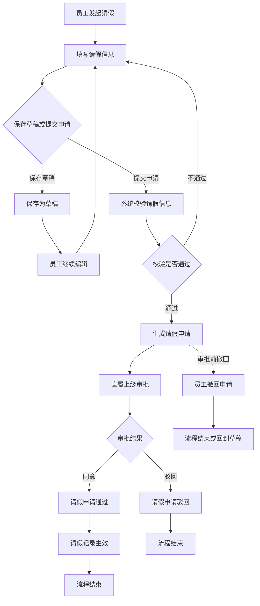
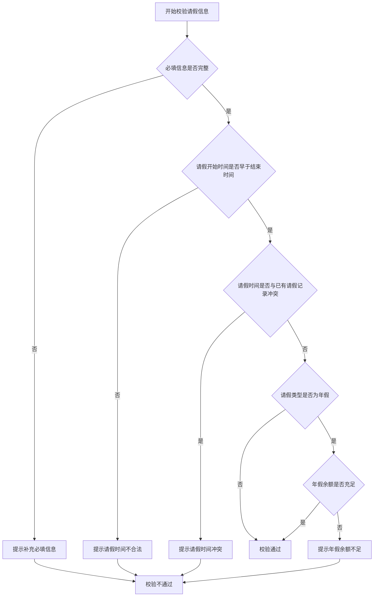

# 利用 AI 快速整理系统需求的方法

## 1. 为什么要先画流程图

在整理一个系统需求时，很多人会直接从功能点开始思考，例如“需要一个申请页面”“需要一个审批按钮”“需要一个列表查询”。这种方式看起来很快，但很容易遗漏关键场景，因为功能点是静态的，而系统真正运行起来时，本质上是一组连续的业务流程。

流程图的价值在于，它可以先帮助我们看清楚系统的主线：

- 谁在什么场景下发起操作
- 操作会经过哪些关键节点
- 每个节点由谁处理
- 什么情况下流程继续
- 什么情况下流程结束
- 什么情况下进入异常分支

只要流程图是清楚的，系统的大方向和关键步骤通常就不会出错。后续的功能拆解、业务规则、页面设计、接口设计、数据结构设计，都可以围绕流程图逐步展开。

在使用 AI 整理需求时，流程图尤其重要。AI 很擅长根据上下文扩展内容，但如果一开始没有给它一个清晰的流程骨架，它也很容易发散到不必要的方向。相反，如果先让 AI 生成一份 Mermaid 格式的流程图，我们就可以把它作为后续分析的入口，不断让 AI 围绕流程中的每个节点继续追问、补充和细化。

> 经验提示：
> 不要一开始就让 AI “帮我写一份完整需求文档”。更好的做法是先让 AI 画出流程图，再基于流程图逐步展开。流程图负责保证方向不跑偏，SRS 编写负责保证内容不遗漏。

> 注意事项：
> 流程图不应该只包含正常流程，还应该包含异常流程。例如审批被拒绝、申请被撤回、审批人不存在、请假时间冲突、申请信息不完整等情况。整理需求时，最容易遗漏的往往不是主流程，而是这些异常分支。

## 2. 整体工作法：流程图、SRS 编写、需求评审、公司 UML 图

利用 AI 整理系统需求时，可以把整个过程拆成四个阶段：先画流程图，再进入 SRS 编写，然后组织需求评审，最后生成公司 UML 图。

这几个阶段不是彼此独立的文档产物，而是一层一层递进的分析过程：

| 阶段 | 目标 | 主要产物 | 解决的问题 |
| --- | --- | --- | --- |
| 流程图 | 建立系统骨架 | Mermaid 流程图 | 系统怎么流转 |
| SRS 编写 | 扩展并固化需求 | 需求规约草稿 | 系统要做什么、不做什么 |
| 需求评审 | 让参会人员理解并确认需求 | 评审意见、修订后的 SRS | 文档是否真的讲清楚了系统 |
| 公司 UML 图 | 固化系统结构 | DDD 风格 `.wsd` 图 | 系统如何被开发理解 |

第一阶段是流程图。流程图的重点是把系统中的角色、动作、判断节点、异常分支串起来。它不追求一开始就覆盖所有细节，而是先保证系统主线清楚。只要主流程和关键异常流程清楚，后续分析就有了稳定的基础。

第二阶段是 SRS 编写。SRS 不是简单地把流程图翻译成文字，而是要在流程图已经确认的基础上，进入 `dy-srs` 技能。这个阶段需要让 AI 围绕流程图中的每一个节点继续追问，逐步明确参与者、前置条件、后置条件、主事件流、备选流、业务规则、关键属性等内容。具体的 SRS 编写方式由 `dy-srs` 技能负责，本文只强调它在整个需求整理流程中的位置和输入输出。

第三阶段是需求评审。SRS 草稿完成后，需要通过需求评审会议确认它是否真的讲清楚了系统。评审的重点不是逐字检查格式，而是让产品、开发、测试、业务方或其他相关人员对系统目标、流程、规则和边界形成一致理解。

第四阶段是公司 UML 图。这里的 UML 图不是单独绘制传统的用例图、类图、时序图，而是使用公司约定的 DDD 风格结构图，将角色、页面、命令、查询、领域事件、聚合、实体、读模型和枚举统一表达出来。它的重点不是画出某一种标准 UML 图，而是让开发人员能够从图中看清楚：谁在使用系统，页面提供哪些能力，哪些操作会改变业务状态，哪些查询支撑页面展示，核心数据对象有哪些，以及业务动作会产生哪些事件。公司 UML 图阶段应使用 `dy-puml` 技能完成，本文不重复展开该技能的完整建模规范。

这几个阶段可以理解为：

- 流程图负责保证方向不跑偏
- SRS 编写负责保证内容不遗漏
- 需求评审负责保证理解一致
- 公司 UML 图负责保证结构可开发

在实际使用 AI 时，不建议一次性要求 AI 输出完整需求文档、流程图和公司 UML 图。更好的方式是分阶段推进：先让 AI 画流程图，确认流程后再进入 SRS 编写，SRS 通过评审后再生成公司 UML 图。每一个阶段都要让人参与审查和修正，不能把 AI 的第一次输出直接当作最终结果。

> 经验提示：
> AI 最适合做“基于明确上下文的扩展”。如果一开始只给 AI 一个模糊目标，它很容易写出看起来完整、实际空泛的内容。流程图就是给 AI 的第一层上下文约束。

> 注意事项：
> 不要把公司 UML 图提前到第一步。很多人在需求还没有明确时就急着整理命令、查询、实体和读模型，这会让讨论过早进入系统结构设计。需求整理阶段应该先讲清楚业务流程和功能边界，再讨论结构表达。

## 3. 示例背景：请假审批系统

为了说明如何利用 AI 快速整理系统需求，本文使用“请假审批系统”作为贯穿示例。

假设公司需要建设一个内部请假审批系统，用于支持员工提交请假申请，直属上级进行审批，人事人员查看和管理请假记录。系统需要支持常见请假类型，例如事假、病假、年假等。员工可以保存草稿、提交申请、撤回申请；审批人可以同意或驳回申请；申请通过后，请假记录进入生效状态；申请被驳回或撤销后，流程结束。

在这个示例中，我们暂不讨论具体技术实现，也不讨论数据库、接口地址、前端框架等内容。我们只关注如何从一个模糊的业务目标出发，引导 AI 逐步整理出流程图、SRS 编写输入和公司 UML 图。

> 示例初始需求：
> 公司需要一个请假审批系统，员工可以提交请假申请，领导审批后生效，人事可以查看请假记录。

> 经验提示：
> 示例需求故意保持模糊，因为真实需求一开始往往也是模糊的。需求整理的价值就在于，把一句模糊的话逐步拆成流程、规则、边界和结构。

## 4. 第一步：让 AI 绘制系统流程图

整理需求的第一步，是让 AI 根据当前已知信息绘制一份系统流程图。流程图不需要一开始就完美，但必须先把系统的主线跑通。

在让 AI 绘制流程图前，最好先提供以下信息：

- 系统要解决什么问题
- 系统中有哪些参与者
- 每个参与者大致会做什么
- 系统从哪里开始
- 流程在什么情况下结束
- 已知的异常情况有哪些

如果这些信息还不完整，也可以直接告诉 AI：“以下信息可能不完整，请你先根据已有信息画出初版流程图，并列出你需要继续确认的问题。”

流程图可以是一组图，但拆分方式不应该一开始就按“主流程、异常流程、状态流程”机械分类。更推荐的方式是：先画一张主流程图，主流程图负责表达系统从开始到结束的完整路径；如果主流程中的某个节点本身比较复杂，再为这个节点单独扩展一张子流程图。

也就是说，流程图的拆分依据不是“异常”或“正常”，而是“某个节点是否复杂到需要展开”。

### 4.1 示例 Prompt

```text
我需要整理一个请假审批系统的需求。

当前已知信息如下：
1. 员工可以提交请假申请。
2. 员工可以保存草稿，也可以直接提交。
3. 直属上级负责审批请假申请。
4. 审批人可以同意，也可以驳回。
5. 员工可以在审批前撤回申请。
6. 人事可以查看所有请假记录。
7. 请假类型包括事假、病假、年假。
8. 暂不考虑具体技术实现。

请你先帮我绘制一份 Mermaid 格式的系统主流程图。

要求：
1. 主流程图只表达系统从开始到结束的核心路径。
2. 图中要体现系统参与者、关键动作、判断节点和结束状态。
3. 不要把所有细节都塞进主流程图。
4. 如果某个节点比较复杂，请在流程图后列出建议继续展开的子流程节点。
5. 如果你发现需求中有不明确的地方，请在流程图后列出需要进一步确认的问题。
```

### 4.2 示例输出

AI 输出的流程图不一定只有一份。更推荐的方式是先生成一份主流程图，再判断主流程中的哪些节点需要继续展开为子流程。

#### 4.2.1 请假审批主流程图



从这张主流程图可以看出，有些节点还不够明确，例如：

- “系统校验请假信息”可能包含必填校验、时间冲突校验、年假余额校验。
- “直属上级审批”可能包含同意、驳回、转交、多级审批等规则。
- “员工撤回申请”需要确认撤回后是流程结束，还是回到草稿。

因此，可以继续让 AI 对复杂节点生成子流程图。

#### 4.2.2 “系统校验请假信息”子流程图



### 4.3 审查流程图

AI 生成流程图后，不能直接进入下一步，需要先人工审查。审查时重点看以下问题：

- 主流程是否完整
- 参与者是否完整
- 判断节点是否清楚
- 结束状态是否明确
- 是否包含必要的异常分支
- 是否存在跳步或循环不合理
- 是否有业务语义不明确的节点
- 是否需要把复杂节点展开为子流程图
- 是否把技术实现混入了业务流程

对于请假审批系统，至少需要继续确认这些问题：

- 撤回后是回到草稿，还是直接结束流程
- 驳回后是否允许员工修改后重新提交
- 年假是否需要校验剩余额度
- 请假时间是否允许和已有请假记录重叠
- 请假天数超过一定范围时是否需要多级审批
- 人事是否只查看记录，还是可以代为调整或作废记录

> 经验提示：
> 主流程图要保持克制，不要把所有细节都塞进去。主流程图只负责讲清楚系统的核心流转；复杂节点再通过子流程图展开。

> 注意事项：
> 子流程图必须能回到主流程中的某个节点或结果。例如“系统校验请假信息”子流程最终应该回到“校验通过”或“校验不通过”，而不是展开成一个和主流程无关的新流程。

## 5. 第二步：基于流程图进入 dy-srs 编写

当主流程图已经确认，并且复杂节点也已经通过子流程图展开后，就可以进入 `dy-srs` 技能。

`dy-srs` 技能负责按钉钉《需求规约》模板编写 SRS。本文不重复展开 SRS 的完整模板和字段，只说明进入 `dy-srs` 前应该准备哪些输入，以及如何判断是否可以进入下一阶段。

这里要注意，SRS 不是让 AI 根据一句话直接生成完整需求规约，而是要把前面已经确认过的流程图作为输入，让 AI 围绕流程中的每个节点继续追问和扩展。流程图解决的是“系统怎么走”，SRS 要进一步解决的是“每一步到底要做什么、有什么规则、有哪些边界”。

在进入 SRS 编写前，至少应该准备好以下内容：

- 已确认的主流程图
- 已确认的子流程图
- 已确认的系统参与者
- 已确认的核心业务名词
- 流程中仍然不明确的问题
- 明确不做的范围

这些内容越清楚，SRS 编写阶段越不容易跑偏。

### 5.1 dy-srs 编写前的输入

以请假审批系统为例，进入 `dy-srs` 前，可以提供给 AI 的输入包括：

```text
请基于以下已确认内容，使用 dy-srs 技能进入 SRS 编写流程。

系统：请假审批系统

已确认的主流程文件：
<主流程图文件路径>

已确认的子流程文件：
<子流程图文件路径>

已确认的系统参与者：
1. 员工：发起请假、保存草稿、提交申请、撤回申请。
2. 直属上级：审批请假申请。
3. 人事：查看请假记录。

已知边界：
1. 暂不讨论具体技术实现。
2. 暂不讨论数据库、接口地址、前端框架。
3. 暂不支持复杂排班规则。
4. 暂不支持自动计算薪资扣款。

要求：
1. 不要直接根据一句话生成完整 SRS。
2. 请先检查输入是否足够。
3. 如果信息不足，请围绕业务目标、系统参与者、主流程、复杂子流程、业务规则、关键属性、非功能需求和范围边界继续追问。
4. SRS 中不要提前写数据库表、接口实现、组件拆分等设计细节。
5. 对没有确认的信息，请标记为“待确认”，不要写成确定结论。
```

### 5.2 为什么不要直接生成完整 SRS

很多人在这个阶段会直接让 AI “根据流程图生成一份完整需求规约”。这种做法看起来效率高，但风险很大。

因为流程图只能说明系统的流转关系，并不能完整说明每个节点的业务规则。例如：

- 保存草稿是否需要校验必填项
- 请假申请提交后是否允许修改
- 撤回后是回到草稿还是流程结束
- 驳回后是否允许重新提交
- 年假余额从哪里确认
- 人事能否修改请假记录
- 请假记录生效后是否允许取消

这些问题如果没有确认，AI 仍然可以写出一份看起来完整的 SRS，但里面很多内容可能都是它推测出来的。需求文档最怕的不是“不完整”，而是“看起来完整但实际没有被确认”。

### 5.3 SRS 阶段的工作重点

SRS 编写阶段的重点不是让文字更正式，而是让需求更确定。

在这个阶段，AI 应该持续帮助我们完成三件事：

- 把流程图中的节点拆成明确的功能需求
- 把模糊节点转化为需要确认的问题
- 把已经确认的问题固化为业务规则和边界说明

当 SRS 编写完成后，它应该能够回答：

- 系统要做什么
- 系统不做什么
- 每个系统参与者能做什么
- 每个功能在什么条件下发生
- 每个功能成功后会产生什么结果
- 每个功能失败或被拒绝时如何处理
- 哪些信息需要输入、保存和展示

> 经验提示：
> SRS 编写阶段最重要的动作是“追问”，不是“生成”。只有问题问清楚了，文档才会可靠。

> 注意事项：
> 如果 SRS 中出现了没有被确认过的业务规则，要让 AI 标记为“待确认”，不要直接写成确定结论。需求规约应该记录确定的信息，而不是包装过的猜测。

## 6. 第三步：组织需求评审会议

SRS 草稿完成后，不能直接进入公司 UML 图阶段。需要先组织需求评审会议，让产品、开发、测试、业务方或其他相关人员一起确认这份文档。

需求评审会议的目标不是逐字检查文档格式，而是验证参会人员是否能基于这份 SRS 对系统形成一致理解。

一份合格的 SRS，至少应该让参会人员能够说明：

- 我们要做什么系统
- 系统解决什么问题
- 系统中有哪些参与者
- 每个参与者能做什么
- 主流程如何流转
- 复杂节点有哪些子流程
- 关键业务规则是什么
- 哪些内容明确不做
- 哪些问题仍然待确认

如果参会人员看完 SRS 后仍然说不清楚这个系统要做什么，或者不同的人对同一个功能理解不一致，说明这份 SRS 还没有达到要求，需要回到 SRS 编写阶段继续修订。

### 6.1 评审会议前的准备

在评审会议前，可以让 AI 帮助准备一份评审材料摘要。摘要不应该替代 SRS，而是帮助参会人员快速进入上下文。

评审材料可以包括：

- 系统目标摘要
- 参与者和职责摘要
- 主流程摘要
- 复杂子流程摘要
- 关键业务规则摘要
- 明确不做的范围
- 待确认问题清单

示例 Prompt：

```text
请基于以下 SRS 文件，帮我生成一份需求评审会议摘要。

SRS 文件：
<SRS 文件路径>

要求：
1. 不要改写 SRS 正文。
2. 用简洁语言说明这个系统要做什么。
3. 列出系统参与者及其职责。
4. 概括主流程和复杂子流程。
5. 提取关键业务规则。
6. 提取明确不做的范围。
7. 提取仍然待确认的问题。
8. 最后生成一份适合会议讨论的问题清单。
```

### 6.2 评审会议中的判断标准

评审会议中，可以重点观察三类问题：

第一类是理解问题。参会人员是否能看懂文档，是否能复述系统目标、主流程和关键规则。

第二类是一致性问题。产品、开发、测试、业务方对同一个功能是否有相同理解。如果不同角色理解不一致，说明文档表达存在歧义。

第三类是遗漏问题。是否存在流程没有覆盖、角色没有说明、异常情况没有处理、业务规则没有明确、边界没有写清楚的情况。

这些问题都应该记录下来，并在会后更新 SRS。

### 6.3 评审会议后的处理

评审会议结束后，不要只保留会议纪要，而要把评审结论回填到 SRS 中。

对于会议中提出的问题，可以分为三类处理：

- 已确认的问题：直接更新到 SRS。
- 待确认的问题：记录为待确认项，明确责任人和确认方式。
- 暂不处理的问题：写入不做范围或后续版本范围。

只有当 SRS 修订完成，并且关键参会人员对系统目标、流程、规则和边界形成一致理解后，才进入公司 UML 图阶段。

> 经验提示：
> 需求评审不是为了证明文档已经写完，而是为了验证文档是否真的能让大家理解一致。只要评审会上出现大量解释成本，就说明文档还需要继续打磨。

> 注意事项：
> 不要让评审会议直接变成技术方案讨论。需求评审阶段重点确认“要做什么”和“边界在哪里”，具体怎么开发应该放到后续公司 UML 图和设计阶段。

## 7. 第四步：基于评审通过的 SRS 进入 dy-puml 建模

当 SRS 已经通过需求评审，并且参会人员对系统目标、流程、规则和边界形成一致理解后，才进入公司 UML 图阶段。

公司 UML 图的绘制由 `dy-puml` 技能负责。本文不重复展开 `dy-puml` 的完整建模规范，只说明这个阶段的输入、输出和检查重点。

`dy-puml` 技能的目标，是将已经确认的 SRS 转换成符合公司 DDD 规范的 PlantUML 领域模型，也就是 `.wsd` 文件。它会基于 SRS 识别聚合、实体、命令、查询、领域事件、读模型、枚举、UI 和参与者关系。

### 7.1 进入 dy-puml 前需要准备什么

进入 `dy-puml` 前，至少需要准备以下内容：

- 评审通过后的 SRS
- 评审会议中确认的补充规则
- 已明确的系统参与者
- 已明确的功能需求
- 已明确的主事件流和备选流
- 已明确的业务规则
- 已明确的关键属性
- 已明确的状态流转
- 已明确的外部系统交互
- 明确不做的范围

如果这些内容还没有确认，不应该急着进入建模阶段。否则 AI 会在建模时自行补充假设，导致公司 UML 图看起来完整，但实际上混入了未经确认的内容。

### 7.2 示例 Prompt

```text
请基于以下已经评审通过的 SRS，使用 dy-puml 技能生成公司 UML 图。

SRS 文件：
<SRS 文件路径>

评审会议确认的补充规则文件：
<评审会议纪要或补充规则文件路径>

要求：
1. 先说明你的建模思路，不要直接生成 .wsd 文件。
2. 请识别系统中可能存在的聚合、实体、命令、查询、领域事件、读模型、枚举、UI 和系统参与者。
3. 请说明哪些内容属于聚合内部逻辑，哪些内容属于跨聚合查询或 UI 查询。
4. 请指出 SRS 中仍然不适合建模、需要继续确认的问题。
5. 在建模思路确认后，再生成符合公司规范的 .wsd 内容。
6. 不要使用 ddd_lib.puml 中未定义的元素。
7. 不要在 UML 中补充 SRS 没有确认过的业务规则。
```

### 7.3 dy-puml 输出后要检查什么

`dy-puml` 输出 `.wsd` 后，需要重点检查：

- 是否使用了公司规定的 DDD 风格元素
- 是否存在未经确认的业务规则
- 是否每个命令都有对应领域事件
- 事件是否能表达真实发生过的业务事实
- 聚合、实体、读模型是否来自 SRS 中的关键属性
- 查询是否能支撑页面或外部系统的读取需求
- UI 是否覆盖 SRS 中描述的主要功能入口
- 系统参与者与 UI、命令、查询的关系是否清楚
- 是否把外部系统管理的数据错误建成本系统聚合
- 是否把技术实现细节混入了业务模型

### 7.4 如果建模时发现需求不清楚

建模阶段经常会暴露 SRS 中隐藏的问题。例如：

- 某个状态没有明确是谁触发的
- 某个功能没有说明成功后的状态变化
- 某个页面需要展示的数据在 SRS 中没有写清楚
- 某个业务动作没有说明是否会产生记录
- 某个外部系统交互没有明确方向和目的

遇到这些问题时，不应该直接在 UML 图中补充猜测。正确做法是回到 SRS 或需求评审环节，把问题确认后再继续建模。

> 经验提示：
> 公司 UML 图不是需求讨论的起点，而是需求确认后的结构化表达。它可以暴露需求遗漏，但不能替代需求确认。

> 注意事项：
> 如果 `dy-puml` 输出的图和 SRS 不一致，优先修正输入或回到需求确认，而不是强行修改图让它看起来合理。UML 图应该忠实表达已确认的需求。

## 8. 如何让 AI 反向检查需求遗漏

完成流程图、SRS 和公司 UML 图后，还需要让 AI 进行一次反向检查。

反向检查的目的不是生成新的内容，而是找出不同产物之间是否存在不一致、遗漏或未经确认的推测。因为需求整理过程中，流程图、SRS、公司 UML 图分别从不同角度描述系统，它们之间应该能够互相对应。

可以让 AI 从以下方向进行检查：

- 流程图中的每个节点，是否都能在 SRS 中找到对应功能或规则
- SRS 中的每个功能，是否都能在流程图中找到来源
- SRS 中的系统参与者，是否都出现在公司 UML 图中
- SRS 中的关键业务动作，是否都转化成了命令或查询
- SRS 中的状态变化，是否都有对应的领域事件或状态表达
- SRS 中的关键属性，是否在聚合、实体、读模型或查询中有合理体现
- 公司 UML 图中是否出现了 SRS 没有确认过的内容
- 公司 UML 图中是否遗漏了 SRS 已确认的功能
- 明确不做的范围，是否被误放进了 SRS 或 UML 图

### 8.1 示例 Prompt

```text
请对以下三个产物进行反向检查：

1. 已确认的流程图文件：
<流程图文件路径>

2. 已评审通过的 SRS 文件：
<SRS 文件路径>

3. 已生成的公司 UML 图文件：
<公司 UML 图 .wsd 文件路径>

检查目标：
1. 找出流程图、SRS、公司 UML 图之间的不一致。
2. 找出流程图中有但 SRS 中没有说明的内容。
3. 找出 SRS 中有但流程图中没有来源的内容。
4. 找出 SRS 中有但公司 UML 图中没有体现的内容。
5. 找出公司 UML 图中出现但 SRS 没有确认过的内容。
6. 找出可能需要补充确认的问题。

输出格式：
1. 问题类型
2. 具体位置或对应内容
3. 问题说明
4. 影响范围
5. 建议处理方式

注意：
不要直接修改任何文档。
不要自行补充新的业务规则。
如果某个问题需要业务确认，请标记为“待确认”。
```

### 8.2 反向检查的重点

反向检查时，重点不是看文字是否优美，而是看需求是否可追溯。

一个功能从最初的流程图，到 SRS，再到公司 UML 图，应该能形成清晰链路。例如：

```text
流程图节点：直属上级审批
SRS 功能：请假审批
公司 UML 图：ApproveLeaveRequestCommand / RejectLeaveRequestCommand / LeaveRequestApprovedEvent / LeaveRequestRejectedEvent
```

如果某个链路断了，就说明存在风险：

- 流程图有节点，但 SRS 没写，说明需求遗漏。
- SRS 有功能，但流程图没来源，说明可能是 AI 发散或后续补充未同步。
- SRS 有业务规则，但 UML 没体现，说明建模遗漏。
- UML 有命令或事件，但 SRS 没对应内容，说明可能出现未经确认的设计假设。

### 8.3 反向检查后的处理

AI 输出检查结果后，需要由人判断如何处理。常见处理方式有三种：

- **直接修订**：明显遗漏或表达错误，可以直接修订流程图、SRS 或 UML 图。
- **补充确认**：涉及业务规则、边界、权限、状态流转等内容，需要找相关人员确认后再修订。
- **明确排除**：确认不属于当前范围的内容，应写入不做范围或后续版本范围，避免后续反复讨论。

反向检查不是一次性动作。只要 SRS 或 UML 图发生较大修改，就应该重新进行一次反向检查，确保各个产物之间仍然一致。

> 经验提示：
> AI 很适合做交叉检查，因为它可以同时阅读多个产物并找出不一致。但最终判断仍然要由人完成，尤其是涉及业务规则和范围边界的问题。

> 注意事项：
> 不要让 AI 在反向检查时直接重写文档。先让它列问题，再由人决定哪些修改、哪些确认、哪些排除。否则检查过程本身也可能引入新的假设。

## 9. UML 图评审会

公司 UML 图生成并完成反向检查后，需要组织 UML 图评审会。建议邀请架构师、项目经理、核心开发人员，以及对业务流程较熟悉的人员参加。

UML 图评审会和需求评审会议不同。需求评审会议关注的是“这份 SRS 是否让大家理解要做什么系统”；UML 图评审会关注的是“当前 UML 图是否能正确表达系统结构，并支持后续开发”。

### 9.1 UML 图评审会的目标

UML 图评审会主要确认以下内容：

- 聚合划分是否合理
- 命令、查询、领域事件是否完整
- 关键业务动作是否都有结构化表达
- 主要状态变化是否能被事件追溯
- 实体、读模型和枚举是否来自 SRS 中的明确需求
- UI、系统参与者、命令、查询之间的关系是否清楚
- 是否存在未经确认的业务假设
- 是否存在过度设计或结构拆分过细的问题
- 是否符合 `dy-puml` 技能和公司 DDD 建模规范

评审的重点不是把图画得更复杂，而是确认这张图能不能让开发人员理解系统的核心结构。

### 9.2 评审会议前的准备

在会议前，可以让 AI 基于 `.wsd` 文件生成一份 UML 评审摘要，帮助参会人员快速理解图中内容。

示例 Prompt：

```text
请基于以下公司 UML 图文件，生成一份 UML 图评审摘要。

UML 图文件：
<公司 UML 图 .wsd 文件路径>

要求：
1. 概括当前图表达的系统范围。
2. 列出 UML 图中的主要系统参与者，例如用户角色、外部系统或会触发业务动作的参与方。
3. 列出主要 UI。
4. 列出主要聚合、实体、读模型和枚举。
5. 列出主要命令、查询和领域事件。
6. 说明关键业务动作如何在图中表达。
7. 标记你发现的潜在建模问题。
8. 标记可能需要架构师或项目经理确认的问题。
```

会议前还应准备：

- 评审通过后的 SRS
- 最新 `.wsd` 文件
- 反向检查结果
- 本轮建模中发现但尚未确认的问题
- 需要架构师或项目经理重点判断的问题

### 9.3 评审会议中的判断标准

评审时可以从三类问题入手。

第一类是需求一致性。UML 图是否忠实表达了 SRS，而不是新增需求、遗漏需求或改变需求含义。

第二类是建模合理性。聚合边界是否清楚，命令和事件是否能表达业务动作，查询和读模型是否能支撑页面或外部系统读取。

第三类是开发可用性。开发人员是否能基于 UML 图理解要创建哪些核心结构、哪些动作会改变状态、哪些查询支撑展示、哪些事件代表业务事实。

如果架构师或项目经理认为图中某些结构不合理，应明确是需求不清楚、模型划分不合理，还是命名和表达不符合规范。不同类型的问题要回到不同阶段处理。

### 9.4 评审会议后的处理

UML 图评审结束后，需要将评审意见分类处理：

- **需求问题**：回到 SRS 修订，必要时重新进行需求评审。
- **建模问题**：回到 `dy-puml` 阶段，修订 `.wsd` 文件。
- **规范问题**：按公司 DDD 建模规范调整命名、元素和关系。
- **后续问题**：记录为后续版本或后续设计阶段处理。

只有当 UML 图通过评审，且架构师、项目经理和核心开发人员对结构表达没有关键分歧时，才可以作为后续开发设计和任务拆分的基础。

> 经验提示：
> UML 图评审会不是为了让所有人都记住图里的每个元素，而是确保系统结构没有明显偏差。评审会上最重要的问题通常是：边界对不对，动作漏没漏，状态有没有表达清楚。

> 注意事项：
> 如果 UML 图评审中发现需求本身没有说清楚，不要只在 UML 图里修补。UML 图是需求的结构化表达，不应该替代 SRS 成为需求来源。

## 10. 常用 Prompt 模板

本章整理一组常用 Prompt，用于在不同阶段快速引导 AI 完成需求整理工作。

在实际工作中，流程图、SRS、评审纪要和 UML 图通常都已经沉淀为文件。因此 Prompt 中应优先提供文件路径，让 AI 读取文件后再分析，避免人工复制大段内容造成遗漏或版本混乱。

使用这些 Prompt 时，不建议原样照搬后直接提交。更好的做法是根据当前系统的实际情况，补充业务背景、系统参与者、已知规则、边界范围和待确认问题。

### 10.1 生成主流程图

```text
我需要整理一个系统需求。

系统名称：<系统名称>

当前已知信息如下：
1. <已知信息 1>
2. <已知信息 2>
3. <已知信息 3>

请你先帮我绘制一份 Mermaid 格式的主流程图。

要求：
1. 主流程图只表达系统从开始到结束的核心路径。
2. 图中要体现系统参与者、关键动作、判断节点和结束状态。
3. 不要把所有细节都塞进主流程图。
4. 如果某个节点比较复杂，请在流程图后列出建议继续展开的子流程节点。
5. 如果发现需求中有不明确的地方，请列出需要进一步确认的问题。
6. 暂不讨论具体技术实现、数据库、接口地址或前端框架。
```

### 10.2 生成复杂节点子流程图

```text
请基于以下主流程图文件，针对其中的复杂节点生成子流程图。

主流程图文件：
<主流程图文件路径>

需要展开的节点：
<节点名称>

已知规则：
1. <规则 1>
2. <规则 2>
3. <规则 3>

要求：
1. 使用 Mermaid 格式。
2. 子流程图只展开该节点内部的处理逻辑。
3. 子流程必须能回到主流程中的明确结果。
4. 如果存在校验、判断、取消、失败、驳回等情况，请在子流程中表达。
5. 不要扩展和该节点无关的流程。
6. 如果信息不足，请先列出需要确认的问题。
```

### 10.3 进入 dy-srs 编写

```text
请基于以下已确认内容，使用 dy-srs 技能进入 SRS 编写流程。

系统名称：
<系统名称>

已确认的主流程图文件：
<主流程图文件路径>

已确认的子流程图文件：
<子流程图文件路径>

已确认的系统参与者文件：
<系统参与者说明文件路径>

已确认的业务名词文件：
<业务名词说明文件路径>

已确认的业务规则文件：
<业务规则说明文件路径>

明确不做的范围文件：
<不做范围说明文件路径>

仍然待确认的问题文件：
<待确认问题文件路径>

要求：
1. 不要直接根据一句话生成完整 SRS。
2. 请先检查输入是否足够。
3. 如果信息不足，请围绕业务目标、系统参与者、主流程、复杂子流程、业务规则、关键属性、非功能需求和范围边界继续追问。
4. SRS 中不要提前写数据库表、接口实现、组件拆分等设计细节。
5. 对没有确认的信息，请标记为“待确认”，不要写成确定结论。
```

### 10.4 准备需求评审会议摘要

```text
请基于以下 SRS 文件，帮我生成一份需求评审会议摘要。

SRS 文件：
<SRS 文件路径>

要求：
1. 不要改写 SRS 正文。
2. 用简洁语言说明这个系统要做什么。
3. 列出系统参与者及其职责。
4. 概括主流程和复杂子流程。
5. 提取关键业务规则。
6. 提取明确不做的范围。
7. 提取仍然待确认的问题。
8. 最后生成一份适合会议讨论的问题清单。
```

### 10.5 进入 dy-puml 建模

```text
请基于以下已经评审通过的 SRS，使用 dy-puml 技能生成公司 UML 图。

SRS 文件：
<SRS 文件路径>

评审会议确认的补充规则文件：
<评审会议纪要或补充规则文件路径>

要求：
1. 先说明你的建模思路，不要直接生成 .wsd 文件。
2. 请识别系统中可能存在的聚合、实体、命令、查询、领域事件、读模型、枚举、UI 和系统参与者。
3. 请说明哪些内容属于聚合内部逻辑，哪些内容属于跨聚合查询或 UI 查询。
4. 请指出 SRS 中仍然不适合建模、需要继续确认的问题。
5. 在建模思路确认后，再生成符合公司规范的 .wsd 内容。
6. 不要使用 ddd_lib.puml 中未定义的元素。
7. 不要在 UML 中补充 SRS 没有确认过的业务规则。
```

### 10.6 反向检查流程图、SRS 和公司 UML 图

```text
请对以下三个产物进行反向检查：

1. 已确认的流程图文件：
<流程图文件路径>

2. 已评审通过的 SRS 文件：
<SRS 文件路径>

3. 已生成的公司 UML 图文件：
<公司 UML 图 .wsd 文件路径>

检查目标：
1. 找出流程图、SRS、公司 UML 图之间的不一致。
2. 找出流程图中有但 SRS 中没有说明的内容。
3. 找出 SRS 中有但流程图中没有来源的内容。
4. 找出 SRS 中有但公司 UML 图中没有体现的内容。
5. 找出公司 UML 图中出现但 SRS 没有确认过的内容。
6. 找出可能需要补充确认的问题。

输出格式：
1. 问题类型
2. 具体位置或对应内容
3. 问题说明
4. 影响范围
5. 建议处理方式

注意：
不要直接修改任何文档。
不要自行补充新的业务规则。
如果某个问题需要业务确认，请标记为“待确认”。
```

### 10.7 准备 UML 图评审摘要

```text
请基于以下公司 UML 图文件，生成一份 UML 图评审摘要。

UML 图文件：
<公司 UML 图 .wsd 文件路径>

要求：
1. 概括当前图表达的系统范围。
2. 列出 UML 图中的主要系统参与者，例如用户角色、外部系统或会触发业务动作的参与方。
3. 列出主要 UI。
4. 列出主要聚合、实体、读模型和枚举。
5. 列出主要命令、查询和领域事件。
6. 说明关键业务动作如何在图中表达。
7. 标记你发现的潜在建模问题。
8. 标记可能需要架构师或项目经理确认的问题。
```

> 经验提示：
> Prompt 的作用不是一次性得到最终答案，而是让 AI 按正确方向开始工作。越重要的需求，越应该分阶段追问、确认和修订。

> 注意事项：
> 如果 AI 输出内容看起来很完整，但你无法从流程图、SRS 或评审结论中找到依据，就要把它当作风险点处理。

## 11. 检查清单

本章用于在需求整理完成后进行自查。建议每完成一个阶段，就对照对应清单检查一次，不要等全部文档都写完后才统一检查。

### 11.1 流程图检查清单

- 主流程是否从明确的开始节点到明确的结束节点
- 主流程是否覆盖系统最核心的业务路径
- 主流程中是否体现了主要系统参与者
- 判断节点是否表达清楚
- 每个判断节点是否有明确的后续路径
- 流程图是否避免混入数据库、接口、框架等技术实现
- 是否识别出需要展开的复杂节点
- 复杂节点是否已经拆成子流程图
- 子流程图是否能回到主流程中的明确结果
- 是否仍有未确认的问题被记录下来

### 11.2 dy-srs 输入检查清单

- 是否已经确认主流程图
- 是否已经确认必要的子流程图
- 是否已经明确系统参与者及职责
- 是否已经明确核心业务名词
- 是否已经整理已知业务规则
- 是否已经记录明确不做的范围
- 是否已经记录待确认问题
- 是否避免让 AI 根据一句话直接生成完整 SRS
- 是否要求 AI 对未确认信息标记“待确认”
- 是否避免把技术设计细节提前写入 SRS

### 11.3 SRS 检查清单

- SRS 是否说明了系统要解决的问题
- SRS 是否说明了系统要做什么
- SRS 是否说明了系统不做什么
- 每个主要系统参与者是否都有对应功能
- 每个主要功能是否有清晰的主事件流
- 重要分支是否有备选流
- 业务规则是否明确、可理解、可验证
- 关键属性是否区分辅助属性、输入属性、显示属性
- 非功能需求是否只写已知要求，没有凭空补充
- 是否存在未经确认但被写成确定结论的内容
- 是否存在技术实现细节过早进入需求文档
- 是否仍有待确认问题清单

### 11.4 需求评审检查清单

- 参会人员是否能说明系统要做什么
- 参会人员是否能说明系统解决什么问题
- 参会人员是否能理解主要系统参与者
- 参会人员是否能理解主流程
- 参会人员是否能理解复杂子流程
- 参会人员是否能理解关键业务规则
- 不同角色对同一功能是否理解一致
- 评审中发现的问题是否已经记录
- 已确认问题是否已经回填到 SRS
- 待确认问题是否明确责任人和确认方式
- 暂不处理的问题是否写入不做范围或后续版本范围
- SRS 修订后是否再次确认关键分歧已解决

### 11.5 dy-puml 输入检查清单

- SRS 是否已经通过需求评审
- 评审补充规则是否已经回填或形成记录
- 系统参与者是否明确
- 功能需求是否明确
- 主事件流和备选流是否明确
- 业务规则是否明确
- 关键属性是否明确
- 状态流转是否明确
- 外部系统交互是否明确
- 明确不做的范围是否已经说明
- 是否要求 AI 先说明建模思路，再生成 `.wsd`
- 是否禁止 AI 在 UML 中补充 SRS 未确认的业务规则

### 11.6 公司 UML 图检查清单

- 是否使用 `dy-puml` 技能生成或修订
- 是否符合公司 DDD 风格建模规范
- 是否使用 `.wsd` 文件
- 是否使用公司规定的 DDD 元素
- 是否存在未经确认的业务规则
- 每个命令是否有对应领域事件
- 事件是否表达真实发生过的业务事实
- 聚合和实体是否来自 SRS 中的明确需求
- 读模型和查询是否能支撑页面或外部系统读取
- UI 是否覆盖 SRS 中描述的主要功能入口
- 系统参与者与 UI、命令、查询的关系是否清楚
- 是否把外部系统管理的数据错误建成本系统聚合
- 是否把技术实现细节混入业务模型
- `.wsd` 文件是否保持 CRLF 换行符

### 11.7 反向检查清单

- 流程图中的每个节点是否能在 SRS 中找到对应说明
- SRS 中的每个主要功能是否能在流程图中找到来源
- SRS 中的系统参与者是否都出现在公司 UML 图中
- SRS 中的关键业务动作是否都转化为命令或查询
- SRS 中的状态变化是否都有对应事件或状态表达
- SRS 中的关键属性是否在聚合、实体、读模型或查询中有体现
- 公司 UML 图中是否出现了 SRS 没有确认过的内容
- 公司 UML 图中是否遗漏了 SRS 已确认的功能
- 明确不做的范围是否被误放进 SRS 或 UML 图
- 反向检查发现的问题是否已经分类处理

### 11.8 UML 图评审检查清单

- 是否邀请架构师、项目经理和核心开发人员参与
- 评审前是否准备 SRS、`.wsd` 文件和反向检查结果
- 聚合划分是否得到认可
- 命令、查询、领域事件是否完整
- 关键业务动作是否都有结构化表达
- 主要状态变化是否能被事件追溯
- 实体、读模型和枚举是否来自 SRS 明确需求
- UI、系统参与者、命令、查询之间的关系是否清楚
- 是否存在未经确认的业务假设
- 是否存在过度设计或结构拆分过细的问题
- 是否符合 `dy-puml` 技能和公司 DDD 建模规范
- 评审意见是否已经分类处理
- 通过评审后的 UML 图是否可以支撑开发设计和任务拆分

> 经验提示：
> 检查清单不是为了增加流程负担，而是为了避免遗漏。真正有用的清单应该帮助团队发现问题，而不是只用来证明流程已经走过。

> 注意事项：
> 如果检查清单中有关键项无法勾选，不要急着进入下一阶段。越早发现问题，修改成本越低。

## 12. 总结：流程图不跑偏，SRS 不遗漏，评审达成共识，UML 可开发

利用 AI 快速整理系统需求，核心不是让 AI 一次性生成一份看起来完整的文档，而是让 AI 按阶段帮助我们把模糊需求逐步变清楚。

整个过程可以概括为：

```text
流程图确认
-> dy-srs 编写 SRS
-> 需求评审会议
-> dy-puml 生成公司 UML 图
-> AI 反向检查
-> UML 图评审会
```

每个阶段都有自己的目标：

- 流程图负责保证方向不跑偏
- dy-srs 负责把流程和规则固化为 SRS
- 需求评审负责让相关人员形成一致理解
- dy-puml 负责把 SRS 转换为公司 UML 图
- AI 反向检查负责发现遗漏和不一致
- UML 图评审负责确认结构可开发

这套方法的关键，是不要跳步。流程图没有确认，就不要急着写 SRS；SRS 没有评审通过，就不要急着画 UML；UML 没有反向检查和评审，就不要直接进入开发设计。

AI 可以提高需求整理效率，但不能替代人的判断。它适合做流程梳理、结构化表达、问题追问、交叉检查和模板化输出；而业务边界、关键规则、范围取舍、最终确认，仍然需要由人负责。

> 经验提示：
> 一份好的需求文档，不是因为它写得长，而是因为它能让不同角色的人对同一个系统形成一致理解。

> 注意事项：
> 如果某个阶段发现前一阶段没有讲清楚，不要在当前阶段硬补。正确做法是回到前一阶段修正，再继续往下走。
