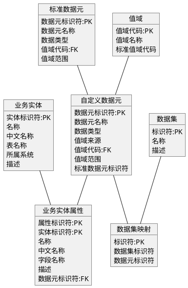

# 元数据管理需求规约

# 修订历史记录

| **日期** | **版本** | **说明** | **作者** |
| --- | --- | --- | --- |
| 2025年8月27日 | 1.0 | 数据元、实体、实体属性需求第一稿 | 林继 |
| 2025年8月27日 | 1.1 | 修改数据元类别定义及编码长度 | 林继 |
| 2025年12月31日 | 1.2 | 数据元增加“所属系统”属性 | 林继 |
| 2026年2月26日 | 1.3 | 修正“所属系统”属性说明，增加数据集需求 | 林继 |
| 2026年3月25日 | 1.4 | 数据元增加两个属性：“单位”、“业务分类” | 林继 |

# 简介

## 概述

元数据管理系统（MetaData Management）作为医疗数据资产的 **“统一知识图谱与智能治理大脑”**，专注于采集、管理、分析描述全院数据的数据（元数据），提供数据**定义、来源、流转、关系、质量、合规性的全景视图**，赋能医疗数据的**可发现、可理解、可信赖、可治理**，支撑临床、管理、科研与合规。

#### 核心职责

1.  **技术元数据管理**：维护（采集）HIS、EMR、LIS、PACS、BI、科研平台等系统的**数据库表、字段、ETL作业、API接口、报表定义、数据模型**及其血缘关系。
    
2.  **业务元数据管理**： 
    
    *   定义**医疗业务术语**（如“门诊人次”、“住院死亡率”、“药品不良反应”的计算规则与口径）。
        
    *   维护**数据字典**（如EMR中“主诉”、“现病史”字段的业务含义）。
        
    *   关联**医学术语标准**（如ICD-10/11疾病编码、LOINC检验编码、SNOMED CT临床术语）与系统技术字段。
        
    *   明确**数据责任人(Steward)**（如“患者基本信息”责任人为信息科，“检验结果”责任人为检验科）。
        
3.  **数据血缘与影响分析**： 
    
    *   可视化追踪关键数据（如**患者最终诊断、检验结果值、药品消耗量、医疗费用**）从\*\*源头（如EMR录入、LIS仪器）到消费（如DRGs分组、医保结算报表、科研分析）\*\*的完整加工路径。
        
    *   分析变更影响（如修改LIS中某个检验项目的编码规则，会影响哪些临床报表、科研数据集、医保上报文件）。
        
4.  **数据资产目录**：构建可搜索的**医疗数据资产地图**，支持按业务术语（“住院患者”、“手术记录”）、技术名称（**PAT\_VISIT**表）、责任人、标准编码（ICD码）等快速定位和理解数据资产。
    
5.  **敏感数据自动发现与分类**： 
    
    *   利用规则引擎/AI扫描识别包含**患者隐私信息**（姓名、身份证号、病历号、联系方式、诊断详情、基因信息）的字段和分布。
        
    *   自动打标（如标记为**PII**、**PHI**、**GDPR敏感**、**HIPAA保护**），支撑隐私合规评估(DPIA)。
        
6.  **数据质量监控集成**：关联数据质量规则（如患者年龄范围、检验结果合理值域）与元数据，展示关键数据质量状态。
    
7.  **数据标准管理**：存储和发布**医疗数据标准**，如患者信息模型标准、疾病与手术操作分类标准、数据交换标准(如HL7 FHIR)。
    

#### 核心业务价值

1.  **加速数据价值释放**： 
    
    *   帮助**临床研究人员**快速发现并理解所需的患者队列、诊疗过程、结局指标数据，缩短研究周期。
        
    *   帮助**管理决策者**快速定位准确的运营指标（如床位使用率、平均住院日）定义和来源，支持精准决策。
        
    *   帮助**数据分析师/工程师**理解数据含义与血缘，减少数据准备和探索时间。
        
2.  **提升数据质量与可信度**：清晰展示数据的**定义、计算逻辑、来源和加工过程**，减少因误解数据导致的错误结论（如误用“门诊量”统计口径）。
    
3.  **强化数据治理与合规**： 
    
    *   **自动识别PHI分布**，精确绘制敏感数据地图，支撑HIPAA等合规审计与风险管控。
        
    *   **精确追踪数据血缘**，证明数据使用合规性（如科研项目使用的患者数据是否经过脱敏、授权）。
        
    *   **推动医学术语与数据标准落地**，促进跨系统、跨机构数据互认互通。
        
4.  **降低系统变更风险**：在升级HIS、改造ETL流程、重构报表前，精准评估对**临床业务、管理报表、科研项目**的潜在影响，避免宕机或数据错误。
    
5.  **支持互联互通与信息共享**：为区域卫生信息平台、医联体数据共享提供清晰的**数据语义和接口定义**，降低集成复杂度。
    
6.  **促进数据驱动的医疗文化**：建立统一的医疗数据语言和知识库，打破临床、管理、科研、信息部门间的数据认知壁垒。
    

元数据管理的价值可再参阅 [元数据管理的意义](https://alidocs.dingtalk.com/i/nodes/2Amq4vjg89gaR5aaiv02a6E9V3kdP0wQ?utm_scene=team_space)。

## 参考资料

[卫生健康信息数据元目录 第 1 部分：总则](https://alidocs.dingtalk.com/i/nodes/YQBnd5ExVEwX6yXXsk499MG48yeZqMmz?utm_scene=team_space)

[卫生健康信息数据元值域代码 第 1 部分：总则](https://alidocs.dingtalk.com/i/nodes/NZQYprEoWoey6OyyIPdNr6pOJ1waOeDk?utm_scene=team_space)

# 整体说明

在前期基于表格工具进行数据元映射的实践中，总结出一些影响效率和质量的问题，需要通过工具来解决。需求为：

*   基于《WS/T **363**—2023 卫生健康信息数据元目录》收录的数据元不能完全满足业务系统需求，需要在设计过程中持续添加维护，并将结果实时记录到数据库中，以便在后续的UML设计中直接使用。
    
*   基于《WS/T **364**—2023 卫生健康信息数据元值域代码标准》收录的值域目录也存在同样的问题需要解决。
    
*   为了解决业务所需的数据元不能与标准数据元完全对应的情况，在数据元和值域目录中都引入了**自定义编码，**需要从工具层面解决自动编号的问题，否则人工编码容易出现错误。
    
*   从标准数据元的定义来看，存在两种值域类型，一种可以对应到值域代码标准中，一种是少于三个的枚举，直接以文本方式表达。但对于业务系统来说，这些简单值域也需要字典化。应提供一键生成字典的功能，以简化设计工作。
    
*   ~~在设计过程中，需要面向业务不断扩充超出标准值域代码范围之外的业务值域代码。为了提高效率，可以将设计工作和数据收录工作分开。工具应提供相关的查询和标注功能，以方便数据收录人员有计划的开展工作。~~
    
*   工具能基于AI提供一些辅助功能，比如能直接将中文属性名称翻译为英文，翻译时须遵循《[命名规范](https://alidocs.dingtalk.com/i/nodes/k2wz1jPpZ30WoMD1O9rpJNnvrL4A6dxE?utm_scene=team_space)》和医疗术语定义。
    

# 具体需求

## 功能

前期收录的来自于标准文件的值域目录和数据元目录做为独立数据保留（标准元数据），单独建立服务于业务系统的值域目录和数据元目录（自定义元数据），在自定义元数据维护过程中可以选择标准数元据使用，并建立两者的对应关系。

### 数据元维护

| **需求名称** | 数据元（Data Element）维护 |
| --- | --- |
| **需求编码** | ### REQ-MDMS-0001 |
| **参与者** | 元数据管理员 |
| **前置条件** |  |
| **后置条件** |  |
| **主事件流** | 1.  维护数据元时可同时编辑“普通类”和“代码类”数据元（如有），二者是独立的两条记录，但存在一一对应的关系。它们的编码只在第五部分有区别，其他部分都一样。      2.  添加数据元时先在标准元数据目录中查找，如存在则选用，可直接沿用标准数据元名称、定义、数据类型和表示格式应按业务定义的标准进行转换，同时记录标准数据元代码；      3.  如查找不到则需录入数据元关键属性，此时标准数据元代码为空；      4.  可以通过“普通类”数据元扩展出“编码类”和“ID类”数据元，反之亦然。只能扩展一次，不能重复;      5.  可以通过“派生”操作从基本数据元创建新的数据元，可以视为继承关系。只有第四部分编码为“0000”的记录可以派生，派生的数据元从“0001”开始顺序编号。对于存在“代码类”数据元对应的记录，同样可派生出“普通类”和“代码类”两条数据元。      6.  由于**业务系统**和**主数据系统**并存，某些业务实体（如字典、药品）在两个系统中都会被定义，这导致通过**ID类数据元**追溯实体时会出现多个指向。所以需要对指向主数据系统的ID类数据元特殊定义。首先约定，新建数据元均来自于“**业务系统**”，如果**主数据系统**中存在语义相同的ID类数据元，不能直接使用现有数据元，要根据数据元重新创建一个（镜像），将其“所属系统”标记为“主数据系统”，新数据元编码前19位均与原数据元编码相同。举例：业务系统和主数据系统中都定义了“字典类型”实体，“字典类型ID”是它的ID类数据元，在数据元中应先定义**业务系统**的“字典类型ID”，编号为“DY.DE.XXXXX.XXXX.X.**0**”，再基于它“镜像”出**主数据系统**中的“字典类型ID（主数据）”，编号为“DY.DE.XXXXX.XXXX.X.**1**”      7.  提供修改和禁用功能 |
| **备选流** |  |
| **异常流程** |  |
| **业务规则** | 1.  数据元标识符编码规则：DY.DE.XXXXX.XXXX.X.X，共20位：          > 第一部分：2位，固定为“达远”拼音首字母；          > 第二部分：2位，固定为Data Element的缩写；          > 第三部分：5位，为数据元创建时的顺序流水号；          > 第四部分：4位，为附加码。附加码“0000”表示基本数据元，大于“0000”的是派生数据元，在概念范围上前者包含后者；          > 第五部分：1位，类别标志：0：普通类 1：代码类 ；          > 第六部分：1位，镜像位：0：业务系统 1：主数据系统。镜像数据元的判定方式为：它和某个业务数据元语义上等价，但它既不是独立的数据元也不是某个数据元的派生，并且作为主键指向了主数据系统中独立的实体。          > 以上各部分之间用“.”分隔。      2.  数据元中文名称和英文名称在不同系统中应保持唯一。镜像数据元的中文名称加后缀“（主数据）”，英文名称加后缀“(MDM)”。**注意**两个后缀分别使用了中文和英文**括号**      3.  类型转换规则（参见附表一） |
| **关键属性** | **注**：本部分的截图均来自于[卫生健康信息数据元目录 第 1 部分：总则](https://alidocs.dingtalk.com/i/nodes/YQBnd5ExVEwX6yXXsk499MG48yeZqMmz?utm_scene=team_space) **数据元标识符** 按指定规则生成  **数据元名称**         可参考标准中的定义   **数据元英文名称**  **数据元描述**  数据元的说明文字  **数据元类别标志** 0.普通类（含名称类） 1.编码类  2.ID类  用于生成数据元标识符。 *   由于存在概念相同的代码和名称成对出现的数据元，通过此标志可以统一归集此类数据。如：“诊断名称/代码”、“麻醉方式名称/代码”。      *   某些实体同时存在“ID”、“编码”和“名称”类属性，因此增加“ID”类数据元      *   除编码类和ID类之外的所有数据元都是“普通类”数据元。           **数据元数据类型**           标准文件中数据类型的定义如下：                               重新定义符合业务需求的数据元类型，与标准类型的对应关系参考本小结《附表一》           **表示格式**               表示格式可由**最小长度、最大长度、精度（数值型总位数）、刻度（小数位数）**组成。如果直接引用标准数据元，可由其定义的表示格式转化得到。以下是标准文件中定义的表示格式。                               **数值范围**          包括最小值、最大值，定义数据元值的允许值范围           **值域来源**          在业务系统中值域可选项来自的实体的名称，有：          Dictionary（字典）、Region（行政区划）、Disease（疾病）等           **值域代码**          记录从值域来源中识别数据子集的分类标志，如“字典”中的“字典类型”，如“疾病”中的“记录类型（ICD10、CM3、中医诊断、症型等）”。如值域来源中的数据无需再做区别，此属性为空，如“行政区划”。           **校验规则**           用于检查实体数据正确性的正则表达式           **标准数据元代码（卫健编码）**           无需自行编码，自于标准文件中规定的标识符，自定义数据元该属性可以为空。          编码规则可参看[卫生健康信息数据元目录 第 1 部分：总则](https://alidocs.dingtalk.com/i/nodes/YQBnd5ExVEwX6yXXsk499MG48yeZqMmz?utm_scene=team_space)          **个人敏感信息（Personal sensitive information）类别**          为信息保护机制预留。          参考：GB/T 35273-2020《信息安全技术 个人信息安全规范》附表B                    **源实体**          记录当前数据元在系统中的原始出处和权威数据实体来源，当需要将用户业务逻辑映射为元数据模型的操作时，能提供准确数据来源和上下文信息。如：          当前数据元的自然实体，也即创造该数据元的地方。当需要获取该数据元相关的数据时，通过此属性可以知道应该从哪个实体获取，如：          *   “用户ID”的源实体为“用户”，意味着通过“用户ID”可以在“用户”集合中获取一个用户；              *   当需要查询一个包含“用户名”、“所在组织机构名称”等属性的一个集合时，通过源实体可以推断出需要分别关联“用户”和“组织结构”实体来分别提取；              *   当系统需要查询某个用户的“用户名”和“所在组织机构名称” ，除了上面的关联关系外，还可推断出此查询可能需要一个“用户ID”参数。              *   当其他实体对该数据元进行了冗余存储时，可以通过源实体对比数据的一致性。          **源数据元** 当某些抽象实体的属性出现在其他实体中，会被赋予具体的语义。如：“外部机构ID”在“药品”实体中，将被定义为“生产企业ID”和“上市许可持有人ID”，为了能保持数据元的实际业务语义，并能通过实体属性识别实体之间的关系，创建“生产企业ID”和“上市许可持有人ID”数据元时，应指明其“源实体”为“外部机构”，且指明其“源数据元”为“外部机构ID”。 源实体中此数据元对应的数据元，一般就是此数据元，但在抽象过高的实体中可能存在差异，如将“外部企业”和“外部组织”统一抽象为“外部机构”实体的情况下，此实体的ID既是“外部企业ID”也是“外部组织ID”，对于“药品”中的“生产企业”而言，它对应的数据元应该是“药品生产企业ID”，该数据元显然不存在于“外部机构”实体中，此时对应的数据元应该是“外部机构ID”。 **是否常用**  对于可能用于多个实体且无业务语义的数据元，标记为常用以方便实体属性维护时快速录入。具体有：**拼音、五笔、描述、顺序号、是否有效**等 **是否有效** 0：无效 1：有效 **所属系统**       **0：业务系统 1：主数据** **计量单位** 用于明确数值所采用的度量标准，确保数据在不同系统、场景间的一致性与可比性。 **业务分类**        来自值域类别：DY.CV.00036 如：金额类、状态类、计量类。用于统一业务类型和自动化，如根据该分类自动识别某个字段应该用于关联其他实体、排序、分组或者求和 |
|  |  |

#### 附表一 数据元类型对照

| **业务类型** | **含义** | **C#类型** | **标准文件中的类型** |
| --- | --- | --- | --- |
| String | 字符串 | string | **S** |
| Text | 文本，通常很大 | string | **S** |
| Boolean | 布尔 | bool | **L** |
| Byte | 字节 | byte\[\] | **B** |
| Decimal | 小数，双精度 | decimal | **N** |
| Float | 浮点，单精度 | float | **N** |
| Integer | 整数 | int | **N** |
| Date | 日期 | DateOnly | **D** |
| Time | 时间 | TimeOnly |  |
| DateTime | 日期及时间 | DateTime | **DT** |
| Guid | Guid | Guid | **S** |

### 业务实体维护

| **需求名称** | 业务实体（Entity）维护 |
| --- | --- |
| **需求编码** | ### REQ-MDMS-0002 |
| **参与者** | 元数据管理员 |
| **前置条件** |  |
| **后置条件** |  |
| **主事件流** | 录入关键属性后保存，支持禁用/启用 |
| **备选流** |  |
| **异常流程** |  |
| **业务规则** | 同一子系统内，实体代码和名称不能重复 |
| **关键属性** | **实体标识符** Guid **子系统编码** 来自于字典中的定义 **模型名称** 英文名称（大驼峰命名法） **中文名称** 中文名称 **表名称** 子系统代码+模型名称（蛇形命名） **数据级别编码** 实体包含的数据在应用系统中的职责和作用，分为三类： 1-核心类：支撑系统基本运行的核心数据，如：字典、参数定义等 2-基础类：支撑业务功能运行的基础数据；如：参数配置、药品目录等 3-业务类：业务过程中生产的数据；如：就诊记录、医嘱记录等 **描述** **是否有效** 0：无效（用于标注业务上已不再的实体） 1：有效 |
|  |  |

### 业务实体属性维护

| **需求名称** | 业务实体属性（Entity Property）维护 |
| --- | --- |
| **需求编码** | ### REQ-MDMS-0003 |
| **参与者** | 元数据管理员 |
| **前置条件** |  |
| **后置条件** |  |
| **主事件流** | 录入关键属性后保存，支持禁用/启用 |
| **备选流** |  |
| **异常流程** |  |
| **业务规则** |  |
| **关键属性** | **属性标识符** Guid **实体标识符** 记录属性从属于哪个业务实体 **代码** 属性英文名称（大驼峰命名法） **名称** 中文名称 **字段名称** 英文名称（蛇形命名） **描述** **数据元标识符** 记录属性与数据元的映射关系 **是否为实体主键** **是否允许为空** **是否有效** 0：无效（用于标注业务上已不再的实体属性） 1：有效 |

### 数据集维护

以下数据集基本概念引用自《2023卫生健康信息数据集分类与编码规则》

> 数据集是具有主题的、可标识的、能被计算机处理的数据集合。

> a) 主题:围绕着某一项特定任务或活动进行数据规划和设计时，对其内容进行的系统归纳和描述。通常数据集主题应具有划分性和层级性，划分性是指主题间可通过不同的命名，将相同属性的主题归并在一起形成相同的类，将不同属性的主题区分开形成不同的类；层级性是指主题可被划分成若干子主题或子子主题。1WS/T 306—2023 

> b) 可标识:指能通过规范的名称和标识符等对数据集进行标记，以供识别。标识与名称的取值需要通过具体的命名或编码规则来规范。

> c) 能被计算机处理:指可以通过计算机技术(软硬件、网络),对数据集内容进行发布、交换、管理和查询应用。这些数据可以由不同的物理存储格式来实现,按照数据元的定义与数据类型,在计算机系统中以数值、日期、字符、图像等不同的类型表达。

> d) 数据集合：指由按照数据元所形成的若干数据记录所构成的集合。例如，病案首页数据集由主索引、入出转、诊疗、护理、手术、费用等不同数据组成。

| **需求名称** | 数据集（Dataset）维护 |
| --- | --- |
| **需求编码** | ### REQ-MDMS-0004 |
| **参与者** | 元数据管理员 |
| **前置条件** |  |
| **后置条件** |  |
| **主事件流** | 录入关键属性后保存，支持禁用/启用 |
| **备选流** |  |
| **异常流程** |  |
| **业务规则** | 1.  数据集编码规则：DY.DS.XXXX，共10位      > 第一部分：2位，固定为“达远”拼音首字母； > 第二部分：2位，固定为DataSet的缩写； > 第三部分：4位流水号 > 以上各部分之间用“.”分隔 |
| **关键属性** | **数据集编码** 按指定规则生成 **名称** 中文名称 **描述** |

### 数据集明细

记录数据元和数据集的从属关系，**一个数据元可能存在于多个数据集中**。

| **需求名称** | ### 数据元与数据集明细 |
| --- | --- |
| **需求编码** | ### REQ-MDMS-0005 |
| **参与者** | 元数据管理员 |
| **前置条件** |  |
| **后置条件** |  |
| **主事件流** | 选择数据集添加数据元 |
| **备选流** |  |
| **异常流程** |  |
| **业务规则** |  |
| **关键属性** | **内部标识符** Guid **数据集标识符** Guid **数据元标识符** Guid |