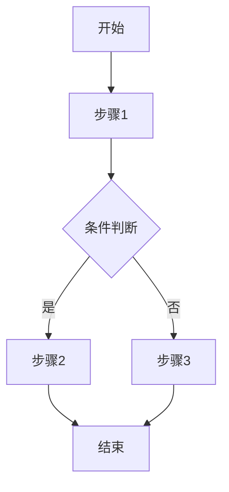

# 需求规约编写指南

本技能指导如何按照标准格式编写软件需求规约（SRS）文档。

## 文档结构

一份完整的需求规约文档应包含以下章节：

### 1. 修订历史记录

记录文档的变更历史，包含：日期、版本、说明、作者。

### 2. 简介

#### 2.1 目的
简要说明此 SRS 适用的软件应用程序、特性或其他子应用分组、与其相关的用例模型。

#### 2.2 定义、首字母缩写词和缩略语
提供正确理解此 SRS 所需的全部术语的定义。

#### 2.3 参考资料
列出 SRS 中引用的其他文档，包括标题、报告号、日期和出版单位。

#### 2.4 概述
说明 SRS 中其他部分的内容和组织方式。

### 3. 整体说明

说明影响产品及其需求的一般因素，包括：
- 产品总体效果
- 产品功能概述
- 用户特征
- 约束条件
- 假设与依赖关系
- 需求子集
- **流程图**（推荐）

#### 3.1 流程图

流程图帮助读者快速理解系统的业务流程和状态流转，是需求规约的重要组成部分。

**业务流程图**：
- 使用 Mermaid 语法绘制
- 展示核心业务流程的完整路径
- 包含决策节点和分支
- 标注各角色的参与点

**状态流转图**：
- 可使用 Mermaid 状态图或表格形式
- 列出所有可能的业务状态
- 说明状态之间的转换条件
- 明确触发动作和后续状态

**示例**：



### 4. 具体需求

这是 SRS 的核心部分，包含所有软件需求。

#### 4.1 功能需求

每个功能需求应使用以下表格格式：

| 字段 | 说明 |
|------|------|
| **需求名称** | 清晰描述该功能的名称 |
| **需求编码** | 唯一标识符，如 REQ-001 |
| **参与者** | 参与此功能交互的角色 |
| **需求背景** | 说明为什么需要此功能 |
| **前置条件** | 执行此功能前必须满足的条件 |
| **后置条件** | 功能执行完成后的系统状态 |
| **主事件流** | 正常情况下的操作步骤 |
| **备选流** | 异常或备选情况的处理流程 |
| **业务规则** | 此功能需要遵循的业务约束 |
| **关键属性** | 辅助属性、输入属性、显示属性 |
| **评级要求** | 功能优先级和重要程度 |
| **AI/智能特征** | 如适用，描述智能化特性 |

**关键属性说明：**
- **辅助属性**：用户完成业务时需要参照的信息，不来自当前需求本身
- **输入属性**：需要被持久化的属性，直接影响模型和表设计
- **显示属性**：查看时需要显示的属性，可能包括外部实体属性

#### 4.2 非功能需求

根据需要包含以下章节：

- **可用性**：培训时间、任务效率、可用性标准
- **可靠性**：可用性百分比、MTBF、MTTR、精确度
- **性能**：响应时间、吞吐量、容量、资源利用
- **可支持性**：编码标准、命名约定、维护要求

#### 4.3 设计约束

列出所有设计约束，包括：
- 软件语言
- 软件流程需求
- 开发工具
- 架构约束
- 购买的构件

#### 4.4 接口需求

- **用户界面**：软件将实现的界面描述
- **硬件接口**：支持的硬件接口
- **软件接口**：与其他系统的软件接口
- **通信接口**：网络和通信协议

#### 4.5 其他需求

- 许可需求
- 法律、版权及其他声明
- 适用的标准

## 核心概念详解

### 主事件流与备选流

**主事件流（Main Flow / Happy Path）**：
- 描述用户完成某项功能时**最常见、最顺利**的操作路径
- 是"一切正常"时的标准流程
- 通常是一条直线式的步骤序列

**备选流（Alternative Flow）**：
- 描述主事件流中可能出现的**分支、异常或特殊情况**
- 包括：错误处理、边界条件、取消操作、权限不足等场景
- 每个备选流应说明触发条件和处理方式

**编写技巧**：
- 使用编号列表清晰展示步骤顺序
- 主事件流步骤使用 "1. 2. 3..." 编号
- 备选流注明从主事件流哪个步骤分支，如 "A1. 在步骤2时，如果余额不足..."
- 使用表格形式可以让两者关系更清晰

### 业务规则的分类

业务规则通常分为以下几类：
1. **约束规则**：限制某些操作的规则（如：只能在工作日提交）
2. **计算规则**：涉及数值计算的规则（如：折扣计算公式）
3. **验证规则**：数据有效性检查（如：手机号格式验证）
4. **权限规则**：访问控制相关（如：只有管理员可以删除）
5. **流程规则**：工作流程约束（如：审批必须按层级进行）

### AI/智能特征说明

如果功能涉及智能化特性，应说明：
- 使用的 AI 技术类型（机器学习、NLP、OCR 等）
- 模型训练数据来源（如适用）
- 预期的智能行为和准确率要求
- 人工干预的触发条件

## 功能需求示例

以下是一个完整的功能需求示例：

| 字段 | 内容 |
|------|------|
| **需求名称** | 用户登录 |
| **需求编码** | REQ-AUTH-001 |
| **参与者** | 注册用户、系统 |
| **需求背景** | 用户需要通过身份验证才能访问系统的受保护资源，确保系统安全性和用户数据的私密性 |
| **前置条件** | 1. 用户已完成注册<br>2. 用户账号处于激活状态<br>3. 系统登录服务可用 |
| **后置条件** | 1. 系统创建用户会话<br>2. 记录登录日志<br>3. 用户获得访问令牌 |
| **主事件流** | 1. 用户打开登录页面<br>2. 系统显示登录表单<br>3. 用户输入用户名和密码<br>4. 用户点击"登录"按钮<br>5. 系统验证用户名和密码<br>6. 系统创建用户会话<br>7. 系统记录登录日志（时间、IP、设备）<br>8. 系统跳转至首页 |
| **备选流** | **A1. 用户名不存在**（步骤5触发）<br>- 系统提示"用户名或密码错误"<br>- 返回步骤3<br><br>**A2. 密码错误**（步骤5触发）<br>- 系统提示"用户名或密码错误"<br>- 错误次数加1<br>- 如果连续错误5次，触发A3<br>- 返回步骤3<br><br>**A3. 账号锁定**（步骤5触发）<br>- 系统提示"账号已锁定，请30分钟后再试"<br>- 发送安全提醒邮件给用户<br>- 流程结束<br><br>**A4. 账号未激活**（步骤5触发）<br>- 系统提示"账号未激活，请查收激活邮件"<br>- 提供重新发送激活邮件选项<br>- 流程结束 |
| **业务规则** | BR-001: 密码必须使用 bcrypt 加密存储<br>BR-002: 连续登录失败5次后锁定账号30分钟<br>BR-003: 会话有效期24小时，可配置延长<br>BR-004: 同一账号同时只允许一个设备登录 |
| **关键属性** | **辅助属性**：登录背景图、系统公告<br>**输入属性**：用户名、密码、记住我、设备信息<br>**显示属性**：用户昵称、头像、上次登录时间 |
| **评级要求** | 优先级：P0（最高）<br>重要程度：核心功能，系统必须支持 |
| **AI/智能特征** | 不适用 |

## 编写原则

1. **清晰性**：每个需求应该清晰、无歧义
2. **完整性**：覆盖所有必要的功能和非功能需求
3. **一致性**：需求之间不应相互矛盾
4. **可验证性**：每个需求都应该是可测试的
5. **可追溯性**：需求应该有唯一标识，便于追踪

## 编写流程

当用户请求编写需求规约时，按以下步骤进行：

1. **收集信息**
   - 了解项目背景和目标
   - 识别用户角色和参与者
   - 收集业务场景和用例

2. **分析需求**
   - 识别功能需求
   - 识别非功能需求
   - 确定业务规则和约束

3. **编写文档**
   - 按照文档结构填写各章节
   - 使用标准表格格式记录功能需求
   - 确保每个需求都有唯一编码

4. **审查完善**
   - 检查需求的一致性
   - 验证需求的完整性
   - 确保需求的可验证性

## 快速开始

如果需要快速生成 SRS 文档框架，可以使用模板脚本：

```
scripts/generate_template.py --output <输出路径> --project <项目名称>
```

## 注意事项

- 对于复杂的系统，可以按模块或子应用分别编写需求规约
- 功能需求应该足够详细，使设计人员能够设计系统
- 测试人员应该能够根据需求编写测试用例
- 需求应该避免包含设计细节
