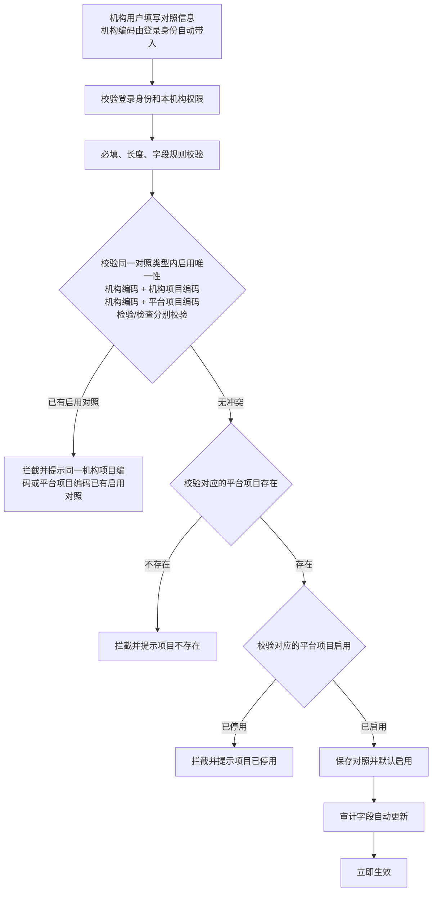
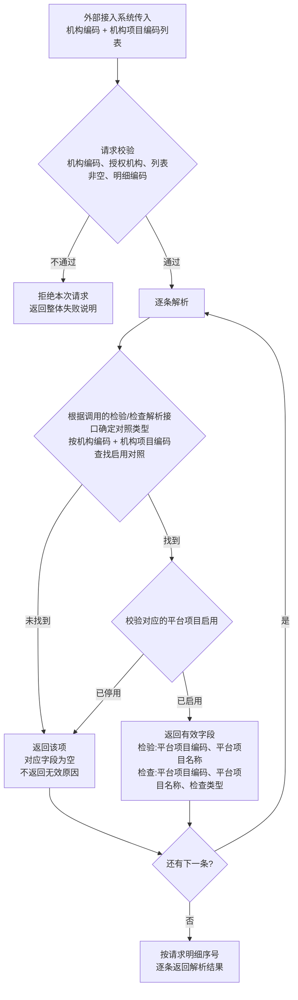

# 需求规约 - 项目对照管理系统

> 版本：第一版初稿
>
> 状态：待评审
>
> 日期：2026-06-04

---

## 简介

### 目的

本文档是项目对照管理系统的软件需求规约（SRS），用于：

* 说明项目对照管理系统的建设背景、业务目标和当前版本范围。
* 明确平台标准检验项目目录、平台标准检查项目目录、机构项目对照、对照解析、对照查询和对照维护能力的边界。
* 帮助业务方、实施方、开发团队、测试团队和外部接入系统厂商理解项目整体定位。
* 作为业务方、实施方、开发团队、测试团队和外部接入系统厂商确认需求范围的正式文档。

### 项目背景

#### 为什么要做

在检验中心和影像诊断中心业务中，不同医疗机构通常使用各自的本地项目编码和项目名称。外部接入系统在创建检验或检查申请时，传入的是机构本地项目编码；平台需要将机构本地项目编码转换为统一的平台标准项目编码，供检验或检查申请创建时识别项目。

当前业务中主要存在以下问题：

* **机构项目编码不统一**：不同机构的项目编码、名称和维护习惯不同，平台无法直接以机构本地编码作为统一业务标准。
* **平台标准项目缺少统一维护入口**：检验项目和检查项目需要分别形成平台标准目录；检验项目需要明确编码、名称、启停用等维护规则，检查项目还需要明确检查类型。
* **对照关系有效性需要清晰判断**：机构项目对照不仅要判断对照自身是否启用，还要判断关联的平台项目是否启用。
* **平台功能和对外接口边界需要明确**：标准项目目录维护只通过平台功能提供，对照解析和部分对照维护能力通过对外接口提供。
* **批量维护失败规则需要统一**：外部接入系统批量新增、停用对照时，需要明确请求级失败、明细级失败和整批不生效规则。

#### 目标

建设项目对照管理系统，统一管理平台标准项目目录和机构项目对照关系，支撑外部接入系统在创建检验、检查申请前完成机构项目编码到平台项目编码的转换。

| 场景 | 适用情况 | 解决的问题 |
| --- | --- | --- |
| 平台标准项目维护 | 平台运营人员维护统一的检验项目和检查项目目录 | 建立平台统一项目编码和项目名称 |
| 机构项目对照维护 | 平台运营人员或机构用户维护本机构项目与平台项目的对应关系 | 建立机构本地项目编码到平台项目编码的映射 |
| 对照解析 | 外部接入系统传入机构编码和机构项目编码 | 返回可用于申请创建的平台项目编码 |
| 启用项目查询 | 外部接入系统需要获取平台启用项目清单 | 支持外部系统进行项目选择、核对或本地同步 |
| 当前有效对照查询 | 外部接入系统需要获取授权机构下的当前有效对照 | 支持外部系统核对本机构项目对照情况 |

最终目标：

* 建立检验项目和检查项目的统一平台标准目录。
* 建立机构项目编码与平台项目编码之间的有效对照关系。
* 支持外部接入系统按机构项目编码批量解析平台项目编码。
* 通过启用、停用、唯一性和权限规则，避免有效对照冲突和跨机构越权访问。
* 明确平台功能、对外接口和当前版本不支持范围，减少实施和对接歧义。

### 范围与边界

#### 做什么

| 模块 | 说明 |
| --- | --- |
| 平台标准检验项目目录 | 维护平台统一的检验项目，检验项目为扁平项目，不区分组合项目和明细项目 |
| 机构检验项目对照 | 维护机构检验项目编码与平台标准检验项目编码的对照关系 |
| 检验项目对照解析 | 支持外部接入系统批量将机构检验项目编码解析为平台检验项目编码 |
| 检验项目查询 | 支持外部接入系统一次性查询启用状态的检验项目列表 |
| 机构检验项目对照查询与维护 | 支持查询当前有效检验对照，并支持通过接口新增、修改、停用检验对照 |
| 平台标准检查项目目录 | 维护平台统一的检查项目，当前检查类型支持 DR / CT / MR |
| 机构检查项目对照 | 维护机构检查项目编码与平台标准检查项目编码的对照关系 |
| 检查项目对照解析 | 支持外部接入系统批量将机构检查项目编码解析为平台检查项目编码 |
| 检查项目查询 | 支持外部接入系统一次性查询启用状态的检查项目列表 |
| 机构检查项目对照查询与维护 | 支持查询当前有效检查对照，并支持通过接口新增、修改、停用检查对照 |

#### 不做什么

| 约束 | 说明 |
| --- | --- |
| 不维护项目简称、拼音码、五笔码和英文名 | 当前版本只维护项目目录和项目对照关系所需的核心属性 |
| 不维护参考价格、样本类型、医学参考范围、危急值阈值、检测方法学、检测设备和试剂规则 | 当前版本只维护项目目录和项目对照关系，不维护检验专业属性 |
| 不维护检查部位和检查方法 | 当前检查项目仅维护平台项目编码、平台项目名称、检查类型、是否启用和备注 |
| 不支持其他检查类型 | 当前版本不包含 US、MG、RF、XA、NM、PT 等检查类型 |
| 不维护项目与患者年龄、性别等医学规则 | 当前版本不按患者条件判断项目是否可用 |
| 不区分组合项目和明细项目 | 平台标准检验项目和平台标准检查项目均为扁平项目 |
| 不维护组合明细关系 | 当前版本不包含组合项目和明细项目关系 |
| 不提供标准项目目录对外维护接口 | 标准项目目录新增、修改、启用、停用仅由平台运营人员通过平台功能操作 |
| 不提供对照批量修改 | 对外接口修改对照仅支持单条操作 |
| 不提供对照批量启用 | 启用对照仅通过平台功能单个操作 |
| 不提供对外启用对照接口 | 对外接口只支持新增、修改、停用对照 |
| 不提供查询停用对照的对外接口 | 对外对照查询接口只返回当前有效对照 |
| 不提供文件导入和文件导出 | 当前版本不包含导入、导出功能 |
| 不提供对照关系物理删除 | 删除需求通过停用实现 |
| 不维护申请数据 | 对照变更只影响保存后发生的对照解析，不处理变更前已经完成的申请 |
| 不提供按申请反查对照关系的功能 | 当前版本不包含独立的业务运维功能 |
| 不提供字段级变更记录、操作流水或独立变更日志功能 | 当前版本仅展示基础审计字段 |
| 不展开接口对接细节 | 本文档只描述业务能力和业务边界 |

#### 边界条件

| 项目 | 说明 |
| --- | --- |
| 当前有效对照 | 对照自身为启用状态，且关联的平台项目也为启用状态 |
| 对照唯一性 | 同一对照类型、同一机构编码下，同一个机构项目编码最多只能有一条启用对照；同一个平台项目编码最多只能有一条启用对照 |
| 检验和检查分别校验 | 检验对照和检查对照分别校验唯一性，互不冲突 |
| 检查类型 | 当前仅支持 DR / CT / MR；检查类型不参与对照唯一性校验 |
| 平台项目被引用后的修改 | 平台项目一旦被机构项目对照引用，不允许修改平台项目编码、平台项目名称；平台标准检查项目还不允许修改检查类型，仅允许修改备注。引用该平台项目的对照无论启用还是停用，均视为已被引用 |
| 平台项目停用后的编码 | 平台项目停用后，其当前编码不可被新项目复用；停用状态的平台项目不允许修改平台项目编码 |
| 停用对照编辑 | 停用状态的对照不允许编辑 |
| 平台项目停用后的对照 | 对照自身仍可保持启用状态，但不再属于当前有效对照；如需恢复业务使用，应先停用原对照，再新增符合规则的当前有效对照 |
| 对外查询范围 | 外部接入系统只能查询授权机构范围内的数据 |
| 对外查询结果 | 标准项目查询只返回启用项目；对照查询只返回当前有效对照 |
| 对照维护生效时间 | 新增、修改、启用、停用保存后立即生效，不支持预约生效和到期自动失效 |

### 功能入口边界清单

| 业务能力 | 平台功能 | 对外接口 | 当前结论 |
| --- | --- | --- | --- |
| 平台标准检验项目查询 | 提供 | 提供 | 平台功能可查询全部权限内数据；对外接口只查询启用状态的检验项目 |
| 平台标准检验项目新增、修改、启用、停用 | 提供 | 不提供 | 仅平台运营人员可维护 |
| 机构检验项目对照查询 | 提供 | 提供 | 平台功能可查看启用和停用对照；对外接口只返回当前有效对照 |
| 机构检验项目对照新增 | 提供 | 提供 | 平台功能逐条操作；对外接口支持批量新增 |
| 机构检验项目对照修改 | 提供 | 提供 | 平台功能逐条操作；对外接口仅支持单条修改 |
| 机构检验项目对照启用 | 提供 | 不提供 | 仅平台功能单个操作，不提供批量启用 |
| 机构检验项目对照停用 | 提供 | 提供 | 平台功能逐条操作；对外接口支持批量停用 |
| 检验项目对照解析 | 不提供 | 提供 | 外部接入系统批量传入机构检验项目编码，平台逐条返回解析结果 |
| 平台标准检查项目查询 | 提供 | 提供 | 平台功能可查询全部权限内数据；对外接口只查询启用状态的检查项目 |
| 平台标准检查项目新增、修改、启用、停用 | 提供 | 不提供 | 仅平台运营人员可维护 |
| 机构检查项目对照查询 | 提供 | 提供 | 平台功能可查看启用和停用对照；对外接口只返回当前有效对照 |
| 机构检查项目对照新增 | 提供 | 提供 | 平台功能逐条操作；对外接口支持批量新增 |
| 机构检查项目对照修改 | 提供 | 提供 | 平台功能逐条操作；对外接口仅支持单条修改 |
| 机构检查项目对照启用 | 提供 | 不提供 | 仅平台功能单个操作，不提供批量启用 |
| 机构检查项目对照停用 | 提供 | 提供 | 平台功能逐条操作；对外接口支持批量停用 |
| 检查项目对照解析 | 不提供 | 提供 | 外部接入系统批量传入机构检查项目编码，平台逐条返回解析结果 |
| 文件导入、文件导出 | 不提供 | 不提供 | 当前版本不支持 |

### 业务场景

#### 场景一：平台运营人员维护平台标准项目

**典型流程：**

平台运营人员进入平台标准项目目录 -> 新增检验项目时填写平台项目编码、平台项目名称和备注；新增检查项目时额外填写检查类型 -> 保存后立即启用 -> 外部接入系统可通过项目查询接口获取启用项目。

**适用情况：**

* 平台需要新增统一标准项目，或在未被对照引用前修改平台项目编码、平台项目名称和检查类型。
* 平台标准项目被对照引用后，平台运营人员仍可按规则停用项目或修改备注。

#### 场景二：平台运营人员或机构用户维护机构项目对照

**典型流程：**

平台运营人员或机构用户进入机构项目对照功能 -> 平台运营人员选择或填写机构编码，机构用户的机构编码由登录身份自动带入 -> 填写机构项目编码、机构项目名称和平台项目编码 -> 系统校验权限、平台项目是否存在且启用、启用唯一性 -> 保存对照并立即生效。

**适用情况：**

* 机构需要将本地项目编码对照到平台标准项目编码。
* 平台运营人员可维护权限范围内的机构对照，机构用户只维护本机构权限范围内的对照关系。
* 平台需要保证同一机构下有效对照不冲突。

#### 场景三：外部接入系统解析机构项目编码

**典型流程：**

外部接入系统传入机构编码和机构项目编码列表 -> 平台校验授权机构范围和请求明细 -> 按机构编码和机构项目编码逐条查找启用对照 -> 找到启用对照且关联平台项目启用时返回平台项目编码、平台项目名称；检查项目额外返回检查类型 -> 无启用对照或对应平台项目停用时，仍按请求明细返回，但平台项目编码、平台项目名称为空；检查项目的检查类型也为空，当前版本不返回无效原因。

**适用情况：**

* 外部接入系统创建检验或检查申请前，需要把机构本地项目编码转换为平台项目编码。
* 一次申请中可能包含多个机构项目编码，需要一次请求批量解析并逐条返回结果。

#### 场景四：外部接入系统查询当前有效对照

**典型流程：**

外部接入系统传入授权机构编码和筛选条件 -> 平台校验机构授权 -> 返回该机构下当前有效的项目对照列表 -> 外部接入系统用于核对或同步本地对照数据。

**适用情况：**

* 外部接入系统需要查询本机构当前可用的项目对照。
* 外部接入系统只需要当前有效对照，不需要停用记录。

#### 场景五：平台项目停用后维护对照

**典型流程：**

平台运营人员停用平台项目 -> 关联该平台项目的启用对照不再属于当前有效对照 -> 对外对照查询不返回该对照 -> 对照解析仍按请求明细返回，但平台项目编码、平台项目名称为空；检查项目的检查类型也为空 -> 维护人员停用原对照 -> 新增机构项目到新平台项目的有效对照。

**适用情况：**

* 平台项目不再作为有效标准项目使用。
* 机构项目需要切换到新的平台项目。
* 平台需要保留原对照记录，但不允许解析出有效平台项目。

#### 场景六：外部接入系统维护对照

**典型流程：**

外部接入系统提交维护请求 -> 请求明确操作类型为新增、修改或停用 -> 新增和停用可提交多条明细，修改仅支持单条 -> 平台校验请求级规则 -> 平台校验单条明细、已有对照和本批明细间的唯一性冲突 -> 任一明细失败时整批不生效并返回失败明细 -> 全部通过时保存并立即生效。

**适用情况：**

* 实施上线或机构项目调整时，需要一次新增或停用多条对照。
* 机构需要通过对外接口修改一条当前有效对照。
* 调用方需要知道具体哪条明细失败，以及失败原因。

### 定义、首字母缩写词和缩略语

| 术语 | 说明 |
| --- | --- |
| 项目对照管理系统 | 独立负责平台标准项目目录维护和机构项目对照管理的系统 |
| 平台标准检验项目 | 平台统一维护的检验项目，全部为扁平项目 |
| 平台标准检查项目 | 平台统一维护的检查项目，当前仅支持 DR / CT / MR |
| 平台项目 | 平台标准检验项目和平台标准检查项目的统称 |
| 机构项目 | 医疗机构本地系统维护和使用的项目 |
| 机构检验项目 | 医疗机构本地检验项目 |
| 机构检查项目 | 医疗机构本地检查项目 |
| 机构项目对照 | 机构项目编码与平台项目编码之间的映射关系 |
| 机构编码 | 权限系统分配给医疗机构的唯一标识，在对照关系中用于唯一性约束 |
| 对照类型 | 检验项目对照或检查项目对照 |
| 同范围 | 同一对照类型下的同一机构编码；检验项目对照和检查项目对照分别校验，检查类型不参与唯一性校验 |
| 当前有效对照 | 对照自身为启用状态，且关联的平台项目也为启用状态的机构项目对照 |
| 平台项目已停用 | 机构项目对照关联的平台项目当前为停用状态；用于平台功能列表、详情展示和筛选，不改变对照自身启用状态；对外对照查询接口和对照解析接口不返回该状态 |
| 对照解析 | 将机构项目编码转换为平台项目编码的接口能力 |
| 平台功能 | 平台内提供给平台运营人员和机构用户使用的功能，不包含对外接口 |
| 对外接口 | 提供给外部接入系统调用的接口 |
| 外部接入系统 | 调用平台对外接口的第三方系统，如 HIS、LIS、RIS、PACS 等 |
| 平台运营人员 | 平台运营方的管理员用户，负责标准项目目录和对照关系维护 |
| 机构用户 | 经权限系统授权的平台机构用户，可在本机构权限范围内查看和维护本机构对照关系 |
| 机构自助维护 | 机构用户通过平台功能，在本机构权限范围内逐条维护本机构对照关系；机构编码由登录身份自动带入 |
| 授权机构范围 | 外部接入系统可访问的机构编码范围 |
| 申请 | 外部接入系统向平台提交的检验或检查业务请求；外部接入系统提交业务请求时调用对照解析接口完成项目编码转换；申请数据的存储和管理不在本项目范围内 |
| 检查类型 | 平台标准检查项目的分类，当前支持 DR、CT、MR |
| 启用 | 平台项目或机构项目对照自身处于启用状态；是否可参与对照解析，还需结合关联平台项目是否启用判断 |
| 停用 | 数据保留但不再作为有效业务数据使用 |
| 批量维护操作 | 对外接口支持的对照批量新增、批量停用操作；修改仅支持单条，不属于批量修改 |
| 批量解析 | 一次请求传入多条机构项目编码，并按明细逐条返回解析结果 |
| 请求级校验失败 | 请求整体无法进入逐条业务校验，整批拒绝并返回整体失败说明 |
| 明细级业务校验失败 | 请求可逐条读取，但存在明细不满足业务规则；整批不生效并返回失败明细 |
| 扁平项目 | 不包含子项目的单层级项目结构 |

### 文档结构

本文档包含以下章节：

* 简介：介绍文档目的、项目背景、范围边界、业务场景和术语。
* 整体说明：描述产品总体效果和产品功能概览。

---

## 整体说明

### 产品总体效果

项目对照管理系统建成后，平台应形成统一的标准检验项目目录和标准检查项目目录，并支持各机构维护本机构项目编码与平台项目编码之间的有效对照关系。

外部接入系统在创建检验或检查申请前，可以通过对照解析接口将机构项目编码转换为平台项目编码；也可以通过查询接口获取启用状态的平台项目列表和授权机构下的当前有效对照列表。

系统通过权限范围、启停用规则和启用唯一性规则，保证外部接入系统只能访问授权机构数据，保证同一机构下当前有效对照不冲突，并保证平台项目停用后不再作为当前有效对照参与查询和解析。

### 产品功能概览

| 功能 | 说明 |
| --- | --- |
| 平台标准检验项目目录管理 | 平台运营人员维护检验项目编码、检验项目名称、是否启用和备注 |
| 机构检验项目对照管理 | 平台运营人员或机构用户维护机构检验项目编码与平台检验项目编码的对照关系 |
| 检验项目对照解析 | 外部接入系统批量解析机构检验项目编码，获取平台检验项目编码和平台项目名称 |
| 检验项目查询 | 外部接入系统一次性查询启用状态的平台标准检验项目，并支持按项目编码、项目名称筛选 |
| 机构检验项目对照查询与维护 | 外部接入系统查询当前有效检验对照，支持按机构项目和平台项目筛选，并可批量新增、单条修改、批量停用检验对照 |
| 平台标准检查项目目录管理 | 平台运营人员维护检查项目编码、检查项目名称、检查类型、是否启用和备注 |
| 机构检查项目对照管理 | 平台运营人员或机构用户维护机构检查项目编码与平台检查项目编码的对照关系 |
| 检查项目对照解析 | 外部接入系统批量解析机构检查项目编码，获取平台检查项目编码、平台项目名称和检查类型 |
| 检查项目查询 | 外部接入系统一次性查询启用状态的平台标准检查项目，并支持按检查类型、项目编码、项目名称筛选 |
| 机构检查项目对照查询与维护 | 外部接入系统查询当前有效检查对照，支持按机构项目、平台项目和检查类型筛选，并可批量新增、单条修改、批量停用检查对照 |

---

## 1. 简介

### 1.1 概述

项目对照管理系统独立承载平台标准项目目录维护和机构项目对照管理能力。

系统包含两条业务线：

1. **检验项目维护与对照**：平台标准检验项目目录、机构检验项目对照、检验项目对照解析。
2. **检查项目维护与对照**：平台标准检查项目目录、机构检查项目对照、检查项目对照解析。

平台标准检验项目和平台标准检查项目均为扁平项目，不区分组合项目和明细项目。平台标准检查项目当前版本仅支持 DR / CT / MR 三种检查类型。

### 1.2 术语说明

| 术语 | 定义 |
| --- | --- |
| 项目对照管理系统 | 从检验中心和影像诊断中心中抽出的独立系统，负责平台标准项目目录维护和机构项目对照管理 |
| 平台标准检验项目 | 平台统一维护的检验项目，全部为扁平项目 |
| 平台标准检查项目 | 平台统一维护的影像检查项目，当前仅支持 DR / CT / MR，全部为扁平项目 |
| 平台项目 | 平台标准检验项目和平台标准检查项目的统称 |
| 机构项目对照 | 机构本地项目编码与平台项目编码之间的映射关系 |
| 对照解析 | 外部接入系统传入机构编码和机构项目编码，系统返回对应平台项目编码的接口能力 |
| 平台功能 | 平台内提供给平台运营人员和机构用户使用的功能能力，不包含对外接口 |
| 平台运营人员 | 平台运营方管理员，负责项目目录和对照关系维护 |
| 机构用户 | 经权限系统授权的平台机构用户，可在本机构权限范围内查看和维护本机构对照关系 |
| 外部接入系统 | 调用平台对外接口的第三方系统，如发起机构的 HIS/LIS/RIS/PACS 等 |
| 授权机构范围 | 平台为外部接入系统配置的可访问机构编码集合；外部接入系统只能查询和维护该范围内的对照数据 |
| 平台项目已停用 | 机构项目对照关联的平台项目当前为停用状态；用于平台功能列表、详情展示和筛选，不改变对照自身启用状态；对外对照查询接口和对照解析接口不返回该状态 |
| 当前有效对照 | 对照自身为启用状态，且关联的平台项目也为启用状态的对照 |
| 批量维护操作 | 对外接口支持的对照关系批量新增、批量停用操作；同批操作类型必须一致，任一明细级业务校验失败则整批不生效；不包含对照解析，不包含批量修改和批量启用 |
| 批量解析 | 对照解析接口一次请求传入多条机构项目编码，并在一次响应中按入参明细逐条返回解析结果 |
| 机构编码 | 权限系统分配给医疗机构的唯一标识，在对照关系中用于唯一性约束 |
| 对照ID | 系统为每条机构项目对照生成的内部唯一标识，仅供系统内部使用，不作为平台列表或详情展示属性，也不作为对外接口输入或输出属性 |
| 对照类型 | 检验项目对照或检查项目对照 |
| 同范围 | 同一对照类型下的同一机构编码；检验项目对照和检查项目对照分别校验，检查类型不参与唯一性校验 |
| 申请 | 外部接入系统向平台提交的检验或检查业务请求；外部接入系统提交业务请求时调用对照解析接口完成项目编码转换；申请数据的存储和管理不在本项目范围内 |
| 扁平项目 | 不包含子项目的单层级项目结构；项目本身即为最小粒度，不涉及组合或明细展开 |
| 机构自助维护 | 机构用户通过平台功能，在本机构权限范围内逐条维护本机构对照关系；机构编码由登录身份自动带入 |

## 2. 通用规则

### 2.1 权限规则

| 能力 | 平台运营人员 | 机构用户 |
| --- | :---: | :---: |
| 标准项目目录（检验/检查）查看 | 是 | 是 |
| 标准项目目录（检验/检查）新增、修改、启用、停用 | 是 | 否 |
| 本机构对照查看（含启用和停用） | 是 | 是 |
| 其他机构对照查看 | 是 | 否 |
| 机构对照新增、修改、启用、停用 | 是 | 是，仅限本机构 |
| 对照解析接口调用 | 平台功能不提供 | 平台功能不提供 |

具体角色权限点和数据范围由统一权限系统定义。对照解析接口由外部接入系统调用，不属于平台功能角色权限能力。

外部接入系统只能访问其授权机构范围内的对照数据；传入未授权机构编码时，系统拒绝操作。

### 2.2 审计与生效规则

1. 审计字段由系统自动记录和维护，包括创建人、创建时间、最后修改人、最后修改时间。
2. 各模块详情展示基础审计字段。
3. 当前版本不做字段级变更记录、操作流水或独立变更日志功能。
4. 项目目录和对照关系的新增、修改、启用、停用保存后立即生效。
5. 不支持预约生效，不支持到期自动失效。
6. 本系统不维护申请数据。对照关系变更只影响保存后发生的对照解析，不处理变更前已经完成的申请。
7. 对照解析结果为空时，外部接入系统如何处理申请不在本项目范围内。

### 2.3 平台标准项目修改规则

1. 平台项目编码创建后，在未被任何机构项目对照引用前允许修改。
2. 修改后的平台项目编码不可与同一项目目录范围内当前已有项目编码重复。
3. 平台项目一旦被机构项目对照引用，不允许修改平台项目编码、平台项目名称；平台标准检查项目还不允许修改检查类型。引用该平台项目的对照无论启用还是停用，均视为已被引用。
4. 平台项目编码修改保存成功后，原编码不再作为该项目编码保留。当前版本不维护曾用编码记录，也不限制已释放且当前未被占用的编码再次使用。
5. 平台项目停用后，其当前编码不可被新项目复用。
6. 停用状态的平台项目不允许修改平台项目编码。
7. 平台项目被机构项目对照引用后，仅允许修改备注；启用、停用仍按平台项目启停用规则执行。
8. 平台项目被机构项目对照引用后，如需调整平台项目编码或平台项目名称，必须停用原平台项目，新增正确的平台项目，并由维护人员调整相关机构项目对照；平台标准检查项目如需调整检查类型，同样按本规则处理。
9. 编码格式不做统一约束，由用户自行输入。

### 2.4 机构项目对照规则

#### 2.4.1 机构项目名称

1. 机构项目名称维护在机构项目对照关系中。
2. 机构项目名称仅用于对照维护时辅助核对、查询展示，以及上线实施或运维时人工核对。
3. 对照解析只以“机构编码 + 机构项目编码”为准，不以机构项目名称判断。
4. 本系统仅维护机构项目名称，不决定外部接入系统提交业务请求时的项目名称取值。
5. 机构项目名称变化不影响对照关系有效性。
6. 名称不同但编码相同，不视为不同项目。

#### 2.4.2 启用唯一性

1. 同一对照类型、同一机构编码下，同一个机构项目编码最多只能有一条启用状态的对照。
2. 同一对照类型、同一机构编码下，同一个平台项目编码最多只能有一条启用状态的对照。
3. 可以存在多条停用状态的对照记录。
4. 同范围指同一对照类型下的同一机构编码；检验项目对照和检查项目对照分别校验，互不冲突。
5. 检查类型不参与唯一性校验。
6. 新增或启用对照时，如果同范围已有相同机构项目编码的启用对照，或已有相同平台项目编码的启用对照，系统阻止操作。
7. 当前有效对照允许修改机构项目编码、机构项目名称、平台项目编码和备注；不允许修改机构编码、是否启用和审计字段。
8. 修改机构项目编码时，需校验同范围无其他相同机构项目编码的启用对照。
9. 修改平台项目编码时，需校验修改后平台项目编码对应的平台项目存在且启用，并校验同范围无其他相同平台项目编码的启用对照。
10. 停用状态的对照不允许编辑。
11. 对照自身启用但关联平台项目已停用时，该对照不是当前有效对照，也不允许编辑；如需恢复业务使用，应先停用原对照，再新增符合规则的当前有效对照。
12. 对停用状态的对照执行启用操作时，不允许同时修改机构项目编码、机构项目名称、平台项目编码和备注；如原对照不满足启用规则，只能新增新的启用对照。
13. 启用对照时，需校验同范围无相同机构项目编码的启用对照、无相同平台项目编码的启用对照，且对应的平台项目存在并启用。
14. 停用的对照不参与后续对照解析，只用于平台功能中查询停用状态的对照记录。
15. 平台功能可在系统内部使用对照ID定位具体对照记录，并支持逐条启用、停用对照；对照ID不作为列表或详情展示属性，也不作为对外接口的输入或输出属性。
16. 对外接口仅支持新增、修改、停用对照，不支持启用对照。
17. 对外接口修改对照时，按机构编码 + 当前机构项目编码定位当前有效对照；停用对照时，按机构编码 + 机构项目编码定位当前启用对照。

### 2.5 批量维护操作规则

批量维护操作仅限对外接口，平台功能只提供逐条操作。

1. 对外接口的对照新增、停用支持批量；修改仅支持单条操作，不提供批量修改和批量启用。
2. 维护请求需明确操作类型，允许值为新增、修改、停用。
3. 同一批请求内只能包含一种操作类型。
4. 新增、停用操作可提交多条明细；修改操作只能提交一条明细，提交多条修改明细时按请求级校验失败处理。
5. 系统需同时校验已有对照和本次请求内的明细；批量新增按本批全部明细拟保存后的最终结果统一校验启用唯一性；单条修改按修改后的结果校验启用唯一性；最终结果出现同范围机构项目编码或平台项目编码冲突时，整批不生效，并返回失败明细。
6. 请求级校验失败时，整批拒绝并返回整体失败说明，不要求返回请求明细序号。请求级校验失败包括操作类型缺失或非法、明细列表为空、修改操作提交多条明细、调用方无接口权限、请求格式非法或内容不可识别。
7. 明细级业务校验失败时，该批所有操作均不生效，并返回所有失败明细；未返回的明细也不会执行。明细级业务校验失败包括单条明细必填字段缺失、明细中的机构编码未授权、修改时未找到当前有效对照、停用时未找到当前启用对照、同批停用请求内出现重复的机构编码 + 机构项目编码、新增或修改时平台项目不存在、新增或修改时平台项目停用、同范围已有启用对照、本次请求内出现启用唯一性冲突。
8. 失败明细返回请求明细序号、操作类型、该操作请求中的机构编码、机构项目编码（新增或停用时返回）、当前机构项目编码（修改时返回）、修改后机构项目编码（修改时返回）、平台项目编码（新增时返回）、修改后平台项目编码（修改时返回）和失败说明。

### 2.6 对外接口开放范围

| 能力 | 平台功能 | 对外接口 |
| --- | :---: | :---: |
| 检验项目查询 | 是 | 是 |
| 标准检验项目目录维护 | 是 | 否 |
| 标准检查项目查询 | 是 | 是 |
| 标准检查项目目录维护 | 是 | 否 |
| 机构对照查询 | 是 | 是 |
| 机构对照新增、修改、启用、停用 | 是，逐条操作 | 新增、停用支持批量；修改仅支持单条；不支持启用 |
| 对照解析 | 否 | 是 |

标准项目目录的新增、修改、启用、停用仅通过平台功能提供，不开放对外接口。

## 3. 核心流程示例

### 3.1 机构用户自助新增对照流程

说明：机构用户自助新增对照时，机构编码由登录身份自动带入，不可修改，且只能维护本机构对照。

### 3.2 对照解析流程

## 4. 具体需求

### 4.1 检验项目维护与对照

#### REQ-PCM-0001 平台标准检验项目目录查询与维护

| 项目 | 内容 |
| --- | --- |
| 需求名称 | 平台标准检验项目目录查询与维护 |
| 参与者 | 平台运营人员、机构用户 |
| 前置条件 | 已登录；查看需具备标准检验项目目录查看权限；维护需具备标准检验项目目录维护权限 |
| 后置条件 | 检验项目保存后立即生效 |

##### 主事件流

1. 平台运营人员和机构用户可进入平台标准检验项目目录查看项目列表和详情。
2. 平台标准检验项目列表支持按平台项目编码、平台项目名称、是否启用筛选，并支持分页。
3. 平台运营人员新增检验项目时，填写平台项目编码、平台项目名称和备注。
4. 系统校验必填、长度和字段规则，并校验平台项目编码在检验项目范围内不重复；编码唯一校验包含停用项目当前持有编码。
5. 系统保存检验项目，新增项目默认为启用。
6. 平台运营人员修改检验项目时，未被任何机构检验项目对照引用前允许修改平台项目编码、平台项目名称和备注；停用状态下不允许修改平台项目编码；被任何机构检验项目对照引用后仅允许修改备注，如需调整编码或名称，必须停用原平台项目、新增正确的检验项目，并由维护人员调整相关机构项目对照。
7. 启用检验项目时，系统直接启用。
8. 停用检验项目时，如存在启用对照引用该检验项目，平台功能提示停用后相关对照将无法解析出有效平台项目信息；确认后可停用，取消后不变更。

##### 异常流程

1. 平台项目编码重复时，系统提示编码已存在并拒绝保存。
2. 必填字段为空时，系统提示必填并拒绝保存。
3. 被任何机构检验项目对照引用后修改平台项目编码或平台项目名称时，系统拒绝保存。
4. 停用状态下修改平台项目编码时，系统拒绝保存。

##### 关键属性

| 属性 | 是否必填 | 说明 |
| --- | --- | --- |
| 平台项目编码 | 是 | 最多 60 个字符；检验项目范围内唯一；未被机构检验项目对照引用前允许修改；停用后当前编码不可被新项目复用 |
| 平台项目名称 | 是 | 最多 60 个字符；项目的标准展示名称；名称可以重复；被机构检验项目对照引用后不允许修改 |
| 是否启用 | 系统维护 | 启用/停用；新增默认启用；通过启用、停用操作变更 |
| 备注 | 否 | 最多 500 个字符；补充说明；被机构检验项目对照引用后仍允许修改 |

##### 验收标准

1. 平台运营人员可新增、修改、启用、停用平台标准检验项目。
2. 机构用户可查看平台标准检验项目目录，但不可新增、修改、启用、停用。
3. 平台项目编码在平台标准检验项目目录内唯一。
4. 检验项目可直接启用或停用，无组合/明细约束。
5. 检验项目列表支持按平台项目编码、平台项目名称、是否启用筛选，支持分页。
6. 项目详情中可查看基础审计字段。
7. 检验项目未被任何机构检验项目对照引用前允许修改平台项目编码和平台项目名称；被引用后不允许修改平台项目编码和平台项目名称，仅允许修改备注。启用、停用仍按启停用规则执行。
8. 停用状态的检验项目不允许修改平台项目编码，停用项目当前持有的编码不可被新项目复用。
9. 检验项目变更后，本系统不处理变更前已经完成的申请。
10. 停用检验项目时，如存在启用对照引用该检验项目，平台功能应提示停用后相关对照将无法解析出有效平台项目信息；确认后可停用，取消后不变更。
11. 未被对照引用前修改编码释放出的原编码，如当前未被检验项目目录中的其他项目占用，可被再次使用。
12. 检验项目被机构项目对照引用后，如需调整平台项目编码或平台项目名称，必须停用原检验项目，新增正确的检验项目，并由维护人员调整相关机构项目对照。

#### REQ-PCM-0002 机构检验项目对照查询与维护（平台功能）

| 项目 | 内容 |
| --- | --- |
| 需求名称 | 机构检验项目对照查询与维护（平台功能） |
| 参与者 | 平台运营人员、机构用户 |
| 前置条件 | 新增对照或修改平台项目编码时，平台标准检验项目必须存在且启用；既有关联平台项目已停用的对照仍可查看、停用，但不允许直接编辑；如需恢复业务使用，应先停用原对照，再新增符合规则的当前有效对照；机构用户仅能维护本机构对照 |
| 后置条件 | 对照保存后立即生效 |

##### 主事件流

1. 平台运营人员可查看和维护全部机构的检验项目对照。
2. 机构用户可通过平台功能查看本机构检验项目对照，并逐条新增、修改、启用、停用本机构检验项目对照，机构编码由登录身份自动带入且不可修改。
3. 新增对照时，平台运营人员选择或填写机构编码；机构用户的机构编码由登录身份自动带入且不可修改；同时填写机构项目编码、平台项目编码，可填写机构项目名称和备注。
4. 系统校验同一机构编码下无相同机构项目编码的启用对照，且无相同平台项目编码的启用对照。
5. 系统校验平台项目存在且启用。
6. 保存成功后，对照默认为启用并立即生效。
7. 修改对照时，仅当前有效对照可编辑机构项目编码、机构项目名称、平台项目编码和备注。
8. 停用状态的对照不允许编辑。
9. 停用对照时，用户选择一条启用状态的对照并确认停用；系统校验操作权限和对照状态，保存后该对照立即变为停用，不再参与后续对照解析。
10. 启用对照时，系统校验同范围启用唯一性，并校验平台项目存在且启用。
11. 对应的平台检验项目停用后，对照自身仍保持启用状态；平台功能列表和详情仍展示该对照记录中对应的平台项目编码和平台项目名称，同时显示平台项目已停用；该对照不是当前有效对照，不允许直接编辑，但允许执行停用操作。

##### 异常流程

1. 必填字段为空时，系统提示必填并拒绝保存。
2. 机构用户维护非本机构对照时，系统拒绝操作。
3. 新增或启用对照时，如同范围已有相同机构项目编码或相同平台项目编码的启用对照，系统拒绝保存。
4. 新增对照或修改平台项目编码时，如平台项目不存在或已停用，系统拒绝保存。
5. 修改对照时，如未找到当前有效对照，系统拒绝保存。
6. 停用状态的对照、以及对照自身启用但关联平台项目已停用的对照不允许编辑机构项目编码、机构项目名称、平台项目编码和备注；对照自身启用但关联平台项目已停用的对照允许执行停用操作。
7. 启用对照时，如对应平台项目不存在、对应平台项目已停用，或同范围已有相同机构项目编码、相同平台项目编码的启用对照，系统拒绝启用。
8. 停用对照时，如目标对照已停用或用户无权操作该机构对照，系统拒绝停用。

##### 关键属性

| 属性 | 是否必填 | 说明 |
| --- | --- | --- |
| 机构编码 | 是 | 来自权限系统；机构用户操作时由登录身份自动带入 |
| 机构项目编码 | 是 | 最多 60 个字符；机构本地 HIS/LIS 项目编码；对照解析以此为准 |
| 机构项目名称 | 否 | 最多 60 个字符；辅助核对和展示，不参与对照判断 |
| 平台项目编码 | 是 | 对照到的平台标准检验项目编码；修改时需校验修改后平台项目编码对应的平台项目存在且启用 |
| 平台项目名称 | 否 | 由关联的平台标准检验项目带出，仅用于展示和人工核对 |
| 是否启用 | 系统维护 | 启用/停用；新增默认启用；启用、停用通过操作变更，不作为新增或修改输入属性；停用对照不参与解析 |
| 备注 | 否 | 最多 500 个字符；补充说明 |

##### 验收标准

1. 同一机构编码 + 机构项目编码下最多一条启用对照。
2. 同一机构编码 + 平台项目编码下最多一条启用对照。
3. 新增或启用对照时，如同范围已有相同机构项目编码或相同平台项目编码的启用对照，系统拦截。
4. 对照解析只以“机构编码 + 机构项目编码”为准。
5. 平台功能中的对照列表支持按机构编码、机构项目编码、机构项目名称、平台项目编码、是否启用、平台项目已停用筛选，并支持分页。
6. 机构用户默认限定本机构，不得查看或维护其他机构对照。
7. 当前有效对照可编辑机构项目编码、机构项目名称、平台项目编码和备注；停用状态的对照不允许编辑。
8. 对应的平台项目停用后，对照仍保持启用状态；平台功能列表和详情正常展示该对照关联的平台项目编码和平台项目名称，并显示平台项目已停用；对照解析时平台项目编码和平台项目名称为空；该对照允许执行停用操作，不允许修改机构项目编码、机构项目名称、平台项目编码和备注。
9. 平台功能中的对照列表和详情仅展示本规约列明的查询和维护属性，不展示系统内部对照ID；平台功能可在系统内部使用对照ID定位具体对照记录；对外接口不使用系统内部对照ID作为输入或输出属性。
10. 平台运营人员可维护全部机构的检验项目对照；机构用户仅可维护本机构对照。
11. 机构项目名称仅用于辅助核对和展示，不参与对照判断。
12. 对照变更保存后立即生效，仅影响后续对照解析。
13. 对照详情中可查看基础审计字段。
14. 修改当前有效对照时，修改机构项目编码需校验同范围无其他相同机构项目编码的启用对照；修改平台项目编码需校验对应的平台项目存在且启用，并校验同范围无其他相同平台项目编码的启用对照。
15. 修改对照时，不允许修改机构编码、是否启用和审计字段。
16. 平台功能中的对照列表和详情仍展示该对照记录中对应的平台项目编码和平台项目名称，同时显示平台项目已停用，并支持按平台项目已停用筛选；如需恢复业务使用，应先停用原对照，再新增符合规则的当前有效对照。
17. 平台功能中的对照列表和详情展示平台项目编码、平台项目名称，便于维护人员核对映射结果。

#### REQ-PCM-0003 检验项目对照解析接口

| 项目 | 内容 |
| --- | --- |
| 需求名称 | 检验项目对照解析接口 |
| 参与者 | 外部接入系统 |
| 前置条件 | 外部接入系统具备接口调用权限，并传入授权范围内的机构编码 |
| 后置条件 | 系统按入参明细返回检验项目解析结果 |

##### 请求级输入属性

| 属性 | 是否必填 | 说明 |
| --- | --- | --- |
| 机构编码 | 是 | 外部接入系统授权范围内的机构编码 |
| 机构项目编码列表 | 是 | 需要解析的机构项目编码明细，列表不能为空 |

##### 明细级输入属性

| 属性 | 是否必填 | 说明 |
| --- | --- | --- |
| 机构项目编码 | 是 | 每条明细中的机构本地检验项目编码 |

##### 业务输出属性

| 属性 | 是否必返 | 说明 |
| --- | --- | --- |
| 请求明细序号 | 是 | 对应入参明细顺序，从 1 开始，便于调用方匹配请求明细 |
| 机构项目编码 | 是 | 回传入参中的机构项目编码 |
| 平台项目编码 | 否 | 找到启用对照且平台项目启用时返回；无启用对照或平台项目停用时为空 |
| 平台项目名称 | 否 | 找到启用对照且平台项目启用时返回；无启用对照或平台项目停用时为空 |

##### 业务规则

1. 接口一次请求可传入多条机构项目编码，并在一次响应中按请求明细序号逐条返回解析结果。
2. 系统按“机构编码 + 机构项目编码”查找启用对照。
3. 找到启用对照且对应的平台检验项目启用时，返回平台项目编码和平台项目名称。
4. 无启用对照或对应平台项目停用时，返回该项，但平台项目编码和平台项目名称为空。
5. 当前版本不返回无效原因。
6. 单条明细未解析成功不导致整批请求失败；无启用对照或对应平台项目已停用时，系统按明细返回空平台项目信息。
7. 无效解析结果返回后，外部接入系统是否拦截业务请求、提示用户、转人工处理或采用其他补救流程，不在本项目范围内。
8. 机构编码缺失、传入未授权机构编码、机构项目编码列表为空或单条明细机构项目编码为空时，系统拒绝本次请求并返回整体失败说明，不返回逐条解析结果。

##### 验收标准

1. 接口支持一次请求批量传入机构项目编码，并在一次响应中逐条返回解析结果。
2. 每条返回结果包含请求明细序号和机构项目编码，便于调用方与入参明细对应。
3. 找到启用对照且平台项目启用时，返回平台项目编码和平台项目名称。
4. 无启用对照或平台项目已停用时，返回该项但平台项目编码和平台项目名称为空，当前版本不区分无效原因。
5. 逐条返回结果，无启用对照或平台项目已停用导致的单条明细未解析成功，不导致整批请求失败。
6. 批量解析不是对每条明细分别发起接口请求。
7. 调用方传入 1 条也可正常返回。
8. 机构编码缺失、传入未授权机构编码、机构项目编码列表为空或单条明细机构项目编码为空时，接口拒绝本次请求并返回整体失败说明，不返回逐条解析结果。
9. 平台功能不提供对照解析能力。

#### REQ-PCM-0004 检验项目查询接口

| 项目 | 内容 |
| --- | --- |
| 需求名称 | 检验项目查询接口 |
| 参与者 | 外部接入系统 |
| 前置条件 | 外部接入系统具备接口调用权限 |
| 后置条件 | 系统一次性返回符合条件的平台标准检验项目列表 |

##### 业务输入属性

| 属性 | 是否必填 | 说明 |
| --- | --- | --- |
| 平台项目编码关键字 | 否 | 支持按平台项目编码模糊匹配 |
| 平台项目名称关键字 | 否 | 支持按平台项目名称模糊匹配 |

选填筛选属性不传或传空值时，表示不按该属性筛选。

##### 业务输出属性

| 属性 | 是否必返 | 说明 |
| --- | --- | --- |
| 平台项目编码 | 是 | 平台标准检验项目编码 |
| 平台项目名称 | 是 | 平台标准检验项目名称 |
| 备注 | 否 | 项目补充说明，可为空 |
| 最后更新时间 | 是 | 平台标准检验项目最后一次保存修改的时间，仅用于列表展示和人工核对，不作为排序、同步或变更依据；调用方不得据此判断增量变更 |

##### 业务规则与验收标准

1. 接口返回平台标准检验项目列表，全部为扁平项目。
2. 接口不分页，只返回启用状态的检验项目，不提供停用或全部筛选。
3. 支持按平台项目编码关键字、平台项目名称关键字筛选。
4. 查询结果至少包含平台项目编码、平台项目名称、备注和最后更新时间。
5. 筛选无结果时，返回空列表。

#### REQ-PCM-0005 机构检验项目对照查询与维护接口

| 项目 | 内容 |
| --- | --- |
| 需求名称 | 机构检验项目对照查询与维护接口 |
| 参与者 | 外部接入系统 |
| 前置条件 | 外部接入系统具备接口调用权限；查询时传入授权范围内的机构编码；维护时明细中的机构编码需在授权范围内 |
| 后置条件 | 查询时返回当前有效对照；维护成功后立即生效 |

##### 查询输入属性

| 属性 | 是否必填 | 说明 |
| --- | --- | --- |
| 机构编码 | 是 | 查询指定授权机构的当前有效对照；传入未授权机构编码时拒绝；精确匹配 |
| 机构项目编码 | 否 | 按机构项目编码精确匹配 |
| 机构项目名称 | 否 | 按机构项目名称模糊匹配 |
| 平台项目编码 | 否 | 按平台项目编码精确匹配 |

选填筛选属性不传或传空值时，表示不按该属性筛选。

##### 查询输出属性

| 属性 | 是否必返 | 说明 |
| --- | --- | --- |
| 机构编码 | 是 | 对照所属机构编码 |
| 机构项目编码 | 是 | 机构本地检验项目编码 |
| 机构项目名称 | 否 | 机构本地检验项目名称，可为空 |
| 平台项目编码 | 是 | 对照到的平台项目编码 |
| 平台项目名称 | 是 | 对照到的平台标准检验项目名称 |
| 备注 | 否 | 对照补充说明，可为空 |

##### 维护请求级输入属性

| 属性 | 是否必填 | 说明 |
| --- | --- | --- |
| 操作类型 | 是 | 允许值为新增、修改、停用；同一批请求内只能包含一种操作类型 |
| 维护明细列表 | 是 | 按操作类型提交需要维护的对照明细，列表不能为空；新增、停用可提交多条明细，修改只能提交一条明细 |

查询机构编码未授权时，系统拒绝操作；维护请求可逐条读取时，明细中的机构编码未授权按明细级业务校验失败处理，整批不生效并返回失败明细。

##### 维护明细级输入属性

| 操作 | 必填输入属性 | 可选输入属性 | 说明 |
| --- | --- | --- | --- |
| 新增 | 机构编码、机构项目编码、平台项目编码 | 机构项目名称、备注 | 新增后默认为启用；需校验同范围无相同机构项目编码或相同平台项目编码的启用对照，且平台项目存在并启用 |
| 修改 | 机构编码、当前机构项目编码 | 修改后机构项目编码、机构项目名称、修改后平台项目编码、备注 | 修改仅支持单条；按机构编码 + 当前机构项目编码定位当前有效对照；至少传入一个可选输入属性；未传入的可选输入属性保持原值；机构项目名称、备注明确传入空值时表示清空；修改后机构项目编码、修改后平台项目编码不允许传空；传入修改后机构项目编码时，需校验同范围无其他相同机构项目编码的启用对照；传入修改后平台项目编码时，需校验平台项目存在并启用，且同范围无其他相同平台项目编码的启用对照 |
| 停用 | 机构编码、机构项目编码 | 无 | 按机构编码 + 机构项目编码定位当前启用对照 |

维护明细中的机构项目编码、当前机构项目编码、修改后机构项目编码、机构项目名称均最多 60 个字符；平台项目编码和修改后平台项目编码按对应平台标准项目编码规则校验；备注最多 500 个字符。新增时机构项目名称、备注传空按未填写处理；修改时机构项目名称、备注明确传入空值表示清空。

##### 维护失败输出属性

| 场景 | 输出属性 |
| --- | --- |
| 请求级校验失败 | 整体失败说明 |
| 明细级业务校验失败 | 请求明细序号、操作类型、请求中的机构编码、请求中的机构项目编码（新增或停用时返回）、请求中的当前机构项目编码（修改时返回）、请求中的修改后机构项目编码（修改时返回）、请求中的平台项目编码（新增时返回）、请求中的修改后平台项目编码（修改时返回）、失败说明 |

失败说明为可读业务说明，用于描述权限不通过、必填缺失、修改时未找到当前有效对照、停用时未找到当前启用对照、平台项目不存在或停用、同范围已有启用对照等业务失败情况。

##### 业务规则与验收标准

1. 查询接口只返回当前有效机构检验项目对照。
2. 查询接口必须传入机构编码，不分页，一次性返回指定授权机构下符合条件的当前有效对照。
3. 对外接口支持新增、修改、停用对照关系；新增和停用支持批量，修改仅支持单条；不支持启用对照。
4. 对外接口不使用系统内部对照ID作为输入或输出属性。
5. 除本接口另有说明外，新增、修改、停用的业务校验与平台逐条维护一致。
6. 请求级校验失败时整批拒绝并返回整体失败说明，不要求返回请求明细序号。
7. 明细级业务校验失败时，该批所有操作均不生效，并返回所有失败明细；未返回的明细也不会执行。
8. 批量新增按本批全部明细拟保存后的最终结果统一校验启用唯一性；单条修改按修改后的结果校验启用唯一性；最终结果出现同范围机构项目编码或平台项目编码冲突时，整批不生效并返回失败明细。
9. 维护成功后立即生效。
10. 不支持通过接口删除对照，删除需求通过停用实现。

### 4.2 检查项目维护与对照

#### REQ-PCM-0006 平台标准检查项目目录查询与维护

| 项目 | 内容 |
| --- | --- |
| 需求名称 | 平台标准检查项目目录查询与维护 |
| 参与者 | 平台运营人员、机构用户 |
| 前置条件 | 已登录；查看需具备标准检查项目目录查看权限；维护需具备标准检查项目目录维护权限 |
| 后置条件 | 检查项目保存后立即生效 |

##### 主事件流

1. 平台运营人员和机构用户可进入平台标准检查项目目录查看项目列表和详情。
2. 平台标准检查项目列表支持按平台项目编码、平台项目名称、检查类型、是否启用筛选，并支持分页。
3. 平台运营人员新增检查项目时，填写平台项目编码、平台项目名称、检查类型和备注。
4. 系统校验必填、长度和字段规则，并校验平台项目编码在检查项目范围内不重复；编码唯一校验包含停用项目当前持有编码。
5. 系统校验检查类型属于 DR / CT / MR。
6. 系统保存检查项目，新增项目默认为启用。
7. 平台运营人员修改检查项目时，未被任何机构检查项目对照引用前允许修改平台项目编码、平台项目名称、检查类型和备注；停用状态下不允许修改平台项目编码；被任何机构检查项目对照引用后仅允许修改备注，如需调整编码、名称或检查类型，必须停用原平台项目、新增正确的检查项目，并由维护人员调整相关机构项目对照。
8. 启用检查项目时，系统直接启用。
9. 停用检查项目时，如存在启用对照引用该检查项目，平台功能提示停用后相关对照将无法解析出有效平台项目信息；确认后可停用，取消后不变更。

##### 异常流程

1. 平台项目编码重复时，系统提示编码已存在并拒绝保存。
2. 必填字段为空时，系统提示必填并拒绝保存。
3. 检查类型不属于 DR / CT / MR 时，系统提示检查类型不支持并拒绝保存。
4. 被任何机构检查项目对照引用后修改平台项目编码、平台项目名称或检查类型时，系统拒绝保存。
5. 停用状态下修改平台项目编码时，系统拒绝保存。

##### 关键属性

| 属性 | 是否必填 | 说明 |
| --- | --- | --- |
| 平台项目编码 | 是 | 最多 60 个字符；检查项目范围内唯一；未被机构检查项目对照引用前允许修改；停用后当前编码不可被新项目复用 |
| 平台项目名称 | 是 | 最多 60 个字符；项目的标准展示名称；名称可以重复；被机构检查项目对照引用后不允许修改 |
| 检查类型 | 是 | 当前可选值为 DR、CT、MR；被机构检查项目对照引用后不允许修改 |
| 是否启用 | 系统维护 | 启用/停用；新增默认启用；通过启用、停用操作变更 |
| 备注 | 否 | 最多 500 个字符；补充说明；被机构检查项目对照引用后仍允许修改 |

##### 验收标准

1. 平台运营人员可新增、修改、启用、停用平台标准检查项目。
2. 机构用户可查看平台标准检查项目目录，但不可新增、修改、启用、停用。
3. 平台项目编码在平台标准检查项目目录内唯一。
4. 检查类型必填，当前可选范围为 DR / CT / MR。
5. 检查项目列表支持按平台项目编码、平台项目名称、检查类型、是否启用筛选，支持分页。
6. 项目详情中可查看基础审计字段。
7. 检查项目未被任何机构检查项目对照引用前允许修改平台项目编码、平台项目名称和检查类型；被引用后不允许修改平台项目编码、平台项目名称和检查类型，仅允许修改备注。启用、停用仍按启停用规则执行。
8. 停用状态的检查项目不允许修改平台项目编码，停用项目当前持有的编码不可被新项目复用。
9. 检查项目可直接启用或停用，无组合/明细约束。
10. 检查项目变更后，本系统不处理变更前已经完成的申请。
11. 停用检查项目时，如存在启用对照引用该检查项目，平台功能应提示停用后相关对照将无法解析出有效平台项目信息；确认后可停用，取消后不变更。
12. 未被对照引用前修改编码释放出的原编码，如当前未被检查项目目录中的其他项目占用，可被再次使用。
13. 检查项目被机构项目对照引用后，如需调整平台项目编码、平台项目名称或检查类型，必须停用原检查项目，新增正确的检查项目，并由维护人员调整相关机构项目对照。

#### REQ-PCM-0007 机构检查项目对照查询与维护（平台功能）

| 项目 | 内容 |
| --- | --- |
| 需求名称 | 机构检查项目对照查询与维护（平台功能） |
| 参与者 | 平台运营人员、机构用户 |
| 前置条件 | 新增对照或修改平台项目编码时，平台标准检查项目必须存在且启用；既有关联平台项目已停用的对照仍可查看、停用，但不允许直接编辑；如需恢复业务使用，应先停用原对照，再新增符合规则的当前有效对照；机构用户仅能维护本机构对照 |
| 后置条件 | 对照保存后立即生效 |

##### 主事件流

1. 平台运营人员可查看和维护全部机构的检查项目对照。
2. 机构用户可通过平台功能查看本机构检查项目对照，并逐条新增、修改、启用、停用本机构检查项目对照，机构编码由登录身份自动带入且不可修改。
3. 新增对照时，平台运营人员选择或填写机构编码；机构用户的机构编码由登录身份自动带入且不可修改；同时填写机构项目编码、平台项目编码，可填写机构项目名称和备注。
4. 系统校验同一机构编码下无相同机构项目编码的启用对照，且无相同平台项目编码的启用对照。
5. 系统校验平台项目存在且启用。
6. 保存成功后，对照默认为启用并立即生效。
7. 修改对照时，仅当前有效对照可编辑机构项目编码、机构项目名称、平台项目编码和备注。
8. 停用状态的对照不允许编辑。
9. 停用对照时，用户选择一条启用状态的对照并确认停用；系统校验操作权限和对照状态，保存后该对照立即变为停用，不再参与后续对照解析。
10. 启用对照时，系统校验同范围启用唯一性，并校验平台项目存在且启用。
11. 对应的平台检查项目停用后，对照自身仍保持启用状态；平台功能列表和详情仍展示该对照记录中对应的平台项目编码、平台项目名称和检查类型，同时显示平台项目已停用；该对照不是当前有效对照，不允许直接编辑，但允许执行停用操作。

##### 异常流程

1. 必填字段为空时，系统提示必填并拒绝保存。
2. 机构用户维护非本机构对照时，系统拒绝操作。
3. 新增或启用对照时，如同范围已有相同机构项目编码或相同平台项目编码的启用对照，系统拒绝保存。
4. 新增对照或修改平台项目编码时，如平台项目不存在或已停用，系统拒绝保存。
5. 修改对照时，如未找到当前有效对照，系统拒绝保存。
6. 停用状态的对照、以及对照自身启用但关联平台项目已停用的对照不允许编辑机构项目编码、机构项目名称、平台项目编码和备注；对照自身启用但关联平台项目已停用的对照允许执行停用操作。
7. 启用对照时，如对应平台项目不存在、对应平台项目已停用，或同范围已有相同机构项目编码、相同平台项目编码的启用对照，系统拒绝启用。
8. 停用对照时，如目标对照已停用或用户无权操作该机构对照，系统拒绝停用。

##### 关键属性

| 属性 | 是否必填 | 说明 |
| --- | --- | --- |
| 机构编码 | 是 | 来自权限系统；机构用户操作时由登录身份自动带入 |
| 机构项目编码 | 是 | 最多 60 个字符；机构本地 HIS/RIS/PACS 检查项目编码；对照解析以此为准 |
| 机构项目名称 | 否 | 最多 60 个字符；辅助核对和展示，不参与对照判断 |
| 平台项目编码 | 是 | 对照到的平台标准检查项目编码；修改时需校验修改后平台项目编码对应的平台项目存在且启用 |
| 平台项目名称 | 否 | 由关联的平台标准检查项目带出，仅用于展示和人工核对 |
| 检查类型 | 否 | 由关联的平台标准检查项目带出，仅用于展示和人工核对 |
| 是否启用 | 系统维护 | 启用/停用；新增默认启用；启用、停用通过操作变更，不作为新增或修改输入属性；停用对照不参与解析 |
| 备注 | 否 | 最多 500 个字符；补充说明 |

##### 业务规则与验收标准

1. 机构检查项目对照只按机构编码 + 机构项目编码维护，不按检查用途或业务入口拆分。
2. 同一机构编码的同一机构项目编码，当前有效对照只能指向一个平台标准检查项目。
3. 同一机构编码 + 机构项目编码下最多一条启用对照。
4. 同一机构编码 + 平台项目编码下最多一条启用对照。
5. 新增或启用对照时，如同范围已有相同机构项目编码或相同平台项目编码的启用对照，系统拦截。
6. 平台功能中的对照列表支持按机构编码、机构项目编码、机构项目名称、平台项目编码、检查类型、是否启用、平台项目已停用筛选，并支持分页。
7. 机构用户默认限定本机构，不得查看或维护其他机构对照。
8. 当前有效对照可编辑机构项目编码、机构项目名称、平台项目编码和备注；停用状态的对照不允许编辑。
9. 对应的平台项目停用后，对照仍保持启用状态；平台功能列表和详情正常展示该对照关联的平台项目编码、平台项目名称和检查类型，并显示平台项目已停用；对照解析时平台项目编码、平台项目名称和检查类型为空；该对照允许执行停用操作，不允许修改机构项目编码、机构项目名称、平台项目编码和备注。
10. 平台功能中的对照列表和详情仅展示本规约列明的查询和维护属性，不展示系统内部对照ID；平台功能可在系统内部使用对照ID定位具体对照记录；对外接口不使用系统内部对照ID作为输入或输出属性。
11. 平台运营人员可维护全部机构的检查项目对照；机构用户仅可维护本机构对照。
12. 机构项目名称仅用于辅助核对和展示，不参与对照判断。
13. 对照变更保存后立即生效，仅影响后续对照解析。
14. 对照详情中可查看基础审计字段。
15. 修改当前有效对照时，修改机构项目编码需校验同范围无其他相同机构项目编码的启用对照；修改平台项目编码需校验对应的平台项目存在且启用，并校验同范围无其他相同平台项目编码的启用对照。
16. 修改对照时，不允许修改机构编码、是否启用和审计字段。
17. 平台功能中的对照列表和详情仍展示该对照记录中对应的平台项目编码、平台项目名称和检查类型，同时显示平台项目已停用，并支持按平台项目已停用筛选；如需恢复业务使用，应先停用原对照，再新增符合规则的当前有效对照。

#### REQ-PCM-0008 检查项目对照解析接口

| 项目 | 内容 |
| --- | --- |
| 需求名称 | 检查项目对照解析接口 |
| 参与者 | 外部接入系统 |
| 前置条件 | 外部接入系统具备接口调用权限，并传入授权范围内的机构编码 |
| 后置条件 | 系统按入参明细返回检查项目解析结果 |

##### 请求级输入属性

| 属性 | 是否必填 | 说明 |
| --- | --- | --- |
| 机构编码 | 是 | 外部接入系统授权范围内的机构编码 |
| 机构项目编码列表 | 是 | 需要解析的机构项目编码明细，列表不能为空 |

##### 明细级输入属性

| 属性 | 是否必填 | 说明 |
| --- | --- | --- |
| 机构项目编码 | 是 | 每条明细中的机构本地检查项目编码 |

##### 业务输出属性

| 属性 | 是否必返 | 说明 |
| --- | --- | --- |
| 请求明细序号 | 是 | 对应入参明细顺序，从 1 开始，便于调用方匹配请求明细 |
| 机构项目编码 | 是 | 回传入参中的机构项目编码 |
| 平台项目编码 | 否 | 找到启用对照且平台项目启用时返回；无启用对照或平台项目停用时为空 |
| 平台项目名称 | 否 | 找到启用对照且平台项目启用时返回；无启用对照或平台项目停用时为空 |
| 检查类型 | 否 | 找到启用对照且平台项目启用时返回；无启用对照或平台项目停用时为空 |

##### 业务规则与验收标准

1. 接口一次请求可传入多条机构项目编码，并在一次响应中按请求明细序号逐条返回解析结果。
2. 系统按“机构编码 + 机构项目编码”查找启用对照。
3. 找到启用对照且对应的平台检查项目启用时，返回平台项目编码、平台项目名称和检查类型。
4. 无启用对照或对应平台项目停用时，返回该项，但平台项目编码、平台项目名称和检查类型为空。
5. 当前版本不返回无效原因。
6. 单条明细未解析成功不导致整批请求失败；无启用对照或对应平台项目已停用时，系统按明细返回空平台项目信息。
7. 无效解析结果返回后，外部接入系统是否拦截业务请求、提示用户、转人工处理或采用其他补救流程，不在本项目范围内。
8. 机构编码缺失、传入未授权机构编码、机构项目编码列表为空或单条明细机构项目编码为空时，系统拒绝本次请求并返回整体失败说明，不返回逐条解析结果。
9. 批量解析不是对每条明细分别发起接口请求；调用方传入 1 条也可正常返回。
10. 平台功能不提供对照解析能力。

#### REQ-PCM-0009 检查项目查询接口

| 项目 | 内容 |
| --- | --- |
| 需求名称 | 检查项目查询接口 |
| 参与者 | 外部接入系统 |
| 前置条件 | 外部接入系统具备接口调用权限 |
| 后置条件 | 系统一次性返回符合条件的平台标准检查项目列表 |

##### 业务输入属性

| 属性 | 是否必填 | 说明 |
| --- | --- | --- |
| 检查类型 | 否 | 可按 DR / CT / MR 精确匹配 |
| 平台项目编码关键字 | 否 | 支持按平台项目编码模糊匹配 |
| 平台项目名称关键字 | 否 | 支持按平台项目名称模糊匹配 |

选填筛选属性不传或传空值时，表示不按该属性筛选。

##### 业务输出属性

| 属性 | 是否必返 | 说明 |
| --- | --- | --- |
| 平台项目编码 | 是 | 平台标准检查项目编码 |
| 平台项目名称 | 是 | 平台标准检查项目名称 |
| 检查类型 | 是 | DR / CT / MR |
| 备注 | 否 | 项目补充说明，可为空 |
| 最后更新时间 | 是 | 平台标准检查项目最后一次保存修改的时间，仅用于列表展示和人工核对，不作为排序、同步或变更依据；调用方不得据此判断增量变更 |

##### 业务规则与验收标准

1. 接口返回平台标准检查项目列表，全部为扁平项目。
2. 接口不分页，只返回启用状态的检查项目，不提供停用或全部筛选。
3. 支持按检查类型、平台项目编码关键字、平台项目名称关键字筛选。
4. 查询结果至少包含平台项目编码、平台项目名称、检查类型、备注和最后更新时间。
5. 筛选无结果时，返回空列表。
6. 检查类型传入值不属于 DR / CT / MR 时，接口拒绝本次查询。

#### REQ-PCM-0010 机构检查项目对照查询与维护接口

| 项目 | 内容 |
| --- | --- |
| 需求名称 | 机构检查项目对照查询与维护接口 |
| 参与者 | 外部接入系统 |
| 前置条件 | 外部接入系统具备接口调用权限；查询时传入授权范围内的机构编码；维护时明细中的机构编码需在授权范围内 |
| 后置条件 | 查询时返回当前有效对照；维护成功后立即生效 |

##### 查询输入属性

| 属性 | 是否必填 | 说明 |
| --- | --- | --- |
| 机构编码 | 是 | 查询指定授权机构的当前有效对照；传入未授权机构编码时拒绝；精确匹配 |
| 机构项目编码 | 否 | 按机构项目编码精确匹配 |
| 机构项目名称 | 否 | 按机构项目名称模糊匹配 |
| 平台项目编码 | 否 | 按平台项目编码精确匹配 |
| 检查类型 | 否 | 按 DR / CT / MR 精确匹配 |

选填筛选属性不传或传空值时，表示不按该属性筛选。

##### 查询输出属性

| 属性 | 是否必返 | 说明 |
| --- | --- | --- |
| 机构编码 | 是 | 对照所属机构编码 |
| 机构项目编码 | 是 | 机构本地检查项目编码 |
| 机构项目名称 | 否 | 机构本地检查项目名称，可为空 |
| 平台项目编码 | 是 | 对照到的平台项目编码 |
| 平台项目名称 | 是 | 对照到的平台标准检查项目名称 |
| 检查类型 | 是 | 对照到的平台标准检查项目的检查类型 |
| 备注 | 否 | 对照补充说明，可为空 |

##### 维护请求级输入属性

| 属性 | 是否必填 | 说明 |
| --- | --- | --- |
| 操作类型 | 是 | 允许值为新增、修改、停用；同一批请求内只能包含一种操作类型 |
| 维护明细列表 | 是 | 按操作类型提交需要维护的对照明细，列表不能为空；新增、停用可提交多条明细，修改只能提交一条明细 |

检查类型不作为维护输入属性，由平台项目编码关联的平台标准检查项目确定。查询机构编码未授权时，系统拒绝操作；维护请求可逐条读取时，明细中的机构编码未授权按明细级业务校验失败处理，整批不生效并返回失败明细。

##### 维护明细级输入属性

| 操作 | 必填输入属性 | 可选输入属性 | 说明 |
| --- | --- | --- | --- |
| 新增 | 机构编码、机构项目编码、平台项目编码 | 机构项目名称、备注 | 新增后默认为启用；需校验同范围无相同机构项目编码或相同平台项目编码的启用对照，且平台项目存在并启用 |
| 修改 | 机构编码、当前机构项目编码 | 修改后机构项目编码、机构项目名称、修改后平台项目编码、备注 | 修改仅支持单条；按机构编码 + 当前机构项目编码定位当前有效对照；至少传入一个可选输入属性；未传入的可选输入属性保持原值；机构项目名称、备注明确传入空值时表示清空；修改后机构项目编码、修改后平台项目编码不允许传空；传入修改后机构项目编码时，需校验同范围无其他相同机构项目编码的启用对照；传入修改后平台项目编码时，需校验平台项目存在并启用，且同范围无其他相同平台项目编码的启用对照 |
| 停用 | 机构编码、机构项目编码 | 无 | 按机构编码 + 机构项目编码定位当前启用对照 |

维护明细中的机构项目编码、当前机构项目编码、修改后机构项目编码、机构项目名称均最多 60 个字符；平台项目编码和修改后平台项目编码按对应平台标准项目编码规则校验；备注最多 500 个字符。新增时机构项目名称、备注传空按未填写处理；修改时机构项目名称、备注明确传入空值表示清空。

##### 维护失败输出属性

| 场景 | 输出属性 |
| --- | --- |
| 请求级校验失败 | 整体失败说明 |
| 明细级业务校验失败 | 请求明细序号、操作类型、请求中的机构编码、请求中的机构项目编码（新增或停用时返回）、请求中的当前机构项目编码（修改时返回）、请求中的修改后机构项目编码（修改时返回）、请求中的平台项目编码（新增时返回）、请求中的修改后平台项目编码（修改时返回）、失败说明 |

失败说明为可读业务说明，用于描述权限不通过、必填缺失、修改时未找到当前有效对照、停用时未找到当前启用对照、平台项目不存在或停用、同范围已有启用对照等业务失败情况。

##### 业务规则与验收标准

1. 查询接口只返回当前有效机构检查项目对照。
2. 查询接口必须传入机构编码，不分页，一次性返回指定授权机构下符合条件的当前有效对照。
3. 检查类型传入值不属于 DR / CT / MR 时，接口拒绝本次查询。
4. 对外接口支持新增、修改、停用对照关系；新增和停用支持批量，修改仅支持单条；不支持启用对照。
5. 对外接口不使用系统内部对照ID作为输入或输出属性。
6. 检查类型不作为维护输入属性。
7. 除本接口另有说明外，新增、修改、停用的业务校验与平台逐条维护一致。
8. 请求级校验失败时整批拒绝并返回整体失败说明，不要求返回请求明细序号。
9. 明细级业务校验失败时，该批所有操作均不生效，并返回所有失败明细；未返回的明细也不会执行。
10. 批量新增按本批全部明细拟保存后的最终结果统一校验启用唯一性；单条修改按修改后的结果校验启用唯一性；最终结果出现同范围机构项目编码或平台项目编码冲突时，整批不生效并返回失败明细。
11. 维护成功后立即生效。
12. 不支持通过接口删除对照，删除需求通过停用实现。

## 5. 当前版本范围边界

1. 不包含导入功能。
2. 不包含文件导出功能；外部接入系统可通过检验项目查询接口和检查项目查询接口一次性获取符合条件的项目列表。
3. 不包含对外接口进行标准项目目录维护。
4. 不包含对照关系物理删除功能，删除需求通过停用实现。
5. 不包含对照关系生效时间和失效时间。
6. 不包含项目简称、拼音码、五笔码、英文名。
7. 不包含参考价格。
8. 不包含检查部位、检查方法。
9. 不包含 US、MG、RF、XA、NM、PT 等检查类型。
10. 不包含样本类型、医学参考范围、危急值阈值、检测方法学、检测设备、试剂等检验专业属性。
11. 不维护项目与患者年龄、性别等医学规则。
12. 不区分组合项目和明细项目。
13. 不维护组合明细关系。
14. 不包含独立的业务运维功能，不提供按申请反查对照关系的功能。
15. 不包含字段级变更记录、操作流水或独立变更日志功能。

以上清单仅用于明确当前版本范围，不表示未来版本承诺。各业务章节中的局部边界说明应与本清单保持一致。

## 6. 平台对外接口汇总

本章汇总项目对照管理系统提供给外部接入系统的对外接口能力。

| 接口能力 | 对应需求 | 说明 |
| --- | --- | --- |
| 检验项目对照解析 | REQ-PCM-0003 | 批量将机构项目编码转换为平台项目编码 |
| 检验项目查询 | REQ-PCM-0004 | 一次性查询启用状态的检验项目列表；不提供停用或全部筛选 |
| 机构检验项目对照查询与维护 | REQ-PCM-0005 | 查询当前有效检验对照关系，新增、修改、停用检验对照关系；新增和停用支持批量，修改仅支持单条；不支持启用 |
| 检查项目对照解析 | REQ-PCM-0008 | 批量将机构项目编码转换为平台项目编码 |
| 检查项目查询 | REQ-PCM-0009 | 一次性查询启用状态的检查项目列表；不提供停用或全部筛选 |
| 机构检查项目对照查询与维护 | REQ-PCM-0010 | 查询当前有效检查对照关系，新增、修改、停用检查对照关系；新增和停用支持批量，修改仅支持单条；不支持启用 |

以下规则适用于对照查询与维护接口：

1. 对照查询接口只返回当前有效对照；当前有效对照指对照自身为启用状态，且关联的平台项目也为启用状态。
2. 对照查询接口必须传入机构编码，只能查询该授权机构下的当前有效对照；传入未授权机构编码时拒绝操作。
3. 对照查询接口当前版本不分页，一次性返回指定授权机构下符合条件的当前有效对照。
4. 对外接口不使用系统内部对照ID作为输入或输出属性。
5. 对照维护接口支持新增、修改、停用操作，不支持启用对照；新增和停用支持批量，修改仅支持单条。
6. 同批操作类型必须一致；批量新增按本批全部明细拟保存后的最终结果统一校验启用唯一性；单条修改按修改后的结果校验启用唯一性。
7. 最终结果出现同范围机构项目编码或平台项目编码冲突时，整批不生效并返回失败明细。
8. 请求级校验失败时整批拒绝并返回整体失败说明；明细级业务校验失败时整批无数据变更，并返回所有失败明细；未返回的明细也不会执行。
9. 失败明细返回请求明细序号、操作类型、该操作请求中的机构编码、机构项目编码、当前机构项目编码、修改后机构项目编码、平台项目编码、修改后平台项目编码、失败说明；不适用于该操作的字段不返回。

仅平台功能提供以下能力：

1. 标准项目目录（检验/检查）的新增、修改、启用、停用。
2. 机构用户登录平台后的本机构对照关系视图。
3. 机构用户登录平台后对本机构对照关系的逐条自助操作入口。

## 7. 附表

### 7.1 检查类型可选值

| 编码 | 名称 | 说明 |
| --- | --- | --- |
| DR | DR | 数字化 X 射线摄影 |
| CT | CT | 计算机断层扫描 |
| MR | MR | 磁共振成像 |

当前版本仅支持以上三种检查类型。

### 7.2 是否启用属性说明

| 属性 | 启用 | 停用 |
| --- | --- | --- |
| 是否启用（项目） | 可用于新机构对照；与启用状态对照关联时，可用于后续对照解析 | 不可用于新机构对照；即使对照自身启用，也不可解析出有效平台项目信息 |
| 是否启用（对照） | 仅在关联平台项目也启用时，才可解析出有效平台项目信息 | 不可用于对照解析，仅用于平台功能中查询停用状态的对照记录 |
