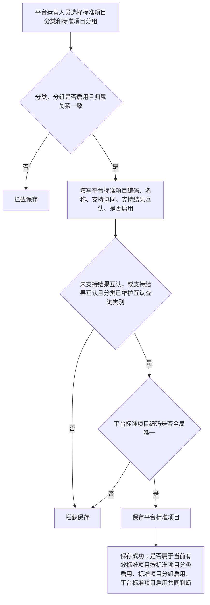
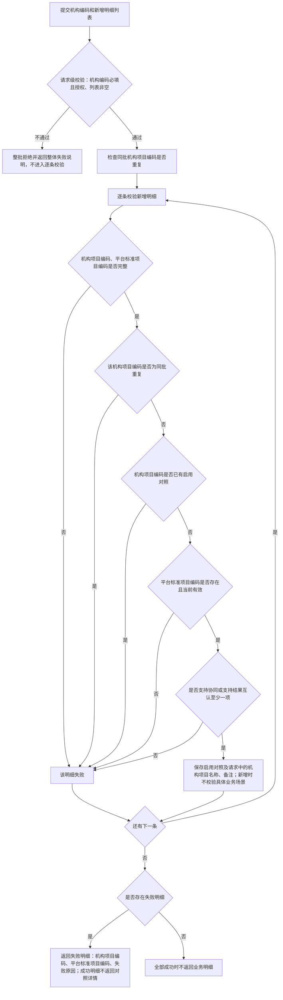
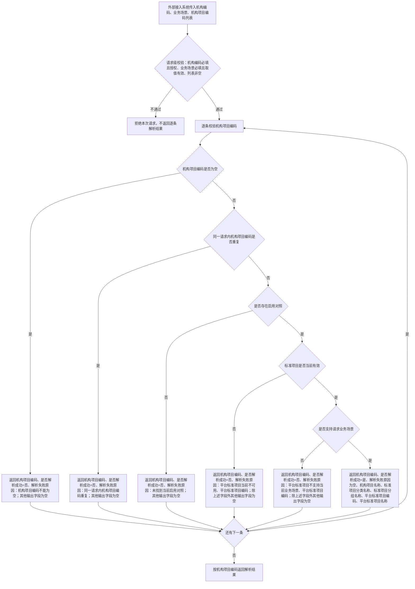
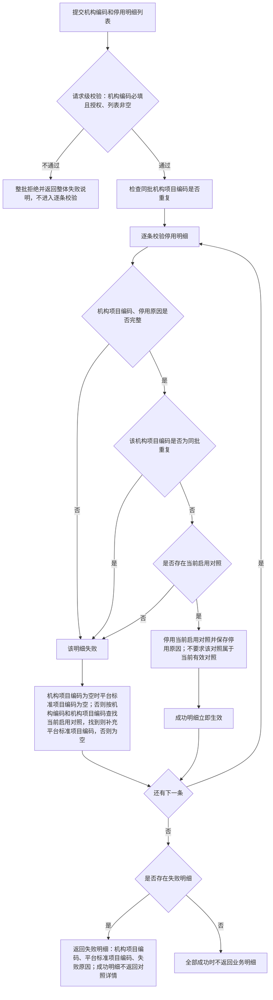

# 项目对照管理系统需求文档

> 版本：重构确认稿
>
> 状态：业务确认中
>
> 日期：2026-06-05
>
> 说明：本文档用于定义项目对照管理系统的业务范围、平台标准项目目录、机构项目对照关系及对外接口业务属性。系统需同时服务检验中心协同平台、影像诊断中心系统和检查检验结果互认业务。

---

## 1. 概述与通用规则

### 1.1 系统定位

项目对照管理系统是独立的项目目录与机构项目对照系统，负责维护平台统一的标准项目目录，并管理各机构本地项目与平台标准项目之间的对照关系。

系统需承载以下业务场景：

1. **协同**：检验中心协同平台和影像诊断中心系统创建协同申请时，将发起机构提交的机构项目编码转换为平台标准项目编码，用于申请流转和报告展示。
2. **结果互认**：检查检验结果互认业务查询近期可互认记录前，将机构项目编码转换为平台标准项目编码。互认查询类别作为标准项目目录上的参考属性保留，结果互认系统后续按检验、检查或全部查询，由结果互认业务自行决定。

本系统不保存检验申请、影像申请、互认查询记录、报告、患者、就诊、样本或影像数据。项目对照关系变更只影响变更后发生的项目解析、目录查询和对照查询，不改写已创建的检验申请、影像申请、互认查询记录和报告。

### 1.2 术语说明

| 术语 | 定义 |
| --- | --- |
| 平台标准项目目录 | 平台统一维护的标准项目目录，包含标准项目分类、标准项目分组和平台标准项目 |
| 标准项目分类 | 平台标准项目目录的第一层，用于按业务专业归类，例如检验专业、放射影像专业、超声影像专业 |
| 标准项目分组 | 平台标准项目目录的第二层，隶属于标准项目分类，用于目录展示和维护分组，例如 CT、MR、DR、生化常规检验、腹部彩超；示例不构成固定枚举 |
| 平台标准项目 | 平台标准项目目录的第三层，也是机构项目对照的目标对象，例如钾（K）、头颅 CT 平扫 |
| 平台标准项目编码 | 平台标准项目的唯一编码，是外部接入系统进行项目流转或互认查询时使用的标准项目编码 |
| 机构项目编码 | 机构本地 HIS、LIS、RIS 或 PACS 中用于表示具体项目的编码 |
| 机构项目名称 | 机构本地项目名称，仅用于人工核对、展示和追溯，不参与对照解析判断 |
| 机构项目对照 | 机构项目编码与平台标准项目编码之间的映射关系 |
| 当前有效标准项目 | 所属标准项目分类启用、所属标准项目分组启用，且平台标准项目自身启用 |
| 当前有效对照 | 对照自身启用，且对照到的标准项目为当前有效标准项目 |
| 当前启用对照 | 对照自身为启用状态，不要求对照到的标准项目当前有效 |
| 互认查询类别 | 标准项目分类上的目录属性，用于结果互认业务参考，取值为检验项目或检查项目；不作为项目对照解析接口的输入、输出或解析判断条件 |
| 业务场景 | 调用项目对照解析接口时声明的使用场景，取值为协同、结果互认 |
| 适用业务范围 | 平台标准项目是否可用于协同、结果互认的业务属性，对应支持协同、支持结果互认两个属性 |
| 对照解析 | 按机构编码、业务场景和机构项目编码列表，将机构项目编码转换为平台标准项目编码 |
| 批量解析 | 对照解析接口一次请求传入多条机构项目编码，并按机构项目编码逐条返回解析结果 |
| 批量新增/停用 | 对外接口支持批量新增、批量停用机构项目对照。批量新增和批量停用采用明细级失败规则 |
| 授权机构范围 | 外部接入系统可访问的机构编码范围。包含机构编码或机构数据的接口只能访问授权机构范围内的数据 |
| 平台功能 | 平台内提供给平台运营人员和机构用户使用的页面功能，不包含对外接口 |
| 平台运营人员 | 平台运营方的管理员用户，负责标准项目目录和机构项目对照的维护 |
| 机构用户 | 经权限系统授权的平台机构用户，可在本机构权限范围内查询、新增、启用、停用本机构对照关系 |
| 外部接入系统 | 调用本系统对外接口的第三方系统，包括检验中心协同平台、影像诊断中心系统、检查检验结果互认系统及相关 HIS、LIS、RIS、PACS |

省平台下发目录中的“分类、分组、互认项目名称、互认项目编码”在本文档中分别对应“标准项目分类、标准项目分组、平台标准项目名称、平台标准项目编码”。外部资料中出现的“项目编码”或“互认项目编码”，如用于表示具体可对照项目，均对应本文档的“平台标准项目编码”。

### 1.3 权限规则

| 能力 | 平台运营人员 | 机构用户 | 对外接口 |
| --- | :---: | :---: | :---: |
| 标准项目目录查看 | 是 | 是 | 是 |
| 标准项目目录新增、修改、启用、停用 | 是 | 否 | 否 |
| 机构对照查看 | 是 | 是，仅本机构 | 是，仅授权机构 |
| 机构对照新增、启用、停用 | 是 | 是，仅本机构 | 新增、停用 |
| 机构对照修改 | 否 | 否 | 否 |
| 项目对照解析 | 否 | 否 | 是 |
| 当前有效标准项目目录导出 | 是 | 否 | 否 |

具体权限点、角色分配和数据范围由统一权限系统定义。外部接入系统传入未授权机构编码时，系统应拒绝处理。

### 1.4 通用生效与留痕规则

1. 标准项目目录新增、修改、启用、停用保存后立即生效；机构项目对照新增、启用、停用保存后立即生效。
2. 当前版本不支持预约生效，不支持到期自动失效。
3. 系统自动记录创建人、创建时间、最后修改人、最后修改时间。
4. 当前版本不记录字段变更前后的具体内容，不提供独立操作记录查询功能。
5. 除对外查询接口明确返回的最后更新时间外，创建人、创建时间、最后修改人等留痕信息不作为页面展示字段，也不作为对外接口输入或输出字段。

---

## 2. 平台标准项目目录

### 2.1 功能定位

平台标准项目目录用于维护可被多个业务系统共同使用的标准项目。目录采用三层结构：

```text
标准项目分类
  -> 标准项目分组
      -> 平台标准项目
```

对照关系只建立到平台标准项目。标准项目分类和标准项目分组用于目录组织、平台维护、查询展示、导出归类和结果互认时的目录参考，不作为对照目标。

协同场景按统一协同处理。检验专业、放射影像专业、超声影像专业等专业差异由标准项目分类表达；检验中心协同平台、影像诊断中心系统应按自身业务选择对应标准项目分类。

### 2.2 标准项目分类

#### 2.2.1 属性定义

| 属性 | 必填 | 说明 |
| --- | :---: | --- |
| 标准项目分类编码 | 是 | 平台内部维护编码，全局唯一，不对外接口返回 |
| 标准项目分类名称 | 是 | 分类展示名称，例如检验专业、放射影像专业、超声影像专业 |
| 互认查询类别 | 条件 | 分类下存在支持结果互认的项目时必填，取值为检验项目、检查项目；作为目录参考属性保留，不参与协同判断，也不作为项目对照解析接口的输入、输出或解析判断条件 |
| 是否启用 | 是 | 启用或停用 |
| 备注 | 否 | 补充说明 |

#### 2.2.2 维护规则

1. 标准项目分类由平台运营人员在平台功能中维护。
2. 标准项目分类编码全局唯一。
3. 标准项目分类被下级标准项目分组或平台标准项目使用后，不允许修改分类编码和分类名称，只允许修改备注和启停用状态；分类下不存在支持结果互认的平台标准项目时，允许修改互认查询类别。
4. 启用或停用标准项目分类不自动变更下级标准项目分组和平台标准项目的启停用状态。
5. 标准项目分类停用后，其下级平台标准项目不属于当前有效标准项目。
6. 分类下存在支持结果互认的平台标准项目时，互认查询类别不允许清空，也不允许直接修改取值；这里的平台标准项目包含启用和停用状态。
7. 平台运营人员确认互认查询类别配置错误时，如分类下所有支持结果互认的平台标准项目均未被机构项目对照引用，允许先将这些平台标准项目的支持结果互认改为否，再修改互认查询类别；修改后如仍需这些平台标准项目支持结果互认，可再将支持结果互认改回是。涉及停用状态的平台标准项目时，应先按平台标准项目规则启用后再修改支持结果互认。
8. 平台运营人员确认互认查询类别配置错误时，如分类下存在已被机构项目对照引用的支持结果互认平台标准项目，建议平台运营人员对该分类下受影响的支持结果互认平台标准项目统一重建：先新增正确的标准项目分类及标准项目分组，在新分类和分组下新增正确的平台标准项目，再组织平台运营人员或机构用户停用相关原对照并新增指向新平台标准项目的对照，最后停用受影响的原平台标准项目。上述操作由平台运营人员或机构用户按权限处理，系统不自动迁移、不自动重建对照。
9. 标准项目分类编码为平台内部维护属性，对外接口和平台导出不返回。

### 2.3 标准项目分组

#### 2.3.1 属性定义

| 属性 | 必填 | 说明 |
| --- | :---: | --- |
| 所属标准项目分类 | 是 | 分组归属的标准项目分类 |
| 标准项目分组编码 | 是 | 同一标准项目分类下唯一，不对外接口返回 |
| 标准项目分组名称 | 是 | 分组展示名称，例如 CT、MR、DR、腹部彩超；示例不构成固定枚举 |
| 是否启用 | 是 | 启用或停用 |
| 备注 | 否 | 补充说明 |

#### 2.3.2 维护规则

1. 标准项目分组由平台运营人员在平台功能中维护。
2. 同一标准项目分类下，标准项目分组编码唯一。
3. 标准项目分组被平台标准项目使用后，不允许修改所属标准项目分类、分组编码和分组名称，只允许修改备注和启停用状态。
4. 标准项目分组未被平台标准项目使用前，允许修改所属标准项目分类、分组编码和分组名称；修改后的所属标准项目分类必须存在且启用，且分组编码在目标标准项目分类下唯一。
5. 标准项目分组停用后，其下级平台标准项目不属于当前有效标准项目。
6. 标准项目分组编码为平台内部维护属性，对外接口和平台导出不返回。

### 2.4 平台标准项目

#### 2.4.1 属性定义

| 属性 | 必填 | 说明 |
| --- | :---: | --- |
| 所属标准项目分类 | 是 | 项目归属的标准项目分类 |
| 所属标准项目分组 | 是 | 项目归属的标准项目分组 |
| 平台标准项目编码 | 是 | 全局唯一编码 |
| 平台标准项目名称 | 是 | 标准展示名称 |
| 支持协同 | 是 | 是否可用于检验中心协同平台和影像诊断中心系统 |
| 支持结果互认 | 是 | 是否可用于检查检验结果互认 |
| 是否启用 | 是 | 启用或停用 |
| 备注 | 否 | 补充说明 |

#### 2.4.2 维护规则

1. 平台标准项目由平台运营人员在平台功能中维护。
2. 平台标准项目编码全局唯一。
3. 新增平台标准项目时，所属标准项目分类和所属标准项目分组必须存在且启用，且所属标准项目分组必须隶属于所选标准项目分类。
4. 平台标准项目被任何机构项目对照引用后，不允许修改所属标准项目分类、所属标准项目分组、平台标准项目编码和平台标准项目名称；支持协同、支持结果互认允许从否修改为是，不允许从是修改为否；除启停用状态和支持属性扩大外，仅允许修改备注。启停用状态通过启用、停用操作维护。
5. 平台标准项目被任何机构项目对照引用后，如需调整不可修改内容，或取消已经支持的业务场景，应停用原平台标准项目后新增新的平台标准项目。
6. “被任何机构项目对照引用”包含启用和停用状态的机构项目对照；只要平台标准项目曾被机构项目对照引用，就按被引用后的规则限制修改。
7. 平台标准项目未被机构项目对照引用且处于启用状态时，允许修改所属标准项目分类、所属标准项目分组、编码、名称、支持协同和支持结果互认。修改后的所属标准项目分类和所属标准项目分组必须存在且启用，且所属标准项目分组必须隶属于所选标准项目分类；修改后的平台标准项目编码不可与系统内任一平台标准项目编码重复，包括停用状态编码。
8. 平台标准项目编码修改保存成功后，原编码不作为曾用编码保留；当前版本不维护曾用编码记录。
9. 当前版本不保存外部系统调用标准项目目录查询接口的查询流水或获取记录，不根据外部系统是否曾查询标准项目目录来限制未被机构项目对照引用项目的编码修改；如外部系统已获取修改前编码，由平台运营人员人工通知相关机构或接入方重新获取目录。
10. 平台标准项目停用后，其当前编码不可被新项目复用。
11. 停用状态的平台标准项目仅允许修改备注；如需修改所属标准项目分类、所属标准项目分组、编码、名称、支持协同或支持结果互认，应先启用，再按未被机构项目对照引用时的规则处理；已被机构项目对照引用的项目启用后，支持协同、支持结果互认仍只能从否修改为是。
12. 平台标准项目停用后，不可用于新增对照和后续有效解析。
13. 平台标准项目停用后，系统不自动迁移既有机构项目对照。既有启用对照仍保留，但不属于当前有效对照，后续解析失败原因为“平台标准项目当前不可用”；需要继续使用时，应由平台运营人员或机构用户停用原对照，并新增指向新平台标准项目的对照。
14. 平台标准项目设置为支持结果互认时，所属标准项目分类必须已维护互认查询类别；否则不允许保存。
15. 允许平台标准项目的支持协同、支持结果互认两项全部为否。两项全部为否的项目可作为目录预维护数据，但不会在任一业务场景下解析有效，也不允许新增机构项目对照。
16. 平台标准项目的支持协同、支持结果互认两个属性用于项目对照解析时按业务场景过滤；目录查询和导出仍可展示当前有效标准项目是否支持协同、是否支持结果互认。
17. 本系统只按平台标准项目编码进行对照和解析，不维护样本类型、报告子项、套餐拆分、检查部位、检查方法、增强方式、左右侧等医学细分规则；相关医学业务判断由检验中心协同平台、影像诊断中心系统和检查检验结果互认系统处理。

### 2.5 当前有效标准项目

满足以下条件的项目才属于当前有效标准项目：

1. 所属标准项目分类为启用状态。
2. 所属标准项目分组为启用状态。
3. 平台标准项目自身为启用状态。

当前有效标准项目不等于所有可用于某一业务场景的项目。解析接口还需根据业务场景校验该项目是否支持对应业务。

### 2.6 标准项目目录查询与导出

#### 2.6.1 对外目录查询接口

对外目录查询接口用于外部接入系统一次性获取当前有效标准项目目录。

**输入属性**

| 属性 | 必填 | 说明 |
| --- | :---: | --- |
| 业务范围 | 是 | 取值为全部、协同、结果互认 |
| 标准项目分类名称 | 否 | 按标准项目分类筛选；为空时不按分类筛选 |

**输出属性**

| 属性 | 说明 |
| --- | --- |
| 标准项目分类名称 | 平台标准项目所属分类名称 |
| 标准项目分组名称 | 平台标准项目所属分组名称 |
| 平台标准项目编码 | 当前有效平台标准项目的编码 |
| 平台标准项目名称 | 当前有效平台标准项目的名称 |
| 支持协同 | 是否可用于协同 |
| 支持结果互认 | 是否可用于结果互认 |
| 互认查询类别 | 所属标准项目分类的互认查询类别；仅作为结果互认业务参考属性，不作为协同、目录专业分类或项目对照解析依据 |
| 备注 | 补充说明 |
| 最后更新时间 | 最后一次保存修改的时间，仅用于列表展示和人工核对，不作为查询条件、增量同步、数据变更判断或接口调用依据 |

**业务规则**

1. 查询接口只返回当前有效标准项目。
2. 业务范围为全部时，返回全部当前有效标准项目，包括支持协同和支持结果互认均为否的预维护项目。
3. 业务范围为协同时，只返回支持协同的当前有效标准项目。
4. 业务范围为结果互认时，只返回支持结果互认的当前有效标准项目。
5. 业务范围为空或取值不在全部、协同、结果互认内时，拒绝本次请求。
6. 标准项目分类名称不存在或该分类下没有符合条件的当前有效标准项目时，返回空列表。
7. 查询接口不分页，一次性返回符合条件的当前有效标准项目。
8. 查询接口不返回标准项目分类编码和标准项目分组编码。
9. 最后更新时间仅用于列表展示和人工核对，不作为查询条件、增量同步、数据变更判断或接口调用依据。

#### 2.6.2 平台导出

平台功能支持按业务范围导出当前有效标准项目目录，业务范围取值为全部、协同、结果互认，并可按标准项目分类名称筛选。导出内容包含对外目录查询接口中的业务字段，但不包含最后更新时间。当前版本不提供对外文件导出接口。

---

## 3. 机构项目对照

### 3.1 功能定位

机构项目对照用于建立机构本地项目与平台标准项目之间的关系。

```text
机构项目编码 -> 平台标准项目编码
```

机构项目对照是项目对照解析、协同申请创建和结果互认查询前编码转换的基础。

### 3.2 属性定义

| 属性 | 必填 | 说明 |
| --- | :---: | --- |
| 机构编码 | 是 | 对照所属机构 |
| 机构项目编码 | 是 | 机构本地项目编码 |
| 机构项目名称 | 否 | 机构本地项目名称，仅用于展示和人工核对 |
| 平台标准项目编码 | 是 | 对照到的平台标准项目编码 |
| 是否启用 | 是 | 启用或停用 |
| 停用原因 | 条件 | 对照停用时填写并保存，仅用于平台查看停用状态对照时辅助排查 |
| 备注 | 否 | 补充说明 |

平台功能中的对照列表和详情可关联展示标准项目分类名称、标准项目分组名称、平台标准项目名称、支持协同、支持结果互认、互认查询类别、平台标准项目已不可用。

### 3.3 唯一性与启停用规则

1. 同一机构下，一个机构项目编码只能存在一条启用状态的对照。
2. 同一机构下，允许多个机构项目编码对照到同一个平台标准项目编码。
3. 多个机构项目编码对照到同一个平台标准项目编码时，这些机构项目应可视为同一平台标准项目。
4. 不得将套餐与单项、不同检查部位、不同检查方法、不同检验含义的项目对照到同一个平台标准项目；是否可视为同一平台标准项目由维护人员或接入方业务确认，系统不自动判断医学语义是否一致。
5. 停用状态的对照不参与后续解析。
6. 新增对照默认启用。
7. 新增对照时，机构项目编码在同一机构下不能已有启用对照。
8. 新增对照时，平台标准项目编码必须存在，且必须属于当前有效标准项目。
9. 新增对照时，目标平台标准项目的支持协同或支持结果互认至少一项必须为是；支持协同和支持结果互认均为否的平台标准项目仅作为目录预维护数据，不允许新增机构项目对照，也不会在任一业务场景下解析有效。
10. 对照自身启用但关联的标准项目分类、标准项目分组或平台标准项目停用时，该对照不是当前有效对照。
11. 对照自身启用但关联的标准项目分类、标准项目分组或平台标准项目停用时，平台功能可展示为平台标准项目已不可用。“平台标准项目已不可用”为平台功能中的派生展示状态，表示对照到的平台标准项目不是当前有效标准项目，不包含是否支持当前业务场景；对外对照查询接口和解析接口不返回该状态。
12. 关联的标准项目分类、标准项目分组和平台标准项目重新启用后，对照自身仍为启用状态的对照自动重新成为当前有效对照；解析时仍按业务场景校验平台标准项目是否支持协同或支持结果互认。
13. 当前启用对照只表示对照自身为启用状态，不要求关联的标准项目分类、标准项目分组或平台标准项目当前有效。
14. 当前版本任何状态的机构项目对照均不支持修改业务字段；启停用状态仅通过启用、停用操作变更。
15. 当前版本不提供对照修改能力。如需调整机构项目编码或平台标准项目编码，应停用原对照后新增新对照。
16. 平台功能支持逐条启用和逐条停用对照；对外接口仅支持新增和停用，不支持启用。
17. 启用对照时，应校验同一机构下无相同机构项目编码的启用对照，并校验对照到的平台标准项目为当前有效标准项目，且支持协同或支持结果互认至少一项为是。
18. 新增对照只校验机构项目编码与平台标准项目编码的映射关系是否成立，不按具体业务场景校验目标平台标准项目支持协同还是支持结果互认；对照是否可用于具体业务场景，以项目对照解析接口按业务场景校验结果为准。

### 3.4 机构项目名称规则

1. 机构项目名称保存在机构项目对照关系中。
2. 机构项目名称仅用于新增对照时的辅助核对、查询展示和人工排查。
3. 对照解析只以机构编码和机构项目编码为准，不以机构项目名称判断。
4. 名称不同但编码相同，不视为不同项目。
5. 机构项目名称变化不影响对照关系有效性。
6. 当前版本机构项目名称仅在新增对照时写入，后续不支持单独修改；如需更正展示名称，应停用原对照后新增对照。

### 3.5 机构项目对照平台功能

1. 平台运营人员可查看全部机构项目对照。
2. 机构用户只能查询、新增、启用、停用本机构对照。
3. 平台功能可查询启用和停用状态的对照。
4. 对照列表支持按机构编码、机构项目编码、机构项目名称、平台标准项目编码、平台标准项目名称、标准项目分类名称、标准项目分组名称、是否启用、平台标准项目已不可用筛选。
5. 平台功能中的新增、启用、停用均为逐条操作。
6. 对照停用时应填写停用原因。
7. 机构项目对照停用成功时，系统保存停用原因。停用原因用于平台功能查看停用状态对照时辅助排查，不作为对外机构对照查询接口输出字段。

---

## 4. 对外接口业务属性与规则

本文档仅定义接口的业务输入属性、业务输出属性和业务规则。

### 4.1 项目对照解析接口

#### 4.1.1 功能定位

项目对照解析接口用于外部接入系统在具体业务场景中，将机构项目编码批量转换为平台标准项目编码。

#### 4.1.2 输入属性

| 属性 | 必填 | 说明 |
| --- | :---: | --- |
| 机构编码 | 是 | 待解析项目所属机构，必须在调用方授权机构范围内 |
| 业务场景 | 是 | 取值为协同、结果互认 |
| 机构项目编码列表 | 是 | 需要解析的机构项目编码列表，列表不能为空 |

**机构项目编码列表字段**

| 属性 | 必填 | 说明 |
| --- | :---: | --- |
| 机构项目编码 | 是 | 需要解析的机构项目编码 |

#### 4.1.3 输出属性

| 属性 | 说明 |
| --- | --- |
| 机构项目编码 | 回传请求中的机构项目编码 |
| 是否解析成功 | 取值为是、否 |
| 解析失败原因 | 是否解析成功为否时返回；是否解析成功为是时为空 |
| 机构项目名称 | 是否解析成功为是时返回对照关系中维护的机构项目名称，可为空；是否解析成功为否时为空 |
| 标准项目分类名称 | 是否解析成功为是时返回；是否解析成功为否时为空 |
| 标准项目分组名称 | 是否解析成功为是时返回；是否解析成功为否时为空 |
| 平台标准项目编码 | 是否解析成功为是时返回解析得到的平台标准项目编码；系统已找到当前启用对照但后续校验失败时，返回当前启用对照中的平台标准项目编码；未找到当前启用对照、机构项目编码为空、同一请求内机构项目编码重复时为空 |
| 平台标准项目名称 | 是否解析成功为是时返回；是否解析成功为否时为空 |

#### 4.1.4 业务规则

1. 请求级校验包括：机构编码必填、机构编码在授权机构范围内、业务场景必填且取值有效、机构项目编码列表非空。
2. 请求级校验失败时拒绝本次请求，不返回逐条解析结果。
3. 机构项目编码为空时，该明细是否解析成功为否，解析失败原因为“机构项目编码不能为空”，其他输出字段为空。
4. 同一请求内机构项目编码重复时，重复的机构项目编码对应明细是否解析成功均为否，解析失败原因为“同一请求内机构项目编码重复”，其他输出字段为空。
5. 明细校验通过后，系统按机构编码和机构项目编码逐条查找启用状态的机构项目对照。
6. 找到启用对照后，系统继续判断对照到的平台标准项目是否为当前有效标准项目。
7. 找到当前有效标准项目后，系统继续判断该平台标准项目是否支持请求中的业务场景。
8. 业务场景为协同时，平台标准项目必须支持协同。
9. 业务场景为结果互认时，平台标准项目必须支持结果互认；互认查询类别不作为项目对照解析接口的输入、输出或解析判断条件。
10. 校验全部通过时，该明细是否解析成功为是，并返回对应平台标准项目信息。
11. 无启用对照时，该明细是否解析成功为否，解析失败原因为“未找到当前启用对照”。
12. 对照到的平台标准项目不是当前有效标准项目时，该明细是否解析成功为否，解析失败原因为“平台标准项目当前不可用”，平台标准项目编码返回该启用对照中的平台标准项目编码。
13. 平台标准项目不支持当前业务场景时，该明细是否解析成功为否，解析失败原因为“平台标准项目不支持当前业务场景”，平台标准项目编码返回该启用对照中的平台标准项目编码。
14. 是否解析成功为否时，接口仍返回机构项目编码和解析失败原因；未找到当前启用对照、机构项目编码为空、同一请求内机构项目编码重复时，平台标准项目编码为空；除上述明确返回字段外，其他输出字段为空。
15. 批量解析不是对每条明细分别发起接口请求；一次请求返回一次响应，并按机构项目编码逐条返回解析结果。

### 4.2 标准项目目录查询接口

标准项目目录查询接口的输入属性、输出属性和业务规则见 2.6.1。

### 4.3 机构对照查询接口

#### 4.3.1 功能定位

机构对照查询接口用于外部接入系统查询指定授权机构下的当前有效机构项目对照。

#### 4.3.2 输入属性

| 属性 | 必填 | 说明 |
| --- | :---: | --- |
| 机构编码 | 是 | 必须在调用方授权机构范围内 |

#### 4.3.3 输出属性

| 属性 | 说明 |
| --- | --- |
| 机构编码 | 对照所属机构 |
| 机构项目编码 | 机构本地项目编码 |
| 机构项目名称 | 机构本地项目名称，可为空 |
| 标准项目分类名称 | 对照到的平台标准项目所属分类名称 |
| 标准项目分组名称 | 对照到的平台标准项目所属分组名称 |
| 平台标准项目编码 | 对照到的平台标准项目编码 |
| 平台标准项目名称 | 对照到的平台标准项目名称 |
| 支持协同 | 对照到的平台标准项目是否支持协同 |
| 支持结果互认 | 对照到的平台标准项目是否支持结果互认 |
| 互认查询类别 | 对照到的平台标准项目所属分类的互认查询类别；仅作为结果互认业务参考属性，不作为协同、目录专业分类或项目对照解析依据 |
| 备注 | 对照备注 |
| 最后更新时间 | 对照最后一次保存修改的时间，仅用于展示和人工核对，不作为查询条件、增量同步、数据变更判断或接口调用依据 |

#### 4.3.4 业务规则

1. 查询接口必须传入机构编码。
2. 机构编码为空或不在调用方授权机构范围内时，拒绝本次请求，不返回机构对照列表。
3. 外部接入系统只能查询授权机构范围内的数据。
4. 查询接口只返回当前有效对照。
5. 查询接口不分页，一次性返回指定机构下全部当前有效对照。
6. 查询接口不返回创建人、创建时间、最后修改人等仅供留痕使用的信息。
7. 最后更新时间仅用于展示和人工核对，不作为查询条件、增量同步、数据变更判断或接口调用依据。
8. 机构对照查询接口用于查询当前有效对照；对照是否可用于具体业务场景，以项目对照解析接口按业务场景校验结果为准。机构对照停用接口不要求停用目标必须能通过机构对照查询接口查到。

### 4.4 机构对照新增接口

#### 4.4.1 功能定位

机构对照新增接口用于外部接入系统批量新增机构项目对照。

#### 4.4.2 输入属性

| 属性 | 必填 | 说明 |
| --- | :---: | --- |
| 机构编码 | 是 | 对照所属机构，必须在调用方授权机构范围内 |
| 新增明细列表 | 是 | 本次新增的对照明细，列表不能为空 |

**新增明细字段**

| 属性 | 必填 | 说明 |
| --- | :---: | --- |
| 机构项目编码 | 是 | 机构本地项目编码 |
| 机构项目名称 | 否 | 机构本地项目名称 |
| 平台标准项目编码 | 是 | 对照目标平台标准项目编码 |
| 备注 | 否 | 对照备注 |

#### 4.4.3 失败明细输出属性

新增成功的明细不返回新增后的机构项目对照详情。全部新增成功时不返回业务明细；存在明细级失败时，仅返回失败明细：

| 属性 | 说明 |
| --- | --- |
| 机构项目编码 | 请求中的机构项目编码 |
| 平台标准项目编码 | 请求中的平台标准项目编码 |
| 失败原因 | 明细级业务失败原因，返回可直接展示并用于调用方修正的具体原因文本；具体取值示例见业务规则 |

#### 4.4.4 业务规则

1. 机构编码必须在调用方授权机构范围内。
2. 新增明细列表不能为空。
3. 请求级校验失败时返回整体失败说明，不返回失败明细。
4. 每条明细的机构项目编码、平台标准项目编码必填。
5. 平台标准项目编码必须存在，且必须属于当前有效标准项目。
6. 平台标准项目必须支持协同或支持结果互认至少一项；支持协同和支持结果互认均为否的平台标准项目不会在任一业务场景下解析有效。
7. 同一机构下，机构项目编码不能已有启用状态对照。
8. 同一请求内新增明细中，机构项目编码不能重复；重复的机构项目编码对应明细均新增失败。
9. 允许多个不同机构项目编码对照到同一个平台标准项目编码，但这些机构项目应可视为同一平台标准项目；不得将套餐与单项、不同检查部位、不同检查方法、不同检验含义的项目对照到同一个平台标准项目。
10. 明细失败原因应明确说明具体问题，例如“机构项目编码不能为空”“平台标准项目编码不能为空”“同一请求内机构项目编码重复”“机构项目编码已有启用对照”“平台标准项目编码无效”“平台标准项目不支持任何业务场景”。
11. 批量新增采用明细级失败规则：成功明细生效，失败明细不生效，并返回失败明细，便于调用方修正后重试。
12. 新增成功后对照默认为启用状态。
13. 新增成功不返回新增后的机构项目对照详情。
14. 批量新增失败明细用于定位失败的业务数据，不用于定位请求数组中的物理行号；当前版本不要求调用方传入请求明细序号。

### 4.5 机构对照停用接口

#### 4.5.1 功能定位

机构对照停用接口用于外部接入系统批量停用机构项目对照。

#### 4.5.2 输入属性

| 属性 | 必填 | 说明 |
| --- | :---: | --- |
| 机构编码 | 是 | 对照所属机构，必须在调用方授权机构范围内 |
| 停用明细列表 | 是 | 本次停用的对照明细，列表不能为空 |

**停用明细字段**

| 属性 | 必填 | 说明 |
| --- | :---: | --- |
| 机构项目编码 | 是 | 用于定位当前启用对照 |
| 停用原因 | 是 | 停用原因 |

#### 4.5.3 失败明细输出属性

停用成功的明细不返回停用后的机构项目对照详情。全部停用成功时不返回业务明细；存在明细级失败时，仅返回失败明细：

| 属性 | 说明 |
| --- | --- |
| 机构项目编码 | 请求中的机构项目编码 |
| 平台标准项目编码 | 系统能够根据机构编码和机构项目编码找到当前启用对照时返回该对照的平台标准项目编码；机构项目编码为空或未找到当前启用对照时为空 |
| 失败原因 | 明细级业务失败原因，返回可直接展示并用于调用方修正的具体原因文本；具体取值示例见业务规则 |

#### 4.5.4 业务规则

1. 机构编码必须在调用方授权机构范围内。
2. 停用明细列表不能为空。
3. 请求级校验失败时返回整体失败说明，不返回失败明细。
4. 每条明细的机构项目编码和停用原因必填。
5. 机构对照停用接口用于停用指定机构项目编码当前启用的对照关系。
6. 系统按机构编码和机构项目编码定位当前启用对照。
7. 未找到当前启用对照时，该明细停用失败。
8. 同一请求内停用明细中，机构项目编码不能重复；重复的机构项目编码对应明细均停用失败。
9. 明细失败原因应明确说明具体问题，例如“机构项目编码不能为空”“停用原因不能为空”“同一请求内机构项目编码重复”“未找到当前启用对照”。
10. 批量停用采用明细级失败规则：成功明细生效，失败明细不生效，并返回失败明细，便于调用方修正后重试。
11. 停用成功不返回停用后的机构项目对照详情。
12. 停用成功时，系统保存停用原因。停用原因用于平台功能查看停用状态对照时辅助排查，不作为对外机构对照查询接口输出字段；停用成功响应不返回停用原因。
13. 批量停用失败明细用于定位失败的业务数据，不用于定位请求数组中的物理行号；当前版本不要求调用方传入请求明细序号。
14. 停用失败明细中的平台标准项目编码按以下规则返回：机构项目编码为空时为空；未找到当前启用对照时为空；能够根据机构编码和机构项目编码找到当前启用对照时，返回该对照的平台标准项目编码，包括停用原因为空、同一请求内机构项目编码重复等明细失败场景。
15. 机构对照停用接口不依赖机构对照查询接口的返回范围；即使当前启用对照因关联的标准项目分类、标准项目分组或平台标准项目停用而不属于当前有效对照，仍可按机构编码和机构项目编码定位并停用。

---

## 5. 核心流程

### 5.1 新增平台标准项目流程



### 5.2 批量新增机构项目对照流程



### 5.3 项目对照解析流程



### 5.4 批量停用机构项目对照流程



---

## 6. 当前版本范围边界

### 6.1 当前版本包含

1. 标准项目分类、标准项目分组、平台标准项目的平台功能维护。
2. 平台标准项目支持协同、支持结果互认两个属性维护。
3. 标准项目分类的互认查询类别维护。
4. 机构项目对照的平台功能查询、逐条新增、逐条启用、逐条停用。
5. 标准项目目录查询接口。
6. 项目对照解析接口。
7. 机构对照查询接口。
8. 机构对照批量新增接口。
9. 机构对照批量停用接口。
10. 平台功能导出当前有效标准项目目录。

### 6.2 当前版本不包含

1. 不维护检验申请、影像申请、互认查询记录、报告、患者、就诊、样本或影像数据。
2. 不提供标准项目目录对外维护接口。
3. 不提供机构对照对外修改接口。
4. 不提供机构对照对外启用接口。
5. 不提供删除对照关系功能。
6. 不提供对外文件导出接口。
7. 不维护样本类型、报告子项、套餐拆分、参考范围、危急值阈值、检查部位、检查方法、增强方式、左右侧、检测设备、试剂、价格、医保规则。
8. 不校验项目与患者年龄、性别、病区、床号、诊断等医学规则冲突。
9. 不维护标准项目曾用编码记录。
10. 不支持预约生效或到期自动失效。
11. 不记录字段变更前后的具体内容，不提供独立操作记录查询功能。

---

## 7. 对外接口汇总

| 接口 | 业务能力 | 章节 |
| --- | --- | --- |
| 标准项目目录查询接口 | 按业务范围查询当前有效标准项目目录 | 2.6.1 |
| 项目对照解析接口 | 按机构编码、业务场景和机构项目编码列表解析平台标准项目 | 4.1 |
| 机构对照查询接口 | 查询指定授权机构下全部当前有效机构项目对照 | 4.3 |
| 机构对照新增接口 | 批量新增机构项目对照，成功明细生效，失败明细返回失败原因 | 4.4 |
| 机构对照停用接口 | 批量停用机构项目对照，成功明细生效，失败明细返回失败原因 | 4.5 |

### 7.1 接口通用业务约束

1. 包含机构编码或机构数据的接口只能访问授权机构范围内的数据。
2. 目录查询接口不分页，一次性返回符合条件的当前有效标准项目。
3. 对照查询接口必须传入机构编码，不分页，一次性返回该机构全部当前有效对照。
4. 解析接口按机构项目编码逐条返回解析结果。
5. 新增和停用接口采用明细级失败规则。
6. 机构对照新增接口和机构对照停用接口成功时不返回新增或停用后的机构项目对照详情。
7. 对外接口不返回创建人、创建时间、最后修改人等仅供留痕使用的信息。
8. 对外接口字段应使用清楚的业务名称，不使用拼音首字母或未定义缩写。
9. 机构对照停用接口按当前启用对照定位，不依赖机构对照查询接口是否能返回该对照。

---

## 8. 验收标准

1. 平台运营人员可以维护标准项目分类、分组和平台标准项目。
2. 平台标准项目编码全局唯一。
3. 当前有效标准项目必须同时满足标准项目分类启用、标准项目分组启用、平台标准项目启用。
4. 平台标准项目可配置支持协同、支持结果互认。
5. 标准项目分类可配置互认查询类别，取值为检验项目或检查项目。
6. 机构项目对照的目标对象必须是平台标准项目。
7. 同一机构下，一个机构项目编码最多只能有一条启用状态对照。
8. 同一机构下，允许多个机构项目编码对照到同一个平台标准项目编码，但这些机构项目应可视为同一平台标准项目；不得将套餐与单项、不同检查部位、不同检查方法、不同检验含义的项目对照到同一个平台标准项目。
9. 当前版本不提供对照修改能力，调整对照通过停用原对照并新增新对照完成。
10. 平台标准项目被机构项目对照引用后，支持协同、支持结果互认允许从否修改为是，不允许从是修改为否；如需取消已经支持的业务场景，应停用原平台标准项目后新增新的平台标准项目。
11. 新增机构项目对照时，目标平台标准项目必须支持协同或支持结果互认至少一项；支持协同和支持结果互认均为否的平台标准项目不允许作为新增对照目标，也不会在任一业务场景下解析有效。
12. 项目对照解析接口必须按业务场景校验平台标准项目是否支持协同或支持结果互认。
13. 项目对照解析接口不返回互认查询类别；互认查询类别仅作为标准项目目录和机构对照查询中的参考属性保留，不作为解析接口的输入、输出或解析判断条件。
14. 解析接口应按明细返回是否解析成功；是否解析成功为否时，应返回解析失败原因；系统已找到当前启用对照但后续校验失败时，应返回平台标准项目编码；未找到当前启用对照、机构项目编码为空、同一请求内机构项目编码重复时，平台标准项目编码为空；除上述明确返回字段外，其他平台标准项目信息为空。
15. 标准项目分类下存在支持结果互认的平台标准项目时，互认查询类别不允许清空或直接修改；如分类下所有支持结果互认的平台标准项目均未被机构项目对照引用，允许先将这些平台标准项目的支持结果互认改为否，再修改互认查询类别，修改后可按需恢复相关平台标准项目支持结果互认。
16. 平台运营人员确认互认查询类别配置错误，且分类下存在已被机构项目对照引用的支持结果互认平台标准项目时，建议平台运营人员对该分类下受影响的支持结果互认平台标准项目统一重建；系统不自动迁移、不自动重建对照。
17. 平台标准项目未被机构项目对照引用且处于启用状态时允许修改编码；编码修改成功后不保留曾用编码，当前版本不保存外部系统调用标准项目目录查询接口的查询流水或获取记录。
18. 平台标准项目停用后，系统不自动迁移既有机构项目对照；既有启用对照后续解析失败原因为“平台标准项目当前不可用”。
19. 标准项目目录查询接口按业务范围返回当前有效标准项目，不返回分类编码和分组编码。
20. 标准项目目录查询接口不分页，一次性返回符合条件的当前有效标准项目。
21. 机构对照查询接口只返回当前有效对照。
22. 机构对照查询接口不分页，一次性返回指定机构下全部当前有效对照。
23. 机构对照新增和停用接口支持批量；失败明细应返回机构项目编码和失败原因，新增失败明细还应返回请求中的平台标准项目编码，停用失败明细在能够根据机构编码和机构项目编码找到当前启用对照时返回该对照的平台标准项目编码，否则为空。
24. 机构对照新增接口和机构对照停用接口成功时不返回新增或停用后的机构项目对照详情；全部成功时不返回业务明细，存在失败时仅返回失败明细。
25. 批量新增和批量停用失败明细用于定位失败的业务数据，不用于定位请求数组中的物理行号；当前版本不要求调用方传入请求明细序号。
26. 对外目录查询接口和机构对照查询接口返回的最后更新时间仅用于展示和人工核对，不作为查询条件、增量同步、数据变更判断或接口调用依据。
27. 平台功能支持按业务范围和标准项目分类名称导出当前有效标准项目目录，导出字段包含目录查询接口中的业务字段，但不包含最后更新时间。
28. 当前版本不提供对外文件导出接口。
29. 平台功能支持机构项目对照查询、新增、逐条启用和逐条停用；机构用户只能查询、新增、启用、停用本机构对照，对照停用时必须填写停用原因。
30. 机构项目对照停用成功时，系统应保存停用原因；停用原因仅用于平台功能查看停用状态对照时辅助排查，对外机构对照查询接口和停用成功响应不返回停用原因。
31. 机构对照停用接口不要求停用目标必须能通过机构对照查询接口查到；停用接口按机构编码和机构项目编码定位当前启用对照。
32. 所有包含机构编码的对外接口，包括项目对照解析接口、机构对照查询接口、机构对照新增接口和机构对照停用接口，必须校验机构编码在调用方授权机构范围内；机构编码未授权时应拒绝处理。
33. 对外接口不返回创建人、创建时间、最后修改人等仅供留痕使用的信息。

