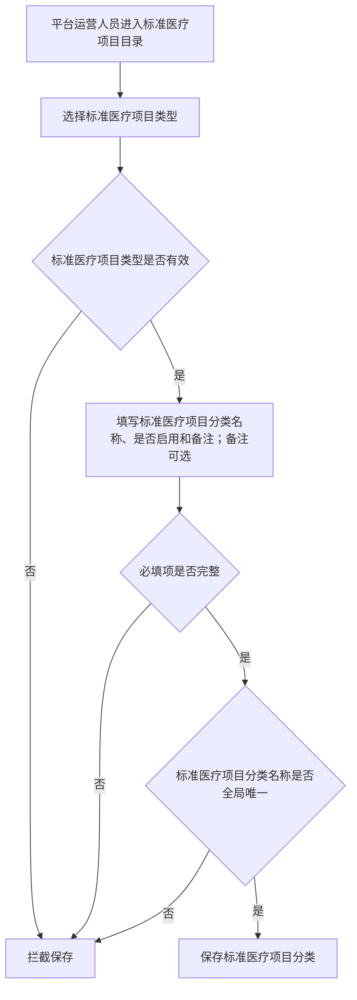
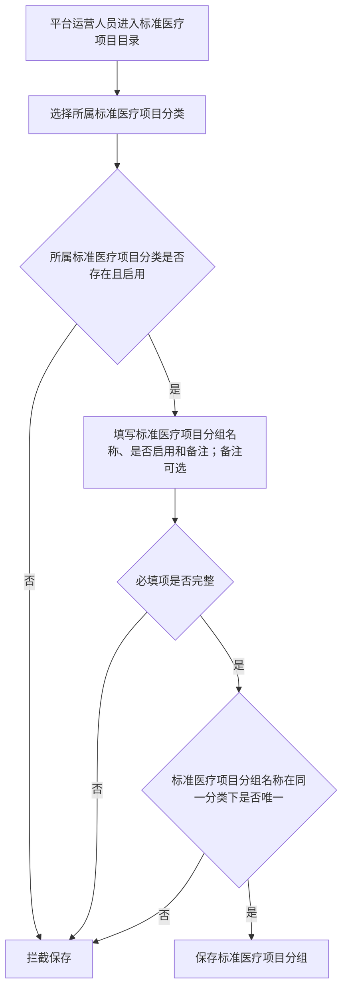
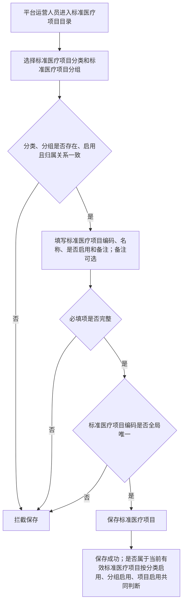
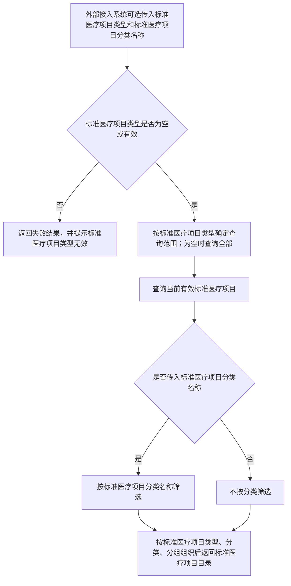

# 标准医疗项目目录管理系统流程图

> 说明：本文档从《标准项目目录管理系统需求文档.md》提取核心流程图，用于单独查看标准医疗项目分类新增、分组新增、标准医疗项目新增和对外目录查询流程。流程图内容与需求文档第 4 章一致。

## 1. 新增标准医疗项目分类流程

### 1.1 流程说明

平台运营人员进入标准医疗项目目录后新增分类，需要先选择标准医疗项目类型。类型有效后填写分类名称、是否启用和备注。保存前校验必填项是否完整，并校验分类名称是否全局唯一。校验通过后保存，保存成功即生效。

### 1.2 流程图

## 2. 新增标准医疗项目分组流程

### 2.1 流程说明

平台运营人员进入标准医疗项目目录后新增分组，需要先选择所属标准医疗项目分类。系统校验所选分类是否存在且启用。校验通过后填写分组名称、是否启用和备注。保存前校验必填项是否完整，并校验分组名称在同一分类下是否唯一。校验通过后保存。

### 2.2 流程图

## 3. 新增标准医疗项目流程

### 3.1 流程说明

平台运营人员进入标准医疗项目目录后新增标准医疗项目，需要先选择所属标准医疗项目分类和所属标准医疗项目分组。系统校验分类、分组是否存在、是否启用，以及分组是否隶属于所选分类。校验通过后填写标准医疗项目编码、名称、是否启用和备注。保存前校验必填项是否完整，并校验编码是否全局唯一。保存成功后，该项目是否属于当前有效标准医疗项目，由分类启用、分组启用、项目启用三个条件共同判断。

### 3.2 流程图

## 4. 标准医疗项目目录查询流程

### 4.1 流程说明

外部接入系统调用目录查询接口，可选传入标准医疗项目类型和标准医疗项目分类名称。类型无效时返回失败并提示。类型有效（或为空）时查询当前有效标准医疗项目，如传入分类名称则按名称精确筛选，最后按标准医疗项目类型、分类、分组逐层组织后返回结果。

### 4.2 流程图

