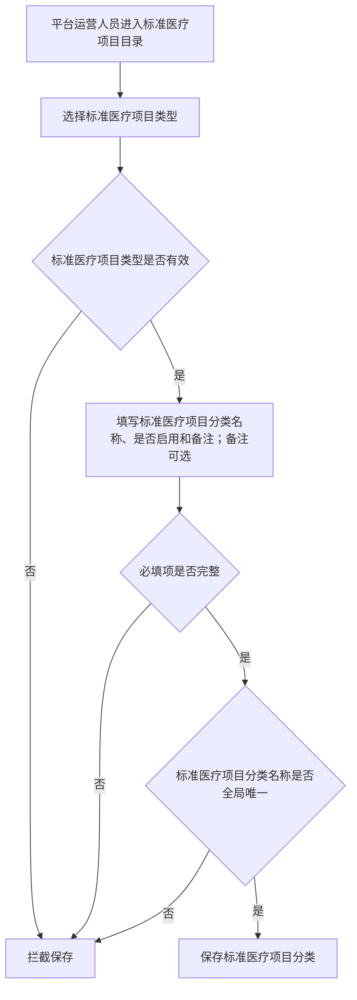
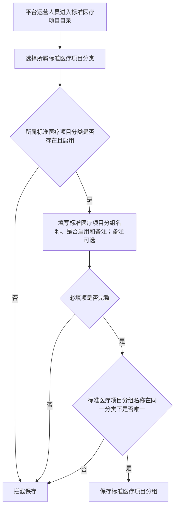
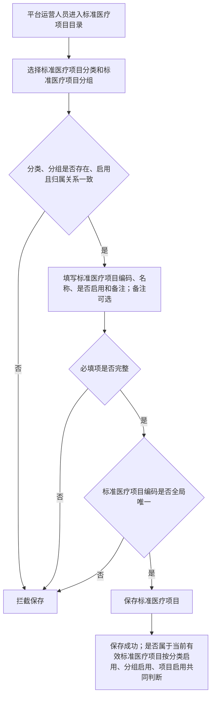
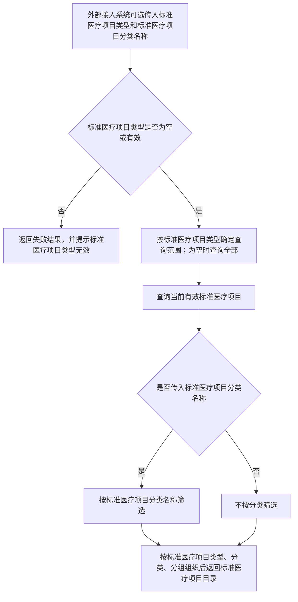

# 标准医疗项目目录管理系统需求文档

> 版本：版本2重构稿
>
> 状态：业务确认中
>
> 日期：2026-06-09
>
> 说明：本文档用于定义标准医疗项目目录管理系统在版本2中的业务范围。版本2将具体对照业务拆分到检验协同系统和影像协同系统等业务系统中，本系统仅维护平台统一标准医疗项目目录，并对外提供标准医疗项目目录查询能力。
>
> 英文命名建议：
>
> - MedicalStandardCatalog：标准医疗项目目录
> - MedicalStandardCategory：标准医疗项目分类
> - MedicalStandardGroup：标准医疗项目分组
> - MedicalStandardItem：标准医疗项目
> - MedicalStandardItemCode：标准医疗项目编码
> - MedicalStandardItemName：标准医疗项目名称

---

## 1. 概述与通用规则

### 1.1 系统定位

标准医疗项目目录管理系统在版本2中定位为平台标准医疗项目目录维护系统，负责维护平台统一的标准医疗项目目录，并向外部系统提供当前有效标准医疗项目目录查询能力。

本系统不维护机构本地项目与标准医疗项目之间的对照关系，不提供项目解析能力。各业务系统如需将机构项目编码转换为标准医疗项目编码，应在各自系统中维护和使用本业务范围内的对照关系：

1. 检验协同相关对照由检验协同系统维护和使用。
2. 影像协同相关对照由影像协同系统维护和使用。
3. 检查检验结果互认相关对照由检查检验结果互认系统维护和使用。

本系统不保存检验申请、影像申请、互认查询记录、报告、患者、就诊、样本或影像数据。标准医疗项目目录变更只影响变更后发生的目录查询和各业务系统后续使用，不改写已创建的业务记录。

### 1.2 术语说明

| 术语 | 定义 |
| --- | --- |
| 平台标准医疗项目目录 | 平台统一维护的标准医疗项目目录 |
| 标准医疗项目类型 | 标准医疗项目分类的业务类型，取值为 `0-检验`、`1-检查`；标准医疗项目分组和标准医疗项目继承所属分类的标准医疗项目类型，查询接口可按该属性筛选 |
| 标准医疗项目分类 | 平台标准医疗项目目录的第一层，用于按业务专业归类，例如生化、免疫、放射影像、超声影像；示例不构成固定枚举 |
| 标准医疗项目分组 | 平台标准医疗项目目录的第二层，隶属于标准医疗项目分类，用于目录展示和维护分组，例如 CT、MR、DR、肝功能、腹部彩超；示例不构成固定枚举 |
| 标准医疗项目 | 平台标准医疗项目目录的第三层，是外部业务系统建立自身对照关系时可引用的标准医疗项目，例如钾（K）、头颅 CT 平扫 |
| 标准医疗项目编码 | 标准医疗项目的唯一编码，是外部业务系统建立对照关系和业务流转时使用的标准医疗项目编码 |
| 当前有效标准医疗项目 | 所属标准医疗项目分类启用、所属标准医疗项目分组启用，且标准医疗项目自身启用 |
| 平台功能 | 平台内提供给平台运营人员使用的页面功能，不包含对外接口 |
| 平台运营人员 | 平台运营方的管理员用户，负责标准医疗项目目录维护 |
| 外部接入系统 | 调用本系统标准医疗项目目录查询接口的外部业务系统；版本2包括检验协同系统和影像协同系统，后续其他业务系统接入时另行确认 |
| 拦截保存 | 校验不通过时禁止保存操作，并向操作者提示校验不通过的原因 |

省平台下发目录中的“分类、分组、项目名称、项目编码”在本文档中分别对应“标准医疗项目分类、标准医疗项目分组、标准医疗项目名称、标准医疗项目编码”。

外部资料、省平台下发目录或历史文档中出现的“平台标准项目”、“项目编码”或“互认项目编码”，如用于表示本系统维护的可引用标准医疗项目，均对应本文档中的“标准医疗项目”和“标准医疗项目编码”。

本文档中“标准医疗项目目录”与“平台标准医疗项目目录”语义等价。

### 1.3 权限规则

| 能力 | 平台运营人员 | 外部接入系统 |
| --- | :---: | :---: |
| 标准医疗项目目录查看 | 是 | 是 |
| 标准医疗项目目录新增、修改、启用、停用 | 是 | 否 |

具体权限点、角色分配和数据范围由统一权限系统定义。当前系统不提供标准医疗项目目录对外维护能力。

### 1.4 通用生效与留痕规则

1. 标准医疗项目目录新增、修改、启用、停用保存后立即生效。各层允许修改的属性范围见第 2 节对应维护规则。
2. 版本2不支持预约生效，不支持到期自动失效。
3. 系统自动记录创建人、创建时间、最后修改人、最后修改时间。
4. 版本2不记录字段变更前后的具体内容，不提供独立操作记录查询功能。
5. 创建人、创建时间、最后修改人等留痕信息不作为对外接口输入或输出字段；平台功能页面是否展示留痕信息按实际需要确定，本文档不做统一规定。

---

## 2. 平台标准医疗项目目录

### 2.1 功能定位

平台标准医疗项目目录用于维护可被多个业务系统共同使用的标准医疗项目。目录统一维护，通过标准医疗项目类型区分检验项目和检查项目。

平台功能提供统一的标准医疗项目目录维护入口。平台运营人员在统一目录下维护标准医疗项目分类、标准医疗项目分组和标准医疗项目，并通过标准医疗项目分类的标准医疗项目类型区分检验项目和检查项目。

标准医疗项目目录采用三层结构：

```text
标准医疗项目分类
  -> 标准医疗项目分组
      -> 标准医疗项目
```

标准医疗项目分类和标准医疗项目分组用于目录组织、平台维护、查询展示和归类。标准医疗项目是外部业务系统建立自身对照关系时可引用的目标对象。

当前系统不维护“支持协同”“支持结果互认”等业务适用性属性。某个标准医疗项目是否被用于检验协同、影像协同或结果互认，由对应业务系统根据自身对照关系和业务规则判断。

### 2.2 标准医疗项目分类

#### 2.2.1 属性定义

| 属性 | 必填 | 说明 |
| --- | :---: | --- |
| 标准医疗项目类型 | 是 | 取值为 `0-检验`、`1-检查` |
| 标准医疗项目分类名称 | 是 | 分类展示名称，在标准医疗项目目录内唯一 |
| 是否启用 | 是 | 启用或停用 |
| 备注 | 否 | 外部可见的补充说明 |

#### 2.2.2 维护规则

1. 标准医疗项目分类由平台运营人员在平台功能中维护。
2. 标准医疗项目类型必填，取值为 `0-检验`、`1-检查`。
3. 标准医疗项目分类名称在标准医疗项目目录内唯一。
4. 标准医疗项目分类被下级标准医疗项目分组使用后，不允许修改标准医疗项目类型和分类名称，只允许修改备注和启停用状态。被下级使用后该约束不可逆；如需变更类型或分类名称，须新建分类并迁移下级数据。
5. 标准医疗项目分类未被下级标准医疗项目分组使用前，允许修改标准医疗项目类型和分类名称；修改后的分类名称必须在标准医疗项目目录内唯一。
6. 标准医疗项目分类是否被下级标准医疗项目分组使用，按是否存在下级标准医疗项目分组判断，包含启用和停用的下级标准医疗项目分组。
7. 启用或停用标准医疗项目分类不自动变更下级标准医疗项目分组和标准医疗项目的启停用状态。
8. 标准医疗项目分类停用后，其下级标准医疗项目不属于当前有效标准医疗项目；重新启用分类后，其下级分组中自身启用且下级项目自身启用的，该项目恢复为当前有效标准医疗项目。
9. 停用标准医疗项目分类时，不校验是否存在下级当前有效标准医疗项目，平台运营人员确认后即可停用。

#### 2.2.3 页面列表与筛选

平台功能中标准医疗项目分类列表支持分页，支持按标准医疗项目类型筛选。

### 2.3 标准医疗项目分组

#### 2.3.1 属性定义

| 属性 | 必填 | 说明 |
| --- | :---: | --- |
| 所属标准医疗项目分类 | 是 | 分组归属的标准医疗项目分类 |
| 标准医疗项目分组名称 | 是 | 分组展示名称，同一标准医疗项目分类下唯一 |
| 是否启用 | 是 | 启用或停用 |
| 备注 | 否 | 外部可见的补充说明 |

#### 2.3.2 维护规则

1. 标准医疗项目分组由平台运营人员在平台功能中维护。
2. 标准医疗项目分组必须归属于一个标准医疗项目分类。
3. 标准医疗项目分组不单独维护标准医疗项目类型，继承所属标准医疗项目分类的标准医疗项目类型。
4. 同一标准医疗项目分类下，标准医疗项目分组名称唯一。
5. 新增标准医疗项目分组时，所属标准医疗项目分类必须存在且启用。
6. 标准医疗项目分组被标准医疗项目使用后，不允许修改所属标准医疗项目分类和分组名称，只允许修改备注和启停用状态。被下级使用后该约束不可逆；如需变更所属分类或分组名称，须新建分组并迁移下级数据。
7. 标准医疗项目分组未被标准医疗项目使用前，允许修改所属标准医疗项目分类和分组名称；修改后的所属标准医疗项目分类必须存在且启用，且分组名称在目标标准医疗项目分类下唯一。
8. 标准医疗项目分组是否被标准医疗项目使用，按是否存在下级标准医疗项目判断，包含启用和停用的下级标准医疗项目。
9. 启用或停用标准医疗项目分组不自动变更下级标准医疗项目的启停用状态。
10. 标准医疗项目分组停用后，其下级标准医疗项目不属于当前有效标准医疗项目；重新启用分组后，其下级项目中自身启用的恢复为当前有效标准医疗项目。
11. 停用标准医疗项目分组时，不校验是否存在下级当前有效标准医疗项目，平台运营人员确认后即可停用。

#### 2.3.3 页面列表与筛选

平台功能中标准医疗项目分组列表支持分页，支持按所属标准医疗项目分类筛选。

### 2.4 标准医疗项目

#### 2.4.1 属性定义

| 属性 | 必填 | 说明 |
| --- | :---: | --- |
| 所属标准医疗项目分类 | 是 | 项目归属的标准医疗项目分类 |
| 所属标准医疗项目分组 | 是 | 项目归属的标准医疗项目分组 |
| 标准医疗项目编码 | 是 | 全局唯一编码 |
| 标准医疗项目名称 | 是 | 标准展示名称 |
| 是否启用 | 是 | 启用或停用 |
| 备注 | 否 | 外部可见的补充说明 |

#### 2.4.2 维护规则

1. 标准医疗项目由平台运营人员在平台功能中维护。
2. 标准医疗项目不单独维护标准医疗项目类型，继承所属标准医疗项目分类的标准医疗项目类型。
3. 标准医疗项目编码全局唯一，不同标准医疗项目类型之间也不能重复。
4. 新增标准医疗项目时，所属标准医疗项目分类和所属标准医疗项目分组必须存在且启用，且所属标准医疗项目分组必须隶属于所选标准医疗项目分类。
5. 标准医疗项目停用后，不属于当前有效标准医疗项目；重新启用后，若所属分类和所属分组均启用，则恢复为当前有效标准医疗项目，原编码继续有效；若所属分类或所属分组已停用，启用后该项目仍不属于当前有效标准医疗项目。
6. 标准医疗项目停用后，其当前编码不可被新项目复用。
7. 标准医疗项目创建后仅允许修改备注，所属标准医疗项目分类、所属标准医疗项目分组、标准医疗项目编码和标准医疗项目名称不允许修改。如需变更所属分类、所属分组、编码或名称，应先停用当前项目，再按新增规则创建新的标准医疗项目。新项目的编码不可使用已被冻结的旧项目编码。
8. 本系统只维护平台标准医疗项目目录，不维护样本类型、报告子项、套餐拆分、检查部位、检查方法、增强方式、左右侧等医学细分规则；相关医学业务判断由检验协同系统、影像协同系统和检查检验结果互认系统处理。

#### 2.4.3 页面列表与筛选

平台功能中标准医疗项目列表支持分页，支持按所属标准医疗项目分类、所属标准医疗项目分组、标准医疗项目编码、标准医疗项目名称和是否启用筛选。

### 2.5 当前有效标准医疗项目

满足以下条件的项目才属于当前有效标准医疗项目：

1. 所属标准医疗项目分类为启用状态。
2. 所属标准医疗项目分组为启用状态。
3. 标准医疗项目自身为启用状态。

当前有效标准医疗项目只表示该项目可被外部系统查询到，不表示该项目一定可用于某个具体业务。具体业务是否使用该标准医疗项目，由对应业务系统自行判断。

### 2.6 标准医疗项目目录查询

#### 2.6.1 对外目录查询接口

对外目录查询接口用于外部接入系统一次性获取当前有效标准医疗项目目录。

**输入属性**

| 属性 | 必填 | 说明 |
| --- | :---: | --- |
| 标准医疗项目类型 | 否 | 取值为 `0-检验`、`1-检查`；为空时查询全部当前有效标准医疗项目 |
| 标准医疗项目分类名称 | 否 | 按标准医疗项目分类筛选；为空时不按分类筛选 |

**输出属性**

| 属性 | 说明 |
| --- | --- |
| 标准医疗项目类型节点 | 第一层，按标准医疗项目类型组织，节点名称为 `检验`、`检查` |
| 标准医疗项目分类节点 | 第二层，按标准医疗项目分类名称组织 |
| 标准医疗项目分组节点 | 第三层，按标准医疗项目分组名称组织 |
| 标准医疗项目明细 | 第四层，按标准医疗项目数组返回 |
| 标准医疗项目编码 | 标准医疗项目明细中的字段，表示当前有效标准医疗项目的编码 |
| 标准医疗项目名称 | 标准医疗项目明细中的字段，表示当前有效标准医疗项目的名称 |
| 标准医疗项目备注 | 标准医疗项目明细中的字段，表示外部可见的标准医疗项目补充说明 |
| 最后更新时间 | 标准医疗项目明细中的字段，表示标准医疗项目自身最后一次保存修改的时间，仅用于列表展示和人工核对，不作为查询条件、增量同步、数据变更判断或接口调用依据 |

输出结构示例：

```json
{
  "检验": {
    "分类1": {
      "分组1": [
        {
          "标准医疗项目编码": "CODE001",
          "标准医疗项目名称": "项目1",
          "标准医疗项目备注": "",
          "最后更新时间": "2026-06-15 10:00:00"
        }
      ]
    }
  },
  "检查": {
    "分类2": {
      "分组2": [
        {
          "标准医疗项目编码": "CODE002",
          "标准医疗项目名称": "项目2",
          "标准医疗项目备注": "",
          "最后更新时间": "2026-06-15 10:00:00"
        }
      ]
    }
  }
}
```

**业务规则**

1. 查询接口只返回当前有效标准医疗项目。
2. 标准医疗项目类型为 `0-检验` 时，只返回检验类标准医疗项目。
3. 标准医疗项目类型为 `1-检查` 时，只返回检查类标准医疗项目。
4. 标准医疗项目类型为空时，返回全部当前有效标准医疗项目。
5. 标准医疗项目类型取值不在 `0-检验`、`1-检查` 内时，返回失败结果，并提示标准医疗项目类型无效。
6. 标准医疗项目分类名称按精确匹配筛选。
7. 标准医疗项目分类名称不存在或该分类下没有符合条件的当前有效标准医疗项目时，返回空目录结果，空目录结果用空对象表示。
8. 查询接口不分页，一次性返回符合条件的当前有效标准医疗项目。
9. 查询接口不返回创建人、创建时间、最后修改人等仅供留痕使用的信息。
10. 最后更新时间仅表示标准医疗项目自身最后一次保存修改时间，不因所属分类或所属分组变更而更新。
11. 最后更新时间仅用于列表展示和人工核对，不作为查询条件、增量同步、数据变更判断或接口调用依据。
12. 查询结果按标准医疗项目类型、标准医疗项目分类名称、标准医疗项目分组名称逐层组织。
13. 查询结果只返回包含当前有效标准医疗项目的分类和分组，不返回没有当前有效标准医疗项目的空分类或空分组。

## 3. 对外接口业务属性与规则

本文档仅定义接口的业务输入属性、业务输出属性和业务规则，不定义 HTTP 方法、状态码、数据库字段、索引、事务或通用返回结构。

### 3.1 标准医疗项目目录查询接口

标准医疗项目目录查询接口的输入属性、输出属性和业务规则见 2.6.1。

### 3.2 接口通用业务约束

1. 标准医疗项目目录查询接口不分页，一次性返回符合条件的当前有效标准医疗项目。
2. 标准医疗项目目录查询接口不返回创建人、创建时间、最后修改人等仅供留痕使用的信息。
3. 标准医疗项目目录查询接口字段名称应与本文档术语表一致，不使用拼音首字母或未定义缩写。
4. 本系统不提供标准医疗项目目录对外新增、修改、启用、停用接口。
5. 本系统不提供机构项目对照查询、新增、修改、启用、停用或项目解析接口。

---

## 4. 核心流程

### 4.1 新增标准医疗项目分类流程



### 4.2 新增标准医疗项目分组流程



### 4.3 新增标准医疗项目流程



### 4.4 标准医疗项目目录查询流程



## 5. 版本2范围边界

### 5.1 版本2包含

1. 标准医疗项目目录的平台功能维护。
2. 在统一目录下新增、修改、启用、停用标准医疗项目分类、标准医疗项目分组和标准医疗项目。
3. 标准医疗项目目录查询接口。

### 5.2 版本2不包含

1. 不维护机构项目对照关系。
2. 不提供项目对照解析接口。
3. 不提供机构项目对照查询接口。
4. 不提供机构项目对照新增、修改、启用、停用接口。
5. 不维护检验申请、影像申请、互认查询记录、报告、患者、就诊、样本或影像数据。
6. 不提供标准医疗项目目录对外维护接口。
7. 不维护样本类型、报告子项、套餐拆分、参考范围、危急值阈值、检查部位、检查方法、增强方式、左右侧、检测设备、试剂、价格、医保规则。
8. 不校验项目与患者年龄、性别、病区、床号、诊断等医学规则冲突。
9. 不支持预约生效或到期自动失效。
10. 不记录字段变更前后的具体内容，不提供独立操作记录查询功能。

### 5.3 与业务系统的职责边界

1. 检验协同系统如需进行机构检验项目与标准医疗项目之间的对照，应在检验协同系统内维护对照关系。
2. 影像协同系统如需进行机构检查项目与标准医疗项目之间的对照，应在影像协同系统内维护对照关系。
3. 检查检验结果互认系统如需进行互认项目对照，应在检查检验结果互认系统内维护对照关系。
4. 检查检验结果互认系统在版本2不作为本系统外部接入系统；如需接入标准医疗项目目录查询接口，另行确认。
5. 版本2外部接入系统包括检验协同系统和影像协同系统；后续其他业务系统接入标准医疗项目目录查询接口时另行确认。
6. 各业务系统可通过标准医疗项目目录查询接口获取当前有效标准医疗项目目录，并基于该目录建立自身业务范围内的对照关系。
7. 各业务系统自行判断标准医疗项目是否适用于本系统业务流程，本系统不维护业务适用性配置。

---

## 6. 对外接口汇总

| 接口 | 业务能力 | 章节 |
| --- | --- | --- |
| 标准医疗项目目录查询接口 | 按标准医疗项目类型查询当前有效标准医疗项目目录 | 2.6.1 |

---

## 7. 验收标准

1. 平台运营人员可以在统一目录中维护标准医疗项目目录。
2. 标准医疗项目目录采用标准医疗项目分类、标准医疗项目分组、标准医疗项目三层结构。
3. 标准医疗项目分类必须维护标准医疗项目类型，取值为 `0-检验`、`1-检查`。
4. 标准医疗项目分组和标准医疗项目继承所属标准医疗项目分类的标准医疗项目类型。
5. 标准医疗项目分类名称在标准医疗项目目录内唯一。
6. 标准医疗项目分组名称在同一标准医疗项目分类下唯一。
7. 标准医疗项目编码全局唯一，不同标准医疗项目类型之间也不能重复。
8. 标准医疗项目分类被下级标准医疗项目分组使用后，不允许修改标准医疗项目类型和分类名称，只允许修改备注和启停用状态。
9. 标准医疗项目分组被标准医疗项目使用后，不允许修改所属标准医疗项目分类和分组名称，只允许修改备注和启停用状态。
10. 标准医疗项目分组未被标准医疗项目使用前，允许按规则修改所属标准医疗项目分类和分组名称。
11. “被下级使用”按是否存在下级数据判断，包含启用和停用的下级数据。
12. 启用或停用标准医疗项目分类、标准医疗项目分组时，不自动变更下级数据的启停用状态。
13. 新增标准医疗项目时，所属标准医疗项目分类和所属标准医疗项目分组必须存在且启用，且所属标准医疗项目分组必须隶属于所选标准医疗项目分类，否则拦截保存。
14. 标准医疗项目停用后，其当前编码不可被新项目复用；重新启用后原编码继续有效。
15. 标准医疗项目创建后仅允许修改备注，不允许修改所属标准医疗项目分类、所属标准医疗项目分组、标准医疗项目编码和标准医疗项目名称；如需变更，应停用当前项目并新增新的标准医疗项目。
16. 当前有效标准医疗项目必须同时满足标准医疗项目分类启用、标准医疗项目分组启用、标准医疗项目启用。
17. 标准医疗项目目录新增、修改、启用、停用保存后立即生效。
18. 版本2不支持预约生效，不支持到期自动失效。
19. 版本2不记录字段变更前后的具体内容，不提供独立操作记录查询功能。
20. 标准医疗项目目录查询接口支持按标准医疗项目类型查询，标准医疗项目类型取值为 `0-检验`、`1-检查`；为空时查询全部当前有效标准医疗项目。
21. 标准医疗项目目录查询接口支持按标准医疗项目分类名称精确筛选。
22. 标准医疗项目类型取值无效时，标准医疗项目目录查询接口应返回失败结果，并提示标准医疗项目类型无效。
23. 标准医疗项目目录查询接口只返回当前有效标准医疗项目。
24. 标准医疗项目分类名称不存在或该分类下没有符合条件的当前有效标准医疗项目时，标准医疗项目目录查询接口返回空目录结果，空目录结果用空对象表示。
25. 标准医疗项目目录查询接口不分页，一次性返回符合条件的当前有效标准医疗项目。
26. 标准医疗项目目录查询接口按标准医疗项目类型、标准医疗项目分类名称、标准医疗项目分组名称逐层组织返回结果。
27. 标准医疗项目目录查询接口在标准医疗项目明细中返回标准医疗项目编码、标准医疗项目名称、标准医疗项目备注和最后更新时间。
28. 标准医疗项目目录查询接口只返回包含当前有效标准医疗项目的分类和分组，不返回没有当前有效标准医疗项目的空分类或空分组。
29. 最后更新时间仅表示标准医疗项目自身最后一次保存修改时间，不因所属分类或所属分组变更而更新。
30. 最后更新时间仅用于展示和人工核对，不作为查询条件、增量同步、数据变更判断或接口调用依据。
31. 当前系统不维护机构项目对照关系，不提供项目对照解析能力。
32. 当前系统不维护支持协同或支持结果互认。
33. 当前系统不维护样本类型、报告子项、套餐拆分、检查部位、检查方法、增强方式、左右侧等医学细分规则。
34. 具体对照关系由检验协同系统、影像协同系统和检查检验结果互认系统分别维护。
35. 检查检验结果互认系统在版本2不作为本系统外部接入系统；如需接入标准医疗项目目录查询接口，另行确认。
36. 对外接口不返回创建人、创建时间、最后修改人等仅供留痕使用的信息。
37. 标准医疗项目分类未被下级标准医疗项目分组使用前，允许修改标准医疗项目类型和分类名称，修改后的分类名称须在标准医疗项目目录内唯一。
38. 新增标准医疗项目分组时，所属标准医疗项目分类必须存在且启用。
39. 停用后的标准医疗项目分类、标准医疗项目分组和标准医疗项目可重新启用；分类重新启用后，其下级分组中自身启用且下级项目自身启用的恢复为当前有效；分组重新启用后，其下级项目中自身启用的恢复为当前有效；项目重新启用后，若所属分类和所属分组均启用则恢复为当前有效，否则启用后仍不属于当前有效。
40. 停用标准医疗项目分类或标准医疗项目分组时，不校验是否存在下级当前有效标准医疗项目，平台运营人员确认后即可停用。
41. 平台功能中标准医疗项目分类列表支持分页，支持按标准医疗项目类型筛选。
42. 平台功能中标准医疗项目分组列表支持分页，支持按所属标准医疗项目分类筛选。
43. 平台功能中标准医疗项目列表支持分页，支持按所属标准医疗项目分类、所属标准医疗项目分组、标准医疗项目编码、标准医疗项目名称和是否启用筛选。

