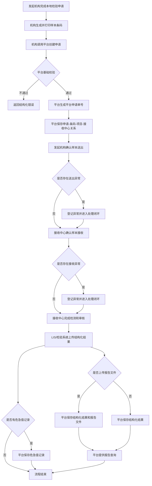
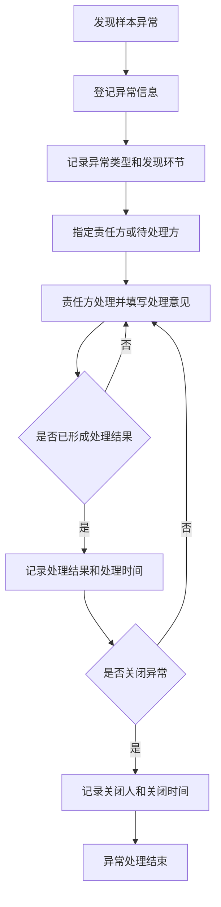

# 检验中心协同平台 - 产品需求文档（PRD_定稿2）

> 版本：定稿2 | 日期：2026-05-18
>
> 状态：定稿草案
>
> 来源：`版本1/PRD_定稿1.md`、`版本2/新需求.txt`、`版本2/讨论稿2`
>
> 说明：本文在 PRD_定稿1 的基础上，根据新一轮内部讨论调整业务边界。凡已转入“内部讨论”或“框架/基础设施”的内容，不在本文中作为当前业务 PRD 的确定交付范围。

---

## 1. 产品概述

### 1.1 背景

紧密型县域医共体建设要求县域内检验资源共享、数据互联互通、结果互认，并形成“基层申请、样本转运、中心检测、平台查询”的协同服务模式。

当前医共体内各成员单位通常存在 HIS/LIS 厂商不一、检验项目编码不统一、条码规则不一致、样本流转过程不透明、报告查询割裂、危急值通知责任边界不清等问题。检验中心协同平台用于连接多机构 HIS/LIS 和多个检验中心，形成区域检验协同主线。

### 1.2 产品定位

检验中心协同平台是面向县域医共体的区域检验协同平台，重点承担以下职责：

- 接收各机构已开立、已确认可送检的检验申请。
- 保存机构自行生成的样本条码，并建立申请、样本、项目、接收中心之间的关系。
- 支撑多中心医院接收申请、样本送出确认、样本接收确认、样本异常登记与处理结果记录。
- 提供申请、样本、报告和危急值记录的查询能力。
- 接收 LIS/检验系统上传的结构化检验结果和可选报告文件。
- 提供平台能力和接口能力，供 HIS、LIS、检验系统和管理端集成。

平台不替代 HIS 医生工作站、收费、医保、退费、LIS 检测执行、仪器原始结果采集、机构本地条码打印、采样规则配置和通用平台框架能力。

### 1.3 建设目标

- 实现跨机构、跨中心的检验申请协同和样本基础流转追踪。
- 支撑机构自生成条码模式下的申请、样本、项目和结果匹配。
- 支持平台页面和接口两种方式完成样本送出、接收、异常登记和查询。
- 兼容两种项目对照模式，降低不同机构和不同中心的接入门槛。
- 为后续完整状态链、明细项目标准化、消息通知中心、危急值闭环等能力预留边界。

---

## 2. 范围边界

### 2.1 本期确定范围

| 模块  | 功能名称                   | 本期范围       |
| ----- | -------------------------- | -------------- |
| A-001 | 跨机构检验申请             | 纳入           |
| A-002 | 机构条码接收与样本关系管理 | 纳入           |
| A-003 | 多中心固定接收中心         | 纳入           |
| A-004 | 样本送出与接收确认         | 纳入           |
| A-005 | 样本异常登记与处理结果闭环 | 纳入           |
| A-006 | 申请、样本、报告查询       | 纳入           |
| A-007 | 检验结果上传与报告查询     | 纳入           |
| A-008 | 危急值记录查询             | 纳入基础记录   |
| A-009 | 项目目录与项目对照兼容     | 纳入兼容边界   |
| A-010 | 权限与审计业务控制点       | 纳入业务控制点 |

### 2.2 暂不展开范围

| 事项                 | 当前处理                                                 |
| -------------------- | -------------------------------------------------------- |
| 样本完整状态链       | 转入内部讨论，不在本期固化为完整状态机                   |
| 标准项目维护维度     | 转入内部讨论，当前只按“大项目管理倾向”描述，不最终定稿 |
| 平台生成条码         | 不纳入，条码由机构自行生成                               |
| 平台条码打印         | 不纳入，由机构系统负责打印                               |
| 采样规则配置         | 搁置，不开发                                             |
| 合管/拆管规则配置    | 搁置，不开发                                             |
| 自动生成采样计划     | 不纳入                                                   |
| 自动审核规则引擎     | 不作为本期确定交付范围                                   |
| 报告主动通知         | 转入内部讨论                                             |
| 危急值主动通知和闭环 | 转入内部讨论，本期只保留危急值记录查询                   |
| 消息通知中心         | 转入内部讨论                                             |
| 室内质控、失控处理   | 转入内部讨论                                             |
| 数据备份与恢复       | 归入框架/基础设施能力                                    |

### 2.3 全局排除范围

- 不提供 HIS 医生工作站界面。
- 不通过 iframe、弹窗、嵌入式 Web 页面接入 HIS。
- 不负责医嘱开立、收费、医保结算、退费。
- 不负责机构本地条码生成、条码打印、打印机配置、标签纸适配。
- 不负责采样规则、合管规则、容器规则、采集量规则的维护和计算。
- 不替代 LIS 完成上机检测、仪器原始结果接收、实验室内部审核和报告生成。
- 不在业务 PRD 中展开账号体系、角色、菜单、按钮、登录认证、系统字典、备份恢复等通用框架能力。
- 不把患者端建设、通知通道建设、外部消息平台建设作为当前无条件定稿范围。

---

## 3. 用户与外部系统

### 3.1 核心用户

| 角色                      | 主要诉求                                                         |
| ------------------------- | ---------------------------------------------------------------- |
| 发起机构医生/业务人员     | 在本机构系统完成申请后，能将申请和条码提交到平台并查询进度和报告 |
| 发起机构送检人员          | 确认哪些样本已送出，处理送出阶段异常                             |
| 接收中心接收人员          | 确认哪些样本已接收，登记接收异常                                 |
| 接收中心 LIS/检验系统人员 | 完成检测、审核、报告生成，并上传结果到平台                       |
| 授权查询人员              | 在平台查询申请、样本、报告和异常处理记录                         |
| 平台管理员/运维人员       | 处理平台接入、权限配置、运行支持和审计查询                       |

### 3.2 外部系统

| 系统                     | 与平台关系                                                 |
| ------------------------ | ---------------------------------------------------------- |
| 发起机构 HIS/检验系统    | 创建申请、生成条码、传入样本信息、确认送出、查询申请/报告  |
| 接收中心 LIS/检验系统    | 接收确认、上传结构化结果、上传可选报告文件、上传危急值记录 |
| 中心项目目录系统或维护端 | 提供或维护中心项目目录和对照关系                           |
| 外部消息平台             | 是否承载报告/危急值通知转入内部讨论                        |
| 患者端                   | 是否建设、如何查询和是否推送转入内部讨论                   |

---

## 4. 业务主流程

### 4.1 主流程图

### 4.2 主流程说明

1. 发起机构在本地 HIS/检验系统中完成检验申请。
2. 发起机构自行生成样本条码并完成本地打印。
3. 发起机构调用平台创建检验申请，提交患者信息、申请机构/科室/医生、接收中心、项目编码、样本信息和条码号。
4. 平台校验必填字段、接收中心、条码唯一性、项目编码可识别性和样本关系完整性。
5. 平台创建平台申请单，返回平台申请单号。
6. 发起机构通过平台页面或接口确认哪些样本已送出。
7. 接收中心通过平台页面或接口确认哪些样本已接收。
8. 样本存在问题时，平台记录异常、责任方、处理意见、处理结果和关闭时间。
9. 接收中心 LIS/检验系统完成检测、审核和报告生成。
10. LIS/检验系统上传结构化检验结果和可选报告文件。
11. 平台提供报告查询、样本查询、异常查询和危急值记录查询。

### 4.3 样本异常处理流程图

样本异常处理涉及责任方、处理意见和关闭记录，单独画出流程。

---

## 5. 功能需求

### 5.1 A-001 跨机构检验申请

#### 功能定位

平台接收发起机构已开立、已确认可送检的检验申请，生成平台申请单号，并保存患者、申请、接收中心、项目、样本条码之间的关系。

#### 平台上完成的操作和功能

- 接收患者信息、就诊信息、申请机构、申请科室、申请医生、接收中心、项目编码、样本信息和条码号。
- 支持一个发起机构向多个中心医院提交申请。
- 支持中心医院之间相互提交申请。
- 每张申请必须明确一个接收中心。
- 平台创建平台申请单，并返回平台申请单号。
- 平台保存机构申请单号、平台申请单号、患者摘要、项目、样本条码和接收中心之间的关系。
- 平台不自动生成样本条码。
- 平台不自动生成采样计划。
- 平台不自动拆管、合管。

#### 平台需要开放的接口能力

- 创建检验申请接口。
- 申请创建结果返回接口能力，包括平台申请单号和错误信息。
- 申请查询接口。

#### 医院系统需要实现的对接能力

- 发起机构系统负责本地医嘱或申请开立。
- 发起机构系统负责生成样本条码并完成打印。
- 发起机构系统调用平台创建申请接口。
- 发起机构系统需保证传入患者、申请、项目、样本和条码信息完整。

#### 关键规则

- 一条平台申请必须归属一个发起机构和一个接收中心。
- 一个平台申请可包含一个或多个大项目。
- 一个平台申请可包含一个或多个样本条码。
- 每个样本条码可关联一个或多个大项目。
- 平台不负责医生开单、收费、医保、退费和本地条码打印。

### 5.2 A-002 条码与样本关系管理

#### 功能定位

在机构自行生成条码的前提下，平台负责保存条码并进行基础校验，保证后续送出、接收、查询、结果上传和报告查询可以基于条码匹配。

#### 平台上完成的操作和功能

- 保存机构传入的样本条码。
- 建立“平台申请单 - 样本条码 - 大项目 - 接收中心”关系。
- 校验条码不能为空。
- 校验同一接收中心范围内条码不可重复绑定到不同申请或不同样本。
- 支持基于条码查询患者、申请、项目、样本和接收中心。
- 记录条码相关接口调用和异常。

#### 平台需要开放的接口能力

- 创建申请时接收条码和样本信息。
- 条码查询接口。
- 条码基础校验错误返回能力。

#### 医院系统需要实现的对接能力

- 机构系统负责条码生成、条码打印、标签格式、打印机连接和打印失败处理。
- 机构系统需保证条码与本地样本一致。
- 机构系统需处理条码打印错误、贴签错误和现场培训。

#### 关键规则

- 平台不强制校验条码前缀、长度、码制和打印格式。
- 平台不负责旧条码作废、新条码重打换码等本地打印管理流程。
- 如果条码已在同一接收中心范围内绑定到其他申请或样本，平台拒绝创建或登记并返回错误。

### 5.3 A-003 多中心固定接收中心

#### 功能定位

平台支持多个中心医院共同接入，申请必须明确接收中心。平台不在当前版本做自动调度。

#### 平台上完成的操作和功能

- 维护或接入中心医院基础信息。
- 创建申请时记录接收中心。
- 查询、送出、接收、结果上传和报告查询均按接收中心归属。
- 支持乡镇医院向任一中心医院提交申请。
- 支持中心医院之间相互提交申请。

#### 平台需要开放的接口能力

- 接收中心目录查询能力。
- 创建申请时接收接收中心编码。
- 按接收中心过滤查询申请、样本和报告。

#### 医院系统需要实现的对接能力

- 发起机构系统在创建申请时明确目标接收中心。
- 接收中心 LIS/检验系统按本中心范围接收样本和上传结果。

#### 关键规则

- 平台当前不做自动分诊、自动调度和按规则分配中心。
- 接收中心决定本次申请的项目编码体系、接收确认、检测结果上传和报告归属。

### 5.4 A-004 项目目录与项目对照兼容

#### 功能定位

平台兼容两种项目对照方式，最终采用哪种方式或是否长期双模式支持，转入内部讨论确定。

#### 平台上完成的操作和功能

- 支持中心项目目录查询或下载。
- 支持机构传中心项目编码。
- 支持机构传本地项目编码，由平台或中心按“发起机构 + 接收中心 + 机构项目编码”转换为目标中心项目编码。
- 保存原始传入项目编码和平台识别后的目标中心项目编码。
- 项目维护维度当前不最终定稿，明细项目标准化暂不展开。

#### 平台需要开放的接口能力

- 基础项目目录查询/下载接口。
- 创建申请接口兼容中心项目编码和机构本地项目编码。
- 申请查询和报告查询返回原始编码及目标中心编码。

#### 医院系统需要实现的对接能力

- 方式一：机构自行维护本地项目到目标中心项目编码的对照，并提交目标中心项目编码。
- 方式二：机构提交本地项目编码，由中心或平台转换。
- 医院系统需保证传入项目编码与本地申请项目一致。

#### 关键规则

- 当前 PRD2 不最终确定唯一项目对照方式。
- 当前倾向简化为大项目管理，明细项目标准化是否建设转入内部讨论。
- 仅维护大项目会影响自动审核、危急值明细识别、结果互认、趋势分析和质控分析。

### 5.5 A-005 样本送出与接收确认

#### 功能定位

平台支持发起机构确认样本送出，接收中心确认样本接收。送出和接收均支持平台页面和接口两种方式。

#### 平台上完成的操作和功能

- 提供待送出样本查询。
- 支持扫码或勾选确认样本送出。
- 支持接口确认样本送出。
- 提供待接收样本查询。
- 支持扫码或勾选确认样本接收。
- 支持接口确认样本接收。
- 记录送出、接收的样本条码、操作时间、操作人或调用系统、发起机构、接收中心和处理结果。
- 对重复送出、重复接收、跨中心误接收、未登记条码等情况进行校验或异常记录。

#### 平台需要开放的接口能力

- 样本送出确认接口。
- 样本接收确认接口。
- 待送出样本查询接口。
- 待接收样本查询接口。

#### 医院系统需要实现的对接能力

- 发起机构系统可调用样本送出确认接口。
- 接收中心 LIS/检验系统可调用样本接收确认接口。
- 系统暂不具备接口能力时，相关人员可在平台页面操作。

#### 关键规则

- 页面操作和接口操作遵守同一套校验规则。
- 送出和接收是当前版本的关键流转节点。
- 是否扩展为完整状态链，转入内部讨论。

### 5.6 A-006 样本异常登记与处理结果闭环

#### 功能定位

平台支持样本异常登记、责任方记录、处理意见记录、处理结果记录和关闭记录。

#### 平台上完成的操作和功能

- 支持在送出、接收、签收、检测前等环节登记样本异常。
- 记录样本条码、申请单号、发现环节、异常类型、异常描述、发现机构、发现人或调用系统、发现时间。
- 支持记录责任方或待处理方。
- 支持记录处理意见、处理结果、处理人、处理时间和关闭时间。
- 支持异常处理记录查询。

#### 平台需要开放的接口能力

- 样本异常登记接口。
- 样本异常处理更新接口。
- 样本异常关闭接口。
- 异常记录查询接口。

#### 医院系统需要实现的对接能力

- 发起机构或接收中心系统可按需要调用异常登记和处理接口。
- 对于补采、退费、重新开单等本地业务，医院系统自行处理。

#### 关键规则

- 平台不自动生成补采任务。
- 平台不修改 HIS 医嘱。
- 平台不处理收费、退费或重新开单。
- 是否需要超时升级、消息通知、审批流、自动补采任务，放入后续版本或内部讨论。

### 5.7 A-007 申请、样本和报告查询

#### 功能定位

平台提供业务常用查询能力，支持平台页面和接口查询。

#### 平台上完成的操作和功能

- 支持按平台申请单号查询患者、项目、样本、送出、接收、异常和报告相关信息。
- 支持按样本条码号查询患者、项目、样本、送出、接收、异常和报告相关信息。
- 支持按患者信息查询相关申请和报告。
- 支持按发起机构、接收中心、申请时间、送出时间、接收时间、样本处理状态、异常处理状态等条件查询。
- 查询结果展示发起机构、接收中心、平台申请单号、机构申请单号、条码号、项目、患者摘要、样本信息、当前处理状态和异常标记。

#### 平台需要开放的接口能力

- 申请查询接口。
- 样本查询接口。
- 报告查询接口。
- 异常记录查询接口。

#### 医院系统需要实现的对接能力

- HIS/LIS/检验系统可按平台申请单号、条码号或患者信息调用查询接口。
- 医院系统需按权限要求展示平台返回的信息。

#### 关键规则

- 查询页面和查询接口都应受权限和数据范围控制。
- 敏感查询和接口调用需记录必要审计。
- TAT 分析、异常率、机构排行、项目统计等暂不作为当前查询范围。

### 5.8 A-008 检验结果上传与报告查询

#### 功能定位

接收中心 LIS/检验系统完成检测后，通过接口上传结构化检验结果和可选报告文件，平台提供报告查询。

#### 平台上完成的操作和功能

- 接收结构化结果明细。
- 保存 LIS 原始结果项编码、名称、结果值、单位、参考范围、异常标记等。
- 保存可选报告文件。
- 支持结构化报告查询。
- 支持按平台申请单号、样本条码号、患者信息查询报告。
- 平台展示最新结果；历史版本、报告更正和撤回规则转内部讨论。

#### 平台需要开放的接口能力

- 检验结果上传接口。
- 可选报告文件上传接口。
- 报告查询接口。

#### 医院系统需要实现的对接能力

- 接收中心 LIS/检验系统负责检测执行、结果审核和报告生成。
- LIS/检验系统上传结构化检验结果。
- LIS/检验系统可上传 PDF、图片、HTML 或其他版式文件。

#### 关键规则

- 当前不强制每个结果明细项映射到平台标准明细项目编码。
- 报告文件为可选，缺失时不阻塞平台结构化报告查询。
- 平台不负责仪器原始结果采集。

### 5.9 A-009 危急值记录查询

#### 功能定位

平台保存 LIS/检验系统上传的危急值标记或危急值事件信息，提供查询和审计。主动通知和完整闭环转内部讨论。

#### 平台上完成的操作和功能

- 保存危急值标记或危急值事件信息。
- 支持危急值记录查询。
- 支持危急值记录审计。
- 支持关联申请、患者、样本、项目和报告查看。

#### 平台需要开放的接口能力

- 危急值记录上传或同步接口。
- 危急值记录查询接口。

#### 医院系统需要实现的对接能力

- LIS/检验系统如需在平台留存危急值记录，需上传危急值标记或危急值事件信息。
- 危急值通知、确认、处理闭环如由医院本地系统承担，医院系统自行保证闭环。

#### 关键规则

- 平台当前不直接定稿危急值通知通道、通知对象、确认人、升级策略和闭环统计。
- 报告发布通知、危急值主动通知、通知回执、超时升级和消息中心建设继续放入内部讨论。

### 5.10 A-010 权限与审计业务控制点

#### 功能定位

本 PRD 只定义检验协同业务权限控制点和审计要求，不展开账号、角色、菜单、按钮、登录认证等通用框架能力。

#### 平台上完成的操作和功能

- 对申请创建、样本送出、样本接收、异常处理、结果上传、报告查询、危急值查询等业务动作进行权限控制。
- 对关键写操作、敏感查询、下载、打印、页面操作和 API 调用记录审计。
- 审计日志记录关键字段、摘要、结果和 Trace ID/Request ID。
- 敏感字段脱敏或摘要化。

#### 平台需要开放的接口能力

- 接口鉴权能力。
- API 调用审计能力。
- 审计查询能力。

#### 医院系统需要实现的对接能力

- 医院系统调用平台接口时需按平台要求完成系统身份识别和鉴权。
- 医院系统需保存本地操作人与平台接口调用之间的可追溯关系。

#### 关键规则

- 具体角色、菜单、按钮权限由框架权限配置实现。
- 审计日志业务上不可修改、不可删除。

---

## 6. 平台开放接口清单

| 序号 | 接口                      | 说明                                                                       |
| ---- | ------------------------- | -------------------------------------------------------------------------- |
| 1    | 创建检验申请接口          | 接收患者、申请机构/科室/医生、接收中心、项目、样本、条码，返回平台申请单号 |
| 2    | 查询申请/样本/报告接口    | 支持按申请单号、条码号、患者信息、机构、接收中心等条件查询                 |
| 3    | 样本送出确认接口          | 发起机构或其系统确认哪些样本已送出                                         |
| 4    | 样本接收确认接口          | 接收中心或其 LIS/检验系统确认哪些样本已接收                                |
| 5    | 样本异常登记/处理接口     | 登记异常、更新处理意见、记录处理结果、关闭异常                             |
| 6    | 检验结果上传接口          | 接收中心 LIS/检验系统上传结构化检验结果和可选报告文件                      |
| 7    | 危急值记录上传或同步接口  | LIS/检验系统上传危急值标记或危急值事件信息                                 |
| 8    | 基础项目目录查询/下载接口 | 支持机构查询或下载中心项目目录，兼容两种项目对照模式                       |

---

## 7. 医院系统需实现的对接能力

| 序号 | 对接能力                                                         | 责任系统              |
| ---- | ---------------------------------------------------------------- | --------------------- |
| 1    | 生成样本条码并完成本地打印                                       | 发起机构 HIS/检验系统 |
| 2    | 创建申请时传患者、申请、接收中心、项目、样本、条码               | 发起机构 HIS/检验系统 |
| 3    | 维护本地项目与中心项目的对照，或按要求传本地编码                 | 发起机构 HIS/检验系统 |
| 4    | 调用样本送出确认接口，或支持人员在平台页面确认                   | 发起机构 HIS/检验系统 |
| 5    | 调用样本接收确认接口，或支持人员在平台页面确认                   | 接收中心 LIS/检验系统 |
| 6    | 上传结构化检验结果和可选报告文件                                 | 接收中心 LIS/检验系统 |
| 7    | 上传危急值标记或危急值事件信息                                   | 接收中心 LIS/检验系统 |
| 8    | 处理本地条码打印错误、贴签错误、项目映射错误、接口重试和本地培训 | 各医院系统及实施方    |

---

## 8. 关键数据对象

| 对象                | 说明                                 |
| ------------------- | ------------------------------------ |
| Patient             | 患者档案或患者摘要信息               |
| Visit/Encounter     | 就诊记录，表示患者在某机构的一次就诊 |
| Order               | 平台检验申请，承接机构已开立申请     |
| SourceOrder         | 机构本地申请或医嘱标识               |
| ReceivingCenter     | 接收中心医院                         |
| Specimen            | 样本信息，由机构创建申请时传入       |
| SpecimenBarcode     | 机构生成的样本条码                   |
| TestItem            | 大项目或中心项目目录项               |
| ItemMapping         | 机构项目编码与中心项目编码对照关系   |
| SendRecord          | 样本送出记录                         |
| ReceiveRecord       | 样本接收记录                         |
| ExceptionRecord     | 样本异常及处理记录                   |
| Result              | LIS/检验系统上传的结构化结果         |
| Report              | 报告数据和可选报告文件               |
| CriticalValueRecord | 危急值标记或危急值事件记录           |
| AuditLog            | 审计日志                             |

---

## 9. 非功能要求

### 9.1 安全与合规

- 平台应满足医疗数据安全、访问控制、日志审计和敏感信息脱敏要求。
- 关键业务操作必须可追溯。
- 敏感查询、下载、打印和 API 调用必须审计。
- 患者敏感信息在日志中应脱敏或摘要化。

### 9.2 可用性

- 平台应保证检验申请创建、样本送出确认、样本接收确认、报告查询等高频操作具备稳定响应。
- 接口失败应返回结构化错误信息，便于 HIS/LIS/检验系统修正后重试。
- 平台页面和接口能力需并行支持，适配不同机构的对接成熟度。

### 9.3 可追溯性

- 申请、样本条码、送出、接收、异常、结果、报告、危急值记录和审计均应记录来源、时间、操作人/系统和结果。
- 平台需保留机构原始项目编码、目标中心项目编码和结果原始明细信息，便于后续追溯。

### 9.4 可扩展性

- 平台应预留完整状态链、明细项目标准化、报告通知、危急值闭环、消息通知中心、统计分析、质控管理等后续能力边界。
- 当前业务 PRD 不承诺所有扩展能力在本期实现。

---

## 10. 验收要点

### 10.1 申请与条码

- 发起机构可创建平台申请，并获得平台申请单号。
- 创建申请时可同时提交多个样本条码。
- 每个样本条码可关联一个或多个大项目。
- 平台不生成条码，不生成采样计划，不做拆管/合管计算。
- 条码为空或同一接收中心范围内重复绑定时，平台拒绝创建或返回结构化错误。

### 10.2 多中心与项目对照

- 每张申请必须明确接收中心。
- 乡镇医院可向任一中心医院提交申请。
- 中心医院之间可相互提交申请。
- 平台兼容机构传中心项目编码和机构传本地项目编码两种模式。
- 平台可提供中心项目目录查询或下载能力。

### 10.3 样本送出、接收与异常

- 发起机构可通过平台页面或接口确认样本送出。
- 接收中心可通过平台页面或接口确认样本接收。
- 平台可记录送出和接收的操作人/系统、时间、机构、接收中心和处理结果。
- 平台可登记样本异常，并记录处理意见、处理结果和关闭时间。
- 平台不自动生成补采任务，不修改 HIS 医嘱，不处理收费退费。

### 10.4 查询、结果和报告

- 平台支持按平台申请单号、样本条码号、患者信息、机构、接收中心等条件查询。
- LIS/检验系统可上传结构化结果。
- 报告文件为可选，缺少报告文件时不阻塞结构化报告查询。
- 平台可保存并查询危急值标记或危急值事件记录。

### 10.5 权限与审计

- 关键业务动作可按机构/数据范围控制。
- 申请创建、样本送出、样本接收、异常处理、结果上传、报告查询、危急值查询和 API 调用有审计记录。
- 审计日志业务上不可修改、不可删除。

---

## 11. 假设与约束

### 11.1 假设

- 医共体内成员单位愿意配合 HIS/LIS/检验系统接口改造。
- 发起机构具备生成样本条码并完成本地打印的能力。
- 接收中心 LIS/检验系统可提供结构化检验结果。
- 多中心医院的接收中心目录和基础信息可明确维护。
- 各机构可按项目对照方案配合传入中心项目编码或本地项目编码。

### 11.2 约束

- 不同机构 HIS/LIS 接口能力差异会影响落地方式。
- 条码规则和打印质量由机构侧负责，平台只做基础校验。
- 报告版式文件依赖 LIS/报告系统能力，当前不作为必填。
- 标准项目维护维度、样本完整状态链、报告通知、危急值闭环、消息通知中心仍需内部讨论。
- 权限、账号、菜单、系统字典、备份恢复等通用能力由平台框架提供，本 PRD 不重复展开。

---

## 12. 待内部讨论事项

- 检验项目对照方式最终采用哪种模式，或是否长期支持双模式。
- 样本流转深度是仅保留关键节点，还是建设完整状态链。
- 标准项目维护维度是否只维护大项目，以及何时扩展明细项目标准化。
- 报告发布通知、危急值主动通知、通知回执、超时升级和消息中心建设方案。
- 报告历史版本、结果更正、报告撤回和危急值触发边界。
- 自动审核规则引擎是否纳入后续版本，以及在明细项目未标准化前如何实现。
- 室内质控、失控处理、统计分析等质量管理能力的后续范围。

---

## 附录 A. 术语表

| 术语         | 说明                                                         |
| ------------ | ------------------------------------------------------------ |
| HIS          | 医院信息系统                                                 |
| LIS          | 实验室信息系统                                               |
| EMPI         | 企业级患者主索引，用于跨系统识别同一患者                     |
| 接收中心     | 本次申请指定的中心医院或检验中心                             |
| 发起机构     | 提交检验申请并送出样本的机构                                 |
| 平台申请单号 | 平台创建申请后返回的唯一标识                                 |
| 机构申请单号 | 发起机构本地 HIS/检验系统中的申请标识                        |
| 样本条码     | 由机构自行生成并传给平台的样本标识                           |
| 大项目       | 当前申请维度的检验项目，如血常规、尿常规、肝功四项、凝血四项 |
| 明细项目     | 大项目内部的具体结果项，如凝血酶原时间、纤维蛋白原定量       |
| 危急值记录   | LIS/检验系统上传到平台的危急值标记或事件信息                 |
