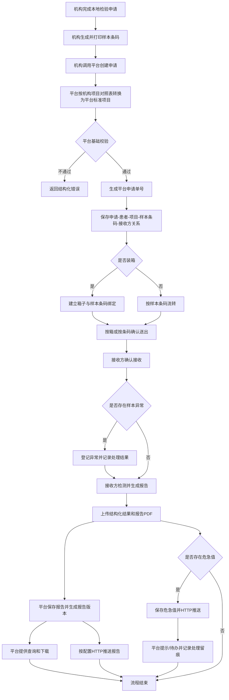
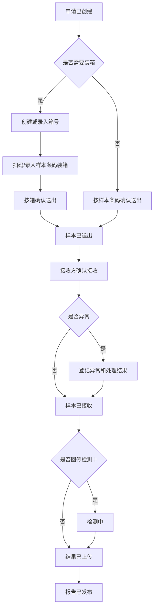
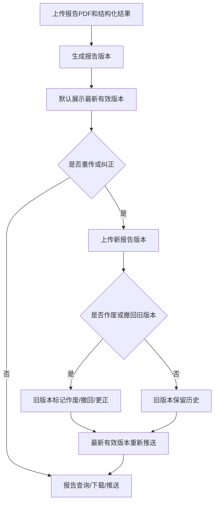
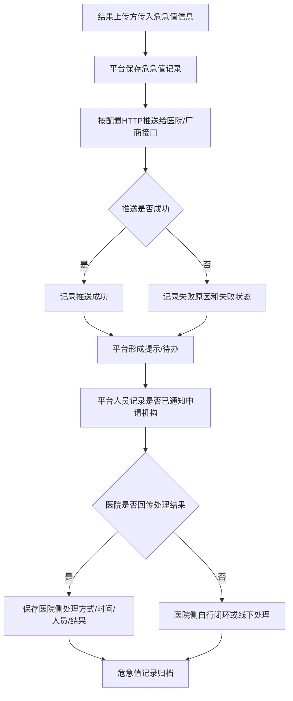

# 检验中心协同平台 - 产品需求文档（PRD_定稿3）

> 版本：定稿3 | 日期：2026-05-19
>
> 状态：定稿草案
>
> 来源：`版本1/PRD_定稿1.md`、`版本2/PRD_定稿2.md`、`版本3/汇总`、`版本3/需求`、`版本3/讨论稿3`
>
> 说明：本文在 PRD_定稿2 的基础上，根据第三轮内部讨论进一步收敛范围。凡已明确归入框架、基础设施或不开发的内容，不在本文中作为检验协同业务 PRD 的交付范围。

---

## 1. 产品概述

### 1.1 背景

紧密型县域医共体建设要求县域内检验资源共享、数据互联互通、结果互认，并形成“机构申请、样本流转、中心检测、报告推送与查询”的协同服务模式。

当前医共体内各机构通常存在 HIS/LIS 厂商不一、项目编码不统一、样本流转节点不透明、报告查询割裂、报告与危急值通知责任边界不清等问题。检验中心协同平台用于连接中心与各机构系统，统一承接检验协同流程中的申请、样本、项目、结果、报告和危急值记录。

### 1.2 产品定位

检验中心协同平台是面向县域医共体的区域检验协同平台，重点承担以下职责：

- 接收各机构已开立、已确认可送检的检验申请。
- 保存机构自行生成的样本条码，并建立申请、样本、项目、接收方之间的关系。
- 维护平台标准项目、小项目与大项目组合关系，以及机构项目到平台标准项目的对照关系。
- 支撑样本装箱、送出、接收、状态记录和异常处理。
- 接收结果上传方上传的结构化结果、报告 PDF、危急值标记和相关异常信息。
- 提供报告查询、下载、重传纠正、HTTP 推送和危急值平台侧处理留痕。
- 提供平台页面能力和接口能力，供 HIS、LIS、检验系统、管理端和厂商系统集成。

平台不替代 HIS 医生工作站、收费、医保、退费、LIS 检测执行、仪器原始结果采集、机构本地条码打印、临床处置闭环和通用平台框架能力。

### 1.3 建设目标

- 实现机构之间、机构与中心之间的检验申请协同和样本流转追踪。
- 支撑机构自生成条码模式下的申请、样本、项目和结果匹配。
- 通过平台项目对照表兼容机构传平台编码和机构传本地编码两种接入方式。
- 支持完整样本流转记录，同时允许部分节点按机构实际流程跳过。
- 建立报告查询、下载、推送、版本追溯和更正能力。
- 建立危急值记录、HTTP 推送、平台侧提示/待办和处理留痕能力。

---

## 2. 范围边界

### 2.1 本期确定范围

| 模块  | 功能名称                       | 本期范围 |
| ----- | ------------------------------ | -------- |
| A-001 | 跨机构检验申请                 | 纳入     |
| A-002 | 机构条码接收与样本关系管理     | 纳入     |
| A-003 | 机构与中心流转关系             | 纳入     |
| A-004 | 标准项目与机构项目对照         | 纳入     |
| A-005 | 样本状态流转、装箱、送出、接收 | 纳入     |
| A-006 | 样本异常登记与处理记录         | 纳入     |
| A-007 | 申请、样本、报告查询           | 纳入     |
| A-008 | 检验结果上传与报告管理         | 纳入     |
| A-009 | 报告与危急值 HTTP 推送         | 纳入     |
| A-010 | 危急值记录与平台侧处理留痕     | 纳入     |
| A-011 | 机构默认申请目标与机构导出     | 纳入     |
| A-012 | 业务审计控制点                 | 纳入     |

### 2.2 不开发或不在本 PRD 展开范围

| 事项                         | 当前处理                                      |
| ---------------------------- | --------------------------------------------- |
| 平台生成条码                 | 不开发，条码由机构系统生成                    |
| 平台条码打印                 | 不开发，标签打印由机构系统负责                |
| 采样计划                     | 不开发，机构侧自行处理采样与条码关系          |
| 样本采集规则与合管规则配置   | 不开发，包括采样规则、容器规则、合管/拆管规则 |
| 自动审核规则引擎             | 不开发，平台不审核结果                        |
| 结果审核与人工干预           | 不开发，结果判断由上传方完成                  |
| 消息通知中心                 | 不开发，报告和危急值采用 HTTP 接口推送        |
| 数据备份与恢复               | 归入框架/基础设施能力                         |
| 登录认证、用户权限、系统字典 | 归入框架设计，本 PRD 只描述业务控制点         |
| 接口幂等                     | 由框架或接口基础能力处理，本 PRD 不展开       |
| 重复申请判断                 | 由机构系统自行判断，平台不拦截                |
| 项目与患者基本信息冲突校验   | 由医院系统自行处理，平台不校验                |
| 住院病区、床号等通知定位信息 | 不传递、不作为本期字段要求                    |
| 运输时限、冷链温度、物流轨迹 | 不在平台管理                                  |
| 室内质控、失控处理           | 不纳入本期 PRD                                |

### 2.3 全局排除范围

- 不提供 HIS 医生工作站界面。
- 不通过 iframe、弹窗、嵌入式 Web 页面接入 HIS。
- 不负责医嘱开立、收费、医保结算、退费。
- 不负责机构本地条码生成、条码打印、打印机配置、标签纸适配。
- 不负责采样规则、合管规则、容器规则、采集量规则的维护和计算。
- 不替代 LIS 完成上机检测、仪器原始结果接收、实验室内部审核和报告生成。
- 不判断结果高低、参考范围、值域、异常情况和是否危急值。
- 不在业务 PRD 中展开账号体系、角色、菜单、按钮、登录认证、系统字典、备份恢复等通用框架能力。

---

## 3. 用户与外部系统

### 3.1 核心用户

| 角色                   | 主要诉求                                                       |
| ---------------------- | -------------------------------------------------------------- |
| 发起机构医生/业务人员  | 在本机构系统完成申请后，将申请和条码提交到平台并查询进度和报告 |
| 发起机构送检人员       | 完成样本装箱、送出确认和送出阶段异常记录                       |
| 接收机构/中心接收人员  | 完成样本接收、异常登记和接收记录查询                           |
| 接收机构/中心 LIS 人员 | 完成检测、报告生成，并上传结果、报告 PDF 和危急值信息          |
| 授权查询人员           | 在平台查询申请、样本、报告、异常和危急值处理记录               |
| 平台管理员/运维人员    | 维护机构配置、项目对照、推送接口配置、机构导出和审计查询       |

### 3.2 外部系统

| 系统                       | 与平台关系                                                       |
| -------------------------- | ---------------------------------------------------------------- |
| 发起机构 HIS/检验系统      | 创建申请、生成条码、传入样本信息、确认送出、查询申请/报告        |
| 接收机构/中心 LIS/检验系统 | 接收样本、上传结构化结果、上传报告 PDF、上传危急值记录           |
| 医院或厂商接收接口         | 接收平台推送的报告、危急值或更正通知                             |
| 平台框架                   | 承载登录认证、权限、菜单、系统字典、审计底座、备份恢复等通用能力 |

---

## 4. 业务主流程

### 4.1 主流程图

### 4.2 主流程说明

1. 机构在本地 HIS/检验系统中完成检验申请。
2. 机构系统自行生成样本条码并完成本地打印。
3. 机构调用平台创建检验申请，提交患者信息、申请机构/科室/医生、接收方、项目编码、样本信息和条码号。
4. 平台所有申请均通过项目对照表获取平台标准项目编码。
5. 平台校验必填字段、接收方、机构可提交目标范围、条码唯一性、项目对照关系和样本关系完整性。
6. 平台创建申请并返回平台申请单号。
7. 样本可先装箱再送出，也可不装箱直接按条码送出。
8. 接收方确认样本接收，必要时登记异常。
9. 接收方完成检测并上传结构化结果、报告 PDF、异常标记、参考范围、值域、危急值等信息。
10. 平台保存报告，默认展示最新有效版本，并按配置推送报告或危急值。
11. 平台提供申请、样本、箱子、报告、危急值和异常处理记录查询。

### 4.3 样本流转与装箱流程图

### 4.4 报告重传与纠正流程图

### 4.5 危急值处理流程图

---

## 5. 功能需求

### 5.1 A-001 跨机构检验申请

#### 功能定位

平台接收机构已开立、已确认可送检的检验申请，生成平台申请单号，并保存患者、申请、接收方、项目、样本条码之间的关系。

#### 平台负责

- 接收患者摘要信息、就诊信息、申请机构、申请科室、申请医生、接收方、项目编码、样本信息和条码号。
- 支持任意机构向允许范围内的其他机构或中心提交申请。
- 创建平台申请单并返回平台申请单号。
- 保存机构申请单号、平台申请单号、患者摘要、项目、样本条码和接收方关系。
- 创建申请时应用机构项目对照表，将传入编码转换为平台标准项目编码。
- 未传接收方时，可使用发起机构默认接收方。

#### 关键规则

- 一条平台申请必须归属一个发起机构和一个接收方。
- 一个平台申请可包含一个或多个大项目。
- 一个平台申请可包含一个或多个样本条码。
- 每个样本条码可关联一个或多个大项目。
- 平台不生成样本条码、不生成采样计划、不自动拆管或合管。
- 平台不基于患者、项目和时间窗口判断重复申请。
- 平台不校验项目与患者性别、年龄、病区、床号等信息冲突。

### 5.2 A-002 条码与样本关系管理

#### 功能定位

在机构自行生成条码的前提下，平台负责保存条码并进行基础校验，保证后续装箱、送出、接收、查询、结果上传和报告查询可以基于条码匹配。

#### 平台负责

- 保存机构传入的样本条码。
- 建立“平台申请单 - 样本条码 - 大项目 - 接收方”关系。
- 校验条码不能为空。
- 校验同一接收方范围内条码不可重复绑定到不同申请或不同样本。
- 支持基于条码查询患者、申请、项目、样本、箱子、接收方和状态。
- 记录条码相关接口调用和异常。

#### 关键规则

- 平台不强制校验条码前缀、长度、码制和打印格式。
- 平台不负责旧条码作废、新条码重打换码等本地打印管理流程。
- 条码打印错误、格式不一致、贴签错误由机构侧负责。

### 5.3 A-003 机构与中心流转关系

#### 功能定位

平台支持一个中心与多个机构共同接入，其他均视为机构。任意机构之间、机构与中心之间可在允许关系内发起检验申请和样本流转。

#### 平台负责

- 维护机构基础信息和中心标识。
- 维护机构默认接收方。
- 维护机构允许提交的目标机构范围。
- 创建申请时记录最终接收方。
- 查询、装箱、送出、接收、结果上传、报告查询和推送均按发起机构、接收方归属。

#### 关键规则

- 平台当前不做自动分诊、自动调度和按规则分配接收方。
- 创建申请接口未传接收方时，平台使用发起机构默认接收方。
- 创建申请接口明确传入接收方时，以接口传入值为准，但必须在允许目标范围内。
- 未配置默认接收方且接口未传接收方时，平台拒绝创建申请。

### 5.4 A-004 标准项目与机构项目对照

#### 功能定位

平台维护标准项目体系和机构项目对照关系，兼容机构传平台标准编码和机构传本地项目编码两种模式。

#### 平台负责

- 维护平台标准小项目。
- 维护大项目与小项目的组合关系。
- 申请时仅申请大项目。
- 维护机构项目编码与平台标准项目编码的对照表。
- 支持 A -> A 对照：机构申请时直接传平台标准编码，仍通过对照表得到平台标准编码。
- 支持 B -> A 对照：机构申请时传机构本地编码，平台通过对照表得到平台标准编码。
- 保存机构原始传入项目编码和平台识别后的标准项目编码。
- 提供标准项目目录和对照关系查询能力。

#### 关键规则

- 所有申请均必须经过项目对照表。
- 如果申请机构未维护对应对照关系，平台拒绝创建申请。
- 错误码和接口错误结构属于具体实现，不在本 PRD 过度展开。
- 平台标准项目维护小项目，并通过小项目组成大项目；但申请侧仍按大项目申请。
- 结果明细中的高低、参考范围、值域、异常情况和是否危急值由上传方直接传入，平台不维护、不计算。

### 5.5 A-005 样本状态流转、装箱、送出、接收

#### 功能定位

平台记录样本完整流转过程，同时允许部分状态节点按机构实际流程跳过。平台支持装箱能力，但不强制所有样本必须装箱。

#### 平台负责

- 支持样本状态主链：申请已创建、样本已送出、样本已接收、结果已上传、报告已发布。
- 支持可选补充状态：已装箱、检测中、异常处理中、报告已推送。
- 支持创建或录入箱号，建立箱子与样本条码绑定关系。
- 支持按箱送出，箱内样本同步形成送出记录。
- 支持不装箱，直接按样本条码送出。
- 支持接收方按箱或按条码确认接收。
- 支持按申请、条码、箱号查询流转状态。

#### 关键规则

- 已装箱不是创建申请、送出或接收的强制前置条件。
- 检测中状态可由 LIS 回传；未回传时不影响结果上传。
- 状态可以不严格按完整流程逐个推进，允许按实际业务跳过可选节点。
- 状态跳转需记录来源、时间、操作人或调用系统、处理结果。
- 平台只记录箱子与条码的业务绑定关系，不负责物理箱采购、箱码标签打印、冷链设备管理和物流轨迹硬件采集。

### 5.6 A-006 样本异常登记与处理记录

#### 功能定位

平台支持样本异常登记、责任方记录、处理意见记录、处理结果记录和关闭记录。

#### 平台负责

- 支持在装箱、送出、接收、检测前等环节登记样本异常。
- 记录样本条码、申请单号、箱号、发现环节、异常类型、异常描述、发现机构、发现人或调用系统、发现时间。
- 支持记录责任方或待处理方。
- 支持记录处理意见、处理结果、处理人、处理时间和关闭时间。
- 支持异常处理记录查询。

#### 关键规则

- 平台不自动生成补采任务。
- 平台不修改 HIS 医嘱。
- 平台不处理收费、退费或重新开单。
- 装箱错误、漏装、多装、跨机构误装、条码无法识别、样本未收到、样本破损、容器不符等均通过异常登记处理。
- 异常是否阻断后续流转，由业务操作人员或接收方判断。

### 5.7 A-007 申请、样本和报告查询

#### 功能定位

平台提供业务常用查询能力，支持平台页面和接口查询。

#### 平台负责

- 支持按平台申请单号查询患者、项目、样本、箱子、送出、接收、异常和报告相关信息。
- 支持按机构申请单号查询申请和流转信息。
- 支持按样本条码查询患者、项目、样本、箱子、状态、异常和报告。
- 支持按患者信息查询相关申请和报告。
- 支持按发起机构、接收方、申请时间、送出时间、接收时间、样本状态、异常状态、报告状态等条件查询。
- 支持报告查询、下载和版本追溯。

#### 关键规则

- 查询页面和查询接口都应受权限和数据范围控制。
- 敏感查询、下载和接口调用需记录审计。
- TAT 分析、异常率、机构排行、项目统计等不作为当前查询范围。

### 5.8 A-008 检验结果上传与报告管理

#### 功能定位

接收方 LIS/检验系统完成检测后，通过接口上传结构化检验结果和报告 PDF。平台保存报告、提供查询下载，并支持报告重传和纠正。

#### 平台负责

- 接收结构化结果明细。
- 接收报告 PDF 文件，报告 PDF 为必传。
- 保存 LIS 原始结果项编码、名称、结果值、单位、参考范围、值域、异常标记、是否危急值等上传内容。
- 支持按平台申请单号、样本条码号、患者信息查询报告。
- 支持报告下载。
- 支持报告版本管理。
- 支持报告重传和纠正。
- 支持报告更正后重新推送。

#### 关键规则

- 平台不判断报告内容是否医学正确。
- 平台不审核结果高低、异常、危急值等医学结论。
- 每次报告重传或纠正均生成新的报告版本，不直接物理覆盖旧报告。
- 默认展示最新有效版本。
- 历史版本保留，用于审计、追溯和问题排查。
- 如果上传方明确传入作废、撤回或更正标记，平台将对应旧版本标记为已作废、已撤回或已更正，不物理删除。

### 5.9 A-009 报告与危急值 HTTP 推送

#### 功能定位

平台通过 HTTP 请求方式，将报告发布、报告更正、危急值等信息推送给已配置的医院或系统厂商接收接口。

#### 平台负责

- 定义统一推送数据格式。
- 支持为医院或系统厂商配置一个或多个 HTTP 接收接口。
- 报告发布后，按配置推送报告信息。
- 报告更正后，按配置再次推送最新有效版本。
- 危急值产生后，按配置推送危急值信息。
- 记录推送时间、推送地址、推送内容摘要、返回结果、失败原因和重试情况。

#### 关键规则

- 每个医院或系统厂商需提供可接收平台数据格式的接口。
- 平台不建设消息通知中心。
- HTTP 推送是报告和危急值通知的主要系统集成方式。
- 推送失败不影响平台内报告查询和危急值记录保存。
- 具体重试策略、错误码和签名机制可在接口设计中细化。

### 5.10 A-010 危急值记录与平台侧处理留痕

#### 功能定位

平台保存上传方传入的危急值信息，进行 HTTP 推送，并在平台侧形成提示/待办和处理留痕。平台不替代医院临床处置闭环。

#### 平台负责

- 接收上传方传入的危急值标记或危急值事件信息。
- 保存危急值关联的申请、患者、样本、项目、报告、结果值、参考范围和上传方信息。
- 触发 HTTP 推送。
- 在平台内形成危急值提示或待办。
- 支持平台管理人员、中心人员或有权限人员记录是否已通知申请机构、通知方式、处理人、处理时间和备注。
- 支持接收医院系统回传的危急值处理方式、处理时间、处理人或处理结果。
- 支持危急值记录查询和审计。

#### 关键规则

- 危急值由结果上传方传入，平台不自行计算和判断。
- 平台不维护危急值规则、不计算危急值阈值、不判断是否危急。
- 平台侧处理不是对患者进行临床处置，而是记录通知和协同处理过程。
- 如果医院系统不回传临床处理结果，医院侧真实危急值处置闭环由医院系统或线下制度自行保证。
- 平台不负责确定临床接收医生、护士站、主管医生或病区人员。

### 5.11 A-011 机构默认申请目标与机构导出

#### 功能定位

平台支持机构默认接收方配置和机构基础信息导出，支撑机构系统接入、厂商联调和内部核对。

#### 平台负责

- 支持为每个机构配置默认接收方。
- 支持维护机构允许提交目标范围。
- 支持查询机构可提交的目标机构范围。
- 支持导出机构基础信息。
- 导出内容包括机构编码、机构名称、机构类型、启用状态、默认接收方、允许提交目标机构列表、接口接入标识等。
- 记录导出人、导出时间、导出条件和导出结果。

#### 关键规则

- 机构导出不包含患者信息、检验申请、样本条码、检验结果、报告、危急值等业务数据。
- 机构导出用于主数据核对和接口对接，不作为业务统计报表。
- 是否支持机构导入、批量更新、审批发布等能力，不在本次 PRD3 中展开。

### 5.12 A-012 业务审计控制点

#### 功能定位

本 PRD 只定义检验协同业务审计控制点，不展开账号、角色、菜单、按钮、登录认证等通用框架能力。

#### 平台负责

- 对申请创建、项目对照、样本装箱、样本送出、样本接收、异常处理、结果上传、报告上传、报告重传、报告下载、报告推送、危急值处理、机构导出等关键操作记录审计。
- 审计日志记录操作对象、操作时间、操作人或调用系统、来源 IP、请求标识、处理结果和失败原因。
- 敏感字段脱敏或摘要化。

#### 关键规则

- 具体角色、菜单、按钮权限由框架权限配置实现。
- 审计日志业务上不可修改、不可删除。
- 登录认证方式由框架处理，本 PRD 不讨论。

---

## 6. 平台开放接口清单

| 序号 | 接口                   | 说明                                                                     |
| ---- | ---------------------- | ------------------------------------------------------------------------ |
| 1    | 创建检验申请接口       | 接收患者、申请机构/科室/医生、接收方、项目、样本、条码，返回平台申请单号 |
| 2    | 项目目录与对照查询接口 | 查询平台标准项目、机构项目对照和可用大项目                               |
| 3    | 机构目标范围查询接口   | 查询机构默认接收方和允许提交目标机构范围                                 |
| 4    | 查询申请/样本/报告接口 | 支持按申请单号、条码号、患者信息、机构、接收方等条件查询                 |
| 5    | 样本装箱接口           | 创建或录入箱号，绑定箱子与样本条码                                       |
| 6    | 样本送出确认接口       | 发起机构或其系统确认样本送出，支持按箱或按条码                           |
| 7    | 样本接收确认接口       | 接收方或其系统确认样本接收，支持按箱或按条码                             |
| 8    | 样本异常登记/处理接口  | 登记异常、更新处理意见、记录处理结果、关闭异常                           |
| 9    | 检验结果与报告上传接口 | 上传结构化结果、报告 PDF、异常标记和危急值信息                           |
| 10   | 报告重传/纠正接口      | 上传新报告版本，记录更正、作废或撤回信息                                 |
| 11   | 报告查询/下载接口      | 查询和下载最新有效报告，支持必要的版本追溯                               |
| 12   | 危急值记录与处理接口   | 上传、查询危急值，回传医院侧处理结果                                     |
| 13   | HTTP 推送接收配置      | 配置医院或厂商接收报告、危急值和更正信息的接口地址                       |
| 14   | 机构导出接口/页面      | 导出机构主数据和对接配置，不导出业务数据                                 |

---

## 7. 医院系统需实现的对接能力

| 序号 | 对接能力                                                         | 责任系统              |
| ---- | ---------------------------------------------------------------- | --------------------- |
| 1    | 生成样本条码并完成本地打印                                       | 发起机构 HIS/检验系统 |
| 2    | 创建申请时传患者、申请、接收方、项目、样本、条码                 | 发起机构 HIS/检验系统 |
| 3    | 配合维护机构项目编码到平台标准项目编码的对照关系                 | 各机构系统及实施方    |
| 4    | 调用样本装箱、送出确认接口，或支持人员在平台页面操作             | 发起机构 HIS/检验系统 |
| 5    | 调用样本接收确认接口，或支持人员在平台页面操作                   | 接收方 LIS/检验系统   |
| 6    | 上传结构化检验结果和报告 PDF                                     | 接收方 LIS/检验系统   |
| 7    | 上传结果高低、参考范围、值域、异常情况和是否危急值               | 接收方 LIS/检验系统   |
| 8    | 支持报告重传、纠正、作废或撤回信息上传                           | 接收方 LIS/检验系统   |
| 9    | 提供 HTTP 接收接口，用于接收报告和危急值推送                     | 医院系统或厂商系统    |
| 10   | 如需闭环回传，调用危急值处理结果回传接口                         | 医院系统              |
| 11   | 处理本地条码打印错误、贴签错误、项目映射错误、接口重试和本地培训 | 各医院系统及实施方    |

---

## 8. 关键数据对象

| 对象                      | 说明                                   |
| ------------------------- | -------------------------------------- |
| Organization              | 机构或中心基础信息                     |
| OrganizationTargetConfig  | 机构默认接收方和允许提交目标范围       |
| Patient                   | 患者摘要信息                           |
| Visit/Encounter           | 就诊记录或就诊摘要                     |
| Order                     | 平台检验申请                           |
| SourceOrder               | 机构本地申请或医嘱标识                 |
| Specimen                  | 样本信息，由机构创建申请时传入         |
| SpecimenBarcode           | 机构生成的样本条码                     |
| TransportBox              | 转运箱/样本箱，与样本条码绑定          |
| StandardSubItem           | 平台标准小项目                         |
| StandardPackageItem       | 由小项目组成的大项目，申请侧使用       |
| ItemMapping               | 机构项目编码与平台标准项目编码对照关系 |
| SendRecord                | 样本送出记录                           |
| ReceiveRecord             | 样本接收记录                           |
| ExceptionRecord           | 样本异常及处理记录                     |
| Result                    | 上传方上传的结构化结果                 |
| Report                    | 报告数据、PDF 文件和版本信息           |
| ReportPushRecord          | 报告 HTTP 推送记录                     |
| CriticalValueRecord       | 危急值标记或危急值事件记录             |
| CriticalValueHandleRecord | 平台侧处理记录和医院侧回传记录         |
| AuditLog                  | 业务审计日志                           |

---

## 9. 非功能要求

### 9.1 安全与合规

- 平台应满足医疗数据安全、访问控制、日志审计和敏感信息脱敏要求。
- 关键业务操作必须可追溯。
- 敏感查询、下载、导出和 API 调用必须审计。
- 患者敏感信息在日志中应脱敏或摘要化。

### 9.2 可用性

- 平台应保证申请创建、样本装箱、样本送出、样本接收、报告查询、报告下载等高频操作具备稳定响应。
- 接口失败应返回结构化错误信息，便于 HIS/LIS/检验系统修正后重试。
- 平台页面和接口能力需并行支持，适配不同机构的对接成熟度。

### 9.3 可追溯性

- 申请、项目对照、样本条码、箱子、送出、接收、异常、结果、报告、报告版本、推送、危急值记录和审计均应记录来源、时间、操作人或系统和结果。
- 平台需保留机构原始项目编码、平台标准项目编码、结果原始明细信息和报告历史版本，便于后续追溯。

### 9.4 可扩展性

- 平台应预留后续统计分析、质控管理、更多推送策略、机构配置扩展等能力边界。
- 当前业务 PRD 不承诺所有扩展能力在本期实现。

---

## 10. 验收要点

### 10.1 申请与项目对照

- 机构可创建平台申请，并获得平台申请单号。
- 创建申请时可同时提交多个样本条码。
- 每个样本条码可关联一个或多个大项目。
- 平台不生成条码、不生成采样计划、不做拆管/合管计算。
- 所有申请均经过项目对照表；机构未维护对照关系时平台拒绝创建申请。
- 支持机构传平台编码时的 A -> A 对照，以及机构传本地编码时的 B -> A 对照。

### 10.2 样本流转与装箱

- 平台支持样本装箱，并可按箱或按条码确认送出。
- 未装箱样本可直接按条码送出。
- 接收方可按箱或按条码确认接收。
- 样本状态允许跳过已装箱、检测中等可选节点。
- 平台可查询申请、条码、箱号对应的流转状态。

### 10.3 异常处理

- 平台可登记样本异常，并记录异常类型、发现环节、责任方、处理意见、处理结果和关闭时间。
- 平台不自动生成补采任务，不修改 HIS 医嘱，不处理收费退费。
- 装箱错误、漏装、多装、条码异常、样本未收到等均可登记为异常。

### 10.4 结果、报告与推送

- LIS/检验系统可上传结构化结果和报告 PDF。
- 报告 PDF 为必传。
- 平台保存上传方传入的结果值、单位、参考范围、值域、异常标记和是否危急值。
- 平台不审核结果、不判断危急值。
- 报告重传或纠正生成新版本，默认展示最新有效版本。
- 报告发布和报告更正可按配置进行 HTTP 推送。

### 10.5 危急值

- 平台可保存上传方传入的危急值信息。
- 平台可按配置通过 HTTP 推送危急值。
- 平台可形成危急值提示或待办。
- 平台可记录是否已通知申请机构、通知方式、处理人、处理时间和备注。
- 医院侧临床处置闭环由医院系统或线下制度保证，平台不替代临床处置。

### 10.6 机构配置与导出

- 平台可配置机构默认接收方。
- 平台可限制机构允许提交的目标机构范围。
- 申请接口未传接收方时可使用默认接收方。
- 平台可导出机构基础信息和对接配置。
- 机构导出不包含患者、申请、样本、报告、危急值等业务数据。

### 10.7 审计

- 申请创建、项目对照、样本装箱、样本送出、样本接收、异常处理、结果上传、报告下载、报告重传、报告推送、危急值处理、机构导出和 API 调用有审计记录。
- 审计日志业务上不可修改、不可删除。

---

## 11. 假设与约束

### 11.1 假设

- 医共体内成员单位愿意配合 HIS/LIS/检验系统接口改造。
- 发起机构具备生成样本条码并完成本地打印的能力。
- 接收方 LIS/检验系统可提供结构化检验结果和报告 PDF。
- 各机构可配合维护机构项目编码到平台标准项目编码的对照关系。
- 医院或厂商系统可提供 HTTP 接收接口，用于接收报告和危急值推送。

### 11.2 约束

- 不同机构 HIS/LIS 接口能力差异会影响落地方式。
- 条码规则和打印质量由机构侧负责，平台只做基础校验。
- 报告 PDF 依赖上传方生成能力，当前要求结果上传时必须传递。
- 结果医学判断、危急值判断、临床处置闭环由上传方或医院侧承担。
- 权限、账号、菜单、系统字典、备份恢复、登录认证、接口幂等等通用能力由平台框架提供，本 PRD 不重复展开。

---

## 12. 待内部讨论事项

当前第三版暂无新增待内部讨论事项。后续如实施或接口设计阶段发现冲突、缺口或需决策事项，再补充到 `版本3/风险_待内部讨论确定.md`。

---

## 附录 A. 术语表

| 术语          | 说明                                                         |
| ------------- | ------------------------------------------------------------ |
| HIS           | 医院信息系统                                                 |
| LIS           | 实验室信息系统                                               |
| 中心          | 医共体内承担核心检验协同或管理职责的中心机构                 |
| 机构          | 除中心外的医疗机构，也可作为发起方或接收方参与流转           |
| 发起机构      | 提交检验申请并送出样本的机构                                 |
| 接收方        | 本次申请指定的接收机构或中心                                 |
| 平台申请单号  | 平台创建申请后返回的唯一标识                                 |
| 机构申请单号  | 发起机构本地 HIS/检验系统中的申请标识                        |
| 样本条码      | 由机构自行生成并传给平台的样本标识                           |
| 转运箱/样本箱 | 平台记录的箱子对象，用于绑定一批样本条码                     |
| 大项目        | 当前申请维度的检验项目，如血常规、尿常规、肝功四项、凝血四项 |
| 小项目        | 大项目内部的具体结果项，如凝血酶原时间、纤维蛋白原定量       |
| A -> A 对照   | 机构传入平台标准编码，平台仍通过对照表映射到同一平台标准编码 |
| B -> A 对照   | 机构传入本地编码，平台通过对照表映射到平台标准编码           |
| 危急值记录    | 上传方传入平台的危急值标记或事件信息                         |
