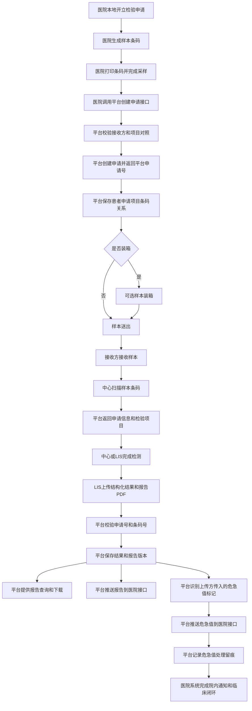
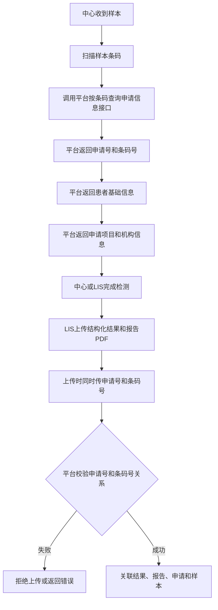

# 检验中心协同平台需求文档

> 版本：V3.0
>
> 日期：2026-05-20
>
> 状态：正式需求文档

---

## 1. 产品概述

### 1.1 建设背景

县域医共体建设要求区域内医疗机构实现检验资源共享、申请协同、样本流转可追踪、报告可查询、结果可回传。当前各机构 HIS、LIS、检验系统厂商不统一，项目编码、条码规则、报告格式和危急值通知流程差异较大，需要建设检验中心协同平台，对跨机构检验协同过程进行统一承接和记录。

### 1.2 产品定位

检验中心协同平台面向医共体内中心和各成员机构，负责承接检验协同中的申请接收、项目对照、样本流转、装箱送检、样本接收、异常登记、结果报告接收、报告查询下载、报告推送、危急值记录与推送等业务。

平台不替代 HIS 医生工作站、LIS 检测执行、仪器数据采集、机构本地采样、条码生成打印、医院临床处置闭环和系统框架能力。

### 1.3 建设目标

- 支持机构之间、机构与中心之间的检验申请协同。
- 支持机构自生成条码模式下的申请、样本、项目和结果关联。
- 支持平台标准项目、大小项目组合和机构项目对照管理。
- 支持样本装箱、送出、接收、异常登记和状态查询。
- 支持结构化结果、报告 PDF、危急值信息上传。
- 支持报告查询下载、报告版本追溯、报告推送和报告更正。
- 支持危急值记录、HTTP 推送、平台侧处理留痕和可选医院侧处理结果回传。
- 明确平台功能、平台接口和医院/厂商配合改造边界。

---

## 2. 范围边界

### 2.1 本期建设范围

| 编号  | 能力                       | 范围 |
| ----- | -------------------------- | ---- |
| F-001 | 跨机构检验申请接收         | 纳入 |
| F-002 | 机构条码接收与样本关系管理 | 纳入 |
| F-003 | 机构与接收方配置           | 纳入 |
| F-004 | 标准项目与机构项目对照     | 纳入 |
| F-005 | 样本装箱、送出、接收       | 纳入 |
| F-006 | 样本异常登记与处理记录     | 纳入 |
| F-007 | 申请、样本、报告查询       | 纳入 |
| F-008 | 中心扫码查询申请信息       | 纳入 |
| F-009 | 检验结果与报告上传         | 纳入 |
| F-010 | 报告版本、重传与纠正       | 纳入 |
| F-011 | 报告与危急值 HTTP 推送     | 纳入 |
| F-012 | 危急值记录与平台侧处理留痕 | 纳入 |
| F-013 | 机构基础信息导出           | 纳入 |

### 2.2 不在本业务需求中展开的范围

| 事项                                                 | 处理方式                            |
| ---------------------------------------------------- | ----------------------------------- |
| 平台生成条码                                         | 不开发，条码由医院/厂商系统生成     |
| 平台打印条码                                         | 不开发，条码打印由医院/厂商系统负责 |
| 采样计划                                             | 不开发，由医院侧自行处理            |
| 采样规则、容器规则、合管规则                         | 不开发，由医院侧自行处理            |
| 重复申请判断                                         | 由医院/厂商系统自行判断             |
| 项目与患者是否医学适配                               | 由医院侧自行判断                    |
| 结果审核、自动审核、人工干预                         | 不开发，平台不审核结果              |
| 参考范围、危急值阈值、结果高低判断规则维护           | 不开发，由结果上传方传入            |
| 通用消息通知中心                                     | 不开发，报告和危急值采用 HTTP 推送  |
| 冷链轨迹、运输时限、物流调度                         | 不开发                              |
| 机构注册审批、机构导入、复杂层级管理、业务统计       | 不纳入本期                          |
| 接口鉴权、错误码、幂等、文件存储、推送重试、日志审计 | 归入框架或实现层                    |
| 登录认证、用户权限、系统字典、数据备份与恢复         | 归入平台框架                        |

---

## 3. 用户与外部系统

### 3.1 用户角色

| 角色                   | 主要操作                                                             |
| ---------------------- | -------------------------------------------------------------------- |
| 发起机构业务人员       | 在本机构系统完成申请、条码生成、条码打印和申请提交                   |
| 发起机构送检人员       | 样本装箱、样本送出、异常登记                                         |
| 接收机构/中心接收人员  | 样本接收、扫码查询申请信息、异常登记                                 |
| 接收机构/中心 LIS 人员 | 检测、结果上传、报告上传、报告更正                                   |
| 平台管理人员           | 机构配置、项目维护、项目对照、报告查询、危急值处理记录、推送记录查看 |
| 医院/厂商系统人员      | 接口对接、HTTP 接收接口提供、结果/报告/危急值数据交互                |

### 3.2 外部系统

| 系统                       | 对接内容                                               |
| -------------------------- | ------------------------------------------------------ |
| 发起机构 HIS/检验系统      | 创建申请、生成条码、传入申请和样本信息                 |
| 接收机构/中心 LIS/检验系统 | 查询申请信息、上传结构化结果和报告 PDF                 |
| 医院/厂商接收接口          | 接收报告推送和危急值推送                               |
| 平台框架                   | 提供登录认证、权限、审计、文件存储、接口安全等基础能力 |

---

## 4. 业务流程

### 4.1 主流程

### 4.2 样本状态主链

样本状态主链为：

1. 申请已创建。
2. 样本已送出。
3. 样本已接收。
4. 结果已上传。
5. 报告已发布。

可选状态包括：

- 已装箱。
- 检测中。
- 异常处理中。
- 报告已推送。

平台支持完整状态记录，但不要求所有机构必须按完整流程逐步操作。已装箱、检测中、异常处理中、报告已推送均不是样本继续流转的强制前置条件。

### 4.3 中心扫码查询与结果关联流程

---

## 5. 平台自身操作功能

### 5.1 机构与接收方配置

平台页面支持：

- 维护机构基础信息。
- 配置机构默认接收方。
- 配置机构允许提交的目标机构或中心。
- 导出机构基础信息。

不包含：

- 机构注册审批。
- 机构批量导入。
- 机构复杂层级管理。
- 机构业务统计。

### 5.2 项目标准化与项目对照

平台页面支持：

- 维护平台标准项目。
- 维护标准小项目。
- 维护大项目与小项目组合关系。
- 维护机构项目与平台标准项目的对照关系。
- 支持 `A->A` 对照：机构传平台标准编码，平台仍通过对照表映射到同一平台标准编码。
- 支持 `B->A` 对照：机构传本地编码，平台通过对照表映射到平台标准编码。
- 查看对照缺失或异常，用于排查申请创建失败原因。
- 导出平台标准项目目录。

规则：

- 平台统一维护项目标准化和对照关系。
- 机构不在平台内自行维护项目对照。
- 平台不维护参考范围、危急值阈值、结果高低判断规则等医学规则。

### 5.3 申请与样本流转操作

平台页面支持：

- 申请查询与详情查看。
- 样本条码查询。
- 样本装箱。
- 拆箱或移除箱内条码。
- 样本送出。
- 样本接收。
- 样本异常登记与处理记录。

规则：

- 平台页面不新增录入申请。
- 平台不生成条码、不打印标签、不生成采样计划。
- 平台不维护采样规则和合管规则。

### 5.4 结果报告与危急值处理

平台页面支持：

- 报告查询、查看、下载。
- 报告版本历史查看。
- 默认展示最新有效版本。
- 报告推送记录查看。
- 推送失败原因查看。
- 手动重推。
- 危急值列表、详情和平台侧处理记录。

规则：

- 平台不做结果审核。
- 平台不编辑报告内容。
- 平台不做医学判断。
- 平台不计算危急值。
- 平台不替代医院临床闭环。

---

## 6. 平台接口功能

### 6.1 创建申请接口

医院/厂商调用平台接口创建检验申请。

接口应支持传入：

- 患者基础信息。
- 申请机构。
- 接收方，或允许使用默认接收方。
- 申请大项目。
- 样本条码。
- 机构本地申请号。

平台处理规则：

- 根据机构项目对照关系转换为平台标准项目。
- 校验机构是否允许提交到目标接收方。
- 校验样本条码是否传入。
- 校验项目对照是否存在。
- 创建成功后返回平台申请号。

平台不处理：

- 重复申请判断。
- 条码生成。
- 采样任务生成。
- 项目与患者医学适配校验。

### 6.2 样本流转状态接口

医院/厂商可通过接口回传样本状态。

支持状态包括：

- 样本送出。
- 样本接收。
- 检测中。
- 异常。

规则：

- 状态回传为可选能力。
- 状态允许不完整。
- 平台按实际回传内容记录。
- 平台记录状态来源、时间、操作人或调用系统、备注。
- 支持按样本条码回传。
- 支持按箱号批量回传。
- 不接入冷链轨迹、不管理运输时限、不做物流调度。

### 6.3 按条码查询申请信息接口

中心收到样本后，可通过扫描样本条码查询申请信息。

接口返回：

- 平台申请号。
- 样本条码号。
- 患者基础信息。
- 申请项目。
- 申请机构。
- 接收机构。
- 样本状态。

规则：

- 该接口用于中心接收样本后确认样本、患者和检验项目。
- 结果回传时必须同时传平台申请号和样本条码号。
- 平台使用申请号和条码号共同校验并关联结果。
- 不采用仅凭条码号或仅凭申请号关联结果的方式。

### 6.4 结果与报告上传接口

检测方/LIS 上传结构化结果和报告 PDF。

接口应支持传入：

- 平台申请号。
- 样本条码号。
- 结构化结果。
- 报告 PDF。
- 结果值。
- 单位。
- 参考范围。
- 异常标记。
- 结果高低。
- 是否危急值。
- 报告版本或更正标识。
- 更正原因。

规则：

- 报告 PDF 必传。
- 结果高低、参考范围、异常标记、是否危急值均由上传方传入。
- 报告重传或纠正时生成新版本，旧版本保留。
- 平台不审核结果、不计算异常、不计算危急值、不编辑报告内容。

### 6.5 报告查询/下载接口

平台提供报告查询和下载接口。

支持查询条件：

- 平台申请号。
- 样本条码号。
- 报告编号。

规则：

- 对外查询/下载接口只返回最新有效版本。
- 只返回平台已接收并保存的报告。
- 支持下载报告 PDF。
- 不开放对外历史版本查询。
- 不实时转发查询到检测方 LIS。
- 不替医院生成报告版式。

### 6.6 报告推送和危急值推送

平台按配置的 HTTP 接口向医院/厂商推送报告和危急值。

支持：

- 同一机构配置多个接收接口。
- 记录推送状态。
- 记录推送时间。
- 记录请求目标。
- 记录失败原因。
- 支持手动重推。
- 支持基础重试策略。
- 平台定义统一推送数据格式。

不包含：

- 通用消息通知中心。
- 短信通知。
- 微信通知。
- 院内 IM 通知。
- 其他多渠道通知建设。

### 6.7 危急值处理结果回传接口

医院/厂商可选择回传医院侧危急值处理结果。

回传内容包括：

- 处理状态。
- 处理时间。
- 处理人。
- 处理方式。
- 备注。

规则：

- 该接口为可选接入。
- 不接入时，平台仅记录推送和平台侧通知处理。
- 平台将回传结果关联到危急值记录。
- 平台不强制医院完成临床闭环。
- 平台不判断危急值处理是否合规。

### 6.8 基础主数据查询接口

平台仅提供创建申请前必要的主数据校验能力。

支持：

- 当前机构可提交目标机构/中心查询。
- 机构项目对照结果查询或校验。

不提供：

- 完整机构基础信息查询接口。
- 平台标准项目查询接口。
- 主数据批量写入接口。
- 医院/厂商通过接口维护平台标准项目。
- 医院/厂商通过接口维护项目对照关系。

规则：

- 平台标准项目仅在平台页面支持导出，不通过接口开放查询。

---

## 7. 医院/厂商配合改造功能

### 7.1 条码生成与申请提交

医院/厂商负责：

- 在本地生成样本条码。
- 在本地完成条码打印。
- 在本地完成采样流程。
- 创建申请时将已生成的样本条码传给平台。

平台只保存和流转条码，不生成、不打印、不分配条码。条码为空或格式不符合平台接口要求时，创建申请失败。

### 7.2 项目编码对照配合

医院/厂商负责：

- 提供本机构项目编码清单，供平台建立对照。
- 创建申请时传入可被平台对照表识别的项目编码。

规则：

- 传平台标准编码时，平台配置 `A->A` 对照。
- 传本地编码时，平台配置 `B->A` 对照。
- 医院/厂商不通过接口自行维护对照表。

### 7.3 可选样本流转状态回传

医院/厂商可选择是否回传：

- 样本送出。
- 样本接收。
- 检测中。
- 异常。

规则：

- 回传状态可以不完整。
- 不要求每个节点都接入。
- 不回传时，平台可通过页面人工记录流转。
- 按箱流转时，医院/厂商需传箱号与箱内样本条码关系，或按平台已存在装箱关系回传箱号。
- 不要求医院/厂商提供冷链轨迹、运输时限、物流调度能力。

### 7.4 结果与报告上传

检测方/LIS 负责：

- 上传结构化结果。
- 上传报告 PDF。
- 上传结果值、单位、参考范围、异常标记、结果高低、是否危急值。
- 报告重传或纠正时传更正原因或版本标识。
- 对结果医学正确性负责。

平台只接收、保存、展示和推送结果与报告。

### 7.5 报告和危急值 HTTP 接收接口

医院/厂商负责：

- 提供可接收平台推送的 HTTP 接口。
- 按平台定义的数据格式接收报告推送。
- 按平台定义的数据格式接收危急值推送。
- 返回明确接收结果，便于平台记录成功或失败。
- 完成接收后的院内处理，例如写入 HIS/LIS、提醒医生、进入院内危急值流程。

### 7.6 医院侧自行处理职责

医院/厂商自行处理：

- 重复申请判断。
- 采样。
- 条码打印。
- 采样规则。
- 合管规则。
- 项目与患者是否适配的医学判断。
- 报告/危急值接收后的院内通知。
- 临床危急值闭环。

平台只保留必要记录和推送状态，不替代医院内部业务闭环。

---

## 8. 关键数据对象

| 数据对象                  | 说明                               |
| ------------------------- | ---------------------------------- |
| Organization              | 机构或中心基础信息                 |
| OrganizationTargetConfig  | 默认接收方和允许提交目标范围       |
| Patient                   | 患者基础信息                       |
| Application               | 平台检验申请                       |
| SourceApplication         | 医院本地申请标识                   |
| Specimen                  | 样本信息                           |
| SpecimenBarcode           | 医院/厂商生成的样本条码            |
| TransportBox              | 转运箱/样本箱                      |
| StandardSubItem           | 平台标准小项目                     |
| StandardPackageItem       | 由小项目组成的大项目               |
| ItemMapping               | 机构项目编码与平台标准项目编码对照 |
| SampleStatusRecord        | 样本状态记录                       |
| ExceptionRecord           | 样本异常和处理记录                 |
| Result                    | 结构化检验结果                     |
| Report                    | 报告 PDF、报告版本和报告状态       |
| ReportPushRecord          | 报告推送记录                       |
| CriticalValueRecord       | 危急值记录                         |
| CriticalValueHandleRecord | 危急值平台侧处理和医院侧回传记录   |

---

## 9. 非功能要求

### 9.1 安全与合规

- 平台应满足医疗数据安全要求。
- 患者敏感信息在日志中应脱敏或摘要化。
- 查询、下载、导出和接口调用应受权限和数据范围控制。
- 关键业务操作应可追溯。

### 9.2 可用性

- 高频操作包括申请创建、样本装箱、样本送出、样本接收、报告查询、报告下载、结果上传和报告推送。
- 接口调用失败时应返回结构化失败信息。
- 页面操作和接口操作应并行支持，以适配不同机构对接成熟度。

### 9.3 可追溯性

平台应记录以下内容的来源、时间、操作人或调用系统、处理结果：

- 申请创建。
- 项目对照。
- 样本条码。
- 装箱。
- 送出。
- 接收。
- 异常处理。
- 结果上传。
- 报告上传。
- 报告版本。
- 报告推送。
- 危急值记录。
- 危急值处理。

### 9.4 可扩展性

- 平台应预留后续统计分析、质控管理、更多推送策略和机构配置扩展能力。
- 本期需求不承诺所有扩展能力同步实现。

---

## 10. 验收要点

### 10.1 申请与项目对照

- 医院/厂商可调用平台创建申请接口。
- 创建申请成功后返回平台申请号。
- 申请中可包含多个大项目。
- 申请中可包含一个或多个样本条码。
- 所有申请均经过项目对照表。
- 对照缺失时创建申请失败。
- 支持 `A->A` 和 `B->A` 两种对照模式。

### 10.2 样本与条码

- 平台可保存医院/厂商传入的样本条码。
- 平台可按条码查询申请、患者、项目和样本状态。
- 平台不生成条码、不打印条码。
- 条码为空或不符合接口要求时创建申请失败。

### 10.3 装箱与流转

- 平台支持样本装箱。
- 平台支持拆箱或移除箱内条码。
- 平台支持按箱送出。
- 平台支持按条码送出。
- 平台支持按箱或按条码接收。
- 未装箱样本可直接按条码流转。
- 样本状态可跳过可选节点。

### 10.4 中心扫码查询

- 中心可按样本条码查询申请信息。
- 查询结果包含申请号、条码号、患者基础信息、申请项目、申请机构、接收机构。
- 结果上传时必须同时传申请号和条码号。
- 平台使用申请号和条码号共同校验并关联结果。

### 10.5 结果与报告

- 检测方/LIS 可上传结构化结果。
- 检测方/LIS 可上传报告 PDF。
- 报告 PDF 为必传。
- 平台保存上传方传入的结果值、单位、参考范围、异常标记、结果高低、是否危急值。
- 平台不审核结果、不计算危急值。
- 报告重传或纠正生成新版本。
- 对外报告查询/下载接口只返回最新有效版本。

### 10.6 报告和危急值推送

- 平台可按机构配置 HTTP 接收接口。
- 同一机构可配置多个接收接口。
- 报告发布后可推送。
- 报告更正后可推送最新有效版本。
- 危急值产生后可推送。
- 平台记录推送状态、时间、目标、失败原因。
- 平台支持手动重推。

### 10.7 危急值处理

- 平台可保存上传方传入的危急值信息。
- 平台可形成危急值提示和平台侧处理记录。
- 平台可记录是否已通知申请机构、通知方式、处理人、处理时间和备注。
- 医院侧可选回传危急值处理结果。
- 平台不替代医院临床危急值闭环。

### 10.8 机构配置与导出

- 平台可维护机构基础信息。
- 平台可配置机构默认接收方。
- 平台可配置机构允许提交目标机构或中心。
- 平台可导出机构基础信息。
- 平台标准项目仅在平台页面支持导出。
- 机构导出不包含患者、申请、样本、报告、危急值等业务数据。

---

## 11. 术语表

| 术语          | 说明                                                       |
| ------------- | ---------------------------------------------------------- |
| HIS           | 医院信息系统                                               |
| LIS           | 实验室信息系统                                             |
| 中心          | 医共体内承担核心检验协同或管理职责的中心机构               |
| 机构          | 除中心外的医疗机构，可作为发起方或接收方参与流转           |
| 发起机构      | 提交检验申请并送出样本的机构                               |
| 接收方        | 本次申请指定的接收机构或中心                               |
| 平台申请号    | 平台创建申请后返回的唯一标识                               |
| 机构申请号    | 医院/厂商系统中的本地申请标识                              |
| 样本条码      | 医院/厂商生成并传给平台的样本标识                          |
| 转运箱/样本箱 | 平台记录的箱子对象，用于绑定一批样本条码                   |
| 大项目        | 当前申请维度的检验项目                                     |
| 小项目        | 大项目内部的具体结果项                                     |
| A->A 对照     | 机构传入平台标准编码，平台通过对照表映射到同一平台标准编码 |
| B->A 对照     | 机构传入本地编码，平台通过对照表映射到平台标准编码         |
| 危急值记录    | 上传方传入平台的危急值标记或事件信息                       |
