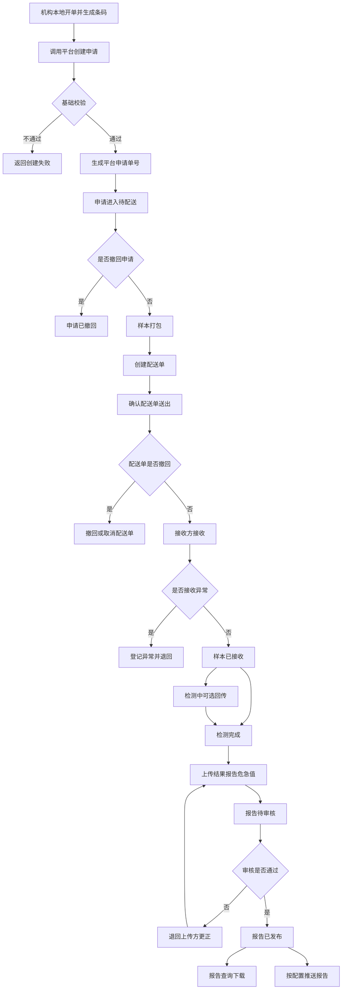
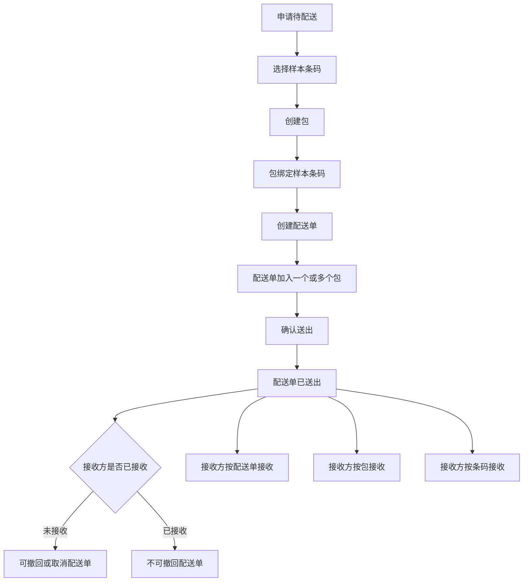
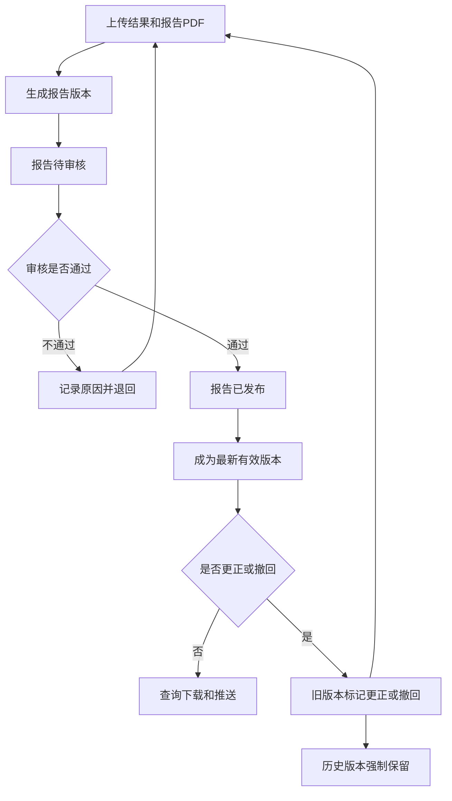

# 检验中心协同平台需求文档

> 版本：第四版修正版
>
> 状态：修正稿
>
> 日期：2026-05-22

---

## 1. 背景与目标

### 1.1 背景

县域医共体检验协同场景中，基层机构、中心机构、医院 HIS、LIS、检验系统和厂商系统需要围绕检验申请、样本流转、报告发布、危急值协同形成统一业务链路。

当前实际业务中通常存在以下问题：

1. 各机构系统不统一，检验申请、样本条码、报告结果分散在不同系统中。
2. 样本送出、配送、接收、检测等节点缺少统一记录，跨机构协同过程不透明。
3. 报告上传、审核、发布、推送、更正和历史版本追溯缺少统一管理。
4. 危急值需要跨机构及时协同，但平台与医院系统之间的责任边界需要明确。
5. 项目标准化、机构主数据、权限、统计分析等能力容易与检验协同业务混在一起，需要明确系统边界。

检验中心协同平台用于承接跨机构检验协同主流程，重点解决申请接收、样本打包配送、接收检测、报告审核发布、报告版本管理、危急值记录和业务明细追踪问题。

### 1.2 建设目标

1. 建立从机构申请到中心检测、报告发布和报告推送的协同流程。
2. 以样本条码为核心业务单元，建立申请、患者摘要、项目、样本、配送、报告之间的关联。
3. 支持样本打包、配送单、送出、接收、退回和异常处理记录。
4. 支持检验结果、报告 PDF、危急值信息上传，并通过平台审核后发布报告。
5. 支持报告强制版本保留、最新有效版本查询、报告更正和撤回。
6. 支持报告和危急值按配置推送给医院或厂商系统。
7. 明确平台自身功能、平台接口能力、医院和厂商需要配合改造的能力。

---

## 2. 范围与边界

### 2.1 本系统范围

| 序号 | 能力                 | 范围说明                                               |
| ---- | -------------------- | ------------------------------------------------------ |
| 1    | 申请管理             | 接收机构提交的检验申请，生成平台申请单号               |
| 2    | 样本打包管理         | 支持将一个或多个样本条码形成平台业务包                 |
| 3    | 配送单管理           | 支持一个配送单包含一个或多个包，并记录送出、撤回、取消 |
| 4    | 样本接收管理         | 支持接收方按配送单、包或条码接收样本                   |
| 5    | 样本异常处理         | 支持异常登记、处理、关闭、退回记录                     |
| 6    | 样本状态管理         | 记录样本主状态和状态变化记录                           |
| 7    | 报告审核与发布       | 报告上传后进入待审核，审核通过后发布                   |
| 8    | 报告版本管理         | 强制保留所有报告版本，支持更正、撤回和追溯             |
| 9    | 危急值记录与处理留痕 | 接收上传方传入的危急值信息并记录处理过程               |
| 10   | 报告和危急值推送管理 | 按配置通过 HTTP 推送报告和危急值                       |
| 11   | 业务配置管理         | 配置默认接收方、可提交目标范围、推送地址               |
| 12   | 业务运维明细查询     | 查询申请、条码、配送单、报告、异常、危急值等业务明细   |

### 2.2 不在本系统范围

| 事项                                   | 处理方式                                       |
| -------------------------------------- | ---------------------------------------------- |
| 项目标准化与机构项目对照               | 由独立项目标准化系统维护，本平台不维护项目对照 |
| 平台生成或打印样本条码                 | 不开发，条码由机构系统生成和打印               |
| 采样计划、采样规则、合管拆管规则       | 由机构系统或线下流程负责                       |
| 收费、退费、医保结算                   | 由医院 HIS、收费系统或医保系统负责             |
| 查询统计、报表、排行、趋势分析         | 由独立查询统计系统负责                         |
| 机构基础信息、机构启停用、机构接入凭证 | 由框架、主数据或权限系统负责                   |
| 用户、角色、菜单、权限、账号           | 由框架权限系统负责                             |
| 室内质控、失控处理                     | 下版本设计                                     |
| 检验检查互认                           | 单独立项，不纳入本系统设计                     |
| 医生写病历时查询结构化结果             | 不提供该接口                                   |
| 医院临床危急值处置闭环                 | 由医院系统或线下制度负责                       |

### 2.3 项目编码边界

项目标准化与机构项目对照由独立项目标准化系统维护。机构提交检验申请时，应提交平台标准项目编码。

本平台只校验传入的平台标准项目编码是否可识别、是否可用，以及是否满足本次申请所需的基础业务约束。本平台不提供平台标准项目维护、小项目维护、大项目组合维护、机构项目对照维护和项目目录对照查询接口。

### 2.4 费用信息边界

平台不负责收费、退费、医保结算，也不因未付费状态默认阻断申请创建。

机构创建申请时可以传入费用状态和绿色通道信息。平台只负责接收、记录、展示和查询这些信息，供接收方判断优先级、业务核对或人工处理参考。

---

## 3. 用户与场景

### 3.1 用户角色

| 角色                   | 使用诉求                                           |
| ---------------------- | -------------------------------------------------- |
| 发起机构医生或业务人员 | 在本地系统完成开单后，将申请和条码提交至平台       |
| 发起机构送检人员       | 对样本进行打包，创建配送单并确认送出               |
| 接收方接收人员         | 按配送单、包或条码接收样本，登记异常或退回         |
| 接收方 LIS 或检验人员  | 完成检测后上传结构化结果、报告 PDF 和危急值信息    |
| 报告审核人员           | 在平台审核报告，决定报告发布或退回                 |
| 平台运维或管理人员     | 查看全平台业务明细，排查申请、配送、报告、推送问题 |
| 医院或厂商系统         | 调用平台接口，接收平台推送的报告和危急值           |

### 3.2 场景一：基层机构送检到中心

基层机构在本地 HIS 或检验系统完成开单，生成并打印样本条码。机构系统调用平台创建申请，传入患者摘要、就诊摘要、平台标准项目编码、样本条码、接收方、费用状态和绿色通道信息。

平台创建申请并返回平台申请单号。送检人员对样本进行打包，创建配送单并确认送出。中心接收人员按配送单、包或条码接收样本。中心完成检测后上传结构化结果和报告 PDF，报告进入待审核。审核通过后，报告发布，机构可查询下载，平台按配置推送报告。

### 3.3 场景二：样本接收异常退回

中心接收样本时发现条码无法识别、样本破损、漏送、多送、容器不符或样本与配送单不一致。接收人员在平台登记异常，记录异常类型、异常描述、发现环节、责任方、处理意见，并可执行退回。

平台保留申请、样本、配送单和异常处理记录。发起机构可查看异常和退回信息，并根据本地规则重新采样、重新提交或重新配送。

### 3.4 场景三：报告更正与版本追溯

报告发布后，上传方发现报告内容需要更正或撤回。上传方通过接口提交报告更正或撤回信息。平台不物理删除旧报告，而是标记旧版本状态，并生成新的报告版本或保留撤回说明。

新报告版本重新进入待审核。审核通过后，新版本成为最新有效版本。平台默认查询返回最新有效版本，历史版本仅供有权限人员追溯查看。

### 3.5 场景四：申请撤回

机构创建申请后，如果样本尚未配送，机构可以撤回申请。平台记录撤回原因、撤回时间、操作人或调用系统，并终止后续打包、配送、接收、检测和报告流程。

平台不支持一个申请内只撤回某一个项目。若机构需要取消部分项目，应由机构本地系统处理后，按新的条码和申请规则重新提交平台申请。

### 3.6 场景五：危急值协同

接收方上传检验结果和报告时，如果存在危急值，应在同一接口中传入危急值标记、危急值项目、危急值结果和危急值说明。平台保存危急值记录，并按配置进行危急值推送和处理留痕。

平台不计算危急值、不维护危急值判断规则、不替代医院临床处置闭环。医院侧是否回传危急值处理结果，由医院系统或实施约定决定。

---

## 4. 业务流程

### 4.1 主流程图

### 4.2 打包与配送流程图

### 4.3 报告审核与版本流程图

### 4.4 样本主状态

样本主状态只表达样本当前所处的物理或业务流转阶段，不承载报告审核、报告发布、报告推送和异常处理状态。

| 顺序 | 状态       | 说明                               |
| ---- | ---------- | ---------------------------------- |
| 1    | 申请已创建 | 平台已创建申请并关联条码           |
| 2    | 待配送     | 样本尚未确认送出                   |
| 3    | 已配送     | 配送单已确认送出                   |
| 4    | 已接收     | 接收方已确认接收                   |
| 5    | 检测中     | 可选回传状态                       |
| 6    | 检测完成   | 接收方已完成检测，可上传结果和报告 |

申请撤回、样本退回等属于逆流程或终止类状态，不混入正常主链。异常处理状态、报告状态、推送状态分别由异常记录、报告记录、推送记录承载。

---

## 5. 功能需求

### 5.1 申请管理

#### 功能说明

平台接收机构已开立、已确认可送检的检验申请，生成平台申请单号，并建立平台申请、机构申请、患者摘要、平台标准项目编码、样本条码、接收方之间的关系。

#### 功能要求

1. 支持机构通过接口创建申请。
2. 创建申请时必须传入样本条码，且同一个条码就是一个平台申请。
3. 一个平台申请只能对应一个样本条码，一个样本条码只能对应一个平台申请。
4. 一个平台申请可以包含多个检验项目，但后续撤回、异常、配送和报告按整个申请处理。
5. 创建申请时传入平台标准项目编码，平台不维护机构项目对照。
6. 支持记录费用状态和绿色通道信息。
7. 支持申请创建后、样本未配送前撤回申请。
8. 撤回后申请不可继续进入打包、配送、接收、检测和报告流程。

#### 关键规则

1. 平台不生成样本条码，不打印条码。
2. 平台不判断重复申请。
3. 平台不校验项目与患者年龄、性别、病区、床号等冲突。
4. 平台不支持申请内项目级部分撤回。

### 5.2 样本打包管理

#### 功能说明

平台支持将一个或多个样本条码形成业务包。包是平台虚拟业务单位，不要求线下一定存在实体箱。

#### 功能要求

1. 支持创建包。
2. 支持向包中加入一个或多个样本条码。
3. 支持查看包内样本清单。
4. 支持在配送单创建时直接选择样本并自动形成默认包。
5. 支持打包记录查询。

#### 关键规则

1. 打包不是申请创建的前置条件。
2. 包只表达平台业务绑定关系，不负责实体箱采购、箱码打印、冷链设备和物流轨迹采集。
3. 已加入已送出配送单的包，不允许随意变更包内样本。

### 5.3 配送单管理

#### 功能说明

配送单表示一次送检或配送任务。一个配送单可以包含一个或多个包。

#### 功能要求

1. 支持创建配送单。
2. 支持向配送单加入一个或多个包。
3. 支持确认配送单送出。
4. 支持接收方未接收前撤回或取消配送单。
5. 支持查询配送单、包和样本条码之间的关系。
6. 支持记录配送单创建、送出、撤回、取消的时间、操作人或调用系统、原因。

#### 关键规则

1. 配送单送出后，样本主状态进入已配送。
2. 配送单被接收后，不允许撤回配送单。
3. 配送单撤回后，样本回到可重新打包或重新生成配送单的状态。

### 5.4 样本接收管理

#### 功能说明

接收方可按配送单、包或样本条码接收样本。

#### 功能要求

1. 支持按配送单接收。
2. 支持按包接收。
3. 支持按样本条码接收。
4. 支持记录接收时间、接收方、接收人或调用系统、接收结果。
5. 支持接收时发现异常并登记异常。
6. 支持接收异常后执行退回。

#### 关键规则

1. 样本接收后，样本主状态进入已接收。
2. 接收异常不自动删除申请、条码、包或配送单记录。
3. 是否允许异常样本继续检测，由业务人员或接收方按制度判断。

### 5.5 样本异常处理

#### 功能说明

平台支持在申请、打包、配送、接收、检测前后等环节登记样本异常，并记录处理过程。

#### 功能要求

1. 支持登记异常类型、异常描述、发现环节、发现机构、发现人或调用系统、发现时间。
2. 支持记录责任方、处理意见、处理结果、处理人、处理时间和关闭时间。
3. 支持异常退回。
4. 支持异常记录查询。
5. 支持异常记录状态管理。

#### 异常记录状态

异常记录可包含：异常已登记、待处理、处理中、已处理、已关闭。

#### 关键规则

1. 异常处理中不作为样本主状态。
2. 一个样本可以在保持当前主状态的同时存在异常记录。
3. 平台不自动生成补采任务，不修改 HIS 医嘱，不处理收费退费。

### 5.6 样本状态管理

#### 功能说明

平台记录样本主状态和状态变化轨迹。

#### 功能要求

1. 支持记录申请已创建、待配送、已配送、已接收、检测中、检测完成。
2. 支持接收方 LIS 或检验系统回传检测中状态。
3. 若不回传检测中，样本可从已接收直接进入检测完成。
4. 支持记录状态变化来源、变化时间、操作人或调用系统、处理结果。

#### 关键规则

1. 报告已推送不作为样本状态。
2. 异常处理中不作为样本状态。
3. 报告待审核、已发布、已撤回、已更正属于报告状态。

### 5.7 报告审核与发布

#### 功能说明

上传方上传检验结果和报告 PDF 后，报告进入待审核。平台审核通过后，报告才发布，机构才可查询、下载，平台才可按配置推送报告。

#### 功能要求

1. 支持报告待审核列表。
2. 支持审核通过。
3. 支持审核不通过并填写原因。
4. 支持审核不通过后退回上传方重新上传或更正。
5. 支持记录审核人、审核时间、审核结果、审核意见。

#### 关键规则

1. 平台审核是报告发布控制，不是医学自动审核规则引擎。
2. 平台不自动判断结果是否正确，不自动计算高低、异常或危急值。
3. 报告更正、重传、撤回后形成的新版本也需要重新审核。

### 5.8 报告版本管理

#### 功能说明

平台保存报告数据、报告 PDF 和版本信息。所有报告版本强制保留。

#### 功能要求

1. 支持每次上传、重传、更正、撤回后重新上传均生成独立报告版本。
2. 支持记录版本号、版本状态、上传时间、上传方、审核状态、审核人、审核时间、更正或撤回原因。
3. 支持默认查询最新有效版本。
4. 支持有权限人员追溯历史版本。
5. 支持报告撤回和报告更正。

#### 关键规则

1. 所有报告版本必须强制保留，不允许物理删除。
2. 如果报告被撤回且没有新的有效版本，平台显示当前无有效报告，但历史版本仍保留。
3. 报告推送只面向审核通过后的最新有效版本。

### 5.9 危急值记录与处理留痕

#### 功能说明

平台接收上传方传入的危急值信息，保存危急值记录，并支持推送和处理留痕。

#### 功能要求

1. 危急值信息随检验结果和报告上传接口一并传入。
2. 支持保存危急值关联的申请、条码、患者摘要、项目、结果值、参考范围、上传方信息。
3. 支持形成危急值记录。
4. 支持记录平台侧通知情况、处理人、处理时间、备注。
5. 支持接收医院侧危急值处理结果回传。

#### 关键规则

1. 平台不自行计算或判断危急值。
2. 平台不维护危急值规则和阈值。
3. 医院侧临床处置闭环由医院系统或线下制度保证。

### 5.10 报告和危急值推送管理

#### 功能说明

平台通过 HTTP 请求方式，将报告发布、报告更正、危急值等信息推送给已配置的医院或厂商接收接口。

#### 功能要求

1. 支持配置报告推送接收地址。
2. 支持配置危急值推送接收地址。
3. 支持报告发布后按配置推送。
4. 支持报告更正后按配置推送最新有效版本。
5. 支持危急值按配置推送。
6. 支持记录推送时间、推送地址、推送内容摘要、返回结果、失败原因和重试情况。

#### 推送状态

推送记录可包含：待推送、推送成功、推送失败、重试中、已取消推送。

#### 关键规则

1. 报告已推送不作为样本状态。
2. 推送失败不影响平台内报告已发布状态。
3. 平台不建设消息通知中心。

### 5.11 业务配置管理

#### 功能说明

平台保留检验协同业务所需的配置能力。

#### 功能要求

1. 支持机构默认接收方配置。
2. 支持机构可提交目标范围配置。
3. 支持报告推送接收地址配置。
4. 支持危急值推送接收地址配置。

#### 关键规则

1. 机构基础信息维护、机构启停用、机构接入标识、API 凭证归入框架、主数据或权限系统。
2. 用户、角色、菜单、权限、数据范围、账号管理不在本 PRD 展开。

### 5.12 业务运维明细查询

#### 功能说明

平台保留业务流程中必要的明细查询能力，用于业务处理、问题排查和运维定位。

#### 功能要求

1. 支持按平台申请单号、机构申请单号、样本条码查询业务明细。
2. 支持按配送单号查询配送单、包和样本清单。
3. 支持查询样本当前状态和流转记录。
4. 支持查询报告审核、发布和版本状态。
5. 支持查询报告或危急值推送记录及失败原因。
6. 支持查询异常处理记录和危急值处理记录。
7. 平台管理端授权用户可查看平台下所有机构的申请、样本流转、报告状态、异常和危急值记录。

#### 数据范围规则

1. 普通机构用户只能查看本机构发起的申请，以及提交给本机构处理的申请相关信息。
2. 接收机构或中心用户只能查看提交给自己的申请，以及相关样本流转、报告、异常和危急值信息。
3. 同一患者在其他机构产生的申请和报告，不因患者身份相同而向普通机构用户开放查看。
4. 报告 PDF 下载、患者敏感信息明细查看等高敏操作是否需要更高权限控制，由框架权限和内部审计要求进一步细化。

---

## 6. 平台接口需求

### 6.1 接口清单

| 序号 | 接口                           | 说明                                                           |
| ---- | ------------------------------ | -------------------------------------------------------------- |
| 1    | 创建申请接口                   | 创建平台申请，传入患者摘要、项目、条码、接收方、费用和绿通信息 |
| 2    | 申请撤回接口                   | 样本未配送前撤回申请                                           |
| 3    | 申请和样本明细查询接口         | 查询申请、条码、项目、状态、配送、报告等明细                   |
| 4    | 样本打包接口                   | 创建包并绑定样本条码                                           |
| 5    | 配送单创建接口                 | 创建配送单并加入一个或多个包                                   |
| 6    | 配送单送出接口                 | 确认配送单送出                                                 |
| 7    | 配送单撤回或取消接口           | 接收方未接收前撤回或取消配送单                                 |
| 8    | 样本接收接口                   | 按配送单、包或条码接收样本                                     |
| 9    | 样本退回接口                   | 接收异常或处理异常时退回样本                                   |
| 10   | 样本状态回传接口               | 回传检测中、检测完成等状态                                     |
| 11   | 样本异常登记和处理接口         | 登记异常、更新处理意见、关闭异常                               |
| 12   | 检验结果、报告与危急值上传接口 | 上传结构化结果、报告 PDF 和危急值信息                          |
| 13   | 报告审核结果查询接口           | 上传方查询报告是否审核通过、退回或发布                         |
| 14   | 报告更正或撤回接口             | 提交报告更正、撤回和新版本                                     |
| 15   | 报告查询和下载接口             | 查询和下载最新有效报告，支持权限范围内追溯                     |
| 16   | 危急值处理结果回传接口         | 医院侧回传危急值处理结果                                       |
| 17   | 平台推送报告接口               | 平台向医院或厂商推送报告发布和更正信息                         |
| 18   | 平台推送危急值接口             | 平台向医院或厂商推送危急值信息                                 |

### 6.2 不提供的接口

1. 项目目录与机构项目对照查询接口。
2. 机构基础信息查询接口。
3. 医生病历结构化结果查询接口。
4. 查询统计和报表接口。
5. 收费、退费、医保结算接口。

---

## 7. 医院和厂商需配合改造的能力

| 序号 | 配合能力                                                                       | 责任方                  |
| ---- | ------------------------------------------------------------------------------ | ----------------------- |
| 1    | 在机构本地完成开单、采样、条码生成和条码打印                                   | 发起机构 HIS 或检验系统 |
| 2    | 创建平台申请时提交平台标准项目编码、样本条码、患者摘要、接收方、费用和绿通信息 | 发起机构 HIS 或检验系统 |
| 3    | 调用申请撤回、打包、配送单创建、送出等接口，或配合平台页面操作                 | 发起机构系统或实施方    |
| 4    | 按配送单、包或条码接收样本，必要时调用接收或退回接口                           | 接收方 LIS 或检验系统   |
| 5    | 上传结构化结果、报告 PDF 和危急值信息                                          | 接收方 LIS 或检验系统   |
| 6    | 支持报告更正、撤回、新版本上传                                                 | 接收方 LIS 或检验系统   |
| 7    | 提供 HTTP 接收接口，用于接收报告和危急值推送                                   | 医院系统或厂商系统      |
| 8    | 如需闭环回传，调用危急值处理结果回传接口                                       | 医院系统                |
| 9    | 处理本地条码打印错误、贴签错误、费用状态维护和本地人员培训                     | 各机构和厂商            |

---

## 8. 关键数据对象

| 对象                      | 说明                                       |
| ------------------------- | ------------------------------------------ |
| PlatformApplication       | 平台申请，一个申请对应一个样本条码         |
| SourceApplication         | 机构本地申请或医嘱标识                     |
| PatientSummary            | 患者摘要信息                               |
| VisitSummary              | 就诊摘要信息                               |
| SpecimenBarcode           | 机构生成的样本条码                         |
| StandardItemCode          | 平台标准项目编码，由外部项目标准化系统维护 |
| Package                   | 平台业务包，可绑定多个样本条码             |
| DeliveryOrder             | 配送单，可包含一个或多个包                 |
| ReceiveRecord             | 样本接收记录                               |
| SpecimenStatusRecord      | 样本状态变化记录                           |
| ExceptionRecord           | 样本异常和处理记录                         |
| ResultRecord              | 结构化检验结果                             |
| Report                    | 报告和报告 PDF                             |
| ReportVersion             | 报告版本记录                               |
| ReportAuditRecord         | 报告审核记录                               |
| ReportPushRecord          | 报告推送记录                               |
| CriticalValueRecord       | 危急值记录                                 |
| CriticalValueHandleRecord | 危急值处理留痕或医院侧回传记录             |
| BusinessConfig            | 默认接收方、目标范围、推送地址等业务配置   |

---

## 9. 验收标准

本章只描述功能做到什么程度算完成，不包含响应时间、并发量、吞吐量、容量、可用性百分比、压测指标等性能验收内容。

### 9.1 申请管理

1. 能通过页面或接口创建平台申请，并返回平台申请单号。
2. 一个平台申请只能绑定一个样本条码，一个样本条码不能重复绑定多个平台申请。
3. 申请可包含多个平台标准项目编码。
4. 平台能记录费用状态和绿色通道信息。
5. 样本未配送前可以撤回申请，撤回后不能继续打包、配送、接收、检测和报告流程。

### 9.2 样本打包管理

1. 能创建包并绑定一个或多个样本条码。
2. 能查询包内样本清单。
3. 能在配送单创建时使用已有包或自动形成默认包。
4. 已送出配送单中的包和样本关系能保留记录。

### 9.3 配送单管理

1. 能创建配送单并加入一个或多个包。
2. 能确认配送单送出，样本状态进入已配送。
3. 接收方未接收前，能撤回或取消配送单。
4. 配送单撤回或取消后，能记录原因、时间、操作人或调用系统。

### 9.4 样本接收管理

1. 能按配送单、包或条码接收样本。
2. 接收后样本状态进入已接收。
3. 接收时发现异常，能登记异常并退回。
4. 接收记录能关联申请、条码、包、配送单和接收方。

### 9.5 样本异常处理

1. 能登记样本异常，记录异常类型、异常描述、发现环节、发现人或调用系统。
2. 能更新处理意见、处理结果和关闭异常。
3. 能记录异常退回。
4. 异常记录不覆盖样本主状态。

### 9.6 样本状态管理

1. 能记录申请已创建、待配送、已配送、已接收、检测中、检测完成。
2. 检测中未回传时，样本能从已接收进入检测完成。
3. 每次状态变化能记录来源、时间、操作人或调用系统。
4. 报告推送状态和异常处理状态不进入样本主状态。

### 9.7 报告审核与发布

1. 上传报告后，报告进入待审核。
2. 审核人员能执行审核通过或审核不通过。
3. 审核通过后，报告进入已发布，机构可查询下载。
4. 审核不通过后，上传方能重新上传或更正。
5. 审核记录能保存审核人、审核时间、审核结果和审核意见。

### 9.8 报告版本管理

1. 每次报告上传、重传、更正、撤回后重新上传，均生成独立版本。
2. 所有报告版本强制保留，不允许物理删除。
3. 默认查询返回最新有效版本。
4. 历史版本能按权限追溯查看。
5. 报告撤回后，如果没有新的有效版本，平台能显示当前无有效报告并保留历史版本。

### 9.9 危急值记录与处理留痕

1. 上传结果和报告时能一并传入危急值信息。
2. 平台能保存危急值记录，并关联申请、条码、项目、结果和报告。
3. 平台能记录危急值通知或处理留痕。
4. 医院侧如回传处理结果，平台能保存处理方式、处理时间、处理人和处理结果。

### 9.10 报告和危急值推送管理

1. 能配置报告推送地址和危急值推送地址。
2. 报告发布后能按配置推送报告。
3. 报告更正后能按配置推送最新有效版本。
4. 危急值能按配置推送。
5. 推送记录能保存推送状态、推送地址、返回结果、失败原因和重试记录。

### 9.11 业务配置管理

1. 能配置机构默认接收方。
2. 能配置机构可提交目标范围。
3. 能配置报告推送接收地址。
4. 能配置危急值推送接收地址。
5. 创建申请时能按配置校验接收方是否允许。

### 9.12 业务运维明细查询

1. 能按申请单号、样本条码、配送单号查询业务明细。
2. 能查看样本状态、流转记录、异常记录、报告状态、报告版本、推送记录和危急值记录。
3. 普通机构用户不能查看其他机构患者的申请和报告。
4. 平台管理端授权用户能查看平台下所有机构的业务明细。

---

## 附录 A. 术语表

| 术语             | 说明                                         |
| ---------------- | -------------------------------------------- |
| 发起机构         | 提交检验申请并送出样本的机构                 |
| 接收方           | 本次申请指定的接收机构或中心                 |
| 平台申请单号     | 平台创建申请后生成的唯一标识                 |
| 机构申请单号     | 机构本地系统中的申请或医嘱标识               |
| 样本条码         | 机构本地系统生成并打印的样本标识             |
| 包               | 平台中的虚拟业务单位，用来绑定多个样本条码   |
| 配送单           | 一次送检或配送任务，可包含一个或多个包       |
| 平台标准项目编码 | 由独立项目标准化系统维护的项目编码           |
| 报告最新有效版本 | 当前默认对机构展示、下载和推送的审核通过版本 |
| 危急值记录       | 上传方传入平台的危急值标记或危急值事件信息   |
