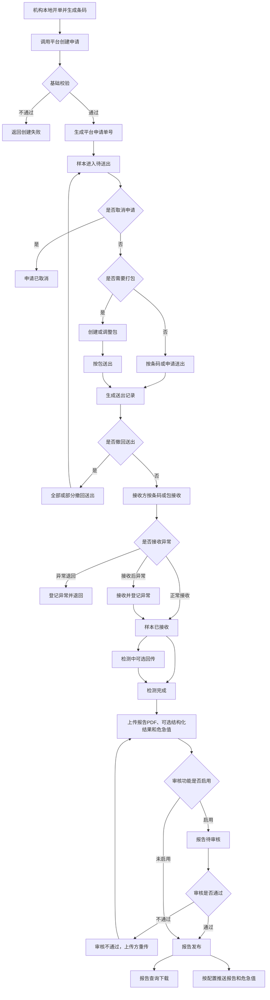
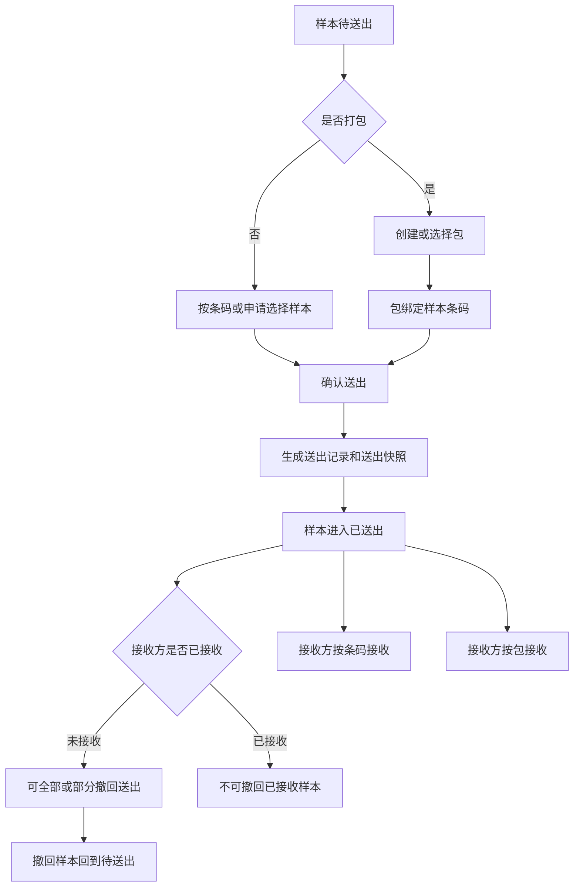
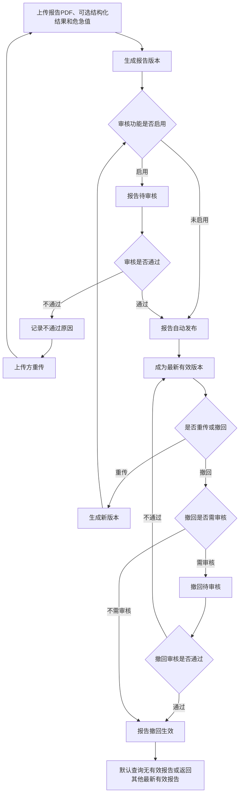

# 检验中心协同平台需求文档

> 版本：第四版修订稿
>
> 状态：基于第四版修订设计说明生成
>
> 日期：2026-05-25

---

## 1. 背景与目标

### 1.1 背景

县域医共体检验协同场景中，基层机构、中心机构、医院 HIS、LIS、检验系统和厂商系统需要围绕检验申请、样本送出、样本接收、检测、报告发布、报告推送和危急值协同形成统一业务链路。

当前实际业务中通常存在以下问题：

1. 各机构系统不统一，检验申请、样本条码、报告结果分散在不同系统中。
2. 样本送出、接收、退回、检测等节点缺少统一记录，跨机构协同过程不透明。
3. 报告上传、审核、发布、推送、重传、撤回和历史版本追溯缺少统一管理。
4. 危急值需要跨机构协同，但危急值与报告审核、报告版本和医院处置闭环之间的责任边界需要明确。
5. 项目标准化、机构主数据、权限、统计分析等能力容易与检验协同业务混在一起，需要明确系统边界。

检验中心协同平台用于承接跨机构检验协同主流程，重点解决申请接收、样本打包、样本送出、样本接收、异常退回、报告审核发布、报告版本管理、危急值记录和业务明细追踪问题。

### 1.2 建设目标

1. 建立从机构申请到中心检测、报告发布和报告推送的协同流程。
2. 以样本条码为核心业务单元，建立申请、患者摘要、项目、样本、包、申请批次、送出记录、接收记录、报告之间的关联。
3. 支持可选样本打包、可选申请批次归集、样本送出、送出撤回、接收、退回和异常处理记录。
4. 支持报告 PDF、结构化检验结果和危急值信息上传；报告 PDF 为正式报告版本必需内容，结构化检验结果非必传。
5. 支持审核开关控制下的报告发布、危急值发布、报告重传和报告撤回。
6. 支持报告强制版本保留、最新有效版本查询、历史版本追溯、报告撤回事件推送和报告替代关系推送。
7. 明确平台自身功能、平台接口能力、医院和厂商需要配合改造的能力。

---

## 2. 范围与边界

### 2.1 本系统范围

| 序号 | 能力 | 范围说明 |
| ---- | ---- | ---- |
| 1 | 申请管理 | 接收机构提交的检验申请，生成平台申请单号，维护一条码一申请关系 |
| 2 | 样本打包管理 | 支持将一个或多个样本条码形成平台业务包，包为可选能力 |
| 3 | 申请批次管理 | 支持将一个或多个申请归入批次，用于分类、查询、管理和核对，批次为可选能力 |
| 4 | 样本送出管理 | 支持按条码/申请或按包送出样本，形成送出记录和送出快照 |
| 5 | 样本接收管理 | 支持接收方按条码或按包接收样本 |
| 6 | 样本异常处理 | 支持异常登记、处理、关闭、退回和后续处理方式记录 |
| 7 | 样本状态管理 | 记录样本主状态和状态变化记录 |
| 8 | 报告审核与发布 | 按审核开关控制报告待审核、发布或自动发布 |
| 9 | 报告版本管理 | 强制保留所有报告版本，支持重传、撤回、替代关系和追溯 |
| 10 | 危急值记录与处理留痕 | 接收上传方随报告传入的危急值信息并记录处理过程 |
| 11 | 报告和危急值推送管理 | 按配置通过 HTTP 推送报告、报告撤回事件、报告替代关系和危急值 |
| 12 | 业务配置管理 | 配置默认接收方、可提交目标范围、报告推送地址、危急值推送地址 |
| 13 | 业务运维明细查询 | 查询申请、条码、包、申请批次、送出记录、接收记录、报告、异常、危急值等业务明细 |
| 14 | 业务动作留痕 | 记录关键业务动作的操作时间、操作人或调用系统、操作对象、操作结果和原因 |

### 2.2 不在本系统范围

| 事项 | 处理方式 |
| ---- | ---- |
| 项目标准化与机构项目对照 | 由独立项目标准化系统维护，本平台不维护项目对照 |
| 平台生成或打印样本条码 | 不开发，条码由机构系统生成和打印 |
| 采样计划、采样规则、合管拆管规则 | 由机构系统或线下流程负责 |
| 收费、退费、医保结算 | 由医院 HIS、收费系统或医保系统负责 |
| 查询统计、报表、排行、趋势分析 | 由独立查询统计系统负责，本 PRD 只保留明细查询 |
| 机构基础信息、机构启停用、机构接入凭证 | 由框架、主数据或权限系统负责 |
| 用户、角色、菜单、权限、账号 | 由框架权限系统负责 |
| 审核开关参数配置 | 由外部系统配置，本 PRD 只描述审核开关对业务流程的影响 |
| 接口幂等字段和重复请求处理策略 | 在后续接口设计中细化 |
| 自动推送重试次数和重试间隔 | 在后续接口设计、运维配置或实施阶段细化 |
| 室内质控、失控处理 | 下版本设计 |
| 检验检查互认 | 单独立项，不纳入本系统设计 |
| 医生写病历时查询结构化结果 | 不提供该接口 |
| 医院临床危急值处置闭环 | 由医院系统或线下制度负责 |

### 2.3 项目编码边界

项目标准化与机构项目对照由独立项目标准化系统维护。机构提交检验申请时，应提交平台标准项目编码。

本平台只校验传入的平台标准项目编码是否可识别、是否可用，以及是否满足本次申请所需的基础业务约束。本平台不提供平台标准项目维护、小项目维护、大项目组合维护、机构项目对照维护和项目目录对照查询接口。

### 2.4 费用信息和绿色通道边界

平台不负责收费、退费、医保结算，也不因未收费状态默认阻断申请创建或样本流转。

机构创建申请时可以传入费用状态和绿色通道信息。平台只负责接收、记录、展示和查询这些信息，供接收方判断优先级、业务核对或人工处理参考。

费用状态建议包括：已收费、未收费、无需收费、未知。

绿色通道信息建议包括：是否绿色通道、绿色通道原因或说明。

---

## 3. 用户与场景

### 3.1 用户角色

| 角色 | 使用诉求 |
| ---- | ---- |
| 发起机构医生或业务人员 | 在本地系统完成开单后，将申请和条码提交至平台 |
| 发起机构送检人员 | 对样本进行可选打包、确认送出、必要时撤回送出 |
| 接收方接收人员 | 按条码或包接收样本，登记异常、退回或接收后异常处理 |
| 接收方 LIS 或检验人员 | 完成检测后上传报告 PDF、可选结构化结果和危急值信息 |
| 报告审核人员 | 在审核功能启用时审核报告、报告重传版本和报告撤回 |
| 平台运维或管理人员 | 查看全平台业务明细，排查申请、送出、接收、报告、推送问题 |
| 医院或厂商系统 | 调用平台接口，接收平台推送的报告、报告撤回事件、报告替代关系和危急值 |

### 3.2 场景一：基层机构送检到中心

基层机构在本地 HIS 或检验系统完成开单，生成并打印样本条码。机构系统调用平台创建申请，传入患者摘要、就诊摘要、平台标准项目编码、样本条码、接收方、费用状态和绿色通道信息。

平台创建申请并返回平台申请单号，样本进入待送出。送检人员可直接按条码送出，也可先创建包后按包送出。平台记录送出记录和送出快照。中心接收人员按条码或包接收样本。中心完成检测后上传报告 PDF、可选结构化结果和危急值信息。审核功能启用时，报告审核通过后发布；审核功能未启用时，报告上传成功后自动发布。报告发布后，机构可查询下载，平台按配置推送报告。

### 3.3 场景二：申请批次归集管理

机构可以按业务需要创建申请批次，将一组平台申请归入同一批次，用于分类、查询、管理和核对。申请批次不是必经流程，也不承载样本流转状态。

未加入申请批次的申请，仍可按平台申请单号、机构申请单号、样本条码、机构、时间和状态查询，并可正常送出、接收、检测、上传报告。

### 3.4 场景三：样本接收异常退回

中心接收样本时发现条码无法识别、样本破损、漏送、多送、容器不符或样本信息不一致。接收人员可以选择异常退回，登记异常并退回样本，样本不进入已接收；也可以选择接收后异常处理，先完成接收，同时登记异常记录，后续由业务决定是否继续检测、补充说明或关闭异常。

退回后是否复用原申请和原条码，由异常处理结果决定。平台保留申请、样本、包、送出记录、接收记录、退回记录和异常处理记录。

### 3.5 场景四：报告重传与版本追溯

同一条码下允许多份报告，每份报告可有多个版本。报告内容需要调整时，不单独使用“报告更正”动作，统一通过报告重传实现。

上传方可基于历史版本重传，也可直接上传新版本。每次重传生成新的报告版本，旧版本强制保留。已发布报告重传后，新版本审核期间旧版本继续有效；新版本审核通过并发布后，旧版本标记为已替代，新版本成为最新有效版本。

### 3.6 场景五：报告撤回

报告发布后，如果上传方需要撤回报告，应提交报告撤回。审核功能启用时，报告撤回进入待审核，审核通过后撤回生效；审核未启用时，撤回提交后立即生效。

撤回审核期间，原报告继续有效。撤回生效后，如果没有新的有效版本，默认查询显示当前无有效报告。平台保留被撤回版本和撤回原因，并按配置推送报告撤回事件。

### 3.7 场景六：危急值协同

接收方上传报告时，如果存在危急值，应在同一接口中传入危急值标记、危急值项目、危急值结果和危急值说明。危急值必须关联本次报告版本，同时关联平台申请、样本条码和上传方信息。

审核功能启用时，危急值随对应报告版本一起进入审核控制，审核通过后才对外发布或推送。审核功能未启用时，报告上传成功后，关联危急值进入可推送状态。

平台不计算危急值、不维护危急值判断规则、不替代医院临床处置闭环。报告撤回后已推送危急值是否需要主动撤回或作废通知，作为内部确认项处理。

---

## 4. 业务流程

### 4.1 主流程图

### 4.2 样本打包与送出流程图

### 4.3 报告审核与版本流程图

### 4.4 样本主状态

样本主状态只表达样本当前所处的物理或业务流转阶段，不承载报告审核、报告发布、报告推送和异常处理状态。

| 顺序 | 状态 | 说明 |
| ---- | ---- | ---- |
| 1 | 待送出 | 申请创建成功后，样本等待发起方确认送出 |
| 2 | 已送出 | 发起方已确认样本送出 |
| 3 | 已接收 | 接收方已确认接收样本 |
| 4 | 检测中 | 可选回传状态 |
| 5 | 检测完成 | 接收方已完成检测，可上传报告 |

“申请已创建”作为申请创建事件或流转记录保留，不作为样本主状态。

申请取消、送出撤回、样本退回、样本终止等属于逆流程或终止类状态，不混入正常主链。异常处理状态、报告状态、推送状态分别由异常记录、报告记录、推送记录承载。

---

## 5. 功能需求

### 5.1 申请管理

#### 功能说明

平台接收机构已开立、已确认可送检的检验申请，生成平台申请单号，并建立平台申请、机构申请、患者摘要、平台标准项目编码、样本条码、接收方、费用状态和绿色通道信息之间的关系。

#### 功能要求

1. 支持机构通过接口创建申请。
2. 创建申请时必须传入样本条码。
3. 一个平台申请只能对应一个样本条码，一个样本条码只能对应一个平台申请。
4. 一个平台申请可以包含多个检验项目，但取消、异常、送出、接收和报告按整个申请和样本条码处理。
5. 创建申请时传入平台标准项目编码，平台不维护机构项目对照。
6. 支持记录费用状态和绿色通道信息。
7. 创建申请成功后，样本主状态进入待送出。
8. 支持申请创建后、样本未送出前取消申请。
9. 支持样本送出撤回后回到待送出时取消申请。
10. 申请取消后不可继续进入打包、送出、接收、检测和报告流程。

#### 关键规则

1. 平台不生成样本条码，不打印条码。
2. 已取消申请的样本条码不允许再次创建新的平台申请。
3. 平台不校验项目与患者年龄、性别、病区、床号等冲突。
4. 平台不支持申请内项目级部分取消。
5. 如机构需要取消部分项目，应由机构本地系统处理后，按新的条码和申请规则重新提交平台申请。

### 5.2 样本打包管理

#### 功能说明

平台支持将一个或多个样本条码形成业务包。包是平台虚拟业务单位，不要求线下一定存在实体箱。包用于样本打包、按包送出、按包接收和历史追溯。

#### 功能要求

1. 支持创建包。
2. 支持向有效包中加入一个或多个样本条码。
3. 支持调整有效包内样本。
4. 支持查看包内样本清单。
5. 支持作废包。
6. 支持查询包的当前样本关系和历史变更记录。

#### 包状态

包状态包括：有效、已作废。

#### 关键规则

1. 打包不是申请创建、送出、接收、检测和报告的必经流程。
2. 未打包样本仍可按条码或申请送出。
3. 包不承载样本流转状态。
4. 包送出后仍允许调整包内样本，但必须保留变更记录。
5. 包内样本调整不影响已形成的送出记录和送出快照。
6. 包作废后不允许恢复有效，不允许继续加入、移出或调整样本。
7. 包作废不影响已经形成的送出记录和送出快照。

### 5.3 申请批次管理

#### 功能说明

申请批次是可选申请归集对象，用于申请归集、分类、查询、管理和核对。申请批次不是流转单据，不作为送出入口，不作为接收入口，不承载样本流转状态。

#### 功能要求

1. 支持创建申请批次。
2. 支持向未关闭批次中加入一个或多个申请。
3. 支持从未关闭批次中移出申请。
4. 支持调整申请所属批次。
5. 支持关闭申请批次。
6. 支持重新打开已关闭申请批次。
7. 支持按申请批次查询批次内申请清单和相关业务明细。
8. 支持记录批次变更历史。

#### 申请批次状态

申请批次状态包括：未关闭、已关闭。

#### 关键规则

1. 申请批次不是必经流程。
2. 未加入申请批次的申请仍可正常送出、接收、检测、上传报告和查询。
3. 一个申请最多属于一个申请批次。
4. 申请送出后，仍允许调整申请批次归属。
5. 批次调整不影响样本当前主状态。
6. 批次调整不影响已形成的送出记录和送出快照。
7. 批次关闭不影响批次内申请和样本的后续流转。
8. 已关闭批次允许重新打开。

### 5.4 样本送出管理

#### 功能说明

平台支持发起方确认样本送出，并形成送出记录。送出记录用于记录每次送出操作的留痕和样本快照，替代原配送单能力，但不作为新的流程单据。

#### 功能要求

1. 支持按单个申请或样本条码送出。
2. 支持按包送出。
3. 支持生成送出记录。
4. 支持送出记录保存本次送出的样本清单和快照。
5. 支持样本已送出但未接收前撤回送出。
6. 支持整批撤回送出。
7. 支持部分撤回送出。
8. 支持查询送出记录、送出样本清单、撤回情况和接收侧处理结果。

#### 送出记录状态

送出记录状态包括：已送出、部分撤回、全部撤回、接收完成。

接收完成表示本次送出中的所有样本都有接收侧处理结果，包括正常接收、接收异常退回或其他已定义的接收侧终止处理结果。

#### 关键规则

1. 送出是样本流转的必经主流程节点。
2. 样本送出后，样本主状态进入已送出。
3. 未送出的样本不允许接收。
4. 已接收样本不允许撤回送出。
5. 未接收样本撤回送出后回到待送出。
6. 按包送出时，需要保存当时的包内样本快照。
7. 部分撤回不覆盖原始送出快照。
8. 送出记录状态不替代样本主状态。

### 5.5 样本接收管理

#### 功能说明

接收方可按样本条码或包接收样本。申请批次不作为接收入口。

#### 功能要求

1. 支持按样本条码接收。
2. 支持按包接收。
3. 支持记录接收时间、接收方、接收人或调用系统、接收结果。
4. 支持接收时发现异常并登记异常。
5. 支持接收异常后执行退回。
6. 支持接收后登记异常并继续后续处理。

#### 关键规则

1. 只有已送出的样本允许接收。
2. 未送出样本不允许接收，平台不自动补记送出记录。
3. 样本接收后，样本主状态进入已接收。
4. 按包接收时，平台需要展示包内样本清单，并逐样本记录接收结果。
5. 接收异常不自动删除申请、条码、包或送出记录。
6. 是否允许异常样本继续检测，由业务人员或接收方按制度判断。

### 5.6 样本异常处理

#### 功能说明

平台支持在申请、打包、送出、接收、检测前后等环节登记样本异常，并记录处理过程。

#### 功能要求

1. 支持登记异常类型、异常描述、发现环节、发现机构、发现人或调用系统、发现时间。
2. 支持记录责任方、处理意见、处理结果、处理人、处理时间和关闭时间。
3. 支持异常退回。
4. 支持接收后异常处理。
5. 支持异常记录查询。
6. 支持异常记录状态管理。

#### 异常记录状态

异常记录可包含：异常已登记、待处理、处理中、已处理、已关闭。

#### 关键规则

1. 异常处理状态不作为样本主状态。
2. 一个样本可以在保持当前主状态的同时存在异常记录。
3. 异常退回后，样本进入退回类逆流程状态。
4. 退回后是否复用原申请和原条码，由异常处理结果决定。
5. 平台不自动生成补采任务，不修改 HIS 医嘱，不处理收费退费。

### 5.7 样本状态管理

#### 功能说明

平台记录样本主状态和状态变化轨迹。

#### 功能要求

1. 支持记录待送出、已送出、已接收、检测中、检测完成。
2. 支持接收方 LIS 或检验系统回传检测中状态。
3. 若不回传检测中，样本可从已接收直接进入检测完成。
4. 报告上传成功时，如果样本尚未检测完成，平台可自动将样本推进到检测完成。
5. 支持记录状态变化来源、变化时间、操作人或调用系统、处理结果。

#### 关键规则

1. 报告已推送不作为样本状态。
2. 异常处理状态不作为样本状态。
3. 报告待审核、已发布、已替代、已撤回属于报告状态。
4. 未接收样本不允许上传报告。

### 5.8 报告审核与发布

#### 功能说明

上传方上传报告 PDF 后，平台按审核开关决定报告进入待审核还是自动发布。审核开关由外部系统配置，本 PRD 不设计审核开关配置功能。

#### 功能要求

1. 支持审核功能启用时形成报告待审核记录。
2. 支持审核通过。
3. 支持审核不通过并填写原因。
4. 支持审核不通过后上传方重传。
5. 支持记录审核人、审核时间、审核结果、审核意见。
6. 支持审核功能未启用时报告上传成功后自动发布。

#### 关键规则

1. 平台审核是报告发布控制，不是医学自动审核规则引擎。
2. 平台不自动判断结果是否正确，不自动计算高低、异常或危急值。
3. 审核功能启用时，报告和关联危急值审核通过后才对外发布或推送。
4. 审核功能未启用时，报告上传成功后自动发布，关联危急值进入可推送状态。

### 5.9 报告版本管理

#### 功能说明

平台保存报告 PDF、可选结构化检验结果、危急值关联关系和版本信息。所有报告版本强制保留。

#### 功能要求

1. 支持同一条码下存在多份报告。
2. 支持每份报告存在多个报告版本。
3. 支持每次上传和重传均生成独立报告版本。
4. 支持报告撤回。
5. 支持记录版本号、版本状态、上传时间、上传方、审核状态、审核人、审核时间、重传来源版本、撤回原因。
6. 支持默认查询最新有效版本。
7. 支持有权限人员追溯历史版本。

#### 关键规则

1. 报告上传必须包含报告 PDF，没有 PDF 不允许生成正式报告版本。
2. 结构化检验结果非必传。
3. 不单独使用“报告更正”，更正场景统一走报告重传。
4. 重传可基于历史版本，也可直接上传新版本。
5. 同一份报告不允许同时存在多个可被审核的待审核版本。
6. 重传生成新版本后，最新版本进入待审核，旧待审核版本标记为已重传作废。
7. 审核不通过版本重传后，旧版本保持审核不通过状态。
8. 已发布报告重传后，新版本审核期间旧版本继续有效。
9. 新版本审核通过并发布后，旧已发布版本标记为已替代。
10. 报告撤回生效后，如果没有新的有效版本，默认查询显示当前无有效报告。
11. 所有报告版本必须强制保留，不允许物理删除。

### 5.10 报告撤回管理

#### 功能说明

报告撤回用于使已发布报告不再作为有效报告。报告撤回是否需要审核，跟随审核开关。

#### 功能要求

1. 支持提交报告撤回。
2. 支持记录撤回原因、提交方、提交时间。
3. 审核功能启用时，支持撤回待审核、撤回审核通过和撤回审核不通过。
4. 审核功能未启用时，支持撤回提交后立即生效。
5. 支持撤回生效后按配置推送报告撤回事件。

#### 关键规则

1. 撤回审核期间，原报告继续有效。
2. 撤回审核通过后，原报告不再作为有效报告。
3. 撤回审核不通过时，原报告继续保持当前有效状态。
4. 撤回生效后，如果没有新的有效报告，默认查询显示当前无有效报告。
5. 已撤回报告仍保留在历史版本中。

### 5.11 危急值记录与处理留痕

#### 功能说明

平台接收上传方随报告传入的危急值信息，保存危急值记录，并支持推送和处理留痕。

#### 功能要求

1. 危急值信息随报告上传接口一并传入。
2. 支持保存危急值关联的平台申请、样本条码、报告版本、患者摘要、项目、结果值、上传方信息。
3. 支持形成危急值记录。
4. 支持记录平台侧通知情况、处理人、处理时间、备注。
5. 支持接收医院侧危急值处理结果回传。

#### 关键规则

1. 危急值必须关联本次生成的报告版本。
2. 危急值可以在没有结构化检验结果时上传。
3. 平台不自行计算或判断危急值。
4. 平台不维护危急值规则和阈值。
5. 医院侧临床处置闭环由医院系统或线下制度保证。
6. 报告撤回后已推送危急值是否需要主动撤回或作废通知，放入内部确认，不作为当前已定规则。

### 5.12 报告和危急值推送管理

#### 功能说明

平台通过 HTTP 请求方式，将报告发布、报告替代、报告撤回、危急值等信息推送给已配置的医院或厂商接收接口。

#### 功能要求

1. 支持配置报告推送接收地址。
2. 支持配置危急值推送接收地址。
3. 支持报告发布后按配置推送。
4. 支持报告重传新版本发布后按配置推送最新有效报告，并体现替代关系。
5. 支持报告撤回生效后按配置推送报告撤回事件。
6. 支持危急值按配置推送。
7. 支持记录推送时间、推送地址、推送内容摘要、返回结果、失败原因和重试情况。
8. 支持查看推送失败记录。
9. 支持人工补推或重新触发推送。

#### 推送状态

推送记录可包含：待推送、推送成功、推送失败、重试中、已取消推送。

#### 关键规则

1. 报告已推送不作为样本状态。
2. 推送失败不影响平台内报告发布、报告撤回、报告替代等业务状态。
3. PRD 不写死自动重试次数、重试间隔和技术调度策略。
4. 平台不建设消息通知中心。

### 5.13 业务配置管理

#### 功能说明

平台保留检验协同业务所需的配置能力。

#### 功能要求

1. 支持机构默认接收方配置。
2. 支持机构可提交目标范围配置。
3. 支持报告推送接收地址配置。
4. 支持危急值推送接收地址配置。
5. 支持配置变更记录查询。

#### 关键规则

1. 机构默认接收方配置只影响变更后新创建的申请，不自动修改已创建申请。
2. 机构可提交目标范围配置影响变更后新创建申请或新提交动作的校验，不自动撤销历史申请。
3. 报告推送接收地址配置影响变更后发生的新推送、补推和重试。
4. 危急值推送接收地址配置影响变更后发生的新推送、补推和重试。
5. 机构基础信息维护、机构启停用、机构接入标识、API 凭证归入框架、主数据或权限系统。
6. 用户、角色、菜单、权限、数据范围、账号管理不在本 PRD 展开。

### 5.14 业务运维明细查询

#### 功能说明

平台保留业务流程中必要的明细查询能力，用于业务处理、问题排查和运维定位，不提供统计分析、报表、排行、趋势能力。

#### 功能要求

1. 支持按平台申请单号、机构申请单号、样本条码查询业务明细。
2. 支持查询包、包内样本清单和包变更记录。
3. 支持查询申请批次、批次内申请清单和批次变更记录。
4. 支持查询送出记录、送出样本清单、送出快照、撤回情况和接收侧处理结果。
5. 支持查询接收记录。
6. 支持查询样本当前状态和流转记录。
7. 支持查询异常处理记录和退回记录。
8. 支持查询报告、报告版本、审核记录、撤回记录和替代关系。
9. 支持查询报告或危急值推送记录及失败原因。
10. 支持查询危急值记录和危急值处理记录。
11. 平台管理端授权用户可查看平台下所有机构的申请、样本流转、报告状态、异常和危急值记录。

#### 数据范围规则

1. 普通机构用户只能查看本机构发起的申请，以及提交给本机构处理的申请相关信息。
2. 接收机构或中心用户只能查看提交给自己的申请，以及相关样本流转、报告、异常和危急值信息。
3. 同一患者在其他机构产生的申请和报告，不因患者身份相同而向普通机构用户开放查看。
4. 报告 PDF 下载、患者敏感信息明细查看等高敏操作是否需要更高权限控制，由框架权限和内部审计要求进一步细化。

### 5.15 业务动作留痕

#### 功能说明

平台需要对检验协同业务中的关键业务动作进行留痕。PRD 不设计用户、角色、菜单、权限和审计系统实现。

#### 功能要求

业务动作留痕至少应包含操作时间、操作人或调用系统、操作对象、操作结果。涉及原因的动作还应记录原因。

必须留痕的业务动作包括：

1. 创建申请、取消申请。
2. 创建、调整、作废包。
3. 创建、调整、关闭、重新打开申请批次。
4. 样本送出、送出撤回。
5. 样本接收、异常登记、退回、异常关闭。
6. 样本状态回传。
7. 报告上传、重传、撤回提交、审核、发布。
8. 报告查询下载。
9. 危急值记录、推送、处理结果回传。
10. 报告或危急值推送、补推或重试。
11. 管理端跨机构查看和高敏信息查看。

#### 关键规则

管理端跨机构查看和高敏信息审计粒度继续保留在内部确认项中。

---

## 6. 平台接口需求

### 6.1 接口清单

| 序号 | 接口 | 说明 |
| ---- | ---- | ---- |
| 1 | 创建申请接口 | 创建平台申请，传入患者摘要、项目、条码、接收方、费用和绿通信息 |
| 2 | 申请取消接口 | 样本未送出前取消申请；送出撤回后回到待送出也可取消 |
| 3 | 申请和样本明细查询接口 | 查询申请、条码、项目、状态、包、批次、送出、接收、报告等明细 |
| 4 | 样本打包接口 | 创建包、调整包内样本、作废包、查询包 |
| 5 | 申请批次创建接口 | 创建申请批次 |
| 6 | 申请批次调整接口 | 加入、移出或调整批次内申请 |
| 7 | 申请批次关闭接口 | 关闭申请批次 |
| 8 | 申请批次重新打开接口 | 重新打开已关闭申请批次 |
| 9 | 申请批次查询接口 | 查询批次信息和批次内申请清单 |
| 10 | 样本送出接口 | 按条码/申请或按包确认样本送出 |
| 11 | 送出撤回接口 | 已送出未接收前全部或部分撤回送出 |
| 12 | 送出记录查询接口 | 查询送出记录、送出快照、撤回情况和接收侧处理结果 |
| 13 | 样本接收接口 | 按条码或按包接收样本 |
| 14 | 样本退回接口 | 接收异常或处理异常时退回样本 |
| 15 | 样本状态回传接口 | 回传检测中、检测完成等状态 |
| 16 | 样本异常登记和处理接口 | 登记异常、更新处理意见、关闭异常 |
| 17 | 报告、结果与危急值上传接口 | 上传报告 PDF、可选结构化结果和危急值信息 |
| 18 | 报告审核结果查询接口 | 上传方查询报告是否审核通过、退回或发布 |
| 19 | 报告重传接口 | 提交新的报告版本，可基于历史版本或直接上传新版本 |
| 20 | 报告撤回接口 | 提交报告撤回，按审核开关决定是否进入撤回审核 |
| 21 | 报告查询和下载接口 | 查询和下载最新有效报告，支持权限范围内追溯 |
| 22 | 危急值处理结果回传接口 | 医院侧回传危急值处理结果 |
| 23 | 平台推送报告接口 | 平台向医院或厂商推送报告发布和替代关系信息 |
| 24 | 平台推送报告撤回事件接口 | 平台向医院或厂商推送报告撤回事件 |
| 25 | 平台推送危急值接口 | 平台向医院或厂商推送危急值信息 |

### 6.2 删除的接口

修订后不再提供以下配送单相关接口：

1. 配送单创建接口。
2. 配送单送出接口。
3. 配送单撤回或取消接口。

### 6.3 不提供的接口

1. 项目目录与机构项目对照查询接口。
2. 机构基础信息查询接口。
3. 医生病历结构化结果查询接口。
4. 查询统计和报表接口。
5. 收费、退费、医保结算接口。
6. 独立危急值上传接口。

---

## 7. 医院和厂商需配合改造的能力

| 序号 | 配合能力 | 责任方 |
| ---- | ---- | ---- |
| 1 | 在机构本地完成开单、采样、条码生成和条码打印 | 发起机构 HIS 或检验系统 |
| 2 | 创建平台申请时提交平台标准项目编码、样本条码、患者摘要、接收方、费用和绿通信息 | 发起机构 HIS 或检验系统 |
| 3 | 调用申请取消、打包、申请批次、样本送出、送出撤回等接口，或配合平台页面操作 | 发起机构系统或实施方 |
| 4 | 按条码或包接收样本，必要时调用接收或退回接口 | 接收方 LIS 或检验系统 |
| 5 | 上传报告 PDF、可选结构化结果和危急值信息 | 接收方 LIS 或检验系统 |
| 6 | 支持报告重传、撤回和新版本上传 | 接收方 LIS 或检验系统 |
| 7 | 提供 HTTP 接收接口，用于接收报告、报告撤回事件、报告替代关系和危急值推送 | 医院系统或厂商系统 |
| 8 | 如需闭环回传，调用危急值处理结果回传接口 | 医院系统 |
| 9 | 处理本地条码打印错误、贴签错误、费用状态维护和本地人员培训 | 各机构和厂商 |

---

## 8. 关键数据对象

| 对象 | 说明 |
| ---- | ---- |
| PlatformApplication | 平台申请，一个申请对应一个样本条码 |
| SourceApplication | 机构本地申请或医嘱标识 |
| PatientSummary | 患者摘要信息 |
| VisitSummary | 就诊摘要信息 |
| SpecimenBarcode | 机构生成的样本条码 |
| StandardItemCode | 平台标准项目编码，由外部项目标准化系统维护 |
| Package | 平台业务包，可绑定多个样本条码，状态包括有效、已作废 |
| ApplicationBatch | 申请批次，可归集多个平台申请，状态包括未关闭、已关闭 |
| SendRecord | 送出记录，记录一次样本送出的样本清单、快照和撤回情况 |
| ReceiveRecord | 样本接收记录 |
| SpecimenStatusRecord | 样本状态变化记录 |
| ExceptionRecord | 样本异常和处理记录 |
| ReturnRecord | 样本退回记录 |
| ResultRecord | 结构化检验结果，非必传 |
| Report | 同一条码下的一份业务报告 |
| ReportVersion | 报告版本记录，包含报告 PDF 和版本状态 |
| ReportAuditRecord | 报告审核记录 |
| ReportWithdrawRecord | 报告撤回记录 |
| ReportPushRecord | 报告推送记录 |
| CriticalValueRecord | 危急值记录，必须关联报告版本 |
| CriticalValueHandleRecord | 危急值处理留痕或医院侧回传记录 |
| BusinessConfig | 默认接收方、目标范围、推送地址等业务配置 |
| BusinessOperationLog | 业务动作留痕记录 |

---

## 9. 验收标准

本章只描述功能做到什么程度算完成，不包含响应时间、并发量、吞吐量、容量、可用性百分比、压测指标等性能验收内容。

### 9.1 申请管理

1. 能通过页面或接口创建平台申请，并返回平台申请单号。
2. 一个平台申请只能绑定一个样本条码，一个样本条码不能重复绑定多个平台申请。
3. 创建申请成功后，样本状态进入待送出。
4. 申请可包含多个平台标准项目编码。
5. 平台能记录费用状态和绿色通道信息。
6. 样本未送出前可以取消申请。
7. 送出撤回后样本回到待送出时，可以取消申请。
8. 申请取消后不能继续打包、送出、接收、检测和报告流程。
9. 已取消申请的样本条码不能再次创建新的平台申请。

### 9.2 样本打包管理

1. 能创建包并绑定一个或多个样本条码。
2. 能查询包内样本清单。
3. 能调整有效包内样本，并保留变更记录。
4. 能作废包，并记录作废原因、作废时间、操作人或调用系统。
5. 包作废后不能恢复有效。
6. 包作废后不能继续调整样本。
7. 未打包样本仍可正常送出、接收、检测和上传报告。
8. 包送出后形成的送出快照不因后续包调整或作废而改变。

### 9.3 申请批次管理

1. 能创建申请批次。
2. 能将申请加入未关闭批次，或从未关闭批次移出。
3. 一个申请最多属于一个申请批次。
4. 能关闭申请批次。
5. 能重新打开已关闭申请批次。
6. 批次关闭不影响批次内申请和样本后续流转。
7. 申请送出后仍可调整批次归属。
8. 批次调整不影响样本主状态和历史送出快照。
9. 能按申请批次查询批次内申请和相关业务明细。

### 9.4 样本送出管理

1. 能按条码/申请送出样本。
2. 能按包送出样本。
3. 送出后生成送出记录和样本快照。
4. 送出后样本状态进入已送出。
5. 已送出未接收样本可以撤回送出。
6. 能整批撤回送出。
7. 能部分撤回送出。
8. 已接收样本不能撤回送出。
9. 撤回送出后，未接收样本回到待送出。
10. 送出记录能展示已送出、部分撤回、全部撤回、接收完成状态。
11. 一条送出记录中的所有样本都有接收侧处理结果后，可标记为接收完成。

### 9.5 样本接收管理

1. 能按条码接收样本。
2. 能按包接收样本。
3. 不支持按申请批次接收样本。
4. 未送出样本不能接收。
5. 平台不会因接收未送出样本而自动补记送出记录。
6. 正常接收后，样本状态进入已接收。
7. 接收时发现异常，能选择异常退回。
8. 接收时发现异常，能选择接收后异常处理。
9. 接收记录能关联申请、条码、包、送出记录和接收方。

### 9.6 样本异常处理

1. 能登记样本异常，记录异常类型、异常描述、发现环节、发现人或调用系统。
2. 能更新处理意见、处理结果和关闭异常。
3. 能记录异常退回。
4. 异常记录不覆盖样本主状态。
5. 异常退回后能记录后续处理方式，包括重新送出、终止、重新创建申请或新条码等。
6. 接收后异常处理时，样本可保持已接收并继续后续业务处理。

### 9.7 样本状态管理

1. 能记录待送出、已送出、已接收、检测中、检测完成。
2. 检测中未回传时，样本能从已接收进入检测完成。
3. 上传报告成功时，如果样本尚未检测完成，平台可自动将样本推进到检测完成。
4. 未接收样本不能上传报告。
5. 每次状态变化能记录来源、时间、操作人或调用系统。
6. 报告推送状态和异常处理状态不进入样本主状态。

### 9.8 报告审核与发布

1. 审核功能启用时，上传报告后报告进入待审核。
2. 审核人员能执行审核通过或审核不通过。
3. 审核通过后，报告进入已发布，机构可查询下载。
4. 审核不通过后，上传方能重传。
5. 审核记录能保存审核人、审核时间、审核结果和审核意见。
6. 审核功能未启用时，报告上传成功后自动发布。
7. 审核功能启用时，关联危急值审核通过后才对外发布或推送。

### 9.9 报告版本管理

1. 报告上传必须包含报告 PDF，没有 PDF 不生成正式报告版本。
2. 结构化检验结果非必传。
3. 同一条码下可存在多份报告。
4. 每份报告可存在多个版本。
5. 每次报告上传和重传均生成独立版本。
6. 所有报告版本强制保留，不允许物理删除。
7. 默认查询返回最新有效版本。
8. 历史版本能按权限追溯查看。
9. 同一份报告不能同时存在多个可被审核的待审核版本。
10. 已发布报告重传后，新版本审核期间旧版本继续有效。
11. 新版本发布后，旧已发布版本标记为已替代。
12. 报告撤回后，如果没有新的有效版本，平台能显示当前无有效报告并保留历史版本。

### 9.10 报告撤回管理

1. 能提交报告撤回并记录撤回原因。
2. 审核功能启用时，报告撤回进入待审核。
3. 撤回审核期间，原报告继续有效。
4. 撤回审核通过后，原报告不再作为有效报告。
5. 撤回审核不通过时，原报告继续保持当前有效状态。
6. 审核功能未启用时，报告撤回提交后立即生效。
7. 撤回生效后能按配置推送报告撤回事件。

### 9.11 危急值记录与处理留痕

1. 上传报告时能一并传入危急值信息。
2. 危急值可以在没有结构化检验结果时上传。
3. 平台能保存危急值记录，并关联申请、条码、报告版本、项目、结果和上传方。
4. 平台能记录危急值通知或处理留痕。
5. 医院侧如回传处理结果，平台能保存处理方式、处理时间、处理人和处理结果。
6. 平台不自行计算危急值。

### 9.12 报告和危急值推送管理

1. 能配置报告推送地址和危急值推送地址。
2. 报告发布后能按配置推送报告。
3. 报告重传新版本发布后能按配置推送最新有效报告，并体现替代关系。
4. 报告撤回生效后能按配置推送报告撤回事件。
5. 危急值能按配置推送。
6. 推送记录能保存推送状态、推送地址、返回结果、失败原因和重试记录。
7. 推送失败不影响平台内报告发布、报告撤回或报告替代状态。
8. 能查询推送失败记录。
9. 能人工补推或重新触发推送。

### 9.13 业务配置管理

1. 能配置机构默认接收方。
2. 能配置机构可提交目标范围。
3. 能配置报告推送接收地址。
4. 能配置危急值推送接收地址。
5. 创建申请时能按配置校验接收方是否允许。
6. 配置变更能记录变更时间、变更人或调用系统、变更前后内容。
7. 默认接收方和目标范围变更不自动修改或撤销历史申请。
8. 推送地址变更影响后续推送、补推和重试。

### 9.14 业务运维明细查询

1. 能按申请单号、样本条码查询业务明细。
2. 能按包查询包内样本清单和包变更记录。
3. 能按申请批次查询批次内申请清单和批次变更记录。
4. 能按送出记录查询送出快照、撤回情况和接收侧处理结果。
5. 能查看样本状态、流转记录、异常记录、接收记录、退回记录、报告状态、报告版本、推送记录和危急值记录。
6. 普通机构用户不能查看其他机构患者的申请和报告。
7. 平台管理端授权用户能查看平台下所有机构的业务明细。

### 9.15 业务动作留痕

1. 创建申请、取消申请能记录操作留痕。
2. 创建、调整、作废包能记录操作留痕。
3. 创建、调整、关闭、重新打开申请批次能记录操作留痕。
4. 样本送出、送出撤回能记录操作留痕。
5. 样本接收、异常登记、退回、异常关闭能记录操作留痕。
6. 报告上传、重传、撤回提交、审核、发布能记录操作留痕。
7. 报告查询下载能记录操作留痕。
8. 危急值记录、推送、处理结果回传能记录操作留痕。
9. 报告或危急值推送、补推或重试能记录操作留痕。

---

## 附录 A. 术语表

| 术语 | 说明 |
| ---- | ---- |
| 发起机构 | 提交检验申请并送出样本的机构 |
| 接收方 | 本次申请指定的接收机构或中心 |
| 平台申请单号 | 平台创建申请后生成的唯一标识 |
| 机构申请单号 | 机构本地系统中的申请或医嘱标识 |
| 样本条码 | 机构本地系统生成并打印的样本标识 |
| 包 | 平台中的虚拟业务单位，用来绑定多个样本条码，用于打包、送出、接收和追溯 |
| 申请批次 | 可选申请归集对象，用于分类、查询、管理和核对，不承载流转状态 |
| 送出记录 | 记录一次样本送出操作的样本清单、快照、撤回和接收侧处理结果 |
| 平台标准项目编码 | 由独立项目标准化系统维护的项目编码 |
| 报告 | 同一条码下的一份业务报告，可覆盖一个或多个项目 |
| 报告版本 | 报告上传、重传、撤回等过程中形成的版本记录 |
| 报告最新有效版本 | 当前默认对机构展示、下载和推送的有效版本 |
| 危急值记录 | 上传方随报告传入平台的危急值标记或危急值事件信息 |
