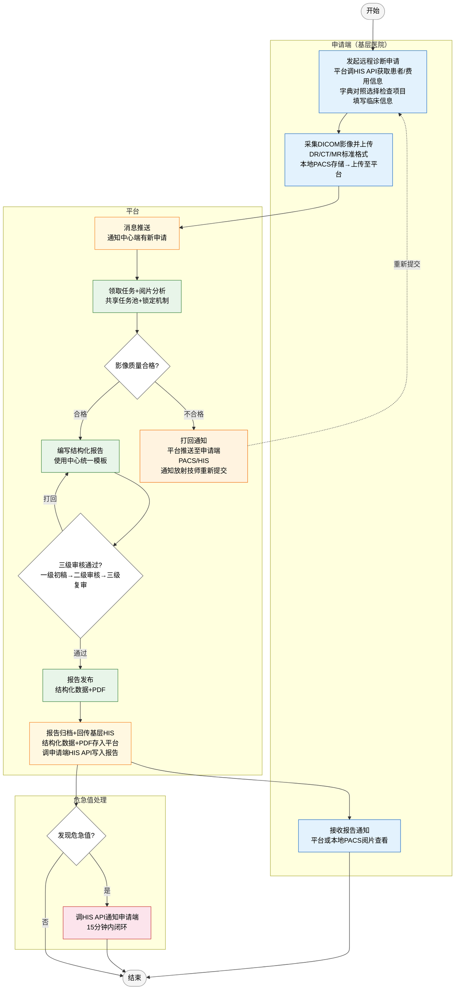
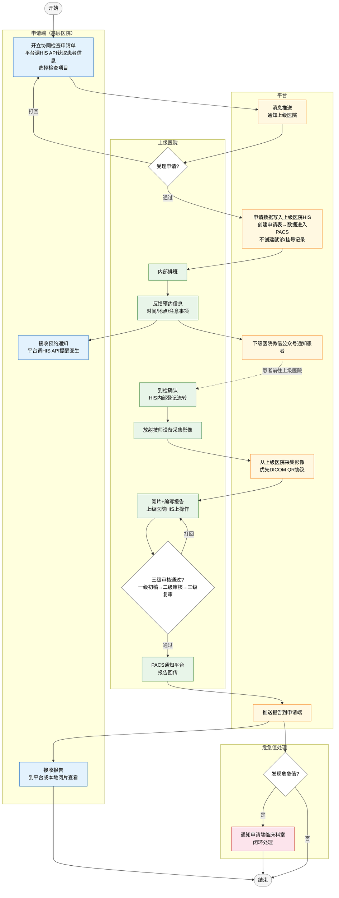

# 需求规约 - 影像诊断中心系统

# 修订历史记录

| **日期** | **版本** | **说明** |
| --- | --- | --- |
| 2026/05/13 | v0.1 | 初稿，基于远程诊断和检查协同流程梳理 |
| 2026/05/14 | v0.2 | 需求规约审查修订：模块合并（F03/F04→F04阅片与报告编写、F08/F09→F08受理与安排、F10/F11→F09数据回传与通知）、新增F02影像管理、数据模型统一、关键属性按实体/列表重组、字段精简 |
| 2026/05/18 | v0.3 | 功能模块合并与解耦：F03/F07合并为F03检查申请、F04/F05/F06合并为F04诊断报告（统一报告生命周期）、删除原F08（影像采集归入F02、报告归入F04）；编号从12个精简为8个 |
| 2026/05/18 | v0.4 | 流程覆盖性修正：检查协同报告改为平台书写审核发布（两条业务线统一）、F05补充到检确认阶段、删除PACS报告回传接口、上级医院操作平台改为平台；同步更新流程文档和决策D05 |
| 2026/05/18 | v0.5 | HIS对接原则重构（D04）：从"HIS厂商不配合改造"改为双向接口原则——查询类HIS必须提供接口、推送类HIS可选推送或拉取；同步更新约束、假设、接口定义、各功能模块描述 |
| 2026/05/18 | v0.6 | 修正D05：检查协同报告改为上级医院HIS书写后上传平台（非平台书写），F04恢复两条路径（远程诊断平台书写+检查协同外部接收），恢复I02.2报告上传接口 |
| 2026/05/18 | v0.7 | SRS文本一致性修正：F03后置条件明确采集异步性、I01-7澄清仅适用于远程诊断、F04阶段四补充平台边界说明、统一双向原则措辞、修正参与者和接口来源表述 |
| 2026/05/19 | v0.8 | 数据模型一致性修订：F04领单记录更名（原受理记录）、F03申请单补充锁定字段、F04报告补充报告状态、F05预约信息补充预约状态、F06消息补充是否已读、F01补充审计字段；统一命名（书写医生、目标上级医院、HIS同步状态、处理状态、检查项目名称、申请单号） |
| 2026/05/19 | v0.9 | F02影像源重构：从"源医院PACS"升级为"影像源"概念，支持PACS系统（DICOM协议）、共享文件夹/NAS、FTP服务器、人工上传四种采集方式；主事件流按影像源类型分支；采集记录属性泛化（影像源标识） |
| 2026/05/20 | v1.0 | 删除F06消息中心模块：各业务模块自行通过HIS推送/拉取传递数据，用户通过列表页按状态查询业务进展，危急值通知走HIS通道（去掉平台弹窗）；原F07重编号为F06，原F08重编号为F07；删除原I01-5消息通知推送接口 |
| 2026/05/20 | v1.1 | 软件接口重构：按数据流向重组为查询类（I01-I04）、写入类（I05-I06）、接收类（I07）、影像采集（I08）、患者通知（I09）；新增接口总览表；统一字段格式；补充JSON数据结构示例（标注来源模块） |
| 2026/05/20 | v1.2 | F01字典映射简化：仅映射检查项目ID，部位/方法改为纯文本名称；F03申请单字段同步调整（检查部位/检查方法→检查项目名称）；F02影像采集恢复采集记录表，改为手动重新触发 |
| 2026/05/21 | v1.3 | F01关键属性具体化：字典项→项目，表名改为检查项目字典/映射；清理功能总览和F03主事件流中残留的"部位/方法"旧表述 |
| 2026/05/21 | v1.4 | F01 AI特征术语修正（字典项→检查项目）；F04参与者精简（移除不在平台操作的上级医院医师）；F04阶段一移除检查协同误引；I05请求示例移除bodyPart/method字段 |

# 简介

## 项目概述

### 背景与目标

#### 为什么要做

医共体内基层医疗机构（乡镇卫生院、县级医院）面临两大核心问题：

*   **影像诊断能力不足**：基层有检查设备（DR/CT/MR）但缺乏专业诊断医师
    
*   **检查设备匮乏**：部分基层机构没有影像检查设备
    

这导致患者不得不前往上级医院检查，增加了就医成本和时间，也造成了基层医疗资源的闲置或不足。

#### 目标

建立区域影像诊断中心系统，实现两种协同模式：

| 模式 | 场景 | 解决的问题 |
| --- | --- | --- |
| **远程诊断** | 基层有设备但缺诊断能力 | 基层采集影像 → 中心端远程阅片诊断 |
| **检查协同** | 基层无设备或人员不足 | 基层开单 → 患者到上级医院检查 → 报告回传 |

最终目标：

*   推动区域影像诊断资源的整合、共享和协同
    
*   提高区域整体影像诊断服务能力
    
*   促进影像诊断同质化管理
    
*   实现区域检查结果互认
    

### 范围与边界

#### 做什么（In Scope）

| 模块 | 说明 |
| --- | --- |
| F01 统一数据字典 | 机构科室、检查项目的映射对照管理 |
| F02 影像管理 | 平台统一从源医院采集 DICOM 影像（远程诊断+检查协同共用） |
| F03 检查申请 | 申请端发起检查申请（远程诊断/检查协同） |
| F04 诊断报告 | 报告完整生命周期：阅片编写 → 三级审核 → 发布/接收 |
| F05 检查协同受理 | 上级医院受理/打回、写入 HIS/PACS、预约通知 |
| F06 危急值管理 | 危急值判定、通知、闭环处理（15分钟内） |
| I01-I10 软件接口 | 与 HIS、PACS、电子病历、微信公众号等外部系统的接口 |

#### 不做什么（Out of Scope）

| 约束 | 原因 |
| --- | --- |
| 平台不收费 | 各医院本地收费，平台只记录费用信息用于统计对账 |
| 不建患者主数据 | 由医共体统一管理，平台通过接口查询引用 |
| 第一阶段不做质控管理 | 优先实现核心业务流程 |
| 不做历史影像对比 | 第一阶段只看本次检查 |
| 超声不纳入 | 仅支持标准 DICOM 格式（DR/CT/MR） |
| 不做管理员分配机制 | 采用共享任务池+锁定模式 |

#### 边界条件

| 项目 | 说明 |
| --- | --- |
| 影像格式 | 标准 DICOM（DR/CT/MR），超声不纳入 |
| 数据保留期 | 15 年 |
| 上线时间 | 2-3 个月 |

### 用户与场景

#### 用户角色

##### 申请端（基层医院）

| 角色 | 职责 | 操作平台 |
| --- | --- | --- |
| 放射技师（远程诊断） | 设备采集影像、发起远程诊断申请、上传影像 | 平台 |
| 临床医生（检查协同） | 帮患者开立协同检查申请单、通知患者 | 平台 |

0

##### 中心端（医共体影像诊断中心）

| 角色 | 职责 | 操作平台 |
| --- | --- | --- |
| 影像医师 | 加载影像阅片分析、编写结构化报告 | 平台 |
| 影像医师（审核） | 对报告进行三级审核签发 | 平台 |
| 平台管理员 | 管理平台配置、维护报告模板、查看工作量统计 | 平台 |

##### 上级医院（检查协同）

| 角色 | 职责 | 操作平台 |
| --- | --- | --- |
| 放射技师 | 设备采集影像、到检确认 | 平台 |
| 影像医师 | 阅片分析、编写报告、上传报告到平台 | 上级医院 HIS |
| 影像医师（审核） | 三级审核签发 | 上级医院 HIS |

#### 业务场景

##### 场景一：远程诊断

**典型流程：**

基层放射技师采集影像 → 平台自动采集 DICOM → 中心端影像医师阅片 → 编写结构化报告 → 三级审核 → 报告发布 → 回传基层 HIS

**适用情况：**

*   基层医院有 DR/CT/MR 设备
    
*   基层缺乏专业诊断医师
    
*   需要上级医院专家远程阅片
    

##### 场景二：检查协同

**典型流程：**

基层临床医生开立申请 → 上级医院受理 → 患者前往上级医院 → 上级医院检查采集 → 本地阅片出报告 → 报告上传平台 → 回传基层 HIS

**适用情况：**

*   基层医院没有影像检查设备
    
*   基层人员不足无法开展检查
    
*   需要到上级医院完成检查
    

### 功能需求

#### F01 统一数据字典

**做什么：** 管理各医院检查项目的映射对照关系

| 功能点 | 说明 |
| --- | --- |
| 字典数据管理 | HIS 厂商上传本机构检查项目字典 |
| 映射对照 | 手动映射 + 智能映射（向量相似度自动匹配） |
| 映射维护 | 支持修改、删除已建立的映射关系 |

#### F02 影像管理

**做什么：** 平台统一从源医院采集 DICOM 影像并存储

| 采集方式 | 说明 | 优先级 |
| --- | --- | --- |
| PACS 系统 | DICOM QR 协议（C-FIND/C-MOVE） | 高 |
| 共享文件夹/NAS/FTP | 按约定目录规则扫描 | 中 |
| 人工上传 | 通过浏览器上传 DICOM 文件 | 兜底 |

**存储方案：**

*   对象存储：SeaweedFS
    
*   元数据索引：RocksDB
    
*   数据量预估：5年约 2 亿条，保存 15 年
    

#### F03 检查申请

**做什么：** 申请端发起检查申请

| 申请类型 | 发起人 | 目标 |
| --- | --- | --- |
| 远程诊断 | 放射技师 | 中心端阅片诊断 |
| 检查协同 | 临床医生 | 上级医院检查 |

**核心功能：**

*   自动填充患者信息（HIS API）
    
*   检查项目选择（后端自动字典映射）
    
*   临床信息导入（电子病历接口）+ 手动填写（主诉必填、检查目的必填）
    
*   费用信息获取（HIS API）
    
*   支持保存草稿、撤销申请
    

#### F04 诊断报告

**做什么：** 报告完整生命周期管理

**远程诊断路径：** 阅片 → 编写结构化报告 → 三级审核 → 生成 PDF → 写入基层 HIS

**检查协同路径：** 上级医院 HIS 完成报告 → 上传平台 → 校验归档 → 写入基层 HIS

**三级审核：**

| 级别 | 角色 | 职称要求 |
| --- | --- | --- |
| 一级 | 书写医生 | 初级及以上 |
| 二级 | 审核医师 | 主治医师及以上 |
| 三级 | 复审医师 | 副主任/主任医师 |

#### F05 检查协同受理

**做什么：** 上级医院处理检查协同申请

| 阶段 | 操作 |
| --- | --- |
| 受理 | 查看申请 → 同意/打回 → 写入 HIS（只创建申请表，不创建就诊/挂号记录） |
| 预约通知 | 反馈预约信息 → 通知申请端医生 + 微信公众号通知患者 |
| 到检确认 | 放射技师确认到检 → 触发影像采集 |

#### F06 危急值管理

**做什么：** 危急值闭环处理

| 步骤 | 说明 |
| --- | --- |
| 发现 | 影像医师在阅片中发现疑似危急值 |
| 判定 | 平台调用 HIS API 获取危急值判定结果（HIS 侧负责判定） |
| 通知 | 通过推送或拉取模式通知申请端临床科室 |
| 闭环 | 临床医生确认处理，15 分钟内闭环 |

### 验收标准

#### 业务验收

| 验收项 | 通过标准 |
| --- | --- |
| 远程诊断流程 | 完整走通：申请 → 影像采集 → 阅片 → 三级审核 → 报告发布 → 回传基层 HIS |
| 检查协同流程 | 完整走通：申请 → 受理 → 预约通知 → 到检确认 → 影像采集 → 报告上传 → 回传基层 HIS |
| 危急值闭环 | 15 分钟内完成发现 → 通知 → 处理 → 闭环 |
| 三级审核 | 一级初稿 → 二级审核 → 三级复审完整流程 |
| 字典映射 | 机构间检查项目映射正确，业务数据跨机构流转无误 |

#### 技术验收

| 验收项 | 指标 |
| --- | --- |
| 影像采集 | 支持 DICOM QR 协议 + 文件共享两种方式 |
| 数据存储 | 5 年数据量约 2 亿条，保存 15 年 |
| 接口对接 | 10 个软件接口全部对接成功（I01-I10） |

#### 非功能验收

| 类别 | 验收项 | 指标 |
| --- | --- | --- |
| 可用性 | 系统可用性 | ≥ 99.9%（年停机 ≤ 8.76 小时） |
| 性能 | 页面加载 | < 3 秒 |
| 性能 | 列表查询 | < 2 秒 |
| 性能 | 表单提交 | < 2 秒 |
| 性能 | DICOM 影像加载（首张） | < 5 秒 |
| 性能 | DICOM 影像序列切换 | < 1 秒 |
| 性能 | HIS API 调用 | < 3 秒 |
| 性能 | 并发支持 | 100 用户同时在线 |
| 安全性 | 数据传输 | 全程 HTTPS |
| 安全性 | API 访问控制 | Token 认证 |
| 安全性 | 数据保留 | 影像数据 15 年，报告永久保存 |

#### 交付物验收

| 交付物 | 说明 |
| --- | --- |
| 需求规约 | SRS 文档（已确认） |
| 流程图 | 远程诊断流程图、检查协同流程图 |
| 接口文档 | I01-I10 接口规范（含请求/响应示例） |
| 系统代码 | 前后端源代码 |
| 测试用例 | 功能测试 + 接口测试 |
| 部署文档 | 系统部署和运维手册 |

### 接口清单

| 编号 | 接口名称 | 方向 | 说明 |
| --- | --- | --- | --- |
| I01 | 患者信息查询 | 平台 → 申请端 HIS | 获取患者基本信息 |
| I02 | 费用查询 | 平台 → 申请端 HIS | 获取检查费用 |
| I03 | 字典数据查询 | 平台 → HIS | 获取检查项目字典 |
| I04 | 检查记录查询 | 平台 → 申请端 HIS | 获取检查记录（含 StudyInstanceUID） |
| I05 | 申请数据写入上级 HIS | 平台 ↔ 上级 HIS | 检查协同受理后写入申请数据 |
| I06 | 报告写入基层 HIS | 平台 ↔ 基层 HIS | 报告发布后写入基层 HIS |
| I07 | 检查协同报告上传 | 上级 HIS → 平台 | 上级医院报告上传到平台 |
| I08 | 影像采集 | 平台 → 影像源 | DICOM QR / 文件共享 |
| I09 | 患者预约通知 | 平台 → 微信公众号 | 预约信息推送给患者 |
| I10 | 电子病历临床信息查询 | 平台 → 电子病历系统 | 导入主诉、现病史、既往史、临床诊断 |

## 目的

本文档是区域影像诊断中心系统（PACS Center）的软件需求规约（SRS），用于：

*   明确系统的功能需求和非功能需求，涵盖远程诊断和检查协同两大业务流程
    
*   指导开发团队进行系统设计和开发
    
*   作为测试团队编写测试用例的依据
    
*   作为业务方确认需求的正式文档
    

## 定义、首字母缩写词和缩略语

| 术语 | 说明 |
| --- | --- |
| PACS | Picture Archiving and Communication System，影像归档和通信系统 |
| HIS | Hospital Information System，医院信息系统 |
| CDR | Clinical Data Repository，临床数据中心 |
| DICOM | Digital Imaging and Communications in Medicine，医学数字成像和通信标准 |
| QR | Query/Retrieve，DICOM标准中的查询/检索协议 |
| DR | Digital Radiography，数字化X射线摄影 |
| CT | Computed Tomography，电子计算机断层扫描 |
| MR/MRI | Magnetic Resonance Imaging，磁共振成像 |
| 申请端 | 发起申请的基层医院或县级医院（非人民医院） |
| 中心端 | 医共体影像诊断中心，负责远程诊断阅片和报告 |
| 上级医院 | 检查协同中提供检查设备和诊断能力的医院（通常为县人民医院） |
| 放射技师 | 技术序列人员，操作设备采集影像，不能出具诊断报告 |
| 影像医师 | 医师序列人员，有执业医师资格，可出具诊断报告 |
| 三级审核 | 一级初稿（初级及以上）→ 二级审核（主治医师及以上）→ 三级复审（副主任/主任医师） |
| 全息视图 | HIS前端功能模块，集中展示患者全部诊疗信息，背后是CDR |
| SeaweedFS | 分布式对象存储系统，用于海量DICOM影像存储 |
| RocksDB | 嵌入式KV数据库，用于影像元数据索引 |
| CA | Certificate Authority，电子签名认证机构 |

## 参考资料

| 文档 | 说明 |
| --- | --- |
| 业务流程梳理.md | 两种业务流程的完整梳理及已确认决策 |
| 远程诊断流程梳理.md | 远程诊断详细业务流程（含17个步骤） |
| 检查协同流程梳理.md | 检查协同详细业务流程（含17个步骤） |
| 远程诊断待讨论清单.md | 远程诊断P01-P20讨论结果（除P15外均已确认） |
| 检查协同待讨论清单.md | 检查协同C01-C17讨论结果（全部已确认） |
| 影像诊断中心系统设计（钉钉） | 原始系统设计文档，功能模块参考 |
| WST 891-2026 | 放射科两级核片制度行业标准 |

## 概述

本文档包含以下章节：

*   第1章：简介，介绍文档目的、术语定义和参考资料
    
*   第2章：整体说明，概述系统背景、用户特征和约束条件
    
*   第3章：具体需求，按功能模块详细描述功能需求和非功能需求
    
*   第4章：接口需求，描述系统与HIS、PACS等外部系统的接口规范
    

# 整体说明

## 产品总体效果

区域影像诊断中心系统旨在推动区域影像诊断资源的整合、共享和协同，提高区域整体影像诊断服务能力和质量水平，实现两种协同模式：

**远程诊断**：基层有检查设备但缺诊断能力 → 基层采集图像，中心端远程阅片诊断

**检查协同**：基层无检查设备或人员不足 → 基层开单，患者前往上级医院检查，上级医院出报告回传

有效弥补基层机构影像诊断能力不足、资源匮乏的问题，促进影像诊断同质化管理和区域检查结果互认。

## 产品功能

| 功能模块 | 功能说明 |
| --- | --- |
| 统一数据字典 | 机构科室、检查项目的映射对照管理 |
| 影像采集与管理 | 平台统一从源医院PACS采集DICOM影像（远程诊断+检查协同共用） |
| 检查申请 | 申请端发起检查申请（远程诊断/检查协同），含患者信息、临床信息 |
| 诊断报告 | 报告完整生命周期：阅片编写→三级审核→发布/接收（覆盖远程诊断和检查协同） |
| 检查协同受理与安排 | 上级医院受理/打回、写入HIS/PACS、预约通知 |
| 危急值管理 | 危急值判定、通知、闭环处理（15分钟内） |
| 查询统计分析 | 工作量统计、报告查询、阳性率等 |

## 用户特征

### 申请端（基层医院）

| 角色 | 职责 | 操作平台 | 技术水平 |
| --- | --- | --- | --- |
| 放射技师（远程诊断） | 设备采集影像、发起远程诊断申请、上传影像 | 平台 | 熟悉医疗设备操作和基础系统使用 |
| 临床医生（检查协同） | 帮患者开立协同检查申请单、通知患者 | 平台 | 熟悉临床诊疗流程 |

### 中心端（医共体影像诊断中心）

| 角色 | 职责 | 操作平台 | 技术水平 |
| --- | --- | --- | --- |
| 影像医师 | 加载影像阅片分析、编写结构化报告 | 平台 | 专业放射科医师，熟悉影像诊断 |
| 影像医师（审核） | 对报告进行三级审核签发 | 平台 | 中级及以上职称医师 |
| 平台管理员 | 管理平台配置、维护报告模板、查看工作量统计 | 平台 | 具备系统管理能力 |

### 上级医院（检查协同）

| 角色 | 职责 | 操作平台 | 技术水平 |
| --- | --- | --- | --- |
| 放射技师 | 设备采集影像、到检确认 | 平台 | 熟悉医疗设备操作 |
| 影像医师 | 阅片分析、编写报告、上传报告到平台 | 上级医院HIS | 专业放射科医师 |
| 影像医师（审核） | 三级审核签发 | 上级医院HIS | 中级及以上职称医师 |

## 约束

*   平台不收费，各医院本地收费，平台只记录费用信息用于统计对账
    
*   不建患者主数据，由医共体统一管理，平台通过接口查询引用
    
*   不对接电子病历，临床信息由申请端填写，随申请单流转
    
*   第一阶段不做质控管理
    
*   第一阶段只看本次检查，不做历史影像对比
    
*   危急值闭环管理第一阶段要做
    
*   HIS对接双向原则：平台需获取的信息，HIS厂商提供固定查询接口；平台需推送的消息，HIS厂商可选提供推送接口或使用平台查询接口拉取
    
*   上线时间目标：2-3个月
    

## 假设与依赖关系

*   假设HIS厂商能按平台规范提供查询类接口（患者信息、费用、字典、检查记录等）；推送类消息HIS厂商可选提供推送接口或使用平台查询接口拉取
    
*   假设上级医院PACS支持DICOM QR协议或提供FTP/共享文件夹方式供平台获取影像
    
*   假设医共体已统一管理患者主数据
    
*   假设下级医院微信公众号可用于推送患者通知
    
*   CA对接取决于上级医院是否已有CA能力，非必须
    

## 需求子集

## 流程图

### 远程诊断流程



### 检查协同流程



# 具体需求

## 功能

### F01 统一数据字典

#### 参与者

平台管理员、HIS厂商

#### 需求背景

远程诊断和检查协同涉及多家医院，各医院的检查项目名称可能不同但实际含义相同。需要统一映射对照，保证业务数据在跨机构流转时能正确匹配。

#### 前置条件

平台管理员或HIS厂商已登录系统

#### 后置条件

字典映射关系已保存生效

#### 主事件流

1.  HIS厂商上传本机构的检查项目字典数据（手动录入或API导入）
    
2.  系统解析并存储字典数据，按机构归档
    
3.  管理员或HIS厂商进入字典对照管理页面，选择源机构和目标机构
    
4.  系统显示该机构对的字典映射列表及双方未映射的项目
    
5.  执行映射操作，支持以下两种方式（可混合使用）：
    
    *   **手动映射**：管理员或HIS厂商逐项选择建立映射关系
        
    *   **智能映射**：系统基于向量相似度自动匹配，管理员或HIS厂商校对确认
        
6.  系统保存映射关系
    
7.  已建立的映射关系支持修改和删除
    

#### 备选流

*   HIS厂商未上传字典数据时，系统提示先完成字典数据上传
    
*   智能映射对单条项目无匹配结果时，该条仍可通过手动方式建立映射
    

#### 业务规则

1.  HIS厂商需先上传本机构的字典数据，才能参与对照映射
    
2.  字典对照由管理员和HIS厂商协作完成，平台提供映射管理功能
    
3.  平台也可调用HIS API获取字典数据作为参考
    
4.  检查项目对照保证检查内容相同，名称可以不同
    
5.  智能映射结果需经人工校对确认后才生效
    
6.  此模块同时服务于远程诊断和检查协同两个流程
    

#### 关键属性

*   **辅助属性**：机构列表（从Base系统获取）、HIS字典原始数据（通过API获取）
    
*   **输入属性**：
    
    *   检查项目字典：机构ID、项目名称、项目编码、是否有效、上传时间
        
    *   检查项目映射：源机构ID、目标机构ID、源项目、目标项目、映射状态、是否有效、创建时间、更新时间
        
*   **显示属性**：
    
    *   检查项目字典列表：机构名称、项目名称、项目编码、是否有效、上传时间
        
    *   检查项目映射列表：源机构名称、目标机构名称、源项目、目标项目、映射状态、创建时间、更新时间
        

#### 评级要求

中 - 基础支撑功能

#### AI/智能特征

*   检查项目向量相似度匹配：对检查项目的名称进行语义向量化，计算相似度并推荐最佳匹配对，辅助人工快速完成映射校对
    

---

### F02 影像管理

#### 参与者

平台（系统自动）

#### 需求背景

远程诊断和检查协同都涉及DICOM影像的采集和管理。两条业务线统一由平台从源医院影像源采集影像，优先自动化采集（PACS/共享文件夹/FTP），人工上传作为兜底。医院影像源类型多样：有PACS系统的走DICOM协议，无PACS的可能使用共享文件夹/NAS或FTP存储影像。影像作为两个流程共用的基础数据，需要统一管理存储、索引和关联。

#### 前置条件

源医院影像源已接入平台并完成对接配置（PACS/共享文件夹/FTP）

#### 后置条件

影像已存储到SeaweedFS，元数据索引已写入RocksDB

#### 主事件流

**影像采集（远程诊断与检查协同共用）：**

1.  平台根据申请单确定源影像源（远程诊断取申请端影像源，检查协同取上级医院影像源）
    
2.  远程诊断：申请提交后自动触发采集；检查协同：上级医院HIS同步到检状态后触发采集
    
3.  平台根据影像源类型执行定位和采集：
    
    *   **PACS系统**：   a. 调用源医院HIS API获取检查记录信息   b. 若HIS返回StudyInstanceUID，按UID执行DICOM C-FIND精确查询；否则按患者信息（身份证号、姓名）模糊查询   c. 从查询结果确定目标StudyInstanceUID，执行DICOM C-MOVE采集影像
        
    *   **共享文件夹/NAS**：   a. 按约定目录规则扫描（目录结构：`{共享根目录}/{日期}/{检查号}/`）   b. 解析DICOM文件头匹配患者信息，确认目标影像后复制到平台
        
    *   **FTP服务器**：   a. 按约定目录规则扫描FTP目录   b. 解析DICOM文件头匹配患者信息，确认目标影像后下载到平台
        
    *   **无以上条件**：由人工通过浏览器将DICOM文件上传至平台
        
4.  采集成功后，系统解析DICOM文件，提取元数据（StudyInstanceUID、检查类型、影像数量等）
    
5.  系统将影像文件存储到SeaweedFS
    
6.  系统将元数据索引写入RocksDB
    
7.  系统创建影像记录和采集记录，关联申请单号
    
8.  采集失败自动重试（递增间隔），记录重试次数和失败原因；重试耗尽标记异常，等待人工处理
    

> PACS影像源连接信息优先级：HIS API动态返回 > 平台预配置

#### 备选流

**A1. 影像格式不合法** 文件非标准DICOM格式

1.  系统拒绝采集，提示"影像格式不合法，仅支持标准DICOM格式"
    

**A2. 采集失败**

1.  系统记录失败日志和失败原因
    
2.  自动重试（递增间隔），累计重试次数
    
3.  重试失败标记异常，等待人工处理
    

#### 业务规则

1.  仅支持标准DICOM格式（DR/CT/MR），超声不纳入
    
2.  存储方案：SeaweedFS（对象存储）+ RocksDB（元数据索引）
    
3.  数据量预估：5年约2亿条，要求保存15年数据
    
4.  数据量到10亿以上考虑分布式架构
    
5.  影像记录通过申请单号关联申请单（关联的申请单类型决定业务线归属）；报告通过影像ID关联影像
    
6.  影像源类型：PACS系统（DICOM协议）、共享文件夹/NAS、FTP服务器、人工上传；优先自动化采集，人工上传作为兜底
    
7.  共享文件夹/NAS目录约定：`{共享根目录}/{日期}/{检查号}/`，医院侧需按此规则组织DICOM文件
    
8.  远程诊断和检查协同使用相同的采集机制，区别仅在于源影像源不同
    

#### 关键属性

*   **辅助属性**：无
    
*   **输入属性**：
    
    *   影像记录：申请单号、StudyInstanceUID、检查类型、影像数量、存储路径、存储状态、入库时间
        
    *   采集记录：影像源标识（PACS的AE Title / 共享文件夹路径 / FTP地址）、采集方式、采集状态、采集时间、失败原因、重试次数
        
*   **显示属性**：
    
    *   影像列表：申请单号、患者姓名、影像数量、入库时间、存储状态
        
    *   采集记录：影像源标识、采集方式、采集状态、采集时间、失败原因、重试次数
        

#### 评级要求

高 - 核心基础功能

#### AI/智能特征

无

---

### F03 检查申请

#### 参与者

申请端用户（放射技师/临床医生）

#### 需求背景

基层医院通过平台发起检查申请，支持两种申请类型：

*   **远程诊断**：基层有检查设备但缺诊断能力，放射技师完成影像采集后，将患者信息、临床信息和DICOM影像提交给中心端进行诊断
    
*   **检查协同**：基层无检查设备或人员不足，临床医生帮患者向上级医院申请协同检查
    

两种类型的申请单共享同一数据结构，通过申请类型字段区分。

#### 前置条件

1.  用户已登录平台
    
2.  用户所属机构已在系统中配置
    
3.  数据字典对照完成
    

#### 后置条件

1.  申请单创建成功
    
2.  远程诊断：平台已触发从申请端PACS采集DICOM影像（异步执行，采集结果通过F02管理）
    
3.  消息已推送至对应端（远程诊断→中心端，检查协同→上级医院）
    

#### 主事件流

**远程诊断流程：**

1.  放射技师进入远程诊断申请页面
    
2.  放射技师输入患者标识（身份证号/就诊卡号）
    
3.  平台调用申请端HIS API获取患者信息并自动填充（姓名、性别、年龄、身份证号、联系方式、医保类型）
    
4.  若接口调用失败，放射技师手动填写患者信息
    
5.  系统自动填充：申请机构、申请科室、申请医生、申请时间
    
6.  放射技师选择检查项目（显示本院HIS字典，平台在后端自动完成字典映射，用户无感）
    
7.  单张申请单支持同一检查类型（DR/CT/MR）下的多个检查项目，不同类型需分别创建申请单
    
8.  放射技师填写临床信息：主诉（必填）、现病史（选填）、既往史（选填）、临床诊断（选填）、检查目的（必填）
    
9.  若为非强制申请，需填写申请原因（条件必填）
    
10.  平台调用申请端HIS费用查询API获取费用信息并自动填充
    
11.  放射技师提交申请
    
12.  平台自动从申请端PACS采集DICOM影像
    

**检查协同流程：**

1.  临床医生进入检查协同申请页面
    
2.  临床医生选择目标上级医院
    
3.  系统显示本院HIS中已维护的检查项目（下级医院需将协同项目维护到自己的HIS中）
    
4.  临床医生选择检查项目（显示本院HIS字典，平台在后端自动完成字典映射到上级医院项目，用户无感）
    
5.  临床医生点击"开立申请"，进入申请单填写页面
    
6.  临床医生输入患者标识（身份证号/就诊卡号）
    
7.  平台调用申请端HIS API获取患者信息并自动填充
    
8.  若接口调用失败，临床医生手动填写患者信息
    
9.  系统自动填充：申请机构、申请科室、申请医生、申请时间
    
10.  临床医生填写临床信息：主诉（必填）、现病史（选填）、既往史（选填）、临床诊断（选填）、检查目的（必填）
    
11.  平台调用申请端HIS费用查询API获取费用信息并自动填充
    
12.  临床医生提交申请
    

#### 备选流

**A1. HIS接口调用失败** 在步骤3（远程诊断）/ 步骤7（检查协同），若HIS接口调用失败

1.  系统提示"无法自动获取患者信息，请手动填写"
    
2.  流程转入手动填写模式
    

**A2. 保存草稿** 在步骤11（远程诊断）/ 步骤12（检查协同），用户可选择保存为草稿

1.  申请单保存成功，状态为"草稿"
    
2.  草稿可编辑、可删除
    

**A3. 撤销申请** 已提交但对端尚未领取/受理的申请

1.  申请端可主动撤回，申请单状态变回"草稿"
    
2.  已被对端领取/受理的申请不可撤回
    

#### 业务规则

1.  患者信息获取原则：平台主动调用HIS查询API获取，接口调用失败时支持手动填写兜底
    
2.  主诉和检查目的为必填项
    
3.  检查类型分为DR、CT、MR三大类
    
4.  费用信息在申请时从HIS实时获取；检查协同时由下级医院收费，平台只记录用于统计对账
    
5.  影像格式仅支持标准DICOM，超声不纳入范围
    
6.  远程诊断由放射技师发起，检查协同由临床医生发起
    
7.  检查协同时，下级医院需将协同项目维护到自己的HIS中，平台后端通过字典映射关联到上级医院项目
    
8.  字典对照由HIS厂商在平台上完成，平台提供管理员管理映射功能
    

#### 关键属性

*   **辅助属性**：可选检查项目列表（字典对照后）、上级医院列表（检查协同）、费用标准（HIS返回）
    
*   **输入属性**：
    
    *   申请单：申请单号（系统生成）、申请类型（远程诊断/检查协同）、检查类型（DR/CT/MR）、目标上级医院（检查协同时必填）、患者姓名、患者性别、患者年龄、身份证号、联系方式、医保类型、主诉、现病史、既往史、临床诊断、检查目的、申请原因（远程诊断非强制申请时填写）、检查项目ID、检查项目名称、费用金额、费用来源、申请机构、申请科室、申请医生、申请时间、申请单状态、锁定状态、锁定操作人ID
        
*   **显示属性**：
    
    *   远程诊断申请单列表：申请单号、状态、患者姓名、检查项目名称、申请时间
        
    *   协同申请单列表：申请单号、状态、患者姓名、目标上级医院、检查项目名称、申请时间
        

#### 评级要求

高 - 核心功能

#### AI/智能特征

无

---

### F04 诊断报告

#### 参与者

中心端影像医师、平台（系统自动）

#### 需求背景

覆盖诊断报告的完整生命周期。两条业务线的报告来源不同：

*   **远程诊断**：中心端影像医师在平台阅片、编写报告、三级审核通过后发布
    
*   **检查协同**：上级医院影像医师在本地HIS完成阅片、报告编写和审核发布，报告通过接口上传到平台
    

报告是同一聚合（DiagReport）内的实体，通过申请单号关联申请单。

#### 前置条件

1.  阅片与编写：存在状态为"待阅片"的远程诊断申请单
    
2.  审核：存在状态为"待审核"的报告
    
3.  发布：三级审核全部通过
    
4.  报告接收：上级医院已发布检查协同报告
    

#### 后置条件

1.  阅片与编写：报告初稿已保存，申请单状态变为"待审核"（远程诊断）
    
2.  审核：三级审核全部通过进入发布流程，或打回给原书写医生（远程诊断）
    
3.  发布：报告已归档，申请端已收到通知，申请单状态更新为"已完成"（远程诊断）
    
4.  报告接收：外部报告已归档，申请端已收到通知，申请单状态更新为"已完成"（检查协同）
    

#### 主事件流

**阶段一：阅片与报告编写（远程诊断）**

1.  影像医师进入远程诊断任务列表
    
2.  系统显示所有"待阅片"状态的申请单（共享任务池）
    
3.  影像医师选择一条申请单并点击"开始处理"
    
4.  系统锁定该申请单（其他医生可见但标记为"处理中"，点击时提示"该申请正在被处理"）
    
5.  系统通过网页端DICOM阅片工具加载影像供医师查看（基于Web的影像渲染，无需安装本地客户端）
    
6.  影像医师使用图像处理工具进行阅片分析（窗宽窗位调节、放大缩小、测量标注等）
    
7.  影像医师判断影像质量合格
    
8.  影像医师选择适用的报告模板（由中心管理员维护）
    
9.  影像医师以所见即所得方式编写结构化报告：检查所见、诊断小结、诊断意见
    
10.  影像医师可选择是否标记为危急值（若标记危急值，系统触发危急值通知流程，详见F06）
    
11.  影像医师提交报告初稿，申请单状态变为"待审核"
    
    **阶段二：报告审核（三级审核，远程诊断）**
    
    | 级别 | 角色 | 职称要求 | 操作 |
    | --- | --- | --- | --- |
    | 一级 | 书写医生 | 初级及以上 | 编写结构化报告初稿（阶段一完成） |
    | 二级 | 审核医师 | 中级（主治医师）及以上 | 审核签发 |
    | 三级 | 复审医师 | 副主任/主任医师 | 复审确认 |
    
12.  审核医师进入待审核报告列表
    
13.  系统显示当前待本级审核的报告列表
    
14.  审核医师选择一条报告查看详情
    
15.  系统显示完整报告内容、患者信息和关联影像
    
16.  审核医师审核报告内容和质量，点击"通过"或"打回"
    
17.  三级审核全部通过后，进入发布流程
    
    **阶段三：报告发布（远程诊断）** 18. 系统检测到报告三级审核通过事件 19. 系统生成报告PDF文件 20. 系统将报告结构化数据归档到数据库，PDF文件归档到平台对象存储（SeaweedFS） 21. 系统通过推送或拉取模式将报告数据写入基层医院HIS（推送：平台调用HIS接口写入；拉取：HIS调用平台接口获取） 22. 报告写入成功后，基层医生在本地HIS收到新报告通知 23. 系统更新申请单状态为"已完成"
    
    **阶段四：检查协同报告接收（检查协同）**
    
    > 步骤24由上级医院在其本地HIS内独立完成，平台在此期间处于等待接收状态。步骤25起为平台侧操作。
    
18.  上级医院影像医师在本地HIS完成阅片、报告编写、三级审核和发布（此过程完全在上级医院HIS内进行）
    
19.  上级医院HIS将已发布报告（结构化数据）通过接口上传到平台，平台生成PDF文件
    
20.  平台接收并校验报告数据（申请单号匹配、数据完整性检查）
    
21.  校验通过后，平台归档报告到数据库和对象存储（SeaweedFS）
    
22.  平台推送报告通知到申请端
    
23.  系统更新申请单状态为"已完成"
    

#### 备选流

**A1. 影像质量不合格** 在阶段一步骤7

1.  影像医师点击"打回"
    
2.  系统弹出打回原因输入框，医师填写打回原因（必填）
    
3.  系统更新申请单状态为"已打回"，解除锁定
    
4.  平台通过推送或拉取模式通知申请端打回消息（推送：调用HIS消息接口；拉取：HIS调用平台查询接口获取）
    
5.  补充渠道：站内消息、独立桌面端弹窗
    

**A2. 放弃处理** 在阶段一步骤4之后

1.  系统解除锁定
    
2.  申请单重新回到共享任务池
    

**A3. 保存暂存** 在阶段一步骤11

1.  报告内容保存成功，不改变申请单状态
    
2.  可继续编辑后再次提交
    

**A4. 审核打回** 在阶段二步骤16

1.  审核医师填写打回原因（必填）
    
2.  系统更新报告状态为"已打回"
    
3.  消息通知原书写医生修改
    
4.  书写医生修改后重新提交，回到对应审核级别
    

**A5. HIS写入失败** 在平台报告发布步骤21

1.  系统记录写入失败日志
    
2.  按递增间隔自动重试（1分钟、2分钟、5分钟、10分钟、20分钟，最多5次）
    
3.  若重试均失败，标记为异常，等待人工处理
    

**A6. 检查协同报告接收失败** 在阶段四步骤25-26

1.  平台记录接收失败日志
    
2.  若数据校验失败（申请单号不匹配、数据不完整），通知上级医院重新上传
    
3.  若上传接口调用失败，标记为异常，等待上级医院重新上传
    

#### 业务规则

1.  第一阶段不做管理员分配机制，采用共享任务池+锁定模式
    
2.  锁定机制防止重复处理：一个医生开始处理后，该申请单对其他人标记为"处理中"
    
3.  阅片和报告编写是连续流程，同一医生完成，不回到任务池
    
4.  打回后可重新提交，无次数限制
    
5.  打回通知遵循双向原则：HIS厂商可选提供推送接收接口或使用平台查询接口拉取，补充渠道为站内消息、桌面端弹窗
    
6.  报告模板由中心管理员统一维护，支持双击或拖拽快速插入
    
7.  报告包含两种格式：结构化数据 + PDF
    
8.  平台统一存储所有流转的报告，报告通过申请单号关联申请单
    
9.  远程诊断报告在平台完成书写、三级审核和发布；检查协同报告在上级医院HIS书写发布后上传到平台
    
10.  报告发布时可带有医生图片签名
    
11.  费用信息按各医院本地收取，平台只记录用于统计对账
    
12.  不做超时机制，不处理的申请先挂着
    

#### 关键属性

*   **辅助属性**：患者历史信息、检查项目说明、报告模板列表
    
*   **输入属性**：
    
    *   领单记录：申请单号、处理医生、影像质量（合格/不合格）、打回原因
        
    *   报告：报告编号（申请单号+版本序号）、申请单号、报告来源（平台书写/外部上传）、报告状态（草稿/待审核/已打回/已发布）、检查所见、诊断小结、诊断意见、是否危急值、文件存储ID、书写医生、书写时间、归档时间、HIS同步状态
        
    *   审核记录：报告编号、审核结果（通过/打回）、审核意见/打回原因、审核人、审核时间、审核级别
        
*   **显示属性**：
    
    *   待阅片列表：申请单号、患者姓名、检查项目名称、申请机构、申请时间、当前状态、锁定状态
        
    *   待审核列表：申请单号、患者姓名、检查项目名称、书写医生、当前审核级别、审核状态
        
    *   报告列表：申请单号、患者姓名、申请类型、检查项目名称、报告来源、报告状态、书写时间
        

#### 评级要求

高 - 核心功能

#### AI/智能特征

无

---

### F05 检查协同受理

#### 参与者

上级医院、平台、申请端临床医生、患者

#### 需求背景

检查协同申请提交后，上级医院需要受理。受理通过后将申请数据写入上级医院HIS（进入PACS系统），上级医院内部排班完成后，通知申请端医生和患者预约信息。患者到检后，上级医院放射技师在平台确认到检，触发影像采集。

#### 前置条件

1.  存在状态为"待受理"的检查协同申请单
    
2.  上级医院HIS已对接平台（提供查询接口，推送接口或拉取模式二选一）
    

#### 后置条件

1.  受理结果已记录（同意/打回）
    
2.  若同意：申请数据已写入上级医院HIS并进入PACS系统
    
3.  排班完成后，申请端医生和患者已收到预约通知
    
4.  到检确认后，申请单状态变为"已到检"，影像采集已触发
    

#### 主事件流

**阶段一：受理**

1.  系统推送新申请通知至上级医院
    
2.  上级医院查看申请详情
    
3.  上级医院做出受理决定
    

**分支A：同意** 4. 平台通过推送或拉取模式将申请数据写入上级医院HIS（推送：平台调用HIS写入接口；拉取：HIS调用平台接口获取待写入数据） 5. 写入完成后：HIS创建检查申请表 → 数据进入PACS 6. 不创建就诊记录或挂号记录，只创建检查申请表 7. 申请单状态变为"已受理"

**分支B：打回** 8. 上级医院填写打回原因（必填） 9. 申请单状态变为"已打回" 10. 消息推送通知申请端临床医生

**阶段二：预约通知**（受理通过后） 11. 上级医院完成内部排班（线下/本地HIS处理，平台不管理） 12. 上级医院反馈预约信息：时间、地点、注意事项、检查前准备等 13. 平台通知申请端医生：通过推送或拉取模式发送预约提醒（推送：调用HIS消息接口；拉取：HIS调用平台接口获取）；补充渠道为站内消息、桌面端弹窗 14. 平台通知患者：通过下级医院微信公众号推送检查时间、地点、注意事项 15. 患者按预约时间前往上级医院

**阶段三：到检确认**（患者到达上级医院后） 16. 上级医院放射技师在平台找到对应的协同申请单 17. 放射技师确认患者已到检，点击"确认到检" 18. 申请单状态变为"已到检"，触发平台从上级医院PACS采集影像（详见F02）

#### 备选流

**A1. HIS写入失败** 在步骤4

1.  记录失败日志
    
2.  自动重试
    
3.  重试失败则标记异常等待人工处理
    

#### 业务规则

1.  上级医院HIS对接：推送接口或拉取模式二选一
    
2.  不产生挂号记录，所有费用按下级收费
    
3.  只创建申请表，数据必须进入PACS系统（核心目的）
    
4.  不做超时机制，不受理的申请先挂着不通知
    
5.  打回后可重新提交
    
6.  排班由上级医院内部处理，平台不管理排班信息
    
7.  医生通知通过推送或拉取模式送达，补充渠道为站内消息、桌面端弹窗
    
8.  患者通知通过下级医院微信公众号推送
    

#### 关键属性

*   **辅助属性**：申请单详情
    
*   **输入属性**：
    
    *   受理记录：申请单号、受理结果、打回原因（若打回）、受理人、受理时间、HIS同步状态
        
    *   预约信息：申请单号、预约状态（待通知/已通知/已确认/已过期）、预约时间、预约地点、注意事项、检查前准备
        
    *   到检记录：申请单号、到检确认人、到检确认时间
        
*   **显示属性**：
    
    *   受理列表：申请单号、患者姓名、目标上级医院、检查项目名称、当前状态
        
    *   预约列表：申请单号、患者姓名、预约状态、预约时间
        

#### 评级要求

高 - 核心功能

#### AI/智能特征

无

---

### F06 危急值管理

#### 参与者

中心端/上级医院影像医师、申请端临床科室

#### 需求背景

诊断过程中发现危急值时，需要及时通知申请端临床科室处理，并在规定时间内完成闭环管理。此功能同时服务于远程诊断和检查协同。

#### 前置条件

1.  诊断过程中发现危急值
    
2.  平台已对接HIS危急值数据
    

#### 后置条件

1.  危急值通知已送达申请端临床科室
    
2.  申请端已确认处理，闭环完成
    

#### 主事件流

1.  影像医师在阅片/诊断过程中发现疑似危急值
    
2.  平台调用HIS查询API获取危急值判定结果（HIS侧负责业务判定）
    
3.  确认为危急值后，系统触发危急值通知：
    
    *   通过推送或拉取模式通知申请端临床科室
        
    *   平台弹窗提醒
        
    *   放射科安装专门的危急值通知程序作为兜底
        
4.  申请端临床科室收到通知
    
5.  临床医生确认并处理危急值
    
6.  处理结果反馈至平台（或通过HIS同步）
    
7.  危急值闭环完成
    

#### 备选流

无

#### 业务规则

1.  危急值判定不由平台做，从HIS获取判定结果
    
2.  处理时限：不超过15分钟，具体以HIS的危急值管理制度为准
    
3.  平台不处理升级机制，升级由HIS侧负责
    
4.  通知渠道遵循双向原则：HIS厂商可选提供推送接口或使用平台查询接口拉取，补充渠道为平台弹窗、放射科通知程序
    
5.  远程诊断和检查协同共用同一套危急值流程
    

#### 关键属性

*   **辅助属性**：患者信息、检查项目、HIS危急值规则
    
*   **输入属性**：
    
    *   危急值记录：申请单号、危急值类型、危急值内容、发现时间、发现人、通知时间、处理状态、处理结果、处理时间、闭环完成时间
        
*   **显示属性**：
    
    *   危急值列表：患者姓名、危急值类型、发现时间、处理状态、是否超时
        

#### 评级要求

高 - 核心功能（涉及患者安全）

#### AI/智能特征

无

---

### F07 查询统计（后续阶段实现）

> 第一阶段不实现，预留需求框架。

---

## 可用性

### 响应式设计

系统前端页面需支持嵌入HIS系统（iFrame/内置浏览器），适配常见的电脑屏幕尺寸（如1920×1080、1366×768等）。

### 操作简便性

*   申请单填写支持自动填充已知信息（HIS API获取）
    
*   提供清晰的流程状态提示和进度展示
    
*   操作结果有明确反馈
    
*   阅片工具需符合放射科医生的操作习惯
    

## 可靠性

### 系统可用性

*   系统可用性 ≥ 99.9%（年度停机时间约8.76小时）
    
*   计划内维护时间不计入可用性统计
    

### 数据持久化

*   影像数据需持久化存储，确保不丢失，要求保存15年
    
*   报告数据（结构化+PDF）需永久保存
    
*   审核记录需完整保存，支持追溯
    
*   数据量预估：5年约2亿条影像记录
    

## 性能

### 响应时间

| 操作 | 响应时间要求 |
| --- | --- |
| 页面加载 | < 3秒 |
| 列表查询 | < 2秒 |
| 表单提交 | < 2秒 |
| DICOM影像加载（首张） | < 5秒 |
| DICOM影像序列切换 | < 1秒 |
| HIS API调用 | < 3秒 |

### 并发能力

*   支持100用户同时在线操作
    
*   支持多机构同时使用
    
*   高峰期（工作日上午）响应时间可放宽至标准值的1.5倍
    

### 存储容量

*   影像存储方案：SeaweedFS + RocksDB元数据索引
    
*   数据量到10亿以上考虑分布式扩展
    
*   支持热数据SSD + 近线存储的分层策略（后续阶段）
    

## 安全性

### 数据传输安全

*   所有API通信必须使用HTTPS协议
    

### API访问控制

*   HIS系统调用本系统API需进行Token认证
    
*   Token由平台统一发放和管理
    

### 敏感信息保护

患者信息完整展示，不做脱敏处理。

### 会话管理

*   用户会话依赖Base系统管理
    
*   会话超时时间由Base系统控制
    

---

## 设计约束

### 技术栈约束

| 层级 | 技术方案 |
| --- | --- |
| 影像存储 | SeaweedFS（对象存储）+ RocksDB（元数据索引） |
| 影像格式 | 标准DICOM（DR/CT/MR），超声不纳入 |
| 影像采集 | 平台主动采集，优先DICOM QR协议，备选FTP/共享文件夹 |
| 数据保留期 | 15年 |

### 架构约束

*   系统需接入Base系统进行用户认证
    
*   前端页面需支持iFrame/内置浏览器嵌入HIS
    
*   HIS对接遵循双向接口原则：查询类HIS厂商按规范提供，推送类HIS厂商可选推送接口或使用平台查询接口拉取
    
*   不建患者主数据，由医共体统一管理
    

---

## 接口

### 用户界面

系统提供以下主要页面：

| 页面 | 说明 | 使用角色 |
| --- | --- | --- |
| 远程诊断申请 | 填写申请单、上传影像 | 申请端放射技师 |
| 远程诊断任务列表 | 查看/领取待阅片任务 | 中心端影像医师 |
| 远程诊断阅片 | 加载影像、图像处理工具 | 中心端影像医师 |
| 远程诊断报告编写 | 编写结构化报告 | 中心端影像医师 |
| 远程诊断审核 | 三级审核操作 | 中心端审核医师 |
| 检查协同申请 | 查看项目、开立申请单 | 申请端临床医生 |
| 检查协同受理 | 受理/打回操作 | 上级医院 |
| 字典对照管理 | 维护字典映射关系 | 平台管理员/HIS厂商 |
| 报告模板管理 | 维护报告模板 | 平台管理员 |
| 查询统计 | 记录查询、工作量统计 | 各角色/管理员 |
| 消息中心 | 查看通知消息 | 各角色 |
| 危急值处理 | 查看/处理危急值 | 申请端临床科室 |

### 软件接口

> **原则**：平台需获取的信息，HIS厂商按规范提供固定查询接口，平台主动调用；平台需推送/写入的消息和数据，HIS厂商可选提供推送接收接口（平台主动推送）或使用平台查询接口主动拉取。

#### 接口总览

| 编号 | 接口名称 | 方向 | 类型 | 说明 |
| --- | --- | --- | --- | --- |
| I01 | 患者信息查询 | 平台 → 申请端HIS | 查询 | 获取患者基本信息 |
| I02 | 费用查询 | 平台 → 申请端HIS | 查询 | 获取检查项目费用 |
| I03 | 字典数据查询 | 平台 → HIS | 查询 | 获取机构字典数据 |
| I04 | 检查记录查询 | 平台 → 申请端HIS | 查询 | 获取检查记录和PACS信息 |
| I05 | 申请数据写入上级HIS | 平台 → 上级HIS | 写入 | 检查协同受理后写入申请 |
| I06 | 报告写入基层HIS | 平台 → 基层HIS | 写入 | 远程诊断报告发布后回传 |
| I07 | 检查协同报告上传 | 上级HIS → 平台 | 接收 | 接收检查协同报告 |
| I08 | 影像采集 | 平台 → 影像源 | 采集 | 采集DICOM影像 |
| I09 | 患者预约通知 | 平台 → 微信公众号 | 通知 | 推送预约信息给患者 |

#### I01 患者信息查询（平台 → 申请端HIS）

| 属性 | 说明 |
| --- | --- |
| 请求方式 | GET/POST |
| 触发时机 | 用户输入患者标识后自动调用 |
| 输入参数 | 患者标识（身份证号/就诊卡号） |
| 返回数据 | 姓名、性别、年龄、身份证号、联系方式、医保类型等 |
| 异常处理 | 接口调用失败时，支持手动填写兜底 |

#### I02 费用查询（平台 → 申请端HIS）

| 属性 | 说明 |
| --- | --- |
| 请求方式 | GET/POST |
| 触发时机 | 选择检查项目后自动调用 |
| 输入参数 | 检查项目编码 |
| 返回数据 | 费用金额、收费项目说明 |

#### I03 字典数据查询（平台 → HIS）

| 属性 | 说明 |
| --- | --- |
| 请求方式 | GET/POST |
| 触发时机 | 字典维护时参考获取 |
| 输入参数 | 字典类型 |
| 返回数据 | 字典项列表（项目名称、项目编码） |

#### I04 检查记录查询（平台 → 申请端HIS）

| 属性 | 说明 |
| --- | --- |
| 请求方式 | GET/POST |
| 触发时机 | 申请单提交后，平台采集影像前 |
| 输入参数 | 患者标识（身份证号）、检查项目编码、时间范围（可选） |
| 返回数据 | StudyInstanceUID、检查时间、PACS节点信息（AE Title、IP、端口） |
| 异常处理 | 不支持时平台用预配置PACS信息 + 患者信息查询兜底 |

#### I05 申请数据写入上级HIS（平台 ↔ 上级HIS）

**推送模式（平台主动写入）：**

| 属性 | 说明 |
| --- | --- |
| 请求方式 | POST |
| 触发时机 | 检查协同受理通过后 |
| 主要字段 | 患者信息、检查项目、临床信息、申请端信息 |
| 特殊要求 | 只创建申请表进入PACS，不创建就诊/挂号记录 |

**请求数据结构（来源：F03检查申请）：**

```json
{
  "applicationNo": "APP20260521001",
  "applicationType": "COLLABORATION",
  "patient": {
    "name": "张三",
    "gender": "男",
    "age": 45,
    "idCard": "330102199001011234",
    "phone": "13800138000",
    "insuranceType": "城镇职工医保"
  },
  "examItem": {
    "itemId": "CT001",
    "itemName": "胸部CT平扫"
  },
  "clinicalInfo": {
    "chiefComplaint": "咳嗽伴胸痛1周",
    "historyOfPresentIllness": "1周前无明显诱因出现咳嗽",
    "pastHistory": "",
    "clinicalDiagnosis": "待查",
    "purposeOfExam": "排除肺部占位性病变"
  },
  "applicantInfo": {
    "applyOrgId": "ORG001",
    "applyOrgName": "XX镇卫生院",
    "applyDept": "放射科",
    "applyDoctor": "李医生",
    "applyTime": "2026-05-21 10:30:00"
  },
  "targetHospital": {
    "hospitalId": "HOSP001",
    "hospitalName": "XX县人民医院"
  }
}
```

**拉取模式（上级HIS主动拉取）：**

| 属性 | 说明 |
| --- | --- |
| 请求方式 | GET |
| 触发时机 | 上级HIS定时轮询 |
| 返回数据 | 待写入的申请数据列表（数据结构同上） |

#### I06 报告写入基层HIS（平台 ↔ 基层HIS）

**推送模式（平台主动写入）：**

| 属性 | 说明 |
| --- | --- |
| 请求方式 | POST |
| 适用范围 | 仅远程诊断（检查协同报告由上级医院HIS发布后上传平台，平台接收归档后通过消息通知推送申请端） |
| 触发时机 | 远程诊断报告发布后（F04阶段三步骤21） |
| 主要字段 | 申请单号、报告结构化数据、PDF文件引用 |

**请求数据结构（来源：F04诊断报告）：**

```json
{
  "applicationNo": "APP20260521001",
  "report": {
    "reportId": "RPT20260521001-01",
    "reportSource": "PLATFORM_WRITTEN",
    "reportStatus": "PUBLISHED",
    "finding": "右肺上叶见一大小约2.5cm×3.0cm的类圆形高密度影...",
    "impression": "右肺上叶占位性病变，建议进一步检查",
    "diagnosis": "右肺上叶占位性病变：肺癌可能性大",
    "isCritical": false,
    "writer": {
      "doctorId": "DOC001",
      "doctorName": "王医师"
    },
    "writeTime": "2026-05-21 14:30:00",
    "archiveTime": "2026-05-21 15:00:00"
  },
  "pdfFileId": "FILE20260521001"
}
```

**拉取模式（基层HIS主动拉取）：**

| 属性 | 说明 |
| --- | --- |
| 请求方式 | GET |
| 触发时机 | 基层HIS定时轮询 |
| 返回数据 | 已发布的报告列表（数据结构同上） |

#### I07 检查协同报告上传（上级HIS → 平台）

| 属性 | 说明 |
| --- | --- |
| 请求方式 | POST |
| 触发时机 | 上级医院HIS报告审核发布后 |
| 主要字段 | 申请单号、报告结构化数据、报告PDF |
| 校验规则 | 申请单号必须匹配平台已有申请单，数据完整性检查 |
| 异常处理 | 校验失败通知上级医院重新上传 |

**请求数据结构（来源：F04诊断报告）：**

```json
{
  "applicationNo": "APP20260521001",
  "report": {
    "reportId": "RPT20260521001-01",
    "reportSource": "EXTERNAL_UPLOADED",
    "finding": "右肺上叶见一大小约2.5cm×3.0cm的类圆形高密度影...",
    "impression": "右肺上叶占位性病变，建议进一步检查",
    "diagnosis": "右肺上叶占位性病变：肺癌可能性大",
    "isCritical": false,
    "writer": {
      "doctorId": "DOC002",
      "doctorName": "赵医师"
    },
    "writeTime": "2026-05-21 16:00:00"
  },
  "pdfBase64": "JVBERi0xLjQK..."
}
```

#### I08 影像采集（平台 → 影像源）

| 属性 | 说明 |
| --- | --- |
| 优先协议 | DICOM QR (Query/Retrieve) |
| 备选协议 | FTP、共享文件夹 |
| 兜底方式 | 手动上传文件 |
| 元数据索引 | RocksDB (StudyInstanceUID/SeriesInstanceUID/SOPInstanceUID) |
| 对象存储 | SeaweedFS |

#### I09 患者预约通知（平台 → 微信公众号）

| 属性 | 说明 |
| --- | --- |
| 用途 | 推送检查预约和注意事项给患者 |
| 接入方 | 下级医院微信公众号 |
| 推送内容 | 预约时间、地点、注意事项、检查前准备 |
| 触发时机 | 检查协同排班完成反馈后 |

### 通信接口

*   使用HTTPS协议
    
*   数据格式为JSON
    
*   DICOM影像传输使用DICOM标准协议