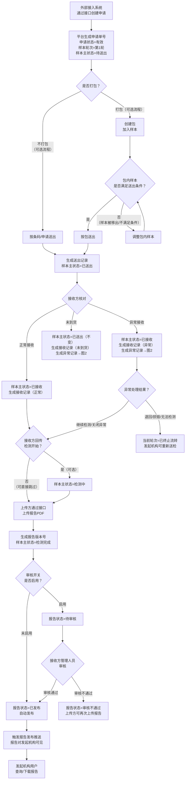
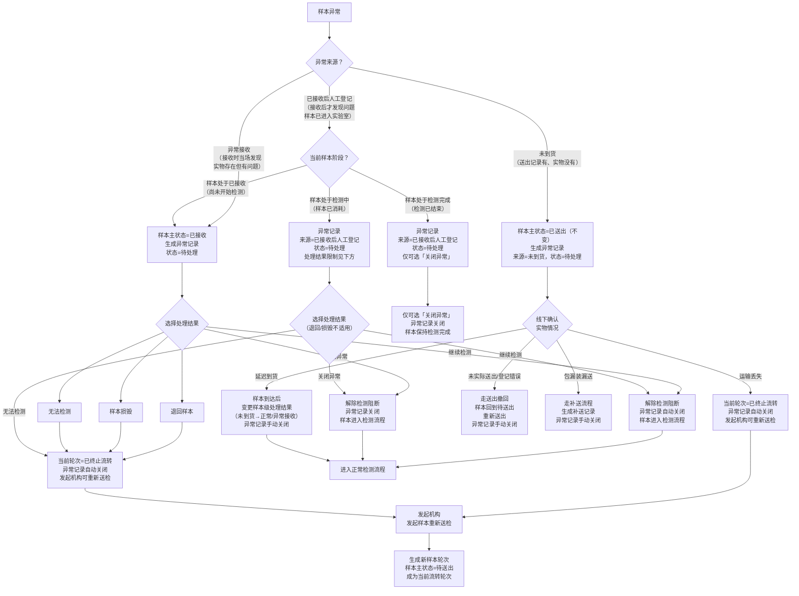
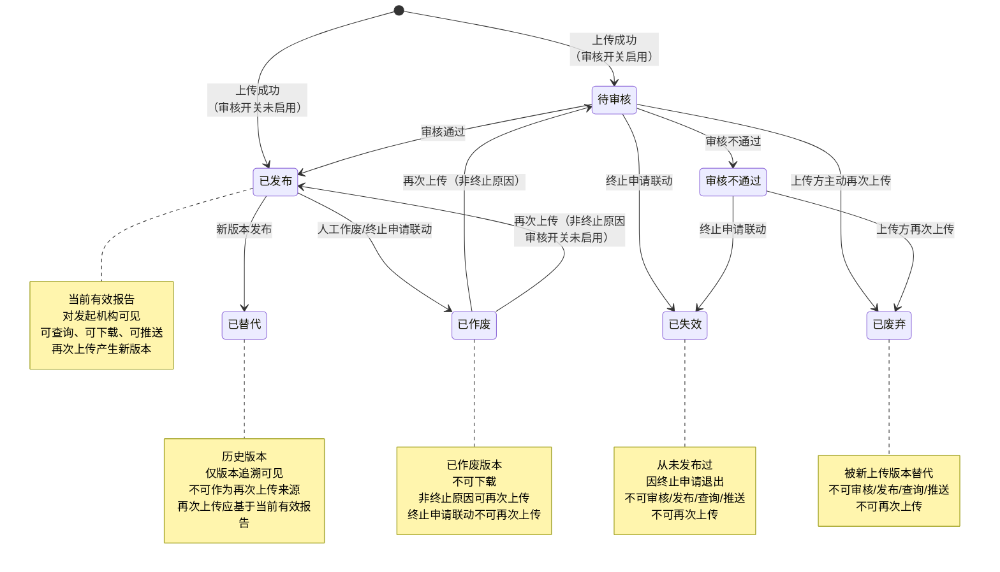
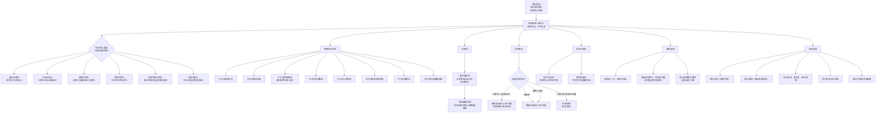
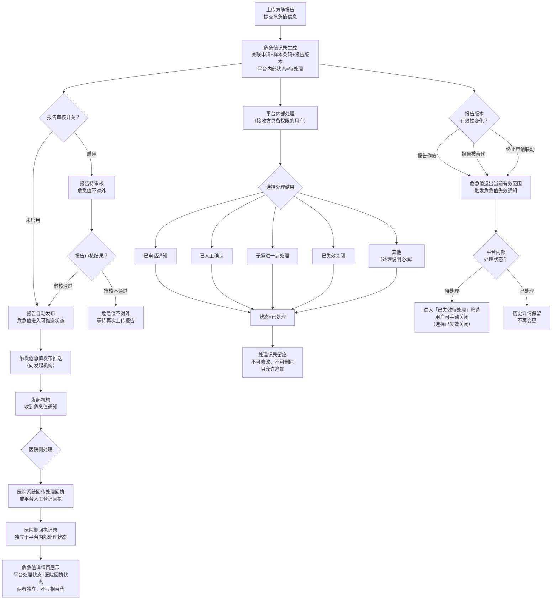

# PRD 核心业务流程图

> 基于 PRD_第五版修订稿2.md 绘制，用于辅助理解需求。
> 流程图使用 Mermaid 语法，支持 Markdown 渲染器直接展示。

---

## 图1：申请全生命周期（主流程）

---

## 图2：样本异常处理分支

---

## 图3：报告版本管理状态机

---

## 图4：终止申请联动处置

---

## 图5：危急值处理闭环

---

## 图例说明

| 图号 | 标题 | 覆盖章节 | 核心说明 |
|------|------|----------|----------|
| 图1 | 申请全生命周期 | 1.1-1.7 | 创建→打包(可选)→送出→接收→检测(可选)→报告上传→审核→发布的完整主链 |
| 图2 | 样本异常处理分支 | 1.4.6, 1.6 | 三条异常来源（异常接收/未到货/已接收后人工登记）及其处理路径，含不同样本阶段的处理结果限制 |
| 图3 | 报告版本管理状态机 | 1.7.11, 1.7.16-1.7.17 | 7种报告状态之间的流转规则，含各状态的再次上传权限差异 |
| 图4 | 终止申请联动处置 | 1.1.10 | 终止申请对样本、包、报告、条码、通知的全链路联动，含6种终止类型和报告差异化处置 |
| 图5 | 危急值处理闭环 | 1.8, 1.9.5, 1.9.9 | 危急值随报告进入→平台内部处理/医院回执双轨并行→失效处理，含已失效待处理筛选 |
