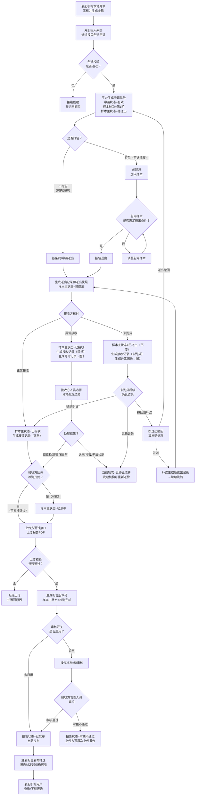
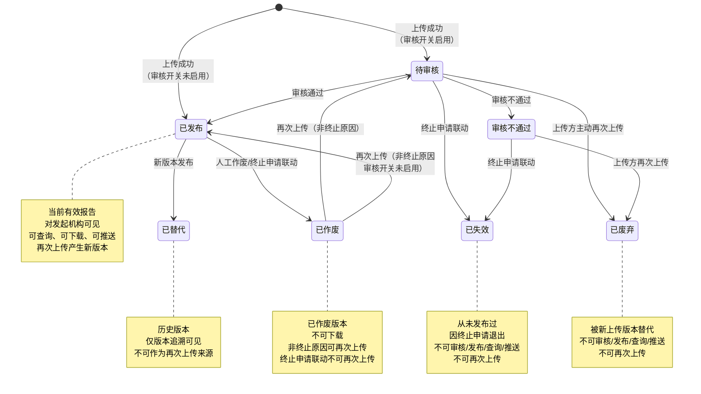
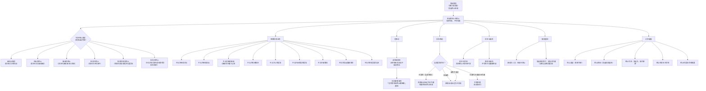
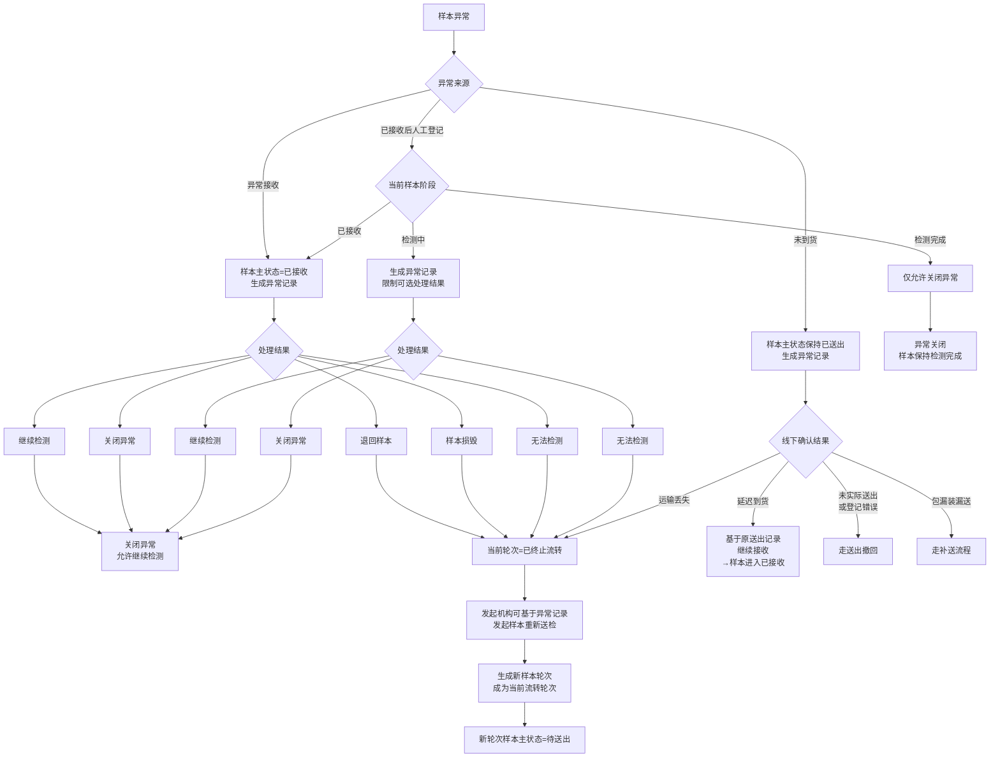
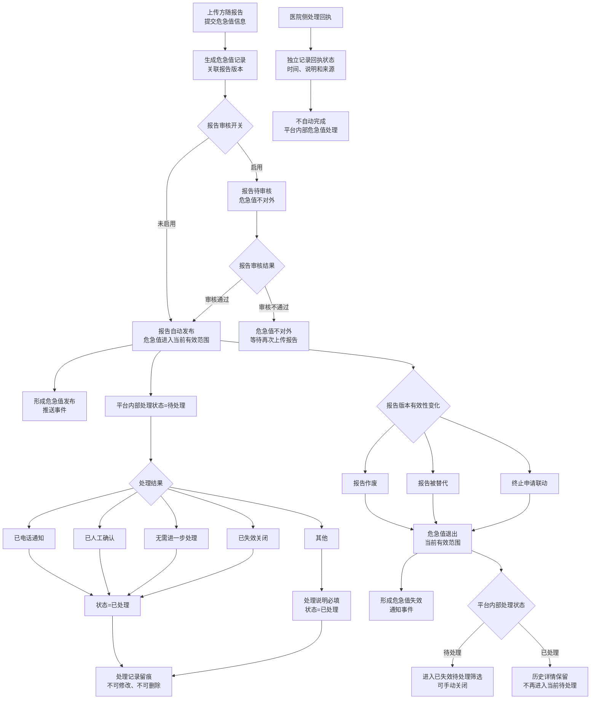

# 需求规约 - 检验中心协同平台

> 版本：第六版评审稿修订2
>
> 状态：基于审查报告完成修复，待业务评审确认
>
> 日期：2026-05-31
>
> 编写原则：以《PRD_第五版修订稿2.md》为业务规则依据；《PRD_第四版修订稿.md》仅用于补充背景和流程表达。凡与第五版修订稿2不一致的内容，不纳入本版本。

---

## 修订记录

| 版本 | 日期 | 状态 | 说明 |
| --- | --- | --- | --- |
| 第六版评审稿 | 2026-05-29 | 待评审 | 基于第五版修订稿2重组为软件需求规约格式；完成 F01-F11 模块一致性精修、接口边界收口、验收标准可测性整理、Mermaid 8.8.0 兼容修复和评审清单整理 |
| 第六版评审稿（修订） | 2026-05-31 | 待评审 | 跨文档结构一致性审查与修复：补充术语表 12 条、接口 JSON 示例 11 个、业务标签枚举表、报告版本可见性矩阵、推送触发矩阵、通知期望动作表、异常追加字段规则表；修复重复编号、兜底操作边界、"接口设计文档定义"语义逃逸等问题 |
| 第六版评审稿修订2 | 2026-05-31 | 待评审 | 审查修复：补全术语表 6 条（阻断性异常、终止申请拦截记录、样本级处理结果、报告审核开关、接收侧处理结果摘要、业务标签）、恢复第五版流转追溯路径表/项目清单排序规则/报告查询场景文案表/审核记录规则/当前有效报告判定规则、新增待配套设计确认事项章节、统一"样本级处理结果"术语、F02/F04/F08 补状态子章节、合并 F07 冗余前置条件、非功能章节层级提升、out of scope 补 3 项、核心业务字段明确最小比对字段集、修复评审说明接口编号（I12→I11） |

---

## 简介

### 目的

本文档是检验中心协同平台的软件需求规约（SRS），用于：

* 明确检验申请、样本流转、报告、危急值、推送和业务追溯边界等业务需求。
* 指导开发团队进行系统设计、接口设计和功能实现。
* 作为测试团队编写测试用例和验收用例的依据。
* 作为业务方、实施方、医院信息科和外部系统厂商确认需求范围的正式文档。

### 项目背景

#### 为什么要做

县域医共体或区域检验协同场景中，发起机构、接收方、HIS、LIS、检验系统、中间件和消息推送系统需要围绕检验申请、样本送出、样本接收、检测、报告发布、报告推送和危急值处理形成统一业务链路。

当前业务中主要存在以下问题：

* **跨机构流转不透明**：申请、样本、报告和危急值分散在不同系统中，送出、接收、异常、检测、报告发布等节点缺少统一追溯。
* **样本状态和业务对象边界容易混淆**：申请状态、样本主状态、送出记录状态、异常状态、报告状态和推送状态需要分别表达，不能混为一个状态字段。
* **报告和危急值协同边界需要明确**：平台不出具报告、不自动判断危急值，但需要接收报告、控制审核发布、记录危急值并形成业务推送和处理留痕。
* **平台能力与外部系统责任需要清晰分工**：开单、采样、收费、医保、医院临床危急值闭环、接口安全和推送失败处理等能力应明确由对应系统或配套设计承担。

#### 目标

建立检验中心协同平台，实现从检验申请接收、样本送出、样本接收、异常处理、报告上传审核发布、危急值记录、报告和危急值推送到业务追溯的协同管理。

| 模式/场景 | 适用场景 | 解决的问题 |
| --- | --- | --- |
| 发起机构送检到接收方 | 发起机构已完成开单、采样和条码打印，需要将样本送至接收方检测 | 建立申请、样本、项目、接收方、报告之间的统一链路 |
| 样本按条码或按包流转 | 发起机构需要逐条码送出，或将同一机构样本归集为包后送出 | 记录送出快照、接收结果和样本当前状态 |
| 报告上传、审核与发布 | 上传方通过平台对外接口提交报告，平台按审核开关控制发布 | 保留报告版本、审核记录、当前有效报告和作废记录 |
| 危急值记录与通知 | 上传方随报告提交危急值信息，需要平台记录、通知和留痕 | 明确平台内部处理与医院侧处置回执的边界 |

最终目标：

* 建立跨机构检验协同的统一业务流转和追溯链路。
* 明确申请、样本、报告、危急值、推送等对象的生命周期和状态边界。
* 支持外部接入系统通过接口与平台协作，并明确平台页面能力与对外接口能力的边界。
* 避免将收费、医保、临床处置闭环、统计分析、接口运维等非本期内容混入核心业务范围。

### 范围与边界

#### 做什么（In Scope）

| 模块 | 说明 |
| --- | --- |
| F01 申请管理 | 接收发起机构通过平台对外接口提交的检验申请，生成平台申请单号，维护申请、机构申请、患者摘要、就诊摘要、项目、样本条码、接收方、费用状态和绿色通道信息 |
| F02 样本打包管理 | 将同一发起机构且符合条件的样本归集为平台业务包，支持按包送出、按包接收和追溯 |
| F03 样本送出管理 | 支持发起机构按条码/申请或按包送出样本，形成送出记录和送出快照，支持送出撤回和补送 |
| F04 样本接收管理 | 支持接收方按条码或按包接收样本，接收结果包括正常接收、异常接收和未到货 |
| F05 样本状态管理 | 以样本轮次为维度管理样本主状态和状态变更历史 |
| F06 样本异常处理 | 记录异常接收、未到货、接收后异常等样本异常，并支持继续检测、退回样本、样本损毁、无法检测、运输丢失、关闭异常等处理结果 |
| F07 报告审核与发布 | 接收上传方提交的报告，按审核开关控制发布，支持报告重传、作废、版本追溯和当前有效报告判定 |
| F08 危急值记录与处理留痕 | 接收上传方随报告提交的危急值信息，记录平台内部处理状态和处理留痕 |
| F09 报告和危急值推送管理 | 定义报告、危急值、报告审核结果和医院侧危急值处理回执的业务边界 |
| F10 平台内部通知 | 在关键业务事件发生时，向通知对象范围内的平台用户形成申请详情时间线中的通知事件 |
| F11 检验项目目录与对照管理 | 维护平台标准检验项目目录，以及发起机构项目编码与平台标准项目编码的对照关系 |
| I01-I11 平台对外接口 | 汇总发起机构侧、接收方或上传方侧、医院侧外部接入接口能力 |

#### 不做什么（Out of Scope）

| 约束 | 原因 |
| --- | --- |
| 不建设独立待办中心 | 当前版本通过业务列表、详情和时间线承载提示与追溯 |
| 不做危急值超时提醒和升级提醒 | 危急值处理时限和升级机制不纳入当前版本 |
| 不做危急值处理附件、批量处理和独立导出 | 当前版本仅做处理记录留痕 |
| 不单独推送旧报告版本失效通知 | 报告重传发布后通过新版本发布通知体现更新 |
| 不定义推送系统的失败处理、补充推送、运维和机构对接规则 | 由推送系统配套设计定义 |
| 不展示系统接口排障信息 | 当前业务页面只展示业务可见记录 |
| 不建设独立业务运维与追溯查询页面 | 运维追溯通过申请详情、接收记录、异常处理、报告查询等页面完成 |
| 不定义权限系统角色模型、权限点配置、授权流程、组织范围和数据范围 | 由统一权限系统定义 |
| 不定义隐私保护、脱敏、敏感信息搜索和敏感信息导出规则 | 当前版本不纳入相关规则设计 |
| 不定义外部系统不可用、接口异常和系统故障处理规则 | 由对应系统设计、技术方案或非功能设计阶段定义 |
| 不支持申请内项目级部分终止 | 终止申请按整单处理 |
| 不支持无异常记录触发的样本重新送检 | 重新送检必须关联允许触发的异常记录 |
| 不支持平台页面人工上传报告或平台出具报告 | 报告只能由上传方通过平台对外接口提交 |
| 不支持物流追踪 | 样本送出后至接收前的运输过程不纳入平台管理 |
| 不支持申请创建后变更接收方 | 接收方属于核心业务字段，创建后不可修改 |
| 不做异常记录超时自动处理 | 异常记录创建后如长时间无人处理，状态保持为待处理，需人工手动关闭 |
| 不支持同一申请下多个样本轮次并行流转 | 同一申请同一时间只能存在一个当前流转轮次，多个轮次不可并行送出、并行接收或并行检测 |
| 不支持项目加急等级、加急 SLA、加急超时提醒或加急升级提醒 | 项目加急仅作为排序和展示标识，不设置时效管理机制 |

#### 边界条件

| 项目 | 说明 |
| --- | --- |
| 申请创建入口 | 平台仅支持外部接入系统通过平台对外接口创建申请，不提供正常业务下的页面人工补录申请入口 |
| 样本条码 | 平台不生成、不打印样本条码；样本条码由发起机构本地系统生成 |
| 条码唯一性 | 样本条码不要求全平台唯一，跨申请唯一性范围限定为同一发起机构内 |
| 当前流转轮次 | 同一申请同一时间只能存在一个当前流转轮次 |
| 报告来源 | 报告 PDF 由上传方通过平台对外接口提交，结构化结果和危急值信息可随报告提交 |
| 检测中状态 | 检测中为可选状态，可由接收方对外接口回传，也可跳过 |
| 费用状态 | 费用状态和绿色通道只记录、展示和查询，不阻断主流程 |
| 项目目录 | 平台维护标准项目目录和机构项目对照，但不维护价格、医保、参考范围、危急值阈值、检测方法学、设备和试剂规则 |

### 功能入口边界清单

| 业务能力 | 平台页面 | 对外接口 | 当前结论 |
| --- | --- | --- | --- |
| 创建申请 | 不提供 | 提供 | 必须由发起机构外部接入系统提交，平台页面不提供人工补录入口 |
| 申请查询、申请详情和流转时间线 | 提供 | 不作为本期对外接口 | 作为平台页面查询和追溯能力 |
| 终止申请 | 提供 | 提供 | 发起机构可通过页面或接口触发 |
| 样本重新送检 | 提供 | 提供 | 必须关联允许触发重新送检的异常记录 |
| 费用状态和绿色通道变更 | 不提供 | 提供 | 只允许发起机构外部接入系统变更，平台页面仅展示和查询 |
| 创建包 | 提供 | 提供 | 发起机构用户可页面创建，发起机构外部接入系统可接口创建 |
| 调整包和作废包 | 提供 | 不提供 | 仅作为发起机构用户页面操作 |
| 样本送出 | 提供 | 提供 | 支持按条码、按申请或按包送出 |
| 送出撤回和补送 | 提供 | 不提供 | 仅作为发起机构用户页面操作 |
| 获取待接收清单 | 提供 | 提供 | 接收方可通过页面或接口获取 |
| 样本接收确认 | 提供 | 提供 | 支持正常接收、异常接收和未到货 |
| 回传检测开始 | 不提供独立页面入口 | 提供 | 检测中状态仅由接口回传或后续检测流程触发 |
| 人工直接修改样本主状态 | 不提供 | 不提供 | 样本主状态只能由业务动作驱动 |
| 上传报告 | 不提供 | 提供 | 报告只能由上传方通过对外接口提交 |
| 重传报告 | 不提供 | 提供 | 报告重传只能由上传方通过对外接口提交 |
| 报告审核 | 提供 | 不提供 | 仅接收方管理人员通过平台页面审核 |
| 报告作废 | 提供 | 不提供 | 仅接收方管理人员或平台运营人员通过平台页面作废 |
| 危急值随报告创建 | 不提供 | 提供 | 危急值只能随报告上传进入平台 |
| 危急值处理 | 提供 | 不提供 | 平台内部危急值处理只通过页面留痕 |
| 医院侧危急值处理回执 | 不提供人工登记入口 | 提供 | 只允许发起机构系统通过医院侧接口回传 |
| 平台内部通知 | 提供展示 | 不提供 | 仅在申请详情时间线和申请列表筛选中体现 |
| 项目目录维护 | 提供 | 不提供 | 由平台运营人员通过页面维护 |
| 机构项目对照维护 | 提供 | 不提供 | 平台运营人员通过页面维护，发起机构用户可查看 |
| 业务数据导出 | 不提供 | 不提供 | 当前版本不支持申请、报告、异常等业务数据导出 |
| 物流追踪 | 不提供 | 不提供 | 当前版本不管理运输轨迹 |
| 接口排障信息展示 | 不提供 | 不提供 | 当前业务页面不展示系统接口排障信息 |

### 业务场景

#### 场景一：发起机构送检到接收方

**典型流程：**

本地开单、采样并生成条码 -> 外部接入系统创建平台申请 -> 样本进入待送出 -> 发起机构按条码或按包送出 -> 接收方正常接收 -> 上传方上传报告 -> 平台按审核开关发布报告 -> 平台形成报告查询、推送和追溯记录。

**适用情况：**

* 发起机构本地系统已完成开单、采样和条码打印。
* 接收方负责样本接收、检测和报告出具。
* 报告由上传方通过平台对外接口提交。

#### 场景二：样本异常后重新送检

**典型流程：**

样本接收或检测过程中形成异常记录 -> 接收方登记处理结果 -> 处理结果允许重新送检 -> 发起机构基于异常记录发起样本重新送检 -> 原轮次进入已终止流转 -> 新轮次成为当前流转轮次并进入待送出。

**适用情况：**

* 当前样本轮次因退回样本、样本损毁、无法检测、运输丢失等原因不再继续流转。
* 申请仍有效，发起机构需要在同一申请下继续检测。

#### 场景三：报告重传与当前有效报告更新

**典型流程：**

上传方提交报告 PDF，可随报提交结构化结果和危急值信息 -> 平台生成报告版本 -> 审核通过或自动发布后成为当前有效报告 -> 上传方发现需要更新 -> 通过接口重传生成新版本 -> 新版本发布后成为当前有效报告 -> 原已发布版本标记为已替代。

**适用情况：**

* 报告内容需要修正或更新。
* 平台需要保留所有历史版本、替代关系和状态变化记录。

#### 场景四：危急值记录与处理留痕

**典型流程：**

上传方随报告提交危急值信息 -> 报告发布后危急值进入当前有效范围 -> 平台触发危急值相关业务通知或推送 -> 接收方检验人员在平台内记录处理结果 -> 发起机构系统可通过医院侧接口回传危急值处理回执。

**适用情况：**

* 危急值由上传方判定并随报告提交。
* 平台不自动判断危急值，不替代医院临床危急值处置闭环。

### 定义、首字母缩写词和缩略语

| 术语 | 说明 |
| --- | --- |
| 平台申请单号 | 平台在申请创建成功后生成的唯一标识，用于在平台内定位一笔申请 |
| 机构申请号 | 发起机构本地 HIS/LIS 系统生成的申请编号，用于机构侧识别同一笔申请 |
| 患者摘要 | 平台为申请查询、详情展示、送出快照、报告追溯和危急值推送保存的患者概要信息；最小字段集包括姓名、性别、年龄、证件号、联系方式，具体信息项由接口设计阶段细化补充 |
| 就诊摘要 | 平台为申请查询、详情展示和业务追溯保存的本次就诊概要信息；具体信息项由接口设计阶段细化 |
| 样本条码 | 发起机构采样后生成并打印的条码，贴于样本实物上；不要求全平台唯一，唯一性范围限定为同一发起机构内 |
| 样本主状态 | 表达具体样本轮次在平台主流程中的当前位置，包括待送出、已送出、已接收、检测中、检测完成、已终止流转 |
| 样本轮次 | 同一申请下多次样本流转的顺序编号；申请创建时生成第 1 轮，每次样本重新送检生成下一轮 |
| 当前流转轮次 | 同一申请下当前正在操作的样本轮次，是送出、接收、检测、报告上传等业务动作的操作对象 |
| 发起机构 | 提交检验申请的医疗机构，负责开单、采样、送样 |
| 发起机构用户 | 发起机构内经权限系统授权的平台业务用户，可在本机构权限范围内查看申请、样本、报告、通知和项目对照，并通过平台页面执行发起机构侧业务动作 |
| 接收方 | 接收样本并完成检验的机构，负责接收、检测、出具报告 |
| 接收方人员 | 接收方用户、接收方检验人员和接收方管理人员的统称，用于通知对象等不需要细分权限点的场景 |
| 业务用户 | 发起机构用户、接收方用户和接收方检验人员的统称，区别于具备管理权限的接收方管理人员和平台运营人员 |
| 包创建者 | 创建包的发起机构用户，用于包内样本因终止被阻断等内部通知场景 |
| 上传方 | 代表接收方通过平台对外接口向平台提交报告 PDF，并可随报提交结构化结果和危急值信息的接收方机构或其授权系统 |
| 申请状态 | 表达平台申请本身是否仍然有效，包括有效和已终止；不承载样本流转状态、报告状态、异常状态或推送状态 |
| 终止类型 | 由系统根据终止发生时样本所处阶段自动判定的分类标识，包括未送出取消、送出后终止、接收后终止、检测中终止、检测完成后终止、报告后终止；用于记录终止时申请所处的业务阶段，不由发起机构选择 |
| 核心业务字段 | 申请创建后不可修改、重复提交时用于一致性判断的字段集合；包括发起机构、机构申请号、原始样本条码、患者摘要关键信息、就诊摘要关键信息、平台标准项目编码清单、接收方、样本类型等 |
| 样本类型 | 发起机构创建申请时提交的样本实物类型信息（如血液、尿液、组织等）；属于核心业务字段，创建后不可修改，具体信息项由接口设计文档定义 |
| 平台标准项目目录 | 由平台运营人员维护的平台级标准检验项目集合，包含组合项目和明细项目，是申请创建时项目识别和追溯的依据 |
| 当前有效危急值 | 来自当前有效报告版本且已进入当前有效范围的危急值记录；报告作废、被替代或终止申请联动后退出当前有效范围，不再作为当前有效危急值 |
| 平台标准项目编码 | 平台标准检验项目目录中的项目唯一标识 |
| 费用状态 | 发起机构提交并可后续通过接口变更的费用相关业务标识，只记录、展示和查询，不阻断平台主流程 |
| 绿色通道 | 发起机构提交的特殊业务识别信息，只作为人工识别和业务核对参考，不改变平台主流程 |
| 项目加急 | 申请项目上的加急标识，由发起机构在创建申请时随项目清单指定；只影响项目清单排序、展示和人工识别，不改变样本送出、接收、检测、报告上传和报告发布主流程 |
| 组合项目 | 由多个明细项目组成的一组检验项目 |
| 明细项目 | 组合项目下的具体检测项 |
| 包 | 平台内用于将同一发起机构的多个样本条码归集为一个业务单元，用于按包送出、按包接收和追溯 |
| 流转时间线 | 申请详情中以时间顺序展示的申请全生命周期事件视图，按样本轮次分组 |
| 外部接入系统 | 调用平台对外接口的第三方系统，包括发起机构 HIS/LIS、接收方 LIS/中间件等 |
| 送出记录 | 一次送出动作形成的业务凭证，包含送出记录号、送出方式、发起机构、接收方、样本清单和送出快照；是接收方待接收清单和后续追溯的依据 |
| 送出快照 | 送出记录中每个样本在送出时刻的不可变信息副本，至少包含平台申请单号、机构申请号、样本条码、患者摘要关键字段和平台标准项目编码清单 |
| 接收记录 | 接收方确认样本接收结果后形成的业务凭证，包含接收记录号、关联送出记录号、接收方、样本级接收结果（正常接收/异常接收/未到货）和异常信息（如有） |
| 异常记录 | 样本异常事件的独立业务记录，包含异常记录号、异常来源（异常接收/未到货/已接收后人工登记）、异常类型、处理结果和处理记录；不覆盖样本主状态 |
| 报告业务对象 | 同一申请下唯一的报告聚合实体；首次报告上传时创建，后续重传作为该对象的新版本，通过报告版本号区分 |
| 报告版本号 | 报告上传成功后平台生成的版本标识，用于区分同一申请下不同报告版本；可唯一识别、可排序、可追溯 |
| 当前有效报告 | 任一时间同一申请下状态为"已发布"且未被替代或作废的报告版本；面向业务用户的报告查询只提供当前有效报告 |
| 推送事件 | 平台在报告发布、报告作废、危急值发布、危急值失效或报告审核完成等关键节点形成的对外通知事件记录，包含推送类型、目标机构、触发时间和关联业务对象 |
| 医院侧处理回执 | 发起机构系统通过医院侧接口回传的危急值确认或处理结果，独立于平台内部危急值处理状态 |
| 业务留痕 | 平台各业务模块中不可编辑、不可删除的操作记录，包括状态变更历史、处理记录、审核记录、作废记录和变更留痕，作为操作证据保留 |
| 阻断性异常 | 处于"待处理"状态且未被"继续检测"或"关闭异常"解除的异常记录；存在阻断性异常时，样本默认不允许进入检测中或检测完成，具体受 F06 异常来源与处理结果适用范围约束 |
| 终止申请拦截记录 | 因申请已终止，平台在送出记录或接收环节拦截样本后续处理时形成的记录；不作为样本级接收结果，不生成接收记录，不进入异常处理范围，但可在申请详情流转时间线和送出记录详情中查看 |
| 样本级处理结果 | 送出记录中每个样本的当前处理结果状态，枚举值包括待接收、已撤回、已接收、异常接收、未到货、拦截（申请已终止）；其中仅"未到货"允许后续变更为"正常接收"或"异常接收"，其他枚举值一经确认不可修改 |
| 业务标签 | 附加在送出记录上的提示性标记，包括有撤回、有异常、补送；用于提示记录内存在特殊情况，各标签可叠加，不承担流程判断。各标签的触发条件和含义见总述"业务标签枚举" |
| 报告状态变化记录 | 报告状态在审核、发布、作废、重传、替代或终止申请联动等业务动作下发生变更时形成的不可编辑留痕；记录变更前状态、变更后状态和触发业务动作，与审核记录互补，不重复记录审核前/后状态 |
| 报告审核开关 | 控制报告上传后是否需经人工审核才能发布的平台级配置，默认启用；仅影响变更后新上传的报告，不改变已生成报告版本状态。当前版本不支持按机构或项目差异化配置 |
| 接收侧处理结果摘要 | 送出记录维度下，汇总本次送出所有样本的接收侧最终处理情况的展示信息；用于在送出记录列表和详情中快速了解接收进度和异常情况 |
| 送出记录状态结算 | 平台在每次接收确认或终止申请拦截后，重新评估送出记录中所有未撤回样本的处理结果，判断是否满足"接收完成"条件的过程；不表示独立的用户操作入口 |

### 业务标签枚举

业务标签是附加在送出记录上的提示性标记，用于提示记录内存在特殊情况，不承担流程判断。各标签可叠加使用。

| 标签 | 含义 | 触发条件 | 是否可叠加 |
| --- | --- | --- | --- |
| 有撤回 | 送出记录中存在部分样本已撤回，但未达到全部撤回 | 送出记录中一个或多个样本被撤回，但仍有未撤回样本 | 可与有异常、补送叠加 |
| 有异常 | 送出记录中存在异常接收、未到货或其他接收侧异常结果 | 送出记录中至少一个样本的接收结果为异常接收或未到货 | 可与有撤回、补送叠加 |
| 补送 | 该送出记录是原按包送出记录的补送记录 | 送出记录由补送操作生成 | 可与有撤回、有异常叠加 |

> 业务标签在送出记录中的具体应用规则（含撤回/异常/补送标签的生效与展示）见 F03 样本送出管理。

### 概述

本文档包含以下章节：

* 简介：介绍文档目的、项目背景、范围边界、业务场景、业务标签枚举和术语。
* 整体说明：描述产品总体效果、功能、用户特征、约束、依赖和流程图。
* 具体需求：按功能模块描述功能需求（F01-F11）、权限与外部依赖、非功能需求、设计约束和接口需求。
* 待配套设计确认事项：列出需在配套设计或平台统一规范中继续确认的事项。

## 整体说明

### 产品总体效果

检验中心协同平台作为跨机构检验协同业务平台，承接从申请接收、样本流转、异常处理、报告发布、危急值记录、通知推送到业务追溯的主链路。平台不替代发起机构本地开单系统、接收方 LIS、收费医保系统、权限系统、推送系统和医院临床危急值处置系统。

系统建成后，业务方应能够围绕一笔平台申请查看当前流转轮次、样本状态、包历史、送出记录、接收结果、异常记录、报告版本、危急值记录、推送记录和关键通知事件。

### 产品功能

| 功能模块 | 功能说明 |
| --- | --- |
| F01 申请管理 | 申请创建、重复提交识别、终止申请、样本重新送检、费用状态与绿色通道记录、申请查询与详情展示 |
| F02 样本打包管理 | 创建包、调整包内样本、作废包、查询包和包内样本历史 |
| F03 样本送出管理 | 按条码/申请或按包送出、形成送出记录和送出快照、送出撤回、送出补送 |
| F04 样本接收管理 | 待接收清单、按条码接收、按包接收、正常接收、异常接收、未到货 |
| F05 样本状态管理 | 样本主状态、检测中状态、检测完成触发、状态变更历史和页面维护边界 |
| F06 样本异常处理 | 异常记录创建、异常处理结果、重新送检联动、异常追加记录和异常详情 |
| F07 报告审核与发布 | 报告上传、审核开关、审核不通过、重传、作废、版本状态和当前有效报告 |
| F08 危急值记录与处理留痕 | 危急值来源、有效范围、内部处理状态和处理记录 |
| F09 报告和危急值推送管理 | 报告推送、危急值推送、审核结果推送、医院侧危急值处理回执 |
| F10 平台内部通知 | 关键业务事件在申请详情时间线和列表筛选中的提示 |
| F11 检验项目目录与对照管理 | 平台标准项目目录、机构项目对照、申请创建时项目识别 |

### 用户特征

#### 发起机构

| 角色 | 职责 | 操作平台 | 技术水平 |
| --- | --- | --- | --- |
| 发起机构 | 提交检验申请，负责开单、采样、送样、终止申请和样本重新送检 | 外部接入系统、平台页面 | 熟悉本机构 HIS/LIS 和送检流程 |
| 发起机构用户 | 查询申请、查看报告、查看流转追踪、查看项目对照、页面创建包、页面送出、页面终止申请、页面发起样本重新送检 | 平台页面 | 具备基础业务系统使用能力 |

#### 接收方

| 角色 | 职责 | 操作平台 | 技术水平 |
| --- | --- | --- | --- |
| 接收方 | 接收样本、检测、出具报告并由上传方提交至平台 | 平台页面、外部接入系统 | 熟悉样本接收和检验流程 |
| 接收方用户 | 查询提交给本接收方的申请和包 | 平台页面 | 具备基础业务系统使用能力 |
| 接收方检验人员 | 接收样本、处理危急值 | 平台页面 | 熟悉检验业务和危急值处理要求 |
| 接收方管理人员 | 报告审核、报告版本追溯、异常处理登记 | 平台页面 | 熟悉报告审核和业务管理要求 |

#### 平台运营方

| 角色 | 职责 | 操作平台 | 技术水平 |
| --- | --- | --- | --- |
| 平台运营人员 | 项目目录维护、项目对照维护、报告作废兜底处置、跨机构查询排查 | 平台页面 | 具备平台运维和业务配置能力 |

#### 外部系统

| 角色 | 职责 | 操作平台 | 技术水平 |
| --- | --- | --- | --- |
| 外部接入系统 | 调用平台对外接口，提交申请、送出、接收、检测状态、报告、危急值、回执等数据 | API | 由医院或厂商系统实现 |

### 约束

* 平台不承担开单职责，不作为医生或机构人员的检验申请录入系统。
* 平台不生成、不打印样本条码。
* 平台不负责收费、退费、医保结算和费用规则判断。
* 平台不自动判断危急值，不根据结构化结果、参考范围或 PDF 内容生成危急值。
* 平台不提供通用的样本主状态人工回退能力。
* 平台不建设独立的业务运维与追溯查询页面。
* 平台页面不提供人工上传报告或出具报告能力。
* 外部系统不可用、接口异常、系统故障等内容不纳入当前业务需求范围。

### 假设与依赖关系

* 假设发起机构本地系统已完成开单、采样、条码生成和条码打印。
* 假设发起机构提交的机构项目编码可通过平台维护的机构项目对照转换为平台标准项目编码。
* 假设接收方或上传方具备通过接口上传报告 PDF，并可随报上传结构化结果和危急值信息的能力。
* 假设统一权限系统可提供页面访问、数据范围和操作权限判断。
* 假设接口设计阶段会细化字段、传输方式、安全控制、错误码和调用细节。
* 假设推送系统配套设计会细化推送失败处理、补充推送、推送运维和机构对接方式。

### 流程图

#### 主业务流程



#### 报告版本流程



非终止原因作废后再次上传时，平台生成新的报告版本；新版本按报告审核开关进入待审核或已发布，原已作废版本状态不改变。

## 具体需求

### 功能

#### F01 申请管理

##### 参与者

发起机构、发起机构用户、平台、外部接入系统、接收方、上传方。

##### 需求背景

申请管理用于接收发起机构通过平台对外接口提交的检验申请，生成平台申请单号，并建立平台申请、机构申请、患者摘要、就诊摘要、平台标准项目编码、样本条码、接收方、费用状态和绿色通道信息之间的关系。

发起机构应在本地 HIS、LIS 或检验系统中完成开单、采样、条码生成和条码打印后，再提交至平台。平台不承担开单职责（见约束）。

##### 前置条件

1. 发起机构已在本地系统完成开单、采样、条码生成和条码打印。
2. 发起机构、接收方、机构项目对照和平台标准项目已满足启用和可用条件。
3. 外部接入系统具备调用平台创建申请接口的权限。
4. 发起机构创建申请时已提交机构项目编码、样本条码、接收方和必要的患者摘要、就诊摘要信息。

##### 后置条件

1. 创建成功后，平台生成平台申请单号。
2. 申请状态为有效。
3. 生成第 1 轮样本流转，且第 1 轮样本成为当前流转轮次。
4. 样本主状态进入待送出。

##### 主事件流

**阶段一：创建申请**

1. 发起机构在本地系统完成开单、采样和条码打印。
2. 外部接入系统向平台提交申请数据。
3. 平台校验必填信息、条码占用、机构项目对照、接收方范围和核心业务字段。
4. 校验通过后，平台创建申请，生成平台申请单号。
5. 平台保存申请创建快照、项目快照和第 1 轮样本信息。

**阶段二：申请查询和详情展示**

1. 用户进入申请列表，按平台申请单号、机构申请号、发起机构、样本条码、患者摘要关键字、申请时间、申请状态、样本主状态和接收方查询。
2. 系统按统一权限系统判断用户可见数据范围。
3. 用户进入申请详情，查看基础信息、患者摘要、就诊摘要、样本轮次、项目清单、费用状态、绿色通道、包、送出、接收、异常、报告、推送和流转时间线。
4. 申请详情按样本轮次展示生命周期事件；终止申请作为申请级事件独立展示，不替代轮次下已经发生的业务事件。

**流转追溯查询路径：**

常见运维追溯场景的查询路径如下：

| 场景 | 查询路径 |
| --- | --- |
| 样本当前状态 | 申请查询 → 申请详情 → 查看样本主状态和流转时间线 |
| 报告未收到 | 申请查询 → 跳转报告查询 → 查看报告状态和推送结果 |
| 样本未接收 | 申请查询 → 跳转接收记录 → 查看接收结果（正常接收/异常接收/未到货） |
| 报告版本争议 | 报告查询 → 版本追溯入口 → 查看版本链、替代关系、作废记录 |
| 危急值追溯 | 危急值处理列表 → 查看处理状态和处理记录 |
| 样本异常追溯 | 申请详情时间线 → 跳转异常详情 → 查看处理结果和追加记录 |
| 包和送出历史 | 申请详情 → 展开包历史 → 查看送出快照 |
| 终止申请追溯 | 申请详情 → 查看终止类型、原因、拦截记录、关联报告处置结果 |

当前版本不建设独立的业务运维与追溯查询页面，运维追溯通过上述各业务模块页面完成。

**项目清单展示规则：**

1. 项目清单应展示机构原始项目编码、机构项目名称（如有）、平台标准项目编码、平台标准项目名称、项目类型和是否加急。
2. 项目展示排序：先展示加急项目，再展示普通项目。
3. 同为加急或同为普通时，保持机构提交的项目顺序。
4. 组合项目作为整体参与排序；组合项目下的明细项目跟随组合项目展示，不单独拆出重排。
5. 申请列表和申请详情可汇总展示是否含加急项目。

**阶段三：终止申请**

1. 发起机构通过平台对外接口或平台页面发起终止申请。
2. 平台页面触发终止时，提示整单终止、原样本条码不可复用、后续业务动作被阻断、已发布报告自动作废、未发布报告自动标记为失效。
3. 平台根据终止发生时样本所处阶段自动判定终止类型。
4. 平台记录终止原因、终止说明、终止时间、终止发起方、操作来源、终止时样本主状态和终止时报告状态摘要。
5. 平台将申请状态更新为已终止。
6. 平台阻断后续打包、送出、接收、检测推进、报告上传、报告发布、新的报告或危急值推送，以及异常处理。
7. 平台联动处理关联报告：当前有效报告自动标记为已作废，未发布报告（待审核、审核不通过）自动标记为已失效。

终止申请联动处置流程如下：



**阶段四：样本重新送检**

1. 发起机构基于同一申请、同一发起机构、当前流转轮次下允许触发重新送检的异常记录发起重新送检。
2. 样本重新送检优先通过平台申请单号定位申请；为兼容外部接入系统未保存平台申请单号的场景，平台支持通过发起机构与样本条码的组合定位原申请，但定位结果必须唯一，否则拒绝重新送检。具体对接方式由接口设计文档定义。
3. 平台校验申请有效、异常记录匹配、异常处理结果允许重新送检。
4. 校验通过后，原轮次进入已终止流转。
5. 平台生成下一轮样本流转，新轮次成为当前流转轮次，样本主状态为待送出。

##### 备选流

**A1. 重复提交且核心业务字段一致**

1. 平台识别发起机构、机构申请号、样本条码和核心业务字段一致。
2. 平台不创建新申请。
3. 平台返回已有平台申请单号，不视为错误请求。

**A2. 重复提交但数据不一致**

1. 机构申请号相同但样本条码不同，平台拒绝创建并提示重复申请号但条码不一致。
2. 同一发起机构内样本条码相同但机构申请号不同，平台拒绝创建并提示条码已被占用。
3. 机构申请号和样本条码相同但核心业务字段不一致，平台拒绝创建并提示重复提交内容与原申请不一致。

**A3. 项目对照不可用**

1. 机构项目编码不存在启用对照，或对照到的标准项目已停用。
2. 平台拒绝创建申请，不生成平台申请单号。
3. 平台提示机构项目未配置有效的平台标准项目对照。

**A4. 终止申请后继续业务动作**

1. 用户或外部接入系统尝试对已终止申请执行后续业务动作。
2. 平台拒绝操作。
3. 平台保留已发生业务事实，不回退样本主状态。

**A5. 费用状态或绿色通道变更**

1. 发起机构通过平台对外接口提交费用状态或绿色通道信息变更。
2. 平台更新对应展示信息。
3. 平台记录变更前值、变更后值、变更时间和调用系统。
4. 平台页面不提供费用状态或绿色通道变更入口。

**A6. 申请内部分项目调整**

1. 发起机构需要取消或调整申请内部分项目。
2. 平台不支持申请内项目级部分终止或核心业务字段修改。
3. 发起机构应按业务需要终止原申请后重新提交新申请，并使用新的样本条码。

##### 核心业务字段

核心业务字段用于申请创建后的不可修改规则，以及重复提交时的一致性判断。

核心业务字段包括：

1. 发起机构。
2. 机构申请号。
3. 原始样本条码。
4. 患者唯一标识，或患者摘要关键信息。
5. 就诊摘要关键信息。
6. 平台标准项目编码清单。
7. 接收方。
8. 样本类型及其他影响送检、接收和检测判断的信息。

核心业务字段不一致的判断以平台保存的申请创建快照为准，逐字段比对。比对规则如下：

1. 发起机构、机构申请号、原始样本条码、平台标准项目编码清单、接收方、样本类型：逐字段精确比对。
2. 患者摘要：至少比对患者姓名和证件号；其他信息项可由接口设计文档扩展补充比对字段。
3. 就诊摘要：具体比对字段由接口设计文档定义，但不得改变创建后不可修改、重复提交不一致则拒绝的业务规则。

> **跨模块引用**：核心业务字段的不可修改规则同时影响 F03 送出快照（快照保存后不因字段后续变更而修改）和 F07 报告上传（上传时不校验核心业务字段是否变更）。

##### 业务规则

1. 创建申请时必须提供样本条码。
2. 申请创建时，一个平台申请只能提交一个原始样本条码，并生成第 1 轮样本流转。
3. 同一发起机构内，一个样本条码一旦绑定到某平台申请，即不可用于创建其他平台申请；即使申请终止，也不释放用于创建新申请。
4. 不同发起机构之间允许存在相同样本条码。
5. 一个平台申请可以包含多个平台标准项目编码。
6. 平台维护标准检验项目目录和机构项目对照，用于将机构项目编码转换为平台标准项目编码。
7. 申请创建成功后，不支持修改核心业务字段。
8. 费用状态和绿色通道只记录、展示和查询，不阻断申请创建、打包、送出、接收、检测、报告上传和报告发布。
9. 费用状态枚举包括已收费、未收费、无需收费、未知。
10. 绿色通道信息包括是否绿色通道、绿色通道原因或说明。
11. 后续如需扩展费用状态或绿色通道原因，不在当前版本范围内，由平台字典配置或后续版本另行定义。
12. 绿色通道不自动表示项目加急，项目加急也不自动表示绿色通道。
13. 终止申请按申请整体生效，不支持申请内项目级部分终止。
14. 终止申请后，原申请不可恢复为有效。
15. 样本重新送检必须关联允许触发重新送检的异常记录。
16. 同一异常记录只能触发一次样本重新送检，避免重复生成多个并行样本轮次。
17. 异常记录应能关联后续触发的样本重新送检记录或终止申请记录，用于申请详情和异常详情追溯。
18. 同一申请同一时间只能存在一个当前流转轮次。
19. 平台不校验项目与患者年龄、性别、病区、床号等医学或院内业务规则冲突。
20. 项目加急是项目级属性，只影响项目清单排序、展示和人工识别，不改变样本送出、接收、检测、报告上传和报告发布主流程。
21. 终止原因从平台预置枚举中选择，当前版本包括申请信息错误、患者信息变更、不再需要检测、重复申请、费用或结算原因、其他；选择其他时终止说明必填。
22. 终止类型由系统根据终止发生时样本所处阶段自动判定，不由发起机构选择。
23. 接收方用户不能代替发起机构终止申请或发起样本重新送检。
24. 申请已终止后，不支持将已终止申请下的样本自动关联到新的申请。

##### 状态

申请状态只表达平台申请本身是否仍然有效。

| 状态 | 说明 |
| --- | --- |
| 有效 | 申请创建成功后进入该状态 |
| 已终止 | 终止申请成功后进入该状态 |

样本流转状态不写入申请状态，由当前流转轮次的样本主状态单独表达。报告状态、异常状态、推送状态分别由报告、异常和推送相关对象承载。

终止类型用于记录终止发生时申请所处业务阶段，不作为申请状态。终止类型包括未送出取消、送出后终止、接收后终止、检测中终止、检测完成后终止、报告后终止。

> **终止类型判定规则**：当样本主状态为检测完成时，系统需额外判断是否存在已发布或已替代的报告版本——若存在，则判定为"报告后终止"；若从未发布过报告，则判定为"检测完成后终止"。

##### 关键属性

* **辅助属性**：平台标准项目目录、机构项目对照、发起机构允许提交的接收方范围、费用状态枚举、绿色通道信息。
* **输入属性**：发起机构信息、机构申请号、原始样本条码、患者摘要、就诊摘要、机构项目编码清单、项目加急标识、接收方、费用状态、绿色通道信息、终止原因、终止说明、备注或扩展信息。
* **显示属性**：平台申请单号、机构申请号、发起机构、患者摘要、原始样本条码、当前样本条码、当前流转轮次、项目清单、是否含加急项目、接收方、费用状态、绿色通道、申请状态、当前样本主状态、终止类型、终止原因、终止影响摘要、关键时间、包摘要、送出摘要、接收摘要、异常摘要、报告摘要、推送摘要、流转时间线。

##### 验收标准

1. 能通过平台对外接口创建平台申请，并获得平台申请单号。
2. 平台页面不提供正常业务下的人工补录申请入口。
3. 申请创建时，一个平台申请只能提交一个原始样本条码，并生成第 1 轮样本流转。
4. 同一发起机构内，一个样本条码不能重复绑定多个不同平台申请；同一申请内允许不同样本轮次沿用同一样本条码。
5. 不同发起机构允许存在相同样本条码。
6. 重复提交时，发起机构、机构申请号、样本条码和核心业务字段一致的，平台不创建新申请，并能识别为已有申请。
7. 重复提交但机构申请号、样本条码或核心业务字段不一致时，平台拒绝创建并返回明确原因。
8. 创建成功后，申请状态为有效，第 1 轮样本成为当前流转轮次，样本主状态为待送出。
9. 申请创建成功后，不允许修改患者、原始条码、项目、接收方等核心业务字段。
10. 发起机构可通过平台对外接口或平台页面触发终止申请。
11. 终止申请提交后在平台内立即生效，申请状态变为已终止。
12. 终止申请按整单处理，不支持项目级部分终止。
13. 终止申请不回退样本主状态，不删除或改写已发生的业务事实。
14. 终止申请后阻断后续打包、送出、接收、检测推进、报告上传、报告发布、新推送和异常处理。
15. 终止申请后不可恢复，且同一发起机构内原样本条码不可用于创建新的平台申请。
16. 终止申请后不支持将原样本自动关联到新的申请；如需继续检测，应重新提交新申请并使用新样本条码。
17. 样本重新送检必须关联允许触发重新送检的异常记录，并生成新的样本轮次。
18. 同一异常记录只能触发一次样本重新送检，避免重复生成多个并行样本轮次。
19. 异常记录应能关联后续触发的样本重新送检记录或终止申请记录，用于申请详情和异常详情追溯。
20. 同一申请同一时间只能存在一个当前流转轮次。
21. 样本重新送检可使用新样本条码，也可沿用原样本条码，但必须通过样本轮次区分不同流转历史。
22. 申请详情应展示终止类型、终止原因、终止时间、终止发起方、操作来源、终止时样本主状态、终止时报告状态摘要、终止影响摘要，以及关联报告处置结果。
23. 终止原因从平台预置枚举中选择；选择其他时终止说明必填，其他终止原因的终止说明可选填写。
24. 接收方用户不能代替发起机构终止申请或发起样本重新送检。
25. 费用状态和绿色通道信息可以记录、展示和查询，但不阻断申请创建、样本送出、样本接收、检测和报告流程。
26. 支持申请列表查询和申请详情查看，并按发起机构、接收方和平台管理权限隔离数据。
27. 申请详情应展示申请基础信息、患者摘要、项目清单、项目加急标识、是否含加急项目、原始样本条码、当前流转轮次、当前样本条码、接收方、费用状态、绿色通道、申请状态、当前样本主状态、样本轮次历史和关键流转摘要。
28. 终止申请生效后，已发布报告自动作废，未发布报告自动标记为已失效。

##### 评级要求

高 - 核心功能。

##### AI/智能特征

无。

---

#### F02 样本打包管理

##### 参与者

发起机构用户、发起机构外部接入系统、平台。

##### 需求背景

样本打包管理用于将同一发起机构的多个样本条码归集为一个平台业务单元，用于按包送出、按包接收和追溯。包是平台业务归集单元，不要求线下一定存在实体箱。

##### 前置条件

1. 样本所属申请有效。
2. 样本属于当前流转轮次。
3. 样本处于待送出状态。
4. 样本接收方明确。
5. 包内样本属于同一发起机构。

##### 后置条件

1. 创建包后形成包号和包内样本关系。
2. 包内样本调整形成变更记录。
3. 包作废后不可恢复，不允许继续加入、移出或调整样本。
4. 包送出后，包内样本关系锁定，不允许继续加入或移出样本。

##### 主事件流

1. 发起机构用户通过平台页面，或发起机构外部接入系统通过接口创建包。
2. 平台校验入包样本范围。
3. 校验通过后，平台创建包并记录包内样本。
4. 用户可在包未作废且未送出时调整包内样本。
5. 用户可查询包列表、包详情、包内样本清单和历史变更记录。

##### 备选流

**A1. 样本不符合入包范围**

1. 样本申请已终止、样本非当前轮次、样本非待送出、发起机构不一致或已归入其他有效未送出包。
2. 平台拒绝入包并提示原因。

**A2. 包作废**

1. 用户作废包。
2. 平台记录作废人、作废时间和作废原因。
3. 包作废不影响已经形成的送出记录和送出快照。

**A3. 包内样本申请被终止**

1. 包内样本所属申请被终止，且包未送出。
2. 系统自动将该样本从所有未送出包中移出。
3. 平台记录自动移出留痕，包括移出原因（申请已终止联动）、移出时间和触发来源。
4. 包创建者收到包内样本因终止被阻断的内部通知。
5. 包详情和包内样本变更记录中应展示移出原因，供用户识别哪些样本是因终止被自动移出。

**A4. 包内样本全部移出**

1. 包处于未送出状态，且包内样本全部被移出。
2. 包仍继续存在且状态为有效。
3. 平台不因样本全部移出而自动作废包。

##### 业务规则

1. 打包不是申请创建、送出、接收、检测和报告的必经流程。
2. 未打包样本仍可按条码或申请送出。
3. 包不承载样本流转状态。
4. 一个样本同一时间最多属于一个有效未送出包。
5. 按包送出时，平台保存送出时的包内样本快照。
6. 包内样本调整不改写既有送出快照。
7. 包状态包括有效、已作废；包是否已送出通过是否已送出字段独立表达。
8. 有效包未送出前可编辑、可作废；送出后锁定且不可作废，但包状态仍为有效。
9. 包作废后，包内样本如申请有效且样本仍为待送出，可按条码送出或加入其他符合规则的包。
10. 按包送出后被撤回并回到待送出的样本，如仍满足入包条件，可以加入新的未送出包；该操作不改变原包和原送出快照。

##### 状态

包状态仅表达包本身是否被作废。包是否已送出通过"是否已送出"字段独立表达。

| 状态 | 说明 |
| --- | --- |
| 有效 | 包创建成功后进入该状态；未送出前可编辑、可作废，送出后锁定且不可作废 |
| 已作废 | 包作废后进入该状态，不可恢复；不允许继续加入、移出或调整样本 |

> 有效包在送出前后行为不同——未送出前可编辑、可作废，送出后包内样本关系锁定且不可作废，但两种情况下包状态均为有效。包不承载样本主状态，样本状态仍由送出、接收、检测等动作驱动。

##### 关键属性

* **输入属性**：包号、发起机构、包状态、是否已送出、包内样本条码、创建人或调用系统、创建时间、调整动作、作废原因。
* **显示属性**：包号、发起机构、包状态、是否已送出、样本数量、创建时间、创建人、最近一次调整时间、包内样本清单、包内样本变更记录、关联送出记录号。

##### 验收标准

1. 能通过平台对外接口或平台页面创建包，并记录包所属发起机构。
2. 一个包只能包含同一发起机构的样本，不允许在同一个包内混装多个发起机构的样本。
3. 只能将申请有效且样本主状态为待送出的当前流转轮次样本加入包。
4. 已终止流转、已送出、已接收、检测中、检测完成或已有报告的样本不能加入包。
5. 同一样本同一时间不能属于多个有效未送出包。
6. 包未送出前允许加入和移出样本，并记录调整留痕。
7. 包送出后包内样本关系锁定，不能继续加入或移出样本。
8. 未送出的包允许作废，作废后不可恢复；包送出后不允许作废。
9. 包作废不改变包内样本的申请状态和样本主状态。
10. 包作废后，包内样本如仍满足入包条件，可以加入其他包或按条码送出。
11. 打包是可选流程，未打包样本仍可正常按条码或申请送出。
12. 包不承载样本主状态，样本状态仍由送出、接收、检测等动作驱动。
13. 按包送出后发生送出撤回时，原包不恢复编辑，不允许再次基于原包送出。
14. 按包送出后被撤回并回到待送出的样本，如仍满足入包条件，可以加入新的未送出包。
15. 包维度能查询当前样本清单和包内样本变更记录。
16. 能按包号、发起机构、状态、创建时间、是否送出、送出记录号查询包列表。
17. 包列表展示包号、发起机构、样本数量、状态、是否送出、创建时间、最近调整时间。
18. 包详情应展示包基础信息、当前样本清单和包内样本变更记录。
19. 包查询按发起机构、接收方和平台管理权限隔离数据。

##### 评级要求

高 - 核心流转功能。

##### AI/智能特征

无。

---

#### F03 样本送出管理

##### 参与者

发起机构用户、发起机构外部接入系统、平台。

##### 需求背景

样本送出管理用于记录发起机构确认样本离开发起机构、进入跨机构流转的事实。送出记录保存本次送出的样本清单和快照，是接收方待接收清单和后续追溯的依据。

##### 前置条件

1. 申请有效。
2. 样本属于当前流转轮次。
3. 样本主状态为待送出。
4. 接收方明确。
5. 按包送出时，包内样本均满足送出样本范围。

##### 后置条件

1. 送出成功后形成送出记录和送出快照。
2. 样本主状态更新为已送出。
3. 接收方可在待接收清单中看到对应送出记录。

##### 主事件流

1. 发起机构用户通过平台页面，或发起机构外部接入系统通过接口选择待送出样本。
2. 用户选择按条码/申请送出或按包送出；按条码/申请送出包括按样本条码逐个送出，以及按平台申请单号或机构申请号定位样本后送出。
3. 平台校验样本送出范围。
4. 校验通过后，平台生成送出记录和送出快照。
5. 平台将样本主状态更新为已送出。

##### 备选流

**A1. 送出撤回**

1. 发起机构对已送出但未接收的样本发起撤回。
2. 平台记录撤回样本、撤回原因、撤回时间和操作人。
3. 未接收样本撤回后回到待送出。
4. 已接收样本不允许撤回。
5. 全部撤回后，送出记录状态更新为全部撤回；部分撤回通过有撤回标签和样本明细表达。

**A2. 送出补送**

1. 原按包送出记录整体有效，但发现有应随该包送出的样本未包含在原包或原送出记录中。
2. 发起机构发起补送。
3. 平台校验补送样本的接收方与原按包送出记录一致，发起机构与原按包送出记录或原包所属发起机构一致，且满足送出样本范围。
4. 校验通过后形成新的送出记录，业务类型标记为补送，并关联原按包送出记录。

**A3. 按包送出校验失败**

1. 按包送出时，包内任一样本不满足送出条件。
2. 平台拒绝整包送出。
3. 平台不生成送出记录，不改变包内样本主状态。

**A4. 撤回后重新送出**

1. 样本送出撤回后回到待送出。
2. 发起机构重新送出该样本。
3. 平台生成新的送出记录，不修改或复用原送出记录。

##### 业务规则

1. 送出是样本流转的主流程节点。
2. 未送出样本不允许接收。
3. 按包送出需要保存当时的包内样本快照。
4. 送出撤回是样本主状态允许回到待送出的明确例外。
5. 送出记录状态不替代样本主状态。
6. 补送关联的是同一批次应一起送出的样本关系，不依赖线下是否存在实体箱。
7. 送出快照不可变，不因后续包、申请、项目、费用、绿色通道等信息变化而改变。
8. 送出记录内每个样本应保留样本级处理结果，包括待接收、已撤回、已接收、异常接收、未到货和申请已终止拦截。
9. 因终止申请被拦截的样本不作为样本级接收结果，不生成接收记录，但在送出记录状态结算时视为该样本已不再需要接收侧处理。
10. 样本级处理结果仅未到货允许后续更新为正常接收或异常接收，更新需记录变更时间、操作人和变更原因；原未到货接收记录和异常记录作为历史事实保留，不编辑、不删除。其他处理结果一旦确认不可修改。
11. 当前版本不定义送出记录和送出快照的自动归档或自动清理规则；送出记录存在期间，送出快照应随送出记录一并保留。
12. 补送不论按条码/申请形成，还是通过新的未送出包形成，均应校验补送样本的接收方和发起机构一致性。
13. 平台不校验补送样本是否应随原包送出，该判断由发起机构基于业务事实负责；平台仅校验接收方、发起机构和送出样本范围。

##### 状态

| 状态 | 说明 |
| --- | --- |
| 已送出 | 送出记录已生成，仍存在待接收样本 |
| 接收完成 | 送出记录中所有未撤回样本均已有接收侧处理结果，或已被终止申请拦截 |
| 全部撤回 | 送出记录中所有样本均已撤回 |

部分撤回不作为送出记录主状态，通过有撤回标签和样本明细表达。有异常标签用于表示送出记录中存在异常接收、未到货或其他接收侧异常结果。补送标签用于表示该送出记录是原按包送出记录的补送记录。业务标签的完整枚举和触发条件见总述"业务标签枚举"。

##### 关键属性

* **输入属性**：送出记录号、送出方式、发起机构、接收方、包号、样本条码清单、送出人、送出时间、撤回原因、撤回样本、补送关联记录。
* **显示属性**：送出记录号、送出方式、发起机构、接收方、包号、样本数量、送出记录状态、业务标签、送出时间、撤回情况、补送标识、样本级处理结果、接收侧处理结果摘要。

##### 验收标准

1. 支持按条码/申请送出样本。
2. 支持按包送出样本。
3. 仅申请有效、样本待送出、接收方明确的样本可送出。
4. 按包送出时整包校验，任一样本不满足条件则整包失败。
5. 送出成功后生成送出记录和不可变送出快照。
6. 送出成功后样本主状态进入已送出。
7. 按包送出后包记录已用于送出，包内样本关系锁定。
8. 已送出未接收样本支持按送出记录明细撤回一个或多个样本。
9. 已接收及后续状态样本不能撤回送出。
10. 撤回成功样本回到待送出。
11. 重新送出必须生成新的送出记录，不修改或复用原送出记录。
12. 按包送出漏样本时支持补送，补送生成新的送出记录并关联原按包送出记录。
13. 补送记录与原按包送出记录应能双向关联展示。
14. 补送时应校验接收方、发起机构和送出样本范围；校验不通过时不得生成补送送出记录。
15. 送出记录状态包括已送出、接收完成、全部撤回；部分撤回通过标签和样本明细表达。
16. 送出快照不因后续包内样本清单、申请信息、项目信息、费用状态或绿色通道信息变化而改变。
17. 送出记录存在期间，送出快照应随送出记录一并保留。
18. 未到货确认实物仍在机构时，可通过送出撤回或补送流程处理。
19. 未到货确认运输丢失时，不通过送出撤回重新送出原轮次，应按样本异常处理规则触发样本重新送检。

##### 评级要求

高 - 核心流转功能。

##### AI/智能特征

无。

---

#### F04 样本接收管理

##### 参与者

接收方检验人员、接收方外部接入系统、平台。

##### 需求背景

样本接收管理用于接收方确认样本到达情况和接收结果。当前版本统一采用三分类模型：正常接收、异常接收、未到货。

##### 前置条件

1. 样本已送出且未撤回。
2. 接收方匹配。
3. 申请未终止。
4. 按条码接收时，平台能够明确发起机构和样本条码。
5. 按包接收时，包内样本关系能够定位每个样本条码。

##### 后置条件

1. 正常接收后，样本主状态更新为已接收。
2. 异常接收后，样本主状态更新为已接收，并生成异常记录。
3. 未到货后，样本不进入已接收，并生成异常记录。
4. 接收记录关联申请、样本条码、送出记录和接收方。

##### 主事件流

1. 接收方进入待接收清单，或通过接口获取待接收清单。
2. 接收方按条码或按包定位待接收样本。
3. 接收方逐样本选择接收结果：正常接收、异常接收或未到货。
4. 平台记录接收结果和接收记录。
5. 平台按接收结果更新样本主状态、异常记录和送出记录接收侧处理结果摘要。
6. 当送出记录中所有未撤回样本均已有接收侧处理结果，或已被终止申请拦截后，平台将送出记录状态更新为接收完成。

##### 备选流

**A1. 无法定位样本**

1. 仅能获得样本条码，无法明确发起机构。
2. 平台不自动模糊匹配。
3. 平台提示无法定位样本。

**A2. 申请已终止**

1. 接收方尝试接收已终止申请下的样本。
2. 平台拦截接收。
3. 平台记录终止申请拦截记录，记录拦截时间和拦截原因，不生成接收结果，不进入异常处理范围。

**A3. 按包接收部分异常或未到货**

1. 接收方按包进入接收详情。
2. 平台展示该送出记录下未撤回、未处理的待接收样本清单。
3. 接收方逐样本选择正常接收、异常接收或未到货。
4. 平台分别处理每个样本结果；部分样本异常或未到货不影响其他样本正常接收。

**A4. 未到货样本后续到货**

1. 样本此前被标记为未到货。
2. 后续实物到达接收方。
3. 接收方可基于原送出记录继续接收，并新增后续接收处理记录，接收结果为正常接收或异常接收。
4. 平台保留原未到货接收记录和异常记录，不编辑、不删除。
5. 平台将送出记录中该样本的样本级处理结果更新为正常接收或异常接收，并记录变更时间、操作人和变更原因。

##### 业务规则

1. 未送出样本不能接收，平台不自动补记送出记录。
2. 按包接收允许逐样本给出接收结果。
3. 正常接收后样本进入已接收。
4. 异常接收时样本进入已接收并生成异常记录。
5. 未到货时样本不进入已接收并生成异常记录。
6. 接收记录和接收处理记录不可编辑、不可删除。
7. 未到货后续到货时，不改写原未到货记录，应新增后续接收处理记录，并更新送出记录中的样本级处理结果。
8. 按包接收页面可提供全部标记为正常接收的快捷操作；用户仍可逐条修改为异常接收或未到货后再提交。
9. 未到货不表示样本必然丢失，可能是延迟到货、未实际送出、送出登记错误或运输丢失。
10. 异常接收和未到货均不自动导致终止申请。
11. 因终止申请被拦截不可接收的样本，不进入已接收，不生成接收结果，样本主状态不回退。
12. 补送记录作为独立送出记录进入待接收清单，业务标签展示为补送，并关联原按包送出记录号。
13. 终止申请拦截记录应在申请详情流转时间线和送出记录详情中展示，用于追溯被拦截样本、拦截时间和拦截原因。

##### 状态

接收侧的样本级处理结果由送出记录中的样本级处理结果字段承载，不作为独立的接收状态枚举。接收结果分为三类：

| 接收结果 | 说明 |
| --- | --- |
| 正常接收 | 实物符合，确认接收；样本主状态由已送出变为已接收 |
| 异常接收 | 实物存在但有问题（破损、条码无法识别、样本不符、容器不符等）；样本主状态由已送出变为已接收，同时生成异常记录 |
| 未到货 | 送出记录中有但实物未到；样本停留在已送出状态，生成异常记录 |

> 上述三种接收结果不直接等同于样本级处理结果，后者还包括待接收、已撤回、拦截等状态，详见术语表"样本级处理结果"。

##### 关键属性

* **输入属性**：接收记录号、接收方式、接收方、发起机构、送出记录号、包号、样本条码、接收结果、异常类型、异常描述、处理意见、接收人、接收时间、接收备注、结果变更原因。
* **显示属性**：待接收清单、送出记录号、发起机构、送出方式、包号、补送标签、待接收样本数量、送出时间、样本接收结果明细、后续接收处理记录、终止申请拦截记录。

##### 验收标准

1. 支持按条码接收。
2. 支持按包接收。
3. 按条码接收必须能明确接收方、发起机构和样本条码。
4. 仅已送出、未撤回、接收方匹配的样本允许接收。
5. 未送出样本不能接收，平台不自动补记送出记录。
6. 按包接收允许逐样本给出接收结果：正常接收、异常接收、未到货。
7. 正常接收后样本进入已接收。
8. 异常接收时样本进入已接收并生成异常记录。
9. 未到货时样本不进入已接收。
10. 接收记录能关联申请、样本条码、送出记录和接收方。
11. 按包接收记录能关联包并展示本次处理样本的接收结果。
12. 接收完成后能回写或更新送出记录的接收侧处理结果摘要，并在满足条件时将送出记录状态更新为接收完成。
13. 申请已终止的样本不允许接收，并应展示终止申请拦截记录；拦截记录应包含拦截时间和拦截原因，并可在申请详情流转时间线和送出记录详情中查看。
14. 平台提供待接收清单页面，默认展示已送出状态的送出记录，支持按状态、发起机构、送出时间筛选。
15. 待接收清单展示送出记录号、发起机构、送出方式、包号、待接收样本数量和送出时间。
16. 接收方可通过平台对外接口获取待接收清单。
17. 未到货后续到货时，应新增后续接收处理记录，保留原未到货记录，并将送出记录中的样本级处理结果更新为最终接收结果。
18. 补送记录应能在待接收清单中作为独立送出记录展示，并显示补送标签和原按包送出记录关联信息。

##### 评级要求

高 - 核心流转功能。

##### AI/智能特征

无。

---

#### F05 样本状态管理

##### 参与者

平台、发起机构用户、接收方用户、接收方检验人员、外部接入系统。

##### 需求背景

样本状态管理用于表达样本在平台主流程中的当前位置，并为申请查询、送出、接收、检测、报告和运维追溯提供统一状态依据。

##### 前置条件

1. 平台已存在申请和样本轮次。
2. 触发状态变化的业务动作已完成对应业务校验。
3. 状态变化由申请创建、送出、送出撤回、接收、检测状态回传、报告上传成功或异常处理等业务动作驱动。

##### 后置条件

1. 样本主状态按业务动作更新。
2. 每次状态变化形成状态变更历史。
3. 状态变更历史可在申请详情流转时间线和对应业务记录详情中查看。

##### 主事件流

1. 业务动作触发样本状态变化。
2. 平台校验当前申请、样本轮次、样本主状态和关联业务记录是否满足状态变化条件。
3. 校验通过后，平台更新样本主状态。
4. 平台记录变更前状态、变更后状态、触发动作、关联业务记录、变更时间和操作来源。

##### 备选流

**A1. 状态变化条件不满足**

1. 样本不属于当前流转轮次，或当前状态不允许执行目标业务动作。
2. 平台拒绝业务动作。
3. 平台不改变样本主状态。

**A2. 人工直接修改样本主状态**

1. 用户尝试通过页面直接修改样本主状态。
2. 平台不提供该入口。
3. 用户只能通过对应业务动作推动状态变化。

##### 业务规则

1. 样本主状态以样本轮次为维度管理。
2. 样本主状态不包含异常、撤回、退回、终止申请、报告上传、报告发布、报告作废等状态。
3. 检测中为可选状态；接收方可通过对外接口回传检测开始，也可跳过直接从已接收进入检测完成。
4. 报告上传成功后，平台将对应样本主状态更新为检测完成。
5. 进入检测中前，应满足申请有效、样本属于当前流转轮次、样本已接收且不存在阻断性异常；存在阻断性异常时，平台应拒绝检测开始回传并返回错误提示说明原因（如"样本存在待处理异常，无法进入检测中"）。
6. 检测中不是报告上传或检测完成的强制前置状态；未回传检测中时，样本可在报告上传成功后由已接收直接进入检测完成。
7. 进入检测完成前，应满足申请有效、样本属于当前流转轮次、样本已接收且未被异常阻断；申请已终止或样本未进入已接收时，不允许通过报告上传推动检测完成。
8. 平台不因报告上传自动补记接收记录。
9. 样本主状态原则上按正常主链向前流转，不通过回退主状态抹除已经发生的业务事实。
10. 送出撤回是样本主状态回到待送出的明确例外。
11. 平台不提供通用的样本主状态手工回退能力。
12. 每次样本主状态变化均应形成状态变更历史。
13. 检测中不提供单独页面人工触发按钮，仅由接收方通过平台对外接口回传或后续检测流程触发。
14. 检测完成由报告上传成功驱动，不提供单独人工改为检测完成的状态维护入口。
15. 样本状态管理不作为独立功能菜单，平台不提供独立的样本状态管理页面。

##### 状态

| 状态 | 说明 |
| --- | --- |
| 待送出 | 申请创建或重新送检生成新轮次后，样本等待发起机构送出 |
| 已送出 | 发起机构已确认样本送出 |
| 已接收 | 接收方已确认接收样本 |
| 检测中 | 接收方通过对外接口回传样本已进入检测；该状态可选 |
| 检测完成 | 报告上传成功后，样本进入检测完成 |
| 已终止流转 | 该样本轮次不再继续送出、接收、检测或上传报告 |

##### 关键属性

* **输入属性**：样本轮次、样本条码、变更前状态、变更后状态、触发动作、关联业务记录、变更时间、操作来源。
* **显示属性**：当前流转轮次样本主状态、历史轮次样本主状态、状态变更历史、流转时间线。

##### 验收标准

1. 样本主状态范围包括待送出、已送出、已接收、检测中、检测完成、已终止流转。
2. 样本主状态不包含异常、撤回、退回、终止申请、报告上传、报告发布、报告作废等状态。
3. 申请创建成功后，样本主状态进入待送出。
4. 送出成功后，样本主状态进入已送出。
5. 已送出且未接收的样本撤回成功后，样本主状态回到待送出。
6. 正常接收或异常接收后，样本主状态进入已接收。
7. 未到货样本不进入已接收。
8. 检测中为可选状态，可由接收方通过对外接口回传。
9. 检测开始回传必须校验申请有效、当前流转轮次、样本已接收和无阻断性异常；校验不通过时不改变样本主状态。
10. 报告上传成功后，样本主状态进入检测完成。
11. 未接收样本不允许上传报告，平台不因报告上传自动补记接收记录。
12. 退回样本、样本损毁、无法检测、运输丢失等处理结果使当前样本轮次进入已终止流转。
13. 平台不提供通用的样本主状态手工回退能力。
14. 每次样本主状态变化均形成状态变更历史，且状态变更历史不可编辑、不可删除。
15. 样本状态不提供独立人工维护入口；页面业务能力必须操作送出、接收、异常处理等业务动作本身。
16. 当前流转轮次的样本主状态应在申请详情中展示，历史轮次的样本主状态和状态变更历史应在申请详情样本轮次历史和流转时间线中展示。

##### 评级要求

高 - 核心支撑功能。

##### AI/智能特征

无。

---

#### F06 样本异常处理

##### 参与者

接收方检验人员、接收方管理人员、发起机构用户、平台。

##### 需求背景

样本异常处理用于记录接收异常、未到货以及已接收后发现的样本问题，并明确异常处理结果对样本流转、重新送检和终止申请的影响。

##### 前置条件

1. 异常来源属于当前版本支持范围。
2. 异常记录关联申请、发起机构、接收方、样本条码和样本轮次。
3. 异常处理操作人具备统一权限系统授权。

##### 后置条件

1. 异常处理结果被记录。
2. 根据处理结果，样本继续检测、当前轮次终止流转，或允许发起机构重新送检。
3. 异常处理记录不可编辑、不可删除。

##### 主事件流

1. 平台在异常接收、未到货或已接收后人工登记时创建异常记录。
2. 接收方检验人员或接收方管理人员查看异常详情。
3. 操作人选择异常处理结果并填写处理意见。运输丢失的处理结果由接收方检验人员登记，登记前应与发起机构线下确认运输丢失结论。
4. 平台记录处理人、处理时间、处理结果和处理意见。
5. 平台根据处理结果决定样本继续检测、关闭异常或使当前样本轮次进入已终止流转。

样本异常处理分支如下：



##### 备选流

**A1. 异常记录追加**

1. 异常记录已有处理结果，但需要补充说明。
2. 操作人追加处理记录。
3. 追加记录沿用原处理结果，必须填写处理说明。
4. 异常关闭后如发现判定错误（如未到货误判为运输丢失、异常接收误判为退回样本等），不影响原异常记录状态，应通过追加处理记录补充说明纠正信息。如误判导致样本轮次已进入已终止流转且实际无需重新送检的，发起机构应重新提交新申请，原申请不可恢复。

异常处理记录追加字段规则：

| | 首次处理记录 | 追加记录 |
|------|------|------|
| 处理结果 | 必填 | 不可选（沿用原处理结果） |
| 处理说明 | 可选 | 必填 |
| 处理人 | 必填 | 必填 |
| 处理时间 | 必填 | 必填 |

**A2. 异常后需要继续原申请**

1. 处理结果为退回样本、样本损毁、无法检测或运输丢失。
2. 当前样本轮次进入已终止流转。
3. 发起机构如需继续完成原申请，必须基于该异常记录发起样本重新送检。

##### 业务规则

1. 接收时选择异常接收或未到货的样本，进入样本异常处理记录范围。
2. 已接收后人工发现的样本破损、信息不一致、容器问题、样本量不足等样本问题，进入样本异常处理记录范围。
3. 申请信息错误优先按终止申请、重新提交或业务协商处理，不纳入样本异常处理主范围。
4. 送出错误在接收前优先按送出撤回处理。
5. 报告内容错误按报告重传或报告作废处理。
6. 推送失败按推送记录和推送管理处理。
7. 异常处理结果包括继续检测、退回样本、样本损毁、无法检测、运输丢失、关闭异常。
8. 退回样本、样本损毁、无法检测、运输丢失可作为样本重新送检的依据。
9. 未到货本身不触发重新送检；未到货经线下确认为运输丢失并关闭为运输丢失后，允许触发重新送检。
10. 未到货异常记录先保持待处理，用于承载延迟到货、未实际送出、送出登记错误、包漏装漏送或运输丢失等后续确认过程。
11. 关闭未到货异常前，应由发起机构和接收方线下确认实物情况；关闭异常或登记运输丢失时，应在处理说明中记录确认结论和处理方式。
12. 未到货确认为未实际送出或送出登记错误时，可走送出撤回；确认为原按包送出漏装漏送时，可走补送；确认为运输丢失时，当前样本轮次进入已终止流转并允许发起机构基于该异常记录重新送检。

异常来源与处理结果适用范围：

| 异常来源 | 继续检测 | 关闭异常 | 退回样本 | 样本损毁 | 无法检测 | 运输丢失 |
| --- | --- | --- | --- | --- | --- | --- |
| 异常接收 | 可选 | 可选 | 可选 | 可选 | 可选 | 不适用 |
| 未到货 | 不适用 | 可选 | 不适用 | 不适用 | 不适用 | 可选 |
| 已接收后人工登记（已接收） | 可选 | 可选 | 可选 | 可选 | 可选 | 不适用 |
| 已接收后人工登记（检测中） | 可选 | 可选 | 不适用 | 不适用 | 可选 | 不适用 |
| 已接收后人工登记（检测完成） | 不适用 | 可选 | 不适用 | 不适用 | 不适用 | 不适用 |

##### 状态

| 状态 | 说明 |
| --- | --- |
| 待处理 | 异常记录已创建，尚未形成关闭性处理结果 |
| 已关闭 | 异常已处理完成，不再阻断对应后续流程；具体是否允许继续检测由处理结果决定 |

异常状态不覆盖样本主状态。异常接收样本进入已接收并生成异常记录；未到货样本停留在已送出并生成异常记录。

##### 关键属性

* **输入属性**：异常记录号、异常来源、申请号、样本轮次、样本条码、异常原因、异常描述、处理结果、处理人、处理时间、追加记录。
* **显示属性**：异常列表、异常状态、关联申请、样本条码、异常来源、处理结果、处理记录、追加记录。

##### 验收标准

1. 能记录异常接收、未到货、已接收后人工登记的样本异常。
2. 样本异常以独立异常记录管理，不覆盖样本主状态。
3. 异常记录状态包括待处理、已关闭。
4. 异常处理结果包括继续检测、退回样本、样本损毁、无法检测、运输丢失、关闭异常。
5. 退回样本、样本损毁、无法检测和运输丢失均使当前样本轮次进入已终止流转，异常记录自动关闭。
6. 异常接收待处理时，默认不允许进入检测中或检测完成。
7. 处理结果为继续检测时允许继续检测；异常接收或已接收后人工登记且样本未检测完成的场景中，处理结果为关闭异常时允许继续检测。未到货关闭异常按延迟到货、送出撤回、补送或运输丢失路径处理，不直接表示允许继续检测。
8. 未到货异常先保持待处理；延迟到货可基于原送出记录继续接收，未实际送出或送出登记错误可走送出撤回，包漏装漏送可走补送，运输丢失应通过样本重新送检生成新轮次。
9. 关闭未到货异常前应完成发起机构和接收方线下确认，并在处理说明中记录确认结论和处理方式。
10. 平台应按异常来源和当前样本阶段限制可选处理结果，不允许选择不适用的处理结果。
11. 样本重新送检必须关联允许触发重新送检的异常记录，并生成新的样本轮次。
12. 异常处理结果不自动触发终止申请。
13. 异常记录能关联申请、样本轮次、样本条码、送出记录和接收记录。
14. 异常处理记录不可修改、不可删除，只允许追加。
15. 追加记录沿用原处理结果，必填处理说明。

##### 评级要求

高 - 核心异常闭环功能。

##### AI/智能特征

无。

---

#### F07 报告审核与发布

##### 参与者

上传方、接收方管理人员、平台运营人员、发起机构用户、平台。

##### 需求背景

报告审核与发布用于管理上传方通过平台对外接口提交报告后的发布控制、报告有效性、审核留痕、重传、作废和查询边界。平台不出具报告，不提供平台页面人工上传报告能力。

##### 前置条件

1. 报告上传仅支持上传方通过平台对外接口提交。
2. 申请有效。
3. 报告上传对象为当前流转轮次。
4. 当前流转轮次样本已完成正常接收，或属于异常接收且允许继续检测（即不存在阻断性异常，见术语表"阻断性异常"）。
5. 上传方和接收方关系有效。
6. 报告上传内容包含报告 PDF；结构化结果和危急值信息可随报提交。

##### 后置条件

1. 报告上传成功后生成报告版本。
2. 报告上传成功后，对应样本主状态进入检测完成。
3. 审核开关关闭时，报告自动发布。
4. 审核开关开启时，报告进入待审核。
5. 报告发布后，当前版本可成为当前有效报告。

##### 主事件流

1. 上传方提交报告 PDF，可随报提交结构化结果和危急值信息。
2. 平台校验申请、样本、接收方、上传方、报告内容和报告上传前置条件。
3. 校验通过后，平台生成报告版本。
4. 平台根据审核开关决定自动发布或进入待审核。
5. 审核通过后，报告发布并成为当前有效报告。
6. 审核不通过时，记录不通过原因，上传方可重传。
7. 报告上传、审核、重传、作废等动作形成报告状态变化记录。

##### 备选流

**A1. 报告重传**

1. 上传方通过平台对外接口提交报告重传。
2. 平台生成新报告版本。
3. 待审核或审核不通过报告重传时，原待审核或审核不通过版本标记为已废弃。
4. 已发布报告重传时，新版本发布前原已发布版本继续有效；新版本发布后，原已发布版本标记为已替代。
5. 申请下已存在已发布报告或非终止原因已作废版本时再次上传报告，上传说明必填。

**A2. 报告作废**

1. 接收方管理人员通过平台页面发起报告作废。
2. 平台运营人员可在平台发现明显风险或收到线下确认问题后发起报告作废兜底处置。
3. 报告作废后退出当前有效报告范围。
4. 非终止原因作废后，如需重新对外提供报告，上传方必须通过平台对外接口重传生成新版本。
5. 报告作废只允许作用于当前有效报告；待审核、审核不通过、已废弃、已失效、已替代、已作废版本不允许再次作废。
6. 报告作废原因必填；作废原因选择其他时，作废说明必填。
7. 终止申请联动作废时，作废原因固定为终止申请。

##### 业务规则

1. 同一申请下只维护一个报告业务对象。
2. 同一申请下多次上传报告作为同一报告业务对象的不同版本处理。
3. 任一时间同一申请最多只有一份当前有效报告。
4. 已发布报告重传后，新版本发布前，原已发布版本仍为当前有效报告；新版本发布后原版本标记为已替代。
5. 如果新版本审核不通过，原当前有效报告继续有效，不因新版本审核不通过而失效。
6. 报告上传不强制声明报告覆盖项目范围。
7. 平台不基于报告名称、报告类型、项目范围或 PDF 内容自动拆分多个报告对象。
8. 报告作废只影响报告版本有效性，不回退样本检测完成状态。
9. 报告发布指平台将上传方提交的报告版本标记为对发起机构可见，不表示平台出具或签发报告。
10. 平台不判断报告内容是否医学正确，不自动判断结果高低、异常或危急值。
11. 接收方管理人员不能修改报告 PDF、结构化结果、危急值标记、项目结果或患者申请信息。
12. 已发布报告不允许反审核，只能通过重传或作废处理问题。
13. 已发布报告不允许回退到待审核，平台不提供管理员强制反审核能力。
14. 报告版本不可物理删除，平台不提供报告删除入口。
15. 当前有效报告作废后，该申请暂无当前有效报告，已替代历史版本不自动恢复为当前有效报告。
16. 终止申请导致报告作废或失效后，不允许继续基于该申请再次上传报告；如需继续检测或出具报告，应重新提交新申请。
17. 已作废报告在面向业务用户的报告查询入口和版本追溯入口均不可下载。
18. 报告审核开关由外部配置系统提供（见"权限与外部依赖 → 外部依赖系统汇总"），平台不自行实现配置管理；审核开关默认启用，变更仅影响变更后新上传的报告，不改变已生成报告版本状态。
19. 当前版本不支持按机构、项目、发起方/接收方关系配置差异化报告审核规则。
20. 平台不因报告上传自动补记接收记录，不提供管理员绕过报告上传前置校验的兜底能力。
21. 审核不通过原因记录在平台内，可在报告详情、审核记录或报告版本追溯入口中按权限查看；当前版本不要求向上传方提供审核不通过原因的独立查询接口。
22. 平台运营人员发起报告作废兜底处置时，应记录触发来源、作废原因、线下确认依据或风险说明、操作人、操作时间；上述字段除作废原因从平台预置枚举选择外均为必填。
23. 报告作废原因从平台预置枚举中选择，当前版本包括：报告错误、重复报告、业务取消、终止申请、其他。终止申请联动作废时作废原因固定为终止申请。后续版本可扩展枚举值。

##### 状态

| 状态 | 说明 |
| --- | --- |
| 待审核 | 审核开关开启后，报告版本等待审核 |
| 审核不通过 | 审核未通过，上传方可重传 |
| 已废弃 | 待审核或审核不通过报告版本被新上传版本替代 |
| 已失效 | 未发布报告版本因终止申请退出待处理范围 |
| 已发布 | 审核通过并发布，且尚未被新版本替代或作废时作为当前有效报告 |
| 已替代 | 已发布报告被新发布版本替代 |
| 已作废 | 已发布报告被作废或因终止申请联动作废 |

##### 审核记录与状态变化记录

1. 每次审核动作必须形成审核记录。
2. 审核记录至少包含：报告版本号、审核动作类型、审核结果、审核人、审核时间、审核意见或不通过原因。
3. 审核动作类型为报告发布审核。
4. 审核通过或不通过导致报告状态变化时，应形成报告状态变化记录。
5. 报告状态变化记录用于追溯状态从前一状态变为当前状态，以及由哪个业务动作触发。
6. 不要求在审核记录本身中重复记录审核前状态和审核后状态（由状态变化记录承载）。
7. 发布审核通过时，审核意见可选填写。
8. 发布审核不通过时，不通过原因必填。
9. 报告作废不是审核动作，不进入审核记录；作废应形成作废记录和报告状态变化记录。
10. 因终止申请导致未发布报告版本失效时，应形成报告状态变化记录。

##### 报告查询场景提示

面向业务用户的报告查询页面应根据不同场景展示差异化提示：

| 场景 | 查询结果说明 |
| --- | --- |
| 从未上传过报告 | 提示暂无报告 |
| 报告被人工作废 | 提示暂无当前有效报告 |
| 报告因终止申请被作废 | 提示申请已终止且报告已作废，可展开查看作废原因和终止原因摘要 |
| 申请已终止且从未上传报告 | 提示申请已终止且暂无报告 |
| 有当前有效报告 | 正常展示报告 |

> 历史报告的查看跳转到版本追溯入口（按权限控制），不在面向业务用户的报告查询页面展示。已作废报告在所有入口（含面向业务用户的报告查询和版本追溯）均不可下载。

报告版本可见性矩阵：

| 角色 | 当前有效报告 | 已替代版本 | 已作废版本 | 待审核/审核不通过/已废弃 | 已失效版本 |
| --- | --- | --- | --- | --- | --- |
| 发起机构用户 | 可查看、可下载 | 不可见 | 不可见 | 不可见 | 不可见 |
| 接收方管理人员 | 可查看、可下载 | 可查看（追溯） | 可查看（追溯），不可下载 | 可查看（追溯） | 可查看（追溯） |
| 平台运营人员 | 可查看、可下载 | 可查看（追溯） | 可查看（追溯），不可下载 | 可查看（追溯） | 可查看（追溯） |
| 上传方 | 可查看 | 可查看（追溯） | 可查看（追溯），不可下载 | 可查看（追溯） | 可查看（追溯） |

> 说明："可查看（追溯）"指可在报告版本追溯入口查看版本状态、版本链、替代关系和审核记录，不等同于可下载报告 PDF。已作废报告在所有入口均不可下载。

##### 关键属性

* **输入属性**：报告版本号、申请号、样本轮次、样本条码、报告 PDF、结构化结果、危急值信息、上传方、上传时间、上传说明、审核结果、作废原因、作废说明、作废触发来源。
* **显示属性**：报告列表、报告状态、版本链、当前有效标识、上传时间、发布时间、审核记录、作废记录。

##### 验收标准

1. 平台支持统一报告审核开关对报告上传、重传和发布审核的业务流程产生影响。
2. 审核开关启用时，报告上传或重传成功后进入待审核。
3. 审核开关未启用时，报告上传或重传成功后自动发布。
4. 报告上传仅支持上传方通过平台对外接口提交，平台页面不提供人工上传报告或出具报告能力。
5. 报告上传前必须校验申请有效、上传对象为当前流转轮次、样本已接收或允许继续检测、上传方为对应接收方、无阻断性异常。
6. 待送出、已送出、申请已终止、未到货且未接收的样本不允许上传报告。
7. 报告上传必须包含 PDF，结构化结果可选。
8. 报告上传不强制提供覆盖项目范围，平台不做项目级完成、漏报或重复覆盖判断。
9. 报告上传成功后生成报告版本号，报告版本记录对应样本轮次和样本条码，并推动当前流转轮次样本主状态进入检测完成。
10. 报告审核不通过、重传、作废均不回退样本检测完成状态。
11. 上传失败不生成报告版本，不推动样本进入检测完成。
12. 审核通过即发布，不设置独立待发布状态或单独发布按钮。
13. 报告审核不支持批量审核。
14. 审核不通过原因必填，审核不通过版本不可发布，不作为当前有效报告对发起机构查询、下载或推送；可在报告版本追溯入口按权限查看版本状态、上传信息、审核记录和审核不通过原因。
15. 待审核或审核不通过报告允许上传方通过平台对外接口主动重传，原待审核或审核不通过版本标记为已废弃。
16. 已发布报告重传后，新版本发布前原已发布版本继续有效。
17. 新版本发布后成为当前有效报告，原已发布版本标记为已替代。
18. 报告作废只允许作用于当前有效报告，作废立即生效且不受审核开关控制。
19. 非终止原因导致报告作废后不自动回退历史版本；如需重新对外提供报告，应通过重传生成新版本；申请下已存在已发布报告或非终止原因已作废版本时再次上传报告，上传说明必填。
20. 终止申请时，未发布报告版本应进入已失效，当前有效报告应进入已作废；终止申请联动作废后不允许继续基于该申请再次上传报告。
21. 报告状态包括待审核、审核不通过、已废弃、已失效、已发布、已替代、已作废。
22. 面向业务用户的报告查询只能提供当前有效报告。
23. 报告版本追溯入口可按权限查看全部历史版本、替代关系、作废记录和审核记录；版本追溯入口中的“查看”用于追溯版本状态、版本链、替代关系、作废记录和审核记录，不等同于所有报告文件均可下载。
24. 报告上传可包含危急值信息，危急值发布和推送跟随报告审核开关。
25. 每次审核动作必须形成审核记录，并在状态变化时形成报告状态变化记录。
26. 报告上传成功后，上传方应能获得报告版本号、当前报告状态和是否已自动发布。
27. 当前有效报告作废后，面向业务用户的报告查询应显示暂无当前有效报告；已作废报告不可下载。
28. 报告作废原因必填，作废原因选择其他时作废说明必填；终止申请联动作废时作废原因固定为终止申请。
29. 平台不因报告上传自动补记接收记录，不提供管理员绕过报告上传前置校验的兜底能力。

##### 评级要求

高 - 核心功能。

##### AI/智能特征

无。

---

#### F08 危急值记录与处理留痕

##### 参与者

上传方、接收方检验人员、发起机构用户、平台。

##### 需求背景

危急值记录与处理留痕用于接收上传方随报告传入的危急值信息，并在报告发布后进入当前有效危急值范围。平台不自动判断危急值，不维护危急值判断规则。

##### 前置条件

1. 危急值仅随报告上传进入平台。
2. 危急值必须关联申请、样本条码、报告版本、上传方和接收方。
3. 报告版本发布后，关联危急值才进入当前有效危急值范围。
4. 平台不支持报告上传后单独补录危急值，不提供页面人工新建危急值能力。

##### 后置条件

1. 平台保存危急值记录和关联报告版本。
2. 报告版本发布且危急值进入当前有效范围后，危急值平台内部处理状态默认为待处理。
3. 具备权限的用户完成处理后，危急值平台内部处理状态变为已处理。
4. 危急值处理记录不可修改、不可删除，只允许追加。

##### 主事件流

1. 上传方随报告提交危急值信息。
2. 平台保存危急值记录，并关联申请、样本条码和报告版本。
3. 报告版本发布后，平台将该报告版本携带的危急值纳入当前有效危急值范围，并将平台内部处理状态置为待处理。
4. 具备权限的用户进入危急值处理列表。
5. 用户选择处理结果并提交处理记录。
6. 平台将该危急值的平台内部处理状态更新为已处理。
7. 如后续需要补充情况，用户只能追加处理记录，不能修改或删除原处理记录。

危急值处理闭环如下：



##### 备选流

**A1. 新版本报告未携带危急值**

1. 新报告版本发布。
2. 新版本未携带危急值。
3. 平台认为当前有效报告版本下没有危急值，旧版本危急值不再作为当前有效危急值。

**A2. 危急值已失效但仍待处理**

1. 曾经进入当前有效范围的危急值因报告作废、被替代或终止申请联动退出当前有效范围。
2. 该危急值的平台内部处理状态仍为待处理。
3. 用户可通过已失效待处理筛选查看并手动关闭。

**A3. 报告未发布版本下的危急值**

1. 报告版本处于待审核、审核不通过，或因终止申请联动已失效且从未发布。
2. 该报告版本下的危急值只作为报告版本内容保存。
3. 该危急值不进入平台内部处理闭环，不计入待处理数量，也不需要手动关闭。

##### 业务规则

1. 危急值是否存在、具体项目、结果值、危急说明和危急等级等信息由上传方随报告提供。
2. 危急值必须关联报告版本。
3. 报告版本发布后，关联危急值才进入当前有效危急值范围。
4. 已替代、已作废、已失效、审核不通过、待审核报告版本下的危急值，不进入危急值处理列表默认范围。
5. 待审核、审核不通过或已失效且从未发布过的报告版本下的危急值，不进入平台内部处理闭环，不计入待处理数量，也不需要手动关闭。
6. 终止申请不删除历史危急值。
7. 曾经进入当前有效范围的危急值退出当前有效范围时，不自动改变其平台内部处理状态。
8. 平台内部处理状态包括待处理和已处理；该状态仅适用于已进入当前有效范围或曾经进入当前有效范围的危急值。
9. 平台内部危急值处理不自动生成医院侧处理回执。
10. 医院侧处理回执不自动完成平台内部危急值处理。
11. 危急值从待处理变为已处理时，必须选择处理结果。
12. 处理结果包括已电话通知、已人工确认、无需进一步处理、已失效关闭、其他；其中已失效关闭仅适用于已退出当前有效范围的危急值；选择其他时处理说明必填。
13. 危急值处理权限由统一权限系统判断，无危急值处理权限的用户不能进入危急值处理列表、查看待处理数量或执行处理操作。
14. 当前版本不支持危急值处理附件、批量处理、二次确认强制规则、独立处理记录导出、超时提醒、超时统计、升级提醒和独立危急值待办中心。

##### 状态

危急值的平台内部处理状态以每条危急值记录为维度独立管理，不覆盖样本主状态或报告状态。

| 状态 | 说明 |
| --- | --- |
| 待处理 | 危急值随已发布报告版本进入当前有效范围后的默认状态；表示平台内部尚未完成处理 |
| 已处理 | 具备权限的用户选择处理结果并提交后进入该状态；已处理后不可重新打开为待处理，后续补充情况只能追加处理记录 |

> 待审核、审核不通过或已失效且从未发布过的报告版本下的危急值，不进入上述平台内部处理状态。已处理的危急值如有后续补充情况，只允许追加处理记录，处理记录的追加规则与异常处理记录一致（见 F06 异常处理记录追加字段规则）。

##### 关键属性

* **输入属性**：危急值记录号、报告版本、申请号、样本条码、危急值项目、结果值、单位、参考范围或危急阈值、危急说明、危急等级、上传方。
* **显示属性**：危急值处理列表、当前有效标识、平台内部处理状态、待处理数量、已失效待处理筛选项、处理记录、医院侧处理回执。

##### 验收标准

1. 报告上传时可随报告版本提交危急值信息。
2. 平台不支持脱离报告版本单独创建当前有效危急值。
3. 危急值必须绑定申请、样本条码和报告版本。
4. 当前有效危急值只来自当前有效报告版本。
5. 新版本报告未携带危急值时，旧版本危急值不再作为当前有效危急值。
6. 报告作废、被替代或已失效后，关联危急值不再进入当前处理列表。
7. 曾经进入当前有效范围的危急值退出当前有效范围时，不自动改变其平台内部处理状态；退出后仍为待处理的危急值可通过已失效待处理筛选查看并手动关闭。
8. 待审核、审核不通过或已失效且从未发布过的报告版本下的危急值，不进入平台内部处理闭环，不计入待处理数量，也不需要手动关闭。
9. 危急值处理状态只包括待处理和已处理。
10. 危急值完成处理时必须选择平台预置的处理结果；处理结果包括已电话通知、已人工确认、无需进一步处理、已失效关闭、其他。
11. 危急值处理结果选择其他时，处理说明必填。
12. 每条危急值独立处理，不支持批量处理。
13. 危急值处理记录不可修改、不可删除，只允许追加。
14. 危急值处理列表支持查看当前有效报告版本下的待处理危急值和待处理数量，以及通过已失效待处理筛选查看曾经进入当前有效范围、退出后仍待处理的危急值。
15. 当前版本不建设独立待办中心、超时提醒、升级提醒和处理附件能力。

##### 评级要求

中 - 重要业务留痕功能。

##### AI/智能特征

无。

---

#### F09 报告和危急值推送管理

##### 参与者

平台、发起机构系统、上传方、发起机构用户。

##### 需求背景

报告和危急值推送管理用于定义报告发布后、危急值产生后，平台向发起机构进行业务通知的边界，以及医院侧危急值处理回执的业务含义。推送失败后的补充推送、推送运维和外部机构接口对接规则不在本需求规约展开。

##### 前置条件

1. 报告、危急值或审核结果已发生对应业务状态变化。
2. 平台能够根据申请归属或上传方识别推送对象。
3. 推送执行能力由推送系统配套设计提供。

##### 后置条件

1. 平台记录业务上已触发对应推送事件。
2. 推送事件可在申请详情流转时间线中展示。
3. 医院侧危急值处理回执可在业务层查看并追溯。

##### 主事件流

1. 报告发布、报告作废、危急值发布、危急值失效或报告审核完成。
2. 平台识别推送类型和推送对象。
3. 平台形成对应推送事件。
4. 平台记录推送是否已触发。
5. 业务用户可在申请详情流转时间线中查看对应推送事件。

##### 备选流

**A1. 终止申请后产生报告或危急值联动**

1. 终止申请联动报告作废或危急值失效。
2. 平台触发报告作废通知或危急值失效通知。
3. 平台不触发新的报告发布推送、危急值发布推送或报告审核结果通知。

**A2. 医院侧危急值处理回执**

1. 发起机构系统通过医院侧接口回传危急值处理回执。
2. 平台保存回执状态、回执时间、处理说明和回执来源。
3. 该回执不自动完成平台内部危急值处理。

##### 业务规则

1. 报告发布后，平台应形成报告发布推送事件，用于通知发起机构获取报告。
2. 报告重传并发布新版本后，平台应形成新版本报告发布推送事件，作为报告更新通知。
3. 危急值进入当前有效范围后，平台应形成危急值发布推送事件。
4. 危急值退出当前有效范围时，应触发危急值失效通知。
5. 报告审核通过或审核不通过时，应能通知上传方查看审核结果。
6. 当前版本不单独推送旧报告版本失效通知。
7. 当前版本不做面向外部机构的终止申请推送通知。
8. 当前版本只对危急值支持医院侧处理回执。
9. 报告发布推送不替代危急值发布推送，危急值发布推送不替代报告发布推送。
10. 审核开关未启用、报告上传后自动发布时，不触发报告审核结果通知。
11. 报告上传失败时，不触发报告审核结果通知。
12. 推送是否已触发的记录用于在申请详情流转时间线中展示对应推送事件；具体推送执行结果、重试、补偿和运维由推送系统配套设计管理。

推送触发条件矩阵：

| 业务事件 | 报告发布推送 | 报告作废通知 | 危急值发布推送 | 危急值失效通知 | 报告审核结果通知 |
| --- | --- | --- | --- | --- | --- |
| 报告首次发布（审核开关未启用） | ✅ | - | ✅（如有危急值） | - | - |
| 报告首次发布（审核开关启用，审核通过） | ✅ | - | ✅（如有危急值） | - | ✅ |
| 报告重传后发布新版本 | ✅ | - | ✅（如有危急值） | ✅（旧版本危急值退出） | ✅（如审核开关启用） |
| 报告审核不通过 | - | - | - | - | ✅ |
| 人工作废当前有效报告 | - | ✅ | - | ✅（关联危急值退出） | - |
| 终止申请联动报告作废 | - | ✅ | - | ✅（关联危急值退出） | - |
| 终止申请联动未发布报告失效 | - | - | - | - | - |
| 报告上传失败 | - | - | - | - | - |

> 说明：✅ = 触发该推送；- = 不触发。审核开关未启用时，报告上传后自动发布，不触发报告审核结果通知。

##### 关键属性

* **输入属性**：推送类型、申请号、报告版本、危急值记录、目标机构、推送内容类别、推送时间、审核结果、审核不通过原因、医院侧回执内容。
* **显示属性**：业务可见推送记录、推送类型、推送对象、推送内容摘要、医院侧处理回执。

##### 推送内容类别

| 推送类型 | 内容类别 |
| --- | --- |
| 报告发布推送 | 报告基础信息、报告文件或访问地址、报告版本信息 |
| 报告作废通知 | 报告基础信息、报告版本信息、申请信息、样本条码、作废原因和作废时间 |
| 危急值发布推送 | 危急值核心信息、关联报告版本信息、申请信息、样本条码、患者摘要 |
| 危急值失效通知 | 危急值核心信息、关联报告版本信息、申请信息、样本条码、失效原因和失效时间 |
| 报告审核结果通知 | 报告基础信息、报告版本信息、申请信息、样本条码、审核结果；审核不通过时包含审核不通过原因 |

推送事件记录最小字段：

推送事件一旦触发，平台应记录以下必填元数据，用于在申请详情流转时间线中展示和业务追溯：

| 字段 | 说明 |
| --- | --- |
| 事件ID | 推送事件的平台内部唯一标识 |
| 推送类型 | 报告发布推送 / 报告作废通知 / 危急值发布推送 / 危急值失效通知 / 报告审核结果通知 |
| 目标机构 | 推送对象的发起机构或上传方标识 |
| 关联申请号 | 推送事件对应的平台申请单号 |
| 关联报告版本号 | 推送事件对应的报告版本号（报告类推送） |
| 关联危急值记录号 | 推送事件对应的危急值记录号（危急值类推送） |
| 触发时间 | 平台形成推送事件的业务时间 |
| 触发状态摘要 | 已触发 / 已触发（含回执期望）；具体执行结果和重试由推送系统配套设计管理 |

##### 验收标准

1. 报告发布后，平台应形成报告发布推送事件。
2. 报告新版本发布后，平台应形成新版本报告发布推送事件。
3. 当前有效报告作废后，平台应形成报告作废通知事件。
4. 当前有效报告版本包含危急值时，平台应按单条危急值形成危急值发布推送事件。
5. 危急值退出当前有效范围时，平台应形成危急值失效通知事件。
6. 危急值失效通知不改变危急值的平台内部处理状态。
7. 审核开关启用时，报告审核通过或审核不通过后，平台应形成面向上传方的报告审核结果通知事件。
8. 报告发布推送、报告作废通知、危急值发布推送、危急值失效通知和报告审核结果通知需要区分推送类型。
9. 各推送类型触发后，平台应记录推送是否已触发，并在申请详情流转时间线中展示对应推送事件。
10. 报告发布推送内容类别包含报告基础信息、报告文件或访问地址、报告版本信息。
11. 报告作废通知内容类别包含报告基础信息、报告版本信息、申请、样本条码、作废原因和作废时间。
12. 危急值发布推送内容类别包含危急值核心信息、关联报告版本信息、申请、样本条码和患者摘要。
13. 危急值失效通知内容类别包含危急值核心信息、关联报告版本信息、申请、样本条码、失效原因和失效时间。
14. 报告审核结果通知内容类别包含报告基础信息、报告版本信息、申请、样本条码、审核结果和审核不通过原因。
15. 当前版本不单独推送旧报告版本失效通知，不做面向外部机构的终止申请推送通知。
16. 当前版本只对危急值支持医院侧处理回执。
17. 医院侧处理回执不自动完成平台内部危急值处理。
18. 平台内部危急值处理不自动生成医院侧处理回执。

##### 评级要求

中 - 重要协同功能。

##### AI/智能特征

无。

---

#### F10 平台内部通知

##### 参与者

平台、发起机构用户、接收方人员、包创建者。

##### 需求背景

平台内部通知用于在关键业务事件发生时，向通知对象范围内的平台用户发出业务提示。通知以事件形式记录在申请详情流转时间线中，不建设独立消息中心、站内信或个性化通知配置。

本模块定义的平台内部通知不属于面向外部机构的报告或危急值推送，不产生外部接口调用要求。

##### 前置条件

1. 触发通知的业务事件已发生。
2. 系统能够识别通知对象和用户权限范围。

##### 后置条件

1. 通知事件记录在申请详情流转时间线中。
2. 用户可在权限范围内查看相关通知事件。
3. 申请列表页可按有关键通知事件筛选。

##### 主事件流

1. 终止申请、异常关闭、报告发布、危急值发布、危急值失效、报告作废或包内样本因终止被阻断事件发生。
2. 平台根据通知触发规则识别通知对象。
3. 平台在申请详情流转时间线中记录通知事件。
4. 用户在申请详情或申请列表筛选中查看通知事件。

##### 备选流

**A1. 用户不在通知对象或权限范围内**

1. 用户查询申请或通知事件。
2. 统一权限系统判断用户不可见。
3. 平台不展示该通知事件。

##### 业务规则

1. 通知以事件形式记录在申请详情流转时间线中，展示通知类型、触发时间和摘要信息。
2. 申请列表页支持筛选有关键通知事件的申请。关键通知事件指本章节定义的通知触发事件已在申请详情时间线中形成记录。
3. 有关键通知事件仅表示申请存在相关通知事件，不表示未读、待办、待处理或需要用户执行确认动作。
4. 当前版本不提供独立通知列表页面、全局通知角标或消息弹窗。
5. 当前版本不支持已读/未读状态、短信、邮件、移动推送、自定义通知规则、超时提醒或升级。
6. 平台内部通知只表达平台内业务提示，不替代 F09 中面向外部机构的报告、危急值或审核结果推送。

##### 通知触发规则

| 通知场景 | 触发时机 | 通知对象 |
| --- | --- | --- |
| 申请已终止 | 终止申请生效后 | 该申请的接收方人员 |
| 包内样本因终止被阻断 | 终止申请生效后，该申请当前流转轮次样本从所有未送出包中自动移出 | 该包的创建者 |
| 异常已处理 | 异常记录关闭后 | 该申请的发起机构用户 |
| 报告已发布 | 报告发布生效后 | 该申请的发起机构用户 |
| 危急值已发布 | 包含危急值的报告发布生效后 | 该申请的发起机构用户 |
| 危急值已失效 | 危急值退出当前有效范围时 | 该申请的发起机构用户 |
| 报告已作废 | 报告作废生效后 | 该申请的发起机构用户 |

通知接收方期望动作：

| 通知场景 | 通知对象 | 期望动作 |
| --- | --- | --- |
| 申请已终止 | 接收方人员 | 查看终止原因和终止类型；根据申请已终止状态停止后续的送出、接收、检测和报告处理 |
| 包内样本因终止被阻断 | 包创建者 | 查看被自动移出的样本明细；如需继续送出，将样本重新加入其他符合条件的未送出包 |
| 异常已处理 | 发起机构用户 | 查看异常处理结果和追加记录；如处理结果为退回样本/样本损毁/无法检测/运输丢失，按需发起样本重新送检 |
| 报告已发布 | 发起机构用户 | 进入报告查询页面查看和下载当前有效报告 |
| 危急值已发布 | 发起机构用户 | 进入危急值处理列表查看详情；由发起机构系统通过医院侧接口回传危急值处理回执（如适用） |
| 危急值已失效 | 发起机构用户 | 查看失效原因；如需关注后续危急值，等待新报告版本发布 |
| 报告已作废 | 发起机构用户 | 查看作废原因；如需获取新报告，等待上传方重传后发布新版本 |

##### 关键属性

* **输入属性**：通知场景、触发时机、关联申请、关联业务对象、通知对象、触发时间、摘要信息。
* **显示属性**：申请详情时间线通知事件、通知类型、触发时间、摘要信息、申请列表有关键通知事件筛选项。

##### 验收标准

1. 终止申请、异常关闭、报告发布、危急值发布、危急值失效、报告作废、包内样本因终止被阻断七类事件触发后，通知对象范围内的用户可在申请详情时间线中看到通知事件。
2. 申请列表页支持按有关键通知事件筛选。
3. 有关键通知事件不表示未读、待办或待处理。
4. 通知事件记录不可编辑、不可删除。

##### 评级要求

中 - 辅助协同功能。

##### AI/智能特征

无。

---

#### F11 检验项目目录与对照管理

##### 参与者

平台运营人员、发起机构用户、平台。

##### 需求背景

检验项目目录与对照管理用于维护平台标准检验项目目录，以及发起机构项目编码与平台标准项目编码之间的对照关系。申请创建时，平台根据发起机构提交的机构项目编码识别对应的平台标准项目编码。

##### 前置条件

1. 平台运营人员具备项目目录或机构项目对照维护权限。
2. 发起机构创建申请时提交机构项目编码。
3. 平台存在启用的标准项目和启用的机构项目对照，申请创建才能完成项目识别。

##### 后置条件

1. 标准项目目录或机构项目对照保存后立即生效。
2. 变更仅影响后续新申请，不回溯已有申请。
3. 每次变更记录操作留痕。

##### 主事件流

**阶段一：维护平台标准项目目录**

1. 平台运营人员新增、修改、启用或停用平台标准项目。
2. 平台保存项目编码、项目名称、项目类型、项目状态和组合项目明细关系。
3. 平台记录变更历史。

**阶段二：维护机构项目对照**

1. 平台运营人员维护发起机构项目编码与平台标准项目编码的对照关系。
2. 平台校验同一发起机构下启用的机构项目编码唯一映射到一个启用的平台标准项目。
3. 平台保存对照关系并记录变更历史。

**阶段三：申请创建时项目识别**

1. 发起机构创建申请时提交机构项目编码。
2. 平台按发起机构和机构项目编码查找启用对照。
3. 查找到启用对照后，平台转换为平台标准项目编码并保存项目快照。
4. 未找到启用对照或标准项目已停用时，平台拒绝创建申请。

##### 备选流

**A1. 发起机构自助维护项目对照**

1. 发起机构用户需要新增或调整对照关系。
2. 当前版本不提供发起机构自助维护并直接生效的能力。
3. 发起机构应通过线下或工单流程提交，由平台运营人员维护后生效。

**A2. 已创建申请后的目录或对照变更**

1. 平台标准项目目录或机构项目对照发生变更。
2. 已创建申请保存创建时的项目快照。
3. 平台不自动改写已创建申请的项目快照。

##### 业务规则

1. 平台标准项目目录由平台运营人员维护。
2. 平台标准项目类型包括组合项目和明细项目。
3. 平台标准项目状态包括启用和停用。
4. 只有启用的标准项目可以用于新申请创建。
5. 已创建申请保存创建时的项目快照，不因后续标准项目目录调整或停用而自动改变。
6. 机构项目对照维度为发起机构、机构项目编码和平台标准项目编码。
7. 同一发起机构下，一个启用的机构项目编码应唯一映射到一个启用的平台标准项目。
8. 当前版本不提供发起机构自助维护并直接生效的项目对照能力。
9. 标准项目目录和机构项目对照的新增、修改、启用、停用由平台运营人员直接操作，保存后立即生效，仅影响后续新申请。
10. 平台标准项目目录不维护样本类型要求、价格、医保规则、参考范围、危急值阈值、检测方法学、设备、试剂和实验室内部规则。

##### 状态

| 对象 | 状态 | 说明 |
| --- | --- | --- |
| 平台标准项目 | 启用 | 可用于新申请创建的项目识别 |
| 平台标准项目 | 停用 | 不可用于新申请创建；已创建的申请不受影响 |
| 机构项目对照 | 启用 | 可用于新申请创建时的项目编码转换 |
| 机构项目对照 | 停用 | 不可用于新申请创建；已创建的申请不受影响 |

> 状态变更仅影响后续新申请，不回溯已有申请。每次变更记录操作留痕。

##### 关键属性

* **输入属性**：平台标准项目编码、平台标准项目名称、项目类型、项目状态、父级组合项目关系、机构项目编码、发起机构、对照状态。
* **显示属性**：标准项目目录、组合项目明细、机构项目对照、启停用状态、变更历史。

##### 验收标准

1. 平台运营人员可以维护平台标准项目目录。
2. 平台标准项目支持组合项目和明细项目。
3. 组合项目可维护其包含的明细项目清单。
4. 平台标准项目支持启用、停用状态。
5. 平台运营人员可以维护发起机构项目编码与平台标准项目编码的对照关系。
6. 机构项目对照支持启用、停用状态。
7. 发起机构用户可以查看本机构项目对照。
8. 当前版本不支持发起机构自助维护并直接生效的项目对照。
9. 创建申请时，平台能根据发起机构和机构项目编码转换为平台标准项目编码。
10. 无启用对照或对照到停用标准项目时，拒绝创建申请并提示机构项目未配置有效的平台标准项目对照。
11. 已创建申请保存项目快照、机构提交顺序和项目加急标识，不因后续目录或对照关系变更而自动改变。
12. 标准项目目录和机构项目对照的变更均无需审批，保存后立即生效，仅影响后续新申请。
13. 标准项目目录和机构项目对照的每次变更均应记录操作留痕，并可在对应页面查看变更历史。
14. 平台不基于明细项目判断报告完整性、项目完成状态、项目重复覆盖或项目漏报。

##### 评级要求

中 - 基础配置功能。

##### AI/智能特征

无。

---

### 权限与外部依赖

#### 权限控制

平台不自行建设权限体系，统一接入已开发完成的统一权限系统进行访问控制。

**权限接入原则：**

1. 各业务页面、查询、处理、登记、查看、跳转等能力，均使用统一权限系统的判断结果进行访问控制。
2. 本需求规约只在各模块的"参与者"和"业务规则"中声明哪些能力需要权限控制，不定义角色模型、权限点、授权流程、组织范围和数据范围——这些由统一权限系统定义。
3. 用户是否可见、可查、可操作，由统一权限系统在运行时判断。

**需要权限控制的页面/操作清单：**

| 页面/操作 | 受控角色 | 说明 |
| --- | --- | --- |
| 申请列表查询 | 发起机构用户、接收方用户、平台运营人员 | 按发起机构/接收方权限隔离数据 |
| 申请详情查看 | 发起机构用户、接收方用户、平台运营人员 | 按权限展示；无权限用户不可见 |
| 终止申请 | 发起机构用户 | 接收方用户不可代替操作 |
| 样本重新送检 | 发起机构用户 | 接收方用户不可代替操作 |
| 创建包 | 发起机构用户 | 仅本机构发起 |
| 调整包/作废包 | 发起机构用户 | 仅本机构发起 |
| 样本送出/撤回/补送 | 发起机构用户 | 仅本机构操作 |
| 待接收清单/样本接收 | 接收方检验人员 | 仅提交给本接收方的 |
| 异常处理/追加记录 | 接收方检验人员、接收方管理人员 | 仅本接收方相关 |
| 报告审核 | 接收方管理人员 | 仅本接收方相关 |
| 报告作废 | 接收方管理人员、平台运营人员 | 运营人员作为兜底 |
| 报告查询（业务用户） | 发起机构用户 | 仅本机构申请的报告 |
| 报告版本追溯 | 接收方管理人员、平台运营人员 | 无权限用户不可见历史版本 |
| 危急值处理 | 接收方检验人员 | 无权限用户不可进入处理列表 |
| 项目目录维护 | 平台运营人员 | — |
| 机构项目对照维护 | 平台运营人员 | — |
| 机构项目对照查看 | 发起机构用户 | 仅本机构 |

#### 审计边界

当前版本不建设统一审计日志系统。本需求规约中各模块要求的业务留痕（状态变更历史、操作留痕、处理记录、审核记录、作废记录、变更留痕等）即为本版本的业务追溯手段。业务留痕记录不可编辑、不可删除，作为操作证据保留。后续如建设统一审计日志，业务留痕可作为审计数据来源之一。

#### 隐私与脱敏

当前版本不定义患者隐私保护、脱敏规则、敏感信息搜索规则和敏感信息导出规则。涉及患者姓名、证件号、联系方式、报告内容、危急值等敏感信息的展示和查询，在平台统一隐私规范明确之前，暂不对业务模块提出差异化脱敏要求。

#### 外部依赖系统汇总

| 外部依赖 | 说明 | 本平台消费方式 |
| --- | --- | --- |
| 统一权限系统 | 页面访问控制、数据范围隔离、操作权限判断 | 各页面/操作接入权限判断接口 |
| 统一隐私规范/脱敏规范 | 患者敏感信息的展示、查询、搜索、导出和脱敏规则 | 当前版本不纳入；后续接入平台统一规范 |
| 外部配置系统 | 报告审核开关等平台级业务配置的配置入口、权限、留痕和生效机制 | 平台读取配置值，不自行实现配置管理 |
| 接口设计文档 | 本 PRD 中标注"由接口设计文档定义"的信息项和对接方式 | 接口设计阶段细化字段、传输方式、安全控制、错误码等 |
| 推送系统配套设计 | 推送失败处理、补充推送、推送运维和机构对接方式 | 平台形成推送事件，推送系统负责执行和运维 |
| 平台字典配置 | 费用状态、绿色通道原因等枚举扩展 | 平台读取字典值 |

> 本平台只声明业务规则中需要哪些外部能力配合，不对上述外部依赖系统的实现做重复定义。

---

### 可用性

#### 操作简便性

* 申请详情应集中展示申请基础信息、患者摘要、就诊摘要、样本轮次历史、当前样本主状态、项目清单、费用状态、绿色通道、包、送出、接收、异常、报告和推送摘要。
* 流转时间线应按样本轮次分组展示生命周期事件。
* 包、送出、接收、异常、报告和推送的完整明细，应能从申请详情跳转到对应功能模块页面查看。
* 页面业务动作必须操作业务动作本身，不允许直接修改样本主状态。

#### 查询与追溯

* 申请查询不是统计报表，不提供排行、趋势、汇总分析能力。
* 当前版本不建设独立业务运维与追溯查询页面。
* 运维追溯通过申请详情、接收记录、异常详情、报告查询、危急值处理列表和推送记录完成。

### 可靠性

#### 数据留痕

* 申请创建快照、项目快照、样本轮次、状态变更历史、送出记录、送出快照、接收记录、异常记录、报告版本、审核记录、作废记录、危急值处理记录和业务通知事件均应形成业务留痕。
* 业务留痕记录不可编辑、不可删除。
* 报告版本必须保留历史版本和版本状态变化记录。

#### 数据一致性

* 平台不通过回退主状态抹除已经发生的业务事实。
* 已创建申请不因后续标准项目目录或机构项目对照变更而自动改变项目快照。
* 终止申请不删除或回退已经发生的送出、接收、检测、报告、危急值和推送事实。

### 性能

当前业务需求不定义具体性能数值。页面响应时间、接口响应时间、并发能力、文件上传大小、PDF格式限制和推送吞吐等指标由技术方案、接口设计阶段或非功能设计阶段定义。

### 安全性

#### API访问控制

* 外部系统调用平台对外接口需进行身份认证和访问控制。
* 具体认证方式、签名方式、Token机制、IP白名单、错误码和重放防护由接口设计阶段定义。

#### 权限控制

* 各业务页面、查询、处理、登记、查看、跳转等能力使用统一权限系统的判断结果进行访问控制。
* 本需求规约只说明业务能力是否需要受控，不定义权限模型、权限点、授权流程、组织范围或数据范围。

### 设计约束

#### 架构约束

* 平台创建申请只通过外部接入系统接口，不提供正常业务下的人工补录申请页面。
* 报告上传、报告重传只通过上传方对外接口，不提供平台页面人工上传报告。
* 报告审核、报告作废等仅通过平台页面执行，不提供对外接口。
* 检测中状态仅通过接收方对外接口回传或后续检测流程触发，不提供独立页面人工触发按钮。
* 样本状态管理不作为独立功能菜单，平台不提供独立的样本状态管理页面。

#### 外部系统约束

* 权限、配置、接口安全、推送失败处理、系统故障处理等内容由对应外部系统、技术方案、配套设计或平台统一规范定义。
* 本需求规约只声明业务规则中需要哪些外部能力配合，不对外部依赖系统的实现重复定义。

### 接口

> **说明**：本章中的接口 JSON 示例用于表达业务语义和关键信息项，不作为最终接口契约。正式接口设计文档（含字段定义、传输方式、安全控制、错误码、幂等策略和调用时序）待编制，由接口设计阶段完成。本文档中的接口示例可作为接口设计文档的输入参考。

#### 用户界面

系统提供以下主要页面或页面能力：

| 页面/能力 | 说明 | 使用角色 |
| --- | --- | --- |
| 申请列表 | 查询申请，按关键条件筛选，展示样本主状态数量 | 发起机构用户、接收方用户、平台运营人员 |
| 申请详情 | 查看申请基础信息、样本轮次、流转时间线和各业务摘要 | 发起机构用户、接收方用户、平台运营人员 |
| 包管理 | 创建包、调整包内样本、作废包、查看包历史 | 发起机构用户 |
| 样本送出 | 按条码/申请或按包送出，撤回送出，补送 | 发起机构用户 |
| 待接收清单 | 查看待接收送出记录，按条码或按包接收 | 接收方检验人员 |
| 异常处理 | 查看和处理样本异常，追加异常处理记录 | 接收方检验人员、接收方管理人员 |
| 报告审核 | 审核待审核报告，记录通过或不通过原因 | 接收方管理人员 |
| 报告查询 | 查看、下载和追溯报告版本 | 发起机构用户、接收方管理人员、平台运营人员 |
| 报告作废 | 作废当前有效报告或进行兜底处置 | 接收方管理人员、平台运营人员 |
| 危急值处理 | 查看当前有效危急值和已失效待处理危急值，记录处理结果 | 接收方检验人员 |
| 项目目录管理 | 维护平台标准项目目录 | 平台运营人员 |
| 机构项目对照 | 维护和查看机构项目编码与平台标准项目编码对照 | 平台运营人员、发起机构用户 |

#### 软件接口

##### 接口总览

| 编号 | 接口能力 | 调用方 | 说明 |
| --- | --- | --- | --- |
| I01 | 创建申请 | 发起机构外部接入系统 | 提交检验申请，生成平台申请单号 |
| I02 | 终止申请 | 发起机构外部接入系统 | 停止申请后续业务流转 |
| I03 | 样本重新送检 | 发起机构外部接入系统 | 基于异常记录发起新一轮样本流转。优先通过平台申请单号定位，兼容通过发起机构+样本条码定位（结果必须唯一） |
| I04 | 变更费用状态/绿色通道 | 发起机构外部接入系统 | 更新申请费用状态或绿色通道信息 |
| I05 | 创建包 | 发起机构外部接入系统 | 将多个样本条码归集为业务包 |
| I06 | 样本送出 | 发起机构外部接入系统 | 按条码/申请或按包送出样本，形成送出记录。送出撤回和补送为平台页面功能，不提供对外接口 |
| I07 | 获取待接收清单 | 接收方或上传方外部接入系统 | 查询待接收送出记录及样本明细 |
| I08 | 样本接收确认 | 接收方或上传方外部接入系统 | 逐样本提交正常接收、异常接收或未到货 |
| I09 | 回传检测开始 | 接收方或上传方外部接入系统 | 可选通知平台样本已进入检测中 |
| I10 | 上传报告（含重传） | 接收方或上传方外部接入系统 | 提交报告 PDF（首次上传或重传均通过此接口），可随报提交结构化结果和危急值信息；同一申请再次调用时生成新版本 |
| I11 | 危急值处理回执 | 发起机构系统 | 回传医院侧对危急值的确认或处理结果 |

##### 接口分类

| 分类 | 接口编号 | 调用方 | 说明 |
| --- | --- | --- | --- |
| 发起机构侧接口 | I01-I06 | 发起机构外部接入系统 | 创建申请、终止申请、样本重新送检、费用状态/绿色通道变更、创建包、样本送出 |
| 接收方或上传方侧接口 | I07-I10 | 接收方或上传方外部接入系统 | 获取待接收清单、样本接收确认、回传检测开始、上传报告（含重传） |
| 医院侧接口 | I11 | 发起机构系统 | 回传医院侧危急值处理回执 |

报告发布推送、报告作废通知、危急值发布推送、危急值失效通知和报告审核结果通知由平台主动触发，属于推送能力，不列为外部接入系统主动调用接口。

> **接口原则**：以下各接口的数据示例用于表达业务语义和关键信息项，不表示最终接口契约。具体字段定义、传输方式、安全控制、错误码、幂等策略和调用时序由接口设计阶段定义。

接口详细示例索引：

| 接口 | 业务场景 | 关键示例 |
| --- | --- | --- |
| I01 | 创建申请 | 成功 / 重复提交 / 条码冲突 |
| I02 | 终止申请 | 成功（含联动摘要） |
| I03 | 样本重新送检 | 平台申请单号定位 / 发起机构+条码降级定位 |
| I04 | 变更费用状态/绿色通道 | 费用状态变更 / 绿色通道变更 |
| I05 | 创建包 | 成功（含包号和样本数量） |
| I06 | 样本送出 | 按条码送出 / 按包送出 |
| I07 | 获取待接收清单 | 含补送标签和关联记录 |
| I08 | 样本接收确认 | 正常接收 / 异常接收 / 未到货 三种结果 |
| I09 | 回传检测开始 | 成功 / 阻断性异常 |
| I10 | 上传报告（含重传） | 审核开关启用/未启用 两种响应 |
| I11 | 危急值处理回执 | 成功（回执已记录） |

---

##### I01 创建申请（发起机构外部接入系统 → 平台）

| 字段 | 说明 |
| --- | --- |
| 来源模块 | F01 申请管理 |
| 请求方式 | POST |
| 触发时机 | 发起机构本地系统完成开单、采样和条码打印后提交 |

请求示例：

```json
{
  "senderOrgCode": "ORG001",
  "senderRequestNo": "REQ20260529001",
  "sampleBarcode": "BC20260529001",
  "patient": {
    "name": "张三",
    "gender": "男",
    "age": 36,
    "ageUnit": "岁",
    "idNumber": "320102199001011234",
    "phone": "13800138000"
  },
  "visit": {
    "visitType": "门诊",
    "department": "内科",
    "attendingDoctor": "李医生",
    "clinicalDiagnosis": "发热待查"
  },
  "items": [
    { "orgItemCode": "LAB001", "orgItemName": "血常规", "isUrgent": false },
    { "orgItemCode": "LAB002", "orgItemName": "肝功能", "isUrgent": true }
  ],
  "receiverOrgCode": "RCV001",
  "chargeStatus": "已收费",
  "greenChannel": {
    "isGreenChannel": false,
    "reason": null
  },
  "remark": ""
}
```

响应示例（成功）：

```json
{
  "success": true,
  "platformRequestNo": "PLT2026052900001",
  "roundNo": 1,
  "sampleStatus": "待送出"
}
```

响应示例（重复提交且一致）：

```json
{
  "success": true,
  "platformRequestNo": "PLT2026052900001",
  "duplicate": true,
  "message": "重复提交，返回已有申请"
}
```

响应示例（失败 — 条码已被占用）：

```json
{
  "success": false,
  "errorCode": "BARCODE_CONFLICT",
  "message": "样本条码已被其他申请占用"
}
```

---

##### I02 终止申请（发起机构外部接入系统 → 平台）

| 字段 | 说明 |
| --- | --- |
| 来源模块 | F01 申请管理 |
| 请求方式 | POST |
| 触发时机 | 发起机构决定停止申请后续业务流转时 |

请求示例：

```json
{
  "platformRequestNo": "PLT2026052900001",
  "terminateReason": "申请信息错误",
  "terminateDescription": "患者姓名录入错误"
}
```

响应示例：

```json
{
  "success": true,
  "platformRequestNo": "PLT2026052900001",
  "requestStatus": "已终止",
  "terminateType": "未送出取消",
  "reportDisposal": {
    "publishedReport": "已作废",
    "unpublishedReport": "已失效"
  }
}
```

---

##### I03 样本重新送检（发起机构外部接入系统 → 平台）

| 字段 | 说明 |
| --- | --- |
| 来源模块 | F01 申请管理 |
| 请求方式 | POST |
| 触发时机 | 异常处理结果为退回样本/样本损毁/无法检测/运输丢失后，发起机构决定在同一申请下继续检测 |

请求示例（通过平台申请单号定位）：

```json
{
  "platformRequestNo": "PLT2026052900001",
  "exceptionRecordNo": "EXC2026052900001",
  "newSampleBarcode": "BC20260529002"
}
```

请求示例（通过发起机构+样本条码定位，兼容外部系统未保存平台申请单号的场景）：

```json
{
  "senderOrgCode": "ORG001",
  "sampleBarcode": "BC20260529001",
  "exceptionRecordNo": "EXC2026052900001",
  "newSampleBarcode": "BC20260529002"
}
```

响应示例：

```json
{
  "success": true,
  "platformRequestNo": "PLT2026052900001",
  "newRoundNo": 2,
  "previousRoundStatus": "已终止流转",
  "newSampleStatus": "待送出"
}
```

响应示例（失败 — 降级定位不唯一）：

```json
{
  "success": false,
  "errorCode": "AMBIGUOUS_REQUEST",
  "message": "通过发起机构和样本条码定位到多条申请记录，无法确定目标申请，请使用平台申请单号定位"
}
```

---

##### I04 变更费用状态/绿色通道（发起机构外部接入系统 → 平台）

| 字段 | 说明 |
| --- | --- |
| 来源模块 | F01 申请管理 |
| 请求方式 | PUT |
| 触发时机 | 发起机构需要更新申请的费用状态或绿色通道信息时 |

请求示例：

```json
{
  "platformRequestNo": "PLT2026052900001",
  "chargeStatus": "已收费",
  "greenChannel": {
    "isGreenChannel": true,
    "reason": "急诊绿色通道"
  }
}
```

响应示例：

```json
{
  "success": true,
  "platformRequestNo": "PLT2026052900001",
  "changes": [
    { "field": "chargeStatus", "oldValue": "未收费", "newValue": "已收费" },
    { "field": "greenChannel.isGreenChannel", "oldValue": false, "newValue": true }
  ]
}
```

---

##### I05 创建包（发起机构外部接入系统 → 平台）

| 字段 | 说明 |
| --- | --- |
| 来源模块 | F02 样本打包管理 |
| 请求方式 | POST |
| 触发时机 | 发起机构需要将多个样本条码归集为一个业务包时 |

请求示例：

```json
{
  "senderOrgCode": "ORG001",
  "sampleBarcodes": [
    "BC20260529001",
    "BC20260529002",
    "BC20260529003"
  ]
}
```

响应示例：

```json
{
  "success": true,
  "packageNo": "PKG2026052900001",
  "sampleCount": 3,
  "packageStatus": "有效",
  "isSentOut": false
}
```

---

##### I06 样本送出（发起机构外部接入系统 → 平台）

| 字段 | 说明 |
| --- | --- |
| 来源模块 | F03 样本送出管理 |
| 请求方式 | POST |
| 触发时机 | 发起机构确认样本送出至接收方时 |

请求示例（按条码送出）：

```json
{
  "sendMode": "byBarcode",
  "senderOrgCode": "ORG001",
  "receiverOrgCode": "RCV001",
  "sampleBarcodes": [
    "BC20260529001",
    "BC20260529002"
  ],
  "remark": ""
}
```

请求示例（按包送出）：

```json
{
  "sendMode": "byPackage",
  "packageNo": "PKG2026052900001",
  "remark": ""
}
```

响应示例：

```json
{
  "success": true,
  "sendRecordNo": "SND2026052900001",
  "sendMode": "byBarcode",
  "sampleCount": 2,
  "sendRecordStatus": "已送出",
  "sentAt": "2026-05-29T10:00:00"
}
```

---

##### I07 获取待接收清单（接收方或上传方外部接入系统 → 平台）

| 字段 | 说明 |
| --- | --- |
| 来源模块 | F04 样本接收管理 |
| 请求方式 | GET |
| 触发时机 | 接收方查询待接收的送出记录和样本明细 |

请求参数：

```
?senderOrgCode=ORG001&status=已送出&dateFrom=2026-05-29&dateTo=2026-05-29
```

响应示例：

```json
{
  "sendRecords": [
    {
      "sendRecordNo": "SND2026052900001",
      "senderOrgCode": "ORG001",
      "senderOrgName": "XX乡镇卫生院",
      "sendMode": "byBarcode",
      "packageNo": null,
      "sendTag": null,
      "pendingSampleCount": 2,
      "sentAt": "2026-05-29T10:00:00",
      "samples": [
        {
          "sampleBarcode": "BC20260529001",
          "platformRequestNo": "PLT2026052900001",
          "senderRequestNo": "REQ20260529001",
          "patientSummary": { "name": "张三", "gender": "男", "age": 36 },
          "sampleProcessResult": "待接收"
        },
        {
          "sampleBarcode": "BC20260529002",
          "platformRequestNo": "PLT2026052900002",
          "senderRequestNo": "REQ20260529002",
          "patientSummary": { "name": "李四", "gender": "女", "age": 28 },
          "sampleProcessResult": "待接收"
        }
      ]
    },
    {
      "sendRecordNo": "SND2026052900002",
      "senderOrgCode": "ORG001",
      "senderOrgName": "XX乡镇卫生院",
      "sendMode": "byPackage",
      "packageNo": "PKG2026052900001",
      "sendTag": "补送",
      "relatedSendRecordNo": "SND2026052800001",
      "pendingSampleCount": 1,
      "sentAt": "2026-05-29T11:00:00",
      "samples": [
        {
          "sampleBarcode": "BC20260529003",
          "platformRequestNo": "PLT2026052900003",
          "senderRequestNo": "REQ20260529003",
          "patientSummary": { "name": "王五", "gender": "男", "age": 45 },
          "sampleProcessResult": "待接收"
        }
      ]
    }
  ]
}
```

---

##### I08 样本接收确认（接收方或上传方外部接入系统 → 平台）

| 字段 | 说明 |
| --- | --- |
| 来源模块 | F04 样本接收管理 |
| 请求方式 | POST |
| 触发时机 | 接收方核对样本后逐样本确认接收结果 |

请求示例：

```json
{
  "sendRecordNo": "SND2026052900001",
  "receiverOrgCode": "RCV001",
  "samples": [
    {
      "sampleBarcode": "BC20260529001",
      "receiveResult": "正常接收"
    },
    {
      "sampleBarcode": "BC20260529002",
      "receiveResult": "异常接收",
      "exceptionType": "样本破损",
      "exceptionDescription": "样本管破裂，内容物泄漏",
      "handlingSuggestion": "建议退回样本，重新采样送检"
    },
    {
      "sampleBarcode": "BC20260529003",
      "receiveResult": "未到货",
      "exceptionType": null,
      "exceptionDescription": "送出记录中有但实物未到",
      "handlingSuggestion": "待确认运输情况"
    }
  ]
}
```

响应示例：

```json
{
  "success": true,
  "receiveRecordNo": "RCV2026052900001",
  "results": [
    { "sampleBarcode": "BC20260529001", "result": "正常接收", "sampleStatus": "已接收" },
    { "sampleBarcode": "BC20260529002", "result": "异常接收", "sampleStatus": "已接收", "exceptionRecordNo": "EXC2026052900001" },
    { "sampleBarcode": "BC20260529003", "result": "未到货", "sampleStatus": "已送出", "exceptionRecordNo": "EXC2026052900002" }
  ]
}
```

---

##### I09 回传检测开始（接收方或上传方外部接入系统 → 平台）

| 字段 | 说明 |
| --- | --- |
| 来源模块 | F05 样本状态管理 |
| 请求方式 | POST |
| 触发时机 | 接收方开始对样本进行检测处理时（可选，可跳过） |

请求示例：

```json
{
  "platformRequestNo": "PLT2026052900001",
  "receiverOrgCode": "RCV001"
}
```

响应示例：

```json
{
  "success": true,
  "platformRequestNo": "PLT2026052900001",
  "sampleStatus": "检测中"
}
```

响应示例（失败 — 存在阻断性异常）：

```json
{
  "success": false,
  "errorCode": "EXCEPTION_BLOCKED",
  "message": "样本存在待处理异常，无法进入检测中"
}
```

---

##### I10 上传报告（含重传）（接收方或上传方外部接入系统 → 平台）

| 字段 | 说明 |
| --- | --- |
| 来源模块 | F07 报告审核与发布、F08 危急值记录与处理留痕 |
| 请求方式 | POST（multipart/form-data） |
| 触发时机 | 上传方完成检测后提交报告；同一申请再次调用时生成新版本（重传） |

请求示例：

```json
{
  "platformRequestNo": "PLT2026052900001",
  "uploaderOrgCode": "RCV001",
  "uploadDescription": "补充凝血功能结果",
  "structuredResults": [
    {
      "itemCode": "PLT_BLD_RTN",
      "itemName": "血常规",
      "details": [
        { "subItemCode": "WBC", "subItemName": "白细胞计数", "resultValue": "6.8", "unit": "10^9/L", "refRange": "3.5-9.5" },
        { "subItemCode": "RBC", "subItemName": "红细胞计数", "resultValue": "4.5", "unit": "10^12/L", "refRange": "4.3-5.8" }
      ]
    }
  ],
  "criticalValues": [
    {
      "itemCode": "PLT_BLD_RTN",
      "itemName": "血常规",
      "subItemCode": "HGB",
      "subItemName": "血红蛋白",
      "resultValue": "58",
      "unit": "g/L",
      "refRange": "120-160",
      "criticalDescription": "重度贫血",
      "criticalLevel": "高"
    }
  ]
}
```

> 报告 PDF 文件通过 multipart 文件字段 `reportFile` 随请求上传；结构化结果和危急值信息为可选字段，以 JSON 嵌套结构提交。

响应示例（审核开关启用）：

```json
{
  "success": true,
  "platformRequestNo": "PLT2026052900001",
  "reportVersionNo": "V3",
  "reportStatus": "待审核",
  "sampleStatus": "检测完成",
  "autoPublished": false
}
```

响应示例（审核开关未启用）：

```json
{
  "success": true,
  "platformRequestNo": "PLT2026052900001",
  "reportVersionNo": "V3",
  "reportStatus": "已发布",
  "sampleStatus": "检测完成",
  "autoPublished": true
}
```

响应示例（失败 — 不满足上传条件）：

```json
{
  "success": false,
  "errorCode": "UPLOAD_CONDITION_NOT_MET",
  "message": "申请已终止，不允许上传报告"
}
```

---

##### I11 危急值处理回执（发起机构系统 → 平台）

| 字段 | 说明 |
| --- | --- |
| 来源模块 | F09 报告和危急值推送管理 |
| 请求方式 | POST |
| 触发时机 | 发起机构（医院侧）完成危急值确认或处理后回传结果 |

请求示例：

```json
{
  "criticalValueRecordNo": "CV2026052900001",
  "receiptStatus": "已处理",
  "handlingDescription": "已通知临床医生，患者已收入院治疗",
  "receiptSource": "HIS",
  "receiptTime": "2026-05-29T14:30:00"
}
```

响应示例：

```json
{
  "success": true,
  "criticalValueRecordNo": "CV2026052900001",
  "message": "回执已记录"
}
```

---

##### 不提供的接口

| 不提供接口 | 说明 |
| --- | --- |
| 页面人工补录申请接口 | 平台不提供正常业务下的人工补录申请能力 |
| 报告页面人工上传接口 | 报告只能由上传方通过对外接口提交 |
| 报告作废对外接口 | 报告作废仅通过平台页面执行 |
| 报告审核对外接口 | 报告审核仅通过平台页面执行 |
| 通用样本状态修改接口 | 样本主状态只能由业务动作驱动 |
| 危急值单独创建接口 | 危急值只能随报告上传进入平台 |
| 医院侧危急值处理回执人工登记入口 | 医院侧危急值处理回执只允许发起机构系统通过接口回传 |
| 终止申请外部通知接口 | 当前版本不做面向外部机构的终止申请推送通知 |
| 物流追踪接口 | 当前版本不管理运输轨迹 |
| 业务数据导出接口 | 当前版本不支持申请列表、报告列表、异常记录等业务数据导出 |
| 调整包和作废包对外接口 | 调整包和作废包仅作为发起机构用户页面操作 |
| 送出撤回和补送对外接口 | 送出撤回和补送仅作为发起机构用户页面操作 |
| 危急值处理对外接口 | 平台内部危急值处理只通过页面留痕 |
| 平台内部通知对外接口 | 平台内部通知仅在申请详情时间线和列表筛选中体现 |
| 项目目录维护对外接口 | 项目目录维护由平台运营人员通过页面维护 |
| 机构项目对照维护对外接口 | 机构项目对照维护由平台运营人员通过页面维护 |
| 申请查询/详情/流转时间线对外接口 | 申请查询、详情和流转时间线仅作为平台页面能力，不作为本期对外接口 |

#### 通信接口

* 平台对外接口的数据格式、协议、认证、安全控制和错误码由接口设计阶段定义。
* 报告 PDF 文件格式、文件大小上限、是否接受加密 PDF、页数限制等由接口设计阶段定义。
* 报告和危急值推送的机构对接方式、失败处理和补充推送机制由推送系统配套设计定义。

---

## 待配套设计确认事项

以下事项需要团队在配套设计或平台统一规范中继续确认，不纳入当前版本需求规约范围：

1. **推送系统配套设计**：包括推送失败处理、补充推送、推送运维和机构对接方式。
2. **报告推送和危急值推送的接口设计**：接口字段、传输方式、安全控制规则。
3. **医院侧危急值处理回执的接口设计**：接口字段、传输方式、安全控制规则。
4. **统一权限系统**：具体权限点、角色定义、组织范围和数据范围配置。
5. **患者隐私脱敏规则**：敏感信息搜索规则、敏感信息导出规则。
6. **外部配置系统**：报告审核开关等平台级业务配置的配置入口、权限、留痕和生效机制。
7. **平台字典配置**：费用状态、绿色通道原因等枚举扩展的字典项维护和生效机制。

> 以上事项对应本文档中标注"由接口设计文档定义""由推送系统配套设计定义""由统一权限系统定义"等引用的外部依赖系统或规范，不表示当前版本遗漏内容。
