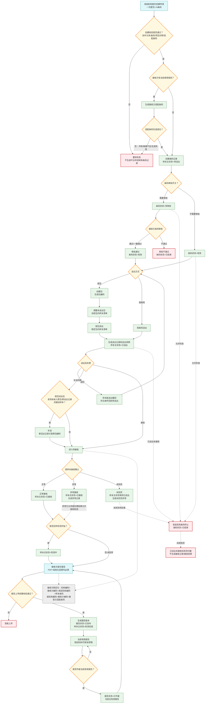
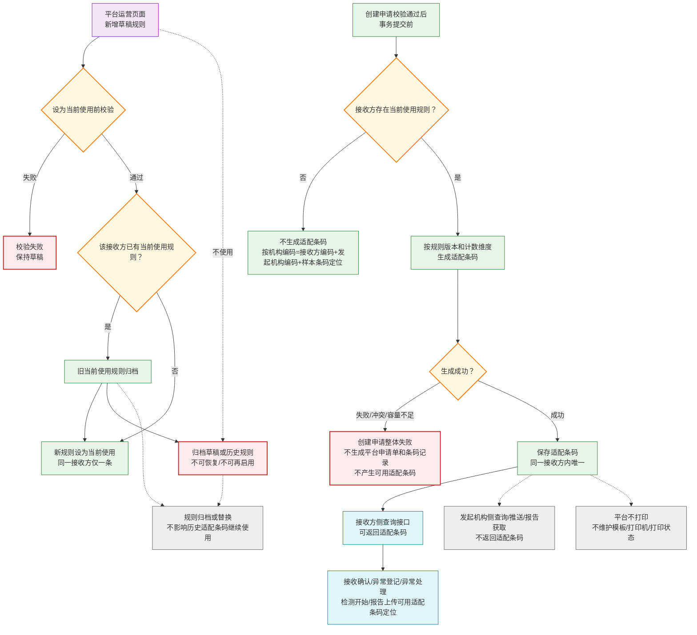
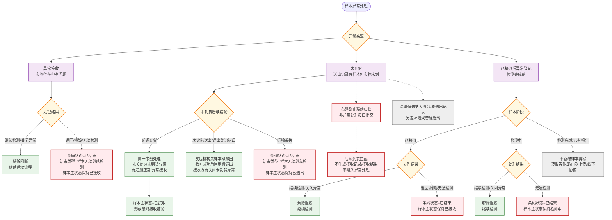
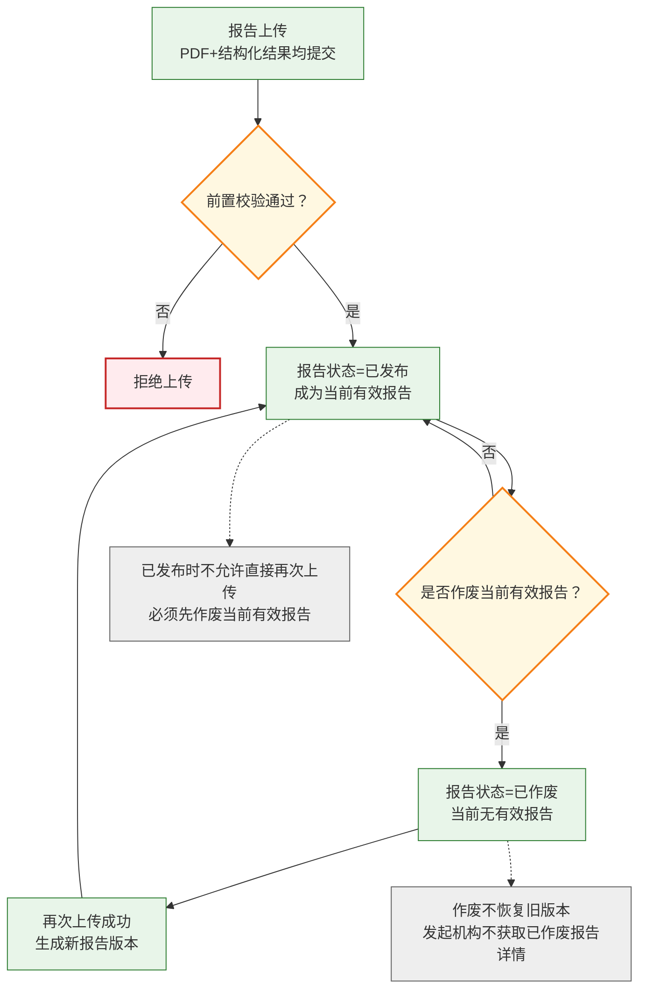
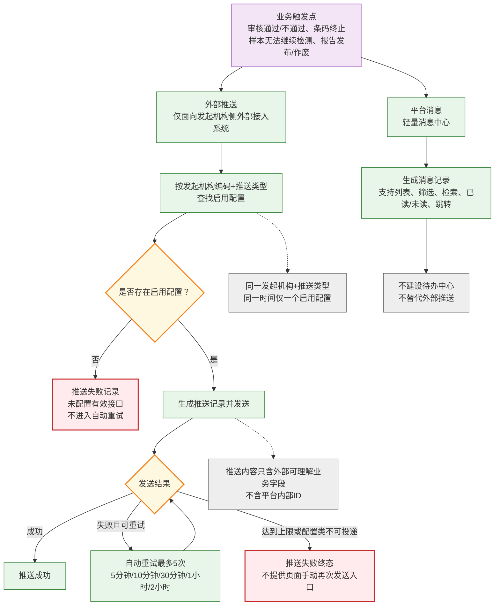
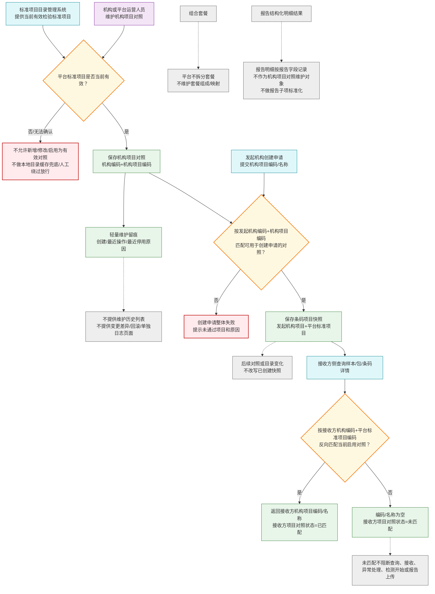

# PRD 核心业务流程图（整合版）

> 整合来源：PRD_第七版修订稿
>
> 日期：2026-06-10
>
> 说明：本文档为检验中心协同平台核心业务流程的可视化参考，配合 PRD_第七版修订稿 使用。流程图只表达业务口径、状态变化和关键边界，不展开接口路径、认证、签名、报文结构等技术细节。

---

## 图1：条码流转主链

> 本图只表达条码从创建、审核、送出、接收、检测到报告的主流程。机构项目对照与项目识别详见图6；样本异常处理详见图3；接收方适配条码规则详见图2；推送与平台消息详见图5。

**图1说明：**

1. 创建申请按一次接口调用整体成功或整体失败；任一条码创建校验、机构项目对照、协作关系或适配条码生成失败时，本次申请整体失败。
2. 平台不生成发起机构样本条码；平台只在接收方存在当前使用规则时生成接收方适配条码。
3. 补送仅适用于按包送出后，发现未纳入原包或原送出记录的漏送样本；补送不修改原包清单和原送出快照。
4. 接收按样本形成接收处理结果，不生成包级接收结果。
5. 检测开始回传是可选推进动作；未回传检测开始不影响符合条件时上传报告。
6. 条码终止后条码状态为已结束，样本主状态保持终止发生时状态，不回退、不删除历史记录。

---

## 图2：接收方适配条码规则与使用边界

**图2说明：**

1. 接收方适配条码规则管理是平台页面能力，不提供规则管理、规则查询或规则历史查询对外接口。
2. 接收方侧外部接入系统只使用已生成的接收方适配条码，不读取规则配置和规则版本。
3. 无当前使用规则或历史条码无接收方适配条码时，接收方侧仍按“发起机构编码+样本条码+机构编码=接收方编码”完成定位。
4. 报告状态查询接口无论发起机构侧或接收方侧均不返回接收方适配条码。
5. 已生成的接收方适配条码不可复用、不可人工修改；条码结束、报告作废、异常结束或流程结束均不释放适配条码。
6. 平台不负责接收方适配条码打印、贴管或上机识别流程。
7. 草稿规则设为当前使用时，如该接收方已有当前使用规则，平台将旧当前使用规则归档；如没有当前使用规则，则直接设为当前使用。

---

## 图3：样本异常处理分支

**图3说明：**

1. 未到货是临时接收处理结果，不属于最终接收结论；延迟到货后通过正常接收或异常接收形成最终接收结论。
2. 未到货因条码终止自动关闭归档时，不表示实物问题已解决，只表示条码结束后的业务归档。
3. 运输丢失仅适用于未到货且样本主状态为已送出的场景。
4. 导致条码结束的异常处理结果不改写样本主状态；条码是否可继续流转由条码状态控制。
5. 已检测完成或已有报告后发现问题，不再新增样本异常，按报告作废、再次上传或线下协商处理。
6. 待处理异常默认阻断检测开始、检测完成和报告上传。

---

## 图4：报告生命周期状态机

**图4说明：**

1. 当前版本不提供平台报告审核；报告上传成功即发布。
2. 报告作废不通过对外接口发起，由具备权限的接收方用户或平台运营人员通过平台页面操作。
3. 作废当前有效报告后，不自动恢复旧版本为当前有效报告。
4. 发起机构获取当前有效报告时，只获取当前已发布且未作废的报告；没有当前有效报告时不返回历史作废报告详情。
5. 最新报告版本为已发布时，不允许直接上传新报告，必须先作废当前有效报告。
6. 报告上传前置校验详见 PRD 1.7，本图不展开全部校验条件。
7. 报告状态查询中，发起机构侧可返回报告归属接收方机构编码；接收方侧按入参机构编码限定本接收方数据范围，不重复返回接收方机构编码。

---

## 图5：外部推送与平台消息边界

**图5说明：**

1. 当前版本外部推送类型包括：报告发布、报告作废、条码审核通过、条码审核不通过、条码终止、样本无法继续检测六类。
2. 当前版本外部推送对象仅为发起机构侧外部接入系统，接收方不是外部推送对象，也不维护推送接口配置。
3. 推送接口配置通过平台页面维护，不提供对外接口维护；配置修复后不自动补发历史失败推送。
4. 平台消息用于平台内提醒、查看和跳转，不承担外部系统集成职责，也不建设待办中心。

---

## 图6：机构项目对照与项目识别边界

**图6说明：**

1. 协同平台维护机构项目对照；平台标准项目目录由标准项目目录管理系统维护。
2. 新增、修改或启用机构项目对照时，平台标准项目必须能够确认为当前有效；无法确认有效时不按有效处理，不做本地目录缓存兜底，不提供人工绕过放行。
3. 创建申请接口不接收平台标准项目编码；平台按发起机构编码和机构项目编码匹配可用于创建申请的机构项目对照。
4. 接收方侧查询时，平台按接收方机构编码和平台标准项目编码反向匹配接收方机构项目编码和名称；未匹配不阻断样本查询、样本接收、异常处理、检测开始回传或报告上传。
5. 机构项目对照只做轻量维护留痕，不提供维护历史列表、变更前后差异、版本回滚、历史版本恢复或单独的对照维护日志管理页面。
6. 平台不识别、不解析、不拆分组合套餐；报告结构化结果中的明细结果项目不作为机构项目对照维护对象，不做报告子项标准化。

---

## 整合说明

| 图号 | 标题 | 覆盖PRD章节 | 第七版要点 |
|------|------|-----------|---------|
| 图1 | 条码流转主链 | 1.1-1.7, 1.12, 1.13, 1.15 | 申请单为批量容器；条码记录为流转实体；创建申请整体成功或失败；机构项目对照和接收方适配条码在创建阶段校验；报告上传成功即发布 |
| 图2 | 接收方适配条码规则与使用边界 | 1.15, 1.13 | 规则是页面能力；平台只生成编码，不负责打印；接收方侧可用适配条码定位；发起机构侧不返回适配条码 |
| 图3 | 样本异常处理分支 | 1.6, 1.4, 1.3 | 未到货、异常接收和已接收后异常登记分开；延迟到货形成最终接收结论；异常导致结束时不改写样本主状态 |
| 图4 | 报告生命周期状态机 | 1.7 | PDF 和结构化结果均必填；报告上传成功即发布；作废不恢复旧版本；作废后可再次上传生成新版本 |
| 图5 | 外部推送与平台消息边界 | 1.9-1.10 | 外部推送仅面向发起机构；自动重试最多5次；不提供页面手动再次发送入口；平台消息是轻量消息中心，不是待办中心 |
| 图6 | 机构项目对照与项目识别边界 | 1.12, 1.13 | 协同平台维护机构项目对照；标准项目目录不可确认有效时不放行；接收方侧实时反向匹配；不拆分套餐；报告明细不作为机构项目对照 |

