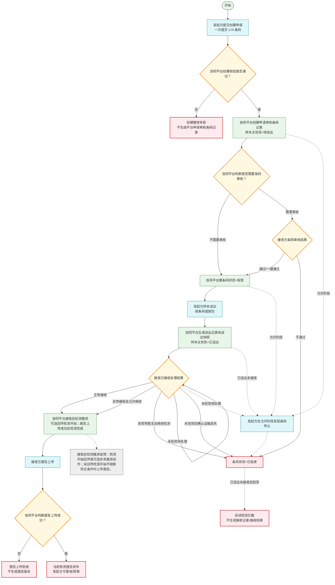
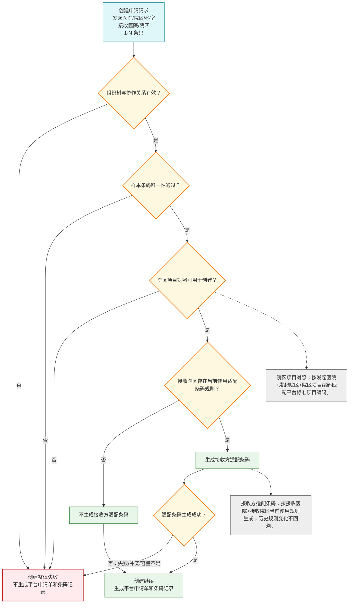
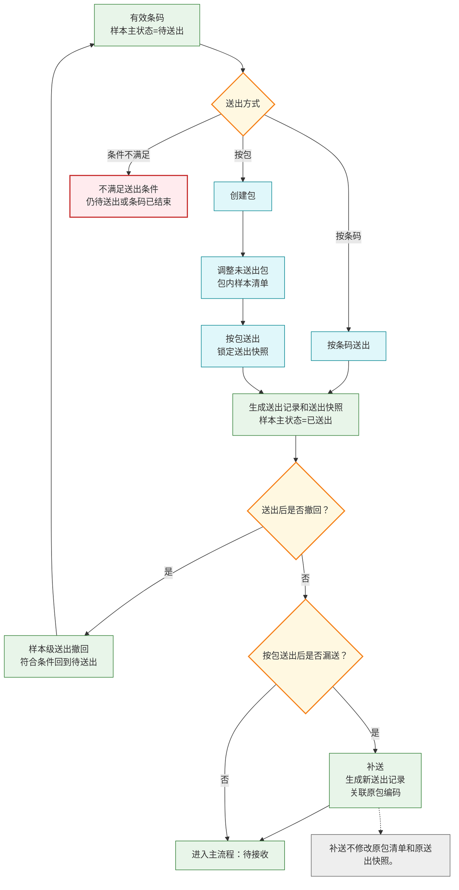
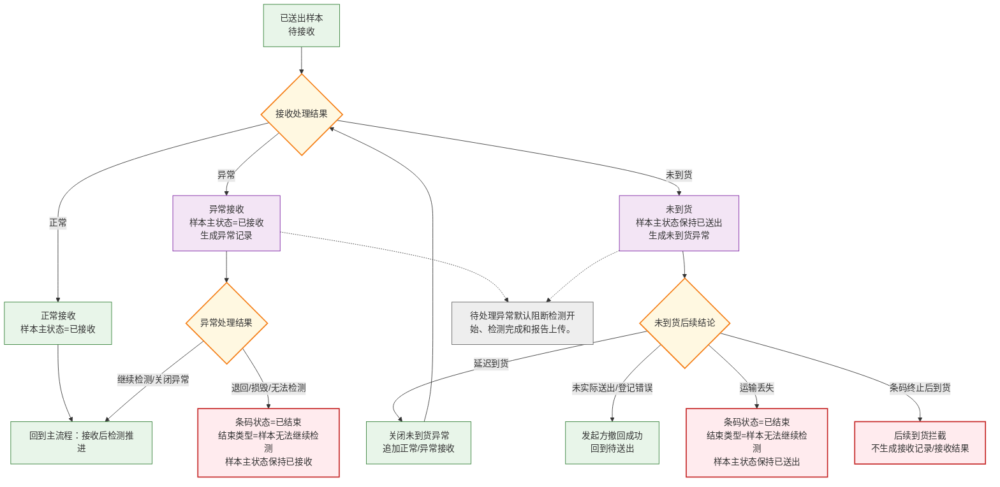
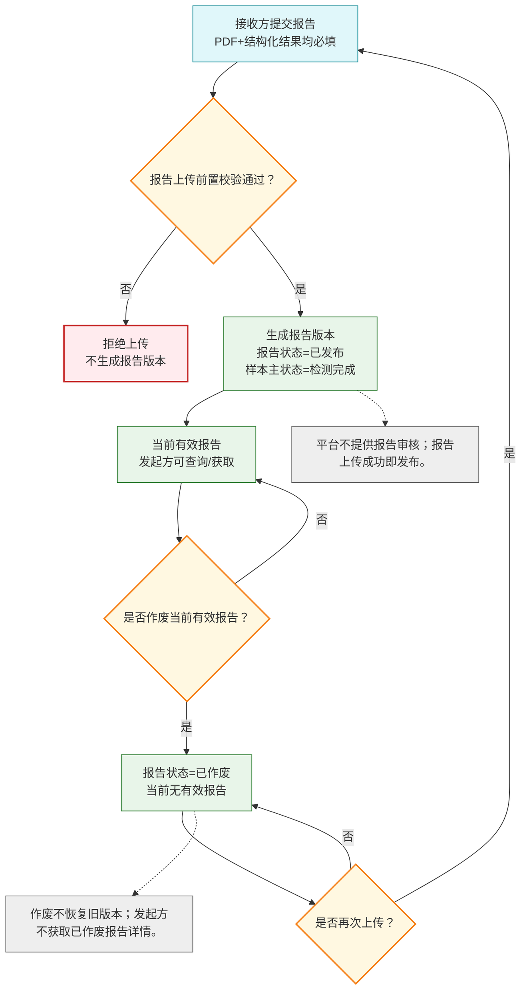
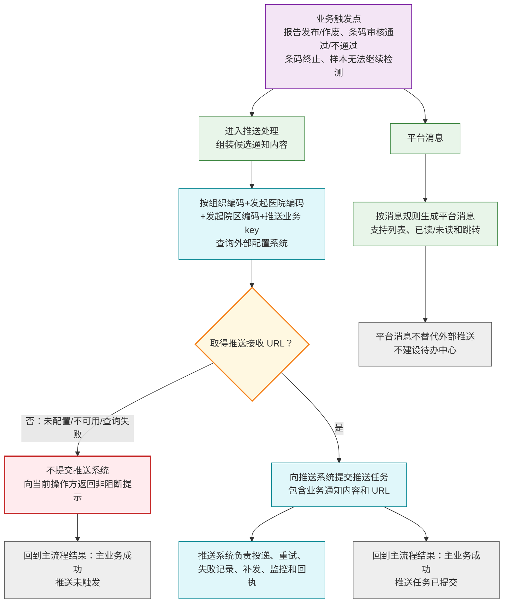
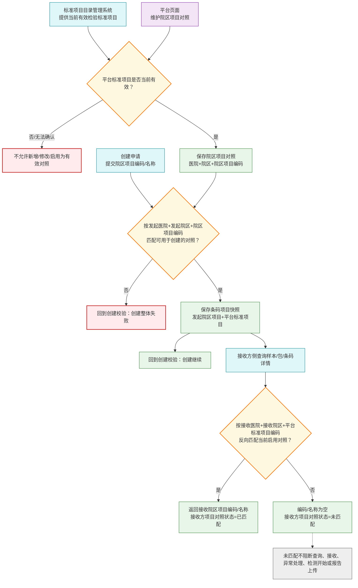

# PRD 核心业务流程图（整合版）

> 整合来源：PRD_第七版修订稿
>
> 日期：2026-06-10
>
> 说明：本文档为检验中心协同平台核心业务流程的可视化参考，配合 PRD_第七版修订稿 使用。主流程图只表达系统核心路径；复杂节点通过子流程或规则边界图展开。流程图只表达业务口径、状态变化和关键边界，不展开接口路径、认证、签名、报文结构等技术细节。

---

## 条码流转主流程

> 本图只表达条码记录从创建到报告发布或结束的核心路径。创建校验支撑规则见《创建校验支撑规则图》；送出处理见《样本送出处理子流程》；接收与异常处理见《接收与异常处理子流程》；报告生命周期见《报告生命周期子流程》；推送与平台消息见《推送与平台消息边界图》。

**《条码流转主流程》说明：**

1. 主流程只表达核心流转：创建申请、条码审核、送出、接收、检测推进、报告上传结果、当前有效报告发布，以及条码结束。
2. 创建申请按一次接口调用整体成功或整体失败；任一条码创建校验、院区协作关系、院区项目对照或接收方适配条码生成失败时，本次申请整体失败。
3. 按包送出、送出撤回、补送等送出细节不在主流程展开，见《样本送出处理子流程》。
4. 异常接收、未到货、运输丢失和异常导致无法继续检测等细节不在主流程展开，见《接收与异常处理子流程》。
5. 报告作废和作废后再次上传不在主流程展开，见《报告生命周期子流程》。
6. 外部推送和平台消息不改变主流程业务状态，见《推送与平台消息边界图》。

**建议继续展开的子流程节点：**

1. 创建校验支撑规则：院区协作关系、院区项目对照、接收方适配条码生成。
2. 样本送出处理：按条码送出、按包送出、撤回、补送。
3. 接收与异常处理：正常接收、异常接收、未到货、异常处理结果。
4. 报告生命周期：上传、发布、作废、再次上传。
5. 推送处理：外部配置系统 URL 查询、成功提交推送系统、未触发推送非阻断提示。

**需要进一步确认的问题：**

1. 主流程中的“接收后检测推进”是否需要在图名或节点文案中进一步强调“非独立状态”，以避免被误解为一个新的业务状态。
2. 《创建校验支撑规则图》和《院区项目对照与项目识别规则边界图》是否需要保留在本文档，还是移入单独的规则说明文档。

---

## 创建校验支撑规则图

> 本图不是独立业务流转，而是《条码流转主流程》“创建校验是否通过？”节点的支撑规则。所有结果都回到主流程的“创建继续”或“创建整体失败”。

**《创建校验支撑规则图》说明：**

1. 创建申请校验是主流程的前置节点，不单独形成业务流转。
2. 院区项目对照匹配失败、协作关系无效、条码唯一性不通过或适配条码生成失败，均回到主流程的“创建整体失败”。
3. 接收院区无当前使用适配条码规则时，创建申请可继续，但该条码记录不生成接收方适配条码。
4. 本图不展开院区项目对照维护过程和接收方适配条码规则维护过程。

---

## 样本送出处理子流程

> 本图展开《条码流转主流程》“样本送出”节点，最终回到主流程的“样本主状态=已送出”或“仍待送出/不再送出”。

**《样本送出处理子流程》说明：**

1. 待审核条码、已结束条码或不满足送出条件的条码不得送出。
2. 按包送出会锁定本次送出快照；后续补送生成新的送出记录，不回写原包清单。
3. 送出撤回只在符合 PRD 规则的阶段允许，撤回成功后回到主流程的待送出阶段。

---

## 接收与异常处理子流程

> 本图展开《条码流转主流程》“接收处理结果”节点，最终回到主流程的“接收后检测推进”“条码结束”“回到待送出”或“后续到货拦截”。

**《接收与异常处理子流程》说明：**

1. 正常接收和允许继续检测的异常接收，回到主流程的“接收后检测推进”。
2. 异常处理导致无法继续检测、运输丢失或审核不通过等场景，回到主流程的“条码状态=已结束”。
3. 未到货延迟到货后，通过正常接收或异常接收形成最终接收结论。
4. 已送出未接收后条码终止，后续到货进入拦截，不生成接收记录或接收结果。

---

## 报告生命周期子流程

> 本图展开《条码流转主流程》“报告上传/当前有效报告发布”节点，最终回到主流程的“当前有效报告发布”“上传拒绝”或“当前无有效报告，可再次上传”。

**《报告生命周期子流程》说明：**

1. 报告上传成功即发布，并形成当前有效报告。
2. 当前有效报告作废后，当前无有效报告；作废不恢复历史旧版本。
3. 作废后可再次上传，成功后生成新的报告版本。
4. 主流程只展示“报告上传成功后当前有效报告发布”，作废和再次上传只在本子流程展开。

---

## 推送与平台消息边界图

> 本图展开各业务触发点后的通知处理。推送处理不改变主业务状态；推送接收 URL 缺失、配置不可用或查询失败时，回到主流程的结果仍为“主业务成功”。

**《推送与平台消息边界图》说明：**

1. 当前版本外部推送类型包括：报告发布、报告作废、条码审核通过、条码审核不通过、条码终止、样本无法继续检测六类。
2. 当前版本外部推送对象仅为发起方侧外部接入系统，接收方不是外部推送对象。
3. 协同平台不维护推送接收 URL，不提供推送接收 URL 配置页面、缺失处理页面、启停管理、历史或回滚能力。
4. 推送接收 URL 由外部配置系统维护；协同平台只按业务 key 查询 URL。
5. 未取得推送接收 URL 时，不向推送系统提交该次推送任务，不影响主业务成功，只向当前操作方返回或展示非阻断提示。
6. 平台消息用于平台内提醒、查看和跳转，不承担外部系统集成职责，也不建设待办中心。

---

## 院区项目对照与项目识别规则边界图

> 本图不是主流程子流程，而是《创建校验支撑规则图》“院区项目对照可用于创建？”的规则边界。它最终回到“创建继续”或“创建整体失败”。

**《院区项目对照与项目识别规则边界图》说明：**

1. 协同平台维护院区项目对照；平台标准项目目录由标准项目目录管理系统维护。
2. 创建申请接口不接收平台标准项目编码；平台按发起医院、发起院区和院区项目编码匹配可用于创建申请的院区项目对照。
3. 匹配失败回到创建校验的“创建整体失败”；匹配成功回到“创建继续”。
4. 接收方侧查询时，平台按接收医院、接收院区和平台标准项目编码反向匹配接收院区项目编码和名称。
5. 未匹配不阻断样本查询、样本接收、异常处理、检测开始回传或报告上传。

---

## 整合说明

| 图名称 | 覆盖 PRD 章节 | 定位 |
|------|-----------|------|
| 条码流转主流程 | 1.1-1.7, 1.9-1.10 | 主流程，只表达创建、审核、送出、接收、检测推进、报告发布和结束 |
| 创建校验支撑规则图 | 1.1, 1.12, 1.14, 1.15 | 支撑图，回到“创建继续”或“创建整体失败” |
| 样本送出处理子流程 | 1.2-1.3 | 子流程，回到“待接收”“待送出”或“不再送出” |
| 接收与异常处理子流程 | 1.4-1.6 | 子流程，回到“接收后检测推进”“条码结束”“回到待送出”或“到货拦截” |
| 报告生命周期子流程 | 1.7 | 子流程，回到“当前有效报告发布”“上传拒绝”或“当前无有效报告” |
| 推送与平台消息边界图 | 1.9-1.10, 1.13 | 边界图，回到“主业务成功，推送任务已提交/未触发” |
| 院区项目对照与项目识别规则边界图 | 1.12, 1.13 | 规则边界图，支撑创建校验和接收方侧项目展示 |
