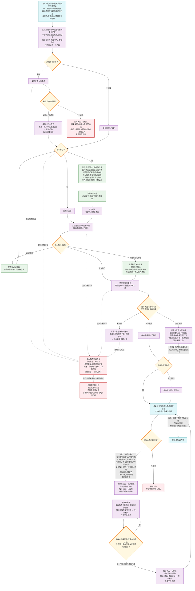
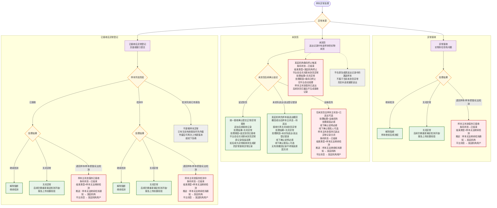
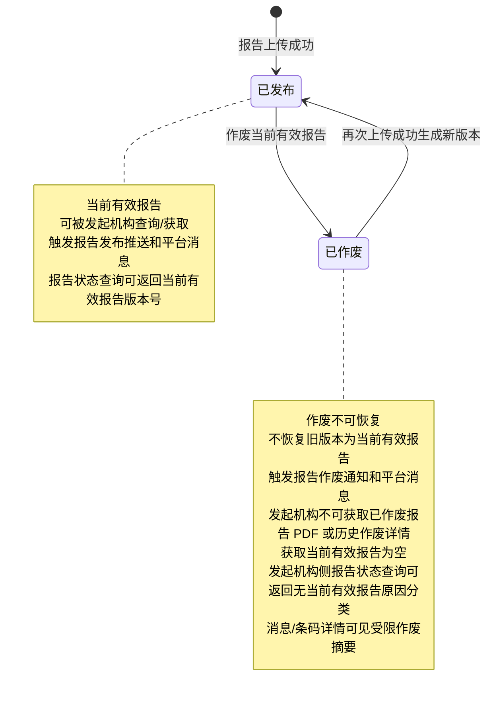
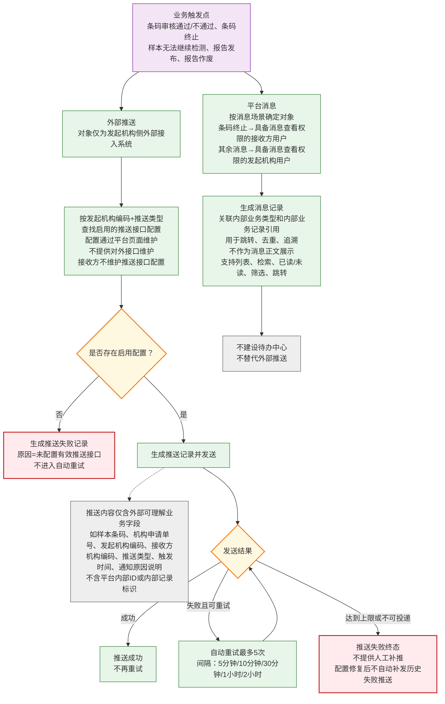

# 检验协同中心整合版本

## 0. 项目概述

> 版本：第七版项目概述
>
> 状态：第七版需求规约项目概述
>
> 日期：2026-06-04

---

### 简介

#### 目的

本章节是检验中心协同平台第七版需求规约的项目概述，用于：

* 概括第七版需求的业务背景、建设目标、范围边界和关键业务场景。
* 明确平台申请单、条码记录、样本流转、报告、消息、推送、外部接入系统和外部依赖系统之间的职责分工。
* 帮助业务方、产品、研发、测试、实施、医院信息科和外部接入系统厂商快速理解本期建设范围。
* 作为需求规约正文前的总体说明，避免将非本期内容误解为平台能力。
* 本章节仅用于高层说明，详细业务规则、接口字段、状态流转和验收标准在后续对应章节中说明。

#### 项目背景

##### 为什么要做

县域医共体或区域检验协同场景中，发起机构、接收方、HIS、LIS、检验系统、中间件、项目对照系统、危急值管理系统和发起机构侧外部接入系统需要围绕检验申请、样本送出、样本接收、检测、报告发布、报告作废、业务通知和追溯形成统一协作链路。

第七版需求在原有跨机构检验协同基础上，对核心业务对象进行了重构：平台申请单不再作为单一流转实体，而是作为一次接口调用提交的一批条码记录的批量容器；每条条码记录承接原申请维度的主要业务能力，包括审核、送出、接收、异常、检测、报告、终止、消息、推送和追溯。

当前业务中主要存在以下问题：

* **申请单与条码层级需要重构**：一次申请可能包含多条样本条码，不同条码可能对应不同患者、就诊、项目和报告，不能继续按一个申请单绑定一个条码处理。
* **业务流转粒度需要统一**：送出、接收、异常、报告、终止和追溯应以条码记录为核心维度，平台申请单只承担归集、展示和追溯入口作用。
* **平台与外部依赖系统职责需要明确**：开单、采样、条码打印、危急值闭环、项目目录维护、项目对照、权限配置、接口安全和系统故障处理等能力应由对应系统或配套设计承担。
* **报告与危急值边界需要重新划清**：平台负责接收接收方提交的报告并发布、作废和追溯报告版本；危急值上传、推送、处理、作废和回执闭环由外部危急值管理系统负责。
* **页面能力与对外接口能力需要分层表达**：部分能力仅由外部接入系统调用，部分能力仅在平台页面操作，部分能力两者均提供，需要在需求层面提前固定入口边界。

##### 目标

建立检验中心协同平台第七版业务能力，实现从发起机构侧外部接入系统提交创建申请，平台生成平台申请单和多条条码记录，到条码审核、样本打包、送出、接收、异常处理、检测推进、报告上传发布、报告作废、平台消息、外部推送和业务追溯的协同管理。

| 模式/场景 | 适用场景 | 解决的问题 |
| --- | --- | --- |
| 平台申请单归集多条条码记录 | 发起机构一次接口调用提交 1 到 N 条样本条码 | 将申请级归集与条码级流转拆开，支持多条码独立处理 |
| 条码记录独立流转 | 同一平台申请单下不同条码需要分别审核、送出、接收、异常处理、终止和出报告 | 避免一个申请单状态混合表达多个样本的真实进度 |
| 样本按条码或按包流转 | 发起机构需要逐条码送出，或将同一发起机构、同一接收方的样本归集为包后送出 | 记录包、送出记录、送出快照、接收结果和样本当前处理展示状态 |
| 报告上传成功即发布 | 接收方通过平台对外接口提交报告 PDF 和结构化结果 | 简化报告发布链路，支持当前有效报告、报告版本和作废追溯 |
| 平台消息与外部推送分离 | 平台用户需要站内提醒，发起机构侧外部接入系统需要业务通知 | 区分平台消息中心与面向外部接入系统的业务推送 |
| 危急值外部化管理 | 危急值闭环由独立危急值管理系统承担 | 避免平台承担危急值上传、推送、处理、作废和回执闭环 |

最终目标：

* 建立以条码记录为核心的跨机构检验协同业务流转和追溯链路。
* 明确平台申请单、条码记录、样本、包、报告、消息、推送和外部接口的对象边界。
* 支持外部接入系统通过接口与平台协作，并明确平台页面能力与对外接口能力的边界。
* 支持报告上传成功即发布、报告版本追溯、报告作废和当前有效报告判定；具体报告版本规则在报告管理章节中说明。
* 明确危急值管理、项目目录维护、权限配置、接口技术契约、隐私脱敏、物流追踪、运维排障等非本期或外部依赖系统职责。

#### 范围与边界

##### 做什么（In Scope）

| 模块 | 说明 |
| --- | --- |
| 申请管理 | 接收发起机构通过平台对外接口提交的检验申请，生成平台申请单和条码记录，保存申请级发起机构、接收方以及条码级患者、就诊、样本、项目、费用状态、绿色通道和备注信息 |
| 条码审核 | 接收方在样本送出前按条码记录确认是否承接本条码对应检验项目，支持逐条审核和一键全部通过 |
| 样本打包管理 | 将同一发起机构、同一接收方且符合条件的样本条码归集为包，支持包创建、包调整、包作废、包查询和按包送出追溯 |
| 样本送出管理 | 支持发起机构按条码或按包送出样本，形成送出记录和送出快照，支持送出撤回和补送 |
| 样本接收管理 | 支持接收方查询待接收样本并提交接收处理结果；页面可通过样本条码、送出记录或包入口查询，对外接口不支持按送出记录号查询 |
| 样本状态管理 | 以条码记录下样本为维度管理样本主状态，包括待送出、已送出、已接收、检测中和检测完成 |
| 样本异常处理 | 记录异常接收、未到货、已接收后异常等异常记录，并支持异常处理结果、阻断解除和条码结束联动 |
| 报告上传、发布、作废与版本管理 | 接收方通过平台对外接口上传报告，上传成功后发布；平台支持报告版本、当前有效报告、报告作废、报告状态查询和发起机构侧按权限获取当前有效报告 |
| 危急值管理边界 | 明确危急值闭环由外部危急值管理系统承担；危急值标记仅作为报告结构化结果的一部分展示和查询，不触发平台危急值流程 |
| 外部推送管理 | 平台在报告发布、报告作废、条码审核通过、条码审核不通过、条码终止、样本无法继续检测等场景下向发起机构侧外部接入系统推送业务通知 |
| 平台消息中心 | 面向平台用户生成轻量业务消息，支持消息列表、已读/未读、筛选、检索和跳转 |
| 权限、隐私与追溯边界 | 在业务层说明角色、职责和权限控制边界，具体权限模型和数据范围由统一权限系统定义 |
| 检验项目目录与对照管理协作 | 平台在申请创建时调用项目对照系统完成机构项目编码到平台标准项目编码的转换，并保存项目快照 |
| 外部接入系统调用接口汇总 | 汇总外部接入系统主动调用的平台接口能力；平台主动外部推送单独说明，不计入主动调用接口清单 |
| 机构协作关系管理 | 通过平台页面维护发起机构与接收方之间的业务协作关系白名单，并在申请创建时校验协作范围，不提供对外接口维护能力 |

##### 不做什么（Out of Scope）

| 约束 | 原因 |
| --- | --- |
| 不建设独立待办中心 | 当前版本通过平台消息中心、业务列表、详情页和流转时间线承载提醒和追溯 |
| 不做危急值闭环管理 | 危急值上传、推送、处理、作废、处理回执和有效性管理由外部危急值管理系统负责 |
| 不做危急值超时提醒和升级提醒 | 危急值处理时限、升级机制和处置闭环不纳入平台当前版本 |
| 不支持平台页面人工补录申请 | 申请必须由发起机构侧外部接入系统通过平台对外接口提交 |
| 不支持平台生成或打印样本条码 | 样本条码由发起机构本地系统生成并打印 |
| 不支持平台页面人工上传报告或平台出具报告 | 报告只能由接收方通过平台对外接口提交，平台不作为报告出具系统 |
| 不提供平台报告审核功能 | 当前版本为报告上传成功即发布，不提供平台侧报告审核流程；接收方提交前应完成内部检验、复核、签发或审核 |
| 不单独推送旧报告版本失效通知 | 报告作废和新报告发布按当前推送规则处理，不为历史版本替换另建失效通知 |
| 不提供复杂推送任务编排和页面手动重推 | 平台仅按本期定义的业务事件处理外部推送，不建设复杂编排、手动重推或历史失败推送补发能力 |
| 不展示系统接口排障信息 | 业务页面只展示业务可理解的记录和状态，不展示底层接口排障细节 |
| 不建设独立业务运维与追溯查询页面 | 运维追溯通过条码详情、接收记录、异常处理、报告查询等业务页面完成 |
| 不定义权限系统角色模型和授权流程 | 具体权限点、角色分配、组织范围和数据范围由统一权限系统定义 |
| 不定义患者隐私脱敏规则 | 敏感信息展示、搜索、导出和脱敏由平台统一规范或后续专项设计定义 |
| 不定义外部依赖系统不可用和故障处理规则 | 外部依赖系统异常、接口异常、系统故障由对应系统设计、技术方案或非功能文档定义 |
| 不支持业务数据导出 | 当前版本不支持申请列表、报告列表、异常记录等业务数据导出 |
| 不做异常记录超时自动处理 | 异常记录创建后如长时间无人处理，状态保持待处理，需人工手动关闭 |
| 不支持条码记录内项目级部分终止 | 条码记录终止按条码维度处理，不按项目维度部分终止 |
| 不支持已结束条码记录再次流转 | 已导致条码记录结束的异常处理结果，不允许在原条码记录下再次进入后续流转 |
| 不支持物流追踪 | 运单号、物流状态、运输时效等样本运输过程不纳入平台管理 |
| 不维护标准项目目录和机构项目对照 | 标准项目目录和机构项目对照由独立项目对照系统维护 |
| 不做项目加急 SLA | 项目加急只作为展示、排序和人工识别标识，不定义加急等级、超时提醒或升级提醒 |
| 不做条码记录兜底自动结束或运营强制结束 | 平台不建设条码记录兜底自动结束或运营强制结束能力 |
| 不记录在线查看报告审计日志 | 当前版本不建设在线报告查看审计能力 |
| 不扩展协作关系管理能力 | 当前版本不支持删除协作关系、发起机构自助新增、项目级协作关系、协作审批流或合同结算管理 |

##### 边界条件

| 项目 | 说明 |
| --- | --- |
| 申请创建入口 | 平台仅支持发起机构侧外部接入系统通过对外接口创建申请，不提供页面人工补录入口 |
| 平台申请单定位 | 平台申请单是批量容器，用于归集一次接口调用提交的条码记录；平台申请单号仅用于平台内部展示和追溯 |
| 条码记录定位 | 条码记录是业务流转核心实体；对外接口定位字段按发起机构侧、接收方侧分别遵循接口章节规则，不暴露条码记录ID |
| 样本条码 | 平台不生成、不打印样本条码；样本条码由发起机构生成，同一发起机构内不可重复绑定不同条码记录 |
| 发起机构和接收方 | 发起机构和接收方为申请级字段，同一平台申请单下所有条码记录共享同一发起机构和接收方，创建后不可变更 |
| 患者、就诊、项目、费用 | 患者信息、就诊信息、项目信息、费用状态、绿色通道等属于条码级字段，同一申请下不同条码可不同；具体修改规则在申请管理和条码管理章节中说明 |
| 条码审核 | 条码审核为接收方页面能力，当前版本不提供条码审核对外提交接口 |
| 样本主状态 | 样本主状态只表达样本流转位置，不表达条码记录是否有效；条码记录是否可继续流转由条码状态控制 |
| 报告来源 | 报告 PDF 和结构化结果由接收方通过平台对外接口提交，平台页面不提供人工上传报告 |
| 报告发布 | 报告上传成功即发布；平台不提供报告审核流程 |
| 危急值管理 | 危急值闭环由外部危急值管理系统负责，平台不维护危急值有效状态 |
| 项目目录与对照 | 平台创建申请时调用项目对照系统完成编码转换，并保存项目快照；后续项目对照变更不自动改写历史申请 |
| 协作关系 | 平台在申请创建时校验发起机构与接收方的启用协作关系；创建成功后协作关系变更不影响已创建申请流转 |
| 权限系统 | 页面可见、可查、可操作由统一权限系统判断；本需求规约仅定义业务层角色和权限边界 |
| 接口技术契约 | 本需求规约只定义业务字段、流程边界和归属校验口径，具体报文、安全控制、文件上传下载和身份识别由接口设计文档定义 |

#### 功能入口边界清单

| 业务能力 | 平台页面 | 对外接口 | 当前结论 |
| --- | --- | --- | --- |
| 创建申请 | 不提供 | 提供 | 必须由发起机构侧外部接入系统提交 |
| 申请列表、申请详情和条码记录查看 | 提供 | 部分提供 | 页面提供列表和详情；对外接口仅提供条码记录详情查询，不提供申请列表、条码列表或申请详情接口 |
| 条码审核 | 提供 | 不提供 | 接收方用户通过平台页面审核条码 |
| 条码终止 | 提供 | 提供 | 发起机构可通过页面或接口按条码记录终止；具体允许阶段和联动规则在条码终止章节中说明 |
| 创建包 | 提供 | 提供 | 发起机构用户可页面创建，发起机构侧外部接入系统可接口创建 |
| 包调整和包作废 | 提供 | 提供 | 页面和接口均可支持包相关操作；具体规则在包管理章节和接口汇总中说明 |
| 样本送出 | 提供 | 提供 | 支持按条码或按包送出；页面可通过申请相关信息辅助定位后批量选择样本 |
| 送出撤回和补送 | 提供 | 提供 | 支持发起机构在规则允许范围内撤回或补送；具体约束在样本送出章节中说明 |
| 待接收清单 | 提供 | 提供 | 页面和接口均提供待接收清单能力；对外接口不支持按送出记录号查询 |
| 样本接收确认 | 提供 | 提供 | 支持正常接收、异常接收和未到货；具体接收入口和处理规则在样本接收章节中说明 |
| 异常登记与异常处理 | 提供 | 提供 | 接收方可通过页面或接口登记异常和提交处理结果 |
| 检测开始回传 | 不提供独立页面入口 | 提供 | 检测开始/检测中仅通过接收方侧对外接口回传触发；具体状态推进规则在检测推进和接口章节中说明 |
| 人工直接修改样本主状态 | 不提供 | 不提供 | 样本主状态只能由业务动作驱动 |
| 上传报告 | 不提供 | 提供 | 报告只能由接收方通过对外接口提交 |
| 报告查询/当前有效报告查看 | 提供 | 不提供 | 页面支持按权限查看报告和当前有效报告 |
| 报告状态查询接口 | 不提供 | 提供 | 发起机构侧和接收方侧外部接入系统可按归属查询报告状态 |
| 获取当前有效报告/下载 | 提供 | 发起机构侧提供 | 发起机构用户和发起机构侧外部接入系统仅可获取当前有效报告 |
| 报告版本追溯 | 提供 | 不提供 | 仅接收方具备权限用户和平台运营人员可通过页面查看历史版本和追溯信息 |
| 报告作废 | 提供 | 不提供 | 由具备权限的接收方用户或平台运营人员通过页面作废 |
| 报告审核 | 不提供 | 不提供 | 当前版本报告上传成功即发布 |
| 危急值上传、推送、处理、作废和查询 | 不提供 | 不提供 | 由外部危急值管理系统负责 |
| 平台消息中心 | 提供 | 不提供 | 面向平台用户，不作为对外接口能力 |
| 外部业务推送 | 不提供人工触发入口 | 平台主动推送 | 平台按业务事件向发起机构侧外部接入系统推送 |
| 项目目录维护 | 不提供 | 不提供 | 由独立项目对照系统维护 |
| 机构项目对照维护 | 不提供 | 不提供 | 由独立项目对照系统维护 |
| 机构项目对照查看 | 提供 | 不提供 | 发起机构用户可按权限查看本机构相关项目对照信息；平台不提供项目目录或机构项目对照维护入口 |
| 机构协作关系维护 | 提供 | 不提供 | 接收方具备权限用户或平台运营人员通过页面维护 |
| 业务数据导出 | 不提供 | 不提供 | 当前版本不支持 |
| 物流追踪 | 不提供 | 不提供 | 当前版本不管理运输轨迹 |
| 接口排障信息展示 | 不提供 | 不提供 | 当前业务页面不展示系统接口排障信息 |

#### 业务场景

##### 场景一：发起机构批量提交申请并生成多条条码记录

**典型流程：**

发起机构在本地 HIS、LIS 或检验系统完成开单、采样、条码生成和条码打印 -> 发起机构侧外部接入系统调用平台创建申请接口 -> 平台完成机构、协作关系、样本条码、项目对照和必填信息等业务校验 -> 校验通过后生成平台申请单和 1 到 N 条码记录 -> 每条码记录进入待审核或有效状态，样本主状态进入待送出。创建申请的详细规则在申请管理和接口章节中说明。

**适用情况：**

* 发起机构一次提交一批样本条码。
* 同一平台申请单下所有条码共享发起机构和接收方。
* 不同条码可携带不同患者、就诊、样本、项目、费用和绿色通道信息。
* 样本条码绑定和创建申请规则在申请管理章节中说明。

##### 场景二：条码审核后送出样本

**典型流程：**

条码记录创建成功 -> 如启用条码审核，接收方用户在平台页面完成条码审核 -> 审核通过的条码进入有效状态 -> 发起机构按条码或按包送出样本 -> 平台生成送出记录和送出快照 -> 样本主状态由待送出变为已送出。相关分支规则在条码审核、样本打包和样本送出章节中说明。

**适用情况：**

* 接收方需要在送出前确认是否承接检验。
* 发起机构需要按条码或按包组织样本交接。
* 平台需要保留送出动作、样本清单和送出时快照。
* 入包、送出、撤回和补送规则在样本打包和样本送出章节中说明。

##### 场景三：样本接收与异常处理

**典型流程：**

接收方获取待接收清单 -> 核对样本实物 -> 对符合要求的样本正常接收 -> 对存在问题的样本登记异常接收 -> 对送出记录中实物未到达的样本登记未到货 -> 接收方按异常处理规则提交处理结果 -> 平台联动样本主状态、条码状态、异常记录和流转时间线。接收和异常处理规则在样本接收和异常处理章节中说明。

**适用情况：**

* 样本在运输、交接或接收后发现破损、条码无法识别、样本不符、未到货、接收后遗失等问题。
* 异常记录需要形成可追溯的处理结果，并影响后续检测、报告和条码状态。

##### 场景四：报告上传成功即发布

**典型流程：**

样本进入允许上传报告的业务阶段 -> 接收方通过平台对外接口上传报告 PDF 和结构化结果 -> 平台完成报告上传业务校验 -> 上传成功后生成报告版本并直接发布，同时推动样本进入检测完成 -> 报告成为当前有效报告 -> 发起机构用户可查询下载当前有效报告 -> 平台生成报告已发布消息并触发外部报告发布推送。

**适用情况：**

* 接收方负责检测和出具报告。
* 平台不审核报告，不判断报告是否覆盖条码记录下全部项目。
* 报告上传、当前有效报告和状态联动规则在报告管理章节中说明。
* 发起机构需要获取当前有效报告；完整报告版本追溯仅接收方具备权限用户和平台运营人员可见。

##### 场景五：报告作废与版本追溯

**典型流程：**

报告上传成功并发布 -> 具备权限的接收方用户或平台运营人员发现当前有效报告不应继续对外查询或下载 -> 在平台页面发起报告作废 -> 平台记录作废信息和状态变化 -> 当前有效报告失效 -> 平台生成报告已作废消息，并向发起机构侧外部接入系统推送报告作废业务通知。

**适用情况：**

* 已发布报告需要被撤销对外可见性。
* 平台需要保留报告版本、状态变化和作废留痕。
* 报告作废后的可见范围和历史版本追溯在报告管理章节中说明。

##### 场景六：平台消息与外部推送

**典型流程：**

条码审核通过、条码审核不通过、条码终止、样本无法继续检测、报告发布或报告作废等业务事件发生 -> 平台按规则向相关平台用户生成站内消息 -> 用户可在消息列表查看未读消息、筛选、检索并跳转到对应条码、报告或业务记录 -> 同时，需通知发起机构侧外部接入系统的事件由平台触发外部推送。

**适用情况：**

* 平台用户需要在系统内看到与自己权限范围相关的业务变化。
* 发起机构侧外部接入系统需要接收报告发布、报告作废、条码审核通过、条码审核不通过、条码终止、样本无法继续检测等业务通知。
* 平台需要区分站内消息和系统间推送，二者不互相替代。
* 外部推送记录、失败处理和查询边界在外部推送管理章节中说明。

##### 场景七：机构协作关系控制申请创建

**典型流程：**

接收方具备权限用户或平台运营人员维护发起机构与接收方之间的启用协作关系 -> 发起机构侧外部接入系统创建申请时提交发起机构编码和接收方机构编码 -> 平台校验机构主数据和启用协作关系 -> 发起机构不存在或停用、接收方不存在或停用、未配置启用协作关系时拒绝创建申请并返回可理解的失败原因 -> 已创建申请不受后续协作关系变更影响。

**适用情况：**

* 平台需要限制发起机构只能向已建立协作关系的接收方提交申请。
* 接收方或平台运营方需要维护业务协作白名单。
* 协作关系只控制新申请创建，不回溯影响历史申请。

#### 定义、首字母缩写词和缩略语

| 术语 | 说明 |
| --- | --- |
| 平台申请单 | 平台在创建申请时生成的批量容器，用于归集一次接口调用提交的一批条码记录。平台申请单承载发起机构和接收方，不维护独立状态，条码状态汇总通过界面推导展示 |
| 平台申请单号 | 平台自动生成的内部展示和追溯编号，仅平台内部使用，不作为对外接口入参或出参 |
| 条码记录 | 平台申请单下的核心流转实体，承接审核、送出、接收、异常、检测、报告、终止、消息、推送和追溯等业务能力 |
| 条码记录ID | 平台为每条码记录生成的内部唯一主键，仅平台内部使用，不作为对外接口入参或出参 |
| 样本条码 | 发起机构采样后生成并打印的条码，贴于样本实物上。平台不生成样本条码；同一发起机构内样本条码唯一性和绑定规则在申请管理章节中说明 |
| 机构申请单号 | 发起机构提交条码记录时传入的本机构业务单号，属于条码级字段，用于记录、展示、回传、通知带回和辅助查询，不参与平台流程判断，不作为平台唯一定位依据 |
| 发起机构 | 提交检验申请的医疗机构，负责开单、采样、送样和在允许阶段对条码记录发起终止 |
| 接收方 | 接收样本并完成检验的机构，负责条码审核、接收、检测、出具报告并通过平台对外接口提交报告 |
| 外部接入系统 | 调用平台对外接口的第三方系统，包括发起机构侧 HIS/LIS 系统、接收方侧 LIS/中间件系统等 |
| 条码审核 | 接收方在样本送出前确认是否承接本条码记录对应检验项目的业务动作，按条码记录逐条执行 |
| 条码状态 | 表达条码记录是否可继续流转，包括待审核、有效、已结束 |
| 结束类型 | 条码记录进入已结束后记录的结束原因，包括发起机构终止、接收方审核不通过、样本无法继续检测 |
| 样本主状态 | 表达样本在平台主流程中的位置，包括待送出、已送出、已接收、检测中、检测完成；由业务动作驱动，不人工修改，不表达条码记录是否可继续流转 |
| 包 | 平台内用于将同一发起机构、同一接收方的多个样本条码归集为一个业务单元，不要求线下一定存在实体箱，用于按包送出、待接收样本查询展示、快捷批量设置和追溯 |
| 包编码 | 平台创建包时生成的全平台唯一包业务编码，用于页面展示、对外接口定位、按包送出、包调整、包作废和包查询；包编码不是平台内部数据库主键 |
| 送出记录 | 一次送出动作形成的业务凭证，包含送出方式、发起机构、接收方、样本清单和送出快照 |
| 正常接收 | 接收方核对后确认样本实物符合要求并确认接收，样本主状态由已送出变为已接收 |
| 异常接收 | 接收方确认样本实物存在但存在问题，样本主状态进入已接收并登记异常记录 |
| 未到货 | 接收方发现送出记录中有该样本但实物未到达，样本仍处于未接收阶段，并形成未到货异常记录 |
| 阻断 | 异常记录处于待处理状态时，默认阻断进入检测中、进入检测完成、上传报告三个维度；各维度解除条件取决于异常处理结果 |
| 拦截 | 已送出未接收后条码终止的，接收方后续接收时直接拦截并记录原因；拦截记录不进入异常处理范围 |
| 补送 | 按包送出后的限定后续动作，用于处理应随原包送出但未纳入原包或原送出记录的漏送样本 |
| 报告版本号 | 平台按条码记录报告上传顺序生成的报告业务版本号，可作为对外查询和推送字段，不是平台内部数据库主键，也不能单独定位报告版本；外部识别报告版本需结合发起机构编码、样本条码和报告版本号 |
| 当前有效报告 | 当前对发起机构可查询、下载，并可触发报告发布推送的报告版本；具体判定和返回规则在报告管理章节中说明 |
| 平台消息 | 平台面向用户生成的站内业务消息，用于提醒用户关注权限范围内的条码、报告或异常处理变化 |
| 外部推送 | 平台面向发起机构侧外部接入系统发送的业务通知，用于提示外部接入系统关注报告发布、报告作废、条码审核通过、条码审核不通过、条码终止、样本无法继续检测等变化 |
| 项目对照系统 | 独立维护平台标准检验项目目录和机构项目对照关系的系统，平台创建申请时调用其接口完成编码转换 |
| 机构协作关系 | 发起机构与接收方之间的启用业务协作白名单，仅在申请创建时校验；创建成功后关系变更不影响已创建申请流转 |

#### 概述

本需求规约包含以下章节：

* 简介：介绍文档目的、项目背景、建设目标、范围边界、功能入口边界、业务场景和术语。
* 整体说明：描述产品总体效果和产品功能总览。
* 后续功能章节说明详细功能规则、接口字段、状态流转和验收标准。

### 整体说明

#### 产品总体效果

检验中心协同平台作为跨机构检验协同业务平台，承接从申请接收、条码审核、样本打包、样本送出、样本接收、异常处理、检测推进、报告上传发布、报告作废、平台消息、外部推送到业务追溯的主链路。

系统建成后，业务方应能够围绕平台申请单查看下属条码记录的状态分布，并围绕单条条码记录查看样本主状态、审核记录、包历史、送出记录、接收处理结果、异常记录、检测推进、报告版本、当前有效报告、报告作废记录、平台消息、外部推送摘要和关键流转时间线。推送记录按权限在平台页面查看，不提供外部查询接口。

平台不替代发起机构本地开单系统、接收方 LIS、项目对照系统、危急值管理系统、统一权限系统、发起机构侧外部接入系统、收费医保系统和物流系统。平台重点解决跨机构检验协同中的业务对象归集、条码级流转、报告发布、业务通知和追溯留痕问题。

#### 产品功能

| 功能模块 | 产品能力概述 |
| --- | --- |
| 申请管理 | 通过接口接收发起机构申请，生成平台申请单和条码记录；页面支持申请与条码查看，对外接口仅提供条码记录详情查询；支持条码审核、条码终止和流转追踪 |
| 样本打包管理 | 支持样本入包、包调整、包作废、包查询和按包送出追溯 |
| 样本送出管理 | 支持按条码或按包送出，形成送出记录、送出快照，并支持撤回和补送 |
| 样本接收管理 | 支持待接收清单、正常接收、异常接收、未到货和接收记录追溯 |
| 样本状态管理 | 通过业务动作驱动样本主状态变化，保留状态变更历史 |
| 样本异常处理 | 支持异常登记、异常处理结果提交、异常阻断和条码结束联动 |
| 报告管理 | 支持报告上传成功即发布、报告版本管理、当前有效报告、报告作废、报告状态查询和发起机构侧按权限获取当前有效报告 |
| 危急值边界 | 明确危急值闭环由外部危急值管理系统负责，平台不建设危急值处理链路 |
| 外部推送管理 | 针对报告发布、报告作废、条码审核通过、条码审核不通过、条码终止、样本无法继续检测等事件向发起机构侧外部接入系统推送业务通知 |
| 平台消息中心 | 面向平台用户提供轻量消息列表、已读未读、筛选、检索和业务跳转 |
| 权限、隐私与追溯边界 | 接入统一权限系统，明确业务权限边界和追溯展示边界 |
| 项目目录与对照协作 | 创建申请时调用项目对照系统完成编码转换，平台保存项目快照用于展示和追溯 |
| 外部接口汇总 | 汇总外部接入系统可调用的创建申请、包、送出、接收、异常、检测、报告上传、报告状态查询、获取当前有效报告和条码记录详情查询等接口能力；不包含申请列表、条码列表或申请详情接口 |
| 机构协作关系管理 | 通过平台页面维护发起机构与接收方之间的启用协作关系，并在申请创建时校验，不提供对外接口维护能力 |

> 需求来源：检验中心协同平台第七版业务需求
>
> 版本：V2.0
>
> 状态：可独立审计版本
>
> 编写原则：本文档正文应完整表达当前版本已定义的业务规则、流程边界、状态变化、页面能力、接口能力和业务留痕；未在本文档中定义的内容，不纳入本版本需求。

## 修订历史记录

| 日期 | 版本 | 说明 |
| --- | --- | --- |
| 2026-06-03 | V1.0 | 初版需求规约 |
| 2026-06-04 | V2.0 | 修订为可独立审计版本，移除外部依赖式表述，补齐接口、消息、协作关系和边界章节 |

## 1. 简介

### 1.1 目的

本文档用于定义检验中心协同平台当前版本的软件需求规约，作为设计、开发、测试和验收的业务依据。

本文档不替代接口设计文档、权限系统设计、隐私脱敏规范、非功能需求文档或技术方案。

### 1.2 项目背景

检验中心协同平台连接发起机构与接收方，覆盖检验申请、样本流转、样本异常处理、报告发布、消息通知、外部推送和业务追溯。

当前版本的核心架构为：

1. 平台申请单是一次创建请求形成的批量容器。
2. 条码记录是业务流转核心实体。
3. 一个平台申请单可包含 1 到 N 条条码记录。
4. 发起机构和接收方是申请级字段，同一申请下所有条码记录共享同一发起机构和接收方。
5. 患者、就诊、样本、项目、费用、绿色通道等信息属于条码级字段。
6. 报告按条码记录管理，一条码记录对应一个报告版本集合。

### 1.3 范围

当前版本包含以下能力：

| 编号 | 模块 | 范围 |
| --- | --- | --- |
| F01 | 申请管理 | 创建申请、条码审核、条码终止、申请查询、条码详情和流转追溯 |
| F02 | 样本打包管理 | 包创建、包调整、包作废、包查询和包追溯 |
| F03 | 样本送出管理 | 按条码送出、按包送出、送出撤回、补送和送出记录 |
| F04 | 样本接收管理 | 待接收查询、正常接收、异常接收、未到货和接收记录 |
| F05 | 样本状态管理 | 样本主状态定义、状态驱动规则和状态变更历史 |
| F06 | 样本异常处理 | 异常登记、异常处理结果、未到货后续处理和异常记录 |
| F07 | 报告管理 | 报告接口上传、上传成功即发布、报告作废、版本管理和查询下载 |
| F08 | 危急值管理边界 | 明确危急值不属于平台闭环管理范围 |
| F09 | 外部推送管理 | 平台向发起机构侧外部接入系统主动推送关键业务事件 |
| F10 | 平台消息中心 | 面向平台用户的轻量消息列表、已读未读、筛选和跳转 |
| F11 | 权限、隐私与追溯边界 | 统一权限接入、统一隐私规范边界和业务留痕边界 |
| F12 | 检验项目目录与对照管理 | 调用外部项目对照系统完成项目识别并保存项目快照 |
| F13 | 机构协作关系管理 | 发起机构与接收方业务协作关系白名单管理 |
| I01 | 外部接入系统调用接口汇总 | 当前版本对外主动调用接口清单和字段边界 |

### 1.4 总体边界

1. 平台不生成样本条码，不打印样本条码。
2. 平台不提供页面人工补录申请。
3. 平台不提供页面人工上传报告，不出具报告。
4. 平台不提供报告审核能力、报告审核开关、报告发布审核、平台报告审核记录、审核结果通知或审核结果查询。
5. 平台不建设危急值闭环管理能力。
6. 平台不建设独立待办中心。
7. 平台当前版本建设轻量消息中心，但不建设任务处理流。
8. 平台不定义权限系统技术角色模型、授权流程、组织范围或数据范围配置。
9. 平台不定义具体患者隐私脱敏规则。
10. 平台不定义接口结构、安全控制、机构身份识别实现和非功能技术方案。

## 2. 术语

| 术语 | 定义 |
| --- | --- |
| 平台申请单 | 平台在创建申请时生成的批量容器，用于归集一次接口调用提交的一批条码记录。平台申请单不维护独立流程状态。平台申请单号仅用于平台内部展示和追溯，不作为对外接口入参或出参。 |
| 条码记录 | 平台申请单下的业务流转实体，关联样本条码、患者信息、就诊信息、项目清单、样本信息、费用状态、绿色通道等条码级信息。 |
| 条码记录ID | 平台为条码记录生成的内部唯一主键，仅平台内部使用，不作为对外接口入参或出参。 |
| 平台内部标识 | 平台内部数据库主键或内部记录标识，包括条码记录ID、内部送出记录ID、内部接收记录ID、内部异常记录ID等。平台内部标识不作为对外接口入参或出参。 |
| 内部业务记录引用 | 平台内部用于关联、跳转、去重和追溯业务记录的引用信息，包括来源业务记录ID、内部关联业务记录等。内部业务记录引用不作为对外接口入参或出参，也不作为外部机构可理解的业务字段展示。 |
| 样本条码 | 发起机构采样后生成并打印的条码。平台不生成样本条码。样本条码唯一性范围为同一发起机构内。 |
| 机构申请单号 | 发起机构提交条码记录时传入的本机构业务单号，属于条码级字段，仅用于记录、展示、回传和辅助查询，不作为唯一定位依据。 |
| 条码状态 | 表示条码记录是否可继续流转，包括待审核、有效、已结束。 |
| 结束类型 | 条码记录进入已结束后的结束原因，包括发起机构终止、接收方审核不通过、样本无法继续检测。 |
| 样本主状态 | 表示样本在主流程中的位置，包括待送出、已送出、已接收、检测中、检测完成。 |
| 包编码 | 平台创建包时生成的全平台唯一包业务编码，用于页面展示、对外接口定位、按包送出、包调整、包作废和包查询。包编码不是平台内部数据库主键。 |
| 报告版本号 | 平台为同一条码记录下的报告版本生成的业务版本号，用于报告版本查询和当前有效报告判断。 |
| 外部推送 | 平台主动向发起机构侧外部接入系统发送的业务通知，不等同于外部接入系统主动调用平台接口。 |
| 平台消息 | 平台面向平台用户生成的业务消息，用于提醒用户关注其权限范围内的条码、报告或异常变化。 |

## 3. 整体业务规则

1. 平台申请单是批量容器，条码记录是业务流转核心实体。
2. 平台申请单不维护独立业务状态，只在页面汇总展示下属条码状态分布。
3. 条码记录独立审核、独立终止、独立流转、独立报告。
4. 条码记录结束后，后续打包、送出、接收、检测开始、报告上传、异常处理等动作均应被阻断。
5. 样本主状态只表达样本主流程位置，不表达条码结束、异常、报告作废、撤回或其他标签。
6. 平台内部标识不得作为对外接口入参、出参或外部推送字段。
7. 发起机构和接收方均为申请级字段，平台申请单创建后不可变更。
8. 业务留痕、状态变更历史、审核记录、送出记录、接收记录、异常记录、报告记录和推送记录应按权限可追溯。

### 3.1 流程图：条码流转主链

> 异常处理分支详见「样本异常处理分支」流程图；终止分支和通知体系的细节见 F01 条码终止、F06 样本异常处理、F09 外部推送管理、F10 平台消息中心。
>
> 当前版本外部推送类型（共6类）：①报告发布推送→发起机构 ②报告作废通知→发起机构 ③条码审核通过通知→发起机构 ④条码审核不通过通知→发起机构 ⑤条码终止通知→发起机构 ⑥样本无法继续检测通知→发起机构。

> 注：条码终止在待审核、待送出、已送出未接收阶段均可触发。终止后条码状态为已结束，结束类型为发起机构终止；样本主状态保持终止发生时的状态，不回退、不删除历史送出或未到货记录。未到货后条码终止的，平台自动关闭原未到货异常并归档。

## 4. 具体需求
### F01 申请管理

#### 功能定位

申请管理用于接收发起机构通过平台对外接口提交的检验申请，生成平台申请单和条码记录，并建立申请、条码、患者、就诊、样本、项目、接收方、费用、绿色通道、条码审核结果和业务追溯之间的关系。

#### 参与者与入口

| 参与者 | 入口 | 能力 |
| --- | --- | --- |
| 发起机构侧外部接入系统 | 创建申请接口 | 提交 1 到 N 条条码记录 |
| 发起机构用户 | 平台页面 | 查询申请、查看条码详情、发起允许阶段的条码终止 |
| 接收方用户 | 平台页面 | 查看申请、执行条码审核、查看条码详情 |
| 平台运营人员 | 平台页面 | 按权限查询和追溯 |

平台页面不提供正常业务下的人工补录申请入口。

#### 业务规则

1. 一次创建申请可提交 1 到 N 条条码记录。
2. 创建申请按整次请求进行校验，整体成功或整体失败。
3. 任一条码记录不满足必填、唯一性、项目对照、机构协作关系等规则时，不生成平台申请单，也不创建任何条码记录。
4. 创建成功后，平台生成平台申请单号，并为每条条码记录生成条码记录ID；二者均仅平台内部使用，不作为对外接口入参或出参。
5. 平台不生成样本条码，不打印样本条码。
6. 同一发起机构内，同一样本条码不得重复绑定不同条码记录。
7. 条码记录结束后，原样本条码不得释放或复用。
8. 不同发起机构允许存在相同样本条码。
9. 机构申请单号仅用于记录、展示、回传和辅助查询，不作为唯一定位、重复提交或流程判断依据。
10. 创建申请时，平台应校验发起机构与接收方存在启用协作关系。
11. 创建申请时，平台调用项目对照系统，将机构项目编码转换为平台标准项目编码并保存项目快照。
12. 费用状态仅用于记录、展示和查询，不阻断主流程；绿色通道仅用于记录、展示和人工识别，不改变主流程；项目加急影响项目清单排序、展示和人工识别。

#### 重复提交与字段快照

1. 平台以发起机构和样本条码作为条码记录重复提交判断的主要依据。
2. 核心业务字段最小范围包括样本条码、发起机构患者标识、患者姓名、患者性别、就诊信息中的开单/送检医生和诊断、平台标准项目编码清单、样本类型、采样时间、采样人，以及其他影响送检、接收和检测判断的信息。
3. 重复提交时，如同一发起机构内样本条码相同且核心业务字段一致，平台识别为已有条码记录，不创建新条码记录，对外接口不返回平台申请单号或条码记录ID。
4. 如同一发起机构内样本条码相同但核心业务字段不一致，平台拒绝创建，并提示条码已被占用或重复提交内容与原条码记录不一致。
5. 如同一发起机构内样本条码相同、核心业务字段一致但非核心字段不一致，平台识别为已有条码记录，不修改已有条码记录的非核心字段。
6. 如同一发起机构内机构申请单号相同但样本条码不同，平台不因机构申请单号相同直接拒绝，应按样本条码创建或定位条码记录。
7. 条码记录创建成功后不提供字段修改入口；核心业务字段不支持修改，非核心字段仅记录创建时快照。
8. 一次创建请求中同时包含历史已存在条码和新增条码时，平台应整体拒绝本次请求，并提示调用方拆分或修正后重新提交。

#### 条码审核

1. 条码审核用于接收方在样本送出前确认是否承接本条码记录对应的检验项目。
2. 条码审核按条码记录逐条执行，并提供一键全部通过能力；一键全部通过应展示将受影响的条码数量和清单摘要。
3. 条码审核开关由外部配置系统提供配置结果。
4. 需审核时，条码初始状态为待审核；不需审核时，条码初始状态为有效。
5. 待审核条码不得打包、送出。
6. 审核通过后，条码状态变为有效。
7. 审核不通过后，条码状态变为已结束，结束类型为接收方审核不通过。
8. 审核通过和审核不通过均应记录审核结果、审核备注、操作人、操作时间和操作来源；审核备注可选。
9. 审核不通过必须记录审核不通过原因；审核通过不要求填写审核不通过原因。
10. 审核通过和审核不通过均触发平台消息，并按 F09 触发外部推送。
11. 接收方具备条码审核权限的用户可通过条码审核列表查看提交给本接收方且需要审核的条码记录；列表支持按平台申请单号归组展示，支持按待审核、审核通过、审核不通过筛选，并可展示待审核数量。
12. 条码记录创建后如进入待审核，不生成平台消息；待审核条码通过审核列表或待审核数量入口处理。
13. 审核记录生成后不可修改、不可删除；审核结果选择错误时，只允许追加说明记录，追加说明不改变条码状态、不重新触发审核流程、不恢复已结束条码记录。
14. 当前版本不提供条码审核对外提交接口，接收方只能通过平台页面完成条码审核。

#### 条码终止

1. 条码终止由发起机构在样本未接收前发起。
2. 样本已送出但未接收时仍属于允许终止阶段；未到货异常待处理期间仍按已送出未接收处理，发起机构可发起条码终止。
3. 条码终止按条码记录逐条生效，可批量操作但应逐条校验、逐条记录结果。
4. 不支持条码记录内项目级部分终止。
5. 样本已接收、检测中、检测完成或已有报告后，不允许发起机构单方终止。
6. 终止成功后，条码状态变为已结束，结束类型为发起机构终止。
7. 已送出未接收样本终止后，不回到待送出，不允许后续接收；接收方后续扫码接收时应按已结束拦截。
8. 未到货异常待处理期间发生条码终止时，平台应在条码终止生效的同一事务内自动关闭归档原未到货异常记录，处理结果为关闭异常，处理原因为条码已终止；该处理原因仅由平台自动生成，不作为外部异常处理接口可提交原因。
9. 条码终止联动关闭未到货异常仅表示条码结束后的业务归档，不表示实物问题已解决，不要求线下确认说明。
10. 终止后，后续打包、送出、接收、检测、报告上传和异常处理均应被阻断。
11. 终止类型由系统根据终止发生时样本所处阶段自动判定，值域包括审核前终止、未送出终止、送出后终止，不由发起机构选择。
12. 终止原因由发起机构从预置枚举选择，当前值域包括申请信息错误、患者信息变更、不再需要检测、重复申请、费用或结算原因、其他；选择其他时必须填写终止说明。
13. 终止记录应保留终止类型、终止原因、终止说明、终止发起机构、终止时间、操作来源、终止时样本主状态和终止时报告状态摘要。
14. 平台页面触发条码终止时，应提示终止影响，包括条码记录结束、原样本条码不可复用、后续业务动作被阻断、后续到货或接收将被拦截。
15. 条码记录结束后不可恢复为有效；接收方不能代替发起机构发起条码终止，当前版本不提供平台运营人员代发起机构发起条码终止的默认业务入口。
16. 条码终止触发平台消息，并按 F09 触发外部推送。

#### 查询与详情展示

1. 申请列表和申请详情仅通过平台页面提供，当前版本不提供申请列表、条码列表或申请详情对外接口。
2. 申请列表应支持按平台申请单号、机构申请单号、发起机构、接收方、创建时间、条码状态分布等条件查询或展示；具体控件形态由页面设计确定，但不得减少本条定义的查询或展示能力。
3. 条码记录查询应支持按样本条码、机构申请单号、发起机构、接收方、条码状态、样本主状态、创建时间、报告状态等业务条件查询或展示。
4. 条码详情应展示申请创建快照、患者信息、就诊信息、样本信息、项目信息、费用信息、绿色通道信息、条码状态、结束类型、样本主状态、审核信息、终止信息、当前送出摘要、当前接收处理结论、异常处理摘要、报告摘要和关键时间。
5. 项目清单应展示机构项目编码、机构项目名称、平台标准项目编码、平台标准项目名称和项目加急标识；项目排序应先展示加急项目，再展示普通项目，同为加急或同为普通时保持机构提交顺序。
6. 条码详情流转时间线应按时间顺序聚合展示创建、审核、终止、入包、包调整、包作废、送出、撤回、补送、接收、未到货、异常处理、检测开始、报告发布、报告作废、条码结束拦截等业务记录摘要。
7. 条码详情可展示新旧条码记录备注关系，但备注不表示恢复原条码记录，也不表示新旧条码记录合并流转。
8. 完整流转时间线仅在平台页面按权限展示，不通过对外接口完整返回。

#### 关键属性

平台申请单关键属性：

| 属性 | 说明 |
| --- | --- |
| 平台申请单号 | 平台自动生成，仅平台内部展示和追溯使用 |
| 发起机构 | 申请级字段，同一申请下所有条码记录共享 |
| 接收方 | 申请级字段，同一申请下所有条码记录共享 |
| 创建时间 | 平台自动生成 |

条码记录关键属性：

| 属性 | 说明 |
| --- | --- |
| 条码记录ID | 平台自动生成，仅平台内部使用 |
| 平台申请单号 | 关联归属申请单，仅平台内部展示和追溯使用 |
| 样本条码 | 发起机构内唯一，平台不生成样本条码 |
| 机构申请单号 | 发起机构业务单号，仅记录、展示、回传和辅助查询 |
| 患者信息 | 条码级对象，字段见第 5 章复用信息项 |
| 就诊信息 | 条码级对象，字段见第 5 章复用信息项 |
| 样本信息 | 条码级对象，字段见第 5 章复用信息项 |
| 项目信息 | 条码级对象，字段见第 5 章复用信息项 |
| 费用信息 | 条码级对象，字段见第 5 章复用信息项 |
| 绿色通道信息 | 条码级对象，字段见第 5 章复用信息项 |
| 备注 | 可记录重开、纠错、补单等说明 |
| 条码状态 | 待审核、有效、已结束 |
| 结束类型 | 发起机构终止、接收方审核不通过、样本无法继续检测 |
| 终止类型 | 审核前终止、未送出终止、送出后终止 |
| 样本主状态 | 待送出、已送出、已接收、检测中、检测完成 |

条码审核记录关键属性：

| 属性 | 说明 |
| --- | --- |
| 审核记录ID | 平台自动生成 |
| 条码记录ID | 关联被审核条码，仅平台内部使用 |
| 平台申请单号 | 关联归属申请单，仅平台内部展示和追溯使用 |
| 审核结果 | 审核通过、审核不通过 |
| 审核人 | 执行审核的用户 |
| 审核时间 | 审核发生时间 |
| 审核备注 | 审核补充说明 |
| 审核不通过原因 | 审核不通过时记录 |
| 操作来源 | 当前版本为平台操作 |

条码终止记录关键属性：

| 属性 | 说明 |
| --- | --- |
| 条码记录ID | 被终止条码，仅平台内部使用 |
| 平台申请单号 | 关联归属申请单，仅平台内部展示和追溯使用 |
| 终止类型 | 系统按终止发生阶段判定 |
| 终止原因 | 发起机构从预置枚举选择 |
| 终止说明 | 终止原因为其他时记录 |
| 终止时间 | 终止发生时间 |
| 终止发起机构 | 发起终止的机构 |
| 操作来源 | 平台操作或接口提交 |
| 终止时样本主状态 | 记录终止发生时样本流程位置 |
| 终止时报告状态摘要 | 记录终止时报告状态摘要 |

#### 状态与记录

| 对象 | 状态或记录 |
| --- | --- |
| 条码状态 | 待审核、有效、已结束 |
| 结束类型 | 发起机构终止、接收方审核不通过、样本无法继续检测 |
| 样本主状态初始值 | 待送出 |
| 申请单 | 不维护独立业务状态，只汇总下属条码状态分布 |
| 留痕 | 创建快照、条码审核记录、条码终止记录、条码状态变化历史、条码详情流转时间线 |

#### 验收标准

1. 支持通过对外接口一次提交 1 到 N 条条码记录。
2. 创建请求整体校验失败时，不创建平台申请单和任何条码记录。
3. 重复提交核心字段一致时按幂等处理，不创建新条码记录。
4. 核心字段不一致时，平台拒绝创建。
5. 创建成功后，平台内部可生成平台申请单号和条码记录ID，但不通过对外接口返回。
6. 待审核条码不得打包或送出。
7. 审核通过后条码有效，审核不通过后条码已结束。
8. 终止成功后条码已结束，并阻断后续业务动作。
9. 申请列表和申请详情能展示下属条码状态分布。
10. 条码详情能展示创建、审核、终止、送出、接收、异常、报告等流转时间线。
11. 条码审核列表支持状态筛选、待审核数量展示和一键全部通过。
12. 审核记录不可修改、不可删除，错误结果只能追加说明。
13. 终止记录能展示终止类型、终止原因、终止时样本主状态和终止时报告状态摘要。

#### 不支持范围

1. 不支持平台生成样本条码。
2. 不支持平台打印样本条码。
3. 不支持页面人工补录申请。
4. 不支持创建后修改核心业务字段。
5. 不支持项目级部分终止。
6. 不支持接收后发起机构单方终止。
7. 不支持已结束条码记录的样本条码再次用于创建新的条码记录。

### F02 样本打包管理

#### 功能定位

样本打包管理用于将同一发起机构、同一接收方的一个或多个样本条码归集为平台业务包，支持按包送出、待接收展示、快捷批量设置和业务追溯。

包不要求线下一定存在实体箱，不承载样本主状态。

#### 参与者与入口

| 参与者 | 入口 | 能力 |
| --- | --- | --- |
| 发起机构用户 | 平台页面 | 创建包、调整包、作废包、查询包 |
| 发起机构侧外部接入系统 | 包相关接口 | 创建包、调整包、作废包、查询包 |
| 接收方用户 | 平台页面 | 查询提交给本接收方的包 |
| 接收方侧外部接入系统 | 包查询接口 | 查询提交给本接收方的包 |
| 平台运营人员 | 平台页面 | 按权限查询全平台包 |

#### 业务规则

1. 一个包只能包含同一发起机构、同一接收方的样本。
2. 入包样本必须满足：条码状态为有效、样本主状态为待送出、发起机构和接收方与包一致。
3. 已结束、已送出、已接收、检测中、检测完成或已有报告的条码不得加入包。
4. 同一样本同一时间不得属于多个有效未送出包。
5. 包未送出前可加入、移出样本，并记录调整留痕。
6. 包送出后，包内样本关系锁定，不允许继续加入或移出。
7. 包未送出前可作废，送出后不可作废。
8. 包作废不可恢复，但不改变包内条码状态和样本主状态。
9. 打包是可选流程，未打包样本可直接按条码送出。
10. 页面未加入任何样本前，不生成平台包记录。
11. 有效未送出包内条码记录结束后，平台应自动将其从包中移出，并记录包内样本变更记录；该动作不生成独立消息。
12. 条码结束自动移出记录应保留调整动作、操作来源、移出原因、触发来源、调整时间和调整后的包内样本清单。
13. 已送出或已作废包不因包内条码后续结束而修改包内样本清单。
14. 包作废时必须记录作废原因、作废时间和操作来源；作废原因值域为样本信息错误、包内容变更、不再需要送出、其他，选择其他时必须填写说明。

#### 关键属性

包关键属性：

| 属性 | 说明 |
| --- | --- |
| 包编码 | 平台生成的包业务编码，不是平台内部数据库主键 |
| 发起机构 | 包所属发起机构 |
| 接收方 | 包所属接收方 |
| 包名称 | 发起机构填写，可重复，仅用于人工识别 |
| 包状态 | 有效、已作废 |
| 是否已送出 | 送出后锁定，不并入包状态 |
| 创建时间 | 包创建时间 |
| 最近调整时间 | 最近一次调整时间 |
| 操作用户 | 平台操作时记录平台用户 |
| 提交机构编码 | 接口提交时记录发起机构编码 |
| 作废原因 | 样本信息错误、包内容变更、不再需要送出、其他 |
| 作废说明 | 作废原因为其他时记录 |
| 作废时间 | 作废发生时间 |
| 操作来源 | 平台操作、接口提交、平台自动处理 |

包内样本清单属性：

| 属性 | 说明 |
| --- | --- |
| 样本条码 | 包内样本标识 |
| 机构申请单号 | 发起机构业务单号 |
| 患者信息摘要 | 用于包内样本识别 |
| 样本信息摘要 | 用于包内样本核对 |
| 项目清单摘要 | 用于包内项目核对 |
| 样本主状态 | 展示样本当前位置 |
| 当前接收处理结论 | 已形成时展示 |
| 加入时间 | 样本加入包的时间 |

包内样本变更记录属性：

| 属性 | 说明 |
| --- | --- |
| 调整时间 | 包内样本变更时间 |
| 操作来源 | 平台操作、接口提交或平台自动处理 |
| 调整动作 | 加入、移出、自动移出 |
| 调整前后样本清单摘要 | 记录调整前后清单变化 |
| 移出原因 | 自动移出时展示 |
| 触发来源 | 自动移出时展示触发来源 |

#### 状态与记录

| 对象 | 状态或记录 |
| --- | --- |
| 包状态 | 有效、已作废 |
| 送出属性 | 是否已送出，不并入包状态 |
| 包内样本清单 | 未送出包展示当前样本；已送出包展示送出时锁定样本；已作废包展示作废前最后有效样本 |

#### 验收标准

1. 支持通过页面或接口创建包。
2. 包内不得混装多个发起机构或多个接收方的样本。
3. 只有有效且待送出的样本可加入包。
4. 同一样本同一时间不得属于多个有效未送出包。
5. 包未送出前可调整和作废。
6. 包送出后锁定包内关系，且不可作废。
7. 包作废不改变条码状态和样本主状态。
8. 包列表、包详情、包内样本清单和包调整记录可按权限查询。
9. 未送出包内条码结束后自动移出并形成包内样本变更记录。
10. 包作废原因=其他时必须填写说明。

#### 不支持范围

1. 不要求包与线下实体箱强绑定。
2. 不要求打包作为必经流程。
3. 不支持已送出包恢复编辑。
4. 不支持已送出包作废。
5. 不支持按包送出后因撤回恢复原包编辑。

### F03 样本送出管理

#### 功能定位

样本送出管理用于由发起机构确认样本从本机构送出至接收方，形成送出记录和不可变送出快照，并推动样本主状态进入已送出。

#### 参与者与入口

| 参与者 | 入口 | 能力 |
| --- | --- | --- |
| 发起机构用户 | 平台页面 | 按条码送出、按包送出、撤回、补送 |
| 发起机构侧外部接入系统 | 送出相关接口 | 按条码送出、按包送出、撤回、补送 |
| 接收方用户 | 平台页面 | 查询待接收样本和送出摘要 |
| 接收方侧外部接入系统 | 待接收清单和详情查询接口 | 查询待接收样本和送出摘要 |
| 平台运营人员 | 平台页面 | 按权限追溯 |

#### 业务规则

1. 送出方式包括按条码送出和按包送出。
2. 按条码送出支持一个或多个样本条码。
3. 按包送出基于未送出的有效包。
4. 仅条码状态为有效、样本主状态为待送出、接收方明确的样本可送出。
5. 当前属于有效未送出包的样本不得按条码送出，需先移出包或按包送出。
6. 已结束、已送出、已接收、检测中、检测完成或已有报告的样本不得送出。
7. 按包送出必须整包校验；任一样本不满足条件时，整包送出失败。
8. 平台不支持同一包内部分样本送出、部分保留。
9. 送出成功后，样本主状态变为已送出。
10. 按包送出后，包记录标记为已用于送出，包内样本关系锁定。

#### 送出撤回

1. 送出撤回仅适用于已送出且尚未接收的样本。
2. 已接收、检测中、检测完成、已有报告或条码已结束的样本不得撤回。
3. 撤回不删除原送出记录，不修改送出快照。
4. 撤回成功后，样本主状态回到待送出。
5. 重新送出必须生成新的送出记录。
6. 整包撤回后，原包仍不恢复编辑，且不可再次基于原包送出。
7. 通过对外接口提交送出撤回时，平台按机构编码和样本条码定位当前唯一未接收送出关系，不要求外部提交内部送出记录ID。
8. 部分样本撤回后，原送出记录保持已送出状态并展示有撤回标签；全部样本撤回后，送出记录状态为全部撤回。
9. 未到货待处理不属于当前接收处理结论，应作为样本当前处理展示状态和送出记录业务标签展示。
10. 条码结束导致后续接收被拦截时，应参与送出记录样本明细展示和业务标签推导，但不生成接收结果。

#### 补送

1. 补送仅是按包送出后的限定动作。
2. 补送用于应随原包送出但未纳入原包或原送出记录的漏送样本。
3. 补送生成新的补送送出记录，关联原包编码。
4. 补送不修改原包清单和原送出快照。
5. 已纳入原送出记录但实物漏装的样本，应走样本级撤回后重新送出，不走补送。
6. 补送样本必须与原包发起机构、接收方一致，且满足当前送出样本范围。
7. 平台不校验该样本业务上是否应该随原包送出，仅校验补送边界和机构归属。
8. 补送样本不进入原包清单，不修改原送出快照；补送记录应与原包编码双向追溯。
9. 按条码送出场景发现漏送时，不要求使用补送，可按普通送出规则重新送出。

#### 关键属性

送出记录关键属性：

| 属性 | 说明 |
| --- | --- |
| 送出记录号 | 平台自动生成，仅用于页面展示和内部追溯 |
| 送出方式 | 按条码送出、按包送出 |
| 补送标记 | 补送时标记 |
| 发起机构 | 送出发起机构 |
| 接收方 | 样本接收方 |
| 送出时间 | 送出发生时间 |
| 操作来源 | 平台操作或接口提交 |
| 包编码 | 按包送出时关联 |
| 本次送出的样本清单 | 本次送出动作锁定记录的样本集合 |
| 送出备注 | 送出补充说明 |
| 送出记录状态 | 已送出、接收完成、全部撤回 |
| 业务标签 | 有撤回、有异常、补送、未到货待处理 |

送出快照属性：

| 属性 | 说明 |
| --- | --- |
| 机构申请单号 | 送出时锁定的发起机构业务单号 |
| 样本条码 | 送出时锁定的样本条码 |
| 患者信息摘要 | 送出时锁定的患者摘要 |
| 平台标准项目编码清单 | 送出时锁定的项目编码清单 |

#### 状态与记录

| 对象 | 状态或记录 |
| --- | --- |
| 送出记录状态 | 已送出、接收完成、全部撤回 |
| 业务标签 | 有撤回、有异常、补送、未到货待处理 |
| 送出快照 | 机构申请单号、样本条码、患者信息摘要、平台标准项目编码清单；形成后不随后续对象变化而改变 |

#### 验收标准

1. 支持按条码和按包送出。
2. 送出成功后生成送出记录和不可变送出快照。
3. 送出成功后样本主状态进入已送出。
4. 按包送出整包校验，不支持部分成功。
5. 已送出未接收样本可按明细撤回。
6. 已接收及后续状态不可撤回。
7. 补送记录与原包可双向追溯。
8. 部分撤回、全部撤回、未到货待处理、条码结束拦截等场景能在送出记录状态、业务标签和样本明细展示中区分。

#### 不支持范围

1. 平台不因接收方相同、时间接近或样本同批自动合并送出记录。
2. 按包送出不支持部分成功。
3. 撤回不删除历史送出事实。
4. 补送不代表重新采样、重新检测或开启新轮次。
5. 不支持物流追踪、运单号、物流状态或运输时效管理。

### F04 样本接收管理

#### 功能定位

样本接收管理用于接收方对已送出样本逐样本提交接收结果，形成接收记录，并推动样本主状态进入已接收或生成未到货、异常接收相关记录。

#### 参与者与入口

| 参与者 | 入口 | 能力 |
| --- | --- | --- |
| 接收方用户 | 平台页面 | 查询待接收样本，提交正常接收、异常接收、未到货 |
| 接收方侧外部接入系统 | 接收相关接口 | 获取待接收清单、提交接收结果 |
| 平台运营人员 | 平台页面 | 按权限追溯 |

平台支持通过样本条码、包入口或全部待接收清单定位待接收样本。待接收清单接口仅支持按样本条码、包编码或全部待接收查询，不提供按送出记录号查询。包入口仅用于查询展示和快捷批量设置，不是独立接收方式。

#### 业务规则

1. 接收以样本为最小处理单位。
2. 仅已送出、未撤回、接收方匹配、可关联当前有效送出关系且未形成当前接收处理结论的样本允许接收。
3. 未送出样本不能接收，平台不自动补记送出记录。
4. 已接收、检测中、检测完成、已有报告或条码已结束的样本不能重复接收。
5. 通过样本条码定位时，必须明确接收方、发起机构和样本条码。
6. 不同发起机构相同样本条码按发起机构隔离识别。
7. 不能仅凭样本条码模糊匹配。
8. 样本送出后、接收前条码已结束时，接收方接收应被拦截，记录拦截原因，不生成接收结果，不进入异常处理范围。
9. 已送出未接收样本因条码终止进入已结束后，如后续样本延迟到达，接收方接收应被拦截；样本主状态保持终止发生时状态，不生成接收记录，不生成接收结果，不进入异常处理范围。
10. 样本接收确认接口不接收送出记录号、对外分组字段、内部接收记录ID、内部异常记录ID或内部送出记录ID；平台按机构编码、发起机构编码、样本条码和当前有效送出关系完成定位与关联。
11. 包入口应展示原送出记录、关联补送记录摘要、补送样本标记和关联原包编码，便于接收方按包核对。

#### 关键属性

接收记录关键属性：

| 属性 | 说明 |
| --- | --- |
| 接收记录号 | 平台自动生成 |
| 提交入口 | 样本条码、送出记录、包入口 |
| 发起机构 | 样本发起机构 |
| 接收方 | 样本接收方 |
| 接收时间 | 接收确认时间 |
| 操作来源 | 平台操作或接口提交 |
| 提交机构编码 | 接口提交时记录 |
| 送出记录号 | 关联送出记录，仅用于页面展示和内部追溯 |
| 包编码 | 通过包入口提交时展示 |
| 本次处理的样本清单 | 本次接收提交处理的样本集合 |
| 样本接收处理结果 | 正常接收、异常接收、未到货 |
| 异常类型 | 异常接收时记录 |
| 异常描述 | 异常类型为其他时记录 |
| 接收备注 | 接收补充说明 |

待接收清单展示属性：

| 属性 | 说明 |
| --- | --- |
| 送出记录号 | 待接收记录入口展示 |
| 发起机构 | 样本发起机构 |
| 送出方式 | 按条码送出或按包送出 |
| 包编码 | 按包送出或包入口时展示 |
| 待接收样本数量 | 当前仍待接收的样本数量 |
| 送出时间 | 送出发生时间 |

#### 接收结果

| 接收结果 | 状态变化 | 后续处理 |
| --- | --- | --- |
| 正常接收 | 样本主状态由已送出变为已接收 | 可进入检测或报告前置流程 |
| 异常接收 | 样本主状态由已送出变为已接收 | 生成异常记录 |
| 未到货 | 样本主状态保持已送出 | 生成未到货异常记录 |

未到货不是最终接收结果，不表示必然丢失。

#### 状态与记录

接收记录应至少包括接收记录号、提交入口、发起机构、接收方、接收时间、操作来源、送出记录号、包编码、本次处理的样本清单、样本接收处理结果、异常类型、异常描述、接收备注。

接收记录是历史留痕，不因后续处理被覆盖。未到货样本后续到货并接收时，应追加后续接收记录，关联原未到货接收记录和原送出记录。

#### 验收标准

1. 支持逐样本或批量提交接收结果。
2. 包入口仅提供查询展示和快捷批量设置。
3. 正常接收后样本进入已接收。
4. 异常接收后样本进入已接收并生成异常记录。
5. 未到货样本不进入已接收，保持已送出。
6. 接收记录可关联申请、样本条码、送出记录、包编码和接收方。
7. 历史接收记录不被覆盖。
8. 条码已结束样本不可接收并展示拦截记录。
9. 接收方可通过接口获取待接收清单。
10. 待接收清单接口不支持按送出记录号查询。

#### 不支持范围

1. 包不是独立接收方式。
2. 未送出样本不能通过接收自动补送出。
3. 仅凭样本条码不得模糊定位。
4. 异常接收和未到货本身不自动导致条码结束。
5. 已有未关闭未到货记录时，不得再次提交未到货。
6. 接收动作不直接推进到检测中。

### F05 样本状态管理

#### 功能定位

样本状态管理用于表达样本在平台主流程中的当前位置，为申请查询、送出、接收、检测、报告和追溯提供统一状态依据。

样本状态管理只管理样本主状态，不替代条码状态、结束类型、接收处理结果、异常状态、报告状态、推送状态等业务对象状态。

#### 状态范围

样本主状态只能包括：

1. 待送出。
2. 已送出。
3. 已接收。
4. 检测中。
5. 检测完成。

#### 业务规则

1. 样本主状态不可新增。
2. 样本主状态不表达异常、撤回、退回、发起机构终止、条码结束、报告上传、报告发布、报告作废等状态。
3. 样本主状态只能由业务动作驱动，包括申请创建、送出、送出撤回、接收、检测开始回传、报告上传成功。
4. 检测中为可选状态，仅由接收方通过接口回传检测开始触发。
5. 无检测开始回传时，样本可由已接收直接进入检测完成。
6. 报告上传成功后，样本主状态进入检测完成。
7. 未接收样本不允许上传报告，平台不因报告上传自动补记接收记录。
8. 样本主状态原则上不逆流程；明确例外为已送出未接收样本通过送出撤回回到待送出。
9. 退回样本、样本损毁、无法检测、运输丢失、发起机构终止、接收方审核不通过等导致条码结束的动作，不新增样本主状态，样本主状态保持结束发生时的状态。
10. 报告作废不影响样本检测完成状态。
11. 样本进入检测中前，应满足条码状态为有效、样本已接收、无待处理阻断异常；不满足时拒绝检测开始回传并说明业务原因。
12. 样本进入检测完成前，应满足条码状态为有效、样本已接收、无待处理阻断异常；条码记录已结束时不允许推进到检测完成。
13. 样本存在待处理的接收后异常时，默认不允许进入检测中或检测完成，除非异常处理结果允许继续检测或异常已关闭。

#### 状态变更历史

每次样本主状态变化均应记录变更前状态、变更后状态、触发动作、关联业务记录类型、关联业务记录标识、变更时间和操作来源。

不改变样本主状态但导致条码结束的动作，应记录为条码结束记录和流转时间线记录，不作为样本主状态变更记录。

#### 关键属性

样本主状态属性：

| 属性 | 说明 |
| --- | --- |
| 样本主状态 | 待送出、已送出、已接收、检测中、检测完成 |

样本状态变更历史关键属性：

| 属性 | 说明 |
| --- | --- |
| 变更前状态 | 变更前样本主状态 |
| 变更后状态 | 变更后样本主状态 |
| 触发动作 | 申请创建、送出、送出撤回、接收、检测开始、报告上传成功 |
| 关联业务记录类型 | 申请、送出记录、接收记录、异常记录、报告记录 |
| 关联业务记录标识 | 触发状态变化的业务记录标识 |
| 变更时间 | 状态变更发生时间 |
| 操作来源 | 平台操作或接口提交 |

#### 验收标准

1. 系统仅允许上述 5 个样本主状态。
2. 申请创建、送出、接收、检测开始回传、报告上传成功等动作能正确驱动状态变化。
3. 未到货样本保持已送出，不进入已接收。
4. 报告上传成功后样本进入检测完成。
5. 报告作废后样本仍保持检测完成。
6. 平台无独立样本状态维护页面，无人工直接改主状态入口。
7. 每次主状态变化均生成不可编辑、不可删除的状态变更历史。
8. 不满足条码有效、样本已接收、无阻断异常等前置条件时，检测开始回传和报告上传驱动检测完成均应被拒绝。

### F06 样本异常处理

#### 流程图：样本异常处理分支

#### 功能定位

样本异常处理用于管理样本在接收过程中或接收后发现的问题，包括异常接收、未到货、已接收后异常登记及异常处理结果确认。

异常处理不替代条码终止、报告作废、推送失败处理或危急值管理。

#### 参与者与入口

| 参与者 | 入口 | 能力 |
| --- | --- | --- |
| 接收方用户 | 平台页面 | 登记异常、处理异常 |
| 接收方侧外部接入系统 | 异常相关接口 | 异常登记、异常处理结果提交 |
| 平台运营人员 | 平台页面 | 按权限追溯 |

接口提交时，机构编码表示接收方，平台校验机构编码与样本所属接收方一致。

#### 业务规则

1. 异常来源包括异常接收、未到货、已接收后登记。
2. 未到货仅指送出记录中有该样本但实物未到；不在原送出记录或原包中的漏送样本不归入未到货。
3. 异常记录状态包括待处理、已关闭，不等同于样本主状态。
4. 异常接收时，样本主状态进入已接收并生成异常记录。
5. 未到货时，样本主状态保持已送出并生成异常记录。
6. 已接收后登记异常时，样本主状态保持当前状态，不自动回退。
7. 待处理异常默认阻断检测开始、检测完成和报告上传。
8. 同一样本同一时间只允许一条待处理异常记录。
9. 已检测完成或已有报告的样本，不再新增样本异常记录；后续问题按报告作废、重新上传或线下协商处理。
10. 条码已结束后不得再人工处理异常记录；未到货异常待处理期间因条码终止发生的自动关闭归档，是条码终止联动动作，不属于条码结束后的人工异常处理。
11. 异常处理结果提交接口不接收异常记录ID；平台按机构编码、发起机构编码、样本条码定位当前唯一待处理异常记录。
12. 外部异常处理结果提交接口不得提交延迟到货已接收、条码已终止等平台自动处理原因。

#### 异常处理结果

| 处理结果 | 结果规则 |
| --- | --- |
| 继续检测 | 异常关闭，条码保持有效，允许后续检测和报告上传 |
| 关闭异常 | 异常关闭，不改变样本主状态；是否允许后续检测和报告上传按样本当前主状态、异常来源、接收依据和报告上传前置校验判断。处理原因为条码已终止的联动归档场景除外，该场景条码保持已结束，不允许后续检测和报告上传 |
| 退回样本 | 条码进入已结束，结束类型为样本无法继续检测，样本主状态保持异常处理发生时状态 |
| 样本损毁 | 条码进入已结束，结束类型为样本无法继续检测，样本主状态保持异常处理发生时状态 |
| 无法检测 | 条码进入已结束，结束类型为样本无法继续检测，样本主状态保持异常处理发生时状态 |
| 运输丢失 | 仅适用于来源为未到货且样本主状态为已送出的场景；条码进入已结束，结束类型为样本无法继续检测，必须填写线下确认说明 |

因异常处理导致条码结束后，不允许继续检测、报告上传或新增异常记录。

异常处理结果、处理原因和线下确认要求如下：

| 处理结果 | 处理原因值域 | 处理原因必填 | 线下确认说明 | 线下确认联系人 | 处理说明 | 状态影响 |
| --- | --- | --- | --- | --- | --- | --- |
| 继续检测 | 问题已排除/不影响检测/其他 | 是 | 否 | 可选 | 可选 | 异常关闭，条码保持有效，允许继续检测和报告上传 |
| 退回样本 | 样本不符/容器不符/样本量不足/其他 | 是 | 否 | 可选 | 可选 | 异常关闭，条码进入已结束，结束类型为样本无法继续检测 |
| 样本损毁 | 样本破损/保存条件不符/其他 | 是 | 否 | 可选 | 可选 | 异常关闭，条码进入已结束，结束类型为样本无法继续检测 |
| 无法检测 | 条码无法识别/样本质量不满足检测/设备或方法限制/接收后遗失/其他 | 是 | 否 | 可选 | 可选 | 异常关闭，条码进入已结束，结束类型为样本无法继续检测 |
| 运输丢失 | 运输过程丢失/交接过程丢失/其他 | 是 | 是 | 可选 | 可选 | 异常关闭，条码进入已结束，结束类型为样本无法继续检测 |
| 关闭异常 | 误登记/问题已消除/延迟到货已接收/未实际送出/送出登记错误/条码已终止（仅平台自动处理） | 是 | 条件 | 可选 | 可选 | 异常关闭，不改变样本主状态；是否允许后续检测和报告上传按样本当前主状态、异常来源、接收依据和报告上传前置校验判断；未到货来源的关闭异常必须对应明确后续动作；条码已终止归档场景中条码已结束 |

关闭异常的处理原因为未实际送出或送出登记错误时，线下确认说明必填。关闭异常的处理原因为条码已终止时，仅用于条码终止联动归档，不要求线下确认说明，不作为外部异常处理接口可提交原因。

未到货异常处理细则：

| 场景 | 处理方式 | 约束 |
| --- | --- | --- |
| 延迟到货已接收 | 通过统一样本接收确认接口提交正常接收或异常接收；平台自动关闭原未到货异常，处理结果为关闭异常，处理原因为延迟到货已接收 | 不要求外部通过异常处理结果提交接口提交该处理原因；如本次为异常接收，应在关闭原未到货异常后生成新的异常接收异常记录 |
| 未实际送出 | 发起机构先完成样本级送出撤回，接收方再提交关闭异常 | 线下确认说明必填；平台按机构编码、发起机构编码、样本条码、当前未关闭未到货异常和有效撤回记录自动关联，不要求外部提交内部记录ID |
| 送出登记错误 | 发起机构先完成样本级送出撤回，接收方再提交关闭异常 | 线下确认说明必填；不在原送出记录或原包中的漏送样本不通过关闭未到货异常处理 |
| 运输丢失 | 异常处理结果提交为运输丢失 | 仅适用于异常来源为未到货且样本主状态为已送出；线下确认说明必填，条码进入已结束，结束类型为样本无法继续检测 |
| 条码已终止归档 | 条码终止生效同一事务内自动关闭原未到货异常 | 仅平台自动处理，不作为外部异常处理接口可提交原因；不要求线下确认说明；仅表示业务归档，不表示实物问题已解决 |

未到货异常在处理结果为关闭异常时，处理原因仅包括延迟到货已接收、未实际送出、送出登记错误、条码已终止归档。运输丢失属于独立处理结果，不属于关闭异常处理原因。当前版本不支持仅关闭归档但无明确后续动作的未到货处理。

#### 关键属性

异常记录关键属性：

| 属性 | 说明 |
| --- | --- |
| 异常记录号 | 平台自动生成的异常记录业务编号 |
| 条码记录ID | 平台内部关联条码记录使用，不作为对外接口字段 |
| 发起机构 | 异常对应样本的发起机构 |
| 接收方 | 异常对应样本的接收方 |
| 样本条码 | 异常对应样本 |
| 异常来源 | 异常接收、未到货、已接收后登记 |
| 异常类型 | 样本破损、条码无法识别、样本不符、容器不符、样本量不足、样本遗失、未到货、其他 |
| 异常描述 | 异常问题描述 |
| 操作来源 | 平台操作、接口提交、平台自动处理 |
| 发现操作人 | 平台操作登记异常时记录 |
| 处理操作人 | 平台操作处理异常时记录 |
| 提交机构编码 | 接口提交时记录，表示接收方 |
| 异常状态 | 待处理、已关闭 |
| 处理结果 | 继续检测、退回样本、样本损毁、无法检测、运输丢失、关闭异常 |
| 处理原因 | 按处理结果对应原因值域记录 |
| 处理说明 | 处理原因之外的补充说明 |
| 线下确认说明 | 运输丢失、关闭未到货且原因为未实际送出或送出登记错误时使用 |
| 线下确认联系人 | 线下沟通过程联系人，不要求对应平台用户 |
| 关联接收记录 | 异常接收或未到货来源时关联 |
| 关联送出记录 | 未到货来源时关联 |

#### 状态与记录

异常记录应包含异常记录号、条码记录ID、发起机构、接收方、样本条码、异常来源、异常类型、异常描述、操作来源、异常状态、处理结果、处理原因、处理说明、线下确认说明、线下确认联系人、关联接收记录和关联送出记录。

异常导致条码结束时，应生成条码结束记录，来源业务类型为异常处理，来源业务记录ID为异常处理记录ID。

#### 验收标准

1. 异常接收、未到货、已接收后异常登记均可生成异常记录。
2. 同一样本同一时间只允许一条待处理异常记录。
3. 待处理异常能阻断检测开始、检测完成和报告上传。
4. 未到货延迟到货后，可通过统一接收确认接口追加正常接收或异常接收，并自动关闭原未到货异常。
5. 未实际送出或送出登记错误关闭未到货异常前，必须已完成样本级送出撤回。
6. 运输丢失必须填写线下确认说明。
7. 退回样本、样本损毁、无法检测、运输丢失均使条码结束，但不新增样本主状态。
8. 已检测完成或已有报告的样本，不再新增样本异常记录。

### F07 报告上传、发布、作废与版本管理

#### 流程图：报告生命周期状态机

#### 功能定位

报告管理用于管理接收方通过平台对外接口提交报告后的直接发布、报告有效性、报告上传、报告作废、查询下载和版本追溯。

平台不出具报告，不提供页面人工上传报告能力，不提供平台报告审核能力。

#### 参与者与入口

| 参与者 | 入口 | 能力 |
| --- | --- | --- |
| 接收方侧外部接入系统 | 报告上传接口 | 上传报告 |
| 具备报告作废权限的接收方用户 | 平台页面 | 作废本接收方当前有效报告 |
| 具备报告版本追溯权限的接收方用户 | 平台页面 | 查看本接收方报告版本 |
| 发起机构用户 | 平台页面 | 查询报告状态、获取当前有效报告 |
| 发起机构侧外部接入系统 | 对外接口 | 报告状态查询、获取当前有效报告 |
| 平台运营人员 | 平台页面 | 按权限查询、追溯和兜底作废报告 |

#### 业务规则

1. 报告上传成功即发布。
2. 前置校验通过且报告文件提交成功后，平台生成报告版本号，报告状态置为已发布，并成为当前有效报告。
3. 接收方提交报告前，应已完成其内部检验、复核、签发或审核流程。
4. 平台仅保存接收方提交的内部审核信息用于展示和追溯，该信息不构成平台报告审核。
5. 报告上传必须包含报告 PDF 和结构化结果；结构化结果是当前版本报告发布的必要条件，未提交结构化结果时不允许报告上传成功。
6. 结构化结果必须包含项目结果、单位、参考区间、异常标记、危急值标记和结果说明。
7. 危急值标记仅用于报告详情展示和查询，不触发平台危急值流程。
8. 报告上传前必须校验条码记录有效、样本已正常接收或异常接收后允许继续检测、无待处理阻断异常、机构编码与样本所属接收方一致、发起机构编码一致。
9. 未到货、待送出、已送出未接收、条码已结束、存在阻断异常的样本不允许上传报告。
10. 报告上传成功后，样本主状态进入检测完成。
11. 再次上传报告或报告作废均不回退样本主状态。
12. 同一条码记录下只维护一个报告业务对象，即一个报告版本集合。
13. 最新报告版本为已发布时，不允许直接上传新报告，必须先作废当前有效报告，再上传新版本。
14. 最新报告版本为已作废时，允许再次上传生成新版本。
15. 报告作废只允许作用于当前有效报告。
16. 报告作废立即生效，不删除历史版本，不自动恢复历史版本，不提供重新启用能力。
17. 报告作废仅支持接收方具备报告作废权限的用户或平台运营人员通过平台页面发起；发起机构不能作废报告，不支持通过平台对外接口作废报告。
18. 平台运营人员发起报告作废用于平台发现明显风险或收到线下确认问题后的兜底处置，应记录触发来源、作废原因、线下确认依据或风险说明。
19. 报告作废原因值域为报告错误、重复报告、本报告不应发布、其他；作废原因为其他时，必须填写作废说明。
20. 报告作废后，发起机构不可查询或下载已作废报告 PDF，不可查看历史作废版本详情；发起机构平台用户仅可在消息或条码详情中查看受限作废摘要。
21. 受限作废摘要仅包含样本条码、机构申请单号（如有）、接收方机构编码、报告版本号、报告状态=已作废、作废原因、作废时间，以及作废原因=其他时面向发起机构可理解的作废说明。
22. 受限作废摘要不得展示已作废报告 PDF、历史报告版本列表、报告内部标识、作废人内部用户ID、接收方内部审核信息或完整报告版本追溯记录。
23. 报告上传成功后仅向接收方返回报告版本号、最新报告版本状态和是否当前有效报告；报告版本号为业务版本号，不是数据库主键。
24. 获取当前有效报告接口返回的报告 PDF 获取入口不得包含平台内部标识或内部存储信息。
25. 报告状态查询中，发起机构侧只返回是否存在当前有效报告、报告版本号、接收方机构编码、上传时间和无当前有效报告原因，不返回作废原因、作废时间、历史报告版本号或历史作废版本详情；接收方侧可查询最新报告版本状态、报告版本号、是否当前有效和作废信息。

#### 关键属性

报告版本关键属性：

| 属性 | 说明 |
| --- | --- |
| 报告版本号 | 同一条码记录下的报告业务版本号 |
| 条码记录ID | 平台内部关联条码记录使用，不作为对外接口字段 |
| 平台申请单号 | 平台内部归集追溯标识 |
| 样本条码 | 报告对应样本 |
| 报告 PDF | 当前报告文件 |
| 结构化结果 | 报告结构化内容，具体结构由接口设计文档定义 |
| 检验人 | 接收方提交的报告侧检验人员 |
| 检验时间 | 接收方提交的报告侧检验时间 |
| 检测完成时间 | 接收方提交的检测完成时间 |
| 出报告人 | 报告形成或签发人员 |
| 报告时间 | 报告形成或签发时间 |
| 实验室内部审核人 | 接收方内部审核人员，不等同于平台审核人员 |
| 实验室内部审核时间 | 接收方内部审核时间 |
| 上传时间 | 报告上传成功时间 |
| 接收方 | 报告提交责任归属机构 |
| 报告状态 | 已发布、已作废 |
| 是否当前有效报告 | 标识该版本是否为当前有效报告 |
| 作废原因 | 报告作废原因 |
| 作废时间 | 报告作废生效时间 |
| 作废人 | 执行报告作废的用户 |
| 作废说明 | 作废原因为其他时填写 |
| 平台运营兜底作废触发来源 | 平台运营兜底作废时记录 |
| 线下确认依据或风险说明 | 平台运营兜底作废时记录 |

受限作废摘要属性：

| 属性 | 说明 |
| --- | --- |
| 样本条码 | 被作废报告对应样本 |
| 机构申请单号 | 发起机构业务单号，如有 |
| 接收方机构编码 | 报告归属接收方 |
| 报告版本号 | 被作废报告版本 |
| 报告状态 | 已作废 |
| 作废原因 | 发起机构可见的作废原因 |
| 作废时间 | 作废生效时间 |
| 作废说明 | 作废原因为其他时，展示面向发起机构可理解的说明 |

#### 状态与记录

报告状态仅包括：

1. 已发布。
2. 已作废。

报告上传成功形成报告发布记录和报告状态变化记录。报告作废形成报告作废记录和报告状态变化记录。

报告版本中的平台内部标识仅用于平台内部对象关联和页面追溯，不作为对外接口字段。

#### 验收标准

1. 报告上传仅支持接口提交，页面无人工上传报告入口。
2. 报告上传成功后立即生成报告版本号，报告状态为已发布，并成为当前有效报告。
3. 报告上传成功后样本主状态进入检测完成。
4. 报告状态仅允许已发布、已作废。
5. 已发布报告不得直接覆盖上传，必须先作废再上传新版本。
6. 报告作废后当前有效报告为空，历史版本不自动恢复。
7. 报告作废不影响样本检测完成状态。
8. 平台不出现报告待审核、审核通过、审核不通过等平台报告审核状态。
9. 危急值标记不影响报告上传、发布、查询、下载、作废或版本规则。
10. 每次报告上传成功、报告作废均有状态变化记录。
11. 报告上传缺少 PDF 或结构化结果时，报告不得上传成功。
12. 报告作废页面入口仅对具备报告作废权限的接收方用户和平台运营人员开放。

#### 不支持范围

1. 不支持平台页面人工上传报告。
2. 不支持平台出具报告。
3. 不支持平台报告审核功能。
4. 不支持报告审核开关、发布审核、平台报告审核记录、审核结果通知和审核结果查询。
5. 不支持单独推送旧报告版本失效通知。
6. 当前版本不记录在线查看报告的审计日志。

### F08 危急值管理边界

#### 功能定位

危急值管理由独立的危急值管理系统承担，不在检验中心协同平台范围内。

平台不提供危急值上传、推送、处理、作废、查询、待办、回执、超时提醒或升级提醒能力。

#### 业务规则

1. 平台不建设危急值闭环。
2. 平台不设计危急值上传接口。
3. 平台不设计危急值推送逻辑。
4. 平台不设计危急值作废功能。
5. 平台不设计发起机构侧危急值处理回执接口。
6. 平台不提供危急值查询页面、待办列表或处理列表。
7. 平台不维护危急值有效状态。
8. 平台不向危急值管理系统提供平台内部标识。
9. 危急值管理系统如需关联样本，应使用接口设计文档定义的对外业务字段。
10. 报告结构化结果中的危急值标记仅作为报告展示信息，不触发平台危急值通知、处理、回执、作废、超时提醒或升级提醒。

#### 关键属性

报告结构化结果中的危急值标记属性：

| 属性 | 说明 |
| --- | --- |
| 危急值标记 | 仅作为报告结构化结果的一部分，用于报告详情展示和查询，不触发平台危急值流程 |

#### 状态与记录

平台不维护危急值状态，不生成危急值处理记录、推送记录、作废记录、回执记录、待办记录或闭环记录。

报告结构化结果中可保存危急值标记，但该标记属于报告版本内容，不是危急值业务记录。

#### 验收标准

1. 平台无危急值上传、推送、处理、作废、查询相关页面或接口。
2. 平台不维护危急值有效性和生命周期。
3. 平台不向外部接入系统提供平台内部标识用于危急值关联。
4. 报告中存在危急值标记时，仅在报告详情中展示，不触发任何平台危急值闭环动作。
5. 危急值上传、推送、处理、作废、处理回执和生命周期不由本平台管理；本平台仅展示报告结构化结果中的危急值标记，不参与危急值闭环处理。

### F09 外部推送管理

#### 流程图：外部推送与平台消息边界

#### 功能定位

外部推送用于平台在关键业务事件发生后，主动通知发起机构侧外部接入系统。

外部推送只做业务通知。推送失败不改变业务状态，不回滚原业务动作。

#### 推送对象

当前版本外部推送对象仅为发起机构侧外部接入系统。接收方不作为外部推送对象。

#### 推送类型

1. 报告发布。
2. 报告作废。
3. 条码审核通过。
4. 条码审核不通过。
5. 条码终止。
6. 样本无法继续检测。

#### 推送内容边界

推送内容应包含业务定位字段和摘要字段，包括推送类型、发起机构编码、接收方机构编码、机构申请单号（如有）、样本条码、触发时间、通知原因说明等。

推送内容不得包含平台内部标识、内部记录标识、内部存储信息或报告下载实现信息。

报告发布推送不携带报告下载实现信息。发起机构侧外部接入系统如需获取当前报告，应调用获取当前有效报告接口。

各推送类型补充内容如下：

| 推送类型 | 补充内容 | 查询边界 |
| --- | --- | --- |
| 报告发布 | 报告版本号、报告状态、报告时间 | 后续查询接口按调用时当前最新状态返回，不按该推送版本锁定；不携带报告下载实现信息 |
| 报告作废 | 报告版本号、作废原因、作废时间；作废原因=其他时包含作废说明 | 该推送内容即为发起机构当前版本可获得的作废版本信息 |
| 条码审核通过 | 审核结果、审核时间 | 不包含平台内部审核记录ID |
| 条码审核不通过 | 审核结果、审核不通过原因、审核时间 | 不包含平台内部审核记录ID |
| 条码终止 | 终止类型、终止原因、终止时间 | 不包含条码记录ID或内部终止记录ID |
| 样本无法继续检测 | 结束类型、异常处理结果、无法继续检测原因、处理时间 | 不包含内部异常处理记录ID |

报告上传成功并成为当前有效报告后触发报告发布推送；当前有效报告作废后触发报告作废通知。条码审核通过后触发条码审核通过通知；条码审核不通过后触发条码审核不通过通知。条码终止生效后触发条码终止通知。样本异常处理结果确认并导致条码记录结束后，触发样本无法继续检测通知。条码结束后不再触发新的报告发布推送，条码终止不触发报告作废通知。

报告作废推送最终失败后，发起机构侧外部接入系统只能通过报告状态查询获知当前无有效报告，不能补取作废原因、作废时间或历史作废版本详情。

#### 推送配置、记录与重试

1. 发起机构推送接口配置通过平台页面维护，支持新增、编辑、启用、停用和查询。
2. 机构推送接口配置不通过平台对外接口维护。
3. 平台运营人员可维护所有发起机构推送接口配置；发起机构管理员可维护本机构作为推送对象时的推送接口配置；接收方用户和普通业务用户不维护推送接口配置。
4. 推送接口配置至少包含发起机构编码、推送类型、推送接收配置、启用状态、最近操作人、最近操作时间和备注；具体地址、安全控制和对接实现由接口设计文档定义。
5. 同一发起机构同一推送类型同一时间只允许一个启用配置；推送时平台根据发起机构编码和推送类型查找启用配置。
6. 未找到启用配置时，生成推送失败记录，失败原因标记为未配置有效推送接口，不进入自动重试；其他配置类不可投递失败也不进入自动重试。
7. 配置新增、编辑、启用、停用应记录最近操作人和最近操作时间；当前版本不提供配置变更历史、版本回滚或变更差异查看功能。
8. 推送记录状态包括待推送、待重试、推送成功、推送失败。待推送表示初次等待发送；待重试表示可投递失败后仍处于自动重试周期内；推送失败表示不可投递失败或达到最大自动重试次数后的终态失败。
9. 平台应记录推送类型、发起机构编码、接收方机构编码、通知原因说明、样本条码、创建时间、最近一次推送时间、最近一次结果、失败原因摘要、已重试次数和下次重试时间等推送记录。
10. 可投递推送失败后，如仍未达到最大自动重试次数，推送记录状态更新为待重试，并记录下次重试时间。
11. 自动重试最多 5 次，重试间隔依次为 5 分钟、10 分钟、30 分钟、1 小时、2 小时。
12. 配置类不可投递失败不进入自动重试；达到最大自动重试次数仍未成功时，推送记录状态为推送失败；推送成功后不再自动重试。
13. 推送接口配置修复后，不自动补发历史失败推送。
14. 当前版本不提供失败推送记录页面手动再次发送入口。
15. 当前版本不提供推送记录查询接口。
16. 推送记录通过平台页面按权限查看；推送状态、失败原因、重试信息仅发起机构管理员和平台运营人员按权限查看，不在普通流转时间线展示。
17. 平台不为消息和推送额外建设独立触发对象或统一触发记录表。

#### 关键属性

通用推送内容属性：

| 属性 | 说明 |
| --- | --- |
| 推送类型 | 报告发布、报告作废、条码审核通过、条码审核不通过、条码终止、样本无法继续检测 |
| 发起机构编码 | 作为推送对象的发起机构 |
| 接收方机构编码 | 样本接收方 |
| 机构申请单号 | 发起机构业务单号，如有 |
| 样本条码 | 推送对应样本 |
| 触发时间 | 平台触发推送时间 |
| 通知原因说明 | 面向外部机构可理解的业务摘要，不使用平台内部ID或内部记录标识 |

推送类型补充属性：

| 属性 | 说明 |
| --- | --- |
| 报告版本号 | 报告发布、报告作废推送中携带 |
| 报告状态 | 报告发布推送中携带 |
| 报告时间 | 报告发布推送中携带 |
| 作废原因 | 报告作废推送中携带 |
| 作废时间 | 报告作废推送中携带 |
| 作废说明 | 作废原因=其他时携带 |
| 审核结果 | 条码审核通过或不通过推送中携带 |
| 审核时间 | 条码审核通过或不通过推送中携带 |
| 审核不通过原因 | 条码审核不通过时携带 |
| 终止类型 | 条码终止推送中携带 |
| 终止原因 | 条码终止推送中携带 |
| 终止时间 | 条码终止推送中携带 |
| 结束类型 | 样本无法继续检测推送中携带，值为样本无法继续检测 |
| 异常处理结果 | 样本无法继续检测推送中携带 |
| 无法继续检测原因 | 样本无法继续检测推送中携带 |
| 处理时间 | 样本无法继续检测推送中携带 |

推送接口配置关键属性：

| 属性 | 说明 |
| --- | --- |
| 发起机构编码 | 推送对象机构 |
| 推送类型 | 配置适用的推送类型 |
| 推送接收配置 | 推送接收配置；具体地址、安全控制和对接实现由接口设计文档定义 |
| 启用状态 | 配置是否启用 |
| 最近操作人 | 最近新增、编辑、启用或停用的操作人 |
| 最近操作时间 | 最近新增、编辑、启用或停用的时间 |
| 备注 | 配置备注 |

推送记录关键属性：

| 属性 | 说明 |
| --- | --- |
| 推送类型 | 本次推送类型 |
| 发起机构编码 | 推送对象机构 |
| 接收方机构编码 | 样本接收方 |
| 通知原因说明 | 推送业务摘要 |
| 样本条码 | 推送对应样本 |
| 创建时间 | 推送记录生成时间 |
| 最近一次推送时间 | 最近一次实际投递时间 |
| 最近一次结果 | 最近一次投递结果 |
| 失败原因摘要 | 推送失败时记录摘要 |
| 已重试次数 | 当前已自动重试次数 |
| 下次重试时间 | 待重试时记录 |
| 推送记录状态 | 待推送、待重试、推送成功、推送失败 |

#### 验收标准

1. 六类推送类型均可按触发条件生成。
2. 推送对象仅为发起机构侧外部接入系统。
3. 推送失败不回滚业务动作。
4. 推送内容不包含平台内部标识。
5. 报告发布推送不携带报告下载实现信息。
6. 推送记录可按权限在平台页面查看。
7. 自动重试规则符合最多 5 次和 5 分钟、10 分钟、30 分钟、1 小时、2 小时间隔。
8. 未配置有效推送接口时生成失败记录且不进入自动重试。

#### 不支持范围

1. 不支持报告审核结果通知。
2. 不支持接收方作为外部推送对象。
3. 不支持手动再次发送失败推送记录。
4. 不支持复杂推送任务编排、多通道推送策略、推送 SLA、超时升级或外部接入系统处理回执闭环。
5. 不提供推送记录查询接口。
6. 不提供推送配置变更历史、版本回滚或变更差异查看。
7. 推送接口配置修复后，不自动补发历史失败推送。

### F10 平台消息中心

#### 功能定位

平台消息中心用于在关键业务动作发生时，向相关平台用户生成业务消息。消息不同于外部推送，面向平台用户，用于提醒用户关注其权限范围内的条码、报告或异常处理变化。

当前版本建设轻量消息中心，提供消息列表、已读未读、筛选和跳转能力，不建设待办中心或任务处理流。

#### 消息触发规则

平台应在以下事件发生时生成业务消息：

以下通知对象中，接收方用户指该申请对应接收方下具备对应消息类型查看权限的平台用户；消息查看权限由统一权限系统控制。

| 消息场景 | 触发时机 | 消息对象 |
| --- | --- | --- |
| 条码审核通过 | 条码审核通过后 | 该条码记录对应的发起机构用户 |
| 条码审核不通过 | 条码审核不通过后 | 该条码记录对应的发起机构用户 |
| 条码终止 | 条码终止生效后 | 该条码记录对应接收方下具备条码终止消息查看权限的用户 |
| 样本无法继续检测 | 样本异常处理结果确认且条码记录结束后 | 该条码记录对应的发起机构用户 |
| 报告已发布 | 报告上传成功并发布后 | 该条码记录对应的发起机构用户 |
| 报告已作废 | 报告作废生效后 | 该条码记录对应的发起机构用户 |

消息与外部推送并行触发、互不替代。

送出、正常接收、检测中等常规动作不生成平台消息。

#### 消息能力

1. 提供消息列表页。
2. 支持已读、未读状态。
3. 支持单条已读、批量已读、全部已读。
4. 支持按消息类型、时间、已读状态筛选。
5. 支持按样本条码检索。
6. 支持点击跳转到条码详情、报告详情或相关业务记录详情。
7. 用户只能查看自身权限范围内消息。
8. 消息内容不可编辑、不可删除。
9. 报告已作废消息应跳转到条码详情或报告状态摘要，展示发起机构可见的受限作废摘要，不跳转到已作废报告 PDF 或报告版本追溯页。
10. 消息记录应包含内部业务类型和内部业务记录引用，用于平台页面跳转、去重和追溯；内部业务记录引用不作为消息正文展示字段。
11. 内部业务记录引用可指向条码审核记录、条码结束记录、异常处理记录、报告发布记录或报告作废记录。
12. 条码详情流转时间线可聚合展示消息摘要，但流转时间线不替代消息列表。
13. 平台不为消息和推送额外建设独立触发对象或统一触发记录表。

#### 关键属性

消息记录关键属性：

| 属性 | 说明 |
| --- | --- |
| 消息场景 | 条码审核通过、条码审核不通过、条码终止、样本无法继续检测、报告已发布、报告已作废 |
| 触发时机 | 对应业务动作发生后生成 |
| 消息对象 | 对应发起机构用户或接收方具备权限用户 |
| 消息生成时间 | 用于消息列表按时间筛选 |
| 已读状态 | 已读、未读 |
| 样本条码 | 支持按样本条码检索 |
| 内部业务类型 | 用于平台页面跳转、去重和追溯 |
| 内部业务记录引用 | 可指向条码审核记录、条码结束记录、异常处理记录、报告发布记录或报告作废记录，不作为消息正文展示字段 |
| 跳转目标 | 条码详情、报告详情或相关业务记录详情；报告已作废跳转到条码详情或报告状态摘要 |

#### 验收标准

1. 关键业务事件可生成对应平台消息。
2. 消息列表可展示用户权限范围内消息。
3. 支持已读未读和筛选能力。
4. 消息可跳转到相关业务对象。
5. 消息不可编辑、不可删除。
6. 条码终止消息仅发送给对应接收方下具备条码终止消息查看权限的用户。
7. 报告已作废消息不跳转已作废报告 PDF 或报告版本追溯页。

#### 不支持范围

1. 不建设独立待办中心。
2. 不建设任务处理流。
3. 不支持短信、邮件、移动推送。
4. 不支持自定义订阅。
5. 不支持超时升级。
6. 不支持消息撤回。

### F11 权限、隐私与追溯边界

#### 权限边界

1. 各业务页面、查询、处理、登记、查看、跳转等能力应接入平台统一权限系统。
2. 用户是否可见、可查、可操作，由统一权限系统判断。
3. 本规约只描述业务角色、职责边界和需要权限控制的业务能力，不定义技术角色模型。
4. 本规约不定义授权流程、权限点配置、组织范围和数据范围配置。
5. 对外接口按机构编码、发起机构编码、样本条码等业务字段做归属校验。

#### 业务权限矩阵

| 功能 | 操作入口 | 允许主体 | 数据范围 | 备注 |
| --- | --- | --- | --- | --- |
| 申请/条码查询 | 页面 | 发起机构用户、具备申请/条码查询权限的接收方用户、平台运营人员 | 发起机构仅本机构；接收方仅提交给本接收方；平台运营按权限范围 | 当前版本不提供申请/条码列表类对外接口 |
| 查询条码记录详情 | 对外查询接口 | 发起机构侧外部接入系统、接收方侧外部接入系统 | 发起机构仅本机构；接收方仅提交给本接收方 | 按机构编码、发起机构编码和样本条码定位 |
| 创建申请 | 对外接口 | 发起机构侧外部接入系统 | 本发起机构 | 不提供页面人工补录申请 |
| 创建包、包内样本调整、包作废 | 页面、对外接口 | 发起机构用户、发起机构侧外部接入系统 | 本发起机构 | 包作废仅限未送出包 |
| 查询包列表/详情 | 页面、对外查询接口 | 发起机构用户、具备包查询权限的接收方用户、发起机构侧外部接入系统、接收方侧外部接入系统、平台运营人员 | 发起机构仅本机构；接收方仅提交给本接收方；平台运营按权限范围 | 对外接口按机构编码校验归属 |
| 样本送出、送出撤回、补送 | 页面、对外接口 | 发起机构用户、发起机构侧外部接入系统 | 本发起机构 | 仅按业务规则允许的送出记录和样本执行 |
| 条码审核 | 页面 | 具备条码审核权限的接收方用户 | 本接收方 | 包括逐条审核和一键全部通过 |
| 条码终止 | 页面、对外接口 | 发起机构用户、发起机构侧外部接入系统 | 本发起机构 | 接收方不能代发起机构终止 |
| 获取待接收清单、样本接收确认 | 页面、对外接口 | 具备接收处理权限的接收方用户、接收方侧外部接入系统 | 本接收方 | 接口提交时机构编码表示接收方 |
| 异常登记、异常处理 | 页面、对外接口 | 具备异常登记或异常处理权限的接收方用户、接收方侧外部接入系统 | 本接收方 | 运输丢失必须填写线下确认说明 |
| 检测开始回传 | 对外接口 | 接收方侧外部接入系统 | 本接收方 | 当前版本仅做状态跟踪 |
| 报告上传 | 对外接口 | 接收方侧外部接入系统 | 本接收方 | 接口中的机构编码表示接收方 |
| 报告状态查询 | 对外接口 | 发起机构侧外部接入系统、接收方侧外部接入系统 | 发起机构仅本机构当前有效报告情况；接收方按本接收方归属 | 发起机构与接收方返回口径不同，见第 5 章 |
| 获取当前有效报告 | 页面、对外接口 | 发起机构用户、发起机构侧外部接入系统 | 本发起机构 | 仅获取当前有效报告 |
| 报告版本追溯 | 页面 | 具备报告版本追溯权限的接收方用户、平台运营人员 | 接收方限本接收方；平台运营按权限范围 | 发起机构不可查看历史作废版本详情 |
| 报告作废 | 页面 | 具备报告作废权限的接收方用户、平台运营人员 | 接收方限本接收方；平台运营按权限范围 | 不提供对外接口作废，发起机构不能作废 |
| 平台消息查看 | 页面 | 发起机构用户、具备消息查看权限的接收方用户、平台运营人员 | 用户自身权限范围内消息 | 支持已读/未读和跳转 |
| 机构推送接口配置 | 页面 | 发起机构内具备推送接口配置权限的机构管理员、平台运营人员 | 机构管理员限本机构作为推送对象的配置；平台运营按权限范围 | 不提供对外接口维护 |
| 推送记录查看 | 页面 | 平台运营人员、发起机构内具备推送记录查看权限的机构管理员 | 机构管理员仅查看本机构作为推送对象的推送记录；平台运营按权限范围 | 不向外部接入系统提供推送记录查询接口 |

#### 隐私边界

1. 涉及患者姓名、手机号、证件号、病历号、报告内容、危急值等敏感信息时，必须遵循平台统一隐私、脱敏和数据权限规范。
2. 患者敏感信息的展示、查询、搜索、导出，由统一隐私、脱敏和数据权限规范确定。
3. 各业务模块不得单独定义与平台统一规范冲突的脱敏规则。
4. 本规约不定义具体患者脱敏规则。
5. 本规约不定义敏感信息搜索规则。
6. 本规约不定义敏感信息导出规则。

#### 追溯边界

1. 当前版本不建设统一审计日志系统。
2. 业务状态变更历史、操作留痕、处理记录作为本版本业务追溯手段。
3. 业务留痕不可编辑、不可删除。
4. 完整流转时间线仅在平台页面按权限展示，不通过对外接口完整返回。
5. 后续如建设统一审计日志，业务留痕可作为审计数据来源之一，届时由统一审计规范确定接入方式。

#### 外部依赖系统说明

| 外部依赖 | 说明 |
| --- | --- |
| 统一权限系统 | 本规约中的角色定义仅用于业务规则描述，具体权限点、授权流程、组织范围和数据范围由统一权限系统管理 |
| 统一隐私、脱敏和数据权限规范 | 患者敏感信息的展示、查询、搜索、导出和脱敏规则由统一规范确定 |
| 外部配置系统 | 条码审核开关等业务配置由外部配置系统提供配置入口、权限、留痕和生效机制 |
| 接口设计文档 | 对接方式、安全控制、文件上传下载方式、机构身份识别规则和接口技术结构由接口设计文档细化 |
| 平台字典配置 | 费用状态、绿色通道原因等枚举扩展通过平台字典配置完成 |
| 危急值管理系统 | 独立负责危急值上传、推送、处理和作废，平台不向其提供平台内部标识，不参与危急值生命周期管理 |
| 项目对照系统 | 独立负责标准检验项目目录维护和机构项目对照关系管理，平台在申请创建时调用其接口完成编码转换 |

#### 验收标准

1. 涉及权限控制的业务能力应接入统一权限系统。
2. 本规约不单独定义具体权限模型。
3. 涉及患者敏感信息时，应遵循统一隐私、脱敏和数据权限规范。
4. 关键业务操作应形成业务留痕。
5. 业务留痕不可编辑、不可删除。

### F12 检验项目目录与对照管理

#### 功能定位

检验项目目录与机构项目对照由独立项目对照系统维护。平台不承担标准项目目录维护和机构项目对照维护职责。

平台在申请创建时调用项目对照系统，将发起机构提交的机构项目编码转换为平台标准项目编码，并保存转换后的项目快照。

#### 业务规则

1. 创建申请时，发起机构提交机构项目编码清单和项目加急标识。
2. 平台调用项目对照系统，按发起机构和机构项目编码列表转换为平台标准项目编码和平台标准项目名称。
3. 转换成功后，平台保存项目快照，包括机构原始项目编码、机构项目名称、平台标准项目编码、平台标准项目名称、是否加急。
4. 任一机构项目编码无启用对照，或对照到的标准项目已停用，平台拒绝创建申请并提示具体项目。
5. 申请创建成功后，后续项目对照变更不自动改写已创建申请快照。
6. 平台不基于项目判断报告完整性、项目完成状态、重复覆盖或漏报。
7. 报告上传不强制声明覆盖项目范围。
8. 机构项目名称只用于记录、展示、回传和追溯，不参与项目识别或创建校验。
9. 检验项目之间为平级关系。
10. 发起机构用户可通过平台页面查看与本机构相关的项目对照关系，数据由项目对照系统提供。
11. 创建申请接口不要求外部接入系统提交平台标准项目编码；查询类接口和平台页面返回项目信息时，应返回平台标准项目编码和平台标准项目名称。

#### 关键属性

项目快照属性：

| 属性 | 说明 |
| --- | --- |
| 机构原始项目编码 | 发起机构提交的机构项目编码 |
| 机构项目名称 | 仅记录、展示、回传和追溯，不参与项目识别 |
| 平台标准项目编码 | 项目对照系统转换后的平台标准编码 |
| 平台标准项目名称 | 项目对照系统转换后的平台标准名称 |
| 是否加急 | 本次申请提交的项目级加急标识 |

#### 验收标准

1. 申请创建时，平台能调用项目对照系统完成机构项目编码转换。
2. 项目对照失败时，整次创建申请失败。
3. 平台保存创建时的项目快照。
4. 后续项目对照变更不影响已创建申请。
5. 平台不提供标准项目目录维护页面。
6. 平台不提供机构项目对照维护页面。
7. 发起机构用户可通过平台页面查看与本机构相关的项目对照关系。
8. 查询类接口和平台页面返回项目信息时包含平台标准项目编码和平台标准项目名称。

#### 不支持范围

1. 不支持标准项目目录维护样本类型、价格、医保、参考范围、危急值阈值、检测方法学、设备、试剂和实验室内部规则。
2. 不支持项目目录维护页面。
3. 不支持机构项目对照维护页面。
4. 不支持项目加急等级、加急 SLA、加急超时提醒或加急升级提醒。

### F13 机构协作关系管理

#### 功能定位

机构协作关系管理用于维护发起机构与接收方之间的业务协作关系白名单。平台在创建申请时，根据发起机构与接收方的启用协作关系判断本次申请是否允许提交。

机构协作关系仅表达某发起机构是否可向某接收方提交检验申请，不承担协作协议、结算规则、合同条款、价格协议等商务内容管理。

#### 业务规则

1. 协作关系以发起机构和接收方为唯一组合。
2. 一个发起机构可以配置多个接收方。
3. 一个接收方可以服务多个发起机构。
4. 同一组发起机构与接收方不可重复配置。
5. 新增协作关系时，发起机构和接收方必须存在于机构主数据中，且均为启用状态。
6. 新增协作关系后默认启用。
7. 停用协作关系时必须填写停用原因。
8. 停用后，该发起机构不能再创建新的、指向该接收方的申请。
9. 协作关系停用不影响已创建申请的后续流转。
10. 停用后的协作关系可重新启用；启用时仍需校验发起机构和接收方在机构主数据中存在且启用。
11. 当前版本不提供删除协作关系能力。

#### 操作权限与范围

1. 接收方具备协作关系维护权限的用户，可以为本接收方新增、停用、启用协作关系。
2. 平台运营人员可以新增、停用、启用任意发起机构与接收方之间的协作关系。
3. 发起机构用户只能查看与本机构相关的启用协作关系，不允许自行新增、停用或启用协作关系。
4. 协作关系维护仅支持平台页面操作，不支持通过平台对外接口增删改。

#### 申请创建校验

1. 创建申请时，平台应校验接收方是否在发起机构的启用协作关系列表中。
2. 未配置启用协作关系时，平台应拒绝创建申请。
3. 发起机构或接收方在机构主数据中不存在或已停用时，平台应拒绝创建申请。
4. 创建失败原因应明确说明失败类型。
5. 协作关系校验仅在申请创建时执行。
6. 申请创建成功后，协作关系变更不影响既有申请继续流转。

#### 查询能力

1. 接收方具备协作关系维护权限或查询权限的用户，可查看本接收方已有协作关系。
2. 平台运营人员可按机构筛选查看全平台协作关系。
3. 发起机构用户可查看本机构相关的启用协作关系列表。
4. 发起机构可查询当前可提交申请的接收方列表；列表仅返回与本发起机构存在启用协作关系，且接收方机构主数据状态为启用的接收方。

#### 关键属性

| 属性 | 说明 |
| --- | --- |
| 发起机构 | 协作关系中的申请提交方 |
| 接收方 | 样本接收和检测方 |
| 状态 | 启用或停用，新增默认启用 |
| 停用原因 | 最近一次停用原因 |
| 最近操作人 | 最近一次维护操作用户 |
| 最近操作时间 | 最近一次维护操作时间 |

#### 验收标准

1. 接收方具备协作关系维护权限的用户能够为自己的接收方新增、停用、启用协作关系。
2. 平台运营人员能够为任意机构新增、停用、启用协作关系。
3. 新增或启用协作关系时，平台校验发起机构和接收方均存在且状态为启用。
4. 重复新增同一组发起机构和接收方时，平台拒绝新增；已停用关系不得重复新增，应通过启用恢复。
5. 停用协作关系必须填写停用原因。
6. 停用协作关系后，该发起机构无法创建新的指向该接收方的申请。
7. 发起机构只能查看与本机构相关的启用协作关系。

#### 不支持范围

1. 不支持通过平台对外接口维护协作关系。
2. 不支持删除协作关系。
3. 不支持发起机构自助新增、停用或启用协作关系。
4. 不管理结算规则、合同条款、价格协议等商务层面协作内容。
5. 不支持项目级别协作关系。
6. 不提供线上协作关系审批流。

## 5. 外部接入系统调用接口汇总

### I01 接口通用边界

1. 本章汇总平台提供给外部接入系统主动调用的接口能力。
2. 平台主动外部推送不计入主动调用接口清单。
3. 平台内部标识不作为对外接口入参或出参，包括条码记录ID、平台申请单号、内部送出记录ID、内部接收记录ID、内部异常记录ID等。
4. 内部业务记录引用不作为对外接口入参或出参，也不作为外部机构可理解的业务字段展示。
5. 平台申请单号仅用于平台内部展示和追溯，不作为对外接口入参或出参。
6. 包编码、报告版本号可以作为对外业务编码使用，但不是平台内部数据库主键。
7. 样本条码由发起机构生成，平台不生成样本条码；外部接口使用样本条码作为业务定位字段，不使用条码记录ID定位。
8. 除创建申请接口外，其余对外接口必须提交机构编码，用于表示本次调用方所属机构。
9. 创建申请接口必须提交发起机构编码和接收方机构编码，并校验接口身份识别出的调用机构与发起机构编码一致。
10. 发起机构侧接口中的机构编码表示发起机构；接收方侧接口中的机构编码表示接收方。
11. 机构编码用于业务归属校验，不替代接口身份识别。
12. 同一接口内不得要求提交未说明用途的同义字段；确需同时出现时，必须说明分别代表调用方归属、业务对象归属或筛选条件。
13. 各接口的具体结构、安全控制、文件上传下载方式和机构身份识别规则由接口设计文档定义。

接口通用业务定位字段：

| 属性 | 说明 |
| --- | --- |
| 机构编码 | 除创建申请外的接口提交，表示本次调用方所属机构 |
| 发起机构编码 | 创建申请中表示提交申请机构；接收方侧按样本条码定位时表示样本所属发起机构 |
| 接收方机构编码 | 创建申请中表示接收并检测样本的机构 |
| 样本条码 | 发起机构生成，用于接口业务定位 |
| 包编码 | 平台生成的全平台唯一包业务编码，对外用于包定位 |
| 报告版本号 | 报告业务版本号，可对外返回和推送，不是数据库主键 |

### I02 接口定位与返回边界

1. 凡通过样本条码定位的发起机构侧接口，按机构编码=发起机构编码加样本条码定位，不重复提交发起机构编码。
2. 凡通过样本条码定位的接收方侧接口，按机构编码=接收方编码、发起机构编码和样本条码定位。
3. 平台按机构编码与业务记录归属进行一致性校验，不一致时拒绝处理。
4. 查询类接口必须明确接收内容和返回内容。
5. 样本清单、包列表、待接收清单和条码详情返回均不得返回平台内部标识。
6. 包列表返回包摘要，不返回内部标识。
7. 包详情返回包内样本清单、包内样本变更记录和补送送出记录摘要时，不返回内部变更记录ID、内部用户ID或送出记录内部标识。
8. 送出撤回接口按机构编码和样本条码定位当前唯一未接收送出关系，不接收内部送出记录ID。
9. 样本接收确认接口不接收送出记录号、对外分组字段、内部接收记录ID、内部异常记录ID或内部送出记录ID。
10. 异常处理结果提交接口不接收异常记录ID，平台按机构编码、发起机构编码、样本条码定位当前唯一待处理异常记录。
11. 异常处理结果提交接口不得提交延迟到货已接收、条码已终止等平台自动处理原因。
12. 报告上传成功仅返回报告版本号、最新报告版本状态和是否当前有效报告；报告版本号是业务版本号，不是数据库主键。
13. 获取当前有效报告接口返回的报告 PDF 获取入口不得包含平台内部标识或内部存储信息。
14. 报告状态查询中，发起机构侧只返回是否存在当前有效报告、报告版本号、接收方机构编码、上传时间和无当前有效报告原因，不返回作废原因、作废时间、历史报告版本号或历史作废版本详情；接收方侧可查询最新报告版本状态、报告版本号、是否当前有效和作废信息。
15. 查询条码记录详情接口中，发起机构侧异常处理摘要不返回处理说明、线下确认说明、线下确认联系人、发现操作人、处理操作人、内部异常记录ID、内部接收记录ID或内部送出记录ID。
16. 查询条码记录详情接口中，接收方侧可在发起机构侧可见字段基础上返回处理说明、线下确认说明和线下确认联系人，但仍不返回平台内部用户ID和内部记录ID。
17. 查询条码记录详情接口不返回完整流转时间线；完整流转时间线仅在平台页面按权限展示。

接口返回禁止字段：

| 属性 | 说明 |
| --- | --- |
| 平台申请单号 | 仅平台内部展示和追溯，不作为对外接口入参或出参 |
| 条码记录ID | 平台内部主键，不作为对外接口字段 |
| 内部送出记录ID | 不作为对外接口字段 |
| 内部接收记录ID | 不作为对外接口字段 |
| 内部异常记录ID | 不作为对外接口字段 |
| 内部业务记录引用 | 仅用于平台内部跳转、去重和追溯，不作为外部可理解字段 |
| 平台内部用户ID | 查询返回中不得暴露 |

### I03 接口字段级规则

#### 复用信息项

患者信息：

| 属性 | 说明 |
| --- | --- |
| 患者姓名 | 患者基础信息 |
| 患者性别 | 男、女、未知 |
| 患者年龄 | 年龄格式由接口设计文档定义 |
| 发起机构患者标识 | 发起机构侧患者标识，不表示平台全局唯一 |
| 证件号 | 当前版本仅记录 |
| 联系电话 | 当前版本仅记录 |

就诊信息：

| 属性 | 说明 |
| --- | --- |
| 开单/送检医生 | 本次就诊对应医生 |
| 诊断 | 临床诊断信息 |

样本信息：

| 属性 | 说明 |
| --- | --- |
| 样本条码 | 发起机构生成 |
| 样本类型 | 如血清、全血、尿液等 |
| 采样时间 | 发起机构采样时间 |
| 采样人 | 发起机构采样人员 |

项目信息：

| 属性 | 说明 |
| --- | --- |
| 项目清单 | 当前样本条码需要检测的项目列表，至少包含 1 个项目 |
| 机构项目编码 | 发起机构侧项目编码 |
| 机构项目名称 | 仅记录、展示和回传 |
| 项目加急标识 | 表示该项目是否加急 |

查询类接口和平台页面返回项目信息时，应补充返回平台标准项目编码和平台标准项目名称；创建申请接口不要求外部提交平台标准项目编码。

费用信息：

| 属性 | 说明 |
| --- | --- |
| 费用状态 | 已收费、未收费、无需收费、未知；只记录、展示和查询，不阻断主流程 |

绿色通道信息：

| 属性 | 说明 |
| --- | --- |
| 是否绿色通道 | 与项目加急相互独立 |
| 绿色通道原因 | 急诊、危重患者、公共卫生事件、其他 |
| 绿色通道说明 | 绿色通道原因为其他时填写 |

样本清单：

| 属性 | 说明 |
| --- | --- |
| 样本条码 | 样本业务定位字段 |
| 机构申请单号 | 发起机构业务单号 |
| 样本类型 | 样本信息摘要 |
| 项目清单摘要 | 项目摘要信息 |
| 条码状态 | 待审核、有效、已结束 |
| 结束类型 | 条码状态为已结束时展示 |
| 样本主状态 | 待送出、已送出、已接收、检测中、检测完成 |
| 样本当前处理展示状态 | 待接收、未到货待处理、已撤回、已拦截等当前展示状态 |
| 当前接收处理结论 | 已形成时展示 |
| 异常状态 | 有异常时展示 |
| 报告摘要 | 有报告时展示 |

#### 主动调用接口接收与返回边界

主动调用接口成功时返回业务处理结果或本表明确列出的对外业务信息；除本表明确列出的对外业务编码、业务版本号和查询字段外，不返回平台内部主键、内部记录ID、内部用户ID、内部存储标识或完整内部流转明细。

| 接口 | 接收内容 | 成功返回内容 | 关键归属与字段边界 |
| --- | --- | --- | --- |
| 创建申请接口 | 发起机构编码、接收方机构编码、条码记录列表；每条条码记录包含机构申请单号、患者信息、就诊信息、样本信息、项目信息、费用信息、绿色通道信息、备注 | 创建申请受理结果 | 接口身份识别出的调用机构必须与发起机构编码一致；机构申请单号不作为唯一定位或重复提交依据；不返回平台申请单号、条码记录ID或平台内部标识 |
| 条码终止接口 | 机构编码、样本条码、终止原因、终止说明、终止时间；终止原因=其他时终止说明必填 | 终止受理结果 | 机构编码表示发起机构，按机构编码和样本条码定位本机构条码；终止类型由系统判定；不返回内部终止记录ID |
| 创建包接口 | 机构编码、包名称、样本条码列表、备注 | 包编码 | 机构编码表示发起机构；包所属接收方由样本归属确定；包编码为对外业务编码，不是数据库主键 |
| 包内样本调整接口 | 机构编码、包编码、调整类型、样本条码列表、备注 | 包内样本调整受理结果 | 仅允许未送出有效包调整；调整类型为加入样本或移出样本；样本必须属于本发起机构且接收方与包一致；不返回内部变更记录ID |
| 包作废接口 | 机构编码、包编码、作废原因、作废说明；作废原因=其他时作废说明必填 | 包作废受理结果 | 仅允许未送出包作废；不返回内部作废记录ID |
| 查询包列表接口 | 机构编码、查询条件 | 包摘要列表 | 发起机构查询本机构包；接收方查询提交给本接收方的包；不返回内部标识 |
| 查询包详情接口 | 机构编码、包编码 | 包基础信息、包内样本清单、包内样本变更记录、补送送出记录摘要 | 已送出包返回送出时锁定清单，已作废包返回作废前最后有效清单；不返回内部变更记录ID、内部用户ID或送出记录内部标识 |
| 样本送出接口 | 机构编码、送出方式、样本条码列表或包编码、送出时间、送出备注 | 送出受理结果 | 机构编码表示发起机构；按条码或按包送出，按包送出整包校验；不返回内部送出记录ID |
| 送出撤回接口 | 机构编码、样本条码列表、撤回原因 | 撤回受理结果 | 按机构编码和样本条码定位当前唯一未接收送出关系；不接收或返回内部送出记录ID |
| 补送接口 | 机构编码、关联原包编码、样本条码列表、补送原因、送出时间、送出备注 | 补送受理结果 | 仅适用于按包送出后的漏送补送；补送样本必须与原包发起机构、接收方一致；不返回内部送出记录ID |
| 获取待接收清单接口 | 机构编码、查询方式、发起机构编码、样本条码、包编码、送出时间范围 | 待接收样本清单，包含样本条码、发起机构编码、机构申请单号、患者信息摘要、样本信息摘要、项目清单摘要、绿色通道标识、费用状态、送出方式、包编码、关联原包编码、是否补送、送出时间、待接收展示状态、备注 | 机构编码表示接收方；发起机构编码在按样本条码时必填、全部待接收时可作为筛选条件、按包编码时不提交；不提供按送出记录号查询；不返回内部送出记录ID |
| 样本接收确认接口 | 机构编码、发起机构编码、接收样本列表；列表内含样本条码、接收处理结果、异常类型、异常描述、未到货说明、接收时间、备注 | 接收确认受理结果 | 接收处理结果值域为正常接收、异常接收、未到货；异常接收时异常类型必填；单次提交样本必须属于同一发起机构；不返回内部接收记录ID或内部异常记录ID |
| 异常登记接口 | 机构编码、发起机构编码、样本条码、异常类型、异常描述、发现时间、备注 | 异常登记受理结果 | 机构编码表示接收方；仅用于已接收后、检测完成前发现的样本异常；不返回内部异常记录ID |
| 异常处理结果提交接口 | 机构编码、发起机构编码、样本条码、处理结果、处理原因、处理说明、线下确认说明、线下确认联系人 | 异常处理结果受理结果 | 处理结果值域为继续检测、退回样本、样本损毁、无法检测、运输丢失、关闭异常；不接收或返回异常记录ID；未到货来源仅允许运输丢失或关闭异常 |
| 检测开始回传接口 | 机构编码、发起机构编码、样本条码、检测开始时间、备注 | 检测开始回传受理结果 | 机构编码表示接收方；检测中不是报告上传或检测完成的强制前置状态；不返回内部状态记录ID |
| 报告上传接口 | 机构编码、发起机构编码、样本条码、报告 PDF、结构化结果、检验人、检验时间、检测完成时间、出报告人、报告时间、实验室内部审核人、实验室内部审核时间、报告侧样本信息快照、备注 | 报告版本号、最新报告版本状态、是否当前有效报告 | 机构编码表示接收方；报告 PDF 和结构化结果均必填；报告版本号是业务版本号，不是数据库主键 |
| 报告状态查询接口 | 机构编码、样本条码；接收方查询时还需发起机构编码 | 发起机构侧返回是否存在当前有效报告、报告版本号、接收方机构编码、上传时间、无当前有效报告原因；接收方侧返回是否存在当前有效报告、最新报告版本状态、报告版本号、接收方机构编码、上传时间、作废信息 | 发起机构侧不返回作废原因、作废时间、历史报告版本号或历史作废版本详情；接收方侧按本接收方归属查询 |
| 获取当前有效报告接口 | 机构编码、样本条码 | 样本条码、报告版本状态、报告版本号、报告 PDF 获取信息、结构化结果、检验人、检验时间、检测完成时间、出报告人、报告时间、接收方机构编码、上传时间 | 仅发起机构侧调用；报告 PDF 获取信息不得包含平台内部标识或内部存储信息 |
| 查询条码记录详情接口 | 机构编码、样本条码；接收方查询时还需发起机构编码 | 发起机构编码、接收方机构编码、机构申请单号、患者信息、就诊信息、样本信息、项目信息、费用信息、绿色通道信息、条码状态、结束类型、样本主状态、审核信息、终止信息、当前送出摘要、样本当前处理展示状态、当前接收处理结论、异常处理摘要、报告摘要、关键时间 | 不返回完整流转时间线；发起机构侧异常摘要不返回处理说明、线下确认说明、线下确认联系人、操作人和内部记录ID；接收方侧可按权限返回处理说明、线下确认说明和线下确认联系人 |

#### 平台主动外部推送字段

| 属性 | 说明 |
| --- | --- |
| 推送类型 | 报告发布、报告作废、条码审核通过、条码审核不通过、条码终止、样本无法继续检测 |
| 发起机构编码 | 作为推送对象的发起机构 |
| 接收方机构编码 | 样本接收方 |
| 机构申请单号 | 发起机构业务单号，如有 |
| 样本条码 | 发起机构生成的样本条码 |
| 触发时间 | 平台触发推送时间 |
| 通知原因说明 | 面向外部机构可理解的业务摘要，不使用平台内部ID或内部记录标识 |

各推送类型补充内容：

1. 报告发布：报告版本号、报告状态、报告时间；后续查询接口按调用时当前最新状态返回，不按该推送版本锁定。
2. 报告作废：报告版本号、作废原因、作废时间；作废原因=其他时包含作废说明；该推送内容即为发起机构当前版本可获得的作废版本信息。
3. 条码审核通过：审核结果、审核时间。
4. 条码审核不通过：审核结果、审核不通过原因、审核时间。
5. 条码终止：终止类型、终止原因、终止时间。
6. 样本无法继续检测：结束类型=样本无法继续检测、异常处理结果、无法继续检测原因、处理时间。

### I04 主动调用接口清单

| 序号 | 接口 | 调用方 | 说明 |
| --- | --- | --- | --- |
| 1 | 创建申请接口 | 发起机构侧外部接入系统 | 提交 1 到 N 条条码记录 |
| 2 | 条码终止接口 | 发起机构侧外部接入系统 | 样本未接收前发起条码级终止 |
| 3 | 创建包接口 | 发起机构侧外部接入系统 | 创建包并返回包编码 |
| 4 | 包内样本调整接口 | 发起机构侧外部接入系统 | 未送出包加入或移出样本 |
| 5 | 包作废接口 | 发起机构侧外部接入系统 | 未送出包作废 |
| 6 | 查询包列表接口 | 发起机构侧或接收方侧外部接入系统 | 按机构归属查询包 |
| 7 | 查询包详情接口 | 发起机构侧或接收方侧外部接入系统 | 查询包详情和包内样本清单 |
| 8 | 样本送出接口 | 发起机构侧外部接入系统 | 按条码或按包送出 |
| 9 | 送出撤回接口 | 发起机构侧外部接入系统 | 撤回已送出未接收样本 |
| 10 | 补送接口 | 发起机构侧外部接入系统 | 针对按包送出场景补送漏送样本 |
| 11 | 获取待接收清单接口 | 接收方侧外部接入系统 | 按样本条码、包编码或全部待接收查询 |
| 12 | 样本接收确认接口 | 接收方侧外部接入系统 | 提交正常接收、异常接收或未到货 |
| 13 | 异常登记接口 | 接收方侧外部接入系统 | 已接收后登记异常 |
| 14 | 异常处理结果提交接口 | 接收方侧外部接入系统 | 提交继续检测、关闭异常、退回、损毁、无法检测、运输丢失等结果 |
| 15 | 检测开始回传接口 | 接收方侧外部接入系统 | 可选回传检测开始，使样本进入检测中 |
| 16 | 报告上传接口 | 接收方侧外部接入系统 | 上传报告，成功后即发布 |
| 17 | 报告状态查询接口 | 发起机构侧或接收方侧外部接入系统 | 查询报告状态 |
| 18 | 获取当前有效报告接口 | 发起机构侧外部接入系统 | 获取当前有效报告 |
| 19 | 查询条码记录详情接口 | 发起机构侧或接收方侧外部接入系统 | 查询条码记录当前业务详情 |

### I05 明确不提供的接口

1. 不提供条码审核对外提交接口。
2. 不提供申请列表对外接口。
3. 不提供条码列表对外接口。
4. 不提供申请详情对外接口。
5. 不提供报告审核接口。
6. 不提供报告作废对外接口。
7. 不提供推送记录查询接口。
8. 不提供危急值上传、推送、处理、作废、处理回执或查询接口。
9. 不提供项目目录维护接口。
10. 不提供机构项目对照维护接口。
11. 不提供机构协作关系维护对外接口。
12. 不提供推送接口配置维护对外接口。
13. 不提供独立送出信息查询接口；单样本当前送出摘要通过查询条码记录详情获取，包维度送出信息通过查询包详情获取。
14. 不提供独立出库或物流信息查询接口。

### I06 平台主动外部推送内容

平台主动外部推送不是外部接入系统主动调用平台的接口，不计入主动调用接口清单。

通用推送内容属性：

| 属性 | 说明 |
| --- | --- |
| 推送类型 | 报告发布、报告作废、条码审核通过、条码审核不通过、条码终止、样本无法继续检测 |
| 发起机构编码 | 作为推送对象的发起机构 |
| 接收方机构编码 | 样本接收方 |
| 机构申请单号 | 发起机构业务单号，如有 |
| 样本条码 | 发起机构生成的样本条码 |
| 触发时间 | 平台触发推送时间 |
| 通知原因说明 | 面向外部机构可理解的业务摘要，不使用平台内部ID或内部记录标识 |

各推送类型补充内容和查询边界如下：

1. 报告发布：补充报告版本号、报告状态、报告时间；后续查询接口按调用时当前最新状态返回，不按该推送版本锁定；报告发布推送不携带报告下载实现信息。
2. 报告作废：补充报告版本号、作废原因、作废时间；作废原因=其他时包含作废说明；该推送内容即为发起机构当前版本可获得的作废版本信息；报告作废推送最终失败后，发起机构侧外部接入系统只能通过报告状态查询获知当前无有效报告，不能补取作废原因、作废时间或历史作废版本详情。
3. 条码审核通过：补充审核结果、审核时间；不包含平台内部审核记录ID。
4. 条码审核不通过：补充审核结果、审核不通过原因、审核时间；不包含平台内部审核记录ID。
5. 条码终止：补充终止类型、终止原因、终止时间；不包含条码记录ID或内部终止记录ID。
6. 样本无法继续检测：补充结束类型=样本无法继续检测、异常处理结果、无法继续检测原因、处理时间；不包含内部异常处理记录ID。

## 6. 当前版本范围与边界

### 6.1 当前版本不包含清单

当前版本明确不包含以下能力，规约正文不得将其描述为已实现功能或默认业务流程：

1. 独立待办中心。
2. 危急值超时提醒、升级提醒。
3. 危急值上传、推送、处理、作废、处理回执等闭环管理。
4. 旧报告版本失效通知的单独推送。
5. 失败推送记录的页面手动再次发送入口、复杂推送任务编排、多通道推送策略、推送 SLA、超时升级、外部接入系统处理回执闭环。
6. 各业务详情页展示系统接口排障信息。
7. 独立业务运维与追溯查询导出。
8. 权限系统角色模型、权限点配置、授权流程、组织范围、数据范围配置。
9. 患者隐私脱敏规则。
10. 外部依赖系统不可用处理、故障处理规则。
11. 申请列表、报告列表、异常记录等业务数据导出。
12. 条码记录内项目级部分终止。
13. 已结束条码记录的样本条码再次用于创建新条码记录。
14. 将已结束条码记录下的样本自动关联到新的条码记录。
15. 条码终止章节中的系统对接细节。
16. 平台生成样本条码、打印样本条码。
17. 页面人工补录申请。
18. 异常记录超时自动处理。
19. 已导致条码记录结束的异常处理结果在原条码记录下再次流转。
20. 标准项目目录维护样本类型、价格、医保、参考范围、危急值阈值、检测方法学、设备、试剂、实验室内部规则。
21. 平台承担标准项目目录维护和机构项目对照维护职责。
22. 项目加急等级、加急 SLA、加急超时提醒、加急升级提醒。
23. 条码记录兜底自动结束或运营强制结束。
24. 独立业务运维与追溯查询页面。
25. 平台页面人工上传报告、平台出具报告。
26. 平台报告审核功能，包括报告审核开关、发布审核、平台报告审核记录、审核结果通知、审核结果查询。
27. 在线查看报告审计日志。
28. 物流追踪，包括运单号、物流状态、运输时效等。
29. 平台申请单创建后变更发起机构或接收方。

### 6.2 边界说明

1. 当前版本不包含清单用于明确范围边界，避免评审、设计和开发时将排除项误认为本期需求。
2. 清单仅表达当前版本范围，不构成未来版本承诺。
3. 各业务章节中的局部不支持范围，应与本清单保持一致。
4. 外部依赖系统不可用、接口异常、系统故障等内容，不纳入当前业务规约范围；如后续需要，应由对应系统设计、技术方案或非功能需求文档定义。
5. 本规约聚焦业务规则、流程边界、状态变化、页面能力和业务留痕；除机构编码业务含义和归属校验外，不定义接口结构、安全控制、机构身份识别实现和非功能技术方案。

## 7. 待团队确认事项

以下事项不在当前业务规约中直接落为确定规则，需要团队在配套设计或平台统一规范中继续确认：

1. 危急值管理系统与平台的对接方式，且不得传递平台内部标识。
2. 权限系统中的具体权限点、角色、组织范围和数据范围。
3. 患者隐私脱敏规则、敏感信息搜索规则和敏感信息导出规则。

