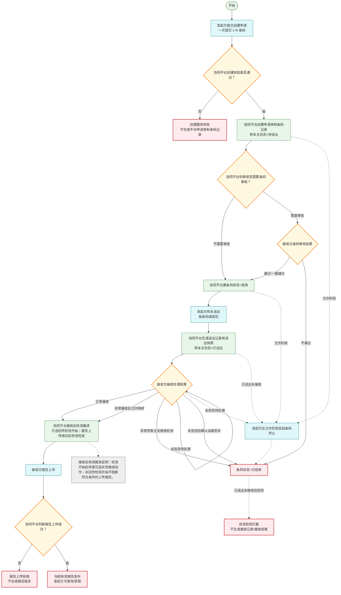
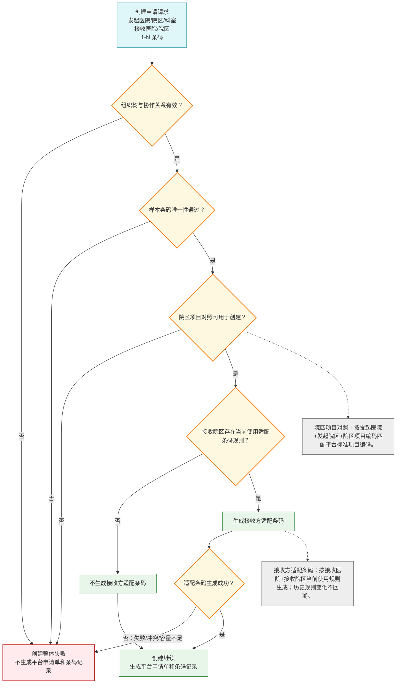
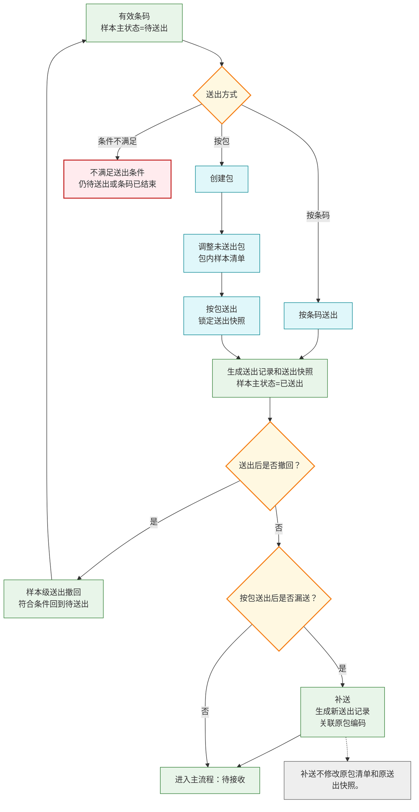
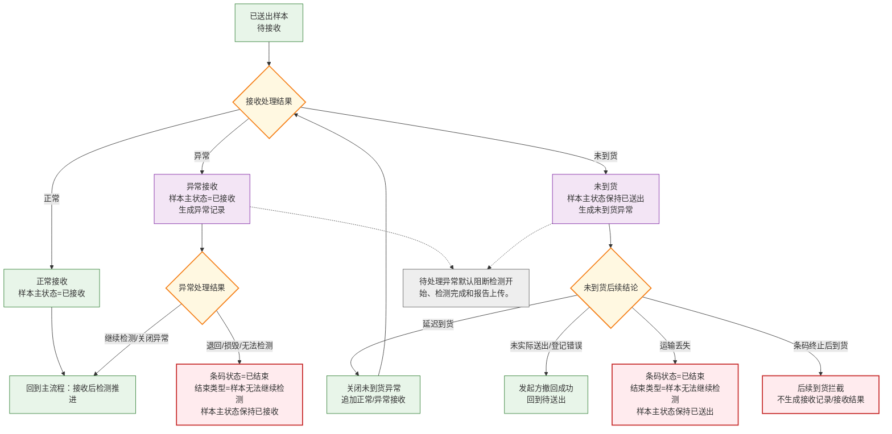
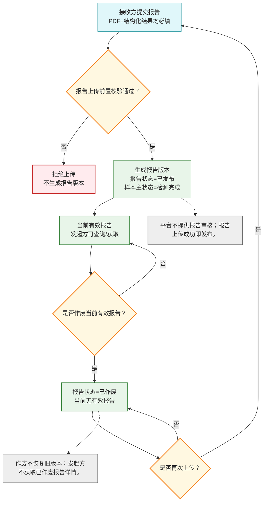
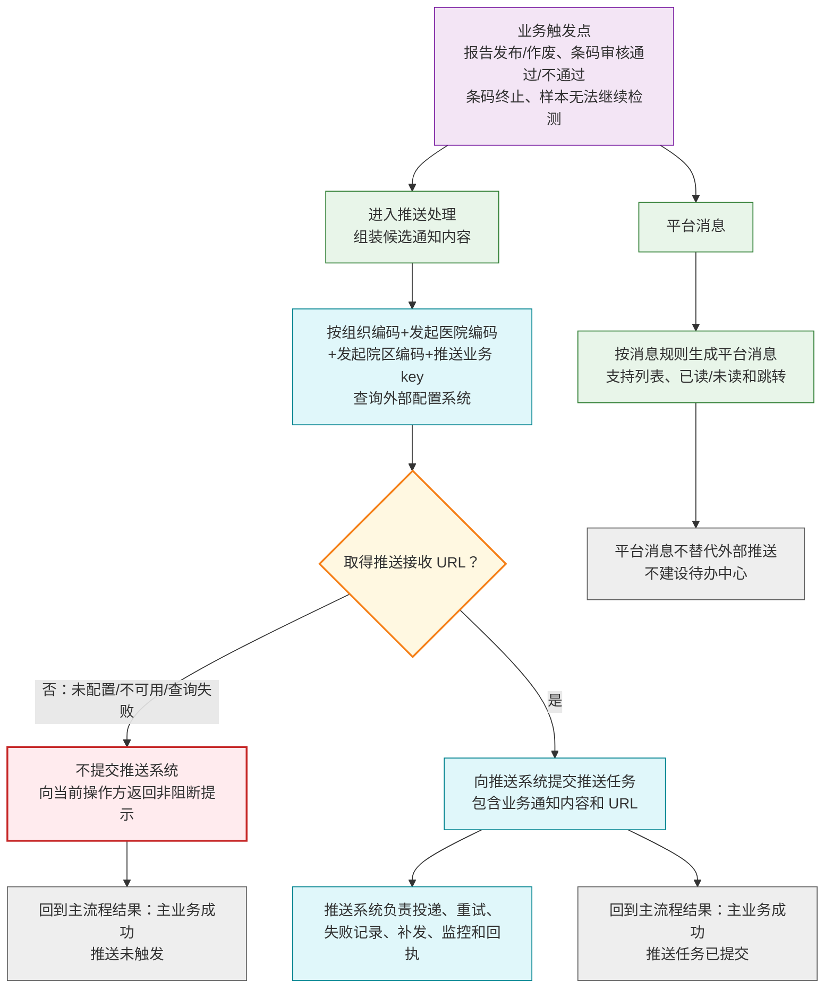
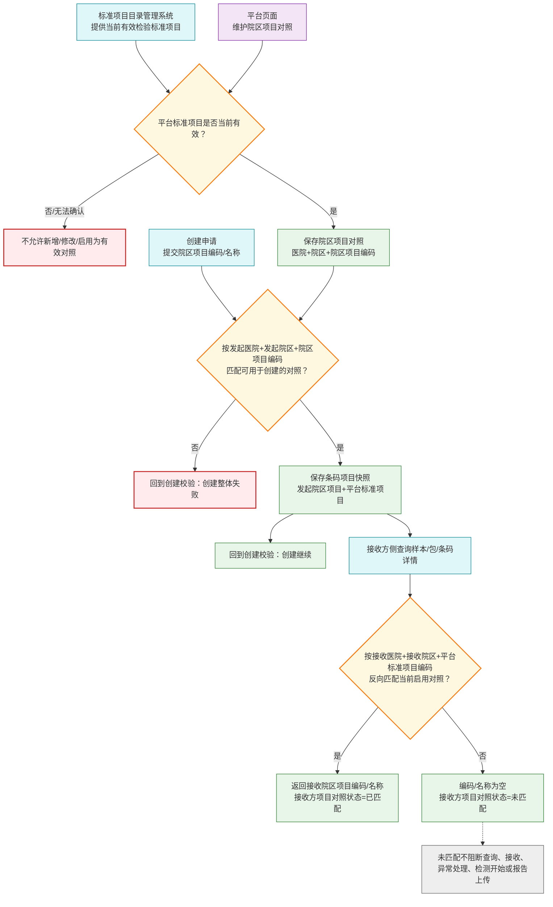
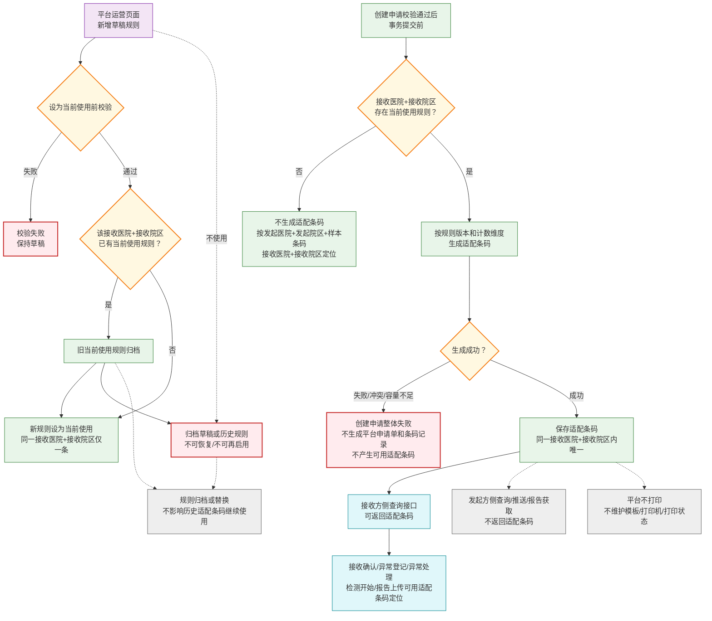

# 需求规约 - 检验中心协同平台

> 状态：评审通过
>
> 编写原则：本文档正文应完整表达当前版本已定义的业务规则、流程边界、状态变化、页面能力、接口能力和业务留痕；未在本文档中定义的内容，不纳入本版本需求。

## 1. 简介

### 1.1 目的

本文档用于定义检验中心协同平台当前版本的软件需求规约，作为设计、开发、测试和验收的业务依据。

本文档不替代接口设计文档、权限系统设计、隐私脱敏规范、非功能需求文档或技术方案。

### 1.2 项目背景

检验中心协同平台连接发起方与接收方，覆盖检验申请、样本流转、样本异常处理、报告发布、消息通知、外部推送和业务追溯。

当前版本的核心架构为：

1. 平台申请单是一次创建请求形成的批量容器。
2. 条码记录是业务流转核心实体。
3. 一个平台申请单可包含 1 到 N 条条码记录。
4. 发起方和接收方是申请级字段，同一申请下所有条码记录共享同一发起方和接收方；发起方精确到发起医院、发起院区和发起科室，接收方精确到接收医院和接收院区。
5. 患者、就诊、样本、项目、费用、绿色通道等信息属于条码级字段。
6. 报告按条码记录管理，一条码记录对应一个报告版本集合。

### 1.3 范围

当前版本包含以下能力：

| 编号 | 模块 | 范围 |
| --- | --- | --- |
| F01 | 申请管理 | 创建申请、条码审核、条码终止、申请查询、条码详情和流转追溯 |
| F02 | 样本打包管理 | 包创建、包调整、包作废、包查询和包追溯 |
| F03 | 样本送出管理 | 按条码送出、按包送出、送出撤回、补送和送出记录 |
| F04 | 样本接收管理 | 待接收查询、正常接收、异常接收、未到货和接收记录 |
| F05 | 样本状态管理 | 样本主状态定义、状态驱动规则和状态变更历史 |
| F06 | 样本异常处理 | 异常登记、异常处理结果、未到货后续处理和异常记录 |
| F07 | 报告管理 | 报告接口上传、上传成功即发布、报告作废、版本管理和查询下载 |
| F08 | 危急值管理边界 | 明确危急值不属于平台闭环管理范围 |
| F09 | 外部推送管理 | 平台向发起方侧外部接入系统主动推送关键业务动作通知 |
| F10 | 平台消息中心 | 面向平台用户的轻量消息列表、已读未读、筛选和跳转 |
| F11 | 权限、隐私与追溯边界 | 统一权限接入、统一隐私规范边界和业务留痕边界 |
| F12 | 院区项目对照管理与标准项目目录引用 | 协同平台维护院区项目对照，引用标准项目目录管理系统提供的平台标准项目目录 |
| F13 | 院区协作关系管理 | 发起院区与接收院区业务协作关系白名单管理 |
| F14 | 接收方适配条码规则管理 | 管理接收方适配条码生成规则，并在创建申请时按规则生成接收方适配条码 |
| I01-I06 | 外部接入系统调用接口汇总 | 当前版本对外主动调用接口清单和字段边界 |

### 1.4 总体边界

1. 平台不生成发起方样本条码，不打印样本条码或接收方适配条码。平台可按接收医院和接收院区当前使用的适配条码规则生成接收方适配条码。
2. 平台不提供页面人工补录申请。
3. 平台不提供页面人工上传报告，不出具报告。
4. 平台不提供报告审核能力、报告审核开关、报告发布审核、平台报告审核记录、审核结果通知或审核结果查询。
5. 平台不建设危急值闭环管理能力。
6. 平台不建设独立待办中心。
7. 平台当前版本建设轻量消息中心，但不建设任务处理流。
8. 平台不定义权限系统技术角色模型、授权流程、组织范围或数据范围配置。
9. 平台不定义具体患者隐私脱敏规则。
10. 平台不定义接口结构、安全控制、机构身份识别实现和非功能技术方案。

## 2. 术语

| 术语 | 定义 |
| --- | --- |
| 平台申请单 | 平台在创建申请时生成的批量容器，用于归集一次接口调用提交的一批条码记录。平台申请单不维护独立流程状态。平台申请单号仅用于平台内部展示和追溯，不作为对外接口入参或出参。 |
| 条码记录 | 平台申请单下的业务流转实体，关联样本条码、患者信息、就诊信息、项目清单、样本信息、费用状态、绿色通道等条码级信息。 |
| 平台内部标识 | 平台内部数据库主键或内部记录标识，仅平台内部使用，不作为对外接口入参或出参。 |
| 内部业务记录引用 | 平台内部用于关联、跳转、去重和追溯业务记录的引用信息，包括来源业务记录ID、内部关联业务记录等。内部业务记录引用不作为对外接口入参或出参，也不作为外部机构可理解的业务字段展示。 |
| 样本条码 | 发起方采样后生成并打印的条码。平台不生成发起方样本条码。样本条码唯一性范围为同一发起医院和同一发起院区内。 |
| 接收方适配条码 | 平台根据接收医院和接收院区当前使用的适配条码规则，为条码记录生成的接收方侧识别码。接收方适配条码用于接收方接收、本地标签打印、贴管、上机识别、检测开始回传、报告上传和接收方侧查询，不替代发起方样本条码。 |
| 发起方申请单号 | 发起方提交条码记录时传入的本方业务单号，属于条码级字段，仅用于记录、展示、回传和辅助查询，不作为唯一定位依据。 |
| 条码状态 | 表示条码记录是否可继续流转，包括待审核、有效、已结束。 |
| 结束类型 | 条码记录进入已结束后的结束原因，包括发起方终止、接收方审核不通过、样本无法继续检测。 |
| 样本主状态 | 表示样本在主流程中的位置，包括待送出、已送出、已接收、检测中、检测完成。 |
| 包编码 | 平台创建包时生成的全平台唯一包业务编码，用于页面展示、对外接口定位、按包送出、包调整、包作废和包查询。包编码不是平台内部数据库主键。 |
| 报告版本号 | 平台为同一条码记录下的报告版本生成的业务版本号，用于报告版本查询和当前有效报告判断。 |
| 平台标准项目编码 | 标准项目目录管理系统维护的平台标准项目唯一编码。协同平台通过本平台维护的院区项目对照关系，将发起方提交的院区项目编码匹配为平台标准项目编码。 |
| 院区项目对照 | 协同平台维护的院区本地项目与平台标准项目之间的对应关系。创建申请时用于发起院区项目正向匹配；接收方查询时用于按平台标准项目反向匹配接收院区项目编码和名称。 |
| 外部推送 | 平台主动向发起方侧外部接入系统发送的业务通知，不等同于外部接入系统主动调用平台接口。 |
| 平台消息 | 平台面向平台用户生成的业务消息，用于提醒用户关注其权限范围内的条码、报告或异常变化。 |

## 3. 整体业务规则

1. 平台申请单是批量容器，条码记录是业务流转核心实体。
2. 平台申请单不维护独立业务状态，只在页面汇总展示下属条码状态分布。
3. 条码记录独立审核、独立终止、独立流转、独立报告。
4. 条码记录结束后，后续打包、送出、接收、检测开始、报告上传、异常处理等动作均应被阻断。
5. 样本主状态只表达样本主流程位置，不表达条码结束、异常、报告作废、撤回或其他标签。
6. 平台内部标识不得作为对外接口入参、出参或外部推送字段。
7. 发起方和接收方均为申请级字段，平台申请单创建后不可变更。
8. 业务留痕、状态变更历史、审核记录、送出记录、接收记录、异常记录、报告记录和推送记录应按权限可追溯。
9. 接收方适配条码仅用于接收方侧识别和业务定位，不改变发起方样本条码的保存、展示和发起方侧定位规则。
10. 协同平台维护院区项目对照；标准项目目录管理系统仅维护平台标准项目目录，不维护院区项目对照。
11. 创建申请时，平台按发起医院编码、发起院区编码和院区项目编码正向匹配平台标准项目编码；接收方侧查询时，平台按接收医院编码、接收院区编码和平台标准项目编码反向匹配接收院区项目编码和名称。

### 条码流转主流程图

该流程图只表达条码记录从创建到报告发布或结束的核心路径。创建校验支撑规则见“创建校验支撑规则图”；送出处理见“样本送出处理子流程图”；接收与异常处理见“接收与异常处理子流程图”；报告生命周期见“报告生命周期子流程图”；推送与平台消息见“推送与平台消息边界图”。

条码流转主流程说明：

1. 主流程只表达核心流转：创建申请、条码审核、送出、接收、检测推进、报告上传结果、当前有效报告发布，以及条码结束。
2. 创建申请按一次接口调用整体成功或整体失败；任一条码创建校验、院区协作关系、院区项目对照或接收方适配条码生成失败时，本次申请整体失败。
3. 按包送出、送出撤回、补送等送出细节不在主流程展开，见“样本送出处理子流程图”。
4. 异常接收、未到货、运输丢失和异常导致无法继续检测等细节不在主流程展开，见“接收与异常处理子流程图”。
5. 报告作废和作废后再次上传不在主流程展开，见“报告生命周期子流程图”。
6. 外部推送和平台消息不改变主流程业务状态，见“推送与平台消息边界图”。

## 4. 具体需求

### F01 申请管理

#### 功能定位

申请管理用于接收发起机构通过平台对外接口提交的检验申请，生成平台申请单和条码记录，并建立申请、条码、患者、就诊、样本、项目、接收方、费用、绿色通道、条码审核结果和业务追溯之间的关系。

#### 参与者与入口

| 参与者 | 入口 | 能力 |
| --- | --- | --- |
| 发起机构侧外部接入系统 | 创建申请接口 | 提交 1 到 N 条条码记录 |
| 发起机构用户 | 平台页面 | 查询申请、查看条码详情、发起允许阶段的条码终止 |
| 接收方用户 | 平台页面 | 查看申请、执行条码审核、查看条码详情 |
| 平台运营人员 | 平台页面 | 按权限查询和追溯 |

平台页面不提供正常业务下的人工补录申请入口。

#### 业务规则

1. 一次创建申请可提交 1 到 N 条条码记录。
2. 创建申请按整次请求进行校验，整体成功或整体失败。
3. 任一条码记录不满足必填、唯一性、项目对照、院区协作关系等规则时，不生成平台申请单，也不创建任何条码记录。
4. 创建成功后，平台生成平台申请单号，并为每条条码记录生成平台内部标识；二者均仅平台内部使用，不作为对外接口入参或出参。
5. 平台不生成发起方样本条码，不打印样本条码或接收方适配条码。
6. 接收方存在当前使用适配条码规则时，平台应在创建申请校验通过后、事务提交前为每条条码记录生成接收方适配条码；生成失败时，本次创建申请整体失败。
7. 同一发起医院、同一发起院区内，同一样本条码不得重复绑定不同条码记录。
8. 条码记录结束后，原样本条码和已生成的接收方适配条码均不得释放或复用。
9. 不同发起医院或不同发起院区允许存在相同样本条码。
10. 发起方申请单号仅用于记录、展示、回传和辅助查询，不作为唯一定位、重复提交或流程判断依据。
11. 创建申请时，平台应校验发起院区与接收院区存在启用协作关系。
12. 创建申请时，平台按本平台维护的院区项目对照关系，将发起方提交的院区项目编码匹配为平台标准项目编码并保存项目快照。
13. 费用状态仅用于记录、展示和查询，不阻断主流程；绿色通道仅用于记录、展示和人工识别，不改变主流程；项目加急影响项目清单排序、展示和人工识别。

#### 创建校验支撑规则图

本图不是独立业务流转，而是“条码流转主流程图”中“创建校验是否通过？”节点的支撑规则。所有结果都回到主流程的“创建继续”或“创建整体失败”。

创建校验支撑规则说明：

1. 创建申请校验是主流程的前置节点，不单独形成业务流转。
2. 院区项目对照匹配失败、协作关系无效、条码唯一性不通过或适配条码生成失败，均回到主流程的“创建整体失败”。
3. 接收院区无当前使用适配条码规则时，创建申请可继续，但该条码记录不生成接收方适配条码。
4. 本图不展开院区项目对照维护过程和接收方适配条码规则维护过程。

#### 重复提交与字段快照

1. 平台以发起医院、发起院区和样本条码作为条码记录重复提交判断的主要依据。
2. 核心业务字段最小范围包括样本条码、发起方患者标识、患者姓名、患者性别、就诊信息中的开单/送检医生和诊断、平台标准项目编码清单、样本类型、采样时间、采样人，以及其他影响送检、接收和检测判断的信息。
3. 重复提交时，如同一发起医院、同一发起院区内样本条码相同且核心业务字段一致，平台识别为已有条码记录，不创建新条码记录，对外接口不返回平台申请单号或平台内部标识。
4. 如同一发起医院、同一发起院区内样本条码相同但核心业务字段不一致，平台拒绝创建，并提示条码已被占用或重复提交内容与原条码记录不一致。
5. 如同一发起医院、同一发起院区内样本条码相同、核心业务字段一致但非核心字段不一致，平台识别为已有条码记录，不修改已有条码记录的非核心字段。
6. 如同一发起医院、同一发起院区内发起方申请单号相同但样本条码不同，平台不因发起方申请单号相同直接拒绝，应按样本条码创建或定位条码记录。
7. 条码记录创建成功后不提供字段修改入口；核心业务字段不支持修改，非核心字段仅记录创建时快照。
8. 一次创建请求中同时包含历史已存在条码和新增条码时，平台应整体拒绝本次请求，并提示调用方拆分或修正后重新提交。

#### 条码审核

1. 条码审核用于接收方在样本送出前确认是否承接本条码记录对应的检验项目。
2. 条码审核按条码记录逐条执行，并提供一键全部通过能力；一键全部通过应展示将受影响的条码数量和清单摘要。
3. 条码审核开关由外部配置系统提供创建时判定结果，当前按接收医院和接收院区维度配置。
4. 平台应保存条码记录创建时的审核开关判定结果；创建后审核开关配置变化不回溯影响已创建条码。
5. 需审核时，条码初始状态为待审核；不需审核时，条码初始状态为有效。
6. 待审核条码不得打包、送出。
7. 审核通过后，条码状态变为有效。
8. 审核不通过后，条码状态变为已结束，结束类型为接收方审核不通过。
9. 审核通过和审核不通过均应记录审核结果、审核备注、操作人、操作时间和操作来源；审核备注可选。
10. 审核不通过必须记录审核不通过原因；审核通过不要求填写审核不通过原因。
11. 审核通过和审核不通过均触发平台消息，并按 F09 触发外部推送。
12. 接收方具备条码审核权限的用户可通过条码审核列表查看提交给本接收方且需要审核的条码记录；列表支持按平台申请单号归组展示，支持按待审核、审核通过、审核不通过筛选，并可展示待审核数量。
13. 条码记录创建后如进入待审核，不生成平台消息；待审核条码通过审核列表或待审核数量入口处理。
14. 审核记录生成后不可修改、不可删除；审核结果选择错误时，只允许追加说明记录，追加说明不改变条码状态、不重新触发审核流程、不恢复已结束条码记录。
15. 当前版本不提供条码审核对外提交接口，接收方只能通过平台页面完成条码审核。

#### 条码终止

1. 条码终止由发起机构在样本未接收前发起。
2. 样本已送出但未接收时仍属于允许终止阶段；未到货异常待处理期间仍按已送出未接收处理，发起机构可发起条码终止。
3. 条码终止按条码记录逐条生效，可批量操作但应逐条校验、逐条记录结果。
4. 不支持条码记录内项目级部分终止。
5. 样本已接收、检测中、检测完成或已有报告后，不允许发起机构单方终止。
6. 终止成功后，条码状态变为已结束，结束类型为发起机构终止。
7. 已送出未接收样本终止后，不回到待送出，不允许后续接收；接收方后续扫码接收时应按已结束拦截。
8. 未到货异常待处理期间发生条码终止时，平台应在条码终止生效的同一事务内自动关闭归档原未到货异常记录，处理结果为关闭异常，处理原因为条码已终止；该处理原因仅由平台自动生成，不作为外部异常处理接口可提交原因。
9. 条码终止联动关闭未到货异常仅表示条码结束后的业务归档，不表示实物问题已解决，不要求线下确认说明。
10. 终止后，后续打包、送出、接收、检测、报告上传和异常处理均应被阻断。
11. 终止类型由系统根据终止发生时样本所处阶段自动判定，值域包括审核前终止、未送出终止、送出后终止，不由发起机构选择。
12. 终止原因由发起机构从预置枚举选择，当前值域包括申请信息错误、患者信息变更、不再需要检测、重复申请、费用或结算原因、其他；选择其他时必须填写终止说明。
13. 终止记录应保留终止类型、终止原因、终止说明、终止发起机构、终止时间、操作来源、终止时样本主状态和终止时报告状态摘要。
14. 平台页面触发条码终止时，应提示终止影响，包括条码记录结束、原样本条码不可复用、后续业务动作被阻断、后续到货或接收将被拦截。
15. 条码记录结束后不可恢复为有效；接收方不能代替发起机构发起条码终止，当前版本不提供平台运营人员代发起机构发起条码终止的默认业务入口。
16. 条码终止触发平台消息，并按 F09 触发外部推送。

#### 查询与详情展示

1. 申请列表和申请详情仅通过平台页面提供，当前版本不提供申请列表、条码列表或申请详情对外接口。
2. 申请列表应支持按平台申请单号、发起方申请单号、发起方、接收方、创建时间、条码状态分布等条件查询或展示；具体控件形态由页面设计确定，但不得减少本条定义的查询或展示能力。
3. 条码记录查询应支持按样本条码、发起方申请单号、发起方、接收方、条码状态、样本主状态、创建时间、报告状态等业务条件查询或展示。
4. 条码详情应展示申请创建快照、患者信息、就诊信息、样本信息、项目信息、费用信息、绿色通道信息、条码状态、结束类型、样本主状态、审核信息、终止信息、当前送出摘要、最终接收结论、异常处理摘要、报告摘要和关键时间。
5. 项目清单应展示发起院区项目编码、发起院区项目名称、平台标准项目编码、平台标准项目名称和项目加急标识；接收方侧可同时展示接收院区项目编码、接收院区项目名称和接收方项目对照状态；项目排序应先展示加急项目，再展示普通项目，同为加急或同为普通时保持发起方提交顺序。
6. 条码详情流转时间线应按时间顺序聚合展示创建、审核、终止、入包、包调整、包作废、送出、撤回、补送、接收、未到货、异常处理、检测开始、报告发布、报告作废、条码结束拦截等业务记录摘要。
7. 条码详情可展示新旧条码记录备注关系，但备注不表示恢复原条码记录，也不表示新旧条码记录合并流转。
8. 完整流转时间线仅在平台页面按权限展示，不通过对外接口完整返回。

#### 关键属性

平台申请单关键属性：

| 属性 | 说明 |
| --- | --- |
| 平台申请单号 | 平台自动生成，仅平台内部展示和追溯使用 |
| 发起方 | 申请级字段，同一申请下所有条码记录共享发起医院、发起院区和发起科室 |
| 接收方 | 申请级字段，同一申请下所有条码记录共享 |
| 创建时间 | 平台自动生成 |

条码记录关键属性：

| 属性 | 说明 |
| --- | --- |
| 平台内部标识 | 平台自动生成，仅平台内部使用 |
| 平台申请单号 | 关联归属申请单，仅平台内部展示和追溯使用 |
| 样本条码 | 同一发起医院和同一发起院区内唯一，平台不生成发起方样本条码 |
| 接收方适配条码 | 接收方存在当前使用适配条码规则时由平台生成，同一接收方内唯一 |
| 发起方申请单号 | 发起方业务单号，仅记录、展示、回传和辅助查询 |
| 患者信息 | 条码级对象，字段见 I03 接口字段级规则中的复用信息项 |
| 就诊信息 | 条码级对象，字段见 I03 接口字段级规则中的复用信息项 |
| 样本信息 | 条码级对象，字段见 I03 接口字段级规则中的复用信息项 |
| 项目信息 | 条码级对象，字段见 I03 接口字段级规则中的复用信息项 |
| 费用信息 | 条码级对象，字段见 I03 接口字段级规则中的复用信息项 |
| 绿色通道信息 | 条码级对象，字段见 I03 接口字段级规则中的复用信息项 |
| 备注 | 可记录重开、纠错、补单等说明 |
| 条码状态 | 待审核、有效、已结束 |
| 结束类型 | 发起机构终止、接收方审核不通过、样本无法继续检测 |
| 终止类型 | 审核前终止、未送出终止、送出后终止 |
| 样本主状态 | 待送出、已送出、已接收、检测中、检测完成 |

条码审核记录关键属性：

| 属性 | 说明 |
| --- | --- |
| 平台内部标识 | 平台自动生成，仅平台内部使用 |
| 平台申请单号 | 关联归属申请单，仅平台内部展示和追溯使用 |
| 审核结果 | 审核通过、审核不通过 |
| 审核人 | 执行审核的用户 |
| 审核时间 | 审核发生时间 |
| 审核备注 | 审核补充说明 |
| 审核不通过原因 | 审核不通过时记录 |
| 操作来源 | 当前版本为平台操作 |

条码终止记录关键属性：

| 属性 | 说明 |
| --- | --- |
| 平台内部标识 | 仅平台内部使用 |
| 平台申请单号 | 关联归属申请单，仅平台内部展示和追溯使用 |
| 终止类型 | 系统按终止发生阶段判定 |
| 终止原因 | 发起机构从预置枚举选择 |
| 终止说明 | 终止原因为其他时记录 |
| 终止时间 | 终止发生时间 |
| 终止发起机构 | 发起终止的机构 |
| 操作来源 | 平台操作或接口提交 |
| 终止时样本主状态 | 记录终止发生时样本流程位置 |
| 终止时报告状态摘要 | 记录终止时报告状态摘要 |

#### 状态与记录

| 对象 | 状态或记录 |
| --- | --- |
| 条码状态 | 待审核、有效、已结束 |
| 结束类型 | 发起机构终止、接收方审核不通过、样本无法继续检测 |
| 样本主状态初始值 | 待送出 |
| 申请单 | 不维护独立业务状态，只汇总下属条码状态分布 |
| 留痕 | 创建快照、条码审核记录、条码终止记录、条码状态变化历史、条码详情流转时间线 |

#### 验收标准

1. 支持通过对外接口一次提交 1 到 N 条条码记录。
2. 创建请求整体校验失败时，不创建平台申请单和任何条码记录。
3. 重复提交核心字段一致时按幂等处理，不创建新条码记录。
4. 核心字段不一致时，平台拒绝创建。
5. 创建成功后，平台内部可生成平台申请单号和平台内部标识，但不通过对外接口返回。
6. 待审核条码不得打包或送出。
7. 审核通过后条码有效，审核不通过后条码已结束。
8. 终止成功后条码已结束，并阻断后续业务动作。
9. 申请列表和申请详情能展示下属条码状态分布。
10. 条码详情能展示创建、审核、终止、送出、接收、异常、报告等流转时间线。
11. 条码审核列表支持状态筛选、待审核数量展示和一键全部通过。
12. 审核记录不可修改、不可删除，错误结果只能追加说明。
13. 终止记录能展示终止类型、终止原因、终止时样本主状态和终止时报告状态摘要。

#### 不支持范围

1. 不支持平台生成发起方样本条码。
2. 不支持平台打印样本条码。
3. 不支持页面人工补录申请。
4. 不支持创建后修改核心业务字段。
5. 不支持项目级部分终止。
6. 不支持接收后发起机构单方终止。
7. 不支持已结束条码记录的样本条码再次用于创建新的条码记录。

### F02 样本打包管理

#### 功能定位

样本打包管理用于将同一发起医院、同一发起院区、同一接收医院、同一接收院区的一个或多个样本条码归集为平台业务包，支持按包送出、待接收展示、快捷批量设置和业务追溯。

包不要求线下一定存在实体箱，不承载样本主状态。

#### 参与者与入口

| 参与者 | 入口 | 能力 |
| --- | --- | --- |
| 发起机构用户 | 平台页面 | 创建包、调整包、作废包、查询包 |
| 发起机构侧外部接入系统 | 包相关接口 | 创建包、调整包、作废包、查询包 |
| 接收方用户 | 平台页面 | 查询提交给本接收方的包 |
| 接收方侧外部接入系统 | 包查询接口 | 查询提交给本接收方的包 |
| 平台运营人员 | 平台页面 | 按权限查询全平台包 |

#### 业务规则

1. 一个包只能包含同一发起医院、同一发起院区、同一接收医院、同一接收院区的样本。
2. 入包样本必须满足：条码状态为有效、样本主状态为待送出、发起机构和接收方与包一致。
3. 已结束、已送出、已接收、检测中、检测完成或已有报告的条码不得加入包。
4. 同一样本同一时间不得属于多个有效未送出包。
5. 包未送出前可加入、移出样本，并记录调整留痕。
6. 包送出后，包内样本关系锁定，不允许继续加入或移出。
7. 包未送出前可作废，送出后不可作废。
8. 包作废不可恢复，但不改变包内条码状态和样本主状态。
9. 打包是可选流程，未打包样本可直接按条码送出。
10. 页面未加入任何样本前，不生成平台包记录。
11. 有效未送出包内条码记录结束后，平台应自动将其从包中移出，并记录包内样本变更记录；该动作不生成独立消息。
12. 条码结束自动移出记录应保留调整动作、操作来源、移出原因、触发来源、调整时间和调整后的包内样本清单。
13. 已送出或已作废包不因包内条码后续结束而修改包内样本清单。
14. 包作废时必须记录作废原因、作废时间和操作来源；作废原因值域为样本信息错误、包内容变更、不再需要送出、其他，选择其他时必须填写说明。

#### 关键属性

包关键属性：

| 属性 | 说明 |
| --- | --- |
| 包编码 | 平台生成的包业务编码，不是平台内部数据库主键 |
| 发起方 | 包所属发起医院和发起院区 |
| 接收方 | 包所属接收方 |
| 包名称 | 发起方填写，可重复，仅用于人工识别 |
| 包状态 | 有效、已作废 |
| 是否已送出 | 送出后锁定，不并入包状态 |
| 创建时间 | 包创建时间 |
| 最近调整时间 | 最近一次调整时间 |
| 操作用户 | 平台操作时记录平台用户 |
| 发起医院编码、发起院区编码 | 接口提交时记录发起方归属 |
| 作废原因 | 样本信息错误、包内容变更、不再需要送出、其他 |
| 作废说明 | 作废原因为其他时记录 |
| 作废时间 | 作废发生时间 |
| 操作来源 | 平台操作、接口提交、平台自动处理 |

包内样本清单属性：

| 属性 | 说明 |
| --- | --- |
| 样本条码 | 包内样本标识 |
| 发起方申请单号 | 发起方业务单号 |
| 患者信息摘要 | 用于包内样本识别 |
| 样本信息摘要 | 用于包内样本核对 |
| 项目清单摘要 | 用于包内项目核对 |
| 样本主状态 | 展示样本当前位置 |
| 最终接收结论 | 正常接收或异常接收已形成时展示；未到货不属于最终接收结论 |
| 加入时间 | 样本加入包的时间 |

包内样本变更记录属性：

| 属性 | 说明 |
| --- | --- |
| 调整时间 | 包内样本变更时间 |
| 操作来源 | 平台操作、接口提交或平台自动处理 |
| 调整动作 | 加入、移出、自动移出 |
| 调整前后样本清单摘要 | 记录调整前后清单变化 |
| 移出原因 | 自动移出时展示 |
| 触发来源 | 自动移出时展示触发来源 |

#### 状态与记录

| 对象 | 状态或记录 |
| --- | --- |
| 包状态 | 有效、已作废 |
| 送出属性 | 是否已送出，不并入包状态 |
| 包内样本清单 | 未送出包展示当前样本；已送出包展示送出时锁定样本；已作废包展示作废前最后有效样本 |

未送出包内样本全部移出后，包仍存在且状态保持有效，可继续加入符合条件的样本，不自动作废。

#### 验收标准

1. 支持通过页面或接口创建包。
2. 包内不得混装多个发起机构或多个接收方的样本。
3. 只有有效且待送出的样本可加入包。
4. 同一样本同一时间不得属于多个有效未送出包。
5. 包未送出前可调整和作废。
6. 包送出后锁定包内关系，且不可作废。
7. 包作废不改变条码状态和样本主状态。
8. 包列表、包详情、包内样本清单和包调整记录可按权限查询。
9. 未送出包内条码结束后自动移出并形成包内样本变更记录。
10. 包作废原因=其他时必须填写说明。

#### 不支持范围

1. 不要求包与线下实体箱强绑定。
2. 不要求打包作为必经流程。
3. 不支持已送出包恢复编辑。
4. 不支持已送出包作废。
5. 不支持按包送出后因撤回恢复原包编辑。

### F03 样本送出管理

#### 功能定位

样本送出管理用于由发起机构确认样本从本机构送出至接收方，形成送出记录和不可变送出快照，并推动样本主状态进入已送出。

#### 参与者与入口

| 参与者 | 入口 | 能力 |
| --- | --- | --- |
| 发起机构用户 | 平台页面 | 按条码送出、按包送出、撤回、补送 |
| 发起机构侧外部接入系统 | 送出相关接口 | 按条码送出、按包送出、撤回、补送 |
| 接收方用户 | 平台页面 | 查询待接收样本和送出摘要 |
| 接收方侧外部接入系统 | 接收方样本清单和详情查询接口 | 查询接收方样本和送出摘要 |
| 平台运营人员 | 平台页面 | 按权限追溯 |

#### 业务规则

1. 送出方式包括按条码送出和按包送出。
2. 按条码送出支持一个或多个样本条码。
3. 按包送出基于未送出的有效包。
4. 仅条码状态为有效、样本主状态为待送出、接收方明确的样本可送出。
5. 当前属于有效未送出包的样本不得按条码送出，需先移出包或按包送出。
6. 已结束、已送出、已接收、检测中、检测完成或已有报告的样本不得送出。
7. 按包送出必须整包校验；任一样本不满足条件时，整包送出失败。
8. 平台不支持同一包内部分样本送出、部分保留。
9. 送出成功后，样本主状态变为已送出。
10. 按包送出后，包记录标记为已用于送出，包内样本关系锁定。

#### 样本送出处理子流程图

本图展开“条码流转主流程图”中的“样本送出”节点，最终回到主流程的“样本主状态=已送出”或“仍待送出/不再送出”。

样本送出处理子流程说明：

1. 待审核条码、已结束条码或不满足送出条件的条码不得送出。
2. 按包送出会锁定本次送出快照；后续补送生成新的送出记录，不回写原包清单。
3. 送出撤回只在符合规则的阶段允许，撤回成功后回到主流程的待送出阶段。

#### 送出撤回

1. 送出撤回仅适用于已送出且尚未接收的样本。
2. 已接收、检测中、检测完成、已有报告或条码已结束的样本不得撤回。
3. 撤回不删除原送出记录，不修改送出快照。
4. 撤回成功后，样本主状态回到待送出。
5. 重新送出必须生成新的送出记录。
6. 整包撤回后，原包仍不恢复编辑，且不可再次基于原包送出。
7. 通过对外接口提交送出撤回时，平台按发起医院编码、发起院区编码和样本条码定位当前唯一未接收送出关系，不要求外部提交平台内部标识；单次撤回样本列表必须唯一定位到同一当前未接收送出记录，定位到不同送出记录或存在多候选送出记录时拒绝撤回。
8. 部分样本撤回后，原送出记录保持已送出状态并展示有撤回标签；全部样本撤回后，送出记录状态为全部撤回。
9. 未到货待处理不属于最终接收结论，应作为样本当前处理展示状态和送出记录业务标签展示。
10. 条码结束导致后续接收被拦截时，应参与送出记录样本明细展示和业务标签推导，但不生成接收结果。

#### 补送

1. 补送仅是按包送出后的限定动作。
2. 补送用于应随原包送出但未纳入原包或原送出记录的漏送样本。
3. 补送生成新的补送送出记录，关联原包编码。
4. 补送不修改原包清单和原送出快照。
5. 已纳入原送出记录但实物漏装的样本，应走样本级撤回后重新送出，不走补送。
6. 补送样本必须与原包发起医院、发起院区、接收医院、接收院区一致，且满足当前送出样本范围。
7. 平台不校验该样本业务上是否应该随原包送出，仅校验补送边界和机构归属。
8. 补送样本不进入原包清单，不修改原送出快照；补送记录应与原包编码双向追溯。
9. 按条码送出场景发现漏送时，不要求使用补送，可按普通送出规则重新送出。

#### 关键属性

送出记录关键属性：

| 属性 | 说明 |
| --- | --- |
| 送出记录号 | 平台自动生成，仅用于页面展示和内部追溯 |
| 送出方式 | 按条码送出、按包送出 |
| 补送标记 | 补送时标记 |
| 发起方 | 送出发起医院和发起院区 |
| 接收方 | 样本接收方 |
| 送出时间 | 送出发生时间 |
| 操作来源 | 平台操作或接口提交 |
| 包编码 | 按包送出时关联 |
| 本次送出的样本清单 | 本次送出动作锁定记录的样本集合 |
| 送出备注 | 送出补充说明 |
| 送出记录状态 | 已送出、接收完成、全部撤回 |
| 业务标签 | 有撤回、有异常、补送、未到货待处理 |

送出快照属性：

| 属性 | 说明 |
| --- | --- |
| 发起方申请单号 | 送出时锁定的发起方业务单号 |
| 样本条码 | 送出时锁定的样本条码 |
| 患者信息摘要 | 送出时锁定的患者摘要 |
| 平台标准项目编码清单 | 送出时锁定的项目编码清单 |

#### 状态与记录

| 对象 | 状态或记录 |
| --- | --- |
| 送出记录状态 | 已送出、接收完成、全部撤回 |
| 业务标签 | 有撤回、有异常、补送、未到货待处理 |
| 送出快照 | 发起方申请单号、样本条码、患者信息摘要、平台标准项目编码清单；形成后不随后续对象变化而改变 |

#### 验收标准

1. 支持按条码和按包送出。
2. 送出成功后生成送出记录和不可变送出快照。
3. 送出成功后样本主状态进入已送出。
4. 按包送出整包校验，不支持部分成功。
5. 已送出未接收样本可按明细撤回。
6. 已接收及后续状态不可撤回。
7. 补送记录与原包可双向追溯。
8. 部分撤回、全部撤回、未到货待处理、条码结束拦截等场景能在送出记录状态、业务标签和样本明细展示中区分。

#### 不支持范围

1. 平台不因接收方相同、时间接近或样本同批自动合并送出记录。
2. 按包送出不支持部分成功。
3. 撤回不删除历史送出事实。
4. 补送不代表重新采样、重新检测或开启新轮次。
5. 不支持物流追踪、运单号、物流状态或运输时效管理。

### F04 样本接收管理

#### 功能定位

样本接收管理用于接收方对已送出样本逐样本提交接收结果，形成接收记录，并推动样本主状态进入已接收或生成未到货、异常接收相关记录。

#### 参与者与入口

| 参与者 | 入口 | 能力 |
| --- | --- | --- |
| 接收方用户 | 平台页面 | 查询待接收样本，提交正常接收、异常接收、未到货 |
| 接收方侧外部接入系统 | 接收相关接口 | 查询接收方样本清单、查询接收方单个样本、提交接收结果 |
| 平台运营人员 | 平台页面 | 按权限追溯 |

接收方侧样本精确定位支持两种方式：发起医院编码+发起院区编码+样本条码，或接收方适配条码。查询接收方样本清单接口用于列表查询，查询接收方单个样本接口用于扫码或精确定位；按包查看样本继续使用查询包详情接口。包入口仅用于查询展示和快捷批量设置，不是独立接收方式。

#### 业务规则

1. 接收以样本为最小处理单位。
2. 仅已送出、未撤回、接收方匹配、可关联当前有效送出关系且未形成最终接收结论的样本允许接收。最终接收结论仅指正常接收或异常接收；未到货不属于最终接收结论，存在未关闭未到货异常且样本主状态仍为已送出时，允许后续通过统一样本接收确认接口提交正常接收或异常接收。
3. 未送出样本不能接收，平台不自动补记送出记录。
4. 已接收、检测中、检测完成、已有报告或条码已结束的样本不能重复接收。
5. 通过样本条码定位时，必须明确接收医院、接收院区、发起医院、发起院区和样本条码；通过接收方适配条码定位时，必须明确接收医院、接收院区和接收方适配条码。
6. 不同发起医院、发起院区相同样本条码按发起方隔离识别。
7. 不能仅凭样本条码模糊匹配。
8. 样本送出后、接收前条码已结束时，接收方接收应被拦截，记录拦截原因，不生成接收结果，不进入异常处理范围。
9. 已送出未接收样本因条码终止进入已结束后，如后续样本延迟到达，接收方接收应被拦截；样本主状态保持终止发生时状态，不生成接收记录，不生成接收结果，不进入异常处理范围。
10. 样本接收确认接口不接收送出记录号、对外分组字段或平台内部标识。
11. 样本接收确认接口中，每条样本必须且只能选择一种定位方式：接收方适配条码，或发起医院编码+发起院区编码+样本条码。
12. 按样本条码定位时，必须提交发起医院编码和发起院区编码；平台按接收医院编码、接收院区编码、发起医院编码、发起院区编码、样本条码和当前有效送出关系完成定位与关联，不允许仅凭样本条码接收。
13. 按接收方适配条码定位时，不提交发起医院编码和发起院区编码；平台按接收医院编码、接收院区编码、接收方适配条码和当前有效送出关系完成定位与关联。
14. 样本接收确认接口一次提交的所有样本必须属于同一接收医院和接收院区，可以来自一个或多个发起方。
15. 平台应逐条校验样本能唯一定位到具体条码记录和当前有效送出关系；任一样本定位失败、状态不允许接收或归属不匹配时，本次提交整体失败，不做部分接收。
16. 平台内部应按发起方、包编码或送出关系生成一条或多条接收记录。
17. 包入口应展示原送出记录、关联补送记录摘要、补送样本标记和关联原包编码，便于接收方按包核对。
18. 查询接收方样本清单接口支持接收状态筛选，接收状态包括待接收、已接收；不传时默认查询待接收。
19. 接收状态=待接收时，返回当前仍可接收的已送出样本，并包含未到货待处理样本；未到货待处理样本通过样本当前处理展示状态区分。
20. 接收状态=已接收时，返回已正常接收或异常接收的样本，不返回未到货待处理样本。
21. 接收前按待接收查询返回的样本，可能包含后续实际未到货样本；该返回结果不表示平台确认实物已到。
22. 接收方可在样本实物到达后的接收登记过程中，基于查询接收方样本清单接口、查询接收方单个样本接口、查询包详情接口或查询条码记录详情接口返回的接收方适配条码完成本地打印、贴管和后续上机识别；平台不要求接收方先完成平台接收确认后才能获取接收方适配条码。
23. 样本接收确认接口中，接收处理结果=正常接收时，不应提交异常类型、异常描述或未到货说明。
24. 样本接收确认接口中，接收处理结果=异常接收时，异常类型必填；异常类型=其他时异常描述必填，其他异常类型可按实际情况记录异常描述；不应提交未到货说明。
25. 样本接收确认接口中，接收处理结果=未到货时，未到货说明必填，不应提交异常类型或异常描述。

#### 关键属性

接收记录关键属性：

| 属性 | 说明 |
| --- | --- |
| 接收记录号 | 平台自动生成 |
| 提交渠道 | 平台页面、样本接收确认接口 |
| 样本定位方式 | 发起医院编码+发起院区编码+样本条码、接收方适配条码；通过包入口快捷设置时仍按样本逐条定位 |
| 发起方 | 样本所属发起医院和发起院区 |
| 接收方 | 样本接收方 |
| 接收时间 | 接收确认时间 |
| 操作来源 | 平台操作或接口提交 |
| 接收医院编码、接收院区编码 | 接口提交时记录，表示接收方归属 |
| 送出记录号 | 关联送出记录，仅用于页面展示和内部追溯 |
| 包编码 | 通过包入口提交时展示 |
| 本次处理的样本清单 | 本次接收提交处理的样本集合 |
| 样本接收处理结果 | 正常接收、异常接收、未到货；未到货为临时接收处理结果 |
| 最终接收结论 | 正常接收、异常接收；未到货不属于最终接收结论 |
| 异常类型 | 异常接收时记录 |
| 异常描述 | 异常接收时记录；异常类型=其他时必填，其他异常类型可按实际情况记录 |
| 未到货说明 | 未到货时记录 |
| 接收备注 | 接收补充说明 |

接收方样本清单展示属性：

| 属性 | 说明 |
| --- | --- |
| 送出记录号 | 待接收记录入口展示 |
| 发起机构 | 样本发起机构 |
| 接收方适配条码 | 接收方侧识别码，已生成时展示 |
| 送出方式 | 按条码送出或按包送出 |
| 包编码 | 按包送出或包入口时展示 |
| 样本数量 | 当前查询条件下的样本数量 |
| 接收状态 | 待接收、已接收 |
| 样本当前处理展示状态 | 待接收、未到货待处理、已撤回、已拦截等当前展示状态 |
| 接收处理结果 | 已接收时展示正常接收或异常接收；未到货通过样本当前处理展示状态展示为未到货待处理 |
| 送出时间 | 送出发生时间 |
| 接收时间 | 已接收时展示 |

#### 接收结果

| 接收结果 | 状态变化 | 后续处理 |
| --- | --- | --- |
| 正常接收 | 样本主状态由已送出变为已接收 | 可进入检测或报告前置流程 |
| 异常接收 | 样本主状态由已送出变为已接收 | 生成异常记录 |
| 未到货 | 样本主状态保持已送出 | 生成未到货异常记录 |

未到货是临时接收处理结果，不是最终接收结论，不表示必然丢失。

#### 状态与记录

接收记录应至少包括接收记录号、提交渠道、样本定位方式、发起方、接收方、接收时间、操作来源、接收医院编码、接收院区编码、送出记录号、包编码、本次处理的样本清单、样本接收处理结果、最终接收结论、异常类型、异常描述、未到货说明、接收备注。接收方通过接收方适配条码提交时，应在本次处理的样本清单中记录对应接收方适配条码。一次提交涉及多个发起方、包编码或送出关系时，平台应按发起方、包编码或送出关系拆分生成多条接收记录。

接收记录是历史留痕，不因后续处理被覆盖。未到货样本后续到货并接收时，应追加后续接收记录，关联原未到货接收记录和原送出记录。

#### 验收标准

1. 支持逐样本或批量提交接收结果。
2. 包入口仅提供查询展示和快捷批量设置。
3. 正常接收后样本进入已接收。
4. 异常接收后样本进入已接收并生成异常记录。
5. 未到货样本不进入已接收，保持已送出。
6. 接收记录可关联申请、样本条码、接收方适配条码、送出记录、包编码和接收方。
7. 历史接收记录不被覆盖。
8. 条码已结束样本不可接收并展示拦截记录。
9. 接收方可通过接口查询接收方样本清单和接收方单个样本。
10. 查询接收方样本清单接口不支持按送出记录号查询。
11. 接收方样本清单可按接收状态筛选待接收或已接收样本，并返回接收方适配条码；查询接收方单个样本接口可按发起医院编码+发起院区编码+样本条码或接收方适配条码精确查询样本。
12. 样本接收确认接口可按接收方适配条码或发起医院编码+发起院区编码+样本条码定位样本。
13. 样本接收确认接口一次提交可包含多个发起机构样本，但必须属于同一接收方，并按整次请求整体成功或整体失败。

#### 不支持范围

1. 包不是独立接收方式。
2. 未送出样本不能通过接收自动补送出。
3. 仅凭样本条码不得模糊定位。
4. 异常接收和未到货本身不自动导致条码结束。
5. 已有未关闭未到货记录时，不得再次提交未到货。
6. 接收动作不直接推进到检测中。

### F05 样本状态管理

#### 功能定位

样本状态管理用于表达样本在平台主流程中的当前位置，为申请查询、送出、接收、检测、报告和追溯提供统一状态依据。

样本状态管理只管理样本主状态，不替代条码状态、结束类型、接收处理结果、异常状态、报告状态、推送状态等业务对象状态。

#### 状态范围

样本主状态只能包括：

1. 待送出。
2. 已送出。
3. 已接收。
4. 检测中。
5. 检测完成。

#### 业务规则

1. 样本主状态不可新增。
2. 样本主状态不表达异常、撤回、退回、发起机构终止、条码结束、报告上传、报告发布、报告作废等状态。
3. 样本主状态只能由业务动作驱动，包括申请创建、送出、送出撤回、接收、检测开始回传、报告上传成功。
4. 检测中为可选状态，仅由接收方通过接口回传检测开始触发。
5. 无检测开始回传时，样本可由已接收直接进入检测完成。
6. 报告上传成功后，样本主状态进入检测完成。
7. 未接收样本不允许上传报告，平台不因报告上传自动补记接收记录。
8. 样本主状态原则上不逆流程；明确例外为已送出未接收样本通过送出撤回回到待送出。
9. 退回样本、样本损毁、无法检测、运输丢失、发起机构终止、接收方审核不通过等导致条码结束的动作，不新增样本主状态，样本主状态保持结束发生时的状态。
10. 报告作废不影响样本检测完成状态。
11. 样本进入检测中前，应满足条码状态为有效、样本已接收、无待处理阻断异常；不满足时拒绝检测开始回传并说明业务原因。
12. 样本进入检测完成前，应满足条码状态为有效、样本已接收、无待处理阻断异常；条码记录已结束时不允许推进到检测完成。
13. 样本存在待处理的接收后异常时，默认不允许进入检测中或检测完成，除非异常处理结果允许继续检测或异常已关闭。

#### 状态变更历史

每次样本主状态变化均应记录变更前状态、变更后状态、触发动作、关联业务记录类型、关联业务记录标识、变更时间和操作来源。

不改变样本主状态但导致条码结束的动作，应记录为条码结束记录和流转时间线记录，不作为样本主状态变更记录。

#### 关键属性

样本主状态属性：

| 属性 | 说明 |
| --- | --- |
| 样本主状态 | 待送出、已送出、已接收、检测中、检测完成 |

样本状态变更历史关键属性：

| 属性 | 说明 |
| --- | --- |
| 变更前状态 | 变更前样本主状态 |
| 变更后状态 | 变更后样本主状态 |
| 触发动作 | 申请创建、送出、送出撤回、接收、检测开始、报告上传成功 |
| 关联业务记录类型 | 申请、送出记录、接收记录、异常记录、报告记录 |
| 关联业务记录标识 | 触发状态变化的业务记录标识 |
| 变更时间 | 状态变更发生时间 |
| 操作来源 | 平台操作或接口提交 |

#### 验收标准

1. 系统仅允许上述 5 个样本主状态。
2. 申请创建、送出、接收、检测开始回传、报告上传成功等动作能正确驱动状态变化。
3. 未到货样本保持已送出，不进入已接收。
4. 报告上传成功后样本进入检测完成。
5. 报告作废后样本仍保持检测完成。
6. 平台无独立样本状态维护页面，无人工直接改主状态入口。
7. 每次主状态变化均生成不可编辑、不可删除的状态变更历史。
8. 不满足条码有效、样本已接收、无阻断异常等前置条件时，检测开始回传和报告上传驱动检测完成均应被拒绝。

### F06 样本异常处理

#### 功能定位

样本异常处理用于管理样本在接收过程中或接收后发现的问题，包括异常接收、未到货、已接收后异常登记及异常处理结果确认。

异常处理不替代条码终止、报告作废、推送失败处理或危急值管理。

#### 接收与异常处理子流程图

本图展开“条码流转主流程图”中的“接收处理结果”节点，最终回到主流程的“接收后检测推进”“条码结束”“回到待送出”或“后续到货拦截”。

接收与异常处理子流程说明：

1. 正常接收和允许继续检测的异常接收，回到主流程的“接收后检测推进”。
2. 异常处理导致无法继续检测、运输丢失或审核不通过等场景，回到主流程的“条码状态=已结束”。
3. 未到货延迟到货后，通过正常接收或异常接收形成最终接收结论。
4. 已送出未接收后条码终止，后续到货进入拦截，不生成接收记录或接收结果。

#### 参与者与入口

| 参与者 | 入口 | 能力 |
| --- | --- | --- |
| 接收方用户 | 平台页面 | 登记异常、处理异常 |
| 接收方侧外部接入系统 | 异常相关接口 | 异常登记、异常处理结果提交 |
| 平台运营人员 | 平台页面 | 按权限追溯 |

接口提交时，接收医院编码和接收院区编码表示接收方归属，平台校验其与样本所属接收方一致。

#### 业务规则

1. 异常来源包括异常接收、未到货、已接收后登记。
2. 未到货仅指送出记录中有该样本但实物未到；不在原送出记录或原包中的漏送样本不归入未到货。
3. 异常记录状态包括待处理、已关闭，不等同于样本主状态。
4. 异常接收时，样本主状态进入已接收并生成异常记录。
5. 未到货时，样本主状态保持已送出并生成异常记录。
6. 已接收后登记异常时，样本主状态保持当前状态，不自动回退。
7. 待处理异常默认阻断检测开始、检测完成和报告上传。
8. 同一样本同一时间只允许一条待处理异常记录。
9. 已检测完成或已有报告的样本，不再新增样本异常记录；后续问题按报告作废、重新上传或线下协商处理。
10. 条码已结束后不得再人工处理异常记录；未到货异常待处理期间因条码终止发生的自动关闭归档，是条码终止联动动作，不属于条码结束后的人工异常处理。
11. 异常登记接口和异常处理结果提交接口必须且只能选择一种定位方式：发起医院编码+发起院区编码+样本条码，或接收方适配条码。异常处理结果提交接口不接收异常记录ID；平台按接收医院编码、接收院区编码、定位字段和样本归属定位当前唯一待处理异常记录。
12. 外部异常处理结果提交接口不得提交延迟到货已接收、条码已终止等平台自动处理原因。

#### 异常处理结果

| 处理结果 | 结果规则 |
| --- | --- |
| 继续检测 | 异常关闭，条码保持有效，允许后续检测和报告上传 |
| 关闭异常 | 异常关闭，不改变样本主状态；是否允许后续检测和报告上传按样本当前主状态、异常来源、接收依据和报告上传前置校验判断。处理原因为条码已终止的联动归档场景除外，该场景条码保持已结束，不允许后续检测和报告上传 |
| 退回样本 | 条码进入已结束，结束类型为样本无法继续检测，样本主状态保持异常处理发生时状态 |
| 样本损毁 | 条码进入已结束，结束类型为样本无法继续检测，样本主状态保持异常处理发生时状态 |
| 无法检测 | 条码进入已结束，结束类型为样本无法继续检测，样本主状态保持异常处理发生时状态 |
| 运输丢失 | 仅适用于来源为未到货且样本主状态为已送出的场景；条码进入已结束，结束类型为样本无法继续检测，必须填写线下确认说明 |

因异常处理导致条码结束后，不允许继续检测、报告上传或新增异常记录。

异常处理结果、处理原因和线下确认要求如下：

| 处理结果 | 处理原因值域 | 处理原因必填 | 线下确认说明 | 线下确认联系人 | 处理说明 | 状态影响 |
| --- | --- | --- | --- | --- | --- | --- |
| 继续检测 | 问题已排除/不影响检测/其他 | 是 | 否 | 可选 | 可选 | 异常关闭，条码保持有效，允许继续检测和报告上传 |
| 退回样本 | 样本不符/容器不符/样本量不足/其他 | 是 | 否 | 可选 | 可选 | 异常关闭，条码进入已结束，结束类型为样本无法继续检测 |
| 样本损毁 | 样本破损/保存条件不符/其他 | 是 | 否 | 可选 | 可选 | 异常关闭，条码进入已结束，结束类型为样本无法继续检测 |
| 无法检测 | 条码无法识别/样本质量不满足检测/设备或方法限制/接收后遗失/其他 | 是 | 否 | 可选 | 可选 | 异常关闭，条码进入已结束，结束类型为样本无法继续检测 |
| 运输丢失 | 运输过程丢失/交接过程丢失/其他 | 是 | 是 | 可选 | 可选 | 异常关闭，条码进入已结束，结束类型为样本无法继续检测 |
| 关闭异常 | 误登记/问题已消除/延迟到货已接收/未实际送出/送出登记错误/条码已终止（仅平台自动处理） | 是 | 条件 | 可选 | 可选 | 异常关闭，不改变样本主状态；是否允许后续检测和报告上传按样本当前主状态、异常来源、接收依据和报告上传前置校验判断；未到货来源的关闭异常必须对应明确后续动作；条码已终止归档场景中条码已结束 |

关闭异常的处理原因为未实际送出或送出登记错误时，线下确认说明必填。关闭异常的处理原因为条码已终止时，仅用于条码终止联动归档，不要求线下确认说明，不作为外部异常处理接口可提交原因。

未到货异常处理细则：

| 场景 | 处理方式 | 约束 |
| --- | --- | --- |
| 延迟到货已接收 | 通过统一样本接收确认接口提交正常接收或异常接收；平台自动关闭原未到货异常，处理结果为关闭异常，处理原因为延迟到货已接收 | 不要求外部通过异常处理结果提交接口提交该处理原因；如本次为异常接收，应在关闭原未到货异常后生成新的异常接收异常记录 |
| 未实际送出 | 发起方先完成样本级送出撤回，接收方再提交关闭异常 | 线下确认说明必填；平台按接收医院编码、接收院区编码、发起医院编码、发起院区编码、样本条码、当前未关闭未到货异常和有效撤回记录自动关联，不要求外部提交平台内部标识 |
| 送出登记错误 | 发起方先完成样本级送出撤回，接收方再提交关闭异常 | 线下确认说明必填；不在原送出记录或原包中的漏送样本不通过关闭未到货异常处理 |
| 运输丢失 | 异常处理结果提交为运输丢失 | 仅适用于异常来源为未到货且样本主状态为已送出；线下确认说明必填，条码进入已结束，结束类型为样本无法继续检测 |
| 条码已终止归档 | 条码终止生效同一事务内自动关闭原未到货异常 | 仅平台自动处理，不作为外部异常处理接口可提交原因；不要求线下确认说明；仅表示业务归档，不表示实物问题已解决 |

未到货异常在处理结果为关闭异常时，处理原因仅包括延迟到货已接收、未实际送出、送出登记错误、条码已终止归档。运输丢失属于独立处理结果，不属于关闭异常处理原因。当前版本不支持仅关闭归档但无明确后续动作的未到货处理。

#### 关键属性

异常记录关键属性：

| 属性 | 说明 |
| --- | --- |
| 异常记录号 | 平台自动生成的异常记录业务编号 |
| 平台内部标识 | 仅平台内部关联使用，不作为对外接口字段 |
| 发起方 | 异常对应样本的发起医院和发起院区 |
| 接收方 | 异常对应样本的接收方 |
| 样本条码 | 异常对应样本 |
| 异常来源 | 异常接收、未到货、已接收后登记 |
| 异常类型 | 样本破损、条码无法识别、样本不符、容器不符、样本量不足、样本遗失、未到货、其他 |
| 异常描述 | 异常问题描述 |
| 操作来源 | 平台操作、接口提交、平台自动处理 |
| 发现操作人 | 平台操作登记异常时记录 |
| 处理操作人 | 平台操作处理异常时记录 |
| 接收医院编码、接收院区编码 | 接口提交时记录，表示接收方归属 |
| 异常状态 | 待处理、已关闭 |
| 处理结果 | 继续检测、退回样本、样本损毁、无法检测、运输丢失、关闭异常 |
| 处理原因 | 按处理结果对应原因值域记录 |
| 处理说明 | 处理原因之外的补充说明 |
| 线下确认说明 | 运输丢失、关闭未到货且原因为未实际送出或送出登记错误时使用 |
| 线下确认联系人 | 线下沟通过程联系人，不要求对应平台用户 |
| 关联接收记录 | 异常接收或未到货来源时关联 |
| 关联送出记录 | 未到货来源时关联 |

#### 状态与记录

异常记录应包含异常记录号、平台内部标识、发起机构、接收方、样本条码、异常来源、异常类型、异常描述、操作来源、异常状态、处理结果、处理原因、处理说明、线下确认说明、线下确认联系人、关联接收记录和关联送出记录。

异常导致条码结束时，应生成条码结束记录，来源业务类型为异常处理，来源业务记录ID为异常处理记录ID。

#### 验收标准

1. 异常接收、未到货、已接收后异常登记均可生成异常记录。
2. 同一样本同一时间只允许一条待处理异常记录。
3. 待处理异常能阻断检测开始、检测完成和报告上传。
4. 未到货延迟到货后，可通过统一接收确认接口追加正常接收或异常接收，并自动关闭原未到货异常。
5. 未实际送出或送出登记错误关闭未到货异常前，必须已完成样本级送出撤回。
6. 运输丢失必须填写线下确认说明。
7. 退回样本、样本损毁、无法检测、运输丢失均使条码结束，但不新增样本主状态。
8. 已检测完成或已有报告的样本，不再新增样本异常记录。

### F07 报告上传、发布、作废与版本管理

#### 功能定位

报告管理用于管理接收方通过平台对外接口提交报告后的直接发布、报告有效性、报告上传、报告作废、查询下载和版本追溯。

平台不出具报告，不提供页面人工上传报告能力，不提供平台报告审核能力。

#### 参与者与入口

| 参与者 | 入口 | 能力 |
| --- | --- | --- |
| 接收方侧外部接入系统 | 报告上传接口 | 上传报告 |
| 具备报告作废权限的接收方用户 | 平台页面 | 作废本接收方当前有效报告 |
| 具备报告版本追溯权限的接收方用户 | 平台页面 | 查看本接收方报告版本 |
| 发起机构用户 | 平台页面 | 查询报告状态、获取当前有效报告 |
| 发起机构侧外部接入系统 | 对外接口 | 报告状态查询、获取当前有效报告 |
| 平台运营人员 | 平台页面 | 按权限查询、追溯和兜底作废报告 |

#### 报告生命周期子流程图

本图展开“条码流转主流程图”中的“报告上传/当前有效报告发布”节点，最终回到主流程的“当前有效报告发布”“上传拒绝”或“当前无有效报告，可再次上传”。

报告生命周期子流程说明：

1. 报告上传成功即发布，并形成当前有效报告。
2. 当前有效报告作废后，当前无有效报告；作废不恢复历史旧版本。
3. 作废后可再次上传，成功后生成新的报告版本。
4. 主流程只展示“报告上传成功后当前有效报告发布”，作废和再次上传只在本子流程展开。

#### 业务规则

1. 报告上传成功即发布。
2. 前置校验通过且报告文件提交成功后，平台生成报告版本号，报告状态置为已发布，并成为当前有效报告。
3. 接收方提交报告前，应已完成其内部检验、复核、签发或审核流程。
4. 平台仅保存接收方提交的内部审核信息用于展示和追溯，该信息不构成平台报告审核。
5. 报告上传必须包含报告 PDF 和结构化结果；结构化结果是当前版本报告发布的必要条件，未提交结构化结果时不允许报告上传成功。
6. 报告结构化结果明细至少包含接收方报告明细项目编码、接收方报告明细项目名称和项目结果；单位、参考区间、异常标记、危急值标记、结果说明等字段按接收方报告内容实际提交。
7. 危急值标记仅用于报告详情展示和查询，不触发平台危急值流程。
8. 报告上传前必须校验条码记录有效、样本已正常接收或异常接收后允许继续检测、无待处理阻断异常、接收医院编码和接收院区编码与样本所属接收方一致；按发起医院编码+发起院区编码+样本条码定位时，应校验发起医院编码和发起院区编码一致；按接收方适配条码定位时，应校验适配条码归属当前接收医院和接收院区，不要求提交发起医院编码和发起院区编码。
9. 未到货、待送出、已送出未接收、条码已结束、存在阻断异常的样本不允许上传报告。
10. 报告上传成功后，样本主状态进入检测完成。
11. 再次上传报告或报告作废均不回退样本主状态。
12. 同一条码记录下只维护一个报告业务对象，即一个报告版本集合。
13. 最新报告版本为已发布时，不允许直接上传新报告，必须先作废当前有效报告，再上传新版本。
14. 最新报告版本为已作废时，允许再次上传生成新版本。
15. 报告作废只允许作用于当前有效报告。
16. 报告作废立即生效，不删除历史版本，不自动恢复历史版本，不提供重新启用能力。
17. 报告作废仅支持接收方具备报告作废权限的用户或平台运营人员通过平台页面发起；发起机构不能作废报告，不支持通过平台对外接口作废报告。
18. 平台运营人员发起报告作废用于平台发现明显风险或收到线下确认问题后的兜底处置，应记录触发来源、作废原因、线下确认依据或风险说明。
19. 报告作废原因值域为报告错误、重复报告、本报告不应发布、其他；作废原因为其他时，必须填写作废说明。
20. 报告作废后，发起机构不可查询或下载已作废报告 PDF，不可查看历史作废版本详情；发起机构平台用户仅可在消息或条码详情中查看受限作废摘要。
21. 受限作废摘要仅包含样本条码、发起方申请单号（如有）、接收医院编码、接收院区编码、报告版本号、报告状态=已作废、作废原因、作废时间，以及作废原因=其他时面向发起方可理解的作废说明。
22. 受限作废摘要不得展示已作废报告 PDF、历史报告版本列表、报告内部标识、作废人内部用户标识、接收方内部审核信息或完整报告版本追溯记录。
23. 报告上传成功后仅向接收方返回报告版本号、最新报告版本状态和是否当前有效报告；报告版本号为业务版本号，不是数据库主键。
24. 获取当前有效报告接口返回的报告 PDF 获取入口不得包含平台内部标识或内部存储信息。
25. 报告状态查询中，发起方侧按发起医院编码、发起院区编码和样本条码定位，只返回是否存在当前有效报告、报告版本号、接收医院编码、接收院区编码、上传时间和无当前有效报告原因，不返回作废原因、作废时间、历史报告版本号或历史作废版本详情；接收方侧可按发起医院编码+发起院区编码+样本条码或接收方适配条码定位，查询入参接收医院编码和接收院区编码对应接收方数据范围内的最新报告版本状态、报告版本号、是否当前有效报告、上传时间和作废摘要；报告状态查询不返回接收方适配条码。

#### 关键属性

报告版本关键属性：

| 属性 | 说明 |
| --- | --- |
| 报告版本号 | 同一条码记录下的报告业务版本号 |
| 平台内部标识 | 仅平台内部关联使用，不作为对外接口字段 |
| 平台申请单号 | 平台内部归集追溯标识 |
| 样本条码 | 报告对应样本 |
| 报告 PDF | 当前报告文件 |
| 结构化结果 | 报告结构化内容；每条明细至少包含接收方报告明细项目编码、接收方报告明细项目名称和项目结果，单位、参考区间、异常标记、危急值标记、结果说明等按实际提交 |
| 接收方检验流水号 | 接收方 LIS 或检验系统中的检验业务流水号，仅用于展示、追溯和外部取数 |
| 报告单类别编码 | 接收方提交的报告单类别编码 |
| 报告单类别名称 | 接收方提交的报告单类别名称 |
| 检验人 | 接收方提交的报告侧检验人员 |
| 检验时间 | 接收方提交的报告侧检验时间 |
| 检测完成时间 | 接收方提交的检测完成时间 |
| 检验小组 | 接收方提交的报告侧检验小组 |
| 检测仪器 | 接收方提交的报告侧检测仪器 |
| 出报告人工号 | 接收方提交的报告形成或签发人员工号，仅记录和展示，不作为平台用户标识 |
| 出报告人 | 报告形成或签发人员 |
| 报告时间 | 报告形成或签发时间 |
| 实验室内部审核人工号 | 接收方报告内部审核人员工号，仅记录和展示，不作为平台用户标识 |
| 实验室内部审核人 | 接收方内部审核人员，不等同于平台审核人员 |
| 实验室内部审核时间 | 接收方内部审核时间 |
| 报告备注 | 接收方提交的报告备注 |
| 上传时间 | 报告上传成功时间 |
| 接收方 | 报告提交责任归属接收医院和接收院区 |
| 报告状态 | 已发布、已作废 |
| 是否当前有效报告 | 标识该版本是否为当前有效报告 |
| 作废原因 | 报告作废原因 |
| 作废时间 | 报告作废生效时间 |
| 作废人 | 执行报告作废的用户 |
| 作废说明 | 作废原因为其他时填写 |
| 平台运营兜底作废触发来源 | 平台运营兜底作废时记录 |
| 线下确认依据或风险说明 | 平台运营兜底作废时记录 |

受限作废摘要属性：

| 属性 | 说明 |
| --- | --- |
| 样本条码 | 被作废报告对应样本 |
| 发起方申请单号 | 发起方业务单号，如有 |
| 接收医院编码 | 报告归属接收医院 |
| 接收院区编码 | 报告归属接收院区 |
| 报告版本号 | 被作废报告版本 |
| 报告状态 | 已作废 |
| 作废原因 | 发起机构可见的作废原因 |
| 作废时间 | 作废生效时间 |
| 作废说明 | 作废原因为其他时，展示面向发起机构可理解的说明 |

#### 状态与记录

报告状态仅包括：

1. 已发布。
2. 已作废。

报告上传成功形成报告发布记录和报告状态变化记录。报告作废形成报告作废记录和报告状态变化记录。

报告版本中的平台内部标识仅用于平台内部对象关联和页面追溯，不作为对外接口字段。

#### 验收标准

1. 报告上传仅支持接口提交，页面无人工上传报告入口。
2. 报告上传成功后立即生成报告版本号，报告状态为已发布，并成为当前有效报告。
3. 报告上传成功后样本主状态进入检测完成。
4. 报告状态仅允许已发布、已作废。
5. 已发布报告不得直接覆盖上传，必须先作废再上传新版本。
6. 报告作废后当前有效报告为空，历史版本不自动恢复。
7. 报告作废不影响样本检测完成状态。
8. 平台不出现报告待审核、审核通过、审核不通过等平台报告审核状态。
9. 危急值标记不影响报告上传、发布、查询、下载、作废或版本规则。
10. 每次报告上传成功、报告作废均有状态变化记录。
11. 报告上传缺少 PDF 或结构化结果时，报告不得上传成功。
12. 报告作废页面入口仅对具备报告作废权限的接收方用户和平台运营人员开放。

#### 不支持范围

1. 不支持平台页面人工上传报告。
2. 不支持平台出具报告。
3. 不支持平台报告审核功能。
4. 不支持报告审核开关、发布审核、平台报告审核记录、审核结果通知和审核结果查询。
5. 不支持单独推送旧报告版本失效通知。
6. 当前版本不记录在线查看报告的审计日志。

### F08 危急值管理边界

#### 功能定位

危急值管理由独立的危急值管理系统承担，不在检验中心协同平台范围内。

平台不提供危急值上传、推送、处理、作废、查询、待办、回执、超时提醒或升级提醒能力。

#### 业务规则

1. 平台不建设危急值闭环。
2. 平台不设计危急值上传接口。
3. 平台不设计危急值推送逻辑。
4. 平台不设计危急值作废功能。
5. 平台不设计发起机构侧危急值处理回执接口。
6. 平台不提供危急值查询页面、待办列表或处理列表。
7. 平台不维护危急值有效状态。
8. 平台不向危急值管理系统提供平台内部标识。
9. 危急值管理系统如需关联样本，应使用接口设计文档定义的对外业务字段。
10. 报告结构化结果中的危急值标记仅作为报告展示信息，不触发平台危急值通知、处理、回执、作废、超时提醒或升级提醒。

#### 关键属性

报告结构化结果中的危急值标记属性：

| 属性 | 说明 |
| --- | --- |
| 危急值标记 | 仅作为报告结构化结果的一部分，用于报告详情展示和查询，不触发平台危急值流程 |

#### 状态与记录

平台不维护危急值状态，不生成危急值处理记录、推送记录、作废记录、回执记录、待办记录或闭环记录。

报告结构化结果中可保存危急值标记，但该标记属于报告版本内容，不是危急值业务记录。

#### 验收标准

1. 平台无危急值上传、推送、处理、作废、查询相关页面或接口。
2. 平台不维护危急值有效性和生命周期。
3. 平台不向外部接入系统提供平台内部标识用于危急值关联。
4. 报告中存在危急值标记时，仅在报告详情中展示，不触发任何平台危急值闭环动作。
5. 危急值上传、推送、处理、作废、处理回执和生命周期不由本平台管理；本平台仅展示报告结构化结果中的危急值标记，不参与危急值闭环处理。

### F09 外部推送管理

#### 功能定位

外部推送用于平台在指定业务动作发生后，主动通知发起机构侧外部接入系统。

外部推送只做业务通知。推送失败不改变业务状态，不回滚原业务动作。

#### 推送与平台消息边界图

外部推送与平台消息边界说明：

1. 当前版本外部推送类型包括：报告发布、报告作废、条码审核通过、条码审核不通过、条码终止、样本无法继续检测六类。
2. 当前版本外部推送对象仅为发起方侧外部接入系统，接收方不是外部推送对象。
3. 协同平台不维护推送接收 URL，不提供推送接收 URL 配置页面、缺失处理页面、启停管理、历史或回滚能力。
4. 推送接收 URL 由外部配置系统维护；协同平台只按业务 key 查询 URL。
5. 未取得推送接收 URL 时，不向推送系统提交该次推送任务，不影响主业务成功，只向当前操作方返回或展示非阻断提示。
6. 平台消息用于平台内提醒、查看和跳转，不承担外部系统集成职责，也不建设待办中心。

#### 推送对象

当前版本外部推送对象仅为发起方侧外部接入系统。接收方不作为外部推送对象。

#### 推送类型

1. 报告发布。
2. 报告作废。
3. 条码审核通过。
4. 条码审核不通过。
5. 条码终止。
6. 样本无法继续检测。

#### 推送内容边界

推送内容应包含业务定位字段和摘要字段，包括推送类型、发起医院编码、发起院区编码、发起科室编码、接收医院编码、接收院区编码、发起方申请单号（如有）、样本条码、触发时间、通知原因说明等。

推送内容不得包含平台内部标识、内部记录标识、内部存储信息或报告下载实现信息。

报告发布推送不携带报告下载实现信息。发起机构侧外部接入系统如需获取当前报告，应调用获取当前有效报告接口。

各推送类型补充内容如下：

| 推送类型 | 补充内容 | 查询边界 |
| --- | --- | --- |
| 报告发布 | 报告版本号、报告状态、报告时间 | 后续查询接口按调用时当前最新状态返回，不按该推送版本锁定；不携带报告下载实现信息 |
| 报告作废 | 报告版本号、作废原因、作废时间；作废原因=其他时包含作废说明 | 该推送内容即为发起机构当前版本可获得的作废版本信息 |
| 条码审核通过 | 审核结果、审核时间 | 不包含平台内部标识 |
| 条码审核不通过 | 审核结果、审核不通过原因、审核时间 | 不包含平台内部标识 |
| 条码终止 | 终止类型、终止原因、终止时间 | 不包含平台内部标识 |
| 样本无法继续检测 | 结束类型、异常处理结果、无法继续检测原因、处理时间 | 不包含内部异常处理记录ID |

报告上传成功并成为当前有效报告后触发报告发布推送；当前有效报告作废后触发报告作废通知。条码审核通过后触发条码审核通过通知；条码审核不通过后触发条码审核不通过通知。条码终止生效后触发条码终止通知。样本异常处理结果确认并导致条码记录结束后，触发样本无法继续检测通知。条码结束后不再触发新的报告发布推送，条码终止不触发报告作废通知。

报告作废推送未触发或后续由推送系统投递失败后，发起方侧外部接入系统只能通过报告状态查询获知当前无有效报告，不能补取作废原因、作废时间或历史作废版本详情。

#### 推送 URL 查询与提交边界

1. 协同平台不维护推送接收 URL，不提供推送接收 URL 配置页面或配置维护接口。
2. 外部配置系统以键值对方式维护推送接收 URL；键由具体推送业务确定，值为具体 URL。
3. 每一对推送 URL 配置均固定归属于组织、医院、院区编码。
4. 协同平台触发推送处理时，按组织编码、发起医院编码、发起院区编码和推送业务 key 查询外部配置系统。
5. 取得推送接收 URL 后，协同平台向独立推送系统提交推送任务，提交内容包括候选通知内容和推送接收 URL。
6. 推送系统负责后续投递、重试、失败记录、补发、监控和回执；协同平台不定义这些能力。
7. 推送接收 URL 未配置、配置不可用或查询失败时，协同平台不向推送系统提交该次推送任务。
8. 推送接收 URL 未配置、配置不可用或查询失败不阻断主业务成功；当前操作返回信息可包含非阻断提示。
9. 条码详情或流转时间线仅展示已成功提交给推送系统的推送任务摘要，不展示推送 URL 查询失败、配置缺失或配置不可用排障信息。
10. 平台不为消息和推送额外建设独立触发对象或统一触发记录表。

#### 关键属性

通用推送内容属性：

| 属性 | 说明 |
| --- | --- |
| 推送类型 | 报告发布、报告作废、条码审核通过、条码审核不通过、条码终止、样本无法继续检测 |
| 发起医院编码 | 作为推送对象归属的发起医院 |
| 发起院区编码 | 作为推送对象归属的发起院区 |
| 发起科室编码 | 条码记录创建时的发起科室，如有 |
| 接收医院编码 | 样本接收医院 |
| 接收院区编码 | 样本接收院区 |
| 发起方申请单号 | 发起方业务单号，如有 |
| 样本条码 | 推送对应样本 |
| 触发时间 | 平台触发推送时间 |
| 通知原因说明 | 面向外部机构可理解的业务摘要，不使用平台内部ID或内部记录标识 |

推送类型补充属性：

| 属性 | 说明 |
| --- | --- |
| 报告版本号 | 报告发布、报告作废推送中携带 |
| 报告状态 | 报告发布推送中携带 |
| 报告时间 | 报告发布推送中携带 |
| 作废原因 | 报告作废推送中携带 |
| 作废时间 | 报告作废推送中携带 |
| 作废说明 | 作废原因=其他时携带 |
| 审核结果 | 条码审核通过或不通过推送中携带 |
| 审核时间 | 条码审核通过或不通过推送中携带 |
| 审核不通过原因 | 条码审核不通过时携带 |
| 终止类型 | 条码终止推送中携带 |
| 终止原因 | 条码终止推送中携带 |
| 终止时间 | 条码终止推送中携带 |
| 结束类型 | 样本无法继续检测推送中携带，值为样本无法继续检测 |
| 异常处理结果 | 样本无法继续检测推送中携带 |
| 无法继续检测原因 | 样本无法继续检测推送中携带 |
| 处理时间 | 样本无法继续检测推送中携带 |

推送任务提交摘要属性：

| 属性 | 说明 |
| --- | --- |
| 推送类型 | 本次提交的推送业务类型 |
| 推送业务 key | 查询外部配置系统使用的业务 key，具体技术取值由接口设计定义 |
| 发起医院编码 | 查询推送 URL 和业务归属使用 |
| 发起院区编码 | 查询推送 URL 和业务归属使用 |
| 推送系统提交时间 | 协同平台向推送系统提交任务的时间 |
| 推送系统提交结果 | 是否已成功提交给推送系统 |
| 通知原因说明 | 推送业务摘要 |
| 样本条码 | 推送对应样本 |

#### 验收标准

1. 六类推送类型均可按触发条件进入推送处理。
2. 推送对象仅为发起方侧外部接入系统。
3. 推送接收 URL 未取得时不回滚业务动作，主业务仍成功。
4. 推送内容不包含平台内部标识。
5. 报告发布推送不携带报告下载实现信息。
6. 取得推送接收 URL 后，平台可向推送系统提交推送任务。
7. 未取得推送接收 URL 时，平台不向推送系统提交推送任务，并向当前操作方返回或展示非阻断提示。
8. 条码详情或流转时间线仅展示已成功提交给推送系统的推送任务摘要。

#### 不支持范围

1. 不支持报告审核结果通知。
2. 不支持接收方作为外部推送对象。
3. 协同平台不提供推送接收 URL 配置页面、配置查询页面、配置缺失处理页面、配置启停管理、配置变更历史、配置回滚或配置差异查看功能。
4. 协同平台不承担推送投递、失败推送记录页面手动再次发送、复杂推送任务编排、多通道推送策略、推送 SLA、超时升级或外部接入系统处理回执闭环。
5. 不提供推送记录查询接口。
6. 不在各业务详情页展示推送 URL 查询失败、配置缺失或配置不可用排障信息。

### F10 平台消息中心

#### 功能定位

平台消息中心用于在关键业务动作发生时，向相关平台用户生成业务消息。消息不同于外部推送，面向平台用户，用于提醒用户关注其权限范围内的条码、报告或异常处理变化。

当前版本建设轻量消息中心，提供消息列表、已读未读、筛选和跳转能力，不建设待办中心或任务处理流。

平台消息与外部推送的触发边界见“外部推送与平台消息边界流程图”；平台消息不承担外部系统集成职责，也不替代外部推送。

#### 消息触发规则

平台应在以下事件发生时生成业务消息：

以下通知对象中，接收方用户指该申请对应接收方下具备对应消息类型查看权限的平台用户；消息查看权限由统一权限系统控制。

| 消息场景 | 触发时机 | 消息对象 |
| --- | --- | --- |
| 条码审核通过 | 条码审核通过后 | 该条码记录对应的发起机构用户 |
| 条码审核不通过 | 条码审核不通过后 | 该条码记录对应的发起机构用户 |
| 条码终止 | 条码终止生效后 | 该条码记录对应接收方下具备条码终止消息查看权限的用户 |
| 样本无法继续检测 | 样本异常处理结果确认且条码记录结束后 | 该条码记录对应的发起机构用户 |
| 报告已发布 | 报告上传成功并发布后 | 该条码记录对应的发起机构用户 |
| 报告已作废 | 报告作废生效后 | 该条码记录对应的发起机构用户 |

消息与外部推送并行触发、互不替代。

送出、正常接收、检测中等常规动作不生成平台消息。

#### 消息能力

1. 提供消息列表页。
2. 支持已读、未读状态。
3. 支持单条已读、批量已读、全部已读。
4. 支持按消息类型、时间、已读状态筛选。
5. 支持按样本条码检索。
6. 支持点击跳转到条码详情、报告详情或相关业务记录详情。
7. 用户只能查看自身权限范围内消息。
8. 消息内容不可编辑、不可删除。
9. 报告已作废消息应跳转到条码详情或报告状态摘要，展示发起机构可见的受限作废摘要，不跳转到已作废报告 PDF 或报告版本追溯页。
10. 消息记录应包含内部业务类型和内部业务记录引用，用于平台页面跳转、去重和追溯；内部业务记录引用不作为消息正文展示字段。
11. 内部业务记录引用可指向条码审核记录、条码结束记录、异常处理记录、报告发布记录或报告作废记录。
12. 条码详情流转时间线可聚合展示消息摘要，但流转时间线不替代消息列表。
13. 平台不为消息和推送额外建设独立触发对象或统一触发记录表。

#### 关键属性

消息记录关键属性：

| 属性 | 说明 |
| --- | --- |
| 消息场景 | 条码审核通过、条码审核不通过、条码终止、样本无法继续检测、报告已发布、报告已作废 |
| 触发时机 | 对应业务动作发生后生成 |
| 消息对象 | 对应发起机构用户或接收方具备权限用户 |
| 消息生成时间 | 用于消息列表按时间筛选 |
| 已读状态 | 已读、未读 |
| 样本条码 | 支持按样本条码检索 |
| 内部业务类型 | 用于平台页面跳转、去重和追溯 |
| 内部业务记录引用 | 可指向条码审核记录、条码结束记录、异常处理记录、报告发布记录或报告作废记录，不作为消息正文展示字段 |
| 跳转目标 | 条码详情、报告详情或相关业务记录详情；报告已作废跳转到条码详情或报告状态摘要 |

#### 验收标准

1. 指定消息场景可生成对应平台消息。
2. 消息列表可展示用户权限范围内消息。
3. 支持已读未读和筛选能力。
4. 消息可跳转到相关业务对象。
5. 消息不可编辑、不可删除。
6. 条码终止消息仅发送给对应接收方下具备条码终止消息查看权限的用户。
7. 报告已作废消息不跳转已作废报告 PDF 或报告版本追溯页。

#### 不支持范围

1. 不建设独立待办中心。
2. 不建设任务处理流。
3. 不支持短信、邮件、移动推送。
4. 不支持自定义订阅。
5. 不支持超时升级。
6. 不支持消息撤回。

### F11 权限、隐私与追溯边界

#### 权限边界

1. 各业务页面、查询、处理、登记、查看、跳转等能力应接入平台统一权限系统。
2. 用户是否可见、可查、可操作，由统一权限系统判断。
3. 本规约只描述业务角色、职责边界和需要权限控制的业务能力，不定义技术角色模型。
4. 本规约不定义授权流程、权限点配置、组织范围和数据范围配置。
5. 对外接口按发起医院编码、发起院区编码、接收医院编码、接收院区编码、样本条码等业务字段做归属校验。

#### 业务权限矩阵

| 功能 | 操作入口 | 允许主体 | 数据范围 | 备注 |
| --- | --- | --- | --- | --- |
| 申请/条码查询 | 页面 | 发起机构用户、具备申请/条码查询权限的接收方用户、平台运营人员 | 发起机构仅本机构；接收方仅提交给本接收方；平台运营按权限范围 | 当前版本不提供申请/条码列表类对外接口 |
| 查询条码记录详情 | 对外查询接口 | 发起方侧外部接入系统、接收方侧外部接入系统 | 发起方仅本发起医院和发起院区；接收方仅提交给本接收医院和接收院区 | 发起方侧按发起医院编码、发起院区编码和样本条码定位；接收方侧可按发起医院编码+发起院区编码+样本条码或接收方适配条码定位 |
| 创建申请 | 对外接口 | 发起方侧外部接入系统 | 本发起医院和发起院区 | 不提供页面人工补录申请 |
| 创建包、包内样本调整、包作废 | 页面、对外接口 | 发起机构用户、发起方侧外部接入系统 | 本发起医院和发起院区 | 包作废仅限未送出包 |
| 查询包列表/详情 | 页面、对外查询接口 | 发起机构用户、具备包查询权限的接收方用户、发起方侧外部接入系统、接收方侧外部接入系统、平台运营人员 | 发起方仅本发起医院和发起院区；接收方仅提交给本接收医院和接收院区；平台运营按权限范围 | 对外接口按医院编码和院区编码校验归属 |
| 样本送出、送出撤回、补送 | 页面、对外接口 | 发起机构用户、发起方侧外部接入系统 | 本发起医院和发起院区 | 仅按业务规则允许的送出记录和样本执行 |
| 条码审核 | 页面 | 具备条码审核权限的接收方用户 | 本接收方 | 包括逐条审核和一键全部通过 |
| 条码终止 | 页面、对外接口 | 发起机构用户、发起方侧外部接入系统 | 本发起医院和发起院区 | 接收方不能代发起方终止 |
| 查询接收方样本清单、查询接收方单个样本、样本接收确认 | 页面、对外接口 | 具备接收处理权限的接收方用户、接收方侧外部接入系统 | 本接收医院和接收院区 | 接口提交时接收医院编码、接收院区编码表示接收方 |
| 异常登记、异常处理 | 页面、对外接口 | 具备异常登记或异常处理权限的接收方用户、接收方侧外部接入系统 | 本接收方 | 运输丢失必须填写线下确认说明 |
| 检测开始回传 | 对外接口 | 接收方侧外部接入系统 | 本接收方 | 当前版本仅做状态跟踪 |
| 报告上传 | 对外接口 | 接收方侧外部接入系统 | 本接收医院和接收院区 | 接口中的接收医院编码、接收院区编码表示接收方 |
| 报告状态查询 | 对外接口 | 发起方侧外部接入系统、接收方侧外部接入系统 | 发起方仅本发起医院和发起院区当前有效报告情况；接收方按本接收医院和接收院区归属 | 发起方与接收方返回口径不同，见第 5 章 |
| 获取当前有效报告 | 页面、对外接口 | 发起机构用户、发起方侧外部接入系统 | 本发起医院和发起院区 | 仅获取当前有效报告 |
| 报告版本追溯 | 页面 | 具备报告版本追溯权限的接收方用户、平台运营人员 | 接收方限本接收方；平台运营按权限范围 | 发起机构不可查看历史作废版本详情 |
| 报告作废 | 页面 | 具备报告作废权限的接收方用户、平台运营人员 | 接收方限本接收方；平台运营按权限范围 | 不提供对外接口作废，发起机构不能作废 |
| 平台消息查看 | 页面 | 发起机构用户、具备消息查看权限的接收方用户、平台运营人员 | 用户自身权限范围内消息 | 支持已读/未读和跳转 |
| 接收方适配条码规则管理 | 页面 | 平台运营人员 | 平台运营维护规则 | 接收方具备适配条码规则查看权限的用户仅可查看本接收医院和接收院区当前使用规则和已归档规则配置内容；不提供对外接口维护，不提供打印能力 |
| 推送任务提交摘要查看 | 页面 | 平台运营人员、发起方具备查看权限的用户 | 仅查看已成功提交给推送系统的推送任务摘要；不展示推送 URL 查询失败、配置缺失或配置不可用排障信息 | 不向外部接入系统提供推送记录查询接口 |

#### 隐私边界

1. 涉及患者姓名、手机号、证件号、病历号、报告内容、危急值等敏感信息时，必须遵循平台统一隐私、脱敏和数据权限规范。
2. 患者敏感信息的展示、查询、搜索、导出，由统一隐私、脱敏和数据权限规范确定。
3. 各业务模块不得单独定义与平台统一规范冲突的脱敏规则。
4. 本规约不定义具体患者脱敏规则。
5. 本规约不定义敏感信息搜索规则。
6. 本规约不定义敏感信息导出规则。

#### 追溯边界

1. 当前版本不建设统一审计日志系统。
2. 业务状态变更历史、操作留痕、处理记录作为本版本业务追溯手段。
3. 业务留痕不可编辑、不可删除。
4. 完整流转时间线仅在平台页面按权限展示，不通过对外接口完整返回。
5. 后续如建设统一审计日志，业务留痕可作为审计数据来源之一，届时由统一审计规范确定接入方式。

#### 外部依赖系统说明

| 外部依赖 | 说明 |
| --- | --- |
| 统一权限系统 | 本规约中的角色定义仅用于业务规则描述，具体权限点、授权流程、组织范围和数据范围由统一权限系统管理 |
| 统一隐私、脱敏和数据权限规范 | 患者敏感信息的展示、查询、搜索、导出和脱敏规则由统一规范确定 |
| 外部配置系统 | 条码审核开关、推送接收 URL 等业务配置由外部配置系统提供配置入口、权限、留痕和生效机制 |
| 接口设计文档 | 对接方式、安全控制、文件上传下载方式、机构身份识别规则和接口技术结构由接口设计文档细化 |
| 平台字典配置 | 费用状态、绿色通道原因等枚举扩展通过平台字典配置完成 |
| 危急值管理系统 | 独立负责危急值上传、推送、处理和作废，平台不向其提供平台内部标识，不参与危急值生命周期管理 |
| 标准项目目录管理系统 | 独立负责平台标准项目目录维护，并向协同平台提供当前有效检验标准项目目录；不维护院区项目对照关系 |

#### 验收标准

1. 涉及权限控制的业务能力应接入统一权限系统。
2. 本规约不单独定义具体权限模型。
3. 涉及患者敏感信息时，应遵循统一隐私、脱敏和数据权限规范。
4. 关键业务操作应形成业务留痕。
5. 业务留痕不可编辑、不可删除。

### F12 院区项目对照管理与标准项目目录引用

#### 功能定位

检验协同平台负责维护本系统所需的院区项目对照关系，用于在创建申请时将发起方提交的院区项目编码匹配为平台标准项目编码，并保存项目快照供后续展示、查询、接收核对、报告追溯和外部取数使用。

标准项目目录管理系统仅负责维护平台标准项目目录，并向协同平台提供当前有效检验标准项目目录。标准项目目录管理系统不维护院区项目对照关系，不提供院区项目编码解析能力，不判断院区项目是否可进入检验协同流转。

#### 业务规则

1. 标准项目目录管理系统负责维护平台标准项目目录，提供当前有效检验标准项目的编码、名称、标准项目分类名称和标准项目分组名称等目录信息。
2. 协同平台负责维护院区维度的院区项目对照关系；创建申请时根据发起医院编码、发起院区编码和院区项目编码正向匹配平台标准项目编码；保存创建时的完整项目快照。
3. 接收方侧查询样本、查询包详情、查询接收方样本清单或查询条码记录详情时，平台可按接收医院编码、接收院区编码和平台标准项目编码反向匹配接收院区项目编码和名称。
4. 协同平台不维护平台标准项目目录本身，不新增、修改、启用或停用平台标准项目编码。
5. 院区项目对照按医院和院区维护。院区项目编码不要求全平台唯一，唯一性范围限定为同一医院同一院区内。
6. 同一医院同一院区内，同一个院区项目编码最多只能存在一条启用对照；同一医院同一院区内，同一个平台标准项目编码最多只能对应一条启用院区项目对照。
7. 新增院区项目对照、修改院区项目对照所关联的平台标准项目编码或启用院区项目对照时，平台标准项目编码必须属于标准项目目录管理系统中的当前有效检验标准项目。
8. 可用于创建申请的院区项目对照必须同时满足对照启用且平台标准项目当前有效。
9. 创建申请时，发起方必须提交院区项目编码、院区项目名称和项目加急标识；平台按发起医院编码、发起院区编码和院区项目编码匹配可用于创建申请的院区项目对照。
10. 如果任一院区项目编码无法匹配可用于创建申请的院区项目对照，平台拒绝创建申请并提示具体未通过项目和原因；原因应区分为未配置院区项目对照、院区项目对照已停用、对照的平台标准项目不可用。
11. 匹配成功后，平台保存完整项目快照，至少包含发起院区项目编码、发起院区项目名称、项目加急标识、平台标准项目编码、平台标准项目名称、标准项目分类名称和标准项目分组名称。
12. 创建申请成功后，后续院区项目对照变更或标准项目目录变更不自动改写已创建申请的项目快照。
13. 接收方项目反向匹配结果不是条码创建快照字段，按接收方查询时当前启用院区项目对照实时匹配返回。
14. 接收方存在启用的对应院区项目对照时，项目清单摘要返回接收院区项目编码、接收院区项目名称，并返回接收方项目对照状态=已匹配。
15. 接收方不存在启用的对应院区项目对照时，项目清单摘要返回接收院区项目编码为空、接收院区项目名称为空，并返回接收方项目对照状态=未匹配；已停用对照不参与反向匹配。
16. 接收方项目对照状态=未匹配不阻断样本查询、样本接收、异常登记、异常处理、检测开始回传或报告上传。
17. 当前版本不支持同一医院同一院区内一个平台标准项目编码同时对应多个启用院区项目编码。接收方如存在多个内部执行项目，应在本院区 LIS 或中间件内完成内部路由，对平台维护一个用于协同流转的院区项目编码。
18. 医院编码、院区编码和院区项目编码创建后不允许修改；如归属、院区项目编码填错或本地编码变更，应停用原院区项目对照，再新增新的院区项目对照。
19. 院区项目编码保存和匹配前去除首尾空格；院区项目编码大小写敏感；院区项目编码中间空格不自动处理。院区项目名称仅用于记录、展示和核对，不参与唯一识别。
20. 停用院区项目对照时，停用原因必填。院区项目对照重新启用后，停用原因保留在详情留痕区，列表启用状态下不作为当前停用原因展示。
21. 当前版本采用轻量维护留痕：院区项目对照记录保存创建人、创建时间、最近操作人、最近操作时间、最近操作类型和最近一次停用原因，并在对照详情中展示；当前版本不提供院区项目对照维护历史列表、变更前后差异查看、版本回滚、历史版本恢复或单独的对照维护日志管理页面。
22. 具备院区项目对照查看或维护权限的用户，可通过平台页面查看或维护其权限范围内医院和院区的院区项目对照关系；平台运营人员可按权限范围跨医院、跨院区新增、修改、启用、停用和查询院区项目对照。
23. 院区项目对照页面应展示平台标准项目当前状态，并支持按医院、院区、启用状态、平台标准项目当前状态、院区项目编码和院区项目名称筛选或检索。
24. 已有关联的平台标准项目后来变为不可用时，对照记录不自动删除、不自动停用、不主动提醒；页面支持识别和筛选，创建申请时如对照的平台标准项目已不可用，则拒绝创建。
25. 需要校验平台标准项目当前有效性时，如无法确认该标准项目属于当前有效检验标准项目，不允许按有效处理；当前版本不做本地标准目录缓存兜底，不提供人工绕过放行；具体失败提示、重试和技术异常处理由接口设计或技术方案定义。
26. 创建申请接口不要求外部接入系统提交平台标准项目编码；查询类接口和平台页面返回项目信息时，应按场景返回项目清单摘要。
27. 平台不基于项目判断报告完整性、项目完成状态、重复覆盖或漏报；报告上传不强制声明覆盖项目范围。
28. 平台不自行判断院区项目编码是否为组合套餐；能否进入协同流转，以协同平台中是否存在可用于创建申请的院区项目对照为准。

#### 院区项目对照与项目识别规则边界图

院区项目对照与项目识别规则边界说明：

1. 协同平台维护院区项目对照；平台标准项目目录由标准项目目录管理系统维护。
2. 创建申请接口不接收平台标准项目编码；平台按发起医院、发起院区和院区项目编码匹配可用于创建申请的院区项目对照。
3. 匹配失败回到创建校验的“创建整体失败”；匹配成功回到“创建继续”。
4. 接收方侧查询时，平台按接收医院、接收院区和平台标准项目编码反向匹配接收院区项目编码和名称。
5. 未匹配不阻断样本查询、样本接收、异常处理、检测开始回传或报告上传。

#### 关键属性

院区项目对照属性：

| 属性 | 说明 |
| --- | --- |
| 医院编码 | 院区项目所属医院 |
| 院区编码 | 院区项目所属院区 |
| 院区项目编码 | 院区本地可执行检验项目编码 |
| 院区项目名称 | 院区本地可执行检验项目名称，用于维护、展示和核对，不参与唯一识别 |
| 平台标准项目编码 | 对照到的平台标准项目编码，必须来自当前有效检验标准项目目录 |
| 平台标准项目名称 | 平台标准项目名称，来源于标准项目目录，用于展示和快照保存 |
| 标准项目分类名称 | 来源于标准项目目录，用于页面展示、人工核对和快照保存 |
| 标准项目分组名称 | 来源于标准项目目录，用于页面展示、人工核对和快照保存 |
| 平台标准项目当前状态 | 当前有效或已不可用；由平台根据标准项目目录管理系统当前目录查询结果判断 |
| 是否启用 | 院区项目对照启用状态 |
| 停用原因 | 停用院区项目对照时必填 |
| 创建人、创建时间 | 系统记录，用于业务留痕 |
| 最近操作人、最近操作时间、最近操作类型 | 系统记录，用于业务留痕 |
| 备注 | 补充说明 |

完整项目快照属性：

| 属性 | 说明 |
| --- | --- |
| 发起院区项目编码 | 创建申请时发起方提交的院区项目编码 |
| 发起院区项目名称 | 创建申请时发起方提交的院区项目名称 |
| 项目加急标识 | 本次申请提交的项目级加急标识 |
| 平台标准项目编码 | 按院区项目对照匹配后保存的平台标准项目编码 |
| 平台标准项目名称 | 按院区项目对照匹配后保存的平台标准项目名称 |
| 标准项目分类名称 | 创建申请时保存的标准项目分类名称 |
| 标准项目分组名称 | 创建申请时保存的标准项目分组名称 |

接收方侧项目清单摘要在默认项目清单摘要基础上，还应返回接收院区项目编码、接收院区项目名称和接收方项目对照状态；未匹配时接收院区项目编码和接收院区项目名称为空。

#### 验收标准

1. 平台应能维护院区维度的院区项目对照关系。
2. 同一医院同一院区内，同一个院区项目编码最多只能存在一条启用对照；同一医院同一院区内，同一个平台标准项目编码最多只能对应一条启用院区项目对照。
3. 新增院区项目对照、修改院区项目对照所关联的平台标准项目编码或启用院区项目对照时，平台标准项目编码必须属于当前有效检验标准项目。
4. 创建申请时，平台按发起医院编码、发起院区编码和院区项目编码匹配可用于创建申请的院区项目对照，完成院区项目编码到平台标准项目编码的匹配。
5. 未配置院区项目对照、院区项目对照已停用，或对照的平台标准项目不可用时，拒绝创建申请并提示具体未通过项目。
6. 已创建申请保存完整项目快照，不因后续院区项目对照或标准项目目录变更而改变。
7. 平台不维护平台标准项目目录本身，平台标准项目目录由标准项目目录管理系统维护。
8. 当前版本不提供院区项目对照对外查询或维护接口。
9. 具备院区项目对照查看或维护权限的用户，可通过平台页面查看或维护其权限范围内医院和院区的院区项目对照关系；平台运营人员可按权限范围跨医院、跨院区新增、修改、启用、停用和查询院区项目对照。
10. 页面应能展示并筛选平台标准项目当前状态；已有关联的平台标准项目后来变为不可用时，对照记录不自动删除、不自动停用，创建申请应拒绝并区分原因。
11. 医院编码、院区编码和院区项目编码创建后不允许修改；如归属、院区项目编码填错或本地编码变更，应停用原院区项目对照，再新增新的院区项目对照。
12. 院区项目编码保存和匹配前去除首尾空格；院区项目编码大小写敏感；院区项目编码中间空格不自动处理。
13. 停用院区项目对照时，停用原因必填。
14. 院区项目对照详情应展示创建人、创建时间、最近操作人、最近操作时间、最近操作类型和最近一次停用原因；当前版本不提供院区项目对照维护历史列表、变更前后差异查看、版本回滚、历史版本恢复或单独的对照维护日志管理页面。
15. 接收方侧查询样本时，平台应按接收医院编码、接收院区编码和平台标准项目编码反向匹配接收院区项目编码和名称；未匹配时返回接收方项目对照状态=未匹配，且不阻断样本查询、样本接收、异常处理、检测开始回传或报告上传。
16. 平台不基于单个项目判断报告完整性、项目完成状态、项目重复覆盖或项目漏报。
17. 平台不提供套餐拆分、套餐组成解析、套餐到可执行检验项目映射、报告子项标准化或相关维护能力；报告结构化结果中的明细结果项目按报告结构化字段单独记录，不作为院区项目对照的维护对象。

#### 不支持范围

1. 不支持标准项目目录维护样本类型、价格、医保、参考范围、危急值阈值、检测方法学、设备、试剂和实验室内部规则。
2. 不支持协同平台维护平台标准项目目录。
3. 不支持院区项目对照对外查询或维护接口。
4. 不支持院区项目对照维护历史列表、变更前后差异查看、版本回滚、历史版本恢复或单独的对照维护日志管理页面。
5. 不支持套餐拆分、套餐组成解析、套餐到可执行检验项目映射、报告子项标准化或相关维护能力；报告结构化结果中的明细结果项目不作为院区项目对照维护对象。
6. 不支持项目加急等级、加急 SLA、加急超时提醒或加急升级提醒。

### F13 院区协作关系管理

#### 功能定位

院区协作关系管理用于维护发起院区与接收院区之间的业务协作关系白名单。平台在创建申请时，根据发起医院、发起院区、接收医院和接收院区之间的启用协作关系判断本次申请是否允许提交。

院区协作关系仅表达某发起院区是否可向某接收院区提交检验申请，不下沉到发起科室，不承担协作协议、结算规则、合同条款、价格协议等商务内容管理。

#### 业务规则

1. 协作关系以发起医院、发起院区、接收医院和接收院区为唯一组合。
2. 一个发起院区可以配置多个接收院区。
3. 一个接收院区可以服务多个发起院区。
4. 同一组发起院区与接收院区不可重复配置。
5. 新增协作关系时，发起医院、发起院区、接收医院和接收院区必须存在于组织树或机构主数据中，且均为启用状态。
6. 新增协作关系后默认启用。
7. 停用协作关系时必须填写停用原因。
8. 停用后，该发起院区不能再创建新的、指向该接收院区的申请。
9. 协作关系停用不影响已创建申请的后续流转。
10. 停用后的协作关系可重新启用；启用时仍需校验发起医院、发起院区、接收医院和接收院区存在且启用。
11. 当前版本不提供删除协作关系能力。

#### 操作权限与范围

1. 接收方具备协作关系维护权限的用户，可以为本接收院区新增、停用、启用协作关系。
2. 平台运营人员可以新增、停用、启用任意发起院区与接收院区之间的协作关系。
3. 发起方用户只能查看与本院区相关的启用协作关系，不允许自行新增、停用或启用协作关系。
4. 协作关系维护仅支持平台页面操作，不支持通过平台对外接口增删改。

#### 申请创建校验

1. 创建申请时，平台应校验接收院区是否在发起院区的启用协作关系列表中。
2. 未配置启用协作关系时，平台应拒绝创建申请。
3. 发起医院、发起院区、接收医院或接收院区不存在或已停用时，平台应拒绝创建申请。
4. 创建失败原因应明确说明失败类型。
5. 协作关系校验仅在申请创建时执行。
6. 申请创建成功后，协作关系变更不影响既有申请继续流转。

#### 查询能力

1. 接收方具备协作关系维护权限或查询权限的用户，可查看本接收院区已有协作关系。
2. 平台运营人员可按医院、院区筛选查看全平台协作关系。
3. 发起方用户可查看本院区相关的启用协作关系列表。
4. 发起方可查询当前可提交申请的接收院区列表；列表仅返回与本发起院区存在启用协作关系，且接收医院、接收院区状态为启用的接收方。

#### 关键属性

| 属性 | 说明 |
| --- | --- |
| 发起医院 | 协作关系中的申请提交医院 |
| 发起院区 | 协作关系中的申请提交院区 |
| 接收医院 | 样本接收和检测医院 |
| 接收院区 | 样本接收和检测院区 |
| 状态 | 启用或停用，新增默认启用 |
| 停用原因 | 最近一次停用原因 |
| 最近操作人 | 最近一次维护操作用户 |
| 最近操作时间 | 最近一次维护操作时间 |

#### 验收标准

1. 接收方具备协作关系维护权限的用户能够为自己的接收院区新增、停用、启用协作关系。
2. 平台运营人员能够为任意发起院区和接收院区新增、停用、启用协作关系。
3. 新增或启用协作关系时，平台校验发起医院、发起院区、接收医院和接收院区均存在且状态为启用。
4. 重复新增同一组发起院区和接收院区时，平台拒绝新增；已停用关系不得重复新增，应通过启用恢复。
5. 停用协作关系必须填写停用原因。
6. 停用协作关系后，该发起院区无法创建新的指向该接收院区的申请。
7. 发起方只能查看与本院区相关的启用协作关系。

#### 不支持范围

1. 不支持通过平台对外接口维护协作关系。
2. 不支持删除协作关系。
3. 不支持发起方自助新增、停用或启用协作关系。
4. 不管理结算规则、合同条款、价格协议等商务层面协作内容。
5. 不支持项目级别协作关系。
6. 不提供线上协作关系审批流。

### F14 接收方适配条码规则管理

#### 功能定位

接收方适配条码规则管理用于为接收医院和接收院区配置统一的适配条码生成规则。平台在创建申请校验通过后、事务提交前，根据接收医院和接收院区当前使用的规则为每条条码记录生成接收方适配条码；适配条码生成成功后，本次创建申请才成功。接收方适配条码供接收方接收、本地标签打印、贴管、上机识别、检测开始回传、报告上传和接收方侧查询使用。

接收方适配条码不替代发起方样本条码，不改变发起方侧样本条码的保存、展示、查询、推送和定位规则。

#### 参与者与入口

| 参与者 | 入口 | 能力 |
| --- | --- | --- |
| 平台运营人员 | 平台页面 | 新增草稿规则、设为当前使用、归档草稿规则、归档当前使用规则、查看规则历史 |
| 接收方具备适配条码规则查看权限的用户 | 平台页面 | 查看本接收医院和接收院区当前使用规则和已归档规则 |
| 接收方侧外部接入系统 | 接收方侧查询和业务接口 | 获取或使用接收方适配条码 |

#### 接收方适配条码规则与使用边界流程图

接收方适配条码规则与使用边界说明：

1. 接收方适配条码规则管理是平台页面能力，不提供规则管理、规则查询或规则历史查询对外接口。
2. 接收方侧外部接入系统只使用已生成的接收方适配条码，不读取规则配置和规则版本。
3. 无当前使用规则或历史条码无接收方适配条码时，接收方侧仍按发起医院编码、发起院区编码、样本条码、接收医院编码和接收院区编码完成定位。
4. 报告状态查询接口无论发起机构侧或接收方侧均不返回接收方适配条码。
5. 已生成的接收方适配条码不可复用、不可人工修改；条码结束、报告作废、异常结束或流程结束均不释放适配条码。
6. 平台不负责接收方适配条码打印、贴管或上机识别流程。
7. 草稿规则设为当前使用时，如该接收医院和接收院区已有当前使用规则，平台将旧当前使用规则归档；如没有当前使用规则，则直接设为当前使用。

#### 业务规则

1. 适配条码规则由平台运营人员统一维护，接收方仅可查看本接收医院和接收院区当前使用规则和已归档规则，不可查看草稿规则。
2. 平台运营人员根据接收方线下确认的条码规则维护配置。
3. 当前版本不允许接收方自行新增、修改、设为当前使用、归档或删除规则。
4. 适配条码规则按接收医院和接收院区维护。
5. 规则版本由平台在草稿规则设为当前使用时按接收医院和接收院区维度自动生成，例如 V1、V2、V3；平台运营人员只填写规则名称，不手工填写规则版本。
6. 草稿规则不允许修改或删除；草稿规则的后续处理只能是设为当前使用或归档。需要调整草稿规则时，应归档旧草稿并新增草稿规则；归档旧草稿时归档原因必填。草稿规则未用于生成接收方适配条码，不作为业务历史追溯依据；草稿归档后不可恢复。
7. 规则状态包括草稿、当前使用、已归档。
8. 草稿规则可设为当前使用；设为当前使用后不可修改。
9. 当前使用规则和已归档规则不可修改、不可删除。
10. 同一接收医院和同一接收院区同一时间最多一条当前使用规则。
11. 当前使用规则用于后续创建申请生成接收方适配条码。
12. 将草稿规则设为当前使用时，如该接收医院和接收院区已有当前使用规则，平台应支持一次操作原子完成替换：归档原当前使用规则，并将新规则设为当前使用；失败时新旧规则状态均不变。
13. 替换当前使用规则时，必须填写原规则归档原因，新规则生效说明必填。
14. 当前使用规则可归档；归档时必须填写归档原因，归档后不可再次设为当前使用；平台运营人员可直接归档当前使用规则，直接归档后该接收医院和接收院区无当前使用规则，后续新建申请不生成接收方适配条码。
15. 已归档规则仅用于历史追溯，不可删除、不可恢复、不可再次设为当前使用。
16. 需要调整当前使用规则时，应新增草稿规则，并通过替换当前使用规则生效。
17. 接收医院和接收院区未配置当前使用规则时，平台不生成接收方适配条码，接收方仍按发起医院编码、发起院区编码、样本条码、接收医院编码和接收院区编码完成业务定位。
18. 规则采用固定生成格式，不支持自由脚本、复杂表达式或按项目、样本类型、科室等条件分支生成。
19. 接收方适配条码仅在创建申请校验通过后、事务提交前生成；规则设为当前使用前已创建的条码记录不自动补生成接收方适配条码。
20. 创建申请时，如接收医院和接收院区存在当前使用规则但适配条码生成失败、适配条码冲突或流水段容量不足，本次创建申请整体失败，不生成平台申请单和条码记录，不产生可用接收方适配条码；流水号是否出现跳号不作为业务要求，但平台必须保证已生成的接收方适配条码唯一且不可复用。
21. 接收方适配条码在同一接收医院和同一接收院区内必须唯一。
22. 同一接收医院和同一接收院区下即使多个发起方同时创建申请，平台也必须保证已生成接收方适配条码唯一。
23. 适配条码规则支持配置流水号开始值；未配置时默认从 1 开始。
24. 适配条码流水段按接收医院、接收院区、规则版本和重置周期计数；按日重置的计数维度为接收医院+接收院区+规则版本+日期 yyyyMMdd，按月重置的计数维度为接收医院+接收院区+规则版本+月份 yyyyMM，按年重置的计数维度为接收医院+接收院区+规则版本+年份 yyyy，不重置的计数维度为接收医院+接收院区+规则版本。
25. 平台仅按当前计数维度取得下一个适配条码流水段，不为规避重复反复生成候选值，也不自动顺延流水号；如因规则配置、并发或历史数据冲突导致生成结果重复，本次创建申请整体失败，并提示适配条码生成冲突。
26. 适配条码流水段开始值不得超过流水号长度可表达的最大值；当前计数维度下适配条码流水段容量耗尽时，本次创建申请整体失败，并提示适配条码流水段容量不足。
27. 已生成的接收方适配条码不得释放、复用或人工修改。
28. 条码记录结束、报告作废、异常结束或样本流程结束，均不释放已生成的接收方适配条码。
29. 规则归档或替换只影响后续新建申请，不影响已生成接收方适配条码的条码记录继续接收、检测、报告上传、查询和追溯。
30. 规则设为当前使用前应展示生成示例。生成示例按当前日期、当前重置周期和流水号开始值生成，并用于校验生成格式、总长度、字符集、日期段格式、流水号开始值、流水号容量、日期段格式与流水号重置周期组合合法，以及当前周期示例是否与同一接收医院和接收院区已生成接收方适配条码冲突；不合法、容量不足或当前周期示例冲突时不得设为当前使用。
31. 规则设为当前使用前只做格式、长度、字符集、日期段与流水号重置周期组合、流水号开始值、流水号容量、示例预览和当前周期示例冲突校验，不要求穷尽校验未来生成结果与历史适配条码的全部冲突，不尝试后续流水号，不自动顺延流水号；平台在实际生成时保证同一接收医院和接收院区内唯一。
32. 接收方适配条码通过查询接收方样本清单接口、查询接收方单个样本接口、查询包详情接口和查询条码记录详情接口返回给接收方。
33. 发起方侧查询、推送和当前有效报告获取接口不返回接收方适配条码；报告状态查询接口无论发起方侧或接收方侧均不返回接收方适配条码。
34. 接收方可通过适配条码前缀、已生成适配条码本身、当前使用规则或已归档规则识别经平台送检至接收方的样本；接收方本地 LIS、中间件或设备侧根据本机构实现决定是否调用平台接口，平台仅保证适配条码按接收方规则生成、可查询并可用于接收方侧接口定位。
35. 接收方负责通过本机构 LIS、中间件或本地打印能力完成本地标签打印、贴管和上机识别。
36. 平台不负责接收方适配条码打印，不适配接收方打印机，不维护打印模板。
37. 接收方适配条码打印失败、贴管失败或扫码设备识别失败属于接收方本地处理范围；平台可通过查询接收方样本清单接口、查询接收方单个样本接口、查询包详情接口或查询条码记录详情接口再次返回接收方适配条码，不提供打印失败处理流程。
38. 平台不提供独立打印清单接口，不记录打印状态、打印次数或打印任务；接收方自行决定打印时机和打印范围。

#### 规则配置内容

| 属性 | 说明 |
| --- | --- |
| 接收医院编码 | 规则所属接收医院 |
| 接收院区编码 | 规则所属接收院区 |
| 规则版本 | 草稿规则设为当前使用时由平台按接收医院和接收院区维度自动生成，例如 V1、V2、V3，用于追溯适配条码生成依据 |
| 规则名称 | 规则展示名称 |
| 规则状态 | 草稿、当前使用、已归档 |
| 条码前缀 | 用于区分接收方本院样本和平台外送样本的固定前缀 |
| 日期段格式 | 可配置为 yyyyMMdd、yyMMdd、yyyyMM 等固定格式 |
| 流水号长度 | 流水号位数，例如 5 位、6 位、8 位 |
| 流水号开始值 | 规则设为当前使用后首次生成时的起始流水号；未配置时默认从 1 开始 |
| 流水号重置周期 | 按日、按月、按年或不重置 |
| 分隔符 | 可选，允许不使用分隔符；配置后固定插入条码前缀、日期段和流水号之间 |
| 条码总长度限制 | 接收方适配条码生成后的最大长度，由平台运营按接收方确认值维护；设为当前使用前必须校验生成示例不超过该长度 |
| 字符集限制 | 当前版本仅支持数字 0-9、英文字母 A-Z/a-z，以及分隔符 -、_、\|；不支持中文、空格和其他特殊符号；字母大小写敏感 |
| 示例预览 | 根据当前配置展示生成示例 |
| 新增人 | 创建规则的平台运营人员 |
| 新增时间 | 创建规则时间 |
| 设为当前使用人 | 将规则设为当前使用的平台运营人员 |
| 设为当前使用时间 | 规则开始用于新建申请的时间 |
| 归档人 | 将规则归档的平台运营人员 |
| 归档时间 | 规则归档时间 |
| 归档原因 | 归档当前使用规则或替换当前使用规则时必填 |

默认生成格式为：条码前缀 + 分隔符 + 日期段 + 分隔符 + 流水号；分隔符为空时直接拼接。示例：PT20260605000001。规则设为当前使用前，应确认接收方 LIS、中间件、扫码设备和打印场景支持所配置字符，且不会自动转换字母大小写。

#### 关键属性

接收方适配条码关键属性：

| 属性 | 说明 |
| --- | --- |
| 接收方适配条码 | 平台生成的接收方侧识别码 |
| 发起医院 | 原条码记录发起医院 |
| 发起院区 | 原条码记录发起院区 |
| 接收医院 | 原条码记录接收医院 |
| 接收院区 | 原条码记录接收院区 |
| 样本条码 | 发起方生成的原始样本条码 |
| 规则版本 | 生成该适配条码时使用的规则版本 |
| 生成时间 | 适配条码生成时间 |

#### 验收标准

1. 平台运营人员可新增草稿规则、设为当前使用、归档草稿规则、归档当前使用规则和查看规则历史。
2. 接收方可查看本接收医院和接收院区当前使用规则和已归档规则，但不能查看草稿规则，不能维护规则。
3. 草稿规则不可修改、不可删除；草稿规则的后续处理只能是设为当前使用或归档。需要调整草稿规则时，应归档旧草稿并新增草稿规则，草稿归档后不可恢复。
4. 当前使用和已归档规则不可删除。
5. 已归档规则不可再次设为当前使用。
6. 同一接收医院和同一接收院区同一时间只能有一条当前使用规则。
7. 规则版本在草稿规则设为当前使用时由平台按接收医院和接收院区维度自动生成，平台运营人员不能手工填写规则版本。
8. 替换当前使用规则时，平台能一次完成原规则归档和新规则设为当前使用，并要求填写原规则归档原因。
9. 归档当前使用规则时必须填写归档原因。
10. 创建申请校验通过后、事务提交前，存在当前使用规则的接收医院和接收院区能为每条条码记录生成唯一接收方适配条码。
11. 查询接收方样本清单接口、查询接收方单个样本接口、查询包详情接口和查询条码记录详情接口能返回接收方适配条码。
12. 接收方侧样本接收确认、异常登记、异常处理结果提交、检测开始回传和报告上传可通过接收方适配条码定位样本。
13. 发起机构侧查询、推送和业务定位不因接收方适配条码而改变。
14. 已生成的接收方适配条码不可复用、不可人工修改。
15. 平台不提供接收方适配条码打印能力。
16. 发起机构侧查询和推送不返回接收方适配条码。
17. 规则归档不影响历史适配条码继续使用。
18. 报告状态查询接口可通过接收方适配条码定位接收方侧样本，但不返回接收方适配条码。

#### 不支持范围

1. 不支持平台打印样本条码或接收方适配条码。
2. 不支持适配接收方打印机、标签纸、驱动、客户端控件或打印模板。
3. 不支持自由脚本、复杂表达式或条件分支规则。
4. 不支持按项目、样本类型、科室、设备或检验方法生成不同适配条码规则。
5. 不支持接收方外部接入系统通过接口维护适配条码规则。
6. 不支持接收方用户自行新增、修改、设为当前使用、归档或删除规则。
7. 不支持当前使用或已归档规则修改；需要调整当前使用规则时应新增草稿规则并替换生效。
8. 不支持已归档规则重新设为当前使用。
9. 不支持当前使用或已归档规则删除。
10. 不支持条码图片生成接口。
11. 不支持号段池导入或外部系统预占号段。
12. 不支持规则设为当前使用前历史条码自动补生成接收方适配条码。
13. 不支持接收方适配条码打印失败、贴管失败或扫码设备识别失败的业务处理闭环。
14. 不支持独立打印清单接口、打印状态、打印次数或打印任务管理。

## 5. 外部接入系统调用接口汇总

### I01 接口通用边界

1. 本章汇总平台提供给外部接入系统主动调用的接口能力。
2. 平台主动外部推送不计入主动调用接口清单。
3. 平台内部标识不作为对外接口入参或出参；平台申请单号也不作为对外接口入参或出参。
4. 内部业务记录引用不作为对外接口入参或出参，也不作为外部机构可理解的业务字段展示。
5. 平台申请单号仅用于平台内部展示和追溯，不作为对外接口入参或出参。
6. 包编码、报告版本号可以作为对外业务编码使用，但不是平台内部数据库主键。
7. 样本条码由发起方生成，平台不生成发起方样本条码；外部接口使用发起医院编码、发起院区编码和样本条码作为发起方侧业务定位字段，不使用平台内部标识定位。
8. 接收方适配条码由平台按接收医院和接收院区当前使用规则生成，可作为接收方侧业务定位字段，不是平台内部数据库主键。
9. 发起方侧接口按发起医院编码、发起院区编码和样本条码定位本发起方业务对象。
10. 接收方侧接口按接收医院编码、接收院区编码和所选定位方式定位本接收方业务对象。
11. 创建申请接口必须提交发起医院编码、发起院区编码、发起科室编码、接收医院编码和接收院区编码，并校验接口身份识别出的调用方与发起医院、发起院区一致。
12. 医院编码、院区编码用于业务归属校验，不替代接口身份识别。
13. 同一接口内不得要求提交未说明用途的同义字段；确需同时出现时，必须说明分别代表调用方归属、业务对象归属或筛选条件。
14. 各接口的具体结构、安全控制、文件上传下载方式和机构身份识别规则由接口设计文档定义。

接口通用业务定位字段：

| 属性 | 说明 |
| --- | --- |
| 发起医院编码 | 创建申请、发起方侧查询或接收方侧按样本条码定位时提交，表示样本所属发起医院 |
| 发起院区编码 | 创建申请、发起方侧查询或接收方侧按样本条码定位时提交，表示样本所属发起院区 |
| 发起科室编码 | 创建申请时提交，表示本次申请所属发起科室 |
| 接收医院编码 | 创建申请或接收方侧接口提交，表示样本接收并检测的医院 |
| 接收院区编码 | 创建申请或接收方侧接口提交，表示样本接收并检测的院区 |
| 样本条码 | 发起方生成，用于发起方侧业务定位；接收方侧按样本条码定位时需同时提交发起医院编码和发起院区编码 |
| 接收方适配条码 | 平台按接收医院和接收院区规则生成，用于接收方侧业务定位 |
| 包编码 | 平台生成的全平台唯一包业务编码，对外用于包定位 |
| 报告版本号 | 报告业务版本号，可对外返回和推送，不是数据库主键 |

### I02 接口定位与返回边界

1. 凡通过样本条码定位的发起方侧接口，按发起医院编码、发起院区编码和样本条码定位。
2. 凡通过样本条码定位的接收方侧接口，按接收医院编码、接收院区编码、发起医院编码、发起院区编码和样本条码定位。
3. 凡通过接收方适配条码定位的接收方侧接口，按接收医院编码、接收院区编码和接收方适配条码定位，不要求提交发起医院编码和发起院区编码。
4. 平台按医院编码、院区编码与业务记录归属进行一致性校验，不一致时拒绝处理。
5. 查询类接口必须明确接收内容和返回内容。
6. 样本清单、包列表、接收方样本清单和条码详情返回均不得返回平台内部标识。
7. 包列表返回包摘要，不返回内部标识。
8. 包详情返回包内样本清单、包内样本变更记录和补送送出记录摘要时，不返回平台内部标识或内部用户标识。
9. 送出撤回接口按发起医院编码、发起院区编码和样本条码定位当前唯一未接收送出关系，不接收平台内部标识。
10. 样本接收确认接口不接收送出记录号、对外分组字段或平台内部标识。
11. 异常处理结果提交接口不接收平台内部标识，平台按接收医院编码、接收院区编码和所选定位方式定位当前唯一待处理异常记录。
12. 异常处理结果提交接口不得提交延迟到货已接收、条码已终止等平台自动处理原因。
13. 报告上传成功仅返回报告版本号、最新报告版本状态和是否当前有效报告；报告版本号是业务版本号，不是数据库主键。
14. 获取当前有效报告接口返回的报告 PDF 获取入口不得包含平台内部标识或内部存储信息。
15. 报告状态查询中，发起方侧按发起医院编码、发起院区编码和样本条码定位，只返回是否存在当前有效报告、报告版本号、接收医院编码、接收院区编码、上传时间和无当前有效报告原因，不返回作废原因、作废时间、历史报告版本号或历史作废版本详情；接收方侧可按发起医院编码+发起院区编码+样本条码或接收方适配条码定位，查询入参接收医院编码和接收院区编码对应接收方数据范围内的最新报告版本状态、报告版本号、是否当前有效报告、上传时间和作废摘要；报告状态查询不返回接收方适配条码。
16. 报告状态查询接口中，接收方侧作废摘要仅包含报告版本号、作废原因、作废时间，以及作废原因=其他时的作废说明；不得返回平台内部标识、内部用户标识或内部存储标识。
17. 查询条码记录详情接口中，发起机构侧异常处理摘要不返回处理说明、线下确认说明、线下确认联系人、发现操作人、处理操作人或平台内部标识。
18. 查询条码记录详情接口中，接收方侧可在发起机构侧可见字段基础上返回处理说明、线下确认说明和线下确认联系人、接收方适配条码，但仍不返回平台内部标识或内部用户标识。
19. 查询条码记录详情接口中的审核信息、终止信息、当前送出摘要、异常处理摘要、报告摘要等摘要字段，均不得返回平台内部标识、内部用户标识、内部存储标识或完整流转明细。
20. 查询条码记录详情接口不返回完整流转时间线；完整流转时间线仅在平台页面按权限展示。

接口返回禁止字段：

| 属性 | 说明 |
| --- | --- |
| 平台申请单号 | 仅平台内部展示和追溯，不作为对外接口入参或出参 |
| 平台内部标识 | 不作为对外接口入参或出参 |
| 内部业务记录引用 | 仅用于平台内部跳转、去重和追溯，不作为外部可理解字段 |
| 平台内部用户标识 | 查询返回中不得暴露 |

### I03 接口字段级规则

#### 复用信息项

患者信息：

| 属性 | 说明 |
| --- | --- |
| 患者姓名 | 患者基础信息 |
| 患者性别 | 男、女、未知 |
| 患者年龄 | 年龄格式由接口设计文档定义 |
| 发起方患者标识 | 发起方侧患者标识，不表示平台全局唯一 |
| 证件号 | 当前版本仅记录 |
| 联系电话 | 当前版本仅记录 |

就诊信息：

| 属性 | 说明 |
| --- | --- |
| 开单/送检医生 | 本次就诊对应医生 |
| 诊断 | 临床诊断信息 |

样本信息：

| 属性 | 说明 |
| --- | --- |
| 样本条码 | 发起方生成 |
| 接收方适配条码 | 平台按接收方适配条码规则生成，仅接收方侧查询、接收、检测开始回传、报告上传和接收方侧报告状态查询定位使用；不属于创建申请入参 |
| 样本类型 | 如血清、全血、尿液等 |
| 采样时间 | 发起方采样时间 |
| 采样人 | 发起方采样人员 |

项目信息：

| 属性 | 说明 |
| --- | --- |
| 项目清单 | 当前样本条码需要检测的项目列表，至少包含 1 个项目 |
| 发起院区项目编码 | 发起方提交的院区项目编码，创建申请时必填 |
| 发起院区项目名称 | 发起方提交的院区项目名称，创建申请时必填，仅用于展示、核对和追溯 |
| 平台标准项目编码 | 平台按本平台维护的院区项目对照匹配后的标准项目编码，创建申请接口不要求外部提交 |
| 平台标准项目名称 | 平台按院区项目对照和标准项目目录保存的标准项目名称，创建申请接口不要求外部提交 |
| 标准项目分类名称 | 来源于标准项目目录，用于平台内部快照和追溯 |
| 标准项目分组名称 | 来源于标准项目目录，用于平台内部快照和追溯 |
| 接收院区项目编码 | 接收方侧查询时，平台按接收医院编码、接收院区编码和平台标准项目编码反向匹配得到；未匹配时为空 |
| 接收院区项目名称 | 接收方侧查询时，平台按接收医院编码、接收院区编码和平台标准项目编码反向匹配得到；未匹配时为空 |
| 接收方项目对照状态 | 接收方侧项目展示字段，取值为已匹配、未匹配 |
| 项目加急标识 | 表示该项目是否加急 |

查询类接口和平台页面返回项目清单摘要时，默认包含发起院区项目编码、发起院区项目名称、项目加急标识、平台标准项目编码和平台标准项目名称；接收方侧还包含接收院区项目编码、接收院区项目名称和接收方项目对照状态。标准项目分类名称和标准项目分组名称作为完整项目快照保存，当前版本不作为对外业务查询接口必要返回字段。

费用信息：

| 属性 | 说明 |
| --- | --- |
| 费用状态 | 已收费、未收费、无需收费、未知；只记录、展示和查询，不阻断主流程 |

绿色通道信息：

| 属性 | 说明 |
| --- | --- |
| 是否绿色通道 | 与项目加急相互独立 |
| 绿色通道原因 | 急诊、危重患者、公共卫生事件、其他 |
| 绿色通道说明 | 绿色通道原因为其他时填写 |

样本清单：

| 属性 | 说明 |
| --- | --- |
| 样本条码 | 样本业务定位字段 |
| 接收方适配条码 | 接收方侧识别字段，接收方侧返回时展示；发起机构侧样本清单不返回 |
| 发起方申请单号 | 发起方业务单号 |
| 样本类型 | 样本信息摘要 |
| 项目清单摘要 | 项目摘要信息 |
| 条码状态 | 待审核、有效、已结束 |
| 结束类型 | 条码状态为已结束时展示 |
| 样本主状态 | 待送出、已送出、已接收、检测中、检测完成 |
| 样本当前处理展示状态 | 待接收、未到货待处理、已撤回、已拦截等当前展示状态 |
| 最终接收结论 | 正常接收或异常接收已形成时展示；未到货不属于最终接收结论 |
| 异常状态 | 有异常时展示 |
| 报告摘要 | 有报告时展示 |

#### 主动调用接口接收与返回边界

主动调用接口成功时返回业务处理结果或本表明确列出的对外业务信息；除本表明确列出的对外业务编码、业务版本号和查询字段外，不返回平台内部标识、内部用户标识、内部存储标识或完整内部流转明细。

| 接口 | 接收内容 | 成功返回内容 | 关键归属与字段边界 |
| --- | --- | --- | --- |
| 创建申请接口 | 发起医院编码、发起院区编码、发起科室编码、接收医院编码、接收院区编码、条码记录列表；每条条码记录包含发起方申请单号、患者信息、就诊信息、样本信息、项目信息、费用信息、绿色通道信息、备注 | 创建申请受理结果 | 接口身份识别出的调用方必须与发起医院、发起院区一致；发起方申请单号不作为唯一定位或重复提交依据；不返回平台申请单号或平台内部标识 |
| 条码终止接口 | 发起医院编码、发起院区编码、样本条码、终止原因、终止说明、终止时间；终止原因=其他时终止说明必填 | 终止受理结果 | 按发起医院编码、发起院区编码和样本条码定位本发起方条码；终止类型由系统判定；不返回平台内部标识 |
| 创建包接口 | 发起医院编码、发起院区编码、包名称、样本条码列表、备注 | 包编码 | 包所属接收方由样本归属确定；包编码为对外业务编码，不是数据库主键 |
| 包内样本调整接口 | 发起医院编码、发起院区编码、包编码、调整类型、样本条码列表、备注 | 包内样本调整受理结果 | 仅允许未送出有效包调整；调整类型为加入样本或移出样本；样本必须属于本发起医院和发起院区且接收方与包一致；不返回平台内部标识 |
| 包作废接口 | 发起医院编码、发起院区编码、包编码、作废原因、作废说明；作废原因=其他时作废说明必填 | 包作废受理结果 | 仅允许未送出包作废；不返回平台内部标识 |
| 查询包列表接口 | 查询方类型、发起医院编码、发起院区编码或接收医院编码、接收院区编码、查询条件 | 包摘要列表 | 发起方查询本发起医院和发起院区包；接收方查询提交给本接收医院和接收院区的包；不返回内部标识 |
| 查询包详情接口 | 查询方类型、发起医院编码、发起院区编码或接收医院编码、接收院区编码、包编码 | 包基础信息、包内样本清单、包内样本变更记录、补送送出记录摘要；接收方侧返回时，包内样本清单包含接收方适配条码 | 已送出包返回送出时锁定清单，已作废包返回作废前最后有效清单；不返回平台内部标识或内部用户标识 |
| 样本送出接口 | 发起医院编码、发起院区编码、送出方式、样本条码列表或包编码、送出时间、送出备注 | 送出受理结果 | 按条码或按包送出，按包送出整包校验；不返回平台内部标识 |
| 送出撤回接口 | 发起医院编码、发起院区编码、样本条码列表、撤回原因 | 撤回受理结果 | 按发起医院编码、发起院区编码和样本条码定位当前唯一未接收送出关系；单次撤回样本列表必须唯一定位到同一当前未接收送出记录，定位到不同送出记录或存在多候选送出记录时拒绝撤回；不接收或返回平台内部标识 |
| 补送接口 | 发起医院编码、发起院区编码、关联原包编码、样本条码列表、补送原因、送出时间、送出备注 | 补送受理结果 | 仅适用于按包送出后的漏送补送；补送样本必须与原包发起医院、发起院区、接收医院和接收院区一致；不返回平台内部标识 |
| 查询接收方样本清单接口 | 接收医院编码、接收院区编码、接收状态、发起医院编码、发起院区编码、送出时间范围、接收时间范围 | 接收方样本清单，包含样本条码、接收方适配条码、发起医院编码、发起院区编码、发起方申请单号、患者信息摘要、样本信息摘要、项目清单摘要、绿色通道标识、费用状态、送出方式、包编码、关联原包编码、是否补送、送出时间、接收状态、样本当前处理展示状态、接收处理结果、接收时间、备注 | 用于列表查询；接收状态值域为待接收、已接收，不传默认待接收；发起医院编码、发起院区编码可作为筛选条件；接收状态=待接收时包含未到货待处理样本，并通过样本当前处理展示状态区分；接收状态=已接收时不返回未到货待处理样本；不按样本条码、接收方适配条码、包编码或送出记录号查询；不返回平台内部标识 |
| 查询接收方单个样本接口 | 接收医院编码、接收院区编码，并选择一种定位方式：发起医院编码+发起院区编码+样本条码，或接收方适配条码 | 单个接收方样本详情，包含样本条码、接收方适配条码、发起医院编码、发起院区编码、发起方申请单号、患者信息摘要、样本信息摘要、项目清单摘要、绿色通道标识、费用状态、送出方式、包编码、关联原包编码、是否补送、送出时间、接收状态、样本当前处理展示状态、接收处理结果、接收时间、备注 | 用于扫码或精确定位；按样本条码定位时发起医院编码、发起院区编码必填，按接收方适配条码定位时发起医院编码、发起院区编码不提交；不按包编码查询，按包查看样本使用查询包详情接口；不返回平台内部标识 |
| 样本接收确认接口 | 接收医院编码、接收院区编码、接收样本列表；列表内每条样本必须且只能选择一种定位方式：发起医院编码+发起院区编码+样本条码或接收方适配条码，并包含接收处理结果、异常类型、异常描述、未到货说明、接收时间、备注 | 接收确认受理结果 | 接收处理结果值域为正常接收、异常接收、未到货；正常接收和异常接收形成最终接收结论，未到货为临时接收处理结果；正常接收不应提交异常类型、异常描述或未到货说明；异常接收时异常类型必填，异常类型=其他时异常描述必填，其他异常类型可按实际情况记录异常描述，不提交未到货说明；未到货时未到货说明必填，不提交异常类型或异常描述；按样本条码定位时发起医院编码、发起院区编码必填，按接收方适配条码定位时发起医院编码、发起院区编码不提交；一次提交的样本必须属于同一接收医院和接收院区，可以来自多个发起方；任一样本定位失败、状态不允许接收或归属不匹配时整体失败，不做部分接收；平台按发起方、包编码或送出关系拆分生成接收记录；不返回平台内部标识 |
| 异常登记接口 | 接收医院编码、接收院区编码，并选择一种定位方式：发起医院编码+发起院区编码+样本条码，或接收方适配条码；异常类型、异常描述、发现时间、备注 | 异常登记受理结果 | 仅用于已接收后、检测完成前发现的样本异常；按样本条码定位时发起医院编码、发起院区编码必填，按接收方适配条码定位时发起医院编码、发起院区编码不提交；不返回平台内部标识 |
| 异常处理结果提交接口 | 接收医院编码、接收院区编码，并选择一种定位方式：发起医院编码+发起院区编码+样本条码，或接收方适配条码；处理结果、处理原因、处理说明、线下确认说明、线下确认联系人 | 异常处理结果受理结果 | 处理结果值域为继续检测、退回样本、样本损毁、无法检测、运输丢失、关闭异常；按样本条码定位时发起医院编码、发起院区编码必填，按接收方适配条码定位时发起医院编码、发起院区编码不提交；不接收或返回平台内部标识；未到货来源仅允许运输丢失或关闭异常 |
| 检测开始回传接口 | 接收医院编码、接收院区编码、发起医院编码+发起院区编码+样本条码或接收方适配条码、检测开始时间、备注 | 检测开始回传受理结果 | 按样本条码定位时发起医院编码、发起院区编码必填，按接收方适配条码定位时发起医院编码、发起院区编码不提交；检测中不是报告上传或检测完成的强制前置状态；不返回平台内部标识 |
| 报告上传接口 | 接收医院编码、接收院区编码、发起医院编码+发起院区编码+样本条码或接收方适配条码、报告 PDF、结构化结果、接收方检验流水号、报告单类别编码、报告单类别名称、检验人、检验时间、检测完成时间、检验小组、检测仪器、出报告人工号、出报告人、报告时间、实验室内部审核人工号、实验室内部审核人、实验室内部审核时间、报告备注 | 报告版本号、最新报告版本状态、是否当前有效报告 | 按样本条码定位时发起医院编码、发起院区编码必填，按接收方适配条码定位时发起医院编码、发起院区编码不提交；报告 PDF 和结构化结果均必填；结构化结果明细至少包含接收方报告明细项目编码、接收方报告明细项目名称和项目结果；报告版本号是业务版本号，不是数据库主键 |
| 报告状态查询接口 | 发起方侧提交发起医院编码、发起院区编码、样本条码；接收方侧提交接收医院编码、接收院区编码，并按定位方式提交发起医院编码+发起院区编码+样本条码或接收方适配条码 | 发起方侧返回是否存在当前有效报告、报告版本号、接收医院编码、接收院区编码、上传时间、无当前有效报告原因；接收方侧返回是否当前有效报告、最新报告版本状态、报告版本号、上传时间、作废摘要 | 发起方侧不返回作废原因、作废时间、历史报告版本号或历史作废版本详情；接收方侧按入参接收医院编码、接收院区编码限定本接收方数据范围；接收方侧作废摘要仅包含报告版本号、作废原因、作废时间，以及作废原因=其他时的作废说明；报告状态查询不返回接收方适配条码 |
| 获取当前有效报告接口 | 发起医院编码、发起院区编码、样本条码 | 样本条码、报告版本号、报告 PDF 获取信息、结构化结果、接收方检验流水号、报告单类别编码、报告单类别名称、检验人、检验时间、检测完成时间、检验小组、检测仪器、出报告人工号、出报告人、报告时间、实验室内部审核人工号、实验室内部审核人、实验室内部审核时间、报告备注、接收医院编码、接收院区编码、上传时间 | 仅发起方侧调用；报告 PDF 获取信息不得包含平台内部标识或内部存储信息 |
| 查询条码记录详情接口 | 发起方侧提交发起医院编码、发起院区编码、样本条码；接收方侧提交接收医院编码、接收院区编码，并选择一种定位方式：发起医院编码+发起院区编码+样本条码，或接收方适配条码 | 发起医院编码、发起院区编码、接收医院编码、接收院区编码、发起方申请单号、患者信息、就诊信息、样本信息、项目信息、费用信息、绿色通道信息、条码状态、结束类型、样本主状态、审核信息、终止信息、当前送出摘要、样本当前处理展示状态、最终接收结论、异常处理摘要、报告摘要、关键时间；接收方侧返回时包含接收方适配条码 | 不返回完整流转时间线；所有摘要字段均不得返回平台内部标识、内部用户标识、内部存储标识或完整流转明细；发起方侧异常摘要不返回处理说明、线下确认说明、线下确认联系人和操作人；接收方侧可按权限返回处理说明、线下确认说明和线下确认联系人 |

#### 平台主动外部推送字段

平台主动外部推送字段包括推送类型、发起医院编码、发起院区编码、发起科室编码、接收医院编码、接收院区编码、发起方申请单号、样本条码、触发时间和通知原因说明；报告发布补充报告版本号、报告状态和报告时间；报告作废补充报告版本号、作废原因、作废时间，作废原因=其他时包含作废说明；条码审核通过补充审核结果和审核时间；条码审核不通过补充审核结果、审核不通过原因和审核时间；条码终止补充终止类型、终止原因和终止时间；样本无法继续检测补充结束类型、异常处理结果、无法继续检测原因和处理时间。平台主动外部推送不包含平台内部标识、内部记录标识、内部存储信息、报告下载实现信息或内部异常处理记录ID。

### I04 主动调用接口清单

| 序号 | 接口 | 调用方 | 说明 |
| --- | --- | --- | --- |
| 1 | 创建申请接口 | 发起方侧外部接入系统 | 提交 1 到 N 条条码记录 |
| 2 | 条码终止接口 | 发起方侧外部接入系统 | 样本未接收前发起条码级终止 |
| 3 | 创建包接口 | 发起方侧外部接入系统 | 创建包并返回包编码 |
| 4 | 包内样本调整接口 | 发起方侧外部接入系统 | 未送出包加入或移出样本 |
| 5 | 包作废接口 | 发起方侧外部接入系统 | 未送出包作废 |
| 6 | 查询包列表接口 | 发起方侧或接收方侧外部接入系统 | 按医院、院区归属查询包 |
| 7 | 查询包详情接口 | 发起方侧或接收方侧外部接入系统 | 查询包详情和包内样本清单 |
| 8 | 样本送出接口 | 发起方侧外部接入系统 | 按条码或按包送出 |
| 9 | 送出撤回接口 | 发起方侧外部接入系统 | 撤回已送出未接收样本 |
| 10 | 补送接口 | 发起方侧外部接入系统 | 针对按包送出场景补送漏送样本 |
| 11 | 查询接收方样本清单接口 | 接收方侧外部接入系统 | 按接收状态、发起医院、发起院区和时间范围查询接收方样本列表 |
| 12 | 查询接收方单个样本接口 | 接收方侧外部接入系统 | 按发起医院编码+发起院区编码+样本条码或接收方适配条码精确查询接收方样本 |
| 13 | 样本接收确认接口 | 接收方侧外部接入系统 | 提交正常接收、异常接收或未到货 |
| 14 | 异常登记接口 | 接收方侧外部接入系统 | 已接收后登记异常 |
| 15 | 异常处理结果提交接口 | 接收方侧外部接入系统 | 提交继续检测、关闭异常、退回、损毁、无法检测、运输丢失等结果 |
| 16 | 检测开始回传接口 | 接收方侧外部接入系统 | 可选回传检测开始，使样本进入检测中 |
| 17 | 报告上传接口 | 接收方侧外部接入系统 | 上传报告，成功后即发布 |
| 18 | 报告状态查询接口 | 发起方侧或接收方侧外部接入系统 | 查询报告状态 |
| 19 | 获取当前有效报告接口 | 发起方侧外部接入系统 | 获取当前有效报告 |
| 20 | 查询条码记录详情接口 | 发起方侧或接收方侧外部接入系统 | 查询条码记录当前业务详情 |

### I05 明确不提供的接口

1. 不提供条码审核对外提交接口。
2. 不提供申请列表对外接口。
3. 不提供条码列表对外接口。
4. 不提供申请详情对外接口。
5. 不提供报告审核接口。
6. 不提供报告作废对外接口。
7. 不提供推送记录查询接口。
8. 不提供危急值上传、推送、处理、作废、处理回执或查询接口。
9. 不提供项目目录维护接口。
10. 不提供院区项目对照对外查询或维护接口。
11. 不提供院区协作关系维护对外接口。
12. 不提供推送接收 URL 配置维护或查询对外接口；推送接收 URL 配置由外部配置系统维护。
13. 不提供接收方适配条码规则管理、规则查询或规则历史查询对外接口；业务查询接口可返回已生成的接收方适配条码，但不返回规则配置、规则版本字段或规则历史。
14. 不提供独立送出信息查询接口；单样本当前送出摘要通过查询条码记录详情获取，包维度送出信息通过查询包详情获取。
15. 不提供独立出库或物流信息查询接口。

### I06 平台主动外部推送内容

平台主动外部推送不是外部接入系统主动调用平台的接口，不计入主动调用接口清单。

通用推送内容属性：

| 属性 | 说明 |
| --- | --- |
| 推送类型 | 报告发布、报告作废、条码审核通过、条码审核不通过、条码终止、样本无法继续检测 |
| 发起医院编码 | 作为推送对象的发起医院 |
| 发起院区编码 | 作为推送对象的发起院区 |
| 发起科室编码 | 条码记录创建时的发起科室，如有 |
| 接收医院编码 | 样本接收医院 |
| 接收院区编码 | 样本接收院区 |
| 发起方申请单号 | 发起方业务单号，如有 |
| 样本条码 | 发起方生成的样本条码 |
| 触发时间 | 平台触发推送时间 |
| 通知原因说明 | 面向外部机构可理解的业务摘要，不使用平台内部ID或内部记录标识 |

各推送类型补充内容和查询边界如下：

1. 报告发布：补充报告版本号、报告状态、报告时间；后续查询接口按调用时当前最新状态返回，不按该推送版本锁定；报告发布推送不携带报告下载实现信息。
2. 报告作废：补充报告版本号、作废原因、作废时间；作废原因=其他时包含作废说明；该推送内容即为发起方当前版本可获得的作废版本信息；报告作废推送最终失败后，发起方侧外部接入系统只能通过报告状态查询获知当前无有效报告，不能补取作废原因、作废时间或历史作废版本详情。
3. 条码审核通过：补充审核结果、审核时间；不包含平台内部标识。
4. 条码审核不通过：补充审核结果、审核不通过原因、审核时间；不包含平台内部标识。
5. 条码终止：补充终止类型、终止原因、终止时间；不包含平台内部标识。
6. 样本无法继续检测：补充结束类型=样本无法继续检测、异常处理结果、无法继续检测原因、处理时间；不包含内部异常处理记录ID。

## 6. 当前版本范围与边界

### 6.1 当前版本不包含清单

当前版本明确不包含以下能力，规约正文不得将其描述为已实现功能或默认业务流程：

1. 独立待办中心。
2. 危急值超时提醒、升级提醒。
3. 危急值上传、推送、处理、作废、处理回执等闭环管理。
4. 旧报告版本失效通知的单独推送。
5. 协同平台不提供推送投递、失败推送记录页面手动再次发送、复杂推送任务编排、多通道推送策略、推送 SLA、超时升级或外部接入系统处理回执闭环；上述能力由独立推送系统定义。
6. 协同平台不提供推送接收 URL 配置页面、配置查询页面、配置缺失处理页面、配置启停管理、配置变更历史、配置回滚或配置差异查看功能；推送接收 URL 配置由外部配置系统维护。
7. 各业务详情页展示系统接口排障信息。
8. 独立业务运维与追溯查询导出。
9. 权限系统角色模型、权限点配置、授权流程、组织范围、数据范围配置。
10. 患者隐私脱敏规则。
11. 除推送接收 URL 未配置、配置不可用或查询失败非阻断处理外，不定义其他外部依赖系统不可用处理。
12. 除推送接收 URL 查询失败非阻断处理外，不定义其他外部依赖系统故障处理规则。
13. 申请列表、报告列表、异常记录等业务数据导出。
14. 条码记录内项目级部分终止。
15. 已结束条码记录的样本条码再次用于创建新条码记录。
16. 将已结束条码记录下的样本自动关联到新的条码记录。
17. 条码终止章节中的系统对接细节。
18. 不支持平台生成发起方样本条码。
19. 不支持平台打印样本条码或接收方适配条码，不适配接收方打印机，不维护打印模板，不提供打印相关接口，不记录打印状态、打印次数或打印任务。
20. 页面人工补录申请。
21. 异常记录超时自动处理。
22. 已导致条码记录结束的异常处理结果在原条码记录下再次流转。
23. 协同平台不维护样本类型、价格、医保、参考范围、危急值阈值、检测方法学、设备、试剂、实验室内部规则。
24. 协同平台不维护平台标准项目目录；平台标准项目目录由标准项目目录管理系统维护。
25. 院区项目对照维护历史列表、变更前后差异查看、版本回滚、历史版本恢复或单独的对照维护日志管理页面。
26. 套餐拆分、套餐组成解析、套餐到可执行检验项目映射、报告子项标准化或相关维护能力。
27. 项目加急等级、加急 SLA、加急超时提醒、加急升级提醒。
28. 不建设统计报表系统，不提供统计维度配置、统计口径维护、报表计算、报表展示或报表导出能力。
29. 条码记录兜底自动结束或运营强制结束。
30. 独立业务运维与追溯查询页面。
31. 平台页面人工上传报告、平台出具报告。
32. 平台报告审核功能，包括报告审核开关、发布审核、平台报告审核记录、审核结果通知、审核结果查询。
33. 在线查看报告审计日志。
34. 物流追踪，包括运单号、物流状态、运输时效等。
35. 平台申请单创建后变更发起方或接收方。
36. 接收方适配条码打印失败、贴管失败或扫码设备识别失败的业务处理闭环。

### 6.2 边界说明

1. 当前版本不包含清单用于明确范围边界，避免评审、设计和开发时将排除项误认为本期需求。
2. 清单仅表达当前版本范围，不构成未来版本承诺。
3. 各业务章节中的局部不支持范围，应与本清单保持一致。
4. 外部依赖系统不可用、接口异常、系统故障等内容，不纳入当前业务规约范围；如后续需要，应由对应系统设计、技术方案或非功能需求文档定义。
5. 本规约聚焦业务规则、流程边界、状态变化、页面能力和业务留痕；除医院编码、院区编码、科室编码业务含义和归属校验外，不定义接口结构、安全控制、调用方身份识别实现和非功能技术方案。

