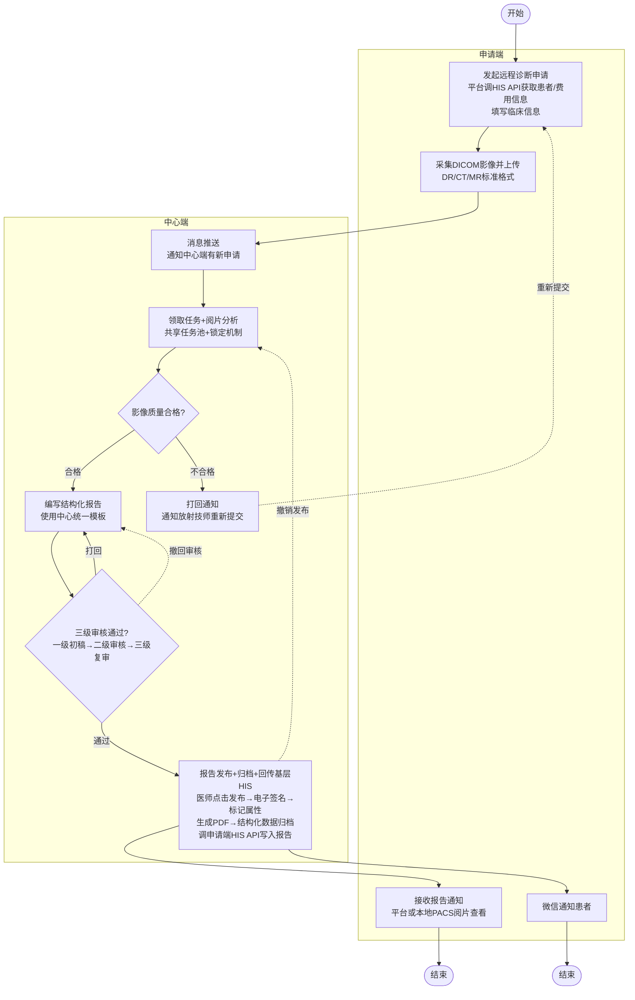
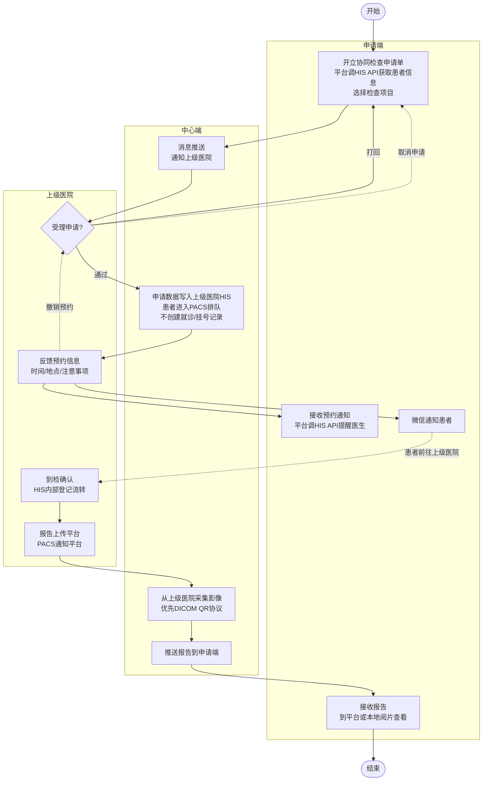

# 需求规约 - 影像诊断中心系统

# 需求规约 - 影像诊断中心系统

# 简介

## 目的

本文档是区域影像诊断中心系统（PACS Center）的软件需求规约（SRS），用于：

*   明确系统的功能需求和非功能需求，涵盖远程诊断和检查协同两大业务流程
    
*   指导开发团队进行系统设计和开发
    
*   作为测试团队编写测试用例的依据
    
*   作为业务方确认需求的正式文档
    

## 项目背景

### 为什么要做

区域内基层医疗机构（乡镇卫生院、县级医院）面临两大核心问题：

*   **影像诊断能力不足**：基层有检查设备（DR/CT/MR）但缺乏专业诊断医师
    
*   **检查设备匮乏**：部分基层机构没有影像检查设备
    

这导致患者不得不前往上级医院检查，增加了就医成本和时间，也造成了基层医疗资源的闲置或不足。

### 目标

建立区域影像诊断中心系统，实现两种协同模式：

| 模式 | 场景 | 解决的问题 |
| --- | --- | --- |
| **远程诊断** | 基层有设备但缺诊断能力 | 基层采集影像 → 中心端远程阅片诊断 |
| **检查协同** | 基层无设备或人员不足 | 基层开单 → 患者到上级医院检查 → 报告回传 |

最终目标：

*   推动区域影像诊断资源的整合、共享和协同
    
*   提高区域整体影像诊断服务能力
    
*   促进影像诊断同质化管理
    
*   实现区域检查结果互认
    

### 范围与边界

#### 做什么（In Scope）

| 模块 | 说明 |
| --- | --- |
| F01 申请单管理 | 申请单全生命周期管理：创建、提交、受理/打回、预约通知、到检确认、影像采集调度（远程诊断+检查协同） |
| F02 报告管理 | 报告完整生命周期：阅片编写 → 三级审核 → 发布/接收（覆盖远程诊断和检查协同） |
| I01-I04 软件接口 | 与 HIS、PACS、医院消息服务等外部系统的接口 |

#### 不做什么（Out of Scope）

| 约束 | 原因 |
| --- | --- |
| 平台不收费 | 各医院本地收费，平台只记录费用信息用于统计对账 |
| 不建患者主数据 | 平台通过接口从医共体或HIS查询引用患者信息 |
| 不做字典映射管理 | 由外部专门系统提供，平台直接调用接口获取字典数据 |
| 危急值闭环管理由专门模块处理 | 平台检测到危急值时通过 HIS 通道通知外部系统，危急值闭环管理单独模块实现 |
| 第一阶段不做质控管理 | 优先实现核心业务流程 |
| 不做历史影像对比 | 第一阶段只看本次检查 |
| 超声不纳入 | 仅支持标准 DICOM 格式（DR/CT/MR） |
| 不做管理员分配机制 | 采用共享任务池+锁定模式 |

#### 边界条件

| 项目 | 说明 |
| --- | --- |
| 影像格式 | 标准 DICOM（DR/CT/MR），超声不纳入 |
| 数据保留期 | 15 年 |
| 上线时间 | 2-3 个月 |

#### 实现前提

| 前提 | 说明 |
| --- | --- |
| HIS厂商配合 | HIS需能在提交申请时携带完整数据（患者、临床、费用等），且能按平台规范主动拉取申请/报告数据 |
| 患者主数据 | 医共体或HIS已统一管理患者主数据，平台通过接口查询引用 |
| 字典数据 | 外部字典系统可提供组合项目数据，平台直接调用接口获取 |
| 下级医院微信公众号 | 下级医院具备微信公众号并开放消息推送接口，平台通过接口向患者推送预约/报告通知 |

### 业务场景

#### 场景一：远程诊断

**典型流程：**

发起远程诊断申请 → 采集DICOM影像并上传 → 消息推送通知中心端 → 领取任务+阅片分析 → 影像质量判断（不合格→打回通知申请端重新提交） → 编写结构化报告 → 三级审核 → 发布+归档+回传基层HIS → 接收报告通知 （审核不通过→打回原医师修改；撤回审核→回到编写状态；撤销发布→通知HIS作废→重新编辑审核）

**适用情况：**

*   基层医院有 DR/CT/MR 设备
    
*   基层缺乏专业诊断医师
    
*   需要上级医院专家远程阅片
    

#### 场景二：检查协同

**典型流程：**

开立协同检查申请单 → 消息推送通知上级医院 → 受理（同意/打回，同意时锁定） → 申请数据写入上级HIS → 通过平台页面或API反馈预约信息（不限定预约操作人）→ 接收预约通知+微信通知患者 → 患者到检确认 → 报告上传平台 → 平台归档影像 → 推送报告到申请端 → 接收报告 （受理打回→需创建新申请单，不做版本管理；上级医院可撤销预约；申请端可取消申请）

**适用情况：**

*   基层医院没有影像检查设备
    
*   基层人员不足无法开展检查
    
*   需要到上级医院完成检查
    

## 定义、首字母缩写词和缩略语

| 术语 | 说明 |
| --- | --- |
| PACS | Picture Archiving and Communication System，影像归档和通信系统 |
| HIS | Hospital Information System，医院信息系统 |
| CDR | Clinical Data Repository，临床数据中心 |
| DICOM | Digital Imaging and Communications in Medicine，医学数字成像和通信标准 |
| QR | Query/Retrieve，DICOM标准中的查询/检索协议 |
| DR | Digital Radiography，数字化X射线摄影 |
| CT | Computed Tomography，电子计算机断层扫描 |
| MR/MRI | Magnetic Resonance Imaging，磁共振成像 |
| 申请端 | 发起申请的基层医院或县级医院（非人民医院） |
| 中心端 | 医共体影像诊断中心，负责远程诊断阅片和报告 |
| 上级医院 | 检查协同中提供检查设备和诊断能力的医院（通常为县人民医院） |
| 放射技师 | 技术序列人员，操作设备采集影像，不能出具诊断报告 |
| 影像医师 | 医师序列人员，有执业医师资格，可出具诊断报告 |
| 三级审核 | 一级初稿（初级及以上）→ 二级审核（主治医师及以上）→ 三级复审（副主任/主任医师） |
| 全息视图 | HIS前端功能模块，集中展示患者全部诊疗信息，背后是CDR |
| SeaweedFS | 分布式对象存储系统，用于海量DICOM影像存储 |
| RocksDB | 嵌入式KV数据库，用于影像元数据索引 |
| CA | Certificate Authority，电子签名认证机构 |

## 参考资料

| 文档 | 说明 |
| --- | --- |
| 业务流程梳理.md | 两种业务流程的完整梳理及已确认决策 |
| 远程诊断流程梳理.md | 远程诊断详细业务流程（含17个步骤） |
| 检查协同流程梳理.md | 检查协同详细业务流程（含17个步骤） |
| 远程诊断待讨论清单.md | 远程诊断P01-P20讨论结果（除P15外均已确认） |
| 检查协同待讨论清单.md | 检查协同C01-C17讨论结果（全部已确认） |
| 影像诊断中心系统设计（钉钉） | 原始系统设计文档，功能模块参考 |
| WST 891-2026 | 放射科两级核片制度行业标准 |

## 概述

本文档包含以下章节：

*   第1章：简介，介绍文档目的、术语定义和参考资料
    
*   第2章：整体说明，概述系统背景、用户特征和约束条件
    
*   第3章：具体需求，按功能模块详细描述功能需求和非功能需求
    
*   第4章：接口需求，描述系统与HIS、PACS等外部系统的接口规范
    

# 整体说明

## 产品总体效果

区域影像诊断中心系统旨在推动区域影像诊断资源的整合、共享和协同，提高区域整体影像诊断服务能力和质量水平，实现两种协同模式：

**远程诊断**：基层有检查设备但缺诊断能力 → 基层采集图像，中心端远程阅片诊断

**检查协同**：基层无检查设备或人员不足 → 基层开单，患者前往上级医院检查，上级医院出报告回传

有效弥补基层机构影像诊断能力不足、资源匮乏的问题，促进影像诊断同质化管理和区域检查结果互认。

## 产品功能

| 功能模块 | 功能说明 |
| --- | --- |
| F01 申请单管理 | 申请单全生命周期管理：创建、提交、受理/打回、预约通知、到检确认、影像采集调度（远程诊断） |
| F02 申请单管理 | 申请单全生命周期管理：创建、提交、受理/打回、预约通知、到检确认（远程诊断+检查协同） |
| F02 报告管理 | 报告完整生命周期：阅片编写→三级审核→发布/接收（覆盖远程诊断和检查协同） |

## 用户特征

### 申请端（基层医院）

| 角色 | 职责 | 操作平台 | 技术水平 |
| --- | --- | --- | --- |
| 放射技师 | 设备采集影像、发起申请（远程诊断/检查协同）、上传影像 | 平台 | 熟悉医疗设备操作和基础系统使用 |

### 中心端（医共体影像诊断中心）

| 角色 | 职责 | 操作平台 | 技术水平 |
| --- | --- | --- | --- |
| 影像医师 | 加载影像阅片分析、编写结构化报告 | 平台 | 专业放射科医师，熟悉影像诊断 |
| 影像医师（审核） | 对报告进行三级审核签发 | 平台 | 中级及以上职称医师 |
| 平台管理员 | 管理平台配置、维护报告模板、查看工作量统计 | 平台 | 具备系统管理能力 |

### 上级医院（检查协同）

| 角色 | 职责 | 操作平台 | 技术水平 |
| --- | --- | --- | --- |
| 放射技师 | 设备采集影像、到检确认 | 平台 | 熟悉医疗设备操作 |

## 约束

*   平台不收费，各医院本地收费，平台只记录费用信息用于统计对账
    
*   不建患者主数据，患者信息由HIS提交申请时携带
    
*   第一阶段不做质控管理
    
*   第一阶段只看本次检查，不做历史影像对比
    
*   危急值管理已移出SRS单独存档，后续阶段按需启用
    
*   平台不主动请求异构系统接口：所有数据（患者信息、临床信息、费用信息、影像位置信息等）由HIS提交时提供；HIS需通过平台查询接口主动拉取数据
    
*   上线时间目标：2-3个月
    

## 假设与依赖关系

*   假设HIS厂商能在提交申请时携带完整数据（患者信息、临床信息、费用信息、影像位置信息等）
    
*   假设HIS厂商能按平台规范主动拉取数据（申请数据、报告数据等）
    
*   假设上级医院PACS支持DICOM QR协议或提供文件共享方式供平台获取影像
    
*   假设医共体或HIS已统一管理患者主数据
    
*   假设下级医院具备微信公众号并开放消息推送接口
    
*   CA对接取决于上级医院是否已有CA能力，非必须
    

## 需求子集

## 流程图

### 远程诊断流程



### 检查协同流程



# 具体需求

## 功能

### F01 申请单管理

#### 参与者

申请端用户（放射技师）、上级医院（检查协同受理/预约/到检）、平台（系统自动）、平台PACS（外部系统，远程诊断影像采集与阅片）

#### 需求背景

基层医院通过平台发起检查申请，支持两种申请类型：

*   **远程诊断**：基层有检查设备但缺诊断能力，放射技师通过HIS发起申请，HIS向平台提交患者信息、临床信息、费用信息和影像位置信息，平台通知PACS采集影像，中心端通过PACS阅片后在平台编写报告
    
*   **检查协同**：基层无检查设备或人员不足，放射科技师通过HIS帮患者向上级医院申请协同检查并预约，HIS向平台提交完整的申请数据，上级医院用自己的PACS完成本地闭环
    

影像的采集、存储和阅片由独立的平台PACS系统完成（仅远程诊断），平台只负责流转调度（通知采集、记录状态）。PACS对接接口详见I03。

两种类型的申请单共享同一数据结构，通过申请类型字段区分。

#### 前置条件

1.  用户已登录平台
    
2.  用户所属机构已在系统中配置
    
3.  数据字典对照完成
    

#### 后置条件

1.  申请单创建成功
    
2.  远程诊断：平台已通知PACS采集影像，采集状态为"采集中"
    
3.  申请单状态已更新，对应端可通过列表页按状态查看（远程诊断→中心端待阅片列表，检查协同→上级医院待受理列表）
    

#### 主事件流

**远程诊断流程：**

1.  放射技师在HIS中选择患者，发起远程诊断申请（平台页面嵌入HIS，通过iFrame/内置浏览器打开）
    
2.  HIS向平台传递患者信息（姓名、性别、年龄、身份证号、联系方式、医保类型）、临床信息（主诉、现病史、既往史、临床诊断）、费用信息、影像位置信息（PACS连接信息等），平台自动填充
    
3.  放射技师选择组合项目（通过主数据管理系统字典接口获取可选列表），每张申请单选择一个组合项目，不同检查类型需分别创建申请单
    
4.  放射技师补充检查目的（必填）
    
5.  若为非强制申请，放射技师填写申请原因（条件必填）
    
6.  放射技师点击提交，系统验证必填信息完整性，创建申请单，返回成功提示
    
7.  系统自动通知PACS采集影像（详见I03.1，传入申请单号+影像位置信息+患者信息），创建影像关联记录（采集状态为"采集中"）
    
8.  申请单进入中心端待阅片列表
    

**检查协同流程：**

1.  放射科技师在HIS中选择患者，发起检查协同申请
    
2.  放射科技师选择目标上级医院，系统显示本院可申请的组合项目列表（平台通过字典映射自动关联到上级医院对应项目，用户无感）
    
3.  放射科技师选择组合项目，补充检查目的（必填），点击"提交申请"
    
4.  HIS向平台提交申请数据，包含：患者信息（姓名、性别、年龄、身份证号、联系方式、医保类型）、临床信息（主诉、现病史、既往史、临床诊断）、费用信息、组合项目信息（组合项目ID、组合项目名称、参考价）、申请信息（申请机构、申请科室、申请医生、申请时间）
    
5.  平台接收申请数据，创建申请单，返回成功提示
    
6.  申请单进入目标上级医院待受理列表
    

**检查协同 — 受理：**

1.  上级医院在受理列表中查看待受理的协同申请，查看详情，做出受理决定
    

1.  同意：申请单状态变为"已受理"，同时锁定该申请单（标记受理医院，防止其他医院重复受理）；打回：上级医院填写打回原因（必填），申请单状态变为"已打回"
    

**检查协同 — 预约通知：**

1.  上级医院完成内部排班后，通过平台页面或开放API反馈预约信息（时间、地点、注意事项、检查前准备），申请单状态变为"已预约"。平台同时提供API接口和嵌入页面，医院自行决定由谁（临床医生、放射技师或排班系统）完成预约操作，预约请求需携带费用信息（平台仅记录，不校验缴费状态）
    

1.  系统通知申请端医生和患者（患者通过微信公众号推送，支持推送和拉取两种模式，详见I04）
    

**检查协同 — 到检确认：**

1.  患者到达上级医院后，放射技师在平台找到对应的协同申请单，点击"确认到检"，申请单状态变为"已到检"
    

**远程诊断 — 任务池与领单：**

1.  影像医师进入待阅片任务列表，系统显示共享任务池（申请单号、患者姓名、组合项目名称、申请机构、申请时间）
    

1.  影像医师选择一条申请单，系统将申请单锁定为"已锁定"，标记处理人
    

1.  影像医师开始阅片（进入F02报告管理流程）
    

#### 备选流

**A1. 保存草稿** 在远程诊断步骤6/检查协同步骤5，用户可选择保存为草稿

1.  申请单保存成功，状态为"草稿"
    
2.  草稿可编辑、可删除
    

**A2. 撤销申请** 已提交但对端尚未领取/受理的申请

1.  申请端可主动撤回，申请单状态变回"草稿"
    
2.  已被对端领取/受理的申请不可撤回
    

**A3. 检查协同受理打回** 在检查协同受理步骤，上级医院拒绝受理

1.  上级医院填写打回原因（必填），申请单状态变为"已打回"
    
2.  申请端医生通过列表页查看打回结果
    
3.  需重新创建申请单，原申请单保留为"已打回"状态
    

#### 业务规则

1.  患者信息、临床信息、费用信息、影像位置信息均由HIS在提交申请时提供，平台不主动查询
    
2.  主诉和检查目的为必填项
    
3.  检查类型分为DR、CT、MR三大类
    
4.  费用信息由HIS提交时提供；检查协同时由下级医院收费，平台只记录用于统计对账，不校验缴费状态
    
5.  远程诊断和检查协同均由放射技师发起
    
6.  检查协同时，下级医院需将协同项目维护到自己的HIS中，平台后端通过字典映射关联到上级医院项目
    
7.  字典对照由HIS厂商在平台上完成，平台提供管理员管理映射功能
    
8.  第一阶段不做管理员分配机制，采用共享任务池+锁定模式
    
9.  锁定机制防止重复处理：一个医师领取后，该申请单对其他人标记为"处理中"（远程诊断领单、检查协同受理均适用）
    
10.  不做超时机制，不处理的申请先挂着
    
11.  待阅片列表仅展示状态为"已提交"且影像采集状态为"就绪"的远程诊断申请单；已锁定（处理中）和已打回的申请单不在列表中
    
12.  检查协同受理通过后，上级医院HIS通过平台接口主动拉取申请数据（进入PACS系统），只创建检查申请表，不产生挂号记录
    
13.  排班由上级医院内部处理，平台不管理排班信息；排班完成后通过平台页面或开放API反馈预约信息，医院自行决定预约操作人
    
14.  患者通知通过下级医院微信公众号推送，支持推送和拉取两种模式（与 HIS 报告通知一致）；医生通知通过推送或拉取模式送达
    
15.  检查协同打回后需创建新申请单，不做申请单版本管理
    
16.  PACS\_REGISTER\_ID 是平台与PACS的核心关联键，在PACS采集影像成功后异步产生（通过I03.2回调），申请单创建时该字段为空
    
17.  远程诊断需要PACS\_REGISTER\_ID（用于阅片唤起），检查协同当前不需要（预留扩展）
    
18.  影像采集失败后仅支持手动重新触发，不自动重试
    
19.  仅支持标准DICOM格式（DR/CT/MR），超声不纳入（由PACS侧校验）
    

#### 申请单状态

申请单使用统一的状态字段，不同业务流程使用不同的状态值：

| 状态 | 说明 | 触发模块 | 远程诊断 | 检查协同 |
| --- | --- | --- | --- | --- |
| 草稿 | 保存但未提交 | F01 | ✓ | ✓ |
| 已提交 | 等待处理 | F01 | ✓ | ✓ |
| 已锁定 | 医师已领取任务，正在阅片 | F01 | ✓ | \- |
| 已打回 | 影像质量不合格或审核不通过，退回申请端 | F01/F02 | ✓ | ✓ |
| 审核中 | 报告已提交，进入三级审核 | F02 | ✓ | \- |
| 已发布 | 报告已发布，已回传基层HIS（远程诊断终态） | F02 | ✓ | \- |
| 已受理 | 上级医院已同意，等待排班预约 | F01 | \- | ✓ |
| 已预约 | 已反馈预约信息，等待患者到检 | F01 | \- | ✓ |
| 已到检 | 患者已到院确认 | F01 | \- | ✓ |
| 已完成 | 报告已上传平台（检查协同终态） | F02 | \- | ✓ |

**状态流转：**

远程诊断：

```plaintext
草稿 → 已提交 → 已锁定 → 审核中 → 已发布
                              ↑        ↓
                              └── 撤销发布
```

检查协同：

```plaintext
草稿 → 已提交 → 已受理 → 已预约 → 已到检 → 已完成
```

**撤销操作：**

| 流程 | 撤销类型 | 撤销前状态 | 撤销后状态 | 操作人 |
| --- | --- | --- | --- | --- |
| 远程诊断 | 撤回审核 | 审核中 | 已锁定 | 书写医师 |
| 远程诊断 | 撤销发布 | 已发布 | 已锁定 | PACS端发起，平台转发 |
| 检查协同 | 撤销预约 | 已预约 | 已受理 | 申请端医生 |
| 检查协同 | 取消申请 | 已受理 | 已提交 | 申请端医生 |

#### 关键属性

*   **辅助属性**：可选组合项目列表（通过主数据管理系统字典接口获取）、上级医院列表（检查协同）
    
*   **输入属性**：
    
    *   申请单：申请单号（系统生成）、申请类型（远程诊断/检查协同）、检查类型（DR/CT/MR）、目标上级医院（检查协同时必填）、患者姓名、患者性别、患者年龄、身份证号、联系方式、医保类型、主诉、现病史、既往史、临床诊断、检查目的、申请原因（远程诊断非强制申请时填写）、组合项目ID（字典项ID）、组合项目名称、费用金额（组合项目参考价）、费用来源（医保/自费等，平台仅记录用于统计对账）、申请机构、申请科室、申请医生、申请时间、申请单状态、锁定状态、锁定操作人ID
        
    *   影像关联记录（子实体）：申请单号、PACS\_REGISTER\_ID（PACS采集成功回调时填充，远程诊断必填）、采集状态（采集中/就绪/失败）、影像数量（PACS回调时填充）、失败原因、入库时间
        
    *   领单记录：申请单号、处理医生、领单时间、影像质量（合格/不合格）、打回原因
        
    *   受理记录：申请单号、受理结果、打回原因（若打回）、受理人、受理时间、HIS同步状态
        
    *   预约信息：申请单号、预约状态（待通知/已通知/已确认/已过期）、预约时间、预约地点、注意事项、检查前准备
        
    *   到检记录：申请单号、到检确认人、到检确认时间
        
*   **显示属性**：
    
    *   远程诊断申请单列表：申请单号、状态、患者姓名、组合项目名称、申请时间
        
    *   协同申请单列表：申请单号、状态、患者姓名、目标上级医院、组合项目名称、申请时间
        
    *   待阅片列表：申请单号、患者姓名、组合项目名称、申请机构、申请时间、当前状态、锁定状态
        
    *   受理列表：申请单号、患者姓名、目标上级医院、组合项目名称、当前状态
        
    *   预约列表：申请单号、患者姓名、预约状态、预约时间
        

#### 评级要求

高 - 核心功能

#### AI/智能特征

无

---

### F02 报告管理

#### 参与者

中心端影像医师、平台（系统自动）

#### 需求背景

覆盖诊断报告的完整生命周期。两条业务线的报告来源不同：

*   **远程诊断**：中心端影像医师通过平台唤起PACS阅片、在平台编写报告、三级审核通过后发布
    
*   **检查协同**：上级医院影像医师在本地HIS完成阅片、报告编写和审核发布，报告通过接口上传到平台
    

报告是同一聚合（DiagReport）内的实体，通过申请单号关联申请单。

#### 前置条件

1.  阅片与编写：影像医师已领取申请单（申请单状态为"已锁定"）
    
2.  审核：存在状态为"审核中"的报告
    
3.  发布：三级审核全部通过
    
4.  报告接收：上级医院已发布检查协同报告
    

#### 后置条件

1.  阅片与编写：报告初稿已保存，申请单状态变为"审核中"（远程诊断）
    
2.  审核：三级审核全部通过进入发布流程，或打回给原书写医生（远程诊断）
    
3.  发布：报告已归档，申请单状态更新为"已完成"，基层HIS可通过平台接口拉取报告（远程诊断）
    
4.  报告接收：外部报告已归档，申请单状态更新为"已完成"，申请端HIS可通过平台接口拉取报告（检查协同）
    

#### 主事件流

**阶段一：阅片与报告编写（远程诊断）**

1.  影像医师点击"阅片"，系统唤起平台PACS阅片界面（详见F01，I03.3打开阅片接口）
    
2.  影像医师在PACS阅片界面分析影像，判断影像质量合格后返回平台
    
3.  影像医师选择报告模板，编写结构化报告（检查所见、诊断小结、诊断意见），可标记危急值
    
4.  影像医师提交报告初稿，系统验证必填内容，更新申请单状态为"审核中"
    
    **阶段二：报告审核（远程诊断）**
    
    | 级别 | 角色 | 职称要求 | 操作 |
    | --- | --- | --- | --- |
    | 一级 | 书写医生 | 初级及以上 | 编写结构化报告初稿（阶段一完成） |
    | 二级 | 审核医师 | 中级（主治医师）及以上 | 审核签发 |
    | 三级 | 复审医师 | 副主任/主任医师 | 复审确认 |
    
5.  审核医师进入审核中报告列表，系统显示当前待本级审核的报告
    
6.  审核医师查看报告详情（报告内容、患者信息），可点击"查看影像"唤起PACS阅片界面，点击"通过"或"打回"
    
7.  三级审核全部通过后，报告进入发布流程
    
    **阶段三：报告发布（远程诊断）**
    
8.  系统生成报告PDF，归档报告结构化数据和PDF文件
    
9.  更新申请单状态为"已完成"，基层HIS可通过平台接口拉取报告（详见I01）
    
10.  系统通知患者报告已发布（通过微信公众号推送，支持推送和拉取两种模式，详见I04）
    
    **阶段四：检查协同报告接收（检查协同）**
    
    > 步骤11由上级医院在其本地HIS内独立完成，平台处于等待接收状态。步骤12起为平台侧操作。
    
11.  上级医院影像医师在本地HIS完成阅片、报告编写、三级审核和发布
    
12.  上级医院HIS将已发布报告上传到平台，平台校验报告数据（申请单号匹配、数据完整性）
    
13.  校验通过后，平台归档报告，更新申请单状态为"已完成"，申请端HIS可通过平台接口拉取报告（详见I02）
    
14.  系统通知患者报告已发布（通过微信公众号推送，支持推送和拉取两种模式，详见I04）
    

#### 备选流

**A1. 影像质量不合格** 在阶段一步骤2

1.  影像医师点击"打回"，填写打回原因（必填）
    
2.  系统更新申请单状态为"已打回"，解除锁定，申请端HIS可通过平台接口查询打回信息
    

**A2. 保存暂存** 在阶段一步骤4提交前

1.  影像医师选择暂存，报告内容保存成功，不改变申请单状态
    
2.  可继续编辑后再次提交
    

**A3. 审核打回** 在阶段二步骤6

1.  审核医师填写打回原因（必填）
    
2.  系统更新报告状态为"已打回"，原书写医生在待处理列表中查看
    
3.  书写医生修改后重新提交，回到对应审核级别
    

**A4. 报告归档异常** 在阶段三步骤8

1.  系统记录失败日志，标记为异常，等待人工处理
    

**A5. 检查协同报告接收失败** 在阶段四步骤12

1.  若数据校验失败（申请单号不匹配、数据不完整），系统返回错误信息，通知上级医院重新上传
    
2.  若接收异常，标记为异常，等待上级医院重新上传
    

**A6. 撤销发布（远程诊断）** 报告已发布后

1.  中心端医师在PACS中操作撤销已发布报告，PACS通过I03.5回调平台
    
2.  平台更新报告状态为"草稿"，申请单状态回退为"已锁定"
    
3.  平台通过I01推送通知基层HIS作废已接收的报告（reportStatus=revoked）
    
4.  书写医生可重新编辑报告，修改后需重新走完整审核流程
    

#### 业务规则

1.  阅片和报告编写是连续流程，同一医师完成，不回到任务池
    
2.  打回后可重新提交，无次数限制
    
3.  报告发布后，HIS通过平台接口主动拉取报告数据
    
4.  报告模板由中心管理员统一维护，支持双击或拖拽快速插入
    
5.  报告包含两种格式：结构化数据 + PDF
    
6.  平台统一存储所有流转的报告，报告通过申请单号关联申请单
    
7.  远程诊断报告在平台完成书写、三级审核和发布；检查协同报告在上级医院HIS书写发布后上传到平台
    
8.  报告发布时可带有医生图片签名
    
9.  费用信息按各医院本地收取，平台只记录用于统计对账
    

#### 关键属性

*   **辅助属性**：患者历史信息、组合项目说明、报告模板列表
    
*   **输入属性**：
    
    *   报告：报告编号（即申请单号，一张申请单对应一条报告）、申请单号、报告来源（平台书写/外部上传）、报告状态（草稿/审核中/已打回/已发布）、检查所见、诊断小结、诊断意见、是否危急值、文件存储ID、书写医生、书写时间、归档时间、撤销时间（撤销发布时填充）、HIS同步状态
        
    *   审核记录：报告编号、审核结果（通过/打回）、审核意见/打回原因、审核人、审核时间、审核级别
        
*   **显示属性**：
    
    *   审核中列表：申请单号、患者姓名、组合项目名称、书写医生、当前审核级别、审核状态
        
    *   报告列表：申请单号、患者姓名、申请类型、组合项目名称、报告来源、报告状态、书写时间
        

#### 评级要求

高 - 核心功能

#### AI/智能特征

无

---

## 可用性

### 响应式设计

系统前端页面需支持嵌入HIS系统（iFrame/内置浏览器），适配常见的电脑屏幕尺寸（如1920×1080、1366×768等）。

### 操作简便性

*   申请单填写支持自动填充HIS提交的数据
    
*   提供清晰的流程状态提示和进度展示
    
*   操作结果有明确反馈
    
*   阅片工具由平台PACS提供，需符合放射科医生的操作习惯
    

## 可靠性

### 系统可用性

*   系统可用性 ≥ 99.9%（年度停机时间约8.76小时）
    
*   计划内维护时间不计入可用性统计
    

### 数据持久化

*   影像数据由平台PACS持久化存储，确保不丢失，保存15年
    
*   报告数据（结构化+PDF）需永久保存
    
*   审核记录需完整保存，支持追溯
    

## 性能

### 响应时间

| 操作 | 响应时间要求 |
| --- | --- |
| 页面加载 | < 3秒 |
| 列表查询 | < 2秒 |
| 表单提交 | < 2秒 |
| 平台接口响应（HIS拉取） | < 3秒 |
| PACS阅片界面唤起 | < 3秒 |

> DICOM影像加载（首张<5秒、序列切换<1秒）由平台PACS系统保证，不在本平台性能指标范围内。

### 并发能力

*   支持100用户同时在线操作
    
*   支持多机构同时使用
    
*   高峰期（工作日上午）响应时间可放宽至标准值的1.5倍
    

## 安全性

### 数据传输安全

*   所有API通信必须使用HTTPS协议
    

### API访问控制

*   HIS系统调用本系统API需进行Token认证
    
*   Token由平台统一发放和管理
    

### 敏感信息保护

患者信息完整展示，不做脱敏处理。

### 会话管理

*   用户会话依赖Base系统管理
    
*   会话超时时间由Base系统控制
    

---

## 设计约束

### 技术栈约束

| 层级 | 技术方案 |
| --- | --- |
| 影像格式 | 标准DICOM（DR/CT/MR），超声不纳入 |
| 影像采集与存储 | 由平台PACS负责，平台通过接口调度（详见F01） |
| 数据保留期 | 影像15年（PACS存储），报告永久保存 |

### 架构约束

*   系统需接入Base系统进行用户认证
    
*   前端页面需支持iFrame/内置浏览器嵌入HIS
    
*   平台不主动请求异构系统接口，所有数据由HIS提交时提供，HIS通过平台查询接口主动拉取数据
    
*   不建患者主数据，患者信息由HIS提交申请时携带
    

---

## 接口

### 用户界面

系统提供以下主要页面：

| 页面 | 说明 | 使用角色 |
| --- | --- | --- |
| 远程诊断申请 | 填写申请单 | 申请端放射技师 |
| 远程诊断任务列表 | 查看/领取待阅片任务 | 中心端影像医师 |
| 远程诊断阅片（入口） | 唤起PACS阅片界面（web/exe） | 中心端影像医师 |
| 远程诊断报告编写 | 编写结构化报告 | 中心端影像医师 |
| 远程诊断审核 | 三级审核操作 | 中心端审核医师 |
| 检查协同申请 | 查看项目、开立申请单 | 申请端放射技师 |
| 检查协同受理 | 受理/打回操作 | 上级医院 |
| 报告模板管理 | 维护报告模板 | 平台管理员 |

### 软件接口

#### 接口总览

| 编号 | 接口名称 | 方向 | 说明 |
| --- | --- | --- | --- |
| I01 | 报告写入基层HIS | 平台 ↔ 基层HIS（拉取+推送） | F02报告管理（远程诊断） |
| I02 | 检查协同报告写入申请端HIS | 平台 ↔ 申请端HIS（拉取+推送） | F02报告管理（检查协同） |
| I03 | 影像调度（PACS对接） | 平台 ↔ 平台PACS | F01申请单管理（采集通知/回调/阅片/状态查询） |
| I04 | 患者通知 | 平台 ↔ 医院消息服务（拉取+推送） | F02申请单管理 |

> **接口原则**：平台不主动请求异构系统的接口，所有数据（患者信息、费用、临床信息、检查记录等）均由HIS在提交请求时提供。平台与HIS之间采用双模式（HIS定时拉取 或 HIS提供接口由平台推送），影像由平台PACS根据平台转发的影像位置信息采集（I03）。

---

#### I01 报告写入基层HIS（平台 ↔ 基层HIS）

| 字段 | 说明 |
| --- | --- |
| 来源模块 | F02 报告管理（远程诊断） |
| 适用范围 | 仅远程诊断 |
| 双模式 | HIS厂商可选择推送或拉取，二选一或并行均可 |

**拉取模式（平台提供查询接口，HIS定时拉取）：**

请求参数：

```json
{
  "dateFrom": "2026-05-20",
  "dateTo": "2026-05-20",
  "reportStatus": "published"
}
```

响应示例：

```json
{
  "reports": [
    {
      "requestNo": "REQ20260520001",
      "reportNo": "REQ20260520001",
      "reportSource": "platform",
      "reportStatus": "published",
      "examFinding": "双肺纹理清晰...",
      "diagnosisSummary": "胸部CT平扫未见明显异常",
      "diagnosisOpinion": "建议定期复查",
      "isCriticalValue": false,
      "doctors": {
        "author": { "name": "王医生", "title": "主治医师" },
        "reviewer": { "name": "赵医生", "title": "副主任医师" },
        "finalReviewer": { "name": "钱医生", "title": "主任医师" }
      },
      "reportTime": "2026-05-20T11:00:00",
      "revokedAt": null,
      "pdfUrl": "https://platform.example.com/reports/REQ20260520001.pdf"
    }
  ]
}
```

**推送模式（HIS提供接收接口，平台实时推送）：**

推送请求示例（平台 → HIS，报告发布）：

```json
{
  "requestNo": "REQ20260520001",
  "reportNo": "REQ20260520001",
  "reportSource": "platform",
  "reportStatus": "published",
  "examFinding": "双肺纹理清晰...",
  "diagnosisSummary": "胸部CT平扫未见明显异常",
  "diagnosisOpinion": "建议定期复查",
  "isCriticalValue": false,
  "doctors": {
    "author": { "name": "王医生", "title": "主治医师" },
    "reviewer": { "name": "赵医生", "title": "副主任医师" },
    "finalReviewer": { "name": "钱医生", "title": "主任医师" }
  },
  "reportTime": "2026-05-20T11:00:00",
  "pdfUrl": "https://platform.example.com/reports/REQ20260520001.pdf"
}
```

推送请求示例（平台 → HIS，报告撤销）：

```json
{
  "requestNo": "REQ20260520001",
  "reportNo": "REQ20260520001",
  "reportStatus": "revoked",
  "revokedAt": "2026-05-20T15:00:00",
  "message": "报告已撤销，请作废处理"
}
```
---

#### I02 检查协同报告写入申请端HIS（平台 ↔ 申请端HIS）

| 字段 | 说明 |
| --- | --- |
| 来源模块 | F02 报告管理（检查协同） |
| 适用范围 | 仅检查协同 |
| 双模式 | HIS厂商可选择推送或拉取，二选一或并行均可 |

**拉取模式（平台提供查询接口，HIS定时拉取）：**

请求参数：

```json
{
  "dateFrom": "2026-05-20",
  "dateTo": "2026-05-20",
  "reportStatus": "published"
}
```

响应示例：

```json
{
  "reports": [
    {
      "requestNo": "REQ20260520002",
      "reportNo": "REQ20260520002",
      "reportSource": "external",
      "reportStatus": "published",
      "examFinding": "右肺上叶见磨玻璃结节，约8mm...",
      "diagnosisSummary": "右肺上叶磨玻璃结节",
      "diagnosisOpinion": "建议6个月后复查CT",
      "isCriticalValue": false,
      "doctors": {
        "author": { "name": "孙医生", "title": "主治医师" },
        "reviewer": { "name": "周医生", "title": "副主任医师" }
      },
      "reportTime": "2026-05-20T15:00:00",
      "pdfUrl": "https://platform.example.com/reports/REQ20260520002.pdf"
    }
  ]
}
```

**推送模式（HIS提供接收接口，平台实时推送）：**

推送请求示例（平台 → 申请端HIS，结构同拉取响应中单条报告）。

---

#### I03 影像调度（PACS对接）（平台 ↔ 平台PACS）

> 平台PACS是独立系统，负责影像采集、存储、归档和阅片。平台通过以下4个接口与PACS协作。

**I03.1 影像采集通知**（平台 → PACS）

| 字段 | 说明 |
| --- | --- |
| 来源模块 | F01 申请单管理 |
| 请求方式 | POST |
| 触发时机 | HIS提交申请携带影像位置信息时自动触发 |

请求示例（PACS方式）：

```json
{
  "requestNo": "REQ20260520001",
  "examType": "CT",
  "examItem": {
    "itemId": "CT001",
    "itemName": "胸部CT平扫"
  },
  "imageSource": {
    "type": "pacs",
    "aeTitle": "HOSP_PACS",
    "host": "192.168.1.100",
    "port": 104
  },
  "patient": {
    "name": "张三",
    "gender": "男",
    "age": 36,
    "ageUnit": "岁",
    "idNumber": "320102199001011234"
  }
}
```

请求示例（文件共享方式）：

```json
{
  "requestNo": "REQ20260520001",
  "examType": "CT",
  "examItem": {
    "itemId": "CT001",
    "itemName": "胸部CT平扫"
  },
  "imageSource": {
    "type": "fileShare",
    "path": "/share/images/2026-05-20/REQ20260520001/"
  },
  "patient": {
    "name": "张三",
    "gender": "男",
    "age": 36,
    "ageUnit": "岁",
    "idNumber": "320102199001011234"
  }
}
```
---

**I03.2 采集完成回调**（PACS → 平台）

| 字段 | 说明 |
| --- | --- |
| 来源模块 | F01 申请单管理 |
| 请求方式 | POST |
| 触发时机 | PACS采集完成（成功或失败）后回调 |

回调示例（成功）：

```json
{
  "requestNo": "REQ20260520001",
  "status": "success",
  "pacsRegisterId": "US0000038758",
  "imageCount": 128
}
```

回调示例（失败）：

```json
{
  "requestNo": "REQ20260520001",
  "status": "failed",
  "failureReason": "无法连接源PACS，连接超时"
}
```
---

**I03.3 打开阅片**（平台 → PACS）

| 字段 | 说明 |
| --- | --- |
| 来源模块 | F01 申请单管理 |
| 请求方式 | GET |
| 触发时机 | 影像医师点击"阅片"按钮时 |

请求参数：`pacsRegisterId=US0000038758&requestNo=REQ20260520001&operatorName=王医生&operatorId=DOC001`

响应示例：

```json
{
  "viewerUrl": "https://pacs.example.com/viewer?registerId=US0000038758&token=xxx",
  "launchType": "web"
}
```
> `launchType` 为 `web` 时，平台通过 iframe 或新窗口打开 `viewerUrl`；为 `exe` 时，通过协议链接唤起本地客户端。两种方式使用同一接口。

---

**I03.4 影像状态查询**（平台 → PACS）

| 字段 | 说明 |
| --- | --- |
| 来源模块 | F01 申请单管理 |
| 请求方式 | GET |
| 触发时机 | 平台查询申请单影像就绪状态时 |

请求参数：`requestNo=REQ20260520001`

响应示例：

```json
{
  "requestNo": "REQ20260520001",
  "pacsRegisterId": "US0000038758",
  "collectStatus": "ready",
  "imageCount": 128
}
```
---

**I03.5 报告撤销通知**（PACS → 平台）

| 字段 | 说明 |
| --- | --- |
| 来源模块 | F02 报告管理（远程诊断） |
| 请求方式 | POST |
| 触发时机 | 中心端医师在PACS中撤销已发布报告时 |

请求示例（PACS → 平台）：

```json
{
  "requestNo": "REQ20260520001",
  "reportNo": "REQ20260520001",
  "action": "revoke"
}
```

响应示例：

```json
{
  "success": true,
  "message": "报告撤销处理成功"
}
```

**平台处理**：更新报告状态为"草稿"，申请单状态回退为"已锁定"，通过I01通知基层HIS作废已接收的报告。

---

#### I04 患者通知（平台 ↔ 医院消息服务）

| 字段 | 说明 |
| --- | --- |
| 来源模块 | F02 申请单管理 |
| 接入方 | 下级医院消息服务（微信公众号/短信/HIS消息等） |
| 触发时机 | 检查协同预约完成后 / 远程诊断报告发布后 / 报告撤销后 |
| 双模式 | 医院可选择推送或拉取，二选一或并行均可 |

**拉取模式（平台提供查询接口，医院定时拉取）：**

请求参数：

```json
{
  "dateFrom": "2026-05-20",
  "dateTo": "2026-05-20"
}
```

响应示例：

```json
{
  "notifications": [
    {
      "requestNo": "REQ20260520001",
      "type": "appointment",
      "patient": {
        "name": "张三",
        "phone": "13800138000",
        "idNumber": "320102199001011234"
      },
      "appointment": {
        "time": "2026-05-22 09:00",
        "location": "XX县人民医院 放射科 3楼",
        "preparation": "检查前4小时禁食",
        "notes": "请携带身份证和转诊单"
      },
      "report": {
        "reportNo": "REQ20260520001",
        "pdfUrl": "https://platform.example.com/reports/REQ20260520001.pdf"
      },
      "revokedReport": {
        "reportNo": "REQ20260520001",
        "revokedAt": "2026-05-20T15:00:00",
        "message": "报告已撤销，请作废处理"
      },
      "createdAt": "2026-05-20T10:00:00"
    }
  ]
}
```

**推送模式（医院提供接收接口，平台实时推送）：**

推送请求示例（平台 → 医院消息服务，结构同拉取响应中单条通知）。

---
---

### 通信接口

*   使用HTTPS协议
    
*   数据格式为JSON
    
*   DICOM影像传输由平台PACS处理（详见F01）