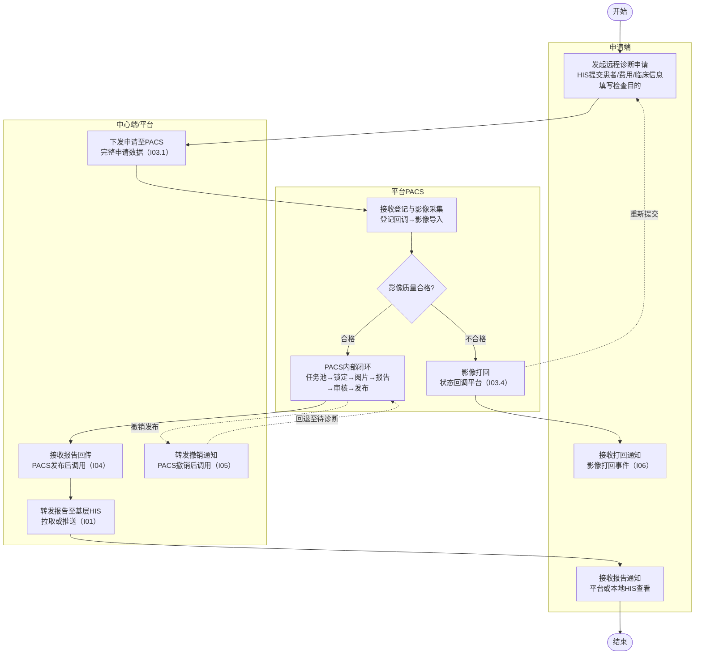
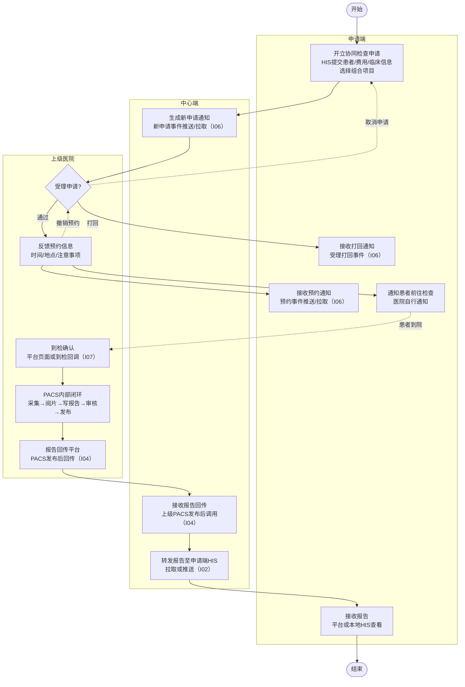

# 需求规约 - 影像诊断中心系统

# 需求规约 - 影像诊断中心系统

# 修订历史记录

| 日期 | 版本 | 说明 |
| --- | --- | --- |
| 2026/05/13 | v0.1 | 初稿，基于远程诊断和检查协同流程梳理 |
| 2026/05/14 | v0.2 | 需求规约审查修订：模块合并、数据模型统一、关键属性按实体/列表重组、字段精简 |
| 2026/05/18 | v0.3 | 功能模块合并与解耦；编号从12个精简为8个 |
| 2026/05/18 | v0.5 | HIS对接原则重构：双向接口原则 |
| 2026/05/20 | v1.0 | 删除F06消息中心模块；接口重新编号 |
| 2026/05/20 | v1.1 | 软件接口重构：按数据流向重组；新增接口总览表 |
| 2026/05/21 | v1.5 | 电子病历对接：支持HTTP接口导入临床信息+手动填写 |
| 2026/05/25 | v1.6 | F03申请单状态设计：统一状态字段、状态流转说明、撤销操作规则 |
| 2026/05/25 | v1.7 | 功能模块重构：危急值管理、查询统计移出SRS单独存档 |
| 2026/05/27 | v2.0 | 接口原则重构：平台不主动请求异构系统接口，接口重新编号I01-I06 |
| 2026/05/28 | v2.3 | 模块精简：删除F01影像调度模块，内容分散到F01和F02 |
| 2026/05/28 | v2.5 | 需求会议修订：新增撤销发布机制、预约开放API、受理增加锁定 |
| 2026/05/29 | v3.0 | PACS职责边界适配：诊断生产能力移交PACS；I03重构5子接口；新增I04/I05；状态模型重构；F02改为接收归档 |
| 2026/06/01 | v3.1 | 新增F03检查项目管理模块 |
| 2026/06/01 | v3.2 | I04接口criticalValue改为对象；报告编号改为平台自生成 |
| 2026/06/01 | v3.3 | 移除F04危急值管理模块（独立为危急值中心系统） |
| 2026/06/02 | v3.4 | 移除F03检查项目管理模块；F01改用来源机构项目ID数组+主数据映射 |
| 2026/06/02 | v3.5 | I06从患者通知改为医院通知：平台不直接触达患者，由医院自行决定通知方式 |
| 2026/06/03 | v3.6 | I06扩展为通用医院通知接口：覆盖申请端和上级医院，新增application\_new/application\_rejected/diagnosis\_rejected通知类型 |
| 2026/06/03 | v3.7 | 远程影像关联记录重构：子实体重命名；合并下发状态和采集状态为统一记录状态字段；新增状态流转说明 |
| 2026/06/03 | v3.8 | I06通知类型diagnosis\_rejected重命名为image\_rejected，更准确反映I03.4触发场景 |
| 2026/06/03 | v3.9 | 删除无来源的数据保留期15年描述（可靠性数据持久化、设计约束技术栈约束） |

# 简介

## 目的

本文档是区域影像诊断中心系统（PACS Center）的软件需求规约（SRS），用于：

*   明确系统的功能需求和非功能需求，涵盖远程诊断和检查协同两大业务流程
    
*   指导开发团队进行系统设计和开发
    
*   作为测试团队编写测试用例的依据
    
*   作为业务方确认需求的正式文档
    

## 定义、首字母缩写词和缩略语

| 术语 | 说明 |
| --- | --- |
| PACS | Picture Archiving and Communication System，影像归档和通信系统 |
| HIS | Hospital Information System，医院信息系统 |
| CDR | Clinical Data Repository，临床数据中心 |
| DICOM | Digital Imaging and Communications in Medicine，医学数字成像和通信标准 |
| QR | Query/Retrieve，DICOM标准中的查询/检索协议 |
| DR | Digital Radiography，数字化X射线摄影 |
| CT | Computed Tomography，电子计算机断层扫描 |
| MR/MRI | Magnetic Resonance Imaging，磁共振成像 |
| 申请端 | 发起申请的基层医院或县级医院（非人民医院） |
| 中心端 | 医共体影像诊断中心，负责远程诊断阅片和报告 |
| 上级医院 | 检查协同中提供检查设备和诊断能力的医院（通常为县人民医院） |
| 放射技师 | 技术序列人员，操作设备采集影像，不能出具诊断报告 |
| 影像医师 | 医师序列人员，有执业医师资格，可出具诊断报告 |
| 三级审核 | 一级初稿（初级及以上）→ 二级审核（主治医师及以上）→ 三级复审（副主任/主任医师） |
| 全息视图 | HIS前端功能模块，集中展示患者全部诊疗信息，背后是CDR |
| SeaweedFS | 分布式对象存储系统，用于海量DICOM影像存储 |
| RocksDB | 嵌入式KV数据库，用于影像元数据索引 |
| CA | Certificate Authority，电子签名认证机构 |

## 参考资料

| 文档 | 说明 |
| --- | --- |
| 业务流程梳理.md | 两种业务流程的完整梳理及已确认决策 |
| 远程诊断流程梳理.md | 远程诊断详细业务流程（含17个步骤） |
| 检查协同流程梳理.md | 检查协同详细业务流程（含17个步骤） |
| 远程诊断待讨论清单.md | 远程诊断P01-P20讨论结果（除P15外均已确认） |
| 检查协同待讨论清单.md | 检查协同C01-C17讨论结果（全部已确认） |
| 影像诊断中心系统设计（钉钉） | 原始系统设计文档，功能模块参考 |
| PACS职责边界改造方案 | 平台与PACS职责划分方案，接口与状态模型依据 |
| WST 891-2026 | 放射科两级核片制度行业标准 |

## 概述

本文档包含以下章节：

*   第1章：简介，介绍文档目的、术语定义和参考资料
    
*   第2章：整体说明，概述系统背景、用户特征和约束条件
    
*   第3章：具体需求，按功能模块详细描述功能需求和非功能需求
    
*   第4章：接口需求，描述系统与HIS、PACS等外部系统的接口规范
    

## 背景与目标

### 为什么要做

区域内基层医疗机构（乡镇卫生院、县级医院）面临两大核心问题：

*   **影像诊断能力不足**：基层有检查设备（DR/CT/MR）但缺乏专业诊断医师
    
*   **检查设备匮乏**：部分基层机构没有影像检查设备
    

这导致患者不得不前往上级医院检查，增加了就医成本和时间，也造成了基层医疗资源的闲置或不足。

### 目标

建立区域影像诊断中心系统，实现两种协同模式：

| 模式 | 场景 | 解决的问题 |
| --- | --- | --- |
| **远程诊断** | 基层有设备但缺诊断能力 | 基层采集影像 → 中心端远程阅片诊断 |
| **检查协同** | 基层无设备或人员不足 | 基层开单 → 患者到上级医院检查 → 报告回传 |

最终目标：

*   推动区域影像诊断资源的整合、共享和协同
    
*   提高区域整体影像诊断服务能力
    
*   促进影像诊断同质化管理
    
*   实现区域检查结果互认
    

## 范围与边界

### 做什么（In Scope）

| 模块 | 说明 |
| --- | --- |
| F01 申请单管理 | 申请单全生命周期：创建、提交、下发PACS（远程诊断）、受理/打回/预约/到检（检查协同）、状态管理与异常补偿。检查项目由HIS提交，平台运行时通过主数据映射关联上级医院项目 |
| F02 报告管理 | 报告接收与归档：接收PACS回传报告（I04）、撤销处理（I05）、HIS同步转发（I01/I02）、医院通知事件生成（I06） |
| I01-I07 软件接口 | 与 HIS、PACS、医院消息服务等外部系统的接口 |

### 不做什么（Out of Scope）

| 约束 | 原因 |
| --- | --- |
| 平台不收费 | 各医院本地收费，平台只记录费用信息用于统计对账 |
| 不建患者主数据 | 平台通过接口从医共体或HIS查询引用患者信息 |
| 不做字典映射（A/B项目对照） | 由外部映射管理系统负责，维护项目索引（A/B项目ID、项目类型、A/B机构代码），平台直接调用接口获取已映射数据 |
| 危急值管理为独立系统 | 危急值中心独立部署，影像中心通过 I04 检测到危急值后调用 C01 转交上报；危急值也可由 PACS/LIS 技师独立于报告直接上报；危急值中心接收处理反馈实现闭环 |
| 第一阶段不做质控管理 | 优先实现核心业务流程 |
| 不做历史影像对比 | 第一阶段只看本次检查 |
| 超声不纳入 | 仅支持标准 DICOM 格式（DR/CT/MR） |
| 不参与诊断生产 | 阅片/写报告/审核/发布/撤销/任务池/锁定全部由PACS承担 |

### 实现前提

| 前提 | 说明 |
| --- | --- |
| HIS厂商配合 | HIS需能在提交申请时携带完整数据（患者、临床、费用等），且能按平台规范主动拉取申请/报告数据 |
| 患者主数据 | 医共体或HIS已统一管理患者主数据，平台通过接口查询引用 |
| 主数据管理系统 | 可提供跨机构项目映射接口（A/B项目ID、项目类型、A/B机构代码），平台申请时调用映射来源机构项目到上级医院项目 |
| 申请端医院消息服务 | 申请端医院和上级医院具备消息接收能力（平台通过 I06 推送或供其拉取业务事件），医院自行决定如何通知患者 |

### 边界条件

| 项目 | 说明 |
| --- | --- |
| 影像格式 | 标准 DICOM（DR/CT/MR），超声不纳入 |
| 上线时间 | 2-3 个月 |

## 用户与场景

### 用户角色

#### 申请端（基层医院）

| 角色 | 职责 | 操作平台 |
| --- | --- | --- |
| 放射技师（远程诊断） | 发起远程诊断申请，通过HIS提交完整数据 | HIS嵌入平台页面 |
| 放射技师（检查协同） | 帮患者进行协同检查申请和预约 | HIS嵌入平台页面 |

#### 中心端（影像诊断中心）

> 影像医师和审核医师在 PACS 上完成诊断生产操作，不在本平台上操作。

| 角色 | 职责 | 操作平台 |
| --- | --- | --- |
| 平台管理员 | 管理平台配置、字典映射、异常任务处理、统计与审计 | 平台 |

#### 上级医院（检查协同）

| 角色 | 职责 | 操作平台 |
| --- | --- | --- |
| 放射技师 | 受理/打回协同申请、反馈预约信息、到检确认 | 平台 |
| 影像医师 | 在本地PACS完成阅片、写报告、审核发布 | 本地PACS |

### 业务场景

#### 场景一：远程诊断

**典型流程：**

```plaintext
发起远程诊断申请（HIS提交完整数据）→ 平台下发至PACS（I03.1）→ PACS生成登记信息并回调（I03.2）→ PACS采集影像并回调结果（I03.3）→ PACS内部：任务池分配→医师锁定→阅片→报告编写→三级审核→发布 → PACS调用平台报告回传接口（I04）→ 平台归档并转发基层HIS
```

**适用情况：**

*   基层医院有 DR/CT/MR 设备
    
*   基层缺乏专业诊断医师
    
*   诊断生产由平台PACS完成，平台负责调度和中转
    

#### 场景二：检查协同

**典型流程：**

```plaintext
开立协同检查申请单（HIS提交完整数据）→ 上级医院待受理列表 → 受理（同意/打回，同意时锁定）→ 反馈预约信息（平台页面或API）→ 平台通知申请端医院（I06）→ 患者到检确认 → 上级医院PACS内部闭环 → 上级医院PACS调用平台报告回传接口（I04）→ 平台归档并转发申请端HIS
```

**适用情况：**

*   基层医院没有影像检查设备
    
*   基层人员不足无法开展检查
    
*   需要到上级医院完成检查
    
*   报告由上级医院PACS通过统一接口回传平台
    

## 功能需求

### F01 申请单管理

**做什么：** 申请单全生命周期管理（远程诊断 + 检查协同）

| 阶段 | 说明 |
| --- | --- |
| 创建/提交 | 申请端通过HIS发起申请，提交完整数据（患者/临床/费用/检查项目），平台创建申请单 |
| 下发PACS（远程诊断） | 平台将完整申请数据下发给PACS（I03.1），等待登记和采集回调 |
| 受理/打回（检查协同） | 上级医院审核申请，同意则锁定，打回则填写原因 |
| 预约通知（检查协同） | 上级医院反馈预约信息，平台通知申请端医院（医院自行通知患者） |
| 到检确认（检查协同） | 患者到达后确认到检 |
| 状态管理与异常补偿 | 接收PACS回调（I03.2~I03.4），处理下发/登记/采集/回传异常 |

核心功能：

*   自动填充患者信息（HIS 提交时携带）
    
*   检查项目由 HIS 提交来源机构项目ID数组，平台运行时通过主数据映射关联上级医院对应项目
    
*   临床信息导入（电子病历接口）+ 手动填写（主诉必填、检查目的必填）
    
*   PACS 登记号关联管理（一对一路径：申请单号 ↔ PACS登记号）
    
*   支持保存草稿、撤销申请
    
*   打回后需创建新申请单，不做版本管理
    
*   异常任务人工补偿机制
    

### F02 报告管理

**做什么：** 报告接收与归档（覆盖远程诊断和检查协同）

> 报告生产（阅片/编写/审核/发布/撤销）全部由 PACS 完成。平台仅负责接收、校验、归档和转发。

#### 统一接收路径

```plaintext
PACS 发布报告 → 调用 I04 回传接口 → 平台校验归档 → 转发 HIS（I01/I02）→ 通知（I06）
```

### 业务验收

| 验收项 | 通过标准 |
| --- | --- |
| 远程诊断流程 | 完整走通：申请 → 下发PACS → 登记回调 → 采集回调 → PACS诊断闭环 → 报告回传(I04) → 转发基层HIS(I01) |
| 检查协同流程 | 完整走通：申请 → 受理 → 预约 → 到检(I07) → 上级PACS诊断闭环 → 报告回传(I04) → 转发申请端HIS(I02) |
| 主数据映射 | HIS提交来源机构项目ID，平台调用主数据映射接口关联上级医院项目，映射失败可提示具体失败项目 |
| 异常处理 | 下发失败/登记失败/采集失败/回传失败均可人工补偿 |
| 撤销流程 | PACS发起撤销(I05) → 平台回退状态 → HIS作废通知 |

### 技术验收

| 验收项 | 指标 |
| --- | --- |
| 接口对接 | 7 个软件接口全部对接成功（I01-I07） |
| PACS 对接 | 申请下发(I03.1) + 登记回调(I03.2) + 采集回调(I03.3) + 状态回调(I03.4) + 状态查询(I03.5) |
| 报告回传 | 统一接口 I04 支持双路径（平台PACS/上级医院PACS） |

### 非功能验收

| 类别 | 验收项 | 指标 |
| --- | --- | --- |
| 安全性 | 数据传输 | 全程 HTTPS |
| 安全性 | API 访问控制 | Token 认证 |
| 安全性 | 数据保留 | 报告数据永久保存（PDF在平台和PACS各一份） |

> 注：性能指标（页面加载、接口响应时间、并发数等）待开发完成后通过压测确定验收标准。DICOM影像加载、阅片、报告编辑等诊断生产操作的性能指标由各 PACS 系统自行保证，不在本平台验收范围内。

### 交付物验收

| 交付物 | 说明 |
| --- | --- |
| 需求规约 | SRS 文档（已确认，适配PACS职责边界方案 + I06医院通知 + 远程影像关联记录重构） |
| 流程图 | 远程诊断流程图、检查协同流程图 |
| 接口文档 | I01-I07 接口规范（含请求/响应示例） |
| PACS 对接文档 | PACS职责边界改造方案（接口与状态模型依据） |
| 系统代码 | 前后端源代码 |
| 测试用例 | 功能测试 + 接口测试 |
| 部署文档 | 系统部署和运维手册 |

## 验收标准

| 编号 | 接口名称 | 方向 | 说明 |
| --- | --- | --- | --- |
| I01 | 报告写入基层HIS | 平台 ↔ 基层HIS（拉取+推送） | 远程诊断报告归档后转发（含撤销作废通知） |
| I02 | 检查协同报告写入申请端HIS | 平台 ↔ 申请端HIS（拉取+推送） | 检查协同报告归档后转发 |
| I03 | PACS对接 | 平台 ↔ 平台PACS | 下发(I03.1)/登记回调(I03.2)/采集回调(I03.3)/状态回调(I03.4)/查询(I03.5) |
| I04 | 报告回传接口 | PACS → 平台 | 双路径统一入口（平台PACS/上级医院PACS） |
| I05 | 报告撤销接口 | PACS → 平台 | 双路径统一入口（含完整审计字段） |
| I06 | 医院通知 | 平台 ↔ 医院消息服务（拉取+推送） | 新申请/受理打回/影像打回/预约/报告发布/报告撤销通知，覆盖申请端和上级医院，通知实时生成不单独存储 |
| I07 | 检查协同到检确认 | 上级医院PACS/HIS → 平台 | 检查协同到检确认回调 |

## 附：接口清单

# 整体说明

## 产品总体效果

区域影像诊断中心系统旨在推动区域影像诊断资源的整合、共享和协同，提高区域整体影像诊断服务能力和质量水平，实现两种协同模式：

**远程诊断**：基层有检查设备但缺诊断能力 → 基层发起申请，平台下发至PACS完成影像采集与诊断，报告回传平台

**检查协同**：基层无检查设备或人员不足 → 基层开单，患者前往上级医院检查，上级医院PACS出报告回传平台

## 产品功能

| 功能模块 | 功能说明 |
| --- | --- |
| F01 申请单管理 | 申请单全生命周期管理：创建、提交、下发PACS（远程诊断）、受理/打回/预约/到检（检查协同）、状态管理与异常补偿（远程诊断+检查协同） |
| F02 报告管理 | 报告接收与归档：接收PACS回传的报告数据（I04）、撤销处理（I05）、HIS同步转发（I01/I02）、通知事件生成（I06）（覆盖远程诊断和检查协同） |

## 用户特征

### 申请端（基层医院）

| 角色 | 职责 | 操作平台 | 技术水平 |
| --- | --- | --- | --- |
| 放射技师 | 发起申请（远程诊断/检查协同）、通过HIS提交完整申请数据 | HIS嵌入平台页面 | 熟悉医疗设备操作和基础系统使用 |

### 中心端（医共体影像诊断中心）

> 影像医师和审核医师在平台PACS上完成阅片/写报告/审核/发布，不在本平台上操作。

| 角色 | 职责 | 操作平台 | 技术水平 |
| --- | --- | --- | --- |
| 平台管理员 | 管理平台配置、字典映射维护、异常任务处理、统计与审计 | 平台 | 具备系统管理能力 |

### 上级医院（检查协同）

| 角色 | 职责 | 操作平台 | 技术水平 |
| --- | --- | --- | --- |
| 放射技师 | 受理/打回协同申请、反馈预约信息、到检确认 | 平台 | 熟悉医疗设备操作 |

## 约束

*   平台不收费，各医院本地收费，平台只记录费用信息用于统计对账
    
*   不建患者主数据，患者信息由HIS提交申请时携带
    
*   不做字典映射（A/B项目对照）：由外部映射管理系统负责
    
*   第一阶段不做质控管理
    
*   第一阶段只看本次检查，不做历史影像对比
    
*   危急值管理为独立系统（危急值中心），影像中心通过 I04 检测到危急值后转交危急值中心处理
    
*   平台不主动请求异构系统接口：所有数据由HIS提交时提供；HIS需通过平台查询接口主动拉取数据
    
*   上线时间目标：2-3个月
    

## 假设与依赖关系

*   假设HIS厂商能在提交申请时携带完整数据（患者信息、临床信息、费用信息、影像位置信息等）
    
*   假设HIS厂商能按平台规范主动拉取数据（申请数据、报告数据等）
    
*   假设平台PACS已部署并支持接收平台下发的申请数据、完成影像采集与登记信息生成、回调报告结果
    
*   假设上级医院PACS支持调用平台报告回传接口（I04）和撤销接口（I05）
    
*   假设医共体或HIS已统一管理患者主数据
    
*   假设申请端医院具备消息接收能力（平台通过 I06 推送或供其拉取业务事件），医院自行决定如何通知患者
    
*   假设外部映射管理系统可提供项目索引查询接口（A/B项目ID、项目类型、A/B机构代码），供平台获取跨机构的字典映射关系
    
*   CA对接取决于上级医院是否已有CA能力，非必须
    

## 需求子集

### 流程图

#### 远程诊断流程



#### 检查协同流程



# 具体需求

## 功能

### F01 申请单管理

#### 参与者

申请端用户（放射技师）、上级医院（检查协同受理/预约/到检）、平台（系统自动）、平台PACS（外部系统，负责远程诊断的影像采集、登记信息生成、任务池、阅片、报告编辑/审核/发布/撤销）

#### 需求背景

基层医院通过平台发起检查申请，支持两种申请类型：

*   **远程诊断**：基层有检查设备但缺诊断能力，放射技师通过HIS发起申请，HIS向平台提交患者信息、临床信息、费用信息和影像位置信息，平台下发至PACS完成影像采集与诊断闭环，报告通过I04回传平台
    
*   **检查协同**：基层无检查设备或人员不足，放射科技师通过HIS帮患者向上级医院申请协同检查并预约，HIS向平台提交完整的申请数据，上级医院用自己的PACS完成本地闭环
    

两种类型的申请单共享同一数据结构，通过申请类型字段区分。

#### 前置条件

1.  用户已登录平台
    
2.  用户所属机构已在系统中配置
    
3.  数据字典对照完成
    

#### 后置条件

1.  申请单创建成功
    
2.  远程诊断：平台已将完整申请数据下发至PACS I03.1，申请单状态为"已下发"
    
3.  申请单状态已更新，对应端可通过列表页按状态查看（远程诊断→已下发/已登记/待诊断等，检查协同→上级医院待受理列表）
    

#### 主事件流

**远程诊断流程：**

1.  放射技师在HIS中选择患者，发起远程诊断申请（平台页面嵌入HIS，通过iFrame/内置浏览器打开）
    
2.  HIS向平台传递患者信息（姓名、性别、年龄、身份证号、联系方式、医保类型）、临床信息（主诉、现病史、既往史、临床诊断）、费用信息、影像位置信息（PACS连接信息等）、来源机构检查项目ID数组（同类检查项目），平台自动填充
    
3.  放射技师补充检查目的（必填）
    
4.  若为非强制申请，放射技师填写申请原因（条件必填）
    
5.  放射技师点击提交，系统验证必填信息完整性，创建申请单和远程影像关联记录（初始状态"已下发"），返回成功提示
    
6.  系统自动将完整申请数据下发至PACS I03.1，传入申请单号、患者信息、临床信息、检查项目、影像来源、申请机构/科室/医生
    
7.  申请单等待PACS处理：PACS完成登记→采集→诊断后通过 I03.2~I03.4 回调通知平台状态变更（同时更新远程影像关联记录状态）
    

**检查协同流程：**

1.  放射科技师在HIS中选择患者，发起检查协同申请
    
2.  放射科技师选择目标上级医院，补充检查目的（必填），点击"提交申请"
    
3.  HIS向平台提交申请数据，包含：患者信息（姓名、性别、年龄、身份证号、联系方式、医保类型）、临床信息（主诉、现病史、既往史、临床诊断）、费用信息、来源机构检查项目ID数组（同类项目，含项目ID和参考价）、申请信息（申请机构、申请科室、申请医生、申请时间）
    
4.  平台接收申请数据，调用主数据管理系统映射接口，将来源机构检查项目映射为目标上级医院的对应项目，保存来源项目ID和映射项目ID，创建申请单，返回成功提示
    
5.  申请单进入目标上级医院待受理列表，平台通过 I06 生成 application\_new 通知事件（通知上级医院有新申请）
    
    **检查协同 — 受理：**
    
6.  上级医院在受理列表中查看待受理的协同申请，查看详情，做出受理决定
    
7.  同意：申请单状态变为"已受理"，同时锁定该申请单（标记受理医院，防止其他医院重复受理）；打回：上级医院填写打回原因（必填），申请单状态变为"已打回"，平台通过 I06 生成 application\_rejected 通知事件（通知申请端医院）
    
    **检查协同 — 预约通知：**
    
8.  上级医院完成内部排班后，通过平台页面或开放API反馈预约信息（时间、地点、注意事项、检查前准备），申请单状态变为"已预约"。平台同时提供API接口和嵌入页面，医院自行决定由谁（临床医生、放射技师或排班系统）完成预约操作，预约请求需携带费用信息（平台仅记录，不校验缴费状态）
    
9.  系统通过 I06 生成 appointment 通知事件（通知申请端医院，医院自行决定如何通知患者，平台不直接触达患者）
    
    **检查协同 — 到检确认：**
    
10.  患者到达上级医院后，通过两种方式确认到检：上级医院放射技师在平台页面点击"确认到检"，或上级医院PACS/HIS通过 I07 到检确认回调通知平台。申请单状态变为"已到检"
    

**远程诊断 — PACS 诊断处理（平台侧仅接收状态回调）：**

> 以下步骤在平台PACS内部完成，平台通过 I03.2~I03.4 回调接收状态变更：

#### 备选流

**A1. 保存草稿** 在远程诊断步骤5/检查协同步骤4，用户可选择保存为草稿

1.  申请单保存成功，状态为"草稿"
    
2.  草稿可编辑、可删除
    

**A2. 撤销申请** 已提交但对端尚未领取/受理的申请

1.  申请端可主动撤回，申请单状态变回"草稿"
    
2.  已被对端领取/受理的申请不可撤回
    

**A3. 检查协同受理打回** 在检查协同受理步骤，上级医院拒绝受理

1.  上级医院填写打回原因（必填），申请单状态变为"已打回"
    
2.  申请端医生通过列表页查看打回结果
    
3.  需重新创建申请单，原申请单保留为"已打回"状态
    

**A4. 影像质量不合格打回** PACS 侧操作，通过 I03.4 回调

1.  PACS 判断影像质量不合格或诊断退回，调用 I03.4 回调平台
    
2.  平台更新申请单状态为"已打回"
    
3.  通知申请端（通过 I06 或列表页查看）
    
4.  申请端需重新创建申请单
    

#### 业务规则

1.  患者信息、临床信息、费用信息、影像位置信息均由HIS在提交申请时提供，平台不主动查询
    
2.  主诉和检查目的为必填项
    
3.  检查类型分为DR、CT、MR三大类
    
4.  费用信息由HIS提交时提供；检查协同时由下级医院收费，平台只记录用于统计对账，不校验缴费状态
    
5.  远程诊断和检查协同均由放射技师发起
    
6.  一个申请单可包含多个同类型检查项目（如同时申请胸部DR正位和腹部DR正位），通过"申请项目明细"子实体管理（一对多）
    
7.  检查协同时，下级医院需将本院未开展但上级医院开放的检查项目维护到自己 HIS 中（医院内部管理流程），HIS 提交申请时直接传递来源机构项目ID数组，平台通过主数据映射关联到上级医院项目
    
8.  字典对照（A/B项目映射）由主数据管理系统负责，平台通过接口获取已映射数据
    
9.  检查协同申请提交时，平台自动调用主数据管理系统映射接口，将来源机构检查项目ID数组映射为目标上级医院的对应项目；来源项目ID和映射项目ID保存在申请项目明细上
    
10.  若任一检查项目映射失败（目标医院无对应项目），系统提示具体失败项目，阻止整单提交
    
11.  第一阶段不做管理员分配机制，任务池和医师锁定由平台PACS内部管理
    
12.  远程诊断的任务池、医师锁定、阅片、报告编辑、三级审核、发布和撤销均在平台PACS内完成，平台不参与
    
13.  不做超时机制，不处理的申请先挂着
    
14.  申请列表仅展示平台侧管理的状态；PACS 内部处理状态（如审核中）不在平台列表展示，平台仅展示回调后的关键状态变更（已登记/待诊断/已打回/已发布）
    
15.  检查协同受理通过后，上级医院HIS通过平台接口主动拉取申请数据（进入PACS系统），只创建检查申请表，不产生挂号记录
    
16.  排班由上级医院内部处理，平台不管理排班信息；排班完成后通过平台页面或开放API反馈预约信息，医院自行决定预约操作人
    
17.  平台通过 I06 通知医院业务事件，医院自行决定如何通知患者。通知类型与触发规则：检查协同申请提交成功 → application\_new（通知上级医院）；上级医院受理打回 → application\_rejected（通知申请端医院）；PACS 影像打回（I03.4）→ image\_rejected（通知申请端医院）；上级医院反馈预约信息 → appointment（通知申请端医院）；报告回传成功（I04）→ report（通知申请端医院，F02 触发）；报告撤销成功（I05）→ report\_revoked（通知申请端医院，F02 触发）
    
18.  检查协同打回后需创建新申请单，不做申请单版本管理
    
19.  PACS\_REGISTER\_ID 是平台与PACS的核心关联键，由PACS生成登记信息后通过I03.2独立回调返回（先于影像采集回调），申请单创建时该字段为空
    
20.  远程诊断需要PACS\_REGISTER\_ID（用于关联PACS侧数据和报告回传校验），检查协同当前不需要（预留扩展）
    
21.  影像采集失败后仅支持手动重新触发，不自动重试
    
22.  仅支持标准DICOM格式（DR/CT/MR），超声不纳入（由PACS侧校验）
    

#### 申请单状态

| 状态 | 说明 | 触发模块 | 远程诊断 | 检查协同 |
| --- | --- | --- | --- | --- |
| 草稿 | 保存但未提交 | F01 | ✓ | ✓ |
| 已提交 | 申请已提交，等待平台处理 | F01 | ✓ | ✓ |
| 已下发 | 申请已下发至PACS / 已进入上级医院待受理列表 | F01/I03.1 | ✓ | \- |
| 已登记 | PACS已生成登记信息并回调登记号 | I03.2 | ✓ | \- |
| 待诊断 | PACS已完成登记和影像采集 | I03.3 | ✓ | \- |
| 已打回 | 影像质量不合格或诊断侧退回 | I03.4 | ✓ | ✓ |
| 已发布 | PACS已发布报告（远程诊断终态） | I04 | ✓ | \- |
| 已受理 | 上级医院已同意，等待排班预约 | F01 | \- | ✓ |
| 已预约 | 已反馈预约信息，等待患者到检 | F01 | \- | ✓ |
| 已到检 | 患者已到院确认 | F01 | \- | ✓ |
| 已完成 | 上级PACS已回传报告（检查协同终态） | I04 | \- | ✓ |

**撤销操作：**

| 流程 | 撤销类型 | 撤销前状态 | 撤销后状态 | 操作人/来源 |
| --- | --- | --- | --- | --- |
| 远程诊断 | 撤销发布 | 已发布 | 待诊断 | PACS端发起，通过I05回调平台 |
| 检查协同 | 撤销发布 | 已完成 | 已到检 | 上级医院PACS发起，通过I05回调平台 |
| 检查协同 | 撤销预约 | 已预约 | 已受理 | 申请端医生 |
| 检查协同 | 取消申请 | 已受理 | 已提交 | 申请端医生 |

**状态流转：**

远程诊断：

```plaintext
草稿 → 已提交 → 已下发 → 已登记 → 待诊断 → 已发布
                                │
                                ↓
                              已打回
```
> 撤销发布后：已发布 → 待诊断（PACS内部重新进入修订流程）

检查协同：

```plaintext
草稿 → 已提交 → 已受理 → 已预约 → 已到检 → 已完成
```

**远程影像关联记录状态（远程诊断专属子实体）：**

| 状态 | 说明 | 触发接口 |
| --- | --- | --- |
| 已下发 | 申请已下发至PACS，等待登记 | I03.1（创建时初始状态） |
| 已登记 | PACS已生成登记信息，PACS\_REGISTER\_ID已回填 | I03.2 |
| 已就绪 | 影像采集成功，可进入诊断 | I03.3（success） |
| 已打回 | 影像质量不合格或诊断退回（终态） | I03.4 |

状态流转：

```plaintext
已下发 → 已登记 → 已就绪
                │
                ↓
              已打回（终态）
```

#### 关键属性

*   **辅助属性**：上级医院列表（检查协同）
    
*   **输入属性**：
    
    *   申请单：申请单号（系统生成）、申请类型（远程诊断/检查协同）、检查类型（DR/CT/MR）、目标上级医院ID（检查协同时必填）、目标上级医院名称（检查协同时必填）、患者姓名、患者性别、患者年龄、身份证号、联系方式、医保类型、主诉、现病史、既往史、临床诊断、检查目的、申请原因（远程诊断非强制申请时填写）、费用来源（医保/自费等，平台仅记录用于统计对账）、申请机构ID、申请机构名称、申请科室、申请医生、申请时间、申请单状态、锁定状态、锁定操作人ID
        
    *   申请项目明细（子实体，一对多）：申请单号、来源项目ID（HIS提交）、来源项目名称（HIS提交）、映射项目ID（平台通过主数据映射产生的上级机构项目ID）、费用金额（参考价）
        
    *   远程影像关联记录（子实体，远程诊断专属）：申请单号、PACS\_REGISTER\_ID（PACS通过 I03.2 登记回调时填充）、记录状态（已下发/已登记/已就绪/已打回）、影像数量（通过 I03.3 采集回调时填充）、打回原因（I03.4 打回时填充）、状态更新时间
        
    *   协同受理记录：申请单号、受理结果、打回原因（若打回）、受理人、受理时间、HIS同步状态
        
    *   协同预约信息：申请单号、预约状态（待通知/已通知/已确认/已过期）、预约时间、预约地点、注意事项、检查前准备
        
    *   协同到检记录：申请单号、到检确认人、到检确认时间、确认来源（页面/API）
        
*   **显示属性**：
    

### F02 报告管理

#### 参与者

平台（系统自动）、平台PACS（远程诊断报告生产者）、上级医院PACS（检查协同报告生产者）

#### 需求背景

两条业务线的报告均由 PACS 生产完成后通过统一接口回传给平台。平台负责接收、归档、校验和转发。

#### 前置条件

1.  报告接收：PACS 已完成报告发布并调用 I04 接口回传
    
2.  撤销接收：PACS 已完成报告撤销并调用 I05 接口回传
    

#### 后置条件

1.  报告接收（I04）：平台校验并归档报告数据和 PDF，生成 HIS 同步事件和通知事件
    
    *   远程诊断：申请单状态更新为"已发布"
        
    *   检查协同：申请单状态更新为"已完成"
        
2.  撤销接收（I05）：平台标记报告已撤销，保留原 PDF 和审计记录
    
    *   远程诊断：申请单状态回退为"待诊断"
        
    *   检查协同：申请单状态回退为"已到检"
        
    *   生成 HIS 作废事件和通知事件
        

#### 主事件流

**阶段一：报告接收（远程诊断 + 检查协同统一入口）**

> 以下步骤由 PACS 发起，平台被动接收。

1.  PACS（平台PACS 或上级医院PACS）完成报告发布后，主动调用平台 I04 报告回传接口
    
2.  平台校验请求参数：申请单号存在、PACS 登记号匹配（远程诊断必填，检查协同可选）、报告数据完整、PDF 文件可获取
    
3.  校验通过后，平台执行：
    
    *   保存原始 PDF 文件
        
    *   保存报告结构化数据（检查所见/诊断小结/诊断意见/危急值/医生信息）
        
    *   生成平台报告号（平台自生成唯一编号）
        
    *   幂等处理：同一申请单号+PACS登记号+PACS报告编号+published 状态不重复处理
        
4.  更新申请单状态：
    
    *   远程诊断（reportSource=platformPacs）：状态更新为"已发布"
        
    *   检查协同（reportSource=hospitalPacs）：状态更新为"已完成"
        
5.  生成 HIS 报告同步事件：
    
    *   远程诊断：通过 I01 向基层 HIS 推送或供其拉取
        
    *   检查协同：通过 I02 向申请端 HIS 推送或供其拉取
        
6.  生成通知事件（通过 I06）：通知申请端医院，医院自行决定是否及如何通知患者
    
    **阶段二：报告撤销接收（远程诊断 + 检查协同统一入口）**
    
7.  PACS 完成报告撤销后，主动调用平台 I05 报告撤销接口
    
8.  平台校验请求参数：申请单号存在、PACS 登记号匹配（远程诊断必填，检查协同可选）
    
9.  校验通过后，平台执行：
    
    *   将平台侧报告标记为已撤销
        
    *   保留原报告 PDF 和撤销审计记录（撤销时间/原因/操作人）
        
10.  更新申请单状态：
    
    *   远程诊断（reportSource=platformPacs）：状态回退为"待诊断"
        
    *   检查协同（reportSource=hospitalPacs）：状态回退为"已到检"
        
11.  生成 HIS 作废事件：
    
    *   远程诊断：通过 I01 转发，reportStatus=revoked
        
    *   检查协同：通过 I02 转发，reportStatus=revoked
        
12.  生成通知事件（通过 I06）：通知申请端医院报告已撤销
    

#### 备选流

**A1. 报告回传校验失败** 在阶段一步骤2

1.  若校验失败（申请单号不存在、登记号不匹配、字段缺失、PDF 缺失），返回明确错误码
    
2.  PACS 应具备重试机制，根据错误码修正后重新回传
    

**A2. 报告重复回传** 在阶段一步骤3

1.  平台按申请单号+PACS登记号+PACS报告编号+报告状态做幂等处理
    
2.  重复回传不重复生成 HIS 同步事件和通知事件
    

**A3. 报告撤销接收失败** 在阶段二步骤8

1.  若校验失败，返回错误码，PACS 应重试
    
2.  平台成功接收撤销后必须生成 HIS 作废事件
    

#### 业务规则

1.  报告生产（阅片/编写/审核/发布/撤销）全部由 PACS 完成，平台仅负责接收和归档
    
2.  远程诊断和检查协同的报告回传统一走 I04 接口，分别由平台PACS和上级医院PACS调用
    
3.  撤销统一走 I05 接口，PACS 撤销后平台回退状态并通知 HIS
    
4.  报告发布后，HIS 通过 I01/I02 主动拉取或接收平台推送
    
5.  报告包含两种格式：结构化数据 + PDF 原始文件
    
6.  平台统一存储所有流转的报告，报告通过申请单号关联申请单
    
7.  平台保存 PACS 回传的原始 PDF 一份，PACS 自身也保留一份
    
8.  平台为每条报告生成唯一编号，一张申请单可关联多条报告记录（含撤销历史），仅一条为有效状态
    
9.  报告回传需做幂等处理，防止重复生成 HIS 同步事件
    
10.  报告归档成功后，平台通过 I06 生成 report 通知事件（通知申请端医院），通知内容由平台根据报告和申请单数据实时生成，不单独存储
    
11.  报告撤销成功后，平台通过 I06 生成 report\_revoked 通知事件（通知申请端医院）
    

#### 关键属性

*   **辅助属性**：无
    
*   **输入属性**：
    
    *   报告：报告编号（平台自生成）、申请单号、PACS登记号、PACS内部报告编号、报告来源（platformPacs/hospitalPacs）、报告状态（published/revoked）、检查所见、诊断小结、诊断意见、危急值（级别+内容，可为空）、文件存储ID、医生信息（书写/审核/复审）、报告发布时间（PACS回传）、平台归档时间、撤销时间（I05回调时填充）、撤销原因、撤销操作人、HIS同步状态
        
*   **显示属性**：
    

## 可用性

### 响应式设计

系统前端页面需支持嵌入HIS系统（iFrame/内置浏览器），适配常见的电脑屏幕尺寸（如1920×1080、1366×768等）。

### 操作简便性

*   申请单填写支持自动填充HIS提交的数据
    
*   提供清晰的流程状态提示和进度展示
    

*   操作结果有明确反馈
    
*   诊断生产操作（阅片/写报告/审核）在 PACS 内完成，不在平台操作
    

## 可靠性

### 系统可用性

*   系统可用性 ≥ 99.9%（年度停机时间约8.76小时）
    
*   计划内维护时间不计入可用性统计
    

### 数据持久化

*   影像数据由平台PACS持久化存储（远程诊断）或上级医院PACS存储（检查协同），确保不丢失
    
*   报告 PDF 原始文件在平台和 PACS 各保存一份
    
*   报告结构化数据和审核记录（随报告回传携带）需永久保存在平台
    
*   撤销审计记录需完整保存，支持追溯
    

## 性能

| 操作 | 响应时间要求 |
| --- | --- |
| 页面加载 | < 3秒 |
| 列表查询 | < 2秒 |
| 表单提交 | < 2秒 |
| 平台接口响应（HIS拉取/PACS回调） | < 3秒 |

> DICOM影像加载等诊断生产操作的性能指标由各 PACS 系统自行保证。

*   支持100用户同时在线操作
    
*   高峰期响应时间可放宽至标准值的1.5倍
    

*   支持多机构同时使用
    

## 安全性

### 数据传输安全

*   所有API通信必须使用HTTPS协议
    

### API访问控制

*   HIS系统调用本系统API需进行Token认证
    
*   Token由平台统一发放和管理
    

### 敏感信息保护

患者信息完整展示，不做脱敏处理。

### 会话管理

*   用户会话依赖Base系统管理
    
*   会话超时时间由Base系统控制
    

## 设计约束

| 层级 | 技术方案 |
| --- | --- |
| 影像格式 | 标准DICOM（DR/CT/MR），超声不纳入 |
| 影像采集/存储/诊断生产 | 由PACS负责（远程诊断=平台PACS，检查协同=上级医院PACS），平台通过接口下发和接收回传（详见I03/I04/I05） |

**架构约束：**

*   系统需接入Base系统进行用户认证
    
*   前端页面需支持iFrame/内置浏览器嵌入HIS
    
*   平台不主动请求异构系统接口
    
*   诊断生产能力全部由 PACS 承担
    

## 接口

### 用户界面

| 页面 | 说明 | 使用角色 |
| --- | --- | --- |
| 远程诊断申请 | 填写申请单（HIS嵌入） | 申请端放射技师 |
| 远程诊断申请列表 | 查看申请状态和PACS处理进度 | 申请端/平台管理员 |
| 检查协同申请 | 查看项目、开立申请单（HIS嵌入） | 申请端放射技师 |
| 检查协同受理 | 受理/打回操作 | 上级医院 |
| 检查协同预约 | 反馈预约信息 | 上级医院/排班系统 |
| 到检确认 | 确认患者到院 | 上级医院放射技师 |
| 报告查看 | 只读查看已归档报告（含PDF下载） | 申请端/上级医院/平台管理员 |
| 异常任务处理 | 处理失败任务 | 平台管理员 |
| 统计与审计 | 协同维度统计报表 | 平台管理员 |

### 软件接口

#### 接口总览

| 编号 | 接口名称 | 方向 | 说明 |
| --- | --- | --- | --- |
| I01 | 报告写入基层HIS | 平台 ↔ 基层HIS（拉取+推送） | F02报告管理（远程诊断） |
| I02 | 检查协同报告写入申请端HIS | 平台 ↔ 申请端HIS（拉取+推送） | F02报告管理（检查协同） |
| I03 | PACS对接 | 平台 ↔ 平台PACS | F01申请单管理（5个子接口） |
| I04 | 报告回传接口 | PACS → 平台 | F02报告管理（统一入口） |
| I05 | 报告撤销接口 | PACS → 平台 | F02报告管理（统一入口） |
| I06 | 医院通知 | 平台 ↔ 申请端医院消息服务 | F01/F02（平台通知医院） |
| I07 | 检查协同到检确认 | 上级医院PACS/HIS → 平台 | F01申请单管理 |

> **接口原则**：平台不主动请求异构系统接口；平台与HIS之间采用双模式（拉取/推送）；诊断生产能力全部由 PACS 承担

#### I01 报告写入基层HIS（平台 ↔ 基层HIS）

来源模块：F02 报告管理（远程诊断）| 适用范围：仅远程诊断 | 双模式：推送或拉取

**拉取模式请求参数：**

| 字段 | 类型 | 必填 | 说明 |
| --- | --- | --- | --- |
| dateFrom | String | 是 | 查询起始日期 yyyy-MM-dd |
| dateTo | String | 是 | 查询截止日期 yyyy-MM-dd |
| reportStatus | String | 否 | published / revoked |

**响应字段：**

| 字段 | 类型 | 说明 |
| --- | --- | --- |
| reports | Array | 报告列表 |

| reports\[ \].requestNo | String | 申请单号 |

| reports\[ \].reportNo | String | 平台报告编号 |

| reports\[ \].reportSource | String | 固定值 platform |

| reports\[ \].reportStatus | String | published / revoked |

| reports\[ \].examFinding | String | 检查所见 |

| reports\[ \].diagnosisSummary | String | 诊断总结 |

| reports\[ \].diagnosisOpinion | String | 诊断意见 |

| reports\[ \].criticalValue | Object | 危急值（含 level + content） |

| reports\[ \].doctors | Object | 医生信息（author/reviewer/finalReviewer） |

| reports\[ \].reportTime | String | 报告时间 ISO 8601 |

| reports\[ \].revokedAt | String | 撤销时间（仅 revoked） |

| reports\[ \].pdfUrl | String | PDF下载地址 |

---

#### I02 检查协同报告写入申请端HIS（平台 ↔ 申请端HIS）

来源模块：F02 报告管理（检查协同）| 适用范围：仅检查协同 | 双模式：推送或拉取

响应字段同 I01，reportSource 固定值 external。

---

#### I03 PACS 对接（平台 ↔ 平台PACS）

> I03.1 由平台主动调用；I03.2~I03.4 由 PACS 主动回调；I03.5 由平台主动查询。

##### I03.1 下发远程诊断申请至 PACS（平台 → PACS）

| 字段 | 类型 | 必填 | 说明 |
| --- | --- | --- | --- |
| requestNo | String | 是 | 平台申请单号 |
| requestType | String | 是 | 固定值 remoteDiagnosis |
| examType | String | 是 | DR / CT / MR |
| examItems | Array | 是 | 检查项目列表（itemId + itemName） |
| clinicalInfo | Object | 是 | 临床信息（chiefComplaint/presentIllness/pastHistory/clinicalDiagnosis） |
| imageSource | Object | 是 | 影像来源（type/aeTitle/host/port/path） |
| patient | Object | 是 | 患者信息（name/gender/age/ageUnit/idNumber/phone/insuranceType） |
| applyOrgId | String | 是 | 申请机构ID |
| applyOrgName | String | 是 | 申请机构名称 |
| applyDept | String | 是 | 申请科室 |
| applyDoctor | String | 是 | 申请医生 |
| examPurpose | String | 是 | 检查目的 |
| feeAmount | Number | 否 | 费用金额 |

##### I03.2 PACS 回调登记信息（PACS → 平台）

| 字段 | 类型 | 必填 | 说明 |
| --- | --- | --- | --- |
| requestNo | String | 是 | 平台申请单号 |
| pacsRegisterId | String | 是 | PACS 登记号（核心关联键） |
| pacsStudyId | String | 否 | PACS 检查号 |
| registerTime | String | 是 | 登记时间 ISO 8601 |

##### I03.3 PACS 回调影像采集结果（PACS → 平台）

| 字段 | 类型 | 必填 | 说明 |
| --- | --- | --- | --- |
| requestNo | String | 是 | 平台申请单号 |
| pacsRegisterId | String | 是 | PACS 登记号 |
| collectResult | String | 是 | success / failed |
| imageCount | Number | 否 | 影像数量（success时必填） |
| failureReason | String | 否 | 失败原因（failed时必填） |
| statusTime | String | 是 | 状态时间 ISO 8601 |

##### I03.4 PACS 回调诊断结果状态（PACS → 平台）

| 字段 | 类型 | 必填 | 说明 |
| --- | --- | --- | --- |
| requestNo | String | 是 | 平台申请单号 |
| pacsRegisterId | String | 是 | PACS 登记号 |
| diagnosisStatus | String | 是 | rejected / 其他扩展状态 |
| operator | String | 是 | 操作人 |
| rejectReason | String | 是 | 打回原因 |
| statusTime | String | 是 | 状态时间 ISO 8601 |

##### I03.5 影像状态查询（平台 → PACS，GET）

| 字段 | 类型 | 说明 |
| --- | --- | --- |
| requestNo | String | 申请单号 |
| pacsRegisterId | String | PACS 登记号 |
| collectStatus | String | collecting / ready / failed |
| imageCount | Number | 影像数量 |

#### I04 报告回传接口（PACS → 平台）

来源模块：F02 | 统一入口（平台PACS + 上级医院PACS）| POST

| 字段 | 类型 | 必填 | 说明 |
| --- | --- | --- | --- |
| requestNo | String | 是 | 平台申请单号 |
| pacsRegisterId | String | 是 | PACS 登记号 |
| pacsReportNo | String | 是 | PACS 内部报告编号 |
| reportStatus | String | 是 | 固定值 published |
| reportSource | String | 是 | platformPacs / hospitalPacs |
| examFinding | String | 是 | 检查所见 |
| diagnosisSummary | String | 是 | 诊断小结 |
| diagnosisOpinion | String | 是 | 诊断意见 |
| criticalValue | Object | 否 | 危急值（level: extreme/high/warning + content） |
| doctors | Object | 是 | 医生信息（author/reviewer/finalReviewer，各含 name + title） |
| reportTime | String | 是 | 报告发布时间 ISO 8601 |
| reportPdf | Object | 是 |  |
| structuredData | Object | 否 | 结构化报告数据 |

**平台处理：** 校验匹配 → 保存PDF+结构化数据 → 生成报告号 → 更新状态 → 幂等处理 → 生成HIS同步事件(I01/I02) + 医院通知(I06) → 若有危急值转交危急值中心

---

#### I05 报告撤销接口（PACS → 平台）

来源模块：F02 | 统一入口 | POST

| 字段 | 类型 | 必填 | 说明 |
| --- | --- | --- | --- |
| requestNo | String | 是 | 平台申请单号 |
| pacsRegisterId | String | 是 | PACS 登记号 |
| pacsReportNo | String | 是 | PACS 内部报告编号 |
| reportStatus | String | 是 | 固定值 revoked |
| revokedAt | String | 是 | 撤销时间 ISO 8601 |
| revokeReason | String | 是 | 撤销原因 |
| revokeOperator | String | 是 | 撤销操作人 |

**平台处理：** 校验 → 标记已撤销 → 保留PDF+审计记录 → 状态回退 → 通知危急值中心作废 → HIS作废事件(I01) + 医院通知(I06)

---

#### I06 医院通知（平台 → 医院消息服务）

来源模块：F01 申请单管理（新申请/预约/受理打回/影像打回通知）/ F02 报告管理（报告/撤销通知） | 接入方：医院消息服务（覆盖申请端医院和上级医院） | 双模式：推送或拉取

> 平台仅通知医院业务事件，医院自行决定是否及如何通知患者（微信/短信/电话等），平台不直接触达患者。通知内容由平台根据 F01/F02 业务数据实时生成，不单独存储通知记录。

**通知类型：**

| type | 通知名称 | 触发时机 | 目标方向 |
| --- | --- | --- | --- |
| application\_new | 新申请通知 | 检查协同申请提交成功 | 平台 → 上级医院 |
| application\_rejected | 受理打回通知 | 上级医院拒绝受理协同申请 | 平台 → 申请端医院 |
| image\_rejected | 影像打回通知 | PACS 影像质量不合格或诊断退回（I03.4） | 平台 → 申请端医院 |
| appointment | 预约通知 | 上级医院反馈预约信息 | 平台 → 申请端医院 |
| report | 报告发布通知 | PACS 发布报告并完成回传（I04） | 平台 → 申请端医院 |
| report\_revoked | 报告撤销通知 | PACS 撤销报告（I05） | 平台 → 申请端医院 |

**拉取模式（平台提供查询接口，医院定时拉取）：**

请求参数：

| 字段 | 类型 | 必填 | 说明 |
| --- | --- | --- | --- |
| dateFrom | String | 是 | 查询起始日期，格式 yyyy-MM-dd |
| dateTo | String | 是 | 查询截止日期，格式 yyyy-MM-dd |
| type | String | 否 | 通知类型过滤，不传返回所有类型 |
| targetOrgId | String | 否 | 目标机构ID，不传返回当前医院的所有通知 |

响应字段：

| 字段 | 类型 | 说明 |
| --- | --- | --- |
| notifications | Array | 通知列表 |

| notifications\[ \].requestNo | String | 申请单号 |

| notifications\[ \].type | String | 通知类型：application\_new / application\_rejected / image\_rejected / appointment / report / report\_revoked |

| notifications\[ \].targetOrgId | String | 目标机构ID |

| notifications\[ \].targetOrgName | String | 目标机构名称 |

| notifications\[ \].patientName | String | 患者姓名（供医院识别关联患者） |

| notifications\[ \].application | Object | 新申请信息（type=application\_new 时有值） |

| notifications\[ \].application.examType | String | 检查类型：DR/CT/MR |

| notifications\[ \].application.examItems | Array | 检查项目列表（含 itemId 和 itemName） |

| notifications\[ \].application.applyOrgName | String | 申请机构名称 |

| notifications\[ \].application.applyTime | String | 申请时间，格式 ISO 8601 |

| notifications\[ \].rejectedApplication | Object | 受理打回信息（type=application\_rejected 时有值） |

| notifications\[ \].rejectedApplication.rejectReason | String | 打回原因 |

| notifications\[ \].rejectedApplication.rejectTime | String | 打回时间，格式 ISO 8601 |

| notifications\[ \].rejectedApplication.rejectedBy | String | 打回操作人/机构 |

| notifications\[ \].rejectedImage | Object | 影像打回信息（type=image\_rejected 时有值） |

| notifications\[ \].rejectedImage.rejectReason | String | 打回原因 |

| notifications\[ \].rejectedImage.rejectTime | String | 打回时间，格式 ISO 8601 |

| notifications\[ \].rejectedImage.rejectedBy | String | 打回操作人 |

| notifications\[ \].appointment | Object | 预约信息（type=appointment 时有值） |

| notifications\[ \].appointment.time | String | 预约时间 |

| notifications\[ \].appointment.location | String | 检查地点 |

| notifications\[ \].appointment.preparation | String | 检查前准备 |

| notifications\[ \].appointment.notes | String | 注意事项 |

| notifications\[ \].report | Object | 报告信息（type=report 时有值） |

| notifications\[ \].report.reportNo | String | 报告编号 |

| notifications\[ \].report.pdfUrl | String | PDF下载地址 |

| notifications\[ \].revokedReport | Object | 撤销信息（type=report\_revoked 时有值） |

| notifications\[ \].revokedReport.reportNo | String | 报告编号 |

| notifications\[ \].revokedReport.revokedAt | String | 撤销时间，格式 ISO 8601 |

| notifications\[ \].revokedReport.message | String | 撤销说明 |

| notifications\[ \].createdAt | String | 通知生成时间，格式 ISO 8601 |

**application\_new 示例（上级医院拉取新申请通知）：**

```json
{
  "notifications": [
    {
      "requestNo": "REQ20260520003",
      "type": "application_new",
      "targetOrgId": "ORG002",
      "targetOrgName": "XX县人民医院",
      "patientName": "李四",
      "application": {
        "examType": "CT",
        "examItems": [
          { "itemId": "CT001", "itemName": "头部CT平扫" }
        ],
        "applyOrgName": "XX镇卫生院",
        "applyTime": "2026-05-20T09:30:00"
      },
      "appointment": null,
      "report": null,
      "revokedReport": null,
      "createdAt": "2026-05-20T09:30:00"
    }
  ]
}
```

**application\_rejected 示例（申请端拉取打回通知）：**

```json
{
  "notifications": [
    {
      "requestNo": "REQ20260520003",
      "type": "application_rejected",
      "targetOrgId": "ORG001",
      "targetOrgName": "XX镇卫生院",
      "patientName": "李四",
      "rejectedApplication": {
        "rejectReason": "暂无相关检查设备，建议转其他医院",
        "rejectTime": "2026-05-20T10:00:00",
        "rejectedBy": "XX县人民医院 放射科 张技师"
      },
      "createdAt": "2026-05-20T10:00:00"
    }
  ]
}
```

**image\_rejected 示例（申请端拉取影像打回通知）：**

```json
{
  "notifications": [
    {
      "requestNo": "REQ20260520001",
      "type": "image_rejected",
      "targetOrgId": "ORG001",
      "targetOrgName": "XX镇卫生院",
      "patientName": "张三",
      "rejectedImage": {
        "rejectReason": "影像模糊，需重新采集",
        "rejectTime": "2026-05-20T11:30:00",
        "rejectedBy": "王医师"
      },
      "createdAt": "2026-05-20T11:30:00"
    }
  ]
}
```

**appointment 示例（申请端拉取预约通知）：**

```json
{
  "notifications": [
    {
      "requestNo": "REQ20260520001",
      "type": "appointment",
      "targetOrgId": "ORG001",
      "targetOrgName": "XX镇卫生院",
      "patientName": "张三",
      "appointment": {
        "time": "2026-05-22 09:00",
        "location": "XX县人民医院 放射科 3楼",
        "preparation": "检查前4小时禁食",
        "notes": "请携带身份证和转诊单"
      },
      "createdAt": "2026-05-20T10:00:00"
    }
  ]
}
```

**推送模式（医院提供接收接口，平台实时推送）：**

推送请求示例（平台 → 医院消息服务，结构同拉取响应中单条通知）。

#### I07 检查协同到检确认（上级医院PACS/HIS → 平台）

来源模块：F01 | 仅检查协同 | 幂等处理

| 字段 | 类型 | 必填 | 说明 |
| --- | --- | --- | --- |
| requestNo | String | 是 | 平台申请单号 |
| operatorId | String | 否 | 操作人ID |
| operatorName | String | 否 | 操作人姓名 |
| arrivalTime | String | 否 | 到检时间 ISO 8601 |

**响应：** requestNo + status（已到检）+ arrivalConfirmedAt

---

### 通信接口

*   使用HTTPS协议
    
*   数据格式为JSON
    
*   DICOM影像传输由平台PACS处理（详见F01）