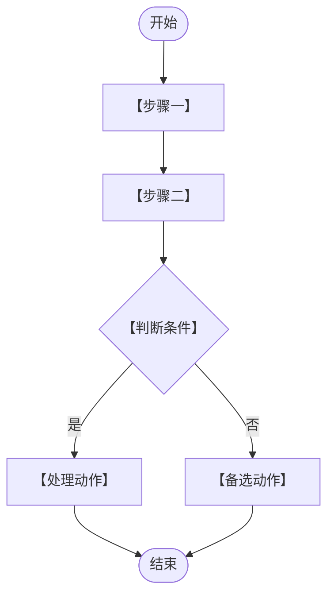

# 需求规约 - 【系统/项目名称】

> 版本：【版本号/初稿/评审稿】
>
> 状态：【当前状态，例如：基于原始PRD重组为软件需求规约格式】
>
> 日期：【YYYY-MM-DD】
>
> 编写原则：【说明主要依据、辅助依据和冲突处理原则。示例：以《【主依据文档】》为业务规则依据；《【辅助文档】》仅用于补充背景和表达方式。凡与主依据不一致的内容，不纳入本版本。】

---

# 简介

## 目的

本文档是【系统/项目名称】的软件需求规约（SRS），用于：

* 明确【核心业务对象】、【业务流转】、【状态边界】、【接口边界】和【追溯边界】等需求。
* 指导开发团队进行系统设计、接口设计和功能实现。
* 作为测试团队编写测试用例和验收用例的依据。
* 作为业务方、实施方、外部系统厂商确认需求范围的正式文档。

## 项目背景

### 为什么要做

【用 1-2 段说明当前业务痛点。建议先列出 2-3 个核心问题，再说明这些问题造成的影响。】

* **【问题一】**：【问题描述】
* **【问题二】**：【问题描述】

### 目标

建立【系统/项目名称】，实现【核心业务目标】。

| 模式/场景 | 适用场景 | 解决的问题 |
| --- | --- | --- |
| 【模式一】 | 【场景描述】 | 【解决的问题】 |
| 【模式二】 | 【场景描述】 | 【解决的问题】 |

最终目标：

* 【目标一】
* 【目标二】
* 【目标三】

### 范围与边界

#### 做什么（In Scope）

| 模块 | 说明 |
| --- | --- |
| F01 【功能模块名称】 | 【模块覆盖的生命周期/业务能力】 |
| F02 【功能模块名称】 | 【模块覆盖的生命周期/业务能力】 |
| I01-Ixx 软件接口 | 【需要对接的外部系统或平台】 |

#### 不做什么（Out of Scope）

| 约束 | 原因 |
| --- | --- |
| 【不做事项】 | 【不纳入本期/本系统的原因】 |

#### 边界条件

| 项目 | 说明 |
| --- | --- |
| 【边界项】 | 【约束说明】 |

#### 实现前提

| 前提 | 说明 |
| --- | --- |
| 【外部系统/组织/数据前提】 | 【需要满足的条件】 |

### 业务场景

#### 场景一：【场景名称】

**典型流程：**

【步骤一】 -> 【步骤二】 -> 【步骤三】 -> 【结束动作】

**适用情况：**

* 【适用条件一】
* 【适用条件二】

#### 场景二：【场景名称】

**典型流程：**

【步骤一】 -> 【步骤二】 -> 【步骤三】 -> 【结束动作】

**适用情况：**

* 【适用条件一】
* 【适用条件二】

## 定义、首字母缩写词和缩略语

| 术语 | 说明 |
| --- | --- |
| 【术语】 | 【定义】 |

## 概述

本文档包含以下章节：

* 简介：介绍文档目的、项目背景、范围边界、业务场景和术语定义。
* 整体说明：概述产品效果、功能模块、用户特征、约束和依赖关系。
* 具体需求：按功能模块描述参与者、前后置条件、事件流、业务规则、状态、关键属性和验收标准。
* 非功能与接口：描述可用性、可靠性、性能、安全性、设计约束、用户界面和软件接口边界。
* 待配套设计确认事项：列出需要在接口设计、权限设计、非功能设计或外部系统方案中继续确认的事项。

# 整体说明

## 产品总体效果

【用 1-2 段描述系统建成后的整体业务效果。重点写业务价值，不写实现细节。】

## 产品功能

| 功能模块 | 功能说明 |
| --- | --- |
| F01 【模块名称】 | 【一句话说明完整生命周期或核心能力】 |

## 用户特征

### 【用户分组/组织】

| 角色 | 职责 | 操作平台 | 技术水平 |
| --- | --- | --- | --- |
| 【角色】 | 【职责】 | 【平台/系统】 | 【技术水平】 |

## 约束

* 【业务约束】
* 【技术约束】
* 【阶段约束】
* 【组织/流程约束】

## 假设与依赖关系

* 假设【外部系统/组织】能够【提供能力/数据】
* 假设【前置治理/基础设施】已经完成

## 流程图

### 【核心流程名称】



# 具体需求

## 功能

### F01 【功能模块名称】

#### 参与者

【角色一】、【角色二】、【系统自动】、【外部系统】

#### 需求背景

【说明该模块解决什么业务问题、覆盖哪些业务线、与哪些对象或外部系统有关。建议写清楚核心业务对象及其生命周期。】

#### 前置条件

1. 【用户/系统状态前提】
2. 【数据/配置前提】
3. 【外部系统前提】

#### 后置条件

1. 【业务对象创建/变更结果】
2. 【状态变化结果】
3. 【通知/接口/归档结果】

#### 主事件流

**阶段一：【阶段名称】**

1. 【角色】在【入口】执行【动作】
2. 系统校验【数据/权限/状态】
3. 系统创建/更新【业务对象】，状态变为“【状态】”
4. 系统通知/同步【外部系统或角色】

**阶段二：【阶段名称】**

1. 【角色】查看【列表/详情】
2. 【角色】选择【通过/打回/提交/撤销】等操作
3. 系统根据操作更新状态并记录日志

#### 备选流

**A1. 【备选场景名称】** 在主流程步骤【编号】

1. 【触发条件】
2. 【系统处理】
3. 【最终状态/后续处理】

**A2. 【异常场景名称】** 在主流程步骤【编号】

1. 【异常条件】
2. 系统返回【错误提示】或标记为【异常状态】
3. 【人工/自动重试/重新提交】处理

#### 业务规则

1. 【必填、唯一性、权限、状态限制等规则】
2. 【跨系统数据来源规则】
3. 【锁定、撤销、打回、重试等流转规则】
4. 【本期不做或暂不支持的规则】

#### 状态

【业务对象】状态需按对象分层描述，不同对象的状态不得混用。若模块涉及多个对象，应分别说明【主业务对象状态】、【过程记录状态】、【异常状态】、【版本状态】或【推送状态】。

| 状态对象 | 状态 | 说明 | 触发动作 | 后续限制 |
| --- | --- | --- | --- | --- |
| 【对象一】 | 【状态一】 | 【业务含义】 | 【创建/提交/审核/接收/推送等动作】 | 【可继续/不可修改/可重试/终态等限制】 |
| 【对象一】 | 【状态二】 | 【业务含义】 | 【触发动作】 | 【后续限制】 |
| 【对象二】 | 【状态一】 | 【业务含义】 | 【触发动作】 | 【后续限制】 |

**状态流转：**

```plaintext
【初始状态】 -> 【处理中状态】 -> 【完成状态】
                     ↓
                 【异常/失败状态】
```

**状态写作要求：**

1. 状态名称应在全文保持一致，同一业务含义不得使用多个名称。
2. 状态变化必须由明确业务动作、接口回传或页面处理触发。
3. 如不提供人工改状态能力，应明确写出“不提供通用状态修改入口”。
4. 若存在撤回、作废、重传、重新发起、关闭等动作，应说明动作对象、前置状态、后置状态和历史记录保留方式。

#### 关键属性

* **辅助属性**：【用于选择、展示、辅助判断的数据】
* **输入属性**：
  * 【主实体】：【字段列表】
  * 【子实体/记录】：【字段列表】
* **显示属性**：
  * 【列表/页面】：【字段列表】

#### 验收标准

| 编号 | 验收点 | 验收方式 |
| --- | --- | --- |
| AC-Fxx-01 | 当【前置条件】满足时，【角色/外部系统】执行【动作】后，系统应【可观察结果】 | 页面检查/接口测试/数据库核对/日志核对 |
| AC-Fxx-02 | 当【异常条件】发生时，系统应【错误提示/状态保持/记录失败原因】 | 异常用例测试 |
| AC-Fxx-03 | 【权限或边界】不满足时，系统应阻止操作并保留原状态 | 权限测试/状态流转测试 |

**验收标准写作要求：**

1. 每条验收标准应包含前置条件、动作和可观察结果。
2. 避免使用“支持”“优化”“完善”等无法直接验证的表述，除非同时说明验证方式。
3. 涉及状态时，应写明被验证的是哪个业务对象的状态。
4. 涉及接口时，应写明调用方、接口能力和平台处理结果，不在需求规约中展开字段级设计。

#### 评级要求

高/中/低 - 【核心功能/重要功能/辅助功能】

#### AI/智能特征

无 / 【智能推荐、自动识别、辅助生成等能力说明】

---

## 可用性

### 响应式设计

【说明页面适配范围、嵌入方式、终端类型。】

### 操作简便性

* 【自动填充/默认值/流程提示】
* 【操作结果反馈】
* 【符合目标用户习惯的交互要求】

## 可靠性

### 系统可用性

* 系统可用性 ≥ 【指标】
* 计划内维护时间【是否计入统计】

### 数据持久化

* 【核心数据】需保存【期限】
* 【日志/审核记录】需完整保存，支持追溯

## 性能

当前业务需求【定义/不定义】具体性能数值。页面响应时间、接口响应时间、并发能力、文件上传大小、批量处理规模、推送吞吐等指标由【技术方案/接口设计阶段/非功能设计阶段】定义。

## 安全性

### 数据传输安全

* 所有API通信必须使用【协议】

### API访问控制

* 外部系统调用本系统API需进行【认证方式】

### 敏感信息保护

【说明脱敏、权限控制、审计要求。】

### 会话管理

* 用户会话由【系统】管理
* 会话超时时间由【系统/配置】控制

## 设计约束

### 架构约束

* 系统需接入【认证/基础平台】
* 前端页面需支持【嵌入/独立访问方式】
* 数据交互遵循【主动拉取/推送/异步回调等原则】
* 【关键业务对象】只能通过【页面/接口/系统事件】创建或变更，不提供【不支持的入口】

### 外部系统约束

* 权限、隐私、配置、接口安全、推送失败处理、系统故障处理等内容由对应外部系统、技术方案、配套设计或平台统一规范定义。
* 本需求规约只声明业务规则中需要哪些外部能力配合，不对外部依赖系统的实现重复定义。

## 接口

### 用户界面

系统提供以下主要页面或页面能力：

| 页面/能力 | 说明 | 使用角色 |
| --- | --- | --- |
| 【页面或能力名称】 | 【页面用途/承载的业务动作】 | 【角色】 |

### 软件接口

#### 接口总览

| 编号 | 接口能力 | 调用方 | 说明 |
| --- | --- | --- | --- |
| I01 | 【接口能力】 | 【外部系统/调用方】 | 【业务用途】 |

> **接口原则**：本章只定义平台对外接口能力清单和业务归属。具体字段、传输方式、安全控制、错误码、幂等策略、失败处理和调用时序由接口设计阶段定义。

#### 接口分类

| 分类 | 接口编号 | 调用方 | 说明 |
| --- | --- | --- | --- |
| 【分类一】 | I01-Ixx | 【调用方】 | 【接口能力范围】 |
| 【分类二】 | Ixx-Ixx | 【调用方】 | 【接口能力范围】 |

【平台主动推送/外部系统回调/页面人工处理】应在此处说明边界。若某类能力不属于外部系统主动调用接口，应明确写出。

#### 不提供的接口

| 不提供接口 | 说明 |
| --- | --- |
| 【不提供的接口能力】 | 【不提供原因或替代处理方式】 |
| 【不提供的接口能力】 | 【不提供原因或替代处理方式】 |

### 通信接口

* 平台对外接口的数据格式、协议、认证、安全控制和错误码由接口设计阶段定义。
* 附件、文件、媒体或大对象传输的格式、大小上限、加密限制和失败处理由接口设计阶段定义。
* 主动推送、异步通知或消息订阅的对接方式、失败处理和补充推送机制由【推送系统配套设计/消息系统设计】定义。

---

# 待配套设计确认事项

以下事项不在本需求规约中展开，但需要在配套设计或平台统一规范中确认：

1. 【推送/消息/异步通知】配套设计，包括失败处理、补充推送、运维和外部机构对接方式。
2. 【关键接口】的字段、错误码、幂等、安全规则和调用时序。
3. 【权限系统】中的具体权限点、角色、组织范围和数据范围。
4. 【隐私保护】中的脱敏规则、敏感信息搜索规则和导出规则。
5. 【非功能指标】中的页面响应时间、接口响应时间、并发能力、文件上传大小等指标。
6. 【外部系统依赖】中的故障处理、数据补偿和人工兜底方案。
